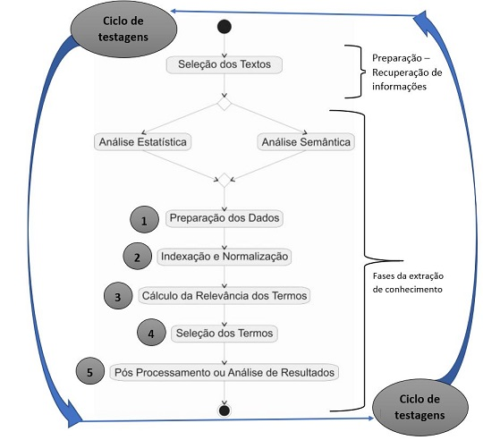

```{r setup, include=FALSE}
knitr::opts_chunk$set(echo = FALSE)
setwd("~/Text Mining")
```

## Contexto do Estudo

O estudo é aplicado no âmbito do Projeto HF2 para obter os seguintes resultados:

- Formular indicadores de coerência de senso de unidade das equipes de Libra, a partir de comunicações e story telling descritos no projeto,

- Verificar a aderência dos indicadores do framework de análise do projeto em relação à literatura e aos relatórios de acidentes de plataformas de óleo e gás.

- Extrair indicadores que permitirão mapear as trilhas das falhas em fatores humanos que podem culminar em eventos catastróficos no âmbito das plataformas de óleo e gás.

## O que é Text Mining?

A Mineração de texto pode ser considerada como sinônimo de descoberta de conhecimento em textos.

Estes textos  que podem ser e-mails; arquivos em diferentes formatos (pdf, doc, txt, por exemplo); páginas Web; campos textuais em bancos de dados; textos eletrônicos digitalizados a partir de papéis, etc.

**Contribuições desta área:**

- seleção de documentos, 

- classificação de documentos,e 

- qualificação de documentos. 
  
## Etapas do TM




## Análise semântica

Técnicas fundamentadas em Processamento de Linguagem Natural (PNL), que avaliam a seqüência dos termos no contexto dos textos. Necessita dos seguintes tipos de conhecimento:

- morfológico (estrutura, forma e inflexões das palavras), 

- sintático (listas de palavras (tokens), termos e sequencias),

- semântico (significado independente do contexto), 

- pragmático (significado dependente do contexto), 

- do discurso (rede de significados),  e 

- do mundo (conhecimento geral do domínio).

## Análise estatística

Analisa a importância de um termo pelo número de vezes que este aparece no texto. Basicamente, seu processo envolve aprendizado estatístico a partir de dados, que normalmente inclui as seguintes etapas

1 - codificação dos dados: análise feita com indicações de especialistas (exemplo da análise do documento Macondo feita pelo Aran), aliada com critérios objetivos de análise;

2 - estimativa dos dados:  procura por um modelo adequado de um método de estimativa. Estou trabalhando na fase de testes desta etapa; e

3 - modelos de representação de documentos: também conhecida como bag of word. 

## 1.Preparação dos dados

O objetivo desta etapa é identificar similaridades em função da morfologia ou do significado dos termos nos texto.

Técnicas utilizadas:

- Modelo Booleano (and, or, not),

- Modelo Espaço-Vetorial (representado por um vetor de termos com um valor do grau de importância (peso) no documento), 

- Modelo Probabilístico: Método Bayesiano para verificar por exemplo a relevância do Framework (x) em comparação aos relatórios de acidentes e artigos encontrados (y);

## 1.Preparação dos dados (continuação)

- Modelo Difuso (Fuzzy): vetores de palavras com graus de relevância calculada a partir de valores intermediários que indicam o quanto determinado objeto pertence ou não ao conjunto (trata incertezas e imprecisões).

- Modelo de Busca de Padrões(pattern search): busca de strings, utilizado quando a quantidade de documentos é pequena

- Modelo Aglomerados (Clusters): técnicas de Agrupamento(ou Clustering) de documentos. 

Após a escolha do modelo mais apropriado, o próximo passo é a Indexação e Normalização dos textos.

## 2.Indexação e Normalização

Quando a indexação é realizada manualmente, a pessoa encarregada de fazê-la deve analisar o conteúdo de cada documento e identificar palavras-chave que o caracterizem. 

Quando a geração automática de índices é feita deve produzir o mesmo resultado, isto é, produzir os termos de índice. 

Na indexação automática, as fases realizadas são:

- identificação de termos simples ou compostos (Word-phrase formation);

- remoção de stopwords (palavras irrelevantes); 

- normalização morfológica (stemming).

## 3.Cálculo da Relevância 

O cálculo de relevância de uma palavra ou um termo composto em em um texto pode basear-se na freqüência, na análise estrutural do documento ou na sua posição sintática de uma palavra. 

As análises baseadas em freqüência costumam ser as mais utilizadas por serem mais simples. Outras técnicas mais complexas, como processamento de linguagem natural, por exemplo é fornecido um peso á palavra ou termo

## 3.Cálculo da Relevância (continuação)

Algumas fórmulas para cálculo do peso são:

- freqüência absoluta:quantidade de vezes que um termo aparece em um documento, 

- freqüência relativa $Frel(x) = Fabs(x) / N$, 

- freqüência inversa de documentos $Pesotd = Freqtd / DocFreqtd$ onde,

$Pesotd$: é o grau de relação entre o termo t e o documento d; 

$Freqtd$: número de vezes que o termo t aparece no documento d; 

$DocFreqtd$: número de documentos que o termo t aparece.

## 4.Seleção de Termos 

Pode ser baseada no peso dos termos ou na sua posição sintática em relação ao texto. As principais técnicas de seleção de termos são: 

- filtragem baseada no peso do termo: consiste em eliminar todos os termos abaixo de um limiar(threshold) estabelecido pelo usuário ou pela aplicação, 

- seleção baseada no peso do termo:  denominada truncagem, seleciona um número máximo de características (geralmente 50) a serem utilizadas para um documento e todas as outras são eliminadas, 

## 4.Seleção de Termos - co-ocorrência (continuação)

- seleção por análise de co-ocorrência: utilizada para verificar qual o grau de relacionamento entre textos. Quanto maior o número de termos iguais entre ambos, maior tende a ser seu relacionamento semântico, 

1. Fórmula que analisa o grau de relação entre a palavra e o documento que a contém. $dij = tfij × log (N / dfj)$, onde:

$dij$: representa o valor combinado da palavra j no documento i; 

$tfij$: representa a freqüência da palavra j no documento i;

$N$: representa o número total de documentos considerados; 

$dfj$: freqüência inversa de documentos. 

## 4.Seleção de Termos - co-ocorrência (continuação)

2. Fórmula que analisa co-ocorrência das palavras nos textos (baseado nos resultados gerados pela fórmula anterior).

$Co-ocorrência = n somatorio P i=1 dijk / n somatorio P i=1 dij$

para

$dijk = tfijk × log N / dfjk$, onde: 

$tfijk$: representa o número de ocorrências de ambas as palavras j e k no documento i (o menor número de ocorrências entre as palavras deve ser escolhido); 

$dfjk$: representa o número de documentos (de uma coleção N) no qual as palavras j e k ocorrem ao mesmo tempo.

Duas palavras podem estar relacionadas entre si em mais de um contexto, portanto, em cada contexto deve existir um grau diferente de relação

## 4.Seleção de Termos (continuação)

- seleção por Latent Semantic Indexing: utilizada para reduzir o número de dimensões utilizadas pelo modelo espaço-vetorial para transformar os vetores de documentos originais em um espaço dimensional pequeno e significativo, fazendo uma análise da estrutura co-relacional de termos na coleção de documentos, e

- seleção por análise de linguagem natural: 

**técnicas sintática:** a partir de um dicionário ou gramática bem definida para um domínio específico (um lexicon, por exemplo),e 

**técnicas de semântica:** identifica as palavras mais importantes de um documento que são marcadas por um especialista de domínio. 

## 5. Análise de Resultados - Indicadores 

Há diversas técnicas para analisar os resultados. Neste estudo descreveremos sobre a Análise Semântica (LSA) é um método para extrair representações dos significados semânticos de palavras em um contexto, obtidos por cálculos estatísticos aplicados a um conjunto numeroso de textos.

A suposição é que palavras que tendem a ocorrer juntas dentro de um mesmo documento (parágrafos, frases, textos, etc) são consideradas como representativas de similaridade semântica. 

Na prática este método é utilizado para a construção de um espaço semântico, onde não só palavras, mas, sentenças, parágrafos, textos ou qualquer outro conjunto de palavras, podem ser representados por vetores.


## 5. Análise de Resultados - Indicadores (continuação)

A partir desse vetores é construída uma matriz com as linhas correspondendo às palavras selecionadas e as colunas correspondendo aos textos da coleção.

Para cada entrada desta matriz é atribuido o valor da frequência absoluta de cada palavra em cada texto, que é então transformada em seu logaritmo. 

O próximo passo é a aplicação da técnica Decomposição de Valor Singular que cria uma nova matriz a partir do produto destas três matrizes. O intuito é localizar a informação semântica essencial dos textos, para obter um espaço semântico condensado que representa as melhores relações entre as palavras e documentos. 

## 5. Análise de Resultados - Indicadores (continuação II)

Usa-se a fórmula:

$M = T x S x D$, onde:

$T$ = matriz de vetores singulares à esquerda;

$S$ = matriz diagonal de valores singulares em ordem decrescente;

$D$ = matriz de vetores singulares à direita.


## 5. Análise de Resultados - Indicadores (continuação III)

A dimensão destas matrizes é reduzida, eliminando as linhas e colunas correspondentes aos menores valores singulares da matriz $S$, assim como as colunas da matriz $T$ e linhas da matriz $D$ correspondentes.

A proximidade entre duas palavras é obtida calculando-se o cosseno do ângulo entre seus vetores (linhas da matriz)correspondentes. Quanto maior o cosseno do ângulo entre os vetores de duas palavras, maior a proximidade entre elas.

## 5. Análise de Resultados - Mapa de Falhas

Finalmente, o vetor de representação de um dado conjunto de palavras, como parágrafos ou textos, no espaço, pode ser obtido através do centróide (média) de todos os vetores das palavras deste conjunto. Permitindo, assim a obtenção da proximidade entre uma palavra e um texto, e até mesmo entre dois textos.
O mapa de falhas poderá ser utilizado para compreensão dos conhecimentos obtidos dos textos, para auxiliar na tomada de decisões.

Assim, com base nos indicadores dos textos, os melhores textos são selecionados para compor o mapa de falhas, o qual será feito por um humano. A partir deste mapa será possivel constuir a trilha de falhas nas interfaces de fatores humanos:homem-homem, homem-máquina, homem-ambiente, etc.

## Onde estamos no momento?

Primeiros testes realizados: 

- Análise humana do relatório Macondo - Aran

- Base de termos retirada dos relatórios de acidentes - Tite

- Três Analises Data mining - Viviane:

Os teste estão nesses endereços: 

1. [Text mining: Accidents Report Text Mining Analysis](https://rpubs.com/vivianesch/599127)

2. [Text mining: The Human Factors Project Framework](https://rpubs.com/vivianesch/596134)

3. [Knowledge Discovery in Text (KDT): The Gulf Oil Disaster Report Case](https://rpubs.com/vivianesch/589395)

## Proximos passos

1. Construir árvore de falhas

2. Construir primeiro protótipo de análises Data Mining para o projeto


```{r eruptions, eval=FALSE, include=FALSE}

.Par_net = function(z) {
  par_Palavras %>%
  filter(n >= z) %>%
  graph_from_data_frame() %>%
  ggraph(layout = "fr") +
  geom_edge_link(aes(edge_alpha = n, edge_width = n)) +
  geom_node_point(color = "darkslategray4", size = 4) +
  geom_node_text(color = "red", aes(label = name), vjust = 1.8, size=3) +
  labs(title= "Word graph  - The Gulf Oil Disaster Report",
       subtitle = paste("Pairwise analysis words >= ", z, " frequency",
       x = "", y = ""))
}


inputPanel(
  selectInput("n_breaks", label = "Número de palavras:",
              choices = c(10, 20, 35, 50), selected = 20),
  
  sliderInput("bw_adjust", label = "Bandwidth adjustment:",
              min = 0.2, max = 2, value = 1, step = 0.2)
)

renderPlot({
  hist(faithful$eruptions, probability = TRUE, breaks = as.numeric(input$n_breaks),
       xlab = "Duration (minutes)", main = "Geyser eruption duration")
  
  dens <- density(faithful$eruptions, adjust = input$bw_adjust)
  lines(dens, col = "blue")
})
```


## Referências

Abelson, Hal. 2008. “Foreword.” In Essentials of Programming Languages, 3rd Edition, 3rd ed. The MIT Press.

Arnold, Taylor B. 2016. cleanNLP: A Tidy Data Model for Natural Language Processing. https://cran.r-project.org/package=cleanNLP.

Arnold, Taylor, and Lauren Tilton. 2016. coreNLP: Wrappers Around Stanford Corenlp Tools. https://cran.r-project.org/package=coreNLP.

Benoit, Kenneth, and Paul Nulty. 2016. quanteda: Quantitative Analysis of Textual Data. https://CRAN.R-project.org/package=quanteda.

Feinerer, Ingo, Kurt Hornik, and David Meyer. 2008. “Text Mining Infrastructure in R.” Journal of Statistical Software 25 (5): 1–54. http://www.jstatsoft.org/v25/i05/.

Henry, Lionel, and Hadley Wickham. 2018. Purrr: Functional Programming Tools. https://CRAN.R-project.org/package=purrr.

Loughran, Tim, and Bill McDonald. 2011. “When Is a Liability Not a Liability? Textual Analysis, Dictionaries, and 10-Ks.” The Journal of Finance 66 (1). Blackwell Publishing Inc: 35–65. https://doi.org/10.1111/j.1540-6261.2010.01625.x.

Mimno, David. 2013. mallet: A Wrapper Around the Java Machine Learning Tool Mallet. https://cran.r-project.org/package=mallet.

Mullen, Lincoln. 2016. tokenizers: A Consistent Interface to Tokenize Natural Language Text. https://CRAN.R-project.org/package=tokenizers.

Pedersen, Thomas Lin. 2017. ggraph: An Implementation of Grammar of Graphics for Graphs and Networks. https://cran.r-project.org/package=ggraph.

Rinker, Tyler W. 2017. sentimentr: Calculate Text Polarity Sentiment. Buffalo, New York: University at Buffalo/SUNY. http://github.com/trinker/sentimentr.

Robinson, David. 2016. gutenbergr: Download and Process Public Domain Works from Project Gutenberg. https://cran.rstudio.com/package=gutenbergr.

———. 2017. broom: Convert Statistical Analysis Objects into Tidy Data Frames. https://CRAN.R-project.org/package=broom.

Silge, Julia. 2016. janeaustenr: Jane Austen’s Complete Novels. https://CRAN.R-project.org/package=janeaustenr.

Silge, Julia, and David Robinson. 2016. “tidytext: Text Mining and Analysis Using Tidy Data Principles in R.” JOSS 1 (3). The Open Journal. https://doi.org/10.21105/joss.00037.

Wickham, Hadley. 2007. “Reshaping Data with the reshape Package.” Journal of Statistical Software 21 (12): 1–20. http://www.jstatsoft.org/v21/i12/.

———. 2009. ggplot2: Elegant Graphics for Data Analysis. Springer-Verlag New York. http://ggplot2.org.

———. 2014. “Tidy Data.” Journal of Statistical Software 59 (1): 1–23. https://doi.org/10.18637/jss.v059.i10.

———. 2016. tidyr: Easily Tidy Data with ‘Spread()‘ and ‘Gather()‘ Functions. https://CRAN.R-project.org/package=tidyr.

Wickham, Hadley, and Romain Francois. 2016. dplyr: A Grammar of Data Manipulation. https://CRAN.R-project.org/package=dplyr.

E. A. M. Morais A. P. L. Ambrósio. Mineração de Textos. Technical Report - INF_005/07 - Relatório Técnico,Dezembro. Instituto de Informática Universidade Federal de Goiás: 2007. 

