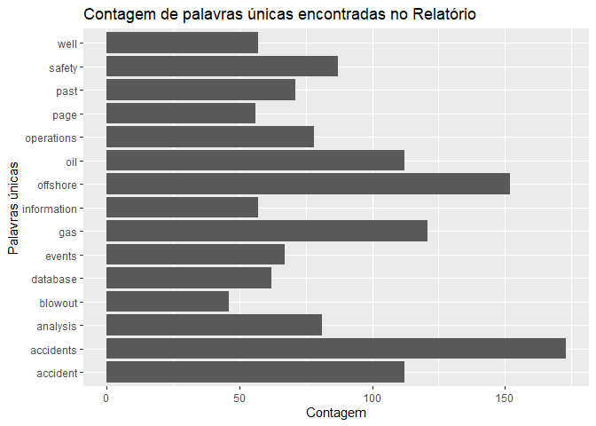
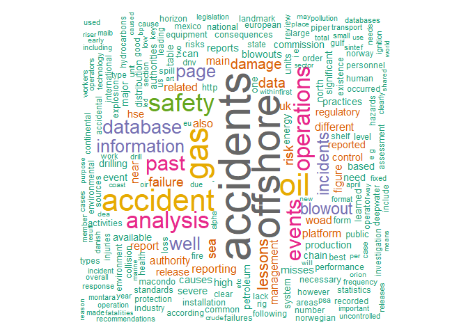
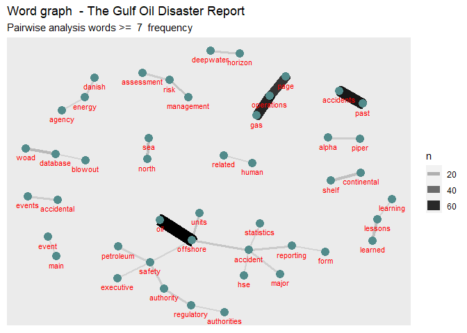
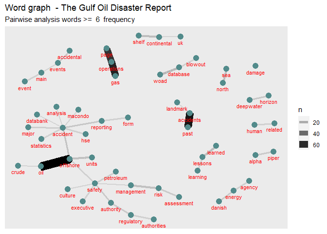
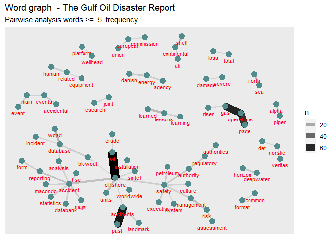
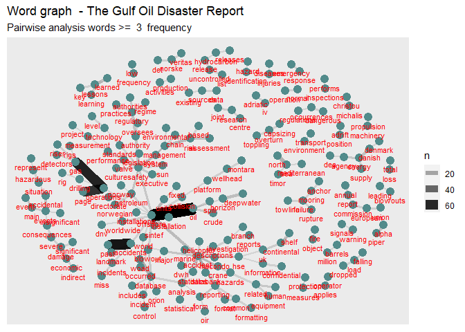
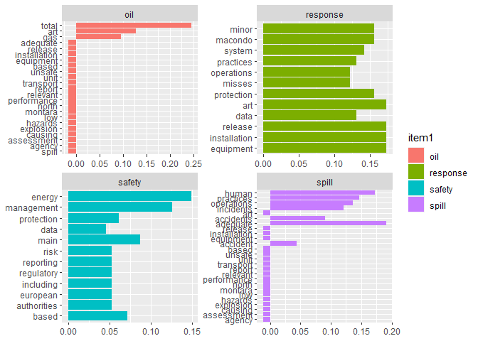
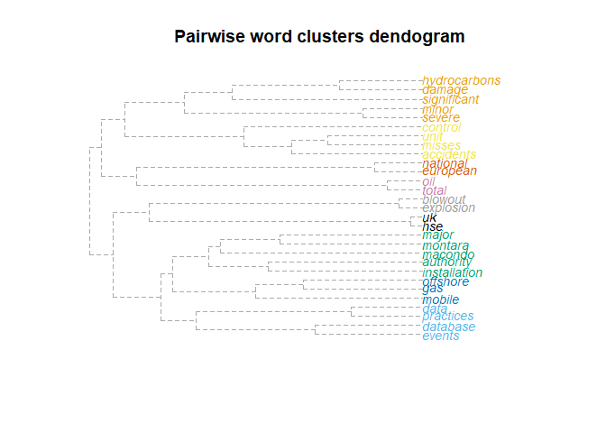
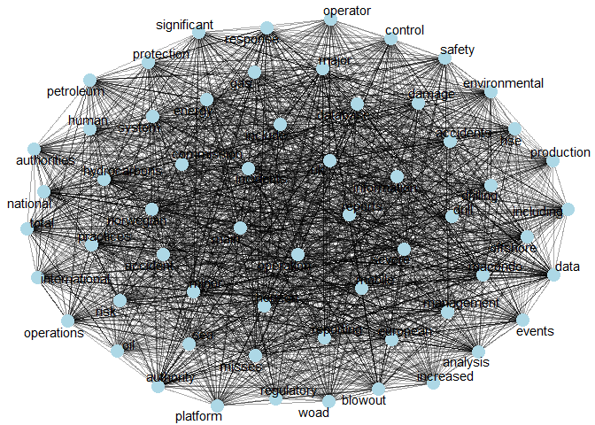

# Context of study

Accidents Report Text Mining Analysis

**Falar do contexto do projeto e como isso ajuda na formação dos indicadores**


# Study goal

The purpuse of this study is to discover knowledge about the causes of disasters in the oil and gas industries, in order to support the establishment of indicators in the Human Factors II Project (Libra Consortium, Brazil, 2007 - 2022).

## Research question

**Which indicators we can extract from The Gulf Oil Disaster Report?** 

# Methods, Materials and Techniques

 **Descrever método ao finalizar as analises**

## Materials

Report of National Commission on the BP Deepwater Horizon Oil Spill and Offshore Drilling (NCDWHSOD). Deep Water: The Gulf Oil Disaster and the Future of Offshore Drilling. Report to the President. January 2011 Cover Photo: © Steadfast TV. ISBN: 978-0-16-087371-3. https://www.govinfo.gov/content/pkg/GPO-OILCOMMISSION/pdf/GPO-OILCOMMISSION.pdf

## Techniques

1.Knowledge Discovery in Text techniques using n-grams analisys:
- Unigrams
- Bigrams
- Triograms

2.

**R Packages**


```r
# Pacotes e Funções
library(tidyverse) # Manipulacao eficiente de dados
library(tidytext) # Manipulacao eficiente de texto
library(textreadr) # Leitura de pdf para texto
library(tm) # Pacote de mineracao de texto com stopwords 
library(wordcloud) # Grafico nuvem de palavras
library(igraph)
library(ggraph)
library(ggplot2)
library(dplyr)
library(pdftools)
library(RRPP)
```

**Text Normalization Function**


```r
# Função para normalizar texto
NormalizaParaTextMining <- function(texto){
 
  # Normaliza texto
  texto %>% 
    chartr(
      old = "áéíóúÁÉÍÓÚýÝàèìòùÀÈÌÒÙâêîôûÂÊÎÔÛãõÃÕñÑäëïöüÄËÏÖÜÿçÇ´`^~¨:.!?&$@#0123456789",
      new = "aeiouAEIOUyYaeiouAEIOUaeiouAEIOUaoAOnNaeiouAEIOUycC                       ",
      x = .) %>% # Elimina acentos e caracteres desnecessarios
    str_squish() %>% # Elimina espacos excedentes 
    tolower() %>% # Converte para minusculo
    return() # Retorno da funcao
}
```

**Text Cleaning Function**


```r
# Função para Palavras que podem se retiradas

# Lista de palavras para remover
palavrasRemover <- c(stopwords(kind = "en"), letters) %>%
  as.tibble() %>% 
  rename(Palavra = value) %>% 
  mutate(Palavra = NormalizaParaTextMining(Palavra))
```

```
## Warning: `as.tibble()` is deprecated, use `as_tibble()` (but mind the new semantics).
## This warning is displayed once per session.
```

**Read PDF**


```r
# Arquivo pdf
# Arquivo pdf
arquivoPdf <- "~/Text Mining/offshore-accident.pdf"
```

**Tidynd text**


```r
TidyT <- arquivoPdf %>% 
  read_pdf() %>% 
  as.tibble() %>% 
  select(text) 
```
  
# Unigrams analysis

**Cleaning useless words for single word analysis**


```r
  CleanW <- TidyT  %>% 
  unnest_tokens(Palavra, text) %>% 
  mutate(Palavra = NormalizaParaTextMining(Palavra)) %>% 
  anti_join(palavrasRemover)
```

```
## Joining, by = "Palavra"
```
  
**Counting single words**


```r
  frequenciaPalavras <-  CleanW  %>% 
  count(Palavra, sort = TRUE) %>% 
  filter(Palavra != "") %>%
  arrange(desc(n)) 


# Visualiza frequencia de palavras
DT::datatable(frequenciaPalavras)
```

<!--html_preserve--><div id="htmlwidget-76e81ced52ed17344228" style="width:100%;height:auto;" class="datatables html-widget"></div>
<script type="application/json" data-for="htmlwidget-76e81ced52ed17344228">{"x":{"filter":"none","data":[["1","2","3","4","5","6","7","8","9","10","11","12","13","14","15","16","17","18","19","20","21","22","23","24","25","26","27","28","29","30","31","32","33","34","35","36","37","38","39","40","41","42","43","44","45","46","47","48","49","50","51","52","53","54","55","56","57","58","59","60","61","62","63","64","65","66","67","68","69","70","71","72","73","74","75","76","77","78","79","80","81","82","83","84","85","86","87","88","89","90","91","92","93","94","95","96","97","98","99","100","101","102","103","104","105","106","107","108","109","110","111","112","113","114","115","116","117","118","119","120","121","122","123","124","125","126","127","128","129","130","131","132","133","134","135","136","137","138","139","140","141","142","143","144","145","146","147","148","149","150","151","152","153","154","155","156","157","158","159","160","161","162","163","164","165","166","167","168","169","170","171","172","173","174","175","176","177","178","179","180","181","182","183","184","185","186","187","188","189","190","191","192","193","194","195","196","197","198","199","200","201","202","203","204","205","206","207","208","209","210","211","212","213","214","215","216","217","218","219","220","221","222","223","224","225","226","227","228","229","230","231","232","233","234","235","236","237","238","239","240","241","242","243","244","245","246","247","248","249","250","251","252","253","254","255","256","257","258","259","260","261","262","263","264","265","266","267","268","269","270","271","272","273","274","275","276","277","278","279","280","281","282","283","284","285","286","287","288","289","290","291","292","293","294","295","296","297","298","299","300","301","302","303","304","305","306","307","308","309","310","311","312","313","314","315","316","317","318","319","320","321","322","323","324","325","326","327","328","329","330","331","332","333","334","335","336","337","338","339","340","341","342","343","344","345","346","347","348","349","350","351","352","353","354","355","356","357","358","359","360","361","362","363","364","365","366","367","368","369","370","371","372","373","374","375","376","377","378","379","380","381","382","383","384","385","386","387","388","389","390","391","392","393","394","395","396","397","398","399","400","401","402","403","404","405","406","407","408","409","410","411","412","413","414","415","416","417","418","419","420","421","422","423","424","425","426","427","428","429","430","431","432","433","434","435","436","437","438","439","440","441","442","443","444","445","446","447","448","449","450","451","452","453","454","455","456","457","458","459","460","461","462","463","464","465","466","467","468","469","470","471","472","473","474","475","476","477","478","479","480","481","482","483","484","485","486","487","488","489","490","491","492","493","494","495","496","497","498","499","500","501","502","503","504","505","506","507","508","509","510","511","512","513","514","515","516","517","518","519","520","521","522","523","524","525","526","527","528","529","530","531","532","533","534","535","536","537","538","539","540","541","542","543","544","545","546","547","548","549","550","551","552","553","554","555","556","557","558","559","560","561","562","563","564","565","566","567","568","569","570","571","572","573","574","575","576","577","578","579","580","581","582","583","584","585","586","587","588","589","590","591","592","593","594","595","596","597","598","599","600","601","602","603","604","605","606","607","608","609","610","611","612","613","614","615","616","617","618","619","620","621","622","623","624","625","626","627","628","629","630","631","632","633","634","635","636","637","638","639","640","641","642","643","644","645","646","647","648","649","650","651","652","653","654","655","656","657","658","659","660","661","662","663","664","665","666","667","668","669","670","671","672","673","674","675","676","677","678","679","680","681","682","683","684","685","686","687","688","689","690","691","692","693","694","695","696","697","698","699","700","701","702","703","704","705","706","707","708","709","710","711","712","713","714","715","716","717","718","719","720","721","722","723","724","725","726","727","728","729","730","731","732","733","734","735","736","737","738","739","740","741","742","743","744","745","746","747","748","749","750","751","752","753","754","755","756","757","758","759","760","761","762","763","764","765","766","767","768","769","770","771","772","773","774","775","776","777","778","779","780","781","782","783","784","785","786","787","788","789","790","791","792","793","794","795","796","797","798","799","800","801","802","803","804","805","806","807","808","809","810","811","812","813","814","815","816","817","818","819","820","821","822","823","824","825","826","827","828","829","830","831","832","833","834","835","836","837","838","839","840","841","842","843","844","845","846","847","848","849","850","851","852","853","854","855","856","857","858","859","860","861","862","863","864","865","866","867","868","869","870","871","872","873","874","875","876","877","878","879","880","881","882","883","884","885","886","887","888","889","890","891","892","893","894","895","896","897","898","899","900","901","902","903","904","905","906","907","908","909","910","911","912","913","914","915","916","917","918","919","920","921","922","923","924","925","926","927","928","929","930","931","932","933","934","935","936","937","938","939","940","941","942","943","944","945","946","947","948","949","950","951","952","953","954","955","956","957","958","959","960","961","962","963","964","965","966","967","968","969","970","971","972","973","974","975","976","977","978","979","980","981","982","983","984","985","986","987","988","989","990","991","992","993","994","995","996","997","998","999","1000","1001","1002","1003","1004","1005","1006","1007","1008","1009","1010","1011","1012","1013","1014","1015","1016","1017","1018","1019","1020","1021","1022","1023","1024","1025","1026","1027","1028","1029","1030","1031","1032","1033","1034","1035","1036","1037","1038","1039","1040","1041","1042","1043","1044","1045","1046","1047","1048","1049","1050","1051","1052","1053","1054","1055","1056","1057","1058","1059","1060","1061","1062","1063","1064","1065","1066","1067","1068","1069","1070","1071","1072","1073","1074","1075","1076","1077","1078","1079","1080","1081","1082","1083","1084","1085","1086","1087","1088","1089","1090","1091","1092","1093","1094","1095","1096","1097","1098","1099","1100","1101","1102","1103","1104","1105","1106","1107","1108","1109","1110","1111","1112","1113","1114","1115","1116","1117","1118","1119","1120","1121","1122","1123","1124","1125","1126","1127","1128","1129","1130","1131","1132","1133","1134","1135","1136","1137","1138","1139","1140","1141","1142","1143","1144","1145","1146","1147","1148","1149","1150","1151","1152","1153","1154","1155","1156","1157","1158","1159","1160","1161","1162","1163","1164","1165","1166","1167","1168","1169","1170","1171","1172","1173","1174","1175","1176","1177","1178","1179","1180","1181","1182","1183","1184","1185","1186","1187","1188","1189","1190","1191","1192","1193","1194","1195","1196","1197","1198","1199","1200","1201","1202","1203","1204","1205","1206","1207","1208","1209","1210","1211","1212","1213","1214","1215","1216","1217","1218","1219","1220","1221","1222","1223","1224","1225","1226","1227","1228","1229","1230","1231","1232","1233","1234","1235","1236","1237","1238","1239","1240","1241","1242","1243","1244","1245","1246","1247","1248","1249","1250","1251","1252","1253","1254","1255","1256","1257","1258","1259","1260","1261","1262","1263","1264","1265","1266","1267","1268","1269","1270","1271","1272","1273","1274","1275","1276","1277","1278","1279","1280","1281","1282","1283","1284","1285","1286","1287","1288","1289","1290","1291","1292","1293","1294","1295","1296","1297","1298","1299","1300","1301","1302","1303","1304","1305","1306","1307","1308","1309","1310","1311","1312","1313","1314","1315","1316","1317","1318","1319","1320","1321","1322","1323","1324","1325","1326","1327","1328","1329","1330","1331","1332","1333","1334","1335","1336","1337","1338","1339","1340","1341","1342","1343","1344","1345","1346","1347","1348","1349","1350","1351","1352","1353","1354","1355","1356","1357","1358","1359","1360","1361","1362","1363","1364","1365","1366","1367","1368","1369","1370","1371","1372","1373","1374","1375","1376","1377","1378","1379","1380","1381","1382","1383","1384","1385","1386","1387","1388","1389","1390","1391","1392","1393","1394","1395","1396","1397","1398","1399","1400","1401","1402","1403","1404","1405","1406","1407","1408","1409","1410","1411","1412","1413","1414","1415","1416","1417","1418","1419","1420","1421","1422","1423","1424","1425","1426","1427","1428","1429","1430","1431","1432","1433","1434","1435","1436","1437","1438","1439","1440","1441","1442","1443","1444","1445","1446","1447","1448","1449","1450","1451","1452","1453","1454","1455","1456","1457","1458","1459","1460","1461","1462","1463","1464","1465","1466","1467","1468","1469","1470","1471","1472","1473","1474","1475","1476","1477","1478","1479","1480","1481","1482","1483","1484","1485","1486","1487","1488","1489","1490","1491","1492","1493","1494","1495","1496","1497","1498","1499","1500","1501","1502","1503","1504","1505","1506","1507","1508","1509","1510","1511","1512","1513","1514","1515","1516","1517","1518","1519","1520","1521","1522","1523","1524","1525","1526","1527","1528","1529","1530","1531","1532","1533","1534","1535","1536","1537","1538","1539","1540","1541","1542","1543","1544","1545","1546","1547","1548","1549","1550","1551","1552","1553","1554","1555","1556","1557","1558","1559","1560","1561","1562","1563","1564","1565","1566","1567","1568","1569","1570","1571","1572","1573","1574","1575","1576","1577","1578","1579","1580","1581","1582","1583","1584","1585","1586","1587","1588","1589","1590","1591","1592","1593","1594","1595","1596","1597","1598","1599","1600","1601","1602","1603","1604","1605","1606","1607","1608","1609","1610","1611","1612","1613","1614","1615","1616","1617","1618","1619","1620","1621","1622","1623","1624","1625","1626","1627","1628","1629","1630","1631","1632","1633","1634","1635","1636","1637","1638","1639","1640","1641","1642","1643","1644","1645","1646","1647","1648","1649","1650","1651","1652","1653","1654","1655","1656","1657","1658","1659","1660","1661","1662","1663","1664","1665","1666","1667","1668","1669","1670","1671","1672","1673","1674","1675","1676","1677","1678","1679","1680","1681","1682","1683","1684","1685","1686","1687","1688","1689","1690","1691","1692","1693","1694","1695","1696","1697","1698","1699","1700","1701","1702","1703","1704","1705","1706","1707","1708","1709","1710","1711","1712","1713","1714","1715","1716","1717","1718","1719","1720","1721","1722","1723","1724","1725","1726","1727","1728","1729","1730","1731","1732","1733","1734","1735","1736","1737","1738","1739","1740","1741","1742","1743","1744","1745","1746","1747","1748","1749","1750","1751","1752","1753","1754","1755","1756","1757","1758","1759","1760","1761","1762","1763","1764","1765","1766","1767","1768","1769","1770","1771","1772","1773","1774","1775","1776","1777","1778","1779","1780","1781","1782","1783","1784","1785","1786","1787","1788","1789","1790","1791","1792","1793","1794","1795","1796","1797","1798","1799","1800","1801","1802","1803","1804","1805","1806","1807","1808","1809","1810","1811","1812","1813","1814","1815","1816","1817","1818","1819","1820","1821","1822","1823","1824","1825","1826","1827","1828","1829","1830","1831","1832","1833","1834","1835","1836","1837","1838","1839","1840","1841","1842","1843","1844","1845","1846","1847","1848","1849","1850","1851","1852","1853","1854","1855","1856","1857","1858","1859","1860","1861","1862","1863","1864","1865","1866","1867","1868","1869","1870","1871","1872","1873","1874","1875","1876","1877","1878","1879","1880","1881","1882","1883","1884","1885","1886","1887","1888","1889","1890","1891","1892","1893","1894","1895","1896","1897","1898","1899","1900","1901","1902","1903","1904","1905","1906","1907","1908","1909","1910","1911","1912","1913","1914","1915","1916","1917","1918","1919","1920","1921","1922","1923","1924","1925","1926","1927","1928","1929","1930","1931","1932","1933","1934","1935","1936","1937","1938","1939","1940","1941","1942","1943","1944","1945","1946","1947","1948","1949","1950","1951","1952","1953","1954","1955","1956","1957","1958","1959","1960","1961","1962","1963","1964","1965","1966","1967","1968","1969","1970","1971","1972","1973","1974","1975","1976","1977","1978","1979","1980","1981","1982","1983","1984","1985","1986","1987","1988","1989","1990","1991","1992","1993","1994","1995","1996","1997","1998","1999","2000","2001","2002","2003","2004","2005","2006","2007","2008","2009","2010","2011","2012","2013","2014","2015","2016","2017","2018","2019","2020","2021","2022","2023","2024","2025","2026","2027","2028","2029","2030","2031","2032","2033","2034","2035","2036","2037","2038","2039","2040","2041","2042","2043","2044","2045","2046","2047","2048","2049","2050","2051","2052","2053","2054","2055","2056","2057","2058","2059","2060","2061","2062","2063","2064","2065","2066","2067","2068","2069","2070","2071","2072","2073","2074","2075","2076","2077","2078","2079","2080","2081","2082","2083","2084","2085","2086","2087"],["accidents","offshore","gas","accident","oil","safety","analysis","operations","past","events","database","information","well","page","blowout","incidents","lessons","damage","data","failure","risk","sea","near","also","related","reporting","uk","woad","figure","management","authority","platform","different","main","report","control","regulatory","release","reported","hse","blowouts","causes","drilling","energy","high","misses","petroleum","reports","chain","north","units","authorities","distribution","event","need","production","available","can","learned","practices","severe","significant","table","based","commission","major","one","system","consequences","existence","explosion","fire","http","installation","level","loss","necessary","operator","order","risks","sources","collision","equipment","european","health","macondo","performance","activities","best","common","deepwater","form","national","public","standards","accidental","clear","continental","environmental","following","injuries","occurred","protection","shelf","spill","state","according","assessment","dnv","environment","failures","hazards","however","human","hydrocarbons","i e","include","international","investigation","landmark","large","mexico","number","personnel","review","rig","us","areas","good","gulf","horizon","industry","lack","leading","norway","norwegian","piper","recorded","statistics","type","types","april","case","fixed","format","frequency","incident","including","legislation","operation","operators","pollution","recommendations","response","sintef","technology","total","transport","uncontrolled","work","year",",","alpha","cases","cause","clearly","danish","databases","developed","due","e g","emergency","eu","first","important","increased","low","maib","montara","overall","prepared","procedures","psa","releases","two","used","workers","agency","appropriate","countries","drill","especially","executive","fatigue","followed","hazardous","hydrocarbon","ignition","included","key","made","mainly","member","miss","mobile","needs","oir","present","project","records","regulations","research","section","sharing","similar","small","unit","worldwide","annual","art","categories","caused","coast","contains","crude","culture","databank","dea","early","etc","forms","helicopter","insignificant","inspections","installations","learning","marine","means","minor","new","ogp","orion","place","presented","pressure","prevention","purpose","reason","regulators","relevant","security","situation","spills","states","supply","use","will","within","without","adequate","adequately","almost","annex","availability","better","bp","capacities","causing","cement","certain","conditions","confidential","development","exploration","falling","fatalities","general","identified","identify","investigated","led","may","mediterranean","members","per","provide","rather","respond","result","riser","sector","shared","statistical","technologies","transocean","transparency","way","wellhead","wells","world","act","always","application","applies","approach","august","bop","branch","category","collected","community","complete","considered","crane","cycle","dangerous","days","denmark","descriptions","design","det","details","directorate","economic","employer","en","evacuation","even","existing","extent","findings","fires","floating","fluid","focus","forum","identification","injury","inquiry","investigations","joint","jrc","learn","life","location","measures","must","norske","noted","nsoaf","occurring","open","operating","particular","plans","president","prior","projects","regime","relation","require","serious","service","signals","stakeholders","structure","support","surface","systems","tail","technical","time","underlying","union","unsafe","veritas","vessel","vessels","warning","whole","addition","address","adriatic","adrift","alexander","allowing","amongst","anchor","area","around","attention","avoid","barrels","barrier","basis","breakage","buoyancy","capsizing","casing","cementing","centre","charge","committee","communication","consideration","crew","dataset","death","defined","department","description","designed","direct","diseases","dropped","dwh","easy","effects","either","ekofisk","ensure","eur","evacuated","example","exchange","explosions","extraction","failed","flow","formatting","future","geographical","given","great","grounding","hazard","hcr","hull","inclination","includes","indirect","initial","initially","installed","integrity","investigate","irf","isbn","issn","iv","ixtoc","january","job","kielland","km","later","leakage","like","list","load","machinery","mitigation","months","mooring","moreover","much","non","normal","notification","numbers","object","occurrences","others","overturn","percentage","performed","performs","phase","picture","pipelines","plan","planning","policy","pooling","position","possible","presents","preventer","print","problem","propulsion","provided","provides","put","recognised","regions","reliable","represent","required","requirements","reviewing","rigs","rupture","scenarios","separate","several","severity","ship","since","sinking","source","specific","structural","submitted","sun","supervision","take","taken","tartan","toppling","towline","usa","valve","walls","waters","⁄","absence","academia","accessible","achieve","additional","aftermath","allow","although","analyse","approving","approximately","associations","attributed","australia","australian","back","barge","bbls","beyond","blind","board","brought","came","chemicals","christou","claymore","coastal","company","completely","construction","contain","continued","contribute","conversion","criteria","critical","cut","date","day","december","detectors","develop","directive","egypt","ensures","estimation","every","experience","extended","extract","facilitate","fact","fields","final","finally","force","found","full","function","guard","half","happened","hours","ignited","impact","importance","improper","independent","indicators","individual","involved","italy","kilometres","launched","leadership","leg","losses","lost","malfunction","many","mcp","measurement","men","michalis","million","minutes","needed","note","now","objectives","occupational","october","official","often","onto","osd","oversees","part","pdf","prescriptive","primary","principles","procedure","process","proposed","publications","pump","purposes","rare","re","recognise","reference","references","registered","regulated","regulation","released","remarks","repairs","reportable","rescue","resulted","resulting","results","revealed","reviews","riddor","role","sank","set","shares","shown","situations","society","steel","submersible","supplement","survey","techniques","timor","various","vulnerable","whose","words","yet","abandonment","able","accessibility","actions","active","activity","actual","actually","addressing","adequacy","affected","african","alarp","already","among","analyses","another","appears","appropriately","approval","articles","assessed","association","attempts","authorised","authorization","bad","balance","barriers","beginning","biggest","blast","body","bootle","bottom","bpd","bracings","built","bureau","burning","business","calculated","called","canada","capsized","catastrophic","categorized","cemented","certification","challenges","changes","character","checks","chief","chronological","classified","cleanup","collect","collecting","collisions","column","comment","commission’s","committees","comprehensive","concerning","conclusions","condensate","condition","connected","considering","consultants","contained","containment","content","context","controlled","corresponding","corrosion","cost","council","course","coverage","covering","cracks","create","created","currently","curve","damaged","decision","decisions","definition","delay","demonstrated","detail","detailed","determined","died","difficult","directly","disaster","disseminates","dissemination","distinguished","diverter","division","doi","dominant","double","dramatically","drilled","easily","east","efficient","electronic","enforcement","engulfed","ensuring","entered","errors","estimated","everyone","exploded","exploitation","exposure","extensive","extreme","extremely","f a","facilities","facility","factors","fall","fatal","fatality","features","fewer","field","finding","five","flames","flanges","flotel","flotta","focuses","foreword","formation","forside aspx","foundation","framework","functions","get","gives","governance","h s","halliburton","hand","happen","health_and_safety","help","highlighted","history","home","html","https","hurricanes","identifies","idle","ii","iii","implementation","inadequate","increase","indeed","index asp","index cfm","industrial","inside","insignif","installs","instead","institute","instrument","interesting","interruption","introduction","investigates","islands","issues","jack","jacket","joints","july","june","just","kind","konstantinidou","lagging","last","late","lead","leaking","leasing","least","legal","legislative","less","liable","lifeboat","light","limited","listing","liverpool","lives","loading","located","long","luxembourg","maintained","maintains","march","massive","measure","mechanical","methods","might","mines","minimum","mission","moderate","monitors","morning","mosaic","mostly","mud","myrto","natural","negligible","neither","netherlands","noteworthy","noting","november","objects","occurrence","office","offices","oilandgas","oir b","online","onshore","organizations","oversight","owned","parameters","paramount","participants","party","peaks","percentages","perform","period","periods","permits","phases","pipe","pipeline","pipework","platforms","plug","pollutants","poor","potentially","practically","pre","preliminary","preparedness","prevent","principal","principle","processing","producers","product","products","program","properly","protect","providing","publication","published","publishes","quantities","ram","rates","rd","react","reasonable","recognized","recommendation","recommended","reduced","register","registration","relatively","reliability","relief","remaining","remains","removed","report_an_accident","requires","researchers","reserve","respectively","responsibility","restore","reviewed","risers","rising","root","run","safer","safeti","safetiqra","said","scheduled","scientific","seabed","seal","search","second","secondary","sections","sedco","seems","semi","series","services","share","shear","shift","shoe","shows","sider","single","smaller","smooth","smoothly","software","sophisticated","special","start","stressed","string","subsea","subsequently","successfully","systematic","tails","temsah","third","though","thought","three","together","toll","tools","topics","training","uncertainty","unknown","using","usually","valid","variety","vi","via","visible","voluntary","vs","website","weld","west","winds","woad asp","work_related_injuries","working","worst","worth","www dnv com","www ens dk","www hse gov uk","www maib gov uk","www ogp org uk","www ptil no","www sintef no","aberdeen","ability","absolutely","abstract","acceptability","acceptable","acceptably","access","accessed","acknowledged","across","acting","activated","acts","addressed","addresses","adopting","advantage","advising","aerial","africa","agenda","aggregation","agreed","agreement","agriculture","aided","air","airlifted","algeria","allows","along","amended","america","amount","analysed","analyst","analyzing","anonymised","anonymous","anp","answers","anti","anymore","anywhere","appear","applicable","applications","applied","apply","appointed","arrangement","arrangements","ashmore","associated","assurance","atlantic","atlas","attached","attachment","auditing","australasia","authorisation","authoritative","authors","automatic","average","avoided","avoiding","aware","ban","barcelona","become","becomes","began","behalf","believed","beneficial","bergbau","beside","billed","binaries","blew","blow","blowing","boat","boemre","boundary","bracing","bravo","brazilian","break","breakdown","bridge","brief","briefly","britain","broadly","broke","bsee","bulletin","buoy","calculations","calls","capabilities","capacity","capped","caps","capsize","cartier","casualties","casualty","catastrophe","cdt","ceased","centre’s","challenge","change","characteristics","characterized","characterizing","check","christmas","cigarette","circulation","civil","clarification","climate","close","closed","closely","cloud","cm","cnh","cnsopb","cod","coded","collaborate","collaborating","collapse","collapsed","collars","collection","collects","columns","com","combined","comes","command","commercial","commonly","communicate","communications","compare","comparing","comparison","compartments","compiled","compiles","complement","complet","completed","completeness","complex","compliance","complications","compounded","compress","compressor","concerns","concrete","conducted","confirm","conformity","connecting","connection","consequence","consequently","consider","considerable","considerations","consist","constitutes","consultations","consumer","contact","containing","contamination","contents","continuous","continuously","contracted","contractor","contractor’s","contractors","contrary","contributed","contributing","contributor","convention","conventions","cooperation","coordination","corporate","corporation","correct","correspondence","costal","costing","counsel’s","country","cover","covers","craft","cross","cutting","damages","darwin","dating","dayshift","deadliest","deal","dealt","debris","decided","decks","decommissioned","decreasing","degree","denial","denying","dept","derived","derrick","describe","described","describing","designated","designs","despite","destruction","detection","deterioration","determining","detr","devastating","developing","develops","device","devices","dg","diagram","differences","digital","directorates","discharged","discharges","disciplinary","disclosed","discovered","discussed","dispersants","disrupted","disseminating","distinct","distinguishable","divided","dnv’s","document","documentation","documents","dol","domain","done","doubt","douse","downhole","drawbacks","drifting","duration","duty","earthquake","ec europa eu","economies","economy","ecosystem","edda","edition","eec","effect","effective","efficiently","effort","efforts","egypt's","egypt’s","electric","electrical","element","elements","eleven","eligibility","emissions","emphasizing","employees","enable","ending","ener","energie","enforcing","engineers","enhance","eni","enquiry","enrico","ensued","ensured","entail","entering","entire","environments","erik","error","eruption","escalation","escape","escaped","essential","establishing","establishment","estimate","estimating","europa","europa eu","europe","evaluating","evaluation","evaporated","evening","eventual","eventually","everybody","evidence","evident","exact","exceeding","exceptions","exchanging","exclude","excluded","excluding","expanded","expensive","expert","explained","exploring","explosive","export","exprosoft","extends","external","externally","extinguished","extracting","exxon","facilitating","facing","factor","fail","failing","fallen","far","faroe","fast","faults","fax","fe","feasibility","feet","fermi","ff","fifty","file","finalized","financial","find","finesse","finished","fisheries","fit","fitted","flame","flare","flowed","flowing","flown","flyer_woad_tcm","focused","follow","follows","food","forced","foresee","foresees","formal","formatn","former","forthcoming","forwards","four","fpso","freephone","frequencies","frequently","frontier","frontiers","fsu","fuel","functioning","fur","furthermore","gale","gases","gathered","geologie","geologiska","germany","global","go","goes","going","gom","government","governmental","greatest","grouped","groups","gsf","habitats","heat","hidden","higher","highlighting","highly","holds","hopefully","hotel","hour","house","hseosd","huge","hydrostatic","identifying","iet jrc ec europa eu","image","immediately","implemented","implementing","imported","impressive","improved","improvement","improvements","improving","inadequately","incapacity","incl","inclusion","incorrectly","increases","indicate","indicated","indicates","indispensable","industries","informed","injection","innovation","input","inspect","inspecting","inspector","inspectors","install","installing","instance","institutional","instruments","integrate","intercepted","intermediate","internal","internally","internet","interpretation","interrogated","intervention","invent","investigating","involve","involvement","involving","ireland","island","ispra","issue","issued","it’s","italy's","items","jackup","jan","jointly","jumping","katrina","keep","kicked","kill","killed","kingdom","know","knowledge","labor","labrador","lacking","landesamt","largely","lasted","latter","launching","lay","ld","leaders","leak","leaked","learnt","lease","legislations","legs","lessees","lesson","levels","liability","libya","lifeboats","lightning","likely","links","liquids","littering","lloyds","locations","log","looks","loose","lots","lower","lube","magnitude","maib’s","mail","majority","make","making","manage","managed","mandatory","manifested","manifesting","maritime","market","match","material","materials","matters","maybe","mean","measured","medical","medium","memorandum","memory","merchant","methane","mexican","mexicanos","michalis christou","mile","miles","mineral","minerals","minister","ministry","minute","misinterpreted","misjudgements","missed","missing","missions","mistakes","mms","mobilising","mode","modelling","modes","modu’s","monitored","monitoring","morocco","mou","multi","multiple","na","name","namely","nature","nd","nearly","negative","neighbouring","nepa","never","nevertheless","newfoundland","newspapers","next","ngos","nightshift","nine","nlopb","nopsema","notice","noticed","notifications","notified","nova","nuclear","observed","obtain","obviously","occasions","occur","ocean","ocs","operate","operated","operational","operator’s","ordered","orderly","organisational","organizational","originally","originates","orkney","ospar","otherwise","outer","outs","overpressure","oversights","overview","owner","p m","paid","parliament","particularly","parties","pass","patches","peak","pemex","people","perceived","persisting","person","personal","petrobel","petroleos","picked","pieces","platform's","policies","poorly","population","port","potential","pp","practicable","practice","precautionary","predated","predefined","prepare","prescribed","presence","presumably","presupposes","prevailing","preventing","prevents","previous","previously","price","primarily","principally","printed","prioritizing","proactive","probability","probably","problems","produce","produced","programme","progress","promote","promptly","promulgating","proper","proportion","proposal","prosecutions","prospection","proved","provisions","ptil","publicly","publish","pull","pulled","pumped","pumping","pumps","purchased","pursuance","puzzle","pyramid","qra","qualifications","quality","question","questions","rage","ranging","rarely","rate","reacting","reacts","reasonably","reasons","recalibration","received","recent","recognises","record","recovery","recurrence","reef","reform","regardless","region’s","regulating","relevance","reliance","relieve","rely","repair","replacements","report’s","representability","representatives","reproduction","requirement","requiring","resources","responded","responsibilities","responsible","rest","restarted","restoration","reveal","rig's","rita","room","rough","rules","sabotage","safely","sales","salvageable","santa","scale","scheme","schemes","science","scope","scotia","scrutiny","sea's","seas","seasonal","secretary","sectors","see","seem","sensitive","september","sequences","serco","server","serves","seven","severely","shape","shaped","sheen","shipping","ships","shoreline","short","shortcomings","shot","showing","shut","side","similarly","simply","site","six","size","slick","slight","slurry","smashed","sms","societal","something","sort","south","sparks","specifically","sperry","spilled","sponsors","spraying","spread","springer","square","ssm","st","stack","stakeholder","started","status","still","stimulating","stop","storage","storm","stream","strength","strengthen","strictly","strong","struct","studies","sub","subjective","subscription","subsequent","subsurface","success","succession","suffered","suffering","summarised","summarises","summarized","summary","sunk","supplementary","supplying","supported","supporting","supports","survived","survivors","svenska","sweden","symptom","systematically","takes","taking","tankers","targeted","task","tasks","taxonomies","teams","tel","telephone","temperatures","temporary","tender","tension","term","terminal","terminals","territorial","test","tested","texas","thereby","therefore","thicker","threefold","throughout","till","timely","times","title","today","tolerated","took","tool","torch","totally","towards","tp","trade","transboundary","transfer","transferred","transferring","transit","transmission","transparent","transportation","treatment","tree","tripped","trust","tubing","tunis","turned","twenty","ukcs","ultranational","unabated","unable","unanimous","unannounced","unavailable","uncontested","und","underbalance","undersøkning","understanding","understood","unfortunately","uniform","unintended","unions","united","unkn","unprecedented","unrestricted","unsuccessful","update","updated","upgraded","upside","useful","users","uses","usual","va","valdez","variation","varies","vast","verlag","vinnem","vividly","volcanic","volume","voluntarily","war","warsit","water","waves","ways","wcid","weak","weather","weathered","week","weeks","went","western","wheel","whereas","wider","widespread","willingness","winter","withstand","workover","workplace","works","worrying","wouldn’t","wrong","www dnvusa com","www jrc ec europa eu","zealand","zone"],[173,152,121,112,112,87,81,78,71,67,62,57,57,56,46,46,43,39,36,35,34,31,29,28,28,28,28,28,27,26,25,25,24,24,24,23,23,23,23,22,21,21,21,21,21,21,21,21,20,20,20,19,19,19,19,19,18,18,18,18,18,18,18,17,17,17,17,17,16,16,16,16,16,16,16,16,16,16,16,16,16,15,15,15,15,15,15,14,14,14,14,14,14,14,14,13,13,13,13,13,13,13,13,13,13,13,12,12,12,12,12,12,12,12,12,12,12,12,12,12,12,12,12,12,12,12,12,11,11,11,11,11,11,11,11,11,11,11,11,11,11,10,10,10,10,10,10,10,10,10,10,10,10,10,10,10,10,10,10,10,10,9,9,9,9,9,9,9,9,9,9,9,9,9,9,9,9,9,9,9,9,9,9,9,9,9,9,8,8,8,8,8,8,8,8,8,8,8,8,8,8,8,8,8,8,8,8,8,8,8,8,8,8,8,8,8,8,8,7,7,7,7,7,7,7,7,7,7,7,7,7,7,7,7,7,7,7,7,7,7,7,7,7,7,7,7,7,7,7,7,7,7,7,7,7,7,7,7,7,6,6,6,6,6,6,6,6,6,6,6,6,6,6,6,6,6,6,6,6,6,6,6,6,6,6,6,6,6,6,6,6,6,6,6,6,6,6,6,6,6,5,5,5,5,5,5,5,5,5,5,5,5,5,5,5,5,5,5,5,5,5,5,5,5,5,5,5,5,5,5,5,5,5,5,5,5,5,5,5,5,5,5,5,5,5,5,5,5,5,5,5,5,5,5,5,5,5,5,5,5,5,5,5,5,5,5,5,5,5,5,5,5,5,5,5,5,5,5,5,5,4,4,4,4,4,4,4,4,4,4,4,4,4,4,4,4,4,4,4,4,4,4,4,4,4,4,4,4,4,4,4,4,4,4,4,4,4,4,4,4,4,4,4,4,4,4,4,4,4,4,4,4,4,4,4,4,4,4,4,4,4,4,4,4,4,4,4,4,4,4,4,4,4,4,4,4,4,4,4,4,4,4,4,4,4,4,4,4,4,4,4,4,4,4,4,4,4,4,4,4,4,4,4,4,4,4,4,4,4,4,4,4,4,4,4,4,4,4,4,4,4,4,4,4,4,4,4,4,4,4,4,4,4,4,4,4,4,4,4,4,4,4,4,4,4,3,3,3,3,3,3,3,3,3,3,3,3,3,3,3,3,3,3,3,3,3,3,3,3,3,3,3,3,3,3,3,3,3,3,3,3,3,3,3,3,3,3,3,3,3,3,3,3,3,3,3,3,3,3,3,3,3,3,3,3,3,3,3,3,3,3,3,3,3,3,3,3,3,3,3,3,3,3,3,3,3,3,3,3,3,3,3,3,3,3,3,3,3,3,3,3,3,3,3,3,3,3,3,3,3,3,3,3,3,3,3,3,3,3,3,3,3,3,3,3,3,3,3,3,3,3,3,3,3,3,3,3,3,3,3,3,3,3,3,3,3,3,3,3,3,3,2,2,2,2,2,2,2,2,2,2,2,2,2,2,2,2,2,2,2,2,2,2,2,2,2,2,2,2,2,2,2,2,2,2,2,2,2,2,2,2,2,2,2,2,2,2,2,2,2,2,2,2,2,2,2,2,2,2,2,2,2,2,2,2,2,2,2,2,2,2,2,2,2,2,2,2,2,2,2,2,2,2,2,2,2,2,2,2,2,2,2,2,2,2,2,2,2,2,2,2,2,2,2,2,2,2,2,2,2,2,2,2,2,2,2,2,2,2,2,2,2,2,2,2,2,2,2,2,2,2,2,2,2,2,2,2,2,2,2,2,2,2,2,2,2,2,2,2,2,2,2,2,2,2,2,2,2,2,2,2,2,2,2,2,2,2,2,2,2,2,2,2,2,2,2,2,2,2,2,2,2,2,2,2,2,2,2,2,2,2,2,2,2,2,2,2,2,2,2,2,2,2,2,2,2,2,2,2,2,2,2,2,2,2,2,2,2,2,2,2,2,2,2,2,2,2,2,2,2,2,2,2,2,2,2,2,2,2,2,2,2,2,2,2,2,2,2,2,2,2,2,2,2,2,2,2,2,2,2,2,2,2,2,2,2,2,2,2,2,2,2,2,2,2,2,2,2,2,2,2,2,2,2,2,2,2,2,2,2,2,2,2,2,2,2,2,2,2,2,2,2,2,2,2,2,2,2,2,2,2,2,2,2,2,2,2,2,2,2,2,2,2,2,2,2,2,2,2,2,2,2,2,2,2,2,2,2,2,2,2,2,2,2,2,2,2,2,2,2,2,2,2,2,2,2,2,2,2,2,2,2,2,2,2,2,2,2,2,2,2,2,2,2,2,2,2,2,2,2,2,2,2,2,2,2,2,2,2,2,2,2,2,2,2,2,2,2,1,1,1,1,1,1,1,1,1,1,1,1,1,1,1,1,1,1,1,1,1,1,1,1,1,1,1,1,1,1,1,1,1,1,1,1,1,1,1,1,1,1,1,1,1,1,1,1,1,1,1,1,1,1,1,1,1,1,1,1,1,1,1,1,1,1,1,1,1,1,1,1,1,1,1,1,1,1,1,1,1,1,1,1,1,1,1,1,1,1,1,1,1,1,1,1,1,1,1,1,1,1,1,1,1,1,1,1,1,1,1,1,1,1,1,1,1,1,1,1,1,1,1,1,1,1,1,1,1,1,1,1,1,1,1,1,1,1,1,1,1,1,1,1,1,1,1,1,1,1,1,1,1,1,1,1,1,1,1,1,1,1,1,1,1,1,1,1,1,1,1,1,1,1,1,1,1,1,1,1,1,1,1,1,1,1,1,1,1,1,1,1,1,1,1,1,1,1,1,1,1,1,1,1,1,1,1,1,1,1,1,1,1,1,1,1,1,1,1,1,1,1,1,1,1,1,1,1,1,1,1,1,1,1,1,1,1,1,1,1,1,1,1,1,1,1,1,1,1,1,1,1,1,1,1,1,1,1,1,1,1,1,1,1,1,1,1,1,1,1,1,1,1,1,1,1,1,1,1,1,1,1,1,1,1,1,1,1,1,1,1,1,1,1,1,1,1,1,1,1,1,1,1,1,1,1,1,1,1,1,1,1,1,1,1,1,1,1,1,1,1,1,1,1,1,1,1,1,1,1,1,1,1,1,1,1,1,1,1,1,1,1,1,1,1,1,1,1,1,1,1,1,1,1,1,1,1,1,1,1,1,1,1,1,1,1,1,1,1,1,1,1,1,1,1,1,1,1,1,1,1,1,1,1,1,1,1,1,1,1,1,1,1,1,1,1,1,1,1,1,1,1,1,1,1,1,1,1,1,1,1,1,1,1,1,1,1,1,1,1,1,1,1,1,1,1,1,1,1,1,1,1,1,1,1,1,1,1,1,1,1,1,1,1,1,1,1,1,1,1,1,1,1,1,1,1,1,1,1,1,1,1,1,1,1,1,1,1,1,1,1,1,1,1,1,1,1,1,1,1,1,1,1,1,1,1,1,1,1,1,1,1,1,1,1,1,1,1,1,1,1,1,1,1,1,1,1,1,1,1,1,1,1,1,1,1,1,1,1,1,1,1,1,1,1,1,1,1,1,1,1,1,1,1,1,1,1,1,1,1,1,1,1,1,1,1,1,1,1,1,1,1,1,1,1,1,1,1,1,1,1,1,1,1,1,1,1,1,1,1,1,1,1,1,1,1,1,1,1,1,1,1,1,1,1,1,1,1,1,1,1,1,1,1,1,1,1,1,1,1,1,1,1,1,1,1,1,1,1,1,1,1,1,1,1,1,1,1,1,1,1,1,1,1,1,1,1,1,1,1,1,1,1,1,1,1,1,1,1,1,1,1,1,1,1,1,1,1,1,1,1,1,1,1,1,1,1,1,1,1,1,1,1,1,1,1,1,1,1,1,1,1,1,1,1,1,1,1,1,1,1,1,1,1,1,1,1,1,1,1,1,1,1,1,1,1,1,1,1,1,1,1,1,1,1,1,1,1,1,1,1,1,1,1,1,1,1,1,1,1,1,1,1,1,1,1,1,1,1,1,1,1,1,1,1,1,1,1,1,1,1,1,1,1,1,1,1,1,1,1,1,1,1,1,1,1,1,1,1,1,1,1,1,1,1,1,1,1,1,1,1,1,1,1,1,1,1,1,1,1,1,1,1,1,1,1,1,1,1,1,1,1,1,1,1,1,1,1,1,1,1,1,1,1,1,1,1,1,1,1,1,1,1,1,1,1,1,1,1,1,1,1,1,1,1,1,1,1,1,1,1,1,1,1,1,1,1,1,1,1,1,1,1,1,1,1,1,1,1,1,1,1,1,1,1,1,1,1,1,1,1,1,1,1,1,1,1,1,1,1,1,1,1,1,1,1,1,1,1,1,1,1,1,1,1,1,1,1,1,1,1,1,1,1,1,1,1,1,1,1,1,1,1,1,1,1,1,1,1,1,1,1,1,1,1,1,1,1,1,1,1,1,1,1,1,1,1,1,1,1,1,1,1,1,1,1,1,1,1,1,1,1,1,1,1,1,1,1,1,1,1,1,1,1,1,1,1,1,1,1,1,1,1,1,1,1,1,1,1,1,1,1,1,1,1,1,1,1,1,1,1,1,1,1,1,1,1,1,1,1,1,1,1,1,1,1,1,1,1,1,1,1,1,1,1,1,1,1,1,1,1,1,1,1,1,1,1,1,1]],"container":"<table class=\"display\">\n  <thead>\n    <tr>\n      <th> <\/th>\n      <th>Palavra<\/th>\n      <th>n<\/th>\n    <\/tr>\n  <\/thead>\n<\/table>","options":{"columnDefs":[{"className":"dt-right","targets":2},{"orderable":false,"targets":0}],"order":[],"autoWidth":false,"orderClasses":false}},"evals":[],"jsHooks":[]}</script><!--/html_preserve-->

## Fault tree


## Top 15 words


```r
Top_15 <- arrange(frequenciaPalavras[1:15,1:2], desc(n)) 


# plotando as top 15 palavras.
Top_15 %>%
  ggplot(aes(x = Palavra, y = n)) +
  geom_col() +
  xlab(NULL) +
  coord_flip() +
  labs(y = "Contagem",
       x = "Palavras únicas",
       title = "Contagem de palavras únicas encontradas no Relatório")
```

<!-- -->

## Word clouds


```r
# Cria nuvem de palavras
wordcloud(
  words = frequenciaPalavras$Palavra, 
  freq = frequenciaPalavras$n,
  min.freq = 2,
  max.words = 300, 
  random.order = FALSE, 
  rot.per = 0.35, 
  colors = brewer.pal(8, "Dark2")
)
```

<!-- -->


# Bigrams analysis

Analysing pairwise of words

**Cleaning useless words and tidyng data for pairwise word analysis**


```r
# remove "www" "http"
my_stopwords <- tibble(Palavra = c(as.character(1:3), 
                                    "www","http", ","))

par_Palavras <- TidyT %>%
  unnest_tokens(Palavra, text, token = "ngrams", n = 2) %>% 
  mutate(Palavra = na.omit(NormalizaParaTextMining(Palavra))) %>%
  anti_join(palavrasRemover) %>%
  anti_join(my_stopwords) %>%
  separate(Palavra, c("word1", "word2"), sep = " ") %>%
  filter(!word1 %in% stop_words$word) %>%
  filter(!word2 %in% stop_words$word) %>%
  filter(!word1 %in% my_stopwords$Palavra) %>%
  filter(!word2 %in% my_stopwords$Palavra) %>%
  count(word1, word2, sort = TRUE)
```

```
## Joining, by = "Palavra"Joining, by = "Palavra"
```

```r
# remove NA
par_Palavras <- na.omit(par_Palavras)


DT::datatable(par_Palavras)
```

<!--html_preserve--><div id="htmlwidget-4c6cec68e3071031451c" style="width:100%;height:auto;" class="datatables html-widget"></div>
<script type="application/json" data-for="htmlwidget-4c6cec68e3071031451c">{"x":{"filter":"none","data":[["1","2","3","4","5","6","7","8","9","10","11","12","13","14","15","16","17","18","19","20","21","22","23","24","25","26","27","28","29","30","31","32","33","34","35","36","37","38","39","40","41","42","43","44","45","46","47","48","49","50","51","52","53","54","55","56","57","58","59","60","61","62","63","64","65","66","67","68","69","70","71","72","73","74","75","76","77","78","79","80","81","82","83","84","85","86","87","88","89","90","91","92","93","94","95","96","97","98","99","100","101","102","103","104","105","106","107","108","109","110","111","112","113","114","115","116","117","118","119","120","121","122","123","124","125","126","127","128","129","130","131","132","133","134","135","136","137","138","139","140","141","142","143","144","145","146","147","148","149","150","151","152","153","154","155","156","157","158","159","160","161","162","163","164","165","166","167","168","169","170","171","172","173","174","175","176","177","178","179","180","181","182","183","184","185","186","187","188","189","190","191","192","193","194","195","196","197","198","199","200","201","202","203","204","205","206","207","208","209","210","211","212","213","214","215","216","217","218","219","220","221","222","223","224","225","226","227","228","229","230","231","232","233","234","235","236","237","238","239","240","241","242","243","244","245","246","247","248","249","250","251","252","253","254","255","256","257","258","259","260","261","262","263","264","265","266","267","268","269","270","271","272","273","274","275","276","277","278","279","280","281","282","283","284","285","286","287","288","289","290","291","292","293","294","295","296","297","298","299","300","301","302","303","304","305","306","307","308","309","310","311","312","313","314","315","316","317","318","319","320","321","322","323","324","325","326","327","328","329","330","331","332","333","334","335","336","337","338","339","340","341","342","343","344","345","346","347","348","349","350","351","352","353","354","355","356","357","358","359","360","361","362","363","364","365","366","367","368","369","370","371","372","373","374","375","376","377","378","379","380","381","382","383","384","385","386","387","388","389","390","391","392","393","394","395","396","397","398","399","400","401","402","403","404","405","406","407","408","409","410","411","412","413","414","415","416","417","418","419","420","421","422","423","424","425","426","427","428","429","430","431","432","433","434","435","436","437","438","439","440","441","442","443","444","445","446","447","448","449","450","451","452","453","454","455","456","457","458","459","460","461","462","463","464","465","466","467","468","469","470","471","472","473","474","475","476","477","478","479","480","481","482","483","484","485","486","487","488","489","490","491","492","493","494","495","496","497","498","499","500","501","502","503","504","505","506","507","508","509","510","511","512","513","514","515","516","517","518","519","520","521","522","523","524","525","526","527","528","529","530","531","532","533","534","535","536","537","538","539","540","541","542","543","544","545","546","547","548","549","550","551","552","553","554","555","556","557","558","559","560","561","562","563","564","565","566","567","568","569","570","571","572","573","574","575","576","577","578","579","580","581","582","583","584","585","586","587","588","589","590","591","592","593","594","595","596","597","598","599","600","601","602","603","604","605","606","607","608","609","610","611","612","613","614","615","616","617","618","619","620","621","622","623","624","625","626","627","628","629","630","631","632","633","634","635","636","637","638","639","640","641","642","643","644","645","646","647","648","649","650","651","652","653","654","655","656","657","658","659","660","661","662","663","664","665","666","667","668","669","670","671","672","673","674","675","676","677","678","679","680","681","682","683","684","685","686","687","688","689","690","691","692","693","694","695","696","697","698","699","700","701","702","703","704","705","706","707","708","709","710","711","712","713","714","715","716","717","718","719","720","721","722","723","724","725","726","727","728","729","730","731","732","733","734","735","736","737","738","739","740","741","742","743","744","745","746","747","748","749","750","751","752","753","754","755","756","757","758","759","760","761","762","763","764","765","766","767","768","769","770","771","772","773","774","775","776","777","778","779","780","781","782","783","784","785","786","787","788","789","790","791","792","793","794","795","796","797","798","799","800","801","802","803","804","805","806","807","808","809","810","811","812","813","814","815","816","817","818","819","820","821","822","823","824","825","826","827","828","829","830","831","832","833","834","835","836","837","838","839","840","841","842","843","844","845","846","847","848","849","850","851","852","853","854","855","856","857","858","859","860","861","862","863","864","865","866","867","868","869","870","871","872","873","874","875","876","877","878","879","880","881","882","883","884","885","886","887","888","889","890","891","892","893","894","895","896","897","898","899","900","901","902","903","904","905","906","907","908","909","910","911","912","913","914","915","916","917","918","919","920","921","922","923","924","925","926","927","928","929","930","931","932","933","934","935","936","937","938","939","940","941","942","943","944","945","946","947","948","949","950","951","952","953","954","955","956","957","958","959","960","961","962","963","964","965","966","967","968","969","970","971","972","973","974","975","976","977","978","979","980","981","982","983","984","985","986","987","988","989","990","991","992","993","994","995","996","997","998","999","1000","1001","1002","1003","1004","1005","1006","1007","1008","1009","1010","1011","1012","1013","1014","1015","1016","1017","1018","1019","1020","1021","1022","1023","1024","1025","1026","1027","1028","1029","1030","1031","1032","1033","1034","1035","1036","1037","1038","1039","1040","1041","1042","1043","1044","1045","1046","1047","1048","1049","1050","1051","1052","1053","1054","1055","1056","1057","1058","1059","1060","1061","1062","1063","1064","1065","1066","1067","1068","1069","1070","1071","1072","1073","1074","1075","1076","1077","1078","1079","1080","1081","1082","1083","1084","1085","1086","1087","1088","1089","1090","1091","1092","1093","1094","1095","1096","1097","1098","1099","1100","1101","1102","1103","1104","1105","1106","1107","1108","1109","1110","1111","1112","1113","1114","1115","1116","1117","1118","1119","1120","1121","1122","1123","1124","1125","1126","1127","1128","1129","1130","1131","1132","1133","1134","1135","1136","1137","1138","1139","1140","1141","1142","1143","1144","1145","1146","1147","1148","1149","1150","1151","1152","1153","1154","1155","1156","1157","1158","1159","1160","1161","1162","1163","1164","1165","1166","1167","1168","1169","1170","1171","1172","1173","1174","1175","1176","1177","1178","1179","1180","1181","1182","1183","1184","1185","1186","1187","1188","1189","1190","1191","1192","1193","1194","1195","1196","1197","1198","1199","1200","1201","1202","1203","1204","1205","1206","1207","1208","1209","1210","1211","1212","1213","1214","1215","1216","1217","1218","1219","1220","1221","1222","1223","1224","1225","1226","1227","1228","1229","1230","1231","1232","1233","1234","1235","1236","1237","1238","1239","1240","1241","1242","1243","1244","1245","1246","1247","1248","1249","1250","1251","1252","1253","1254","1255","1256","1257","1258","1259","1260","1261","1262","1263","1264","1265","1266","1267","1268","1269","1270","1271","1272","1273","1274","1275","1276","1277","1278","1279","1280","1281","1282","1283","1284","1285","1286","1287","1288","1289","1290","1291","1292","1293","1294","1295","1296","1297","1298","1299","1300","1301","1302","1303","1304","1305","1306","1307","1308","1309","1310","1311","1312","1313","1314","1315","1316","1317","1318","1319","1320","1321","1322","1323","1324","1325","1326","1327","1328","1329","1330","1331","1332","1333","1334","1335","1336","1337","1338","1339","1340","1341","1342","1343","1344","1345","1346","1347","1348","1349","1350","1351","1352","1353","1354","1355","1356","1357","1358","1359","1360","1361","1362","1363","1364","1365","1366","1367","1368","1369","1370","1371","1372","1373","1374","1375","1376","1377","1378","1379","1380","1381","1382","1383","1384","1385","1386","1387","1388","1389","1390","1391","1392","1393","1394","1395","1396","1397","1398","1399","1400","1401","1402","1403","1404","1405","1406","1407","1408","1409","1410","1411","1412","1413","1414","1415","1416","1417","1418","1419","1420","1421","1422","1423","1424","1425","1426","1427","1428","1429","1430","1431","1432","1433","1434","1435","1436","1437","1438","1439","1440","1441","1442","1443","1444","1445","1446","1447","1448","1449","1450","1451","1452","1453","1454","1455","1456","1457","1458","1459","1460","1461","1462","1463","1464","1465","1466","1467","1468","1469","1470","1471","1472","1473","1474","1475","1476","1477","1478","1479","1480","1481","1482","1483","1484","1485","1486","1487","1488","1489","1490","1491","1492","1493","1494","1495","1496","1497","1498","1499","1500","1501","1502","1503","1504","1505","1506","1507","1508","1509","1510","1511","1512","1513","1514","1515","1516","1517","1518","1519","1520","1521","1522","1523","1524","1525","1526","1527","1528","1529","1530","1531","1532","1533","1534","1535","1536","1537","1538","1539","1540","1541","1542","1543","1544","1545","1546","1547","1548","1549","1550","1551","1552","1553","1554","1555","1556","1557","1558","1559","1560","1561","1562","1563","1564","1565","1566","1567","1568","1569","1570","1571","1572","1573","1574","1575","1576","1577","1578","1579","1580","1581","1582","1583","1584","1585","1586","1587","1588","1589","1590","1591","1592","1593","1594","1595","1596","1597","1598","1599","1600","1601","1602","1603","1604","1605","1606","1607","1608","1609","1610","1611","1612","1613","1614","1615","1616","1617","1618","1619","1620","1621","1622","1623","1624","1625","1626","1627","1628","1629","1630","1631","1632","1633","1634","1635","1636","1637","1638","1639","1640","1641","1642","1643","1644","1645","1646","1647","1648","1649","1650","1651","1652","1653","1654","1655","1656","1657","1658","1659","1660","1661","1662","1663","1664","1665","1666","1667","1668","1669","1670","1671","1672","1673","1674","1675","1676","1677","1678","1679","1680","1681","1682","1683","1684","1685","1686","1687","1688","1689","1690","1691","1692","1693","1694","1695","1696","1697","1698","1699","1700","1701","1702","1703","1704","1705","1706","1707","1708","1709","1710","1711","1712","1713","1714","1715","1716","1717","1718","1719","1720","1721","1722","1723","1724","1725","1726","1727","1728","1729","1730","1731","1732","1733","1734","1735","1736","1737","1738","1739","1740","1741","1742","1743","1744","1745","1746","1747","1748","1749","1750","1751","1752","1753","1754","1755","1756","1757","1758","1759","1760","1761","1762","1763","1764","1765","1766","1767","1768","1769","1770","1771","1772","1773","1774","1775","1776","1777","1778","1779","1780","1781","1782","1783","1784","1785","1786","1787","1788","1789","1790","1791","1792","1793","1794","1795","1796","1797","1798","1799","1800","1801","1802","1803","1804","1805","1806","1807","1808","1809","1810","1811","1812","1813","1814","1815","1816","1817","1818","1819","1820","1821","1822","1823","1824","1825","1826","1827","1828","1829","1830","1831","1832","1833","1834","1835","1836","1837","1838","1839","1840","1841","1842","1843","1844","1845","1846","1847","1848","1849","1850","1851","1852","1853","1854","1855","1856","1857","1858","1859","1860","1861","1862","1863","1864","1865","1866","1867","1868","1869","1870","1871","1872","1873","1874","1875","1876","1877","1878","1879","1880","1881","1882","1883","1884","1885","1886","1887","1888","1889","1890","1891","1892","1893","1894","1895","1896","1897","1898","1899","1900","1901","1902","1903","1904","1905","1906","1907","1908","1909","1910","1911","1912","1913","1914","1915","1916","1917","1918","1919","1920","1921","1922","1923","1924","1925","1926","1927","1928","1929","1930","1931","1932","1933","1934","1935","1936","1937","1938","1939","1940","1941","1942","1943","1944","1945","1946","1947","1948","1949","1950","1951","1952","1953","1954","1955","1956","1957","1958","1959","1960","1961","1962","1963","1964","1965","1966","1967","1968","1969","1970","1971","1972","1973","1974","1975","1976","1977","1978","1979","1980","1981","1982","1983","1984","1985","1986","1987","1988","1989","1990","1991","1992","1993","1994","1995","1996","1997","1998","1999","2000","2001","2002","2003","2004","2005","2006","2007","2008","2009","2010","2011","2012","2013","2014","2015","2016","2017","2018","2019","2020","2021","2022","2023","2024","2025","2026","2027","2028","2029","2030","2031","2032","2033","2034","2035","2036","2037","2038","2039","2040","2041","2042","2043","2044","2045","2046","2047","2048","2049","2050","2051","2052","2053","2054","2055","2056","2057","2058","2059","2060","2061","2062","2063","2064","2065","2066","2067","2068","2069","2070","2071","2072","2073"],["offshore","past","gas","operations","woad","north","continental","lessons","offshore","risk","offshore","accident","deepwater","accidental","danish","piper","regulatory","risk","safety","major","petroleum","accident","blowout","energy","hse","human","lessons","main","offshore","regulatory","reporting","safety","accident","accident","crude","damage","landmark","macondo","main","safety","safety","uk","common","database","det","equipment","european","european","gas","incident","joint","norske","offshore","offshore","offshore","safety","severe","sintef","total","wellhead","worldwide","accident","accident","accidents","adriatic","anchor","annual","capsizing","collision","common","common","confidential","crane","dangerous","data","economic","emergency","energy","failure","falling","hazardous","hazards","helicopter","indirect","key","level","list","load","machinery","management","marine","michalis","miss","montara","mooring","normal","norwegian","offshore","oil","operator","overturn","petroleum","position","reporting","research","risk","safety","safety","severe","significant","sun","towline","uncontrolled","accident","accidental","agency","authority","blowout","blowouts","commission","consequences","control","database","denmark","dnv","drilling","drilling","dwh","environment","environmental","existing","fixed","form","form","gas","gas","hazard","horizon","hydrocarbon","hydrocarbon","information","injuries","insignificant","investigation","investigation","landmark","low","major","management","measurement","mediterranean","million","norway","object","occurrences","offshore","offshore","orion","performance","performs","platform","practices","production","protection","regulatory","represent","safety","safety","statistical","technology","timor","uk","warning","woad","world","⁄","accident","accident","accident","accident","accidents","adequate","adequately","african","analysis","analysis","annex","annual","art","art","assessment","authorities","authority","authority","authority","authority","avoid","based","blast","blind","blowout","blowout","bootle","bp","casing","category","cement","cemented","centre","checks","chronological","cleanup","coast","collision","collision","collision","construction","containment","conversion","damage","databank","databank","database","database","death","deepwater","directorate","dnv","dominant","dramatically","drill","emergency","employer","energy","ensures","ensuring","equipment","eu","eu","eu","events","events","exposure","extremely","falling","fatalities","features","finally","fire","fixed","floating","format","forside","gas","gas","gas","gas","gas","geographical","hcr","health","health_and_safety","home","horizon","hse","hydrocarbon","identifies","incident","incidents","inclination","including","increased","index","index","industry","information","inspections","international","international","international","international","introduction","investigations","learn","legislative","level","life","loss","luxembourg","main","major","major","management","management","minor","mobile","moderate","myrto","national","national","north","north","norway","norway","norwegian","offshore","offshore","offshore","offshore","offshore","offshore","offshore","oil","oilandgas","online","operations","operator","operators","oversees","paramount","past","past","pdf","performance","performance","petroleum","poor","practices","preliminary","principal","print","product","products","projects","propulsion","protection","provide","providing","public","publications","regulators","related","release","released","releases","relevant","reliable","report","report_an_accident","reporting","research","researchers","response","reviews","rig","rig","riser","risks","safeti","safetiqra","safety","sea","sea","sea","semi","services","severe","severe","sharing","shear","ship","sider","significant","sinking","society","software","spill","statistical","structural","tartan","technical","uk","uk","uncontrolled","woad","workers","worth","⁄","abandonment","academia","academia","acceptability","acceptable","acceptably","accident","accident","accident","accident","accident","accident","accident","accident","accident","accident","accident","accident","accident","accident","accident","accident","accident","accident","accident","accident","accident","accident","accident","accident","accident","accident","accident","accidental","accidents","accidents","accidents","accidents","accidents","accidents","accidents","accidents","accidents","accidents","accidents","accidents","accidents","accidents","accidents","achieve","acknowledged","act","active","active","activities","activities","activities","activities","activity","activity","actual","additional","additional","additional","address","addresses","addressing","addressing","adequate","adequate","adequate","adequate","adequately","adequately","adequately","aerial","africa","aftermath","aftermath","agency","agency","agency","agency","agenda","agreed","air","alarp","alexander","allowing","allowing","allowing","alpha","alpha","alpha","alpha","america","analyse","analyses","analysis","analysis","analysis","analysis","analyzing","annual","anti","application","applies","apply","approach","approach","appropriately","appropriately","art","art","art","ashmore","assessed","assessment","assessment","assessment","assessment","associations","associations","atlas","australia","australian","australian","australian","authorisation","authorised","authorised","authoritative","authorities","authorities","authorities","authorities","authorities","authorities","authority","authority","authority","authority","authority","authority","authority","authorization","authors","automatic","availability","average","avoid","avoid","bad","bad","barcelona","barrier","barrier","barrier","barriers","based","based","based","based","bergbau","biggest","biggest","binaries","blind","blow","blowout","blowout","blowout","blowout","blowout","blowout","blowout","blowout","blowout","blowout","blowout","blowouts","blowouts","blowouts","board","body","boemre","bop","boundary","bp","bp","bracings","bracings","branch","branch","bravo","brazilian","bridge","britain","broadly","brought","business","calculated","calculations","canada","canada","capacities","capacity","capsize","capsized","cartier","casing","casualties","casualty","catastrophic","categories","categories","category","caused","caused","causing","causing","causing","causing","causing","cement","cement","cementing","centre’s","chain","chain","chain","chain","change","charge","check","chemicals","chief","chief","christmas","christou","cigarette","civil","clarification","claymore","claymore","claymore","climate","close","cloud","cm","coast","coast","coast","coastal","coastal","collaborate","collars","collected","collects","collisions","column","column","columns","commercial","commission","commission","commission","commission","commission","commission","commission’s","common","commonly","communication","communication","communication","communications","community","community","community","compare","comparing","compiles","complete","complete","complete","complete","completely","completely","completely","compliance","complications","comprehensive","comprehensive","compress","concrete","condensate","condensate","condition","conditions","conditions","conditions","confidential","conformity","connected","consequence","considerable","considerations","construction","consultants","consultations","consumer","contact","contained","contamination","context","continued","continuous","contractor","contractor’s","contractors","control","control","control","control","control","corporate","correspondence","corrosion","corrosion","cost","costal","council","counsel’s","countries","countries","country","covering","crane","crew","criteria","critical","critical","critical","cross","culture","culture","culture","damage","damage","damage","damage","damaged","dangerous","data","data","data","data","data","data","data","databank","databank","database","database","database","database","database","database","database","database","database","database","database","databases","databases","dataset","date","date","day","dayshift","dea","dea","dea","deadliest","deepwater","deepwater","defined","defined","delay","denmark","dept","describe","descriptions","descriptions","design","design","design","designed","designed","designed","detailed","detailed","details","detectors","devastating","developed","development","develops","dg","digital","direct","direct","directorate","directorate","discharged","disciplinary","disseminates","disseminating","distinguished","distribution","division","division","dnv","dnv","dnv’s","document","domain","double","double","downhole","drawbacks","drifting","drill","drill","drill","drill","drill","drilling","drilling","drilling","drilling","drilling","drilling","drilling","drilling","drilling","dropped","duty","dwh","earthquake","easily","east","easy","easy","ec","economic","economy","ecosystem","edda","edition","effective","effects","efficient","efficiently","egypt","egypt’s","ekofisk","ekofisk","electrical","electronic","electronic","element","eleven","emergency","emergency","emphasizing","en","en","enable","energie","energy","energy","energy","enforcement","enforcement","enrico","ensure","entire","environment","environment","environmental","environmental","environmental","environmental","environmental","environmental","environmental","environmental","environmental","environmental","environments","equipment","equipment","equipment","error","errors","escalation","essential","eu","eur","europa","europa","europe","european","european","european","european","european","evacuation","evacuation","evaluating","evaluation","event","event","event","event","events","events","events","events","events","events","events","eventual","eventually","evidence","exact","exceeding","exchanging","exclude","executive","executive","existence","existing","expensive","experience","experience","expert","exploded","exploded","exploitation","exploration","exploration","exploring","explosion","explosion","explosion","explosion","explosion","explosive","export","extensive","extensive","extinguished","extracting","extraction","extraction","extraction","extreme","extreme","exxon","facilitate","facilitate","facilities","facilities","facility","factors","failed","failing","failure","failure","failure","failures","failures","failures","faroe","fast","fatal","fatal","fatalities","fatality","fe","fewer","fewer","ff","fields","fifty","final","final","financial","finesse","fire","fire","fires","fixed","fixed","flame","floating","floating","floating","flotel","flotel","flotta","flow","flow","flown","food","force","forced","foreword","form","format","formation","formatn","forthcoming","forum","forum","forum","found","fpso","frequency","frequency","frequency","frontier","fuel","fur","future","future","future","gale","gas","gas","gas","gas","gas","gas","gas","gas","gas","gas","gas","gas","gas","gas","gas","gas","gases","geographical","geologie","geologiska","germany","global","gom","governmental","gsf","guard","guard","guard","halliburton","hand","hand","hazardous","hazards","hazards","hazards","hazards","hcr","hcr","health","health","helicopter","helicopter","highly","holds","horizon","horizon","horizon","horizon","hotel","house","hse","hse","hse","hse","hse","hse","hse","hseosd","html","huge","human","human","human","human","human","hurricanes","hurricanes","hydrocarbons","hydrocarbons","hydrocarbons","hydrocarbons","hydrocarbons","hydrocarbons","hydrocarbons","hydrostatic","identification","identification","identified","identify","identify","identify","identifying","idle","idle","iet","ignition","ignition","ii","iii","immediately","improper","improper","improved","inadequate","inadequately","incident","incidents","incidents","incidents","incidents","incidents","incidents","incidents","incidents","incidents","incidents","include","include","include","include","include","include","include","include","include","included","included","includes","includes","includes","including","including","including","including","including","including","incorrectly","increased","increased","increased","increased","increased","independent","independent","independent","indispensable","individual","individual","individual","industrial","industrial","industry","information","information","information","information","information","information","information","information","information","information","information","information","informed","initial","initial","initial","initial","initially","initially","initially","injection","injuries","injuries","injury","injury","inquiry","insignificant","insignificant","inspections","inspections","inspector","install","installation","installation","installation","installation","installation","installations","installations","installations","installations","installed","installed","instrument","integrity","integrity","integrity","intermediate","internal","international","international","international","intervention","investigate","investigate","investigated","investigates","investigates","investigation","investigations","investigations","involve","involved","ireland","irf","irf","irf","island","islands","islands","ispra","issue","issues","italy's","iv","iv","jacket","jan","joints","jrc","jrc","july","key","key","key","kielland","kielland","kielland","kill","kilometres","kingdom","km","konstantinidou","labor","labrador","lagging","lagging","landesamt","landmark","launched","launched","lay","ld","leadership","leadership","leak","learned","learned","learning","learning","lease","leasing","leg","legal","legal","legislation","legislation","lessees","lesson","lessons","lessons","level","liability","libya","light","lightning","limited","limited","liquids","lives","lloyds","loading","loading","location","location","lost","low","low","low","low","macondo","macondo","macondo","macondo","macondo","maib","maib","maib","maib","maib’s","mail","main","main","main","main","main","main","main","main","main","major","major","malfunction","malfunction","manage","management","management","management","management","management","management","management","management","management","management","management","mandatory","marine","marine","maritime","market","massive","massive","match","material","measure","measured","measures","measures","mechanical","mechanical","medical","mediterranean","merchant","methane","mexican","mexico","mexico","mexico","mexico","mile","miles","mineral","minerals","mines","minimum","minimum","minor","minor","minor","minor","minor","minute","misjudgements","miss","miss","misses","misses","misses","misses","misses","misses","misses","misses","misses","mitigation","mitigation","mitigation","mms","mobile","mobile","mobile","mobile","mobile","modes","modu’s","monitored","monitors","montara","montara","montara","montara","morning","mud","mud","multi","multiple","national","national","national","national","national","national","national","national","national","national","natural","natural","nature","negative","neighbouring","nepa","netherlands","nightshift","north","north","norwegian","norwegian","norwegian","norwegian","norwegian","note","notification","nova","nsoaf","nsoaf","objectives","objects","occupational","occupational","occupational","occurred","occurred","occurrence","ocean","ocs","official","official","official","offshore","offshore","offshore","offshore","offshore","offshore","offshore","offshore","offshore","ogp","ogp","oil","oil","oil","oil","oil","oil","oil","oil","oir","onshore","onshore","operation","operation","operation","operation","operation","operation","operational","operations","operations","operations","operations","operations","operations","operations","operator","operator","operator","operator","operator","operator","operator","operator’s","operators","organizational","originally","orion","orion","orion","orkney","osd","outer","oversight","owned","owned","owner","parameters","party","party","past","pdf","pemex","perceived","performance","performance","performed","performed","performs","persisting","person","personal","personnel","personnel","petrobel","petroleos","petroleum","petroleum","petroleum","petroleum","petroleum","petroleum","petroleum","phase","phase","picture","pipeline","pipelines","pipelines","piper","piper","plan","plan","planning","planning","plans","plans","plans","platform","platform","platform","platform","platform","platform's","policy","policy","policy","pollutants","pollution","pollution","pooling","poorly","potential","potentially","practicable","practically","practices","practices","practices","practices","practices","practices","pre","precautionary","predefined","preparedness","prescriptive","prescriptive","prescriptive","president","president","pressure","pressure","pressure","pressure","prevailing","prevent","preventer","preventer","prevention","prevention","prevention","previous","primarily","primary","primary","principle","principles","print","print","prior","prior","proactive","procedure","procedures","procedures","procedures","procedures","processing","processing","produce","produced","producers","producers","production","production","production","production","production","production","production","production","production","production","programme","project","project","project","promote","promptly","proper","properly","proposed","proposed","proposed","prospection","protect","protect","protection","protection","protection","protection","provide","provided","provisions","psa","psa","psa","psa","ptil","public","public","publication","publish","publishes","pumps","qra","qualifications","ram","rare","rare","rarely","reacts","reasonable","recommendations","record","records","reduced","reef","reference","references","region’s","regions","regions","registered","regulating","regulations","regulations","regulatory","regulatory","regulatory","regulatory","related","related","release","release","release","release","releases","releases","relevant","relevant","relevant","relevant","relieve","remaining","remaining","remains","remains","removed","repairs","report","report","report","report","report’s","reportable","reportable","reportable","reported","reporting","reporting","reporting","reporting","reports","reports","reports","reports","reports","reports","represent","require","require","requiring","rescue","rescue","rescue","research","research","reserve","respond","respond","response","response","response","response","response","responsibilities","responsibility","responsibility","restoration","revealed","review","reviewed","reviews","riddor","rig","rig","rig's","rigs","risers","risk","risk","risk","risk","risks","risks","risks","root","rough","run","sabotage","safely","safer","safer","safety","safety","safety","safety","safety","safety","safety","safety","safety","safety","safety","safety","safety","sales","santa","scale","scheme","science","scotia","sea","sea","sea","sea","sea","sea","sea","sea","sea","sea's","seabed","search","seasonal","secondary","sections","sector","security","security","security","separate","separate","separate","serco","series","service","severe","severe","severe","severe","severe","severely","shaped","share","shared","shared","shared","shared","shares","shelf","shipping","shoe","shoreline","short","signals","signals","significant","significant","significant","significant","significant","significant","significant","similar","similar","similar","similar","single","single","sintef","sintef","sintef","site","situation","situation","situations","slick","slight","smooth","smooth","smoothly","societal","sophisticated","sophisticated","source","sources","south","sparks","special","special","specific","specific","specific","specifically","sperry","spill","spill","spill","spill","spills","spills","spills","spraying","springer","square","st","stakeholder","stakeholders","stakeholders","standards","start","statistical","statistics","status","steel","steel","stimulating","strength","stressed","strictly","strong","structural","structural","submersible","subsea","subsequent","subsequently","subsurface","successfully","summarized","supervision","supplement","supplement","supplementary","supply","supplying","support","support","svenska","sweden","system","system","system","system","system","system","system","systematic","systems","systems","table","takes","taking","tankers","targeted","tartan","technical","technical","techniques","technology","telephone","temperatures","temporary","temsah","temsah","tension","term","territorial","test","texas","thicker","time","timely","title","toll","tool","topics","total","total","total","total","total","totally","trade","transboundary","transfer","transmission","transocean","transocean","transocean","transparency","transport","transport","transport","transport","transport","tree","tunis","twenty","type","types","uk","uk","uk","uk","uk","uk","uk","uk","uk","uk","unanimous","unannounced","unavailable","uncertainty","und","underlying","undersøkning","understanding","uniform","unintended","union","unions","unit","unit","unit","unit","unit","united","units","units","units","unkn","unknown","unknown","unprecedented","unsafe","unsafe","unsafe","unsafe","unsafe","updated","usa","usa","usual","va","valve","valve","vast","veritas","vessel","vessel","vi","vinnem","volcanic","voluntarily","voluntary","vulnerable","walls","warning","warning","warsit","water","waters","weathered","weld","west","western","wider","widespread","winds","winter","woad","woad","woad","woad","woad","words","workers","workers","workers","workplace","world","world","worldwide","worrying","worst","worst","zealand"],["oil","accidents","operations","page","database","sea","shelf","learned","units","management","accident","reporting","horizon","events","energy","alpha","authority","assessment","authority","accident","safety","statistics","database","agency","accident","related","learning","event","safety","authorities","form","executive","analysis","databank","oil","damage","accidents","accident","events","culture","management","continental","format","analysis","norske","related","commission","union","riser","database","research","veritas","accidents","blowout","installation","system","damage","offshore","loss","platform","offshore","hazards","investigation","incidents","iv","mooring","report","overturn","offshore","formatting","reporting","information","accident","occurrences","sources","damage","response","supply","rupture","load","situation","related","accident","economic","lessons","technology","uncontrolled","dropped","propulsion","chain","accident","christou","incidents","wellhead","failure","operation","petroleum","petroleum","spill","applies","toppling","directorate","adrift","format","centre","based","performance","standards","consequences","damage","safety","failure","release","descriptions","situation","dea","oversees","occurred","leading","report","events","incident","includes","danish","worldwide","operations","rig","accident","transport","management","sources","units","analysis","oir","detectors","rigs","identification","oil","release","releases","hse","diseases","events","branch","reports","past","frequency","accidents","system","project","sea","barrels","petroleum","fire","regulations","installations","operations","database","measurement","inspections","collision","regulatory","activities","measures","regime","hazardous","legislation","valve","analysis","standards","sea","hse","signals","world","offshore","cemented","data","databases","reports","types","collected","features","prepared","countries","based","ensuring","vi","distribution","practices","technology","ensures","forum","accident","checks","norway","psa","ignition","performance","walls","flanges","events","gulf","liverpool","deepwater","shoe","html","job","casing","institute","adequacy","distribution","operations","guard","database","incident","incidents","drilling","plans","equipment","loss","analysis","dnv","uk","woad","toll","drilling","annual","woad","event","demonstrated","string","plan","liable","authority","increased","eu","malfunction","hydrocarbon","offshore","regulatory","causing","finally","data","rare","objects","injuries","ensure","causing","walls","offshore","offshore","project","aspx","activities","conversion","industry","producers","production","distribution","index","safety","work_related_injuries","technology","accident","ship","supply","lessons","data","accidents","loss","details","reliability","asp","cfm","authorities","sources","failure","association","associations","community","regulators","purpose","category","lessons","requirements","standards","cycle","anchor","publications","conclusions","explosion","hazards","community","systems","severe","units","significant","konstantinidou","commission","legislation","african","east","psa","sintef","continental","analysis","authorities","drilling","legislation","major","norway","risk","gas","health_and_safety","issn","lessons","installs","authorities","risks","importance","accident","offshore","isbn","approach","indicators","board","safety","operator","survey","employer","doi","safety","safeti","sintef","failure","system","protection","technical","ii","office","forum","accidents","database","hydrocarbons","database","risks","data","offshore","index","forms","projects","consultants","analysis","risk","deepwater","personnel","failed","reviews","safetiqra","woad","research","countries","offshore","pollution","submersible","software","injuries","significant","information","ram","platform","forside","total","machinery","safety","products","response","information","integrity","gas","review","health","waters","inclination","asp","pollution","noting","casing","procedures","landmark","prevents","criteria","scenarios","low","adopting","attention","bp","database","dataset","date","develop","distinguishable","dnv","environment","frequencies","frequency","information","investigations","management","occurred","prevention","production","rates","report","respond","response","resulting","standards","started","varies","wouldn’t","risks","diseases","failures","figure","identifies","identify","insignificant","manifesting","originates","piper","ranging","register","reporting","represent","resulting","type","acceptably","printed","nepa","body","parties","accident","accidents","entail","prescribed","contributing","existence","vessel","barriers","blowouts","information","joint","key","continuously","risks","hazard","procedures","response","risk","low","management","respond","missions","south","recovery","restoration","accidents","anp","faroe","wcid","safety","taxonomies","temperatures","decisions","kielland","accident","oil","proper","accidents","ekofisk","explosion","including","australasia","incidents","accidents","commission","focuses","identifying","revealed","leading","reports","corrosion","include","recognised","normal","similar","specific","defined","designed","analysis","gas","protection","reef","indirect","check","conditions","methods","principles","aggregation","prepare","rig","nopsema","coast","commission’s","history","review","provided","users","accidents","based","control","international","publish","researchers","trade","analysis","australia","blowout","collects","figure","orion","reviews","review","michalis","human","occupational","air","double","escalation","safety","sms","convention","existence","failure","performance","pressure","decision","regulatory","safety","scientific","energie","oil","single","flyer_woad_tcm","shear","outs","accidents","characteristics","description","determined","installation","mediterranean","north","norway","preventer","risk","timor","caused","considered","led","cnsopb","analyses","bureau","blowout","conditions","italy's","shares","attached","failing","figure","maib","blowout","national","connected","hse","similar","vividly","regulatory","total","figure","newfoundland","nova","emergency","failure","north","completely","island","set","due","reports","accident","insignificant","missing","included","extensive","severe","fatalities","fires","minor","severe","total","failure","slurry","job","mission","construction","damage","insignif","table","energy","analysis","operator’s","crude","counsel’s","inspector","tree","address","match","protection","purposes","gas","platform","platforms","change","cooperation","oil","eur","caused","suffering","uk","economies","environment","closely","allowing","accidents","data","fires","expanded","oil","visible","accident","ener","eur","joint","legal","mexico","responded","report","set","acceptable","facing","lack","targeted","marine","existence","key","regulatory","offshore","incident","statistics","databases","information","picture","system","authoritative","floating","inadequate","inspections","forced","event","reports","gas","structure","injection","leaked","accessibility","inadequate","operator","related","data","review","piper","events","attention","analysis","operation","academia","authorization","protection","information","cracks","caused","articles","pumping","improvements","recognises","capacity","transocean","barrier","barriers","conformity","data","incidents","memory","follow","caps","ignition","efficient","guard","directive","report","governmental","usa","table","accidents","accidents","decided","analysis","element","habitats","issues","cutting","communication","level","performance","caused","increases","reported","similarly","fisheries","occurrence","analysis","based","include","pooling","reported","submitted","system","charge","woad","blowout","covering","figure","https","include","including","ld","ogp","orion","subscription","system","danish","source","appears","analysis","geographical","coast","crew","compiles","danish","easy","accident","analysis","energy","hazardous","types","jrc","dea","environment","lessons","summarized","worldwide","criteria","phase","unsafe","database","single","system","accident","analysis","exposure","operator","consequences","ogp","taking","emergency","energy","agenda","economic","effects","reported","reports","uncontrolled","approach","lessons","lessons","role","functions","analysis","osd","incidents","owner","woad","analysis","sources","reporting","shear","safety","regulatory","rig","barge","collars","column","relief","ship","complications","idle","january","oil","phase","production","projects","report","tender","object","jacket","recommendations","volcanic","extended","atlantic","denmark","task","europa","losses","damaged","coastal","platform","springer","lessons","emergency","plans","respond","libya","petroleum","bravo","edda","hand","file","reporting","significant","workers","plans","situations","blowout","european","isbn","search","und","exploration","management","security","bsee","usa","fermi","preventer","region’s","direct","significant","considerations","consultations","damage","disaster","enforcement","mitigation","operations","policy","qualifications","report","similar","failure","identification","population","act","included","existence","personnel","policies","scientific","eu","server","direct","council","legislation","level","mediterranean","parliament","details","operations","eligibility","promulgating","damage","database","insignif","occurring","anymore","covering","figure","including","recorded","represent","result","structural","killed","based","lessons","design","information","techniques","figure","offshore","application","conditions","extraction","involve","sharing","teams","causing","fire","activity","activities","development","oil","efforts","north","occurred","practices","vessels","cloud","riser","damage","shortcomings","located","industries","equipment","industry","storage","assessment","storm","valdez","continuous","data","including","operations","tankers","contributed","resulting","due","earthquake","including","modes","incidents","leading","lessons","islands","rescue","accident","accidents","piper","occurring","gsf","accidents","records","hydrocarbons","describing","minutes","death","hour","security","cement","broke","fifty","explosions","mobile","struct","cigarette","hotel","upside","vessels","floating","lost","oil","unabated","unrestricted","spraying","security","winds","engineers","deepwater","orion","allowing","factors","gas","eu","nsoaf","performance","woad","completely","fsu","appears","calculations","distribution","conditions","gas","bergbau","accidents","analysis","sharing","force","accident","blowout","community","condensate","continued","exploitation","extraction","fuel","ignited","occurred","pipelines","processing","prospection","release","releases","sector","analysis","location","ireland","undersøkning","landesamt","santa","ocs","authorities","reported","civil","morning","search","pumped","information","tools","situations","authors","include","michalis","unsafe","hydrocarbon","system","injuries","protection","accidents","offshore","sophisticated","data","drifting","dwh","exploring","sank","alexander","science","collision","hcr","hydrocarbon","maib","offshore","osd","publishes","offices","sintef","quantities","errors","intervention","lives","organizational","response","katrina","pass","appropriately","commission","entered","entering","explosion","loss","reported","pressure","failure","risk","classified","hazards","key","risks","underlying","function","operating","jrc","included","sources","analysis","analysis","developed","design","planning","international","level","designed","events","database","falling","hazardous","imported","involving","leading","occurring","received","represent","type","accident","environment","fatalities","fire","human","losses","related","reviewing","unintended","due","faults","blowout","incidents","information","accidents","exceeding","fatigue","lessons","modu’s","nuclear","installed","capabilities","cost","death","overpressure","transparency","body","character","evidence","items","facilities","lease","reports","associations","sector","minimum","availability","collected","databases","dating","exchange","https","input","michalis","revealed","society","submitted","transparency","transboundary","cementing","failure","flow","release","contained","flowing","produced","pumps","accidents","gas","date","offshore","practically","damage","hazardous","auditing","investigations","reports","complet","accident","analysis","documentation","helicopter","rig","including","operating","systems","terminals","allowing","downhole","connection","matters","process","standards","categories","based","conventions","offshore","safety","risk","accidents","marine","properly","accidents","sources","uk","prosecutions","reported","risks","stakeholders","department","international","participants","performance","marine","ministry","piper","va","highlighted","related","eni","blowout","montara","ekofisk","erik","risk","addresses","eur","pump","policy","responsibilities","societal","capsize","capsized","ixtoc","fire","north","continental","offshore","luxembourg","dol","offshore","indicators","safety","fur","blowout","projects","successfully","barge","na","inside","responsibility","lasted","operator","prevention","failure","process","sales","program","platform","notice","requirement","require","sharing","based","means","analysis","learnt","operator","provisions","tunis","oil","weld","information","success","gases","expensive","casualty","buoy","operations","details","main","time","consequence","degree","level","levels","blowout","deepwater","existence","include","montara","accident","correspondence","maintains","marine","responsibility","michalis","attributed","failures","hazards","issue","lessons","recommendations","sources","transport","underlying","factor","north","electric","weather","safety","authority","cycle","decisions","failure","failures","process","program","regulation","regulations","safety","service","basis","accidents","reserve","pollution","level","contamination","sea","electrical","loss","analysis","km","balance","preparedness","failure","foundation","treatment","countries","shipping","gas","petroleum","analysis","cnh","outer","woad","zone","north","extracting","management","sweden","information","requirements","analysis","consequences","damage","injuries","personnel","called","improper","insignificant","occurred","data","existence","figure","identifies","incidents","investigate","lack","note","represent","activities","failure","preparedness","regulatory","event","installation","installations","telephone","unit","it’s","risers","analysis","cleanup","accident","accidents","blowout","macondo","reports","circulation","column","disciplinary","ships","authorities","environmental","hydrocarbons","international","legislative","level","nature","offshore","petroleum","regulatory","gas","resources","reserve","pressure","coastal","documents","ssm","crew","sea's","west","offshore","platforms","regime","sectors","waters","transocean","form","scotia","common","north","related","crane","incidents","related","safety","event","worldwide","offshore","energy","norwegian","commission","inquiry","publications","blowouts","division","extraction","floating","incidents","industrial","industry","releases","sector","international","objectives","export","lube","release","released","rigs","slick","spills","terminal","hydrocarbon","facility","installations","activities","blowout","collecting","discharges","mode","results","gas","adequately","existence","operator","reports","restarted","safety","transmission","bp","contractor","develops","health","investigates","maintains","takes","contractor’s","inspectors","failures","created","data","orion","uk","islands","offices","continental","regulatory","jointly","mexican","accessible","emphasizing","equipment","error","incidents","analysis","petroleos","lack","based","north","based","figure","statistical","tail","acting","injury","injuries","transocean","run","mexicanos","activities","agency","company","corporation","germany","industry","minister","analysis","failure","accidents","shared","connecting","safety","burning","field","external","internal","construction","failure","inspecting","mobilising","reviewing","connected","initially","owned","prior","types","crew","act","cycle","directorates","discharged","control","prevention","scheme","designed","accidents","severe","principle","means","analysis","apply","based","development","mitigation","table","condition","measure","sequences","emergency","regulations","regulatory","safety","january","national","accident","safety","shot","test","winds","future","bop","secondary","failure","standards","system","systems","developed","barrier","objectives","presupposes","modelling","isbn","issn","offshore","recommendation","risk","unsafe","finalized","hazard","lack","operator","excluding","platform","gas","crude","common","ogp","christmas","exposure","norwegian","phase","plans","platform","rates","submersible","support","tubing","supports","irf","nsoaf","sponsors","safety","operator","pooling","identify","european","legislation","offshore","exploration","sensitive","vulnerable","information","level","maritime","means","eu","allowing","financial","denmark","petroleum","publishes","website","norway","domain","scrutiny","europe","reports","reports","designated","studies","reviewing","unable","analysis","events","recorded","promptly","effort","include","incident","due","smoothly","national","report","european","economy","detr","ptil","vessels","framework","providing","uk","framework","functions","reform","structure","injuries","pipework","analysis","descriptions","formation","found","collisions","hcr","activities","findings","frequency","topics","pressure","risk","steel","hidden","uncontrolled","prior","replacements","compliance","eur","investigates","reveal","recommendations","accident","accidents","event","impact","accidents","facilities","sharing","system","commission","directly","include","mud","newspapers","serves","events","reporting","sharing","certification","craft","operations","personnel","centre’s","series","cartier","authorities","existence","aftermath","existence","failure","measures","technologies","include","covers","lack","failure","extensive","risk","accidents","safety","reporting","collapsed","platform","derrick","activities","pipelines","evaluation","governance","identification","remains","accidents","performance","rising","technical","seas","platform","improper","evacuated","lessons","operations","bulletin","challenges","control","critical","devices","directorate","division","events","leadership","lessons","oversight","rules","systems","providing","fe","accident","alarp","service","offshore","australia","communicate","egypt","oil","pipeline","similar","surface","transportation","vessels","biggest","littering","operation","variation","barrier","table","landmark","health","including","pooling","branch","leasing","mcp","assurance","issn","mms","accidents","events","gale","listing","offshore","underbalance","offshore","data","anonymised","experience","highlighting","include","lessons","ukcs","act","failed","pollution","periods","hydrocarbons","lack","amount","environmental","events","loss","material","percentage","proportion","accidents","events","incidents","support","blind","spill","analysis","blowout","dea","leaders","barge","low","events","measured","increase","distribution","tail","decreasing","challenges","analyses","emergency","database","identified","america","lightning","forms","notification","format","purpose","regulation","designed","drilling","disrupted","estimate","operator","type","divided","existence","reported","dispersants","verlag","kilometres","january","operator","industry","recognise","methods","implementing","data","form","prior","jacket","vulnerable","innovation","steel","lack","defined","recommendation","collapse","failure","flotel","install","days","evacuated","installations","intercepted","accident","activities","governance","performance","information","vessel","uk","structure","transfer","geologiska","svenska","addressing","easy","ensures","existence","facilitating","malfunction","run","analysis","evaluating","maintained","summarises","actions","advantage","loading","training","platform","research","support","technologies","accident","operators","aided","abandonment","field","gas","leg","health","waters","conducted","coast","drill","incidents","recognise","safety","alexander","joints","pollution","event","main","piper","release","spill","unavailable","unions","effects","anchor","pipelines","employees","halliburton","personnel","reporting","agriculture","branch","contact","risers","title","valve","algeria","minutes","includes","woad","coast","collision","dept","hydrocarbon","maib","marine","orion","registered","supplying","territorial","agreement","inspections","due","related","geologie","human","uk","mou","coverage","release","freephone","academia","accidents","figure","fixed","incidents","involved","kingdom","analysis","anchor","units","fixed","reasons","safety","environmental","act","acts","operations","procedure","procedures","dataset","collection","italy","risk","italy","failed","stack","majority","dnv","collisions","platform","foresees","jan","eruption","submitted","character","compartments","predated","failure","mitigation","sabotage","prevailing","maib","oil","torch","atlas","australian","offshore","fire","caused","months","data","holds","operated","start","worldwide","actions","escaped","health","severe","safety","africa","figure","data","finding","occurring","sea","department"],[72,65,61,56,15,14,13,13,12,12,11,10,10,9,9,9,9,9,9,8,8,7,7,7,7,7,7,7,7,7,7,7,6,6,6,6,6,6,6,6,6,6,5,5,5,5,5,5,5,5,5,5,5,5,5,5,5,5,5,5,5,4,4,4,4,4,4,4,4,4,4,4,4,4,4,4,4,4,4,4,4,4,4,4,4,4,4,4,4,4,4,4,4,4,4,4,4,4,4,4,4,4,4,4,4,4,4,4,4,4,4,4,4,3,3,3,3,3,3,3,3,3,3,3,3,3,3,3,3,3,3,3,3,3,3,3,3,3,3,3,3,3,3,3,3,3,3,3,3,3,3,3,3,3,3,3,3,3,3,3,3,3,3,3,3,3,3,3,3,3,3,3,3,3,3,2,2,2,2,2,2,2,2,2,2,2,2,2,2,2,2,2,2,2,2,2,2,2,2,2,2,2,2,2,2,2,2,2,2,2,2,2,2,2,2,2,2,2,2,2,2,2,2,2,2,2,2,2,2,2,2,2,2,2,2,2,2,2,2,2,2,2,2,2,2,2,2,2,2,2,2,2,2,2,2,2,2,2,2,2,2,2,2,2,2,2,2,2,2,2,2,2,2,2,2,2,2,2,2,2,2,2,2,2,2,2,2,2,2,2,2,2,2,2,2,2,2,2,2,2,2,2,2,2,2,2,2,2,2,2,2,2,2,2,2,2,2,2,2,2,2,2,2,2,2,2,2,2,2,2,2,2,2,2,2,2,2,2,2,2,2,2,2,2,2,2,2,2,2,2,2,2,2,2,2,2,2,2,2,2,2,2,2,2,2,2,2,2,2,2,2,2,2,2,2,2,2,2,2,2,2,2,2,2,2,2,2,1,1,1,1,1,1,1,1,1,1,1,1,1,1,1,1,1,1,1,1,1,1,1,1,1,1,1,1,1,1,1,1,1,1,1,1,1,1,1,1,1,1,1,1,1,1,1,1,1,1,1,1,1,1,1,1,1,1,1,1,1,1,1,1,1,1,1,1,1,1,1,1,1,1,1,1,1,1,1,1,1,1,1,1,1,1,1,1,1,1,1,1,1,1,1,1,1,1,1,1,1,1,1,1,1,1,1,1,1,1,1,1,1,1,1,1,1,1,1,1,1,1,1,1,1,1,1,1,1,1,1,1,1,1,1,1,1,1,1,1,1,1,1,1,1,1,1,1,1,1,1,1,1,1,1,1,1,1,1,1,1,1,1,1,1,1,1,1,1,1,1,1,1,1,1,1,1,1,1,1,1,1,1,1,1,1,1,1,1,1,1,1,1,1,1,1,1,1,1,1,1,1,1,1,1,1,1,1,1,1,1,1,1,1,1,1,1,1,1,1,1,1,1,1,1,1,1,1,1,1,1,1,1,1,1,1,1,1,1,1,1,1,1,1,1,1,1,1,1,1,1,1,1,1,1,1,1,1,1,1,1,1,1,1,1,1,1,1,1,1,1,1,1,1,1,1,1,1,1,1,1,1,1,1,1,1,1,1,1,1,1,1,1,1,1,1,1,1,1,1,1,1,1,1,1,1,1,1,1,1,1,1,1,1,1,1,1,1,1,1,1,1,1,1,1,1,1,1,1,1,1,1,1,1,1,1,1,1,1,1,1,1,1,1,1,1,1,1,1,1,1,1,1,1,1,1,1,1,1,1,1,1,1,1,1,1,1,1,1,1,1,1,1,1,1,1,1,1,1,1,1,1,1,1,1,1,1,1,1,1,1,1,1,1,1,1,1,1,1,1,1,1,1,1,1,1,1,1,1,1,1,1,1,1,1,1,1,1,1,1,1,1,1,1,1,1,1,1,1,1,1,1,1,1,1,1,1,1,1,1,1,1,1,1,1,1,1,1,1,1,1,1,1,1,1,1,1,1,1,1,1,1,1,1,1,1,1,1,1,1,1,1,1,1,1,1,1,1,1,1,1,1,1,1,1,1,1,1,1,1,1,1,1,1,1,1,1,1,1,1,1,1,1,1,1,1,1,1,1,1,1,1,1,1,1,1,1,1,1,1,1,1,1,1,1,1,1,1,1,1,1,1,1,1,1,1,1,1,1,1,1,1,1,1,1,1,1,1,1,1,1,1,1,1,1,1,1,1,1,1,1,1,1,1,1,1,1,1,1,1,1,1,1,1,1,1,1,1,1,1,1,1,1,1,1,1,1,1,1,1,1,1,1,1,1,1,1,1,1,1,1,1,1,1,1,1,1,1,1,1,1,1,1,1,1,1,1,1,1,1,1,1,1,1,1,1,1,1,1,1,1,1,1,1,1,1,1,1,1,1,1,1,1,1,1,1,1,1,1,1,1,1,1,1,1,1,1,1,1,1,1,1,1,1,1,1,1,1,1,1,1,1,1,1,1,1,1,1,1,1,1,1,1,1,1,1,1,1,1,1,1,1,1,1,1,1,1,1,1,1,1,1,1,1,1,1,1,1,1,1,1,1,1,1,1,1,1,1,1,1,1,1,1,1,1,1,1,1,1,1,1,1,1,1,1,1,1,1,1,1,1,1,1,1,1,1,1,1,1,1,1,1,1,1,1,1,1,1,1,1,1,1,1,1,1,1,1,1,1,1,1,1,1,1,1,1,1,1,1,1,1,1,1,1,1,1,1,1,1,1,1,1,1,1,1,1,1,1,1,1,1,1,1,1,1,1,1,1,1,1,1,1,1,1,1,1,1,1,1,1,1,1,1,1,1,1,1,1,1,1,1,1,1,1,1,1,1,1,1,1,1,1,1,1,1,1,1,1,1,1,1,1,1,1,1,1,1,1,1,1,1,1,1,1,1,1,1,1,1,1,1,1,1,1,1,1,1,1,1,1,1,1,1,1,1,1,1,1,1,1,1,1,1,1,1,1,1,1,1,1,1,1,1,1,1,1,1,1,1,1,1,1,1,1,1,1,1,1,1,1,1,1,1,1,1,1,1,1,1,1,1,1,1,1,1,1,1,1,1,1,1,1,1,1,1,1,1,1,1,1,1,1,1,1,1,1,1,1,1,1,1,1,1,1,1,1,1,1,1,1,1,1,1,1,1,1,1,1,1,1,1,1,1,1,1,1,1,1,1,1,1,1,1,1,1,1,1,1,1,1,1,1,1,1,1,1,1,1,1,1,1,1,1,1,1,1,1,1,1,1,1,1,1,1,1,1,1,1,1,1,1,1,1,1,1,1,1,1,1,1,1,1,1,1,1,1,1,1,1,1,1,1,1,1,1,1,1,1,1,1,1,1,1,1,1,1,1,1,1,1,1,1,1,1,1,1,1,1,1,1,1,1,1,1,1,1,1,1,1,1,1,1,1,1,1,1,1,1,1,1,1,1,1,1,1,1,1,1,1,1,1,1,1,1,1,1,1,1,1,1,1,1,1,1,1,1,1,1,1,1,1,1,1,1,1,1,1,1,1,1,1,1,1,1,1,1,1,1,1,1,1,1,1,1,1,1,1,1,1,1,1,1,1,1,1,1,1,1,1,1,1,1,1,1,1,1,1,1,1,1,1,1,1,1,1,1,1,1,1,1,1,1,1,1,1,1,1,1,1,1,1,1,1,1,1,1,1,1,1,1,1,1,1,1,1,1,1,1,1,1,1,1,1,1,1,1,1,1,1,1,1,1,1,1,1,1,1,1,1,1,1,1,1,1,1,1,1,1,1,1,1,1,1,1,1,1,1,1,1,1,1,1,1,1,1,1,1,1,1,1,1,1,1,1,1,1,1,1,1,1,1,1,1,1,1,1,1,1,1,1,1,1,1,1,1,1,1,1,1,1,1,1,1,1,1,1,1,1,1,1,1,1,1,1,1,1,1,1,1,1,1,1,1,1,1,1,1,1,1,1,1,1,1,1,1,1,1,1,1,1,1,1,1,1,1,1,1,1,1,1,1,1,1,1,1,1,1,1,1,1,1,1,1,1,1,1,1,1,1,1,1,1,1,1,1,1,1,1,1,1,1,1,1,1,1,1,1,1,1,1,1,1,1,1,1,1,1,1,1,1,1,1,1,1,1,1,1,1,1,1,1,1,1,1,1,1,1,1,1,1,1,1,1,1,1,1,1,1,1,1,1,1,1,1,1,1,1,1,1,1,1,1,1,1,1,1,1,1,1,1,1,1,1,1,1,1,1,1,1,1,1,1,1,1,1,1,1,1,1,1,1,1,1,1,1,1,1,1,1,1,1,1,1,1,1,1,1,1,1,1,1,1,1,1,1,1,1,1,1,1,1,1,1,1,1,1,1,1,1,1,1,1,1,1,1,1,1,1,1,1,1,1,1,1,1,1,1,1,1,1,1,1,1,1,1,1,1,1,1,1,1,1,1,1,1,1,1,1,1,1,1,1,1,1,1,1,1,1,1,1,1,1,1,1,1,1,1,1,1,1,1,1,1,1,1,1,1,1,1,1,1,1,1,1,1,1,1,1,1,1,1,1,1,1,1,1,1,1,1,1,1,1,1,1,1,1,1,1,1,1,1,1,1,1,1,1,1,1,1,1,1,1,1,1,1,1,1,1,1,1,1,1,1,1,1,1,1,1,1,1,1,1,1,1,1,1,1,1,1,1,1,1,1,1,1,1,1,1,1,1,1,1,1,1,1,1,1,1,1,1,1,1,1,1,1,1,1,1,1,1,1,1,1,1,1,1]],"container":"<table class=\"display\">\n  <thead>\n    <tr>\n      <th> <\/th>\n      <th>word1<\/th>\n      <th>word2<\/th>\n      <th>n<\/th>\n    <\/tr>\n  <\/thead>\n<\/table>","options":{"columnDefs":[{"className":"dt-right","targets":3},{"orderable":false,"targets":0}],"order":[],"autoWidth":false,"orderClasses":false}},"evals":[],"jsHooks":[]}</script><!--/html_preserve-->


## Word graph network


```r
## Function to show word network
.Par_net = function(z) {
  par_Palavras %>%
  filter(n >= z) %>%
  graph_from_data_frame() %>%
  ggraph(layout = "fr") +
  geom_edge_link(aes(edge_alpha = n, edge_width = n)) +
  geom_node_point(color = "darkslategray4", size = 4) +
  geom_node_text(color = "red", aes(label = name), vjust = 1.8, size=3) +
  labs(title= "Word graph  - The Gulf Oil Disaster Report",
       subtitle = paste("Pairwise analysis words >= ", z, " frequency",
       x = "", y = ""))
}

par(mfrow=c(2,2))

.Par_net(7)
```

<!-- -->

```r
.Par_net(6)
```

<!-- -->

```r
.Par_net(5)
```

<!-- -->

```r
.Par_net(3)
```

<!-- -->


# Three-grams analysis


```r
trio_Palavras <- TidyT %>%
  unnest_tokens(Palavra, text, token = "ngrams", n = 3) %>%
  separate(Palavra, c("word1", "word2", "word3"), sep = " ") %>%
  filter(!word1 %in% stop_words$word,
         !word2 %in% stop_words$word,
         !word3 %in% stop_words$word) %>%
  count(word1, word2, word3, sort = TRUE)

DT::datatable(trio_Palavras)
```

<!--html_preserve--><div id="htmlwidget-1e1c45b46b0e5eb2157c" style="width:100%;height:auto;" class="datatables html-widget"></div>
<script type="application/json" data-for="htmlwidget-1e1c45b46b0e5eb2157c">{"x":{"filter":"none","data":[["1","2","3","4","5","6","7","8","9","10","11","12","13","14","15","16","17","18","19","20","21","22","23","24","25","26","27","28","29","30","31","32","33","34","35","36","37","38","39","40","41","42","43","44","45","46","47","48","49","50","51","52","53","54","55","56","57","58","59","60","61","62","63","64","65","66","67","68","69","70","71","72","73","74","75","76","77","78","79","80","81","82","83","84","85","86","87","88","89","90","91","92","93","94","95","96","97","98","99","100","101","102","103","104","105","106","107","108","109","110","111","112","113","114","115","116","117","118","119","120","121","122","123","124","125","126","127","128","129","130","131","132","133","134","135","136","137","138","139","140","141","142","143","144","145","146","147","148","149","150","151","152","153","154","155","156","157","158","159","160","161","162","163","164","165","166","167","168","169","170","171","172","173","174","175","176","177","178","179","180","181","182","183","184","185","186","187","188","189","190","191","192","193","194","195","196","197","198","199","200","201","202","203","204","205","206","207","208","209","210","211","212","213","214","215","216","217","218","219","220","221","222","223","224","225","226","227","228","229","230","231","232","233","234","235","236","237","238","239","240","241","242","243","244","245","246","247","248","249","250","251","252","253","254","255","256","257","258","259","260","261","262","263","264","265","266","267","268","269","270","271","272","273","274","275","276","277","278","279","280","281","282","283","284","285","286","287","288","289","290","291","292","293","294","295","296","297","298","299","300","301","302","303","304","305","306","307","308","309","310","311","312","313","314","315","316","317","318","319","320","321","322","323","324","325","326","327","328","329","330","331","332","333","334","335","336","337","338","339","340","341","342","343","344","345","346","347","348","349","350","351","352","353","354","355","356","357","358","359","360","361","362","363","364","365","366","367","368","369","370","371","372","373","374","375","376","377","378","379","380","381","382","383","384","385","386","387","388","389","390","391","392","393","394","395","396","397","398","399","400","401","402","403","404","405","406","407","408","409","410","411","412","413","414","415","416","417","418","419","420","421","422","423","424","425","426","427","428","429","430","431","432","433","434","435","436","437","438","439","440","441","442","443","444","445","446","447","448","449","450","451","452","453","454","455","456","457","458","459","460","461","462","463","464","465","466","467","468","469","470","471","472","473","474","475","476","477","478","479","480","481","482","483","484","485","486","487","488","489","490","491","492","493","494","495","496","497","498","499","500","501","502","503","504","505","506","507","508","509","510","511","512","513","514","515","516","517","518","519","520","521","522","523","524","525","526","527","528","529","530","531","532","533","534","535","536","537","538","539","540","541","542","543","544","545","546","547","548","549","550","551","552","553","554","555","556","557","558","559","560","561","562","563","564","565","566","567","568","569","570","571","572","573","574","575","576","577","578","579","580","581","582","583","584","585","586","587","588","589","590","591","592","593","594","595","596","597","598","599","600","601","602","603","604","605","606","607","608","609","610","611","612","613","614","615","616","617","618","619","620","621","622","623","624","625","626","627","628","629","630","631","632","633","634","635","636","637","638","639","640","641","642","643","644","645","646","647","648","649","650","651","652","653","654","655","656","657","658","659","660","661","662","663","664","665","666","667","668","669","670","671","672","673","674","675","676","677","678","679","680","681","682","683","684","685","686","687","688","689","690","691","692","693","694","695","696","697","698","699","700","701","702","703","704","705","706","707","708","709","710","711","712","713","714","715","716","717","718","719","720","721","722","723","724","725","726","727","728","729","730","731","732","733","734","735","736","737","738","739","740","741","742","743","744","745","746","747","748","749","750","751","752","753","754","755","756","757","758","759","760","761","762","763","764","765","766","767","768","769","770","771","772","773","774","775","776","777","778","779","780","781","782","783","784","785","786","787","788","789","790","791","792","793","794","795","796","797","798","799","800","801","802","803","804","805","806","807","808","809","810","811","812","813","814","815","816","817","818","819","820","821","822","823","824","825","826","827","828","829","830","831","832","833","834","835","836","837","838","839","840","841","842","843","844","845","846","847","848","849","850","851","852","853","854","855","856","857","858","859","860","861","862","863","864","865","866","867","868","869","870","871","872","873","874","875","876","877","878","879","880","881","882","883","884","885","886","887","888","889","890","891","892","893","894","895","896","897","898","899","900","901","902","903","904","905","906","907","908","909","910","911","912","913","914","915","916","917","918","919","920","921","922","923","924","925","926","927","928","929","930","931","932","933","934","935","936","937","938","939","940","941","942","943","944","945","946","947","948","949","950","951","952","953","954","955","956","957","958","959","960","961","962","963","964","965","966","967","968","969","970","971","972","973","974","975","976","977","978","979","980","981","982","983","984","985","986","987","988","989","990","991","992","993","994","995","996","997","998","999","1000","1001","1002","1003","1004","1005","1006","1007","1008","1009","1010","1011","1012","1013","1014","1015","1016","1017","1018","1019","1020","1021","1022","1023","1024","1025","1026","1027","1028","1029","1030","1031","1032","1033","1034","1035","1036","1037","1038","1039","1040","1041","1042","1043","1044","1045","1046","1047","1048","1049","1050","1051","1052","1053","1054","1055","1056","1057","1058","1059","1060","1061","1062","1063","1064","1065","1066","1067","1068","1069","1070","1071","1072","1073","1074","1075","1076","1077","1078","1079","1080","1081","1082","1083","1084","1085","1086","1087","1088","1089","1090","1091","1092","1093","1094","1095","1096","1097","1098","1099","1100","1101","1102","1103","1104","1105","1106","1107","1108","1109","1110","1111","1112","1113","1114","1115","1116","1117","1118","1119","1120","1121","1122","1123","1124","1125","1126","1127","1128","1129","1130","1131","1132","1133","1134","1135","1136","1137","1138","1139","1140","1141","1142","1143","1144","1145","1146","1147","1148","1149","1150","1151","1152","1153","1154","1155","1156","1157","1158","1159","1160","1161","1162","1163","1164","1165","1166","1167","1168","1169","1170","1171","1172","1173","1174","1175","1176","1177","1178","1179","1180","1181","1182","1183","1184","1185","1186","1187","1188","1189","1190","1191","1192","1193","1194","1195","1196","1197","1198","1199","1200","1201","1202","1203","1204","1205","1206","1207","1208","1209","1210","1211","1212","1213","1214","1215","1216","1217","1218","1219","1220","1221","1222","1223","1224","1225","1226","1227","1228","1229","1230","1231","1232","1233","1234","1235","1236","1237","1238","1239","1240","1241","1242","1243","1244","1245","1246","1247","1248","1249","1250","1251","1252","1253","1254","1255","1256","1257","1258","1259","1260","1261","1262","1263","1264","1265","1266","1267","1268","1269","1270","1271","1272","1273","1274","1275","1276","1277","1278","1279","1280","1281","1282","1283","1284","1285","1286","1287","1288","1289","1290","1291","1292","1293","1294","1295","1296","1297","1298","1299","1300","1301","1302","1303","1304","1305","1306","1307","1308","1309","1310","1311","1312","1313","1314","1315","1316","1317","1318","1319","1320","1321","1322","1323","1324","1325","1326","1327","1328","1329","1330","1331","1332","1333","1334","1335","1336","1337","1338","1339","1340","1341","1342","1343","1344","1345","1346","1347","1348","1349","1350","1351","1352","1353","1354","1355","1356","1357","1358","1359","1360","1361","1362","1363","1364","1365","1366","1367","1368","1369","1370","1371","1372","1373","1374","1375","1376","1377","1378","1379","1380","1381","1382","1383","1384","1385","1386","1387","1388","1389","1390","1391","1392","1393","1394","1395","1396","1397","1398","1399","1400","1401","1402","1403","1404","1405","1406","1407","1408","1409","1410","1411","1412","1413","1414","1415","1416","1417","1418","1419","1420","1421","1422","1423","1424","1425","1426","1427","1428","1429","1430","1431","1432","1433","1434","1435","1436","1437","1438","1439","1440","1441","1442","1443","1444","1445","1446","1447","1448","1449","1450","1451","1452","1453","1454","1455","1456","1457","1458","1459","1460","1461","1462","1463","1464","1465","1466","1467","1468","1469","1470","1471","1472","1473","1474","1475","1476","1477","1478","1479","1480","1481","1482","1483","1484","1485","1486","1487","1488","1489","1490","1491","1492","1493","1494","1495","1496","1497","1498","1499","1500","1501","1502","1503","1504","1505","1506","1507","1508","1509","1510","1511","1512","1513","1514","1515","1516","1517","1518","1519","1520","1521","1522","1523","1524","1525","1526","1527","1528","1529","1530","1531","1532","1533","1534","1535","1536","1537","1538","1539","1540","1541","1542","1543","1544","1545","1546","1547","1548","1549","1550","1551","1552","1553","1554","1555","1556","1557","1558","1559","1560","1561","1562","1563","1564","1565","1566","1567","1568","1569","1570","1571","1572","1573","1574","1575","1576","1577","1578","1579","1580","1581","1582","1583","1584","1585","1586","1587","1588","1589","1590","1591","1592","1593","1594","1595","1596","1597","1598","1599","1600","1601","1602","1603","1604","1605","1606","1607","1608","1609","1610","1611","1612","1613","1614","1615","1616","1617","1618","1619","1620","1621","1622","1623","1624","1625","1626","1627","1628","1629","1630","1631","1632","1633","1634","1635","1636","1637","1638","1639","1640","1641","1642","1643","1644","1645","1646","1647","1648","1649","1650","1651","1652","1653","1654","1655","1656","1657","1658","1659","1660","1661","1662","1663","1664","1665","1666","1667","1668","1669","1670","1671","1672","1673","1674","1675","1676","1677","1678","1679","1680","1681","1682","1683","1684","1685","1686","1687","1688","1689","1690","1691","1692","1693","1694","1695","1696","1697","1698","1699","1700","1701","1702","1703","1704","1705","1706","1707","1708","1709","1710","1711","1712","1713","1714","1715","1716","1717","1718","1719","1720","1721","1722","1723","1724","1725","1726","1727","1728","1729","1730","1731","1732","1733","1734","1735","1736","1737","1738","1739","1740","1741","1742","1743","1744","1745","1746","1747","1748","1749","1750","1751","1752","1753","1754","1755","1756","1757","1758","1759","1760","1761","1762","1763","1764","1765","1766","1767","1768","1769","1770","1771","1772","1773","1774","1775","1776","1777","1778","1779","1780","1781","1782","1783","1784","1785","1786","1787","1788","1789","1790","1791","1792","1793","1794","1795","1796","1797","1798","1799","1800","1801","1802","1803","1804","1805","1806","1807","1808","1809","1810","1811","1812","1813","1814","1815","1816","1817","1818","1819","1820","1821","1822","1823","1824","1825","1826","1827","1828","1829","1830","1831","1832","1833","1834","1835","1836","1837","1838","1839","1840","1841","1842","1843","1844","1845","1846","1847","1848","1849","1850","1851","1852","1853","1854","1855","1856","1857","1858","1859","1860","1861","1862","1863","1864","1865","1866","1867","1868","1869","1870","1871","1872","1873","1874","1875","1876","1877","1878","1879","1880","1881","1882","1883","1884","1885","1886","1887","1888","1889","1890","1891","1892","1893","1894","1895","1896","1897","1898","1899","1900","1901","1902","1903","1904","1905","1906","1907","1908","1909","1910","1911","1912","1913","1914","1915","1916","1917","1918","1919","1920","1921","1922","1923","1924","1925","1926","1927","1928","1929","1930","1931","1932","1933","1934","1935","1936","1937","1938","1939","1940","1941","1942","1943","1944","1945","1946","1947","1948","1949","1950","1951","1952","1953","1954","1955","1956","1957","1958","1959","1960","1961","1962","1963","1964","1965","1966","1967","1968","1969","1970","1971","1972","1973","1974","1975","1976","1977","1978","1979","1980","1981","1982","1983","1984","1985","1986","1987","1988","1989","1990","1991","1992","1993","1994","1995","1996","1997","1998","1999","2000","2001","2002","2003","2004","2005","2006","2007","2008","2009","2010","2011","2012","2013","2014","2015","2016","2017","2018","2019","2020","2021","2022","2023","2024","2025","2026","2027","2028","2029","2030","2031","2032","2033","2034","2035","2036","2037","2038","2039","2040","2041","2042","2043","2044","2045","2046","2047","2048","2049","2050","2051","2052","2053","2054","2055","2056","2057","2058","2059","2060","2061","2062","2063","2064","2065","2066","2067","2068","2069","2070","2071","2072","2073","2074","2075","2076","2077","2078","2079","2080","2081","2082","2083","2084","2085","2086","2087","2088","2089","2090","2091","2092","2093","2094","2095","2096","2097","2098","2099","2100","2101","2102","2103","2104","2105","2106","2107","2108","2109","2110","2111","2112","2113","2114","2115","2116","2117","2118","2119","2120","2121","2122","2123","2124","2125","2126","2127","2128","2129","2130","2131","2132","2133","2134","2135","2136","2137","2138","2139","2140","2141","2142","2143","2144","2145","2146","2147","2148","2149","2150","2151","2152","2153","2154","2155","2156","2157","2158","2159","2160","2161","2162","2163","2164","2165","2166","2167","2168","2169","2170","2171","2172","2173","2174","2175","2176","2177","2178","2179","2180","2181","2182","2183","2184","2185","2186","2187","2188","2189","2190","2191","2192","2193","2194","2195","2196","2197","2198","2199","2200","2201","2202","2203","2204","2205","2206","2207","2208","2209","2210","2211","2212","2213","2214","2215","2216","2217","2218","2219","2220","2221","2222","2223","2224","2225","2226","2227","2228","2229","2230","2231","2232","2233","2234","2235","2236","2237","2238","2239","2240","2241","2242","2243","2244","2245","2246","2247","2248","2249","2250","2251","2252","2253","2254","2255","2256","2257","2258","2259","2260","2261","2262","2263","2264","2265","2266","2267","2268","2269","2270","2271","2272","2273","2274","2275","2276","2277","2278","2279","2280","2281","2282","2283","2284","2285","2286","2287","2288","2289","2290","2291","2292","2293","2294","2295","2296","2297","2298","2299","2300","2301","2302","2303","2304","2305","2306","2307","2308","2309","2310","2311","2312","2313","2314","2315","2316","2317","2318","2319","2320","2321","2322","2323","2324","2325","2326","2327","2328","2329","2330","2331","2332","2333","2334","2335","2336","2337","2338","2339","2340","2341","2342","2343","2344","2345","2346","2347","2348","2349","2350","2351","2352","2353","2354","2355","2356","2357","2358","2359","2360","2361","2362","2363","2364","2365","2366","2367","2368","2369","2370","2371","2372","2373","2374","2375","2376","2377","2378","2379","2380","2381"],["gas","0","accident","danish","petroleum","offshore","uk","det","offshore","sintef","woad","worldwide","1980","978","anchor","capsizing","collision","common","continental","damage","falling","hse","isbn","joint","major","montara","norwegian","risk","shelf","sun","towline","accident","control","dangerous","deepwater","denmark","dnv","energy","european","hse","indirect","landmark","level","marine","norway","offshore","oir","performance","practices","regulatory","reporting","represent","woad","world","0","0","01","1","1","1018","1831","2","20","20etc","23","27","27954","28004","39","4","5⁄8","7","7","79","79","8","9","92","92","9424","accident","accident","accident","accident","adequate","analysis","annual","assessment","authority","authority","authority","based","bp","cemented","collision","damage","damage","danish","databank","database","database","deepwater","directive","directorate","dnv","doi","drilling","ensures","ensuring","eu","eu","eur","events","executive","fixed","floating","form","gas","gas","gas","health_and_safety","horizon","hse","http","http","http","http","http","http","https","hydrocarbon","hydrocarbon","incident","information","international","investigations","issn","issn","list","list","loss","luxembourg","machinery","machinery","mcp","minor","north","north","north","norwegian","occurrences","offshore","offshore","offshore","offshore","oilandgas","online","oversees","overturn","past","past","pdf","performs","petroleum","platform","poor","print","product","products","projects","providing","regulations","regulatory","report","reporting","reporting","research","research","reviews","rig","risk","risk","risk","risks","safeti","safetiqra","safety","safety","safety","safety","sea","services","severe","ship","sinking","society","software","tartan","toppling","work_related_injuries","www.dnv.com","www.hse.gov.uk","www.maib.gov.uk","www.ptil.no","www.sintef.no","0","0","0","0","0","0","0","0","0","0","0","0","0","0","0","0","0","0","0","0","0","0","0","0","0","0","0","0","0","0","0","0","0","0","0","0","0","0","0","0","0","0","0","0","0","0","0","0","0","0","00","0332","0332","06","06","1","1","1","1","1","1","1","1","1","1","1","1","1","1","1","1","1","1","1","1","1","1","1","1","1","1","1","1","1","1","1","1","1","1","1","1","1","10","10","10","10","10","10","10","10","10","10","10","10","10.2790","10.2790","100","101","1047","107","107","11","11","11","11","11","11","11","11","11","11","11","11","111","111","111","112","116","117","118","12","12","12","12","12","12","12","120","120","120","121","122","125","127","127","1285","13","13","13","13","13","13","13","13","13","13","13","13","130","1314","132","132","132","132","136","136","136","136061","138","139","139","14","14","14","14","14","14","14","14","14","14","141","142","142","147","1481","149","1499","15","15","15","15","15","15","15","152","154","156","159","16","16","16","16","16","16","164","165","167","17","17","17","17","173","18","18","18","18","18","18","18","18","19","19","19","19","191","191","192","195","196","196","197","1970","1975","1977","1980","1991","1992","1995","1995","1995","1999","1st","2","2","2","2","2","2","2","2","2","2","2","2","2","2","2","2","2","2","2","2","20","20","20","20","20","200","2001","2003","2007","2007","2007","2007","2007","201","2010","2010","2011","2011","2011","2011","2012","2012","2012","204","208","21","21","21","21","21","21","21","21","210","21027","211","213","22","22","22","22","22","22","22","22","22.000","221","226","228","23","23","23","23","23","230","233","238","239","24","24","24","240","242","251","252","252","253","254","25646","25646","25646","26","26","27","27","27","27","27","27","27","27","27","27","27","2749","277","28","28","28","28","28","28","280","2865","29","29","29","29","29","29.7","299","299","2nd","3","3","3","3","3","3","3","3","3","3","3","3","3","3","3","3","3","3","3","3","3","3","3","3","3.1.1","3.1.2","3.1.3","3.1.4","3.1.5","3.1.6","3.1.7","3.2.2","3.2.3","3.2.4","3.3","3.5","30","30","302","303","31","31","31","32","32","32","32","32","325","326","33","33","34","34","34","34","35","35","35","353","36","36","36","36","36","360","362","37","37","37","37","37","37","37","379","38","38","38","38","381","39","39","39","3rd","3rd","4","4","4","4","4","4","4","4","4","4","4","4","4","4","4","4","4","4","4","4","4","4","4","4","4","4.1.3","4.1.5","4.1.6","4.1.7","4.2","4.3","4.3.1","4.3.2","4.3.5","4.3.6","4.3.7","40","40","40","403","41","41","41","41","41","41","419","42","42","42","43","43","43","44","44","44","45","45","45","45","45","46","46","46","47","48","48","49","49","49","5","5","5","5","5","5","5","5","5","5","5","5","5","5","5","5","5","50","50","500","502","509","51","51","51","52","53","53","53","5323","538","54","54","54","54","54","547","55","55","55","552","5593","5593","56","56","573","58","58","58","59","592","6","6","6","6","6","6","6","6","6","6","6","6","6","6","60","61","616","6183","62","62","626","63","64","65","65","65","65","66","6671","67","67","67","67","678","68","68","68","68","68","688","69","7","7","7","7","7","70","70","71","716","732","73321","74","74","75","76","76","77","78","78","79","8","8","8","8","8","8","8","8","800","81","82","85","86","86","87","871","876","88","889","9","9","9","9","9","9","9","9","9","9","9","9","9","9","9","9","9","90,000","907","91","91","92","92","92","9516","96","97","97","98","98","98","98","9a","abandonment","acceptably","accident","accident","accident","accident","accident","accident","accident","accident","accident","accident","accident","accident","accident","accident","accident","accident","accident","accident","accident","accident","accident","accident","accident","accident","accidental","accidental","accidents","accidents","accidents","accidents","accidents","accidents","accidents","accidents","accidents","accidents","achieve","act","act","activities","activity","actual","additional","address","addresses","addressing","adequate","adequate","adequate","adequate","adequately","adequately","adriatic","adriatic","adrift","adrift","adrift","adrift","africa","aftermath","agency","agency","air","allowing","allowing","alpha","analysis","annex","annex","anti","application","apply","appropriately","appropriately","approximately","approximately","approximately","april","april","art","art","art","ashmore","assessed","assessment","assessment","australian","authoritative","authorities","authorities","authorities","authorities","authorities","authorities","authorities","authorities","authorities","authorities","authorities","authority","authority","authority","authority","authority","authority","authority","authority","authors","automatic","availability","average","avoid","avoid","avoid","bad","barge","barge","based","bergbau","biggest","biggest","binaries","blind","blowout","blowout","blowout","blowout","blowout","blowout","blowout","blowout","blowout","blowout","blowout","blowout","blowout","blowout","blowout","blowout","blowout","blowout","body","bop","bp","bracings","branch","bravo","brazilian","broadly","buoy","burning","business","calculated","calculations","canada","capacities","capsize","capsized","cartier","casing","casualty","categories","category157","category157","caused","caused","causing","causing","causing","chain","chain","chain","chain","chain","check","chemicals","chemicals","chief","chief","christmas","christou","cigarette","civil","claymore","claymore","cleanup","cleanup","climate","cloud","cm","coast","coast","coast","collars","collected","collision","collision","commercial","commission","commission","commission","commission","committee","commonly","communication","community","community","compare","comparing","complet","completely","completely","complications","comprehensive","concrete","condensate","conditions","conditions","conformity","connected","consequences","construction","construction","consumer","contact","containment","context","continental","continental","continental","contractor’s","contractors","control","control","costal","council","counsel’s","countries","countries","country","crane","crane","crane","crane","critical","critical","crude","culture","culture","damage","damage","damage","dangerous","data","data","data","data","databank","databank","databank","database","database","database","database","database","database","database","database","database","database","database","database","database","database","databases","databases","date","day","dea","dea","dea","death","decisions","deepwater","deepwater","deepwater","deepwater","deepwater","deepwater","deepwater","denmark","dept","describe","descriptions","design","design","designed","detailed","details","detectors","development","develops","digital","direct","directive","disseminates","disseminating","distribution","dnv","dnv’s","dominant","double","downhole","drawbacks","drill","drill","drill","drill","drill","drilling","drilling","drilling","drilling","drilling","drilling","drilling","drilling","drilling","dropped","dropped","dropped","dropped","duty","e.g","e.g","e.g","earthquake","easy","ec.europa.eu","economy","ecosystem","edition","effective","effects","efficient","egypt","egypt’s","ekofisk","ekofisk","electrical","electronic","element","emergency","emergency","emergency","emergency","emergency","emergency","en","en","energie","energy","energy","energy","energy","energy","energy","energy","enforcement","enrico","ensure","entire","environment","environment","environmental","environmental","environmental","environmental","environmental","environmental","environmental","environmental","environmental","environmental","environmental","equipment","equipment","erik","errors","estimated","eu","eu","eur","europa","europa.eu","european","european","european","european","european","european","european","evacuation","evacuation","event","events","events","events","events","events","events","eventual","evidence","exceeding","executive","executive","executive","existing","expensive","experience","exploded","exploitation","explosion","explosion","explosion","explosion","explosion","explosive","extensive","extreme","extremely","extremely","facilitate","facilities","facility","failure","failure","failure","failure","failure","failure","failure","failure","failure","failure","failure","failure","failure","failures","fall","falling","faroe","fast","fatalities","fatalities","fatigue","fatigue","fatigue","fatigue","fax","fe","features","fermi","figure","figure","figure","figure","figure","figure","figure","figure","figure","figure","figure","final","final","finally","finally","financial","finesse","fire","fire","fire","fire","fire","fire","fixed","fixed","fixed","flame","flare","floating","flotel","flotta","flown","flyer_woad_tcm153","food","foreword","foreword","form","form","format","format","formatn","forside.aspx","forthcoming","forum","forum","found","fpso","frequency","fsu","fuel","für","future","gale","gas","gas","gas","gas","gas","gas","gas","gas","gas","gas","gas","gas","gas","gas","gas","gas","gas","gas","gas","gas","gas","gas","gas","gas","geographical","geologie","geologiska","germany","global","gom","grounding","grounding","grounding","grounding","guard","guard","guard","h2s","hand","hazard","hazard","hazardous","hazards","hazards","hazards","hazards","hazards","hcr","hcr3","hcr3","health","health","helicopter","helicopter","helicopter","helicopter","helicopter","highly","horizon","horizon","horizon","horizon","horizon","house","hse","hse","hse","hse","hse","hse","hse","hse","hse","html","html","http","http","http","hull","hull","hull","hull","human","human","human","hydrocarbon","hydrocarbon","hydrocarbons","hydrocarbons","i.e","i.e","i.e","i.e","identification","identify","identify","identify","identifying","iet.jrc.ec.europa.eu","ignition","improper","improved","inadequately","incident","incident","incident","incidents","incidents","incidents","incidents","inclination","inclination","include","include","include","include","include","included","including","including","including","including","incorrectly","increased","increased","independent","independent","index.asp","index.asp","index.cfm","indirect","individual","individual","industrial","industry","industry","industry","information","information","information","information","information","information","information","information","information","informed","initially","injection","injuries","injuries","injuries","injury","injury","insignificant","insignificant","inspections","inspector","install","installation","installation","installation","installations","installed","installed","instrument","intermediate","international","international","international","international","intervention","introduction","investigate","investigate","investigates","investigation","investigation","investigation","investigation","investigation","irf","irf","island","islands","ispra","iv","iv","jacket","jacket","jackup","jan","january","january","joint","joints","jrc","jrc77767","key","key","kielland","kill","kilometres","kingdom","konstantinidou","konstantinidou","labrador","lagging","landesamt","landmark","landmark","late","lay","ld","leadership","learned","learned","lease","leg","legislation","lessons","lessons","lessons","lessons","level","level","liability","libya","light","lightning","limited","liquids","lives","lloyds","load","load","load","load","loading","loading","location","lost","low","lube","macondo","macondo","macondo","macondo","maib","maib","maib","maib’s","mail","main","main","main","main","main","main","major","major","major","major","major","management","management","management","management","management","management","management","management","management","march","marine","marine","maritime","massive","massive","match","mcp","measurement","mediterranean","medium","merchant","mexican","mexico","mexico","mexico","michalis","michalis.christou","miles","mineral","minerals","mines","minor","minor","misjudgements","miss","miss","miss","misses","misses","misses","misses","misses","misses","mitigation","mitigation","mms","mobile","mobile","mobile","modu’s","monitors","montara","montara","mooring","mooring","mooring","mooring","morning","mud","multi","myrto","myrto","na","national","national","national","national","national","national","national","nature","negative","netherlands","nightshift","normal","normal","normal","norske","north","north","north","north","north","north","north","north","north","norway","norway","norway","norway","norway","norwegian","nova","nsoaf","nsoaf","o1","object","object","object","object","objects","occupational","occupational","occupational","occurred","occurrence","occurrences","ocean","ocs","october","offshore","offshore","offshore","offshore","offshore","offshore","offshore","offshore","offshore","offshore","offshore","offshore","offshore","offshore","offshore","offshore","offshore","offshore","offshore","offshore","offshore","offshore","offshore","offshore","offshore","offshore","offshore","offshore","offshore","offshore","offshore","offshore","offshore","ogp","ogp","oil","oil","oil","oil","oil","oil","oil","oil","oil","oir","oir","oir12","onshore","onshore","operational","operations","operations","operations","operations","operations","operations","operations","operations","operations","operations","operations","operations","operations","operations","operations","operations","operations","operations","operations","operations","operations","operations","operations","operations","operations","operations","operations","operations","operations","operations","operations","operations","operations","operations","operations","operations","operations","operations","operations","operations","operations","operations","operations","operations","operations","operations","operations","operations","operations","operations","operations","operations","operations","operations","operations","operations","operations","operations","operations","operations","operations","operator","operator","operator","operator","operator","operator","operator’s","organizations","orion","orion","orkney","outer","oversight","overturn","overturn","owned","page","page","page","page","page","page","page","page","page","page","page","page","page","page","page","page","page","page","page","page","page","page","page","page","page","page","page","page","page","page","page","page","page","page","page","page","page","page","page","page","page","page","page","page","page","page","page","page","parameters","party","party","pemex","performance","performance","performance","performance","performed","performs","personnel","petrobel","petroleum","petroleum","petroleum","petroleum","petroleum","pipeline","piper","piper","piper","piper","piper","plan","planning","platform","platform","platform","platform","platform","platform","policy","pollutants","pollution","pooling","position","position","position","position","potentially","practices","practices","practices","practices","practices","pre","precautionary","preparedness","prescriptive","president","president","pressure","pressure","prevailing","prevent","preventer","prevention","previous","primary","principal","print","print","prior","proactive","procedure","procedures","procedures","produced","producers","production","production","production","production","production","production","production","production","production","project","project","promote","promptly","properly","proposed","proposed","proposed","propulsion","propulsion","propulsion","propulsion","protection","protection","protection","protection","protection","protection","provide","provide","provided","provisions","psa","psa","psa","ptil","public","public","publication","purpose","qra","rates","reacts","recommendations","recommended","record","records","reef","references","references","region’s","regions","regulations","regulations","regulators","regulatory","regulatory","regulatory","regulatory","regulatory","regulatory","regulatory","regulatory","regulatory","related","release","release","released","released","released","releases","releases","releases","releases","relevant","relevant","reliable","reliable","report","report","report","report_an_accident","report_an_accident","report’s","reportable","reported","reporting","reporting","reporting","reporting","reporting","reports","reports","reports","rescue","research","research","researchers","reserve","respond","response","responsibilities","revealed","review","reviews","riddor","rig","rigs","rigs","riser","risk","risk","risk","risk","risk","risk","risk","risk","risk","risk","risk","risks","rupture","rupture","rupture","rupture","sabotage","safety","safety","safety","safety","safety","safety","safety","safety","safety","safety","safety","safety","safety","safety","safety","safety","safety","safety","safety","safety","safety","safety","safety","safety","safety","sales","santa","scheme","scotia","sea","sea","sea","sea","sea","sea","sea's","secondary","section","section","sections","sector","security","security","semi","semi","separate","series","server","service","severe","severe","severe","severe","severe","shaped","shared","shear","shelf","shelf","ship","shipping","shortcomings","sider","sider","signals","significant","significant","significant","significant","significant","similarly","single","sinking","sinking","sintef","sintef","situation","situations","slick","smooth","south","sparks","special","specifically","sperry","spill","spill","springer","ssm","stakeholders","standards","statistical","statistical","statistics","steel","steel","strength","struct","structural","structural","structure","structure","studies","submersible","submersible","submersible","subsea","summarized","supervision","supplement","supplementary","support","support","svenska","sweden","system","system","systematic","systems","table","table","table","table","table","table","table","tankers","technical","technology","technology","tel","temporary","temsah","tender","tension","texas","thicker","timor","toppling","toppling","total","total","total","totally","tp","trade","transboundary","transfer","transmission","transocean","transport","transport","tree","types","uk","uk","uk","uk","uk","uk","uk","uk","uk","uk","uk","uk","uk","uk","unannounced","uncontrolled","uncontrolled","uncontrolled","uncontrolled","uncontrolled","und","underlying","undersøkning","union","union","union","unions","unit","unit","unit","united","units","units","units","units","units","units","units","units","units","units","unkn","unknown","unprecedented","unsafe","unsafe","usual","veritas","verlag","vessel","vinnem","warning","warning","warning","warsit","water","waters","west","western","wider","widespread","winds","winter","withstand","woad","woad","woad","woad","workers","workplace","world","world","worst","www.dnvusa.com"],["operations","0","reporting","energy","safety","accident","continental","norske","blowout","offshore","database","offshore","2005","92","mooring","overturn","offshore","reporting","shelf","damage","load","accident","978","research","accident","wellhead","petroleum","management","1980","safety","failure","investigation","incident","occurrences","horizon","danish","worldwide","agency","union","accident","economic","past","technology","accident","petroleum","safety","9a","measurement","regulatory","authority","form","hazardous","world","offshore","0","4","gas","0","introduction","5593","9424","hazards","april","sider","december","0","6","7","0332","lessons","cemented","2","pdf","27954","28004","3","5⁄8","79","79","online","analysis","databank","databank","reporting","features","ensuring","report","ensures","accident","checks","oversees","performance","deepwater","casing","incident","damage","loss","energy","dnv","uk","woad","horizon","92","annual","http","10.2790","rig","increased","eu","hydrocarbon","regulatory","25646","finally","2007","offshore","offshore","oir9b","conversion","operations","riser","work_related_injuries","oil","ship","www.dnv.com","www.ens.dk","www.maib.gov.uk","www.ogp.org.uk","www.ptil.no","www.sintef.no","www.hse.gov.uk","release","releases","database","hse","regulators","category157","1018","1831","uncontrolled","uncontrolled","anchor","publications","propulsion","propulsion","01","severe","african","sea","sea","continental","regulations","authorities","major","norway","petroleum","health_and_safety","issn","risks","toppling","accident","offshore","isbn","inspections","directorate","collision","safety","doi","safety","safeti","sintef","technical","1995","authority","offshore","form","format","centre","projects","risk","deepwater","assessment","based","management","reviews","safetiqra","woad.asp","authority","authority","executive","research","offshore","software","significant","platform","machinery","safety","products","gas","1","20etc","services","hcr3","report_an_accident","investigations","home","0","0","0","0","0","0","0","0","0","0","1","1","1","1","1","1","1","1","1","11","152","16","18","191","2","2","2","201","228","24","27","3","3","353","37","39","45","5","5","61","67","8","blowout","chemicals","concrete","explosion","explosion","falling","formatn","table","800","78","78","july","july","0","0","0","0","0","1","14","2","20","21","221","3","35","38","4","4","40","43","43","50","54","8","86","9","94","accident","april","flare","fpso","geographical","loading","object","october","pipeline","subsea","towline","uk","0","13","21","28","37","4","4","68","august","crude","grounding","helicopter","73321","73321","41","4","132","14","22","10","17","173","18","226","240","27","36","49","5","65","workers","1","15","76","56","92","16","28","101","13","35","44","capsizing","helicopter","mile","27","58","miles","3","36","40","14","252","239","10","132","16","18","19","3","33","9","9","98","data","january","13","299","125","22","86","machinery","26","34","drill","pdf","54","111","22","0","0","1","2","28","3.3","403","74","falling","fire","7","1","68","119","0","97","3","16","2","4","79","crane","falling","list","1","0","1","196","10","13","27","34","5","87","107","0","fatalities","13","28","4","helicopter","sinking","120","3","4","4","51","8","collision","global","0","2","5","horizon","1","5","36","5","22","4","12","till","including","rough","gas","incidents","hse","maib’s","riddor","vinnem","riddor","january","0","0","0","0","1","10","11","2","26","32","4","5","5","75","blowouts","blowouts","drill","tension","uk","woad","0","2","2010","36","4.2","capsizing","3.1.4","national","3.1.2","hse","hse","http","offshore","5","dramatically","methane","0309","2","688","norwegian","58","european","report","76","139","10","117","130","14","29","54","august","collision","13","ispra","14","41","0","1499","april","april","blowout","collision","explosion","towline","events","32","121","1","379","helicopter","inclination","march","operator","21027","326","17","208","3","4.3","light","7","59","2","46","jackup","299","kilometres","en","en","joint","111","142","0","1","10","195","2","32","5","march","medium","object","october","tp","626","0","14","4","6","crane","figure","towline","0","10","302","67","85","figure","cm","280","4","edition","0","0","1","1","103","11","14","18","196","2","3","4","4","68","7","8","chronological","duty","hse","list","norway","november","subsequent","table","uk","uk","uk","uk","norway","norway","denmark","irf","nsoaf","dnv","main","million","27","april","4","325","27","figure","list","12","141","15","6","table","22","200","lay","table","10","118","15","48","3","66","crane","0","0","2","38","41","table","71","242","0","18","2","45","97","table","table","9","2","23","509","table","events","0","24","table","party","party","0","0","0","127","251","3","3","31","4","5","54","6","accidental","additional","annual","categories","denmark","drilling","explosion","falling","inclination","million","semi","table","towline","piper","adriatic","montara","macondo","lessons","key","regulatory","authorization","directive","safety","accident","1","damage","helicopter","3","13","20","47","49","6","grounding","74","34","63","references","0","678","references","3","35","annex","0","50","annex","machinery","p.m","34","48","grounding","37","15","blowouts","0","20","54","0","0","0","1","11","2","24","3","51","73","78","8","accident","blowout","million","mobile","petroleum","0","42","aerial","77","4","2","43","98","3","1","4","42","events","547","4","56","6","70","96","27","46","67","annex","210","print","print","70","grounding","offshore","14","european","pp","capsizing","132","0","1","12","13","27","27","4","7","9","9","blowouts","danish","print","print","km","136","149","records","0","136","147","18","collision","22","3","3","6","21","http","15","17","20","362","21","55","8","9","blowouts","sinking","final","14","107","68","8","98","accident","22","capsizing","41","889","252","luxembourg","1","136","11","64","crane","9","6671","9516","5","0","156","23","6","9","blowout","casing","production","6","419","29","9","1","100","15","0","69","44","127","0","1","10","11","14","2","3.1","4","45","5","5⁄8","62","70","8","9","list","object","square","82","65","directive","91","91","91","fax","197","112","132","1","12","204","23","oir","procedures","low","1","29","30","303","31","37","502","67","analysis","bp","data","databank","databank","database","databases","date","descriptions","dnv","hazards","hazards","investigation","management","reporting","response","events","situation","4.1.1","4.3.5","9","failures","figure","identifies","identify","insignificant","piper","represent","acceptably","1995","nepa","accident","existence","vessel","blowouts","joint","key","risks","hazard","procedures","response","risk","low","management","iv","iv","1","16","32","88","south","restoration","faroe","http","temperatures","accident","proper","explosion","identifying","1","vi","corrosion","include","normal","defined","designed","157","36","9","1977","20","gas","practices","protection","reef","indirect","check","principles","commission’s","accidents","1","3.1.1","45","control","e.g","forum","forum","international","publish","researchers","trade","australia","blowout","collects","norway","norway","orion","psa","reviews","michalis","human","occupational","air","double","escalation","ignition","safety","21","65","regulatory","energie","oil","single","flyer_woad_tcm153","shear","0","0","138","142","159","211","253","360","database","database","database","database","mediterranean","north","norway","preventer","risk","timor","analyses","blowout","italy's","failing","http","blowout","national","similar","13","4.1.4","regulatory","total","figure","nova","emergency","north","completely","island","shoe","reports","insignificant","html","html","extensive","severe","minor","severe","total","construction","damage","i.e","i.e","table","operator’s","19","crude","counsel’s","inspector","tree","address","match","protection","gas","platform","operations","operations","change","oil","eur","guard","guard","uk","allowing","accidents","database","incidents","accident","eur","joint","legal","mexico","http","acceptable","targeted","key","regulatory","offshore","incident","4","authoritative","floating","forced","event","structure","injection","inadequate","operator","review","piper","events","drilling","drilling","protection","information","plans","articles","shelf","shelf","shelf","capacity","transocean","barriers","conformity","guard","directive","report","governmental","usa","table","accident","accident","accident","accident","element","issues","oil","communication","performance","27","46","similarly","occurrence","3.2.1","include","sources","system","56","charge","woad","2001","2001","3.1.7","covering","figure","http","https","include","includes","includes","includes","including","ld","ogp","danish","source","geographical","coast","compiles","danish","easy","toll","e.g","drilling","drilling","energy","horizon","horizon","horizon","horizon","dea","environment","lessons","summarized","phase","unsafe","single","accident","exposure","operator","taking","emergency","agenda","economic","4.3.6","lessons","lessons","138","owner","woad","event","shear","safety","regulatory","18","barge","collars","column","ship","1992","41","complications","idle","january","operations","operations","rig","tender","538","876","907","object","jacket","costal","double","specific","volcanic","denmark","tel","damaged","coastal","springer","lessons","emergency","plans","libya","petroleum","bravo","edda","hand","reporting","significant","plan","plan","response","response","response","response","european","isbn","und","agency","agency","agency","agency","authority","authority","management","usa","fermi","preventer","region’s","significant","transport","considerations","consultations","enforcement","management","management","management","mitigation","operations","policy","qualifications","report","failure","malfunction","2007","included","3.5","offshore","offshore","25646","server","jrc77767","commission","commission","commission","commission","council","mediterranean","union","4.1.5","details","damage","5323","causing","causing","figure","i.e","represent","structural","based","design","2003","3.2.4","offshore","conditions","extraction","involve","causing","activity","11","120","46","53","north","cloud","shortcomings","assessment","rare","rare","continuous","including","tankers","0","1","21","3","37","55","earthquake","including","modes","rupture","rupture","rupture","rupture","lessons","2009","objects","islands","rescue","injuries","piper","21","233","29","32","39","gsf","ensure","2749","1","10","2","3","3","4","5","6","7","8","9","2011","death","causing","causing","security","cement","27","592","616","732","fifty","walls","mobile","struct","units","cigarette","1","hotel","floating","oil","spraying","136061","security","3","deepwater","oir12","orion","allowing","project","gas","hse","eu","performance","woad","completely","fsu","calculations","10","gas","bergbau","sharing","force","1047","11","1285","1314","165","accident","activities","blowout","condensate","detectors","exploitation","extraction","fuel","h2s","operations","pipelines","processing","producers","producers","production","prospection","release","releases","rigs","location","ireland","undersøkning","landesamt","santa","ocs","0","11","2","2","civil","morning","search","871","information","identification","identification","situation","16","authors","include","michalis","unsafe","hydrocarbon","index.asp","index.asp","injuries","safety","accident","accident","accident","accident","offshore","sophisticated","4.1","drifting","dwh","exploring","oil","science","2007","2007","collision","hcr","hydrocarbon","maib","offshore","osd","publishes","3.1.6","sintef","europa.eu","iet.jrc.ec.europa.eu","www.dnvusa.com","11","5","6","7","intervention","lives","organizational","release","releases","appropriately","commission","construction","incidents","lost","regulatory","risk","hazards","key","risks","underlying","http","included","design","international","designed","data","data","database","database","falling","hazardous","represent","10","12","accident","fatalities","human","related","unintended","i.e","accidents","exceeding","lessons","modu’s","installed","death","transparency","body","evidence","3.1.3","major","3.1.5","economic","facilities","lease","associations","authorities","authorities","minimum","availability","hse","http","http","http","http","http","https","michalis","transboundary","produced","pumps","accidents","gas","i.e","date","offshore","events","hazardous","investigations","reports","complet","accident","helicopter","rig","including","4.1.7","downhole","e.g","categories","associations","community","offshore","safety","risk","purpose","accidents","marine","accidents","branch","branch","branch","reports","uk","international","performance","marine","piper","va","blowout","montara","716","ekofisk","552","erik","2011","2011","research","risk","addresses","eur","responsibilities","societal","capsize","fire","north","continental","2012","luxembourg","offshore","safety","für","accidents","blowout","1980","barge","na","responsibility","operator","prevention","sales","platform","require","learned","learned","learning","learning","operator","technology","provisions","tunis","oil","weld","information","gases","expensive","casualty","dropped","dropped","dropped","dropped","buoy","operations","main","time","consequence","154","accident","accident","blowout","deepwater","accident","correspondence","marine","responsibility","michalis.christou","event","event","failures","hazards","issue","transport","accident","explosion","hazards","hazards","north","authority","chain","community","community","decisions","safety","service","system","systems","1980","accident","accidents","pollution","contamination","sea","electrical","o1","project","sea","6","shipping","petroleum","1979","outer","woad","christou","ec.europa.eu","north","extracting","management","sweden","damage","personnel","improper","incidents","incidents","insignificant","figure","identifies","incidents","investigate","note","represent","activities","preparedness","regulatory","installation","installations","telephone","risers","cleanup","blowout","macondo","failure","failure","failure","failure","reports","column","disciplinary","konstantinidou","konstantinidou","25646","environmental","hydrocarbons","legislative","nature","offshore","petroleum","regulatory","reserve","pressure","ssm","crew","operation","operation","operation","veritas","east","sea","sea","sea","sea","sea","sea","sea","sea's","1999","http","psa","sintef","sintef","offshore","scotia","common","north","gas","38","fire","fire","fire","crane","incidents","related","safety","i.e","offshore","regulations","energy","norwegian","2011","238","accident","accident","accident","accident","accident","accidents","accidents","division","drilling","drilling","floating","industrial","industry","installation","installations","legislation","oil","petroleum","petroleum","risk","risk","safety","safety","safety","units","units","units","units","units","units","units","units","international","objectives","191","export","gas","gas","lube","released","rigs","slick","spills","12","9a","hydrocarbon","facility","installations","gas","8","adequately","operator","page","page","page","page","page","page","page","page","page","page","page","page","page","page","page","page","page","page","page","page","page","page","page","page","page","page","page","page","page","page","page","page","page","page","page","page","page","page","page","page","page","page","page","page","page","page","page","page","page","page","page","page","page","page","page","page","safety","transmission","applies","contractor","develops","health","investigates","takes","contractor’s","i.e","orion","uk","islands","continental","regulatory","toppling","toppling","mexican","10","11","13","14","15","18","19","20","21","23","24","25","26","27","28","29","3","31","32","33","36","37","38","39","4","40","41","43","44","45","46","47","48","49","5","50","51","52","53","54","55","56","57","58","6","7","8","9","emphasizing","equipment","error","petroleos","approach","approach","based","north","figure","statistical","injuries","run","agency","board","directorate","directorate","germany","139","alpha","alpha","alpha","alpha","burning","internal","construction","13","collision","connected","initially","owned","types","act","discharged","prevention","scheme","adrift","adrift","adrift","adrift","severe","apply","e.g","mitigation","operator","table","1991","measure","emergency","regulatory","january","national","safety","test","winds","future","secondary","system","systems","barrier","employer","isbn","issn","offshore","risk","unsafe","hazard","operator","crude","common","activities","christmas","exposure","norwegian","phase","plans","rates","submersible","support","irf","nsoaf","safety","operator","identify","european","legislation","offshore","13","13","failure","failure","information","level","maritime","measures","measures","system","eu","protection","allowing","financial","6","denmark","petroleum","norway","domain","ii","europe","7","studies","4.1.6","promptly","42","4.3.7","incident","i.e","national","44","european","economy","ptil","providing","uk","forum","authorities","authorities","authorities","authorities","authorities","authorities","authorities","authority","authority","accidents","database","descriptions","4.1.3","hydrocarbons","hydrocarbons","collisions","database","database","hcr","frequency","topics","data","data","compliance","eur","investigates","index.cfm","index.cfm","recommendations","accident","49","accidents","facilities","form","format","system","commission","include","mud","craft","centre’s","series","consultants","cartier","authorities","aftermath","include","extensive","risk","safety","95","platform","28","activities","failed","assessment","assessment","assessment","based","based","evaluation","governance","management","management","management","remains","4.3.4","1","3","53","65","improper","authority","authority","authority","critical","culture","culture","culture","division","executive","executive","executive","executive","leadership","lessons","management","management","management","management","management","oversight","performance","performance","system","system","valve","providing","fe","alarp","offshore","australia","countries","egypt","oil","pipeline","similar","biggest","barrier","5","6","table","landmark","including","pooling","submersible","submersible","mcp","issn","http","mms","accidents","damage","events","gale","offshore","offshore","include","ram","341","502","91","act","4.1.2","forside.aspx","forside.aspx","hydrocarbons","damage","environmental","material","total","total","46","blind","20","37","blowout","dea","low","events","measured","distribution","america","lightning","notification","designed","drilling","2865","operator","verlag","3.2.3","industry","e.g","analysis","analysis","form","jacket","vulnerable","steel","3","failure","integrity","122","81","2nd","19","277","flotel","install","accident","activities","performance","information","structure","transfer","geologiska","svenska","addressing","malfunction","analysis","evaluating","1","2","4","5","7","8","8","loading","research","accident","standards","39","abandonment","gas","10","leg","coast","drill","sea","12","164","main","piper","spill","unavailable","230","unions","effects","anchor","pipelines","personnel","contact","title","valve","woad","1995","coast","collision","dept","hse","hse","hse","hydrocarbon","marine","orion","registered","supplying","territorial","waters","inspections","9","9","inclination","inclination","release","geologie","human","uk","2012","2012","2012","academia","figure","fixed","incidents","kingdom","111","17","21","45","49","61","62","98","anchor","units","fixed","safety","environmental","acts","procedures","risk","dnv","2007","platform","jan","mitigation","signals","signals","sabotage","prevailing","maib","atlas","australian","offshore","fire","caused","months","e.g","database","database","holds","worldwide","severe","safety","africa","figure","sea","binaries"],["page","0","form","agency","authority","databank","shelf","veritas","database","blowout","analysis","accident","prepared","79","failure","toppling","units","format","1980","damage","dropped","statistics","92","centre","hazards","platform","directorate","chain","2005","system","rupture","branch","database","regulations","oil","energy","offshore","dea","2012","reporting","damage","accidents","standards","investigation","safety","legislation","form","project","authority","oversees","analysis","situation","offshore","accident","1","0","riser","0","purpose","print","online","related","2010","forside.aspx","2009","0","print","pdf","78","learned","casing","hazards","isbn","6","7","availability","cemented","27954","28004","issn","ensuring","analysis","dnv","forms","ensure","eu","offshore","increased","reporting","adequacy","risks","approach","horizon","shoe","database","loss","anchor","authority","http","hse","world","accident","91","report","www.dnv.com","73321","deepwater","reliability","hydrocarbon","supply","authorities","en","causing","hse","units","units","report","equipment","lessons","failed","20etc","spill","platform","services","en","report_an_accident","committees","investigations","home","hcr3","database","database","2001","accident","forum","html","5593","9424","9","inclination","mooring","office","13","failure","gas","significant","countries","countries","offshore","shelf","1995","forum","accident","1999","board","work_related_injuries","1018","reviews","1","analysis","accidents","978","failure","annual","incident","culture","10.2790","standards","safetiqra","offshore","review","riddor","checks","norway","oir9b","project","institute","sintef","management","horizon","ensures","performance","community","risk","woad.asp","analysis","norway","psa","2007","projects","authorities","products","total","collision","propulsion","research","safeti","riser","0","sider","software","index.asp","index.cfm","category157","technology","102","11","24","39","5","breakage","chemicals","formatn","leakage","oil","0","35","54","flare","fpso","leakage","loading","pipeline","subsea","10","1","13","120","5","0","drill","tension","5","1","30","6","14","7","0","0","24","machinery","0","3","64","17","0","138","19","structure","46","53","load","gas","7","6","6671","9516","1988","pump","191","201","4","61","failure","40","1","1","loss","collision","32","2","3","2","falling","semi","helicopter","0","collision","0","70","production","1","2","15","reporting","1996","1","fsu","distribution","buoy","fire","1992","139","install","failure","health","3","9","29","0","2","0","3","8","2004","oil","11","accident","abstract","luxembourg","grounding","loss","125","collision","1499","crude","4","sinking","4","121","7","32","38","0","24","3","severe","4","crane","64","grounding","238","27","crane","4","14","crane","3","overturn","accident","zone","0","14","north","6","2","1","403","jackup","208","0","22","34","51","2","duty","lay","0","8","1","include","2005","18","280","40","29","100","propulsion","111","118","barge","analysis","6","1","towline","1","8","2","26","4","main","3","1","load","27","98","21","55","ship","0","112","4","10","5","lessons","5","accident","load","uncontrolled","50","1","43","4","4","98","10","15","analysis","15","14","0","piper","3","14","3","accident","machinery","27","0","4","leakage","98","156","offshore","santa","0","5","0","sank","0","73","41","51","blowout","breakage","capsizing","2009","accidents","seas","conversion","imported","accident","responsibility","95","jan","reporting","1991","1","4","concrete","leakage","38","21","27","analysis","142","6","explosion","0","mobile","11","caused","considered","ship","leg","marine","world","5","0","methane","0","lessons","overturn","uk","commission","uk","accident","ship","www.maib.gov.uk","risk","78","demonstrated","gas","cod","woad","final","petroleum","pp","union","eur","crane","22","grounding","16","13","0","10","96","2009","offshore","33","va","0","49","2","3","1977","2010","159","offshore","120","failure","covering","release","3","86","9","offshore","loss","1980","takes","ispra","200","13","139","list","key","oil","107","capsizing","4","grounding","552","4","north","european","isbn","research","15","1","45","8","13","5","breakage","12","accident","1980","6","fire","2011","230","147","falling","2","inclination","remarks","accident","2","failure","0","helicopter","4","362","9","3","eur","towline","table","springer","0","1","0","introduction","release","226","fire","8","22","0","0","drilling","towline","sinking","failure","6","distribution","jacket","accident","uncontrolled","petroleum","2009","days","6","orion","hydrocarbon","collision","maib","petroleum","sintef","danish","performance","common","woad","conclusions","barrels","0","1977","54","22","0","6","uncontrolled","helicopter","7","2","9","3","explosion","capsizing","barge","4","28","28","list","15","68","21","accident","152","18","2","23","13","5","41","59","blowout","4","32","0","132","6","8","70","0","inclination","4","7","recorded","0","light","8","equipment","error","0","1","3","14","2","103","8","list","5","1","4","0","events","blowouts","distribution","insignificant","danish","tender","11","load","loss","barrels","submersible","5","failure","alpha","iv","blowout","blowout","learned","lessons","regime","review","92","management","reporting","towline","46","accident","14","81","2","37","20","remarks","2","136","48","18","44","0","21","european","18","66","1","37","42","2","propulsion","cdt","10","breakage","0","table","falling","leading","16","123","56","1","explosion","release","1","5","75","3","table","43","collision","collision","casing","analysis","142","barrels","unit","safety","0","63","missions","9","127","uk","678","12","norway","3","denmark","34","86","27","251","70","27","crude","197","object","48","15","2","13","doi","isbn","22","2","blowouts","falling","commission","21.0","overturn","86","2","introduction","13","16","1","2","31","8","1","incidents","led","energy","doi","issn","offshore","26","97","i.e","explosion","34","119","collision","offshore","0","11","4","12","release","iet.jrc.ec.europa.eu","79","helicopter","0","242","10","46","23","list","leading","machinery","2011","74","22","9","9","23","report","collision","overturn","47","127","46","publications","object","drill","173","collision","accident","62","http","fax","blowout","table","1","helicopter","4","10","0","set","submersible","7","74","85","object","43","41","16","0","14","35","252","1","20","11","36","28","0","databases","lessons","p.m","8","casing","0","capsizing","blowout","14","uncontrolled","fire","kilometres","29","3","4.3.6","directive","eec","focuses","39","12","56","machinery","4","35","76","379","9b","finalized","levels","14","302","27","325","27","18","77","20","based","shares","sources","56","woad","ld","danish","geographical","summarized","owner","16","related","uk","cycle","sharing","technologies","result","low","alexander","directive","4","lessons","9","lessons","key","events","alpha","hazardous","low","maib’s","documents","reports","application","collisions","leading","research","societal","rising","identification","operator","analysis","assessment","level","system","blowout","montara","221","87","15","44","america","failure","islands","www.ens.dk","aided","rates","pooling","north","underlying","accident","foresees","caps","related","operation","hazardous","system","km","hours","45","rough","2010","detectors","e.g","measures","national","economic","operator’s","modelling","report","register","uk","uk","annex","conformity","costal","nsoaf","performance","associations","reports","consultants","unions","nopsema","norway","data","http","psa","uk","denmark","safety","christou","intervention","related","temperatures","reporting","existence","sources","culture","14","22","regime","und","spill","spill","136061","ram","228","353","54","68","196","14","299","71","3.1.7","blowout","http","woad","sea","sea","sintef","bop","assessment","sea","accidents","installation","eni","due","www.maib.gov.uk","occurred","petroleum","incidents","19","ekofisk","authority","release","10","scotia","plan","sea","floating","marine","failed","newspapers","events","3.1.6","sintef","damage","damage","injuries","damage","loss","drilling","damage","leading","prevention","4","contractor’s","0","oil","report","reports","valve","joint","electrical","maritime","riser","connected","operator","safety","energy","release","scientific","morning","search","territorial","oil","3505","uk","database","database","25646","research","notice","cnh","www.ogp.org.uk","scenarios","training","policy","authority","safety","data","6","accidents","upside","engineers","database","81","pumps","level","applies","risk","alpha","anymore","idle","production","information","michalis","reviewing","22","341","502","ukcs","failure","halliburton","pressure","review","civil","92","reveal","authorities","italy","1","29","303","502","67","significant","related","lube","targeted","indicators","medium","leading","46","offshore","ogp","fatalities","identified","facilitating","analysis","analysis","operated","3.1.4","prepared","denmark","accidents","4","www.sintef.no","www.hse.gov.uk","human","blowout","incidents","information","details","na","international","energy","database","location","guard","statistics","energy","denmark","alexander","related","oil","projects","exploration","4.1","drifting","dwh","exploring","danish","transport","learned","accident","failure","act","blind","analysis","data","installs","advantage","plan","safety","damage","safety","analysis","learned","blowouts","accessible","database","occurring","ram","valve","authority","3","65","allowing","expanded","91","hse","20","forced","operating","2011","reports","restarted","personnel","10","547","69","82","38","716","guard","shear","regulation","eruption","dea","39","fisheries","economies","verlag","learning","response","mobilising","tunis","minister","blowout","platform","tools","system","loss","external","internal","aftermath","analysis","existence","failure","commission","978","geologie","accidents","faroe","http","wcid","accident","analysis","regulation","collection","2749","secondary","economy","material","branch","analysis","authorization","bsee","authority","system","systems","activities","adequately","act","reviewing","compliance","earthquake","electric","offshore","faults","million","industry","legislation","joint","http","eur","eur","joint","legal","responded","directive","countries","freephone","adriatic","exposure","damage","events","fatalities","minor","8","incidents","hazardous","collapse","scientific","criteria","national","dnv","safety","related","equipment","risks","fires","existence","49","58","34","42","sea","oil","4.1.2","conditions","analysis","events","improvements","details","loading","27","9","117","196","45","67","volcanic","fatigue","it’s","1","3","53","65","learned","oil","crane","ministry","craft","gas","alpha","54","326","67","141","0332","reported","preventer","tp","geographical","extent","accidents","chronological","records","annual","distribution","distribution","distribution","distribution","size","0309","toll","severe","total","pooling","job","195","132","149","252","minutes","predated","event","3","analysis","match","0","alexander","hotel","terminal","dispersants","pdf","health","1","energy","hydrocarbon","database","proper","nsoaf","fuel","hydrocarbon","offshore","measurement","worldwide","inadequate","10","figure","68","h2s","energie","information","winds","132","240","239","299","0","adopting","accidents","occurred","leaked","operator","activity","industry","gas","871","8","connecting","platform","common","ogp","platform","exploration","formation","collisions","28","main","department","uk","für","fe","norwegian","67","18","10","11","protection","reports","operation","0","input","failure","risk","barge","5","michalis","fire","christou","operations","release","3.1.3","major","accidents","executive","1","30","31","37","238","emergency","description","rig","accident","oil","spills","service","3.1.2","http","database","hydrocarbon","releases","marine","division","offices","reports","norway","blowout","jrc77767","http","binaries","17","11","13","68","risk","expensive","failures","analysis","hcr","defined","mexico","drilling","accidents","time","authorities","assessment","unsafe","lessons","performance","human","www.jrc.ec.europa.eu","i.e","unsafe","safety","single","based","reported","ogp","includes","objects","situations","hazardous","37","101","descriptions","injuries","related","pipework","release","heat","incidents","design","learned","risers","downhole","toll","reporting","analyses","based","uk","accident","norway","losses","operations","sales","prepare","researchers","trade","information","occupational","ship","www.dnvusa.com","www.ens.dk","www.ogp.org.uk","www.ptil.no","www.sintef.no","www.hse.gov.uk","christou","effects","crude","designated","represent","releases","lost","analysis","analysis","represent","situation","prosecutions","directly","4","data","accidents","platform","modu’s","macondo","safety","specific","missing","aggregation","key","oil","standards","assessment","7","identify","accidents","incidents","figure","http","maib","commission","dept","regulators","measurement","reserve","alpha","italy","mediterranean","macondo","889","edda","210","2007","analysis","norwegian","centre’s","assessment","key","25646","include","challenges","north","broke","west","shelf","report","publications","petroleum","performance","bergbau","failures","accidents","gas","21","25646","lack","investigates","failure","providing","13","sharing","operator","prevention","failure","process","applies","accident","financial","algeria","191","torch","sources","analysis","extraction","reports","538","876","907","object","13","transmission","event","incidents","events","0","distinguishable","wouldn’t","gulf","horizon","reporting","follow","accident","covers","ec.europa.eu","damage","insignif","leading","include","highlighted","risers","investigation","occurred","authors","michalis","sea","australia","i.e","existence","regulatory","e.g","culture","mms","addressing","evaluating","due","investigations","originates","control","caused","pollution","hand","gas","irf","egypt","blowouts","act","company","analysis","continental","holds","address","tel","east","industries","service","svenska","27","injuries","planning","involving","received","hazardous","1","lessons","hazardous","accidents","transocean","events","prescribed","emergency","structure","accident","including","operators","pipelines","operations","timor","deepwater","21","3","37","55","serves","oil","approach","2012","luxembourg","en","policy","commission","requirements","reserve","petroleum","agency","authorities","cartier","test","3.2.3","decided","activities","discharges","results","dnv","atlantic","1685","1977","1980","1988","communicate","oil","similar","biggest","riddor","www.ptil.no","petroleum","analysis","dea","operations","offshore","reporting","sea","processing","509","592","616","732","accidents","falling","accidents","events","construction","analysis","uk","management","waters","2","17","attention","databases","dataset","dnv","information","9","identifies","osd","january","report","vessels","sector","minimum","helicopter","systems","sharing","rigs","activities","safety","assessment","management","authority","division","performance","111","17","21","45","49","61","62","98","association","related","1","riser","exploitation","industry","154","4.1.3","activities","measured","existence","form","oir","release","tankers","terminals","condensate","3","management","applies","10","11","12","13","14","15","16","17","18","19","20","21","22","23","24","25","26","27","28","29","3","30","31","32","33","34","35","36","37","38","39","4","40","41","42","43","44","45","46","47","48","49","5","50","51","52","53","54","55","56","57","58","6","7","8","9","management","pipelines","recognised","recognises","emergency","safety","accidents","actions","capacity","regulatory","data","hse","piper","shelf","functions","12","164","petroleum","osd","sintef","data","3.3","4","global","horizon","4.2","technology","operator","4.3","investigating","procedures","5","figure","figure","analysis","figure","table","table","table","table","table","table","table","damage","6","references","annex","figure","analysis","analysis","analysis","analysis","analysis","figure","2","3","4","figure","annex","figure","analysis","european","1","2","3","3.1","blowout","failure","act","mexicanos","similar","specific","safety","african","7","analysis","i.e","platform","anp","cnsopb","reported","reports","landesamt","111","accidents","ekofisk","explosion","including","4.1.4","based","operation","132","incidents","piper","produced","jointly","woad","nepa","uncontrolled","standards","alarp","1","16","32","88","consequences","normal","development","failure","applies","2","incidents","analysis","response","framework","2011","commission","valve","conducted","caused","accidents","barrier","existence","maintained","existence","i.e","978","1831","legislation","based","procedure","identification","contractor","oil","reporting","1","tree","data","petroleum","analysis","inspecting","4.1.6","19","transfer","international","north","culture","maintains","risks","legislation","require","safety","10","9","0","1","society","operator","pollution","balance","preparedness","ensures","policies","means","accident","security","9","danish","safety","psa","sources","analysis","direct","2","2nd","montara","operator","references","accident","data","incidents","nature","annex","council","damaged","norway","technical","1995","woad","1","3.1.1","45","based","control","international","publish","collects","reviews","diseases","uk","worldwide","piper","appropriately","explosion","fires","https","system","system","calculations","pollution","analysis","system","inspections","25646","sources","3.1.5","ogp","include","varies","blowouts","incidents","including","oir12","allowing","easy","report","accident","circulation","62","mission","issn","academia","island","e.g","recovery","reviewing","shortcomings","assessment","management","arrangement","types","6","entail","resulting","check","methods","principles","decision","regulatory","promulgating","4.3.3","decisions","process","program","uncontrolled","scope","94","1","1","6","design","accident","blowout","figure","element","communication","level","performance","analysis","2003","3.2.4","figure","offshore","inside","learning","failure","failures","safety","system","systems","regulatory","indicators","north","malfunction","run","failed","technical","gsf","decisions","petroleum","2009","governmental","2004","spill","shared","support","oil","performance","finally","1","1","accidents","nuclear","scheme","277","flotel","o1","1831","europa.eu","regulatory","figure","similarly","i.e","force","accident","safety","unintended","unable","records","incidents","65","1995","ixtoc","3.2","hse","entering","reported","damage","loss","event","main","blowouts","shear","36","97","database","easy","degree","causing","180km","138","australasia","weld","form","database","rig","0","develops","2007","nsoaf","authorities","double","based","revealed","orion","ekofisk","compartments","vulnerable","3","including","process","36","419","edition","5","626","floating","complet","descriptions","accident","based","dating","122","anchor","undersøkning","geologiska","continuously","weather","identifying","eligibility","sources","failures","accidental","events","extent","extent","reports","operations","series","standards","e.g","0332","procedures","production","4","platform","suffering","collars","australia","44","107","event","alpha","estimate","due","21027","academia","emergency","mooring","e.g","transocean","information","safety","stack","data","vinnem","uk","database","environment","collision","hcr","maib","release","accident","database","vessels","uk","waters","maib","auditing","11","9","10","12","found","ireland","organizational","health","58","european","reproduction","landmark","5","mobile","type","continental","76","28","130","50","54","136","136","204","mooring","anchor","struct","system","disaster","44","37","management","woad","links","collision","erik","preparedness","hydrocarbons","lack","improper","winds","maintains","rig","coast","risk","fifty","extensive","3","control","figure","include","data","offshore","injuries","rules","south","1","pollution","flyer_woad_tcm153"],[56,8,7,7,7,6,6,5,5,5,5,5,4,4,4,4,4,4,4,4,4,4,4,4,4,4,4,4,4,4,4,3,3,3,3,3,3,3,3,3,3,3,3,3,3,3,3,3,3,3,3,3,3,3,2,2,2,2,2,2,2,2,2,2,2,2,2,2,2,2,2,2,2,2,2,2,2,2,2,2,2,2,2,2,2,2,2,2,2,2,2,2,2,2,2,2,2,2,2,2,2,2,2,2,2,2,2,2,2,2,2,2,2,2,2,2,2,2,2,2,2,2,2,2,2,2,2,2,2,2,2,2,2,2,2,2,2,2,2,2,2,2,2,2,2,2,2,2,2,2,2,2,2,2,2,2,2,2,2,2,2,2,2,2,2,2,2,2,2,2,2,2,2,2,2,2,2,2,2,2,2,2,2,2,2,2,2,2,2,2,2,2,2,2,2,2,2,2,2,2,2,2,2,2,2,1,1,1,1,1,1,1,1,1,1,1,1,1,1,1,1,1,1,1,1,1,1,1,1,1,1,1,1,1,1,1,1,1,1,1,1,1,1,1,1,1,1,1,1,1,1,1,1,1,1,1,1,1,1,1,1,1,1,1,1,1,1,1,1,1,1,1,1,1,1,1,1,1,1,1,1,1,1,1,1,1,1,1,1,1,1,1,1,1,1,1,1,1,1,1,1,1,1,1,1,1,1,1,1,1,1,1,1,1,1,1,1,1,1,1,1,1,1,1,1,1,1,1,1,1,1,1,1,1,1,1,1,1,1,1,1,1,1,1,1,1,1,1,1,1,1,1,1,1,1,1,1,1,1,1,1,1,1,1,1,1,1,1,1,1,1,1,1,1,1,1,1,1,1,1,1,1,1,1,1,1,1,1,1,1,1,1,1,1,1,1,1,1,1,1,1,1,1,1,1,1,1,1,1,1,1,1,1,1,1,1,1,1,1,1,1,1,1,1,1,1,1,1,1,1,1,1,1,1,1,1,1,1,1,1,1,1,1,1,1,1,1,1,1,1,1,1,1,1,1,1,1,1,1,1,1,1,1,1,1,1,1,1,1,1,1,1,1,1,1,1,1,1,1,1,1,1,1,1,1,1,1,1,1,1,1,1,1,1,1,1,1,1,1,1,1,1,1,1,1,1,1,1,1,1,1,1,1,1,1,1,1,1,1,1,1,1,1,1,1,1,1,1,1,1,1,1,1,1,1,1,1,1,1,1,1,1,1,1,1,1,1,1,1,1,1,1,1,1,1,1,1,1,1,1,1,1,1,1,1,1,1,1,1,1,1,1,1,1,1,1,1,1,1,1,1,1,1,1,1,1,1,1,1,1,1,1,1,1,1,1,1,1,1,1,1,1,1,1,1,1,1,1,1,1,1,1,1,1,1,1,1,1,1,1,1,1,1,1,1,1,1,1,1,1,1,1,1,1,1,1,1,1,1,1,1,1,1,1,1,1,1,1,1,1,1,1,1,1,1,1,1,1,1,1,1,1,1,1,1,1,1,1,1,1,1,1,1,1,1,1,1,1,1,1,1,1,1,1,1,1,1,1,1,1,1,1,1,1,1,1,1,1,1,1,1,1,1,1,1,1,1,1,1,1,1,1,1,1,1,1,1,1,1,1,1,1,1,1,1,1,1,1,1,1,1,1,1,1,1,1,1,1,1,1,1,1,1,1,1,1,1,1,1,1,1,1,1,1,1,1,1,1,1,1,1,1,1,1,1,1,1,1,1,1,1,1,1,1,1,1,1,1,1,1,1,1,1,1,1,1,1,1,1,1,1,1,1,1,1,1,1,1,1,1,1,1,1,1,1,1,1,1,1,1,1,1,1,1,1,1,1,1,1,1,1,1,1,1,1,1,1,1,1,1,1,1,1,1,1,1,1,1,1,1,1,1,1,1,1,1,1,1,1,1,1,1,1,1,1,1,1,1,1,1,1,1,1,1,1,1,1,1,1,1,1,1,1,1,1,1,1,1,1,1,1,1,1,1,1,1,1,1,1,1,1,1,1,1,1,1,1,1,1,1,1,1,1,1,1,1,1,1,1,1,1,1,1,1,1,1,1,1,1,1,1,1,1,1,1,1,1,1,1,1,1,1,1,1,1,1,1,1,1,1,1,1,1,1,1,1,1,1,1,1,1,1,1,1,1,1,1,1,1,1,1,1,1,1,1,1,1,1,1,1,1,1,1,1,1,1,1,1,1,1,1,1,1,1,1,1,1,1,1,1,1,1,1,1,1,1,1,1,1,1,1,1,1,1,1,1,1,1,1,1,1,1,1,1,1,1,1,1,1,1,1,1,1,1,1,1,1,1,1,1,1,1,1,1,1,1,1,1,1,1,1,1,1,1,1,1,1,1,1,1,1,1,1,1,1,1,1,1,1,1,1,1,1,1,1,1,1,1,1,1,1,1,1,1,1,1,1,1,1,1,1,1,1,1,1,1,1,1,1,1,1,1,1,1,1,1,1,1,1,1,1,1,1,1,1,1,1,1,1,1,1,1,1,1,1,1,1,1,1,1,1,1,1,1,1,1,1,1,1,1,1,1,1,1,1,1,1,1,1,1,1,1,1,1,1,1,1,1,1,1,1,1,1,1,1,1,1,1,1,1,1,1,1,1,1,1,1,1,1,1,1,1,1,1,1,1,1,1,1,1,1,1,1,1,1,1,1,1,1,1,1,1,1,1,1,1,1,1,1,1,1,1,1,1,1,1,1,1,1,1,1,1,1,1,1,1,1,1,1,1,1,1,1,1,1,1,1,1,1,1,1,1,1,1,1,1,1,1,1,1,1,1,1,1,1,1,1,1,1,1,1,1,1,1,1,1,1,1,1,1,1,1,1,1,1,1,1,1,1,1,1,1,1,1,1,1,1,1,1,1,1,1,1,1,1,1,1,1,1,1,1,1,1,1,1,1,1,1,1,1,1,1,1,1,1,1,1,1,1,1,1,1,1,1,1,1,1,1,1,1,1,1,1,1,1,1,1,1,1,1,1,1,1,1,1,1,1,1,1,1,1,1,1,1,1,1,1,1,1,1,1,1,1,1,1,1,1,1,1,1,1,1,1,1,1,1,1,1,1,1,1,1,1,1,1,1,1,1,1,1,1,1,1,1,1,1,1,1,1,1,1,1,1,1,1,1,1,1,1,1,1,1,1,1,1,1,1,1,1,1,1,1,1,1,1,1,1,1,1,1,1,1,1,1,1,1,1,1,1,1,1,1,1,1,1,1,1,1,1,1,1,1,1,1,1,1,1,1,1,1,1,1,1,1,1,1,1,1,1,1,1,1,1,1,1,1,1,1,1,1,1,1,1,1,1,1,1,1,1,1,1,1,1,1,1,1,1,1,1,1,1,1,1,1,1,1,1,1,1,1,1,1,1,1,1,1,1,1,1,1,1,1,1,1,1,1,1,1,1,1,1,1,1,1,1,1,1,1,1,1,1,1,1,1,1,1,1,1,1,1,1,1,1,1,1,1,1,1,1,1,1,1,1,1,1,1,1,1,1,1,1,1,1,1,1,1,1,1,1,1,1,1,1,1,1,1,1,1,1,1,1,1,1,1,1,1,1,1,1,1,1,1,1,1,1,1,1,1,1,1,1,1,1,1,1,1,1,1,1,1,1,1,1,1,1,1,1,1,1,1,1,1,1,1,1,1,1,1,1,1,1,1,1,1,1,1,1,1,1,1,1,1,1,1,1,1,1,1,1,1,1,1,1,1,1,1,1,1,1,1,1,1,1,1,1,1,1,1,1,1,1,1,1,1,1,1,1,1,1,1,1,1,1,1,1,1,1,1,1,1,1,1,1,1,1,1,1,1,1,1,1,1,1,1,1,1,1,1,1,1,1,1,1,1,1,1,1,1,1,1,1,1,1,1,1,1,1,1,1,1,1,1,1,1,1,1,1,1,1,1,1,1,1,1,1,1,1,1,1,1,1,1,1,1,1,1,1,1,1,1,1,1,1,1,1,1,1,1,1,1,1,1,1,1,1,1,1,1,1,1,1,1,1,1,1,1,1,1,1,1,1,1,1,1,1,1,1,1,1,1,1,1,1,1,1,1,1,1,1,1,1,1,1,1,1,1,1,1,1,1,1,1,1,1,1,1,1,1,1,1,1,1,1,1,1,1,1,1,1,1,1,1,1,1,1,1,1,1,1,1,1,1,1,1,1,1,1,1,1,1,1,1,1,1,1,1,1,1,1,1,1,1,1,1,1,1,1,1,1,1,1,1,1,1,1,1,1,1,1,1,1,1,1,1,1,1,1,1,1,1,1,1,1,1,1,1,1,1,1,1,1,1,1,1,1,1,1,1,1,1,1,1,1,1,1,1,1,1,1,1,1,1,1,1,1,1,1,1,1,1,1,1,1,1,1,1,1,1,1,1,1,1,1,1,1,1,1,1,1,1,1,1,1,1,1,1,1,1,1,1,1,1,1,1,1,1,1,1,1,1,1,1,1,1,1,1,1,1,1,1,1,1,1,1,1,1,1,1,1,1,1,1,1,1,1,1,1,1,1,1,1,1,1,1,1,1,1,1,1,1,1,1,1,1,1,1,1,1,1,1,1,1,1,1,1,1,1,1,1,1,1,1,1,1,1,1,1,1,1,1,1,1,1,1,1,1,1,1,1,1,1,1,1,1,1,1,1,1,1,1,1,1,1,1,1,1,1,1,1,1,1,1,1,1,1,1,1,1,1,1,1,1,1,1,1,1,1,1,1,1,1,1,1,1,1,1,1,1,1,1,1,1,1,1,1,1,1,1,1,1,1,1,1,1,1,1,1,1,1,1,1,1,1,1,1,1,1,1,1,1,1,1,1,1,1,1,1,1,1,1,1,1,1,1,1,1,1,1,1,1,1,1,1,1,1,1,1,1,1,1,1,1,1,1,1,1,1,1,1,1,1,1,1,1,1,1,1,1,1,1,1,1,1,1,1,1,1,1,1,1,1,1,1,1,1,1,1,1,1,1,1,1,1,1,1,1,1,1,1,1,1,1,1,1,1,1,1,1,1,1,1,1,1,1,1,1,1,1,1,1,1,1,1,1,1,1,1,1,1,1,1,1,1,1,1,1,1,1,1,1,1,1,1,1,1,1,1,1,1,1,1,1,1,1,1,1,1,1,1,1,1,1,1,1,1,1,1,1,1,1,1,1,1,1,1,1,1,1,1,1,1,1,1,1,1,1,1,1,1,1,1,1,1,1,1,1,1,1,1,1,1,1,1,1,1,1,1,1,1,1,1,1,1,1,1,1,1,1,1,1,1,1,1,1,1,1,1,1,1,1,1,1,1,1,1,1,1,1,1,1,1,1,1,1,1,1,1,1,1,1,1,1,1,1,1,1,1,1,1,1,1]],"container":"<table class=\"display\">\n  <thead>\n    <tr>\n      <th> <\/th>\n      <th>word1<\/th>\n      <th>word2<\/th>\n      <th>word3<\/th>\n      <th>n<\/th>\n    <\/tr>\n  <\/thead>\n<\/table>","options":{"columnDefs":[{"className":"dt-right","targets":4},{"orderable":false,"targets":0}],"order":[],"autoWidth":false,"orderClasses":false}},"evals":[],"jsHooks":[]}</script><!--/html_preserve-->


# Correlation betweeen Pairwise words

We may instead want to examine correlation among words, which indicates how often they appear together relative to how often they appear separately.

In particular, here we’ll focus on the phi coefficient, a common measure for binary correlation. The focus of the phi coefficient is how much more likely it is that either both word X and Y appear, or neither do, than that one appears without the other.

The phi coefficient is equivalent to the Pearson correlation, which you may have heard of elsewhere, when it is applied to binary data).

The pairwise_cor() function in widyr lets us find the phi coefficient between words based on how often they appear in the same section. Its syntax is similar to pairwise_count().


```r
library(widyr)
```

```
## Warning: package 'widyr' was built under R version 3.6.3
```

```r
# we need to filter for at least relatively common words first
word_cor <- par_Palavras %>%
  group_by(word1) %>%
  filter(n() >= 5) %>%
  widyr::pairwise_cor(word1,word2, sort = TRUE)
```

## Correlation Barplot of top 


```r
  word_cor %>%
  filter(item1 %in% c("oil", "spill", "deepwater", "response", "safety", "enviromental", "bp")) %>%
  group_by(item1) %>%
  arrange(desc(item1))%>%
  top_n(12) %>%
  ungroup() %>%
  mutate(item2 = reorder(item2, correlation)) %>%
  ggplot(aes(item2, correlation, fill = item1)) +
  geom_col(show.legend = FALSE) +
  geom_bar(stat = "identity") +
  labs(x=NULL, y= NULL)+
  facet_wrap(~ item1, ncol = 2, scales = "free") +
  geom_col(show.legend = FALSE) +
  coord_flip() +
  scale_x_reordered()
```

```
## Selecting by correlation
```

<!-- -->

# Dendogram bigrams


```r
palavras=word_cor
wordnetwork <- head(palavras, 46)
wordnetwork <- graph_from_data_frame(wordnetwork)
wordnetwork2 <- as.undirected(wordnetwork)
comm <- cluster_fast_greedy(wordnetwork2, weights = E(wordnetwork2)$n)
plot_dendrogram(comm, main="Pairwise word clusters dendogram", cex=.9, hang=-1)
```

```
## Warning in plot.window(...): "hang" não é um parâmetro gráfico
```

```
## Warning in plot.xy(xy, type, ...): "hang" não é um parâmetro gráfico
```

```
## Warning in title(...): "hang" não é um parâmetro gráfico
```

<!-- -->


## Correlation network


```r
word_cor1 <- par_Palavras %>%
  group_by(word1) %>%
  filter(n() >= 6) %>%
  pairwise_cor(word1,word2, sort = TRUE)

word_cor1 %>%
  graph_from_data_frame() %>%
  ggraph(layout = "fr") +
  geom_edge_link(aes(edge_alpha = correlation), show.legend = FALSE) +
  geom_node_point(color = "lightblue", size = 5) +
  geom_node_text(aes(label = name), repel = TRUE) +
  theme_void()
```

<!-- -->


# Referências

National Commission on the BP Deepwater Horizon Oil Spill and Offshore Drilling (NCDWHSOD). Deep Water: The Gulf Oil Disaster and the Future of Offshore Drilling. Report to the President. January 2011 Cover Photo: © Steadfast TV. ISBN: 978-0-16-087371-3. https://www.govinfo.gov/content/pkg/GPO-OILCOMMISSION/pdf/GPO-OILCOMMISSION.pdf

http://data7.blog/grafo-de-palavras-anitta-twitter/

Analise de palavras.  Disponivel em: https://www.ufrgs.br/wiki-r/index.php?title=Frequ%C3%AAncia_das_palavras_e_nuvem_de_palavras Esta página foi modificada pela última vez em 12 de dezembro de 2018, às 19h30min
Conteúdo disponível sob Creative Commons - Atribuição - Compartilha nos Mesmos Termos, salvo indicação em contrário.

https://p4husp.github.io/material/tutorial11/


Principal: https://www.tidytextmining.com/ngrams.html

Corpus and Machine Learning: https://rstudio-pubs-static.s3.amazonaws.com/265713_cbef910aee7642dc8b62996e38d2825d.html


Machine learning: https://kenbenoit.net/pdfs/text_analysis_in_R.pdf

Mineração de texto: 
https://www.rpubs.com/LaionBoaventura/mineracaodetexto

Clustering Text Mining
https://cran.r-project.org/web/packages/textmineR/vignettes/b_document_clustering.html

https://www.r-bloggers.com/clusters-of-texts/

https://gist.github.com/luccitan/b74c53adfe3b6dad1764af1cdc1f08b7


