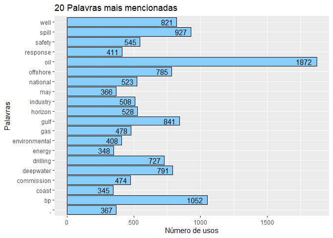
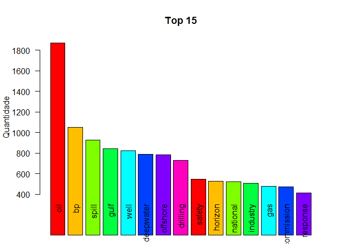
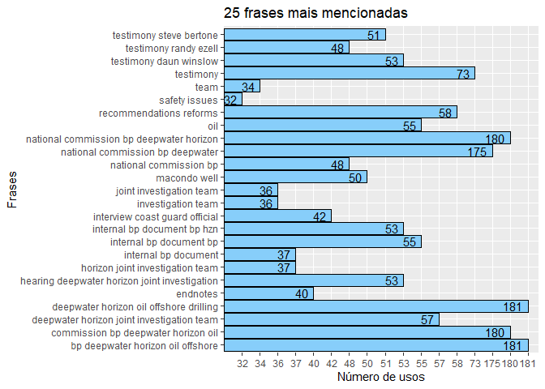
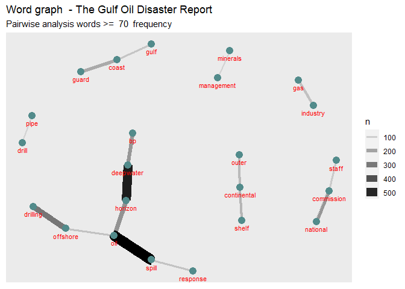
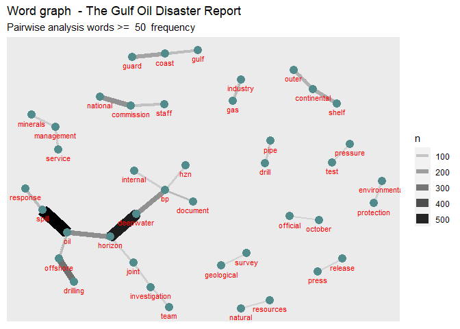
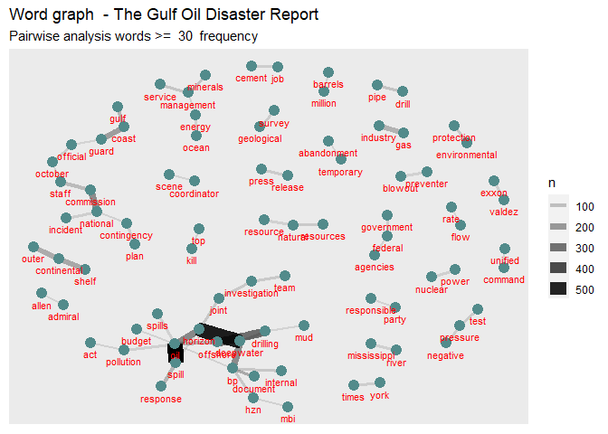
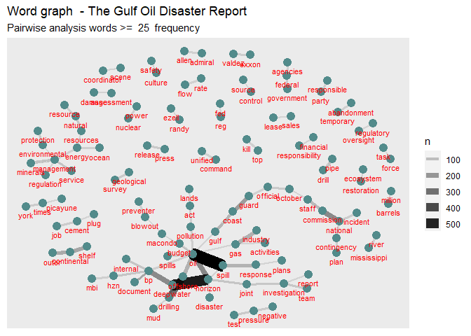
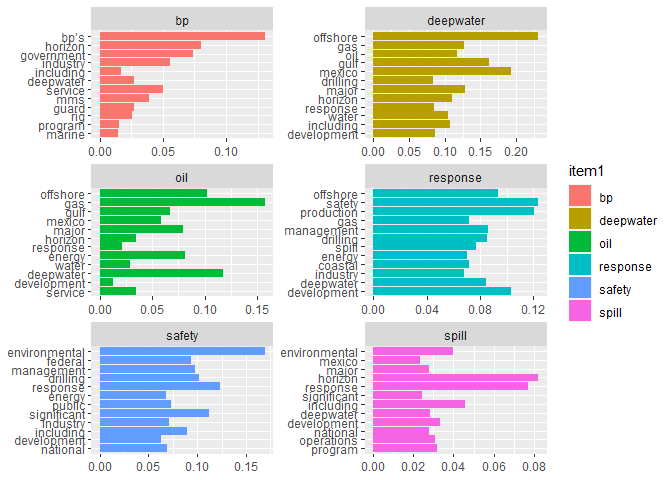
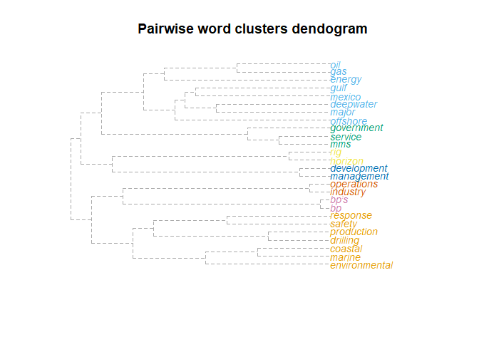

# Context of study

"The explosion that tore through the Deepwater Horizon drilling rig last April 20, as the rig’s crew completed drilling the exploratory Macondo well deep under the waters of the Gulf of Mexico, began a human, economic, and environmental disaster.
Eleven crew members died, and others were seriously injured, as fire engulfed and
ultimately destroyed the rig. And, although the nation would not know the full scope
of the disaster for weeks, the first of more than four million barrels of oil began gushing uncontrolled into the Gulf—threatening livelihoods, precious habitats, and even a unique way of life. A treasured American landscape, already battered and degraded from years of mismanagement, faced yet another blow as the oil spread and washed ashore. Five years after Hurricane Katrina, the nation was again transfixed, seemingly helpless, as this new tragedy unfolded in the Gulf. The costs from this one industrial accident are not yet fully counted, but it is already clear that the impacts on the region’s natural systems and people were enormous, and that economic losses total tens of billions of dollars.

On May 22, 2010, President Barack Obama announced the creation of the National
Commission on the BP Deepwater Horizon Oil Spill and Offshore Drilling: an independent, nonpartisan entity, directed to provide a thorough analysis and impartial judgment. The President charged the Commission to determine the causes of the disaster, and to improve the country’s ability to respond to spills, and to recommend reforms to make offshore energy production safer. And the President said we were to follow the facts wherever they led." 

**Falar do contexto do projeto e como isso ajuda na formação dos indicadores**


# Study goal

The purpuse of this study is to discover knowledge about the causes of disasters in the oil and gas industries, in order to support the establishment of indicators in the Human Factors II Project (Libra Consortium, Brazil, 2007 - 2022).

## Research question

**Which indicators we can extract from The Gulf Oil Disaster Report?** 

# Methods, Materials and Techniques

 **Descrever método ao finalizar as analises**

## Materials

Report of National Commission on the BP Deepwater Horizon Oil Spill and Offshore Drilling (NCDWHSOD). Deep Water: The Gulf Oil Disaster and the Future of Offshore Drilling. Report to the President. January 2011 Cover Photo: © Steadfast TV. ISBN: 978-0-16-087371-3. https://www.govinfo.gov/content/pkg/GPO-OILCOMMISSION/pdf/GPO-OILCOMMISSION.pdf

## Techniques

Knowledge Discovery in Text techniques using n-grams analisys:
- Unigrams
- Bigrams
- Triograms

**R Packages**


```r
# Pacotes e Funções
library(tidyverse) # Manipulacao eficiente de dados
library(tidytext) # Manipulacao eficiente de texto
library(textreadr) # Leitura de pdf para texto
library(tm) # Pacote de mineracao de texto com stopwords 
library(wordcloud) # Grafico nuvem de palavras
library(igraph)
library(ggraph)
library(ggplot2)
library(dplyr)
library(pdftools)
library(RRPP)
```

**Text Normalization Function**


```r
# Função para normalizar texto
NormalizaParaTextMining <- function(texto){
 
  # Normaliza texto
  texto %>% 
    chartr(
      old = "áéíóúÁÉÍÓÚýÝàèìòùÀÈÌÒÙâêîôûÂÊÎÔÛãõÃÕñÑäëïöüÄËÏÖÜÿçÇ´`^~¨:.!?&$@#0123456789",
      new = "aeiouAEIOUyYaeiouAEIOUaeiouAEIOUaoAOnNaeiouAEIOUycC                       ",
      x = .) %>% # Elimina acentos e caracteres desnecessarios
    str_squish() %>% # Elimina espacos excedentes 
    tolower() %>% # Converte para minusculo
    return() # Retorno da funcao
}
```

**Text Cleaning Function**


```r
# Função para Palavras que podem se retiradas

# Lista de palavras para remover
palavrasRemover <- c(stopwords(kind = "en"), letters) %>%
  as.tibble() %>% 
  rename(Palavra = value) %>% 
  mutate(Palavra = NormalizaParaTextMining(Palavra))
```

```
## Warning: `as.tibble()` is deprecated, use `as_tibble()` (but mind the new semantics).
## This warning is displayed once per session.
```

**Read PDF**


```r
# Arquivo pdf
arquivoPdf <- "https://www.govinfo.gov/content/pkg/GPO-OILCOMMISSION/pdf/GPO-OILCOMMISSION.pdf"
```

**Tidynd text**


```r
TidyT <- arquivoPdf %>% 
  read_pdf() %>% 
  as.tibble() %>% 
  select(text) 
```
  
# Unigrams analysis

**Cleaning useless words for single word analysis**


```r
  CleanW <- TidyT  %>% 
  unnest_tokens(Palavra, text) %>% 
  mutate(Palavra = NormalizaParaTextMining(Palavra)) %>% 
  anti_join(palavrasRemover)
```

```
## Joining, by = "Palavra"
```
  
**Counting single words**


```r
  frequenciaPalavras <-  CleanW  %>% 
  count(Palavra, sort = TRUE) %>% 
  filter(Palavra != "") %>%
  arrange(desc(n)) 


# Visualiza frequencia de palavras
DT::datatable(frequenciaPalavras)
```

<!--html_preserve--><div id="htmlwidget-bdd95b30e4c1d51dd2da" style="width:100%;height:auto;" class="datatables html-widget"></div>
<script type="application/json" data-for="htmlwidget-bdd95b30e4c1d51dd2da">{"x":{"filter":"none","data":[["1","2","3","4","5","6","7","8","9","10","11","12","13","14","15","16","17","18","19","20","21","22","23","24","25","26","27","28","29","30","31","32","33","34","35","36","37","38","39","40","41","42","43","44","45","46","47","48","49","50","51","52","53","54","55","56","57","58","59","60","61","62","63","64","65","66","67","68","69","70","71","72","73","74","75","76","77","78","79","80","81","82","83","84","85","86","87","88","89","90","91","92","93","94","95","96","97","98","99","100","101","102","103","104","105","106","107","108","109","110","111","112","113","114","115","116","117","118","119","120","121","122","123","124","125","126","127","128","129","130","131","132","133","134","135","136","137","138","139","140","141","142","143","144","145","146","147","148","149","150","151","152","153","154","155","156","157","158","159","160","161","162","163","164","165","166","167","168","169","170","171","172","173","174","175","176","177","178","179","180","181","182","183","184","185","186","187","188","189","190","191","192","193","194","195","196","197","198","199","200","201","202","203","204","205","206","207","208","209","210","211","212","213","214","215","216","217","218","219","220","221","222","223","224","225","226","227","228","229","230","231","232","233","234","235","236","237","238","239","240","241","242","243","244","245","246","247","248","249","250","251","252","253","254","255","256","257","258","259","260","261","262","263","264","265","266","267","268","269","270","271","272","273","274","275","276","277","278","279","280","281","282","283","284","285","286","287","288","289","290","291","292","293","294","295","296","297","298","299","300","301","302","303","304","305","306","307","308","309","310","311","312","313","314","315","316","317","318","319","320","321","322","323","324","325","326","327","328","329","330","331","332","333","334","335","336","337","338","339","340","341","342","343","344","345","346","347","348","349","350","351","352","353","354","355","356","357","358","359","360","361","362","363","364","365","366","367","368","369","370","371","372","373","374","375","376","377","378","379","380","381","382","383","384","385","386","387","388","389","390","391","392","393","394","395","396","397","398","399","400","401","402","403","404","405","406","407","408","409","410","411","412","413","414","415","416","417","418","419","420","421","422","423","424","425","426","427","428","429","430","431","432","433","434","435","436","437","438","439","440","441","442","443","444","445","446","447","448","449","450","451","452","453","454","455","456","457","458","459","460","461","462","463","464","465","466","467","468","469","470","471","472","473","474","475","476","477","478","479","480","481","482","483","484","485","486","487","488","489","490","491","492","493","494","495","496","497","498","499","500","501","502","503","504","505","506","507","508","509","510","511","512","513","514","515","516","517","518","519","520","521","522","523","524","525","526","527","528","529","530","531","532","533","534","535","536","537","538","539","540","541","542","543","544","545","546","547","548","549","550","551","552","553","554","555","556","557","558","559","560","561","562","563","564","565","566","567","568","569","570","571","572","573","574","575","576","577","578","579","580","581","582","583","584","585","586","587","588","589","590","591","592","593","594","595","596","597","598","599","600","601","602","603","604","605","606","607","608","609","610","611","612","613","614","615","616","617","618","619","620","621","622","623","624","625","626","627","628","629","630","631","632","633","634","635","636","637","638","639","640","641","642","643","644","645","646","647","648","649","650","651","652","653","654","655","656","657","658","659","660","661","662","663","664","665","666","667","668","669","670","671","672","673","674","675","676","677","678","679","680","681","682","683","684","685","686","687","688","689","690","691","692","693","694","695","696","697","698","699","700","701","702","703","704","705","706","707","708","709","710","711","712","713","714","715","716","717","718","719","720","721","722","723","724","725","726","727","728","729","730","731","732","733","734","735","736","737","738","739","740","741","742","743","744","745","746","747","748","749","750","751","752","753","754","755","756","757","758","759","760","761","762","763","764","765","766","767","768","769","770","771","772","773","774","775","776","777","778","779","780","781","782","783","784","785","786","787","788","789","790","791","792","793","794","795","796","797","798","799","800","801","802","803","804","805","806","807","808","809","810","811","812","813","814","815","816","817","818","819","820","821","822","823","824","825","826","827","828","829","830","831","832","833","834","835","836","837","838","839","840","841","842","843","844","845","846","847","848","849","850","851","852","853","854","855","856","857","858","859","860","861","862","863","864","865","866","867","868","869","870","871","872","873","874","875","876","877","878","879","880","881","882","883","884","885","886","887","888","889","890","891","892","893","894","895","896","897","898","899","900","901","902","903","904","905","906","907","908","909","910","911","912","913","914","915","916","917","918","919","920","921","922","923","924","925","926","927","928","929","930","931","932","933","934","935","936","937","938","939","940","941","942","943","944","945","946","947","948","949","950","951","952","953","954","955","956","957","958","959","960","961","962","963","964","965","966","967","968","969","970","971","972","973","974","975","976","977","978","979","980","981","982","983","984","985","986","987","988","989","990","991","992","993","994","995","996","997","998","999","1000","1001","1002","1003","1004","1005","1006","1007","1008","1009","1010","1011","1012","1013","1014","1015","1016","1017","1018","1019","1020","1021","1022","1023","1024","1025","1026","1027","1028","1029","1030","1031","1032","1033","1034","1035","1036","1037","1038","1039","1040","1041","1042","1043","1044","1045","1046","1047","1048","1049","1050","1051","1052","1053","1054","1055","1056","1057","1058","1059","1060","1061","1062","1063","1064","1065","1066","1067","1068","1069","1070","1071","1072","1073","1074","1075","1076","1077","1078","1079","1080","1081","1082","1083","1084","1085","1086","1087","1088","1089","1090","1091","1092","1093","1094","1095","1096","1097","1098","1099","1100","1101","1102","1103","1104","1105","1106","1107","1108","1109","1110","1111","1112","1113","1114","1115","1116","1117","1118","1119","1120","1121","1122","1123","1124","1125","1126","1127","1128","1129","1130","1131","1132","1133","1134","1135","1136","1137","1138","1139","1140","1141","1142","1143","1144","1145","1146","1147","1148","1149","1150","1151","1152","1153","1154","1155","1156","1157","1158","1159","1160","1161","1162","1163","1164","1165","1166","1167","1168","1169","1170","1171","1172","1173","1174","1175","1176","1177","1178","1179","1180","1181","1182","1183","1184","1185","1186","1187","1188","1189","1190","1191","1192","1193","1194","1195","1196","1197","1198","1199","1200","1201","1202","1203","1204","1205","1206","1207","1208","1209","1210","1211","1212","1213","1214","1215","1216","1217","1218","1219","1220","1221","1222","1223","1224","1225","1226","1227","1228","1229","1230","1231","1232","1233","1234","1235","1236","1237","1238","1239","1240","1241","1242","1243","1244","1245","1246","1247","1248","1249","1250","1251","1252","1253","1254","1255","1256","1257","1258","1259","1260","1261","1262","1263","1264","1265","1266","1267","1268","1269","1270","1271","1272","1273","1274","1275","1276","1277","1278","1279","1280","1281","1282","1283","1284","1285","1286","1287","1288","1289","1290","1291","1292","1293","1294","1295","1296","1297","1298","1299","1300","1301","1302","1303","1304","1305","1306","1307","1308","1309","1310","1311","1312","1313","1314","1315","1316","1317","1318","1319","1320","1321","1322","1323","1324","1325","1326","1327","1328","1329","1330","1331","1332","1333","1334","1335","1336","1337","1338","1339","1340","1341","1342","1343","1344","1345","1346","1347","1348","1349","1350","1351","1352","1353","1354","1355","1356","1357","1358","1359","1360","1361","1362","1363","1364","1365","1366","1367","1368","1369","1370","1371","1372","1373","1374","1375","1376","1377","1378","1379","1380","1381","1382","1383","1384","1385","1386","1387","1388","1389","1390","1391","1392","1393","1394","1395","1396","1397","1398","1399","1400","1401","1402","1403","1404","1405","1406","1407","1408","1409","1410","1411","1412","1413","1414","1415","1416","1417","1418","1419","1420","1421","1422","1423","1424","1425","1426","1427","1428","1429","1430","1431","1432","1433","1434","1435","1436","1437","1438","1439","1440","1441","1442","1443","1444","1445","1446","1447","1448","1449","1450","1451","1452","1453","1454","1455","1456","1457","1458","1459","1460","1461","1462","1463","1464","1465","1466","1467","1468","1469","1470","1471","1472","1473","1474","1475","1476","1477","1478","1479","1480","1481","1482","1483","1484","1485","1486","1487","1488","1489","1490","1491","1492","1493","1494","1495","1496","1497","1498","1499","1500","1501","1502","1503","1504","1505","1506","1507","1508","1509","1510","1511","1512","1513","1514","1515","1516","1517","1518","1519","1520","1521","1522","1523","1524","1525","1526","1527","1528","1529","1530","1531","1532","1533","1534","1535","1536","1537","1538","1539","1540","1541","1542","1543","1544","1545","1546","1547","1548","1549","1550","1551","1552","1553","1554","1555","1556","1557","1558","1559","1560","1561","1562","1563","1564","1565","1566","1567","1568","1569","1570","1571","1572","1573","1574","1575","1576","1577","1578","1579","1580","1581","1582","1583","1584","1585","1586","1587","1588","1589","1590","1591","1592","1593","1594","1595","1596","1597","1598","1599","1600","1601","1602","1603","1604","1605","1606","1607","1608","1609","1610","1611","1612","1613","1614","1615","1616","1617","1618","1619","1620","1621","1622","1623","1624","1625","1626","1627","1628","1629","1630","1631","1632","1633","1634","1635","1636","1637","1638","1639","1640","1641","1642","1643","1644","1645","1646","1647","1648","1649","1650","1651","1652","1653","1654","1655","1656","1657","1658","1659","1660","1661","1662","1663","1664","1665","1666","1667","1668","1669","1670","1671","1672","1673","1674","1675","1676","1677","1678","1679","1680","1681","1682","1683","1684","1685","1686","1687","1688","1689","1690","1691","1692","1693","1694","1695","1696","1697","1698","1699","1700","1701","1702","1703","1704","1705","1706","1707","1708","1709","1710","1711","1712","1713","1714","1715","1716","1717","1718","1719","1720","1721","1722","1723","1724","1725","1726","1727","1728","1729","1730","1731","1732","1733","1734","1735","1736","1737","1738","1739","1740","1741","1742","1743","1744","1745","1746","1747","1748","1749","1750","1751","1752","1753","1754","1755","1756","1757","1758","1759","1760","1761","1762","1763","1764","1765","1766","1767","1768","1769","1770","1771","1772","1773","1774","1775","1776","1777","1778","1779","1780","1781","1782","1783","1784","1785","1786","1787","1788","1789","1790","1791","1792","1793","1794","1795","1796","1797","1798","1799","1800","1801","1802","1803","1804","1805","1806","1807","1808","1809","1810","1811","1812","1813","1814","1815","1816","1817","1818","1819","1820","1821","1822","1823","1824","1825","1826","1827","1828","1829","1830","1831","1832","1833","1834","1835","1836","1837","1838","1839","1840","1841","1842","1843","1844","1845","1846","1847","1848","1849","1850","1851","1852","1853","1854","1855","1856","1857","1858","1859","1860","1861","1862","1863","1864","1865","1866","1867","1868","1869","1870","1871","1872","1873","1874","1875","1876","1877","1878","1879","1880","1881","1882","1883","1884","1885","1886","1887","1888","1889","1890","1891","1892","1893","1894","1895","1896","1897","1898","1899","1900","1901","1902","1903","1904","1905","1906","1907","1908","1909","1910","1911","1912","1913","1914","1915","1916","1917","1918","1919","1920","1921","1922","1923","1924","1925","1926","1927","1928","1929","1930","1931","1932","1933","1934","1935","1936","1937","1938","1939","1940","1941","1942","1943","1944","1945","1946","1947","1948","1949","1950","1951","1952","1953","1954","1955","1956","1957","1958","1959","1960","1961","1962","1963","1964","1965","1966","1967","1968","1969","1970","1971","1972","1973","1974","1975","1976","1977","1978","1979","1980","1981","1982","1983","1984","1985","1986","1987","1988","1989","1990","1991","1992","1993","1994","1995","1996","1997","1998","1999","2000","2001","2002","2003","2004","2005","2006","2007","2008","2009","2010","2011","2012","2013","2014","2015","2016","2017","2018","2019","2020","2021","2022","2023","2024","2025","2026","2027","2028","2029","2030","2031","2032","2033","2034","2035","2036","2037","2038","2039","2040","2041","2042","2043","2044","2045","2046","2047","2048","2049","2050","2051","2052","2053","2054","2055","2056","2057","2058","2059","2060","2061","2062","2063","2064","2065","2066","2067","2068","2069","2070","2071","2072","2073","2074","2075","2076","2077","2078","2079","2080","2081","2082","2083","2084","2085","2086","2087","2088","2089","2090","2091","2092","2093","2094","2095","2096","2097","2098","2099","2100","2101","2102","2103","2104","2105","2106","2107","2108","2109","2110","2111","2112","2113","2114","2115","2116","2117","2118","2119","2120","2121","2122","2123","2124","2125","2126","2127","2128","2129","2130","2131","2132","2133","2134","2135","2136","2137","2138","2139","2140","2141","2142","2143","2144","2145","2146","2147","2148","2149","2150","2151","2152","2153","2154","2155","2156","2157","2158","2159","2160","2161","2162","2163","2164","2165","2166","2167","2168","2169","2170","2171","2172","2173","2174","2175","2176","2177","2178","2179","2180","2181","2182","2183","2184","2185","2186","2187","2188","2189","2190","2191","2192","2193","2194","2195","2196","2197","2198","2199","2200","2201","2202","2203","2204","2205","2206","2207","2208","2209","2210","2211","2212","2213","2214","2215","2216","2217","2218","2219","2220","2221","2222","2223","2224","2225","2226","2227","2228","2229","2230","2231","2232","2233","2234","2235","2236","2237","2238","2239","2240","2241","2242","2243","2244","2245","2246","2247","2248","2249","2250","2251","2252","2253","2254","2255","2256","2257","2258","2259","2260","2261","2262","2263","2264","2265","2266","2267","2268","2269","2270","2271","2272","2273","2274","2275","2276","2277","2278","2279","2280","2281","2282","2283","2284","2285","2286","2287","2288","2289","2290","2291","2292","2293","2294","2295","2296","2297","2298","2299","2300","2301","2302","2303","2304","2305","2306","2307","2308","2309","2310","2311","2312","2313","2314","2315","2316","2317","2318","2319","2320","2321","2322","2323","2324","2325","2326","2327","2328","2329","2330","2331","2332","2333","2334","2335","2336","2337","2338","2339","2340","2341","2342","2343","2344","2345","2346","2347","2348","2349","2350","2351","2352","2353","2354","2355","2356","2357","2358","2359","2360","2361","2362","2363","2364","2365","2366","2367","2368","2369","2370","2371","2372","2373","2374","2375","2376","2377","2378","2379","2380","2381","2382","2383","2384","2385","2386","2387","2388","2389","2390","2391","2392","2393","2394","2395","2396","2397","2398","2399","2400","2401","2402","2403","2404","2405","2406","2407","2408","2409","2410","2411","2412","2413","2414","2415","2416","2417","2418","2419","2420","2421","2422","2423","2424","2425","2426","2427","2428","2429","2430","2431","2432","2433","2434","2435","2436","2437","2438","2439","2440","2441","2442","2443","2444","2445","2446","2447","2448","2449","2450","2451","2452","2453","2454","2455","2456","2457","2458","2459","2460","2461","2462","2463","2464","2465","2466","2467","2468","2469","2470","2471","2472","2473","2474","2475","2476","2477","2478","2479","2480","2481","2482","2483","2484","2485","2486","2487","2488","2489","2490","2491","2492","2493","2494","2495","2496","2497","2498","2499","2500","2501","2502","2503","2504","2505","2506","2507","2508","2509","2510","2511","2512","2513","2514","2515","2516","2517","2518","2519","2520","2521","2522","2523","2524","2525","2526","2527","2528","2529","2530","2531","2532","2533","2534","2535","2536","2537","2538","2539","2540","2541","2542","2543","2544","2545","2546","2547","2548","2549","2550","2551","2552","2553","2554","2555","2556","2557","2558","2559","2560","2561","2562","2563","2564","2565","2566","2567","2568","2569","2570","2571","2572","2573","2574","2575","2576","2577","2578","2579","2580","2581","2582","2583","2584","2585","2586","2587","2588","2589","2590","2591","2592","2593","2594","2595","2596","2597","2598","2599","2600","2601","2602","2603","2604","2605","2606","2607","2608","2609","2610","2611","2612","2613","2614","2615","2616","2617","2618","2619","2620","2621","2622","2623","2624","2625","2626","2627","2628","2629","2630","2631","2632","2633","2634","2635","2636","2637","2638","2639","2640","2641","2642","2643","2644","2645","2646","2647","2648","2649","2650","2651","2652","2653","2654","2655","2656","2657","2658","2659","2660","2661","2662","2663","2664","2665","2666","2667","2668","2669","2670","2671","2672","2673","2674","2675","2676","2677","2678","2679","2680","2681","2682","2683","2684","2685","2686","2687","2688","2689","2690","2691","2692","2693","2694","2695","2696","2697","2698","2699","2700","2701","2702","2703","2704","2705","2706","2707","2708","2709","2710","2711","2712","2713","2714","2715","2716","2717","2718","2719","2720","2721","2722","2723","2724","2725","2726","2727","2728","2729","2730","2731","2732","2733","2734","2735","2736","2737","2738","2739","2740","2741","2742","2743","2744","2745","2746","2747","2748","2749","2750","2751","2752","2753","2754","2755","2756","2757","2758","2759","2760","2761","2762","2763","2764","2765","2766","2767","2768","2769","2770","2771","2772","2773","2774","2775","2776","2777","2778","2779","2780","2781","2782","2783","2784","2785","2786","2787","2788","2789","2790","2791","2792","2793","2794","2795","2796","2797","2798","2799","2800","2801","2802","2803","2804","2805","2806","2807","2808","2809","2810","2811","2812","2813","2814","2815","2816","2817","2818","2819","2820","2821","2822","2823","2824","2825","2826","2827","2828","2829","2830","2831","2832","2833","2834","2835","2836","2837","2838","2839","2840","2841","2842","2843","2844","2845","2846","2847","2848","2849","2850","2851","2852","2853","2854","2855","2856","2857","2858","2859","2860","2861","2862","2863","2864","2865","2866","2867","2868","2869","2870","2871","2872","2873","2874","2875","2876","2877","2878","2879","2880","2881","2882","2883","2884","2885","2886","2887","2888","2889","2890","2891","2892","2893","2894","2895","2896","2897","2898","2899","2900","2901","2902","2903","2904","2905","2906","2907","2908","2909","2910","2911","2912","2913","2914","2915","2916","2917","2918","2919","2920","2921","2922","2923","2924","2925","2926","2927","2928","2929","2930","2931","2932","2933","2934","2935","2936","2937","2938","2939","2940","2941","2942","2943","2944","2945","2946","2947","2948","2949","2950","2951","2952","2953","2954","2955","2956","2957","2958","2959","2960","2961","2962","2963","2964","2965","2966","2967","2968","2969","2970","2971","2972","2973","2974","2975","2976","2977","2978","2979","2980","2981","2982","2983","2984","2985","2986","2987","2988","2989","2990","2991","2992","2993","2994","2995","2996","2997","2998","2999","3000","3001","3002","3003","3004","3005","3006","3007","3008","3009","3010","3011","3012","3013","3014","3015","3016","3017","3018","3019","3020","3021","3022","3023","3024","3025","3026","3027","3028","3029","3030","3031","3032","3033","3034","3035","3036","3037","3038","3039","3040","3041","3042","3043","3044","3045","3046","3047","3048","3049","3050","3051","3052","3053","3054","3055","3056","3057","3058","3059","3060","3061","3062","3063","3064","3065","3066","3067","3068","3069","3070","3071","3072","3073","3074","3075","3076","3077","3078","3079","3080","3081","3082","3083","3084","3085","3086","3087","3088","3089","3090","3091","3092","3093","3094","3095","3096","3097","3098","3099","3100","3101","3102","3103","3104","3105","3106","3107","3108","3109","3110","3111","3112","3113","3114","3115","3116","3117","3118","3119","3120","3121","3122","3123","3124","3125","3126","3127","3128","3129","3130","3131","3132","3133","3134","3135","3136","3137","3138","3139","3140","3141","3142","3143","3144","3145","3146","3147","3148","3149","3150","3151","3152","3153","3154","3155","3156","3157","3158","3159","3160","3161","3162","3163","3164","3165","3166","3167","3168","3169","3170","3171","3172","3173","3174","3175","3176","3177","3178","3179","3180","3181","3182","3183","3184","3185","3186","3187","3188","3189","3190","3191","3192","3193","3194","3195","3196","3197","3198","3199","3200","3201","3202","3203","3204","3205","3206","3207","3208","3209","3210","3211","3212","3213","3214","3215","3216","3217","3218","3219","3220","3221","3222","3223","3224","3225","3226","3227","3228","3229","3230","3231","3232","3233","3234","3235","3236","3237","3238","3239","3240","3241","3242","3243","3244","3245","3246","3247","3248","3249","3250","3251","3252","3253","3254","3255","3256","3257","3258","3259","3260","3261","3262","3263","3264","3265","3266","3267","3268","3269","3270","3271","3272","3273","3274","3275","3276","3277","3278","3279","3280","3281","3282","3283","3284","3285","3286","3287","3288","3289","3290","3291","3292","3293","3294","3295","3296","3297","3298","3299","3300","3301","3302","3303","3304","3305","3306","3307","3308","3309","3310","3311","3312","3313","3314","3315","3316","3317","3318","3319","3320","3321","3322","3323","3324","3325","3326","3327","3328","3329","3330","3331","3332","3333","3334","3335","3336","3337","3338","3339","3340","3341","3342","3343","3344","3345","3346","3347","3348","3349","3350","3351","3352","3353","3354","3355","3356","3357","3358","3359","3360","3361","3362","3363","3364","3365","3366","3367","3368","3369","3370","3371","3372","3373","3374","3375","3376","3377","3378","3379","3380","3381","3382","3383","3384","3385","3386","3387","3388","3389","3390","3391","3392","3393","3394","3395","3396","3397","3398","3399","3400","3401","3402","3403","3404","3405","3406","3407","3408","3409","3410","3411","3412","3413","3414","3415","3416","3417","3418","3419","3420","3421","3422","3423","3424","3425","3426","3427","3428","3429","3430","3431","3432","3433","3434","3435","3436","3437","3438","3439","3440","3441","3442","3443","3444","3445","3446","3447","3448","3449","3450","3451","3452","3453","3454","3455","3456","3457","3458","3459","3460","3461","3462","3463","3464","3465","3466","3467","3468","3469","3470","3471","3472","3473","3474","3475","3476","3477","3478","3479","3480","3481","3482","3483","3484","3485","3486","3487","3488","3489","3490","3491","3492","3493","3494","3495","3496","3497","3498","3499","3500","3501","3502","3503","3504","3505","3506","3507","3508","3509","3510","3511","3512","3513","3514","3515","3516","3517","3518","3519","3520","3521","3522","3523","3524","3525","3526","3527","3528","3529","3530","3531","3532","3533","3534","3535","3536","3537","3538","3539","3540","3541","3542","3543","3544","3545","3546","3547","3548","3549","3550","3551","3552","3553","3554","3555","3556","3557","3558","3559","3560","3561","3562","3563","3564","3565","3566","3567","3568","3569","3570","3571","3572","3573","3574","3575","3576","3577","3578","3579","3580","3581","3582","3583","3584","3585","3586","3587","3588","3589","3590","3591","3592","3593","3594","3595","3596","3597","3598","3599","3600","3601","3602","3603","3604","3605","3606","3607","3608","3609","3610","3611","3612","3613","3614","3615","3616","3617","3618","3619","3620","3621","3622","3623","3624","3625","3626","3627","3628","3629","3630","3631","3632","3633","3634","3635","3636","3637","3638","3639","3640","3641","3642","3643","3644","3645","3646","3647","3648","3649","3650","3651","3652","3653","3654","3655","3656","3657","3658","3659","3660","3661","3662","3663","3664","3665","3666","3667","3668","3669","3670","3671","3672","3673","3674","3675","3676","3677","3678","3679","3680","3681","3682","3683","3684","3685","3686","3687","3688","3689","3690","3691","3692","3693","3694","3695","3696","3697","3698","3699","3700","3701","3702","3703","3704","3705","3706","3707","3708","3709","3710","3711","3712","3713","3714","3715","3716","3717","3718","3719","3720","3721","3722","3723","3724","3725","3726","3727","3728","3729","3730","3731","3732","3733","3734","3735","3736","3737","3738","3739","3740","3741","3742","3743","3744","3745","3746","3747","3748","3749","3750","3751","3752","3753","3754","3755","3756","3757","3758","3759","3760","3761","3762","3763","3764","3765","3766","3767","3768","3769","3770","3771","3772","3773","3774","3775","3776","3777","3778","3779","3780","3781","3782","3783","3784","3785","3786","3787","3788","3789","3790","3791","3792","3793","3794","3795","3796","3797","3798","3799","3800","3801","3802","3803","3804","3805","3806","3807","3808","3809","3810","3811","3812","3813","3814","3815","3816","3817","3818","3819","3820","3821","3822","3823","3824","3825","3826","3827","3828","3829","3830","3831","3832","3833","3834","3835","3836","3837","3838","3839","3840","3841","3842","3843","3844","3845","3846","3847","3848","3849","3850","3851","3852","3853","3854","3855","3856","3857","3858","3859","3860","3861","3862","3863","3864","3865","3866","3867","3868","3869","3870","3871","3872","3873","3874","3875","3876","3877","3878","3879","3880","3881","3882","3883","3884","3885","3886","3887","3888","3889","3890","3891","3892","3893","3894","3895","3896","3897","3898","3899","3900","3901","3902","3903","3904","3905","3906","3907","3908","3909","3910","3911","3912","3913","3914","3915","3916","3917","3918","3919","3920","3921","3922","3923","3924","3925","3926","3927","3928","3929","3930","3931","3932","3933","3934","3935","3936","3937","3938","3939","3940","3941","3942","3943","3944","3945","3946","3947","3948","3949","3950","3951","3952","3953","3954","3955","3956","3957","3958","3959","3960","3961","3962","3963","3964","3965","3966","3967","3968","3969","3970","3971","3972","3973","3974","3975","3976","3977","3978","3979","3980","3981","3982","3983","3984","3985","3986","3987","3988","3989","3990","3991","3992","3993","3994","3995","3996","3997","3998","3999","4000","4001","4002","4003","4004","4005","4006","4007","4008","4009","4010","4011","4012","4013","4014","4015","4016","4017","4018","4019","4020","4021","4022","4023","4024","4025","4026","4027","4028","4029","4030","4031","4032","4033","4034","4035","4036","4037","4038","4039","4040","4041","4042","4043","4044","4045","4046","4047","4048","4049","4050","4051","4052","4053","4054","4055","4056","4057","4058","4059","4060","4061","4062","4063","4064","4065","4066","4067","4068","4069","4070","4071","4072","4073","4074","4075","4076","4077","4078","4079","4080","4081","4082","4083","4084","4085","4086","4087","4088","4089","4090","4091","4092","4093","4094","4095","4096","4097","4098","4099","4100","4101","4102","4103","4104","4105","4106","4107","4108","4109","4110","4111","4112","4113","4114","4115","4116","4117","4118","4119","4120","4121","4122","4123","4124","4125","4126","4127","4128","4129","4130","4131","4132","4133","4134","4135","4136","4137","4138","4139","4140","4141","4142","4143","4144","4145","4146","4147","4148","4149","4150","4151","4152","4153","4154","4155","4156","4157","4158","4159","4160","4161","4162","4163","4164","4165","4166","4167","4168","4169","4170","4171","4172","4173","4174","4175","4176","4177","4178","4179","4180","4181","4182","4183","4184","4185","4186","4187","4188","4189","4190","4191","4192","4193","4194","4195","4196","4197","4198","4199","4200","4201","4202","4203","4204","4205","4206","4207","4208","4209","4210","4211","4212","4213","4214","4215","4216","4217","4218","4219","4220","4221","4222","4223","4224","4225","4226","4227","4228","4229","4230","4231","4232","4233","4234","4235","4236","4237","4238","4239","4240","4241","4242","4243","4244","4245","4246","4247","4248","4249","4250","4251","4252","4253","4254","4255","4256","4257","4258","4259","4260","4261","4262","4263","4264","4265","4266","4267","4268","4269","4270","4271","4272","4273","4274","4275","4276","4277","4278","4279","4280","4281","4282","4283","4284","4285","4286","4287","4288","4289","4290","4291","4292","4293","4294","4295","4296","4297","4298","4299","4300","4301","4302","4303","4304","4305","4306","4307","4308","4309","4310","4311","4312","4313","4314","4315","4316","4317","4318","4319","4320","4321","4322","4323","4324","4325","4326","4327","4328","4329","4330","4331","4332","4333","4334","4335","4336","4337","4338","4339","4340","4341","4342","4343","4344","4345","4346","4347","4348","4349","4350","4351","4352","4353","4354","4355","4356","4357","4358","4359","4360","4361","4362","4363","4364","4365","4366","4367","4368","4369","4370","4371","4372","4373","4374","4375","4376","4377","4378","4379","4380","4381","4382","4383","4384","4385","4386","4387","4388","4389","4390","4391","4392","4393","4394","4395","4396","4397","4398","4399","4400","4401","4402","4403","4404","4405","4406","4407","4408","4409","4410","4411","4412","4413","4414","4415","4416","4417","4418","4419","4420","4421","4422","4423","4424","4425","4426","4427","4428","4429","4430","4431","4432","4433","4434","4435","4436","4437","4438","4439","4440","4441","4442","4443","4444","4445","4446","4447","4448","4449","4450","4451","4452","4453","4454","4455","4456","4457","4458","4459","4460","4461","4462","4463","4464","4465","4466","4467","4468","4469","4470","4471","4472","4473","4474","4475","4476","4477","4478","4479","4480","4481","4482","4483","4484","4485","4486","4487","4488","4489","4490","4491","4492","4493","4494","4495","4496","4497","4498","4499","4500","4501","4502","4503","4504","4505","4506","4507","4508","4509","4510","4511","4512","4513","4514","4515","4516","4517","4518","4519","4520","4521","4522","4523","4524","4525","4526","4527","4528","4529","4530","4531","4532","4533","4534","4535","4536","4537","4538","4539","4540","4541","4542","4543","4544","4545","4546","4547","4548","4549","4550","4551","4552","4553","4554","4555","4556","4557","4558","4559","4560","4561","4562","4563","4564","4565","4566","4567","4568","4569","4570","4571","4572","4573","4574","4575","4576","4577","4578","4579","4580","4581","4582","4583","4584","4585","4586","4587","4588","4589","4590","4591","4592","4593","4594","4595","4596","4597","4598","4599","4600","4601","4602","4603","4604","4605","4606","4607","4608","4609","4610","4611","4612","4613","4614","4615","4616","4617","4618","4619","4620","4621","4622","4623","4624","4625","4626","4627","4628","4629","4630","4631","4632","4633","4634","4635","4636","4637","4638","4639","4640","4641","4642","4643","4644","4645","4646","4647","4648","4649","4650","4651","4652","4653","4654","4655","4656","4657","4658","4659","4660","4661","4662","4663","4664","4665","4666","4667","4668","4669","4670","4671","4672","4673","4674","4675","4676","4677","4678","4679","4680","4681","4682","4683","4684","4685","4686","4687","4688","4689","4690","4691","4692","4693","4694","4695","4696","4697","4698","4699","4700","4701","4702","4703","4704","4705","4706","4707","4708","4709","4710","4711","4712","4713","4714","4715","4716","4717","4718","4719","4720","4721","4722","4723","4724","4725","4726","4727","4728","4729","4730","4731","4732","4733","4734","4735","4736","4737","4738","4739","4740","4741","4742","4743","4744","4745","4746","4747","4748","4749","4750","4751","4752","4753","4754","4755","4756","4757","4758","4759","4760","4761","4762","4763","4764","4765","4766","4767","4768","4769","4770","4771","4772","4773","4774","4775","4776","4777","4778","4779","4780","4781","4782","4783","4784","4785","4786","4787","4788","4789","4790","4791","4792","4793","4794","4795","4796","4797","4798","4799","4800","4801","4802","4803","4804","4805","4806","4807","4808","4809","4810","4811","4812","4813","4814","4815","4816","4817","4818","4819","4820","4821","4822","4823","4824","4825","4826","4827","4828","4829","4830","4831","4832","4833","4834","4835","4836","4837","4838","4839","4840","4841","4842","4843","4844","4845","4846","4847","4848","4849","4850","4851","4852","4853","4854","4855","4856","4857","4858","4859","4860","4861","4862","4863","4864","4865","4866","4867","4868","4869","4870","4871","4872","4873","4874","4875","4876","4877","4878","4879","4880","4881","4882","4883","4884","4885","4886","4887","4888","4889","4890","4891","4892","4893","4894","4895","4896","4897","4898","4899","4900","4901","4902","4903","4904","4905","4906","4907","4908","4909","4910","4911","4912","4913","4914","4915","4916","4917","4918","4919","4920","4921","4922","4923","4924","4925","4926","4927","4928","4929","4930","4931","4932","4933","4934","4935","4936","4937","4938","4939","4940","4941","4942","4943","4944","4945","4946","4947","4948","4949","4950","4951","4952","4953","4954","4955","4956","4957","4958","4959","4960","4961","4962","4963","4964","4965","4966","4967","4968","4969","4970","4971","4972","4973","4974","4975","4976","4977","4978","4979","4980","4981","4982","4983","4984","4985","4986","4987","4988","4989","4990","4991","4992","4993","4994","4995","4996","4997","4998","4999","5000","5001","5002","5003","5004","5005","5006","5007","5008","5009","5010","5011","5012","5013","5014","5015","5016","5017","5018","5019","5020","5021","5022","5023","5024","5025","5026","5027","5028","5029","5030","5031","5032","5033","5034","5035","5036","5037","5038","5039","5040","5041","5042","5043","5044","5045","5046","5047","5048","5049","5050","5051","5052","5053","5054","5055","5056","5057","5058","5059","5060","5061","5062","5063","5064","5065","5066","5067","5068","5069","5070","5071","5072","5073","5074","5075","5076","5077","5078","5079","5080","5081","5082","5083","5084","5085","5086","5087","5088","5089","5090","5091","5092","5093","5094","5095","5096","5097","5098","5099","5100","5101","5102","5103","5104","5105","5106","5107","5108","5109","5110","5111","5112","5113","5114","5115","5116","5117","5118","5119","5120","5121","5122","5123","5124","5125","5126","5127","5128","5129","5130","5131","5132","5133","5134","5135","5136","5137","5138","5139","5140","5141","5142","5143","5144","5145","5146","5147","5148","5149","5150","5151","5152","5153","5154","5155","5156","5157","5158","5159","5160","5161","5162","5163","5164","5165","5166","5167","5168","5169","5170","5171","5172","5173","5174","5175","5176","5177","5178","5179","5180","5181","5182","5183","5184","5185","5186","5187","5188","5189","5190","5191","5192","5193","5194","5195","5196","5197","5198","5199","5200","5201","5202","5203","5204","5205","5206","5207","5208","5209","5210","5211","5212","5213","5214","5215","5216","5217","5218","5219","5220","5221","5222","5223","5224","5225","5226","5227","5228","5229","5230","5231","5232","5233","5234","5235","5236","5237","5238","5239","5240","5241","5242","5243","5244","5245","5246","5247","5248","5249","5250","5251","5252","5253","5254","5255","5256","5257","5258","5259","5260","5261","5262","5263","5264","5265","5266","5267","5268","5269","5270","5271","5272","5273","5274","5275","5276","5277","5278","5279","5280","5281","5282","5283","5284","5285","5286","5287","5288","5289","5290","5291","5292","5293","5294","5295","5296","5297","5298","5299","5300","5301","5302","5303","5304","5305","5306","5307","5308","5309","5310","5311","5312","5313","5314","5315","5316","5317","5318","5319","5320","5321","5322","5323","5324","5325","5326","5327","5328","5329","5330","5331","5332","5333","5334","5335","5336","5337","5338","5339","5340","5341","5342","5343","5344","5345","5346","5347","5348","5349","5350","5351","5352","5353","5354","5355","5356","5357","5358","5359","5360","5361","5362","5363","5364","5365","5366","5367","5368","5369","5370","5371","5372","5373","5374","5375","5376","5377","5378","5379","5380","5381","5382","5383","5384","5385","5386","5387","5388","5389","5390","5391","5392","5393","5394","5395","5396","5397","5398","5399","5400","5401","5402","5403","5404","5405","5406","5407","5408","5409","5410","5411","5412","5413","5414","5415","5416","5417","5418","5419","5420","5421","5422","5423","5424","5425","5426","5427","5428","5429","5430","5431","5432","5433","5434","5435","5436","5437","5438","5439","5440","5441","5442","5443","5444","5445","5446","5447","5448","5449","5450","5451","5452","5453","5454","5455","5456","5457","5458","5459","5460","5461","5462","5463","5464","5465","5466","5467","5468","5469","5470","5471","5472","5473","5474","5475","5476","5477","5478","5479","5480","5481","5482","5483","5484","5485","5486","5487","5488","5489","5490","5491","5492","5493","5494","5495","5496","5497","5498","5499","5500","5501","5502","5503","5504","5505","5506","5507","5508","5509","5510","5511","5512","5513","5514","5515","5516","5517","5518","5519","5520","5521","5522","5523","5524","5525","5526","5527","5528","5529","5530","5531","5532","5533","5534","5535","5536","5537","5538","5539","5540","5541","5542","5543","5544","5545","5546","5547","5548","5549","5550","5551","5552","5553","5554","5555","5556","5557","5558","5559","5560","5561","5562","5563","5564","5565","5566","5567","5568","5569","5570","5571","5572","5573","5574","5575","5576","5577","5578","5579","5580","5581","5582","5583","5584","5585","5586","5587","5588","5589","5590","5591","5592","5593","5594","5595","5596","5597","5598","5599","5600","5601","5602","5603","5604","5605","5606","5607","5608","5609","5610","5611","5612","5613","5614","5615","5616","5617","5618","5619","5620","5621","5622","5623","5624","5625","5626","5627","5628","5629","5630","5631","5632","5633","5634","5635","5636","5637","5638","5639","5640","5641","5642","5643","5644","5645","5646","5647","5648","5649","5650","5651","5652","5653","5654","5655","5656","5657","5658","5659","5660","5661","5662","5663","5664","5665","5666","5667","5668","5669","5670","5671","5672","5673","5674","5675","5676","5677","5678","5679","5680","5681","5682","5683","5684","5685","5686","5687","5688","5689","5690","5691","5692","5693","5694","5695","5696","5697","5698","5699","5700","5701","5702","5703","5704","5705","5706","5707","5708","5709","5710","5711","5712","5713","5714","5715","5716","5717","5718","5719","5720","5721","5722","5723","5724","5725","5726","5727","5728","5729","5730","5731","5732","5733","5734","5735","5736","5737","5738","5739","5740","5741","5742","5743","5744","5745","5746","5747","5748","5749","5750","5751","5752","5753","5754","5755","5756","5757","5758","5759","5760","5761","5762","5763","5764","5765","5766","5767","5768","5769","5770","5771","5772","5773","5774","5775","5776","5777","5778","5779","5780","5781","5782","5783","5784","5785","5786","5787","5788","5789","5790","5791","5792","5793","5794","5795","5796","5797","5798","5799","5800","5801","5802","5803","5804","5805","5806","5807","5808","5809","5810","5811","5812","5813","5814","5815","5816","5817","5818","5819","5820","5821","5822","5823","5824","5825","5826","5827","5828","5829","5830","5831","5832","5833","5834","5835","5836","5837","5838","5839","5840","5841","5842","5843","5844","5845","5846","5847","5848","5849","5850","5851","5852","5853","5854","5855","5856","5857","5858","5859","5860","5861","5862","5863","5864","5865","5866","5867","5868","5869","5870","5871","5872","5873","5874","5875","5876","5877","5878","5879","5880","5881","5882","5883","5884","5885","5886","5887","5888","5889","5890","5891","5892","5893","5894","5895","5896","5897","5898","5899","5900","5901","5902","5903","5904","5905","5906","5907","5908","5909","5910","5911","5912","5913","5914","5915","5916","5917","5918","5919","5920","5921","5922","5923","5924","5925","5926","5927","5928","5929","5930","5931","5932","5933","5934","5935","5936","5937","5938","5939","5940","5941","5942","5943","5944","5945","5946","5947","5948","5949","5950","5951","5952","5953","5954","5955","5956","5957","5958","5959","5960","5961","5962","5963","5964","5965","5966","5967","5968","5969","5970","5971","5972","5973","5974","5975","5976","5977","5978","5979","5980","5981","5982","5983","5984","5985","5986","5987","5988","5989","5990","5991","5992","5993","5994","5995","5996","5997","5998","5999","6000","6001","6002","6003","6004","6005","6006","6007","6008","6009","6010","6011","6012","6013","6014","6015","6016","6017","6018","6019","6020","6021","6022","6023","6024","6025","6026","6027","6028","6029","6030","6031","6032","6033","6034","6035","6036","6037","6038","6039","6040","6041","6042","6043","6044","6045","6046","6047","6048","6049","6050","6051","6052","6053","6054","6055","6056","6057","6058","6059","6060","6061","6062","6063","6064","6065","6066","6067","6068","6069","6070","6071","6072","6073","6074","6075","6076","6077","6078","6079","6080","6081","6082","6083","6084","6085","6086","6087","6088","6089","6090","6091","6092","6093","6094","6095","6096","6097","6098","6099","6100","6101","6102","6103","6104","6105","6106","6107","6108","6109","6110","6111","6112","6113","6114","6115","6116","6117","6118","6119","6120","6121","6122","6123","6124","6125","6126","6127","6128","6129","6130","6131","6132","6133","6134","6135","6136","6137","6138","6139","6140","6141","6142","6143","6144","6145","6146","6147","6148","6149","6150","6151","6152","6153","6154","6155","6156","6157","6158","6159","6160","6161","6162","6163","6164","6165","6166","6167","6168","6169","6170","6171","6172","6173","6174","6175","6176","6177","6178","6179","6180","6181","6182","6183","6184","6185","6186","6187","6188","6189","6190","6191","6192","6193","6194","6195","6196","6197","6198","6199","6200","6201","6202","6203","6204","6205","6206","6207","6208","6209","6210","6211","6212","6213","6214","6215","6216","6217","6218","6219","6220","6221","6222","6223","6224","6225","6226","6227","6228","6229","6230","6231","6232","6233","6234","6235","6236","6237","6238","6239","6240","6241","6242","6243","6244","6245","6246","6247","6248","6249","6250","6251","6252","6253","6254","6255","6256","6257","6258","6259","6260","6261","6262","6263","6264","6265","6266","6267","6268","6269","6270","6271","6272","6273","6274","6275","6276","6277","6278","6279","6280","6281","6282","6283","6284","6285","6286","6287","6288","6289","6290","6291","6292","6293","6294","6295","6296","6297","6298","6299","6300","6301","6302","6303","6304","6305","6306","6307","6308","6309","6310","6311","6312","6313","6314","6315","6316","6317","6318","6319","6320","6321","6322","6323","6324","6325","6326","6327","6328","6329","6330","6331","6332","6333","6334","6335","6336","6337","6338","6339","6340","6341","6342","6343","6344","6345","6346","6347","6348","6349","6350","6351","6352","6353","6354","6355","6356","6357","6358","6359","6360","6361","6362","6363","6364","6365","6366","6367","6368","6369","6370","6371","6372","6373","6374","6375","6376","6377","6378","6379","6380","6381","6382","6383","6384","6385","6386","6387","6388","6389","6390","6391","6392","6393","6394","6395","6396","6397","6398","6399","6400","6401","6402","6403","6404","6405","6406","6407","6408","6409","6410","6411","6412","6413","6414","6415","6416","6417","6418","6419","6420","6421","6422","6423","6424","6425","6426","6427","6428","6429","6430","6431","6432","6433","6434","6435","6436","6437","6438","6439","6440","6441","6442","6443","6444","6445","6446","6447","6448","6449","6450","6451","6452","6453","6454","6455","6456","6457","6458","6459","6460","6461","6462","6463","6464","6465","6466","6467","6468","6469","6470","6471","6472","6473","6474","6475","6476","6477","6478","6479","6480","6481","6482","6483","6484","6485","6486","6487","6488","6489","6490","6491","6492","6493","6494","6495","6496","6497","6498","6499","6500","6501","6502","6503","6504","6505","6506","6507","6508","6509","6510","6511","6512","6513","6514","6515","6516","6517","6518","6519","6520","6521","6522","6523","6524","6525","6526","6527","6528","6529","6530","6531","6532","6533","6534","6535","6536","6537","6538","6539","6540","6541","6542","6543","6544","6545","6546","6547","6548","6549","6550","6551","6552","6553","6554","6555","6556","6557","6558","6559","6560","6561","6562","6563","6564","6565","6566","6567","6568","6569","6570","6571","6572","6573","6574","6575","6576","6577","6578","6579","6580","6581","6582","6583","6584","6585","6586","6587","6588","6589","6590","6591","6592","6593","6594","6595","6596","6597","6598","6599","6600","6601","6602","6603","6604","6605","6606","6607","6608","6609","6610","6611","6612","6613","6614","6615","6616","6617","6618","6619","6620","6621","6622","6623","6624","6625","6626","6627","6628","6629","6630","6631","6632","6633","6634","6635","6636","6637","6638","6639","6640","6641","6642","6643","6644","6645","6646","6647","6648","6649","6650","6651","6652","6653","6654","6655","6656","6657","6658","6659","6660","6661","6662","6663","6664","6665","6666","6667","6668","6669","6670","6671","6672","6673","6674","6675","6676","6677","6678","6679","6680","6681","6682","6683","6684","6685","6686","6687","6688","6689","6690","6691","6692","6693","6694","6695","6696","6697","6698","6699","6700","6701","6702","6703","6704","6705","6706","6707","6708","6709","6710","6711","6712","6713","6714","6715","6716","6717","6718","6719","6720","6721","6722","6723","6724","6725","6726","6727","6728","6729","6730","6731","6732","6733","6734","6735","6736","6737","6738","6739","6740","6741","6742","6743","6744","6745","6746","6747","6748","6749","6750","6751","6752","6753","6754","6755","6756","6757","6758","6759","6760","6761","6762","6763","6764","6765","6766","6767","6768","6769","6770","6771","6772","6773","6774","6775","6776","6777","6778","6779","6780","6781","6782","6783","6784","6785","6786","6787","6788","6789","6790","6791","6792","6793","6794","6795","6796","6797","6798","6799","6800","6801","6802","6803","6804","6805","6806","6807","6808","6809","6810","6811","6812","6813","6814","6815","6816","6817","6818","6819","6820","6821","6822","6823","6824","6825","6826","6827","6828","6829","6830","6831","6832","6833","6834","6835","6836","6837","6838","6839","6840","6841","6842","6843","6844","6845","6846","6847","6848","6849","6850","6851","6852","6853","6854","6855","6856","6857","6858","6859","6860","6861","6862","6863","6864","6865","6866","6867","6868","6869","6870","6871","6872","6873","6874","6875","6876","6877","6878","6879","6880","6881","6882","6883","6884","6885","6886","6887","6888","6889","6890","6891","6892","6893","6894","6895","6896","6897","6898","6899","6900","6901","6902","6903","6904","6905","6906","6907","6908","6909","6910","6911","6912","6913","6914","6915","6916","6917","6918","6919","6920","6921","6922","6923","6924","6925","6926","6927","6928","6929","6930","6931","6932","6933","6934","6935","6936","6937","6938","6939","6940","6941","6942","6943","6944","6945","6946","6947","6948","6949","6950","6951","6952","6953","6954","6955","6956","6957","6958","6959","6960","6961","6962","6963","6964","6965","6966","6967","6968","6969","6970","6971","6972","6973","6974","6975","6976","6977","6978","6979","6980","6981","6982","6983","6984","6985","6986","6987","6988","6989","6990","6991","6992","6993","6994","6995","6996","6997","6998","6999","7000","7001","7002","7003","7004","7005","7006","7007","7008","7009","7010","7011","7012","7013","7014","7015","7016","7017","7018","7019","7020","7021","7022","7023","7024","7025","7026","7027","7028","7029","7030","7031","7032","7033","7034","7035","7036","7037","7038","7039","7040","7041","7042","7043","7044","7045","7046","7047","7048","7049","7050","7051","7052","7053","7054","7055","7056","7057","7058","7059","7060","7061","7062","7063","7064","7065","7066","7067","7068","7069","7070","7071","7072","7073","7074","7075","7076","7077","7078","7079","7080","7081","7082","7083","7084","7085","7086","7087","7088","7089","7090","7091","7092","7093","7094","7095","7096","7097","7098","7099","7100","7101","7102","7103","7104","7105","7106","7107","7108","7109","7110","7111","7112","7113","7114","7115","7116","7117","7118","7119","7120","7121","7122","7123","7124","7125","7126","7127","7128","7129","7130","7131","7132","7133","7134","7135","7136","7137","7138","7139","7140","7141","7142","7143","7144","7145","7146","7147","7148","7149","7150","7151","7152","7153","7154","7155","7156","7157","7158","7159","7160","7161","7162","7163","7164","7165","7166","7167","7168","7169","7170","7171","7172","7173","7174","7175","7176","7177","7178","7179","7180","7181","7182","7183","7184","7185","7186","7187","7188","7189","7190","7191","7192","7193","7194","7195","7196","7197","7198","7199","7200","7201","7202","7203","7204","7205","7206","7207","7208","7209","7210","7211","7212","7213","7214","7215","7216","7217","7218","7219","7220","7221","7222","7223","7224","7225","7226","7227","7228","7229","7230","7231","7232","7233","7234","7235","7236","7237","7238","7239","7240","7241","7242","7243","7244","7245","7246","7247","7248","7249","7250","7251","7252","7253","7254","7255","7256","7257","7258","7259","7260","7261","7262","7263","7264","7265","7266","7267","7268","7269","7270","7271","7272","7273","7274","7275","7276","7277","7278","7279","7280","7281","7282","7283","7284","7285","7286","7287","7288","7289","7290","7291","7292","7293","7294","7295","7296","7297","7298","7299","7300","7301","7302","7303","7304","7305","7306","7307","7308","7309","7310","7311","7312","7313","7314","7315","7316","7317","7318","7319","7320","7321","7322","7323","7324","7325","7326","7327","7328","7329","7330","7331","7332","7333","7334","7335","7336","7337","7338","7339","7340","7341","7342","7343","7344","7345","7346","7347","7348","7349","7350","7351","7352","7353","7354","7355","7356","7357","7358","7359","7360","7361","7362","7363","7364","7365","7366","7367","7368","7369","7370","7371","7372","7373","7374","7375","7376","7377","7378","7379","7380","7381","7382","7383","7384","7385","7386","7387","7388","7389","7390","7391","7392","7393","7394","7395","7396","7397","7398","7399","7400","7401","7402","7403","7404","7405","7406","7407","7408","7409","7410","7411","7412","7413","7414","7415","7416","7417","7418","7419","7420","7421","7422","7423","7424","7425","7426","7427","7428","7429","7430","7431","7432","7433","7434","7435","7436","7437","7438","7439","7440","7441","7442","7443","7444","7445","7446","7447","7448","7449","7450","7451","7452","7453","7454","7455","7456","7457","7458","7459","7460","7461","7462","7463","7464","7465","7466","7467","7468","7469","7470","7471","7472","7473","7474","7475","7476","7477","7478","7479","7480","7481","7482","7483","7484","7485","7486","7487","7488","7489","7490","7491","7492","7493","7494","7495","7496","7497","7498","7499","7500","7501","7502","7503","7504","7505","7506","7507","7508","7509","7510","7511","7512","7513","7514","7515","7516","7517","7518","7519","7520","7521","7522","7523","7524","7525","7526","7527","7528","7529","7530","7531","7532","7533","7534","7535","7536","7537","7538","7539","7540","7541","7542","7543","7544","7545","7546","7547","7548","7549","7550","7551","7552","7553","7554","7555","7556","7557","7558","7559","7560","7561","7562","7563","7564","7565","7566","7567","7568","7569","7570","7571","7572","7573","7574","7575","7576","7577","7578","7579","7580","7581","7582","7583","7584","7585","7586","7587","7588","7589","7590","7591","7592","7593","7594","7595","7596","7597","7598","7599","7600","7601","7602","7603","7604","7605","7606","7607","7608","7609","7610","7611","7612","7613","7614","7615","7616","7617","7618","7619","7620","7621","7622","7623","7624","7625","7626","7627","7628","7629","7630","7631","7632","7633","7634","7635","7636","7637","7638","7639","7640","7641","7642","7643","7644","7645","7646","7647","7648","7649","7650","7651","7652","7653","7654","7655","7656","7657","7658","7659","7660","7661","7662","7663","7664","7665","7666","7667","7668","7669","7670","7671","7672","7673","7674","7675","7676","7677","7678","7679","7680","7681","7682","7683","7684","7685","7686","7687","7688","7689","7690","7691","7692","7693","7694","7695","7696","7697","7698","7699","7700","7701","7702","7703","7704","7705","7706","7707","7708","7709","7710","7711","7712","7713","7714","7715","7716","7717","7718","7719","7720","7721","7722","7723","7724","7725","7726","7727","7728","7729","7730","7731","7732","7733","7734","7735","7736","7737","7738","7739","7740","7741","7742","7743","7744","7745","7746","7747","7748","7749","7750","7751","7752","7753","7754","7755","7756","7757","7758","7759","7760","7761","7762","7763","7764","7765","7766","7767","7768","7769","7770","7771","7772","7773","7774","7775","7776","7777","7778","7779","7780","7781","7782","7783","7784","7785","7786","7787","7788","7789","7790","7791","7792","7793","7794","7795","7796","7797","7798","7799","7800","7801","7802","7803","7804","7805","7806","7807","7808","7809","7810","7811","7812","7813","7814","7815","7816","7817","7818","7819","7820","7821","7822","7823","7824","7825","7826","7827","7828","7829","7830","7831","7832","7833","7834","7835","7836","7837","7838","7839","7840","7841","7842","7843","7844","7845","7846","7847","7848","7849","7850","7851","7852","7853","7854","7855","7856","7857","7858","7859","7860","7861","7862","7863","7864","7865","7866","7867","7868","7869","7870","7871","7872","7873","7874","7875","7876","7877","7878","7879","7880","7881","7882","7883","7884","7885","7886","7887","7888","7889","7890","7891","7892","7893","7894","7895","7896","7897","7898","7899","7900","7901","7902","7903","7904","7905","7906","7907","7908","7909","7910","7911","7912","7913","7914","7915","7916","7917","7918","7919","7920","7921","7922","7923","7924","7925","7926","7927","7928","7929","7930","7931","7932","7933","7934","7935","7936","7937","7938","7939","7940","7941","7942","7943","7944","7945","7946","7947","7948","7949","7950","7951","7952","7953","7954","7955","7956","7957","7958","7959","7960","7961","7962","7963","7964","7965","7966","7967","7968","7969","7970","7971","7972","7973","7974","7975","7976","7977","7978","7979","7980","7981","7982","7983","7984","7985","7986","7987","7988","7989","7990","7991","7992","7993","7994","7995","7996","7997","7998","7999","8000","8001","8002","8003","8004","8005","8006","8007","8008","8009","8010","8011","8012","8013","8014","8015","8016","8017","8018","8019","8020","8021","8022","8023","8024","8025","8026","8027","8028","8029","8030","8031","8032","8033","8034","8035","8036","8037","8038","8039","8040","8041","8042","8043","8044","8045","8046","8047","8048","8049","8050","8051","8052","8053","8054","8055","8056","8057","8058","8059","8060","8061","8062","8063","8064","8065","8066","8067","8068","8069","8070","8071","8072","8073","8074","8075","8076","8077","8078","8079","8080","8081","8082","8083","8084","8085","8086","8087","8088","8089","8090","8091","8092","8093","8094","8095","8096","8097","8098","8099","8100","8101","8102","8103","8104","8105","8106","8107","8108","8109","8110","8111","8112","8113","8114","8115","8116","8117","8118","8119","8120","8121","8122","8123","8124","8125","8126","8127","8128","8129","8130","8131","8132","8133","8134","8135","8136","8137","8138","8139","8140","8141","8142","8143","8144","8145","8146","8147","8148","8149","8150","8151","8152","8153","8154","8155","8156","8157","8158","8159","8160","8161","8162","8163","8164","8165","8166","8167","8168","8169","8170","8171","8172","8173","8174","8175","8176","8177","8178","8179","8180","8181","8182","8183","8184","8185","8186","8187","8188","8189","8190","8191","8192","8193","8194","8195","8196","8197","8198","8199","8200","8201","8202","8203","8204","8205","8206","8207","8208","8209","8210","8211","8212","8213","8214","8215","8216","8217","8218","8219","8220","8221","8222","8223","8224","8225","8226","8227","8228","8229","8230","8231","8232","8233","8234","8235","8236","8237","8238","8239","8240","8241","8242","8243","8244","8245","8246","8247","8248","8249","8250","8251","8252","8253","8254","8255","8256","8257","8258","8259","8260","8261","8262","8263","8264","8265","8266","8267","8268","8269","8270","8271","8272","8273","8274","8275","8276","8277","8278","8279","8280","8281","8282","8283","8284","8285","8286","8287","8288","8289","8290","8291","8292","8293","8294","8295","8296","8297","8298","8299","8300","8301","8302","8303","8304","8305","8306","8307","8308","8309","8310","8311","8312","8313","8314","8315","8316","8317","8318","8319","8320","8321","8322","8323","8324","8325","8326","8327","8328","8329","8330","8331","8332","8333","8334","8335","8336","8337","8338","8339","8340","8341","8342","8343","8344","8345","8346","8347","8348","8349","8350","8351","8352","8353","8354","8355","8356","8357","8358","8359","8360","8361","8362","8363","8364","8365","8366","8367","8368","8369","8370","8371","8372","8373","8374","8375","8376","8377","8378","8379","8380","8381","8382","8383","8384","8385","8386","8387","8388","8389","8390","8391","8392","8393","8394","8395","8396","8397","8398","8399","8400","8401","8402","8403","8404","8405","8406","8407","8408","8409","8410","8411","8412","8413","8414","8415","8416","8417","8418","8419","8420","8421","8422","8423","8424","8425","8426","8427","8428","8429","8430","8431","8432","8433","8434","8435","8436","8437","8438","8439","8440","8441","8442","8443","8444","8445","8446","8447","8448","8449","8450","8451","8452","8453","8454","8455","8456","8457","8458","8459","8460","8461","8462","8463","8464","8465","8466","8467","8468","8469","8470","8471","8472","8473","8474","8475","8476","8477","8478","8479","8480","8481","8482","8483","8484","8485","8486","8487","8488","8489","8490","8491","8492","8493","8494","8495","8496","8497","8498","8499","8500","8501","8502","8503","8504","8505","8506","8507","8508","8509","8510","8511","8512","8513","8514","8515","8516","8517","8518","8519","8520","8521","8522","8523","8524","8525","8526","8527","8528","8529","8530","8531","8532","8533","8534","8535","8536","8537","8538","8539","8540","8541","8542","8543","8544","8545","8546","8547","8548","8549","8550","8551","8552","8553","8554","8555","8556","8557","8558","8559","8560","8561","8562","8563","8564","8565","8566","8567","8568","8569","8570","8571","8572","8573","8574","8575","8576","8577","8578","8579","8580","8581","8582","8583","8584","8585","8586","8587","8588","8589","8590","8591","8592","8593","8594","8595","8596","8597","8598","8599","8600","8601","8602","8603","8604","8605","8606","8607","8608","8609","8610","8611","8612","8613","8614","8615","8616","8617","8618","8619","8620","8621","8622","8623","8624","8625","8626","8627","8628","8629","8630","8631","8632","8633","8634","8635","8636","8637","8638","8639","8640","8641","8642","8643","8644","8645","8646","8647","8648","8649","8650","8651","8652","8653","8654","8655","8656","8657","8658","8659","8660","8661","8662","8663","8664","8665","8666","8667","8668","8669","8670","8671","8672","8673","8674","8675","8676","8677","8678","8679","8680","8681","8682","8683","8684","8685","8686","8687","8688","8689","8690","8691","8692","8693","8694","8695","8696","8697","8698","8699","8700","8701","8702","8703","8704","8705","8706","8707","8708","8709","8710","8711","8712","8713","8714","8715","8716","8717","8718","8719","8720","8721","8722","8723","8724","8725","8726","8727","8728","8729","8730","8731","8732","8733","8734","8735","8736","8737","8738","8739","8740","8741","8742","8743","8744","8745","8746","8747","8748","8749","8750","8751","8752","8753","8754","8755","8756","8757","8758","8759","8760","8761","8762","8763","8764","8765","8766","8767","8768","8769","8770","8771","8772","8773","8774","8775","8776","8777","8778","8779","8780","8781","8782","8783","8784","8785","8786","8787","8788","8789","8790","8791","8792","8793","8794","8795","8796","8797","8798","8799","8800","8801","8802","8803","8804","8805","8806","8807","8808","8809","8810","8811","8812","8813","8814","8815","8816","8817","8818","8819","8820","8821","8822","8823","8824","8825","8826","8827","8828","8829","8830","8831","8832","8833","8834","8835","8836","8837","8838","8839","8840","8841","8842","8843","8844","8845","8846","8847","8848","8849","8850","8851","8852","8853","8854","8855","8856","8857","8858","8859","8860","8861","8862","8863","8864","8865","8866","8867","8868","8869","8870","8871","8872","8873","8874","8875","8876","8877","8878","8879","8880","8881","8882","8883","8884","8885","8886","8887","8888","8889","8890","8891","8892","8893","8894","8895","8896","8897","8898","8899","8900","8901","8902","8903","8904","8905","8906","8907","8908","8909","8910","8911","8912","8913","8914","8915","8916","8917","8918","8919","8920","8921","8922","8923","8924","8925","8926","8927","8928","8929","8930","8931","8932","8933","8934","8935","8936","8937","8938","8939","8940","8941","8942","8943","8944","8945","8946","8947","8948","8949","8950","8951","8952","8953","8954","8955","8956","8957","8958","8959","8960","8961","8962","8963","8964","8965","8966","8967","8968","8969","8970","8971","8972","8973","8974","8975","8976","8977","8978","8979","8980","8981","8982","8983","8984","8985","8986","8987","8988","8989","8990","8991","8992","8993","8994","8995","8996","8997","8998","8999","9000","9001","9002","9003","9004","9005","9006","9007","9008","9009","9010","9011","9012","9013","9014","9015","9016","9017","9018","9019","9020","9021","9022","9023","9024","9025","9026","9027","9028","9029","9030","9031","9032","9033","9034","9035","9036","9037","9038","9039","9040","9041","9042","9043","9044","9045","9046","9047","9048","9049","9050","9051","9052","9053","9054","9055","9056","9057","9058","9059","9060","9061","9062","9063","9064","9065","9066","9067","9068","9069","9070","9071","9072","9073","9074","9075","9076","9077","9078","9079","9080","9081","9082","9083","9084","9085","9086","9087","9088","9089","9090","9091","9092","9093","9094","9095","9096","9097","9098","9099","9100","9101","9102","9103","9104","9105","9106","9107","9108","9109","9110","9111","9112","9113","9114","9115","9116","9117","9118","9119","9120","9121","9122","9123","9124","9125","9126","9127","9128","9129","9130","9131","9132","9133","9134","9135","9136","9137","9138","9139","9140","9141","9142","9143","9144","9145","9146","9147","9148","9149","9150","9151","9152","9153","9154","9155","9156","9157","9158","9159","9160","9161","9162","9163","9164","9165","9166","9167","9168","9169","9170","9171","9172","9173","9174","9175","9176","9177","9178","9179","9180","9181","9182","9183","9184","9185","9186","9187","9188","9189","9190","9191","9192","9193","9194","9195","9196","9197","9198","9199","9200","9201","9202","9203","9204","9205","9206","9207","9208","9209","9210","9211","9212","9213","9214","9215","9216","9217","9218","9219","9220","9221","9222","9223","9224","9225","9226","9227","9228","9229","9230","9231","9232","9233","9234","9235","9236","9237","9238","9239","9240","9241","9242","9243","9244","9245","9246","9247","9248","9249","9250","9251","9252","9253","9254","9255","9256","9257","9258","9259","9260","9261","9262","9263","9264","9265","9266","9267","9268","9269","9270","9271","9272","9273","9274","9275","9276","9277","9278","9279","9280","9281","9282","9283","9284","9285","9286","9287","9288","9289","9290","9291","9292","9293","9294","9295","9296","9297","9298","9299","9300","9301","9302","9303","9304","9305","9306","9307","9308","9309","9310","9311","9312","9313","9314","9315","9316","9317","9318","9319","9320","9321","9322","9323","9324","9325","9326","9327","9328","9329","9330","9331","9332","9333","9334","9335","9336","9337","9338","9339","9340","9341","9342","9343","9344","9345","9346","9347","9348","9349","9350","9351","9352","9353","9354","9355","9356","9357","9358","9359","9360","9361","9362","9363","9364","9365","9366","9367","9368","9369","9370","9371","9372","9373","9374","9375","9376","9377","9378","9379","9380","9381","9382","9383","9384","9385","9386","9387","9388","9389","9390","9391","9392","9393","9394","9395","9396","9397","9398","9399","9400","9401","9402","9403","9404","9405","9406","9407","9408","9409","9410","9411","9412","9413","9414","9415","9416","9417","9418","9419","9420","9421","9422","9423","9424","9425","9426","9427","9428","9429","9430","9431","9432","9433","9434","9435","9436","9437","9438","9439","9440","9441","9442","9443","9444","9445","9446","9447","9448","9449","9450","9451","9452","9453","9454","9455","9456","9457","9458","9459","9460","9461","9462","9463","9464","9465","9466","9467","9468","9469","9470","9471","9472","9473","9474","9475","9476","9477","9478","9479","9480","9481","9482","9483","9484","9485","9486","9487","9488","9489","9490","9491","9492","9493","9494","9495","9496","9497","9498","9499","9500","9501","9502","9503","9504","9505","9506","9507","9508","9509","9510","9511","9512","9513","9514","9515","9516","9517","9518","9519","9520","9521","9522","9523","9524","9525","9526","9527","9528","9529","9530","9531","9532","9533","9534","9535","9536","9537","9538","9539","9540","9541","9542","9543","9544","9545","9546","9547","9548","9549","9550","9551","9552","9553","9554","9555","9556","9557","9558","9559","9560","9561","9562","9563","9564","9565","9566","9567","9568","9569","9570","9571","9572","9573","9574","9575","9576","9577","9578","9579","9580","9581","9582","9583","9584","9585","9586","9587","9588","9589","9590","9591","9592","9593","9594","9595","9596","9597","9598","9599","9600","9601","9602","9603","9604","9605","9606","9607","9608","9609","9610","9611","9612","9613","9614","9615","9616","9617","9618","9619","9620","9621","9622","9623","9624","9625","9626","9627","9628","9629","9630","9631","9632","9633","9634","9635","9636","9637","9638","9639","9640","9641","9642","9643","9644","9645","9646","9647","9648","9649","9650","9651","9652","9653","9654","9655","9656","9657","9658","9659","9660","9661","9662","9663","9664","9665","9666","9667","9668","9669","9670","9671","9672","9673","9674","9675","9676","9677","9678","9679","9680","9681","9682","9683","9684","9685","9686","9687","9688","9689","9690","9691","9692","9693","9694","9695","9696","9697","9698","9699","9700","9701","9702","9703","9704","9705","9706","9707","9708","9709","9710","9711","9712","9713","9714","9715","9716","9717","9718","9719","9720","9721","9722","9723","9724","9725","9726","9727","9728","9729","9730","9731","9732","9733","9734","9735","9736","9737","9738","9739","9740","9741","9742","9743","9744","9745","9746","9747","9748","9749","9750","9751","9752","9753","9754","9755","9756","9757","9758","9759","9760","9761","9762","9763","9764","9765","9766","9767","9768","9769","9770","9771","9772","9773","9774","9775","9776","9777","9778","9779","9780","9781","9782","9783","9784","9785","9786","9787","9788","9789","9790","9791","9792","9793","9794","9795","9796","9797","9798","9799","9800","9801","9802","9803","9804","9805","9806","9807","9808","9809","9810","9811","9812","9813","9814","9815","9816","9817","9818","9819","9820","9821","9822","9823","9824","9825","9826","9827","9828","9829","9830","9831","9832","9833","9834","9835","9836","9837","9838","9839","9840","9841","9842","9843","9844","9845","9846","9847","9848","9849","9850","9851","9852","9853","9854","9855","9856","9857","9858","9859","9860","9861","9862","9863","9864","9865","9866","9867","9868","9869","9870","9871","9872","9873","9874","9875","9876","9877","9878","9879","9880","9881","9882","9883","9884","9885","9886","9887","9888","9889","9890","9891","9892","9893","9894","9895","9896","9897","9898","9899","9900","9901","9902","9903","9904","9905","9906","9907","9908","9909","9910","9911","9912","9913","9914","9915","9916","9917","9918","9919","9920","9921","9922","9923","9924","9925","9926","9927","9928","9929","9930","9931","9932","9933","9934","9935","9936","9937","9938","9939","9940","9941","9942","9943","9944","9945","9946","9947","9948","9949","9950","9951","9952","9953","9954","9955","9956","9957","9958","9959","9960","9961","9962","9963","9964","9965","9966","9967","9968","9969","9970","9971","9972","9973","9974","9975","9976","9977","9978","9979","9980","9981","9982","9983","9984","9985","9986","9987","9988","9989","9990","9991","9992","9993","9994","9995","9996","9997","9998","9999","10000","10001","10002","10003","10004","10005","10006","10007","10008","10009","10010","10011","10012","10013","10014","10015","10016","10017","10018","10019","10020","10021","10022","10023","10024","10025","10026","10027","10028","10029","10030","10031","10032","10033","10034","10035","10036","10037","10038","10039","10040","10041","10042","10043","10044","10045","10046","10047","10048","10049","10050","10051","10052","10053","10054","10055","10056","10057","10058","10059","10060","10061","10062","10063","10064","10065","10066","10067","10068","10069","10070","10071","10072","10073","10074","10075","10076","10077","10078","10079","10080","10081","10082","10083","10084","10085","10086","10087","10088","10089","10090","10091","10092","10093","10094","10095","10096","10097","10098","10099","10100","10101","10102","10103","10104","10105","10106","10107","10108","10109","10110","10111","10112","10113","10114","10115","10116","10117","10118","10119","10120","10121","10122","10123","10124","10125","10126","10127","10128","10129","10130","10131","10132","10133","10134","10135","10136","10137","10138","10139","10140","10141","10142","10143","10144","10145","10146","10147","10148","10149","10150","10151","10152","10153","10154","10155","10156","10157","10158","10159","10160","10161","10162","10163","10164","10165","10166","10167","10168","10169","10170","10171","10172","10173","10174","10175","10176","10177","10178","10179","10180","10181","10182","10183","10184","10185","10186","10187","10188","10189","10190","10191","10192","10193","10194","10195","10196","10197","10198","10199","10200","10201","10202","10203","10204","10205","10206","10207","10208","10209","10210","10211","10212","10213","10214","10215","10216","10217","10218","10219","10220","10221","10222","10223","10224","10225","10226","10227","10228","10229","10230","10231","10232","10233","10234","10235","10236","10237","10238","10239","10240","10241","10242","10243","10244","10245","10246","10247","10248","10249","10250","10251","10252","10253","10254","10255","10256","10257","10258","10259","10260","10261","10262","10263","10264","10265","10266","10267","10268","10269","10270","10271","10272","10273","10274","10275","10276","10277","10278","10279","10280","10281","10282","10283","10284","10285","10286","10287","10288","10289","10290","10291","10292","10293","10294","10295","10296","10297","10298","10299","10300","10301","10302","10303","10304","10305","10306","10307","10308","10309","10310","10311","10312","10313","10314","10315","10316","10317","10318","10319","10320","10321","10322","10323","10324","10325","10326","10327","10328","10329","10330","10331","10332","10333","10334","10335","10336","10337","10338","10339","10340","10341","10342","10343","10344","10345","10346","10347","10348","10349","10350","10351","10352","10353","10354","10355","10356","10357","10358","10359","10360","10361","10362","10363","10364","10365","10366","10367","10368","10369","10370","10371","10372","10373","10374","10375","10376","10377","10378","10379","10380","10381","10382","10383","10384","10385","10386","10387","10388","10389","10390","10391","10392","10393","10394","10395","10396","10397","10398","10399","10400","10401","10402","10403","10404","10405","10406","10407","10408","10409","10410","10411","10412","10413","10414","10415","10416","10417","10418","10419","10420","10421","10422","10423","10424","10425","10426","10427","10428","10429","10430","10431","10432","10433","10434","10435","10436","10437","10438","10439","10440","10441","10442","10443","10444","10445","10446","10447","10448","10449","10450","10451","10452","10453","10454","10455","10456","10457","10458","10459","10460","10461","10462","10463","10464","10465","10466","10467","10468","10469","10470","10471","10472","10473","10474","10475","10476","10477","10478","10479","10480","10481","10482","10483","10484","10485","10486","10487","10488","10489","10490","10491","10492","10493","10494","10495","10496","10497","10498","10499","10500","10501","10502","10503","10504","10505","10506","10507","10508","10509","10510","10511","10512","10513","10514","10515","10516","10517","10518","10519","10520","10521","10522","10523","10524","10525","10526","10527","10528","10529","10530","10531","10532","10533","10534","10535","10536","10537","10538","10539","10540","10541","10542","10543","10544","10545","10546","10547","10548","10549","10550","10551","10552","10553","10554","10555","10556","10557","10558","10559","10560","10561","10562","10563","10564","10565","10566","10567","10568","10569","10570","10571","10572","10573","10574","10575","10576","10577","10578","10579","10580","10581","10582","10583","10584","10585","10586","10587","10588","10589","10590","10591","10592","10593","10594","10595","10596","10597","10598","10599","10600","10601","10602","10603","10604","10605","10606","10607","10608","10609","10610","10611","10612","10613","10614","10615","10616","10617","10618","10619","10620","10621","10622","10623","10624","10625","10626","10627","10628","10629","10630","10631","10632","10633","10634","10635","10636","10637","10638","10639","10640","10641","10642","10643","10644","10645","10646","10647","10648","10649","10650","10651","10652","10653","10654","10655","10656","10657","10658","10659","10660","10661","10662","10663","10664","10665","10666","10667","10668","10669","10670","10671","10672","10673","10674","10675","10676","10677","10678","10679","10680","10681","10682","10683","10684","10685","10686","10687","10688","10689","10690","10691","10692","10693","10694","10695","10696","10697","10698","10699","10700","10701","10702","10703","10704","10705","10706","10707","10708","10709","10710","10711","10712","10713","10714","10715","10716","10717","10718","10719","10720","10721","10722","10723","10724","10725","10726","10727","10728","10729","10730","10731","10732","10733","10734","10735","10736","10737","10738","10739","10740","10741","10742","10743","10744","10745","10746","10747","10748","10749","10750","10751","10752","10753","10754","10755","10756","10757","10758","10759","10760","10761","10762","10763","10764","10765","10766","10767","10768","10769","10770","10771","10772","10773","10774","10775","10776","10777","10778","10779","10780","10781","10782","10783","10784","10785","10786","10787","10788","10789","10790","10791","10792","10793","10794","10795","10796","10797","10798","10799","10800","10801","10802","10803","10804","10805","10806","10807","10808","10809","10810","10811","10812","10813","10814","10815","10816","10817","10818","10819","10820","10821","10822","10823","10824","10825","10826","10827","10828","10829","10830","10831","10832","10833","10834","10835","10836","10837","10838","10839","10840","10841","10842","10843","10844","10845","10846","10847","10848","10849","10850","10851","10852","10853","10854","10855","10856","10857","10858","10859","10860","10861","10862","10863","10864","10865","10866","10867","10868","10869","10870","10871","10872","10873","10874","10875","10876","10877","10878","10879","10880","10881","10882","10883","10884","10885","10886","10887","10888","10889","10890","10891","10892","10893","10894","10895","10896","10897","10898","10899","10900","10901","10902","10903","10904","10905","10906","10907","10908","10909","10910","10911","10912","10913","10914","10915","10916","10917","10918","10919","10920","10921","10922","10923","10924","10925","10926","10927","10928","10929","10930","10931","10932","10933","10934","10935","10936","10937","10938","10939","10940","10941","10942","10943","10944","10945","10946","10947","10948","10949","10950","10951","10952","10953","10954","10955","10956","10957","10958","10959","10960","10961","10962","10963","10964","10965","10966","10967","10968","10969","10970","10971","10972","10973","10974","10975","10976","10977","10978","10979","10980","10981","10982","10983","10984","10985","10986","10987","10988","10989","10990","10991","10992","10993","10994","10995","10996","10997","10998","10999","11000","11001","11002","11003","11004","11005","11006","11007","11008","11009","11010","11011","11012","11013","11014","11015","11016","11017","11018","11019","11020","11021","11022","11023","11024","11025","11026","11027","11028","11029","11030","11031","11032","11033","11034","11035","11036","11037","11038","11039","11040","11041","11042","11043","11044","11045","11046","11047","11048","11049","11050","11051","11052","11053","11054","11055","11056","11057","11058","11059","11060","11061","11062","11063","11064","11065","11066","11067","11068","11069","11070","11071","11072","11073","11074","11075","11076","11077","11078","11079","11080","11081","11082","11083","11084","11085","11086","11087","11088","11089","11090","11091","11092","11093","11094","11095","11096","11097","11098","11099","11100","11101","11102","11103","11104","11105","11106","11107","11108","11109","11110","11111","11112","11113","11114","11115","11116","11117","11118","11119","11120","11121","11122","11123","11124","11125","11126","11127","11128","11129","11130","11131","11132","11133","11134","11135","11136","11137","11138","11139","11140","11141","11142","11143","11144","11145","11146","11147","11148","11149","11150","11151","11152","11153","11154","11155","11156","11157","11158","11159","11160","11161","11162","11163","11164","11165","11166","11167","11168","11169","11170","11171","11172","11173","11174","11175","11176","11177","11178","11179","11180","11181","11182","11183","11184","11185","11186","11187","11188","11189","11190","11191","11192","11193","11194","11195","11196","11197","11198","11199","11200","11201","11202","11203","11204","11205","11206","11207","11208","11209","11210","11211","11212","11213","11214","11215","11216","11217","11218","11219","11220","11221","11222","11223","11224","11225","11226","11227","11228","11229","11230","11231","11232","11233","11234","11235","11236","11237","11238","11239","11240","11241","11242","11243","11244","11245","11246","11247","11248","11249","11250","11251","11252","11253","11254","11255","11256","11257","11258","11259","11260","11261","11262","11263","11264","11265","11266","11267","11268","11269","11270","11271","11272","11273","11274","11275","11276","11277","11278","11279","11280","11281","11282","11283","11284","11285","11286","11287","11288","11289","11290","11291","11292","11293","11294","11295","11296","11297","11298","11299","11300","11301","11302","11303","11304","11305","11306","11307","11308","11309","11310","11311","11312","11313","11314","11315","11316","11317","11318","11319","11320","11321","11322","11323","11324","11325","11326","11327","11328","11329","11330","11331","11332","11333","11334","11335","11336","11337","11338","11339","11340","11341","11342","11343","11344","11345","11346","11347","11348","11349","11350","11351","11352","11353","11354","11355","11356","11357","11358","11359","11360","11361","11362","11363","11364","11365","11366","11367","11368","11369","11370","11371","11372","11373","11374","11375","11376","11377","11378","11379","11380","11381","11382","11383","11384","11385","11386","11387","11388","11389","11390","11391","11392","11393","11394","11395","11396","11397","11398","11399","11400","11401","11402","11403","11404","11405","11406","11407","11408","11409","11410","11411","11412","11413","11414","11415","11416","11417","11418","11419","11420","11421","11422","11423","11424","11425","11426","11427","11428","11429","11430","11431","11432","11433","11434","11435","11436","11437","11438","11439","11440","11441","11442","11443","11444","11445","11446","11447","11448","11449","11450","11451","11452","11453","11454","11455","11456","11457","11458","11459","11460","11461","11462","11463","11464","11465","11466","11467","11468","11469","11470","11471","11472","11473","11474","11475","11476","11477","11478","11479","11480","11481","11482","11483","11484","11485","11486","11487","11488","11489","11490","11491","11492","11493","11494","11495","11496","11497","11498","11499","11500","11501","11502","11503","11504","11505","11506","11507","11508","11509","11510","11511","11512","11513","11514","11515","11516","11517","11518","11519","11520","11521","11522","11523","11524","11525","11526","11527","11528","11529","11530","11531","11532","11533","11534","11535","11536","11537","11538","11539","11540","11541","11542","11543","11544","11545","11546","11547","11548","11549","11550","11551","11552","11553","11554","11555","11556","11557","11558","11559","11560","11561","11562","11563","11564","11565","11566","11567","11568","11569","11570","11571","11572","11573","11574","11575","11576","11577","11578","11579","11580","11581","11582","11583","11584","11585","11586","11587","11588","11589","11590","11591","11592","11593","11594","11595","11596","11597","11598","11599","11600","11601","11602","11603","11604","11605","11606","11607","11608","11609","11610","11611","11612","11613","11614","11615","11616","11617","11618","11619","11620","11621","11622","11623","11624","11625","11626","11627","11628","11629","11630","11631","11632","11633","11634","11635","11636","11637","11638","11639","11640","11641","11642","11643","11644","11645","11646","11647","11648","11649","11650","11651","11652","11653","11654","11655","11656","11657","11658","11659","11660","11661","11662","11663","11664","11665","11666","11667","11668","11669","11670","11671","11672","11673","11674","11675","11676","11677","11678","11679","11680","11681","11682","11683","11684","11685","11686","11687","11688","11689","11690","11691","11692","11693","11694","11695","11696","11697","11698","11699","11700","11701","11702","11703","11704","11705","11706","11707","11708","11709","11710","11711","11712","11713","11714","11715","11716","11717","11718","11719","11720","11721","11722","11723","11724","11725","11726","11727","11728","11729","11730","11731","11732","11733","11734","11735","11736","11737","11738","11739","11740","11741","11742","11743","11744","11745","11746","11747","11748","11749","11750","11751","11752","11753","11754","11755","11756","11757","11758","11759","11760","11761","11762","11763","11764","11765","11766","11767","11768","11769","11770","11771","11772","11773","11774","11775","11776","11777","11778","11779","11780","11781","11782","11783","11784","11785","11786","11787","11788","11789","11790","11791","11792","11793","11794","11795","11796","11797","11798","11799","11800","11801","11802","11803","11804","11805","11806","11807","11808","11809","11810","11811"],["oil","bp","spill","gulf","well","deepwater","offshore","drilling","safety","horizon","national","industry","gas","commission","response","environmental",",","may","energy","coast","new","federal","macondo","government","management","production","mexico","pressure","u s","rig","one","resources","chapter","mms","cement","testimony","louisiana","also","interview","water","blowout","time","http","act","department","report","can","coastal","development","ibid","operations","public","april","marine","will","mud","restoration","guard","first","flow","interior","plan","crew","october","test","two","company","team","risk","state","august","bp’s","shelf","june","companies","continental","million","feet","july","exploration","health","natural","day","process","including","many","press","staff","activities","long","outer","program","use","president","noaa","secretary","leasing","research","drill","per","september","three","control","years","made","review","barrels","even","data","see","congress","november","ocean","areas","document","impacts","plans","service","states","oversight","sea","risks","area","casing","investigation","lease","official","major","mississippi","information","work","year","based","incident","need","office","petroleum","science","hearing","times","containment","system","technology","internal","protection","potential","responsible","began","policy","shell","halliburton","high","job","nuclear","percent","regulations","efforts","regulatory","waters","agency","much","ensure","significant","term","just","joint","now","transocean","assessment","back","future","planning","provide","united","within","must","top","used","like","council","people","disaster","environment","recommendations","agencies","five","admiral","pipe","regulation","another","large","less","officials","required","surface","administration","economic","billion","engineers","part","command","effort","engineering","authority","set","early","minerals","place","scientists","accident","damage","wells","decisions","impact","kill","rate","spills","effects","four","houston","however","inpo","still","technical","arctic","budget","dispersants","platform","power","resource","nepa","whether","along","bertone","found","independent","later","local","release","analysis","deep","fish","number","scientific","take","claims","make","said","site","source","standards","decision","epa","geological","issues","requirements","clear","effective","emergency","group","procedures","river","since","survey","way","practices","projects","responders","although","among","board","bop","equipment","executive","exxon","funding","loss","miles","next","non","project","region","seafood","systems","called","days","expertise","hzn","institute","negative","workers","allen","described","explosion","life","nation’s","operators","related","responsibility","already","american","associated","different","human","international","ocs","personnel","university","case","chief","conditions","lost","riser","several","specific","design","u s c","contractors","financial","line","mail","necessary","needed","order","problems","role","six","texas","additional","damages","facilities","go","hydrocarbons","regional","critical","develop","ecosystem","final","full","greater","hurricane","increased","species","vessels","wildlife","without","al","challenges","costs","culture","history","include","increase","liability","platforms","pollution","require","salt","according","approach","available","end","fund","important","land","never","others","york","around","contingency","dispersant","figure","house","law","alaska","changes","corps","fishing","integrity","lower","testing","working","beyond","bureau","enforcement","failure","leases","least","likely","members","orleans","p m","went","accidents","address","clean","concerns","david","level","security","senior","subsea","best","bottom","change","communities","ezell","floor","florida","john","performance","services","support","total","affected","cementing","committee","continued","corporation","cost","ever","given","help","limited","monitoring","preventer","recovery","result","rigs","string","volume","better","boom","created","failed","news","yet","making","march","private","provided","results","second","valdez","berms","business","c f r","director","et","finally","guide","involved","meeting","north","studies","training","unified","zone","barrier","developed","following","island","might","months","nation","pay","primary","reported","revenue","using","approximately","conducted","december","economy","fact","fisheries","going","inc","included","late","pdf","potentially","put","anderson","annual","became","caused","facility","individual","recommendation","sale","third","though","world","addition","causes","centralizers","current","documents","far","force","industry’s","largest","party","reforms","shut","abandonment","capacity","deeper","lands","letter","operating","quality","safe","scene","study","took","wide","announced","comprehensive","conservation","example","experience","government’s","higher","pressures","prior","respond","shore","small","temporary","told","washington","winslow","action","away","delta","established","field","fluids","insurance","james","near","overall","policies","seawater","th","create","decades","designed","get","governor","hydrocarbon","led","open","past","rather","sales","structure","toward","vessel","wellhead","wetlands","worked","able","amount","appears","asked","come","commission’s","depths","estimate","evaluation","extent","great","individuals","instance","mbi","outside","panel","parish","proposed","regulators","steve","access","approval","direct","employees","estimated","estimates","factors","focus","formation","frontier","general","inspections","leak","light","particularly","plug","provides","self","significantly","statement","stop","supply","trust","adequate","boat","despite","directly","existing","got","instead","know","neither","possible","quickly","revenues","sent","similar","weeks","center","compensation","complex","congressional","drilled","float","good","last","leading","nine","often","particular","political","rates","requires","residents","responsibilities","resulting","sources","task","valves","ability","annular","chemical","closed","commander","conference","earlier","effect","either","fully","generally","global","hours","immediately","interagency","interest","january","journal","little","mile","moratorium","paper","relief","rules","sediment","technologies","understanding","application","co","collection","column","concluded","coordinator","essential","fed","improve","obama","operation","reserves","right","us","actions","appropriate","built","came","construction","contain","entire","eventually","evidence","expert","fire","focused","inspection","katrina","key","lack","leaders","lessons","nearly","prepared","prevent","problem","recommended","rock","series","success","tests","across","applied","become","bridge","california","certain","conduct","considered","depth","developing","domestic","done","enough","establish","every","fields","harrell","lee","needs","noted","occurred","organization","reason","richard","setting","size","space","stack","sufficient","thousands","tourism","wellbore","activity","adequately","api","assess","balance","bay","canyon","city","commercial","consistent","determine","ecosystems","endnotes","especially","formal","increasing","keep","leader","nature","overseeing","paul","physical","picayune","play","point","present","pump","randy","real","reg","reviews","salazar","short","strategy","teams","upon","appendix","aspects","bob","community","consequences","difficult","due","foot","incidents","learned","limits","low","marsh","member","operated","options","permit","post","programs","psi","requiring","reservoir","scale","shell’s","storm","white","almost","bankston","beginning","close","concern","crude","demonstrate","directed","discovery","flowing","foam","geology","habitats","highly","home","industries","inside","issue","issued","it’s","jindal","laws","left","location","move","multiple","oiled","operational","planned","processes","reduce","relevant","rescue","search","share","single","spacer","successful","throughout","thus","transportation","turned","waste","brown","cap","captain","central","coming","eight","happened","immediate","known","levels","mars","money","operator","peer","pipelines","priest","producing","protect","regarding","requirement","rig’s","royalty","run","separate","seven","shrimp","steps","supplies","surveys","ultimately","acres","adverse","aftermath","allow","americans","approved","assistant","auger","beaches","capabilities","care","chevron","chukchi","company’s","discovered","effectively","engineer","event","february","find","floating","fuel","habitat","leadership","longer","mark","means","measures","men","position","promote","pumped","recent","request","returns","robert","sperry","square","summary","trustees","attention","barrel","chu","civil","commitment","discoveries","dispersed","events","expected","experts","fluid","goals","guidance","hurricanes","images","initial","larger","louisiana’s","manage","massive","mid","mms’s","observed","paid","preparedness","reports","rigorous","seismic","serious","smaller","special","subject","tension","ways","advisor","alabama","appear","association","capping","challenge","cleanup","context","currently","daun","deck","driller","ecological","enormous","environments","equivalent","fishermen","heavy","hole","horse","initiative","kind","landry","located","man","night","onto","opportunity","organizations","plant","policing","prices","procedure","record","regions","reviewed","root","say","slurry","sound","started","strong","sun","tested","today","together","tools","vast","week","william","a m","accountability","america","analyst","army","atlantic","beach","bill","boats","call","citizens","collected","confidence","counsel","ensuring","enterprise","evaluate","fiscal","former","implement","inadequate","la","main","managing","market","materials","meet","methods","model","northern","payments","perhaps","practice","pumps","relatively","remained","rest","seal","shall","significance","sought","southern","spatial","suffered","suggested","surrounding","taken","taking","technological","thad","thunder","worst","www boemre gov","active","advisors","advisory","air","begin","behind","believe","billions","brought","cause","charged","clearly","combined","consider","contractor","course","crews","d c","daily","dead","disks","dollars","faced","failures","firms","food","goal","half","improved","improving","inch","injuries","inspector","lead","leg","legislation","losses","mammals","mission","morel","moreover","onshore","otc","perform","period","port","positive","received","recognized","refinery","room","roughly","rupture","served","standard","structures","substantial","suttles","wetland","young","administrator","always","birds","charge","circulation","climate","communication","conducting","contributed","country","demand","don’t","entity","foundation","gallons","geographic","hazardous","helped","infrastructure","islands","kuchta","laboratories","lacked","lessees","lubchenco","maintain","manager","mental","michael","moved","none","o’bryan","parties","pounds","president’s","previous","prospect","pumping","rapid","re","reach","reform","relative","reporting","representatives","rising","sensitive","society","therefore","track","transocean’s","turtles","tx","various","weight","accordingly","agreed","allowed","appeared","avoid","block","circumstances","collect","completion","compliance","creating","detailed","elsewhere","expand","explosions","foreign","funded","gave","guidelines","hard","hit","improvements","increasingly","inpo’s","kept","largely","legal","lockdown","looked","managers","mary","medical","mitigate","officer","oiling","option","oyster","pace","pipeline","pre","progress","providing","raft","rich","sand","santa","seafloor","sector","side","sleeve","stability","start","stephen","subsequent","tracts","turn","ultra","world’s","academy","accurate","actual","added","advances","apply","barbara","beneath","broad","cofferdam","complete","completed","concept","consultation","covered","defense","derrick","disasters","discussed","division","eds","engaged","exposed","exposure","heard","hundreds","imperative","index","injury","installation","interests","interviews","jane","jimmy","limit","mobile","monitor","month","mr","name","offices","opened","partners","parts","performed","permits","poor","presented","price","produced","protected","question","ram","readings","released","remain","removal","reservoirs","restoring","saw","seas","shoreline","sims","sites","south","stage","static","thought","transformation","view","wake","actually","affecting","alternative","america’s","analyses","authorized","baseline","basin","begun","benefits","brian","build","cec","coordination","corporate","coverage","directive","distinct","dome","endangered","expressed","extended","feinberg","felt","followed","gone","harm","head","identified","implementing","importance","incentives","includes","indeed","injured","inspectors","integrated","jobs","jones","kick","lay","maintenance","material","message","mike","minutes","morning","navy","occurs","organizational","permitting","portion","prevention","previously","property","protocol","purposes","raised","rams","range","restore","revette","rule","safer","seen","severe","shared","shear","shift","shoe","stated","submitted","suggest","sustained","things","tool","trade","trend","tuna","union","unprecedented","vice","well’s","allowing","approve","arrived","beaufort","blind","blowouts","briefing","bring","burning","campbell","chair","challenging","changing","children","consideration","continuing","contrast","coordinated","countries","criminal","criteria","damaged","decisionmaking","deployed","designated","door","drop","east","explained","extreme","fill","findings","gagliano","governments","grand","indicated","industrial","initially","isle","list","millions","mineral","moving","murray","notwithstanding","ongoing","pdfs","plants","pleasant","prepare","productive","properly","proved","published","reached","realized","records","remote","revealed","royalties","schedule","scientist","semp","shallow","showed","slowly","smoke","sophisticated","stopped","subsalt","techniques","ten","threatened","uncertain","value","yes",", ,","alone","applicable","authorities","basis","believed","biological","blue","capability","concerned","continue","continuous","court","debris","definition","detail","discoverer","discussion","dramatically","eastern","efficiency","entities","exploratory","formations","forum","forward","framework","functions","generated","giant","governance","held","homeland","huge","identify","ii","inquiry","installed","investment","knew","looking","mabus","maintaining","makes","marshes","measure","media","naturally","nothing","occupational","occur","oysters","papers","permission","pit","plume","questions","ray","reasons","reducing","renewable","resulted","school","ship","similarly","spill’s","subcommittee","subsurface","summer","terms","tried","tube","vehicles","victims","voices","voluntary","wheeler","whole","absence","achieve","ahead","apparent","applications","atlantis","attempts","aviation","behalf","boemre","catastrophic","causing","check","closures","comment","committees","concerning","contained","containing","content","creation","deal","decided","departments","deputy","device","didn’t","drillers","everything","exist","expanded","face","families","fatalities","flood","funds","gaps","generation","give","gregory","ground","growing","heat","heavily","hydrates","hypoxia","implementation","implemented","improvement","indicators","inform","keith","knowledge","leaving","look","lynch","magnitude","majority","map","matter","mc","meche","met","missing","mistakes","noticed","numerous","opposed","organisms","oversee","pacific","pass","passed","performing","phase","possibility","produce","protocols","pushed","receive","rely","remains","responding","revised","rise","running","samples","sciences","section","semisubmersible","solutions","spilled","subsequently","sulphur","sure","table","tooms","tour","trained","uncertainty","van","volumes","wall","wanted","west","western","worker","achieved","addressing","adopt","animals","appropriations","approving","bad","baker","bearing","blew","businesses","capped","catch","categorical","category","ceo","channel","charlie","circulating","cold","comments","compared","conflicts","coordinating","costly","cover","covering","crisis","crucial","dark","date","dependent","developments","district","effectiveness","emerged","enacted","engage","erosion","evening","expansion","extraordinary","family","filled","flames","fleytas","formed","fuels","gard","geologic","gov","hostages","hour","independence","initiatives","install","involvement","jack","joseph","kaluza","keplinger","language","leaking","learn","learning","let","mcnutt","meaningful","mechanism","meetings","nevertheless","noaa’s","nungesser","offered","operate","orders","outset","overboard","owned","photo","plaquemines","preliminary","presence","presentation","preventers","proceed","processing","products","pub","ranging","reaches","recalled","rees","reliable","reviewing","rights","risky","rita","safely","sampling","sank","schlumberger","scope","seek","senate","serve","smith","specifically","stanislaus","statutory","steel","story","stress","subsafe","temperatures","thorough","tragedy","typically","valuable","vidrine","war","watt","williams","worried","account","affect","afternoon","amoco","assessments","assistance","background","barack","basins","berm","bids","black","blown","carrying","certification","chairman","chapters","charles","coasts","collapsed","complicated","concentrations","conflict","conflicting","cong","converted","crabs","cultural","danenberger","decade","declined","demanding","demonstrated","department’s","differences","direction","discharge","documentation","donald","e g","edge","elements","establishing","expanding","expensive","explain","exploded","extending","fleet","follow","formally","fragile","fundamental","generate","governmental","hand","houma","iii","incentive","indicate","informed","investments","jason","kevin","laboratory","landrieu","leaks","leased","lighter","living","mandatory","manner","matters","mechanical","montara","named","nations","note","offers","online","opposition","original","pages","parishes","partner","path","patrick","penalties","population","prescriptive","presidents","promise","proposal","proposals","prospects","push","recover","recoverable","reduced","region’s","regulate","relationship","relied","remotely","removed","reportedly","reserve","responded","return","returning","saved","sediments","shaped","shorelines","shutting","situation","something","soon","speed","spent","st","standing","starting","statements","step","street","supplement","tens","tertiary","thinking","timely","tragic","transcript","trn","unique","vehicle","watched","watson","we’ve","weather","written","wrong","www","yelled","absent","addressed","administrative","advocate","agency’s","agenda","alpha","anadarko","anyone","assessing","attempt","attempted","auditing","barriers","blow","broader","broadly","canals","capable","carry","ceos","changed","channeling","characteristics","chris","christopher","chronicle","claimed","closure","cnn","coastline","cognac","collapse","common","compensate","confusion","cook","cooper","core","curtis","cut","death","decline","defined","depends","determined","discrete","discuss","displace","displacing","diverse","don","doubt","dynamic","eat","employee","ended","engine","engines","everyone","exclusions","extensive","exxonmobil","farther","fees","fine","fishery","fixed","form","frontiers","getty","governing","grew","groups","hall","halliburton’s","hat","hold","holes","hull","ice","imaging","implications","indirect","installing","intense","introduced","jurisdiction","justice","kash","ken","kenneth","kingdom","levees","lines","listed","lives","maximum","mechanisms","mobil","modeling","norway","oceanic","orange","ordered","otherwise","owner","oxygen","page","participated","person","placed","plugs","points","populations","pore","precise","preparation","primarily","priorities","probably","productivity","progressively","prompted","protective","prudhoe","publishing","purpose","pursuant","radio","ran","rapidly","recommends","regime","regular","regulator","reliance","robertson","robust","safeguards","scheduled","seabed","sealed","secure","senator","sets","sharing","shot","show","signals","skimming","stable","stages","steven","stories","strategies","supporting","survivors","tim","tom","ton","trustee","trying","unable","understand","valve","vietnamese","we’re","whales","acreage","advance","alaska’s","amounts","analyze","announces","annulus","app","argued","average","banks","basic","bit","blanchard","blast","bluefin","bly","box","building","bush","carden","carried","cases","catastrophe","categories","census","centers","certainly","chose","closely","collecting","communications","completely","compromise","compromised","considering","consolidated","couldn’t","craft","daniel","de","declared","declining","decreased","dedicated","delayed","density","deposited","deposits","designs","devices","died","displacement","doug","draft","dramatic","driven","duty","ed","electric","encountered","encourage","enhance","enhanced","error","exceeded","executives","exerted","existed","explanations","extremely","facing","fail","fall","familiar","fate","fell","fires","flowed","forced","fracture","front","gasoline","getting","green","harry","hazards","heightened","helix","highest","i’m","ian","id","inherently","insufficient","intended","investing","jackson","keeping","killed","kinds","leave","legislative","listing","locations","los","lot","maintained","manual","marketing","mean","meanwhile","methane","minute","moment","movement","mudlogger","navigation","newly","nitrogen","nixon","noise","notice","nrc","oceans","participation","paying","perception","piece","pointed","politics","pool","powell","premiums","presidential","preventing","principles","probability","professor","proprietary","provisions","reaching","ready","red","relying","repeatedly","representative","represents","roles","ronald","satellite","saying","scenario","scott","settlement","slick","someone","station","storms","strength","stretcher","struck","subsidence","temperature","tracking","twice","units","update","upward","usa","utilities","utility","variety","viewed","violation","visual","walz","washing","wind","works","www gomr boemre gov","accommodate","accounts","administered","adopted","advanced","advancing","aer","agreement","alaskan","alwin","ambitious","amendments","angeles","archives","assure","atchafalaya","atmospheric","aware","awareness","bear","beds","believes","bird","british","bullwinkle","burned","calculated","cambridge","cameron","canal","cash","chemicals","chicago","colonel","commerce","commis","communicate","comparable","complacency","confirmed","considerations","consistency","constant","consumer","contributing","convert","cooperation","cuba","cubic","cultures","dangerous","degradation","denny","describe","destroyed","destruction","diameter","difficulty","directors","discusses","dolphins","douglas","drive","dry","earth","ecd","efficient","element","emphasis","enabled","encouraged","environmentally","equal","essentially","except","exemption","exercises","experienced","explanation","explore","extend","extraction","factor","fairly","fast","features","fight","finding","flooding","forth","function","gain","gap","george","granted","guard’s","happen","happening","hazard","helicopter","historical","historically","homepg","horizon’s","host","i’ve","idea","ideas","imposed","impossible","indicating","institution","institutions","iv","joined","jr","jumped","junk","lab","lambert","length","lifeboats","lights","liquid","live","magnuson","mandate","meant","mini","minimize","minimum","mitigating","morgan","network","obtain","oceanographic","opinion","organic","originally","outlet","overview","personal","peter","picture","pieces","pipes","pits","places","positioning","possess","powerful","practical","predicted","preparing","principal","promoting","pulled","pushing","quarters","recently","recognize","recovered","refineries","regulating","releases","reliability","remaining","remarkable","remarks","remove","removing","scrutiny","sections","selected","send","sense","seriously","shallower","sheer","shellfish","shifted","ships","sion","slow","social","solution","sometimes","southeast","specialized","spring","statistics","statutes","stream","structural","struggled","submerged","substantially","supported","surveillance","takes","that’s","thereby","think","threat","tillerson","timing","timothy","toxic","trahan","transparent","transport","try","unannounced","unclear","uncontrolled","understood","undertaken","undertaking","unexpected","unfortunately","unit","unknown","unlike","unstable","uses","usual","vary","vulnerable","watching","wave","weatherford","whatever","whose","widespread","www doi gov","zukunft","academic","accepted","acquired","activated","adam","advantage","advice","ago","aimed","alliance","alternatives","altogether","amend","andrea","andrew","animal","annually","answers","anthony","approvals","aquatic","assets","assigned","assumed","assurance","assurances","audits","auto","behavior","big","bobby","bonuses","bop’s","brett","bringing","broken","browner","canada","century","chalice","clark","class","cleaning","collections","com","committed","computer","conclude","conditioning","confirm","connected","consumption","contact","contract","contracting","crises","criticism","currents","dale","dc","deciding","delays","delicate","demands","dennis","depend","depending","deploy","deploying","details","dewey","diminished","disposal","dissolved","dog","draw","dredging","droplets","duration","e p","earning","editorial","emeu","enable","eugene","evaluated","evaluations","evolving","exception","exchange","excluded","exclusion","exercise","exists","exploring","facts","faster","favor","fda","fewer","files","finished","firm","flex","flows","fly","fountain","fresh","functioning","garcia","gervasio","giving","gom","grail","grangemouth","greatest","growth","guarantee","gushing","hayward","headed","headquarters","helicopters","historic","holy","hope","html","hunter","identifying","importantly","incomplete","increases","inherent","input","interior’s","involves","involving","jesse","killing","krauss","latter","lindsay","lisa","literally","log","lowered","mad","mailed","mammal","mandated","margin","marianas","maximize","meters","minority","missed","mitigation","modern","murphy","na","neil","nonetheless","normal","numbers","nutrient","objective","observations","oily","opening","opportunities","optimistic","oversights","participants","pat","peak","peers","phillips","phone","piper","played","plumes","poisoned","porous","ppg","preceding","prevented","prince","producers","product","profits","projected","promised","promptly","proper","properties","protecting","proven","publicly","pulling","putting","raising","really","recognition","reefs","regardless","reilly","reopened","repair","resilience","respect","restrictions","robichaux","rope","sandell","satisfied","screaming","sealing","seemed","selection","severely","shack","shaw","shipping","shortly","shown","shows","solid","spe","speaking","specified","spewing","spreading","status","stay","stevens","strengthen","sub","submersible","submit","subsistence","suggests","supervision","swaco","sweeping","systematic","systematically","systemic","tax","testified","thank","threats","thrusters","ties","toolpusher","transition","travel","tremendous","trialgraphix","tribal","true","turner","tyler","type","types","unfolded","updated","version","via","video","vital","wastes","watch","waves","welfare","whale","what’s","widely","wife","wilson","woods","worse","yancy","academia","acoustic","acute","adapted","add","aerial","affairs","agree","agriculture","allows","anticipate","anticipated","apache","api’s","approaches","arriving","ask","aspect","asserted","assume","att","attracted","australia","availability","badly","balanced","bayous","ber","bhp","bleed","blend","blocks","body","bond","bonus","booming","bore","brand","breaux","buried","calls","calm","capital","careful","carter","centralizer","chaisson","channels","chemically","chronic","circulated","claim","classified","clifford","closing","cocales","collars","competition","competitors","complained","conclusions","condition","conoco","considerable","considers","consisting","constitute","constraints","consultations","controlling","controls","coordinate","corals","courtesy","crane","cross","cumulative","curt","dana","decks","decreasing","dedicate","deemed","deficiencies","deficit","degraded","delay","delivered","dependence","describes","designation","determines","difference","differently","discharged","dollar","dr","dropped","drug","duplessis","dutch","economically","economies","education","elected","elizabeth","embargo","encouraging","epa’s","equally","equipped","estuaries","estuarine","evaluating","evolution","examine","examined","exert","experiences","expressly","external","facilitate","fair","faith","fashion","figures","file","finds","fines","firefighting","fix","forms","fourchon","fourth","frequency","frequently","freshwater","frustration","ft","furthermore","game","gather","generations","gordon","grant","grants","greatly","handbook","hands","hardest","heart","henry","highlighted","hitec","holding","hurt","ignored","image","imports","impressive","income","institutional","instructed","interpreting","investigations","jacket","jay","jonathan","jump","kemp","kicks","landscape","launched","launches","liable","lift","limitations","liner","link","linked","livelihoods","loan","managed","mathy","microbes","models","moex","moratoriums","mutual","nancy","nathaniel","naval","necessarily","nesting","nguyen","normally","noting","objectives","obtained","oilfield","ones","operator’s","osc","participate","partnership","perdido","permitted","perspective","philadelphia","plain","plays","plus","poses","powers","precisely","predict","presents","priority","proactive","progressive","promises","promoted","provision","raise","readily","reading","rear","rebuilding","receiving","referred","reflect","regularly","renamed","report’s","represented","requested","responsive","returned","reveal","rex","rg","roared","rocks","rose","rouge","rush","saltwater","save","says","sears","sec","securities","seeing","sensors","sepulvado","shares","sheen","shortcomings","sign","signed","simulations","skilled","sky","slide","slip","slope","sole","sperm","spilling","spot","stafford","standby","starboard","stating","stone","strategic","striking","strongly","structured","subjected","submission","substantive","succeed","summit","sunseri","supervise","surprise","surveyed","sustain","sustainability","tanker","tarballs","targeted","thing","thoroughly","thresher","tidal","tide","tiering","titled","tough","toxicity","transform","trigger","truly","tulis","tv","ultimate","unless","upstream","useful","values","violations","vips","visible","voice","vol","walked","walls","warning","web","wherever","willing","worldwide","worry","wrack","www bp com","www eia gov","wyman","yielded","you’re","zero","zones","abandoned","abundant","academies","acceptable","accurately","acknowledged","adding","additionally","aggressively","aim","akin","alexander","ambrose","amended","amos","andrus","announce","announcement","anomalous","apart","apparently","applying","appreciation","arco","art","ashore","aside","audit","automatic","awarded","ball","bankston’s","barataria","barge","baton","battle","bed","begins","benefit","bigger","biggest","bladder","board’s","bottoms","break","brenda","brief","broke","browne","bubbles","buildup","burn","calculation","calculations","calculator","captured","carefully","categorically","ceilings","cemented","challenged","chance","chemistry","chokes","cited","claimants","closer","coal","college","combination","combine","commandant","competing","complexity","components","connecting","conocophillips","consensus","conservancy","consistently","constructed","consult","consultants","contains","contamination","continuously","contribute","contributes","contributions","controlled","controversial","controversy","copyright","corexit","correct","counter","country’s","county","coveralls","craig","creole","crown","deadman","dean","decisionmakers","declaring","deeply","define","degrading","degree","degrees","depression","describing","designing","desire","detection","determining","devastating","die","disastrous","discharges","disconnect","displays","disruption","distributed","diversion","diverter","diverting","divided","documented","dominant","downward","dozens","drafting","drawing","drawn","duties","easy","edsed","eliminate","else","emergencies","emissions","emphasized","enforce","ensuing","entered","entirely","era","establishes","estate","estimating","examples","exceed","exceeding","expectations","exploit","explored","explorer","extends","eye","federally","feed","fighting","fold","forecasts","formula","fossil","founding","free","frequent","fundamentally","gallup","gary","gauge","generator","geologists","geophysicists","goes","gonzalez","goods","governors","greenhouse","grounds","guardian","hafle","handling","hanzalik","happens","harsh","healthy","hearings","heavier","helpful","highlight","highlights","hired","holds","holstein","hoping","hot","hundred","hunt","iadc","ill","imposes","indian","indication","ing","initiated","innovation","innovations","insisted","inspecting","installations","institute’s","interim","interpret","investigate","jumping","justify","kaufman","kerr","lafourche","lakes","latest","layer","layers","leveson","lewis","lifeboat","lifting","litigation","llc","loud","lowering","lowest","ma","magne","mangroves","marcia","marked","marvin","matthew","mayday","mcdermott","meaning","meantime","measured","measuring","memorandum","ment","merely","merged","mexico’s","micah","middle","migration","milestones","military","mind","mit","modify","monitored","monthly","motion","mudflats","multi","munich","native","nautical","neck","newfield","newspaper","nonprofit","nonrenewable","novel","observing","odum","officers","offset","ognedal","oil’s","oims","old","older","ooc","ops","opticem","oregon","outlook","output","overhaul","owners","parks","passage","paths","patzek","payment","peaked","permanent","perry","personality","perspectives","petrobras","pioneers","placing","polar","portions","pose","possibly","preauthorization","prescribe","prescription","proceeded","proceeding","professional","programmatic","promising","protections","qualified","quoted","rang","rare","rationale","rd","reasonable","recall","recurring","reduction","register","regulated","relationships","reorganization","reporters","representation","reputation","requests","responder","revise","revision","revolution","rewards","riley","risers","roshto","ross","round","routine","ruling","runs","ruptured","russian","salaries","salvage","sanctuaries","sands","sarah","sat","saving","scaled","scenarios","scientifically","seabirds","season","seeking","sending","separated","separator","serves","servicing","shape","sharks","sharon","sharp","sharply","shores","shortage","sight","simply","simultaneous","situations","slightly","slowed","soaked","sonar","sort","spar","speculative","spread","spurred","squeeze","staffing","stake","stakeholders","stat","state’s","stations","stayed","steadily","stepped","stocks","stopping","straight","strings","stuck","subsidiary","substances","successfully","sudden","sufficiently","suit","suite","sums","superior","suppliers","surge","suspended","swim","tables","tapped","tar","technicians","technique","temporarily","terry","texaco","thanks","there’s","thomas","tiny","title","toll","totaling","town","trajectory","trans","transfer","transferred","trends","triggered","truman","turning","uk","underbalanced","undermined","undertake","underwater","underway","unnecessary","upper","users","usually","variable","viability","vicinity","views","vigilance","virtually","visibly","visit","waiting","walk","warranted","watershed","weathered","website","weddings","wish","workforce","workplace","wreck","writing","www epa gov","xiii","yards","aapg","abc","abuse","accelerate","accept","accepting","accomplish","accomplished","accountable","accuracy","acquiring","ad","adaptive","admitted","adults","advising","afford","agreements","airline","alarm","alive","allocation","alternate","alvin","amendment","americas","analysts","analyzed","analyzing","annex","anomalies","anything","appointed","appreciate","approached","arguably","argument","array","article","ash","asking","assembly","assessed","assumptions","atmosphere","atop","attached","attacks","attempting","attract","attractive","auction","audubon","aug","auger’s","automobiles","avoiding","awards","bacteria","balancing","balls","bankruptcy","bar","barnes","bartlit","base","becoming","berkeley","bernard","bhopal","bid","bidding","binding","biodegradation","bits","blair","blame","bled","bleeding","boards","boeing","bonnie","booms","boots","boue","branch","brazil","breaking","brent","bromwich","buddy","budgets","button","calendar","cameras","camilli","can’t","caps","capt","carolyn","cast","castaneda","caught","causal","caution","cbs","characterized","charges","charlotte","chart","checklist","chevron’s","choices","choke","citing","citizen","claimant","clearer","clogged","codes","colleague","columns","combining","comes","commissioned","compatible","compensable","compensating","compensatory","competent","completing","completions","comply","compounded","configuration","confirmation","conflagration","connect","connection","consequential","consists","consortium","construct","consuming","contaminated","contended","conventional","conversion","convinced","coordinators","coping","corresponding","count","courts","cox","credible","credit","criticized","crowded","cruelty","damaging","dan","dangers","darryl","dealing","deaths","declines","deficient","delegation","depended","depleted","deployment","determination","devoted","differ","differential","digital","dimensions","directing","disappear","discretion","dispatched","displaces","display","dispute","disputes","distance","distinction","diversions","divides","diving","docs","domes","dominated","double","dozen","dredge","dredged","drillship","dudley","dump","dunn","easier","eating","economics","edition","edward","efficacy","electricity","eliminated","ellis","emotional","employed","engagement","enjoyed","entering","equitable","escaped","escaping","escrow","europe","evacuation","evaporated","eventual","evident","evolve","examination","exec","exercised","expedite","expenses","explosive","exporting","express","extracting","faa","fabrication","facto","factsheet","fallen","fallout","farm","fatigue","faulted","favorable","federalregister","fellow","fifth","finance","finfish","firestorm","fitzgerald","flight","forcing","founded","fraction","frank","fred","freeport","garden","gases","gccf","general’s","generating","geographically","geography","geophysical","gets","gives","gold","governor’s","grabbed","grace","graham","greg","gross","grounded","grow","guarding","guided","guys","haire","hal_","hal_doj","harder","harmed","harriet","harris","hatchling","headaches","healthcare","hear","helipad","helping","hess","highlighting","hits","holly","hopes","hospital","hospitals","hsieh","htm","hughes","humble","hunting","hydraulic","identical","ike","illness","import","imported","impose","inaccurate","inadequacies","incidental","incorporate","incremental","independents","innovative","instruments","insure","integrate","intelligence","interested","interpretation","interviewed","invaluable","inves","investigated","involve","iran","isolation","ixtoc","jean","jim","joe","kemp’s","kika","knife","lacks","larvae","lawrence","lawsuit","lawsuits","lazarus","leaked","lesson","library","lies","likelihood","limiting","logging","logs","london","loop","losing","ltd","mahogany","marquez","mass","massachusetts","mate","mayor","mcgee","mcmoran","measurements","medium","meinhart","mergers","merritt","method","methodologies","minimized","minus","miocene","mismanagement","misses","missteps","mistake","mix","mixing","moderate","moody","morton","mostly","mother","mouth","myriad","nalco","names","napolitano","nara","nearshore","negligence","noaa gov","norway’s","obtaining","obvious","occasion","ocean’s","offer","okay","opec","organized","osha","overfishing","oversaw","overton","ownership","oxford","oystering","pa","panama","pelicans","pemex","perceived","percentage","pervasive","phases","phenomenon","picked","pillars","pioneered","plainly","plankton","pocket","pontoons","poorly","ports","possessed","possesses","posts","pratt","preassessment","precautions","preferred","premium","preservation","pressed","producer","produces","profitably","prohibited","prompting","prone","prospective","pull","purchase","purchased","pursue","pursued","quarter","quest","quite","ragen","ramblin","ranged","ratings","read","reagan","realize","reamer","reference","reimbursement","reinforcing","relating","rental","rentals","reopening","replace","replied","researchers","reset","residual","resolve","responses","restaurant","reuters","rev","reward","ridley","rigorously","rivers","rooted","roy","rubble","ruled","rulemaking","russell","sal","san","sanctuary","sandstone","sargassum","scales","scared","scire","seaweed","sec _","secretary’s","secured","securing","seeks","select","semi","sems","sensitivity","separately","separation","sequence","severity","shane","sheet","shifts","shock","shop","shorebirds","shorter","showing","shutdown","simple","simulator","singled","situ","skill","skimmed","skimmers","slicks","solely","somewhere","southwest","sovereign","specifications","specify","spend","spewed","spotted","sprayed","squeezed","staging","standardization","star","statoil","stats","steady","stock","stood","storage","stored","strict","strictly","stronger","struggle","submarine","substance","suggesting","suggestions","super","supervised","supervisor","supervisors","supplemented","supposed","supreme","surprisingly","surrounded","surveying","sustainable","switch","switched","symbol","t a f","tabler","tampa","target","tasks","taxes","taylor","telling","tend","terrible","territory","thick","thierens","thousand","threatening","tiber","tidelands","tigation","tight","tion","tissue","tony","towed","traced","train","treasury","tripling","troubling","turns","turtle","typical","underfunded","underground","underlying","underscored","underscoring","understandable","unilaterally","unnatural","unsafe","upcoming","ve","verification","verify","versus","vest","veteran","victim","vii","violence","vision","visiting","vitter","volatile","vs","vulnerability","walker","walruses","walsh","walter","want","warm","wars","washed","wasn’t","watt’s","weak","weakened","weaknesses","weise","weld","whatsoever","wider","window","winds","withstand","witness","witnesses","wondered","word","worth","wrote","www faa gov","www gulfcoastclaimsfacility com","wyatt","yellow","yield","_","abandon","aboard","accelerated","acceptance","accompanied","accounting","accumulate","accustomed","achievement","achieving","act’s","acted","activate","actively","adapt","adapting","addendum","adequacy","adhere","adjust","adm","administering","administration’s","administrations","adoption","advocates","affects","agents","aggregate","agrees","aground","aims","aircraft","alarms","albany","alert","alleged","alter","ambiguous","amid","amplified","ana","angel","angry","announcing","anomaly","answer","anywhere","appetite","appropriation","argue","arguing","arguments","arise","arising","articles","artificial","asian","asp htm","aspen","assault","assign","assignment","assist","associate","assumption","attitudes","audrey","authorization","authorizations","authorizes","autonomy","avoidable","avoided","backup","barely","barges","bayou","bays","bears","becomes","beinecke","bell","belong","ben","benchmarks","benjamin","betsy","biello","bik","billiton","bills","billy","biodiversity","biology","birnbaum","birth","blake","blog skytruth org","blood","blowing","bobbing","bodies","boemre’s","bolster","books","border","bottomhole","bought","bound","boundaries","boundary","bourgoyne","bow","bowhead","bpspill","brackish","bright","bristol","broder","browner’s","bryan","budget html","budgetary","bullard","burden","bureaucratic","burkeen","busy","buy","cabin","cables","calamity","calling","calvert","camp","campaign","canceled","capacities","capita","capsized","carbon","career","cares","caribbean","carol","carriers","casualty","categorized","categoryid","catid","cautioned","cautiously","cecil","cementers","centered","certainty","certifications","certified","chad","chain","chairs","characterize","charity","checks","child","china","choice","chosen","christi","cindy","cir","circulate","citizenship","city’s","claiming","claire","clanton","clarence","clogging","clouds","coalition","coast’s","code","coffee","cohen","collar","colleagues","collective","columbia","commercially","commissioners","commitments","communicated","comparison","compartmentalized","compelling","compensated","competence","compiled","component","conclusion","conducts","congresses","connects","consequently","consortia","constitution","constructing","constructive","consultant","consumed","continues","contracts","contractual","convened","converting","cope","coral","corner","corpus","costing","costner","councils","counterpart","counterparts","couple","crab","cracks","cranes","crazy","creates","credibility","crist","critics","cup","cure","custom","cutter","cutting","cuttings","cycles","dardar","dated","dave","davis","dazed","deadline","deadlines","decide","declaration","decomposition","decrease","dedication","deferred","definitions","deliberations","deliver","deltares","demonstration","denied","dent","departmental","depletion","der","description","detect","devon","dewan","diagnostic","diapirs","diesel","dimensional","diminishing","dinner","directional","directions","disagreed","disagreement","disciplined","discussions","disease","disorder","dispersion","displaced","dissatisfied","distinguished","distracted","distribution","divers","divisions","doc","domain","drew","driller’s","dwight","dynamically","earn","earned","echoed","ecology","economist","editor","efficiently","eia","el","electrical","eligibility","elliott","elmer","embarked","embedded","emerging","emphasize","employ","enactment","encompasses","encounter","endeavor","ends","enforcing","english","enhancement","enhances","ensued","entry","equals","equity","eric","errors","es","espis","establishment","ethics","eureka","european","everybody","everywhere","exacerbated","exact","excellence","excellent","execute","exempted","exemptions","exerts","exhausted","expanses","expansive","expect","expedited","expense","explains","explicitly","explodes","exploitable","explorers","extracted","fahrenthold","falling","famous","fear","feasibility","feasible","federation","fee","feel","figured","filed","filling","filtration","finer","fisherman","flashlight","flat","flights","floods","florida’s","flown","foamed","foldbelt","folks","follows","footing","forces","ford","forest","forex","forgotten","formerly","formidable","forming","forties","fostering","fracturing","francisco","freedom","freely","freight","frozen","fueled","fulfill","functional","fund’s","futile","gabriel","gaining","galley","gamma","garwin","gathered","gazprom","genericarticle do","gerald","gifts","gillis","girls","glare","globally","globalsantafe","god","golden","govern","grades","gradient","gradually","gramling","grasses","greenland","greeted","gridlock","guaranteed","guides","gushed","gustav","h r","h w","hakes","halt","hampered","handed","handle","handled","hardly","hardship","harmful","harvard","harvesting","hay","heather","hecht","helis","herald","herbert","herbst","hickel","hillard","hoc","holders","honorable","hoped","hostile","hpsa","hub","huntington","hydrate","hydrologic","hydrology","hypoxic","i e","i’ll","ida","impairment","impediments","improperly","inaction","inappropriate","inches","inconsistent","incorporated","incurred","independently","index cfm","index html","indicates","indicator","indigenous","indirectly","induced","ineffective","inefficient","inevitable","informing","injected","inland","inlet","inquiries","insist","inspect","inspected","instability","instances","instrumentation","integrating","intensified","intention","inter","interdependent","internally","interval","intrusion","invest","investors","iraq","isolate","isolated","ivan","jackets","jan","jefferson","jeffrey","jersey","jervis","joel","join","judgment","justification","justifications","justin","karl","keller","kelley","kermac","keystone","kielland","kim","kleppinger","knocked","knowing","krahl","kuwait","lacking","lacoast gov","lag","laid","lake","landed","landfall","landfills","lapses","larry","latched","launch","legislature","lengthy","leno","leo","lessee","let’s","letters","levee","liabilities","likewise","lindner","lived","llog","lloyd","lock","loggerhead","longstanding","longtime","looks","lp","lsesale","luby","lutz","lyder","m d","machine","machinery","magagement","magazine","mainland","mainly","mansfield","manuel","maps","mariner","maritime","markets","marlin","marshall","maryland","master","match","maybe","md","meltdown","membership","mention","merrick","meter","metric","mexican","mgs","miami","midst","migrated","miller","minor","misconduct","miss","missions","mississippi’s","mitch","mixed","mobility","modest","modifications","modifying","mohole","moon","mooring","mortality","mounting","movements","moves","movie","mrgo","ms","mudloggers","narrative","narrow","narrower","nasa","nationwide","nearby","negotiated","nepa’s","neptune","nicholas","nicole","nigeria","nobody","nominal","norse","northeast","northwest","norwegian","notably","notes","oberon","obligation","observe","occasional","occidental","oceaneering","odd","officially","offsetting","oilspill","oord","opa","optimize","ordinary","oriented","oryx","outcome","outline","oval","overarching","overcome","overhead","overlapping","overnight","overwhelmed","oystermen","packed","pageid","painful","panhandle","parallel","parameters","partial","partially","participating","paso","patch","patricia","patterns","pays","penalty","pending","pensacola","perceptions","perciasepe","perils","perished","permanently","persuaded","pete","petty","php","pillow","pitch","placid","planes","planners","policymakers","politicians","politico","pollutants","pompano","popular","portside","positioned","posted","powerpoint","precautionary","precedent","predators","pressured","prey","pristine","privilege","prize","procedural","profit","progressed","prolific","promulgate","promulgated","propane","propelled","prototype","provider","providers","proving","proximity","psychological","public’s","publications","publiccomments","punctuated","pure","qualifications","quantifying","questioned","radiation","ramseur","randolph","rated","ravaged","reaction","readiness","reality","rebecca","receives","recession","recognizing","recommend","recommending","reconsider","record_id","recovering","recreational","reed","reef","refinery’s","refining","reflected","reflecting","refuge","refused","regard","regarded","regimes","reject","rejected","relation","relations","reliably","remarked","remediate","remoteness","removals","removes","reopen","reorganize","reorganized","repairs","replacing","replenish","requisite","rescuers","resiliency","resistance","resisted","resolution","resolved","respects","respondents","resume","revitalizing","rioux","ritchie","roadmap","roaring","rocked","rolled","roots","rotary","rough","rov","rubber","rulemakings","rushed","safeguarding","salinity","sample","sampled","sandia","schematic","schleifstein","schor","scrambled","screamed","sean","secretaries","sedco","seem","segment","sensible","sentence","sep","sept","septem","seriousness","service’s","settled","severed","shaker","sheets","sheryl","shifting","shivers","shrimping","shuckers","sides","signal","signs","simplified","simulate","simultaneously","sit","sixth","skeptical","skepticism","skidmore","skytruth org","sleeves","socks","soil","solitude","somebody","somewhat","sooner","spanish","spars","speak","spoke","sport","sporting","squire","stabilization","stacks","starts","starvation","statute","stewardship","stores","strategically","strengthened","strengthening","stressed","stretched","strive","struggling","stumbling","stymied","submarines","subs","subset","substantively","succeeded","suddenly","suffer","suggestion","suny","supplemental","surpass","surpassed","survey’s","survived","swamp","swift","swimming","symposium","tad","tall","tanks","tap","team’s","technically","teeth","telephone","television","tell","templates","tendency","terminology","terrorist","theory","they’ve","threshold","tied","todd","tons","tower","traditional","transforming","transparency","transported","trapped","traveled","travis","triangle","tributaries","trip","trouble","turbidites","twenty","tyrone","u s a","ulmer","uncertainties","uncompensated","undergo","understandably","unlatched","unlikely","unlimited","unnecessarily","unoiled","unprepared","unqualified","unsuccessful","unusual","unusually","updating","upload","uppermost","urbina","urged","ursa","uscg","uscg_mms","user","uss","vacation","varying","vegetation","ventures","veritas","vertical","viable","victory","vigorous","vincent","violated","virginia","viscosity","viscous","visits","volunteers","voyage","waivers","warned","warrant","wash","water’s","waterfowl","we’ll","wedding","weighted","wereley","wholesalers","wholly","wild","winning","winter","wiped","withdrew","words","worlds","wound","write","www doioig gov","www eia","www eia doe gov","www evostc state ak us","www gulfspillrestoration noaa gov","www iadc org","www irfoffshoresafety com","www nap edu","www noaanews noaa gov","www ogp org uk","www onrr gov","www restorethegulf gov","xi","yale","yearly","yelling","_ _ _release cfm","_fish","fish","aberdeen","abramson","absolutely","ac","accessible","accidental","accompany","accompanying","accounted","accusations","acknowledge","acknowledging","acquisitions","acre","acronyms","actor","adair","addison","addresses","adherence","adjacent","adjusters","adjustment","administratively","admit","adult","adventure","adversely","advisable","advised","advocated","afe","afp","africa","afterward","age","aging","aiming","al’s","ala","alabama’s","alan","alaska boemre gov","albert","alerted","aleutian","alexandria","alliances","ally","alonso","amending","amerada","amounted","anagement","analytical","anchor","anchorage","anchored","ancient","andy","anger","angles","answered","anti","antonio","anxiety","appeals","appearance","appreciated","approaching","appropriated","approves","approximate","arabia","arc","argo","argues","arises","arm","arnold","arrangement","arrangements","arrival","arthur","assemble","assembled","assembling","assert","asserts","asset","associates","assuring","astounding","ate","atomic","atp","attack","attend","attendant","attending","attitude","attracting","attracts","attribute","attributed","auctioning","audobon","augment","austin","author","authority’s","automated","averting","awaited","award","awful","ba","baby","bags","bamberg","bank","bankrupt","barras","bars","barstow","bartley","basically","battered","bbc","bean","beaumont","behave","behavioral","behaviors","behest","belief","believing","berger","bering","besides","bioaccumulation","biologically","blasted","blasts","blinding","blocked","blog","bloomberg","blowout’s","bn","boarded","boating","boesch","bold","bolt","bomb","book","book_shelf","boosted","borne","boss","bountiful","bp_internet","bpgrange","bpm","brace","bradley","bratspies","braunsdorf","brazil’s","breaching","breadth","breakdown","breaks","brice","brides","briefed","briefs","brilliant","brunt","budgeted","buffer","bulk","bullet","bullwinkle’s","buras","burdeau","burrowing","bust","buying","bypass","bypassing","ca","cain","caleb","calibrated","callon","cam","camardelle","cambodian","camera","camille","camps","cancellation","cancellations","cancelled","candid","candidates","candy","canning","capitalized","captains","capture","carla","carlos","carolina","carries","cars","casings","casinos","casselman","casualties","catalog","catastrophes","catherine","ceased","celebrated","cementer","centralization","centuries","ceq","certifying","cgg","chafed","chains","chaired","challenger","chancellor","chances","characterization","charitable","charter","chats","checked","cherry","chet","choose","chouest","christian","chronicled","chu’s","circuit","citations","citizenry","cl","clare","clarification","classic","clawson","cleaned","clearwater","climbed","climbing","closuresizeandpercentcoverage htm","clout","club","clubs","coastwide","coated","cohesive","coleman","collaboration","collapsing","collectively","colored","comah","combatant","combustible","combustion","comfort","comm","commenced","commented","commissioning","commonly","comparative","comparing","compelled","compete","competencies","competitive","complaint","complaints","complicates","complied","complying","composition","compounds","compressed","compromising","computers","computing","con","concentrated","concentration","concussive","conditioned","conferred","confidential","conflicted","confronted","consequence","conserve","consonant","constantly","constitutional","constrained","contemporary","contends","contentid","contentious","contents","contexts","contingencies","continuity","contracted","contrary","contribution","conversation","conversations","conviction","cool","cooperate","cooperating","coordinates","copied","cores","corners","corrected","corrective","correctly","corruption","coun","council’s","counties","court’s","covers","crank","crawling","creative","credited","creep","crept","crew’s","crewmembers","cried","crippling","criterion","crone","crowder","crucially","csmodule","cultivate","curve","customers","cuts","cv","danciger","danger","dangerously","darkness","database","davant","deadly","deafening","debates","debottlenecking","debt","decade’s","decommissioning","dedicating","deepest","deepwa","deepwaterhorizon","default","defer","defines","degrade","deitchman","dekle","del","delivery","delta’s","deltaic","demise","demonstrating","denies","denise","denmark","dense","densely","denver","depart","deployable","depressive","derailed","derived","des_background","deserve","designate","designee","destin","destination","destroying","detailing","deteriorating","deterioration","determinations","detrimental","devastated","devastation","developers","develops","dhoilspill","diagnose","diagnoses","diagnostics","dialogue","diamond","diane","dickey","dictate","differed","differs","difficulties","disagree","disappeared","disappearing","discernible","discharging","disclose","disclosed","disclosure","disconnected","discouraged","discovering","dislodge","dismissed","disorders","displacements","dispose","dissipate","distant","distinctive","distributaries","disturbances","disturbing","dive","divert","diverted","dockside","docu","dodd","doi","dominion","doors","dover","downloads_pdfs","downturn","dragged","draining","drake","dressed","dresser","drills","drove","drum","duke","dumped","dumping","dunhill","duplicating","e r","eager","educate","edwin","eerily","eggs","eisenhower","elana","electric’s","electronic","electronics","elena","elevated","eleven","elian","elid","eliminating","embarrassing","embrace","embraced","emerge","emission","emotionally","employer","employment","employs","empty","en","enables","enabling","enact","enacting","enactments","encompass","encompassing","encountering","ending","energy’s","enforced","england","engulfed","eni","enjoined","enjoying","enormously","enriches","enter","enterprises","enti","entirety","entitled","entrained","environmentalists","envisions","epic","equation","erik","erroneously","escarpment","escorted","esf","espisfront asp","eta","ethanol","ethical","euphoria","evacuate","evacuated","evaluates","evenly","evolved","ex","examines","excessively","excitement","exclusive","exclusively","executes","exempting","existence","expecting","expects","expeditious","expend","expenditure","expenditures","experiencing","explaining","exploited","exploiting","exports","exposing","expression","extensively","exterior","exxonmobil’s","ezell’s","fabricated","fabricators","failing","fairways","falcon","false","fanfare","father","fatty","favored","favoring","feared","fears","feeding","feeling","fema","ficial","fieseler","filter","fina","finalized","finger","fit","fl","flammable","flapper","flawed","fled","flew","flexible","flipped","floated","flooded","floodwaters","flower","foldbelts","forcenergy","forecast","forehead","foremost","forestry","forests","foreword","forthcoming","fortunately","fortune","foundations","fractures","fragmented","fran","frances","frank’s","freeman","freestanding","freezing","french","friday","frustrating","fullest","functionally","furious","g h","gained","gallon","gannets","gantry","gardner","gargantuan","gaseous","gauges","gauthe","gazette","geco","generates","gentle","gently","geo","geologies","geometry","geoscience","getfile","giants","gibbs","gisclair","glass","glasscock","globalbp","globe","glomar","glossary","gloves","golay","gopnik","governancemetrics","governs","grab","grade","graeme","grain","graphic","grasp","grateful","grave","grid","group’s","gsi","guests","guide’s","gulls","guns","gurney","gus","hadn’t","hammer","hammond","handful","hang","hanging","happy","harbor","hardened","hardworking","harms","harrison","harvest","harvested","havoc","hazen","hcdc","headline","headquartered","heads","heal","heathways","heerema","height","helen","helix’s","hell","hence","herein","hernandez","hey","highway","hilda","hindsight","hire","hitch","hitting","hoboken","holand","holbert","hollered","holloway","hondo","hopeful","horizontally","hormuz","horse’s","hose","hosted","hotel","hotels","hotline","housed","how’s","hse","hsieh’s","https","hulled","hurdles","hyman","hyundai","ices","ideal","ideally","identification","ignition","illuminate","illustrate","illustrated","illustrates","illustrations","imagine","impediment","imperatives","impermeable","implicated","impression","inability","incorporating","incredibly","increments","incumbent","incursions","indefinitely","index php","india","indications","individually","inexcusable","inferno","inflation","inflow","influence","influenced","info","informal","informally","ingest","ingestion","inglis","inhabiting","inhibit","initiate","injection","inlcudes","innovate","inputs","insertion","instigation","institutes","instructing","instructions","insular","insurer","insurers","intellectual","intent","intercepted","intergovernmental","intermittent","interplay","interrupting","interruption","interruptions","intervals","intervention","intimately","intricate","introduction","inupiat","inventory","invested","investigating","invited","inward","iranian","irrelevant","isbn","iso","ispr","issuing","items","ity","ix","jacobson","janet","japanese","jed","jellyfish","jeopardy","jessica","jet","jindal’s","jody","johnfroe","johnston","joining","jolts","jonah","joshua","journey","juan","judgments","judiciary","julie","junior","jurassic","jurisdictions","juvenile","kathy","keeps","keuren","kicked","kills","king","kink","kirkham","kleppe","knows","kodiak","korea","krupnick","l p","label","labor","laborde","lacerated","lagged","lagging","lakewood","landforms","landing","landmark","languages","lars","larval","lasting","latanich","laughing","launching","laying","leaped","leapt","leaves","legacy","legs","lesley","leslie","lessee’s","lester","liars","licensing","lifestyle","lifted","lili","limitation","linwood","lions","lit","literature","livelihood","load","loader cfm","loads","lobbyist","locally","locating","lodging","logic","lone","lots","louisi","louisianans","lowy","lubricate","luck","lurie","mabus’s","macdonald","machines","mahi","maiden","maintains","majors","mako","managerial","mandates","mandating","maneuver","manifolds","manmade","manti","manually","manufactured","manufacturers","marathon","marchand","margaret","markey","marks","marshland","martin","martinez","mask","matched","maternal","matrix","mattered","matterhorn","max","maya","mckay","mcpeek","meade","mechanic","meets","megan","melancon","memo","memoranda","memories","mentioned","merger","merit","meshkati","metal","methodology","metrics","michelle","mickey","microbial","migrate","migrating","migratory","milestone","milito","millimeters","mindset","minimizing","mining","misgivings","misstep","mixes","mixture","mobilized","moc","mode","modelling","moderately","modification","molly","mom","moments","monies","monitors","monterey","moore","morrison","mortgage","motivated","mounted","msnbc","multidecadal","multitudes","murawski","muster","nagging","najmedin","natalie","natives","navarone","navigable","nd","neared","nearest","necessitated","necessity","neglecting","negotiations","neighboring","neighbors","net","netherlands","networks","newspapers","nic","nid","nightmare","nominations","nonexistent","nongovernmental","nonpetroleum","noon","norcen","notable","notify","nowhere","nrda","nrdc","ntls","nullification","nursery","nutrients","ny","o’hara","obama’s","objected","objects","obscuring","occasioned","occurring","oceanographer","ocsla","octo","odors","odysseys","oemm","offering","offerings","office’s","offload","onrr","oog","openbook php","operates","optimal","optimism","orbach","orca","ordering","orderly","organizing","origin","origins","osha’s","otters","outcomes","outcrops","outfitted","outgoing","outlines","outpacing","outrage","outreach","outsourcing","outstanding","outweighed","overcoming","overhauling","overland","overlaps","overlaying","overlooked","overriding","overseen","overwhelming","p j","package","padgett","painter","pair","paleogene","panicked","panoply","paradigm","paradis","park","parsons","participatory","partnerships","passes","passing","patents","pathfinder","pathways","payoff","payouts","pdfdocs","peach","peaking","ped","pencil","pendleton","penetrated","pennsylvania","pennzoil","pent","peoples","perfectly","performs","periodic","periods","permeable","persuade","pertinent","petersburg","petro html","phillips’s","photograph","physically","physics","phytoplankton","pi","pick","pid","piecemeal","piers","pile","pipelaying","piping","pittman","plagued","plan’s","plant’s","plastic","pleased","plenary","plot","pnid","pockets","poisoning","policymaking","politically","poll","polluted","posed","possession","posting","postpone","postponement","postwar","poured","practicable","preceded","predominant","preference","preoccupied","prequalification","prerequisite","prescribed","presentations","presenting","preserving","pressreleas","pressreleases","presumably","pretty","prevailed","prevailing","prime","prioritize","pro","problematic","processed","proclaimed","proficiency","profile","profitability","profoundly","progresses","prohibit","prohibitive","prominent","promotes","promulgating","proponents","proprietor","proud","provinces","pt","publicized","punitive","purchasing","purported","purpura","pursuing","pursuit","puts","qra","qualification","quality’s","quantification","quantify","questioning","quick","quiet","quo","r r","raced","rag","rage","rainey","ranger","ranges","rarely","ratio","reactions","reactors","readied","realizing","reassured","reassuring","rebuild","reclamation","reconcile","reconciled","reconstruction","recorded","recording","recur","reduces","reestablished","reexamination","refer","refers","reflects","refocused","reforming","refugees","regain","registry","regs","regulates","rehabilitating","reid","reinforce","reiterate","relaxed","releasing","relentless","relevance","relieve","reluctant","remainder","remarkably","remedial","remedy","remember","rendering","renewed","reopens","rep","repairing","repeat","repeated","repeating","repercussions","replaced","replicated","reporter","represent","representing","reproduction","repsol","reptiles","reputational","requesting","researcher","resembles","reserved","reshaped","resident","resigned","resigns","resilient","resist","respected","respecting","respective","respectively","respiration","respiratory","restitution","restructuring","retain","retained","retired","retirement","retrospect","reversing","reviewers","revisions","revving","rhode","riches","richfield","rick","rickover","rightly","rigor","rine","ripped","riskier","riskiness","rity","road","roady","rob","robb","roberts","rocky","roger","rollout","rooster","rotated","roustabouts","route","routed","routes","routinely","royal","rp","ruined","runaway","rural","russia","s l","s m","sad","sail","sailed","salary","sally","salvin","sampson","samsa","samuel","sandstones","sandy","satisfy","saturated","saucier","saudi","scat","scattered","scenic","schlumberger’s","schneider","scholar","scholars","schools","scientist’s","scotland","screen","screened","screening","screw","seals","searched","searing","seasons","seat","seated","secondary","seconded","seconds","seems","seep","segal","seized","selecting","seminars","semisubmersibles","senators","senner","sensing","serial","sero nmfs","sero nmfs noaa gov","servants","serving","setback","settings","settle","settles","shaila","shakers","shale","shaw’s","sheetv","shells","shelter","shelved","shipbuilding","shipyards","shirley","shoal","shocks","shoes","shortened","shortfalls","shots","shoulder","shtml","shutdowns","sierra","sights","sightseeing","sigsbee","silent","simon","sinking","sintef","sir","sitting","sizable","sizing","skim","skimmer","skinner","sleep","slides","slight","slocum","slowing","slug","slurry’s","slushy","smit","smoothly","snails","snapper","socio","sogge","sold","solicit","solved","sometime","sonat","sons","sos","sounded","sounds","spaces","span","spawning","speakers","specially","specifics","specimens","spike","spirit","splashed","split","sponsored","spraying","springer","stab","stacked","staggering","stakes","stalled","stan","stand","stands","stanford","stanley","stark","starved","statewide","statistical","steffens","stewart","stf","sticking","stigma","story php","storyid","straits","stranger","strata","streaming","stretches","strickland","stringent","strongest","stub","studied","sub_a_comments","subcommittees","subdivisions","subfloor","subgroup","submitting","subtle","successor","sued","suffering","suffers","sug","suing","suits","sulfur","sum","summed","summerland","sunseris","superimposed","supplied","supports","surplus","surprised","surprising","survival","survive","susan","susceptible","swam","swaths","swell","swept","swiler","swiler html","symptoms","synthetic","sys","tactic","taffaro","tainted","tana","tangible","tank","tankers","tapping","tasked","taste","taxpayer","taxpayers","technician","technip","technologically","tectonic","telecommunications","tempered","temporal","tems","tenneco","ter","terminate","terre","terrebonne","terrestrial","territorial","testifying","text","theme","theories","thereafter","thermal","they’re","thinner","thirty","thorpe","threaten","thurmond","thursday","tightened","tightly","timeframe","timeline","timeliness","timor","tion noaa gov","tion’s","tions","tip","tire","tmi","tmp","tolstoy","tone","topic","topics","topography","tore","totally","totals","touched","toughen","tougher","towering","traded","tradeoffs","trading","tragedies","trait","transformative","transformed","transit","transmission","transmit","trapping","traps","trauma","traumatic","traveling","treated","tri","tribes","triggering","triggers","triple","tripled","troops","tropical","trunk","truss","tubes","tulsa","tundra","turbidite","turbulence","turnipseed","twentieth","twip","twiparch","twipprint html","u k","unacceptable","unbending","unchanged","unchecked","unconfirmed","unconventional","uncovered","underlaps","undermining","unemployed","unethical","unexplained","unforeseen","uniform","unilateral","university’s","unpredictable","unpublished","unquestioned","unrealistic","unreliable","untapped","untrained","updates","upgrade","ups","urging","usace army mil","usgs","utter","va","valentine","valid","varied","vastar","vaulted","velocity","venice","vented","venture","verified","verret","vertically","vessel’s","vested","vests","vetted","vi","vibrant","vietnam","vigilant","vinnem","visited","visitors","visually","vivid","vividly","voosen","wading","waiver","wald","warnings","waste html","watertight","wayland","wayne","weapons","wearden","weekend","weigh","weighed","whistleblowers","whitehouse gov","wholesale","wildcat","wiley","willful","willis","win","wins","wipe","wisdom","wished","witnessed","women","wooden","worley","worms","worrisome","worsened","wouldn’t","woven","www api org","www cbsnews com","www fws gov","www mvn","www npr org","www oilspillcommission gov","www ptil no","www response restora","www scribd com","www whitehouse gov","y’all","younger","zane","zapata","zichal",";","_ _ _press_release aspx","_catalog_web pdf","_item_ _macondo_well_ _jun_","_lubchenco_seer html","_sampleesi_al","_scientists_say","_seafood html","a b","aa pdf","aac","aaron","abandoning","abatement","abcnews","abdicate","abdicated","aberration","aberrational","abilities","ablaze","aboutus","aboutus htm","abroad","abrupt","absorb","absorbed","absorption","abutting","abysmal","accelerates","accelerating","accents","accessed","accessibility","acci","accomplishments","accord","accordance","accorded","accredited","accretion","accumulated","accumulating","accumulation","accused","achenbach","achieves","acknowledgements","acquire","acquires","acrid","acrimony","act pdf","acting","activating","activation","activists","actors","acts","actu","actuating","acyclic","ad safetyenvmgmtsysforocsoilgasoperations","adamant","addiction","additions","adds","adele","adhered","adjudicating","adjusting","adjustments","adjusts","adjutant","administer","administers","admirals","admiring","admits","adopter","adrenalin","advantages","adversarial","adversary","advo","advocacy","aeo","aer pdf","aerially","aeronautics","aesthetic","affectionately","affiliate","affiliated","affirmative","affordable","afield","afraid","africa’s","aftershocks","agement","agendas","agis","agreeing","agri","agricultural","aia","aid","aided","ailments","ain’t","airlines","airplanes","airport","aiyar","ak audubon org","alaminos","albeit","alden","aleut","algorithm","algorithms","alice","alien","align","alike","all_shell_sr","allegations","allen’s","alleviated","alley","allison","allocate","allocated","allocations","allowable","alluvial","alongside","als","alteration","altered","alternation","alternatively","alternet","alterniflora","aluminum","alun","amazon","amberjack","ambitiously","amenities","amoco’s","amounting","ample","amy","anadromous","analogous","analogue","analyzes","anatomy","anchoring","anderson’s","andnorway","angela","angelle","anglo","angola","anguish","ann","anniversary","annotations","anonymous","ante","anticompetitive","antitrust","antonia","anymore","aol","apd","apiece","apolitical","appendices","applicability","applicant’s","applies","appoint","appointees","appointment","appraisal","appraising","appreciating","appropriately","appropriateness","approximation","apropos","apt","aqua","aransas","arata","archeological","archive mpl","arctic’s","area’s","areva","armada","armaments","armed","armendariz","armstrong","army mil","aromatic","arose","arranged","arrayed","arrest","arrivals","arrive","arrives","arrow","articulated","arun","ascending","ashcraft","asia","aspx","asserting","assertion","assertions","assertive","assesses","assigning","assignments","assisted","assists","association’s","associations","assured","astonished","astonishing","astoundingly","athabaskan","atimes","atlantis’s","atlas","atmospheres","attachment","attacked","attained","attendee","attendees","attorney","attraction","attributable","attributes","attuned","atwater","auburn","auctioned","auditor","auditor’s","audu","augmented","augmenting","augured","auspices","australasia","authorizing","autumn","avenal","avenue","averages","aversion","aviation_industry","avoids","avon","await","awake","awkwardly","awry","ayers","b d","b f","babb","babcock","backbone","backdrop","backed","backlog","backward","backyards","bacterial","baha","bailout","bald","balky","ballard","ballast","ballasted","balleisen","balmy","ban","bandages","bands","banerjee","banged","banker","bankruptcies","banned","banning","banon","barbour","bare","barony","barry","bart","baseball","bases","basin’s","basing","batches","bathroom","bathypelagic","batteries","battering","battery","battles","bayside","bcarre","beachgoer","beachgoers","beam","beckoned","bedroom","bee","befallen","beforehand","behaved","behaves","bellowing","bells","bellwether","belonged","belonging","belt","belts","benchmark","benchmarked","benchmarking","benefited","benefitted","bent","benthem","benton","berkley","berthed","beside","bet","bethany","bethesda","bets","beverage","bias","bidder","bidders","bigad","bigeye","bigg","bike","bilge","billowing","biloxi","binder","binoculars","biodegrades","biodegrading","bioenergy","biofuels","biologist","biomagnification","bioscience","biota","bioturbated","bioturbation","bipartisan","birds pdf","birmingham","biscuits","biskupic","bitner","bitterness","bittman","blackburn","blackened","blames","blanchard’s","blank","blanket","blast’s","blasting","blaylock","blazing","bledsoe","bleeds","blessings","blevins","bligh","blinded","blinkered","blistering","blm","bloated","blog al com","bloom","blooms","blowout html","blueprint","blum","blunt","boast","boasts","boatman","boemre gov","boil","boiled","boiling","boldly","bolea","boller","bolstered","bona","bonded","bonmagazine org","book_","booked","bookings","boomed","boomerangs","boomvang","boon","boost","booster","boot","booth","bootstraps","booz","bops","borderland","borehole","borenstein","borghei","boring","born","borth","bosses","boston","botros","bottlenose","boulevard","bounced","bounds","bounty","bourne","bower","boxes","bp_sustainability_review_","bpoilresponse markimoore com","bprgrangemouth pdf","brad","bradford","brady","brain","brainer","branch’s","branched","braud","brave","bravin","bravo","braze","brazzell","breached","breakfast","breakthrough","breakthroughs","breath","breathing","breeze","breton","bride","bridge’s","briefings","briefly","brings","brink","bristle","broach","broadcasting","brochure","brokered","bromiley","bronson","brookings","brother","brothers","brott","brubacker","bruce","brunswick","brutus","bu","bubble","buddies","buffet","builds","bulkhead","bulletin","bullish","bumiller","bumping","bunch","bunks","buoy","buoyant","burdening","burdensome","bureaucracy","burial","burner","burns","burst","bursting","bush’s","bushlibrary tamu edu","businessweek","buster","bustling","buttress","buzzed","bystanding","c f","c g","c s","cab","cab’s","cabinet","cable","cacophony","cacy","cadastre","cadre","caernarvon","cafeteria","caffey","cahoon","caisson","caitlin","cajun","calamities","calamitous","calculate","calculates","caldwell","california’s","calkins","calmly","cambodians","campanella","campos","campus","canadian","canal’s","cancel","canceling","canopies","canopy","cantral","cantu","canyon’s","capitalize","capturing","carcasses","caring","caring aspx","carrie","carta","carville","carving","cascade","cascading","casing’s","casual","catalanello","catalina","catalyst","catalytic","catalyzed","catamaran","catastrophically","catching","cated","caterers","cathleenia","cattle","cautionary","caverns","cda","cease","ceed","ceiling","celebration","celebrations","cell","cen","cenozoic","cent","centrality","ceremonies","certifica","cetaceans","cfm","chagrined","chairing","chal","chalmette","chambers","chang","channeled","chaos","chaotic","character","characterizing","charlie’s","chart’s","chartering","charters","chased","chastened","cheaper","cheaply","checkbook","chefs","chemosphere","chenier","cherished","chervenak","cheryl","chesapeake","chevallier","chevrontexaco","chicago’s","children’s","chills","chilly","chinook","chips","choosing","chops","christiana","christie","christina","christine","chugged","cia’s","cial","ciap","ciapmain htm","cident","cigarette","cinema","circular","circulates","circumpolar","cisternino","citation","cite","cites","civilian","civilians","clambered","clamor","clamored","clara","clarify","clashes","clashing","classification","classifications","claudia","clause","clayton","cleaner","cleaners","cleans","cleared","client","cliff","cliffs","climb","clingman","clinical","clinics","clipper","clock","clockwise","clone","cloning","closeness","closes","closest","clothe","clothes","cloud","clovelly","clusters","cms","cna","cnnmoney com","coalesce","coastal la gov","coating","coaxed","cobia","code pdf","coexist","coexistence","cofferdam’s","cofferdams","coherent","coined","coins","colder","cole","coll_off pdf","collaborate","collaborative","collateral","collide","collided","collision","color","colorado","colton","com_content","combating","combines","comfortably","comics","commander’s","commences","commensurate","commentators","commenting","commercialized","commingling","commit","commodities","commonality","communicating","community’s","commuting","compaction","comparability","comparisons","compel","competency","compilation","complain","complaining","complement","complemented","complementing","complements","complexes","compliant","complicate","complication","complications","composed","composite","compounding","comprehensively","compressive","compressor","comprise","comprised","comprising","compromises","conceded","conceding","conceived","concession","concluding","concrete","concurrence","condemned","conditioner","conducive","conduits","conference cfm","conferences","confident","configurations","configured","confined","conform","confounded","confounding","confront","confronting","confusing","congess","conglomerates","congo","congratulates","congratulatory","congressio","congressman","conjectures","conjunction","connections","conscious","consciously","consecutive","consecutively","consent","consequent","conser","considerably","consisted","consolidate","consolidating","consolidation","consolidations","conspicuously","constituencies","constituents","constitutes","constitution’s","construed","consultative","consulted","consulting","consume","consumers","contacted","contaminant","contaminates","contemplated","contesting","contingent","continual","continuance","continuation","contours","contractor’s","contradictory","contraption","contributor","contributors","converged","convergent","conveyed","convoluted","cooke","cooking","cooling","cooperated","cooperatively","copies","copy","copyrighted","cork","cornelius","corporations","corral","correcting","corrections","correlates","correlative","corridor","corridor’s","corridors","corrode","corroded","cory","cosmetic","cossey","costner’s","counsel’s","counselor","countdown","counted","counteracting","counterbalances","countered","countervailing","countless","countryirf","counts","coupled","coursing","courthouse","courtois","coxswain","cproject","cracked","cracker","crackled","crafting","crashed","crashes","crashing","crates","craving","crawfish","crawled","cre","creature","creatures","creeps","crevasses","crime","crippled","critically","criticize","criticizing","crop","crow","crowd","crowley","crt","cruel","cruise","cruises","cruz","crying","csbfinalreportbp pdf","csc","cuba’s","cullen","cultivating","culturally","cumu","cumulativeimpactsbp pdf","cumulatively","curbing","cured","cures","curing","curry","cursory","cussion","customer","customized","customs","cvi","cwa","cwppra","cwppra_mission htm","cycle","cylinder","cylindrical","cypress","czar","d a","d b l","d g","da","dallas","daly","dalzell","dam","dams","danielle","darker","database htm","dates","daughter","daunting","day’s","dazzling","dd","deadman’s","deaf","deafened","deals","dealt","deans","dearth","deathly","debarked","debate","decay","decimation","decisionmaker","decisive","decisively","deckhands","declare","declares","deconstruct","decontamination","decreases","decried","deeming","deems","deepening","deepens","deepstar","deepwaer","deepwater_horizon","deepwater_horizon_oil_spill htm","deepwaterhorizonoil","deepwaterinvestigation com","deepwaters","deerin","default aspx","defective","defend","defendant","defended","defensive","defiant","deficits","defied","defies","definitely","definitive","deform","degasser","degenerate","dejected","delaware","delaying","delegated","delegations","delicacy","delineate","delineated","delineation","deliveries","delivering","delivers","deluded","deluge","demanded","demoralized","denny’s","denominator","denser","densities","dental","dentist","dents","deny","denying","departed","departure","dependency","depicting","depictions","depicts","depletes","deposit","depositional","depot","depressed","depriving","derick","derisively","derives","dermal","dermansky","derrickhand","derricks","desalvo","descend","descended","descriptions","desert","deserves","designates","designee_types","designees","designees_delegations","desired","desk","destabilizing","destructive","det","detach","detectable","detected","detecting","deter","deteriorated","deterred","detonating","detractors","deviations","devin","devise","devoid","devoting","dfino","dhh","diagnosing","diagrams","dial","dialects","diana","diem","diercks","diet","differing","diffusion","dignitaries","dilute","diluted","dim","dimension","dimmed","din","dineen","directives","director’s","directs","directsthe","direst","dirty","dis","disabilities","disadvantage","disadvantaged","disagreeing","disagreements","disagrees","disappoint","disappointing","disappointment","disarray","disassembly","disaster_totals_annual fema","disbursed","discard","discarded","disciplinary","discipline","disciplines","disclosing","discontinue","discontinuous","discounted","discourage","discourages","discourses","discover","discrepancy","discretionary","discussing","disguise","disgust","disinvited","dismay","dismayingly","disorganized","disoriented","disparity","dispatch","dispensation","disperse","disperses","dispersing","display cfm","displaying","disposition","disproportionate","disproportionately","disputed","disregarded","disrepair","disrupt","disrupted","disruptions","disseminated","dissemination","dissertation","dissipated","dissolve","distances","distinguish","distinguishes","distort","distorting","distorts","distraction","distressing","distribute","distributions","distributors","districts","distrust","distrusted","disturb","ditched","diversified","diversity","divest","dividend","dividends","doak","doallars","docks","documenting","doe gov","doesn’t","dog’s","dogged","doherty","doioffshore","dokka","dolly","dolnick","dolphin","dome’s","domestically","dominates","donaldsonville","donned","donnellan","donut","donze","doomed","dorothy","dot","doubled","doubling","dove","downhole","downloads","downside","downsized","downwind","drafted","drag","dragging","drainage","draws","dream","dreams","dredg","drift","drifted","drifts","dril","drilling_moratorium pdf","drilling’s","drillingcontractor org","drillships","dripping","driving","dropping","drops","drought","drowning","drucker","dsp_pressrelease_display","dual","duane","dubbed","dubious","duction","duey","duncan","dunlap","dup","duplication","duplicative","dupont","dutifully","dw","dwarf","dwelling","dying","dyzenhaus","e d","e o","e w","e_s_assets","e_s_assets_","e’ve","ea","eagles","ear","earful","earliest","earnings","earth’s","earthen","earthquake","eases","easily","easley","eaton","ebbed","ec","echo","echoing","eclipse","eclipsed","ecognise","economists","ecr","eddy","edgar","edit","editing","editors","educates","educational","efficiencies","egg","egret","ehrmann","eia gov","eighteenth","eis","eisner","ekofisk","elaborated","elaborating","elapsed","elastic","eldridge","electrician","elegant","elementary","elephants","elevating","elf","eligible","elimination","ell","elmer’s","eluded","email","email calling macondo a nightmare well pdf","emanating","embarrassment","emblematic","embodies","embraces","embracing","embrittled","emea","emerald","emergence","emerges","emf","emily","empirical","employers","employing","empower","emptying","emulate","emulsified","emulsions","ence","encircled","enclosed","encounters","encourages","encroaching","endangering","endangers","endeavors","endnote","endorses","endpoint","energycommerce house","energywatch","enforceable","eng","engaging","engendered","engine’s","english_summary_broch pdf","engulfing","enhanc","enjoining","enjoy","enlist","ensures","entails","enters","entertainment","enthusiasm","enticed","entrance","entrepreneurs","entries","entwined","envelope","envi","environmentalism","environs","envision","envisioned","eo","eons","eop","epicenter","epidemic","epri","equaled","equip","equipping","equivalently","erased","ergy","erickson","ern","ernest","ernment","ernment_withholding_key_data_on_seafood_testing","ernst","eroded","eroding","errant","erred","esacp","escalating","escape","escort","eses","eskimos","ested","estes","estimation","estuary’s","eternity","ethane","ethic","ethos","etson","ettinger","eureka’s","evaluators","evaporation","eventful","everglades","everybody's","everybody’s","everyday","evidenced","evolutionary","ewing","exacerbates","exacting","exactly","exam","examining","exams","excavated","exceedingly","exceeds","exceptionally","exceptions","excess","exchanges","excited","exclaimed","excludes","excluding","execs","execsumm","executing","executive’s","exempts","exerting","exhaustive","exhibits","exigencies","exigent","exiled","exit","exodus","expands","expectation","expediency","expedition","expel","expended","expensively","experiment","experimental","experimented","experimenting","experiments","expiration","explode","exploding","exploitation","explores","explosives","exportation","exporters","expose","extension","extinguish","extols","extra","extract","extricated","extruded","exxon’s","exxonmobil's","eyes","fabric","faces","faceted","facility com","faction","factories","facts html","factsheet pdf","factsheet_bp_vessels_of_op","fahrenheit","fails","fairness","falcons","falters","familial","family’s","fan","faq","faqs","faqs pdf","farber","farmer","farms","faroe","farrington","farrington_","fastfacts","fat","fatal","father’s","fatigued","fault","faulting","faulty","fausset","favors","fbi","fcc","fe","feathers","feature","feature msp","featuring","federalism","federalize","federalizing","feeders","feeds","feels","felder","felicia","female","fend","fergus","ferocious","ferocity","ferried","ferrier","fertel","fertilization","fertilizers","festival","festivities","fiber","fictional","fide","fierce","fiercely","fifty","figuratively","figuring","fikry","film","filming","filters","fin","final pdf","financing","findings htm","fined","finesse","fingas","fingers","finishing","finland","fiocco","fireboats","fired","fireflies","firing","firm’s","firmly","firth","fiscals","fishers","fitness","fitting","fixated","fixing","fixture","flaherty","flank","flanked","flanking","flanks","flared","flaring","flashing","flats","flattened","flaw","flaws","fleeing","fleeting","fleets","flesh","flesher","flexibility","flinging","floater","flock","flocked","flocks","floodlights","floodwater","floodways","floorhand","floorhands","floridians","flotel","flouting","fluctuating","fluctuations","fluidized","fluorescent","flux","flying","flyovers","fm","fobes","focuses","focusing","fodder","fog","foldable","follower","foods","fooled","footage","football","forage","foraging","forbes","forbidden","forbidding","forceful","foreclosures","foregoing","foreground","forensic","foreseen","foresight","forestall","forgetting","forging","forgiven","forgone","form html","formactivity pdf","formalized","formative","formats","formulas","formulated","fortably","fortified","fortress","fortunate","forty","fosc","fostered","foul","fouled","fouling","fourteen","fox","fraas","fractured","frame","frames","frameworks","france","france’s","francis","frankly","frantic","fraud","fraudulent","frederick","freeing","freelance","freeze","frenetic","frenzied","fried","friends","frightened","frnotices","frogs","fruit","fruits","frustrations","ftproot","fuelfix","fuelfix com","fueling","fulfilled","fulfilling","full_","fumes","funeral","funneled","funny","furnace","furnished","fw","fwc","ga","gag","gagliano’s","gains","galveston","gao","gardens","garfish","gashttp","gassy","gathering","gathers","gaullup","gauze","gccf_overall_status_report pdf","gci","gdp","gear","geared","gebuilder","generalization","generalized","generous","genius","genome","geographies","geophysicist","geophysics","geor","georges","geoscientists","geospatial","geosystems","geothermal","ger","gerarden","gerardo","gergory","gers","gest","gesting","gi","gigantic","gill","gina","glance","glaring","glenn","glenn’s","glimmered","glimpse","glimpses","glistening","global_assets","globalbp_uk_english","globalized","globules","gloomy","glos","gmbh","gmi","gmpo","go com","god’s","godfrey","golf","gom_history cfm","gomesa","gomesafy final pdf","gomesarevenuesharing htm","gomr boemre gov","gooey","gooooo","gop","gorden","gorence","gosselink","gottlieb","gov au","gover","governed","governmentclaims","gpo","gradients","grafted","grande","grandfather","gras","grass","gratitude","gravity","grawe","gray","greedy","greenberg","greenbook","gregoire","gretna","grievous","grim","grimsley","grind","grits","groaned","groping","grossi","grouped","grouper","grouping","grove","grown","grows","grumet","grunfeld","gsfc","guenther","guessed","guesses","guideline","guiding","guilty","guinea","guinee","gulf_glance_","gulf_of_mexico","gulfcoast","gulfofmexicoalliance org","gulfseagrant tamu edu","gulfstates aspx","gulfweed","gumbiner","gunned","gunning","guyed","gwich’in","h g","h h","ha","hache","hagerty","halfway","hallmark","hallway","halted","haltingly","halved","ham","hamacher","hamilton","hammerhead","hampshire","hampshire’s","hampton","hamstrung","handrails","handsome","hanger","hangs","haphazard","happily","harass","harbors","hardware","harmfully","harmony","harrowing","harshly","hart","hart’s","harte","hartwig","hasn’t","hastened","hatch","haul","hauled","hauling","hauser","hawksbill","hayes","hays","hazwoper","hcec","hcj","he’s","headlines","healy","heartland","heating","hec","heed","heights","heileman","helene","helpless","helps","hemically","hemmer","henderson","heralded","hereby","heritage","herky","heroes","heroism","herszenhorn","hesitancy","hesitant","hewett","hewing","hi","hiatus","hibernia","hidden","hiding","hierarchical","hierarchy","higher html","hingle","hinted","hints","hiring","hissing","historicalspillsgulfofmexico pdf","histories","hlease","hobson","holbrook","holder","holdings","holiday","hollering","holling","holmes","holocene","home aspx","homes","homogeneous","honestly","honor","hook","hooked","hoover","hori","horizontal","horn","horne","horrible","horrified","horses","horton","hoses","hostility","hosts","hottest","house’s","housing","howell","hrs","hse gov uk","hsu","huang","hubbard","huber","hubs","huddled","huffstutter","hulls","hum","humpback","hundredfold","hung","hunters","huntziner","hurricane’s","hurtling","hydraulics","hydrogen","hydrological","hydrostatic","hypoth","hypothesis","hypothetically","hypoxic_zone html","iberia","ibrrc","icc","icebreakers","iced","iceland","icy","identifiable","identifies","idle","idled","igh","ighlight","ight","ignite","ignited","ignore","igor","illuminates","illumination","illusory","illustration","illustrative","imagery","imbalance","immersed","immigrant","immigrants","imminent","immune","impacted","impacting","impair","impaired","impartial","impartiality","impatience","impede","impeded","impedes","impending","impinged","implements","implicates","implied","implore","imply","imported_","imposition","imprecise","improper","improves","impurities","inadequacy","inadequately","inadvertently","inappropriately","inattentive","inaugurated","incapable","inception","inci","incidence","incident_response","incidentally","incidentprogram","incidentstatisticssum","incidentstatisticssummaries htm","inclination","includ","incoming","inconclusive","inconsistencies","incorporates","incorrect","incorrectly","incrementally","incurring","index asp","index htm","indigent","industrialized","industry's","inefficiencies","ineligible","inescapable","inevitability","inevitably","inexorably","inexperienced","inexplicably","infeasible","inflate","inflated","inflows","influ","influx","influxes","informative","infrastructures","ingested","inhabitants","inhalation","inhale","inhibited","injecting","injectivity","injure","injuring","inpo's","inquire","insects","insidiously","insight","insights","insofar","inspects","instituted","instituting","institutionalize","instruct","instrumental","insufficiently","insulating","insulation","insults","insurable","insuring","intact","integ","integral","integrates","intends","intensely","intensive","intensively","intentioned","intentions","interacted","interactions","interconnections","interface","interfaith","interfere","interference","intermediate","intermittently","internalize","internationally","internet","interoffice","interpreted","interrelated","interrelationship","intersect","intervene","intervener","intervening","interventions","intimidating","intrepid","intro html","introduce","intruding","intrusive","inuit","inundation","invaded","invariably","invented","invention","invertebrate","investigative","investigators","invisible","invoices","ioc","ip","ira","irf","irlspec","ironically","irreducible","irritation","irving","irwin","is_gulf_seafood_really_safe_to_eat_gov","ishan","islandoperatingco pdf","isle’s","isolating","israel","issuance","italics","item","itemid","ivanovich","izon","j b","j e","j h","j w","jacked","jammed","janssen","jarring","jd","jeff","jennifer","jeopardizing","jeremy","jerky","jess","jill","joan","joann","joannes","johnny","johnson","joides","joking","jolliet","jon","jonnes","jorgenson","journalist","journalists","journeyed","judging","judice","judith","juggling","julia","juliette","jumper","jumpers","jumpstart","juneau","jurisdictional","jury","justice’s","justices","justified","jutted","jutting","k l","ka","kaiser","kalifa","kallman","karen","kash’s","kat","kate","katherine","katie","katrina’s","kayyem","keathley","keith’s","kemeny","kenai","kennedy","kennelley","kerogen","kersley","kete","keys","kidneys","kids","kill’s","kilometers","kimberly","kindel","kindest","kindy","kingdom’s","kinsey","kinsman","kirton","kistner","kit","kitsos","kitty","kjelland","klevorick","km","knees","knives","knot","knowlton","kollewe","komatireddy","kosar","koszela","kousky","krill","krissah","kristen","kristi","kruse","kuchta’s","l d","l l c","labaton","labs","lacpr","ladies","lafayette","laferriere","lagniappe","lamented","lamont","landfill","landings","landry’s","lane","lanews","languished","laotian","laotians","lateral","latitude","lative","latticed","laundry","laur","laura","laurel","lavar","law’s","laws_r_d","lawyers","lax","lays","ld","ldwf","leads","league","leakage","lean","leaned","leaner","leans","leaping","lease_sales pdf","leaseholders","leasingdocument pdf","leasingtables","leather","leatherback","leatherman","leavened","leblanc","lecture","legality","legally","legendary","legged","legislator","legitimacy","legitimate","lehner","lends","lenged","lengthen","lengthened","lengthening","lengths","lenny","lens","les","lessened","lessening","lesser","lest","lethal","lethally","letrent","leum","leveraged","leveraging","levin","liaison","liaisons","lic","license","licensed","licking","lie","lieu","lieutenant","lifecycles","lifeless","lifesaving","lifespan","lifestyles","lighten","lighthearted","lighting","lightweight","likened","lin","lindow","linear","liners","linger","lingering","linkov","links","linn","linna","linowes","lion’s","lipid","lipids","liptak","liquefy","lishing","listening","lists","litigated","litter","liu","liveassets","liver","livermore","liz","llowing","lloyd’s","lme","lmost","lmrfc","loaded","loading","loans","local_assets","localized","locals","locked","locks","loggers","logistical","logistics","lon","longbill","longfin","lookback","loose","lord","lori","louder","loui","louise","louisiana gov","lounge","lourdes","lovie","lowlands","lsesale html","lsu","lt","luberski","lucija","luid","luis","lumberger","lunch","lunches","lurched","lure","lured","lush","luthi","lyando","lying","lynn","m _ _ a pdf","m j","m w","mabee","macalister","macauley","macfarquhar","mackerel","macondo prospect well information pdf","madeline","magazines","maginnis","magna","magnolia’s","mailing","main asp","mainstays","majumdar","maker","makers","makeshift","makeup","manageable","manager’s","manages","mance","mandel","mander","maneuvered","mangrove","manhours","manifested","manifold","manning","manomaitis","manpower","mansfield’s","manufacture","manufacturer","manufactures","marc","mardi","marianne","marie","maries htm","marika","marine’s","marinesp be","marquez’s","married","marshlands","marshy","martha","masked","masses","mat","math","matriarch","matta","mature","maximization","maximizing","mayank","mayer","mayes","maze","mccavitt","mcclatchy","mccormack","mcdonald","mcdowell","mcgee’s","mckee","mckinney","mckinnon","mckinsey","mcmillion","mcmurray","mcnamee","mct","meager","meanders","meaningfully","meanings","measurable","measurement","mechanics","medevaced","media_relations","mediacenter","medic","medicaid","medics","mediterranean","melchert","melinda","melissa","melvyn","memorable","memorial","memory","mendelssohn","mendenhall","menlo","mentality","mentletter","menu","menus","mercy","merdian","merging","merits","merrill","mertig","merv","mesoscale","mess","messages","metabolize","metallurgy","methanol","methodically","mi","mica","michele","microfauna","microscopic","midland","midranges","midsized","midwest","midwestern","mighty","milestonesaug","militia","milkman","millennia","millionaire","mills","milton","mimi","mindful","minehart","miner","mingling","minimal","minimalist","ministers","minne","minnesota","minted","mir","mireya","mirroring","mirrors","mis","misdirecting","misdirection","misfortune","misinformation","misinterpret","misjudged","mismanaged","misreading","missions cfm","missis","missouri","missproj asp","mistakenly","mistaking","mittee","mmc","mmsgomsecurityactmarch","mmss","mobilize","modeled","modernization","modified","modis","modu","modular","modus","mohr","momentous","momentum","monetary","money cnn com","monger","monsters","montgomery","monumental","mony","mood","moody’s","moonscape","moored","moral","moratorium’s","morel’s","morganza","morgenstern","moribund","mornings","morphed","morris","mortalities","moss","motivation","motivations","motor","motorboats","motorman","motors","mou","mouindex htm","mount","mountain","moveable","movement’s","mployee","mrgo_closure","msbasin","mscip","mucus","muddy","mudflat","mudflows","mudline","mudlog","mudlogger’s","muehlenbachs","muffled","mufson","mukluk","multifuel","multinational","multiplier","multipurpose","municipal","muscle","muscled","muskrat","mussel","mussels","mustered","mustering","mvnipr june final pdf","mwcc","myopic","n j","n y","nader","nail","nal","namese","naming","nansen","nappes","narrowed","narrowly","nashville","nate","nath","nathan","nationalism","nationalized","nationally","nationaloilspillreport","nausea","navarro","navid","navigate","navy’s","nbc","nderwater","nears","nectar","needful","needing","needlessly","neela","neff","negates","negligent","negotiate","negotiating","negotiation","neil's","nel","nelson","neptune’s","nerve","nestvold","neth","netted","networking","newborn","newfoundland","news bbc co uk","news com","newscast","newscasts","newsletter","ngan","ngom","ngom usgs gov","nian","nickname","nicknamed","nightly","nih","nikolova","nimble","nineteen","nineteenth","ninety","ninth","nj","nobel","nod","noises","nolan","nominated","nomination","noncombat","noncompliance","nonmembers","nonpartisan","norman","normative","norms","norske","note pdf","noticing","notifies","notion","notions","notorious","nourishing","nourishment","nov","novem","noyear","npr","nrda_by_the_numbers_","nrt","nsf","nuance","nuanced","numbing","numeric","nursed","nutria","o’leary","o’neill","o’rourke","oasis","ober","obispo","obituary","object","objections","obligated","oblige","obliterated","obscure","obscured","observation","observatory","observers","obsolete","obstacle","obstacles","obstructions","obtains","occasionally","occasions","occupy","oceanus","ocslasht html","ocsplat","ocsplatformactivity pdf","oct","od","odds","odorfactsheet pdf","officio","offloading","offsore","offutt","ofrequest","ogy","oh","ohio","oiaf","oil_found_deep_in_gulf_is_toxic_to_tiny_marine_life","oilspill htm","oim’s","ok","oklahoma","omb","ome","ominously","one’s","onrrwebstats","ons","onsite","oocapicom","ooccomments","op","oped","opens","opera","operability","operable","operat","operation’s","operations cfm","opinions","opposes","opposing","opposite","optic","optimally","optimizing","oral","orbit","orchestrated","organisation’s","organisational","organism","organize","orientation","originated","orleanians","ortiz","ospreys","osses","ostensibly","other_visit","ots","outcry","outdated","outermost","outfit","outing","outlandish","outlets","outlined","outmatched","outright","outrun","outs","outsiders","outsourced","outward","ovaries","overbalance","overbalancing","overdue","overfished","overhauled","overheard","overlap","overlooks","overly","overruns","overseers","oversees","overshadow","oversupply","overtly","overtook","overwhelm","overworked","owe","owes","owner’s","owns","owow_keep","oysterman","p csc","p l c","pack","packaged","packing","pad","paddles","padilla","pagano","page asp","pagebuilder","pales","palinkas","panacea","panel’s","panels","panic","panies","pany","pao","papa","paperwork","paradise","parallels","paramount","pared","parent","parents","parish’s","parry","participant","particles","particulate","partly","party’s","passionate","paterson","patience","patrimony","pattern","paused","paved","pc","pd","pdf pdf","pdf_","pdfimages","peanuts","pearl","pecan","peck","pegged","pelican","penditures","penetrate","penetrates","peninsula","pennsylvania’s","pensions","people’s","perceives","percentages","percep","perches","peregrine","perez","perfection","perfor","performer","performers","periodically","perish","permanence","permissible","permissions","perpetual","perrelli","pers","persian","persist","persisted","persistence","persistent","persons","persuasion","pertaining","perversely","pessimism","peters","peterson","petitioned","petro","petrochemicals","petrophysics","peyre","ph d","phased","phil","philosophy","philpott","phosphorus","photographers","photographs","photosynthesis","phrase","physicist","phytoremediation","picauyne","pickett","picks","pictures","pie","pieced","piles","pilings","pill","pills","pilot","pinch","pinched","pinellas","pinpoint","pins","pioneer","pioneering","pitfalls","pivot","pivotal","placement","plains","plaintiffs","planet","plastered","plastics","plat","plateau","platform’s","playground","plc","please","pledged","plentiful","plenty","plight","pluck","plugged","plugging","plumbed","plumbing","plummeted","plunged","plyer","poag","pocked","pod","podium","pods","pointe","pointedly","pointing","poker","polarization","police","policeman","polls","pollu","polluting","polychaete","polycyclic","polymers","pontchartrain","pony","pooled","pools","popcorn","popularity","populate","pores","porosity","port_","portable","portal","portfolio","portfolios","portrait","portrayal","portrayed","portunity_program pdf","posing","positioners","positions","possessing","possibilities","postlease","postponed","postponing","postured","pounding","pour","pouring","powered","powerfully","ppi","pr","practicality","practically","praise","prayed","preauthorizations","preauthorized","precaution","precedents","precious","precipitated","precipitously","precludes","predetermined","predictability","predictable","prediction","predictions","predictive","predrilled","preexisting","prefer","preferably","preferentially","premise","premised","preoccupation","preordained","preponderance","pres","presaged","presciently","prescribes","prescribing","presently","preserve","presi","press_releases","pressa php","pressreleaseid","pressuring","pressurized","prevail","prevalent","preventer’s","prevents","pricing","pride","prided","principals","printery","printing","prioritized","pritchard","privacy","privateer","privately","priya","proactively","probe","probert","procedure’s","proceedings","proceeds","processors","proclamation","procuring","prodigious","professed","professionals","profetta","proffered","profiles","profitable","profound","program’s","programmed","programmes","prohibiting","projections","proliferation","promotion","promotional","prompt","pronounced","proof","prop","propelling","prophesy","proportion","propose","proposes","proposition","propped","proprietors","prorule pdf","prosecution","prostrate","protector","protects","protested","prototypes","protracted","proudly","prove","proves","province","provoked","proximate","prudent","prudently","prying","psyches","psychiatric","psychiatry","pttep","public_papers php","publichealthre","publicize","publicpages","publics","publish","pubs","punching","punish","purdue","purely","purgatory","purport","purposeful","purposely","pursues","pushback","pusher","pushes","puzzanghera","pws","pwsrcac org","qanda cfm","qianxin","quadrupled","quakenbush","quantified","quantities","quantity","quarterly","queries","questionable","questionnaire","quinlan","quip","quit","quotas","quoting","r a","r c","r e","r h","rabalais","race","raceland","rachel","racial","racking","radars","radical","radioactive","radios","rafts","raged","rain","rains","raipon","rallies","rambassa","ramon","ramped","ramps","randall","randle","rank","ranked","ranks","raptors","rate html","rating","rational","rationalizing","rationing","rations","ravitz","raw","rawle","reacted","reactive","reactor","reader","readies","reads","reaffirms","reagan’s","realistic","realistically","realities","realms","realtors","reap","reapproval","reaps","reasonably","reasoning","reassess","reassessing","reassessment","reassurance","reassure","reau","reauthorized","rebirth","rebound","rebounded","rebuilt","rec_id","recalls","recede","receipt","recessions","recipe","recognizes","recollections","reconciling","reconfigured","reconstruct","reconstructing","recordkeeping","recovers","recrafting","recreation","recs","recurrence","redd","redefining","redesigned","redesigning","redeveloped","redirected","redlener","reductions","redundant","reestablish","reevaluate","reevaluating","referenced","referring","refilled","refined","refining’s","reflective","refloated","refracted","refugee","refuges","refurbished","regaining","regcompliance","regenerating","regeneration","registered","regnery","regret","regula","rehabilitated","rehabilitation","reifel","reimburse","reined","reinforced","reinforcement","reinforces","reinstate","reinsurer","reintroduce","reinvention","reiterated","reiterating","rejecting","relates","relaxation","relaxing","relented","relies","relinquish","relocated","relocating","rels","remakes","remediating","remediation","remedies","remembered","reminded","reminder","renaissance","rencheck","render","renders","renegotiation","renew","renewables","rents","reopener","reorient","reorientation","repay","repetition","replogle","report pdf","report_data","representations","reprimand","reprinting","reprisals","republic","reputations","requisi","requisition","reran","rerouted","rescued","resentment","reservations","reserving","reservists","reservoir’s","resi","residential","residues","resio","resists","resorts","resourced","respectful","respirators","response restoration noaa gov","responsibly","responsiveness","restart","restaurants","restaurateur","rested","restored","restorethegulf gov","restraint","restraints","restrict","restricted","restricting","restructured","resultant","resumes","resumption","resurfaced","resurrect","retention","rethink","retire","retiring","retreat","reuss","revamped","revamping","revealingly","revelation","reverberated","reversal","reverse","reversed","revisited","revitalized","revived","revkin","rewarded","reworking","rewriting","rhonda","ribbons","ribic","richardson","richest","richness","rickard","riddles","rides","riding","ries","rigging","rigid","rigors","rikinvestigation pdf","rilling","rimming","ring","rings","rio","ripping","rises","risked","rival","rivaling","riversummaryarchive","roads","roane","roar","roasting","robably","robbins","robin","robustness","rocketing","rods","rogers","rogue","roiling","roll","rollicking","rolling","rolls","ronment","ront","rooms","rosenberg","rosner","roston","rosy","rotate","rounds","routines","row","rowland","roxanne","rozwadowski","rpt","rrt","rrt _dispersant_preapproval_","rrt disp pdf","rrthome nsf","ruben","rubin","rudowitz","ruhl","ruin","ruins","rulings","rumbling","ruptures","rus","ruthless","ryan","ryser","s d","s w","saami","sadness","saenz","safest","safeware","saga","sagamore","sailfish","sailing","salazar’s","saleday","salient","saline","salmon","salpukas","salty","salvation","salvin’s","sam","sambhav","samhsanewsletter","sampling_strategy","sanctions","sandra","sankar","sara","saritha","sarrine","sary","satisfaction","satisfactorily","saturday","savings","sawdust","scaling","scalloped","scarce","scarcity","scare","scarlett","scarring","scavenging","scenes","sch","schedules","scheme","schempf","scheyder","schmit","schoen","schrope","schuman","schuster","scores","scotland’s","scour","screens","scrubbed","sea’s","seaboard","seagal","seagrass","seagull","searching","searchlight","season’s","seasonal","seasonally","seatings","seaward","seaworthiness","secretarial","sectors","secu","securely","seeding","seemingly","seeps","sees","segments","sei","seize","seldovia","selects","sell","sells","sem k wo fg_index_","semansky","sensory","separates","separating","serio","serviced","servicepages","sess","sessment","setbacks","seth","setter","settlement cfm","settling","seventh","seventy","sf","shaban","shackle","shackling","shadow","shaffer","shafts","shailagh","shake","shakeout","sham","shame","shanker","shaping","shareholder","shartzer","shattered","shattering","shatters","shawn","shed","sheening","sheltered","shetland","shining","ship’s","shipyard","shocked","shoot","shooting","shopping","shortages","shortcoming","shorten","shortfall","shortfin","shorthand","shouted","shoved","shower","shrimper","shrinking","shrinks","shucking","shuttle","shy","sian","sidebar","sideline","sidelines","sieved","sieves","siger","signature","signified","signifying","silently","silhouetted","silky","silos","silt","silted","silver","simenstad","similarities","simulated","simulates","simulation","sincerity","sing","singapore","singles","singling","singly","sink","sinks","siobhan","sippi","sis","sisters","sited","siting","situated","sized","skies","skills","skip","skirmishes","skoloff","skuld","skyrocketed","skyrocketing","skyward","slam","slant","slapped","slashed","slb","sleek","sleeping","slept","slicked","slighted","slimmed","slippery","slipping","slips","sliver","slows","slung","smattering","smell","smelled","smithsonian","smoking","smoky","smooth","smother","smothering","smuggled","snapped","snot","snow","snub","soaking","soared","soaring","socialized","societies","society’s","socioeconomic","sodium","soft","softens","software","soggy","sohio","soiled","soils","solanas","solar","solenoid","solidified","solo","solomon","soluble","solving","son","sonat’s","songbirds","sonic","sophisti","soraghan","sorely","sorted","sota","soule","sounder","sour","southeastern","southernmost","southwestern","soviet","sp cfm","spaced","spanning","spark","spartina","spatial_management_practice","speaks","spearfish","specialist","specializes","specialties","specifies","spectacular","speculate","speculation","speech","speedy","spells","spending","spews","spiegel","spies","spikes","spill aspx","spiral","spite","spokesman","sponge","sponges","sponse","sponsor","sporadically","sportsman’s","spotlight","spots","spotting","spotty","sprains","sprang","sprawling","spray","spun","squarely","squid","ss","sta","stabilize","stack’s","staircases","staked","stalemate","stalk","stall","stampeded","stamps","stance","stanch","standings","standley","standpoint","stars","startup","startups","starving","statistic","stature","staunch","staying","steadfast","steadfastly","steam","steep","steer","steerable","steering","steinhubl","stem","stemmed","stemming","stephens","stern","sternly","sterns","steube","steward","stiffly","stifle","stimulate","stimulated","stints","stipulation","stm","sto","stool","stops","storing","storming","straightforward","strain","strained","stranglehold","strangulation","stratigraphy","streamline","streamlined","streamlining","strengthens","stretch","stretching","stricken","strife","strike","strikingly","stringfellow","strip","strips","striving","strode","studying","stunning","style","subacomm pdf","subarctic","subcomm","subcommitee","subcontractor","subcontractors","subdued","subfield","subgroup’s","subgroups","subjecting","subjects","submergence","submerging","submersibles","submissions","subpart","subpoena","subsection","subsided","subsidies","subsoil","substantiate","substitute","substitutes","subterranean","successes","succession","successive","succulent","succumbed","sugary","suitability","suitable","suited","sullying","sumer","summarize","summarized","summoned","sunk","sunny","sunnyday mit edu","superseded","supplementary","supplementing","supplier","supplying","surcharge","surely","sures","surety","surfactants","surges","surpasses","surpluses","surrender","surrendered","surroundings","surrounds","surviving","susanne","susceptibility","suspect","suspected","suspension","suspicion","sustainabilityreport shell com","sustainably","sustaining","sutley","swallowed","swamped","swamps","swans","swathed","sweden","sweep","swimmer","swinging","swooned","swordfish","symbolically","sync","synthesis","systematics","t b","ta f","tabled","tag","tagged","tagging","tailpipe","taint","taiwanese","tale","talented","talked","talking","tallahassee","taller","tallest","tally","tamara","tandard","tankersley","tankfuls","tapering","taps","targeting","targets","tarnished","tarprojects","tasker","tasted","tatsutani","taut","taxation","tbo com","tce","teach","teaching","teasing","tech","technol","ted","tedious","telemetry","telescopes","telescopic","tells","tember","tempted","tempting","tended","tender","tenders","tendons","tennessee","tenorio","tensioners","tensions","tenth","terhorizonresponse com","terials","termed","terminal","terrifying","terror","terrorism","terrorists","testament","testi","tethers","tetrahedron","texan","texas’s","thanked","themes","theoretically","theregulation","thereof","thew","thibodeaux","thicker","thickness","thin","thirds","thom","thompson","thornier","thoroughness","threads","thresholds","threw","thriving","throwing","thrown","thrush","thrust","thumb","thump","thumping","tice","ticking","tidal_flats htm","tides","tie","tiebacks","tiered","tighten","till","tilove","timberlake","timed","timeframes","timelines","timetable","tink","tips","tipsheets","tires","tissues","tive","tobacco","tod","toilet","toilets","tolerance","tolerate","tollison","tomorrow","tongue","tongues","tonnage","tonne","toolpusher’s","toolpushers","topsides","torbjorn","tornqvist","toronto","tors_oil_claims html","torts","tossed","tottered","touches","touchstones","toughened","toughest","touring","tourist","tout","touted","towered","towers","towns","townshend","toxicologists","toxics usgs gov","tpg","traceable","tracey","tract","tracy","tradeoff","trades","tradewinds","traditionally","traditions","traffic","tragically","trainee","traits","transaction","transcended","transect","transfixed","transitioned","translate","translated","translating","translation","transmittal","transmitted","transpire","transporting","transports","trap","traumatized","travelers","travels","travesty","trays","treasured","treasures","treating","treatment","treaty","tree","trees","tribune","tributary","trickle","tricks","tricky","trifecta","triggerfish","trina","tripp","trips","triton","troubles","troy","trucking","trucks","trumped","trumpeter","truths","tubeworms","tubing","tuesday","tugged","tuition","tulane","turbidity","turbulent","turnaround","turnover","tury","twenties","twentyfold","twin","txt","tyagi","tying","typhoon","u s geological","uerr","ugly","umbilical","unabated","unacceptably","unaccompanied","unambiguously","unanticipated","unassailable","unavailable","unavoidably","unaware","unbolt","uncharted","unclaimed","uncle","unconnected","uncontaminated","uncontrollable","unconverted","undependable","underbalance","undercut","undercutting","underestimate","underestimated","undergird","underlie","underlies","underneath","underperformer","underpin","underpinning","underscores","undersea","understaffed","understated","understudied","undertakes","undertook","underwhelming","underwriter","underwriters","undetected","undiscovered","undisputed","undocumented","undone","undoubtedly","undress","undue","unduly","uneasiness","uneconomic","unequivocally","unesco","uneven","unevenly","uneventful","unexplored","unexposed","unfairly","unfamiliar","unfamiliarity","unfavorable","unfortunate","unfunded","unheeded","unidirectional","uniformed","uniformly","unify","uninspired","uninsured","unintentional","uniquely","unitednorway","unitization","unity","unknowns","unlawful","unloading","unmanned","unmet","unofficial","unorganized","unpermitted","unplanned","unpopularity","unprofitable","unprotected","unracking","unraveled","unrealized","unreasonably","unrefined","unregulated","unreliability","unrest","unscheduled","unscrew","unsettling","unsolicited","unsolvable","unstructured","unsupported","unsure","untainted","unto","unused","unvarnished","unwavering","unwilling","unyielding","upbeat","upholding","uploads","upriver","upset","upswell","upswing","upwelling","urge","urgency","urgent","urt","useless","ut","utah","utility’s","utilize","utilized","utilizing","utmost","utsler","v n","vacationers","vacuum","valdez html","validated","validity","valley","valuation","vardeman","vargas","variables","variably","vation","vehemently","veins","vember","vendor","venting","venues","verbal","verge","verifiable","vermilion","versacold","version’s","veterinarian","vexing","vhf","vibration","vidrine’s","viet","vietor","viewers","viewing","vigorously","viii","viles","violent","virtue","visibility","visser","vocal","voiced","void","voids","volatility","volcanic","volition","volume_ _number_","voluntarily","volunteering","vondrich","vote","voters","voting","vowed","vulnerabilities","w h","wade","wailing","wait","waited","waive","waived","waiving","walking","walks","walkway","walrus","walton","wandering","warehouse","warehouses","warfare","warmer","warming","warranting","wartime","watchdog","watchers","waterborne","watercraft","waterdepth","watered","watery","watson’s","wdmaster asp","weaken","wealth","wealthy","weapon","wear","weatherford’s","weathering","webb","webpage","websites","weighing","weighs","weighting","weights","weil","weisman","weiss","welcomed","welded","well pdf","wendy","weren’t","wesley","westerink","wet","wh","whaling","wharton","wharves","whatnot","whatwedo","wheeler’s","whenever","where’s","whereas","whirlwind","whistleblower","whitaker","whitby","whitehouse","whitetip","whoi edu","whooping","whopping","wick","wicked","widened","width","wield","williams’s","willie","willingness","windfall","windows","windy","wings","wiper","wire","wireless","wires","wirestory","wisely","witch","withdraw","witherington","withholding","witnessing","witters","woefully","woltering","woman","won","won’t","wonder","wondering","wood","woody","worded","wore","workgroup","workhorses","workover","workovers","workplaces","workstations","world's","worries","worrying","worthwhile","wounded","wounds","wow","wp","wracking","wrangled","wreaked","wreaking","wrecked","writer","wrought","wulf","wusf","wva","www aapg org","www alternet org","www bloomberg com","www census","www chron com","www coastal la gov","www csb gov","www darrp noaa gov","www deepwa","www deepwater com","www doacs state fl us","www energy gov","www esa doc gov","www esa int","www fema gov","www gallup com","www gazprom com","www gcrpf org","www glossary oilfield slb com","www gomr mms","www gomr mms gov","www guardian co uk","www gulfcoastclaims","www gulfreclaims com","www halliburton com","www hse gov uk","www ibrrc org","www incidentnews gov","www inpo info","www iosc org","www lacoast gov","www lca gov","www lme","www losco state la us","www louisianagulfresponse com","www lsu edu","www ltv com","www marinewellcontainment com","www mrgo gov","www msp noaa gov","www munichre com","www mvn usace","www mvn usace army mil","www nature com","www niehs nih gov","www nmfs noaa gov","www npchardtruthsreport org","www nrt org","www ntsb gov","www nytimes com","www oilspillcommission","www pancanal com","www responsiblecare org","www ret","www samhsa gov","www sms si edu","www srh noaa gov","www unesco","www wlf louisiana gov","www wusf usf edu","wwwprd doa louisiana gov","xii","xv","xvii","yale edu","yank","yearbook","yellowfin","yergin","yielding","yields","you’ve","youtube","zajac","zoellner","zon","zooplankton","zucker"],[1872,1052,927,841,821,791,785,727,545,528,523,508,478,474,411,408,367,366,348,345,341,336,327,320,307,282,281,281,275,271,269,251,249,244,240,234,233,226,226,226,222,217,211,207,207,202,201,197,193,188,187,187,184,183,183,181,181,180,178,176,176,174,170,165,164,162,160,160,159,159,158,158,158,156,155,151,149,148,147,145,145,144,143,143,142,142,141,141,140,140,137,136,136,134,133,133,132,132,131,131,131,131,130,130,127,126,125,125,123,123,122,122,122,120,120,118,118,117,117,116,116,115,114,114,114,114,114,113,113,112,112,112,111,111,111,111,111,111,110,110,109,109,109,108,107,104,102,100,99,99,98,98,97,97,97,97,96,96,96,94,94,93,93,93,92,91,91,91,90,90,90,90,90,90,90,89,89,89,88,87,87,86,86,86,85,85,84,84,84,83,83,83,83,83,83,82,82,81,80,80,79,79,79,77,77,76,76,76,76,75,75,75,74,74,74,74,74,73,73,73,73,73,73,73,72,72,72,72,72,72,71,71,70,70,70,70,70,70,70,69,69,69,69,69,69,68,68,68,68,68,68,67,67,67,67,67,66,66,66,66,66,66,66,66,66,65,65,65,64,64,64,64,64,64,64,64,64,64,64,64,64,64,64,64,63,63,63,63,63,63,63,62,62,62,62,62,62,62,62,61,61,61,61,61,61,61,61,61,60,60,60,60,60,60,60,59,59,58,58,58,58,58,58,58,58,58,58,58,57,57,57,57,57,57,56,56,56,56,56,56,56,56,56,56,56,56,55,55,55,55,55,55,55,55,55,55,55,55,54,54,54,54,54,54,54,54,54,54,53,53,53,53,53,53,52,52,52,52,52,52,52,52,51,51,51,51,51,51,51,51,51,51,51,50,50,50,50,50,50,50,50,50,49,49,49,49,49,49,49,49,49,49,49,49,48,48,48,48,48,48,48,48,48,48,48,48,48,48,48,48,48,47,47,47,47,47,47,46,46,46,46,46,46,46,45,45,45,45,45,45,45,45,45,45,45,45,45,45,44,44,44,44,44,44,44,44,44,44,44,44,43,43,43,43,43,43,43,43,43,43,43,43,43,42,42,42,42,42,42,42,42,42,42,42,41,41,41,41,41,41,41,41,41,41,41,41,40,40,40,40,40,40,40,40,40,40,40,40,39,39,39,39,39,39,39,39,39,39,39,39,39,39,39,39,38,38,38,38,38,38,38,38,38,38,38,38,38,37,37,37,37,37,37,37,37,37,37,37,37,37,37,37,37,37,36,36,36,36,36,36,36,36,36,36,36,36,36,36,36,36,36,36,36,36,35,35,35,35,35,35,35,35,35,35,35,35,35,35,35,35,35,35,35,35,35,35,35,34,34,34,34,34,34,34,34,34,34,34,34,34,34,34,33,33,33,33,33,33,33,33,33,33,33,33,33,33,33,33,33,33,33,33,33,32,32,32,32,32,32,32,32,32,32,32,32,32,32,32,32,32,32,32,32,32,32,32,32,32,32,32,31,31,31,31,31,31,31,31,31,31,31,31,31,31,30,30,30,30,30,30,30,30,30,30,30,30,30,30,30,30,30,30,30,30,30,30,30,30,30,30,30,29,29,29,29,29,29,29,29,29,29,29,29,29,29,29,29,29,29,29,29,29,29,29,29,29,29,29,29,29,29,29,29,28,28,28,28,28,28,28,28,28,28,28,28,28,28,28,28,28,28,28,28,28,28,28,28,28,28,28,28,28,28,28,28,28,28,28,28,27,27,27,27,27,27,27,27,27,27,27,27,27,27,27,27,27,27,27,27,27,27,27,27,27,27,26,26,26,26,26,26,26,26,26,26,26,26,26,26,26,26,26,26,26,26,26,26,26,26,26,26,26,26,26,26,26,26,26,26,26,26,26,26,26,26,26,26,26,25,25,25,25,25,25,25,25,25,25,25,25,25,25,25,25,25,25,25,25,25,25,25,25,25,25,25,25,25,25,24,24,24,24,24,24,24,24,24,24,24,24,24,24,24,24,24,24,24,24,24,24,24,24,24,24,24,24,24,24,24,24,24,24,24,24,24,24,24,24,23,23,23,23,23,23,23,23,23,23,23,23,23,23,23,23,23,23,23,23,23,23,23,23,23,23,23,23,23,23,23,23,23,23,22,22,22,22,22,22,22,22,22,22,22,22,22,22,22,22,22,22,22,22,22,22,22,22,22,22,22,22,22,22,22,22,22,22,22,22,22,22,22,22,22,22,22,22,22,22,22,22,22,22,21,21,21,21,21,21,21,21,21,21,21,21,21,21,21,21,21,21,21,21,21,21,21,21,21,21,21,21,21,21,21,21,21,21,21,21,21,21,21,21,21,21,21,21,21,21,21,21,21,21,21,21,21,20,20,20,20,20,20,20,20,20,20,20,20,20,20,20,20,20,20,20,20,20,20,20,20,20,20,20,20,20,20,20,20,20,20,20,20,20,20,20,20,20,20,20,20,20,20,20,20,20,20,20,20,20,20,20,20,20,20,20,20,19,19,19,19,19,19,19,19,19,19,19,19,19,19,19,19,19,19,19,19,19,19,19,19,19,19,19,19,19,19,19,19,19,19,19,19,19,19,19,19,19,19,19,19,19,19,19,19,19,19,19,19,19,19,19,18,18,18,18,18,18,18,18,18,18,18,18,18,18,18,18,18,18,18,18,18,18,18,18,18,18,18,18,18,18,18,18,18,18,18,18,18,18,18,18,18,18,18,18,18,18,18,18,18,18,18,18,18,18,18,18,18,18,17,17,17,17,17,17,17,17,17,17,17,17,17,17,17,17,17,17,17,17,17,17,17,17,17,17,17,17,17,17,17,17,17,17,17,17,17,17,17,17,17,17,17,17,17,17,17,17,17,17,17,17,17,17,17,17,17,17,17,17,17,17,17,17,17,17,17,17,17,17,17,16,16,16,16,16,16,16,16,16,16,16,16,16,16,16,16,16,16,16,16,16,16,16,16,16,16,16,16,16,16,16,16,16,16,16,16,16,16,16,16,16,16,16,16,16,16,16,16,16,16,16,16,16,16,16,16,16,16,16,16,16,16,16,16,16,16,16,16,16,16,16,16,16,16,16,16,16,16,16,16,16,16,16,15,15,15,15,15,15,15,15,15,15,15,15,15,15,15,15,15,15,15,15,15,15,15,15,15,15,15,15,15,15,15,15,15,15,15,15,15,15,15,15,15,15,15,15,15,15,15,15,15,15,15,15,15,15,15,15,15,15,15,15,15,15,15,15,15,15,15,15,15,15,15,15,15,15,15,15,14,14,14,14,14,14,14,14,14,14,14,14,14,14,14,14,14,14,14,14,14,14,14,14,14,14,14,14,14,14,14,14,14,14,14,14,14,14,14,14,14,14,14,14,14,14,14,14,14,14,14,14,14,14,14,14,14,14,14,14,14,14,14,14,14,14,14,14,14,14,14,14,14,14,14,14,14,14,13,13,13,13,13,13,13,13,13,13,13,13,13,13,13,13,13,13,13,13,13,13,13,13,13,13,13,13,13,13,13,13,13,13,13,13,13,13,13,13,13,13,13,13,13,13,13,13,13,13,13,13,13,13,13,13,13,13,13,13,13,13,13,13,13,13,13,13,13,13,13,13,13,13,13,13,13,13,13,13,13,13,13,13,13,13,13,13,13,13,13,13,13,13,13,13,13,13,13,13,13,13,13,13,13,13,13,12,12,12,12,12,12,12,12,12,12,12,12,12,12,12,12,12,12,12,12,12,12,12,12,12,12,12,12,12,12,12,12,12,12,12,12,12,12,12,12,12,12,12,12,12,12,12,12,12,12,12,12,12,12,12,12,12,12,12,12,12,12,12,12,12,12,12,12,12,12,12,12,12,12,12,12,12,12,12,12,12,12,12,12,12,12,12,12,12,12,12,12,12,12,12,12,12,12,12,12,12,12,12,12,12,12,12,12,12,12,12,12,12,12,12,12,12,12,12,12,12,12,12,12,11,11,11,11,11,11,11,11,11,11,11,11,11,11,11,11,11,11,11,11,11,11,11,11,11,11,11,11,11,11,11,11,11,11,11,11,11,11,11,11,11,11,11,11,11,11,11,11,11,11,11,11,11,11,11,11,11,11,11,11,11,11,11,11,11,11,11,11,11,11,11,11,11,11,11,11,11,11,11,11,11,11,11,11,11,11,11,11,11,11,11,11,11,11,11,11,11,11,11,11,11,11,11,11,11,11,11,11,11,11,11,11,11,11,11,11,11,11,11,11,11,11,11,11,11,11,11,11,11,11,11,11,11,11,11,11,11,11,11,11,11,11,11,11,10,10,10,10,10,10,10,10,10,10,10,10,10,10,10,10,10,10,10,10,10,10,10,10,10,10,10,10,10,10,10,10,10,10,10,10,10,10,10,10,10,10,10,10,10,10,10,10,10,10,10,10,10,10,10,10,10,10,10,10,10,10,10,10,10,10,10,10,10,10,10,10,10,10,10,10,10,10,10,10,10,10,10,10,10,10,10,10,10,10,10,10,10,10,10,10,10,10,10,10,10,10,10,10,10,10,10,10,10,10,10,10,10,10,10,10,10,10,10,10,10,10,10,10,10,10,10,10,10,10,10,10,10,10,10,10,10,10,10,10,10,10,10,10,10,10,10,10,10,10,10,10,10,10,10,10,10,10,10,10,10,10,10,10,10,10,10,10,10,9,9,9,9,9,9,9,9,9,9,9,9,9,9,9,9,9,9,9,9,9,9,9,9,9,9,9,9,9,9,9,9,9,9,9,9,9,9,9,9,9,9,9,9,9,9,9,9,9,9,9,9,9,9,9,9,9,9,9,9,9,9,9,9,9,9,9,9,9,9,9,9,9,9,9,9,9,9,9,9,9,9,9,9,9,9,9,9,9,9,9,9,9,9,9,9,9,9,9,9,9,9,9,9,9,9,9,9,9,9,9,9,9,9,9,9,9,9,9,9,9,9,9,9,9,9,9,9,9,9,9,9,9,9,9,9,9,9,9,9,9,9,9,9,9,9,9,9,9,9,9,9,9,9,9,9,9,9,9,9,9,9,9,9,9,9,9,9,9,9,9,9,9,9,9,9,9,9,9,9,9,8,8,8,8,8,8,8,8,8,8,8,8,8,8,8,8,8,8,8,8,8,8,8,8,8,8,8,8,8,8,8,8,8,8,8,8,8,8,8,8,8,8,8,8,8,8,8,8,8,8,8,8,8,8,8,8,8,8,8,8,8,8,8,8,8,8,8,8,8,8,8,8,8,8,8,8,8,8,8,8,8,8,8,8,8,8,8,8,8,8,8,8,8,8,8,8,8,8,8,8,8,8,8,8,8,8,8,8,8,8,8,8,8,8,8,8,8,8,8,8,8,8,8,8,8,8,8,8,8,8,8,8,8,8,8,8,8,8,8,8,8,8,8,8,8,8,8,8,8,8,8,8,8,8,8,8,8,8,8,8,8,8,8,8,8,8,8,8,8,8,8,8,8,8,8,8,8,8,8,8,8,8,8,8,8,8,8,8,8,8,8,8,8,8,8,8,8,8,8,8,8,8,8,8,8,8,8,8,8,8,8,8,8,8,8,8,8,8,8,8,8,8,8,8,8,8,8,8,8,8,8,8,8,8,8,8,7,7,7,7,7,7,7,7,7,7,7,7,7,7,7,7,7,7,7,7,7,7,7,7,7,7,7,7,7,7,7,7,7,7,7,7,7,7,7,7,7,7,7,7,7,7,7,7,7,7,7,7,7,7,7,7,7,7,7,7,7,7,7,7,7,7,7,7,7,7,7,7,7,7,7,7,7,7,7,7,7,7,7,7,7,7,7,7,7,7,7,7,7,7,7,7,7,7,7,7,7,7,7,7,7,7,7,7,7,7,7,7,7,7,7,7,7,7,7,7,7,7,7,7,7,7,7,7,7,7,7,7,7,7,7,7,7,7,7,7,7,7,7,7,7,7,7,7,7,7,7,7,7,7,7,7,7,7,7,7,7,7,7,7,7,7,7,7,7,7,7,7,7,7,7,7,7,7,7,7,7,7,7,7,7,7,7,7,7,7,7,7,7,7,7,7,7,7,7,7,7,7,7,7,7,7,7,7,7,7,7,7,7,7,7,7,7,7,7,7,7,7,7,7,7,7,7,7,7,7,7,7,7,7,7,7,7,7,7,7,7,7,7,7,7,7,7,7,7,7,7,7,7,7,7,7,7,7,7,7,7,7,7,7,7,7,7,7,7,7,7,7,7,7,7,7,7,7,7,7,7,7,6,6,6,6,6,6,6,6,6,6,6,6,6,6,6,6,6,6,6,6,6,6,6,6,6,6,6,6,6,6,6,6,6,6,6,6,6,6,6,6,6,6,6,6,6,6,6,6,6,6,6,6,6,6,6,6,6,6,6,6,6,6,6,6,6,6,6,6,6,6,6,6,6,6,6,6,6,6,6,6,6,6,6,6,6,6,6,6,6,6,6,6,6,6,6,6,6,6,6,6,6,6,6,6,6,6,6,6,6,6,6,6,6,6,6,6,6,6,6,6,6,6,6,6,6,6,6,6,6,6,6,6,6,6,6,6,6,6,6,6,6,6,6,6,6,6,6,6,6,6,6,6,6,6,6,6,6,6,6,6,6,6,6,6,6,6,6,6,6,6,6,6,6,6,6,6,6,6,6,6,6,6,6,6,6,6,6,6,6,6,6,6,6,6,6,6,6,6,6,6,6,6,6,6,6,6,6,6,6,6,6,6,6,6,6,6,6,6,6,6,6,6,6,6,6,6,6,6,6,6,6,6,6,6,6,6,6,6,6,6,6,6,6,6,6,6,6,6,6,6,6,6,6,6,6,6,6,6,6,6,6,6,6,6,6,6,6,6,6,6,6,6,6,6,6,6,6,6,6,6,6,6,6,6,6,6,6,6,6,6,6,6,6,6,6,6,6,6,6,6,6,6,6,6,6,6,6,6,6,6,6,6,6,6,6,6,6,6,6,6,6,6,6,6,6,6,6,6,6,6,6,6,6,5,5,5,5,5,5,5,5,5,5,5,5,5,5,5,5,5,5,5,5,5,5,5,5,5,5,5,5,5,5,5,5,5,5,5,5,5,5,5,5,5,5,5,5,5,5,5,5,5,5,5,5,5,5,5,5,5,5,5,5,5,5,5,5,5,5,5,5,5,5,5,5,5,5,5,5,5,5,5,5,5,5,5,5,5,5,5,5,5,5,5,5,5,5,5,5,5,5,5,5,5,5,5,5,5,5,5,5,5,5,5,5,5,5,5,5,5,5,5,5,5,5,5,5,5,5,5,5,5,5,5,5,5,5,5,5,5,5,5,5,5,5,5,5,5,5,5,5,5,5,5,5,5,5,5,5,5,5,5,5,5,5,5,5,5,5,5,5,5,5,5,5,5,5,5,5,5,5,5,5,5,5,5,5,5,5,5,5,5,5,5,5,5,5,5,5,5,5,5,5,5,5,5,5,5,5,5,5,5,5,5,5,5,5,5,5,5,5,5,5,5,5,5,5,5,5,5,5,5,5,5,5,5,5,5,5,5,5,5,5,5,5,5,5,5,5,5,5,5,5,5,5,5,5,5,5,5,5,5,5,5,5,5,5,5,5,5,5,5,5,5,5,5,5,5,5,5,5,5,5,5,5,5,5,5,5,5,5,5,5,5,5,5,5,5,5,5,5,5,5,5,5,5,5,5,5,5,5,5,5,5,5,5,5,5,5,5,5,5,5,5,5,5,5,5,5,5,5,5,5,5,5,5,5,5,5,5,5,5,5,5,5,5,5,5,5,5,5,5,5,5,5,5,5,5,5,5,5,5,5,5,5,5,5,5,5,5,5,5,5,5,5,5,5,5,5,5,5,5,5,5,5,5,5,5,5,5,5,5,5,5,5,5,5,5,5,5,5,5,5,5,5,5,5,5,5,5,5,5,5,5,5,5,5,5,5,5,5,5,5,5,5,5,5,5,5,5,5,5,5,5,5,5,5,5,5,5,5,5,5,5,5,5,5,5,5,5,5,5,5,5,5,5,5,5,5,5,5,5,5,5,5,5,5,5,5,5,5,5,5,5,5,5,5,5,5,4,4,4,4,4,4,4,4,4,4,4,4,4,4,4,4,4,4,4,4,4,4,4,4,4,4,4,4,4,4,4,4,4,4,4,4,4,4,4,4,4,4,4,4,4,4,4,4,4,4,4,4,4,4,4,4,4,4,4,4,4,4,4,4,4,4,4,4,4,4,4,4,4,4,4,4,4,4,4,4,4,4,4,4,4,4,4,4,4,4,4,4,4,4,4,4,4,4,4,4,4,4,4,4,4,4,4,4,4,4,4,4,4,4,4,4,4,4,4,4,4,4,4,4,4,4,4,4,4,4,4,4,4,4,4,4,4,4,4,4,4,4,4,4,4,4,4,4,4,4,4,4,4,4,4,4,4,4,4,4,4,4,4,4,4,4,4,4,4,4,4,4,4,4,4,4,4,4,4,4,4,4,4,4,4,4,4,4,4,4,4,4,4,4,4,4,4,4,4,4,4,4,4,4,4,4,4,4,4,4,4,4,4,4,4,4,4,4,4,4,4,4,4,4,4,4,4,4,4,4,4,4,4,4,4,4,4,4,4,4,4,4,4,4,4,4,4,4,4,4,4,4,4,4,4,4,4,4,4,4,4,4,4,4,4,4,4,4,4,4,4,4,4,4,4,4,4,4,4,4,4,4,4,4,4,4,4,4,4,4,4,4,4,4,4,4,4,4,4,4,4,4,4,4,4,4,4,4,4,4,4,4,4,4,4,4,4,4,4,4,4,4,4,4,4,4,4,4,4,4,4,4,4,4,4,4,4,4,4,4,4,4,4,4,4,4,4,4,4,4,4,4,4,4,4,4,4,4,4,4,4,4,4,4,4,4,4,4,4,4,4,4,4,4,4,4,4,4,4,4,4,4,4,4,4,4,4,4,4,4,4,4,4,4,4,4,4,4,4,4,4,4,4,4,4,4,4,4,4,4,4,4,4,4,4,4,4,4,4,4,4,4,4,4,4,4,4,4,4,4,4,4,4,4,4,4,4,4,4,4,4,4,4,4,4,4,4,4,4,4,4,4,4,4,4,4,4,4,4,4,4,4,4,4,4,4,4,4,4,4,4,4,4,4,4,4,4,4,4,4,4,4,4,4,4,4,4,4,4,4,4,4,4,4,4,4,4,4,4,4,4,4,4,4,4,4,4,4,4,4,4,4,4,4,4,4,4,4,4,4,4,4,4,4,4,4,4,4,4,4,4,4,4,4,4,4,4,4,4,4,4,4,4,4,4,4,4,4,4,4,4,4,4,4,4,4,4,4,4,4,4,4,4,4,4,4,4,4,4,4,4,4,4,4,4,4,4,4,4,4,4,4,4,4,4,4,4,4,4,4,4,4,4,4,4,4,4,4,4,4,4,4,4,4,4,4,4,4,4,4,4,4,4,4,4,4,4,4,4,4,4,4,4,4,4,4,4,4,4,4,4,4,4,4,4,4,4,4,4,4,4,4,4,4,4,4,4,4,4,4,4,4,4,4,4,4,4,4,4,3,3,3,3,3,3,3,3,3,3,3,3,3,3,3,3,3,3,3,3,3,3,3,3,3,3,3,3,3,3,3,3,3,3,3,3,3,3,3,3,3,3,3,3,3,3,3,3,3,3,3,3,3,3,3,3,3,3,3,3,3,3,3,3,3,3,3,3,3,3,3,3,3,3,3,3,3,3,3,3,3,3,3,3,3,3,3,3,3,3,3,3,3,3,3,3,3,3,3,3,3,3,3,3,3,3,3,3,3,3,3,3,3,3,3,3,3,3,3,3,3,3,3,3,3,3,3,3,3,3,3,3,3,3,3,3,3,3,3,3,3,3,3,3,3,3,3,3,3,3,3,3,3,3,3,3,3,3,3,3,3,3,3,3,3,3,3,3,3,3,3,3,3,3,3,3,3,3,3,3,3,3,3,3,3,3,3,3,3,3,3,3,3,3,3,3,3,3,3,3,3,3,3,3,3,3,3,3,3,3,3,3,3,3,3,3,3,3,3,3,3,3,3,3,3,3,3,3,3,3,3,3,3,3,3,3,3,3,3,3,3,3,3,3,3,3,3,3,3,3,3,3,3,3,3,3,3,3,3,3,3,3,3,3,3,3,3,3,3,3,3,3,3,3,3,3,3,3,3,3,3,3,3,3,3,3,3,3,3,3,3,3,3,3,3,3,3,3,3,3,3,3,3,3,3,3,3,3,3,3,3,3,3,3,3,3,3,3,3,3,3,3,3,3,3,3,3,3,3,3,3,3,3,3,3,3,3,3,3,3,3,3,3,3,3,3,3,3,3,3,3,3,3,3,3,3,3,3,3,3,3,3,3,3,3,3,3,3,3,3,3,3,3,3,3,3,3,3,3,3,3,3,3,3,3,3,3,3,3,3,3,3,3,3,3,3,3,3,3,3,3,3,3,3,3,3,3,3,3,3,3,3,3,3,3,3,3,3,3,3,3,3,3,3,3,3,3,3,3,3,3,3,3,3,3,3,3,3,3,3,3,3,3,3,3,3,3,3,3,3,3,3,3,3,3,3,3,3,3,3,3,3,3,3,3,3,3,3,3,3,3,3,3,3,3,3,3,3,3,3,3,3,3,3,3,3,3,3,3,3,3,3,3,3,3,3,3,3,3,3,3,3,3,3,3,3,3,3,3,3,3,3,3,3,3,3,3,3,3,3,3,3,3,3,3,3,3,3,3,3,3,3,3,3,3,3,3,3,3,3,3,3,3,3,3,3,3,3,3,3,3,3,3,3,3,3,3,3,3,3,3,3,3,3,3,3,3,3,3,3,3,3,3,3,3,3,3,3,3,3,3,3,3,3,3,3,3,3,3,3,3,3,3,3,3,3,3,3,3,3,3,3,3,3,3,3,3,3,3,3,3,3,3,3,3,3,3,3,3,3,3,3,3,3,3,3,3,3,3,3,3,3,3,3,3,3,3,3,3,3,3,3,3,3,3,3,3,3,3,3,3,3,3,3,3,3,3,3,3,3,3,3,3,3,3,3,3,3,3,3,3,3,3,3,3,3,3,3,3,3,3,3,3,3,3,3,3,3,3,3,3,3,3,3,3,3,3,3,3,3,3,3,3,3,3,3,3,3,3,3,3,3,3,3,3,3,3,3,3,3,3,3,3,3,3,3,3,3,3,3,3,3,3,3,3,3,3,3,3,3,3,3,3,3,3,3,3,3,3,3,3,3,3,3,3,3,3,3,3,3,3,3,3,3,3,3,3,3,3,3,3,3,3,3,3,3,3,3,3,3,3,3,3,3,3,3,3,3,3,3,3,3,3,3,3,3,3,3,3,3,3,3,3,3,3,3,3,3,3,3,3,3,3,3,3,3,3,3,3,3,3,3,3,3,3,3,3,3,3,3,3,3,3,3,3,3,3,3,3,3,3,3,3,3,3,3,3,3,3,3,3,3,3,3,3,3,3,3,3,3,3,3,3,3,3,3,3,3,3,3,3,3,3,3,3,3,3,3,3,3,3,3,3,3,3,3,3,3,3,3,3,3,3,3,3,3,3,3,3,3,3,3,3,3,3,3,3,3,3,3,3,3,3,3,3,3,3,3,3,3,3,3,3,3,3,3,3,3,3,3,3,3,3,3,3,3,3,3,3,3,3,3,3,3,3,3,3,3,3,3,3,3,3,3,3,3,3,3,3,3,3,3,3,3,3,3,3,3,3,3,3,3,3,3,3,3,3,3,3,3,3,3,3,3,3,3,3,3,3,3,3,3,3,3,3,3,3,3,3,3,3,3,3,3,3,3,3,3,3,3,3,3,3,3,3,3,3,3,3,3,3,3,3,3,2,2,2,2,2,2,2,2,2,2,2,2,2,2,2,2,2,2,2,2,2,2,2,2,2,2,2,2,2,2,2,2,2,2,2,2,2,2,2,2,2,2,2,2,2,2,2,2,2,2,2,2,2,2,2,2,2,2,2,2,2,2,2,2,2,2,2,2,2,2,2,2,2,2,2,2,2,2,2,2,2,2,2,2,2,2,2,2,2,2,2,2,2,2,2,2,2,2,2,2,2,2,2,2,2,2,2,2,2,2,2,2,2,2,2,2,2,2,2,2,2,2,2,2,2,2,2,2,2,2,2,2,2,2,2,2,2,2,2,2,2,2,2,2,2,2,2,2,2,2,2,2,2,2,2,2,2,2,2,2,2,2,2,2,2,2,2,2,2,2,2,2,2,2,2,2,2,2,2,2,2,2,2,2,2,2,2,2,2,2,2,2,2,2,2,2,2,2,2,2,2,2,2,2,2,2,2,2,2,2,2,2,2,2,2,2,2,2,2,2,2,2,2,2,2,2,2,2,2,2,2,2,2,2,2,2,2,2,2,2,2,2,2,2,2,2,2,2,2,2,2,2,2,2,2,2,2,2,2,2,2,2,2,2,2,2,2,2,2,2,2,2,2,2,2,2,2,2,2,2,2,2,2,2,2,2,2,2,2,2,2,2,2,2,2,2,2,2,2,2,2,2,2,2,2,2,2,2,2,2,2,2,2,2,2,2,2,2,2,2,2,2,2,2,2,2,2,2,2,2,2,2,2,2,2,2,2,2,2,2,2,2,2,2,2,2,2,2,2,2,2,2,2,2,2,2,2,2,2,2,2,2,2,2,2,2,2,2,2,2,2,2,2,2,2,2,2,2,2,2,2,2,2,2,2,2,2,2,2,2,2,2,2,2,2,2,2,2,2,2,2,2,2,2,2,2,2,2,2,2,2,2,2,2,2,2,2,2,2,2,2,2,2,2,2,2,2,2,2,2,2,2,2,2,2,2,2,2,2,2,2,2,2,2,2,2,2,2,2,2,2,2,2,2,2,2,2,2,2,2,2,2,2,2,2,2,2,2,2,2,2,2,2,2,2,2,2,2,2,2,2,2,2,2,2,2,2,2,2,2,2,2,2,2,2,2,2,2,2,2,2,2,2,2,2,2,2,2,2,2,2,2,2,2,2,2,2,2,2,2,2,2,2,2,2,2,2,2,2,2,2,2,2,2,2,2,2,2,2,2,2,2,2,2,2,2,2,2,2,2,2,2,2,2,2,2,2,2,2,2,2,2,2,2,2,2,2,2,2,2,2,2,2,2,2,2,2,2,2,2,2,2,2,2,2,2,2,2,2,2,2,2,2,2,2,2,2,2,2,2,2,2,2,2,2,2,2,2,2,2,2,2,2,2,2,2,2,2,2,2,2,2,2,2,2,2,2,2,2,2,2,2,2,2,2,2,2,2,2,2,2,2,2,2,2,2,2,2,2,2,2,2,2,2,2,2,2,2,2,2,2,2,2,2,2,2,2,2,2,2,2,2,2,2,2,2,2,2,2,2,2,2,2,2,2,2,2,2,2,2,2,2,2,2,2,2,2,2,2,2,2,2,2,2,2,2,2,2,2,2,2,2,2,2,2,2,2,2,2,2,2,2,2,2,2,2,2,2,2,2,2,2,2,2,2,2,2,2,2,2,2,2,2,2,2,2,2,2,2,2,2,2,2,2,2,2,2,2,2,2,2,2,2,2,2,2,2,2,2,2,2,2,2,2,2,2,2,2,2,2,2,2,2,2,2,2,2,2,2,2,2,2,2,2,2,2,2,2,2,2,2,2,2,2,2,2,2,2,2,2,2,2,2,2,2,2,2,2,2,2,2,2,2,2,2,2,2,2,2,2,2,2,2,2,2,2,2,2,2,2,2,2,2,2,2,2,2,2,2,2,2,2,2,2,2,2,2,2,2,2,2,2,2,2,2,2,2,2,2,2,2,2,2,2,2,2,2,2,2,2,2,2,2,2,2,2,2,2,2,2,2,2,2,2,2,2,2,2,2,2,2,2,2,2,2,2,2,2,2,2,2,2,2,2,2,2,2,2,2,2,2,2,2,2,2,2,2,2,2,2,2,2,2,2,2,2,2,2,2,2,2,2,2,2,2,2,2,2,2,2,2,2,2,2,2,2,2,2,2,2,2,2,2,2,2,2,2,2,2,2,2,2,2,2,2,2,2,2,2,2,2,2,2,2,2,2,2,2,2,2,2,2,2,2,2,2,2,2,2,2,2,2,2,2,2,2,2,2,2,2,2,2,2,2,2,2,2,2,2,2,2,2,2,2,2,2,2,2,2,2,2,2,2,2,2,2,2,2,2,2,2,2,2,2,2,2,2,2,2,2,2,2,2,2,2,2,2,2,2,2,2,2,2,2,2,2,2,2,2,2,2,2,2,2,2,2,2,2,2,2,2,2,2,2,2,2,2,2,2,2,2,2,2,2,2,2,2,2,2,2,2,2,2,2,2,2,2,2,2,2,2,2,2,2,2,2,2,2,2,2,2,2,2,2,2,2,2,2,2,2,2,2,2,2,2,2,2,2,2,2,2,2,2,2,2,2,2,2,2,2,2,2,2,2,2,2,2,2,2,2,2,2,2,2,2,2,2,2,2,2,2,2,2,2,2,2,2,2,2,2,2,2,2,2,2,2,2,2,2,2,2,2,2,2,2,2,2,2,2,2,2,2,2,2,2,2,2,2,2,2,2,2,2,2,2,2,2,2,2,2,2,2,2,2,2,2,2,2,2,2,2,2,2,2,2,2,2,2,2,2,2,2,2,2,2,2,2,2,2,2,2,2,2,2,2,2,2,2,2,2,2,2,2,2,2,2,2,2,2,2,2,2,2,2,2,2,2,2,2,2,2,2,2,2,2,2,2,2,2,2,2,2,2,2,2,2,2,2,2,2,2,2,2,2,2,2,2,2,2,2,2,2,2,2,2,2,2,2,2,2,2,2,2,2,2,2,2,2,2,2,2,2,2,2,2,2,2,2,2,2,2,2,2,2,2,2,2,2,2,2,2,2,2,2,2,2,2,2,2,2,2,2,2,2,2,2,2,2,2,2,2,2,2,2,2,2,2,2,2,2,2,2,2,2,2,2,2,2,2,2,2,2,2,2,2,2,2,2,2,2,2,2,2,2,2,2,2,2,2,2,2,2,2,2,2,2,2,2,2,2,2,2,2,2,2,2,2,2,2,2,2,2,2,2,2,2,2,2,2,2,2,2,2,2,2,2,2,2,2,2,2,2,2,2,2,2,2,2,2,2,2,2,2,2,2,2,2,2,2,2,2,2,2,2,2,2,2,2,2,2,2,2,2,2,2,2,2,2,2,2,2,2,2,2,2,2,2,2,2,2,2,2,2,2,2,2,2,2,2,2,2,2,2,2,2,2,2,2,2,2,2,2,2,2,2,2,2,2,2,2,2,2,2,2,2,2,2,2,2,2,2,2,2,2,2,2,2,2,2,2,2,2,2,2,2,2,2,2,2,2,2,2,2,2,2,2,2,2,2,2,2,2,2,2,2,2,2,2,2,2,2,2,2,2,2,2,2,2,2,2,2,2,2,2,2,2,2,2,2,2,2,2,2,2,2,2,2,2,2,2,2,2,2,2,2,2,2,2,2,2,2,2,2,2,2,2,2,2,2,2,2,2,2,2,2,2,2,2,2,2,2,2,2,2,2,2,2,2,2,2,2,2,2,2,2,2,2,2,2,2,2,2,2,2,2,2,2,2,2,2,2,2,2,2,2,2,2,2,2,2,2,2,2,2,2,2,2,2,2,2,2,2,2,2,2,2,2,2,2,2,2,2,2,2,2,2,2,2,2,2,2,2,2,2,2,2,2,2,2,2,2,2,2,2,2,2,2,2,2,2,2,2,2,2,2,2,2,2,2,2,2,2,2,2,2,2,2,2,2,2,2,2,2,2,2,2,2,2,2,2,2,2,2,2,2,2,2,2,2,2,2,2,2,2,2,2,2,2,2,1,1,1,1,1,1,1,1,1,1,1,1,1,1,1,1,1,1,1,1,1,1,1,1,1,1,1,1,1,1,1,1,1,1,1,1,1,1,1,1,1,1,1,1,1,1,1,1,1,1,1,1,1,1,1,1,1,1,1,1,1,1,1,1,1,1,1,1,1,1,1,1,1,1,1,1,1,1,1,1,1,1,1,1,1,1,1,1,1,1,1,1,1,1,1,1,1,1,1,1,1,1,1,1,1,1,1,1,1,1,1,1,1,1,1,1,1,1,1,1,1,1,1,1,1,1,1,1,1,1,1,1,1,1,1,1,1,1,1,1,1,1,1,1,1,1,1,1,1,1,1,1,1,1,1,1,1,1,1,1,1,1,1,1,1,1,1,1,1,1,1,1,1,1,1,1,1,1,1,1,1,1,1,1,1,1,1,1,1,1,1,1,1,1,1,1,1,1,1,1,1,1,1,1,1,1,1,1,1,1,1,1,1,1,1,1,1,1,1,1,1,1,1,1,1,1,1,1,1,1,1,1,1,1,1,1,1,1,1,1,1,1,1,1,1,1,1,1,1,1,1,1,1,1,1,1,1,1,1,1,1,1,1,1,1,1,1,1,1,1,1,1,1,1,1,1,1,1,1,1,1,1,1,1,1,1,1,1,1,1,1,1,1,1,1,1,1,1,1,1,1,1,1,1,1,1,1,1,1,1,1,1,1,1,1,1,1,1,1,1,1,1,1,1,1,1,1,1,1,1,1,1,1,1,1,1,1,1,1,1,1,1,1,1,1,1,1,1,1,1,1,1,1,1,1,1,1,1,1,1,1,1,1,1,1,1,1,1,1,1,1,1,1,1,1,1,1,1,1,1,1,1,1,1,1,1,1,1,1,1,1,1,1,1,1,1,1,1,1,1,1,1,1,1,1,1,1,1,1,1,1,1,1,1,1,1,1,1,1,1,1,1,1,1,1,1,1,1,1,1,1,1,1,1,1,1,1,1,1,1,1,1,1,1,1,1,1,1,1,1,1,1,1,1,1,1,1,1,1,1,1,1,1,1,1,1,1,1,1,1,1,1,1,1,1,1,1,1,1,1,1,1,1,1,1,1,1,1,1,1,1,1,1,1,1,1,1,1,1,1,1,1,1,1,1,1,1,1,1,1,1,1,1,1,1,1,1,1,1,1,1,1,1,1,1,1,1,1,1,1,1,1,1,1,1,1,1,1,1,1,1,1,1,1,1,1,1,1,1,1,1,1,1,1,1,1,1,1,1,1,1,1,1,1,1,1,1,1,1,1,1,1,1,1,1,1,1,1,1,1,1,1,1,1,1,1,1,1,1,1,1,1,1,1,1,1,1,1,1,1,1,1,1,1,1,1,1,1,1,1,1,1,1,1,1,1,1,1,1,1,1,1,1,1,1,1,1,1,1,1,1,1,1,1,1,1,1,1,1,1,1,1,1,1,1,1,1,1,1,1,1,1,1,1,1,1,1,1,1,1,1,1,1,1,1,1,1,1,1,1,1,1,1,1,1,1,1,1,1,1,1,1,1,1,1,1,1,1,1,1,1,1,1,1,1,1,1,1,1,1,1,1,1,1,1,1,1,1,1,1,1,1,1,1,1,1,1,1,1,1,1,1,1,1,1,1,1,1,1,1,1,1,1,1,1,1,1,1,1,1,1,1,1,1,1,1,1,1,1,1,1,1,1,1,1,1,1,1,1,1,1,1,1,1,1,1,1,1,1,1,1,1,1,1,1,1,1,1,1,1,1,1,1,1,1,1,1,1,1,1,1,1,1,1,1,1,1,1,1,1,1,1,1,1,1,1,1,1,1,1,1,1,1,1,1,1,1,1,1,1,1,1,1,1,1,1,1,1,1,1,1,1,1,1,1,1,1,1,1,1,1,1,1,1,1,1,1,1,1,1,1,1,1,1,1,1,1,1,1,1,1,1,1,1,1,1,1,1,1,1,1,1,1,1,1,1,1,1,1,1,1,1,1,1,1,1,1,1,1,1,1,1,1,1,1,1,1,1,1,1,1,1,1,1,1,1,1,1,1,1,1,1,1,1,1,1,1,1,1,1,1,1,1,1,1,1,1,1,1,1,1,1,1,1,1,1,1,1,1,1,1,1,1,1,1,1,1,1,1,1,1,1,1,1,1,1,1,1,1,1,1,1,1,1,1,1,1,1,1,1,1,1,1,1,1,1,1,1,1,1,1,1,1,1,1,1,1,1,1,1,1,1,1,1,1,1,1,1,1,1,1,1,1,1,1,1,1,1,1,1,1,1,1,1,1,1,1,1,1,1,1,1,1,1,1,1,1,1,1,1,1,1,1,1,1,1,1,1,1,1,1,1,1,1,1,1,1,1,1,1,1,1,1,1,1,1,1,1,1,1,1,1,1,1,1,1,1,1,1,1,1,1,1,1,1,1,1,1,1,1,1,1,1,1,1,1,1,1,1,1,1,1,1,1,1,1,1,1,1,1,1,1,1,1,1,1,1,1,1,1,1,1,1,1,1,1,1,1,1,1,1,1,1,1,1,1,1,1,1,1,1,1,1,1,1,1,1,1,1,1,1,1,1,1,1,1,1,1,1,1,1,1,1,1,1,1,1,1,1,1,1,1,1,1,1,1,1,1,1,1,1,1,1,1,1,1,1,1,1,1,1,1,1,1,1,1,1,1,1,1,1,1,1,1,1,1,1,1,1,1,1,1,1,1,1,1,1,1,1,1,1,1,1,1,1,1,1,1,1,1,1,1,1,1,1,1,1,1,1,1,1,1,1,1,1,1,1,1,1,1,1,1,1,1,1,1,1,1,1,1,1,1,1,1,1,1,1,1,1,1,1,1,1,1,1,1,1,1,1,1,1,1,1,1,1,1,1,1,1,1,1,1,1,1,1,1,1,1,1,1,1,1,1,1,1,1,1,1,1,1,1,1,1,1,1,1,1,1,1,1,1,1,1,1,1,1,1,1,1,1,1,1,1,1,1,1,1,1,1,1,1,1,1,1,1,1,1,1,1,1,1,1,1,1,1,1,1,1,1,1,1,1,1,1,1,1,1,1,1,1,1,1,1,1,1,1,1,1,1,1,1,1,1,1,1,1,1,1,1,1,1,1,1,1,1,1,1,1,1,1,1,1,1,1,1,1,1,1,1,1,1,1,1,1,1,1,1,1,1,1,1,1,1,1,1,1,1,1,1,1,1,1,1,1,1,1,1,1,1,1,1,1,1,1,1,1,1,1,1,1,1,1,1,1,1,1,1,1,1,1,1,1,1,1,1,1,1,1,1,1,1,1,1,1,1,1,1,1,1,1,1,1,1,1,1,1,1,1,1,1,1,1,1,1,1,1,1,1,1,1,1,1,1,1,1,1,1,1,1,1,1,1,1,1,1,1,1,1,1,1,1,1,1,1,1,1,1,1,1,1,1,1,1,1,1,1,1,1,1,1,1,1,1,1,1,1,1,1,1,1,1,1,1,1,1,1,1,1,1,1,1,1,1,1,1,1,1,1,1,1,1,1,1,1,1,1,1,1,1,1,1,1,1,1,1,1,1,1,1,1,1,1,1,1,1,1,1,1,1,1,1,1,1,1,1,1,1,1,1,1,1,1,1,1,1,1,1,1,1,1,1,1,1,1,1,1,1,1,1,1,1,1,1,1,1,1,1,1,1,1,1,1,1,1,1,1,1,1,1,1,1,1,1,1,1,1,1,1,1,1,1,1,1,1,1,1,1,1,1,1,1,1,1,1,1,1,1,1,1,1,1,1,1,1,1,1,1,1,1,1,1,1,1,1,1,1,1,1,1,1,1,1,1,1,1,1,1,1,1,1,1,1,1,1,1,1,1,1,1,1,1,1,1,1,1,1,1,1,1,1,1,1,1,1,1,1,1,1,1,1,1,1,1,1,1,1,1,1,1,1,1,1,1,1,1,1,1,1,1,1,1,1,1,1,1,1,1,1,1,1,1,1,1,1,1,1,1,1,1,1,1,1,1,1,1,1,1,1,1,1,1,1,1,1,1,1,1,1,1,1,1,1,1,1,1,1,1,1,1,1,1,1,1,1,1,1,1,1,1,1,1,1,1,1,1,1,1,1,1,1,1,1,1,1,1,1,1,1,1,1,1,1,1,1,1,1,1,1,1,1,1,1,1,1,1,1,1,1,1,1,1,1,1,1,1,1,1,1,1,1,1,1,1,1,1,1,1,1,1,1,1,1,1,1,1,1,1,1,1,1,1,1,1,1,1,1,1,1,1,1,1,1,1,1,1,1,1,1,1,1,1,1,1,1,1,1,1,1,1,1,1,1,1,1,1,1,1,1,1,1,1,1,1,1,1,1,1,1,1,1,1,1,1,1,1,1,1,1,1,1,1,1,1,1,1,1,1,1,1,1,1,1,1,1,1,1,1,1,1,1,1,1,1,1,1,1,1,1,1,1,1,1,1,1,1,1,1,1,1,1,1,1,1,1,1,1,1,1,1,1,1,1,1,1,1,1,1,1,1,1,1,1,1,1,1,1,1,1,1,1,1,1,1,1,1,1,1,1,1,1,1,1,1,1,1,1,1,1,1,1,1,1,1,1,1,1,1,1,1,1,1,1,1,1,1,1,1,1,1,1,1,1,1,1,1,1,1,1,1,1,1,1,1,1,1,1,1,1,1,1,1,1,1,1,1,1,1,1,1,1,1,1,1,1,1,1,1,1,1,1,1,1,1,1,1,1,1,1,1,1,1,1,1,1,1,1,1,1,1,1,1,1,1,1,1,1,1,1,1,1,1,1,1,1,1,1,1,1,1,1,1,1,1,1,1,1,1,1,1,1,1,1,1,1,1,1,1,1,1,1,1,1,1,1,1,1,1,1,1,1,1,1,1,1,1,1,1,1,1,1,1,1,1,1,1,1,1,1,1,1,1,1,1,1,1,1,1,1,1,1,1,1,1,1,1,1,1,1,1,1,1,1,1,1,1,1,1,1,1,1,1,1,1,1,1,1,1,1,1,1,1,1,1,1,1,1,1,1,1,1,1,1,1,1,1,1,1,1,1,1,1,1,1,1,1,1,1,1,1,1,1,1,1,1,1,1,1,1,1,1,1,1,1,1,1,1,1,1,1,1,1,1,1,1,1,1,1,1,1,1,1,1,1,1,1,1,1,1,1,1,1,1,1,1,1,1,1,1,1,1,1,1,1,1,1,1,1,1,1,1,1,1,1,1,1,1,1,1,1,1,1,1,1,1,1,1,1,1,1,1,1,1,1,1,1,1,1,1,1,1,1,1,1,1,1,1,1,1,1,1,1,1,1,1,1,1,1,1,1,1,1,1,1,1,1,1,1,1,1,1,1,1,1,1,1,1,1,1,1,1,1,1,1,1,1,1,1,1,1,1,1,1,1,1,1,1,1,1,1,1,1,1,1,1,1,1,1,1,1,1,1,1,1,1,1,1,1,1,1,1,1,1,1,1,1,1,1,1,1,1,1,1,1,1,1,1,1,1,1,1,1,1,1,1,1,1,1,1,1,1,1,1,1,1,1,1,1,1,1,1,1,1,1,1,1,1,1,1,1,1,1,1,1,1,1,1,1,1,1,1,1,1,1,1,1,1,1,1,1,1,1,1,1,1,1,1,1,1,1,1,1,1,1,1,1,1,1,1,1,1,1,1,1,1,1,1,1,1,1,1,1,1,1,1,1,1,1,1,1,1,1,1,1,1,1,1,1,1,1,1,1,1,1,1,1,1,1,1,1,1,1,1,1,1,1,1,1,1,1,1,1,1,1,1,1,1,1,1,1,1,1,1,1,1,1,1,1,1,1,1,1,1,1,1,1,1,1,1,1,1,1,1,1,1,1,1,1,1,1,1,1,1,1,1,1,1,1,1,1,1,1,1,1,1,1,1,1,1,1,1,1,1,1,1,1,1,1,1,1,1,1,1,1,1,1,1,1,1,1,1,1,1,1,1,1,1,1,1,1,1,1,1,1,1,1,1,1,1,1,1,1,1,1,1,1,1,1,1,1,1,1,1,1,1,1,1,1,1,1,1,1,1,1,1,1,1,1,1,1,1,1,1,1,1,1,1,1,1,1,1,1,1,1,1,1,1,1,1,1,1,1,1,1,1,1,1,1,1,1,1,1,1,1,1,1,1,1,1,1,1,1,1,1,1,1,1,1,1,1,1,1,1,1,1,1,1,1,1,1,1,1,1,1,1,1,1,1,1,1,1,1,1,1,1,1,1,1,1,1,1,1,1,1,1,1,1,1,1,1,1,1,1,1,1,1,1,1,1,1,1,1,1,1,1,1,1,1,1,1,1,1,1,1,1,1,1,1,1,1,1,1,1,1,1,1,1,1,1,1,1,1,1,1,1,1,1,1,1,1,1,1,1,1,1,1,1,1,1,1,1,1,1,1,1,1,1,1,1,1,1,1,1,1,1,1,1,1,1,1,1,1,1,1,1,1,1,1,1,1,1,1,1,1,1,1,1,1,1,1,1,1,1,1,1,1,1,1,1,1,1,1,1,1,1,1,1,1,1,1,1,1,1,1,1,1,1,1,1,1,1,1,1,1,1,1,1,1,1,1,1,1,1,1,1,1,1,1,1,1,1,1,1,1,1,1,1,1,1,1,1,1,1,1,1,1,1,1,1,1,1,1,1,1,1,1,1,1,1,1,1,1,1,1,1,1,1,1,1,1,1,1,1,1,1,1,1,1,1,1,1,1,1,1,1,1,1,1,1,1,1,1,1,1,1,1,1,1,1,1,1,1,1,1,1,1,1,1,1,1,1,1,1,1,1,1,1,1,1,1,1,1,1,1,1,1,1,1,1,1,1,1,1,1,1,1,1,1,1,1,1,1,1,1,1,1,1,1,1,1,1,1,1,1,1,1,1,1,1,1,1,1,1,1,1,1,1,1,1,1,1,1,1,1,1,1,1,1,1,1,1,1,1,1,1,1,1,1,1,1,1,1,1,1,1,1,1,1,1,1,1,1,1,1,1,1,1,1,1,1,1,1,1,1,1,1,1,1,1,1,1,1,1,1,1,1,1,1,1,1,1,1,1,1,1,1,1,1,1,1,1,1,1,1,1,1,1,1,1,1,1,1,1,1,1,1,1,1,1,1,1,1,1,1,1,1,1,1,1,1,1,1,1,1,1,1,1,1,1,1,1,1,1,1,1,1,1,1,1,1,1,1,1,1,1,1,1,1,1,1,1,1,1,1,1,1,1,1,1,1,1,1,1,1,1,1,1,1,1,1,1,1,1,1,1,1,1,1,1,1,1,1,1,1,1,1,1,1,1,1,1,1,1,1,1,1,1,1,1,1,1,1,1,1,1,1,1,1,1,1,1,1,1,1,1,1,1,1,1,1,1,1,1,1,1,1,1,1,1,1,1,1,1,1,1,1,1,1,1,1,1,1,1,1,1,1,1,1,1,1,1,1,1,1,1,1,1,1,1,1,1,1,1,1,1,1,1,1,1,1,1,1,1,1,1,1,1,1,1,1,1,1,1,1,1,1,1,1,1,1,1,1,1,1,1,1,1,1,1,1,1,1,1,1,1,1,1,1,1,1,1,1,1,1,1,1,1,1,1,1,1,1,1,1,1,1,1,1,1,1,1,1,1,1,1,1,1,1,1,1,1,1,1,1,1,1,1,1,1,1,1,1,1,1,1,1,1,1,1,1,1,1,1,1,1,1,1,1,1,1,1,1,1,1,1,1,1,1,1,1,1,1,1,1,1,1,1,1,1,1,1,1,1,1,1,1,1,1,1,1,1,1,1,1,1,1,1,1,1,1,1,1,1,1,1,1,1,1,1,1,1,1,1,1,1,1,1,1,1,1,1,1,1,1,1,1,1,1,1,1,1,1,1,1,1,1,1,1,1,1,1,1,1,1,1,1,1,1,1,1,1,1,1,1,1,1,1,1,1,1,1,1,1,1,1,1,1,1,1,1,1,1,1,1,1,1,1,1,1,1,1,1,1,1,1,1,1,1,1,1,1,1,1,1,1,1,1,1,1,1,1,1,1,1,1,1,1,1,1,1,1,1,1,1,1,1,1,1,1,1,1,1,1,1,1,1,1,1,1,1,1,1,1,1,1,1,1,1,1,1,1,1,1,1,1,1,1,1,1,1,1,1,1,1,1,1,1,1,1,1,1,1,1,1,1,1,1,1,1,1,1,1,1,1,1,1,1,1,1,1,1,1,1,1,1,1,1,1,1,1,1,1,1,1,1,1,1,1,1,1,1,1,1,1,1,1,1,1,1,1,1,1,1,1,1,1,1,1,1,1,1,1,1,1,1,1,1,1,1,1,1,1,1,1,1,1,1,1,1,1,1,1,1,1,1,1,1,1,1,1,1,1,1,1,1,1,1,1,1,1,1,1,1,1,1,1,1,1,1,1,1,1,1,1,1,1,1,1,1,1,1,1,1,1,1,1,1,1,1,1,1,1,1,1,1,1,1,1,1,1,1,1,1,1,1,1,1,1,1,1,1,1,1,1,1,1,1,1,1,1,1,1,1,1,1,1,1,1,1,1,1,1,1,1,1,1,1,1,1,1,1,1,1,1,1,1,1,1,1,1,1,1,1,1,1,1,1,1,1,1,1,1,1,1,1,1,1,1,1,1,1,1,1,1,1,1,1,1,1,1,1,1,1,1,1,1,1,1,1,1,1,1,1,1,1,1,1,1,1,1,1,1,1,1,1,1,1,1,1,1,1,1,1,1,1,1,1,1,1,1,1,1,1,1,1,1,1,1,1,1,1,1,1,1,1,1,1,1,1,1,1,1,1,1,1,1,1,1,1,1,1,1,1,1,1,1,1,1,1,1,1,1,1,1,1,1,1,1,1,1,1,1,1,1,1,1,1,1,1,1,1,1,1,1,1,1,1,1,1,1,1,1,1,1,1,1,1,1,1,1,1,1,1,1,1,1,1,1,1,1,1,1,1,1,1,1,1,1,1,1,1,1,1,1,1,1,1,1,1,1,1,1,1,1,1,1,1,1,1,1,1,1,1,1,1,1,1,1,1,1,1,1,1,1,1,1,1,1,1,1,1,1,1,1,1,1,1,1,1,1,1,1,1,1,1,1,1,1,1,1,1,1,1,1,1,1,1,1,1,1,1,1,1,1,1,1,1,1,1,1,1,1,1,1,1,1,1,1,1,1,1,1,1,1,1,1,1,1,1,1,1,1,1,1,1,1,1,1,1,1,1,1,1,1,1,1,1,1,1,1,1,1,1,1,1,1,1,1,1,1,1,1,1,1,1,1,1,1,1,1,1,1,1,1,1,1,1,1,1,1,1,1,1,1,1,1,1,1,1,1,1,1,1,1,1,1,1,1,1,1,1,1,1,1,1,1,1,1,1,1,1,1,1,1,1,1,1,1,1,1,1,1,1,1,1,1,1,1,1,1,1,1,1,1,1,1,1,1,1,1,1,1,1,1,1,1,1,1,1,1,1,1,1,1,1,1,1,1,1,1,1,1,1,1,1,1,1,1,1,1,1,1,1,1,1,1,1,1,1,1,1,1,1,1,1,1,1,1,1,1,1,1,1,1,1,1,1,1,1,1,1,1,1,1,1,1,1,1,1,1,1,1,1,1,1,1,1,1,1,1,1,1,1,1,1,1,1,1,1,1,1,1,1,1,1,1,1,1,1,1,1,1,1,1,1,1,1,1,1,1,1,1,1,1,1,1,1,1,1,1,1,1,1,1,1,1,1,1,1,1,1,1,1,1,1,1,1,1,1,1,1,1,1,1,1,1,1,1,1,1,1,1,1,1,1,1,1,1,1,1,1,1,1,1,1,1,1,1,1,1,1,1,1,1,1,1,1,1,1,1,1,1,1,1,1,1,1,1,1,1,1,1,1,1,1,1,1,1,1,1,1,1,1,1,1,1,1,1,1,1,1,1,1,1,1,1,1,1,1,1,1,1,1,1,1,1,1,1,1,1,1,1,1,1,1,1,1,1,1,1,1,1,1,1,1,1,1,1,1,1,1,1,1,1,1,1,1,1,1,1,1,1,1,1,1,1,1,1,1,1,1,1,1,1,1,1,1,1,1,1,1,1,1,1,1,1,1,1,1,1,1,1,1,1,1,1,1,1,1,1,1,1,1,1,1,1,1,1,1,1,1,1,1,1,1,1,1,1,1,1,1,1,1,1,1,1,1,1,1,1,1,1,1,1,1,1,1,1,1,1,1,1,1,1,1,1,1,1,1,1,1,1,1,1,1,1,1,1,1,1,1,1,1,1,1,1,1,1,1,1,1,1,1,1,1,1,1,1,1,1,1,1,1,1,1,1,1,1,1,1,1,1,1,1,1,1,1,1,1,1,1,1,1,1,1,1,1,1,1,1,1,1,1,1,1,1,1,1,1,1,1,1,1,1,1,1,1,1,1,1,1,1,1,1,1,1,1,1,1,1,1,1,1,1,1,1,1,1,1,1,1,1,1,1,1,1,1,1,1,1,1,1,1,1,1,1,1,1,1,1,1,1,1,1,1,1,1,1,1,1,1,1,1,1,1,1,1,1,1,1,1,1,1,1,1,1,1,1,1,1,1,1,1,1,1,1,1,1,1,1,1,1,1,1,1,1,1,1,1,1,1,1,1,1,1,1,1,1,1,1,1,1,1,1,1,1,1,1,1,1,1,1,1,1,1,1,1,1,1,1,1,1,1,1,1,1,1,1,1,1,1,1,1,1,1,1,1,1,1,1,1,1]],"container":"<table class=\"display\">\n  <thead>\n    <tr>\n      <th> <\/th>\n      <th>Palavra<\/th>\n      <th>n<\/th>\n    <\/tr>\n  <\/thead>\n<\/table>","options":{"columnDefs":[{"className":"dt-right","targets":2},{"orderable":false,"targets":0}],"order":[],"autoWidth":false,"orderClasses":false}},"evals":[],"jsHooks":[]}</script><!--/html_preserve-->


## Top 15 words


```r
Top_15 <- arrange(frequenciaPalavras[1:15,1:2], desc(n)) 


# plotando as top 15 palavras.
Top_15 %>%
  ggplot(aes(x = Palavra, y = n)) +
  geom_col() +
  xlab(NULL) +
  coord_flip() +
  labs(y = "Contagem",
       x = "Palavras únicas",
       title = "Contagem de palavras únicas encontradas no Relatório")
```

<!-- -->

```r
barplot(frequenciaPalavras[1:15,1:2]$n,
        names.arg=frequenciaPalavras[1:15,1:2]$Palavra,
        ylab="Quantidade",
        ylim = c(400, 1900),
        las = 2,
        col=rainbow(8),
        main="Top 15")
```

<!-- -->

## Word clouds


```r
# Cria nuvem de palavras
wordcloud(
  words = frequenciaPalavras$Palavra, 
  freq = frequenciaPalavras$n,
  min.freq = 2,
  max.words = 300, 
  random.order = FALSE, 
  rot.per = 0.35, 
  colors = brewer.pal(8, "Dark2")
)
```

<!-- -->


# Bigrams analysis

Analysing pairwise of words

**Cleaning useless words and tidyng data for pairwise word analysis**


```r
# remove "www" "http"
my_stopwords <- tibble(Palavra = c(as.character(1:3), 
                                    "www","http", ","))

par_Palavras <- TidyT %>%
  unnest_tokens(Palavra, text, token = "ngrams", n = 2) %>% 
  mutate(Palavra = na.omit(NormalizaParaTextMining(Palavra))) %>%
  anti_join(palavrasRemover) %>%
  anti_join(my_stopwords) %>%
  separate(Palavra, c("word1", "word2"), sep = " ") %>%
  filter(!word1 %in% stop_words$word) %>%
  filter(!word2 %in% stop_words$word) %>%
  filter(!word1 %in% my_stopwords$Palavra) %>%
  filter(!word2 %in% my_stopwords$Palavra) %>%
  count(word1, word2, sort = TRUE)
```

```
## Joining, by = "Palavra"Joining, by = "Palavra"
```

```r
# remove NA
par_Palavras <- na.omit(par_Palavras)


DT::datatable(par_Palavras)
```

<!--html_preserve--><div id="htmlwidget-c187677a6e7ebcdec29d" style="width:100%;height:auto;" class="datatables html-widget"></div>
<script type="application/json" data-for="htmlwidget-c187677a6e7ebcdec29d">{"x":{"filter":"none","data":[["1","2","3","4","5","6","7","8","9","10","11","12","13","14","15","16","17","18","19","20","21","22","23","24","25","26","27","28","29","30","31","32","33","34","35","36","37","38","39","40","41","42","43","44","45","46","47","48","49","50","51","52","53","54","55","56","57","58","59","60","61","62","63","64","65","66","67","68","69","70","71","72","73","74","75","76","77","78","79","80","81","82","83","84","85","86","87","88","89","90","91","92","93","94","95","96","97","98","99","100","101","102","103","104","105","106","107","108","109","110","111","112","113","114","115","116","117","118","119","120","121","122","123","124","125","126","127","128","129","130","131","132","133","134","135","136","137","138","139","140","141","142","143","144","145","146","147","148","149","150","151","152","153","154","155","156","157","158","159","160","161","162","163","164","165","166","167","168","169","170","171","172","173","174","175","176","177","178","179","180","181","182","183","184","185","186","187","188","189","190","191","192","193","194","195","196","197","198","199","200","201","202","203","204","205","206","207","208","209","210","211","212","213","214","215","216","217","218","219","220","221","222","223","224","225","226","227","228","229","230","231","232","233","234","235","236","237","238","239","240","241","242","243","244","245","246","247","248","249","250","251","252","253","254","255","256","257","258","259","260","261","262","263","264","265","266","267","268","269","270","271","272","273","274","275","276","277","278","279","280","281","282","283","284","285","286","287","288","289","290","291","292","293","294","295","296","297","298","299","300","301","302","303","304","305","306","307","308","309","310","311","312","313","314","315","316","317","318","319","320","321","322","323","324","325","326","327","328","329","330","331","332","333","334","335","336","337","338","339","340","341","342","343","344","345","346","347","348","349","350","351","352","353","354","355","356","357","358","359","360","361","362","363","364","365","366","367","368","369","370","371","372","373","374","375","376","377","378","379","380","381","382","383","384","385","386","387","388","389","390","391","392","393","394","395","396","397","398","399","400","401","402","403","404","405","406","407","408","409","410","411","412","413","414","415","416","417","418","419","420","421","422","423","424","425","426","427","428","429","430","431","432","433","434","435","436","437","438","439","440","441","442","443","444","445","446","447","448","449","450","451","452","453","454","455","456","457","458","459","460","461","462","463","464","465","466","467","468","469","470","471","472","473","474","475","476","477","478","479","480","481","482","483","484","485","486","487","488","489","490","491","492","493","494","495","496","497","498","499","500","501","502","503","504","505","506","507","508","509","510","511","512","513","514","515","516","517","518","519","520","521","522","523","524","525","526","527","528","529","530","531","532","533","534","535","536","537","538","539","540","541","542","543","544","545","546","547","548","549","550","551","552","553","554","555","556","557","558","559","560","561","562","563","564","565","566","567","568","569","570","571","572","573","574","575","576","577","578","579","580","581","582","583","584","585","586","587","588","589","590","591","592","593","594","595","596","597","598","599","600","601","602","603","604","605","606","607","608","609","610","611","612","613","614","615","616","617","618","619","620","621","622","623","624","625","626","627","628","629","630","631","632","633","634","635","636","637","638","639","640","641","642","643","644","645","646","647","648","649","650","651","652","653","654","655","656","657","658","659","660","661","662","663","664","665","666","667","668","669","670","671","672","673","674","675","676","677","678","679","680","681","682","683","684","685","686","687","688","689","690","691","692","693","694","695","696","697","698","699","700","701","702","703","704","705","706","707","708","709","710","711","712","713","714","715","716","717","718","719","720","721","722","723","724","725","726","727","728","729","730","731","732","733","734","735","736","737","738","739","740","741","742","743","744","745","746","747","748","749","750","751","752","753","754","755","756","757","758","759","760","761","762","763","764","765","766","767","768","769","770","771","772","773","774","775","776","777","778","779","780","781","782","783","784","785","786","787","788","789","790","791","792","793","794","795","796","797","798","799","800","801","802","803","804","805","806","807","808","809","810","811","812","813","814","815","816","817","818","819","820","821","822","823","824","825","826","827","828","829","830","831","832","833","834","835","836","837","838","839","840","841","842","843","844","845","846","847","848","849","850","851","852","853","854","855","856","857","858","859","860","861","862","863","864","865","866","867","868","869","870","871","872","873","874","875","876","877","878","879","880","881","882","883","884","885","886","887","888","889","890","891","892","893","894","895","896","897","898","899","900","901","902","903","904","905","906","907","908","909","910","911","912","913","914","915","916","917","918","919","920","921","922","923","924","925","926","927","928","929","930","931","932","933","934","935","936","937","938","939","940","941","942","943","944","945","946","947","948","949","950","951","952","953","954","955","956","957","958","959","960","961","962","963","964","965","966","967","968","969","970","971","972","973","974","975","976","977","978","979","980","981","982","983","984","985","986","987","988","989","990","991","992","993","994","995","996","997","998","999","1000","1001","1002","1003","1004","1005","1006","1007","1008","1009","1010","1011","1012","1013","1014","1015","1016","1017","1018","1019","1020","1021","1022","1023","1024","1025","1026","1027","1028","1029","1030","1031","1032","1033","1034","1035","1036","1037","1038","1039","1040","1041","1042","1043","1044","1045","1046","1047","1048","1049","1050","1051","1052","1053","1054","1055","1056","1057","1058","1059","1060","1061","1062","1063","1064","1065","1066","1067","1068","1069","1070","1071","1072","1073","1074","1075","1076","1077","1078","1079","1080","1081","1082","1083","1084","1085","1086","1087","1088","1089","1090","1091","1092","1093","1094","1095","1096","1097","1098","1099","1100","1101","1102","1103","1104","1105","1106","1107","1108","1109","1110","1111","1112","1113","1114","1115","1116","1117","1118","1119","1120","1121","1122","1123","1124","1125","1126","1127","1128","1129","1130","1131","1132","1133","1134","1135","1136","1137","1138","1139","1140","1141","1142","1143","1144","1145","1146","1147","1148","1149","1150","1151","1152","1153","1154","1155","1156","1157","1158","1159","1160","1161","1162","1163","1164","1165","1166","1167","1168","1169","1170","1171","1172","1173","1174","1175","1176","1177","1178","1179","1180","1181","1182","1183","1184","1185","1186","1187","1188","1189","1190","1191","1192","1193","1194","1195","1196","1197","1198","1199","1200","1201","1202","1203","1204","1205","1206","1207","1208","1209","1210","1211","1212","1213","1214","1215","1216","1217","1218","1219","1220","1221","1222","1223","1224","1225","1226","1227","1228","1229","1230","1231","1232","1233","1234","1235","1236","1237","1238","1239","1240","1241","1242","1243","1244","1245","1246","1247","1248","1249","1250","1251","1252","1253","1254","1255","1256","1257","1258","1259","1260","1261","1262","1263","1264","1265","1266","1267","1268","1269","1270","1271","1272","1273","1274","1275","1276","1277","1278","1279","1280","1281","1282","1283","1284","1285","1286","1287","1288","1289","1290","1291","1292","1293","1294","1295","1296","1297","1298","1299","1300","1301","1302","1303","1304","1305","1306","1307","1308","1309","1310","1311","1312","1313","1314","1315","1316","1317","1318","1319","1320","1321","1322","1323","1324","1325","1326","1327","1328","1329","1330","1331","1332","1333","1334","1335","1336","1337","1338","1339","1340","1341","1342","1343","1344","1345","1346","1347","1348","1349","1350","1351","1352","1353","1354","1355","1356","1357","1358","1359","1360","1361","1362","1363","1364","1365","1366","1367","1368","1369","1370","1371","1372","1373","1374","1375","1376","1377","1378","1379","1380","1381","1382","1383","1384","1385","1386","1387","1388","1389","1390","1391","1392","1393","1394","1395","1396","1397","1398","1399","1400","1401","1402","1403","1404","1405","1406","1407","1408","1409","1410","1411","1412","1413","1414","1415","1416","1417","1418","1419","1420","1421","1422","1423","1424","1425","1426","1427","1428","1429","1430","1431","1432","1433","1434","1435","1436","1437","1438","1439","1440","1441","1442","1443","1444","1445","1446","1447","1448","1449","1450","1451","1452","1453","1454","1455","1456","1457","1458","1459","1460","1461","1462","1463","1464","1465","1466","1467","1468","1469","1470","1471","1472","1473","1474","1475","1476","1477","1478","1479","1480","1481","1482","1483","1484","1485","1486","1487","1488","1489","1490","1491","1492","1493","1494","1495","1496","1497","1498","1499","1500","1501","1502","1503","1504","1505","1506","1507","1508","1509","1510","1511","1512","1513","1514","1515","1516","1517","1518","1519","1520","1521","1522","1523","1524","1525","1526","1527","1528","1529","1530","1531","1532","1533","1534","1535","1536","1537","1538","1539","1540","1541","1542","1543","1544","1545","1546","1547","1548","1549","1550","1551","1552","1553","1554","1555","1556","1557","1558","1559","1560","1561","1562","1563","1564","1565","1566","1567","1568","1569","1570","1571","1572","1573","1574","1575","1576","1577","1578","1579","1580","1581","1582","1583","1584","1585","1586","1587","1588","1589","1590","1591","1592","1593","1594","1595","1596","1597","1598","1599","1600","1601","1602","1603","1604","1605","1606","1607","1608","1609","1610","1611","1612","1613","1614","1615","1616","1617","1618","1619","1620","1621","1622","1623","1624","1625","1626","1627","1628","1629","1630","1631","1632","1633","1634","1635","1636","1637","1638","1639","1640","1641","1642","1643","1644","1645","1646","1647","1648","1649","1650","1651","1652","1653","1654","1655","1656","1657","1658","1659","1660","1661","1662","1663","1664","1665","1666","1667","1668","1669","1670","1671","1672","1673","1674","1675","1676","1677","1678","1679","1680","1681","1682","1683","1684","1685","1686","1687","1688","1689","1690","1691","1692","1693","1694","1695","1696","1697","1698","1699","1700","1701","1702","1703","1704","1705","1706","1707","1708","1709","1710","1711","1712","1713","1714","1715","1716","1717","1718","1719","1720","1721","1722","1723","1724","1725","1726","1727","1728","1729","1730","1731","1732","1733","1734","1735","1736","1737","1738","1739","1740","1741","1742","1743","1744","1745","1746","1747","1748","1749","1750","1751","1752","1753","1754","1755","1756","1757","1758","1759","1760","1761","1762","1763","1764","1765","1766","1767","1768","1769","1770","1771","1772","1773","1774","1775","1776","1777","1778","1779","1780","1781","1782","1783","1784","1785","1786","1787","1788","1789","1790","1791","1792","1793","1794","1795","1796","1797","1798","1799","1800","1801","1802","1803","1804","1805","1806","1807","1808","1809","1810","1811","1812","1813","1814","1815","1816","1817","1818","1819","1820","1821","1822","1823","1824","1825","1826","1827","1828","1829","1830","1831","1832","1833","1834","1835","1836","1837","1838","1839","1840","1841","1842","1843","1844","1845","1846","1847","1848","1849","1850","1851","1852","1853","1854","1855","1856","1857","1858","1859","1860","1861","1862","1863","1864","1865","1866","1867","1868","1869","1870","1871","1872","1873","1874","1875","1876","1877","1878","1879","1880","1881","1882","1883","1884","1885","1886","1887","1888","1889","1890","1891","1892","1893","1894","1895","1896","1897","1898","1899","1900","1901","1902","1903","1904","1905","1906","1907","1908","1909","1910","1911","1912","1913","1914","1915","1916","1917","1918","1919","1920","1921","1922","1923","1924","1925","1926","1927","1928","1929","1930","1931","1932","1933","1934","1935","1936","1937","1938","1939","1940","1941","1942","1943","1944","1945","1946","1947","1948","1949","1950","1951","1952","1953","1954","1955","1956","1957","1958","1959","1960","1961","1962","1963","1964","1965","1966","1967","1968","1969","1970","1971","1972","1973","1974","1975","1976","1977","1978","1979","1980","1981","1982","1983","1984","1985","1986","1987","1988","1989","1990","1991","1992","1993","1994","1995","1996","1997","1998","1999","2000","2001","2002","2003","2004","2005","2006","2007","2008","2009","2010","2011","2012","2013","2014","2015","2016","2017","2018","2019","2020","2021","2022","2023","2024","2025","2026","2027","2028","2029","2030","2031","2032","2033","2034","2035","2036","2037","2038","2039","2040","2041","2042","2043","2044","2045","2046","2047","2048","2049","2050","2051","2052","2053","2054","2055","2056","2057","2058","2059","2060","2061","2062","2063","2064","2065","2066","2067","2068","2069","2070","2071","2072","2073","2074","2075","2076","2077","2078","2079","2080","2081","2082","2083","2084","2085","2086","2087","2088","2089","2090","2091","2092","2093","2094","2095","2096","2097","2098","2099","2100","2101","2102","2103","2104","2105","2106","2107","2108","2109","2110","2111","2112","2113","2114","2115","2116","2117","2118","2119","2120","2121","2122","2123","2124","2125","2126","2127","2128","2129","2130","2131","2132","2133","2134","2135","2136","2137","2138","2139","2140","2141","2142","2143","2144","2145","2146","2147","2148","2149","2150","2151","2152","2153","2154","2155","2156","2157","2158","2159","2160","2161","2162","2163","2164","2165","2166","2167","2168","2169","2170","2171","2172","2173","2174","2175","2176","2177","2178","2179","2180","2181","2182","2183","2184","2185","2186","2187","2188","2189","2190","2191","2192","2193","2194","2195","2196","2197","2198","2199","2200","2201","2202","2203","2204","2205","2206","2207","2208","2209","2210","2211","2212","2213","2214","2215","2216","2217","2218","2219","2220","2221","2222","2223","2224","2225","2226","2227","2228","2229","2230","2231","2232","2233","2234","2235","2236","2237","2238","2239","2240","2241","2242","2243","2244","2245","2246","2247","2248","2249","2250","2251","2252","2253","2254","2255","2256","2257","2258","2259","2260","2261","2262","2263","2264","2265","2266","2267","2268","2269","2270","2271","2272","2273","2274","2275","2276","2277","2278","2279","2280","2281","2282","2283","2284","2285","2286","2287","2288","2289","2290","2291","2292","2293","2294","2295","2296","2297","2298","2299","2300","2301","2302","2303","2304","2305","2306","2307","2308","2309","2310","2311","2312","2313","2314","2315","2316","2317","2318","2319","2320","2321","2322","2323","2324","2325","2326","2327","2328","2329","2330","2331","2332","2333","2334","2335","2336","2337","2338","2339","2340","2341","2342","2343","2344","2345","2346","2347","2348","2349","2350","2351","2352","2353","2354","2355","2356","2357","2358","2359","2360","2361","2362","2363","2364","2365","2366","2367","2368","2369","2370","2371","2372","2373","2374","2375","2376","2377","2378","2379","2380","2381","2382","2383","2384","2385","2386","2387","2388","2389","2390","2391","2392","2393","2394","2395","2396","2397","2398","2399","2400","2401","2402","2403","2404","2405","2406","2407","2408","2409","2410","2411","2412","2413","2414","2415","2416","2417","2418","2419","2420","2421","2422","2423","2424","2425","2426","2427","2428","2429","2430","2431","2432","2433","2434","2435","2436","2437","2438","2439","2440","2441","2442","2443","2444","2445","2446","2447","2448","2449","2450","2451","2452","2453","2454","2455","2456","2457","2458","2459","2460","2461","2462","2463","2464","2465","2466","2467","2468","2469","2470","2471","2472","2473","2474","2475","2476","2477","2478","2479","2480","2481","2482","2483","2484","2485","2486","2487","2488","2489","2490","2491","2492","2493","2494","2495","2496","2497","2498","2499","2500","2501","2502","2503","2504","2505","2506","2507","2508","2509","2510","2511","2512","2513","2514","2515","2516","2517","2518","2519","2520","2521","2522","2523","2524","2525","2526","2527","2528","2529","2530","2531","2532","2533","2534","2535","2536","2537","2538","2539","2540","2541","2542","2543","2544","2545","2546","2547","2548","2549","2550","2551","2552","2553","2554","2555","2556","2557","2558","2559","2560","2561","2562","2563","2564","2565","2566","2567","2568","2569","2570","2571","2572","2573","2574","2575","2576","2577","2578","2579","2580","2581","2582","2583","2584","2585","2586","2587","2588","2589","2590","2591","2592","2593","2594","2595","2596","2597","2598","2599","2600","2601","2602","2603","2604","2605","2606","2607","2608","2609","2610","2611","2612","2613","2614","2615","2616","2617","2618","2619","2620","2621","2622","2623","2624","2625","2626","2627","2628","2629","2630","2631","2632","2633","2634","2635","2636","2637","2638","2639","2640","2641","2642","2643","2644","2645","2646","2647","2648","2649","2650","2651","2652","2653","2654","2655","2656","2657","2658","2659","2660","2661","2662","2663","2664","2665","2666","2667","2668","2669","2670","2671","2672","2673","2674","2675","2676","2677","2678","2679","2680","2681","2682","2683","2684","2685","2686","2687","2688","2689","2690","2691","2692","2693","2694","2695","2696","2697","2698","2699","2700","2701","2702","2703","2704","2705","2706","2707","2708","2709","2710","2711","2712","2713","2714","2715","2716","2717","2718","2719","2720","2721","2722","2723","2724","2725","2726","2727","2728","2729","2730","2731","2732","2733","2734","2735","2736","2737","2738","2739","2740","2741","2742","2743","2744","2745","2746","2747","2748","2749","2750","2751","2752","2753","2754","2755","2756","2757","2758","2759","2760","2761","2762","2763","2764","2765","2766","2767","2768","2769","2770","2771","2772","2773","2774","2775","2776","2777","2778","2779","2780","2781","2782","2783","2784","2785","2786","2787","2788","2789","2790","2791","2792","2793","2794","2795","2796","2797","2798","2799","2800","2801","2802","2803","2804","2805","2806","2807","2808","2809","2810","2811","2812","2813","2814","2815","2816","2817","2818","2819","2820","2821","2822","2823","2824","2825","2826","2827","2828","2829","2830","2831","2832","2833","2834","2835","2836","2837","2838","2839","2840","2841","2842","2843","2844","2845","2846","2847","2848","2849","2850","2851","2852","2853","2854","2855","2856","2857","2858","2859","2860","2861","2862","2863","2864","2865","2866","2867","2868","2869","2870","2871","2872","2873","2874","2875","2876","2877","2878","2879","2880","2881","2882","2883","2884","2885","2886","2887","2888","2889","2890","2891","2892","2893","2894","2895","2896","2897","2898","2899","2900","2901","2902","2903","2904","2905","2906","2907","2908","2909","2910","2911","2912","2913","2914","2915","2916","2917","2918","2919","2920","2921","2922","2923","2924","2925","2926","2927","2928","2929","2930","2931","2932","2933","2934","2935","2936","2937","2938","2939","2940","2941","2942","2943","2944","2945","2946","2947","2948","2949","2950","2951","2952","2953","2954","2955","2956","2957","2958","2959","2960","2961","2962","2963","2964","2965","2966","2967","2968","2969","2970","2971","2972","2973","2974","2975","2976","2977","2978","2979","2980","2981","2982","2983","2984","2985","2986","2987","2988","2989","2990","2991","2992","2993","2994","2995","2996","2997","2998","2999","3000","3001","3002","3003","3004","3005","3006","3007","3008","3009","3010","3011","3012","3013","3014","3015","3016","3017","3018","3019","3020","3021","3022","3023","3024","3025","3026","3027","3028","3029","3030","3031","3032","3033","3034","3035","3036","3037","3038","3039","3040","3041","3042","3043","3044","3045","3046","3047","3048","3049","3050","3051","3052","3053","3054","3055","3056","3057","3058","3059","3060","3061","3062","3063","3064","3065","3066","3067","3068","3069","3070","3071","3072","3073","3074","3075","3076","3077","3078","3079","3080","3081","3082","3083","3084","3085","3086","3087","3088","3089","3090","3091","3092","3093","3094","3095","3096","3097","3098","3099","3100","3101","3102","3103","3104","3105","3106","3107","3108","3109","3110","3111","3112","3113","3114","3115","3116","3117","3118","3119","3120","3121","3122","3123","3124","3125","3126","3127","3128","3129","3130","3131","3132","3133","3134","3135","3136","3137","3138","3139","3140","3141","3142","3143","3144","3145","3146","3147","3148","3149","3150","3151","3152","3153","3154","3155","3156","3157","3158","3159","3160","3161","3162","3163","3164","3165","3166","3167","3168","3169","3170","3171","3172","3173","3174","3175","3176","3177","3178","3179","3180","3181","3182","3183","3184","3185","3186","3187","3188","3189","3190","3191","3192","3193","3194","3195","3196","3197","3198","3199","3200","3201","3202","3203","3204","3205","3206","3207","3208","3209","3210","3211","3212","3213","3214","3215","3216","3217","3218","3219","3220","3221","3222","3223","3224","3225","3226","3227","3228","3229","3230","3231","3232","3233","3234","3235","3236","3237","3238","3239","3240","3241","3242","3243","3244","3245","3246","3247","3248","3249","3250","3251","3252","3253","3254","3255","3256","3257","3258","3259","3260","3261","3262","3263","3264","3265","3266","3267","3268","3269","3270","3271","3272","3273","3274","3275","3276","3277","3278","3279","3280","3281","3282","3283","3284","3285","3286","3287","3288","3289","3290","3291","3292","3293","3294","3295","3296","3297","3298","3299","3300","3301","3302","3303","3304","3305","3306","3307","3308","3309","3310","3311","3312","3313","3314","3315","3316","3317","3318","3319","3320","3321","3322","3323","3324","3325","3326","3327","3328","3329","3330","3331","3332","3333","3334","3335","3336","3337","3338","3339","3340","3341","3342","3343","3344","3345","3346","3347","3348","3349","3350","3351","3352","3353","3354","3355","3356","3357","3358","3359","3360","3361","3362","3363","3364","3365","3366","3367","3368","3369","3370","3371","3372","3373","3374","3375","3376","3377","3378","3379","3380","3381","3382","3383","3384","3385","3386","3387","3388","3389","3390","3391","3392","3393","3394","3395","3396","3397","3398","3399","3400","3401","3402","3403","3404","3405","3406","3407","3408","3409","3410","3411","3412","3413","3414","3415","3416","3417","3418","3419","3420","3421","3422","3423","3424","3425","3426","3427","3428","3429","3430","3431","3432","3433","3434","3435","3436","3437","3438","3439","3440","3441","3442","3443","3444","3445","3446","3447","3448","3449","3450","3451","3452","3453","3454","3455","3456","3457","3458","3459","3460","3461","3462","3463","3464","3465","3466","3467","3468","3469","3470","3471","3472","3473","3474","3475","3476","3477","3478","3479","3480","3481","3482","3483","3484","3485","3486","3487","3488","3489","3490","3491","3492","3493","3494","3495","3496","3497","3498","3499","3500","3501","3502","3503","3504","3505","3506","3507","3508","3509","3510","3511","3512","3513","3514","3515","3516","3517","3518","3519","3520","3521","3522","3523","3524","3525","3526","3527","3528","3529","3530","3531","3532","3533","3534","3535","3536","3537","3538","3539","3540","3541","3542","3543","3544","3545","3546","3547","3548","3549","3550","3551","3552","3553","3554","3555","3556","3557","3558","3559","3560","3561","3562","3563","3564","3565","3566","3567","3568","3569","3570","3571","3572","3573","3574","3575","3576","3577","3578","3579","3580","3581","3582","3583","3584","3585","3586","3587","3588","3589","3590","3591","3592","3593","3594","3595","3596","3597","3598","3599","3600","3601","3602","3603","3604","3605","3606","3607","3608","3609","3610","3611","3612","3613","3614","3615","3616","3617","3618","3619","3620","3621","3622","3623","3624","3625","3626","3627","3628","3629","3630","3631","3632","3633","3634","3635","3636","3637","3638","3639","3640","3641","3642","3643","3644","3645","3646","3647","3648","3649","3650","3651","3652","3653","3654","3655","3656","3657","3658","3659","3660","3661","3662","3663","3664","3665","3666","3667","3668","3669","3670","3671","3672","3673","3674","3675","3676","3677","3678","3679","3680","3681","3682","3683","3684","3685","3686","3687","3688","3689","3690","3691","3692","3693","3694","3695","3696","3697","3698","3699","3700","3701","3702","3703","3704","3705","3706","3707","3708","3709","3710","3711","3712","3713","3714","3715","3716","3717","3718","3719","3720","3721","3722","3723","3724","3725","3726","3727","3728","3729","3730","3731","3732","3733","3734","3735","3736","3737","3738","3739","3740","3741","3742","3743","3744","3745","3746","3747","3748","3749","3750","3751","3752","3753","3754","3755","3756","3757","3758","3759","3760","3761","3762","3763","3764","3765","3766","3767","3768","3769","3770","3771","3772","3773","3774","3775","3776","3777","3778","3779","3780","3781","3782","3783","3784","3785","3786","3787","3788","3789","3790","3791","3792","3793","3794","3795","3796","3797","3798","3799","3800","3801","3802","3803","3804","3805","3806","3807","3808","3809","3810","3811","3812","3813","3814","3815","3816","3817","3818","3819","3820","3821","3822","3823","3824","3825","3826","3827","3828","3829","3830","3831","3832","3833","3834","3835","3836","3837","3838","3839","3840","3841","3842","3843","3844","3845","3846","3847","3848","3849","3850","3851","3852","3853","3854","3855","3856","3857","3858","3859","3860","3861","3862","3863","3864","3865","3866","3867","3868","3869","3870","3871","3872","3873","3874","3875","3876","3877","3878","3879","3880","3881","3882","3883","3884","3885","3886","3887","3888","3889","3890","3891","3892","3893","3894","3895","3896","3897","3898","3899","3900","3901","3902","3903","3904","3905","3906","3907","3908","3909","3910","3911","3912","3913","3914","3915","3916","3917","3918","3919","3920","3921","3922","3923","3924","3925","3926","3927","3928","3929","3930","3931","3932","3933","3934","3935","3936","3937","3938","3939","3940","3941","3942","3943","3944","3945","3946","3947","3948","3949","3950","3951","3952","3953","3954","3955","3956","3957","3958","3959","3960","3961","3962","3963","3964","3965","3966","3967","3968","3969","3970","3971","3972","3973","3974","3975","3976","3977","3978","3979","3980","3981","3982","3983","3984","3985","3986","3987","3988","3989","3990","3991","3992","3993","3994","3995","3996","3997","3998","3999","4000","4001","4002","4003","4004","4005","4006","4007","4008","4009","4010","4011","4012","4013","4014","4015","4016","4017","4018","4019","4020","4021","4022","4023","4024","4025","4026","4027","4028","4029","4030","4031","4032","4033","4034","4035","4036","4037","4038","4039","4040","4041","4042","4043","4044","4045","4046","4047","4048","4049","4050","4051","4052","4053","4054","4055","4056","4057","4058","4059","4060","4061","4062","4063","4064","4065","4066","4067","4068","4069","4070","4071","4072","4073","4074","4075","4076","4077","4078","4079","4080","4081","4082","4083","4084","4085","4086","4087","4088","4089","4090","4091","4092","4093","4094","4095","4096","4097","4098","4099","4100","4101","4102","4103","4104","4105","4106","4107","4108","4109","4110","4111","4112","4113","4114","4115","4116","4117","4118","4119","4120","4121","4122","4123","4124","4125","4126","4127","4128","4129","4130","4131","4132","4133","4134","4135","4136","4137","4138","4139","4140","4141","4142","4143","4144","4145","4146","4147","4148","4149","4150","4151","4152","4153","4154","4155","4156","4157","4158","4159","4160","4161","4162","4163","4164","4165","4166","4167","4168","4169","4170","4171","4172","4173","4174","4175","4176","4177","4178","4179","4180","4181","4182","4183","4184","4185","4186","4187","4188","4189","4190","4191","4192","4193","4194","4195","4196","4197","4198","4199","4200","4201","4202","4203","4204","4205","4206","4207","4208","4209","4210","4211","4212","4213","4214","4215","4216","4217","4218","4219","4220","4221","4222","4223","4224","4225","4226","4227","4228","4229","4230","4231","4232","4233","4234","4235","4236","4237","4238","4239","4240","4241","4242","4243","4244","4245","4246","4247","4248","4249","4250","4251","4252","4253","4254","4255","4256","4257","4258","4259","4260","4261","4262","4263","4264","4265","4266","4267","4268","4269","4270","4271","4272","4273","4274","4275","4276","4277","4278","4279","4280","4281","4282","4283","4284","4285","4286","4287","4288","4289","4290","4291","4292","4293","4294","4295","4296","4297","4298","4299","4300","4301","4302","4303","4304","4305","4306","4307","4308","4309","4310","4311","4312","4313","4314","4315","4316","4317","4318","4319","4320","4321","4322","4323","4324","4325","4326","4327","4328","4329","4330","4331","4332","4333","4334","4335","4336","4337","4338","4339","4340","4341","4342","4343","4344","4345","4346","4347","4348","4349","4350","4351","4352","4353","4354","4355","4356","4357","4358","4359","4360","4361","4362","4363","4364","4365","4366","4367","4368","4369","4370","4371","4372","4373","4374","4375","4376","4377","4378","4379","4380","4381","4382","4383","4384","4385","4386","4387","4388","4389","4390","4391","4392","4393","4394","4395","4396","4397","4398","4399","4400","4401","4402","4403","4404","4405","4406","4407","4408","4409","4410","4411","4412","4413","4414","4415","4416","4417","4418","4419","4420","4421","4422","4423","4424","4425","4426","4427","4428","4429","4430","4431","4432","4433","4434","4435","4436","4437","4438","4439","4440","4441","4442","4443","4444","4445","4446","4447","4448","4449","4450","4451","4452","4453","4454","4455","4456","4457","4458","4459","4460","4461","4462","4463","4464","4465","4466","4467","4468","4469","4470","4471","4472","4473","4474","4475","4476","4477","4478","4479","4480","4481","4482","4483","4484","4485","4486","4487","4488","4489","4490","4491","4492","4493","4494","4495","4496","4497","4498","4499","4500","4501","4502","4503","4504","4505","4506","4507","4508","4509","4510","4511","4512","4513","4514","4515","4516","4517","4518","4519","4520","4521","4522","4523","4524","4525","4526","4527","4528","4529","4530","4531","4532","4533","4534","4535","4536","4537","4538","4539","4540","4541","4542","4543","4544","4545","4546","4547","4548","4549","4550","4551","4552","4553","4554","4555","4556","4557","4558","4559","4560","4561","4562","4563","4564","4565","4566","4567","4568","4569","4570","4571","4572","4573","4574","4575","4576","4577","4578","4579","4580","4581","4582","4583","4584","4585","4586","4587","4588","4589","4590","4591","4592","4593","4594","4595","4596","4597","4598","4599","4600","4601","4602","4603","4604","4605","4606","4607","4608","4609","4610","4611","4612","4613","4614","4615","4616","4617","4618","4619","4620","4621","4622","4623","4624","4625","4626","4627","4628","4629","4630","4631","4632","4633","4634","4635","4636","4637","4638","4639","4640","4641","4642","4643","4644","4645","4646","4647","4648","4649","4650","4651","4652","4653","4654","4655","4656","4657","4658","4659","4660","4661","4662","4663","4664","4665","4666","4667","4668","4669","4670","4671","4672","4673","4674","4675","4676","4677","4678","4679","4680","4681","4682","4683","4684","4685","4686","4687","4688","4689","4690","4691","4692","4693","4694","4695","4696","4697","4698","4699","4700","4701","4702","4703","4704","4705","4706","4707","4708","4709","4710","4711","4712","4713","4714","4715","4716","4717","4718","4719","4720","4721","4722","4723","4724","4725","4726","4727","4728","4729","4730","4731","4732","4733","4734","4735","4736","4737","4738","4739","4740","4741","4742","4743","4744","4745","4746","4747","4748","4749","4750","4751","4752","4753","4754","4755","4756","4757","4758","4759","4760","4761","4762","4763","4764","4765","4766","4767","4768","4769","4770","4771","4772","4773","4774","4775","4776","4777","4778","4779","4780","4781","4782","4783","4784","4785","4786","4787","4788","4789","4790","4791","4792","4793","4794","4795","4796","4797","4798","4799","4800","4801","4802","4803","4804","4805","4806","4807","4808","4809","4810","4811","4812","4813","4814","4815","4816","4817","4818","4819","4820","4821","4822","4823","4824","4825","4826","4827","4828","4829","4830","4831","4832","4833","4834","4835","4836","4837","4838","4839","4840","4841","4842","4843","4844","4845","4846","4847","4848","4849","4850","4851","4852","4853","4854","4855","4856","4857","4858","4859","4860","4861","4862","4863","4864","4865","4866","4867","4868","4869","4870","4871","4872","4873","4874","4875","4876","4877","4878","4879","4880","4881","4882","4883","4884","4885","4886","4887","4888","4889","4890","4891","4892","4893","4894","4895","4896","4897","4898","4899","4900","4901","4902","4903","4904","4905","4906","4907","4908","4909","4910","4911","4912","4913","4914","4915","4916","4917","4918","4919","4920","4921","4922","4923","4924","4925","4926","4927","4928","4929","4930","4931","4932","4933","4934","4935","4936","4937","4938","4939","4940","4941","4942","4943","4944","4945","4946","4947","4948","4949","4950","4951","4952","4953","4954","4955","4956","4957","4958","4959","4960","4961","4962","4963","4964","4965","4966","4967","4968","4969","4970","4971","4972","4973","4974","4975","4976","4977","4978","4979","4980","4981","4982","4983","4984","4985","4986","4987","4988","4989","4990","4991","4992","4993","4994","4995","4996","4997","4998","4999","5000","5001","5002","5003","5004","5005","5006","5007","5008","5009","5010","5011","5012","5013","5014","5015","5016","5017","5018","5019","5020","5021","5022","5023","5024","5025","5026","5027","5028","5029","5030","5031","5032","5033","5034","5035","5036","5037","5038","5039","5040","5041","5042","5043","5044","5045","5046","5047","5048","5049","5050","5051","5052","5053","5054","5055","5056","5057","5058","5059","5060","5061","5062","5063","5064","5065","5066","5067","5068","5069","5070","5071","5072","5073","5074","5075","5076","5077","5078","5079","5080","5081","5082","5083","5084","5085","5086","5087","5088","5089","5090","5091","5092","5093","5094","5095","5096","5097","5098","5099","5100","5101","5102","5103","5104","5105","5106","5107","5108","5109","5110","5111","5112","5113","5114","5115","5116","5117","5118","5119","5120","5121","5122","5123","5124","5125","5126","5127","5128","5129","5130","5131","5132","5133","5134","5135","5136","5137","5138","5139","5140","5141","5142","5143","5144","5145","5146","5147","5148","5149","5150","5151","5152","5153","5154","5155","5156","5157","5158","5159","5160","5161","5162","5163","5164","5165","5166","5167","5168","5169","5170","5171","5172","5173","5174","5175","5176","5177","5178","5179","5180","5181","5182","5183","5184","5185","5186","5187","5188","5189","5190","5191","5192","5193","5194","5195","5196","5197","5198","5199","5200","5201","5202","5203","5204","5205","5206","5207","5208","5209","5210","5211","5212","5213","5214","5215","5216","5217","5218","5219","5220","5221","5222","5223","5224","5225","5226","5227","5228","5229","5230","5231","5232","5233","5234","5235","5236","5237","5238","5239","5240","5241","5242","5243","5244","5245","5246","5247","5248","5249","5250","5251","5252","5253","5254","5255","5256","5257","5258","5259","5260","5261","5262","5263","5264","5265","5266","5267","5268","5269","5270","5271","5272","5273","5274","5275","5276","5277","5278","5279","5280","5281","5282","5283","5284","5285","5286","5287","5288","5289","5290","5291","5292","5293","5294","5295","5296","5297","5298","5299","5300","5301","5302","5303","5304","5305","5306","5307","5308","5309","5310","5311","5312","5313","5314","5315","5316","5317","5318","5319","5320","5321","5322","5323","5324","5325","5326","5327","5328","5329","5330","5331","5332","5333","5334","5335","5336","5337","5338","5339","5340","5341","5342","5343","5344","5345","5346","5347","5348","5349","5350","5351","5352","5353","5354","5355","5356","5357","5358","5359","5360","5361","5362","5363","5364","5365","5366","5367","5368","5369","5370","5371","5372","5373","5374","5375","5376","5377","5378","5379","5380","5381","5382","5383","5384","5385","5386","5387","5388","5389","5390","5391","5392","5393","5394","5395","5396","5397","5398","5399","5400","5401","5402","5403","5404","5405","5406","5407","5408","5409","5410","5411","5412","5413","5414","5415","5416","5417","5418","5419","5420","5421","5422","5423","5424","5425","5426","5427","5428","5429","5430","5431","5432","5433","5434","5435","5436","5437","5438","5439","5440","5441","5442","5443","5444","5445","5446","5447","5448","5449","5450","5451","5452","5453","5454","5455","5456","5457","5458","5459","5460","5461","5462","5463","5464","5465","5466","5467","5468","5469","5470","5471","5472","5473","5474","5475","5476","5477","5478","5479","5480","5481","5482","5483","5484","5485","5486","5487","5488","5489","5490","5491","5492","5493","5494","5495","5496","5497","5498","5499","5500","5501","5502","5503","5504","5505","5506","5507","5508","5509","5510","5511","5512","5513","5514","5515","5516","5517","5518","5519","5520","5521","5522","5523","5524","5525","5526","5527","5528","5529","5530","5531","5532","5533","5534","5535","5536","5537","5538","5539","5540","5541","5542","5543","5544","5545","5546","5547","5548","5549","5550","5551","5552","5553","5554","5555","5556","5557","5558","5559","5560","5561","5562","5563","5564","5565","5566","5567","5568","5569","5570","5571","5572","5573","5574","5575","5576","5577","5578","5579","5580","5581","5582","5583","5584","5585","5586","5587","5588","5589","5590","5591","5592","5593","5594","5595","5596","5597","5598","5599","5600","5601","5602","5603","5604","5605","5606","5607","5608","5609","5610","5611","5612","5613","5614","5615","5616","5617","5618","5619","5620","5621","5622","5623","5624","5625","5626","5627","5628","5629","5630","5631","5632","5633","5634","5635","5636","5637","5638","5639","5640","5641","5642","5643","5644","5645","5646","5647","5648","5649","5650","5651","5652","5653","5654","5655","5656","5657","5658","5659","5660","5661","5662","5663","5664","5665","5666","5667","5668","5669","5670","5671","5672","5673","5674","5675","5676","5677","5678","5679","5680","5681","5682","5683","5684","5685","5686","5687","5688","5689","5690","5691","5692","5693","5694","5695","5696","5697","5698","5699","5700","5701","5702","5703","5704","5705","5706","5707","5708","5709","5710","5711","5712","5713","5714","5715","5716","5717","5718","5719","5720","5721","5722","5723","5724","5725","5726","5727","5728","5729","5730","5731","5732","5733","5734","5735","5736","5737","5738","5739","5740","5741","5742","5743","5744","5745","5746","5747","5748","5749","5750","5751","5752","5753","5754","5755","5756","5757","5758","5759","5760","5761","5762","5763","5764","5765","5766","5767","5768","5769","5770","5771","5772","5773","5774","5775","5776","5777","5778","5779","5780","5781","5782","5783","5784","5785","5786","5787","5788","5789","5790","5791","5792","5793","5794","5795","5796","5797","5798","5799","5800","5801","5802","5803","5804","5805","5806","5807","5808","5809","5810","5811","5812","5813","5814","5815","5816","5817","5818","5819","5820","5821","5822","5823","5824","5825","5826","5827","5828","5829","5830","5831","5832","5833","5834","5835","5836","5837","5838","5839","5840","5841","5842","5843","5844","5845","5846","5847","5848","5849","5850","5851","5852","5853","5854","5855","5856","5857","5858","5859","5860","5861","5862","5863","5864","5865","5866","5867","5868","5869","5870","5871","5872","5873","5874","5875","5876","5877","5878","5879","5880","5881","5882","5883","5884","5885","5886","5887","5888","5889","5890","5891","5892","5893","5894","5895","5896","5897","5898","5899","5900","5901","5902","5903","5904","5905","5906","5907","5908","5909","5910","5911","5912","5913","5914","5915","5916","5917","5918","5919","5920","5921","5922","5923","5924","5925","5926","5927","5928","5929","5930","5931","5932","5933","5934","5935","5936","5937","5938","5939","5940","5941","5942","5943","5944","5945","5946","5947","5948","5949","5950","5951","5952","5953","5954","5955","5956","5957","5958","5959","5960","5961","5962","5963","5964","5965","5966","5967","5968","5969","5970","5971","5972","5973","5974","5975","5976","5977","5978","5979","5980","5981","5982","5983","5984","5985","5986","5987","5988","5989","5990","5991","5992","5993","5994","5995","5996","5997","5998","5999","6000","6001","6002","6003","6004","6005","6006","6007","6008","6009","6010","6011","6012","6013","6014","6015","6016","6017","6018","6019","6020","6021","6022","6023","6024","6025","6026","6027","6028","6029","6030","6031","6032","6033","6034","6035","6036","6037","6038","6039","6040","6041","6042","6043","6044","6045","6046","6047","6048","6049","6050","6051","6052","6053","6054","6055","6056","6057","6058","6059","6060","6061","6062","6063","6064","6065","6066","6067","6068","6069","6070","6071","6072","6073","6074","6075","6076","6077","6078","6079","6080","6081","6082","6083","6084","6085","6086","6087","6088","6089","6090","6091","6092","6093","6094","6095","6096","6097","6098","6099","6100","6101","6102","6103","6104","6105","6106","6107","6108","6109","6110","6111","6112","6113","6114","6115","6116","6117","6118","6119","6120","6121","6122","6123","6124","6125","6126","6127","6128","6129","6130","6131","6132","6133","6134","6135","6136","6137","6138","6139","6140","6141","6142","6143","6144","6145","6146","6147","6148","6149","6150","6151","6152","6153","6154","6155","6156","6157","6158","6159","6160","6161","6162","6163","6164","6165","6166","6167","6168","6169","6170","6171","6172","6173","6174","6175","6176","6177","6178","6179","6180","6181","6182","6183","6184","6185","6186","6187","6188","6189","6190","6191","6192","6193","6194","6195","6196","6197","6198","6199","6200","6201","6202","6203","6204","6205","6206","6207","6208","6209","6210","6211","6212","6213","6214","6215","6216","6217","6218","6219","6220","6221","6222","6223","6224","6225","6226","6227","6228","6229","6230","6231","6232","6233","6234","6235","6236","6237","6238","6239","6240","6241","6242","6243","6244","6245","6246","6247","6248","6249","6250","6251","6252","6253","6254","6255","6256","6257","6258","6259","6260","6261","6262","6263","6264","6265","6266","6267","6268","6269","6270","6271","6272","6273","6274","6275","6276","6277","6278","6279","6280","6281","6282","6283","6284","6285","6286","6287","6288","6289","6290","6291","6292","6293","6294","6295","6296","6297","6298","6299","6300","6301","6302","6303","6304","6305","6306","6307","6308","6309","6310","6311","6312","6313","6314","6315","6316","6317","6318","6319","6320","6321","6322","6323","6324","6325","6326","6327","6328","6329","6330","6331","6332","6333","6334","6335","6336","6337","6338","6339","6340","6341","6342","6343","6344","6345","6346","6347","6348","6349","6350","6351","6352","6353","6354","6355","6356","6357","6358","6359","6360","6361","6362","6363","6364","6365","6366","6367","6368","6369","6370","6371","6372","6373","6374","6375","6376","6377","6378","6379","6380","6381","6382","6383","6384","6385","6386","6387","6388","6389","6390","6391","6392","6393","6394","6395","6396","6397","6398","6399","6400","6401","6402","6403","6404","6405","6406","6407","6408","6409","6410","6411","6412","6413","6414","6415","6416","6417","6418","6419","6420","6421","6422","6423","6424","6425","6426","6427","6428","6429","6430","6431","6432","6433","6434","6435","6436","6437","6438","6439","6440","6441","6442","6443","6444","6445","6446","6447","6448","6449","6450","6451","6452","6453","6454","6455","6456","6457","6458","6459","6460","6461","6462","6463","6464","6465","6466","6467","6468","6469","6470","6471","6472","6473","6474","6475","6476","6477","6478","6479","6480","6481","6482","6483","6484","6485","6486","6487","6488","6489","6490","6491","6492","6493","6494","6495","6496","6497","6498","6499","6500","6501","6502","6503","6504","6505","6506","6507","6508","6509","6510","6511","6512","6513","6514","6515","6516","6517","6518","6519","6520","6521","6522","6523","6524","6525","6526","6527","6528","6529","6530","6531","6532","6533","6534","6535","6536","6537","6538","6539","6540","6541","6542","6543","6544","6545","6546","6547","6548","6549","6550","6551","6552","6553","6554","6555","6556","6557","6558","6559","6560","6561","6562","6563","6564","6565","6566","6567","6568","6569","6570","6571","6572","6573","6574","6575","6576","6577","6578","6579","6580","6581","6582","6583","6584","6585","6586","6587","6588","6589","6590","6591","6592","6593","6594","6595","6596","6597","6598","6599","6600","6601","6602","6603","6604","6605","6606","6607","6608","6609","6610","6611","6612","6613","6614","6615","6616","6617","6618","6619","6620","6621","6622","6623","6624","6625","6626","6627","6628","6629","6630","6631","6632","6633","6634","6635","6636","6637","6638","6639","6640","6641","6642","6643","6644","6645","6646","6647","6648","6649","6650","6651","6652","6653","6654","6655","6656","6657","6658","6659","6660","6661","6662","6663","6664","6665","6666","6667","6668","6669","6670","6671","6672","6673","6674","6675","6676","6677","6678","6679","6680","6681","6682","6683","6684","6685","6686","6687","6688","6689","6690","6691","6692","6693","6694","6695","6696","6697","6698","6699","6700","6701","6702","6703","6704","6705","6706","6707","6708","6709","6710","6711","6712","6713","6714","6715","6716","6717","6718","6719","6720","6721","6722","6723","6724","6725","6726","6727","6728","6729","6730","6731","6732","6733","6734","6735","6736","6737","6738","6739","6740","6741","6742","6743","6744","6745","6746","6747","6748","6749","6750","6751","6752","6753","6754","6755","6756","6757","6758","6759","6760","6761","6762","6763","6764","6765","6766","6767","6768","6769","6770","6771","6772","6773","6774","6775","6776","6777","6778","6779","6780","6781","6782","6783","6784","6785","6786","6787","6788","6789","6790","6791","6792","6793","6794","6795","6796","6797","6798","6799","6800","6801","6802","6803","6804","6805","6806","6807","6808","6809","6810","6811","6812","6813","6814","6815","6816","6817","6818","6819","6820","6821","6822","6823","6824","6825","6826","6827","6828","6829","6830","6831","6832","6833","6834","6835","6836","6837","6838","6839","6840","6841","6842","6843","6844","6845","6846","6847","6848","6849","6850","6851","6852","6853","6854","6855","6856","6857","6858","6859","6860","6861","6862","6863","6864","6865","6866","6867","6868","6869","6870","6871","6872","6873","6874","6875","6876","6877","6878","6879","6880","6881","6882","6883","6884","6885","6886","6887","6888","6889","6890","6891","6892","6893","6894","6895","6896","6897","6898","6899","6900","6901","6902","6903","6904","6905","6906","6907","6908","6909","6910","6911","6912","6913","6914","6915","6916","6917","6918","6919","6920","6921","6922","6923","6924","6925","6926","6927","6928","6929","6930","6931","6932","6933","6934","6935","6936","6937","6938","6939","6940","6941","6942","6943","6944","6945","6946","6947","6948","6949","6950","6951","6952","6953","6954","6955","6956","6957","6958","6959","6960","6961","6962","6963","6964","6965","6966","6967","6968","6969","6970","6971","6972","6973","6974","6975","6976","6977","6978","6979","6980","6981","6982","6983","6984","6985","6986","6987","6988","6989","6990","6991","6992","6993","6994","6995","6996","6997","6998","6999","7000","7001","7002","7003","7004","7005","7006","7007","7008","7009","7010","7011","7012","7013","7014","7015","7016","7017","7018","7019","7020","7021","7022","7023","7024","7025","7026","7027","7028","7029","7030","7031","7032","7033","7034","7035","7036","7037","7038","7039","7040","7041","7042","7043","7044","7045","7046","7047","7048","7049","7050","7051","7052","7053","7054","7055","7056","7057","7058","7059","7060","7061","7062","7063","7064","7065","7066","7067","7068","7069","7070","7071","7072","7073","7074","7075","7076","7077","7078","7079","7080","7081","7082","7083","7084","7085","7086","7087","7088","7089","7090","7091","7092","7093","7094","7095","7096","7097","7098","7099","7100","7101","7102","7103","7104","7105","7106","7107","7108","7109","7110","7111","7112","7113","7114","7115","7116","7117","7118","7119","7120","7121","7122","7123","7124","7125","7126","7127","7128","7129","7130","7131","7132","7133","7134","7135","7136","7137","7138","7139","7140","7141","7142","7143","7144","7145","7146","7147","7148","7149","7150","7151","7152","7153","7154","7155","7156","7157","7158","7159","7160","7161","7162","7163","7164","7165","7166","7167","7168","7169","7170","7171","7172","7173","7174","7175","7176","7177","7178","7179","7180","7181","7182","7183","7184","7185","7186","7187","7188","7189","7190","7191","7192","7193","7194","7195","7196","7197","7198","7199","7200","7201","7202","7203","7204","7205","7206","7207","7208","7209","7210","7211","7212","7213","7214","7215","7216","7217","7218","7219","7220","7221","7222","7223","7224","7225","7226","7227","7228","7229","7230","7231","7232","7233","7234","7235","7236","7237","7238","7239","7240","7241","7242","7243","7244","7245","7246","7247","7248","7249","7250","7251","7252","7253","7254","7255","7256","7257","7258","7259","7260","7261","7262","7263","7264","7265","7266","7267","7268","7269","7270","7271","7272","7273","7274","7275","7276","7277","7278","7279","7280","7281","7282","7283","7284","7285","7286","7287","7288","7289","7290","7291","7292","7293","7294","7295","7296","7297","7298","7299","7300","7301","7302","7303","7304","7305","7306","7307","7308","7309","7310","7311","7312","7313","7314","7315","7316","7317","7318","7319","7320","7321","7322","7323","7324","7325","7326","7327","7328","7329","7330","7331","7332","7333","7334","7335","7336","7337","7338","7339","7340","7341","7342","7343","7344","7345","7346","7347","7348","7349","7350","7351","7352","7353","7354","7355","7356","7357","7358","7359","7360","7361","7362","7363","7364","7365","7366","7367","7368","7369","7370","7371","7372","7373","7374","7375","7376","7377","7378","7379","7380","7381","7382","7383","7384","7385","7386","7387","7388","7389","7390","7391","7392","7393","7394","7395","7396","7397","7398","7399","7400","7401","7402","7403","7404","7405","7406","7407","7408","7409","7410","7411","7412","7413","7414","7415","7416","7417","7418","7419","7420","7421","7422","7423","7424","7425","7426","7427","7428","7429","7430","7431","7432","7433","7434","7435","7436","7437","7438","7439","7440","7441","7442","7443","7444","7445","7446","7447","7448","7449","7450","7451","7452","7453","7454","7455","7456","7457","7458","7459","7460","7461","7462","7463","7464","7465","7466","7467","7468","7469","7470","7471","7472","7473","7474","7475","7476","7477","7478","7479","7480","7481","7482","7483","7484","7485","7486","7487","7488","7489","7490","7491","7492","7493","7494","7495","7496","7497","7498","7499","7500","7501","7502","7503","7504","7505","7506","7507","7508","7509","7510","7511","7512","7513","7514","7515","7516","7517","7518","7519","7520","7521","7522","7523","7524","7525","7526","7527","7528","7529","7530","7531","7532","7533","7534","7535","7536","7537","7538","7539","7540","7541","7542","7543","7544","7545","7546","7547","7548","7549","7550","7551","7552","7553","7554","7555","7556","7557","7558","7559","7560","7561","7562","7563","7564","7565","7566","7567","7568","7569","7570","7571","7572","7573","7574","7575","7576","7577","7578","7579","7580","7581","7582","7583","7584","7585","7586","7587","7588","7589","7590","7591","7592","7593","7594","7595","7596","7597","7598","7599","7600","7601","7602","7603","7604","7605","7606","7607","7608","7609","7610","7611","7612","7613","7614","7615","7616","7617","7618","7619","7620","7621","7622","7623","7624","7625","7626","7627","7628","7629","7630","7631","7632","7633","7634","7635","7636","7637","7638","7639","7640","7641","7642","7643","7644","7645","7646","7647","7648","7649","7650","7651","7652","7653","7654","7655","7656","7657","7658","7659","7660","7661","7662","7663","7664","7665","7666","7667","7668","7669","7670","7671","7672","7673","7674","7675","7676","7677","7678","7679","7680","7681","7682","7683","7684","7685","7686","7687","7688","7689","7690","7691","7692","7693","7694","7695","7696","7697","7698","7699","7700","7701","7702","7703","7704","7705","7706","7707","7708","7709","7710","7711","7712","7713","7714","7715","7716","7717","7718","7719","7720","7721","7722","7723","7724","7725","7726","7727","7728","7729","7730","7731","7732","7733","7734","7735","7736","7737","7738","7739","7740","7741","7742","7743","7744","7745","7746","7747","7748","7749","7750","7751","7752","7753","7754","7755","7756","7757","7758","7759","7760","7761","7762","7763","7764","7765","7766","7767","7768","7769","7770","7771","7772","7773","7774","7775","7776","7777","7778","7779","7780","7781","7782","7783","7784","7785","7786","7787","7788","7789","7790","7791","7792","7793","7794","7795","7796","7797","7798","7799","7800","7801","7802","7803","7804","7805","7806","7807","7808","7809","7810","7811","7812","7813","7814","7815","7816","7817","7818","7819","7820","7821","7822","7823","7824","7825","7826","7827","7828","7829","7830","7831","7832","7833","7834","7835","7836","7837","7838","7839","7840","7841","7842","7843","7844","7845","7846","7847","7848","7849","7850","7851","7852","7853","7854","7855","7856","7857","7858","7859","7860","7861","7862","7863","7864","7865","7866","7867","7868","7869","7870","7871","7872","7873","7874","7875","7876","7877","7878","7879","7880","7881","7882","7883","7884","7885","7886","7887","7888","7889","7890","7891","7892","7893","7894","7895","7896","7897","7898","7899","7900","7901","7902","7903","7904","7905","7906","7907","7908","7909","7910","7911","7912","7913","7914","7915","7916","7917","7918","7919","7920","7921","7922","7923","7924","7925","7926","7927","7928","7929","7930","7931","7932","7933","7934","7935","7936","7937","7938","7939","7940","7941","7942","7943","7944","7945","7946","7947","7948","7949","7950","7951","7952","7953","7954","7955","7956","7957","7958","7959","7960","7961","7962","7963","7964","7965","7966","7967","7968","7969","7970","7971","7972","7973","7974","7975","7976","7977","7978","7979","7980","7981","7982","7983","7984","7985","7986","7987","7988","7989","7990","7991","7992","7993","7994","7995","7996","7997","7998","7999","8000","8001","8002","8003","8004","8005","8006","8007","8008","8009","8010","8011","8012","8013","8014","8015","8016","8017","8018","8019","8020","8021","8022","8023","8024","8025","8026","8027","8028","8029","8030","8031","8032","8033","8034","8035","8036","8037","8038","8039","8040","8041","8042","8043","8044","8045","8046","8047","8048","8049","8050","8051","8052","8053","8054","8055","8056","8057","8058","8059","8060","8061","8062","8063","8064","8065","8066","8067","8068","8069","8070","8071","8072","8073","8074","8075","8076","8077","8078","8079","8080","8081","8082","8083","8084","8085","8086","8087","8088","8089","8090","8091","8092","8093","8094","8095","8096","8097","8098","8099","8100","8101","8102","8103","8104","8105","8106","8107","8108","8109","8110","8111","8112","8113","8114","8115","8116","8117","8118","8119","8120","8121","8122","8123","8124","8125","8126","8127","8128","8129","8130","8131","8132","8133","8134","8135","8136","8137","8138","8139","8140","8141","8142","8143","8144","8145","8146","8147","8148","8149","8150","8151","8152","8153","8154","8155","8156","8157","8158","8159","8160","8161","8162","8163","8164","8165","8166","8167","8168","8169","8170","8171","8172","8173","8174","8175","8176","8177","8178","8179","8180","8181","8182","8183","8184","8185","8186","8187","8188","8189","8190","8191","8192","8193","8194","8195","8196","8197","8198","8199","8200","8201","8202","8203","8204","8205","8206","8207","8208","8209","8210","8211","8212","8213","8214","8215","8216","8217","8218","8219","8220","8221","8222","8223","8224","8225","8226","8227","8228","8229","8230","8231","8232","8233","8234","8235","8236","8237","8238","8239","8240","8241","8242","8243","8244","8245","8246","8247","8248","8249","8250","8251","8252","8253","8254","8255","8256","8257","8258","8259","8260","8261","8262","8263","8264","8265","8266","8267","8268","8269","8270","8271","8272","8273","8274","8275","8276","8277","8278","8279","8280","8281","8282","8283","8284","8285","8286","8287","8288","8289","8290","8291","8292","8293","8294","8295","8296","8297","8298","8299","8300","8301","8302","8303","8304","8305","8306","8307","8308","8309","8310","8311","8312","8313","8314","8315","8316","8317","8318","8319","8320","8321","8322","8323","8324","8325","8326","8327","8328","8329","8330","8331","8332","8333","8334","8335","8336","8337","8338","8339","8340","8341","8342","8343","8344","8345","8346","8347","8348","8349","8350","8351","8352","8353","8354","8355","8356","8357","8358","8359","8360","8361","8362","8363","8364","8365","8366","8367","8368","8369","8370","8371","8372","8373","8374","8375","8376","8377","8378","8379","8380","8381","8382","8383","8384","8385","8386","8387","8388","8389","8390","8391","8392","8393","8394","8395","8396","8397","8398","8399","8400","8401","8402","8403","8404","8405","8406","8407","8408","8409","8410","8411","8412","8413","8414","8415","8416","8417","8418","8419","8420","8421","8422","8423","8424","8425","8426","8427","8428","8429","8430","8431","8432","8433","8434","8435","8436","8437","8438","8439","8440","8441","8442","8443","8444","8445","8446","8447","8448","8449","8450","8451","8452","8453","8454","8455","8456","8457","8458","8459","8460","8461","8462","8463","8464","8465","8466","8467","8468","8469","8470","8471","8472","8473","8474","8475","8476","8477","8478","8479","8480","8481","8482","8483","8484","8485","8486","8487","8488","8489","8490","8491","8492","8493","8494","8495","8496","8497","8498","8499","8500","8501","8502","8503","8504","8505","8506","8507","8508","8509","8510","8511","8512","8513","8514","8515","8516","8517","8518","8519","8520","8521","8522","8523","8524","8525","8526","8527","8528","8529","8530","8531","8532","8533","8534","8535","8536","8537","8538","8539","8540","8541","8542","8543","8544","8545","8546","8547","8548","8549","8550","8551","8552","8553","8554","8555","8556","8557","8558","8559","8560","8561","8562","8563","8564","8565","8566","8567","8568","8569","8570","8571","8572","8573","8574","8575","8576","8577","8578","8579","8580","8581","8582","8583","8584","8585","8586","8587","8588","8589","8590","8591","8592","8593","8594","8595","8596","8597","8598","8599","8600","8601","8602","8603","8604","8605","8606","8607","8608","8609","8610","8611","8612","8613","8614","8615","8616","8617","8618","8619","8620","8621","8622","8623","8624","8625","8626","8627","8628","8629","8630","8631","8632","8633","8634","8635","8636","8637","8638","8639","8640","8641","8642","8643","8644","8645","8646","8647","8648","8649","8650","8651","8652","8653","8654","8655","8656","8657","8658","8659","8660","8661","8662","8663","8664","8665","8666","8667","8668","8669","8670","8671","8672","8673","8674","8675","8676","8677","8678","8679","8680","8681","8682","8683","8684","8685","8686","8687","8688","8689","8690","8691","8692","8693","8694","8695","8696","8697","8698","8699","8700","8701","8702","8703","8704","8705","8706","8707","8708","8709","8710","8711","8712","8713","8714","8715","8716","8717","8718","8719","8720","8721","8722","8723","8724","8725","8726","8727","8728","8729","8730","8731","8732","8733","8734","8735","8736","8737","8738","8739","8740","8741","8742","8743","8744","8745","8746","8747","8748","8749","8750","8751","8752","8753","8754","8755","8756","8757","8758","8759","8760","8761","8762","8763","8764","8765","8766","8767","8768","8769","8770","8771","8772","8773","8774","8775","8776","8777","8778","8779","8780","8781","8782","8783","8784","8785","8786","8787","8788","8789","8790","8791","8792","8793","8794","8795","8796","8797","8798","8799","8800","8801","8802","8803","8804","8805","8806","8807","8808","8809","8810","8811","8812","8813","8814","8815","8816","8817","8818","8819","8820","8821","8822","8823","8824","8825","8826","8827","8828","8829","8830","8831","8832","8833","8834","8835","8836","8837","8838","8839","8840","8841","8842","8843","8844","8845","8846","8847","8848","8849","8850","8851","8852","8853","8854","8855","8856","8857","8858","8859","8860","8861","8862","8863","8864","8865","8866","8867","8868","8869","8870","8871","8872","8873","8874","8875","8876","8877","8878","8879","8880","8881","8882","8883","8884","8885","8886","8887","8888","8889","8890","8891","8892","8893","8894","8895","8896","8897","8898","8899","8900","8901","8902","8903","8904","8905","8906","8907","8908","8909","8910","8911","8912","8913","8914","8915","8916","8917","8918","8919","8920","8921","8922","8923","8924","8925","8926","8927","8928","8929","8930","8931","8932","8933","8934","8935","8936","8937","8938","8939","8940","8941","8942","8943","8944","8945","8946","8947","8948","8949","8950","8951","8952","8953","8954","8955","8956","8957","8958","8959","8960","8961","8962","8963","8964","8965","8966","8967","8968","8969","8970","8971","8972","8973","8974","8975","8976","8977","8978","8979","8980","8981","8982","8983","8984","8985","8986","8987","8988","8989","8990","8991","8992","8993","8994","8995","8996","8997","8998","8999","9000","9001","9002","9003","9004","9005","9006","9007","9008","9009","9010","9011","9012","9013","9014","9015","9016","9017","9018","9019","9020","9021","9022","9023","9024","9025","9026","9027","9028","9029","9030","9031","9032","9033","9034","9035","9036","9037","9038","9039","9040","9041","9042","9043","9044","9045","9046","9047","9048","9049","9050","9051","9052","9053","9054","9055","9056","9057","9058","9059","9060","9061","9062","9063","9064","9065","9066","9067","9068","9069","9070","9071","9072","9073","9074","9075","9076","9077","9078","9079","9080","9081","9082","9083","9084","9085","9086","9087","9088","9089","9090","9091","9092","9093","9094","9095","9096","9097","9098","9099","9100","9101","9102","9103","9104","9105","9106","9107","9108","9109","9110","9111","9112","9113","9114","9115","9116","9117","9118","9119","9120","9121","9122","9123","9124","9125","9126","9127","9128","9129","9130","9131","9132","9133","9134","9135","9136","9137","9138","9139","9140","9141","9142","9143","9144","9145","9146","9147","9148","9149","9150","9151","9152","9153","9154","9155","9156","9157","9158","9159","9160","9161","9162","9163","9164","9165","9166","9167","9168","9169","9170","9171","9172","9173","9174","9175","9176","9177","9178","9179","9180","9181","9182","9183","9184","9185","9186","9187","9188","9189","9190","9191","9192","9193","9194","9195","9196","9197","9198","9199","9200","9201","9202","9203","9204","9205","9206","9207","9208","9209","9210","9211","9212","9213","9214","9215","9216","9217","9218","9219","9220","9221","9222","9223","9224","9225","9226","9227","9228","9229","9230","9231","9232","9233","9234","9235","9236","9237","9238","9239","9240","9241","9242","9243","9244","9245","9246","9247","9248","9249","9250","9251","9252","9253","9254","9255","9256","9257","9258","9259","9260","9261","9262","9263","9264","9265","9266","9267","9268","9269","9270","9271","9272","9273","9274","9275","9276","9277","9278","9279","9280","9281","9282","9283","9284","9285","9286","9287","9288","9289","9290","9291","9292","9293","9294","9295","9296","9297","9298","9299","9300","9301","9302","9303","9304","9305","9306","9307","9308","9309","9310","9311","9312","9313","9314","9315","9316","9317","9318","9319","9320","9321","9322","9323","9324","9325","9326","9327","9328","9329","9330","9331","9332","9333","9334","9335","9336","9337","9338","9339","9340","9341","9342","9343","9344","9345","9346","9347","9348","9349","9350","9351","9352","9353","9354","9355","9356","9357","9358","9359","9360","9361","9362","9363","9364","9365","9366","9367","9368","9369","9370","9371","9372","9373","9374","9375","9376","9377","9378","9379","9380","9381","9382","9383","9384","9385","9386","9387","9388","9389","9390","9391","9392","9393","9394","9395","9396","9397","9398","9399","9400","9401","9402","9403","9404","9405","9406","9407","9408","9409","9410","9411","9412","9413","9414","9415","9416","9417","9418","9419","9420","9421","9422","9423","9424","9425","9426","9427","9428","9429","9430","9431","9432","9433","9434","9435","9436","9437","9438","9439","9440","9441","9442","9443","9444","9445","9446","9447","9448","9449","9450","9451","9452","9453","9454","9455","9456","9457","9458","9459","9460","9461","9462","9463","9464","9465","9466","9467","9468","9469","9470","9471","9472","9473","9474","9475","9476","9477","9478","9479","9480","9481","9482","9483","9484","9485","9486","9487","9488","9489","9490","9491","9492","9493","9494","9495","9496","9497","9498","9499","9500","9501","9502","9503","9504","9505","9506","9507","9508","9509","9510","9511","9512","9513","9514","9515","9516","9517","9518","9519","9520","9521","9522","9523","9524","9525","9526","9527","9528","9529","9530","9531","9532","9533","9534","9535","9536","9537","9538","9539","9540","9541","9542","9543","9544","9545","9546","9547","9548","9549","9550","9551","9552","9553","9554","9555","9556","9557","9558","9559","9560","9561","9562","9563","9564","9565","9566","9567","9568","9569","9570","9571","9572","9573","9574","9575","9576","9577","9578","9579","9580","9581","9582","9583","9584","9585","9586","9587","9588","9589","9590","9591","9592","9593","9594","9595","9596","9597","9598","9599","9600","9601","9602","9603","9604","9605","9606","9607","9608","9609","9610","9611","9612","9613","9614","9615","9616","9617","9618","9619","9620","9621","9622","9623","9624","9625","9626","9627","9628","9629","9630","9631","9632","9633","9634","9635","9636","9637","9638","9639","9640","9641","9642","9643","9644","9645","9646","9647","9648","9649","9650","9651","9652","9653","9654","9655","9656","9657","9658","9659","9660","9661","9662","9663","9664","9665","9666","9667","9668","9669","9670","9671","9672","9673","9674","9675","9676","9677","9678","9679","9680","9681","9682","9683","9684","9685","9686","9687","9688","9689","9690","9691","9692","9693","9694","9695","9696","9697","9698","9699","9700","9701","9702","9703","9704","9705","9706","9707","9708","9709","9710","9711","9712","9713","9714","9715","9716","9717","9718","9719","9720","9721","9722","9723","9724","9725","9726","9727","9728","9729","9730","9731","9732","9733","9734","9735","9736","9737","9738","9739","9740","9741","9742","9743","9744","9745","9746","9747","9748","9749","9750","9751","9752","9753","9754","9755","9756","9757","9758","9759","9760","9761","9762","9763","9764","9765","9766","9767","9768","9769","9770","9771","9772","9773","9774","9775","9776","9777","9778","9779","9780","9781","9782","9783","9784","9785","9786","9787","9788","9789","9790","9791","9792","9793","9794","9795","9796","9797","9798","9799","9800","9801","9802","9803","9804","9805","9806","9807","9808","9809","9810","9811","9812","9813","9814","9815","9816","9817","9818","9819","9820","9821","9822","9823","9824","9825","9826","9827","9828","9829","9830","9831","9832","9833","9834","9835","9836","9837","9838","9839","9840","9841","9842","9843","9844","9845","9846","9847","9848","9849","9850","9851","9852","9853","9854","9855","9856","9857","9858","9859","9860","9861","9862","9863","9864","9865","9866","9867","9868","9869","9870","9871","9872","9873","9874","9875","9876","9877","9878","9879","9880","9881","9882","9883","9884","9885","9886","9887","9888","9889","9890","9891","9892","9893","9894","9895","9896","9897","9898","9899","9900","9901","9902","9903","9904","9905","9906","9907","9908","9909","9910","9911","9912","9913","9914","9915","9916","9917","9918","9919","9920","9921","9922","9923","9924","9925","9926","9927","9928","9929","9930","9931","9932","9933","9934","9935","9936","9937","9938","9939","9940","9941","9942","9943","9944","9945","9946","9947","9948","9949","9950","9951","9952","9953","9954","9955","9956","9957","9958","9959","9960","9961","9962","9963","9964","9965","9966","9967","9968","9969","9970","9971","9972","9973","9974","9975","9976","9977","9978","9979","9980","9981","9982","9983","9984","9985","9986","9987","9988","9989","9990","9991","9992","9993","9994","9995","9996","9997","9998","9999","10000","10001","10002","10003","10004","10005","10006","10007","10008","10009","10010","10011","10012","10013","10014","10015","10016","10017","10018","10019","10020","10021","10022","10023","10024","10025","10026","10027","10028","10029","10030","10031","10032","10033","10034","10035","10036","10037","10038","10039","10040","10041","10042","10043","10044","10045","10046","10047","10048","10049","10050","10051","10052","10053","10054","10055","10056","10057","10058","10059","10060","10061","10062","10063","10064","10065","10066","10067","10068","10069","10070","10071","10072","10073","10074","10075","10076","10077","10078","10079","10080","10081","10082","10083","10084","10085","10086","10087","10088","10089","10090","10091","10092","10093","10094","10095","10096","10097","10098","10099","10100","10101","10102","10103","10104","10105","10106","10107","10108","10109","10110","10111","10112","10113","10114","10115","10116","10117","10118","10119","10120","10121","10122","10123","10124","10125","10126","10127","10128","10129","10130","10131","10132","10133","10134","10135","10136","10137","10138","10139","10140","10141","10142","10143","10144","10145","10146","10147","10148","10149","10150","10151","10152","10153","10154","10155","10156","10157","10158","10159","10160","10161","10162","10163","10164","10165","10166","10167","10168","10169","10170","10171","10172","10173","10174","10175","10176","10177","10178","10179","10180","10181","10182","10183","10184","10185","10186","10187","10188","10189","10190","10191","10192","10193","10194","10195","10196","10197","10198","10199","10200","10201","10202","10203","10204","10205","10206","10207","10208","10209","10210","10211","10212","10213","10214","10215","10216","10217","10218","10219","10220","10221","10222","10223","10224","10225","10226","10227","10228","10229","10230","10231","10232","10233","10234","10235","10236","10237","10238","10239","10240","10241","10242","10243","10244","10245","10246","10247","10248","10249","10250","10251","10252","10253","10254","10255","10256","10257","10258","10259","10260","10261","10262","10263","10264","10265","10266","10267","10268","10269","10270","10271","10272","10273","10274","10275","10276","10277","10278","10279","10280","10281","10282","10283","10284","10285","10286","10287","10288","10289","10290","10291","10292","10293","10294","10295","10296","10297","10298","10299","10300","10301","10302","10303","10304","10305","10306","10307","10308","10309","10310","10311","10312","10313","10314","10315","10316","10317","10318","10319","10320","10321","10322","10323","10324","10325","10326","10327","10328","10329","10330","10331","10332","10333","10334","10335","10336","10337","10338","10339","10340","10341","10342","10343","10344","10345","10346","10347","10348","10349","10350","10351","10352","10353","10354","10355","10356","10357","10358","10359","10360","10361","10362","10363","10364","10365","10366","10367","10368","10369","10370","10371","10372","10373","10374","10375","10376","10377","10378","10379","10380","10381","10382","10383","10384","10385","10386","10387","10388","10389","10390","10391","10392","10393","10394","10395","10396","10397","10398","10399","10400","10401","10402","10403","10404","10405","10406","10407","10408","10409","10410","10411","10412","10413","10414","10415","10416","10417","10418","10419","10420","10421","10422","10423","10424","10425","10426","10427","10428","10429","10430","10431","10432","10433","10434","10435","10436","10437","10438","10439","10440","10441","10442","10443","10444","10445","10446","10447","10448","10449","10450","10451","10452","10453","10454","10455","10456","10457","10458","10459","10460","10461","10462","10463","10464","10465","10466","10467","10468","10469","10470","10471","10472","10473","10474","10475","10476","10477","10478","10479","10480","10481","10482","10483","10484","10485","10486","10487","10488","10489","10490","10491","10492","10493","10494","10495","10496","10497","10498","10499","10500","10501","10502","10503","10504","10505","10506","10507","10508","10509","10510","10511","10512","10513","10514","10515","10516","10517","10518","10519","10520","10521","10522","10523","10524","10525","10526","10527","10528","10529","10530","10531","10532","10533","10534","10535","10536","10537","10538","10539","10540","10541","10542","10543","10544","10545","10546","10547","10548","10549","10550","10551","10552","10553","10554","10555","10556","10557","10558","10559","10560","10561","10562","10563","10564","10565","10566","10567","10568","10569","10570","10571","10572","10573","10574","10575","10576","10577","10578","10579","10580","10581","10582","10583","10584","10585","10586","10587","10588","10589","10590","10591","10592","10593","10594","10595","10596","10597","10598","10599","10600","10601","10602","10603","10604","10605","10606","10607","10608","10609","10610","10611","10612","10613","10614","10615","10616","10617","10618","10619","10620","10621","10622","10623","10624","10625","10626","10627","10628","10629","10630","10631","10632","10633","10634","10635","10636","10637","10638","10639","10640","10641","10642","10643","10644","10645","10646","10647","10648","10649","10650","10651","10652","10653","10654","10655","10656","10657","10658","10659","10660","10661","10662","10663","10664","10665","10666","10667","10668","10669","10670","10671","10672","10673","10674","10675","10676","10677","10678","10679","10680","10681","10682","10683","10684","10685","10686","10687","10688","10689","10690","10691","10692","10693","10694","10695","10696","10697","10698","10699","10700","10701","10702","10703","10704","10705","10706","10707","10708","10709","10710","10711","10712","10713","10714","10715","10716","10717","10718","10719","10720","10721","10722","10723","10724","10725","10726","10727","10728","10729","10730","10731","10732","10733","10734","10735","10736","10737","10738","10739","10740","10741","10742","10743","10744","10745","10746","10747","10748","10749","10750","10751","10752","10753","10754","10755","10756","10757","10758","10759","10760","10761","10762","10763","10764","10765","10766","10767","10768","10769","10770","10771","10772","10773","10774","10775","10776","10777","10778","10779","10780","10781","10782","10783","10784","10785","10786","10787","10788","10789","10790","10791","10792","10793","10794","10795","10796","10797","10798","10799","10800","10801","10802","10803","10804","10805","10806","10807","10808","10809","10810","10811","10812","10813","10814","10815","10816","10817","10818","10819","10820","10821","10822","10823","10824","10825","10826","10827","10828","10829","10830","10831","10832","10833","10834","10835","10836","10837","10838","10839","10840","10841","10842","10843","10844","10845","10846","10847","10848","10849","10850","10851","10852","10853","10854","10855","10856","10857","10858","10859","10860","10861","10862","10863","10864","10865","10866","10867","10868","10869","10870","10871","10872","10873","10874","10875","10876","10877","10878","10879","10880","10881","10882","10883","10884","10885","10886","10887","10888","10889","10890","10891","10892","10893","10894","10895","10896","10897","10898","10899","10900","10901","10902","10903","10904","10905","10906","10907","10908","10909","10910","10911","10912","10913","10914","10915","10916","10917","10918","10919","10920","10921","10922","10923","10924","10925","10926","10927","10928","10929","10930","10931","10932","10933","10934","10935","10936","10937","10938","10939","10940","10941","10942","10943","10944","10945","10946","10947","10948","10949","10950","10951","10952","10953","10954","10955","10956","10957","10958","10959","10960","10961","10962","10963","10964","10965","10966","10967","10968","10969","10970","10971","10972","10973","10974","10975","10976","10977","10978","10979","10980","10981","10982","10983","10984","10985","10986","10987","10988","10989","10990","10991","10992","10993","10994","10995","10996","10997","10998","10999","11000","11001","11002","11003","11004","11005","11006","11007","11008","11009","11010","11011","11012","11013","11014","11015","11016","11017","11018","11019","11020","11021","11022","11023","11024","11025","11026","11027","11028","11029","11030","11031","11032","11033","11034","11035","11036","11037","11038","11039","11040","11041","11042","11043","11044","11045","11046","11047","11048","11049","11050","11051","11052","11053","11054","11055","11056","11057","11058","11059","11060","11061","11062","11063","11064","11065","11066","11067","11068","11069","11070","11071","11072","11073","11074","11075","11076","11077","11078","11079","11080","11081","11082","11083","11084","11085","11086","11087","11088","11089","11090","11091","11092","11093","11094","11095","11096","11097","11098","11099","11100","11101","11102","11103","11104","11105","11106","11107","11108","11109","11110","11111","11112","11113","11114","11115","11116","11117","11118","11119","11120","11121","11122","11123","11124","11125","11126","11127","11128","11129","11130","11131","11132","11133","11134","11135","11136","11137","11138","11139","11140","11141","11142","11143","11144","11145","11146","11147","11148","11149","11150","11151","11152","11153","11154","11155","11156","11157","11158","11159","11160","11161","11162","11163","11164","11165","11166","11167","11168","11169","11170","11171","11172","11173","11174","11175","11176","11177","11178","11179","11180","11181","11182","11183","11184","11185","11186","11187","11188","11189","11190","11191","11192","11193","11194","11195","11196","11197","11198","11199","11200","11201","11202","11203","11204","11205","11206","11207","11208","11209","11210","11211","11212","11213","11214","11215","11216","11217","11218","11219","11220","11221","11222","11223","11224","11225","11226","11227","11228","11229","11230","11231","11232","11233","11234","11235","11236","11237","11238","11239","11240","11241","11242","11243","11244","11245","11246","11247","11248","11249","11250","11251","11252","11253","11254","11255","11256","11257","11258","11259","11260","11261","11262","11263","11264","11265","11266","11267","11268","11269","11270","11271","11272","11273","11274","11275","11276","11277","11278","11279","11280","11281","11282","11283","11284","11285","11286","11287","11288","11289","11290","11291","11292","11293","11294","11295","11296","11297","11298","11299","11300","11301","11302","11303","11304","11305","11306","11307","11308","11309","11310","11311","11312","11313","11314","11315","11316","11317","11318","11319","11320","11321","11322","11323","11324","11325","11326","11327","11328","11329","11330","11331","11332","11333","11334","11335","11336","11337","11338","11339","11340","11341","11342","11343","11344","11345","11346","11347","11348","11349","11350","11351","11352","11353","11354","11355","11356","11357","11358","11359","11360","11361","11362","11363","11364","11365","11366","11367","11368","11369","11370","11371","11372","11373","11374","11375","11376","11377","11378","11379","11380","11381","11382","11383","11384","11385","11386","11387","11388","11389","11390","11391","11392","11393","11394","11395","11396","11397","11398","11399","11400","11401","11402","11403","11404","11405","11406","11407","11408","11409","11410","11411","11412","11413","11414","11415","11416","11417","11418","11419","11420","11421","11422","11423","11424","11425","11426","11427","11428","11429","11430","11431","11432","11433","11434","11435","11436","11437","11438","11439","11440","11441","11442","11443","11444","11445","11446","11447","11448","11449","11450","11451","11452","11453","11454","11455","11456","11457","11458","11459","11460","11461","11462","11463","11464","11465","11466","11467","11468","11469","11470","11471","11472","11473","11474","11475","11476","11477","11478","11479","11480","11481","11482","11483","11484","11485","11486","11487","11488","11489","11490","11491","11492","11493","11494","11495","11496","11497","11498","11499","11500","11501","11502","11503","11504","11505","11506","11507","11508","11509","11510","11511","11512","11513","11514","11515","11516","11517","11518","11519","11520","11521","11522","11523","11524","11525","11526","11527","11528","11529","11530","11531","11532","11533","11534","11535","11536","11537","11538","11539","11540","11541","11542","11543","11544","11545","11546","11547","11548","11549","11550","11551","11552","11553","11554","11555","11556","11557","11558","11559","11560","11561","11562","11563","11564","11565","11566","11567","11568","11569","11570","11571","11572","11573","11574","11575","11576","11577","11578","11579","11580","11581","11582","11583","11584","11585","11586","11587","11588","11589","11590","11591","11592","11593","11594","11595","11596","11597","11598","11599","11600","11601","11602","11603","11604","11605","11606","11607","11608","11609","11610","11611","11612","11613","11614","11615","11616","11617","11618","11619","11620","11621","11622","11623","11624","11625","11626","11627","11628","11629","11630","11631","11632","11633","11634","11635","11636","11637","11638","11639","11640","11641","11642","11643","11644","11645","11646","11647","11648","11649","11650","11651","11652","11653","11654","11655","11656","11657","11658","11659","11660","11661","11662","11663","11664","11665","11666","11667","11668","11669","11670","11671","11672","11673","11674","11675","11676","11677","11678","11679","11680","11681","11682","11683","11684","11685","11686","11687","11688","11689","11690","11691","11692","11693","11694","11695","11696","11697","11698","11699","11700","11701","11702","11703","11704","11705","11706","11707","11708","11709","11710","11711","11712","11713","11714","11715","11716","11717","11718","11719","11720","11721","11722","11723","11724","11725","11726","11727","11728","11729","11730","11731","11732","11733","11734","11735","11736","11737","11738","11739","11740","11741","11742","11743","11744","11745","11746","11747","11748","11749","11750","11751","11752","11753","11754","11755","11756","11757","11758","11759","11760","11761","11762","11763","11764","11765","11766","11767","11768","11769","11770","11771","11772","11773","11774","11775","11776","11777","11778","11779","11780","11781","11782","11783","11784","11785","11786","11787","11788","11789","11790","11791","11792","11793","11794","11795","11796","11797","11798","11799","11800","11801","11802","11803","11804","11805","11806","11807","11808","11809","11810","11811","11812","11813","11814","11815","11816","11817","11818","11819","11820","11821","11822","11823","11824","11825","11826","11827","11828","11829","11830","11831","11832","11833","11834","11835","11836","11837","11838","11839","11840","11841","11842","11843","11844","11845","11846","11847","11848","11849","11850","11851","11852","11853","11854","11855","11856","11857","11858","11859","11860","11861","11862","11863","11864","11865","11866","11867","11868","11869","11870","11871","11872","11873","11874","11875","11876","11877","11878","11879","11880","11881","11882","11883","11884","11885","11886","11887","11888","11889","11890","11891","11892","11893","11894","11895","11896","11897","11898","11899","11900","11901","11902","11903","11904","11905","11906","11907","11908","11909","11910","11911","11912","11913","11914","11915","11916","11917","11918","11919","11920","11921","11922","11923","11924","11925","11926","11927","11928","11929","11930","11931","11932","11933","11934","11935","11936","11937","11938","11939","11940","11941","11942","11943","11944","11945","11946","11947","11948","11949","11950","11951","11952","11953","11954","11955","11956","11957","11958","11959","11960","11961","11962","11963","11964","11965","11966","11967","11968","11969","11970","11971","11972","11973","11974","11975","11976","11977","11978","11979","11980","11981","11982","11983","11984","11985","11986","11987","11988","11989","11990","11991","11992","11993","11994","11995","11996","11997","11998","11999","12000","12001","12002","12003","12004","12005","12006","12007","12008","12009","12010","12011","12012","12013","12014","12015","12016","12017","12018","12019","12020","12021","12022","12023","12024","12025","12026","12027","12028","12029","12030","12031","12032","12033","12034","12035","12036","12037","12038","12039","12040","12041","12042","12043","12044","12045","12046","12047","12048","12049","12050","12051","12052","12053","12054","12055","12056","12057","12058","12059","12060","12061","12062","12063","12064","12065","12066","12067","12068","12069","12070","12071","12072","12073","12074","12075","12076","12077","12078","12079","12080","12081","12082","12083","12084","12085","12086","12087","12088","12089","12090","12091","12092","12093","12094","12095","12096","12097","12098","12099","12100","12101","12102","12103","12104","12105","12106","12107","12108","12109","12110","12111","12112","12113","12114","12115","12116","12117","12118","12119","12120","12121","12122","12123","12124","12125","12126","12127","12128","12129","12130","12131","12132","12133","12134","12135","12136","12137","12138","12139","12140","12141","12142","12143","12144","12145","12146","12147","12148","12149","12150","12151","12152","12153","12154","12155","12156","12157","12158","12159","12160","12161","12162","12163","12164","12165","12166","12167","12168","12169","12170","12171","12172","12173","12174","12175","12176","12177","12178","12179","12180","12181","12182","12183","12184","12185","12186","12187","12188","12189","12190","12191","12192","12193","12194","12195","12196","12197","12198","12199","12200","12201","12202","12203","12204","12205","12206","12207","12208","12209","12210","12211","12212","12213","12214","12215","12216","12217","12218","12219","12220","12221","12222","12223","12224","12225","12226","12227","12228","12229","12230","12231","12232","12233","12234","12235","12236","12237","12238","12239","12240","12241","12242","12243","12244","12245","12246","12247","12248","12249","12250","12251","12252","12253","12254","12255","12256","12257","12258","12259","12260","12261","12262","12263","12264","12265","12266","12267","12268","12269","12270","12271","12272","12273","12274","12275","12276","12277","12278","12279","12280","12281","12282","12283","12284","12285","12286","12287","12288","12289","12290","12291","12292","12293","12294","12295","12296","12297","12298","12299","12300","12301","12302","12303","12304","12305","12306","12307","12308","12309","12310","12311","12312","12313","12314","12315","12316","12317","12318","12319","12320","12321","12322","12323","12324","12325","12326","12327","12328","12329","12330","12331","12332","12333","12334","12335","12336","12337","12338","12339","12340","12341","12342","12343","12344","12345","12346","12347","12348","12349","12350","12351","12352","12353","12354","12355","12356","12357","12358","12359","12360","12361","12362","12363","12364","12365","12366","12367","12368","12369","12370","12371","12372","12373","12374","12375","12376","12377","12378","12379","12380","12381","12382","12383","12384","12385","12386","12387","12388","12389","12390","12391","12392","12393","12394","12395","12396","12397","12398","12399","12400","12401","12402","12403","12404","12405","12406","12407","12408","12409","12410","12411","12412","12413","12414","12415","12416","12417","12418","12419","12420","12421","12422","12423","12424","12425","12426","12427","12428","12429","12430","12431","12432","12433","12434","12435","12436","12437","12438","12439","12440","12441","12442","12443","12444","12445","12446","12447","12448","12449","12450","12451","12452","12453","12454","12455","12456","12457","12458","12459","12460","12461","12462","12463","12464","12465","12466","12467","12468","12469","12470","12471","12472","12473","12474","12475","12476","12477","12478","12479","12480","12481","12482","12483","12484","12485","12486","12487","12488","12489","12490","12491","12492","12493","12494","12495","12496","12497","12498","12499","12500","12501","12502","12503","12504","12505","12506","12507","12508","12509","12510","12511","12512","12513","12514","12515","12516","12517","12518","12519","12520","12521","12522","12523","12524","12525","12526","12527","12528","12529","12530","12531","12532","12533","12534","12535","12536","12537","12538","12539","12540","12541","12542","12543","12544","12545","12546","12547","12548","12549","12550","12551","12552","12553","12554","12555","12556","12557","12558","12559","12560","12561","12562","12563","12564","12565","12566","12567","12568","12569","12570","12571","12572","12573","12574","12575","12576","12577","12578","12579","12580","12581","12582","12583","12584","12585","12586","12587","12588","12589","12590","12591","12592","12593","12594","12595","12596","12597","12598","12599","12600","12601","12602","12603","12604","12605","12606","12607","12608","12609","12610","12611","12612","12613","12614","12615","12616","12617","12618","12619","12620","12621","12622","12623","12624","12625","12626","12627","12628","12629","12630","12631","12632","12633","12634","12635","12636","12637","12638","12639","12640","12641","12642","12643","12644","12645","12646","12647","12648","12649","12650","12651","12652","12653","12654","12655","12656","12657","12658","12659","12660","12661","12662","12663","12664","12665","12666","12667","12668","12669","12670","12671","12672","12673","12674","12675","12676","12677","12678","12679","12680","12681","12682","12683","12684","12685","12686","12687","12688","12689","12690","12691","12692","12693","12694","12695","12696","12697","12698","12699","12700","12701","12702","12703","12704","12705","12706","12707","12708","12709","12710","12711","12712","12713","12714","12715","12716","12717","12718","12719","12720","12721","12722","12723","12724","12725","12726","12727","12728","12729","12730","12731","12732","12733","12734","12735","12736","12737","12738","12739","12740","12741","12742","12743","12744","12745","12746","12747","12748","12749","12750","12751","12752","12753","12754","12755","12756","12757","12758","12759","12760","12761","12762","12763","12764","12765","12766","12767","12768","12769","12770","12771","12772","12773","12774","12775","12776","12777","12778","12779","12780","12781","12782","12783","12784","12785","12786","12787","12788","12789","12790","12791","12792","12793","12794","12795","12796","12797","12798","12799","12800","12801","12802","12803","12804","12805","12806","12807","12808","12809","12810","12811","12812","12813","12814","12815","12816","12817","12818","12819","12820","12821","12822","12823","12824","12825","12826","12827","12828","12829","12830","12831","12832","12833","12834","12835","12836","12837","12838","12839","12840","12841","12842","12843","12844","12845","12846","12847","12848","12849","12850","12851","12852","12853","12854","12855","12856","12857","12858","12859","12860","12861","12862","12863","12864","12865","12866","12867","12868","12869","12870","12871","12872","12873","12874","12875","12876","12877","12878","12879","12880","12881","12882","12883","12884","12885","12886","12887","12888","12889","12890","12891","12892","12893","12894","12895","12896","12897","12898","12899","12900","12901","12902","12903","12904","12905","12906","12907","12908","12909","12910","12911","12912","12913","12914","12915","12916","12917","12918","12919","12920","12921","12922","12923","12924","12925","12926","12927","12928","12929","12930","12931","12932","12933","12934","12935","12936","12937","12938","12939","12940","12941","12942","12943","12944","12945","12946","12947","12948","12949","12950","12951","12952","12953","12954","12955","12956","12957","12958","12959","12960","12961","12962","12963","12964","12965","12966","12967","12968","12969","12970","12971","12972","12973","12974","12975","12976","12977","12978","12979","12980","12981","12982","12983","12984","12985","12986","12987","12988","12989","12990","12991","12992","12993","12994","12995","12996","12997","12998","12999","13000","13001","13002","13003","13004","13005","13006","13007","13008","13009","13010","13011","13012","13013","13014","13015","13016","13017","13018","13019","13020","13021","13022","13023","13024","13025","13026","13027","13028","13029","13030","13031","13032","13033","13034","13035","13036","13037","13038","13039","13040","13041","13042","13043","13044","13045","13046","13047","13048","13049","13050","13051","13052","13053","13054","13055","13056","13057","13058","13059","13060","13061","13062","13063","13064","13065","13066","13067","13068","13069","13070","13071","13072","13073","13074","13075","13076","13077","13078","13079","13080","13081","13082","13083","13084","13085","13086","13087","13088","13089","13090","13091","13092","13093","13094","13095","13096","13097","13098","13099","13100","13101","13102","13103","13104","13105","13106","13107","13108","13109","13110","13111","13112","13113","13114","13115","13116","13117","13118","13119","13120","13121","13122","13123","13124","13125","13126","13127","13128","13129","13130","13131","13132","13133","13134","13135","13136","13137","13138","13139","13140","13141","13142","13143","13144","13145","13146","13147","13148","13149","13150","13151","13152","13153","13154","13155","13156","13157","13158","13159","13160","13161","13162","13163","13164","13165","13166","13167","13168","13169","13170","13171","13172","13173","13174","13175","13176","13177","13178","13179","13180","13181","13182","13183","13184","13185","13186","13187","13188","13189","13190","13191","13192","13193","13194","13195","13196","13197","13198","13199","13200","13201","13202","13203","13204","13205","13206","13207","13208","13209","13210","13211","13212","13213","13214","13215","13216","13217","13218","13219","13220","13221","13222","13223","13224","13225","13226","13227","13228","13229","13230","13231","13232","13233","13234","13235","13236","13237","13238","13239","13240","13241","13242","13243","13244","13245","13246","13247","13248","13249","13250","13251","13252","13253","13254","13255","13256","13257","13258","13259","13260","13261","13262","13263","13264","13265","13266","13267","13268","13269","13270","13271","13272","13273","13274","13275","13276","13277","13278","13279","13280","13281","13282","13283","13284","13285","13286","13287","13288","13289","13290","13291","13292","13293","13294","13295","13296","13297","13298","13299","13300","13301","13302","13303","13304","13305","13306","13307","13308","13309","13310","13311","13312","13313","13314","13315","13316","13317","13318","13319","13320","13321","13322","13323","13324","13325","13326","13327","13328","13329","13330","13331","13332","13333","13334","13335","13336","13337","13338","13339","13340","13341","13342","13343","13344","13345","13346","13347","13348","13349","13350","13351","13352","13353","13354","13355","13356","13357","13358","13359","13360","13361","13362","13363","13364","13365","13366","13367","13368","13369","13370","13371","13372","13373","13374","13375","13376","13377","13378","13379","13380","13381","13382","13383","13384","13385","13386","13387","13388","13389","13390","13391","13392","13393","13394","13395","13396","13397","13398","13399","13400","13401","13402","13403","13404","13405","13406","13407","13408","13409","13410","13411","13412","13413","13414","13415","13416","13417","13418","13419","13420","13421","13422","13423","13424","13425","13426","13427","13428","13429","13430","13431","13432","13433","13434","13435","13436","13437","13438","13439","13440","13441","13442","13443","13444","13445","13446","13447","13448","13449","13450","13451","13452","13453","13454","13455","13456","13457","13458","13459","13460","13461","13462","13463","13464","13465","13466","13467","13468","13469","13470","13471","13472","13473","13474","13475","13476","13477","13478","13479","13480","13481","13482","13483","13484","13485","13486","13487","13488","13489","13490","13491","13492","13493","13494","13495","13496","13497","13498","13499","13500","13501","13502","13503","13504","13505","13506","13507","13508","13509","13510","13511","13512","13513","13514","13515","13516","13517","13518","13519","13520","13521","13522","13523","13524","13525","13526","13527","13528","13529","13530","13531","13532","13533","13534","13535","13536","13537","13538","13539","13540","13541","13542","13543","13544","13545","13546","13547","13548","13549","13550","13551","13552","13553","13554","13555","13556","13557","13558","13559","13560","13561","13562","13563","13564","13565","13566","13567","13568","13569","13570","13571","13572","13573","13574","13575","13576","13577","13578","13579","13580","13581","13582","13583","13584","13585","13586","13587","13588","13589","13590","13591","13592","13593","13594","13595","13596","13597","13598","13599","13600","13601","13602","13603","13604","13605","13606","13607","13608","13609","13610","13611","13612","13613","13614","13615","13616","13617","13618","13619","13620","13621","13622","13623","13624","13625","13626","13627","13628","13629","13630","13631","13632","13633","13634","13635","13636","13637","13638","13639","13640","13641","13642","13643","13644","13645","13646","13647","13648","13649","13650","13651","13652","13653","13654","13655","13656","13657","13658","13659","13660","13661","13662","13663","13664","13665","13666","13667","13668","13669","13670","13671","13672","13673","13674","13675","13676","13677","13678","13679","13680","13681","13682","13683","13684","13685","13686","13687","13688","13689","13690","13691","13692","13693","13694","13695","13696","13697","13698","13699","13700","13701","13702","13703","13704","13705","13706","13707","13708","13709","13710","13711","13712","13713","13714","13715","13716","13717","13718","13719","13720","13721","13722","13723","13724","13725","13726","13727","13728","13729","13730","13731","13732","13733","13734","13735","13736","13737","13738","13739","13740","13741","13742","13743","13744","13745","13746","13747","13748","13749","13750","13751","13752","13753","13754","13755","13756","13757","13758","13759","13760","13761","13762","13763","13764","13765","13766","13767","13768","13769","13770","13771","13772","13773","13774","13775","13776","13777","13778","13779","13780","13781","13782","13783","13784","13785","13786","13787","13788","13789","13790","13791","13792","13793","13794","13795","13796","13797","13798","13799","13800","13801","13802","13803","13804","13805","13806","13807","13808","13809","13810","13811","13812","13813","13814","13815","13816","13817","13818","13819","13820","13821","13822","13823","13824","13825","13826","13827","13828","13829","13830","13831","13832","13833","13834","13835","13836","13837","13838","13839","13840","13841","13842","13843","13844","13845","13846","13847","13848","13849","13850","13851","13852","13853","13854","13855","13856","13857","13858","13859","13860","13861","13862","13863","13864","13865","13866","13867","13868","13869","13870","13871","13872","13873","13874","13875","13876","13877","13878","13879","13880","13881","13882","13883","13884","13885","13886","13887","13888","13889","13890","13891","13892","13893","13894","13895","13896","13897","13898","13899","13900","13901","13902","13903","13904","13905","13906","13907","13908","13909","13910","13911","13912","13913","13914","13915","13916","13917","13918","13919","13920","13921","13922","13923","13924","13925","13926","13927","13928","13929","13930","13931","13932","13933","13934","13935","13936","13937","13938","13939","13940","13941","13942","13943","13944","13945","13946","13947","13948","13949","13950","13951","13952","13953","13954","13955","13956","13957","13958","13959","13960","13961","13962","13963","13964","13965","13966","13967","13968","13969","13970","13971","13972","13973","13974","13975","13976","13977","13978","13979","13980","13981","13982","13983","13984","13985","13986","13987","13988","13989","13990","13991","13992","13993","13994","13995","13996","13997","13998","13999","14000","14001","14002","14003","14004","14005","14006","14007","14008","14009","14010","14011","14012","14013","14014","14015","14016","14017","14018","14019","14020","14021","14022","14023","14024","14025","14026","14027","14028","14029","14030","14031","14032","14033","14034","14035","14036","14037","14038","14039","14040","14041","14042","14043","14044","14045","14046","14047","14048","14049","14050","14051","14052","14053","14054","14055","14056","14057","14058","14059","14060","14061","14062","14063","14064","14065","14066","14067","14068","14069","14070","14071","14072","14073","14074","14075","14076","14077","14078","14079","14080","14081","14082","14083","14084","14085","14086","14087","14088","14089","14090","14091","14092","14093","14094","14095","14096","14097","14098","14099","14100","14101","14102","14103","14104","14105","14106","14107","14108","14109","14110","14111","14112","14113","14114","14115","14116","14117","14118","14119","14120","14121","14122","14123","14124","14125","14126","14127","14128","14129","14130","14131","14132","14133","14134","14135","14136","14137","14138","14139","14140","14141","14142","14143","14144","14145","14146","14147","14148","14149","14150","14151","14152","14153","14154","14155","14156","14157","14158","14159","14160","14161","14162","14163","14164","14165","14166","14167","14168","14169","14170","14171","14172","14173","14174","14175","14176","14177","14178","14179","14180","14181","14182","14183","14184","14185","14186","14187","14188","14189","14190","14191","14192","14193","14194","14195","14196","14197","14198","14199","14200","14201","14202","14203","14204","14205","14206","14207","14208","14209","14210","14211","14212","14213","14214","14215","14216","14217","14218","14219","14220","14221","14222","14223","14224","14225","14226","14227","14228","14229","14230","14231","14232","14233","14234","14235","14236","14237","14238","14239","14240","14241","14242","14243","14244","14245","14246","14247","14248","14249","14250","14251","14252","14253","14254","14255","14256","14257","14258","14259","14260","14261","14262","14263","14264","14265","14266","14267","14268","14269","14270","14271","14272","14273","14274","14275","14276","14277","14278","14279","14280","14281","14282","14283","14284","14285","14286","14287","14288","14289","14290","14291","14292","14293","14294","14295","14296","14297","14298","14299","14300","14301","14302","14303","14304","14305","14306","14307","14308","14309","14310","14311","14312","14313","14314","14315","14316","14317","14318","14319","14320","14321","14322","14323","14324","14325","14326","14327","14328","14329","14330","14331","14332","14333","14334","14335","14336","14337","14338","14339","14340","14341","14342","14343","14344","14345","14346","14347","14348","14349","14350","14351","14352","14353","14354","14355","14356","14357","14358","14359","14360","14361","14362","14363","14364","14365","14366","14367","14368","14369","14370","14371","14372","14373","14374","14375","14376","14377","14378","14379","14380","14381","14382","14383","14384","14385","14386","14387","14388","14389","14390","14391","14392","14393","14394","14395","14396","14397","14398","14399","14400","14401","14402","14403","14404","14405","14406","14407","14408","14409","14410","14411","14412","14413","14414","14415","14416","14417","14418","14419","14420","14421","14422","14423","14424","14425","14426","14427","14428","14429","14430","14431","14432","14433","14434","14435","14436","14437","14438","14439","14440","14441","14442","14443","14444","14445","14446","14447","14448","14449","14450","14451","14452","14453","14454","14455","14456","14457","14458","14459","14460","14461","14462","14463","14464","14465","14466","14467","14468","14469","14470","14471","14472","14473","14474","14475","14476","14477","14478","14479","14480","14481","14482","14483","14484","14485","14486","14487","14488","14489","14490","14491","14492","14493","14494","14495","14496","14497","14498","14499","14500","14501","14502","14503","14504","14505","14506","14507","14508","14509","14510","14511","14512","14513","14514","14515","14516","14517","14518","14519","14520","14521","14522","14523","14524","14525","14526","14527","14528","14529","14530","14531","14532","14533","14534","14535","14536","14537","14538","14539","14540","14541","14542","14543","14544","14545","14546","14547","14548","14549","14550","14551","14552","14553","14554","14555","14556","14557","14558","14559","14560","14561","14562","14563","14564","14565","14566","14567","14568","14569","14570","14571","14572","14573","14574","14575","14576","14577","14578","14579","14580","14581","14582","14583","14584","14585","14586","14587","14588","14589","14590","14591","14592","14593","14594","14595","14596","14597","14598","14599","14600","14601","14602","14603","14604","14605","14606","14607","14608","14609","14610","14611","14612","14613","14614","14615","14616","14617","14618","14619","14620","14621","14622","14623","14624","14625","14626","14627","14628","14629","14630","14631","14632","14633","14634","14635","14636","14637","14638","14639","14640","14641","14642","14643","14644","14645","14646","14647","14648","14649","14650","14651","14652","14653","14654","14655","14656","14657","14658","14659","14660","14661","14662","14663","14664","14665","14666","14667","14668","14669","14670","14671","14672","14673","14674","14675","14676","14677","14678","14679","14680","14681","14682","14683","14684","14685","14686","14687","14688","14689","14690","14691","14692","14693","14694","14695","14696","14697","14698","14699","14700","14701","14702","14703","14704","14705","14706","14707","14708","14709","14710","14711","14712","14713","14714","14715","14716","14717","14718","14719","14720","14721","14722","14723","14724","14725","14726","14727","14728","14729","14730","14731","14732","14733","14734","14735","14736","14737","14738","14739","14740","14741","14742","14743","14744","14745","14746","14747","14748","14749","14750","14751","14752","14753","14754","14755","14756","14757","14758","14759","14760","14761","14762","14763","14764","14765","14766","14767","14768","14769","14770","14771","14772","14773","14774","14775","14776","14777","14778","14779","14780","14781","14782","14783","14784","14785","14786","14787","14788","14789","14790","14791","14792","14793","14794","14795","14796","14797","14798","14799","14800","14801","14802","14803","14804","14805","14806","14807","14808","14809","14810","14811","14812","14813","14814","14815","14816","14817","14818","14819","14820","14821","14822","14823","14824","14825","14826","14827","14828","14829","14830","14831","14832","14833","14834","14835","14836","14837","14838","14839","14840","14841","14842","14843","14844","14845","14846","14847","14848","14849","14850","14851","14852","14853","14854","14855","14856","14857","14858","14859","14860","14861","14862","14863","14864","14865","14866","14867","14868","14869","14870","14871","14872","14873","14874","14875","14876","14877","14878","14879","14880","14881","14882","14883","14884","14885","14886","14887","14888","14889","14890","14891","14892","14893","14894","14895","14896","14897","14898","14899","14900","14901","14902","14903","14904","14905","14906","14907","14908","14909","14910","14911","14912","14913","14914","14915","14916","14917","14918","14919","14920","14921","14922","14923","14924","14925","14926","14927","14928","14929","14930","14931","14932","14933","14934","14935","14936","14937","14938","14939","14940","14941","14942","14943","14944","14945","14946","14947","14948","14949","14950","14951","14952","14953","14954","14955","14956","14957","14958","14959","14960","14961","14962","14963","14964","14965","14966","14967","14968","14969","14970","14971","14972","14973","14974","14975","14976","14977","14978","14979","14980","14981","14982","14983","14984","14985","14986","14987","14988","14989","14990","14991","14992","14993","14994","14995","14996","14997","14998","14999","15000","15001","15002","15003","15004","15005","15006","15007","15008","15009","15010","15011","15012","15013","15014","15015","15016","15017","15018","15019","15020","15021","15022","15023","15024","15025","15026","15027","15028","15029","15030","15031","15032","15033","15034","15035","15036","15037","15038","15039","15040","15041","15042","15043","15044","15045","15046","15047","15048","15049","15050","15051","15052","15053","15054","15055","15056","15057","15058","15059","15060","15061","15062","15063","15064","15065","15066","15067","15068","15069","15070","15071","15072","15073","15074","15075","15076","15077","15078","15079","15080","15081","15082","15083","15084","15085","15086","15087","15088","15089","15090","15091","15092","15093","15094","15095","15096","15097","15098","15099","15100","15101","15102","15103","15104","15105","15106","15107","15108","15109","15110","15111","15112","15113","15114","15115","15116","15117","15118","15119","15120","15121","15122","15123","15124","15125","15126","15127","15128","15129","15130","15131","15132","15133","15134","15135","15136","15137","15138","15139","15140","15141","15142","15143","15144","15145","15146","15147","15148","15149","15150","15151","15152","15153","15154","15155","15156","15157","15158","15159","15160","15161","15162","15163","15164","15165","15166","15167","15168","15169","15170","15171","15172","15173","15174","15175","15176","15177","15178","15179","15180","15181","15182","15183","15184","15185","15186","15187","15188","15189","15190","15191","15192","15193","15194","15195","15196","15197","15198","15199","15200","15201","15202","15203","15204","15205","15206","15207","15208","15209","15210","15211","15212","15213","15214","15215","15216","15217","15218","15219","15220","15221","15222","15223","15224","15225","15226","15227","15228","15229","15230","15231","15232","15233","15234","15235","15236","15237","15238","15239","15240","15241","15242","15243","15244","15245","15246","15247","15248","15249","15250","15251","15252","15253","15254","15255","15256","15257","15258","15259","15260","15261","15262","15263","15264","15265","15266","15267","15268","15269","15270","15271","15272","15273","15274","15275","15276","15277","15278","15279","15280","15281","15282","15283","15284","15285","15286","15287","15288","15289","15290","15291","15292","15293","15294","15295","15296","15297","15298","15299","15300","15301","15302","15303","15304","15305","15306","15307","15308","15309","15310","15311","15312","15313","15314","15315","15316","15317","15318","15319","15320","15321","15322","15323","15324","15325","15326","15327","15328","15329","15330","15331","15332","15333","15334","15335","15336","15337","15338","15339","15340","15341","15342","15343","15344","15345","15346","15347","15348","15349","15350","15351","15352","15353","15354","15355","15356","15357","15358","15359","15360","15361","15362","15363","15364","15365","15366","15367","15368","15369","15370","15371","15372","15373","15374","15375","15376","15377","15378","15379","15380","15381","15382","15383","15384","15385","15386","15387","15388","15389","15390","15391","15392","15393","15394","15395","15396","15397","15398","15399","15400","15401","15402","15403","15404","15405","15406","15407","15408","15409","15410","15411","15412","15413","15414","15415","15416","15417","15418","15419","15420","15421","15422","15423","15424","15425","15426","15427","15428","15429","15430","15431","15432","15433","15434","15435","15436","15437","15438","15439","15440","15441","15442","15443","15444","15445","15446","15447","15448","15449","15450","15451","15452","15453","15454","15455","15456","15457","15458","15459","15460","15461","15462","15463","15464","15465","15466","15467","15468","15469","15470","15471","15472","15473","15474","15475","15476","15477","15478","15479","15480","15481","15482","15483","15484","15485","15486","15487","15488","15489","15490","15491","15492","15493","15494","15495","15496","15497","15498","15499","15500","15501","15502","15503","15504","15505","15506","15507","15508","15509","15510","15511","15512","15513","15514","15515","15516","15517","15518","15519","15520","15521","15522","15523","15524","15525","15526","15527","15528","15529","15530","15531","15532","15533","15534","15535","15536","15537","15538","15539","15540","15541","15542","15543","15544","15545","15546","15547","15548","15549","15550","15551","15552","15553","15554","15555","15556","15557","15558","15559","15560","15561","15562","15563","15564","15565","15566","15567","15568","15569","15570","15571","15572","15573","15574","15575","15576","15577","15578","15579","15580","15581","15582","15583","15584","15585","15586","15587","15588","15589","15590","15591","15592","15593","15594","15595","15596","15597","15598","15599","15600","15601","15602","15603","15604","15605","15606","15607","15608","15609","15610","15611","15612","15613","15614","15615","15616","15617","15618","15619","15620","15621","15622","15623","15624","15625","15626","15627","15628","15629","15630","15631","15632","15633","15634","15635","15636","15637","15638","15639","15640","15641","15642","15643","15644","15645","15646","15647","15648","15649","15650","15651","15652","15653","15654","15655","15656","15657","15658","15659","15660","15661","15662","15663","15664","15665","15666","15667","15668","15669","15670","15671","15672","15673","15674","15675","15676","15677","15678","15679","15680","15681","15682","15683","15684","15685","15686","15687","15688","15689","15690","15691","15692","15693","15694","15695","15696","15697","15698","15699","15700","15701","15702","15703","15704","15705","15706","15707","15708","15709","15710","15711","15712","15713","15714","15715","15716","15717","15718","15719","15720","15721","15722","15723","15724","15725","15726","15727","15728","15729","15730","15731","15732","15733","15734","15735","15736","15737","15738","15739","15740","15741","15742","15743","15744","15745","15746","15747","15748","15749","15750","15751","15752","15753","15754","15755","15756","15757","15758","15759","15760","15761","15762","15763","15764","15765","15766","15767","15768","15769","15770","15771","15772","15773","15774","15775","15776","15777","15778","15779","15780","15781","15782","15783","15784","15785","15786","15787","15788","15789","15790","15791","15792","15793","15794","15795","15796","15797","15798","15799","15800","15801","15802","15803","15804","15805","15806","15807","15808","15809","15810","15811","15812","15813","15814","15815","15816","15817","15818","15819","15820","15821","15822","15823","15824","15825","15826","15827","15828","15829","15830","15831","15832","15833","15834","15835","15836","15837","15838","15839","15840","15841","15842","15843","15844","15845","15846","15847","15848","15849","15850","15851","15852","15853","15854","15855","15856","15857","15858","15859","15860","15861","15862","15863","15864","15865","15866","15867","15868","15869","15870","15871","15872","15873","15874","15875","15876","15877","15878","15879","15880","15881","15882","15883","15884","15885","15886","15887","15888","15889","15890","15891","15892","15893","15894","15895","15896","15897","15898","15899","15900","15901","15902","15903","15904","15905","15906","15907","15908","15909","15910","15911","15912","15913","15914","15915","15916","15917","15918","15919","15920","15921","15922","15923","15924","15925","15926","15927","15928","15929","15930","15931","15932","15933","15934","15935","15936","15937","15938","15939","15940","15941","15942","15943","15944","15945","15946","15947","15948","15949","15950","15951","15952","15953","15954","15955","15956","15957","15958","15959","15960","15961","15962","15963","15964","15965","15966","15967","15968","15969","15970","15971","15972","15973","15974","15975","15976","15977","15978","15979","15980","15981","15982","15983","15984","15985","15986","15987","15988","15989","15990","15991","15992","15993","15994","15995","15996","15997","15998","15999","16000","16001","16002","16003","16004","16005","16006","16007","16008","16009","16010","16011","16012","16013","16014","16015","16016","16017","16018","16019","16020","16021","16022","16023","16024","16025","16026","16027","16028","16029","16030","16031","16032","16033","16034","16035","16036","16037","16038","16039","16040","16041","16042","16043","16044","16045","16046","16047","16048","16049","16050","16051","16052","16053","16054","16055","16056","16057","16058","16059","16060","16061","16062","16063","16064","16065","16066","16067","16068","16069","16070","16071","16072","16073","16074","16075","16076","16077","16078","16079","16080","16081","16082","16083","16084","16085","16086","16087","16088","16089","16090","16091","16092","16093","16094","16095","16096","16097","16098","16099","16100","16101","16102","16103","16104","16105","16106","16107","16108","16109","16110","16111","16112","16113","16114","16115","16116","16117","16118","16119","16120","16121","16122","16123","16124","16125","16126","16127","16128","16129","16130","16131","16132","16133","16134","16135","16136","16137","16138","16139","16140","16141","16142","16143","16144","16145","16146","16147","16148","16149","16150","16151","16152","16153","16154","16155","16156","16157","16158","16159","16160","16161","16162","16163","16164","16165","16166","16167","16168","16169","16170","16171","16172","16173","16174","16175","16176","16177","16178","16179","16180","16181","16182","16183","16184","16185","16186","16187","16188","16189","16190","16191","16192","16193","16194","16195","16196","16197","16198","16199","16200","16201","16202","16203","16204","16205","16206","16207","16208","16209","16210","16211","16212","16213","16214","16215","16216","16217","16218","16219","16220","16221","16222","16223","16224","16225","16226","16227","16228","16229","16230","16231","16232","16233","16234","16235","16236","16237","16238","16239","16240","16241","16242","16243","16244","16245","16246","16247","16248","16249","16250","16251","16252","16253","16254","16255","16256","16257","16258","16259","16260","16261","16262","16263","16264","16265","16266","16267","16268","16269","16270","16271","16272","16273","16274","16275","16276","16277","16278","16279","16280","16281","16282","16283","16284","16285","16286","16287","16288","16289","16290","16291","16292","16293","16294","16295","16296","16297","16298","16299","16300","16301","16302","16303","16304","16305","16306","16307","16308","16309","16310","16311","16312","16313","16314","16315","16316","16317","16318","16319","16320","16321","16322","16323","16324","16325","16326","16327","16328","16329","16330","16331","16332","16333","16334","16335","16336","16337","16338","16339","16340","16341","16342","16343","16344","16345","16346","16347","16348","16349","16350","16351","16352","16353","16354","16355","16356","16357","16358","16359","16360","16361","16362","16363","16364","16365","16366","16367","16368","16369","16370","16371","16372","16373","16374","16375","16376","16377","16378","16379","16380","16381","16382","16383","16384","16385","16386","16387","16388","16389","16390","16391","16392","16393","16394","16395","16396","16397","16398","16399","16400","16401","16402","16403","16404","16405","16406","16407","16408","16409","16410","16411","16412","16413","16414","16415","16416","16417","16418","16419","16420","16421","16422","16423","16424","16425","16426","16427","16428","16429","16430","16431","16432","16433","16434","16435","16436","16437","16438","16439","16440","16441","16442","16443","16444","16445","16446","16447","16448","16449","16450","16451","16452","16453","16454","16455","16456","16457","16458","16459","16460","16461","16462","16463","16464","16465","16466","16467","16468","16469","16470","16471","16472","16473","16474","16475","16476","16477","16478","16479","16480","16481","16482","16483","16484","16485","16486","16487","16488","16489","16490","16491","16492","16493","16494","16495","16496","16497","16498","16499","16500","16501","16502","16503","16504","16505","16506","16507","16508","16509","16510","16511","16512","16513","16514","16515","16516","16517","16518","16519","16520","16521","16522","16523","16524","16525","16526","16527","16528","16529","16530","16531","16532","16533","16534","16535","16536","16537","16538","16539","16540","16541","16542","16543","16544","16545","16546","16547","16548","16549","16550","16551","16552","16553","16554","16555","16556","16557","16558","16559","16560","16561","16562","16563","16564","16565","16566","16567","16568","16569","16570","16571","16572","16573","16574","16575","16576","16577","16578","16579","16580","16581","16582","16583","16584","16585","16586","16587","16588","16589","16590","16591","16592","16593","16594","16595","16596","16597","16598","16599","16600","16601","16602","16603","16604","16605","16606","16607","16608","16609","16610","16611","16612","16613","16614","16615","16616","16617","16618","16619","16620","16621","16622","16623","16624","16625","16626","16627","16628","16629","16630","16631","16632","16633","16634","16635","16636","16637","16638","16639","16640","16641","16642","16643","16644","16645","16646","16647","16648","16649","16650","16651","16652","16653","16654","16655","16656","16657","16658","16659","16660","16661","16662","16663","16664","16665","16666","16667","16668","16669","16670","16671","16672","16673","16674","16675","16676","16677","16678","16679","16680","16681","16682","16683","16684","16685","16686","16687","16688","16689","16690","16691","16692","16693","16694","16695","16696","16697","16698","16699","16700","16701","16702","16703","16704","16705","16706","16707","16708","16709","16710","16711","16712","16713","16714","16715","16716","16717","16718","16719","16720","16721","16722","16723","16724","16725","16726","16727","16728","16729","16730","16731","16732","16733","16734","16735","16736","16737","16738","16739","16740","16741","16742","16743","16744","16745","16746","16747","16748","16749","16750","16751","16752","16753","16754","16755","16756","16757","16758","16759","16760","16761","16762","16763","16764","16765","16766","16767","16768","16769","16770","16771","16772","16773","16774","16775","16776","16777","16778","16779","16780","16781","16782","16783","16784","16785","16786","16787","16788","16789","16790","16791","16792","16793","16794","16795","16796","16797","16798","16799","16800","16801","16802","16803","16804","16805","16806","16807","16808","16809","16810","16811","16812","16813","16814","16815","16816","16817","16818","16819","16820","16821","16822","16823","16824","16825","16826","16827","16828","16829","16830","16831","16832","16833","16834","16835","16836","16837","16838","16839","16840","16841","16842","16843","16844","16845","16846","16847","16848","16849","16850","16851","16852","16853","16854","16855","16856","16857","16858","16859","16860","16861","16862","16863","16864","16865","16866","16867","16868","16869","16870","16871","16872","16873","16874","16875","16876","16877","16878","16879","16880","16881","16882","16883","16884","16885","16886","16887","16888","16889","16890","16891","16892","16893","16894","16895","16896","16897","16898","16899","16900","16901","16902","16903","16904","16905","16906","16907","16908","16909","16910","16911","16912","16913","16914","16915","16916","16917","16918","16919","16920","16921","16922","16923","16924","16925","16926","16927","16928","16929","16930","16931","16932","16933","16934","16935","16936","16937","16938","16939","16940","16941","16942","16943","16944","16945","16946","16947","16948","16949","16950","16951","16952","16953","16954","16955","16956","16957","16958","16959","16960","16961","16962","16963","16964","16965","16966","16967","16968","16969","16970","16971","16972","16973","16974","16975","16976","16977","16978","16979","16980","16981","16982","16983","16984","16985","16986","16987","16988","16989","16990","16991","16992","16993","16994","16995","16996","16997","16998","16999","17000","17001","17002","17003","17004","17005","17006","17007","17008","17009","17010","17011","17012","17013","17014","17015","17016","17017","17018","17019","17020","17021","17022","17023","17024","17025","17026","17027","17028","17029","17030","17031","17032","17033","17034","17035","17036","17037","17038","17039","17040","17041","17042","17043","17044","17045","17046","17047","17048","17049","17050","17051","17052","17053","17054","17055","17056","17057","17058","17059","17060","17061","17062","17063","17064","17065","17066","17067","17068","17069","17070","17071","17072","17073","17074","17075","17076","17077","17078","17079","17080","17081","17082","17083","17084","17085","17086","17087","17088","17089","17090","17091","17092","17093","17094","17095","17096","17097","17098","17099","17100","17101","17102","17103","17104","17105","17106","17107","17108","17109","17110","17111","17112","17113","17114","17115","17116","17117","17118","17119","17120","17121","17122","17123","17124","17125","17126","17127","17128","17129","17130","17131","17132","17133","17134","17135","17136","17137","17138","17139","17140","17141","17142","17143","17144","17145","17146","17147","17148","17149","17150","17151","17152","17153","17154","17155","17156","17157","17158","17159","17160","17161","17162","17163","17164","17165","17166","17167","17168","17169","17170","17171","17172","17173","17174","17175","17176","17177","17178","17179","17180","17181","17182","17183","17184","17185","17186","17187","17188","17189","17190","17191","17192","17193","17194","17195","17196","17197","17198","17199","17200","17201","17202","17203","17204","17205","17206","17207","17208","17209","17210","17211","17212","17213","17214","17215","17216","17217","17218","17219","17220","17221","17222","17223","17224","17225","17226","17227","17228","17229","17230","17231","17232","17233","17234","17235","17236","17237","17238","17239","17240","17241","17242","17243","17244","17245","17246","17247","17248","17249","17250","17251","17252","17253","17254","17255","17256","17257","17258","17259","17260","17261","17262","17263","17264","17265","17266","17267","17268","17269","17270","17271","17272","17273","17274","17275","17276","17277","17278","17279","17280","17281","17282","17283","17284","17285","17286","17287","17288","17289","17290","17291","17292","17293","17294","17295","17296","17297","17298","17299","17300","17301","17302","17303","17304","17305","17306","17307","17308","17309","17310","17311","17312","17313","17314","17315","17316","17317","17318","17319","17320","17321","17322","17323","17324","17325","17326","17327","17328","17329","17330","17331","17332","17333","17334","17335","17336","17337","17338","17339","17340","17341","17342","17343","17344","17345","17346","17347","17348","17349","17350","17351","17352","17353","17354","17355","17356","17357","17358","17359","17360","17361","17362","17363","17364","17365","17366","17367","17368","17369","17370","17371","17372","17373","17374","17375","17376","17377","17378","17379","17380","17381","17382","17383","17384","17385","17386","17387","17388","17389","17390","17391","17392","17393","17394","17395","17396","17397","17398","17399","17400","17401","17402","17403","17404","17405","17406","17407","17408","17409","17410","17411","17412","17413","17414","17415","17416","17417","17418","17419","17420","17421","17422","17423","17424","17425","17426","17427","17428","17429","17430","17431","17432","17433","17434","17435","17436","17437","17438","17439","17440","17441","17442","17443","17444","17445","17446","17447","17448","17449","17450","17451","17452","17453","17454","17455","17456","17457","17458","17459","17460","17461","17462","17463","17464","17465","17466","17467","17468","17469","17470","17471","17472","17473","17474","17475","17476","17477","17478","17479","17480","17481","17482","17483","17484","17485","17486","17487","17488","17489","17490","17491","17492","17493","17494","17495","17496","17497","17498","17499","17500","17501","17502","17503","17504","17505","17506","17507","17508","17509","17510","17511","17512","17513","17514","17515","17516","17517","17518","17519","17520","17521","17522","17523","17524","17525","17526","17527","17528","17529","17530","17531","17532","17533","17534","17535","17536","17537","17538","17539","17540","17541","17542","17543","17544","17545","17546","17547","17548","17549","17550","17551","17552","17553","17554","17555","17556","17557","17558","17559","17560","17561","17562","17563","17564","17565","17566","17567","17568","17569","17570","17571","17572","17573","17574","17575","17576","17577","17578","17579","17580","17581","17582","17583","17584","17585","17586","17587","17588","17589","17590","17591","17592","17593","17594","17595","17596","17597","17598","17599","17600","17601","17602","17603","17604","17605","17606","17607","17608","17609","17610","17611","17612","17613","17614","17615","17616","17617","17618","17619","17620","17621","17622","17623","17624","17625","17626","17627","17628","17629","17630","17631","17632","17633","17634","17635","17636","17637","17638","17639","17640","17641","17642","17643","17644","17645","17646","17647","17648","17649","17650","17651","17652","17653","17654","17655","17656","17657","17658","17659","17660","17661","17662","17663","17664","17665","17666","17667","17668","17669","17670","17671","17672","17673","17674","17675","17676","17677","17678","17679","17680","17681","17682","17683","17684","17685","17686","17687","17688","17689","17690","17691","17692","17693","17694","17695","17696","17697","17698","17699","17700","17701","17702","17703","17704","17705","17706","17707","17708","17709","17710","17711","17712","17713","17714","17715","17716","17717","17718","17719","17720","17721","17722","17723","17724","17725","17726","17727","17728","17729","17730","17731","17732","17733","17734","17735","17736","17737","17738","17739","17740","17741","17742","17743","17744","17745","17746","17747","17748","17749","17750","17751","17752","17753","17754","17755","17756","17757","17758","17759","17760","17761","17762","17763","17764","17765","17766","17767","17768","17769","17770","17771","17772","17773","17774","17775","17776","17777","17778","17779","17780","17781","17782","17783","17784","17785","17786","17787","17788","17789","17790","17791","17792","17793","17794","17795","17796","17797","17798","17799","17800","17801","17802","17803","17804","17805","17806","17807","17808","17809","17810","17811","17812","17813","17814","17815","17816","17817","17818","17819","17820","17821","17822","17823","17824","17825","17826","17827","17828","17829","17830","17831","17832","17833","17834","17835","17836","17837","17838","17839","17840","17841","17842","17843","17844","17845","17846","17847","17848","17849","17850","17851","17852","17853","17854","17855","17856","17857","17858","17859","17860","17861","17862","17863","17864","17865","17866","17867","17868","17869","17870","17871","17872","17873","17874","17875","17876","17877","17878","17879","17880","17881","17882","17883","17884","17885","17886","17887","17888","17889","17890","17891","17892","17893","17894","17895","17896","17897","17898","17899","17900","17901","17902","17903","17904","17905","17906","17907","17908","17909","17910","17911","17912","17913","17914","17915","17916","17917","17918","17919","17920","17921","17922","17923","17924","17925","17926","17927","17928","17929","17930","17931","17932","17933","17934","17935","17936","17937","17938","17939","17940","17941","17942","17943","17944","17945","17946","17947","17948","17949","17950","17951","17952","17953","17954","17955","17956","17957","17958","17959","17960","17961","17962","17963","17964","17965","17966","17967","17968","17969","17970","17971","17972","17973","17974","17975","17976","17977","17978","17979","17980","17981","17982","17983","17984","17985","17986","17987","17988","17989","17990","17991","17992","17993","17994","17995","17996","17997","17998","17999","18000","18001","18002","18003","18004","18005","18006","18007","18008","18009","18010","18011","18012","18013","18014","18015","18016","18017","18018","18019","18020","18021","18022","18023","18024","18025","18026","18027","18028","18029","18030","18031","18032","18033","18034","18035","18036","18037","18038","18039","18040","18041","18042","18043","18044","18045","18046","18047","18048","18049","18050","18051","18052","18053","18054","18055","18056","18057","18058","18059","18060","18061","18062","18063","18064","18065","18066","18067","18068","18069","18070","18071","18072","18073","18074","18075","18076","18077","18078","18079","18080","18081","18082","18083","18084","18085","18086","18087","18088","18089","18090","18091","18092","18093","18094","18095","18096","18097","18098","18099","18100","18101","18102","18103","18104","18105","18106","18107","18108","18109","18110","18111","18112","18113","18114","18115","18116","18117","18118","18119","18120","18121","18122","18123","18124","18125","18126","18127","18128","18129","18130","18131","18132","18133","18134","18135","18136","18137","18138","18139","18140","18141","18142","18143","18144","18145","18146","18147","18148","18149","18150","18151","18152","18153","18154","18155","18156","18157","18158","18159","18160","18161","18162","18163","18164","18165","18166","18167","18168","18169","18170","18171","18172","18173","18174","18175","18176","18177","18178","18179","18180","18181","18182","18183","18184","18185","18186","18187","18188","18189","18190","18191","18192","18193","18194","18195","18196","18197","18198","18199","18200","18201","18202","18203","18204","18205","18206","18207","18208","18209","18210","18211","18212","18213","18214","18215","18216","18217","18218","18219","18220","18221","18222","18223","18224","18225","18226","18227","18228","18229","18230","18231","18232","18233","18234","18235","18236","18237","18238","18239","18240","18241","18242","18243","18244","18245","18246","18247","18248","18249","18250","18251","18252","18253","18254","18255","18256","18257","18258","18259","18260","18261","18262","18263","18264","18265","18266","18267","18268","18269","18270","18271","18272","18273","18274","18275","18276","18277","18278","18279","18280","18281","18282","18283","18284","18285","18286","18287","18288","18289","18290","18291","18292","18293","18294","18295","18296","18297","18298","18299","18300","18301","18302","18303","18304","18305","18306","18307","18308","18309","18310","18311","18312","18313","18314","18315","18316","18317","18318","18319","18320","18321","18322","18323","18324","18325","18326","18327","18328","18329","18330","18331","18332","18333","18334","18335","18336","18337","18338","18339","18340","18341","18342","18343","18344","18345","18346","18347","18348","18349","18350","18351","18352","18353","18354","18355","18356","18357","18358","18359","18360","18361","18362","18363","18364","18365","18366","18367","18368","18369","18370","18371","18372","18373","18374","18375","18376","18377","18378","18379","18380","18381","18382","18383","18384","18385","18386","18387","18388","18389","18390","18391","18392","18393","18394","18395","18396","18397","18398","18399","18400","18401","18402","18403","18404","18405","18406","18407","18408","18409","18410","18411","18412","18413","18414","18415","18416","18417","18418","18419","18420","18421","18422","18423","18424","18425","18426","18427","18428","18429","18430","18431","18432","18433","18434","18435","18436","18437","18438","18439","18440","18441","18442","18443","18444","18445","18446","18447","18448","18449","18450","18451","18452","18453","18454","18455","18456","18457","18458","18459","18460","18461","18462","18463","18464","18465","18466","18467","18468","18469","18470","18471","18472","18473","18474","18475","18476","18477","18478","18479","18480","18481","18482","18483","18484","18485","18486","18487","18488","18489","18490","18491","18492","18493","18494","18495","18496","18497","18498","18499","18500","18501","18502","18503","18504","18505","18506","18507","18508","18509","18510","18511","18512","18513","18514","18515","18516","18517","18518","18519","18520","18521","18522","18523","18524","18525","18526","18527","18528","18529","18530","18531","18532","18533","18534","18535","18536","18537","18538","18539","18540","18541","18542","18543","18544","18545","18546","18547","18548","18549","18550","18551","18552","18553","18554","18555","18556","18557","18558","18559","18560","18561","18562","18563","18564","18565","18566","18567","18568","18569","18570","18571","18572","18573","18574","18575","18576","18577","18578","18579","18580","18581","18582","18583","18584","18585","18586","18587","18588","18589","18590","18591","18592","18593","18594","18595","18596","18597","18598","18599","18600","18601","18602","18603","18604","18605","18606","18607","18608","18609","18610","18611","18612","18613","18614","18615","18616","18617","18618","18619","18620","18621","18622","18623","18624","18625","18626","18627","18628","18629","18630","18631","18632","18633","18634","18635","18636","18637","18638","18639","18640","18641","18642","18643","18644","18645","18646","18647","18648","18649","18650","18651","18652","18653","18654","18655","18656","18657","18658","18659","18660","18661","18662","18663","18664","18665","18666","18667","18668","18669","18670","18671","18672","18673","18674","18675","18676","18677","18678","18679","18680","18681","18682","18683","18684","18685","18686","18687","18688","18689","18690","18691","18692","18693","18694","18695","18696","18697","18698","18699","18700","18701","18702","18703","18704","18705","18706","18707","18708","18709","18710","18711","18712","18713","18714","18715","18716","18717","18718","18719","18720","18721","18722","18723","18724","18725","18726","18727","18728","18729","18730","18731","18732","18733","18734","18735","18736","18737","18738","18739","18740","18741","18742","18743","18744","18745","18746","18747","18748","18749","18750","18751","18752","18753","18754","18755","18756","18757","18758","18759","18760","18761","18762","18763","18764","18765","18766","18767","18768","18769","18770","18771","18772","18773","18774","18775","18776","18777","18778","18779","18780","18781","18782","18783","18784","18785","18786","18787","18788","18789","18790","18791","18792","18793","18794","18795","18796","18797","18798","18799","18800","18801","18802","18803","18804","18805","18806","18807","18808","18809","18810","18811","18812","18813","18814","18815","18816","18817","18818","18819","18820","18821","18822","18823","18824","18825","18826","18827","18828","18829","18830","18831","18832","18833","18834","18835","18836","18837","18838","18839","18840","18841","18842","18843","18844","18845","18846","18847","18848","18849","18850","18851","18852","18853","18854","18855","18856","18857","18858","18859","18860","18861","18862","18863","18864","18865","18866","18867","18868","18869","18870","18871","18872","18873","18874","18875","18876","18877","18878","18879","18880","18881","18882","18883","18884","18885","18886","18887","18888","18889","18890","18891","18892","18893","18894","18895","18896","18897","18898","18899","18900","18901","18902","18903","18904","18905","18906","18907","18908","18909","18910","18911","18912","18913","18914","18915","18916","18917","18918","18919","18920","18921","18922","18923","18924","18925","18926","18927","18928","18929","18930","18931","18932","18933","18934","18935","18936","18937","18938","18939","18940","18941","18942","18943","18944","18945","18946","18947","18948","18949","18950","18951","18952","18953","18954","18955","18956","18957","18958","18959","18960","18961","18962","18963","18964","18965","18966","18967","18968","18969","18970","18971","18972","18973","18974","18975","18976","18977","18978","18979","18980","18981","18982","18983","18984","18985","18986","18987","18988","18989","18990","18991","18992","18993","18994","18995","18996","18997","18998","18999","19000","19001","19002","19003","19004","19005","19006","19007","19008","19009","19010","19011","19012","19013","19014","19015","19016","19017","19018","19019","19020","19021","19022","19023","19024","19025","19026","19027","19028","19029","19030","19031","19032","19033","19034","19035","19036","19037","19038","19039","19040","19041","19042","19043","19044","19045","19046","19047","19048","19049","19050","19051","19052","19053","19054","19055","19056","19057","19058","19059","19060","19061","19062","19063","19064","19065","19066","19067","19068","19069","19070","19071","19072","19073","19074","19075","19076","19077","19078","19079","19080","19081","19082","19083","19084","19085","19086","19087","19088","19089","19090","19091","19092","19093","19094","19095","19096","19097","19098","19099","19100","19101","19102","19103","19104","19105","19106","19107","19108","19109","19110","19111","19112","19113","19114","19115","19116","19117","19118","19119","19120","19121","19122","19123","19124","19125","19126","19127","19128","19129","19130","19131","19132","19133","19134","19135","19136","19137","19138","19139","19140","19141","19142","19143","19144","19145","19146","19147","19148","19149","19150","19151","19152","19153","19154","19155","19156","19157","19158","19159","19160","19161","19162","19163","19164","19165","19166","19167","19168","19169","19170","19171","19172","19173","19174","19175","19176","19177","19178","19179","19180","19181","19182","19183","19184","19185","19186","19187","19188","19189","19190","19191","19192","19193","19194","19195","19196","19197","19198","19199","19200","19201","19202","19203","19204","19205","19206","19207","19208","19209","19210","19211","19212","19213","19214","19215","19216","19217","19218","19219","19220","19221","19222","19223","19224","19225","19226","19227","19228","19229","19230","19231","19232","19233","19234","19235","19236","19237","19238","19239","19240","19241","19242","19243","19244","19245","19246","19247","19248","19249","19250","19251","19252","19253","19254","19255","19256","19257","19258","19259","19260","19261","19262","19263","19264","19265","19266","19267","19268","19269","19270","19271","19272","19273","19274","19275","19276","19277","19278","19279","19280","19281","19282","19283","19284","19285","19286","19287","19288","19289","19290","19291","19292","19293","19294","19295","19296","19297","19298","19299","19300","19301","19302","19303","19304","19305","19306","19307","19308","19309","19310","19311","19312","19313","19314","19315","19316","19317","19318","19319","19320","19321","19322","19323","19324","19325","19326","19327","19328","19329","19330","19331","19332","19333","19334","19335","19336","19337","19338","19339","19340","19341","19342","19343","19344","19345","19346","19347","19348","19349","19350","19351","19352","19353","19354","19355","19356","19357","19358","19359","19360","19361","19362","19363","19364","19365","19366","19367","19368","19369","19370","19371","19372","19373","19374","19375","19376","19377","19378","19379","19380","19381","19382","19383","19384","19385","19386","19387","19388","19389","19390","19391","19392","19393","19394","19395","19396","19397","19398","19399","19400","19401","19402","19403","19404","19405","19406","19407","19408","19409","19410","19411","19412","19413","19414","19415","19416","19417","19418","19419","19420","19421","19422","19423","19424","19425","19426","19427","19428","19429","19430","19431","19432","19433","19434","19435","19436","19437","19438","19439","19440","19441","19442","19443","19444","19445","19446","19447","19448","19449","19450","19451","19452","19453","19454","19455","19456","19457","19458","19459","19460","19461","19462","19463","19464","19465","19466","19467","19468","19469","19470","19471","19472","19473","19474","19475","19476","19477","19478","19479","19480","19481","19482","19483","19484","19485","19486","19487","19488","19489","19490","19491","19492","19493","19494","19495","19496","19497","19498","19499","19500","19501","19502","19503","19504","19505","19506","19507","19508","19509","19510","19511","19512","19513","19514","19515","19516","19517","19518","19519","19520","19521","19522","19523","19524","19525","19526","19527","19528","19529","19530","19531","19532","19533","19534","19535","19536","19537","19538","19539","19540","19541","19542","19543","19544","19545","19546","19547","19548","19549","19550","19551","19552","19553","19554","19555","19556","19557","19558","19559","19560","19561","19562","19563","19564","19565","19566","19567","19568","19569","19570","19571","19572","19573","19574","19575","19576","19577","19578","19579","19580","19581","19582","19583","19584","19585","19586","19587","19588","19589","19590","19591","19592","19593","19594","19595","19596","19597","19598","19599","19600","19601","19602","19603","19604","19605","19606","19607","19608","19609","19610","19611","19612","19613","19614","19615","19616","19617","19618","19619","19620","19621","19622","19623","19624","19625","19626","19627","19628","19629","19630","19631","19632","19633","19634","19635","19636","19637","19638","19639","19640","19641","19642","19643","19644","19645","19646","19647","19648","19649","19650","19651","19652","19653","19654","19655","19656","19657","19658","19659","19660","19661","19662","19663","19664","19665","19666","19667","19668","19669","19670","19671","19672","19673","19674","19675","19676","19677","19678","19679","19680","19681","19682","19683","19684","19685","19686","19687","19688","19689","19690","19691","19692","19693","19694","19695","19696","19697","19698","19699","19700","19701","19702","19703","19704","19705","19706","19707","19708","19709","19710","19711","19712","19713","19714","19715","19716","19717","19718","19719","19720","19721","19722","19723","19724","19725","19726","19727","19728","19729","19730","19731","19732","19733","19734","19735","19736","19737","19738","19739","19740","19741","19742","19743","19744","19745","19746","19747","19748","19749","19750","19751","19752","19753","19754","19755","19756","19757","19758","19759","19760","19761","19762","19763","19764","19765","19766","19767","19768","19769","19770","19771","19772","19773","19774","19775","19776","19777","19778","19779","19780","19781","19782","19783","19784","19785","19786","19787","19788","19789","19790","19791","19792","19793","19794","19795","19796","19797","19798","19799","19800","19801","19802","19803","19804","19805","19806","19807","19808","19809","19810","19811","19812","19813","19814","19815","19816","19817","19818","19819","19820","19821","19822","19823","19824","19825","19826","19827","19828","19829","19830","19831","19832","19833","19834","19835","19836","19837","19838","19839","19840","19841","19842","19843","19844","19845","19846","19847","19848","19849","19850","19851","19852","19853","19854","19855","19856","19857","19858","19859","19860","19861","19862","19863","19864","19865","19866","19867","19868","19869","19870","19871","19872","19873","19874","19875","19876","19877","19878","19879","19880","19881","19882","19883","19884","19885","19886","19887","19888","19889","19890","19891","19892","19893","19894","19895","19896","19897","19898","19899","19900","19901","19902","19903","19904","19905","19906","19907","19908","19909","19910","19911","19912","19913","19914","19915","19916","19917","19918","19919","19920","19921","19922","19923","19924","19925","19926","19927","19928","19929","19930","19931","19932","19933","19934","19935","19936","19937","19938","19939","19940","19941","19942","19943","19944","19945","19946","19947","19948","19949","19950","19951","19952","19953","19954","19955","19956","19957","19958","19959","19960","19961","19962","19963","19964","19965","19966","19967","19968","19969","19970","19971","19972","19973","19974","19975","19976","19977","19978","19979","19980","19981","19982","19983","19984","19985","19986","19987","19988","19989","19990","19991","19992","19993","19994","19995","19996","19997","19998","19999","20000","20001","20002","20003","20004","20005","20006","20007","20008","20009","20010","20011","20012","20013","20014","20015","20016","20017","20018","20019","20020","20021","20022","20023","20024","20025","20026","20027","20028","20029","20030","20031","20032","20033","20034","20035","20036","20037","20038","20039","20040","20041","20042","20043","20044","20045","20046","20047","20048","20049","20050","20051","20052","20053","20054","20055","20056","20057","20058","20059","20060","20061","20062","20063","20064","20065","20066","20067","20068","20069","20070","20071","20072","20073","20074","20075","20076","20077","20078","20079","20080","20081","20082","20083","20084","20085","20086","20087","20088","20089","20090","20091","20092","20093","20094","20095","20096","20097","20098","20099","20100","20101","20102","20103","20104","20105","20106","20107","20108","20109","20110","20111","20112","20113","20114","20115","20116","20117","20118","20119","20120","20121","20122","20123","20124","20125","20126","20127","20128","20129","20130","20131","20132","20133","20134","20135","20136","20137","20138","20139","20140","20141","20142","20143","20144","20145","20146","20147","20148","20149","20150","20151","20152","20153","20154","20155","20156","20157","20158","20159","20160","20161","20162","20163","20164","20165","20166","20167","20168","20169","20170","20171","20172","20173","20174","20175","20176","20177","20178","20179","20180","20181","20182","20183","20184","20185","20186","20187","20188","20189","20190","20191","20192","20193","20194","20195","20196","20197","20198","20199","20200","20201","20202","20203","20204","20205","20206","20207","20208","20209","20210","20211","20212","20213","20214","20215","20216","20217","20218","20219","20220","20221","20222","20223","20224","20225","20226","20227","20228","20229","20230","20231","20232","20233","20234","20235","20236","20237","20238","20239","20240","20241","20242","20243","20244","20245","20246","20247","20248","20249","20250","20251","20252","20253","20254","20255","20256","20257","20258","20259","20260","20261","20262","20263","20264","20265","20266","20267","20268","20269","20270","20271","20272","20273","20274","20275","20276","20277","20278","20279","20280","20281","20282","20283","20284","20285","20286","20287","20288","20289","20290","20291","20292","20293","20294","20295","20296","20297","20298","20299","20300","20301","20302","20303","20304","20305","20306","20307","20308","20309","20310","20311","20312","20313","20314","20315","20316","20317","20318","20319","20320","20321","20322","20323","20324","20325","20326","20327","20328","20329","20330","20331","20332","20333","20334","20335","20336","20337","20338","20339","20340","20341","20342","20343","20344","20345","20346","20347","20348","20349","20350","20351","20352","20353","20354","20355","20356","20357","20358","20359","20360","20361","20362","20363","20364","20365","20366","20367","20368","20369","20370","20371","20372","20373","20374","20375","20376","20377","20378","20379","20380","20381","20382","20383","20384","20385","20386","20387","20388","20389","20390","20391","20392","20393","20394","20395","20396","20397","20398","20399","20400","20401","20402","20403","20404","20405","20406","20407","20408","20409","20410","20411","20412","20413","20414","20415","20416","20417","20418","20419","20420","20421","20422","20423","20424","20425","20426","20427","20428","20429","20430","20431","20432","20433","20434","20435","20436","20437","20438","20439","20440","20441","20442","20443","20444","20445","20446","20447","20448","20449","20450","20451","20452","20453","20454","20455","20456","20457","20458","20459","20460","20461","20462","20463","20464","20465","20466","20467","20468","20469","20470","20471","20472","20473","20474","20475","20476","20477","20478","20479","20480","20481","20482","20483","20484","20485","20486","20487","20488","20489","20490","20491","20492","20493","20494","20495","20496","20497","20498","20499","20500","20501","20502","20503","20504","20505","20506","20507","20508","20509","20510","20511","20512","20513","20514","20515","20516","20517","20518","20519","20520","20521","20522","20523","20524","20525","20526","20527","20528","20529","20530","20531","20532","20533","20534","20535","20536","20537","20538","20539","20540","20541","20542","20543","20544","20545","20546","20547","20548","20549","20550","20551","20552","20553","20554","20555","20556","20557","20558","20559","20560","20561","20562","20563","20564","20565","20566","20567","20568","20569","20570","20571","20572","20573","20574","20575","20576","20577","20578","20579","20580","20581","20582","20583","20584","20585","20586","20587","20588","20589","20590","20591","20592","20593","20594","20595","20596","20597","20598","20599","20600","20601","20602","20603","20604","20605","20606","20607","20608","20609","20610","20611","20612","20613","20614","20615","20616","20617","20618","20619","20620","20621","20622","20623","20624","20625","20626","20627","20628","20629","20630","20631","20632","20633","20634","20635","20636","20637","20638","20639","20640","20641","20642","20643","20644","20645","20646","20647","20648","20649","20650","20651","20652","20653","20654","20655","20656","20657","20658","20659","20660","20661","20662","20663","20664","20665","20666","20667","20668","20669","20670","20671","20672","20673","20674","20675","20676","20677","20678","20679","20680","20681","20682","20683","20684","20685","20686","20687","20688","20689","20690","20691","20692","20693","20694","20695","20696","20697","20698","20699","20700","20701","20702","20703","20704","20705","20706","20707","20708","20709","20710","20711","20712","20713","20714","20715","20716","20717","20718","20719","20720","20721","20722","20723","20724","20725","20726","20727","20728","20729","20730","20731","20732","20733","20734","20735","20736","20737","20738","20739","20740","20741","20742","20743","20744","20745","20746","20747","20748","20749","20750","20751","20752","20753","20754","20755","20756","20757","20758","20759","20760","20761","20762","20763","20764","20765","20766","20767","20768","20769","20770","20771","20772","20773","20774","20775","20776","20777","20778","20779","20780","20781","20782","20783","20784","20785","20786","20787","20788","20789","20790","20791","20792","20793","20794","20795","20796","20797","20798","20799","20800","20801","20802","20803","20804","20805","20806","20807","20808","20809","20810","20811","20812","20813","20814","20815","20816","20817","20818","20819","20820","20821","20822","20823","20824","20825","20826","20827","20828","20829","20830","20831","20832","20833","20834","20835","20836","20837","20838","20839","20840","20841","20842","20843","20844","20845","20846","20847","20848","20849","20850","20851","20852","20853","20854","20855","20856","20857","20858","20859","20860","20861","20862","20863","20864","20865","20866","20867","20868","20869","20870","20871","20872","20873","20874","20875","20876","20877","20878","20879","20880","20881","20882","20883","20884","20885","20886","20887","20888","20889","20890","20891","20892","20893","20894","20895","20896","20897","20898","20899","20900","20901","20902","20903","20904","20905","20906","20907","20908","20909","20910","20911","20912","20913","20914","20915","20916","20917","20918","20919","20920","20921","20922","20923","20924","20925","20926","20927","20928","20929","20930","20931","20932","20933","20934","20935","20936","20937","20938","20939","20940","20941","20942","20943","20944","20945","20946","20947","20948","20949","20950","20951","20952","20953","20954","20955","20956","20957","20958","20959","20960","20961","20962","20963","20964","20965","20966","20967","20968","20969","20970","20971","20972","20973","20974","20975","20976","20977","20978","20979","20980","20981","20982","20983","20984","20985","20986","20987","20988","20989","20990","20991","20992","20993","20994","20995","20996","20997","20998","20999","21000","21001","21002","21003","21004","21005","21006","21007","21008","21009","21010","21011","21012","21013","21014","21015","21016","21017","21018","21019","21020","21021","21022","21023","21024","21025","21026","21027","21028","21029","21030","21031","21032","21033","21034","21035","21036","21037","21038","21039","21040","21041","21042","21043","21044","21045","21046","21047","21048","21049","21050","21051","21052","21053","21054","21055","21056","21057","21058","21059","21060","21061","21062","21063","21064","21065","21066","21067","21068","21069","21070","21071","21072","21073","21074","21075","21076","21077","21078","21079","21080","21081","21082","21083","21084","21085","21086","21087","21088","21089","21090","21091","21092","21093","21094","21095","21096","21097","21098","21099","21100","21101","21102","21103","21104","21105","21106","21107","21108","21109","21110","21111","21112","21113","21114","21115","21116","21117","21118","21119","21120","21121","21122","21123","21124","21125","21126","21127","21128","21129","21130","21131","21132","21133","21134","21135","21136","21137","21138","21139","21140","21141","21142","21143","21144","21145","21146","21147","21148","21149","21150","21151","21152","21153","21154","21155","21156","21157","21158","21159","21160","21161","21162","21163","21164","21165","21166","21167","21168","21169","21170","21171","21172","21173","21174","21175","21176","21177","21178","21179","21180","21181","21182","21183","21184","21185","21186","21187","21188","21189","21190","21191","21192","21193","21194","21195","21196","21197","21198","21199","21200","21201","21202","21203","21204","21205","21206","21207","21208","21209","21210","21211","21212","21213","21214","21215","21216","21217","21218","21219","21220","21221","21222","21223","21224","21225","21226","21227","21228","21229","21230","21231","21232","21233","21234","21235","21236","21237","21238","21239","21240","21241","21242","21243","21244","21245","21246","21247","21248","21249","21250","21251","21252","21253","21254","21255","21256","21257","21258","21259","21260","21261","21262","21263","21264","21265","21266","21267","21268","21269","21270","21271","21272","21273","21274","21275","21276","21277","21278","21279","21280","21281","21282","21283","21284","21285","21286","21287","21288","21289","21290","21291","21292","21293","21294","21295","21296","21297","21298","21299","21300","21301","21302","21303","21304","21305","21306","21307","21308","21309","21310","21311","21312","21313","21314","21315","21316","21317","21318","21319","21320","21321","21322","21323","21324","21325","21326","21327","21328","21329","21330","21331","21332","21333","21334","21335","21336","21337","21338","21339","21340","21341","21342","21343","21344","21345","21346","21347","21348","21349","21350","21351","21352","21353","21354","21355","21356","21357","21358","21359","21360","21361","21362","21363","21364","21365","21366","21367","21368","21369","21370","21371","21372","21373","21374","21375","21376","21377","21378","21379","21380","21381","21382","21383","21384","21385","21386","21387","21388","21389","21390","21391","21392","21393","21394","21395","21396","21397","21398","21399","21400","21401","21402","21403","21404","21405","21406","21407","21408","21409","21410","21411","21412","21413","21414","21415","21416","21417","21418","21419","21420","21421","21422","21423","21424","21425","21426","21427","21428","21429","21430","21431","21432","21433","21434","21435","21436","21437","21438","21439","21440","21441","21442","21443","21444","21445","21446","21447","21448","21449","21450","21451","21452","21453","21454","21455","21456","21457","21458","21459","21460","21461","21462","21463","21464","21465","21466","21467","21468","21469","21470","21471","21472","21473","21474","21475","21476","21477","21478","21479","21480","21481","21482","21483","21484","21485","21486","21487","21488","21489","21490","21491","21492","21493","21494","21495","21496","21497","21498","21499","21500","21501","21502","21503","21504","21505","21506","21507","21508","21509","21510","21511","21512","21513","21514","21515","21516","21517","21518","21519","21520","21521","21522","21523","21524","21525","21526","21527","21528","21529","21530","21531","21532","21533","21534","21535","21536","21537","21538","21539","21540","21541","21542","21543","21544","21545","21546","21547","21548","21549","21550","21551","21552","21553","21554","21555","21556","21557","21558","21559","21560","21561","21562","21563","21564","21565","21566","21567","21568","21569","21570","21571","21572","21573","21574","21575","21576","21577","21578","21579","21580","21581","21582","21583","21584","21585","21586","21587","21588","21589","21590","21591","21592","21593","21594","21595","21596","21597","21598","21599","21600","21601","21602","21603","21604","21605","21606","21607","21608","21609","21610","21611","21612","21613","21614","21615","21616","21617","21618","21619","21620","21621","21622","21623","21624","21625","21626","21627","21628","21629","21630","21631","21632","21633","21634","21635","21636","21637","21638","21639","21640","21641","21642","21643","21644","21645","21646","21647","21648","21649","21650","21651","21652","21653","21654","21655","21656","21657","21658","21659","21660","21661","21662","21663","21664","21665","21666","21667","21668","21669","21670","21671","21672","21673","21674","21675","21676","21677","21678","21679","21680","21681","21682","21683","21684","21685","21686","21687","21688","21689","21690","21691","21692","21693","21694","21695","21696","21697","21698","21699","21700","21701","21702","21703","21704","21705","21706","21707","21708","21709","21710","21711","21712","21713","21714","21715","21716","21717","21718","21719","21720","21721","21722","21723","21724","21725","21726","21727","21728","21729","21730","21731","21732","21733","21734","21735","21736","21737","21738","21739","21740","21741","21742","21743","21744","21745","21746","21747","21748","21749","21750","21751","21752","21753","21754","21755","21756","21757","21758","21759","21760","21761","21762","21763","21764","21765","21766","21767","21768","21769","21770","21771","21772","21773","21774","21775","21776","21777","21778","21779","21780","21781","21782","21783","21784","21785","21786","21787","21788","21789","21790","21791","21792","21793","21794","21795","21796","21797","21798","21799","21800","21801","21802","21803","21804","21805","21806","21807","21808","21809","21810","21811","21812","21813","21814","21815","21816","21817","21818","21819","21820","21821","21822","21823","21824","21825","21826","21827","21828","21829","21830","21831","21832","21833","21834","21835","21836","21837","21838","21839","21840","21841","21842","21843","21844","21845","21846","21847","21848","21849","21850","21851","21852","21853","21854","21855","21856","21857","21858","21859","21860","21861","21862","21863","21864","21865","21866","21867","21868","21869","21870","21871","21872","21873","21874","21875","21876","21877","21878","21879","21880","21881","21882","21883","21884","21885","21886","21887","21888","21889","21890","21891","21892","21893","21894","21895","21896","21897","21898","21899","21900","21901","21902","21903","21904","21905","21906","21907","21908","21909","21910","21911","21912","21913","21914","21915","21916","21917","21918","21919","21920","21921","21922","21923","21924","21925","21926","21927","21928","21929","21930","21931","21932","21933","21934","21935","21936","21937","21938","21939","21940","21941","21942","21943","21944","21945","21946","21947","21948","21949","21950","21951","21952","21953","21954","21955","21956","21957","21958","21959","21960","21961","21962","21963","21964","21965","21966","21967","21968","21969","21970","21971","21972","21973","21974","21975","21976","21977","21978","21979","21980","21981","21982","21983","21984","21985","21986","21987","21988","21989","21990","21991","21992","21993","21994","21995","21996","21997","21998","21999","22000","22001","22002","22003","22004","22005","22006","22007","22008","22009","22010","22011","22012","22013","22014","22015","22016","22017","22018","22019","22020","22021","22022","22023","22024","22025","22026","22027","22028","22029","22030","22031","22032","22033","22034","22035","22036","22037","22038","22039","22040","22041","22042","22043","22044","22045","22046","22047","22048","22049","22050","22051","22052","22053","22054","22055","22056","22057","22058","22059","22060","22061","22062","22063","22064","22065","22066","22067","22068","22069","22070","22071","22072","22073","22074","22075","22076","22077","22078","22079","22080","22081","22082","22083","22084","22085","22086","22087","22088","22089","22090","22091","22092","22093","22094","22095","22096","22097","22098","22099","22100","22101","22102","22103","22104","22105","22106","22107","22108","22109","22110","22111","22112","22113","22114","22115","22116","22117","22118","22119","22120","22121","22122","22123","22124","22125","22126","22127","22128","22129","22130","22131","22132","22133","22134","22135","22136","22137","22138","22139","22140","22141","22142","22143","22144","22145","22146","22147","22148","22149","22150","22151","22152","22153","22154","22155","22156","22157","22158","22159","22160","22161","22162","22163","22164","22165","22166","22167","22168","22169","22170","22171","22172","22173","22174","22175","22176","22177","22178","22179","22180","22181","22182","22183","22184","22185","22186","22187","22188","22189","22190","22191","22192","22193","22194","22195","22196","22197","22198","22199","22200","22201","22202","22203","22204","22205","22206","22207","22208","22209","22210","22211","22212","22213","22214","22215","22216","22217","22218","22219","22220","22221","22222","22223","22224","22225","22226","22227","22228","22229","22230","22231","22232","22233","22234","22235","22236","22237","22238","22239","22240","22241","22242","22243","22244","22245","22246","22247","22248","22249","22250","22251","22252","22253","22254","22255","22256","22257","22258","22259","22260","22261","22262","22263","22264","22265","22266","22267","22268","22269","22270","22271","22272","22273","22274","22275","22276","22277","22278","22279","22280","22281","22282","22283","22284","22285","22286","22287","22288","22289","22290","22291","22292","22293","22294","22295","22296","22297","22298","22299","22300","22301","22302","22303","22304","22305","22306","22307","22308","22309","22310","22311","22312","22313","22314","22315","22316","22317","22318","22319","22320","22321","22322","22323","22324","22325","22326","22327","22328","22329","22330","22331","22332","22333","22334","22335","22336","22337","22338","22339","22340","22341","22342","22343","22344","22345","22346","22347","22348","22349","22350","22351","22352","22353","22354","22355","22356","22357","22358","22359","22360","22361","22362","22363","22364","22365","22366","22367","22368","22369","22370","22371","22372","22373","22374","22375","22376","22377","22378","22379","22380","22381","22382","22383","22384","22385","22386","22387","22388","22389","22390","22391","22392","22393","22394","22395","22396","22397","22398","22399","22400","22401","22402","22403","22404","22405","22406","22407","22408","22409","22410","22411","22412","22413","22414","22415","22416","22417","22418","22419","22420","22421","22422","22423","22424","22425","22426","22427","22428","22429","22430","22431","22432","22433","22434","22435","22436","22437","22438","22439","22440","22441","22442","22443","22444","22445","22446","22447","22448","22449","22450","22451","22452","22453","22454","22455","22456","22457","22458","22459","22460","22461","22462","22463","22464","22465","22466","22467","22468","22469","22470","22471","22472","22473","22474","22475","22476","22477","22478","22479","22480","22481","22482","22483","22484","22485","22486","22487","22488","22489","22490","22491","22492","22493","22494","22495","22496","22497","22498","22499","22500","22501","22502","22503","22504","22505","22506","22507","22508","22509","22510","22511","22512","22513","22514","22515","22516","22517","22518","22519","22520","22521","22522","22523","22524","22525","22526","22527","22528","22529","22530","22531","22532","22533","22534","22535","22536","22537","22538","22539","22540","22541","22542","22543","22544","22545","22546","22547","22548","22549","22550","22551","22552","22553","22554","22555","22556","22557","22558","22559","22560","22561","22562","22563","22564","22565","22566","22567","22568","22569","22570","22571","22572","22573","22574","22575","22576","22577","22578","22579","22580","22581","22582","22583","22584","22585","22586","22587","22588","22589","22590","22591","22592","22593","22594","22595","22596","22597","22598","22599","22600","22601","22602","22603","22604","22605","22606","22607","22608","22609","22610","22611","22612","22613","22614","22615","22616","22617","22618","22619","22620","22621","22622","22623","22624","22625","22626","22627","22628","22629","22630","22631","22632","22633","22634","22635","22636","22637","22638","22639","22640","22641","22642","22643","22644","22645","22646","22647","22648","22649","22650","22651","22652","22653","22654","22655","22656","22657","22658","22659","22660","22661","22662","22663","22664","22665","22666","22667","22668","22669","22670","22671","22672","22673","22674","22675","22676","22677","22678","22679","22680","22681","22682","22683","22684","22685","22686","22687","22688","22689","22690","22691","22692","22693","22694","22695","22696","22697","22698","22699","22700","22701","22702","22703","22704","22705","22706","22707","22708","22709","22710","22711","22712","22713","22714","22715","22716","22717","22718","22719","22720","22721","22722","22723","22724","22725","22726","22727","22728","22729","22730","22731","22732","22733","22734","22735","22736","22737","22738","22739","22740","22741","22742","22743","22744","22745","22746","22747","22748","22749","22750","22751","22752","22753","22754","22755","22756","22757","22758","22759","22760","22761","22762","22763","22764","22765","22766","22767","22768","22769","22770","22771","22772","22773","22774","22775","22776","22777","22778","22779","22780","22781","22782","22783","22784","22785","22786","22787","22788","22789","22790","22791","22792","22793","22794","22795","22796","22797","22798","22799","22800","22801","22802","22803","22804","22805","22806","22807","22808","22809","22810","22811","22812","22813","22814","22815","22816","22817","22818","22819","22820","22821","22822","22823","22824","22825","22826","22827","22828","22829","22830","22831","22832","22833","22834","22835","22836","22837","22838","22839","22840","22841","22842","22843","22844","22845","22846","22847","22848","22849","22850","22851","22852","22853","22854","22855","22856","22857","22858","22859","22860","22861","22862","22863","22864","22865","22866","22867","22868","22869","22870","22871","22872","22873","22874","22875","22876","22877","22878","22879","22880","22881","22882","22883","22884","22885","22886","22887","22888","22889","22890","22891","22892","22893","22894","22895","22896","22897","22898","22899","22900","22901","22902","22903","22904","22905","22906","22907","22908","22909","22910","22911","22912","22913","22914","22915","22916","22917","22918","22919","22920","22921","22922","22923","22924","22925","22926","22927","22928","22929","22930","22931","22932","22933","22934","22935","22936","22937","22938","22939","22940","22941","22942","22943","22944","22945","22946","22947","22948","22949","22950","22951","22952","22953","22954","22955","22956","22957","22958","22959","22960","22961","22962","22963","22964","22965","22966","22967","22968","22969","22970","22971","22972","22973","22974","22975","22976","22977","22978","22979","22980","22981","22982","22983","22984","22985","22986","22987","22988","22989","22990","22991","22992","22993","22994","22995","22996","22997","22998","22999","23000","23001","23002","23003","23004","23005","23006","23007","23008","23009","23010","23011","23012","23013","23014","23015","23016","23017","23018","23019","23020","23021","23022","23023","23024","23025","23026","23027","23028","23029","23030","23031","23032","23033","23034","23035","23036","23037","23038","23039","23040","23041","23042","23043","23044","23045","23046","23047","23048","23049","23050","23051","23052","23053","23054","23055","23056","23057","23058","23059","23060","23061","23062","23063","23064","23065","23066","23067","23068","23069","23070","23071","23072","23073","23074","23075","23076","23077","23078","23079","23080","23081","23082","23083","23084","23085","23086","23087","23088","23089","23090","23091","23092","23093","23094","23095","23096","23097","23098","23099","23100","23101","23102","23103","23104","23105","23106","23107","23108","23109","23110","23111","23112","23113","23114","23115","23116","23117","23118","23119","23120","23121","23122","23123","23124","23125","23126","23127","23128","23129","23130","23131","23132","23133","23134","23135","23136","23137","23138","23139","23140","23141","23142","23143","23144","23145","23146","23147","23148","23149","23150","23151","23152","23153","23154","23155","23156","23157","23158","23159","23160","23161","23162","23163","23164","23165","23166","23167","23168","23169","23170","23171","23172","23173","23174","23175","23176","23177","23178","23179","23180","23181","23182","23183","23184","23185","23186","23187","23188","23189","23190","23191","23192","23193","23194","23195","23196","23197","23198","23199","23200","23201","23202","23203","23204","23205","23206","23207","23208","23209","23210","23211","23212","23213","23214","23215","23216","23217","23218","23219","23220","23221","23222","23223","23224","23225","23226","23227","23228","23229","23230","23231","23232","23233","23234","23235","23236","23237","23238","23239","23240","23241","23242","23243","23244","23245","23246","23247","23248","23249","23250","23251","23252","23253","23254","23255","23256","23257","23258","23259","23260","23261","23262","23263","23264","23265","23266","23267","23268","23269","23270","23271","23272","23273","23274","23275","23276","23277","23278","23279","23280","23281","23282","23283","23284","23285","23286","23287","23288","23289","23290","23291","23292","23293","23294","23295","23296","23297","23298","23299","23300","23301","23302","23303","23304","23305","23306","23307","23308","23309","23310","23311","23312","23313","23314","23315","23316","23317","23318","23319","23320","23321","23322","23323","23324","23325","23326","23327","23328","23329","23330","23331","23332","23333","23334","23335","23336","23337","23338","23339","23340","23341","23342","23343","23344","23345","23346","23347","23348","23349","23350","23351","23352","23353","23354","23355","23356","23357","23358","23359","23360","23361","23362","23363","23364","23365","23366","23367","23368","23369","23370","23371","23372","23373","23374","23375","23376","23377","23378","23379","23380","23381","23382","23383","23384","23385","23386","23387","23388","23389","23390","23391","23392","23393","23394","23395","23396","23397","23398","23399","23400","23401","23402","23403","23404","23405","23406","23407","23408","23409","23410","23411","23412","23413","23414","23415","23416","23417","23418","23419","23420","23421","23422","23423","23424","23425","23426","23427","23428","23429","23430","23431","23432","23433","23434","23435","23436","23437","23438","23439","23440","23441","23442","23443","23444","23445","23446","23447","23448","23449","23450","23451","23452","23453","23454","23455","23456","23457","23458","23459","23460","23461","23462","23463","23464","23465","23466","23467","23468","23469","23470","23471","23472","23473","23474","23475","23476","23477","23478","23479","23480","23481","23482","23483","23484","23485","23486","23487","23488","23489","23490","23491","23492","23493","23494","23495","23496","23497","23498","23499","23500","23501","23502","23503","23504","23505","23506","23507","23508","23509","23510","23511","23512","23513","23514","23515","23516","23517","23518","23519","23520","23521","23522","23523","23524","23525","23526","23527","23528","23529","23530","23531","23532","23533","23534","23535","23536","23537","23538","23539","23540","23541","23542","23543","23544","23545","23546","23547","23548","23549","23550","23551","23552","23553","23554","23555","23556","23557","23558","23559","23560","23561","23562","23563","23564","23565","23566","23567","23568","23569","23570","23571","23572","23573","23574","23575","23576","23577","23578","23579","23580","23581","23582","23583","23584","23585","23586","23587","23588","23589","23590","23591","23592","23593","23594","23595","23596","23597","23598","23599","23600","23601","23602","23603","23604","23605","23606","23607","23608","23609","23610","23611","23612","23613","23614","23615","23616","23617","23618","23619","23620","23621","23622","23623","23624","23625","23626","23627","23628","23629","23630","23631","23632","23633","23634","23635","23636","23637","23638","23639","23640","23641","23642","23643","23644","23645","23646","23647","23648","23649","23650","23651","23652","23653","23654","23655","23656","23657","23658","23659","23660","23661","23662","23663","23664","23665","23666","23667","23668","23669","23670","23671","23672","23673","23674","23675","23676","23677","23678","23679","23680","23681","23682","23683","23684","23685","23686","23687","23688","23689","23690","23691","23692","23693","23694","23695","23696","23697","23698","23699","23700","23701","23702","23703","23704","23705","23706","23707","23708","23709","23710","23711","23712","23713","23714","23715","23716","23717","23718","23719","23720","23721","23722","23723","23724","23725","23726","23727","23728","23729","23730","23731","23732","23733","23734","23735","23736","23737","23738","23739","23740","23741","23742","23743","23744","23745","23746","23747","23748","23749","23750","23751","23752","23753","23754","23755","23756","23757","23758","23759","23760","23761","23762","23763","23764","23765","23766","23767","23768","23769","23770","23771","23772","23773","23774","23775","23776","23777","23778","23779","23780","23781","23782","23783","23784","23785","23786","23787","23788","23789","23790","23791","23792","23793","23794","23795","23796","23797","23798","23799","23800","23801","23802","23803","23804","23805","23806","23807","23808","23809","23810","23811","23812","23813","23814","23815","23816","23817","23818","23819","23820","23821","23822","23823","23824","23825","23826","23827","23828","23829","23830","23831","23832","23833","23834","23835","23836","23837","23838","23839","23840","23841","23842","23843","23844","23845","23846","23847","23848","23849","23850","23851","23852","23853","23854","23855","23856","23857","23858","23859","23860","23861","23862","23863","23864","23865","23866","23867","23868","23869","23870","23871","23872","23873","23874","23875","23876","23877","23878","23879","23880","23881","23882","23883","23884","23885","23886","23887","23888","23889","23890","23891","23892","23893","23894","23895","23896","23897","23898","23899","23900","23901","23902","23903","23904","23905","23906","23907","23908","23909","23910","23911","23912","23913","23914","23915","23916","23917","23918","23919","23920","23921","23922","23923","23924","23925","23926","23927","23928","23929","23930","23931","23932","23933","23934","23935","23936","23937","23938","23939","23940","23941","23942","23943","23944","23945","23946","23947","23948","23949","23950","23951","23952","23953","23954","23955","23956","23957","23958","23959","23960","23961","23962","23963","23964","23965","23966","23967","23968","23969","23970","23971","23972","23973","23974","23975","23976","23977","23978","23979","23980","23981","23982","23983","23984","23985","23986","23987","23988","23989","23990","23991","23992","23993","23994","23995","23996","23997","23998","23999","24000","24001","24002","24003","24004","24005","24006","24007","24008","24009","24010","24011","24012","24013","24014","24015","24016","24017","24018","24019","24020","24021","24022","24023","24024","24025","24026","24027","24028","24029","24030","24031","24032","24033","24034","24035","24036","24037","24038","24039","24040","24041","24042","24043","24044","24045","24046","24047","24048","24049","24050","24051","24052","24053","24054","24055","24056","24057","24058","24059","24060","24061","24062","24063","24064","24065","24066","24067","24068","24069","24070","24071","24072","24073","24074","24075","24076","24077","24078","24079","24080","24081","24082","24083","24084","24085","24086","24087","24088","24089","24090","24091","24092","24093","24094","24095","24096","24097","24098","24099","24100","24101","24102","24103","24104","24105","24106","24107","24108","24109","24110","24111","24112","24113","24114","24115","24116","24117","24118","24119","24120","24121","24122","24123","24124","24125","24126","24127","24128","24129","24130","24131","24132","24133","24134","24135","24136","24137","24138","24139","24140","24141","24142","24143","24144","24145","24146","24147","24148","24149","24150","24151","24152","24153","24154","24155","24156","24157","24158","24159","24160","24161","24162","24163","24164","24165","24166","24167","24168","24169","24170","24171","24172","24173","24174","24175","24176","24177","24178","24179","24180","24181","24182","24183","24184","24185","24186","24187","24188","24189","24190","24191","24192","24193","24194","24195","24196","24197","24198","24199","24200","24201","24202","24203","24204","24205","24206","24207","24208","24209","24210","24211","24212","24213","24214","24215","24216","24217","24218","24219","24220","24221","24222","24223","24224","24225","24226","24227","24228","24229","24230","24231","24232","24233","24234","24235","24236","24237","24238","24239","24240","24241","24242","24243","24244","24245","24246","24247","24248","24249","24250","24251","24252","24253","24254","24255","24256","24257","24258","24259","24260","24261","24262","24263","24264","24265","24266","24267","24268","24269","24270","24271","24272","24273","24274","24275","24276","24277","24278","24279","24280","24281","24282","24283","24284","24285","24286","24287","24288","24289","24290","24291","24292","24293","24294","24295","24296","24297","24298","24299","24300","24301","24302","24303","24304","24305","24306","24307","24308","24309","24310","24311","24312","24313","24314","24315","24316","24317","24318","24319","24320","24321","24322","24323","24324","24325","24326","24327","24328","24329","24330","24331","24332","24333","24334","24335","24336","24337","24338","24339","24340","24341","24342","24343","24344","24345","24346","24347","24348","24349","24350","24351","24352","24353","24354","24355","24356","24357","24358","24359","24360","24361","24362","24363","24364","24365","24366","24367","24368","24369","24370","24371","24372","24373","24374","24375","24376","24377","24378","24379","24380","24381","24382","24383","24384","24385","24386","24387","24388","24389","24390","24391","24392","24393","24394","24395","24396","24397","24398","24399","24400","24401","24402","24403","24404","24405","24406","24407","24408","24409","24410","24411","24412","24413","24414","24415","24416","24417","24418","24419","24420","24421","24422","24423","24424","24425","24426","24427","24428","24429","24430","24431","24432","24433","24434","24435","24436","24437","24438","24439","24440","24441","24442","24443","24444","24445","24446","24447","24448","24449","24450","24451","24452","24453","24454","24455","24456","24457","24458","24459","24460","24461","24462","24463","24464","24465","24466","24467","24468","24469","24470","24471","24472","24473","24474","24475","24476","24477","24478","24479","24480","24481","24482","24483","24484","24485","24486","24487","24488","24489","24490","24491","24492","24493","24494","24495","24496","24497","24498","24499","24500","24501","24502","24503","24504","24505","24506","24507","24508","24509","24510","24511","24512","24513","24514","24515","24516","24517","24518","24519","24520","24521","24522","24523","24524","24525","24526","24527","24528","24529","24530","24531","24532","24533","24534","24535","24536","24537","24538","24539","24540","24541","24542","24543","24544","24545","24546","24547","24548","24549","24550","24551","24552","24553","24554","24555","24556","24557","24558","24559","24560","24561","24562","24563","24564","24565","24566","24567","24568","24569","24570","24571","24572","24573","24574","24575","24576","24577","24578","24579","24580","24581","24582","24583","24584","24585","24586","24587","24588","24589","24590","24591","24592","24593","24594","24595","24596","24597","24598","24599","24600","24601","24602","24603","24604","24605","24606","24607","24608","24609","24610","24611","24612","24613","24614","24615","24616","24617","24618","24619","24620","24621","24622","24623","24624","24625","24626","24627","24628","24629","24630","24631","24632","24633","24634","24635","24636","24637","24638","24639","24640","24641","24642","24643","24644","24645","24646","24647","24648","24649","24650","24651","24652","24653","24654","24655","24656","24657","24658","24659","24660","24661","24662","24663","24664","24665","24666","24667","24668","24669","24670","24671","24672","24673","24674","24675","24676","24677","24678","24679","24680","24681","24682","24683","24684","24685","24686","24687","24688","24689","24690","24691","24692","24693","24694","24695","24696","24697","24698","24699","24700","24701","24702","24703","24704","24705","24706","24707","24708","24709","24710","24711","24712","24713","24714","24715","24716","24717","24718","24719","24720","24721","24722","24723","24724","24725","24726","24727","24728","24729","24730","24731","24732","24733","24734","24735","24736","24737","24738","24739","24740","24741","24742","24743","24744","24745","24746","24747","24748","24749","24750","24751","24752","24753","24754","24755","24756","24757","24758","24759","24760","24761","24762","24763","24764","24765","24766","24767","24768","24769","24770","24771","24772","24773","24774","24775","24776","24777","24778","24779","24780","24781","24782","24783","24784","24785","24786","24787","24788","24789","24790","24791","24792","24793","24794","24795","24796","24797","24798","24799","24800","24801","24802","24803","24804","24805","24806","24807","24808","24809","24810","24811","24812","24813","24814","24815","24816","24817","24818","24819","24820","24821","24822","24823","24824","24825","24826","24827","24828","24829","24830","24831","24832","24833","24834","24835","24836","24837","24838","24839","24840","24841","24842","24843","24844","24845","24846","24847","24848","24849","24850","24851","24852","24853","24854","24855","24856","24857","24858","24859","24860","24861","24862","24863","24864","24865","24866","24867","24868","24869","24870","24871","24872","24873","24874","24875","24876","24877","24878","24879","24880","24881","24882","24883","24884","24885","24886","24887","24888","24889","24890","24891","24892","24893","24894","24895","24896","24897","24898","24899","24900","24901","24902","24903","24904","24905","24906","24907","24908","24909","24910","24911","24912","24913","24914","24915","24916","24917","24918","24919","24920","24921","24922","24923","24924","24925","24926","24927","24928","24929","24930","24931","24932","24933","24934","24935","24936","24937","24938","24939","24940","24941","24942","24943","24944","24945","24946","24947","24948","24949","24950","24951","24952","24953","24954","24955","24956","24957","24958","24959","24960","24961","24962","24963","24964","24965","24966","24967","24968","24969","24970","24971","24972","24973","24974","24975","24976","24977","24978","24979","24980","24981","24982","24983","24984","24985","24986","24987","24988","24989","24990","24991","24992","24993","24994","24995","24996","24997","24998","24999","25000","25001","25002","25003","25004","25005","25006","25007","25008","25009","25010","25011","25012","25013","25014","25015","25016","25017","25018","25019","25020","25021","25022","25023","25024","25025","25026","25027","25028","25029","25030","25031","25032","25033","25034","25035","25036","25037","25038","25039","25040","25041","25042","25043","25044","25045","25046","25047","25048","25049","25050","25051","25052","25053","25054","25055","25056","25057","25058","25059","25060","25061","25062","25063","25064","25065","25066","25067","25068","25069","25070","25071","25072","25073","25074","25075","25076","25077","25078","25079","25080","25081","25082","25083","25084","25085","25086","25087","25088","25089","25090","25091","25092","25093","25094","25095","25096","25097","25098","25099","25100","25101","25102","25103","25104","25105","25106","25107","25108","25109","25110","25111","25112","25113","25114","25115","25116","25117","25118","25119","25120","25121","25122","25123","25124","25125","25126","25127","25128","25129","25130","25131","25132","25133","25134","25135","25136","25137","25138","25139","25140","25141","25142","25143","25144","25145","25146","25147","25148","25149","25150","25151","25152","25153","25154","25155","25156","25157","25158","25159","25160","25161","25162","25163","25164","25165","25166","25167","25168","25169","25170","25171","25172","25173","25174","25175","25176","25177","25178","25179","25180","25181","25182","25183","25184","25185","25186","25187","25188","25189","25190","25191","25192","25193","25194","25195","25196","25197","25198","25199","25200","25201","25202","25203","25204","25205","25206","25207","25208","25209","25210","25211","25212","25213","25214","25215","25216","25217","25218","25219","25220","25221","25222","25223","25224","25225","25226","25227","25228","25229","25230","25231","25232","25233","25234","25235","25236","25237","25238","25239","25240","25241","25242","25243","25244","25245","25246","25247","25248","25249","25250","25251","25252","25253","25254","25255","25256","25257","25258","25259","25260","25261","25262","25263","25264","25265","25266","25267","25268","25269","25270","25271","25272","25273","25274","25275","25276","25277","25278","25279","25280","25281","25282","25283","25284","25285","25286","25287","25288","25289","25290","25291","25292","25293","25294","25295","25296","25297","25298","25299","25300","25301","25302","25303","25304","25305","25306","25307","25308","25309","25310","25311","25312","25313","25314","25315","25316","25317","25318","25319","25320","25321","25322","25323","25324","25325","25326","25327","25328","25329","25330","25331","25332","25333","25334","25335","25336","25337","25338","25339","25340","25341","25342","25343","25344","25345","25346","25347","25348","25349","25350","25351","25352","25353","25354","25355","25356","25357","25358","25359","25360","25361","25362","25363","25364","25365","25366","25367","25368","25369","25370","25371","25372","25373","25374","25375","25376","25377","25378","25379","25380","25381","25382","25383","25384","25385","25386","25387","25388","25389","25390","25391","25392","25393","25394","25395","25396","25397","25398","25399","25400","25401","25402","25403","25404","25405","25406","25407","25408","25409","25410","25411","25412","25413","25414","25415","25416","25417","25418","25419","25420","25421","25422","25423","25424","25425","25426","25427","25428","25429","25430","25431","25432","25433","25434","25435","25436","25437","25438","25439","25440","25441","25442","25443","25444","25445","25446","25447","25448","25449","25450","25451","25452","25453","25454","25455","25456","25457","25458","25459","25460","25461","25462","25463","25464","25465","25466","25467","25468","25469","25470","25471","25472","25473","25474","25475","25476","25477","25478","25479","25480","25481","25482","25483","25484","25485","25486","25487","25488","25489","25490","25491","25492","25493","25494","25495","25496","25497","25498","25499","25500","25501","25502","25503","25504","25505","25506","25507","25508","25509","25510","25511","25512","25513","25514","25515","25516","25517","25518","25519","25520","25521","25522","25523","25524","25525","25526","25527","25528","25529","25530","25531","25532","25533","25534","25535","25536","25537","25538","25539","25540","25541","25542","25543","25544","25545","25546","25547","25548","25549","25550","25551","25552","25553","25554","25555","25556","25557","25558","25559","25560","25561","25562","25563","25564","25565","25566","25567","25568","25569","25570","25571","25572","25573","25574","25575","25576","25577","25578","25579","25580","25581","25582","25583","25584","25585","25586","25587","25588","25589","25590","25591","25592","25593","25594","25595","25596","25597","25598","25599","25600","25601","25602","25603","25604","25605","25606","25607","25608","25609","25610","25611","25612","25613","25614","25615","25616","25617","25618","25619","25620","25621","25622","25623","25624","25625","25626","25627","25628","25629","25630","25631","25632","25633","25634","25635","25636","25637","25638","25639","25640","25641","25642","25643","25644","25645","25646","25647","25648","25649","25650","25651","25652","25653","25654","25655","25656","25657","25658","25659","25660","25661","25662","25663","25664","25665","25666","25667","25668","25669","25670","25671","25672","25673","25674","25675","25676","25677","25678","25679","25680","25681","25682","25683","25684","25685","25686","25687","25688","25689","25690","25691","25692","25693","25694","25695","25696","25697","25698","25699","25700","25701","25702","25703","25704","25705","25706","25707","25708","25709","25710","25711","25712","25713","25714","25715","25716","25717","25718","25719","25720","25721","25722","25723","25724","25725","25726","25727","25728","25729","25730","25731","25732","25733","25734","25735","25736","25737","25738","25739","25740","25741","25742","25743","25744","25745","25746","25747","25748","25749","25750","25751","25752","25753","25754","25755","25756","25757","25758","25759","25760","25761","25762","25763","25764","25765","25766","25767","25768","25769","25770","25771","25772","25773","25774","25775","25776","25777","25778","25779","25780","25781","25782","25783","25784","25785","25786","25787","25788","25789","25790","25791","25792","25793","25794","25795","25796","25797","25798","25799","25800","25801","25802","25803","25804","25805","25806","25807","25808","25809","25810","25811","25812","25813","25814","25815","25816","25817","25818","25819","25820","25821","25822","25823","25824","25825","25826","25827","25828","25829","25830","25831","25832","25833","25834","25835","25836","25837","25838","25839","25840","25841","25842","25843","25844","25845","25846","25847","25848","25849","25850","25851","25852","25853","25854","25855","25856","25857","25858","25859","25860","25861","25862","25863","25864","25865","25866","25867","25868","25869","25870","25871","25872","25873","25874","25875","25876","25877","25878","25879","25880","25881","25882","25883","25884","25885","25886","25887","25888","25889","25890","25891","25892","25893","25894","25895","25896","25897","25898","25899","25900","25901","25902","25903","25904","25905","25906","25907","25908","25909","25910","25911","25912","25913","25914","25915","25916","25917","25918","25919","25920","25921","25922","25923","25924","25925","25926","25927","25928","25929","25930","25931","25932","25933","25934","25935","25936","25937","25938","25939","25940","25941","25942","25943","25944","25945","25946","25947","25948","25949","25950","25951","25952","25953","25954","25955","25956","25957","25958","25959","25960","25961","25962","25963","25964","25965","25966","25967","25968","25969","25970","25971","25972","25973","25974","25975","25976","25977","25978","25979","25980","25981","25982","25983","25984","25985","25986","25987","25988","25989","25990","25991","25992","25993","25994","25995","25996","25997","25998","25999","26000","26001","26002","26003","26004","26005","26006","26007","26008","26009","26010","26011","26012","26013","26014","26015","26016","26017","26018","26019","26020","26021","26022","26023","26024","26025","26026","26027","26028","26029","26030","26031","26032","26033","26034","26035","26036","26037","26038","26039","26040","26041","26042","26043","26044","26045","26046","26047","26048","26049","26050","26051","26052","26053","26054","26055","26056","26057","26058","26059","26060","26061","26062","26063","26064","26065","26066","26067","26068","26069","26070","26071","26072","26073","26074","26075","26076","26077","26078","26079","26080","26081","26082","26083","26084","26085","26086","26087","26088","26089","26090","26091","26092","26093","26094","26095","26096","26097","26098","26099","26100","26101","26102","26103","26104","26105","26106","26107","26108","26109","26110","26111","26112","26113","26114","26115","26116","26117","26118","26119","26120","26121","26122","26123","26124","26125","26126","26127","26128","26129","26130","26131","26132","26133","26134","26135","26136","26137","26138","26139","26140","26141","26142","26143","26144","26145","26146","26147","26148","26149","26150","26151","26152","26153","26154","26155","26156","26157","26158","26159","26160","26161","26162","26163","26164","26165","26166","26167","26168","26169","26170","26171","26172","26173","26174","26175","26176","26177","26178","26179","26180","26181","26182","26183","26184","26185","26186","26187","26188","26189","26190","26191","26192","26193","26194","26195","26196","26197","26198","26199","26200","26201","26202","26203","26204","26205","26206","26207","26208","26209","26210","26211","26212","26213","26214","26215","26216","26217","26218","26219","26220","26221","26222","26223","26224","26225","26226","26227","26228","26229","26230","26231","26232","26233","26234","26235","26236","26237","26238","26239","26240","26241","26242","26243","26244","26245","26246","26247","26248","26249","26250","26251","26252","26253","26254","26255","26256","26257","26258","26259","26260","26261","26262","26263","26264","26265","26266","26267","26268","26269","26270","26271","26272","26273","26274","26275","26276","26277","26278","26279","26280","26281","26282","26283","26284","26285","26286","26287","26288","26289","26290","26291","26292","26293","26294","26295","26296","26297","26298","26299","26300","26301","26302","26303","26304","26305","26306","26307","26308","26309","26310","26311","26312","26313","26314","26315","26316","26317","26318","26319","26320","26321","26322","26323","26324","26325","26326","26327","26328","26329","26330","26331","26332","26333","26334","26335","26336","26337","26338","26339","26340","26341","26342","26343","26344","26345","26346","26347","26348","26349","26350","26351","26352","26353","26354","26355","26356","26357","26358","26359","26360","26361","26362","26363","26364","26365","26366","26367","26368","26369","26370","26371","26372","26373","26374","26375","26376","26377","26378","26379","26380","26381","26382","26383","26384","26385","26386","26387","26388","26389","26390","26391","26392","26393","26394","26395","26396","26397","26398","26399","26400","26401","26402","26403","26404","26405","26406","26407","26408","26409","26410","26411","26412","26413","26414","26415","26416","26417","26418","26419","26420","26421","26422","26423","26424","26425","26426","26427","26428","26429","26430","26431","26432","26433","26434","26435","26436","26437","26438","26439","26440","26441","26442","26443","26444","26445","26446","26447","26448","26449","26450","26451","26452","26453","26454","26455","26456","26457","26458","26459","26460","26461","26462","26463","26464","26465","26466","26467","26468","26469","26470","26471","26472","26473","26474","26475","26476","26477","26478","26479","26480","26481","26482","26483","26484","26485","26486","26487","26488","26489","26490","26491","26492","26493","26494","26495","26496","26497","26498","26499","26500","26501","26502","26503","26504","26505","26506","26507","26508","26509","26510","26511","26512","26513","26514","26515","26516","26517","26518","26519","26520","26521","26522","26523","26524","26525","26526","26527","26528","26529","26530","26531","26532","26533","26534","26535","26536","26537","26538","26539","26540","26541","26542","26543","26544","26545","26546","26547","26548","26549","26550","26551","26552","26553","26554","26555","26556","26557","26558","26559","26560","26561","26562","26563","26564","26565","26566","26567","26568","26569","26570","26571","26572","26573","26574","26575","26576","26577","26578","26579","26580","26581","26582","26583","26584","26585","26586","26587","26588","26589","26590","26591","26592","26593","26594","26595","26596","26597","26598","26599","26600","26601","26602","26603","26604","26605","26606","26607","26608","26609","26610","26611","26612","26613","26614","26615","26616","26617","26618","26619","26620","26621","26622","26623","26624","26625","26626","26627","26628","26629","26630","26631","26632","26633","26634","26635","26636","26637","26638","26639","26640","26641","26642","26643","26644","26645","26646","26647","26648","26649","26650","26651","26652","26653","26654","26655","26656","26657","26658","26659","26660","26661","26662","26663","26664","26665","26666","26667","26668","26669","26670","26671","26672","26673","26674","26675","26676","26677","26678","26679","26680","26681","26682","26683","26684","26685","26686","26687","26688","26689","26690","26691","26692","26693","26694","26695","26696","26697","26698","26699","26700","26701","26702","26703","26704","26705","26706","26707","26708","26709","26710","26711","26712","26713","26714","26715","26716","26717","26718","26719","26720","26721","26722","26723","26724","26725","26726","26727","26728","26729","26730","26731","26732","26733","26734","26735","26736","26737","26738","26739","26740","26741","26742","26743","26744","26745","26746","26747","26748","26749","26750","26751","26752","26753","26754","26755","26756","26757","26758","26759","26760","26761","26762","26763","26764","26765","26766","26767","26768","26769","26770","26771","26772","26773","26774","26775","26776","26777","26778","26779","26780","26781","26782","26783","26784","26785","26786","26787","26788","26789","26790","26791","26792","26793","26794","26795","26796","26797","26798","26799","26800","26801","26802","26803","26804","26805","26806","26807","26808","26809","26810","26811","26812","26813","26814","26815","26816","26817","26818","26819","26820","26821","26822","26823","26824","26825","26826","26827","26828","26829","26830","26831","26832","26833","26834","26835","26836","26837","26838","26839","26840","26841","26842","26843","26844","26845","26846","26847","26848","26849","26850","26851","26852","26853","26854","26855","26856","26857","26858","26859","26860","26861","26862","26863","26864","26865","26866","26867","26868","26869","26870","26871","26872","26873","26874","26875","26876","26877","26878","26879","26880","26881","26882","26883","26884","26885","26886","26887","26888","26889","26890","26891","26892","26893","26894","26895","26896","26897","26898","26899","26900","26901","26902","26903","26904","26905","26906","26907","26908","26909","26910","26911"],["oil","deepwater","offshore","horizon","bp","national","coast","continental","outer","gas","offshore","spill","gulf","commission","drill","minerals","bp","management","internal","bp","horizon","environmental","investigation","joint","document","natural","press","pressure","geological","official","negative","cement","deepwater","york","federal","national","exxon","contingency","mississippi","nuclear","oil","blowout","natural","ocean","oil","bp","hzn","national","pollution","temporary","oil","federal","top","admiral","energy","responsible","unified","flow","guard","drilling","million","staff","horizon","scene","damage","gulf","macondo","management","ecosystem","fed","financial","oil","safety","cement","energy","investigation","lease","source","times","environmental","gas","randy","response","task","horizon","lands","macondo","regulatory","accident","coastal","float","incident","natural","claims","energy","gas","horizon","incident","lease","north","offshore","public","resource","drilling","human","shelf","steve","daun","deepwater","environmental","kill","mississippi","offshore","oil","pipe","rig","risk","staff","government","gulf","otc","primary","sperry","thad","admiral","american","army","crude","mile","national","production","safety","spatial","texas","thunder","trust","coast","energy","marine","oil","rig","valdez","water","white","capping","drilling","environmental","governor","impact","information","liability","oil","petroleum","president","process","response","spill","survey","tension","cement","drilling","energy","environmental","gas","houston","hzn","interior","marine","national","national","national","official","offshore","oil","research","rupture","santa","secretary","water","winslow","clean","coastal","environmental","environmental","government","government","local","lockdown","louisiana","management","nepa","offshore","parish","power","safety","secretary","ultra","coast","containment","jimmy","mexico","national","nuclear","official","offshore","offshore","offshore","policy","production","safety","water","annular","barrier","blind","emergency","homeland","jane","lessons","lost","louisiana","macondo","management","national","oil","oversight","public","safety","science","sea","site","southern","spill","team","team","technical","vice","abandonment","bp","chukchi","coastal","commission","deeper","exploration","federal","gas","government","grand","john","lee","mail","major","mississippi","mud","oil","positive","rees","response","risk","safety","service","surface","times","washington","annular","board","casing","climate","coastal","discoverer","drilling","energy","energy","environmental","environmental","executive","exploration","flow","foam","gas","gulf","health","internal","lease","lower","million","nation’s","national","occupational","pay","press","remotely","safety","science","scientific","shelf","shoe","square","static","street","sulphur","wall","annual","barack","bp","city","deepwater","dispersed","environmental","environmental","expert","federal","gas","gas","getty","health","horizon","house","houston","hurricane","leg","life","management","marine","negative","northern","offshore","peer","pressure","production","renewable","response","response","restoration","river","sea","sea","shallow","shear","square","technology","term","times","tooms","trustee","wildlife","admiral","billion","bluefin","bp","bp","campbell","categorical","cement","chapter","chemical","chief","commission","david","document","eastern","energy","energy","exploration","gas","guard","guide","international","leasing","lost","national","offshore","offshore","offshore","operators","opportunity","pit","power","president","production","protection","prudhoe","response","restoration","shelf","staff","sun","suttles","term","transocean","united","vast","wetland","active","administration","american","assistant","atmospheric","barrier","central","chief","coast","commis","commission","conference","consumer","containment","continuous","deep","deep","deepwater","documents","doug","drilling","drilling","energy","engineering","environmental","exploration","federal","fish","foam","gas","gas","gas","gulf","halliburton","health","horizon","hurricanes","individual","industry","information","internal","international","james","joint","jones","land","liability","los","lynch","marine","mental","mms","national","ocean","offshore","oil","oil","patrick","peer","pore","president","press","release","response","response","responsibility","responsible","risk","risk","royalty","safety","safety","safety","shell","site","spill","spill","staff","staff","studies","subsea","technical","test","times","university","abandonment","accountability","activities","additional","aer","angeles","auto","aviation","barbara","berms","blowout","bp’s","brian","brown","captain","coastal","commander","commission","contingency","damages","document","emeu","endangered","environmental","exploration","federal","federal","fill","final","fiscal","government","gulf","gulf","gulf","health","holy","inch","industry","integrity","interior","junk","kenneth","leasing","louisiana","magnuson","marine","marine","mexico","national","national","noaa","noaa","oil","operated","parish","petroleum","piper","planning","poisoned","potential","president’s","press","prince","production","production","production","production","pump","recommended","regional","regional","response","review","rig","rig","safety","saved","science","seafood","semp","shelf","team","technology","top","tyler","union","valdez","voluntary","washington","william","woods","act","administration","adverse","advisor","affected","alwin","america’s","apache","arctic","beaufort","bob","bp","bp","bp","british","cement","cementing","cleanup","clifford","closures","coast","coastal","coastal","coastal","commission","commission’s","compensation","containment","control","control","cubic","data","deepwater","deepwater","domestic","drilling","drilling","dynamic","elected","energy","energy","enforcement","ensure","environmental","environmental","environmental","essential","exxon","federal","federal","federal","fisheries","flex","future","gard","government","government","government","gulf","heavy","henry","horizon","horizon","horizon","hzn","improving","industry","initiative","interior","interior","international","jesse","ken","land","leg","local","mad","main","major","marine","marine","mexico","mexico","mobile","national","noaa","nuclear","offshore","offshore","oil","operated","orange","petroleum","picayune","planning","port","potentially","pressure","private","protection","public","public","rapid","rear","recovery","refinery","regulators","regulatory","release","rescue","resources","response","responsible","restoration","restoration","revenue","river","safety","seafood","security","seismic","senior","spe","species","spill","spill","spill","stability","stafford","stanislaus","time","visual","western","wetlands","wide","world’s","yancy","academies","act","act","action","address","adequate","adequate","administration","admiral","admiral","adverse","aerial","agencies","american","anderson","andrea","annual","annular","anthony","assistant","baseline","baton","bill","bladder","blowout","blue","bobby","bp","bp","bp","bp","bp’s","bp’s","budget","calculator","categorically","chukchi","civil","conditioning","congress","conservation","containment","containment","contingency","curt","dana","deeper","deepwater","deepwater","deepwater","deepwater","dewey","dispersant","diverter","domestic","douglas","drilling","drilling","drilling","drilling","drilling","economic","economic","effective","emergency","emergency","energy","energy","energy","energy","enforcement","environmental","environmental","environmental","environmental","environmental","epa","evaluation","executive","exploratory","extraordinary","federal","federal","fish","flow","foreign","gas","geologic","government","gregory","guard","guard","gulf","gulf","horizon","horizon","horizon","houma","hurricane","hydrocarbon","hzn","incident","incident","independent","independent","independent","independent","inpo","institute","insurance","interagency","interior","interior","jason","john","largest","lee","level","life","lisa","local","louisiana","louisiana","mabus","major","major","marine","marine","mary","mathy","mc","medical","meeting","mexico","mid","million","mineral","mississippi","mms","mms","mms","mms","montara","murphy","nathaniel","national","national","nepa","nepa","nepa","ocean","ocs","official","offshore","oil","oil","oil","oil","ongoing","operations","overseeing","pages","pass","paul","pdf","percent","policy","policy","potential","presidential","pressure","pressure","pressure","primary","private","produce","public","public","rate","rate","rate","ray","real","regional","regulatory","regulatory","release","relief","research","resource","resource","resources","response","response","response","response","responsible","restoration","restoration","restoration","rex","rig","risk","river","safety","sand","schlumberger","scientific","scientific","service","shear","shell","sion","south","spill","spill","spilled","stone","storm","surrounding","team","technological","term","term","times","times","told","transcript","united","van","well’s","wide","worker","_","act","address","adverse","agency","alaska","alaska","allen","america’s","animal","arctic","assessment","assessment","assessment","assistant","atlantic","audubon","baker","barataria","barrier","baseline","bertone","billion","black","bob","bop","bp","bp’s","bp’s","breaux","broken","cambridge","canyon","capt","captain","cash","casing","castaneda","cement","cement","census","chicago","chris","christopher","circulating","citizens","coast","coastal","colonel","commercial","congressional","containment","containment","containment","control","criminal","critical","danenberger","data","data","day","de","decisionmaking","deepwater","deepwater","deepwater","deepwater","deepwater","deepwater","deepwater","defense","designated","determine","develop","development","development","displacing","document","document","document","domestic","drill","drilling","drug","economic","electric","ellis","energy","energy","energy","engineering","engineers","environmental","environmental","environmental","environmental","environmental","environmental","environmentally","equivalent","exchange","existing","fast","federal","federal","federal","federal","feet","final","financial","fishery","fishing","floating","flood","foot","formal","freeport","fuel","funding","gas","geologic","global","government’s","governor’s","green","greg","ground","guard","guidance","gulf","gulf","gulf","gulf","health","health","helix","houston","human","human","impact","incident","including","industry","industry","industry","industry","inherently","inspector","insurance","integrity","interior","interior","inves","isle","james","james","james","journal","journal","kemp’s","kerr","laboratories","lafourche","largest","late","leasing","life","local","local","louisiana","louisiana","magne","maintain","mammal","management","marcia","marine","marine","marine","marine","mark","media","mexico","mexico","micah","mike","million","mineral","mississippi","mms","mms","mms","mud","na","national","national","natural","natural","natural","naturally","nautical","naval","nepa","nepa","newfield","noaa","noaa","noaa","noaa","north","north","nuclear","nutrient","ocean","ocs","offshore","offshore","offshore","offshore","oil","oil","oil","oil","oil","oil","oil","oil","oil","oil","operating","operational","operational","operations","ops","petroleum","petroleum","petroleum","phone","plaquemines","poor","potential","power","power","practical","preassessment","preceding","prescriptive","president","press","pressure","pressure","preventer","proactive","production","prospect","pump","ramblin","ray","real","reamer","recent","records","reforms","region","regional","regulatory","regulatory","relevant","removal","removal","report","report","reporting","research","resource","resources","response","response","response","response","response","responsibility","restoration","restoration","revenue","rock","ronald","royalty","safety","safety","safety","safety","safety","safety","salazar","science","science","scientific","scientist","seafood","sec","secretary","secretary","seismic","senate","senator","senior","senior","senior","sero","services","shelf","shelf","short","simultaneous","smith","sophisticated","spill","spill","spill","spill","spill","spill","spill","spill","spill","spill","st","stability","staff","standard","standard","standby","steel","stephen","steven","struck","subsafe","subsalt","surface","term","timely","trade","trans","transocean","transocean’s","tribal","twipprint","unannounced","ve","victim","war","water","water","watershed","watson","west","world","wyman","abc","act","active","actual","ad","adam","addition","adequately","adequately","adm","administration","administrator","admiral","adverse","advisor","advisory","affected","agency","agency","al","al","al","alaskan","allen","alpha","alternative","alvin","american","americans","amos","anadarko","analyst","angel","annual","anomalous","api","appropriations","aquatic","arctic","asp","assistance","atlantic","baker","bankston","barrel","barrel","barrels","barrier","based","based","bearing","beaufort","berm","berm","bhp","billion","biological","blog","blowout","bob","bob","bonus","bottomhole","bp","bp","bp","bp","bp","bp","bp","bp","bp","bp’s","bp’s","bp’s","bp’s","bp’s","bp’s","bp’s","brenda","brett","brett","bristol","bromwich","buddy","budget","budget","budget","cares","caribbean","catastrophic","catch","cement","central","chair","chalice","changing","changing","charity","chemical","chemical","chemically","chemistry","chief","chief","circulating","claire","classified","coal","coast","coast","coast","coastal","coastal","coastal","coastal","coastal","coastal","coastal","collect","colonel","command","command","command","command","command","command","commission","commission","commission’s","commission’s","communications","compensatory","completely","completion","completion","complex","complex","conference","conference","conflict","congress","congressional","conservation","consolidated","containment","containment","containment","containment","control","control","cook","corpus","council","council","counter","country","crew","criminal","critical","daniel","day","dead","deadman","dean","dedicated","deep","deepwater","deepwater","deepwater","defense","degrading","delta","demonstrate","density","deputy","deputy","derrick","design","development","development","development","development","development","devon","directional","directly","disaster","disease","dispersant","distinct","documentation","domestic","don","donald","downward","dramatic","dramatic","drill","drill","drill","driller","drilling","drilling","drilling","drilling","drilling","drilling","drilling","drilling","drilling","drilling","drilling","drilling","dry","dry","dudley","dynamically","earning","ecological","economic","economic","economic","edge","edsed","effective","effective","el","emergency","emergency","energy","energy","energy","engine","engineering","engineering","engineering","engineers","engines","enormous","ensure","environmental","environmental","environmental","epa","equally","ethics","eugene","evaluation","evolving","executive","executive","executive","existing","expand","exploration","exporting","extent","extreme","facilities","factors","farther","february","federal","federal","federal","federal","federal","federal","federal","federal","federalregister","feet","final","finally","financial","fire","fish","fisheries","fishing","fixed","float","florida","florida","food","foot","forest","formal","forties","fossil","fracture","fragile","fred","fresh","fund","funding","future","gain","gamma","garcia","garden","gas","gas","gas","gas","gas","gas","geological","golden","government","government","government’s","government’s","governor","grace","gramling","greenhouse","gregory","gridlock","gross","guard","guard","guard","gulf","gulf","gulf","gulf","halliburton","halliburton","halliburton","hard","harm","harriet","harry","hazardous","hazardous","health","heightened","hess","highly","highly","hitec","homepg","house","house","houston","houston","human","human","hydrocarbon","hydrocarbon","i’m","ibid","ibid","images","impact","implementing","improve","incident","incident","increased","increased","independent","independent","independent","index","index","individual","industry","industry","industry","industry","industry","industry","industry","industry’s","inherent","initial","injury","inspection","inspection","installation","insurance","insurance","insurance","insurance","interagency","interagency","interim","interior","internal","international","interview","island","jay","jeffrey","joint","joseph","karl","keith","keller","key","key","keystone","kick","kill","kill","kill","lacoast","landrieu","late","leader","leader","lease","lease","lease","lease","leasing","leasing","leasing","leo","life","light","llog","lockdown","lost","louisiana","louisiana","louisiana","low","lower","lubchenco","mabus","macondo","macondo","macondo","major","major","major","major","management","management","management","management","management","manager","mandatory","marine","marine","marine","mark","mark","mars","marsh","marvin","mary","massive","meaningful","methane","mexico","mexico","mexico","michael","million","mini","minority","mms","mms","mms","mms","mobile","moody","morgan","mud","mud","multiple","mutual","nancy","nation’s","nation’s","national","national","national","nature","night","noaa","noaa","noaa","noaa’s","north","nuclear","nuclear","obtain","occidental","ocean","ocs","ocs","ocs","office","official","offshore","offshore","offshore","offshore","offshore","offshore","offshore","offshore","offshore","oil","oil","oil","oil","oil","oil","oil","oil","oil","oil","oil","oil","ongoing","ooc","opec","operating","organic","orleans","oryx","oval","oyster","oyster","oyster","pacific","page","pat","paul","percent","performance","permit","permit","personnel","petroleum","petroleum","petty","philadelphia","phillips","photo","photo","physical","physical","picayune","pitch","plan","plan","plan","plan","plume","policing","political","political","positioning","post","post","potential","potential","potential","potential","pratt","pre","preliminary","preparedness","prescriptive","president","press","press","pressure","pressure","preventer","primary","private","process","production","program","program","project","proper","proposed","proprietary","public","public","public","public","public","public","public","public","pulling","pump","ragen","recommended","refineries","reform","reforms","region’s","regional","regional","related","relative","release","release","relevant","remarks","report","reports","research","research","resource","resources","resources","resources","resources","response","response","response","response","restoration","restoration","restore","revenue","review","revitalizing","rich","richard","richard","ridley","rig","rig","rig","rig","rigs","rising","risks","river","robert","robert","root","royalty","safe","safe","safety","safety","safety","safety","safety","salazar","salt","salt","san","sandia","scene","science","science","science","scientific","scientific","sea","sea","sea","sedco","semi","semisubmersible","senior","sensitive","septem","service","service","service","shaker","shane","shell","shrimp","significant","significant","significant","significant","sims","situ","skytruth","slurry","solid","source","south","south","special","specific","specific","sperm","spill","spill","spill","spill","spill","staff","staff","standard","stats","stephen","steve","stevens","stevens","stop","stop","stories","storm","stream","submerged","submersible","subsea","substance","successful","successful","suny","supply","supply","supreme","surface","survey","sustained","system","tar","team","team","technology","term","terrorist","testing","tigation","tight","time","time","timothy","toolpusher","total","tracking","trade","training","trajectory","transportation","transportation","trn","turtles","ultra","underground","undermined","unexpected","unqualified","uppermost","uss","valuable","van","visibly","visiting","washing","water","water","water","wide","wide","wildlife","winslow","workplace","worst","wrack","_fish","fish","aa","aapg","abandon","academic","academy","accepting","access","accident","accident","accidents","accurate","accurate","accurate","accurate","acres","act","act","activities","activities","activity","activity","actual","add","addition","additional","additional","additional","additionally","addressing","adequate","adequate","adequately","adequately","administration","administration","administration","administration","administration","administration","administrative","administrator","administrator","admiral","advance","advance","adverse","adverse","adversely","advisor","advisory","advisory","advisory","aer","afe","affairs","affects","afp","agencies","agencies","agencies","agencies","agency","agency","agency","agency","agency","air","airline","al","al","al","al","al","alan","alaska","alaska","alaska","alaska’s","alaska’s","alaskan","albany","aleutian","alexander","alexandria","allen","allen","allen","allen","allowing","allowing","allowing","alpha","alternative","ambitious","amerada","american","american","american","amoco","amos","amount","anderson","anderson","annual","annual","annual","annular","anthony","anti","api","api","applicable","applied","appropriation","approval","approved","arctic","arctic","arctic","aspen","assessment","assessment","assessment","association","assure","atchafalaya","atlantic","atlantic","atp","attendant","auditing","auger","authority","authorized","average","average","baby","background","bad","bankston’s","barbara","barbara","bartlit","based","based","based","based","based","based","basin","bay","bay","bay","beach","begin","begun","ben","benjamin","berkeley","bernard","bertone","bertone","bertone","bertone","bhopal","bhp","billion","billion","billy","binding","bird","bird","blair","blanchard","blanchard","blast","blind","blinding","block","blowout","blowout","blowout","blowout","blowout","blowout","blue","blue","board","board","board","board’s","boat","boat","boat","boating","boemre","boemre’s","bond","bond","book_shelf","boom","boom","bop","bop","bop","bop’s","bore","bottom","bountiful","bowhead","bp","bp","bp","bp","bp","bp","bp","bp","bp","bp","bp","bp","bp","bp","bp","bp","bp","bp","bp","bp","bp","bp","bp","bp","bp","bp","bp","bp","bp","bp","bp","bp","bp_internet","bp’s","bp’s","bp’s","bp’s","bp’s","bp’s","bp’s","bp’s","bp’s","bp’s","bp’s","bp’s","bp’s","bp’s","bpspill","brackish","brazil’s","brenda","brian","brice","bridge","bridge","broad","broder","brown","browner’s","budget","budget","budget","budget","budget","budget","burkeen","burning","burning","bush","business","ca","cain","calculated","california","california","called","callon","calvert","cam","cambridge","cameron","cameron","camps","canals","canning","canyon","capacity","capacity","captain","care","care","career","careful","carefully","carefully","carlos","carol","cash","casing","casing","casing","casing","catastrophe","catastrophic","catastrophic","catch","categorical","catherine","caught","cbs","cecil","cement","cement","cement","cement","cement","cement","cementing","cementing","cementing","census","center","central","centralizer","chad","chairman","chaisson","challenge","challenger","challenges","change","change","changed","charlie","charlie","charlie","charlotte","chemical","chemical","chet","chevron","chevron","chicago","chief","chief","chief","chief","child","chris","christian","cindy","circulation","circulation","circulation","citizen","citizenship","city","city","civil","claimed","claims","claims","clare","clark","clean","clean","clean","cleanup","clearwater","closuresizeandpercentcoverage","clubs","cnn","coast","coast","coast","coast","coastal","coastal","coastal","coastal","coastal","coastal","coastal","coastal","coastal","coastal","coastwide","code","cofferdam","cofferdam","cold","collect","collecting","collecting","collection","collection","collection","collections","collective","comah","command","command","command","command","command","commandant","commercial","commercial","commercially","commission","commission","commission","commission","commission","commission","commission","commission","commission","commission’s","commission’s","communicate","community","companies","companies","companies","companies","companies","company","company’s","competent","compiled","completion","complex","complex","comprehensive","comprehensive","comprehensive","comprehensive","concept","concept","concerned","concerns","conference","conflicting","conflicting","conflicting","congress","congress","congress","congressional","congressional","congressional","congressional","congressional","conservancy","conservation","conservation","consolidated","construction","contained","containment","containment","containment","content","continental","contracting","contractors","contributing","control","control","control","controlled","cooperating","coordinated","coordinator","coordinator","corporate","corporate","corporate","corporate","corps","correct","corrective","cost","costs","coun","council","council","counsel","court","covering","cox","craig","crane","crazy","creole","creole","crew","crew","crews","critical","critical","critical","crowder","csmodule","cultural","cumulative","current","current","current","current","custom","cut","daily","daily","dale","dale","damages","danciger","daniel","dardar","darryl","data","data","data","data","data","dated","david","david","david","david","day","day","day","de","death","death","december","decisionmaking","deemed","deep","deep","deep","deep","deep","deep","deepwa","deepwater","deepwater","deepwater","deepwater","deepwater","deepwater","deepwater","deepwater","deepwaterhorizon","defense","degrading","deitchman","del","delicate","delta","delta","demanding","denise","department","department’s","department’s","departmental","depressive","derrick","design","design","designated","designee","detailed","detailed","detailed","determine","devastating","developed","developing","developing","development","development","development","development","development","dhoilspill","diamond","diesel","differential","difficult","difficulty","direct","direct","directive","directly","directly","disaster","disaster","disconnect","dispersant","dispersant","dispersants","displace","displaces","dissolved","distinct","distribution","district","district","district","dockside","docu","document","document","document","documents","domestic","dominion","dr","draft","drafting","drawing","dredge","dresser","drill","drill","drill","drill","driller","driller’s","drilling","drilling","drilling","drilling","drilling","drilling","drilling","drilling","drilling","drilling","drilling","drilling","drilling","drilling","drilling","drilling","drive","drop","duke","dunn","dunn","duration","dutch","duty","earth","earth","east","east","ecological","ecological","economic","economic","economic","economic","economic","economically","economy","ecosystem","ed","effective","effective","effective","effective","effective","effective","effort","elana","elizabeth","elmer","emergency","emergency","emergency","emission","emphasis","employees","endeavor","energy","energy","energy","energy","energy","energy","energy","energy","energy","energy","energy","energy","energy","energy","enforcement","enforcement","enforcement","engineer","engineer","engineer","engineer","engineering","engineering","engineering","engineers","engineers","engineers","enormous","enriches","ensure","ensure","ensuring","ensuring","enti","entire","entire","entire","entire","environment","environment","environmental","environmental","environmental","environmental","environmental","environmental","environmental","environmental","environmental","environmental","environmental","environmental","environmental","environmental","environmental","environmental","environmental","environmentally","epa","epa","epa","epa’s","equipment","equivalent","eric","erik","es","escaped","espis","espisfront","established","estimate","eta","eugene","european","evaluate","evaluation","events","eventually","examine","exceed","excessively","executive","existing","existing","experienced","exploration","exploration","exploratory","explore","explosion","explosion","explosion","exposed","expressed","expressed","extended","external","extracting","extreme","exxon","ezell","faced","facilities","facility","facility","facility","facto","factors","fail","fairways","false","farm","fatigue","february","february","federal","federal","federal","federal","federal","federal","federal","federal","federal","federal","federal","federal","federal","federal","feet","feet","feinberg","feinberg","fell","field","fields","fields","fieseler","file","final","final","final","financial","financial","financial","finfish","finished","fire","firefighting","fish","fish","fisheries","fishery","fishing","fishing","fishing","fishing","fishing","fitzgerald","fixed","float","float","floating","floating","floating","floating","flood","florida","florida","flow","flow","flow","flow","flow","flow","fluid","fluids","foam","focused","focused","food","force","force","foreign","foreign","forgotten","formal","formal","formal","forum","founding","fountain","fracture","fran","francisco","frank’s","freight","frontier","frozen","fuel","fuel","future","future","future","future","future","gabriel","gagliano","gallup","game","gantry","gas","gas","gas","gas","gas","gas","gas","gas","gas","gas","gas","gas","gas","gaseous","gccf","generate","generated","geo","geographic","geographic","geologic","geological","geophysical","gerald","getfile","gillis","glasscock","global","global","glomar","gopnik","gordon","gov","governancemetrics","governing","government","government","government","government","government","government","government","government","government","government","governmental","governor","governor","gradient","graeme","grangemouth","granted","grave","greenhouse","growing","growth","growth","guaranteed","guard","guard","guard","guard","guard","guard’s","guardian","guide","guides","gulf","gulf","gulf","gulf","gulf","gulf","gulf","gulf","gulf","gulf","gulf","gulf","half","hall","halliburton","halliburton","halliburton","halliburton","hardened","hardest","harrell","harris","harrison","harry","harvesting","hatchling","hatchling","hayward","hazard","hazard","hazardous","hazardous","health","health","health","health","health","heather","heavier","heavier","heavily","heavy","heavy","heavy","hecht","heerema","helis","highly","highly","highly","hillard","historical","historical","history","history","hit","hits","holbert","hole","hole","holly","home","home","home","homepg","homepg","horizon","horizon","horizon","horizon","horizon’s","horse","horse","hotels","house","house","house","houston","houston","houston","human","human","human","humble","hunt","hunting","hurricane","hurricane","hydrates","hydraulic","hydrocarbon","hydrocarbon","hydrocarbon","hydrocarbon","hydrocarbon","hydrocarbon","hydrocarbon","hydrocarbons","hypoxia","hypoxic","hyundai","ian","ibid","ices","identify","ii","iii","image","impermeable","implementation","implementing","imported","imposes","improve","improve","improved","inadequate","inadequate","incident","incident","incident","incidents","include","include","included","includes","including","including","including","including","including","including","including","increase","increased","increasing","increasing","increasing","increasingly","independent","independent","independent","independent","independent","independently","index","index","indian","indian","indicators","indigenous","indirect","indirect","individual","individuals","individuals","industrial","industrial","industry","industry","industry","industry","industry","industry","industry","industry","industry","industry","industry","industry","industry","industry","industry","industry","industry","industry","industry","industry","industry’s","inflow","info","information","inherently","initially","injured","injured","injury","injury","inlcudes","inpo","inpo","inpo","inquiry","insertion","inspecting","inspection","installations","institute’s","instructed","insular","integrated","integrated","integrated","integrity","intellectual","intelligence","interagency","interagency","interagency","interior","interior","interior","interior","internal","internal","internal","international","international","international","international","intrusion","investigation","investigation","investment","involves","iranian","island","isle","isle","ixtoc","ixtoc","jan","jane","january","jean","jefferson","jervis","jindal","jindal","job","job","jody","john","john","john","john","joint","joint","joint","joint","joint","jonathan","journal","journal","journal","juan","july","jump","jurisdiction","justice","justin","kash","katrina","katrina","keith","kevin","kevin","key","key","kick","kika","kingdom","lab","laboratories","laboratory","lake","lambert","land","land","land","land","landry","landry","largest","largest","larry","latanich","laughing","launches","launches","launches","law","law","lawrence","laws","lazarus","leader","leaders","leadership","leading","leak","learned","lease","lease","leases","leases","leasing","leasing","leasing","leasing","leasing","leasing","leasing","lee","legal","legal","legislative","leslie","letter","levee","leveson","liability","liability","liability","library","life","lift","light","lighter","lighter","limit","limited","limited","linked","linwood","liquid","living","lloyd","loader","local","local","lodging","loggerhead","london","loop","losing","lost","louisi","louisiana","louisiana","louisiana","louisiana","louisiana","louisiana","louisiana","louisiana","louisiana","louisiana","louisiana","louisiana","louisiana","louisiana’s","louisiana’s","louisiana’s","low","low","low","low","low","lower","lower","lsesale","lurie","lyder","ma","mabus’s","machine","macondo","macondo","macondo","macondo","macondo","macondo","maiden","main","main","major","major","major","major","major","major","major","major","major","major","mammal","mammals","management","management","management","management","management","management","management","management","managing","manti","manuel","map","marine","marine","marine","marine","marine","marine","marine","mariner","mark","mark","mary","massive","mate","matrix","max","maximum","mayday","mayday","mayor","mc","mcgee","mcmoran","mcnutt","meaningful","measures","measuring","meche","meeting","mental","mental","merrick","merritt","methods","metric","mexico","mexico","mexico","mexico","mexico","mexico’s","miami","michael","michael","michael","michael","microbial","mid","mid","middle","mike","mile","miles","miles","military","million","million","million","mini","mini","minimize","minority","minority","minus","minute","miocene","miocene","missing","mississippi","mississippi","mitch","mitigate","mixing","mms","mms","mms","mms","mms","mms’s","mms’s","mobil","mobil","mobile","moc","money","monitoring","montara","monterey","month","monthly","months","months","moon","morgan","morrison","mother","move","moving","mrgo","mud","mud","mud","mud","mud","mud","multidecadal","myriad","na","nation","nation’s","nation’s","nation’s","nation’s","nation’s","nation’s","nation’s","national","national","national","national","national","national","natural","nature","nature","navigable","navigation","neck","nepa","nepa","nepa","newly","news","news","news","news","nicholas","night","nitrogen","nixon","nixon","noaa","noaa","noaa","noaa","noaa","noaa","noaa","noaa’s","nonrenewable","norcen","north","north","northern","northern","northern","northern","norway’s","note","nuclear","nuclear","nuclear","nuclear","nuclear","nuclear","ny","o’bryan","obama","obama","oberon","observing","occupational","ocean","ocean","ocean","ocean","ocean","ocean","ocean","ocean","ocean","ocean","ocean","ocean","ocean’s","oceanographic","oceanographic","oceanographic","oceanographic","ocs","ocs","ocs","ocs","ocs","ocs","octo","odysseys","office","office","officer","official","officials","officials","offshore","offshore","offshore","offshore","offshore","offshore","offshore","offshore","offshore","offshore","offshore","offshore","oil","oil","oil","oil","oil","oil","oil","oil","oil","oil","oil","oil","oil","oil","oil","oil","oil","oil","oil","oil","oil","oil","oil","oil","oil","oil","oil","oil","oil","oil","oil","oil","oiled","oily","oily","oily","onshore","ooc","oog","openbook","operating","operating","operating","operation","operational","operational","operations","operations","operations","operations","operations","operations","operator","operator’s","operators","operators","opinion","opticem","orca","organizational","original","orleans","orleans","overland","oversight","oversight","oversight","oxford","oxygen","oxygen","pacific","padgett","painter","panama","panama","panel","parks","partners","partners","partnership","party","party","past","past","pat","patricia","paul","paul","paul","paul","pay","paying","payments","peach","peer","peer","pelicans","people","people","perception","performance","performance","permit","permit","permit","permitting","permitting","personal","personal","personnel","peter","petersburg","petro","petroleum","petroleum","petroleum","petroleum","petroleum","petroleum","phase","phase","philadelphia","physical","physical","picayune","picayune","pipeline","pipeline","placid","plan","plan","plan","plan","plan","plans","plant","plant","plaquemines","plaquemines","platform","pleasant","plug","plug","plume","polar","policing","policing","policing","policy","policy","policy","policy","policy","policy","policy","political","political","political","political","political","political","pollution","pollution","pollution","poor","poor","poorly","porous","porous","port","positive","possess","possess","post","post","post","potential","potential","potential","potential","potentially","potentially","potentially","powell","power","practice","practices","pre","pre","preliminary","prepare","prepare","prescriptive","president","president","president","president","president","president’s","president’s","press","press","pressreleas","pressreleases","pressure","pressure","pressure","pressure","pressure","pressure","prevent","prevent","prevent","preventer","previous","previous","price","priest","priest","primary","primary","principal","principles","private","private","private","private","private","private","private","procedure","procedures","process","processes","producing","production","production","production","production","production","production","production","production","production","production","professional","professor","profitably","program","program","program","program","progressive","progressively","project","project","project","projected","promote","promote","promote","promoting","propane","properly","property","property","property","proposed","proposed","proprietary","prospect","protect","protected","protection","protection","protection","protection","protection","protective","proved","provide","provide","provide","provide","provide","provide","provide","providing","public","public","public","public","public","public","public","public","public","publiccomments","publishing","pump","pumped","pumping","pumping","pumping","pumps","punitive","pure","pushing","qra","quality","quality","quality’s","quarter","radio","ramseur","rapid","rapid","rapidly","rare","rate","rate","ray","reach","real","real","rebecca","recognized","recoverable","recoverable","recovered","recovery","recovery","recovery","recovery","recreational","red","reduce","refinery","refinery","reform","reform","reforms","region","region","regional","regional","regional","regular","regulate","regulate","regulating","regulating","regulations","regulators","regulators","regulatory","regulatory","regulatory","regulatory","regulatory","regulatory","rehabilitating","related","related","related","relative","release","release","release","release","release","release","release","relevant","reliability","reliably","remain","remains","remote","rental","rentals","report","report","report","report","report","reports","reputational","require","require","required","requires","requiring","requiring","rescue","research","research","research","research","residents","resource","resource","resource","resource","resources","resources","resources","resources","respiration","respond","respondents","responder","response","response","response","response","response","response","response","response","response","response","response","response","response","response","responsibilities","responsible","restoration","restoration","restoration","restoration","restoration","restoration","restoration","restore","restoring","results","returning","returns","returns","reuters","revenue","revenues","revette","reviewed","revised","revised","reward","rhode","rich","rich","richard","richard","richard","richard","rick","rig","rig","rig","rig","rig","rig","rig","rig","rig’s","rig’s","rights","rigorous","rigorous","rioux","riser","risk","risk","risk","risk","risks","risks","risks","risks","risky","river","river","roady","robb","robert","robert","robert","rooster","root","ross","routine","roy","royal","rrt","rural","russell","russell","safe","safe","safer","safety","safety","safety","safety","safety","safety","safety","safety","safety","safety","safety","safety","safety","safety","safety","safety","safety","safety","safety","sal","salazar","sale","sales","salt","salt","salt","salt","saltwater","salvage","salvage","sampling","sampson","sand","sand","sand","sandell","satellite","saudi","saved","saving","scale","scat","scenic","schlumberger’s","science","science","scientific","scientific","scientist","scire","sea","seafood","seafood","seal","sean","searing","seaweed","secondary","secretary","secretary","secretary","secretary","secretary","secretary","secretary","secretary","secretary’s","section","sector","security","security","security","sediment","seismic","semisubmersible","senior","senior","senior","senior","senior","senior","sensitive","separate","sepulvado","service","service","service","service","service","service","service","service","servicing","set","set","setting","setting","settlement","severe","shaila","shallower","share","share","shared","shared","sharp","shaw","shaw’s","sheen","sheetv","shelf","shelf","shell","shell","shell","shell","shell’s","shell’s","shell’s","sheryl","ship","ship","shore","shore","shoreline","shoreline","shrimp","shrimp","shrimp","sierra","sightseeing","significant","significant","significant","significant","significant","significant","significant","significantly","significantly","significantly","significantly","sigsbee","similar","similar","sims","sintef","site","size","skill","skilled","sleeve","smit","snails","socio","solutions","sonat","source","source","southeast","southeast","southern","space","spacer","spacer","spatial","special","special","special","specialized","specific","specific","specific","specific","sperm","sperry","spewing","spill","spill","spill","spill","spill","spill","spill","spill","spill","spill","spill","spill","spill","spill","spill","spill","spill’s","spill’s","spill’s","spill’s","sport","spreading","spreading","springer","square","squire","st","stabilization","stage","stage","stage","standardization","stanford","stanley","starts","stated","status","statutes","statutory","statutory","statutory","steel","stephen","stephen","steve","steve","stocks","stop","stopped","stores","storm","story","story","strategic","strategic","strategy","strengthen","strengthening","stress","strictly","string","string","strong","stronger","structural","studies","studies","study","study","submerged","subsea","subsea","subsea","subsea","subsea","subsea","subsea","subsea","subsea","subsequent","subsequent","subsequently","substantial","subsurface","subsurface","success","successful","sudden","summary","sun","sun","super","superior","superior","supervise","supervised","supplement","supplemental","support","survey","survey","survey","survey","survey","survey’s","sustainability","sustained","sweeping","swiler","swiler","symposium","sys","system","system","system","system","system","systems","systems","systems","systems","tainted","tampa","tana","team","team","technical","technical","technical","technical","technical","technical","technical","technically","technological","technological","technology","technology","teeth","telecommunications","templates","temporal","term","term","term","terre","terrible","tertiary","tertiary","test","test","test","test","test","tested","testing","testing","thorpe","threatened","thunder","tidal","tidelands","ties","tim","time","time","time","timely","times","times","timor","timothy","tion","tion’s","tmp","tom","tony","tooms","top","top","topic","total","total","total","total","total","toughen","tour","tourism","tracking","tragic","trained","transformation","transocean","transocean","transocean","transocean","transocean","transocean’s","transport","traumatic","travis","tri","tributaries","trn","trn","tropical","trunk","trust","tube","turner","turner","turnipseed","tv","twentieth","twip","tx","tyrone","ultimate","unbending","uncertain","uncertainty","uncontrolled","unconventional","underwater","unexpected","union","union","united","university","university","unlimited","unnatural","unnatural","unprecedented","unsuccessful","upcoming","upper","usace","uscg","usual","utilities","utility","valdez","valdez","valuable","van","van","variable","vary","vast","vastar","vehicle","venice","verification","verret","vessel","vessel","vincent","vinnem","violence","voosen","vulnerability","walker","walsh","walter","war","waste","waste","waste","wastes","water","water","water","water","water","water","water’s","waters","waters","waters","watt","watt","wearden","weather","weight","weighted","west","west","western","wetland","wetland","wetlands","whale","whitehouse","wide","wide","wildlife","wildlife","wildlife","wildlife","wildlife","wiley","willful","williams","wilson","wilson","wipe","wooden","worker","worker","workers","workers","workers","workers","workers","world","world","world’s","worley","wrack","wyatt","xiii","yale","yearly","zane","zapata","zukunft","_","_","_catalog_web","_item_","_lubchenco_seer","_sampleesi_al","_seafood","aac","aapg","aapg","aaron","abandonment","abandonment","abandonment","abandonment","abandonment","abandonment","abandonment","abandonment","aberdeen","aberdeen","aberrational","aboard","aboard","aboutus","aboutus","abroad","abrupt","absent","absent","absent","absent","absent","absent","absolutely","absorb","abundant","abundant","abundant","abundant","abuse","ac","ac","academia","academic","academic","academic","academy","academy","accelerate","accelerated","accelerated","accents","accept","accept","acceptable","acceptable","acceptable","acceptable","acceptance","accepted","accepted","accepting","access","accessed","accessible","accessible","acci","accident","accident","accident","accident","accident","accident","accident","accident","accident","accident","accident","accident","accidental","accidental","accidents","accidents","accidents","accidents","accidents","accidents","accidents","accidents","accidents","accidents","accidents","accidents","accommodate","accommodate","accommodate","accommodate","accommodate","accompany","accompanying","accompanying","accorded","account","accountability","accountable","accounting","accumulate","accumulating","accurate","accurate","accurate","accurate","accurately","accurately","accurately","accusations","achieve","achieve","achieve","achieve","achieve","achieved","achieved","achieving","acknowledged","acoustic","acoustic","acoustic","acoustic","acoustic","acquire","acquired","acquired","acquiring","acquiring","acquisitions","acre","acreage","acreage","acreage","acreage","acres","acres","acrid","acronyms","act","act","act","act","act","act","act","act","act","act","act","act","act","act","act","act","act","act","act","act","act","act","act","act","act","act","act","act","act","act","act","act","act","act","act","act","act","act","act","act","act","act","act’s","act’s","act’s","acted","action","action","action","action","action","action","action","action","action","action","action","actions","actions","actions","actions","actions","activated","activated","active","active","active","active","active","active","active","actively","actively","actively","activists","activities","activities","activities","activities","activities","activities","activities","activities","activities","activities","activities","activities","activities","activities","activities","activities","activities","activities","activities","activities","activities","activities","activities","activities","activity","activity","activity","activity","activity","activity","activity","actu","actual","actual","actual","actual","actual","actual","actual","actual","actual","acute","acute","acute","acute","acyclic","ad","ad","adair","adair","adam","adam","adam","adapt","adapted","adapted","adapted","adapting","adapting","adaptive","adaptive","adaptive","adaptive","added","added","added","added","added","adding","adding","adding","addison","addison","addition","addition","addition","addition","additional","additional","additional","additional","additional","additional","additional","additional","additional","additional","additional","additional","additional","additional","additional","additional","additional","additional","additional","additional","additional","additional","additional","additional","additional","additional","additional","additional","additional","additional","additional","additional","additional","additional","additional","additional","additionally","address","address","address","address","address","address","address","address","address","address","addressed","addressing","addressing","adele","adequate","adequate","adequate","adequate","adequate","adequate","adequate","adequate","adequate","adequate","adequate","adequate","adequate","adequate","adequate","adequate","adequate","adequately","adequately","adequately","adequately","adequately","adequately","adequately","adequately","adequately","adequately","adequately","adequately","adequately","adequately","adequately","adequately","adequately","adjacent","adjudicating","adjustment","administer","administered","administering","administration","administration","administration","administration","administration","administration","administration","administration","administration","administration","administration","administration","administration","administration","administration","administration","administration","administration","administration","administration","administration","administration","administration’s","administration’s","administration’s","administrations","administrative","administrative","administrative","administrative","administrative","administrative","administrator","administrator","administrator","administrator","administrator","administrator","administrator","admiral","admiral","admiral","admiral","admiral","admiral","admiral","admirals","admit","admits","admitted","admitted","adopt","adopt","adopt","adopt","adopted","adrenalin","adult","adult","adults","advance","advanced","advanced","advanced","advanced","advancing","advancing","advancing","adverse","adverse","advice","advice","advice","advisor","advisor","advisor","advisor","advisor","advisor","advisor","advisors","advisors","advisors","advisors","advisors","advisors","advisors","advisory","advisory","advisory","advisory","advo","advocacy","advocate","advocate","advocate","advocate","aeo","aerial","aesthetic","affairs","affect","affect","affect","affected","affected","affected","affected","affected","affected","affected","affected","affected","affected","affected","affected","affected","affected","affected","affected","affecting","affecting","affecting","affecting","affecting","affecting","affects","affiliated","affirmative","africa","africa’s","aftermath","afternoon","afternoon","afternoon","afternoon","agement","agencies","agencies","agencies","agencies","agencies","agencies","agencies","agencies","agencies","agencies","agencies","agencies","agencies","agencies","agencies","agencies","agencies","agency","agency","agency","agency","agency","agency","agency","agency","agency","agency","agency","agency","agency","agency","agency","agency","agency","agency","agency","agency","agency","agency","agency","agency","agency","agency","agency","agency","agency’s","agency’s","agency’s","agency’s","agency’s","agency’s","agency’s","agenda","agenda","agenda","aggregate","aggressively","aging","aging","agis","ago","ago","ago","agreement","agri","agricultural","ahead","aia","aid","aided","air","air","air","air","air","air","aircraft","aircraft","airline","airline","airlines","airplanes","aiyar","ak","al","al","al","al","al","al","al","al","al","al","al","al","al","al","al","al","al","al","al","al","al","al","al","al’s","al’s","ala","ala","alabama","alabama","alabama","alabama","alabama","alabama","alabama","alabama","alabama","alabama","alabama","alabama’s","alabama’s","alaminos","alarm","alarm","alarms","alaska","alaska","alaska","alaska","alaska","alaska","alaska","alaska","alaska","alaska","alaska","alaska","alaska","alaska","alaska","alaska","alaska","alaska","alaska","alaska","alaska’s","alaska’s","alaska’s","alaska’s","alaska’s","alaskan","alaskan","alaskan","albany","albert","albert","alert","alerted","aleut","alexander","alexander","algorithm","alice","alien","alive","all_shell_sr","alleged","allen","allen","allen","allen","allen","allen","allen","allen","allen","allen","allen","allen","allen","allen","allen","allen","allen","allen","allen","allen","allen’s","alley","alliance","alliance","alliance","alliances","allison","allocate","allocation","allocation","allowable","allowed","allowed","allowed","allowed","allowing","allowing","allowing","allowing","allowing","allowing","alluvial","alongside","alonso","alpha","alpha","alpha","alpha","als","altered","alternate","alternate","alternate","alternate","alternative","alternative","alternative","alternative","alternative","alternative","alternatives","alternet","altogether","altogether","aluminum","alun","amberjack","ambiguous","ambiguous","ambitious","ambitious","ambitious","ambitious","ambitious","ambitious","ambrose","ambrose","amendments","amendments","amendments","amenities","america","america","america","america","america","america","america","america","america","america’s","america’s","america’s","american","american","american","american","american","american","american","american","american","american","american","american","american","american","american","american","american","american","american","american","americans","americans","americans","americans","americans","americans","americans","americas","amid","amoco","amoco","amoco’s","amount","amount","amount","amounts","ample","amy","ana","ana","ana","anadarko","anadromous","analysis","analysis","analysis","analysis","analysis","analysis","analysis","analysis","analysis","analysis","analysis","analysis","analysis","analysis","analysis","analysis","analysis","analyst","analyst","analyst","analyst","analyst","analyst","analyst","analyst","analyst","analyst","analyst","analyst","analyst","analyst","analyst","analyst","analysts","analysts","analytical","analytical","analyze","analyze","analyzed","analyzing","analyzing","analyzing","anchor","anchorage","ancient","ancient","anderson","anderson","anderson","anderson","anderson","anderson","anderson","anderson","anderson","anderson","anderson","anderson","anderson","anderson","anderson","anderson","anderson","anderson’s","andrew","andrew","andrew","andrew","andrus","andrus","andrus","andrus","andy","angelle","anglo","angry","animal","animal","animals","animals","ann","anniversary","annotations","announce","announce","announce","announced","announced","announced","announced","announced","announced","announcement","announcement","announces","announces","announces","announces","announces","annual","annual","annual","annual","annual","annual","annual","annual","annual","annual","annual","annual","annual","annual","annual","annular","annulus","annulus","annulus","anomalies","anomalous","anomalous","anticipate","anticipated","anticipated","anticipated","anticompetitive","antitrust","antonia","antonio","anxiety","anxiety","aol","apd","api","api","api","api","api","api","api","api","api","api’s","api’s","api’s","api’s","api’s","api’s","apiece","apparent","apparent","apparent","apparent","apparent","apparent","apparent","apparent","apparently","apparently","apparently","appeals","appeared","appeared","appears","appendices","applicable","applicable","applicable","applicant’s","application","application","applications","applications","applied","applied","applied","applied","applied","applied","applied","apply","apply","apply","apply","apply","apply","applying","applying","appointed","appreciated","approach","approach","approach","approach","approach","approach","approached","approaches","approaching","approaching","appropriately","appropriations","appropriations","approval","approval","approval","approval","approval","approval","approvals","approvals","approve","approve","approve","approved","approved","approved","approved","approved","approved","approved","approving","approving","approving","approving","approving","approximate","approximate","approximately","april","april","april","april","april","april","april","apt","aqua","aquatic","aquatic","aquatic","arabia","aransas","archeological","archive","archives","arco","arco","arco","arco","arctic","arctic","arctic","arctic","arctic","arctic","arctic","arctic","arctic","arctic","arctic","arctic","arctic","arctic","arctic","arctic","arctic","arctic","arctic’s","area’s","arguably","arguably","arguably","arguing","arm","armendariz","armstrong","army","army","army","arnold","aromatic","arrangement","arrived","arrived","arrow","art","art","art","arthur","article","articles","articulated","artificial","artificial","artificial","arun","ascending","ash","ashcraft","asia","asian","asian","asian","assault","assembled","assertive","assess","assess","assess","assess","assess","assess","assessed","assesses","assessing","assessing","assessing","assessing","assessment","assessment","assessment","assessment","assessment","assessment","assessment","assessment","assessment","assessment","assessment","assessment","assessment","assessment","assessment","assessment","assessment","assessment","assessment","assessment","assessment","asset","assets","assets","assets","assets","assign","assigned","assignment","assist","assistance","assistant","assistant","assistant","assistant","associate","associate","associate","association","association","association","association","association","association","association’s","assume","assumed","assumptions","assurance","assurance","assurance","assurance","assure","assured","astounding","astoundingly","atchafalaya","atchafalaya","atchafalaya","athabaskan","atimes","atlantic","atlantic","atlantic","atlantic","atlantic","atlantis","atlantis","atlantis","atlantis","atlantis","atlantis","atlantis","atlantis’s","atlas","atmospheres","atomic","atop","attacks","attempt","attempt","attempts","attending","attention","attention","attract","attract","attracted","attracted","attracted","attractive","attractive","attracts","attributes","atwater","auburn","auction","audit","audit","audit","auditing","auditing","auditing","auditor’s","audits","audobon","audobon","audrey","audrey","audu","auger","auger","auger","auger","auger","auger","auger","auger","auger","auger","auger’s","auger’s","augmented","august","austin","australasia","australia","australia","australia","author","author","authorities","authorities","authorities","authority","authority","authority","authority","authority","authority","authority","authority","authority","authority","authority","authority","authority’s","authority’s","authorization","authorization","authorizations","authorized","authorized","authorizes","automated","automated","automatic","automatic","automatic","automatic","automobiles","automobiles","automobiles","autonomy","autumn","average","average","average","average","aviation","aviation_industry","avoid","avoid","avoid","avoid","avoid","avoid","avoid","avoid","avoid","avoid","avoidable","avoiding","avoids","avon","awarded","awarded","awards","aware","awareness","awareness","awkwardly","ayers","ba","babb","babcock","background","background","backup","backward","bacteria","bacteria","bacteria","bacterial","bad","bad","bad","bad","bad","bad","bad","badly","badly","badly","badly","baha","bailout","baker","baker","baker","balance","balance","balance","balance","balance","balance","balance","balanced","balanced","balanced","bald","balky","ball","ball","ball","ball","ballard","ballast","balls","balmy","bamberg","bank","bankrupt","bankruptcies","bankruptcy","banks","banks","banks","banks","bankston","bankston","bankston","bankston","bankston","bankston","bankston","bankston","bankston","bankston","bankston","bankston’s","bankston’s","banning","bar","bar","barack","barataria","barbara","barbara","barbara","barbara","barbara","barbour","bare","barely","barely","barely","barnes","barnes","barnes","barras","barrel","barrel","barrel","barrel","barrel","barrels","barrels","barrels","barrier","barrier","barrier","barriers","barriers","barry","bars","bart","bartlit","base","based","based","based","based","based","based","based","based","based","based","based","based","based","baseline","baseline","baseline","baseline","basic","basic","basic","basic","basic","basic","basic","basic","basically","basin","basin","basin","basin","basin","basin","basin’s","basins","basins","basins","basis","bathroom","bathypelagic","battering","battery","battle","bay","bay","bay","bay","bay","bay","bay","bay","bay","bay","bay","bayou","bayou","bayside","bbc","bcarre","beach","beach","beach","beach","beach","beach","beach","beach","beaches","beaches","beaches","beaches","beachgoer","beachgoers","bean","bear","bear","bear","bear","bearing","bearing","bearing","bearing","bearing","bearing","bearing","bears","beaumont","bed","bed","bed","bed","beds","beds","bee","begin","begin","begin","begin","begin","beginning","beginning","beginning","begins","begun","begun","begun","begun","begun","behavior","behavioral","behest","beinecke","believed","believes","believes","believes","bell","bell","bellwether","belt","benchmark","beneath","benefit","benjamin","benthem","benton","berger","bering","bering","berkley","berm","berm","berm","berms","berms","berms","berms","berms","berms","berms","berms","berms","berms","bertone","bertone","bertone","bertone","bertone","bertone","bertone","bertone","bertone","bertone","bertone","bertone","bertone","bertone","bertone","bet","bethany","bethesda","betsy","betsy","bhp","bias","bid","bidders","bidding","bidding","bids","bids","bids","bids","bids","bigad","bigeye","bigg","bigger","bigger","biggest","biggest","biggest","biggest","biggest","bik","bik","bike","bill","bill","bill","bill","bill","bill","bill","bill","billion","billion","billion","billion","billion","billion","billion","billion","billion","billion","billion","billion","billion","billion","billion","billion","billowing","biloxi","binder","binding","binding","biodegradation","biodiversity","bioenergy","biological","biological","biological","biological","biological","biological","biological","biological","biological","biologically","biologically","biologist","biology","biology","biota","bioturbated","bioturbation","bipartisan","bird","bird","bird","birds","birds","birds","birds","birds","birds","birds","birds","birds","birnbaum","birnbaum","birth","bitner","bits","bittman","black","black","black","black","black","black","black","blackburn","blair","blake","blame","blames","blanchard","blanchard","blanchard","blanchard","blank","blanket","blast","blast","blast","blast’s","blasted","blaylock","blazing","bledsoe","bleeding","bleeding","blend","blend","bligh","blistering","blm","bloated","block","block","blocked","blocked","blog","blog","blog","blood","blood","blood","bloomberg","blow","blowing","blown","blown","blowout","blowout","blowout","blowout","blowout","blowout","blowout","blowout","blowout","blowout","blowout","blowout","blowout","blowout","blowout","blowout","blowout","blowout","blowout","blowout","blowout","blowout","blowout’s","blowout’s","blowouts","blowouts","blowouts","blowouts","blowouts","blowouts","blue","blue","blue","blue","blue","blunt","bly","board","board","board","board","board","board","board","board","board","board","board","board","board","board","board","board","board’s","board’s","board’s","boast","boat","boat","boat","boat","boat","boat","boat","boat","boat","boats","boats","boats","boats","boats","bob","bob","bob","bob","bob","bob","bob","bob","bob","bobbing","bobby","bodies","body","boemre","boemre","boemre","boemre","boemre’s","boesch","bold","bold","boldly","bolea","boller","bolster","bolster","bona","bonmagazine","bonnie","bonnie","bonus","bonus","bonuses","bonuses","bonuses","book_","bookings","boom","boom","boom","boom","boom","boom","boom","boom","boom","boom","boom","boom","boom","boomed","booming","booming","booming","booming","booms","booms","boomvang","boost","boosted","booth","boots","booz","bop","bop","bop","bop","bop","bop","bop","bop","bop","bop’s","bop’s","bop’s","bop’s","border","border","bore","borenstein","borghei","boring","borne","borth","boss","boss","boston","botros","bottlenose","bottom","bottom","bottom","bottom","bottom","bottom","boulevard","bound","bound","boundary","bourgoyne","bourgoyne","bourgoyne","bower","bowhead","bp","bp","bp","bp","bp","bp","bp","bp","bp","bp","bp","bp","bp","bp","bp","bp","bp","bp","bp","bp","bp","bp","bp","bp","bp","bp","bp","bp","bp","bp","bp","bp","bp","bp","bp","bp","bp","bp","bp","bp","bp","bp","bp","bp","bp","bp","bp","bp","bp","bp","bp","bp","bp","bp","bp","bp","bp","bp","bp","bp","bp","bp","bp","bp","bp","bp","bp","bp","bp","bp","bp","bp","bp","bp","bp","bp","bp","bp","bp","bp","bp","bp","bp","bp","bp","bp","bp","bp","bp","bp","bp","bp","bp","bp","bp","bp","bp","bp","bp","bp","bp","bp","bp","bp","bp","bp","bp","bp","bp","bp","bp","bp","bp","bp","bp","bp","bp","bp","bp","bp","bp","bp","bp","bp","bp","bp","bp","bp","bp","bp","bp","bp","bp","bp","bp","bp","bp","bp","bp","bp","bp","bp","bp","bp","bp","bp_sustainability_review_","bp’s","bp’s","bp’s","bp’s","bp’s","bp’s","bp’s","bp’s","bp’s","bp’s","bp’s","bp’s","bp’s","bp’s","bp’s","bp’s","bp’s","bp’s","bp’s","bp’s","bp’s","bp’s","bp’s","bp’s","bp’s","bp’s","bp’s","bp’s","bp’s","bp’s","bp’s","bp’s","bp’s","bp’s","bp’s","bp’s","bp’s","bp’s","bp’s","bp’s","bp’s","bp’s","bp’s","bp’s","bp’s","bp’s","bp’s","bp’s","bp’s","bp’s","bp’s","bp’s","bp’s","bp’s","bp’s","bp’s","bp’s","bp’s","bp’s","bp’s","bp’s","bp’s","bp’s","bp’s","bpgrange","bpgrange","bpm","bpoilresponse","bprgrangemouth","bpspill","brad","bradford","bradley","brady","brain","brainer","branch","branch’s","brand","brand","brand","bravin","bravo","braze","brazil","brazil","breaching","breaching","breadth","breakdown","breakfast","breath","breathing","breaux","breeze","brent","brent","brent","breton","brian","brian","brian","brian","bride","brides","bridge","bridge","bridge","bridge","bridge","bridge","bridge","bridge","bridge","bridge","bridge","bridge","bridge’s","briefing","briefing","briefings","briefs","briefs","bright","bright","brilliant","brilliant","bring","bring","bring","bring","bring","bring","bringing","bringing","bringing","british","british","broad","broad","broad","broad","broad","broad","broad","broad","broad","broad","broad","broad","broad","broadcasting","broader","broader","broader","broader","broader","broader","broader","broader","broader","broadly","broadly","broadly","broadly","broadly","broadly","brochure","broder","broke","broken","bromiley","bromwich","bronson","brookings","brott","brought","brought","brown","brown","brown","brown","brown","brown","brown","brown","browne","browne","browne","browne","browner","browner","browner","browner","browner","browner’s","brubacker","bruce","brunswick","brutus","bryan","bryan","bryan","bu","budget","budget","budget","budget","budget","budget","budget","budget","budget","budget","budget","budget","budget","budget","budget","budget","budget","budget","budget","budget","budget","budget","budget","budgetary","budgetary","budgetary","buffer","build","build","build","build","build","building","building","built","bullard","bullard","bullet","bullwinkle","bullwinkle","bullwinkle","bullwinkle","bullwinkle","bumiller","buoy","buras","buras","burdeau","bureau","bureau","bureau","bureau","bureaucratic","bureaucratic","bureaucratic","burial","buried","burkeen","burned","burned","burned","burned","burned","burner","burning","burning","burning","burning","burning","burns","burrowing","burrowing","burst","bush","bush","bush","bush","bush’s","bushlibrary","business","business","business","business","business","business","business","business","business","business","business","business","business","business","business","businesses","businesses","businesses","businesses","businessweek","buster","busy","busy","busy","button","buy","buying","buzzed","bypass","bypassing","bystanding","cab’s","cabinet","cable","cacy","caitlin","cajun","calculated","calculation","calculation","calculations","caldwell","caleb","calibrated","calibrated","california","california","california","california","california","california","california","california","california","california","california","california’s","calkins","call","call","call","call","call","call","called","called","called","called","called","called","called","called","called","called","called","called","called","called","called","called","called","called","called","called","called","called","called","called","called","called","called","calling","calm","calvert","camardelle","cambodian","cambodian","cambridge","cambridge","camera","cameras","cameron","cameron","cameron","camille","camilli","camp","camp","campanella","campbell","campbell","campbell","campos","campus","can’t","can’t","canada","canada","canada","canadian","canal","canal","canal","canal","canal’s","canals","canals","canals","cancellations","cancellations","candid","candidates","candy","canopies","canopy","cantral","cantu","canyon","canyon","canyon’s","cap","cap","cap","cap","cap","cap","cap","capabilities","capabilities","capabilities","capabilities","capabilities","capability","capacity","capacity","capacity","capacity","capacity","capita","capital","capital","capital","capital","capitalized","capped","capsized","capsized","captain","captain","captain","captain","captain","captain","captain","captain","captain","captured","carbon","carbon","carbon","carden","carden","care","care","care","care","care","care","career","careful","careful","careful","careful","carefully","caring","carla","carla","carolina","carolyn","carrie","carried","carry","carrying","carrying","carrying","cars","carter","carter","carter","carville","carving","cash","casing","casing","casing","casing","casing","casing","casing","casing","casing","casing","casing","casing","casing","casing","casing","casing","casing","casing","casing","casing","casing’s","casselman","casselman","catalanello","catalina","catalog","catalog","catalytic","catastrophe","catastrophe","catastrophes","catastrophic","catastrophic","catastrophic","catastrophic","catch","cated","category","cathleenia","causal","causal","causal","caused","caused","caused","caused","caused","causing","causing","causing","causing","cautionary","cautiously","cautiously","cbs","cda","cease","ceed","celebrated","cell","cement","cement","cement","cement","cement","cement","cement","cement","cement","cement","cement","cement","cement","cement","cement","cement","cement","cement","cement","cement","cement","cement","cement","cement","cement","cement","cemented","cemented","cemented","cementer","cementers","cementers","cementers","cementing","cementing","cementing","cementing","cementing","cementing","cementing","cementing","cementing","cementing","cementing","cementing","cementing","cementing","cementing","cen","cenozoic","census","census","center","center","center","center","center","center","center","center","center","centers","central","central","central","central","central","central","central","central","central","centralization","centralizer","centralizer","centralizer","centralizers","centralizers","centralizers","centralizers","centralizers","centralizers","centralizers","ceo","ceo","ceo","ceo","ceos","ceos","ceos","ceq","ceq","certifica","certification","certification","certification","certification","certifications","certifications","certifications","certified","certified","certifying","cetaceans","cfm","cgg","chain","chair","chair","chair","chairman","chairman","chairs","chaisson","chal","challenge","challenge","challenged","challenges","challenges","challenges","challenges","challenges","challenges","challenges","challenges","challenges","challenges","challenges","challenges","challenging","challenging","challenging","challenging","challenging","chalmette","chambers","change","change","change","change","change","change","change","change","change","change","change","change","change","change","changed","changing","changing","changing","changing","changing","changing","changing","channel","channel","channel","channel","channel","channel","channel","channel","channeled","channeling","channeling","channeling","channeling","channeling","channels","chapter","chapter","character","characterize","charge","charge","charge","charge","charge","charged","charitable","charles","charles","charles","charles","charles","charles","charles","charlie","charlie","charlie","charlie","charlie’s","charlotte","chart","chart","chart’s","chats","checklist","checklist","chefs","chemical","chemical","chemical","chemical","chemical","chemical","chemical","chemical","chemical","chemical","chemical","chemically","chemicals","chemistry","chenier","cherished","chervenak","cheryl","chesapeake","chevron","chevron","chevron","chevron","chevron","chevron","chevron","chevron","chevron","chevron","chevron","chevron","chevron","chevron’s","chevron’s","chevron’s","chevron’s","chevrontexaco","chicago","chicago’s","chief","chief","chief","chief","chief","chief","chief","chief","chief","chief","chief","chief","chief","child","children","children","children","children","children’s","chills","china","chinook","choke","chokes","chokes","chosen","chouest","chris","christi","christi","christi","christiana","christie","christina","christine","christopher","christopher","christopher","christopher","chronic","chronic","chronic","chronic","chronic","chronic","chronicle","chronicle","chronicle","chronicle","chronicle","chronicle","chronicle","chronicle","chronicled","chu","chu","chu","chu","chu","chu","chu","chu","chu","chu’s","chu’s","chukchi","chukchi","cia’s","cial","ciapmain","cindy","circuit","circuit","circular","circulate","circulate","circulated","circulated","circulated","circulating","circulating","circulating","circulating","circulation","circulation","circulation","circumpolar","circumstances","circumstances","circumstances","circumstances","circumstances","circumstances","circumstances","cisternino","citations","citing","citing","citing","citizen","citizen","citizenry","citizenry","citizens","citizens","citizens","citizens","citizens","city","city","city","city","city","city","city","city","city","city’s","civil","civil","civil","civil","civil","civil","civil","civilian","civilians","claim","claim","claimed","claimed","claimed","claims","claims","claims","claims","claims","claims","claims","claims","claims","claims","claims","claims","clanton","clanton","clara","clarify","clark","clark","clark","class","class","class","class","class","classic","classic","clawson","clawson","clayton","clean","clean","clean","clean","cleaned","cleaned","cleaning","cleaning","cleanup","cleanup","cleanup","cleanup","cleanup","cleanup","cleanup","clearer","clearer","cliff","cliffs","climate","climate","climate","climate","climate","climate","climbed","clingman","clinical","clinics","clock","clone","close","close","close","close","close","close","closed","closed","closed","closed","closed","closely","closely","closer","closer","closest","closing","closing","closing","closure","closure","closures","closures","clovelly","club","cms","cna","cnn","coalition","coast","coast","coast","coast","coast","coast","coast","coast","coast","coast","coast","coast","coast","coast","coast","coast","coast","coast","coast","coast","coast","coast","coast","coast","coast","coast","coast","coast","coast","coast","coast","coast","coast","coast","coast’s","coast’s","coast’s","coastal","coastal","coastal","coastal","coastal","coastal","coastal","coastal","coastal","coastal","coastal","coastal","coastal","coastal","coastal","coastal","coastal","coastal","coastal","coastal","coastal","coastal","coastal","coastal","coastal","coastal","coastal","coastal","coastal","coastal","coastal","coastal","coastal","coastal","coastal","coastline","coastline","coastline","coasts","coasts","coasts","coated","cocales","cocales","cocales","code","codes","coffee","cofferdam","cofferdam","cofferdam","cofferdam’s","cognac","cognac","cognac","cognac","cognac","cognac","cohen","cohen","cohen","coherent","cold","cold","cold","cold","cold","cold","cold","cold","cold","colder","cole","coleman","coleman","coll_off","collaborative","collapsed","collapsed","collapsed","collapsing","collar","collars","collateral","colleague","colleagues","collect","collect","collect","collected","collected","collected","collected","collected","collected","collected","collected","collected","collected","collecting","collection","collection","collection","collection","collection","collection","collection","collection","collections","collections","collective","collectively","college","college","college","colonel","colored","colored","columbia","columbia","columbia","column","column","column","column","column","column","column","column","com_content","combine","combine","combined","combined","combined","combined","combined","combining","combining","combining","combustible","combustible","comfort","comics","coming","coming","command","command","command","command","command","command","command","command","command","command","command","command","command","command","command","command","command","command","commandant","commander","commander","commander","commander","commander","commander","commander","commander","commander","commander’s","commenced","comment","comment","comment","commenting","comments","comments","commerce","commerce","commerce","commerce","commercial","commercial","commercial","commercial","commercial","commercial","commercial","commercial","commercial","commercial","commercial","commercial","commercial","commercial","commercialized","commercially","commission","commission","commission","commission","commission","commission","commission","commission","commission","commission","commission","commission","commission","commission","commission","commission","commission","commission","commission","commission","commission","commission","commission","commission","commission","commission","commission","commission","commission’s","commission’s","commission’s","commission’s","commission’s","commission’s","commission’s","commission’s","commission’s","commission’s","commission’s","commission’s","commission’s","commission’s","commission’s","commissioned","commissioned","commissioners","commissioners","commit","commitments","committed","committed","committed","committee","committee","committee","committee","committee","committee","committee","committee","committee","committee","committee","committees","committees","common","common","common","common","common","common","common","common","common","common","commonly","commonly","communicate","communication","communication","communication","communication","communications","communications","communications","communications","communications","communities","communities","communities","communities","communities","communities","communities","communities","communities","community","community","community","community","community","community","community","community","community’s","companies","companies","companies","companies","companies","companies","companies","companies","companies","companies","companies","companies","companies","companies","companies","companies","companies","companies","companies","companies","companies","companies","companies","companies","companies","companies","companies","companies","companies","companies","companies","companies","companies","companies","companies","companies","companies","companies","companies","companies","companies","company","company","company","company","company","company","company","company","company","company","company","company","company","company","company","company","company","company","company","company","company","company","company","company","company","company","company","company","company","company","company","company","company","company","company","company","company","company’s","company’s","company’s","company’s","company’s","company’s","company’s","company’s","company’s","company’s","company’s","company’s","company’s","company’s","company’s","company’s","company’s","company’s","comparable","comparable","comparable","comparable","comparable","comparative","comparative","comparing","compelling","compensable","compensate","compensate","compensate","compensating","compensation","compensation","compensation","compensation","compensation","compensation","compensation","compensation","compensatory","competence","competent","competing","competing","competing","competing","competition","competitive","competitors","competitors","competitors","complacency","complacency","complacency","complement","complete","complete","complete","complete","complete","complete","complete","complete","complete","complete","completed","completed","completed","completed","completely","completely","completing","completion","completion","completions","complex","complex","complex","complex","complex","complex","complex","complex","complex","complex","complex","complex","complex","compliance","compliance","compliance","compliance","compliance","compliant","complicate","complicated","complicated","complicated","complicated","complicates","complicates","complication","components","composite","comprehensive","comprehensive","comprehensive","comprehensive","comprehensive","comprehensive","comprehensive","comprehensive","comprehensive","comprehensive","comprehensive","comprehensive","comprehensive","comprehensive","comprehensive","comprehensive","comprehensive","comprehensive","comprehensive","comprehensive","comprehensive","comprehensive","comprehensive","comprehensive","comprehensive","comprehensive","comprehensive","comprehensive","compressed","compressed","compressive","compressor","comprise","compromise","compromise","compromise","compromise","compromised","compromising","computer","computer","computer","computer","computer","computer","computing","computing","con","con","concentrations","concept","concept","concept","concern","concern","concern","concern","concern","concerned","concerns","concerns","concerns","concerns","concerns","concerns","concerns","concluded","conclusion","conclusions","conclusions","concrete","concussive","concussive","conditioner","conditioning","conditioning","conditions","conditions","conditions","conditions","conditions","conditions","conditions","conditions","conditions","conduct","conduct","conduct","conduct","conduct","conduct","conduct","conduct","conduct","conducted","conducted","conducted","conducted","conducted","conducted","conducting","conducting","conducting","conducting","conducting","conducting","conducting","conducting","conducting","conducts","conduits","conference","conference","conference","conference","conference","conference","conference","confidence","confidential","confidential","configuration","configuration","conflagration","conflict","conflict","conflicted","conflicted","conflicting","conflicting","conflicting","confounding","confronting","confusing","confusion","cong","congo","congress","congress","congress","congress","congress","congress","congress","congress","congress","congress","congress","congress","congress","congress","congress","congress","congress","congress","congress","congress","congress","congresses","congressio","congressional","congressional","congressional","congressional","congressional","congressional","congressional","congressional","congressional","congressional","congressional","congressional","congressman","connecting","connection","conoco","conoco","conocophillips","conocophillips","conocophillips","consciously","consecutive","consensus","consequence","consequences","consequences","consequences","consequences","consequences","consequences","consequences","consequent","consequential","conser","conservancy","conservation","conservation","conservation","conservation","conservation","conservation","conservation","conservation","conserve","considerable","considerable","considerable","considerable","consideration","considerations","considerations","considerations","considered","considered","considered","considered","considered","considers","considers","considers","consistent","consistent","consistent","consistent","consistent","consistent","consistent","consistently","consistently","consistently","consolidate","consortia","consortium","conspicuously","constant","constant","constant","constant","constantly","constitute","constitution","constitution’s","constitutional","constitutional","constrained","constraints","constraints","constraints","constraints","construct","construct","construct","constructing","constructing","construction","construction","construction","construction","construction","construction","construction","construction","construction","constructive","constructive","consultant","consultants","consultation","consultation","consultation","consultations","consultations","consultations","consultative","consulting","consume","consuming","consumption","contact","contact","contacted","contained","contained","contained","containment","containment","containment","containment","containment","containment","containment","containment","containment","containment","containment","containment","containment","containment","containment","contaminant","contaminated","contaminated","contemporary","contemporary","content","content","content","content","contentious","contents","context","context","context","contexts","continental","continental","contingencies","contingency","contingency","continual","continue","continue","continue","continue","continue","continued","continued","continued","continued","continued","continued","continued","continued","continued","continued","continued","continuing","continuing","continuing","continuing","continuing","continuing","continuous","continuous","continuous","continuous","continuous","continuous","continuously","continuously","continuously","contract","contracting","contractor","contractor","contractor","contractor","contractor","contractor","contractor","contractor","contractor","contractor’s","contractors","contractors","contractors","contractors","contractors","contractors","contractors","contractors","contractors","contractors","contractors","contractors","contractors","contracts","contractual","contractual","contractual","contradictory","contrary","contrast","contrast","contrast","contrast","contrast","contribute","contributed","contributes","contributing","contributions","contributions","control","control","control","control","control","control","control","control","control","control","control","control","control","control","control","control","control","control","control","control","control","control","control","control","control","control","control","control","control","control","control","control","control","control","control","control","control","control","control","controlled","controlled","controlling","controlling","controlling","controlling","controlling","controls","controversial","controversial","controversial","convened","conventional","conventional","conventional","convergent","converted","converted","converted","converting","convoluted","cook","cook","cook","cooke","cooper","cooper","cooper","cooper","cooperated","coordinate","coordinate","coordinate","coordinate","coordinated","coordinated","coordinated","coordinated","coordinated","coordinated","coordinated","coordinates","coordinating","coordinating","coordinating","coordinating","coordinating","coordination","coordination","coordination","coordination","coordination","coordination","coordinator","coordinator","coordinator","coordinator","coordinator","copyright","copyright","copyright","coral","coral","coral","corals","corals","corals","corals","core","core","core","core","core","core","cores","corexit","cornelius","corner","corporate","corporate","corporate","corporate","corporate","corporate","corporate","corporate","corporation","corporation","corporation","corporation","corporation","corporation","corporations","corps","corps","corps","corps","corps","corps","corps","corps","corps","corps","corps","corral","correct","corrected","correlates","correlative","corridor","corridor’s","corridors","corroded","cosmetic","cossey","cost","cost","cost","cost","cost","cost","cost","cost","cost","costly","costly","costly","costly","costly","costly","costly","costner","costner","costner","costner’s","costs","costs","costs","costs","costs","costs","costs","costs","costs","couldn’t","couldn’t","couldn’t","couldn’t","council","council","council","council","council","council","council","council","council","council","council","council","council","council","council","council","council’s","council’s","councils","counsel","counsel","counsel","counsel","counsel","counsel","counsel","counsel","counsel","counsel","counsel","counsel","counsel","counsel","counsel’s","counter","counteracting","counterpart","counterparts","countervailing","counties","countries","countries","countries","country","country","country","country","country","country’s","country’s","country’s","country’s","country’s","countryirf","county","county","couple","court","court","court","court","court","court","court","court","court’s","courthouse","courtois","courts","cover","cover","cover","cover","cover","cover","coverage","coverage","coverage","coveralls","coveralls","covered","covered","covered","covered","covered","covered","covering","covering","cox","cproject","crab","crab","crab","cracker","craft","craft","craig","crane","crane","cranes","crashes","crawfish","crawling","cre","create","create","create","create","create","create","create","create","created","created","created","created","created","created","creating","creating","creating","creative","creative","credible","credible","credible","credit","creeps","creole","crept","crept","crevasses","crew","crew","crew","crew","crew","crew","crew","crew","crew","crew","crew","crew","crew","crew","crew","crew","crew","crew","crew","crew","crew","crew","crew","crew","crew","crew","crew","crew","crew","crew","crew","crew","crew","crew","crew","crew","crew","crew","crew","crew","crew","crew","crew","crew","crew","crew’s","crews","crews","crews","crews","crews","crews","crews","criminal","criminal","criminal","criminal","criminal","criminal","criminal","criminal","crippled","crippling","crises","crisis","crisis","crisis","crisis","crisis","crist","crist","criteria","criteria","criterion","critical","critical","critical","critical","critical","critical","critical","critical","critical","critical","critical","critical","critical","critical","critical","critical","critical","critical","critical","critical","critical","critical","criticism","criticize","criticized","criticizing","critics","crone","cross","cross","cross","cross","cross","cross","crowd","crowded","crowded","crowley","crown","crown","crt","crucial","crucial","crucial","crucial","crucial","crucial","crucial","crucial","crucial","crucially","crude","crude","cruel","cruelty","cruelty","cruises","csbfinalreportbp","cuba","cuba","cuba’s","cubic","cubic","cultural","cultural","cultural","cultural","cultural","cultural","cultural","cultural","cultural","culturally","culture","culture","culture","culture","culture","culture","culture","culture","culture","culture","culture","culture","cultures","cultures","cultures","cultures","cumu","cumulative","cumulative","cumulative","cumulative","cumulativeimpactsbp","cup","curbing","cure","curing","current","current","current","current","current","current","current","current","current","current","current","current","current","current","current","current","current","current","current","current","current","current","currents","currents","currents","currents","cursory","curtis","curtis","curtis","curtis","curtis","curtis","curtis","curtis","curtis","curtis","customer","customs","cut","cut","cutter","cutting","cwa","cwppra","cwppra_mission","cycle","cylinder","cypress","da","daily","daily","daily","daily","daily","daily","daily","daily","daily","dale","dallas","daly","dalzell","damage","damage","damage","damage","damage","damage","damage","damage","damage","damage","damaged","damaged","damaged","damaged","damaged","damages","damages","damages","damages","damages","damages","damages","damaging","damaging","damaging","dams","dan","dan","dan","dana","danenberger","danenberger","dangerous","dangerous","dangerous","dangerous","dangerous","dangerously","dangerously","daniel","daniel","danielle","dark","dark","dark","dark","dark","darkness","data","data","data","data","data","data","data","data","data","data","data","data","data","data","data","data","data","database","date","date","date","date","dated","davant","dave","dave","david","david","david","david","david","david","david","david","david","david","david","david","david","david","david","david","david","davis","davis","davis","day","day","day","day","day","day","day","day","day","day","day","day","day","day","day","day","day","day","day","day","day","day","day","day’s","days","days","days","days","days","days","days","days","days","days","days","dazed","dazzling","dc","dc","dc","dc","dc","dd","de","de","de","dead","dead","dead","dead","dead","dead","dead","dead","dead","dead","deadline","deadman","deadman","deadman’s","deafening","deal","deal","deathly","debates","debottlenecking","debottlenecking","debris","debris","debris","debris","debris","decade","decade","decade","decade’s","decades","decades","decades","decades","decades","decades","decades","decades","decades","decades","decades","decades","decades","decay","december","december","december","deciding","decision","decision","decision","decision","decision","decision","decision","decision","decision","decisionmakers","decisionmakers","decisionmaking","decisionmaking","decisionmaking","decisions","decisions","decisions","decisions","decisions","decisions","decisions","decisive","decisively","deck","deck","deck","decks","declared","declared","decline","decline","decline","declined","declined","declining","declining","declining","declining","decomposition","decrease","decrease","decreased","decreasing","decreasing","dedicated","dedicated","deemed","deemed","deemed","deep","deep","deep","deep","deep","deep","deep","deep","deep","deep","deep","deep","deep","deep","deep","deep","deep","deep","deepening","deeper","deeper","deeper","deeper","deeper","deepest","deepest","deeply","deeply","deeply","deeply","deepstar","deepwaer","deepwater","deepwater","deepwater","deepwater","deepwater","deepwater","deepwater","deepwater","deepwater","deepwater","deepwater","deepwater","deepwater","deepwater","deepwater","deepwater","deepwater","deepwater","deepwater","deepwater","deepwater","deepwater","deepwater","deepwater","deepwater","deepwater","deepwater","deepwater","deepwater","deepwater","deepwater","deepwater","deepwater","deepwater","deepwater","deepwater","deepwater","deepwater","deepwater","deepwater","deepwater","deepwater","deepwater","deepwater","deepwater_horizon","deepwater_horizon_oil_spill","deepwaterhorizonoil","deerin","default","default","defective","defend","defendant","defense","defense","defense","defense","defensive","defer","deficiencies","deficient","deficient","deficient","deficient","deficit","deficit","defies","define","define","define","defined","defined","defined","defined","defines","definitive","degradation","degraded","degree","degree","degrees","degrees","degrees","dejected","dekle","delayed","delayed","delayed","delayed","delays","delegated","delegation","delegations","deliberations","delicate","delicate","delicate","delicate","delineation","deliver","delivered","delivery","delta","delta","delta","delta","delta","delta","delta","delta","delta","delta","delta’s","delta’s","deltaic","deltaic","deltares","demand","demand","demand","demand","demanding","demanding","demanding","demanding","demanding","demanding","demanding","demands","demise","demonstrate","demonstrate","demonstrate","demonstrate","demonstrate","demonstrated","demonstrated","demonstrated","demonstrated","demonstrating","denies","denmark","denmark","dennis","dennis","dennis","dennis","denny","denny","denny","dense","densely","densely","denser","dent","dent","dental","dents","denver","denver","depart","department","department","department","department","department","department","department","department","department","department","department","department","department","department","department","department","department’s","department’s","department’s","department’s","department’s","department’s","department’s","departmental","departments","departments","departments","depend","depend","depend","dependent","dependent","depends","depends","depends","depicting","depleted","depletes","deploy","deployed","deployed","deployed","deploying","deploying","deploying","deployment","deposited","depositional","depressed","depression","depth","depth","depth","depth","depth","depths","depths","depths","depths","depths","depths","depths","depths","depths","deputy","deputy","deputy","der","der","derisively","dermal","derrick","derrick","derrick","derrickhand","derricks","desalvo","desert","deserve","deserves","design","design","design","design","design","design","design","design","design","design","design","design","design","design","design","design","design","design","design","design","design","design","designated","designated","designated","designates","designation","designed","designed","designed","designee_types","designees_delegations","designing","designs","designs","desired","desk","destin","destin","destination","destination","destruction","destruction","destruction","destructive","det","detail","detailed","detailed","detailed","detailed","detailed","detailed","detailed","detailed","details","details","detect","detect","detectable","detected","detecting","deter","deteriorating","determine","determine","determined","determined","determines","determining","devastating","devastating","devastation","develop","develop","develop","develop","develop","develop","develop","develop","develop","develop","develop","develop","develop","develop","developed","developed","developed","developed","developed","developed","developed","developers","developing","developing","developing","developing","developing","developing","developing","developing","developing","developing","developing","development","development","development","development","development","development","development","development","development","development","development","development","development","development","development","development","development","development","development","development","development","development","development","development","development","development","development","development","development","development","development","development","development","development","development","development","development","development","developments","developments","develops","device","device","device","devices","devices","devin","devise","devoted","dewan","dhh","diagnostic","diagnostic","diagnostics","dial","diameter","diameter","diameter","diana","diane","diane","diapirs","dickey","dickey","didn’t","die","die","die","differential","differing","difficult","difficult","difficult","difficult","difficult","digital","digital","digital","dimensional","dimensional","dimensions","diminished","diminished","diminished","diminishing","diminishing","dineen","direct","direct","direct","direct","direct","direct","direct","direct","direct","direct","direct","direct","direct","direct","directed","directed","directed","direction","directive","directive","directive","directive","directive","directives","directly","directly","directly","directly","directly","directly","directly","directly","directly","directly","directly","director","director","director","director","director","director","director","director","director","director","director’s","directors","directs","directsthe","direst","dirty","dis","disabilities","disagreed","disagreement","disappearing","disappointment","disaster","disaster","disaster","disaster","disaster","disaster","disaster","disaster","disaster","disaster","disaster","disaster","disaster","disaster","disaster","disaster","disaster","disaster","disaster_totals_annual","disasters","disasters","disasters","disasters","disastrous","disastrous","disastrous","disbursed","discard","discernible","discernible","discharge","discharge","discharge","discharge","discharged","discharged","discharging","disciplinary","discipline","disciplined","disciplined","disciplined","disciplines","disclosed","disconnect","disconnect","discontinuous","discourage","discover","discovered","discovered","discovered","discovered","discoveries","discoveries","discoveries","discovery","discovery","discovery","discrepancy","discrete","discrete","discrete","discrete","discrete","discrete","discrete","discrete","discrete","discretion","discretionary","discuss","discuss","discussed","discussed","discussed","discussed","discussed","discusses","discusses","discusses","discusses","discussion","discussion","discussion","dispersant","dispersant","dispersant","dispersant","dispersant","dispersant","dispersant","dispersant","dispersant","dispersant","dispersant","dispersant","dispersant","dispersants","dispersants","dispersants","dispersants","dispersants","dispersants","dispersants","dispersants","dispersants","dispersants","dispersants","dispersants","dispersants","dispersants","dispersants","dispersants","dispersed","disperses","dispersing","dispersion","displaced","displacement","displacement","displacement","displacement","displaces","displacing","display","display","displaying","displays","disposal","disposal","disposition","disproportionate","dispute","disputes","disruption","disseminated","dissertation","dissipate","dissolved","dissolved","dissolved","dissolved","distance","distant","distinct","distinct","distinct","distinct","distinct","distinct","distinct","distinct","distinctive","distinctive","distinguished","distinguished","distort","distorting","distracted","distressing","distribute","distributed","district","district","district","distrusted","divers","diverse","diverse","diverse","diverse","diverse","diverse","diverse","diverse","diversion","divert","diverting","diverting","diverting","divided","dividend","divides","divides","diving","diving","diving","division","division","division","division","divisions","doallars","docs","docs","docs","document","document","document","document","document","document","document","documentation","documentation","documented","documented","documenting","documents","documents","documents","documents","documents","documents","documents","documents","documents","documents","dodd","dodd","doe","doesn’t","dog","dog","dog","dog","doherty","doi","doi","doioffshore","dokka","dollar","dollar","dollar","dollar","dollar","dollar","dollars","dollars","dollars","dolly","dolphin","dolphins","domain","domain","dome","dome’s","domestic","domestic","domestic","domestic","domestic","domestic","domestically","dominant","dominant","dominant","dominant","dominant","dominated","dominates","don","don","don’t","don’t","don’t","donald","donald","donald","donned","donnellan","donut","donze","doomed","door","door","dorothy","double","double","doubt","doubt","douglas","dover","dover","downhole","downloads","downloads_pdfs","downloads_pdfs","downward","dozen","dozen","dr","dr","dr","dr","draft","draft","draft","draft","draft","draft","drafting","draining","drake","dramatic","dramatic","dramatically","dramatically","dramatically","dramatically","dramatically","dramatically","dramatically","dramatically","dramatically","draw","draw","draw","drawing","drawing","draws","dredged","dredged","dredged","dredging","dressed","drew","drifted","dril","drill","drill","drill","drill","drill","drill","drill","drill","drill","drill","drill","drilled","drilled","drilled","drilled","drilled","driller","driller","driller","driller","driller","driller","driller’s","drillers","drilling","drilling","drilling","drilling","drilling","drilling","drilling","drilling","drilling","drilling","drilling","drilling","drilling","drilling","drilling","drilling","drilling","drilling","drilling","drilling","drilling","drilling","drilling","drilling","drilling","drilling","drilling","drilling","drilling","drilling","drilling","drilling","drilling","drilling","drilling","drilling","drilling","drilling","drilling","drilling","drilling","drilling","drilling","drilling","drilling","drilling","drilling","drilling","drilling","drilling","drilling","drilling","drilling","drilling","drilling","drilling","drilling","drilling","drilling","drilling","drilling","drilling","drilling","drilling","drilling","drilling","drilling","drilling","drilling","drilling","drilling","drilling","drilling","drilling","drilling","drilling","drilling","drilling","drilling","drilling","drilling","drilling","drilling","drilling","drilling","drilling","drilling","drilling","drilling","drilling","drilling","drilling","drilling","drilling","drilling","drilling","drilling","drilling","drilling","drilling","drilling","drilling","drilling","drilling","drilling","drilling","drilling","drilling","drilling","drilling","drilling","drilling","drilling","drilling","drilling","drilling","drilling","drilling","drilling","drilling","drilling","drilling","drilling","drilling","drilling","drilling","drilling","drilling","drilling","drilling","drilling","drilling","drilling","drilling","drilling","drilling","drilling","drilling","drilling","drilling","drilling","drilling","drilling","drilling","drilling","drilling","drilling","drilling","drilling","drilling","drilling","drilling","drilling","drilling","drilling","drilling","drilling","drilling","drilling","drilling","drilling","drilling","drilling","drilling","drilling","drilling","drilling","drilling","drilling","drilling","drilling","drilling_moratorium","drilling’s","drillingcontractor","drillship","drive","drive","drive","driven","driven","driving","drop","drop","droplets","dropped","dropped","dropping","drucker","drug","drug","drum","drum","dry","dry","dsp_pressrelease_display","dual","duane","duction","dudley","due","duey","dump","dump","dumped","dumping","duncan","dup","duplessis","duplessis","duplessis","duplessis","duplessis","duplicating","dupont","dutch","dutch","dutch","dutch","duties","duties","dutifully","duty","dw","dwarf","dwelling","dwight","dwight","dying","dynamic","dynamic","dynamic","dynamic","dyzenhaus","e_s_assets","e_s_assets_","e’ve","ea","earful","earlier","earlier","earlier","earlier","earlier","earlier","earlier","earlier","earlier","earlier","earlier","earlier","earlier","earlier","earlier","earliest","earth","earth","earth","earth’s","earthen","eases","east","east","east","east","east","eastern","eastern","eastern","eastern","eastern","easy","easy","easy","eat","eat","eat","eating","eating","eaton","ecd","ecd","echoed","eclipsed","ecological","ecological","ecological","ecological","ecological","ecological","ecological","ecological","ecological","ecological","ecological","ecological","ecological","ecological","ecology","economic","economic","economic","economic","economic","economic","economic","economic","economic","economic","economic","economic","economic","economic","economic","economic","economic","economic","economic","economic","economic","economic","economic","economic","economic","economic","economic","economic","economic","economic","economic","economic","economic","economic","economic","economic","economically","economically","economically","economically","economics","economies","economies","economist","economist","economist","economists","economy","economy","economy","economy","economy","economy","economy","economy","economy","economy","economy","economy","economy","economy","economy","ecosystem","ecosystem","ecosystem","ecosystem","ecosystem","ecosystem","ecosystem","ecosystem","ecosystem","ecosystem","ecosystem","ecosystem","ecosystems","ecosystems","ecosystems","ecosystems","ecosystems","ecr","ed","ed","ed","edgar","edge","edge","edition","editor","editor","editor","editorial","editorial","editorial","editorial","editorial","eds","eds","eds","eds","eds","eds","edsed","education","educational","edward","edward","eerily","eerily","effect","effect","effect","effect","effect","effective","effective","effective","effective","effective","effective","effective","effective","effective","effective","effective","effective","effective","effective","effective","effective","effective","effective","effective","effective","effective","effective","effective","effective","effectively","effectively","effectively","effectively","effectively","effectively","effectively","effectively","effectively","effectively","effectively","effectively","effectively","effectively","effects","effects","effects","effects","effects","efficacy","efficiencies","efficiency","efficiency","efficiency","efficiency","efficient","efficient","efficient","efficient","efficient","efficient","efficient","efficiently","effort","effort","effort","effort","effort","effort","effort","effort","effort","effort","efforts","efforts","efforts","efforts","efforts","efforts","efforts","efforts","efforts","efforts","efforts","efforts","efforts","egg","eggs","egret","ehrmann","eia","eia","eia","eighteenth","eis","eisenhower","eisenhower","ekofisk","elastic","electric","electric","electric","electric","electric’s","electric’s","electrical","electrical","electricity","electronic","electronic","electronics","elegant","elementary","elements","elements","elements","elements","elena","elena","elevated","elevated","eleven","eleven","elf","elian","eligibility","eligible","eliminate","elizabeth","elizabeth","ell","elliott","elmer","elmer’s","eluded","email","email","embargo","embarrassing","embraced","embraces","emea","emerald","emergencies","emergencies","emergency","emergency","emergency","emergency","emergency","emergency","emergency","emergency","emergency","emergency","emergency","emergency","emergency","emergency","emergency","emergency","emergency","emergency","emergency","emergency","emerging","emerging","emerging","emf","emily","emissions","emotional","emotionally","emphasize","empirical","employ","employ","employed","employed","employee","employee","employee","employee","employee","employee","employees","employees","employees","employees","employees","employees","employees","employees","employees","employees","employees","employees","employing","empty","en","en","enable","enable","enable","enable","enabled","enabled","enabled","enabled","enables","enables","enabling","enact","enacted","enacted","enacted","enacting","encircled","encompass","encompasses","encompassing","encounter","encounter","encountered","encountered","encountered","encountering","encountering","encounters","encourage","encourage","encourage","encourage","encouraged","encouraged","encourages","encouraging","encouraging","encouraging","encroaching","endangered","endangered","endangered","endangered","endangers","endeavors","endnote","energy","energy","energy","energy","energy","energy","energy","energy","energy","energy","energy","energy","energy","energy","energy","energy","energy","energy","energy","energy","energy","energy","energy","energy","energy","energy","energy","energy","energy","energy","energy","energy","energy","energy","energy","energy","energy","energy","energy’s","energy’s","energycommerce","enforce","enforced","enforcement","enforcement","enforcement","enforcement","enforcement","enforcement","enforcement","enforcement","enforcement","enforcement","enforcement","enforcement","enforcement","enforcement","enforcement","enforcement","enforcement","enforcement","enforcement","enforcing","engaged","engagement","engaging","engendered","engine","engine","engine","engine’s","engineer","engineer","engineer","engineer","engineer","engineer","engineering","engineering","engineering","engineering","engineering","engineering","engineering","engineering","engineering","engineering","engineering","engineering","engineering","engineering","engineering","engineering","engineering","engineering","engineering","engineering","engineers","engineers","engineers","engineers","engineers","engineers","engineers","engineers","engineers","engineers","engineers","engineers","engineers","engineers","engineers","engineers","engineers","engineers","engineers","engineers","engineers","engineers","engineers","engineers","engineers","engineers","engineers","engineers","engineers","engineers","engines","engines","england","english","english","english_summary_broch","enhance","enhance","enhance","enhance","enhance","enhance","enhanced","enhanced","enhanced","enhanced","enhanced","enhanced","enhanced","enhances","enjoining","enjoyed","enjoying","enlist","enormous","enormous","enormous","enormous","enormous","enormous","enormous","enormous","enormous","enormous","enormous","enormous","enormous","enormous","enormous","enormous","enormously","ensuing","ensuing","ensuing","ensuing","ensure","ensure","ensure","ensure","ensure","ensure","ensure","ensure","ensure","ensure","ensures","ensuring","ensuring","enter","enterprise","enterprise","enterprise","enterprise","enterprise","enterprise","enterprise","entertainment","entire","entire","entire","entire","entire","entire","entire","entire","entire","entire","entire","entire","entire","entire","entire","entire","entire","entire","entire","entire","entire","entities","entities","entities","entities","entitled","entitled","entity","entity","entity","entity","entity","entrepreneurs","envelope","envi","environment","environment","environment","environment","environment","environment","environment","environment","environment","environment","environment","environment","environment","environment","environment","environment","environment","environment","environment","environment","environment","environmental","environmental","environmental","environmental","environmental","environmental","environmental","environmental","environmental","environmental","environmental","environmental","environmental","environmental","environmental","environmental","environmental","environmental","environmental","environmental","environmental","environmental","environmental","environmental","environmental","environmental","environmental","environmental","environmental","environmental","environmental","environmental","environmental","environmental","environmental","environmental","environmental","environmental","environmental","environmental","environmental","environmental","environmental","environmental","environmental","environmental","environmental","environmental","environmental","environmental","environmental","environmental","environmentalists","environmentally","environmentally","environments","environments","environments","environments","environments","envisioned","envisions","eop","epa","epa","epa","epa","epa","epa","epa","epa","epa","epa","epa","epa","epa","epa","epa","epa","epa","epa","epa","epa","epa","epa","epa’s","epa’s","epa’s","epa’s","epic","epic","epri","equal","equal","equal","equal","equally","equals","equip","equipment","equipment","equipment","equipment","equipment","equipment","equipment","equipment","equipment","equipment","equipment","equipment","equipment","equipment","equipment","equipment","equipment","equipping","equitable","equitable","equitable","equity","equity","equivalent","equivalent","equivalent","equivalent","equivalently","era","era","erased","eric","erickson","ernest","ernment","ernment_withholding_key_data_on_seafood_testing","erosion","erosion","errant","erroneously","error","error","error","errors","esacp","escalating","escaped","escaping","escaping","escort","escorted","escrow","escrow","eses","essential","essential","essential","essential","essential","essential","essential","essential","essential","essential","essential","essential","essential","essentially","essentially","essentially","essentially","essentially","establish","establish","establish","establish","establish","establish","establish","establish","establish","established","established","established","established","estate","estate","estate","estate","ested","estimate","estimate","estimate","estimated","estimated","estimated","estimated","estimated","estimated","estimated","estimated","estimated","estimated","estimates","estimates","estimates","estimates","estimates","estimates","estimates","estimating","estimating","estuaries","estuarine","estuarine","estuarine","estuarine","estuary’s","ethanol","ethical","ettinger","euphoria","eureka","eureka","eureka’s","europe","europe","european","evacuate","evacuated","evacuation","evacuation","evaluate","evaluate","evaluate","evaluate","evaluate","evaluate","evaluate","evaluate","evaluated","evaluating","evaluating","evaluation","evaluation","evaluation","evaluation","evaluation","evaluation","evaluation","evaluation","evaluation","evaluation","evaluation","evaluation","evaluations","evaporated","evaporation","evening","evening","evening","evening","event","event","event","eventful","events","events","events","events","events","eventual","eventual","eventual","eventual","eventually","eventually","eventually","eventually","eventually","eventually","eventually","eventually","eventually","eventually","eventually","eventually","eventually","eventually","everybody's","evidence","evidence","evidence","evolution","evolve","evolving","evolving","evolving","ewing","exact","exact","exact","exacting","examine","examples","exceeded","exceeded","exceeded","exceeding","exceedingly","excellent","excellent","exception","exceptionally","exchange","exclaimed","excluding","exclusion","exclusive","exclusive","execsumm","execute","executive","executive","executive","executive","executive","executive","executive","executive","executive","executive","executive","executive","executive","executive","executive","executive’s","executives","executives","executives","executives","exempted","exempting","exemption","exemption","exempts","exercise","exercise","exercise","exercise","exercised","exercises","exercises","exerting","exerts","exigencies","exigent","existed","existing","existing","existing","existing","existing","existing","existing","existing","existing","existing","existing","existing","existing","existing","existing","existing","existing","existing","existing","existing","existing","expand","expand","expand","expand","expand","expand","expand","expand","expanded","expanded","expanded","expanded","expanded","expanding","expanding","expanding","expanding","expanding","expanding","expanding","expanding","expansive","expansive","expansive","expect","expected","expected","expected","expected","expected","expected","expedite","expedite","expedite","expedited","expedited","expedited","expedition","expeditious","expend","expended","expenditures","expenses","expensive","expensive","expensive","expensively","experience","experience","experience","experience","experience","experience","experience","experience","experience","experience","experience","experienced","experienced","experienced","experienced","experiences","experiencing","experiencing","experimental","expert","expert","expert","expert","expert","expert","expert","expert","expert","expert","expertise","expertise","expertise","expertise","expertise","expertise","expertise","expertise","expertise","expertise","expertise","experts","experts","experts","experts","experts","explicitly","explicitly","explicitly","exploded","exploded","exploding","exploit","exploitable","exploitable","exploitable","exploiting","exploration","exploration","exploration","exploration","exploration","exploration","exploration","exploration","exploration","exploration","exploration","exploration","exploration","exploration","exploration","exploration","exploration","exploration","exploratory","exploratory","exploratory","exploratory","explorer","explorer","explorers","exploring","explosion","explosion","explosion","explosion","explosion","explosion","explosion","explosion","explosion","explosion","explosion","explosion","explosion","explosion","explosion","explosions","explosions","explosions","explosions","explosions","explosive","explosive","explosive","explosive","explosives","exporting","exposed","exposed","exposing","exposure","expressed","expressed","expressed","expressed","expressed","expressed","expressly","expressly","expressly","expressly","expressly","expressly","extended","extended","extended","extended","extended","extends","extensive","extensive","extensive","extensive","extensive","extensive","extensive","extensive","extensively","extent","extent","extent","external","external","external","external","extinguish","extols","extra","extract","extraction","extraction","extraction","extraordinary","extraordinary","extraordinary","extraordinary","extraordinary","extraordinary","extreme","extreme","extreme","extreme","extreme","extreme","extreme","extremely","extremely","extremely","extremely","extremely","extremely","extremely","extremely","extremely","extruded","exxon","exxon","exxon","exxon","exxon","exxon","exxon’s","exxonmobil","exxonmobil","exxonmobil","exxonmobil","exxonmobil","exxonmobil","exxonmobil","exxonmobil","exxonmobil","exxonmobil’s","exxonmobil’s","eye","eye","eyes","ezell","ezell","ezell","ezell","ezell","ezell","ezell","ezell","ezell","ezell","ezell","ezell","ezell","ezell’s","fabrication","fabrication","fabricators","faced","faced","faced","faced","faceted","facilitate","facilitate","facilities","facilities","facilities","facilities","facilities","facilities","facilities","facilities","facilities","facilities","facilities","facilities","facilities","facilities","facility","facility","facility","facility","facility","facility","facility","facility","facility","facility","facility","facility","facing","facing","facing","faction","facto","factors","factors","factors","factors","factors","factors","factors","factors","factors","factors","factors","factsheet","factsheet","factsheet_bp_vessels_of_op","fahrenheit","fahrenthold","fahrenthold","failed","failed","failed","failed","failure","failure","failure","failure","failure","failures","failures","failures","fair","fair","fair","fair","fair","fairly","fairly","fairly","fairly","fairly","fairly","fairly","faith","faith","fall","fallen","falling","falters","families","families","families","families","family","family","family","family","family","family","famous","famous","fan","faqs","faqs","farber","farm","farmer","faroe","farrington_","farther","farther","farther","fashion","fashion","fashion","fast","fast","fast","fast","faster","faster","fastfacts","fat","fatal","fatalities","fatalities","father’s","fatty","fatty","faulted","faulted","faulted","faulty","fausset","favorable","favorable","favorable","favored","favoring","favoring","favors","fbi","fda","fda","fda","fda","feared","feasibility","feasible","feathers","feature","features","fed","federal","federal","federal","federal","federal","federal","federal","federal","federal","federal","federal","federal","federal","federal","federal","federal","federal","federal","federal","federal","federal","federal","federal","federal","federal","federal","federal","federal","federal","federal","federal","federal","federal","federal","federal","federal","federal","federal","federal","federal","federal","federal","federal","federal","federal","federal","federal","federal","federal","federal","federal","federally","federally","federally","federally","federally","federalregister","federation","feed","feeders","feeding","feeling","feeling","fees","fees","fees","feet","feet","feet","feet","feet","feet","feet","feet","feet","feinberg","feinberg","feinberg","feinberg","felicia","fell","fellow","fellow","fellow","fema","fema","female","fergus","ferried","fertel","fewer","fewer","fewer","fewer","fewer","fiber","ficial","ficial","fictional","fide","field","field","field","field","field","field","field","fields","fields","fields","fields","fields","fields","fields","fierce","fiercely","fifty","fight","fighting","figuratively","figure","figure","figured","figured","figures","fikry","file","filed","files","files","files","fill","fill","fill","filled","filled","filled","filled","filming","filter","filtration","fin","fina","final","final","final","final","final","final","final","final","final","final","final","final","final","final","final","final","final","final","final","final","final","final","final","final","final","final","final","final","final","final","final","final","final","final","finalized","finally","finally","finally","finally","finally","finally","finally","finally","finally","finally","finally","finally","finally","finally","finally","finally","finally","finally","finance","financial","financial","financial","financial","financial","financial","financial","financial","financial","financial","financial","financial","financial","financial","financial","financing","finding","finding","findings","findings","findings","fine","finer","fines","finesse","finfish","finger","finished","finished","finished","finishing","finland","fire","fire","fire","fire","fire","fire","fire","fire","fire","fireboats","fired","firefighting","firefighting","firefighting","fires","fires","firestorm","firm","firm","firm’s","firms","firms","firms","firms","firms","firms","firms","firms","firms","fiscal","fiscal","fish","fish","fish","fish","fish","fish","fish","fish","fish","fish","fisheries","fisheries","fisheries","fisheries","fisheries","fisheries","fisheries","fisheries","fisheries","fisheries","fisherman","fishermen","fishermen","fishermen","fishermen","fishermen","fishermen","fishermen","fishermen","fishers","fishery","fishery","fishing","fishing","fishing","fishing","fishing","fishing","fishing","fishing","fishing","fishing","fishing","fishing","fitting","fitzgerald","fitzgerald","fixed","fixed","fixed","fl","flaherty","flames","flames","flames","flames","flames","flames","flames","flammable","flammable","flapper","flapper","flashlight","flat","flat","flat","flats","flattened","flawed","fleet","fleet","fleet","fleeting","flesher","fleytas","fleytas","fleytas","fleytas","fleytas","flight","flight","flight","flight","flinging","float","floater","floating","floating","floating","floating","floating","floating","floating","floating","floating","flood","flooded","flooding","flooding","floods","floods","floodwater","floodwaters","floodways","floor","floor","floor","floor","floor","floor","floor","floor","floor","floorhand","floorhands","florida","florida","florida","florida","florida","florida","florida","florida","florida","florida","florida","florida","florida","florida","florida","florida","florida","florida","florida","florida’s","florida’s","florida’s","floridians","flow","flow","flow","flow","flow","flow","flow","flow","flow","flow","flow","flow","flow","flow","flowed","flowed","flowed","flowed","flowing","flowing","flowing","fluctuating","fluid","fluid","fluid","fluid","fluid","fluid","fluid","fluid","fluidized","fluids","fluids","fluids","fluids","fluids","fluids","fluids","fluids","fluids","fluids","fluids","fluorescent","flux","fly","fly","fm","foam","foam","foam","foam","foamed","foamed","fobes","focus","focus","focused","focused","fold","fold","fold","fold","foldable","foldbelt","foldbelts","follow","follow","food","food","food","food","food","food","foot","foot","foot","foot","foot","foot","foot","foot","foot","foot","foot","foot","foot","foot","football","footing","foraging","forbes","forbidding","force","force","force","force","force","force","force","force","force","force","force","force","force","force","force","force","forced","forced","forced","forceful","forces","forces","ford","forecast","forecast","foreground","forehead","foreign","foreign","foreign","foreign","foreign","foreign","foreign","foreign","foreign","foremost","forensic","forestry","foreword","form","form","formactivity","formal","formal","formal","formal","formal","formal","formal","formal","formal","formal","formal","formal","formal","formal","formal","formally","formally","formally","formally","formally","formally","formally","formally","formally","formally","formation","formation","formation","formation","formation","formations","formations","formations","formative","formed","formed","formidable","formidable","formidable","forming","forms","forms","formula","fortably","forthcoming","fortified","fortune","fortune","forum","forum","forward","forward","forward","forward","forward","fosc","fossil","fossil","fostering","fostering","found","found","found","found","found","found","found","found","found","found","found","found","foundation","foundation","foundation","foundation","foundation","foundation","foundation","founded","founding","founding","fountain","fountain","fountain","fountain","fourchon","fourchon","fourchon","fourchon","fourchon","fourth","fourth","fourth","fox","fraas","fraction","fracture","fragile","fragile","fragile","fragile","fragile","fragile","fragile","fragmented","framework","framework","france’s","frances","frank","frank","frank","frank","frankly","frantic","fred","frederick","free","free","free","freelance","freely","freely","freely","freeman","freeman","freestanding","freestanding","freezing","freezing","freight","french","frenetic","frequency","frequent","frequent","frequent","frequently","freshwater","freshwater","freshwater","freshwater","freshwater","freshwater","friday","friday","fried","frnotices","frogs","front","front","front","frontier","frontier","frontier","frontier","frontier","frontier","frontiers","frontiers","frustrating","frustrating","ft","ft","ft","ftproot","fuel","fuel","fuel","fuel","fueled","fueled","fuelfix","fuels","fuels","fuels","fuels","fuels","fuels","fulfill","fulfilling","full_","fullest","fullest","fumes","function","functionally","functioning","functioning","functioning","functioning","functioning","functions","functions","fund","fund","fund","fund","fund","fund","fund","fund","fund","fund","fund","fund","fund’s","fundamental","fundamental","fundamental","fundamental","fundamental","fundamental","fundamental","fundamental","fundamental","fundamental","fundamentally","fundamentally","fundamentally","fundamentally","funded","funded","funded","funded","funded","funding","funding","funding","funding","funding","funding","funding","funding","funding","funding","funds","funny","furious","furnished","futile","futile","future","future","future","future","future","future","future","future","future","future","future","future","future","future","future","future","future","future","future","future","future","future","future","future","future","future","future","future","future","future","fw","fwc","ga","gag","gagliano","gagliano","gagliano","gagliano","gagliano","gagliano","gagliano’s","gain","gained","gaining","gallon","gallons","gallup","gallup","gallup","game","game","game","gap","gaps","garcia","garcia","garcia","garden","gardner","gargantuan","gargantuan","garwin","garwin","gary","gary","gary","gary","gas","gas","gas","gas","gas","gas","gas","gas","gas","gas","gas","gas","gas","gas","gas","gas","gas","gas","gas","gas","gas","gas","gas","gas","gas","gas","gas","gas","gas","gas","gas","gas","gas","gas","gas","gas","gas","gas","gas","gas","gas","gas","gas","gas","gas","gas","gas","gas","gas","gas","gas","gas","gas","gas","gas","gas","gas","gas","gas","gas","gas","gas","gas","gas","gases","gasoline","gasoline","gasoline","gassy","gather","gather","gather","gathering","gauge","gauge","gauges","gaullup","gauthe","gauthe","gazette","gazprom","gccf","gccf","gccf_overall_status_report","gci","gdp","gebuilder","geco","general’s","general’s","general’s","general’s","generalized","generate","generate","generate","generate","generated","generated","generates","generating","generation","generation","generation","generations","generations","generous","genome","gentle","gentle","gently","gently","geographic","geographic","geographic","geographic","geographic","geographic","geographic","geographically","geographically","geographically","geographically","geologic","geological","geological","geological","geological","geological","geological","geological","geological","geological","geologies","geologists","geology","geology","geology","geology","geology","geology","geology","geology","geology","geology","geology","geophysical","geophysical","geophysicist","geor","george","georges","geoscience","geoscientists","geospatial","geosystems","geothermal","gerarden","gerardo","gergory","gervasio","gervasio","giant","giant","giant","giant","giant","giant","giant","giant","giant","giant","giant","giant","giants","gibbs","gigantic","gill","gina","girls","gisclair","gisclair","giving","glaring","glenn","glenn’s","global","global","global","global","global","global","global","global","global","global","global","global","global","global","global","global","global","global","global","global","global","global_assets","globalbp","globalbp","globalbp_uk_english","globally","globally","globalsantafe","gloomy","glos","glossary","gmbh","goal","goal","goals","goals","goals","god’s","golay","golay","gold","gold","golf","gom","gom","gom","gom_history","gomesafy","gomesarevenuesharing","gomr","gonzalez","gonzalez","gonzalez","gonzalez","gooey","gorden","gordon","gordon","gorence","gosselink","gottlieb","gov","gov","gov","gov","gov","gov","gov","gov","gov","gov","govern","governance","governance","governance","governance","governance","governance","governance","governance","governing","governing","governing","governing","governing","government","government","government","government","government","government","government","government","government","government","government","government","government","government","government","government","government","government","government","government","government","government","government","government","government","government","government","government","government","government","government","government","government","government","government","government","government","government","government","government","government","government","government","government","government","government","government","government","government","government","government","government","government","government","government","government","government","government","government","government","government","government","government","government","government","government","government","government","government","government","government","government","government","government","government","government","government’s","government’s","government’s","government’s","government’s","government’s","government’s","government’s","government’s","government’s","government’s","government’s","government’s","government’s","government’s","government’s","government’s","government’s","government’s","government’s","government’s","government’s","government’s","government’s","government’s","governmental","governmental","governmental","governmental","governmental","governmental","governmental","governmental","governments","governor","governor","governor","governor","governor","governor","governor","governs","governs","grades","gradient","gradually","gradually","graham","grand","grand","grand","grande","grangemouth","grangemouth","grangemouth","grant","grant","grant","granted","granted","granted","graphic","gras","grass","grasses","gray","greatly","greatly","greatly","greatly","greatly","greatly","greedy","green","green","green","green","green","greenberg","greenbook","greenland","greenland","greenland","greeted","gregoire","gregory","gregory","gretna","grew","grew","grew","grievous","grimsley","groaned","gross","ground","ground","group’s","group’s","grouper","grove","grow","growing","growing","growing","growing","growing","growing","growing","growing","growing","growing","growth","grumet","gsfc","guarantee","guarantee","guard","guard","guard","guard","guard","guard","guard","guard","guard","guard","guard","guard","guard","guard","guard","guard","guard","guard","guard","guard","guard","guard","guard","guard","guard","guard","guard","guard","guard","guard","guard","guard","guard","guard","guard","guard","guard","guard","guard","guard","guard","guard","guard","guard","guard","guard’s","guard’s","guard’s","guard’s","guard’s","guardian","guardian","guenther","guests","guidance","guidance","guide","guide","guide","guide","guide","guide","guide","guide","guide","guide’s","guide’s","guided","guidelines","guidelines","gulf","gulf","gulf","gulf","gulf","gulf","gulf","gulf","gulf","gulf","gulf","gulf","gulf","gulf","gulf","gulf","gulf","gulf","gulf","gulf","gulf","gulf","gulf","gulf","gulf","gulf","gulf","gulf","gulf","gulf","gulf","gulf","gulf","gulf","gulf","gulf","gulf","gulf","gulf","gulf","gulf","gulf","gulf","gulf","gulf","gulf","gulf","gulf","gulf","gulf","gulf","gulf","gulf","gulf","gulf","gulf","gulf","gulf","gulf","gulf","gulf","gulf","gulf","gulf","gulf","gulf","gulf","gulf","gulf","gulf","gulf","gulf","gulf","gulf","gulf","gulf","gulf","gulf","gulf_glance_","gulf_of_mexico","gulfofmexicoalliance","gulfseagrant","gulfstates","gumbiner","gus","gus","gushed","gushing","gushing","gushing","gustav","guyed","gwich’in","habitat","habitat","habitat","habitat","habitat","habitat","habitat","habitat","habitat","habitats","habitats","habitats","habitats","habitats","habitats","hafle","hafle","haire","haire","hakes","hal_","half","half","half","half","half","half","halfway","hall","hall","hall","halliburton","halliburton","halliburton","halliburton","halliburton","halliburton","halliburton","halliburton","halliburton","halliburton","halliburton","halliburton","halliburton","halliburton","halliburton","halliburton","halliburton","halliburton","halliburton","halliburton","halliburton","halliburton","halliburton","halliburton","halliburton","halliburton","halliburton","halliburton","halliburton","halliburton’s","halliburton’s","halliburton’s","halliburton’s","halliburton’s","halliburton’s","halliburton’s","ham","hamacher","hamilton","hammer","hammerhead","hammond","hampshire","hampshire’s","hampton","hand","hand","hand","hand","hand","handbook","handbook","handbook","handle","handling","handling","handling","handrails","handsome","hanzalik","hanzalik","hanzalik","happen","happen","happen","happened","happened","happened","happening","happening","happily","harass","harbor","hard","hard","hard","hardest","hardship","hardware","hardworking","hardworking","harm","harmful","harmful","harmful","harmfully","harrell","harrell","harrell","harrell","harrell","harrell","harris","harris","harrowing","harry","harsh","harsh","harsh","harsh","harsh","harshly","hart","harte","hartwig","harvard","harvard","harvard","harvest","harvest","harvesting","hasn’t","hauled","hawksbill","hay","hay","hayes","hayward","hayward","hazard","hazard","hazard","hazardous","hazardous","hazardous","hazardous","hazardous","hazardous","hazards","hazwoper","head","head","head","head","head","head","head","headaches","headed","headquarters","health","health","health","health","health","health","health","health","health","health","health","health","health","health","health","health","health","health","health","health","health","health","health","health","health","health","health","health","health","healthcare","healthcare","healthcare","healthy","healy","hear","hear","heard","heard","heard","hearings","heartland","heat","heat","heat","heat","heat","heat","heat","heating","heavier","heavily","heavy","heavy","heavy","heavy","heavy","heavy","heavy","heavy","hecht","heed","heightened","heightened","heightened","heightened","heightened","heightened","held","held","held","helen","helene","helicopter","helicopter","helicopter","helicopter","helicopter","helicopters","helicopters","helicopters","helicopters","helipad","helipad","helipad","helis","helix","helix","helix","helped","helped","helped","helped","helped","helped","helped","helped","helped","helped","helpful","helping","helping","helps","hemically","hemmer","henderson","herald","herald","herbert","herbst","herbst","heritage","herky","hernandez","hernandez","heroes","herszenhorn","hess","hewett","hewing","hey","hibernia","hickel","hickel","hidden","hiding","highlights","highlights","highlights","highly","highly","highly","highly","highly","highly","highly","highly","highly","highly","highly","highly","highly","highway","hilda","hingle","hire","hire","hired","hired","hiring","hissing","historic","historic","historic","historic","historic","historic","historic","historical","historical","historical","historical","historically","historically","historically","historicalspillsgulfofmexico","histories","history","history","history","hit","hit","hit","hitch","hitec","hitec","hits","hlease","hoboken","hobson","hoc","hoc","hoc","holand","holand","holbrook","hold","hold","hold","holding","holds","hole","hole","hole","hole","holes","holes","holiday","holling","holloway","holocene","holstein","holstein","home","home","home","home","home","home","home","homepg","hondo","honorable","honorable","honorable","hook","hopeful","hopes","hoping","hori","horizon","horizon","horizon","horizon","horizon","horizon","horizon","horizon","horizon","horizon","horizon","horizon","horizon","horizon","horizon","horizon","horizon","horizon","horizon","horizon","horizon","horizon","horizon","horizon","horizon","horizon","horizon","horizon","horizon","horizon","horizon","horizon","horizon","horizon","horizon","horizon","horizon","horizon","horizon","horizon’s","horizon’s","horizon’s","horizon’s","horizon’s","hormuz","horn","horne","horrible","horse","horse","horse","horse","horse","horse","horse","horse","horse","horse’s","horton","hose","hoses","hospitals","hostile","hostile","hostile","hot","hot","hot","hot","hotel","hotel","hottest","houma","houma","houma","houma","houma","houma","hour","hour","hour","hour","hour","hour","hour","hour","hour","hours","hours","hours","hours","hours","hours","house","house","house","house","house","house","house","house","house","house","house","house","house","house","house","house’s","housing","houston","houston","houston","houston","houston","houston","houston","houston","houston","houston","houston","houston","houston","houston","houston","houston","houston","houston","houston","howell","hpsa","hpsa","hse","hse","hsieh","hsieh’s","htm","huang","hubbard","huffstutter","huge","huge","huge","huge","huge","huge","huge","huge","huge","huge","huge","huge","hughes","hull","hull","hull","hull","hulled","hulled","human","human","human","human","human","human","human","human","human","human","human","human","humble","humble","hundred","hundred","hundreds","hung","hunt","hunter","hunter","hunter","hunter","hunter","hunter","hunting","huntington","huntington","hurdles","hurricane","hurricane","hurricane","hurricane","hurricane","hurricane","hurricane","hurricane","hurricane","hurricane","hurricane","hurricane","hurricane","hurricane","hurricane","hurricane","hurricane","hurricane","hurricane","hurricane’s","hurricanes","hurricanes","hurricanes","hurricanes","hurt","hurt","hurt","hurt","hydrate","hydrate","hydrate","hydrates","hydrates","hydrates","hydrates","hydraulic","hydraulic","hydraulics","hydrocarbon","hydrocarbon","hydrocarbon","hydrocarbon","hydrocarbon","hydrocarbon","hydrocarbon","hydrocarbon","hydrocarbon","hydrocarbon","hydrocarbon","hydrocarbon","hydrocarbons","hydrocarbons","hydrocarbons","hydrocarbons","hydrocarbons","hydrocarbons","hydrocarbons","hydrocarbons","hydrocarbons","hydrocarbons","hydrocarbons","hydrocarbons","hydrocarbons","hydrogen","hydrologic","hydrological","hydrostatic","hyman","hypoth","hypoxia","hypoxia","hypoxia","hypoxia","hypoxia","hypoxic","hypoxic_zone","i’m","i’ve","iadc","iadc","iadc","ian","ian","ian","ian","ian","iberia","ibid","ibid","ibid","ibid","ibid","ibid","icc","ice","ice","ice","ice","iceland","icy","id","ida","idea","ideal","ideal","ideas","ideas","identical","identical","identifiable","identification","identified","identified","identified","identifies","identify","identify","identify","identify","identifying","identifying","identifying","identifying","igh","ignited","igor","ii","ii","ii","ii","ii","ii","iii","iii","iii","iii","iii","iii","iii","iii","ike","ike","ike","ill","ill","ill","ill","illness","illuminate","illustrations","illustrations","image","image","images","images","images","images","images","imaging","imaging","imaging","immediately","immediately","immediately","immediately","immediately","immediately","immediately","immediately","immediately","immediately","immediately","immediately","immediately","immediately","immediately","immigrant","impact","impact","impact","impact","impact","impacting","impacts","impacts","impacts","impacts","impacts","impacts","impacts","impacts","impacts","impacts","impacts","impacts","impaired","impartial","impeded","impending","imperative","implement","implement","implement","implement","implement","implement","implement","implement","implementation","implemented","implemented","implementing","implications","imply","import","import","import","import","importantly","imported","imported_","imports","impose","impose","imposed","imposes","impressive","impressive","improper","improve","improve","improve","improve","improve","improve","improve","improve","improve","improve","improve","improved","improved","improved","improved","improved","improved","improved","improved","improved","improved","improved","improvement","improving","improving","improving","improving","improving","impurities","inaccurate","inaccurate","inaccurate","inaccurate","inadequate","inadequate","inadequate","inadequate","inadequate","inadequate","inadequate","inadequate","inadequate","inadequate","inadequate","inadequately","inadvertently","inappropriately","incentives","incentives","incentives","incentives","inch","inch","inch","inch","inch","inch","inci","incident","incident","incident","incident","incident","incident","incident","incident","incident","incident","incident","incident","incident","incident","incident","incident_response","incidental","incidental","incidental","incidentprogram","incidents","incidents","incidents","incidents","incidents","incidents","incidents","incidentstatisticssum","incidentstatisticssummaries","includ","include","include","include","include","include","include","include","include","include","include","include","include","include","include","include","include","include","include","include","include","include","include","included","included","included","included","included","included","included","included","included","included","includes","includes","includes","includes","includes","includes","includes","includes","including","including","including","including","including","including","including","including","including","including","including","including","including","including","including","including","including","including","including","including","including","including","including","including","including","including","including","including","including","including","including","including","including","including","including","including","including","including","including","including","including","including","including","including","including","including","including","including","including","including","incoming","incomplete","incomplete","incomplete","incomplete","inconsistent","inconsistent","incorporate","incorporate","incorporating","incorrect","increase","increase","increase","increase","increase","increase","increase","increase","increase","increase","increase","increase","increase","increased","increased","increased","increased","increased","increased","increased","increased","increased","increased","increased","increased","increased","increased","increased","increased","increased","increased","increases","increases","increasing","increasing","increasing","increasing","increasing","increasing","increasing","increasing","increasing","increasing","increasing","increasingly","increasingly","increasingly","increasingly","increasingly","increasingly","increasingly","increasingly","increasingly","increasingly","increasingly","increasingly","increasingly","incredibly","incremental","incremental","incremental","incremental","increments","increments","incurred","incurring","indefinitely","independence","independence","independent","independent","independent","independent","independent","independent","independent","independent","independent","independent","independent","independent","independent","independent","independent","independent","independent","independent","independent","independent","independent","independent","independent","independent","independent","independent","independent","independent","independent","independent","independently","index","index","index","index","index","index","index","india","indian","indicating","indicators","indicators","indigenous","indigent","indirect","indirect","indirect","indirect","indirect","indirectly","individual","individual","individual","individual","individual","individual","individual","individual","individual","individual","individual","individual","individual","individual","individual","individual","individual","individual","individual","individual","individual","individual","individuals","individuals","individuals","individuals","individuals","individuals","induced","induced","industrial","industrial","industrial","industrial","industrial","industrial","industrial","industrial","industrial","industrial","industrialized","industries","industries","industries","industries","industries","industry","industry","industry","industry","industry","industry","industry","industry","industry","industry","industry","industry","industry","industry","industry","industry","industry","industry","industry","industry","industry","industry","industry","industry","industry","industry","industry","industry","industry","industry","industry","industry","industry","industry","industry","industry","industry","industry","industry","industry","industry","industry","industry","industry","industry","industry","industry","industry","industry","industry","industry","industry","industry","industry","industry","industry","industry","industry","industry","industry","industry","industry","industry","industry","industry","industry","industry","industry","industry","industry","industry","industry","industry","industry","industry","industry","industry","industry","industry","industry","industry","industry","industry","industry","industry","industry","industry","industry","industry","industry","industry","industry","industry","industry","industry","industry","industry","industry","industry","industry","industry","industry","industry","industry","industry","industry","industry","industry","industry's","industry’s","industry’s","industry’s","industry’s","industry’s","industry’s","industry’s","industry’s","industry’s","industry’s","industry’s","industry’s","industry’s","industry’s","industry’s","industry’s","industry’s","industry’s","industry’s","industry’s","industry’s","industry’s","industry’s","industry’s","industry’s","industry’s","ineffective","ineffective","ineffective","inefficient","ineligible","inescapable","inevitable","inexcusable","inexperienced","inferno","inflated","inflation","influ","inform","inform","inform","inform","inform","informal","informal","informally","informally","information","information","information","information","information","information","information","information","information","information","information","information","information","information","informative","informed","informed","informed","informed","informing","infrastructure","infrastructure","infrastructure","infrastructure","infrastructure","ing","ing","ing","ingest","ingest","ingestion","inglis","inglis","inhalation","inhale","inherent","inherent","inherent","inherent","inherently","inherently","inherently","inhibit","inhibited","initial","initial","initial","initial","initial","initial","initial","initial","initial","initial","initial","initial","initial","initial","initial","initially","initially","initially","initially","initially","initially","initially","initially","initially","initiate","initiated","initiative","initiative","initiative","initiative","initiatives","initiatives","initiatives","injected","injection","injectivity","injured","injured","injuries","injuries","injuries","injuries","injury","injury","inland","inland","inland","innovation","innovations","innovations","innovations","innovative","innovative","innovative","inpo","inpo","inpo","inpo","inpo","inpo","inpo","inpo","inpo","inpo","inpo","inpo","inpo","inpo","inpo","inpo","inpo","inpo","inpo","inpo","inpo's","inpo’s","inpo’s","inpo’s","inpo’s","inpo’s","inpo’s","inpo’s","inpo’s","inpo’s","inpo’s","inpo’s","inpo’s","inpo’s","inpo’s","inpo’s","inpo’s","input","inquiries","inquiry","inquiry","inquiry","inquiry","inquiry","inside","inspect","inspection","inspection","inspection","inspection","inspection","inspection","inspection","inspections","inspections","inspections","inspections","inspections","inspections","inspections","inspections","inspections","inspections","inspector","inspector","inspector","inspectors","inspectors","inspectors","inspectors","inspectors","inspectors","inspectors","inspectors","inspects","install","install","install","install","installation","installation","installations","installed","installed","installing","installing","instance","instance","instance","instance","instance","instance","instance","instance","instance","instance","instigation","institute","institute","institute","institute","institute","institute","institute","institute","institute","institute","institute","institute","institute","institute’s","institute’s","institute’s","instituted","institution","institutional","institutional","institutional","institutional","institutional","institutional","institutions","institutions","instructing","instruments","instruments","insufficient","insufficient","insufficient","insufficient","insufficient","insufficient","insufficiently","insurance","insurance","insurance","insurance","insurance","insurance","insurance","insurance","insurance","insurance","insurance","insurance","insurer","insuring","integ","integral","integrate","integrated","integrated","integrated","integrated","integrated","integrated","integrated","integrating","integrity","integrity","integrity","integrity","intelligence","intelligence","intense","intense","intense","intense","intense","intense","intense","intensely","intensified","intensive","inter","inter","inter","interagency","interagency","interagency","interagency","interagency","interagency","interagency","interagency","interagency","interagency","interagency","interagency","interdependent","interdependent","interface","interfaith","intergovernmental","interim","interior","interior","interior","interior","interior","interior","interior","interior","interior","interior","interior","interior","interior","interior","interior","interior","interior","interior","interior","interior","interior","interior","interior","interior","interior","interior","interior","interior","interior","interior","interior","interior","interior","interior","interior’s","interior’s","interior’s","interior’s","interior’s","interior’s","intermediate","intermittent","internal","internal","internal","internal","internal","internal","internal","internal","internal","internal","internal","internal","internal","internal","internal","internalize","internally","international","international","international","international","international","international","international","international","international","international","international","international","international","international","international","international","international","international","international","international","international","international","international","international","internationally","internet","interoffice","interpret","interpret","interpreted","interpreting","interrelated","interrupting","interrupting","interval","interventions","interview","interview","interview","interview","interview","interview","interview","interview","interviewed","interviews","interviews","intimately","intimately","intimidating","intricate","intricate","intro","introduced","intrusive","inuit","inupiat","inupiat","invaded","invaluable","invaluable","invaluable","inventory","invertebrate","invest","invested","investigate","investigate","investigation","investigation","investigation","investigation","investigation","investigation","investigation","investigations","investigations","investigative","investigators","investing","investment","investment","investment","investment","investment","investors","invisible","invited","involve","involve","involve","involved","involved","involved","involved","involved","involved","involved","involved","involvement","involvement","involves","involves","involves","involving","involving","ioc","ip","ira","iran","iraq","irf","irlspec","ironically","irreducible","irving","irwin","is_gulf_seafood_really_safe_to_eat_gov","ishan","island","island","island","island","island","island","island","island","island","island","island","island","island","island","island","island","island","island","islandoperatingco","islands","islands","islands","islands","isle","isle","isle","isle’s","isolated","ispr","issue","issue","issue","issue","issue","issued","issued","issued","issued","issued","issued","issued","issues","issues","issues","issues","issues","issues","issues","issues","issues","issues","issues","issues","issues","issues","issues","issuing","it’s","it’s","it’s","it’s","it’s","it’s","italics","items","items","ity","ity","iv","iv","iv","iv","ivan","ivanovich","ix","jack","jack","jack","jacket","jacket","jackets","jackson","jackson","jackson","jackson","jackson","jackson","jackson","jacobson","james","james","james","james","james","james","james","james","james","janet","janssen","japanese","japanese","jarring","jason","jason","jay","jay","jd","jean","jed","jeff","jefferson","jellyfish","jellyfish","jennifer","jeopardy","jeremy","jersey","jess","jessica","jessica","jet","jet","jill","jim","jim","jim","jim","jimmy","jindal","jindal","jindal","jindal","jindal","jindal","jindal","jindal","jindal","jindal","jindal","jindal","jindal","jindal’s","jindal’s","joan","joann","job","job","job","job","job","job","job","job","job","job","job","job","job","job","jobs","jobs","jobs","joe","joe","joe","joe","joel","joel","joel","john","john","john","john","john","john","john","john","john","john","john","johnfroe","johnfroe","johnny","johnson","johnston","joint","joint","joint","joint","joint","joint","joint","joint","joint","joint","jolliet","jolts","jolts","jon","jonah","jonathan","jonathan","jonathan","jones","jones","jones","jones","jonnes","joseph","joseph","joseph","joseph","joseph","joseph","joshua","joshua","journal","journal","journal","journal","journalist","journalists","jr","jr","jr","jr","judith","julia","julie","julie","juliette","july","july","july","july","jump","jumper","jumping","jumpstart","june","june","june","june","june","junior","jurassic","jurassic","jurisdiction","jury","justice","justice","justice’s","justices","justifications","justin","juvenile","juvenile","ka","kaiser","kalifa","kaluza","kaluza","kaluza","kaluza","kash","kash","kash","kash","kash’s","kat","kate","katherine","kathy","kathy","katie","katrina","katrina","katrina","katrina","katrina","katrina","katrina","katrina’s","kaufman","kaufman","kaufman","kayyem","keathley","keeping","keeping","keeping","keeping","keith","keith","keith","keith","keith’s","kelley","kelley","kemeny","kemp","kemp","kemp","kemp","kemp","ken","ken","ken","kenai","kennedy","kenneth","kenneth","keplinger","keplinger","keplinger","keplinger","kerr","kersley","kete","keuren","keuren","kevin","kevin","kevin","kevin","kevin","key","key","key","key","key","key","key","key","key","key","key","key","key","key","key","key","key","kick","kick","kids","kielland","kill","kill","kill","kill","kill","kill","kill","kill","kill","kill","kill’s","killed","killing","kim","kimberly","kindel","kindest","king","kingdom","kingdom","kingdom","kingdom","kingdom","kingdom’s","kink","kirkham","kirkham","kirton","kistner","kitsos","kitty","kjelland","kleppinger","kleppinger","kleppinger","klevorick","knife","knot","knowing","knowledge","knowledge","knowledge","knowlton","kodiak","kodiak","kollewe","komatireddy","kosar","kousky","krauss","krauss","krauss","krill","krissah","kristen","kristi","krupnick","kruse","kuchta","kuchta","kuchta","kuchta","kuchta","kuchta","kuchta","kuchta","kuchta","kuchta","kuchta’s","kuwait","la","la","la","la","la","la","la","la","la","la","la","la","la","la","la","la","la","lab","labaton","label","laboratories","laboratories","laboratories","laboratory","laboratory","laboratory","laboratory","laboratory","laboratory","laborde","lacerated","lack","lacked","lacked","lacked","lacked","lacked","lacked","lacked","lacking","lacks","lacpr","lafayette","laferriere","lafourche","lagging","lake","lakewood","lakewood","lambert","lambert","lamont","land","land","land","land","land","land","land","land","land","land","land","land","land","landfall","landfills","landfills","landforms","landing","landings","landmark","landrieu","landrieu","landrieu","landrieu","landrieu","landrieu","landrieu","landry","landry","landry","landry","landry","landry","landry’s","lands","lands","lands","lands","lands","landscape","landscape","lane","lanews","language","larger","larger","larger","larger","larger","larger","larger","larger","larger","larger","larger","larger","larger","larger","larger","largest","largest","largest","largest","largest","largest","largest","largest","largest","largest","largest","largest","largest","largest","largest","largest","largest","largest","largest","largest","largest","largest","larry","lars","larval","larval","lasting","lasting","late","late","late","late","late","late","late","lateral","lative","latticed","launch","launched","laundry","laur","laura","laurel","lavar","law","law","law","law","law","law","law","law","law","law","law","law","law","law","law","law’s","lawrence","lawrence","laws","laws","laws","laws","laws","laws","laws","laws","laws","laws","laws_r_d","lawsuits","lawsuits","lawyers","lax","lay","lay","lay","lay","lay","layers","laying","ld","lead","lead","lead","lead","leader","leader","leader","leader","leader","leaders","leaders","leaders","leaders","leaders","leaders","leaders","leaders","leaders","leaders","leadership","leadership","leadership","leadership","leading","leading","leading","leading","leading","leading","leading","leak","leak","leak","leak","leak","leak","leak","leaked","leaking","leaks","lean","leaner","leans","leapt","learn","learn","learning","learning","lease","lease","lease","lease","lease","lease","lease","lease","lease","lease","lease","lease","lease","lease","lease","lease","lease","lease","lease","lease_sales","leased","leased","leased","leaseholders","leases","leases","leases","leases","leases","leases","leases","leases","leases","leases","leases","leases","leases","leases","leases","leases","leasing","leasing","leasing","leasing","leasing","leasing","leasing","leasing","leasing","leasing","leasing","leasing","leasing","leasing","leasing","leasing","leasing","leasing","leasing","leasing","leasing","leasing","leasing","leasing","leasing","leasing","leasingdocument","leasingtables","leather","leatherman","leave","leaving","leaving","leblanc","lecture","led","led","led","led","lee","lee","left","left","left","left","leg","legal","legal","legal","legal","legal","legal","legal","legal","legal","legal","legally","legged","legislation","legislation","legislation","legislation","legislation","legislative","legislative","legislative","legislative","legislative","legislative","legislative","legislature","legislature","legitimate","lends","lenged","lengthening","lengthy","lengthy","lengthy","lenny","leno","leno","leno","les","lesley","lessee","lessee’s","lessee’s","lessees","lessees","lessees","lessened","lessons","lester","lethal","lethally","letrent","letter","letter","letter","letter","leum","levee","levees","levees","level","level","level","level","level","level","level","level","level","level","level","level","level","level","levels","leveraged","leveraging","leveson","leveson","leveson","lewis","lewis","lewis","liabilities","liability","liability","liability","liaison","library","library","license","licensing","lies","lies","lieutenant","life","life","life","life","life","life","life","life","life","life","life","life","lifeboat","lifeboat","lifeboats","lifeboats","lifeless","lifesaving","lifestyle","lift","lifted","light","light","light","light","lighter","lighter","lighthearted","lights","lights","lightweight","likewise","lili","lili","limit","limit","limit","limit","limit","limitation","limited","limited","limited","limited","limited","limited","limited","limited","limited","limited","limited","limited","limited","limited","limited","limited","limiting","limiting","limits","limits","limits","lindner","lindow","lindsay","lindsay","lindsay","line","line","line","line","line","line","line","line","line","line","linear","liner","liners","lines","lingering","link","linked","linn","linna","linowes","lion’s","lions","lipid","liptak","liquid","liquid","liquid","lishing","list","list","list","list","listed","listing","listing","listing","literally","literally","literally","literally","literally","literally","literally","literature","litigation","liveassets","livelihood","livelihoods","livelihoods","liver","livermore","lives","living","living","living","living","liz","llc","llc","lloyd","lloyd’s","lme","lmost","load","loan","local","local","local","local","local","local","local","local","local","local","local","local","local","local","local","local","local","local","local","local","local","local","local","local_assets","localized","locally","located","location","location","location","location","locations","locations","log","log","log","logging","logging","logistical","logs","logs","lon","london","lone","lone","longbill","longfin","longstanding","longstanding","longstanding","longtime","longtime","longtime","looked","loop","lord","lori","los","losing","losing","loss","loss","loss","loss","losses","losses","losses","losses","losses","losses","lost","lost","lost","lost","lost","loud","loud","loud","louise","louisiana","louisiana","louisiana","louisiana","louisiana","louisiana","louisiana","louisiana","louisiana","louisiana","louisiana","louisiana","louisiana","louisiana","louisiana","louisiana","louisiana","louisiana","louisiana","louisiana","louisiana","louisiana","louisiana","louisiana","louisiana","louisiana","louisiana","louisiana","louisiana","louisiana","louisiana","louisiana","louisiana","louisiana","louisiana","louisiana","louisiana","louisiana","louisiana","louisiana","louisiana","louisiana","louisiana","louisiana","louisiana","louisiana","louisiana","louisiana","louisiana","louisiana’s","louisiana’s","louisiana’s","louisiana’s","louisiana’s","louisiana’s","louisiana’s","louisiana’s","louisiana’s","louisiana’s","louisiana’s","louisiana’s","louisiana’s","louisiana’s","louisianans","louisianans","lounge","lovie","low","low","low","low","low","low","low","low","low","low","low","lower","lower","lower","lower","lower","lower","lower","lower","lower","lower","lower","lower","lower","lower","lower","lowest","lowest","lowest","lowest","lowy","lowy","lsesale","lsesale","lsu","lt","lubchenco","lubchenco","lubchenco","lubchenco","lubchenco","lubchenco","lubchenco","lubchenco","luby","luby","lucija","luid","luis","lumberger","lure","lush","luthi","lutz","lutz","lyder","lying","lynch","lynch","lynn","ma","ma","ma","mabee","mabus","mabus","mabus","macalister","macauley","macdonald","macfarquhar","machinery","machines","machines","macondo","macondo","macondo","macondo","macondo","macondo","macondo","macondo","macondo","macondo","macondo","macondo","macondo","macondo","mad","madeline","magazine","magazines","maginnis","magna","magnitude","magnitude","magnolia’s","magnuson","mahi","mahi","mahogany","mahogany","mahogany","mail","mail","mail","mail","mailed","mailed","mailing","main","main","main","main","main","main","main","main","main","main","mainland","mainstays","maintain","maintain","maintain","maintain","maintain","maintain","maintain","maintained","maintained","maintaining","maintaining","maintaining","maintaining","maintenance","maintenance","maintenance","maintenance","maintenance","maintenance","maintenance","major","major","major","major","major","major","major","major","major","major","major","major","major","major","major","major","major","major","major","major","major","major","major","major","major","major","major","major","major","major","major","major","major","major","major","major","major","major","major","major","major","major","major","major","major","major","makers","makes","makes","makes","makeshift","mako","mammal","mammals","mammals","mammals","mammals","mammals","mammals","manage","manage","manage","manage","manage","management","management","management","management","management","management","management","management","management","management","management","management","management","management","management","management","management","management","management","management","management","management","management","management","management","management","management","management","management","management","management","management","management","management","management","management","management","management","management","management","management","management","manager","manager","manager","manager","manager","manager","manager","manager’s","managers","managers","managers","managers","managers","managers","managers","managers","managers","managers","managers","managing","managing","managing","managing","managing","managing","managing","managing","managing","mandated","mandatory","mandatory","mandatory","mandatory","mandatory","mandatory","mandatory","mandel","mander","maneuvered","mangrove","mangroves","mangroves","manifold","manmade","manmade","manner","manomaitis","mansfield","mansfield","mansfield’s","manual","manual","manual","manually","manuel","manufactured","manufactures","map","map","map","map","marathon","marc","march","mardi","margaret","margaret","marianas","marianne","marie","maries","marika","marine","marine","marine","marine","marine","marine","marine","marine","marine","marine","marine","marine","marine","marine","marine","marine","marine","marine","marine","marine","marine","marine","marine","marine","marine","marine","marine","marine","maritime","maritime","maritime","mark","mark","mark","mark","mark","mark","marked","market","market","marketing","marketing","marketing","marketing","markets","markey","markey","marks","marlin","marlin","marlin","marquez","marquez","mars","mars","mars","mars","mars","mars","mars","mars","mars","mars","mars","mars","mars","marsh","marsh","marsh","marsh","marsh","marsh","marsh","marsh","marsh","marshall","marshall","marshes","marshes","marshes","marshes","marshes","marshes","marshes","marshland","marshy","martha","martin","martin","martinez","martinez","marvin","mary","mary","mary","mary","maryland","maryland","mask","masked","mass","mass","massachusetts","massachusetts","massachusetts","masses","massive","massive","massive","massive","massive","massive","massive","massive","massive","massive","massive","massive","massive","massive","massive","massive","massive","massive","mat","mate","mate","material","material","material","material","material","material","material","material","material","material","material","materials","materials","materials","materials","materials","materials","materials","matriarch","matta","matter","matter","matterhorn","matterhorn","matters","matthew","matthew","maximize","maximize","maximize","maximize","maximize","maximum","maximum","maximum","maximum","maximum","maximum","maya","mayank","mayes","mayor","mc","mcclatchy","mccormack","mcdermott","mcdermott","mcdowell","mcgee","mcgee","mcgee’s","mckay","mckay","mckee","mckinney","mckinnon","mckinsey","mcmoran","mcmurray","mcnamee","mcnutt","mcnutt","mcnutt","mcnutt","mcnutt","mcpeek","md","md","meager","meanders","meaningful","meaningful","meaningful","meaningful","meaningful","meaningful","meaningfully","meanings","meant","meantime","meantime","measurable","measure","measure","measure","measures","measures","measures","measures","measures","mechanic","mechanical","mechanical","mechanical","mechanical","mechanical","mechanical","mechanical","mechanical","mechanical","mechanical","mechanical","mechanism","mechanism","mechanisms","mechanisms","meche","meche","media","media","media","media","media","media","media_relations","mediacenter","medical","medical","medical","medical","medical","medical","medical","medical","medical","medical","medical","medical","mediterranean","medium","medium","medium","meet","meet","meet","meet","meeting","meeting","meeting","meeting","meeting","meeting","meeting","meeting","meeting","meetings","meetings","megan","meinhart","meinhart","meinhart","melancon","melchert","melinda","melissa","melvyn","membership","memo","memorable","memorandum","memorandum","memorandum","memorial","memories","mendelssohn","mendenhall","menlo","ment","ment","mental","mental","mental","mental","mention","merdian","merger","mergers","mergers","mergers","merit","merrill","merritt","merritt","mertig","merv","meshkati","mesoscale","met","metabolize","metal","meters","methane","methane","methane","methodically","methods","methods","methods","metric","metrics","mexican","mexican","mexico","mexico","mexico","mexico","mexico","mexico","mexico","mexico","mexico","mexico","mexico","mexico","mexico","mexico","mexico","mexico","mexico","mexico","mexico","mexico","mexico","mexico","mexico","mexico","mexico","mexico","mexico","mexico","mexico","mexico","mexico","mexico","mexico","mexico","mexico","mexico","mexico","mexico","mexico","mexico","mexico","mexico","mexico","mexico","mexico","mexico","mexico","mexico","mexico","mexico","mexico","mexico","mexico","mexico","mexico","mexico","mexico","mexico","mexico","mexico","mexico","mexico","mexico","mexico’s","mgs","mica","michael","michael","michael","michael","michele","michelle","michelle","mickey","microbes","microscopic","mid","mid","mid","middle","middle","middle","midland","midsized","midwest","midwestern","mighty","migrate","migration","migration","migration","migratory","mike","mike","mike","mike","mike","mike","mike","mile","mile","mile","mile","mile","mile","mile","mile","miles","miles","miles","miles","miles","milestones","milestonesaug","military","military","military","milito","milito","milkman","millennia","million","million","million","million","million","million","million","million","million","million","million","million","million","million","million","million","million","million","million","million","million","millions","mills","mimi","mind","minehart","miner","mineral","mineral","mineral","mineral","mineral","mineral","minerals","minerals","mini","minimal","minimalist","minimize","minimize","minimizing","minimizing","minimum","minimum","minimum","minimum","minne","minnesota","minor","minor","minor","minted","minute","minute","minute","minute","minute","minutes","mir","mireya","mirrors","mis","misconduct","misgivings","misinformation","mismanaged","mismanagement","missed","missed","missed","missing","missing","missing","missing","mission","mission","mission","mission","missions","missions","missis","mississippi","mississippi","mississippi","mississippi","mississippi","mississippi","mississippi","mississippi","mississippi","mississippi","mississippi","mississippi","mississippi","mississippi","mississippi","mississippi","mississippi","mississippi’s","mississippi’s","mississippi’s","missouri","missproj","mistakenly","mistakes","mistakes","mistakes","mistaking","mit","mit","mit","mit","mit","mitigate","mitigate","mitigate","mitigate","mitigating","mitigation","mitigation","mitigation","mitigation","mitigation","mitigation","mitigation","mittee","mixed","mixes","mms","mms","mms","mms","mms","mms","mms","mms","mms","mms","mms","mms","mms","mms","mms","mms","mms","mms","mms","mms","mms","mms","mms","mms","mms","mms","mms","mms","mms","mms","mms","mms","mms","mms","mms","mms","mms","mms","mms","mms","mms","mms","mms","mms","mms","mms","mms","mms","mms","mms","mms","mms","mms","mms","mms","mms","mms","mms","mms","mms","mms","mms","mms","mms","mms","mms","mms","mms","mms","mms","mms","mms","mms","mms","mms","mms","mms’s","mms’s","mms’s","mms’s","mms’s","mms’s","mms’s","mms’s","mms’s","mms’s","mms’s","mms’s","mms’s","mms’s","mms’s","mmsgomsecurityactmarch","mobil","mobile","mobile","mobile","mobile","mode","model","model","model","model","model","model","model","modeling","modeling","modeling","models","models","models","moderate","moderate","modern","modern","modern","modern","modern","modern","modern","modest","modest","modify","modify","modify","modis","modular","modus","moex","moex","mohole","mohr","molly","molly","moment","moment","momentous","monetary","money","money","money","money","money","monger","monies","monitor","monitor","monitor","monitor","monitor","monitor","monitoring","monitoring","monitoring","monitoring","monitoring","monitoring","monitoring","monitoring","monitoring","monitoring","monitoring","monitoring","monitoring","monitoring","monitors","monsters","montara","montara","montara","montara","month","month","month","monthly","monthly","monthly","months","months","months","months","months","months","monumental","moody’s","moonscape","moore","moore","mooring","mooring","mooring","moratorium","moratorium","moratorium","moratorium","moratorium","moratorium’s","moratoriums","moratoriums","moratoriums","morel","morel","morel","morel","morel’s","morgan","morgan","morgenstern","moribund","morning","morning","morning","morning","morning","mornings","morris","mortality","mortality","mortgage","morton","mother","mother","motion","motion","motivated","motor","motorman","motors","mou","mouindex","mounting","mounting","mounting","mouth","move","move","move","move","move","move","move","moveable","moved","moved","moved","moved","moved","movement’s","movie","moving","moving","moving","moving","mployee","mrgo_closure","ms","ms","ms","msbasin","mscip","mucus","mud","mud","mud","mud","mud","mud","mud","mud","mud","mud","mud","mud","mud","mud","mud","mud","mud","mud","mud","mud","mud","mud","mud","mud","mud","mud","mud","mud","mud","mud","mud","mud","mud","mud","mud","muddy","mudflat","mudflats","mudflats","mudflats","mudlog","mudlogger","mudlogger","mudlogger’s","mudloggers","muehlenbachs","muffled","mufson","multi","multi","multi","multi","multi","multiple","multiple","multiple","multiple","multiple","multiple","multiple","multiple","multiple","multiple","multiple","multiple","multiple","multiple","multiple","multiple","multipurpose","municipal","murawski","murawski","murphy","murray","murray","murray","murray","murray","murray","murray","murray","murray","murray","mussel","mutual","mutual","mvnipr","myopic","myriad","myriad","na","nader","nagging","nail","najmedin","nal","nalco","nalco","named","named","named","named","named","named","named","namese","nancy","nancy","nansen","napolitano","napolitano","napolitano","nappes","nara","narrative","narrow","narrowed","narrower","narrower","narrower","narrowly","nasa","nasa","nasa","natalie","nate","nath","nathan","nation","nation","nation","nation","nation","nation","nation","nation","nation","nation","nation","nation","nation’s","nation’s","nation’s","nation’s","nation’s","nation’s","nation’s","nation’s","nation’s","nation’s","nation’s","nation’s","nation’s","nation’s","nation’s","nation’s","nation’s","nation’s","nation’s","nation’s","nation’s","nation’s","nation’s","nation’s","nation’s","nation’s","national","national","national","national","national","national","national","national","national","national","national","national","national","national","national","national","national","national","national","national","national","national","national","national","national","national","national","national","national","national","national","national","national","national","national","national","nationalism","nationally","nationaloilspillreport","nations","nations","nations","nations","nationwide","native","native","native","native","natural","natural","natural","natural","natural","natural","natural","natural","natural","natural","natural","natural","naturally","naturally","naturally","naturally","naturally","nature","nature","nature","nautical","naval","naval","navarro","navigation","navigation","navigation","navy","navy","navy","navy","navy","navy","nbc","nderwater","nearby","nearby","neared","nearest","nearshore","nearshore","nearshore","necessarily","necessarily","necessitated","needful","needlessly","neela","neff","negates","negative","negligence","negligent","neighboring","neighboring","neighbors","neil","neil","neil","neil","neil's","nelson","nepa","nepa","nepa","nepa","nepa","nepa","nepa","nepa","nepa","nepa","nepa","nepa","nepa","nepa’s","nepa’s","neptune","neptune","neptune’s","nerve","nesting","nesting","net","neth","netherlands","newborn","newfield","newly","newly","newly","newly","newly","newly","news","news","news","news","news","news","news","news","news","news","news","news","news","news","news","news","newsletter","newspaper","newspaper","newspaper","newspapers","ngan","ngom","ngom","nguyen","nguyen","nguyen","nic","nic","nicholas","nicole","nicole","nigeria","nigeria","night","night","night","night","nightly","nih","nikolova","nimble","nineteen","nineteenth","ninth","nitrogen","nitrogen","nitrogen","nixon","nixon","nixon","nixon","nj","noaa","noaa","noaa","noaa","noaa","noaa","noaa","noaa","noaa","noaa","noaa","noaa","noaa","noaa","noaa","noaa","noaa","noaa","noaa","noaa","noaa","noaa","noaa","noaa","noaa","noaa","noaa","noaa","noaa","noaa","noaa","noaa","noaa","noaa","noaa","noaa’s","noaa’s","noaa’s","noaa’s","noaa’s","noaa’s","noaa’s","nobel","noise","noise","noise","noise","noises","nominal","nominated","nonetheless","nonetheless","nongovernmental","nonpartisan","nonpetroleum","nonpetroleum","nonprofit","nonprofit","nonprofit","nonprofit","nonprofit","nonrenewable","nonrenewable","normal","normal","normal","normal","normal","normal","norman","normative","norse","norske","north","north","north","north","northeast","northern","northern","northwest","northwest","norway","norway","norway","norway’s","norway’s","norwegian","norwegian","norwegian","note","note","note","note","noted","noted","notice","notice","noticed","noticed","notify","notify","notwithstanding","notwithstanding","notwithstanding","nourishing","novem","november","noyear","npr","nrc","nrda","nrda_by_the_numbers_","nrdc","nrt","nsf","ntls","nuanced","nuclear","nuclear","nuclear","nuclear","nuclear","nuclear","nuclear","nuclear","nuclear","nuclear","nuclear","nuclear","nuclear","nuclear","nuclear","numeric","numerous","numerous","numerous","numerous","numerous","numerous","numerous","numerous","numerous","numerous","numerous","numerous","nungesser","nungesser","nungesser","nungesser","nungesser","nungesser","nungesser","nutria","nutrient","nutrient","nutrient","nutrients","o’bryan","o’bryan","o’bryan","o’bryan","o’bryan","o’hara","o’hara","o’leary","o’neill","obama","obama","obama","obama","obama","obama","obama","obama","obama","obama","obama","obama","obama","obama’s","obama’s","ober","obispo","obituary","objective","objective","objective","obligation","oblige","obscuring","observations","observatory","observed","observed","observed","observed","observing","obsolete","obtain","obtain","obtain","obtained","obtained","obtained","obtaining","obtains","obvious","obvious","obvious","obvious","occasion","occasion","occasion","occasional","occasional","occasional","occasionally","occur","occur","occurred","occurred","occurring","occurs","occurs","occurs","ocean","ocean","ocean","ocean","ocean","ocean","ocean","ocean","ocean","ocean","ocean","ocean","ocean","ocean","ocean","ocean","ocean","ocean","ocean","ocean","ocean’s","ocean’s","oceanic","oceanic","oceanographer","oceans","oceans","oceanus","ocs","ocs","ocs","ocs","ocs","ocs","ocs","ocs","ocs","ocs","ocs","ocs","ocs","ocs","ocs","ocs","ocsla","ocslasht","ocsplat","ocsplatformactivity","october","od","odd","odd","odorfactsheet","odors","odum","odum","odum","odum","oemm","oemm","offer","offer","offered","offered","offers","office","office","office","office","office","office","office","office","office","office","office","office","office","office","office","office","office","office","office’s","office’s","officer","officer","officers","officers","officers","officers","officers","offices","offices","offices","official","official","official","official","official","official","official","official","official","official","official","official","official","official","officially","officially","officially","officials","officials","officials","officials","officials","officials","officials","officials","officials","officials","officials","officials","officials","officials","officials","officials","officials","officials","officials","officials","offset","offset","offsetting","offshore","offshore","offshore","offshore","offshore","offshore","offshore","offshore","offshore","offshore","offshore","offshore","offshore","offshore","offshore","offshore","offshore","offshore","offshore","offshore","offshore","offshore","offshore","offshore","offshore","offshore","offshore","offshore","offshore","offshore","offshore","offshore","offshore","offshore","offshore","offshore","offshore","offshore","offshore","offshore","offshore","offshore","offshore","offshore","offshore","offshore","offshore","offshore","offshore","offshore","offshore","offshore","offshore","offshore","offshore","offshore","offshore","offshore","offshore","offshore","offshore","offshore","offshore","offshore","offshore","offshore","offshore","offshore","offsore","ognedal","ognedal","ognedal","ognedal","ogy","oiaf","oil","oil","oil","oil","oil","oil","oil","oil","oil","oil","oil","oil","oil","oil","oil","oil","oil","oil","oil","oil","oil","oil","oil","oil","oil","oil","oil","oil","oil","oil","oil","oil","oil","oil","oil","oil","oil","oil","oil","oil","oil","oil","oil","oil","oil","oil","oil","oil","oil","oil","oil","oil","oil","oil","oil","oil","oil","oil","oil","oil","oil","oil","oil","oil","oil","oil","oil","oil","oil","oil","oil","oil","oil","oil","oil","oil","oil","oil","oil","oil","oil","oil","oil","oil","oil","oil","oil","oil","oil","oil","oil","oil","oil","oil","oil","oil","oil","oil","oil","oil","oil","oil","oil","oil","oil","oil","oil","oil","oil","oil","oil","oil","oil","oil","oil","oil","oil","oil","oil","oil","oil","oil","oil","oil","oil","oil","oil","oil","oil","oil","oil","oil","oil","oil","oil","oil","oil","oil","oil","oil","oil","oil","oil’s","oil’s","oil’s","oil’s","oil’s","oiled","oiled","oiled","oiled","oiled","oiled","oiled","oiled","oiled","oiled","oiled","oiled","oiled","oiled","oilfield","oilfield","oilfield","oilfield","oilfield","oiling","oiling","oiling","oiling","oiling","oiling","oiling","oiling","oilspill","oilspill","oilspill","oily","oim’s","oims","oims","oklahoma","ome","ongoing","ongoing","ongoing","ongoing","online","online","online","online","online","onrr","onrr","onrrwebstats","ons","onshore","onshore","onshore","onshore","onshore","onshore","onshore","onshore","onshore","onsite","oocapicom","opa","opa","opec","oped","opera","operable","operat","operate","operate","operate","operated","operated","operated","operates","operating","operating","operating","operating","operating","operating","operating","operating","operating","operation","operation","operation","operation","operation","operation","operation","operation","operation’s","operational","operational","operational","operational","operational","operational","operational","operational","operations","operations","operations","operations","operations","operations","operations","operations","operations","operations","operations","operations","operations","operations","operations","operations","operations","operations","operations","operations","operations","operations","operations","operations","operations","operations","operations","operations","operations","operations","operations","operations","operations","operations","operations","operations","operations","operations","operations","operations","operations","operations","operations","operations","operator","operator","operator","operator","operator","operator","operator","operator","operator","operator","operator","operator’s","operator’s","operator’s","operator’s","operators","operators","operators","operators","operators","operators","operators","operators","operators","operators","operators","operators","operators","opinion","opinion","opportunities","opportunity","opposed","opposed","opposed","opposes","opposing","opposition","opposition","opposition","ops","optic","opticem","opticem","optimal","optimal","optimally","optimistic","optimistic","optimistic","optimize","optimize","optimizing","option","option","option","options","options","options","oral","orange","orange","orbach","orbach","orderly","orderly","ordinary","ordinary","oregon","oregon","oregon","organic","organic","organic","organic","organic","organisation’s","organisms","organization","organization","organization","organization","organization","organization","organization","organization","organization","organizational","organizational","organizational","organizational","organizational","organizational","organizational","organizational","organizational","organizations","organizations","organizations","organizations","organizations","organizations","organizations","organizations","organized","organizing","organizing","orientation","oriented","oriented","oriented","origin","original","original","original","original","original","original","original","original","original","originally","originally","originally","originally","orleans","orleans","orleans","orleans","orleans","orleans","orleans","orleans","orleans","orleans","orleans","orleans","orleans","orleans","ortiz","osc","osha","osha","osha’s","osha’s","ospreys","ostensibly","other_visit","otters","outcomes","outcomes","outdated","outer","outer","outer","outermost","outfitted","outgoing","outgoing","outlandish","outlet","outlet","outlet","outlet","outlet","outlet","outlets","outline","outlines","outlook","outlook","outpacing","outrage","outreach","outright","outset","outsourcing","outstanding","outstanding","ovaries","overarching","overarching","overbalancing","overboard","overboard","overdue","overfished","overhaul","overhaul","overhauling","overhead","overhead","overlapping","overlapping","overlaying","overlooked","overly","overriding","overruns","oversaw","oversaw","oversaw","oversee","oversee","oversee","oversee","oversee","oversee","oversee","overseeing","overseeing","overseeing","overseeing","overseeing","overseeing","overseeing","oversight","oversight","oversight","oversight","oversight","oversight","oversight","oversight","oversight","oversight","oversight","oversight","oversight","oversight","oversight","oversight","oversight","oversight","oversight","oversight","overtly","overton","overton","overton","overton","overtook","overview","overview","overview","overview","overwhelmed","overwhelmed","overwhelming","overworked","owned","owned","owned","owned","owner’s","owns","owow_keep","oxford","oxford","oxygen","oxygen","oxygen","oxygen","oyster","oyster","oyster","oyster","oyster","oyster","oyster","oystering","oysterman","oystermen","oysters","oysters","oysters","oysters","pa","pa","pa","pa","pace","pacific","pacific","pacific","pacific","packaged","packing","paddles","padilla","pagano","page","page","page","page","page","pagebuilder","paid","paid","paid","painful","paleogene","panel","panel","panel","panel","panel","panel","panel","panel","panel","panels","panhandle","panicked","panicked","pao","papa","paper","paper","papers","papers","papers","papers","paradigm","paradis","paradis","parallel","paramount","parent","parish","parish","parish","parish","parish","parish’s","parishes","parishes","park","park","parks","parks","parry","partial","partial","partial","partially","partially","participant","participants","participated","participating","participation","participatory","participatory","particles","particulate","parties","parties","parties","parties","partner","partner","partner","partner","partner","partners","partners","partners","partners","partners","partners","partners","partnership","party","party","party","party","party","party","party","party","party","party’s","paso","pass","pass","pass","pass","passed","passed","passing","past","past","past","past","past","past","past","past","past","past","pat","patch","patch","patents","paterson","path","pathfinder","patrick","patrick","patzek","patzek","patzek","patzek","patzek","paul","paul","paul","paul","paul","paul","paul","paul","pay","pay","pay","pay","pay","pay","pay","pay","pay","payment","payments","payments","pays","pd","pdf","pdf","pdf","pdf","pdf","pdf","pdf","pdf","pdf","pdf","pdf_","pdfdocs","pdfdocs","pdfimages","pdfs","pdfs","pdfs","pdfs","pdfs","pdfs","pdfs","pdfs","pdfs","pdfs","pdfs","pdfs","peak","peak","peak","peanuts","pearl","pecan","peer","peer","peer","peers","peers","pelican","pelicans","pemex","penalties","penalties","penalties","penalty","pencil","pending","pending","pendleton","pendleton","pennsylvania","pennsylvania","pennsylvania’s","pennzoil","pensacola","people","people","people","people","people","people","people","people","people","people","people","people","people","people","people","people","people","people’s","perceived","perceived","perceived","percent","percent","percent","percent","percent","percep","perceptions","perdido","perdido","perdido","perdido","peregrine","perez","perfection","perfectly","perfor","perform","perform","perform","performance","performance","performance","performance","performance","performance","performance","performance","performance","performance","performance","performance","performance","performance","performance","performance","performance","performance","performance","performance","performed","performers","performing","performing","performing","performing","period","period","period","periodic","periodic","periodically","periods","perished","perished","permanent","permanent","permanent","permanently","permanently","permanently","permeable","permissible","permission","permission","permissions","permit","permit","permit","permit","permit","permit","permit","permits","permits","permits","permitting","permitting","permitting","permitting","permitting","perpetual","perrelli","perry","perry","perry","perry","persian","persistent","person","person","person","person","person","person","personal","personal","personal","personal","personality","personnel","personnel","personnel","personnel","personnel","personnel","personnel","personnel","personnel","personnel","personnel","personnel","personnel","personnel","personnel","personnel","personnel","personnel","persons","perspective","perspective","persuaded","persuaded","pertinent","pervasive","pervasive","pervasive","pervasive","perversely","pete","pete","peter","peter","peter","peter","peters","peterson","petro","petrobras","petrobras","petroleum","petroleum","petroleum","petroleum","petroleum","petroleum","petroleum","petroleum","petroleum","petroleum","petroleum","petroleum","petroleum","petroleum","petroleum","petroleum","petroleum","petroleum","petroleum","petroleum","petroleum","petroleum","petroleum","petroleum","petroleum","petroleum","petroleum","petrophysics","peyre","phase","phenomenon","phenomenon","phenomenon","phil","philadelphia","phillips","phillips","phillips","phillips’s","phillips’s","philpott","phone","phone","photo","photo","photo","photograph","php","php","php","phrase","physical","physical","physical","physical","physical","physical","physical","physical","physical","physical","physical","physical","physically","phytoplankton","pi","picayune","picayune","picayune","picayune","picayune","picayune","picayune","picayune","picture","pie","piece","piece","piece","piecemeal","piecemeal","pieces","piers","pillow","pillow","pilot","pinellas","pins","pioneers","pipe","pipe","pipe","pipe","pipe","pipe","pipe","pipe","pipe","pipe","pipe","pipe","pipe","pipe","pipe","pipe","pipe","pipelaying","pipelaying","pipeline","pipeline","pipeline","pipeline","pipeline","pipelines","pipelines","pipelines","pipelines","pipelines","pipelines","pipelines","pipelines","pipelines","pipes","pipes","pipes","piping","pit","pits","pittman","pivotal","placing","placing","plainly","plainly","plainly","plan","plan","plan","plan","plan","plan","plan","plan","plan","plan","plan","plan","plan","plan","plan","plan","plan","plan","plan","plan","plan","plan","plan","plan","plan","plan","plan","plan","plan","plan","plan","plan","plan","plan’s","plan’s","planes","planet","plankton","plankton","plankton","plankton","planned","planned","planned","planned","planning","planning","planning","planning","planning","planning","planning","planning","planning","planning","planning","planning","planning","planning","planning","planning","planning","planning","plans","plans","plans","plans","plans","plans","plans","plans","plans","plans","plans","plans","plans","plans","plans","plans","plans","plans","plans","plant","plant","plant","plant","plant","plant","plant","plant","plant","plant’s","plant’s","plants","plants","plants","plants","plaquemines","plaquemines","plastic","plat","platform","platform","platform","platform","platform","platform","platform","platform","platform","platform","platform","platform","platform","platform","platform","platform","platform","platform","platform","platform","platform","platform","platform","platform","platform","platform","platform","platform","platform’s","platforms","platforms","platforms","platforms","platforms","platforms","platforms","platforms","play","play","play","play","play","played","plays","pleasant","pleasant","pleasant","pleasant","plenary","plenary","plentiful","plight","plug","plug","plug","plug","plumbing","plume","plume","plumes","plyer","pocket","pocket","pocket","podium","pointedly","poisoning","poker","polar","polar","polar","policies","policies","policies","policies","policies","policies","policies","policies","policing","policing","policing","policing","policing","policing","policy","policy","policy","policy","policy","policy","policy","policy","policy","policy","policy","policy","policy","policy","policy","policy","policy","policy","policy","policy","policy","policy","policymakers","policymakers","policymakers","policymaking","political","political","political","political","political","political","political","political","political","politically","politically","politicians","politicians","politico","politico","politics","poll","pollu","polluted","polluting","pollution","pollution","pollution","pollution","pollution","polychaete","polycyclic","pompano","pontchartrain","pool","poor","poor","poor","poor","poor","poor","poor","poor","poorly","poorly","popular","popular","popular","population","pore","pore","porosity","porous","port","port","port","port","port","port_","portable","portion","portrait","ports","portside","portunity_program","pose","pose","pose","pose","poses","poses","poses","poses","posing","position","position","positioned","positioned","positioned","positioners","positioning","positioning","positioning","positioning","positions","positive","positive","positive","positive","positive","possess","possess","possessed","possessed","possesses","possesses","possesses","possibly","possibly","possibly","post","post","post","post","post","post","post","post","post","post","postlease","postpone","postpone","postwar","postwar","potential","potential","potential","potential","potential","potential","potential","potential","potential","potential","potential","potential","potential","potential","potential","potential","potential","potential","potential","potential","potential","potential","potential","potential","potential","potential","potential","potential","potential","potential","potential","potential","potential","potential","potential","potential","potentially","potentially","potentially","potentially","potentially","potentially","potentially","potentially","potentially","potentially","potentially","potentially","potentially","potentially","potentially","potentially","potentially","potentially","pour","powell","powell","power","power","power","power","power","power","power","power","power","power","power","power","power","power","powered","powerful","powerful","powerful","powerful","powerful","powerful","powerful","powerfully","powerpoint","ppg","ppg","ppi","pr","practical","practical","practical","practicality","practice","practice","practice","practice","practice","practices","practices","practices","practices","practices","practices","practices","practices","practices","practices","practices","practices","practices","pratt","prayed","pre","pre","pre","pre","pre","pre","pre","pre","pre","pre","pre","preauthorization","preauthorization","preauthorization","preauthorization","precautionary","precautionary","precautionary","precautions","precedent","precedent","preceding","preceding","precious","precise","precise","precise","precise","precise","precise","precise","precise","precise","precisely","predict","predictable","predicted","predictive","predominant","predominant","predrilled","preexisting","prefer","preferred","preferred","preferred","preliminary","preliminary","preliminary","preliminary","preliminary","preliminary","premium","premium","premiums","premiums","premiums","preparation","prepare","prepare","prepared","prepared","preparedness","preparedness","preparedness","preparedness","preparedness","preparedness","preparing","pres","presciently","prescribe","prescribe","prescribed","prescriptive","prescriptive","presence","presentation","presentation","presentation","presentation","presentation","presentation","presentations","presently","preservation","preservation","preserve","preserving","presi","president","president","president","president","president","president","president","president","president","president","president","president","president","president","president","president","president","president","president","president","president","president","president","president","president","president","president","president","president’s","president’s","president’s","president’s","president’s","president’s","president’s","president’s","presidential","presidential","presidential","presidential","presidents","presidents","presidents","presidents","presidents","presidents","press","press","press","press","press","press","press","pressa","pressure","pressure","pressure","pressure","pressure","pressure","pressure","pressure","pressure","pressure","pressure","pressure","pressure","pressure","pressure","pressure","pressure","pressure","pressure","pressure","pressure","pressure","pressure","pressure","pressure","pressure","pressure","pressure","pressure","pressure","pressure","pressure","pressure","pressure","pressure","pressure","pressure","pressure","pressure","pressure","pressure","pressured","pressures","pressures","pressures","pressures","pressures","pressures","pressures","pressurized","prevailed","prevailing","prevailing","prevent","prevent","prevent","prevent","prevent","prevent","prevent","prevent","prevent","prevent","preventer","preventer","preventer","preventer","preventer","preventer","preventer","preventer","preventer","preventer","preventer","preventer","preventer","preventer","preventer","preventer’s","preventers","preventers","preventers","preventers","preventers","preventing","preventing","preventing","preventing","preventing","prevention","prevention","prevention","prevents","previous","previous","previous","previous","previous","previous","previous","previous","previous","previous","previous","previously","previously","previously","previously","previously","previously","previously","previously","previously","previously","price","price","price","price","price","price","prices","prices","prices","prices","prices","prices","priest","priest","primarily","primarily","primarily","primarily","primarily","primary","primary","primary","primary","primary","primary","primary","primary","primary","primary","primary","prime","principal","principal","principal","principal","principal","principal","printing","prior","prior","prior","prior","prior","prior","prior","prior","prior","priorities","prioritize","prioritized","priority","priority","pristine","pristine","pristine","privacy","private","private","private","private","private","private","private","private","private","private","private","private","private","private","private","privateer","priya","prize","prize","pro","pro","proactive","proactive","probability","probert","problematic","procedural","procedural","procedure","procedure","procedure","procedure","procedure","procedure’s","procedures","procedures","procedures","procedures","procedures","procedures","procedures","procedures","procedures","proceed","proceed","proceed","proceeding","process","process","process","process","process","process","process","process","process","process","process","process","process","process","process","process","process","process","process","process","process","process","process","process","process","process","process","processes","processes","processes","processes","processing","processing","processing","processing","processing","processing","processors","proclaimed","procuring","prodigious","produce","produce","produced","produced","produced","produced","produced","produced","produced","producer","producers","producers","producers","producers","producers","produces","producing","producing","producing","producing","producing","producing","producing","producing","producing","producing","producing","producing","product","product","product","product","production","production","production","production","production","production","production","production","production","production","production","production","production","production","production","production","production","production","production","production","production","production","production","production","production","production","production","production","production","production","production","production","production","production","production","production","production","production","production","production","production","production","production","production","production","production","productive","productive","productive","productive","productive","productive","productive","productive","products","professed","professional","professional","professionals","professor","professor","professor","profetta","proffered","profile","profit","profitability","profitability","profitably","profitably","profound","profoundly","profoundly","program","program","program","program","program","program","program","program","program","program","program","program","program","program","program","program","program","program","program","program","program","program","program","program","program","program","program","program","program","program","program","program","program","program","program","program","program","program","program","program","program","program","program","program","program","program’s","programmatic","programmatic","programmatic","programmatic","programmatic","programmes","programs","programs","programs","programs","programs","progress","progress","progressed","progressive","progressive","progressive","progressive","progressively","progressively","progressively","prohibit","prohibited","project","project","project","project","project","project","project","project","project","project","project","project","project","project","project","project","project","project","project","project","project","project","projected","projected","projects","projects","projects","projects","projects","projects","projects","projects","projects","projects","projects","projects","prolific","prolific","prominent","prominent","promised","promised","promised","promises","promising","promising","promote","promote","promote","promote","promote","promote","promote","promote","promote","promote","promote","promoted","promoted","promotes","promotes","promoting","promotion","promotional","prompted","prompted","prompted","prompted","prompted","prompted","prompting","prompting","promptly","promptly","promptly","promulgate","promulgate","promulgated","promulgating","prone","proper","proper","proper","properly","properly","properly","properly","properly","properly","properly","properly","properly","properly","properties","property","property","property","proponents","proposal","proposal","proposals","proposals","proposals","proposed","proposed","proposed","proposed","proposed","proposed","proposed","proposed","proposed","proposed","proposed","proposed","proposed","proposed","proposed","proposed","proposed","proprietary","proprietary","proprietary","proprietors","prorule","prospect","prospect","prospect","prospect","prospective","prospective","prospective","prospective","prospects","prospects","prospects","prospects","protect","protect","protect","protect","protect","protect","protect","protect","protect","protect","protect","protected","protecting","protection","protection","protection","protection","protection","protection","protection","protection","protection","protection","protection","protection","protection","protection","protection","protection","protection","protection","protection","protection","protection","protection","protection","protection","protection","protections","protective","protective","protective","protective","protective","protective","protective","protective","protocol","protocol","protocol","protocol","prototype","prototype","prototype","protracted","proudly","proved","proved","proved","proved","proved","proved","proved","proved","proved","proven","proven","proven","proven","proven","proven","proves","provide","provide","provide","provide","provide","provide","provide","provide","provide","provide","provide","provide","provide","provide","provide","provide","provide","provide","provide","provide","provide","provide","provide","provide","provide","provide","provide","provide","provided","provided","provided","provided","provided","provided","provided","provided","provided","provider","providers","providing","providing","providing","providing","providing","providing","providing","providing","providing","providing","provinces","provinces","provisions","proximity","proximity","prudent","prudently","psi","psi","psi","psi","psi","psi","psychiatric","psychological","psychological","psychological","pttep","pub","pub","public","public","public","public","public","public","public","public","public","public","public","public","public","public","public","public","public","public","public","public","public","public","public","public","public","public","public","public","public","public","public","public","public","public","public","public","public","public","public","public","public","public","public","public","public","public","public","public_papers","public’s","public’s","public’s","publications","publications","publiccomments","publichealthre","publicized","publicly","publicly","publicly","publicly","publicly","publicpages","publics","published","published","published","published","pubs","pulling","pump","pump","pumped","pumped","pumped","pumping","pumping","pumping","pumping","pumping","punching","purchase","purdue","pure","purely","purported","purposely","purposes","purposes","purposes","purposes","purposes","purpura","pursue","pursue","pursued","push","push","push","push","push","pushed","pushed","pushed","pushes","pushing","pushing","pushing","pushing","putting","putting","pwsrcac","qanda","qianxin","quakenbush","qualifications","qualifications","qualified","qualified","qualified","quality","quality","quality","quality","quality","quality","quality","quality","quality","quality","quantify","quantifying","quantities","quarters","queries","question","question","questioning","questions","quick","quickly","quickly","quickly","quickly","quickly","quickly","quickly","quickly","quickly","quickly","quickly","quickly","quickly","quickly","quickly","quickly","quinlan","quip","quo","quo","quoted","quoting","rabalais","race","raced","raceland","rachel","racial","racking","radiation","radiation","radiation","radical","radio","radio","radio","radio","radioactive","raft","raft","raft","raft","raft","rafts","rage","ragen","rainey","rainey","raise","raise","raised","raised","raised","raised","raising","rallies","ram","ram","ram","ram","ram","ramon","rams","ramseur","ran","ran","randle","randolph","randolph","range","ranger","ranger","ranging","ranked","rapid","rapid","rapid","rapid","rapid","rapid","rapid","rapidly","rapidly","raptors","rarely","rate","rate","rate","rate","rate","rate","rate","rate","rated","rates","rates","rates","rates","ratings","rational","rationalizing","rationing","ravitz","raw","rawle","ray","reach","reached","reached","reaches","reaches","reaches","reaches","reaches","reaches","reaching","reaching","reaching","reactions","reactor","reactors","read","readied","readies","readily","readily","readily","readily","readiness","readings","readings","readings","ready","reagan","reagan","reagan’s","real","real","real","real","real","real","real","real","real","realistic","realistically","reality","reality","realtors","reap","reaps","reason","reason","reason","reason","reasonable","reasonable","reasonable","reasonable","reasons","reasons","reasons","reasons","reassured","rebecca","rebound","rebuild","rebuild","rebuilding","rebuilding","rebuilding","rebuilding","recalled","recalled","recalled","recalled","recede","receipt","receive","receive","receive","receive","receive","receive","receive","received","received","received","received","received","received","received","receives","receiving","receiving","receiving","recent","recent","recent","recent","recent","recent","recent","recent","recent","recently","recently","recently","recently","recently","recently","recently","recently","recognize","recognized","recognized","recognized","recommend","recommend","recommendation","recommendation","recommendations","recommendations","recommendations","recommendations","recommendations","recommendations","recommendations","recommendations","recommendations","recommendations","recommendations","recommendations","recommendations","recommendations","recommendations","recommendations","recommended","recommended","recommended","recommended","recommended","recommended","recommended","reconciled","reconstructing","reconstruction","record","record","record","records","records","recover","recover","recoverable","recovered","recovering","recovery","recovery","recovery","recovery","recovery","recovery","recovery","recovery","recovery","recreational","recs","recurring","recurring","recurring","red","red","red","red","red","red","redd","redesigned","redesigning","redlener","reduce","reduce","reduce","reduce","reduce","reduce","reduce","reduce","reduce","reduce","reduced","reduced","reduced","reducing","reducing","reducing","reducing","reducing","reduction","redundant","reed","reed","reef","reefs","reefs","reefs","reefs","reestablished","refined","refineries","refineries","refinery","refinery","refinery","refinery’s","refinery’s","refinery’s","refining","reflect","reflect","reflecting","reflects","reform","reform","reform","reforms","refuge","refuge","regain","regaining","regcompliance","regenerating","regeneration","regime","regime","region","region","region","region","region","region","region","region","region","region","region","region","region","region","region’s","region’s","region’s","region’s","region’s","region’s","region’s","regional","regional","regional","regional","regional","regional","regional","regional","regional","regional","regional","regional","regional","regional","regional","regional","regions","regions","regions","regions","regions","register","register","regnery","regret","regs","regs","regula","regular","regular","regular","regular","regular","regular","regular","regularly","regularly","regularly","regularly","regulate","regulate","regulate","regulate","regulate","regulated","regulated","regulates","regulation","regulation","regulation","regulation","regulation","regulation","regulation","regulation","regulation","regulation","regulation","regulation","regulations","regulations","regulations","regulations","regulations","regulations","regulations","regulations","regulations","regulations","regulations","regulations","regulations","regulations","regulations","regulations","regulations","regulations","regulations","regulations","regulations","regulations","regulations","regulator","regulators","regulators","regulators","regulators","regulatory","regulatory","regulatory","regulatory","regulatory","regulatory","regulatory","regulatory","regulatory","regulatory","regulatory","regulatory","regulatory","regulatory","regulatory","regulatory","regulatory","regulatory","regulatory","regulatory","regulatory","regulatory","regulatory","regulatory","regulatory","regulatory","regulatory","regulatory","regulatory","regulatory","regulatory","regulatory","regulatory","regulatory","rehabilitated","rehabilitation","reid","reifel","reilly","reilly","reinforcing","reinforcing","reintroduce","reinvention","reject","reject","reject","rejecting","related","related","related","related","related","related","related","related","related","related","related","related","related","related","related","related","related","related","related","related","related","related","related","related","related","relations","relations","relationships","relative","relative","relative","relative","relative","relative","relative","relative","relative","relative","relative","relative","relative","relaxed","release","release","release","release","release","release","release","release","release","release","released","released","released","released","releases","relentless","relentless","relevant","relevant","relevant","relevant","relevant","relevant","relevant","relevant","reliable","reliable","reliable","reliable","reliable","reliable","reliable","reliably","relied","relied","relief","relief","relief","relocated","relocating","rely","rely","relying","relying","remain","remain","remain","remain","remain","remain","remain","remain","remained","remained","remained","remained","remained","remained","remained","remained","remained","remaining","remaining","remaining","remaining","remaining","remaining","remaining","remains","remains","remains","remains","remains","remarkable","remarkable","remarkable","remarkable","remarkable","remarkable","remarkable","remarkably","remarkably","remarked","remedial","remediate","remember","remote","remote","remote","remote","remote","remote","remote","remote","remote","remote","remote","remote","removal","removal","removal","removals","remove","remove","remove","removes","removes","removing","removing","removing","removing","renaissance","renamed","renamed","renamed","renamed","rencheck","renewable","renewable","renewable","renewed","reopen","reopener","reopening","reorganized","reorganized","repair","repairing","repeatedly","repeatedly","repeatedly","repeatedly","repeatedly","repeating","repercussions","replaced","replenish","replogle","report","report","report","report","report","report","report","report","report","report","report","report","report","report","report","report","report","report","report","report","report","report","report","report","report","report","report","report","report","report","report","report","report","report","report","report","report","report","report_data","report’s","report’s","report’s","report’s","report’s","report’s","reported","reported","reported","reported","reported","reported","reported","reported","reported","reported","reported","reported","reportedly","reportedly","reportedly","reportedly","reportedly","reporters","reporting","reporting","reporting","reports","reports","reports","reports","representative","representative","representative","representatives","representatives","representatives","representatives","representing","represents","represents","reprinting","repsol","reptiles","reputations","request","request","request","request","request","request","requested","requesting","require","require","require","require","require","require","require","require","require","require","require","require","require","require","required","required","required","required","required","required","required","required","required","required","required","required","required","required","required","required","required","required","requirement","requirements","requirements","requirements","requirements","requirements","requirements","requirements","requirements","requirements","requirements","requirements","requirements","requirements","requirements","requirements","requirements","requires","requires","requires","requires","requires","requires","requires","requires","requires","requires","requires","requires","requiring","requiring","requiring","requiring","requiring","requiring","requiring","requiring","requiring","requisi","requisite","requisite","requisite","rescue","rescue","rescue","rescue","rescue","rescue","rescue","rescue","rescue","rescue","rescue","research","research","research","research","research","research","research","research","research","research","research","research","research","research","research","research","research","research","research","research","research","research","research","research","researcher","researcher","researchers","reserve","reserve","reserve","reserves","reserves","reserves","reserves","reserves","reservoir","reservoir","reservoir","reservoir","reservoir","reservoir","reservoir","reservoir","reservoir","reservoir’s","reservoirs","reservoirs","reset","resi","resident","resident","residential","residents","residents","residents","residents","residents","residents","residents","residents","residents","residents","residents","residents","residual","residual","residual","residual","resilience","resilience","resist","resisted","resists","resolution","resolve","resolve","resolve","resolved","resolved","resource","resource","resource","resource","resource","resource","resource","resource","resource","resource","resource","resource","resource","resource","resource","resource","resource","resource","resource","resources","resources","resources","resources","resources","resources","resources","resources","resources","resources","resources","resources","resources","resources","resources","resources","resources","resources","resources","resources","resources","resources","resources","resources","resources","resources","resources","resources","resources","resources","resources","resources","resources","resources","resources","resources","resources","resources","resources","resources","resources","resources","respective","respective","respects","responder","responder","responders","responders","responders","responders","responders","responders","responders","responders","responders","responders","responders","responders","responders","responders","responders","response","response","response","response","response","response","response","response","response","response","response","response","response","response","response","response","response","response","response","response","response","response","response","response","response","response","response","response","response","response","response","response","response","response","response","response","response","response","response","response","response","response","response","response","response","response","response","response","response","response","response","response","responsibilities","responsibilities","responsibilities","responsibilities","responsibilities","responsibilities","responsibilities","responsibilities","responsibilities","responsibility","responsibility","responsibility","responsibility","responsibility","responsibility","responsibility","responsibility","responsible","responsible","responsible","responsible","responsible","responsive","rest","rest","rest","restaurant","restaurant","restoration","restoration","restoration","restoration","restoration","restoration","restoration","restoration","restoration","restoration","restoration","restoration","restoration","restoration","restoration","restoration","restoration","restoration","restoration","restoration","restoration","restoration","restoration","restoration","restoration","restoration","restoration","restoration","restoration","restore","restore","restore","restore","restore","restore","restore","restored","restorethegulf","restoring","restoring","restoring","restoring","restoring","restoring","restoring","restraint","restricting","restructuring","result","result","result","result","result","resultant","resulting","resulting","resulting","resulting","resulting","resulting","resulting","resulting","resulting","resulting","resulting","resulting","resulting","resulting","results","results","results","results","results","results","results","results","results","results","results","resume","resume","resumes","resurrect","retain","retained","retired","retrospect","return","return","return","returning","returning","returning","returns","returns","returns","returns","reuss","rev","revamped","reveal","revealed","revealed","revenue","revenue","revenue","revenue","revenue","revenue","revenue","revenue","revenue","revenue","revenues","revenues","revenues","revenues","revenues","revenues","reverberated","reversing","revette","revette","revette","revette","revette","review","review","review","review","review","review","review","review","review","review","review","review","review","review","review","review","review","review","reviewed","reviewed","reviewed","reviewed","reviewed","reviewed","reviewed","reviewed","reviewed","reviewed","reviewed","reviewers","reviewing","reviews","reviews","reviews","reviews","reviews","reviews","revised","revised","revised","revised","revised","revised","revision","revisited","revolution","reward","reward","rewarded","rewards","rewards","reworking","rhonda","rich","rich","rich","rich","rich","rich","rich","rich","rich","richard","richard","richard","richard","richard","richard","richard","richard","richardson","richest","rickard","rickover","rides","ridley","ries","rig","rig","rig","rig","rig","rig","rig","rig","rig","rig","rig","rig","rig","rig","rig","rig","rig","rig","rig","rig","rig","rig","rig","rig","rig","rig","rig","rig","rig","rig","rig","rig","rig","rig","rig","rig","rig","rig","rig","rig","rig","rig","rig’s","rig’s","rig’s","rig’s","rig’s","rig’s","rig’s","rig’s","rig’s","rig’s","rig’s","rig’s","rig’s","rig’s","rig’s","rig’s","rig’s","rig’s","rig’s","rig’s","rightly","rightly","rights","rights","rigor","rigorous","rigorous","rigorous","rigorous","rigorous","rigorous","rigorous","rigorous","rigorous","rigorous","rigorous","rigorous","rigorous","rigorous","rigorously","rigorously","rigorously","rigs","rigs","rigs","rigs","rigs","rigs","rigs","rigs","rigs","rikinvestigation","riley","riley","riley","rilling","rine","rings","rise","rise","rise","riser","riser","riser","riser","riser","riser","riser","riser","riser","riser","riser","risers","risers","risers","rises","rising","rising","rising","rising","rising","rising","rising","rising","rising","rising","risk","risk","risk","risk","risk","risk","risk","risk","risk","risk","risk","risk","risk","risk","risk","risk","riskier","risks","risks","risks","risks","risks","risks","risks","risks","risks","risky","risky","risky","risky","risky","risky","risky","rita","rita","rita","rita","rita","rity","rival","river","river","river","river","river","river","river","river","river","river","river","river","river","river","river","river","river","river","river","rivers","road","roane","roared","roared","roaring","rob","rob","robert","robert","robert","robert","roberts","robertson","robertson","robertson","robertson","robertson","robichaux","robichaux","robichaux","robichaux","robin","robust","robust","robust","robust","robust","robust","rock","rock","rock","rock","rock","rock","rock","rock","rock","rock","rock","rock","rocky","rocky","roger","rogers","rogue","roiling","role","role","role","role","role","role","role","roles","rollicking","rolls","ronald","ronald","ront","root","rope","rope","rosenberg","roshto","roshto","roshto","rosner","ross","ross","roston","rotary","rouge","rouge","rouge","rouge","rough","rough","rough","routine","routine","routine","routinely","roxanne","roy","roy","royalties","royalties","royalties","royalty","royalty","royalty","royalty","royalty","royalty","royalty","rrt","rrthome","rubber","rubber","rubble","rubble","rubin","rudowitz","ruhl","rule","rule","rule","rules","rules","rules","rules","rules","rules","rules","rules","rumbling","run","run","run","runaway","running","running","running","runs","ruptured","ruptures","rus","russia","russia","russian","russian","russian","russian","ruthless","ryan","ryser","saami","sad","saenz","safe","safe","safe","safe","safe","safe","safe","safe","safeguards","safeguards","safeguards","safely","safely","safer","safer","safer","safer","safest","safety","safety","safety","safety","safety","safety","safety","safety","safety","safety","safety","safety","safety","safety","safety","safety","safety","safety","safety","safety","safety","safety","safety","safety","safety","safety","safety","safety","safety","safety","safety","safety","safety","safety","safety","safety","safety","safety","safety","safety","safety","safety","safety","safety","safety","safety","safety","safety","safety","safety","safety","safety","safety","safety","safety","safety","safety","safety","safety","safety","safety","safety","safety","safety","safety","safety","safety","safety","safety","safety","safety","safety","safety","safety","safety","safety","safety","safety","safety","safeware","saga","sagamore","sal","salary","salary","salazar","salazar","salazar","salazar","salazar","salazar","salazar","salazar’s","sale","sale","sale","sale","sale","sale","sale","sale","sale","sale","sale","sale","sale","saleday","sales","sales","sales","sales","sales","sales","sales","sales","sales","sales","salient","saline","salinity","sally","salmon","salpukas","salt","salt","salt","salt","salt","salt","salt","salt","salt","salt","salt","salt","salt","salt","salt","salt","salt","salt","salt","salt","salt","salt","saltwater","saltwater","saltwater","salty","salvage","salvin","salvin","salvin’s","sam","samhsanewsletter","sampled","samples","sampling","sampling","sampling","sampling","sampling","sampling","sampling","sampling_strategy","samsa","samsa","san","sanctuaries","sanctuaries","sanctuary","sanctuary","sanctuary","sand","sand","sand","sand","sand","sandell","sandell","sandra","sandstone","sandstone","sandstone","sandy","sandy","sank","sank","sank","sank","sankar","santa","santa","sara","sarah","sarah","sarah","sarah","sargassum","sargassum","sargassum","saritha","sarrine","sary","satellite","satellite","satellite","satellite","satellite","satellite","satisfactorily","satisfied","satisfy","saturated","saturday","saucier","save","save","save","saving","saving","sawdust","scale","scale","scale","scale","scale","scale","scale","scale","scale","scale","scales","scalloped","scarce","scare","scared","scarlett","scattered","scavenging","scenario","scenario","scenario","scenario","scenario","scenarios","scene","sch","schedule","schedule","schedule","schedule","schedule","scheduled","scheduled","scheduled","scheduled","schematic","schematic","scheyder","schleifstein","schleifstein","schleifstein","schlumberger","schlumberger","schlumberger","schneider","schoen","scholar","scholar","school","school","school","school","school","schor","schrope","schuman","science","science","science","science","science","science","science","science","science","science","science","science","science","science","science","science","science","sciences","sciences","sciences","sciences","sciences","scientific","scientific","scientific","scientific","scientific","scientific","scientific","scientific","scientific","scientific","scientific","scientific","scientific","scientific","scientific","scientific","scientific","scientific","scientific","scientific","scientific","scientific","scientific","scientific","scientific","scientific","scientific","scientifically","scientifically","scientifically","scientifically","scientist","scientist","scientist","scientist","scientist","scientist’s","scientist’s","scientists","scientists","scientists","scientists","scientists","scientists","scientists","scientists","scientists","scientists","scientists","scientists","scientists","scientists","scientists","scientists","scire","scope","scotland","scotland’s","scott","scott","scott","scott","scott","scott","scott","scrambled","screamed","screaming","screens","screw","sea","sea","sea","sea","sea","sea","sea","sea","sea","sea","sea","sea","sea","sea","sea","sea","sea","sea","sea","sea","sea","sea","sea","sea","sea","sea","sea","sea","sea","sea","sea","sea","sea’s","seabed","seafloor","seafloor","seafloor","seafloor","seafloor","seafloor","seafloor","seafloor","seafood","seafood","seafood","seafood","seafood","seafood","seafood","seafood","seafood","seafood","seafood","seafood","seafood","seafood","seafood","seafood","seagal","seagrass","seal","seal","seal","seal","sealed","sealed","sealing","sealing","seals","sean","search","search","search","searching","searchlight","sears","sears","sears","sears","seas","season","season’s","seasonal","seasonally","seasons","seated","seawater","seawater","seawater","seawater","seawater","seawater","seawater","seawater","seawater","seawater","sec","secretaries","secretaries","secretary","secretary","secretary","secretary","secretary","secretary","secretary","secretary","secretary","secretary","secretary","secretary","secretary’s","secretary’s","section","section","section","sections","sections","sector","sector","sector","sector","secu","secure","secure","secure","secure","secure","secured","securing","security","security","security","security","security","security","security","security","security","security","security","sediment","sediment","sediment","sediment","sediment","sediment","sediment","sediment","sediment","sediment","sediment","sediment","sediment","sediments","sediments","sediments","sediments","sediments","seek","seek","seek","seek","seek","seek","seeking","seeking","seemingly","seeps","sei","seismic","seismic","seismic","seismic","seismic","seismic","seismic","seismic","seismic","seismic","seldovia","select","selected","selected","selected","selected","selecting","selection","selection","semi","seminars","semisubmersible","semisubmersible","semisubmersible","semp","semp","semp","semp","sems","senate","senate","senate","senate","senate","senator","senator","senator","senator","senator","senator","senators","senators","send","sending","sending","senior","senior","senior","senior","senior","senior","senior","senior","senior","senior","senior","senior","senior","senior","senior","senner","senner","sensing","sensitive","sensitive","sensitive","sensitive","sensitive","sensitive","sensitivity","sensory","sentence","sep","sep","separate","separate","separate","separate","separate","separate","separate","separate","separate","separate","separate","separate","separate","separate","separate","separately","separately","separately","separately","separates","separator","separator","sepulvado","sepulvado","service","service","service","service","service","service","service","service","service","service","service","service","service","service","service","service","service","service","service","service","service","service","service","service","service","service","service","service","service","service","service","service","service","service","service","service","service","service","service","service","service","service","service","service’s","service’s","service’s","serviced","servicepages","services","services","services","services","services","services","services","services","services","services","services","services","services","services","services","services","servicing","servicing","serving","sessment","set","set","set","set","set","set","set","set","set","seth","sets","setting","setting","setting","setting","settle","settled","settlement","settlement","settlement","seventh","severe","severe","severe","severe","severe","severe","severe","severe","severe","severe","severed","severed","severely","severely","severely","severely","severely","severity","sf","shaban","shack","shack","shack","shackle","shackling","shailagh","shakeout","shakers","shale","shale","shallow","shallow","shallow","shallower","shallower","shallower","shallower","sham","shanker","shape","shape","shaped","shaped","shaped","shaped","shaped","shaped","shaped","shaping","share","share","share","share","share","shared","shared","shared","shared","shareholder","shares","shares","shares","sharing","sharing","sharing","sharing","sharks","sharon","sharon","sharon","sharp","sharp","sharp","sharply","sharply","sharply","sharply","shartzer","shattered","shaw","shaw","shawn","shear","shed","sheen","sheer","sheer","sheer","sheer","sheer","sheer","sheer","sheet","sheet","sheet","shelf","shelf","shelf","shelf","shelf","shelf","shelf","shelf","shelf","shelf","shelf","shelf","shelf","shelf","shelf","shelf","shelf","shelf","shelf","shelf","shelf","shelf","shelf","shelf","shelf","shelf","shelf","shelf","shelf","shelf","shelf","shelf","shelf","shell","shell","shell","shell","shell","shell","shell","shell","shell","shell","shell","shell","shell","shell","shell","shell","shell","shell","shell","shell","shell","shell","shell","shell","shell","shell","shell","shell","shell","shell","shell","shell","shell","shell","shell","shell","shell","shell","shell","shell’s","shell’s","shell’s","shell’s","shell’s","shell’s","shell’s","shell’s","shell’s","shell’s","shell’s","shell’s","shell’s","shell’s","shell’s","shell’s","shell’s","shellfish","shellfish","shelter","shelved","shetland","shift","shift","shift","shift","shifted","shifted","shifting","shifts","shifts","ship","ship","ship’s","shipbuilding","shipping","shipping","shipping","shipping","ships","shirley","shirley","shivers","shivers","shoal","shock","shock","shoe","shoot","shore","shore","shore","shore","shore","shore","shore","shore","shore","shore","shore","shore","shorebirds","shorebirds","shoreline","shoreline","shoreline","shoreline","shoreline","shorelines","shorelines","shorelines","shorelines","shorelines","shores","shores","short","short","short","short","short","short","shortcomings","shorten","shortened","shorter","shorter","shorter","shorter","shortfin","shorthand","shot","shot","shoulder","shoved","shrimp","shrimp","shrimp","shrimp","shrimp","shrimp","shrimp","shrimp","shrimp","shrimp","shrimp","shrimp","shrimper","shrimping","shrinking","shuckers","shuttle","sian","siger","sights","signal","signals","signals","signature","significance","significance","significance","significance","significance","significant","significant","significant","significant","significant","significant","significant","significant","significant","significant","significant","significant","significant","significant","significant","significant","significant","significant","significant","significant","significant","significant","significant","significant","significant","significant","significant","significant","significant","significant","significant","significant","significant","significant","significant","significant","significant","significant","significant","significant","significant","significant","significant","significant","significant","significant","significant","significant","significant","significant","significant","significant","significant","significant","significant","significant","significantly","significantly","significantly","significantly","significantly","significantly","significantly","significantly","significantly","silent","silently","silky","silt","silver","similar","similar","similar","similar","similar","similar","similar","similar","similar","similar","similar","similar","similar","similar","similar","similar","similar","similar","similarly","similarly","similarly","similarly","similarly","similarly","similarly","similarly","similarly","similarly","similarly","simon","simple","simple","simple","simplified","simply","sims","sims","sims","simulated","simulations","simulator","simultaneous","simultaneously","simultaneously","sing","single","single","single","single","single","single","single","single","single","single","single","single","single","single","single","single","single","single","single","single","single","single","sink","sinking","siobhan","sion","sion","sippi","sir","sisters","site","site","site","site","site","site","site","site","sited","sites","sites","sites","sites","sites","sites","sites","sites","sitting","situ","situation","sixth","sixth","sizable","sizable","size","size","size","sized","skeptical","skidmore","skidmore","skilled","skilled","skilled","skilled","skim","skim","skimmed","skimmed","skimmed","skimming","skip","skoloff","skuld","sky","sky","sky","skyrocketed","skyrocketing","slashed","slb","sleek","slicked","slide","slight","slight","slippery","slips","slocum","slope","slope","slow","slow","slow","slow","slow","slow","slowed","slowed","slowed","slowing","slowly","slowly","slowly","slowly","slowly","slowly","slowly","slowly","slows","slung","slurry","slurry","slurry’s","slurry’s","slushy","slushy","smith","smith","smith","smith","smith","smith","smithsonian","smoke","smoke","smoke","smoke","smoke","smooth","smothering","snapper","soaked","soaked","soaked","soaring","social","social","societies","society","society","society","society","society’s","socioeconomic","sodium","soft","software","sogge","soggy","sohio","soil","soil","soil","soiled","solanas","solar","sold","sole","sole","sole","sole","sole","sole","solenoid","solicit","solid","solid","solid","solid","solitude","solitude","solo","soluble","solutions","son","sonar","sonat’s","sonic","sooner","sophisti","sophisticated","sophisticated","sophisticated","sophisticated","sophisticated","sophisticated","sophisticated","sophisticated","sorely","sos","sos","sota","sought","sought","sought","sought","sought","sound","sound","sound","sound","sound","sound","sound","sound","sound","sound","sound","sound","sound","sound","sound","sounder","sounds","source","source","source","source","source","source","source","source","sources","sources","sources","sources","sources","sources","south","south","southeast","southeast","southeastern","southern","southern","southern","southern","southern","southern","southernmost","southwest","southwestern","sovereign","soviet","sp","space","space","space","space","space","space","spacer","spacer","spacer","spanish","spanish","spanish","spanning","spar","spar","spar","spartina","spatial_management_practice","spawning","spe","speakers","special","special","special","special","special","special","special","special","special","special","special","special","special","specialized","specialized","specialized","specialized","specialized","specialized","specially","specially","species","species","species","species","species","species","species","species","species","species","species","species","species","specific","specific","specific","specific","specific","specific","specific","specific","specific","specific","specific","specific","specific","specific","specific","specific","specific","specific","specific","specific","specific","specific","specific","specific","specific","specific","specific","specific","specific","specific","specific","specific","specific","specific","specific","specific","specific","specific","specific","specifically","specifically","specifically","specifically","specifications","specifications","speculation","speculative","speculative","speculative","speech","speedy","spent","spent","spent","sperm","sperry","sperry","spewing","spews","spies","spill","spill","spill","spill","spill","spill","spill","spill","spill","spill","spill","spill","spill","spill","spill","spill","spill","spill","spill","spill","spill","spill","spill","spill","spill","spill","spill","spill","spill","spill","spill","spill","spill","spill","spill","spill","spill","spill","spill","spill","spill","spill","spill","spill","spill","spill","spill","spill","spill","spill","spill","spill","spill","spill","spill","spill","spill","spill","spill","spill","spill","spill","spill","spill","spill","spill","spill","spill","spill","spill","spill","spill","spill","spill","spill","spill","spill","spill","spill","spill","spill","spill","spill","spill","spill","spill","spill","spill","spill","spill","spill","spill","spill","spill","spill","spill","spill","spill","spill","spill","spill","spill","spill","spill","spill","spill","spill","spill","spill","spill","spill","spill","spill","spill","spill","spill","spill’s","spill’s","spill’s","spill’s","spill’s","spilled","spilled","spills","spills","spills","spills","spills","spills","spills","spills","spills","spills","spiral","spoke","spoke","spokesman","sponge","sponse","sponsor","sponsored","sponsored","sport","sporting","sportsman’s","spot","spotted","spotted","spotting","spotty","sprang","sprawling","spray","sprayed","sprayed","spraying","spraying","spring","spring","spring","spurred","square","squeeze","squeeze","squeezed","st","st","st","st","st","sta","stability","stability","stability","stability","stable","stable","stable","stable","stack","stack","stack","stack","stack","stack","stack’s","staff","staff","staff","staff","staff","staff","staff","staff","staff","staff","staff","staff","staff","staff","staff","staff","staffing","staffing","staffing","stages","stages","staggering","staggering","staging","staging","staging","stake","stake","stake","stakeholders","stan","stanch","standard","standard","standard","standardization","standards","standards","standards","standards","standards","standards","standards","standards","standards","standards","standards","standards","standards","standards","standards","standards","standards","standards","standards","standards","standby","standing","standing","stands","stanislaus","stanislaus","star","star","star","starboard","starboard","starboard","stark","start","start","start","start","started","started","started","started","started","started","started","started","started","started","starting","starting","startup","startups","starvation","starved","starving","state’s","state’s","state’s","state’s","stated","stated","statement","statement","statement","statement","statement","statewide","statewide","static","static","static","stating","station","statistical","statistical","statistics","statistics","statoil","statoil","stats","stature","statutes","statutory","statutory","statutory","statutory","statutory","stay","stay","stay","stayed","stayed","steadfast","steadfastly","steadily","steadily","steady","steam","steel","steel","steel","steel","steep","steer","steerable","steering","steinhubl","stephen","stephen","steps","steps","stern","sternly","sterns","steube","steve","steve","steve","steve","steve","steven","steven","steven","steven","steven","stevens","steward","stewart","stiffly","stifle","stigma","stm","sto","stock","stock","stone","stop","stop","stop","stopped","stopped","stopped","stopped","stops","storage","storage","storage","stores","stories","stories","storing","storm","storm","storm","storm","storm","storm","storm","storm","storm","storm","storming","storms","storms","story","story","straight","straight","straight","strained","strata","strata","strategic","strategic","strategically","strategically","strategically","strategies","strategy","strategy","strategy","strategy","streamlined","streamlining","strength","strength","strength","strengthen","strengthen","strengthened","strengthening","strengthens","stress","stress","stress","stress","stress","stress","stressed","stretcher","stretcher","stretcher","stricken","strickland","strict","strict","strict","strict","striking","striking","string","string","string","string","string","string","string","string","string","stringent","stringfellow","strings","strip","strong","strong","strong","strong","strong","strong","strong","strong","strong","strong","strong","strong","strong","strong","strong","stronger","stronger","strongest","strongest","strongly","strongly","strongly","strongly","strongly","struck","structural","structural","structural","structure","structure","structure","structure","structure","structure","structure","structure","structure","structure","structured","structures","structures","structures","structures","struggled","stuck","studied","studies","studies","studies","studies","studies","studies","studies","studies","study","study","study","study","study","study","study","study","study","study","study","study","study","study","study","stumbling","stumbling","stunning","stymied","sub_a_comments","sub_a_comments","subacomm","subarctic","subcommittee","subcommittees","subcontractors","subfloor","subgroup’s","subject","subjected","submarine","submarines","submarines","submerged","submerged","submerging","submersible","submersible","submersible","submersible","submit","submitted","submitted","submitted","submitted","submitted","submitted","submitting","subpoena","subs","subsafe","subsafe","subsafe","subsafe","subsalt","subsalt","subsalt","subsalt","subsalt","subsalt","subsalt","subsalt","subsalt","subsea","subsea","subsea","subsea","subsea","subsea","subsea","subsea","subsea","subsequent","subsequent","subsequent","subsequent","subsequent","subsequent","subsequent","subsequent","subsequent","subsequent","subsequent","subsequent","subsequent","subsequent","subsequently","subsequently","subsequently","subsequently","subsequently","subsequently","subsequently","subsequently","subsequently","subsequently","subsided","subsidence","subsidence","subsidiary","subsistence","subsistence","substance","substances","substances","substances","substantial","substantial","substantial","substantial","substantial","substantial","substantial","substantial","substantial","substantial","substantial","substantial","substantial","substantial","substantial","substantial","substantial","substantially","substantially","substantially","substantially","substantive","substantive","substantive","substantive","substantive","substantively","substantively","substantively","subsurface","subsurface","subsurface","subsurface","subsurface","subsurface","subsurface","subsurface","subterranean","subtle","subtle","success","success","success","success","successful","successful","successful","successful","successful","successful","successful","successful","successful","successfully","successfully","successfully","successfully","successive","succulent","sudden","sudden","suddenly","suddenly","suddenly","suffer","suffered","suffered","suffered","suffered","suffering","sufficient","sufficient","sufficient","sufficient","sufficient","sufficient","sufficient","sufficient","sufficient","sufficient","sufficient","sufficient","sufficient","sufficient","sufficient","sufficient","sufficient","sufficiently","sufficiently","sufficiently","sufficiently","sug","sug","sugary","suggest","suggested","suggested","suggested","suggested","suggestion","suggestions","suggestions","suit","suitable","sulphur","sumer","summary","summary","summary","summary","summary","summary","summary","summary","summary","summary","summary","summary","summary","summer","summer","summer","summer","summer","summerland","summerland","summit","summit","summit","summoned","sums","sun","sun","sun","sun","sunk","sunny","sunnyday","sunseri","sunseri","sunseri","sunseri","super","super","superimposed","supervise","supervised","supervised","supervision","supervision","supervision","supervision","supervisor","supervisor","supervisors","supplement","supplement","supplement","supplement","supplemental","supplementary","supplementing","supplier","suppliers","supplies","supplies","supplies","supplies","supplies","supplies","supplies","supply","supply","supply","supply","supply","supply","supply","supply","supply","support","support","support","support","support","support","support","support","support","support","support","support","support","support","support","support","support","supported","supporting","supporting","supporting","supporting","supporting","supporting","supporting","supporting","supports","supreme","surely","surety","surface","surface","surface","surface","surface","surface","surface","surface","surface","surface","surface","surface","surface","surface","surface","surface","surface","surface","surface","surface","surface","surface","surface","surface","surge","surges","surpass","surpass","surpasses","surplus","surplus","surprise","surprisingly","surrounding","surrounding","surrounding","surrounding","surrounding","surrounding","surrounding","surveillance","surveillance","surveillance","survey","survey","survey","survey","survey","survey","survey","survey","survey","survey","survey","survey","survey’s","surveying","surveying","surveys","surveys","surveys","surveys","surveys","surveys","surveys","surveys","surveys","surveys","surveys","surveys","surveys","surveys","surveys","surveys","surveys","surveys","surveys","survival","survived","survivors","survivors","survivors","survivors","susan","susan","susceptibility","suspended","suspicion","sustain","sustain","sustainability","sustainability","sustainabilityreport","sustainable","sustainable","sustainable","sustainably","sustained","sustained","sustained","sustained","sustained","sustained","sustained","sustained","sustained","sustaining","sutley","suttles","suttles","suttles","suttles","suttles","suttles","suttles","swaco","swaco","swaco","swamp","swamp","sweep","sweeping","sweeping","sweeping","swift","swimming","swinging","switch","switched","swordfish","symposium","symptoms","synthetic","synthetic","system","system","system","system","system","system","system","system","system","system","system","system","system","system","system","system","system","system","system","system","system","system","system","system","system","systematic","systematic","systematic","systematic","systematic","systematic","systematically","systematically","systematically","systematically","systematically","systemic","systemic","systemic","systemic","systemic","systems","systems","systems","systems","systems","systems","systems","systems","systems","systems","systems","systems","systems","systems","systems","systems","table","table","tabler","tabler","tabler","tables","tables","tad","taffaro","taffaro","tagging","tailpipe","taiwanese","takes","takes","takes","taking","taking","taking","taking","taking","taking","taking","tale","talented","tall","tallahassee","tallest","tamara","tampa","tampa","tangible","tank","tank","tanker","tanker","tanker","tanker","tanker","tankers","tap","tap","tapped","taps","tar","tar","tarballs","tarballs","tarballs","target","target","target","targeted","tarnished","task","task","task","tasker","tasks","tatsutani","taut","tax","tax","tax","tax","taxes","taylor","taylor","team","team","team","team","team","team","team","team","team","team","team","team","team","team","team","team","team","team","team","team","team","team","team","team","team","team","team","team","team","team","team","team","team’s","team’s","team’s","teams","teams","teams","teams","teams","teams","teams","tech","technical","technical","technical","technical","technical","technical","technical","technical","technical","technical","technical","technical","technical","technical","technical","technical","technical","technical","technical","technical","technical","technical","technical","technical","technical","technical","technical","technical","technical","technician","technip","technique","technique","technique","techniques","techniques","techniques","techniques","techniques","techniques","techniques","technol","technological","technological","technological","technological","technological","technological","technological","technological","technological","technological","technological","technologically","technologies","technologies","technologies","technologies","technologies","technologies","technologies","technologies","technology","technology","technology","technology","technology","technology","technology","technology","technology","technology","technology","technology","technology","technology","technology","technology","technology","technology","technology","technology","technology","technology","technology","technology","tectonic","tectonic","ted","tedious","telephone","telephone","telephone","telescopic","television","telling","temperature","temperature","temperature","temperatures","temperatures","temperatures","temperatures","tempered","tempered","temporarily","temporarily","temporarily","temporarily","temporarily","temporary","temporary","ten","ten","ten","ten","ten","tender","tenders","tennessee","tenorio","tension","ter","ter","term","term","term","term","term","term","term","term","term","term","term","term","term","term","term","term","term","term","term","term","term","term","term","term","term","term","term","term","term","term","term","term","term","term","term","term","term","term","termed","terminology","terminology","terms","terrebonne","terrebonne","terrible","territorial","territorial","terry","terry","terry","tertiary","tertiary","tertiary","tertiary","tertiary","test","test","test","test","test","test","test","test","test","test","test","test","test","test","test","test","test","test","test","test","test","test","test","test","test","test","test","tested","tested","tested","tested","tested","testing","testing","testing","testing","testing","testing","testing","testing","testing","testing","testing","testing","testing","testing","tests","tests","tests","texaco","texaco","texan","texas","texas","texas","texas","texas","texas","texas","texas","texas","texas","texas","texas","texas","texas","texas","texas","texas","texas","texas","texas","texas","texas’s","text","there’s","there’s","theregulation","thermal","thermal","thew","thick","thick","thick","thierens","thierens","thinking","thinner","thom","thomas","thompson","thousand","thousand","thousand","thousand","threat","threaten","threatened","threatened","threatened","threatened","threatened","threatened","threatening","threatening","thresher","thresher","thresher","threshold","threshold","thriving","thrush","thrusters","thumping","thursday","thursday","tiber","tiber","tiber","tice","ticking","tidal","tidal","tidal","tidal_flats","tide","tides","tiered","ties","tight","tighten","tightly","tillerson","tillerson","tillerson","tillerson","tillerson","tillerson","tillerson","tilove","tim","tim","tim","tim","tim","tim","tim","timberlake","time","time","time","time","time","time","time","time","time","time","time","time","time","time","time","time","time","time","time","time","time","time","time","time","time","time","time","time","time","time","time","time","time","time","time","time","time","time","time","time","time","timely","timely","timely","times","times","times","times","timetable","timing","timothy","tink","tiny","tiny","tiny","tion","tions","tip","tips","tipsheets","tire","tissue","tissue","title","title","titled","titled","titled","titled","tive","tmi","tobacco","todd","todd","toilet","told","told","told","told","told","told","tolerance","tolerate","tollison","tolstoy","tom","tom","tom","tom","tom","tom","tomorrow","ton","ton","ton","ton","ton","ton","tone","tongues","tonne","tony","tool","tool","tool","tool","toolpusher","toolpusher","toolpusher","toolpusher’s","toolpushers","tools","tools","tools","tools","tools","tooms","top","top","top","top","top","top","top","top","top","top","top","topics","torbjorn","toronto","tors_oil_claims","tossed","total","total","total","total","total","total","total","total","total","total","total","total","total","total","total","total","total","total","total","totaling","totally","totally","touched","tough","tough","tough","toughest","tour","tour","tour","touring","tourism","tourism","tourism","tourism","tourism","tourism","tourism","tourism","tourism","tourism","tourism","tourist","towering","towers","town","town","townshend","toxic","toxic","toxic","toxic","toxic","toxic","toxicity","toxicity","toxicity","toxicity","toxics","tpg","tracey","track","track","track","track","tracking","tracts","tracts","tracts","tracts","tracts","tracy","trade","trade","trade","trade","tradewinds","trading","traditional","traditional","traditional","traditionally","tragedies","tragedy","tragedy","tragedy","tragic","tragic","tragic","tragic","tragic","tragic","tragic","tragic","tragic","tragically","trahan","trahan","trahan","train","train","train","trained","trained","trained","trained","trained","trained","trained","trainee","training","training","training","training","training","training","training","training","training","training","training","trans","transaction","transcript","transcript","transcript","transcript","transcript","transect","transfer","transfer","transferred","transfixed","transformed","transformed","transforming","transforming","transit","transition","translation","transmit","transmit","transmittal","transmitted","transocean","transocean","transocean","transocean","transocean","transocean","transocean","transocean","transocean","transocean","transocean","transocean","transocean","transocean","transocean","transocean","transocean","transocean","transocean","transocean","transocean","transocean","transocean","transocean","transocean’s","transocean’s","transocean’s","transocean’s","transocean’s","transocean’s","transocean’s","transocean’s","transocean’s","transocean’s","transocean’s","transparent","transparent","transparent","transport","transport","transport","transportation","transportation","transportation","transportation","transportation","transportation","transportation","transportation","transportation","transportation","transportation","transporting","transports","trap","trapping","trapping","trauma","traumatized","travel","travel","traveling","treasured","treatment","treaty","tremendous","tremendous","tremendous","tremendous","tremendous","tremendous","tremendous","trend","trend","trend","trend","trends","trialgraphix","trialgraphix","trialgraphix","trialgraphix","trialgraphix","triangle","tribal","tribal","tribes","tribune","tributary","trigger","triggered","triggered","triggered","triggerfish","triggers","triggers","trina","trip","trip","tripp","triton","trn","trn","trn","trn","troops","trouble","trouble","troubling","troubling","trucking","trucks","true","true","true","truman","truman","trumpeter","truss","truss","trust","trustees","trustees","trustees","trustees","trustees","tube","tube","tube","tubes","tubes","tuesday","tugged","tulane","tuna","tuna","tuna","tuna","tuna","tuna","tuna","tuna","tuna","tundra","turbidite","turbidite","turbidity","turbulent","turner","turnover","turtle","turtle","turtles","turtles","turtles","turtles","turtles","turtles","turtles","tv","twin","tx","tx","tx","tyagi","tying","type","type","type","typical","typical","typical","typical","typically","typically","typically","typically","typically","tyrone","uerr","ugly","uk","uk","uk","uk","ultimate","ultimate","ultimate","ultimate","ultimately","ultimately","ultimately","ultimately","ultimately","ultimately","ultimately","ultimately","ultimately","ultimately","ultimately","ultimately","ultimately","ultimately","ultimately","ultimately","umbilical","unacceptable","unannounced","unannounced","unavoidably","uncertain","uncertain","uncertain","uncertain","uncertain","uncertain","uncertain","uncertainty","uncertainty","uncharted","uncle","unclear","unclear","unclear","uncompensated","uncompensated","unconfirmed","unconfirmed","unconnected","uncontaminated","uncontrollable","uncontrolled","uncontrolled","uncontrolled","uncontrolled","unconverted","undependable","underbalanced","underbalanced","undercutting","underlying","underlying","underlying","underlying","underpin","underpinning","undersea","understandable","understandably","understandably","understanding","understanding","understanding","understanding","understated","understood","understood","understood","understudied","undertake","undertake","undertaking","undertaking","undertook","underwater","underwater","underwater","underway","underway","underwriter","undiscovered","undocumented","undoubtedly","undue","unduly","uneasiness","unemployed","unemployed","unequivocally","unesco","unethical","unexpected","unexpected","unexplained","unfairly","unfamiliar","unforeseen","unforeseen","unfortunate","unidirectional","unified","uniformed","uniformly","unilateral","unilaterally","unilaterally","uninspired","uninsured","unintentional","unique","unique","unique","unique","unique","unique","uniquely","unit","unit","unit","united","unitednorway","unitization","units","university","university","university","university","university","university","university","university","university","university","university","university","university","university","university","university’s","university’s","unknown","unknown","unknown","unlawful","unlike","unlike","unlike","unlike","unloading","unmet","unnecessarily","unnecessarily","unnecessary","unnecessary","unnecessary","unoiled","unoiled","unpermitted","unplanned","unprecedented","unprecedented","unprecedented","unprecedented","unprecedented","unprecedented","unprecedented","unprecedented","unpredictable","unprofitable","unprotected","unpublished","unpublished","unquestioned","unrealistic","unrealistic","unrefined","unreliable","unsafe","unsafe","unsafe","unscheduled","unsettling","unsolicited","unstable","unstable","unstable","unstructured","unsuccessful","untainted","untapped","untrained","untrained","unused","unusual","unusual","unusually","unvarnished","unwavering","upbeat","upcoming","upcoming","update","updated","updated","upgrade","upholding","upload","upload","upload","upper","upper","upper","ups","upset","upstream","upstream","upstream","upstream","upstream","upward","upward","upward","upward","upward","urbina","urge","urged","urged","urged","urging","ursa","usa","uscg","user","users","users","users","usgs","usual","utah","utilities","utilities","utility","utility","utility","utility","utility’s","utilize","utmost","utsler","utter","utter","va","va","vacation","vacation","vacuum","valdez","valdez","valdez","valdez","valdez","valdez","valdez","valdez","valdez","valdez","valdez","valid","valley","valuable","valuable","valuable","valuable","valuation","values","valve","valve","valve","valves","valves","valves","valves","valves","valves","vargas","variable","variables","variably","vary","varying","varying","varying","vast","vast","vast","vast","vast","vast","vast","vast","vast","vation","vaulted","vaulted","vegetation","vegetation","vehemently","vehicle","vehicle","vehicle","vehicles","vehicles","vehicles","vendor","venting","verbal","verification","verify","verify","veritas","vermilion","versacold","version’s","versus","versus","vertical","vertical","vessel","vessel","vessel","vessel","vessel","vessel","vessel","vessel’s","vessel’s","vessels","vessels","vessels","vessels","vessels","vessels","vessels","vessels","vessels","vessels","vessels","vessels","vessels","vessels","vessels","vessels","vessels","vests","veteran","veterinarian","vetted","vetted","vexing","vhf","vi","viability","viable","viable","vibrant","vice","vice","vice","vicinity","video","video","video","video","vidrine","vidrine","vidrine","vidrine","vidrine","vidrine’s","viet","vietnamese","vietnamese","vietnamese","vietnamese","vietnamese","vietnamese","vietnamese","vietor","view","view","viewed","viewed","viewed","viewed","views","vigorous","vigorous","vigorously","vii","vii","viles","violated","violations","violence","violence","violent","virginia","viscous","viscous","viscous","visibility","visible","visible","visible","visible","visibly","visibly","vision","visit","visited","visiting","visitors","visits","visser","visual","visual","visual","visually","visually","vital","vital","vital","vital","vitter","vitter","vivid","vividly","vividly","voids","volatile","volatile","volatile","volcanic","volume","volume","volume","volume_","volumes","volumes","volumes","volumes","voluntary","voluntary","voluntary","voluntary","voluntary","voluntary","volunteers","volunteers","vondrich","vote","vulnerable","vulnerable","wading","waiver","wake","walk","walk","walker","walkway","walls","walsh","walter","walton","walz","walz","walz","walz","war","war","warehouse","warehouses","warm","warm","warmer","warming","warning","warning","warning","warrant","warrant","warrant","wartime","washed","washed","washing","washing","washington","washington","washington","wasn’t","wasn’t","waste","waste","waste","waste","waste","waste","waste","waste","wastes","wastes","watch","watched","watched","watched","watching","watching","water","water","water","water","water","water","water","water","water","water","water","water","water","water","water","water","water","water","water","water","water","water","water","water","water","water","water","water","water","water","water","water","water","water","water","water","water","water","water","water","water","water","water","water","water","water","water’s","waterborne","watercraft","waterdepth","waterfowl","waters","waters","waters","waters","waters","waters","waters","waters","waters","waters","waters","waters","waters","waters","waters","waters","waters","waters","waters","watertight","watery","watson","watson","watson","watson","watson’s","watt","watt","watt","watt","watt","watt’s","watt’s","watt’s","watt’s","wave","wave","wave","wave","waves","wayne","wdmaster","we’re","we’ve","we’ve","weak","weaken","weakened","weakened","weaknesses","weapon","weather","weather","weather","weather","weathered","weathered","weatherford","weatherford","weatherford","weatherford","weatherford","weatherford’s","web","webb","wedding","weddings","weddings","week","week","week","week","week","week","weeks","weeks","weeks","weeks","weeks","weeks","weighed","weighing","weighs","weight","weight","weighted","weighting","weights","weil","weise","weise","weisman","weiss","welcomed","weld","weld","weld","welded","well’s","well’s","well’s","well’s","well’s","well’s","well’s","wellbore","wellbore","wellbore","wellbore","wellhead","wellhead","wellhead","wellhead","wellhead","wellhead","wellhead","wellhead","wellhead","wellhead","wellhead","wellhead","wendy","wereley","wereley","wereley","weren’t","west","west","west","westerink","western","western","western","western","wetland","wetland","wetland","wetland","wetland","wetland","wetlands","wetlands","wetlands","wetlands","wetlands","wetlands","wetlands","wetlands","wetlands","wh","whale","whale","whale","whale","whales","whales","whales","whales","whaling","wharton","what’s","what’s","whatwedo","wheeler","wheeler","wheeler","wheeler","wheeler","wheeler’s","whistleblower","whitaker","whitby","white","white","white","white","white","white","white","whitehouse","whitetip","wholesale","wholesale","wholesalers","wholesalers","wholesalers","wholly","whooping","whopping","wick","wicked","wide","wide","wide","wide","wide","wide","wide","wide","wide","wide","wide","wide","wide","wide","wide","widely","widely","widely","widely","widely","wider","wider","wider","widespread","widespread","widespread","widespread","wield","wife","wildcat","wildlife","wildlife","wildlife","wildlife","wildlife","wildlife","wildlife","wildlife","wildlife","wildlife","wildlife","wildlife","wildlife","wildlife","wildlife","william","william","william","william","william","william","william","williams","williams","williams","williams","williams","williams’s","willie","willis","willis","wilson","wilson","wilson","win","wind","wind","wind","wind","winds","windy","winning","winning","wins","wins","winslow","winslow","winslow","winslow","winslow","winslow","winslow","wiper","wireless","wirestory","withdraw","witherington","withholding","withstand","witness","witness","witnessed","witnesses","witnesses","witnessing","witters","woefully","woltering","woman","women","wood","woody","worded","wore","worker","workers","workers","workers","workers","workers","workers","workers","workers","workers","workers","workers","workers","workers","workers","workers","workers","workers","workforce","workforce","workforce","workforce","workover","workovers","workplace","workplace","world","world","world","world","world","world","world","world","world","world","world","world’s","world’s","world’s","world’s","world’s","world’s","world’s","worlds","worldwide","worldwide","worries","worrisome","worse","worst","worst","worst","worst","worth","wp","wracking","wreaked","wreaking","wreck","wreck","writer","writing","writing","written","written","written","written","written","written","written","wrong","wrote","wusf","wva","wwwprd","xi","xii","xiii","yale","yank","yards","yearly","yelled","yelling","yellow","yellow","yellowfin","yield","yielded","yields","york","york","york","york","york","youtube","zoellner","zon","zone","zone","zone","zone","zone","zone","zone","zone","zone","zone","zukunft","zukunft","zukunft"],["spill","horizon","drilling","oil","deepwater","commission","guard","shelf","continental","industry","oil","response","coast","staff","pipe","management","document","service","bp","hzn","joint","protection","team","investigation","bp","resources","release","test","survey","october","pressure","job","drilling","times","government","incident","valdez","plan","river","power","pollution","preventer","resource","energy","spills","oil","mbi","contingency","act","abandonment","budget","agencies","kill","allen","management","party","command","rate","official","mud","barrels","october","spill","coordinator","assessment","oil","oil","regulation","restoration","reg","responsibility","gas","culture","plug","resources","report","sales","control","picayune","management","activities","ezell","plans","force","disaster","act","blowout","oversight","investigation","louisiana","valves","commander","gas","facility","policy","development","accident","command","sale","sea","energy","health","damage","operations","health","lands","bertone","winslow","gulf","impact","line","canyon","leasing","companies","pressure","crew","management","november","official","seafood","paper","cement","sun","allen","thad","petroleum","corps","oil","island","laboratories","casing","oversight","planning","city","horse","fund","claims","information","spatial","production","floor","oil","column","house","stack","rigs","impacts","jindal","statement","administration","trust","company","institute","obama","safety","plan","liability","official","leg","evaluation","safety","official","science","leasing","tx","cec","department","mammals","academy","research","significance","august","safety","industry","council","disks","barbara","chu","depths","august","water","protection","policy","quality","oversight","science","officials","sleeve","coastal","program","review","industry","president","operations","authority","salazar","deepwater","ecosystem","company","harrell","oil","environmental","safety","november","imperative","operations","operators","act","plan","issues","act","space","islands","shear","response","security","lubchenco","learned","returns","coast","team","systems","response","prices","board","bp","management","advisors","floor","leaders","louisiana","containment","august","july","expertise","president","procedures","team","sea","wetlands","november","waters","company","offshore","drilling","officials","isle","guide","gard","message","oil","delta","line","rig","pressure","hostages","team","assessment","institute","mms","cement","april","post","preventer","report","string","change","restoration","enterprise","figure","exploration","production","review","studies","director","development","rates","stability","journal","region","impacts","transocean","management","tertiary","acres","energy","security","safety","zone","briefing","operated","regulations","advisor","research","safety","track","miles","kill","journal","operations","street","energy","obama","engineers","refinery","oil","oil","reviews","risks","october","response","companies","production","images","effects","incident","committee","chronicle","katrina","platform","raft","system","environment","test","gulf","technology","reviewed","readings","facilities","energy","efforts","technology","projects","gulf","level","turtles","water","ram","inch","conference","restoration","june","interview","council","service","james","barrels","tuna","documents","halliburton","robertson","exclusions","slurry","ten","safety","counsel","september","sims","trn","gulf","independence","supplies","plan","exploration","responders","interview","association","program","circulation","energy","development","exploration","louisiana","committee","program","system","industry","barack","platforms","agency","bay","planning","efforts","ocs","december","data","interview","monitoring","document","kingdom","majority","loss","pit","annual","public","secretary","administration","island","gulf","executive","guard’s","sion","august","otc","confidence","effort","improvement","sea","water","horizon’s","bp","suttles","contractors","rig","review","team","consequences","production","agency","habitat","cement","corporation","operations","resources","spill","document","safety","explosion","katrina","lease","safety","center","halliburton","standards","watson","information","act","loss","cap","angeles","interview","board","health","regulations","oceanic","policy","facilities","disaster","exploration","o’bryan","review","pressure","nungesser","conference","bp","measure","research","requirements","parties","analysis","factors","relief","board","rules","standards","oil","leader","cleanup","planning","analysis","september","program","dispersant","documentation","results","august","press","procedure","office","including","centralizers","pdf","times","fill","administration","channel","project","preventers","decision","morel","root","kuchta","ecosystems","admiral","recommends","plans","caused","july","aer","species","law","plans","aviation","waters","tube","report","accountability","teams","offshore","resources","waters","administration","grail","casing","expert","test","secretary","shot","feinberg","activities","office","stevens","mammal","spill","energy","geographic","science","mississippi","scientist","equivalent","vehicles","presidents","engineering","alpha","process","chalice","impacts","council","secretary","william","company","facility","plans","platform","rate","practice","oil","response","corporation","process","sank","workers","executive","time","foundation","industry","initiative","oil","october","assessment","hat","priest","oil","spill","semp","dc","sound","hole","pub","noaa","environmental","october","gulf","landry","gulf","corporation","oil","sea","kaluza","engineer","macondo","personnel","petroleum","plugs","process","workers","krauss","due","residents","communities","waters","zone","believes","recommendations","fund","dome","effort","expert","feet","april","discoveries","environment","oil","activities","crew","positioning","officials","industry","security","data","safe","disaster","enforcement","recovery","fish","mobil","government’s","lease","responders","service","trend","generations","interview","accountability","agencies","regulators","ecosystem","drilling","fountain","blowout","crew","rig","bly","safety","practices","holy","outer","september","regulators","gagliano","salazar","management","platforms","communities","dog","deck","accidents","protected","resources","region","regional","drilling","ocean","deepwater","regulatory","activities","activity","embargo","vehicle","beach","reserve","april","protection","fourchon","significant","exerted","industry","concerns","coast","government","response","admiral","plan","explosion","forum","commission","deepwater","craft","revenue","activities","offshore","act","effort","collection","delta","performance","safety","act","imaging","analyst","paper","act","dispersants","size","trustee","test","act","interview","bp","flow","gulf","planning","leasing","largest","keplinger","press","amendments","requires","plan","human","resources","safety","wide","landry","paul","impacts","surveys","including","people","cooper","fleytas","report","preventers","gervasio","drillers","data","rouge","ambrose","effect","containment","water","jindal","chose","plan","planned","spill","macondo","team","calculator","technical","excluded","seas","aviation","time","enacted","division","initiatives","technology","planning","kuchta","tulis","water","bp","production","royalty","tracts","revette","monitoring","system","production","brown","contractor","fluids","permits","vessel","vessels","effects","impacts","response","permit","preparedness","conservation","corporation","document","sources","boemre","concerns","damage","defense","issues","safeguards","dispersant","tools","officer","drilling","circumstances","authorities","oil","species","check","oil","lease","formations","scientists","meche","document","photo","incident","outlet","bp","mc","response","nation","protection","bearing","osc","oil","reporting","agency","safety","scientific","scientists","model","api","premiums","ocean","department’s","minerals","anderson","amos","offshore","lambert","rise","vessels","jackson","involvement","department","mississippi","america’s","companies","spill","ecosystem","sanctuaries","landrieu","stanislaus","gulf","services","washington","deepwater","june","barrel","development","gulf","inspections","officials","personnel","staff","commission","exploration","chaisson","academies","marine","documents","guidance","reviews","floor","oil","september","alaska","degrading","drilling","flowing","supply","administration","manager","offshore","sec","block","zukunft","pages","coverage","advisor","task","impact","executive","data","inside","tests","care","sector","oil","comment","report","estimate","estimates","technical","mabus","estate","office","agency","regime","noaa","act","service","development","management","located","capacity","effort","equipment","teams","care","authority","program","task","tillerson","explosion","based","basin","offshore","berms","team","community","understanding","companies","rams","news","staff","pass","preparedness","removal","oil","energy","chokes","rock","leader","advances","health","recovery","july","september","reporters","press","houma","nguyen","integrity","response","safety","_","nepa","risks","impact","responsible","oil","pipeline","letter","energy","cruelty","council","directive","process","program","driller","coast","society","panel","bay","berms","conditions","yelled","acres","smoke","dudley","stack","interview","management","safety","act","riser","university","block","alwin","james","bonuses","strings","offshore","bond","testing","bureau","press","pleasant","pleasant","density","advisory","oil","tourism","lee","fisheries","research","capabilities","efforts","system","accidents","fines","decisions","interview","collection","preceding","bp","facto","process","blowout","developments","energy","exploration","fields","leases","operations","fund","engineering","potential","options","production","projects","mud","hal_","hal_doj","june","violence","floor","barge","administration","census","insurance","institute","efficient","resource","solutions","services","spe","analyses","assessment","challenges","conditions","considerations","effects","responsible","circulating","commission","leases","rescue","interagency","laws","oversight","regulation","deep","environmental","capacity","conservation","communities","production","control","depths","nepa","mcmoran","efficiency","sources","reservoirs","formation","oil","estimate","office","canyon","meche","surveys","epa","document","coastal","residents","restoration","wide","consequences","services","energy","exploration","environment","services","statements","joint","oil","experts","leader","opposition","standards","risky","general’s","limited","team","ken","office","tigation","louisiana","ellis","hanzalik","watt","april","july","ridley","mcgee","team","parish","oil","june","exploration","vest","elected","governments","national","oyster","ognedal","expertise","commission","processes","mcnutt","ecosystems","life","sanctuary","science","hafle","coverage","alliance","watershed","sandell","williams","cubic","resources","department","employees","environmental","oil","weight","kika","archives","wildlife","disasters","environment","systems","dispersed","miles","petroleum","process","requirements","exploration","administrator","fisheries","gov","noaa","america","slope","electric","task","council","study","incidents","installation","pioneers","production","based","corporation","droplets","fields","firms","flow","products","related","resources","rigs","company","data","integrity","hearing","note","company","engineers","safety","rang","parish","communication","exposure","plant","plants","matter","plan","explosion","regulations","george","september","increased","testing","bop","risk","operations","called","pressure","wreck","mcdermott","time","shoe","decades","administration","affecting","wide","economy","authority","reform","expertise","costs","organizations","mms","september","requirements","development","trustees","including","actions","costs","operations","workers","zone","limits","goals","strategy","management","formation","sepulvado","payments","devices","practices","regulation","requirements","review","risks","launches","panel","teams","information","october","testing","_","watt","watt’s","data","committee","mary","administration","policy","toolpusher","nmfs","annex","leasing","operations","term","operations","review","risk","commission","impacts","june","occurs","related","responders","restoration","risk","times","volume","bernard","tests","august","oil","setting","generator","casing","curtis","chu","oil","system","play","oil","effects","access","deficit","alaska","crew","winslow","communities","html","inspections","van","compensation","ii","depth","resources","nutrient","june","engineering","war","wheeler","news","penalties","pits","damages","hoc","weise","epa","address","communicate","budget","official","jane","mary","effects","document","board","communities","epa","leadership","energy","restoration","tracking","arctic","authorized","platform","fuels","lee","chemistry","consumption","gulf","petroleum","senior","gonzalez","plan","pressure","recommended","process","species","offshore","htm","program","ocean","hughes","crew","field","tax","discharged","berm","drilling","performance","zone","seas","construction","project","billiton","dollar","productivity","skytruth","occurred","graham","perciasepe","bids","cement","amoco","claims","decided","drilling","established","factsheet","management","transocean","vessels","chief","efforts","hayward","houston","initial","investigation","top","dardar","clanton","cocales","bay","director","trahan","html","report","technical","it’s","gulf","failures","share","design","classified","william","offshore","business","technology","hospital","analyses","exposure","dispersed","council","engineer","mate","pressure","luby","files","ash","april","council","lease","ecosystem","environments","habitats","impact","land","research","vulnerability","oil","alvin","announced","deepwater","framework","post","posts","structure","chairman","july","chief","november","commission","restoration","satisfied","operations","phase","geology","systems","call","calls","gridlock","june","committees","measures","supervised","boom","conference","options","plans","efforts","panel","inlet","christi","committee","science","pressure","performance","shut","penalties","habitat","squire","shift","zone","system","blanchard","funding","gulf","play","plume","technology","council","microbes","lessons","financial","ecd","assistant","chief","fire","construction","act","activities","conflict","plans","process","energy","drilling","affected","america","control","application","plans","november","energy","vidrine","clark","pressure","expansion","increase","bit","shack","string","assistant","accident","companies","engineer","market","moratorium","operation","platform","production","program","riser","technology","units","hole","holes","july","positioned","capacity","resources","impact","losses","sector","offshore","pleasant","safety","spill","paso","disconnect","fisheries","future","related","steven","control","challenges","construction","representatives","found","starting","pressures","responsible","disasters","oversight","research","noaa","safe","reform","turner","log","offshore","branch","summary","vice","law","offshore","offshore","countries","permitted","water","engaged","surrounding","offshore","tests","communications","courts","law","officials","regulations","regulatory","revenues","scientists","publiccomments","beneath","recommendations","capped","means","roared","stocks","closure","closures","platform","collar","coast","department","safety","water","oil","risk","alpha","fuels","pressure","formation","bartlit","water","hearing","source","spills","access","ray","marquez","banks","industry’s","leases","pipelines","producers","reservoir","separator","survey’s","triangle","increased","regulation","authority","estimates","bobby","scire","oil","gas","walz","albany","negligence","cutter","established","rear","coast’s","fisheries","industry","leases","engineer","personnel","subsidiary","hat","caused","perry","thierens","substances","waste","issues","vigilance","corporation","uncertain","visible","system","lsesale","office","payments","headquarters","texas","error","safety","flow","plume","hurt","table","testimony","stories","assistance","regulations","safety","limit","specific","research","significantly","expert","research","science","cfm","html","projects","government","leaders","oil","operations","participation","practice","representatives","safety","risks","exploration","assessment","program","teams","manager","carriers","companies","company","industry","consultation","solutions","report","james","documents","oil","tooms","accident","hakes","ball","inves","keith","dale","interview","eds","decisions","responsibilities","species","detection","bp","failed","lines","gov","louisiana","april","bob","john","bonuses","provisions","sites","stage","decisions","process","schedule","lindner","vessel","oiling","exploration","sleeves","profits","berms","governor","hearing","circulating","mississippi","july","report","disaster","production","prospect","accident","discovery","federal","offshore","act","approach","decisions","plans","practices","jimmy","funding","impacts","policy","safety","bly","schleifstein","platform","grasses","odum","landry","salt","nepa","gas","coast","june","otc","bromwich","gallons","basins","fishing","employee","lacked","official","regulators","alabama","gulf","city","engineers","gas","deepwater","insurance","leveson","economy","environmental","laboratory","petroleum","public","conservancy","sky","affected","gulf","scientists","oil","atlantic","industry","navy","accurate","petroleum","management","activities","incidents","report","remarks","estimates","barrier","contractors","deepwater","ecosystems","engineering","industry’s","regions","resources","workers","bearing","continued","development","discharged","hits","natural","offshore","plume","producing","reservoirs","slick","spill’s","response","press","oil","officer","materials","la","energy","office","beds","company","reefs","coasts","report","o’bryan","rioux","share","approach","application","reviews","responsible","council","resources","officer","electric","petroleum","courtesy","petty","barrier","health","september","black","bp","fatigue","gulf","requires","transport","safety","compromise","support","system","august","june","damage","environmental","liability","threats","priest","approval","findings","review","safety","harry","office","register","buildup","gauge","stacks","responsibility","oil","interior","activities","based","semp","mohole","balance","lease","information","concern","confidence","domain","faith","lands","private","radio","trust","teeth","cement","executive","practices","independent","initiative","related","natural","citizens","director","activities","sea","minerals","office","scientific","president","november","pdf","center","program","injury","defense","development","harmed","technical","contractors","framework","methods","technologies","fund","plan","consumer","generation","panel","coastal","marine","lynch","sears","turtles","bp","crews","explodes","personnel","including","oil","created","diversions","bullard","gramling","systems","collection","operation","operations","concerns","including","mission","organization","precautions","announced","marsh","marshes","francisco","national","coordinators","division","office","team","expertise","forum","life","oil","platforms","forex","submersible","production","management","habitats","ber","july","official","september","house","roshto","offshore","crabs","effect","environmental","offshore","oil","hearing","burning","org","design","wastes","bureau","atlantic","louisiana","challenges","departments","preparedness","whales","contingency","rate","recovery","research","science","adapted","assistant","industry","pdfs","bertone","lewis","act","fishery","collars","drilling","reports","protection","concept","lands","drilling","equipment","abuse","negative","test","press","vessel","vessels","court","slick","conducted","period","sems","balls","concluded","home","development","impacts","attacks","protocols","team","door","consuming","data","fitzgerald","randy","depth","hydrocarbon","balance","exercises","forecasts","fuels","safety","uscg_mms","dolphins","deep","blowout","public","pressure","companies","hydrocarbon","thresher","energy","oord","oiled","bp","ton","based","quality","tight","restoration","variety","responders","hearing","safety","environmental","zone","stocks","surveys","pdf","explorer","ship","organizations","press","gifts","stabilization","rates","warning","involving","count","estimates","information","pressure","including","imposes","revised","critical","required","annually","booming","flow","distinct","mms","analysis","barrier","compensation","residents","land","baseline","funding","identify","prepared","delegation","eia","faa","fda","launches","osha","procedure","gulf","jackson","zukunft","environmental","planning","economic","health","affect","analyst","council","councils","team","petro","summary","oceans","birds","getty","federal","industry","regulating","responsible","comments","mms","officials","personnel","review","quality","industry","challenges","deep","impact","propane","rapid","krupnick","boemre","native","natives","north","prudhoe","oil","ny","basin","kielland","va","august","july","june","verret","bp","offshore","oil","accident","technology","exploration","hess","energy","exploration","journal","corporation","impacts","authorized","act","library","appropriations","budget","public","cement","lloyd","pollution","ooc","rp","congressional","sciences","act","process","exploration","background","climate","conditions","institute’s","guidance","principles","regulations","international","human","river","emergency","richfield","oil","risks","function","tension","fiscal","bp","fuel","production","dredge","governance","weather","fast","oil","society","chief","approach","engineering","mud","oil","process","safety","march","marchand","marine","pipeline","weddings","coordinating","drilling","casselman","lowy","national","parish","chris","hearing","helped","looked","india","petroleum","based","cubic","nungesser","goals","rescue","species","manuel","dean","seafood","appears","faith","yellow","grant","chapter","events","makes","occurs","oil","reveal","crab","crabs","concluded","found","investigation","report","payments","people","rentals","trust","gulf","annual","log","logs","_fish","deployed","wars","blowout","failed","testing","rams","ram","hole","fisheries","whales","agreed","appears","argues","august","believed","bp","capped","chief","contractor","employed","employees","examined","exploration","finished","found","grangemouth","mms","moved","office","official","paid","pipeline","regional","released","report","shut","sought","spill’s","started","sued","team’s","witnesses","globalbp","choice","competitors","disaster","engineers","gulf","money","oily","plan","request","technical","temporary","texas","vice","vidrine","waste","marsh","petrobras","robichaux","mcpeek","o’hara","door","kuchta","authority","oil","pelicans","deputy","august","based","division","justifications","request","science","donald","rig","techniques","george","practices","november","burdeau","based","berkeley","waters","liars","petroleum","gulf","bridge","cambridge","louisiana","partners","boat","dredging","frozen","oil","regulations","resulting","anthony","access","initiative","oil","evaluation","calibrated","considered","boue","browner","bonus","cement","collapsed","crew","trialgraphix","adjusters","consequences","oil","shrimp","exclusion","latanich","fire","june","andrus","blend","column","failure","flow","pumped","seal","design","job","plan","statistics","admiral","role","subs","murray","cox","hearing","chapter","drillship","evolve","process","washington","dramatically","crist","submersible","williams","north","dispersants","leak","morrison","conocophillips","plans","university","mechanic","operating","scientist","scientist’s","health","kirkham","science","van","event","materials","pressure","responders","report","managers","texas","penalties","oversight","brought","process","fieseler","stephen","energy","gulf","socks","lag","bp","htm","guides","june","coun","including","regional","restoration","activities","lands","management","response","sea","sediments","species","studies","systems","wetland","ecosystem","named","containment","effort","water","data","revenue","royalties","capacity","device","report","university","radiation","bpgrange","center","eventually","joint","national","struggled","admiral","activities","fishing","exploitable","deliberations","focused","heard","meetings","nrc","october","offers","sec","slide","staff","website","lessons","health","drilled","engaged","entering","involved","operating","installed","safety","independent","data","rig","drilling","web","approach","coastwide","restoration","review","noaa","safety","scientists","offshore","september","aims","missions","priorities","amended","congressional","federal","action","attention","awareness","engagement","oversight","hearing","programs","recovery","fish","transportation","it’s","company’s","initiative","operations","document","margin","model","developed","factors","act","operations","plans","storm","agencies","interagency","admiral","bp","average","citizenship","culture","governance","approved","decisions","action","effective","increased","ties","oil","study","analyst","ruled","january","announces","pittman","operator","horse","field","platform","lowered","quarters","pump","aspects","issues","scientific","daniel","security","reasons","impacts","estimate","flow","rate","technology","designed","corners","recovery","report","burkeen","kleppinger","resulting","oil","dunn","robichaux","bourgoyne","collected","gaps","observed","provided","sharing","july","barstow","biello","fahrenthold","vitter","jr","operations","rate","jean","recovery","toll","bp","processes","compensable","beneath","draft","earth","macondo","ocean","oil","ter","basins","bp’s","conditions","corals","mini","plumes","reserves","rigs","loader","appropriation","bacteria","interview","des_background","balance","plain","subsidence","environmental","reed","promulgated","bureau","progress","manual","illness","leg","process","team","federal","background","plans","procedures","requirements","impacts","accidents","industry","international","multiple","challenges","corporation","drilling","funding","operations","pdfs","offshore","fuel","pressure","drilling","converting","impacts","recovery","addendum","exposed","regulated","environmental","unfolded","system","decisions","testing","applied","mud","mud","oxygen","divisions","failure","court","office","offices","chats","ment","october","production","provided","trn","supply","exploration","eugene","proposed","process","louisiana’s","baby","industries","collars","crew","macondo","relief","mudlogger","shack","bp","completion","design","expert","floor","insurance","investing","offshore","performance","permit","plan","practices","progresses","sites","terminology","water","continuous","ped","university","clare","deepwater","spatial","shell","vehicle","day","sampling","bay","cameron","consequences","impacts","activities","activity","environmental","resources","social","feasible","standards","resiliency","david","daily","government","oversight","regulatory","systems","training","bp","schor","birnbaum","danenberger","management","stations","workers","standards","added","january","rig","act","development","docu","dunhill","facilities","institute","national","noaa","operations","outlook","partners","safety","services","supply","authority","deepwater","ocs","brett","brian","morel","steve","advisor","measuring","reports","louisiana","mark","recognized","volumes","indigenous","adequate","drilling","financial","justice","ties","culture","gulf","industry","offshore","hoboken","impacts","analysis","assessments","consultations","economic","infrastructure","integrity","justice","movement","organizations","performance","projects","quality’s","regulations","resources","restrictions","scientists","sensitivity","sensitive","administrator","expressed","waste","approval","committee","mud","milito","vinnem","_","hazardous","espisfront","asp","infrastructure","based","offshore","island","space","individual","logs","leading","concluded","oxygen","official","compartmentalized","office","data","regulations","personnel","manager","managers","macondo","develop","fire","occurred","roared","individuals","concern","concerns","period","content","oil","conditions","introduced","hearing","oiling","offshore","feinberg","frequently","gccf","moratorium","included","safe","offshore","sense","security","they’ve","foam","test","action","actions","control","emergency","governments","gulf","lands","leasing","marine","ocs","outer","research","revenue","role","tall","wide","administrator","announces","short","discovered","beneath","discovered","morgan","report","cement","position","technical","crisis","losses","resources","shellfish","pumping","fire","efforts","populations","restoration","management","closures","clubs","industry","inlcudes","june","reserves","environmental","platforms","equipment","valve","city","drilling","facilities","seaweed","protection","panhandle","restaurant","bp","checks","coming","line","overboard","past","flowed","leak","slurry","attention","heavily","chain","july","report","sources","vessels","victory","response","review","safety","data","companies","advances","gradient","ulmer","ca","casing","train","regions","seafood","economy","oil","deepwater","drilling","implications","offshore","technology","garcia","canals","survey","fish","crane","activity","bearing","decision","disaster","emission","exploded","industries","leak","line","operation","operators","prices","sector","hydrocarbons","program","electricity","intense","services","proximity","scale","studies","pressures","services","herbert","pageid","workers","drilling","industries","marine","challenger","catherine","jones","bobby","international","entity","claimant","document","energy","estimate","estimates","payments","responded","response","spill","struggled","organizations","charlie","governor","expressed","wearden","complex","waivers","price","gases","toll","strategies","strategy","funding","bureau","captain","commandant","officials","troops","incident","november","hearing","hunting","associates","blast","economy","federal","fishing","hypoxia","including","island","lease","region’s","undermined","war","century","houston","company","conducted","employees","pumped","cement","hit","hearing","gulf","county","truman","oysters","kemp’s","loggerhead","told","analysis","investigation","label","materials","agencies","care","officials","professional","title","zichal","hydrocarbons","mud","oiled","industries","machinery","mud","president","marine","oil","productive","respected","variable","huntington","analysis","wetland","archives","del","bn","home","spreading","oceanographic","temperatures","bik","dhoilspill","nid","spreading","espis","regulate","april","bridge","experience","exploded","crew","platform","project","casinos","council","ongoing","subcommittee","history","houston","oil","dimensions","marine","performance","oil","oil","fishing","dennis","ida","formed","system","deposits","filled","pressure","releases","reservoir","zone","zones","typically","action","zone","heavy","urbina","app","journal","safety","explosion","lessons","national","layer","plan","procedures","oil","limits","national","protections","capability","resources","safety","bp","investigation","preassessment","spills","information","representation","representatives","oil","bp","cement","epa","incidents","offshore","representation","secretary","production","risk","drill","liability","risk","dependent","companies","entities","entity","oil","operators","administered","change","php","affairs","lands","international","oil","effects","financial","facilities","companies","involved","accident","expansion","access","activity","codes","companies","created","drilled","executive","expansion","expertise","federal","history","inpo","management","offshore","plans","research","spill","standard","structure","wide","spill","test","twip","exists","uncertain","dropped","natural","resources","rates","recoverable","finfish","inspection","inspectors","president","concluded","tube","outer","fees","removals","commission","bp","affairs","ecosystem","ocean","oil","management","property","report","alternative","research","review","cecil","coast","national","salazar","guidelines","procedures","task","international","organization","partners","regulatory","preservation","board","found","act","pumping","revolution","fabricators","de","la","oil","spill","erik","lyder","december","charles","st","gulf","announced","announces","bp’s","training","freeman","barras","gisclair","smith","wiley","analysis","api","industry","oceanographic","press","ramseur","june","november","october","carlos","august","starts","offshore","department","gillis","lease","hurricane","ravaged","overton","costner","robb","engineering","term","indicators","project","health","personnel","scientists","personnel","charles","hearing","based","gain","offshore","reclamation","instructed","told","accidental","field","crowder","mike","gulls","dockside","ethics","safety","reporter","school","berkeley","regulations","executive","vidrine","bob","june","edge","past","industry","agreements","revenues","offered","shell","activity","function","offerings","oil","plan","revenue","safety","interview","advisor","requirement","proposals","kaufman","att","building","mit","caps","issues","limits","special","vests","pressure","duty","seawater","weight","climate","english","role","sites","pendleton","hydrocarbons","quarters","june","cfm","economies","population","association","sea","springer","current","returns","time","ana","act","alabama","april","drawing","gov","houston","legislature","maternal","officials","oysters","report","residents","vol","coastal","proposal","sand","oxygen","pressure","probability","rate","tide","level","miocene","swiler","interview","deputy","rine","report","shop","engineering","explosion","site","slurry","spill","well’s","voyage","pass","shtml","blowout","contractor","contributing","development","disasters","fields","incident","industries","integrated","role","protection","fish","activities","inspection","levels","office","process","service’s","sys","tools","risk","operating","dewey","addressing","contractors","fisheries","habitats","organisms","productivity","protection","riser","energy","hay","sogge","turnipseed","effort","david","oil","chouest","extent","call","mayday","mitch","july","oil","sulphur","hunter","oil","international","methods","hearing","summary","illness","stress","kelley","chairman","briefing","tons","district","due","environmental","integrated","outer","deepwater","herald","davis","golay","hecht","williams","response","april","july","miocene","orbach","deep","northeast","south","operations","cap","metric","suit","basin","tension","potential","partner","partners","clean","oil","deposits","era","workers","alabama","waters","landrieu","risks","oil","categorically","dated","gulf","study","yearly","efforts","regulatory","hearing","oil","offshore","process","squeeze","impacts","blowout","bay","effort","engineering","bp","earlier","pool","gopnik","contractors","nature","quickly","forward","navigation","circulation","flow","pits","returning","returns","started","perspective","economic","tion’s","bp","demand","dependence","domestic","natural","ocean","offshore","waters","catastrophe","commis","domestic","guard","institute","oceanographic","conditions","geoscience","parks","waters","canals","response","handbook","policies","rules","developed","august","media","pressreleas","pressreleases","institute","crew","bubbles","administration","ford","catch","injury","january","noaa’s","officials","reopens","sea","office","resources","explorer","aleutian","carolina","alaska","california","economics","gannets","statoil","tourism","companies","energy","plant","plants","sites","submarines","suny","hearing","directed","remarks","houston","system","health","basins","coastal","conservancy","endeavor","foundation","industry","leadership","observing","ranger","resources","surface","users","surface","institution","institutions","partnership","techniques","lands","lease","operations","platforms","regulations","safety","ber","minus","letter","shells","senior","government","interviews","october","company","infrastructure","lease","mineral","platform","regulatory","risk","seminars","structures","supply","texas","veteran","affects","august","business","company’s","contaminated","controversy","explorers","exporting","fires","frontier","gushing","industries","leak","marketing","money","patch","play","producer","recovery","refining","released","reserves","rising","service","soaked","spilled","spilling","trajectory","trapped","trunk","washington","water","marshes","debris","sheen","waste","oil","letter","info","php","companies","environment","offshore","guidelines","procedures","safety","coordination","inpo","integrity","mms","safety","secretary","training","containment","drilled","provide","main","model","energy","structure","reserves","district","mayor","odysseys","increased","responsibilities","role","oxford","levels","mask","resources","dredge","line","canal","city","investigation","fishing","anadarko","lp","program","liability","responsible","annular","september","campbell","denny","kemp","meinhart","purpura","tooms","fees","jobs","gulf","bottom","oil","pressure","northern","including","sos","bp","measures","objectives","applications","process","request","official","requirements","property","safety","including","baker","times","html","geo","operating","products","publishing","supervision","table","bp","ii","electric’s","injury","science","june","photo","safety","system","oil","approval","april","development","integrated","submitted","including","growth","inspections","gazette","parishes","operated","hearing","deep","job","enriches","bears","entity","function","industry","advocate","analyst","chapter","concerns","future","implications","solutions","autonomy","nullification","officials","opposition","pressure","subdivisions","equipment","event","prevention","management","safety","performing","hydrocarbon","rock","arthur","results","relevant","technical","april","blowout","incident","adverse","consequences","effects","reserves","adverse","exposed","increasing","letter","distribution","guidance","applicable","test","tour","data","environmental","oil","approach","billy","nation","national","richard","truman","commission","decision","july","php","es","salazar","definition","difference","hydraulic","initially","sperry","tested","accidents","blowouts","oil","requirements","chapters","sales","anderson","auctioning","claiming","concern","parameters","chief","modelling","companies","designated","individuals","investment","parties","partnerships","vessels","act","bp","called","standards","nations","companies","equipment","eta","peaked","phase","rates","safety","serial","technology","weighted","shortage","louisiana","developed","including","july","otc","statistics","reform","deeper","daily","independence","overview","land","gulf","offshore","safety","congressional","respiration","conduct","concerns","damage","loss","program","reorganization","changing","code","public","marine","act","laws","reforms","requirements","restoration","equipment","reserves","additional","detailed","formal","funding","incentives","information","mandatory","technical","incentives","input","outreach","oversight","perceptions","policy","resources","review","servants","sub_a_comments","company","mud","fluids","heavy","pressure","rates","blew","damages","oil","heavy","studies","assurance","final","implementing","million","august","oil","program","subsidence","evolving","wildlife","contract","remains","imaging","shorelines","benefits","risks","bratspies","industry","reserves","resources","oil","act","capacity","efforts","methods","fishing","line","risk","bp","operations","efforts","september","required","employs","iv","contingency","geology","restoration","contact","offshore","regs","deepwater","offshore","governing","failed","regulators","agencies","approach","fees","framework","policies","program","replacing","environmental","pipelines","statutes","importance","department","governor’s","gulf","national","securities","transocean","white","environmental","engineering","estimate","missing","constant","operated","tools","hotels","day","refinery","stating","stf","titled","vol","damage","offshore","operators","bp","federal","bp","double","operation","capabilities","conducted","effort","rapid","worse","conservation","damages","evaluation","technology","company","damages","program","recoverable","jump","act","reported","october","capabilities","capability","clean","consolidated","fish","investing","measures","related","restoration","strategies","structure","structures","task","times","include","industry","chapter","council","decisions","funding","planning","report","science","coastal","ecosystem","halliburton","fluid","bp","event","june","collections","generated","shane","oil","implementing","moratorium","equation","island","environment","natural","camilli","lazarus","miller","nixon","jervis","burn","exploded","fail","including","life","morel","murray","recall","crew","daily","reserved","inspection","transparent","president","insertion","assessments","evaluation","related","reward","bp","generated","involved","powell","industries","channels","system","mary","hearing","gibbs","kaluza","morton","petroleum","built","skidmore","flights","wyatt","dutch","disp","investment","gold","wayland","device","offshore","world","act","assessment","awareness","board’s","challenges","concern","definition","environmental","evaluation","health","institution","investing","occupational","record","records","related","system","training","unit","sunseri","divides","stage","held","domes","pillars","sheets","water","intrusion","americas","company","project","american","beaches","berm","stop","hearing","subsea","arabia","bp","time","required","map","sightseeing","cement","congress","monitor","data","symposium","august","gulf","lions","canning","markets","macondo","smith","heat","beds","explosions","andrus","chu’s","ken","mabus","mabus’s","napolitano","press","robert","approval","discusses","compiled","considerations","getfile","jones","rich","survey","drilling","counsel","government","legal","manager","mms","researcher","environments","stop","hearing","contractors","deepwater","employees","ocs","officials","offshore","providers","southeast","deepwater","binding","priorities","cement","surface","agreement","recession","dewan","depths","information","policy","commitment","responsibility","drop","barrier","environmental","test","pdf","activities","incident","america","announced","deepwater","discovered","decision","deepwater","mars","lindsay","let’s","shoal","bp","reforming","impacts","oiling","boats","fish","season","club","transport","adverse","differences","portion","revenues","revision","time","weight","affecting","improved","increase","reduced","escarpment","blowout","request","august","report","specific","location","sets","shuckers","setting","salvage","shrimp","economic","duke","offshore","commission","rocks","louisiana","regional","california","agency","fluids","overboard","reach","attention","collections","master","service","companies","requirements","risk","safety","whale","interview","oil","affected","bigger","claims","costs","epa","happened","intelligence","natural","occur","oil","public","results","scientific","september","survey","washington","growing","impact","impacts","money","fish","arc","oil","studies","mile","letter","petersburg","grants","ii","iii","iv","iso","university","senner","microbial","reason","quo","hearing","authority","promises","responsibility","tubes","brown","hammond","murawski","roady","gulf","oil","pumping","scenic","surge","php","story","petroleum","purposes","implementation","nepa","oil","occasioned","liable","casing","production","incentive","environmental","integrity","institute","louisiana","concluded","identified","oil","application","bop","completions","containment","development","engineers","environment","oil","supervisor","production","violations","updated","threat","dispersant","geology","rate","oil","death","consortium","drill","system","major","energy","oil","bp’s","enti","government","environmental","services","commission","nara","report","scientist","wave","conservation","review","effort","authority","html","swiler","meeting","tems","definition","including","oil","oims","safety","planning","processes","public","safety","seafood","bay","oil","decided","oil","analysis","authority","experts","report","reports","review","standards","recoverable","expertise","innovations","program","research","oversight","industry","story","duration","fate","research","viability","island","night","play","reservoirs","bp","data","halliburton","negative","performed","barrier","campaign","requirements","oil","species","horse’s","mudflats","oil","program","sampson","incident","june","scales","fashion","december","october","sea","ragen","noaa","energy","home","hunter","hayward","bp’s","deck","transocean","paper","amount","barrels","federal","release","volume","oversight","meeting","effects","devices","loss","personnel","washington","documents","failed","interview","personnel","transocean","deepwater","water","stress","pillow","union","project","hcdc","uscg","storm","pipelines","fund’s","tool","photo","professor","cindy","cameras","century","twiparch","april","turner","price","commitment","cementing","exists","flow","natural","chapter","events","development","pacific","nations","charity","july","liability","catastrophe","unnatural","volumes","top","cement","jurassic","army","mms","practices","solid","ceos","trustee","vessel","oil","dover","keuren","bore","widely","acreage","resources","greenhouse","louisiana","process","offshore","bankston","oil","tabler","offshore","hotline","gulf","index","executive","forced","oil","surplus","escaped","html","management","activities","bp","fishing","horizon","resource","separator","temperatures","surface","background","farther","scientists","created","moved","bp","conditions","hydrocarbons","depth","africa","delta","geco","habitats","studies","conservation","sharks","gov","array","council","collection","federation","health","responder","species","sons","misconduct","hearing","bp’s","hearing","oil","piers","health","training","center","dealing","died","fishermen","lost","class","oil","leading","parsons","density","kemp","xiii","school","budget","barnes","offshore","letter","historicalspillsgulfofmexico","html","pdf","_macondo_well_","html","pdf","html","gwich’in","bulletin","distinguished","dale","describes","displacing","plug","process","sequence","specifically","temporary","trialgraphix","energy","scotland","decisions","approximately","research","default","htm","vacationers","halt","binding","careful","federal","indicating","major","significant","critical","offshore","deep","fish","geological","natural","domestic","cident","tive","industry","institutions","research","study","award","deems","offshore","leasing","offshore","spanish","bp’s","royalty","design","evidence","margin","options","inpo’s","elements","solution","employment","spilled","november","accurate","strategic","dent","analysis","found","happened","hints","included","including","interior","occurred","owners","producing","report","secretary","marine","oil","caused","consequences","exxon","fell","likewise","offshore","people","regulations","safety","sharing","source","varied","astounding","changing","oil","setting","substantial","drilling","press","responsibility","significant","significant","design","permit","office’s","depends","material","conclusions","diagnostic","estimate","flow","capture","clouds","distinguish","fly","agreement","consensus","environmental","restoration","widespread","globally","intermittent","ecosystem","bp","data","measurements","sensors","signals","technology","amoco","amoco","war","arco","seismic","bp","leasing","combined","holder","leased","ranging","offered","offshore","smoke","api","agencies","anniversary","arguably","civil","conferred","creates","criminal","directsthe","doi","drillers","envisions","exempted","exempts","exploiting","federal","formally","fundamentally","gomesa","holds","impose","included","lacoast","limits","makes","mms","named","noaa","opa","outer","passed","pdf","prescribes","recognizes","reflected","requirement","responsible","restrictions","routinely","semp","summary","waiver","wall","criminal","environmental","purposes","gas","bp","chukchi","costs","including","june","language","operating","partnership","produced","senator","tomorrow","amounted","found","including","planned","significantly","manually","sealing","congressional","duty","leases","participation","parties","system","worldwide","canceling","exploring","participated","argued","affecting","authorized","begin","conducting","database","deemed","directed","federalizing","group’s","integrating","involving","june","marine","notice","occurred","offshore","prescribed","represents","residents","review","safety","stated","structures","weighing","effectively","grew","including","mms","occurred","port","proceeding","ally","conditions","drilling","experience","interruption","physical","practice","reservoir","sea","top","effects","human","short","toxicity","petroleum","ooccomments","safetyenvmgmtsysforocsoilgasoperations","red","reiterated","benthem","liptak","stern","land","management","natural","practices","exxon’s","shallow","approach","effective","integrated","management","cost","depth","detailed","misfortune","verification","hundreds","pressure","risk","kevin","wesley","enabled","interior","monitoring","ms","barriers","berms","challenges","clarification","community","congressional","coverage","data","detail","discoveries","domestic","environmental","factors","frameworks","funding","guard","guidance","harm","information","investment","latitude","layer","legislation","mechanical","miles","offshore","operations","physical","recommendations","regulatory","reinforcement","research","risks","sections","slip","time","post","adverse","affected","chronic","financial","inefficiencies","offshore","oil","safety","system","technical","including","inspector","transportation","shartzer","access","capability","congressional","containment","contingency","controls","determination","environmental","evidence","guidance","leasing","preparation","regulatory","stable","support","technical","time","addressed","anticipate","assess","cover","covered","ensure","equipped","information","informed","involved","monitor","planned","reduce","reviewed","safe","tested","trained","uncontaminated","compensation","firm","oil","gulf","subsafe","announced","country","created","data","designees","environmental","eop","gulf","health","hpsa","interviews","mission","nara","nepa","nrc","officials","possess","projects","received","response","time","washington","desire","pessimism","plans","mustered","discretion","law","officer","organizational","purposes","services","american","chapter","dr","kenneth","lisa","noaa","queries","allen’s","cook","hyman","kevin","landry’s","sally","watson","allen","saltwater","job","breaking","cement","cost","noaa’s","policies","safety","legislation","kicked","fish","oyster","living","transparency","competing","designs","extraction","planning","knowledge","policymaking","restoration","conditions","events","grounded","mms","submit","dave","david","felicia","gordon","john","richard","steven","believed","conducted","including","oversight","reportedly","secretary","unnecessarily","boards","capacity","committee","committees","cacy","organization","beginning","december","editorial","september","pdf","dispersant","historic","environment","essential","hunting","individual","bird","ceo","coastal","flow","government","individuals","local","marsh","military","parties","region","residents","resources","subsea","system","wildlife","access","nature","ocs","offshore","public","success","fish","companies","steps","offshore","gulf","weeks","admiral","browner","kaluza","transocean’s","service","agreed","alike","assumed","charged","companies","eventually","expressed","improved","interior","involved","issued","jurisdictions","prepare","private","responded","shifted","tasked","actions","activities","air","approval","charged","chief","culture","economic","finalized","funding","housed","integrity","logic","michael","mission","mississippi","news","political","prescribe","primarily","regulations","regulators","requires","rulemakings","stepped","systematically","unfairly","urged","ability","analysis","approach","effectiveness","efforts","management","resources","aug","interagency","speaking","data","challenged","platforms","plumes","salpukas","allowed","discovered","offshore","covering","cultural","pollution","drilling","arctic","times","degradation","conditioner","conditioning","hose","leak","regulations","smelled","manufacturers","spotted","flight","industry’s","agriculture","soaking","david","audubon","armendariz","bp","burial","characterization","community","coping","deepwater","distribution","framework","health","history","huang","index","investigation","june","la","land","letter","mississippi","obituary","regulators","sal","search","routine","son","july","la","august","coast","contended","dentist","department","effects","governor","june","louisiana","mississippi","trauma","gulf","orange","canyon","bells","sounded","wailing","additional","agreed","anchorage","attracted","brought","chukchi","coastal","department","filed","frontier","improving","leaked","minerals","nature","offsore","outer","reflects","region","requires","university","beaufort","kenai","largest","production","remote","coasts","frontier","shore","suny","bolea","ettinger","government","bp","international","kjelland","slocum","yielding","camp","creature","bertone","pdf","safety","announced","approves","candid","carol","convened","delayed","designated","directs","formally","gulf","hamilton","interview","levin","national","reauthorized","replied","reported","satisfied","speaks","thad","role","east","announce","concept","networks","including","plyer","funding","decisions","program","catch","engineers","local","mms","travel","commission","future","healthy","hydrocarbons","pipes","seawater","valley","federal","dan","disaster","operated","production","rig","management","river","energy","paths","procedures","requirements","decision","energy","procedures","production","sources","strategies","promoting","october","activities","energy","plant","lewis","black","kick","standard","efforts","floating","mission","program","strategy","undertaking","hearing","transocean","epa","promised","secretary","misses","college","depleted","europe","headquartered","heard","liability","petroleum","special","vessel","ability","dependence","offshore","asset","bar","citizens","division","enterprise","environmentalism","farms","fishermen","june","landscape","medical","national","offshore","oil","physical","reliance","security","society","subsidiary","waters","based","benefit","bought","consumed","embrace","paid","watched","business","confusion","countered","production","leader","equivalent","requested","similar","lack","additional","liu","barrier","bob","july","hess","fish","additional","austin","bp’s","briefs","chapter","complex","considers","design","focused","involved","management","peer","pressures","procedures","program","takes","transparency","administration","andrea","cindy","clara","communications","counsel","jed","kate","michelle","paul","policy","reilly","sambhav","sara","saritha","stephen","charged","regarded","chemistry","techniques","offshore","performance","ecosystem","current","leading","oil","dragging","alaska’s","sediments","underwater","aaron","advanced","agreed","dale","department","dewey","explained","informed","it’s","jason","left","performed","reassured","responded","sarah","skuld","told","explanation","gardner","gumbiner","revkin","zajac","cecil","formally","offered","sought","inglis","louisiana","ira","unemployed","mortality","response","depend","killed","marie","marks","september","chemical","closures","implementation","june","mms","november","plans","stage","unannounced","president","system","agenda","agreement","clarification","faster","final","appearance","budgets","inspections","loss","mandatory","migration","offshore","oversight","rate","regulatory","review","sediment","shrimp","stock","tourism","rams","carrying","displacing","unevenly","arise","data","reading","future","civil","effect","hydrates","impact","laws","vargas","gervasio","disorder","stress","news","drilling","american","certification","favors","joint","opposed","produces","proposed","regularly","standards","ability","broader","longstanding","proffered","quality","shortfalls","development","attempt","effort","explanation","explanations","importance","lack","reason","statutory","government","insisted","reluctant","court","mike","worth","lighter","appendix","legal","regulation","risk","experience","addendum","phase","federal","submitted","categorical","chemistry","consistently","dispersants","mms","require","science","consistently","dispersants","epa","performance","pressure","rigorous","dispersants","nepa","mcnutt","nepa’s","engage","evolved","identified","prior","requires","specific","louisiana’s","reflect","alabama","north","overseen","act","committee","development","exploration","guidelines","interior","prior","recommendation","beginning","remained","alternate","oil","projects","claims","operations","permits","production","sampling","section","waste","dispersant","dredg","exploration","permits","spill","travel","values","april","bp","bp’s","email","foam","requires","secretary","test","characterization","international","aerial","system","vegetation","oil","national","oil","mpl","archive","atlantis","bp","exploded","total","additional","alaska","athabaskan","based","beaufort","drilling","ecological","ecosystem","exploration","frontier","measuring","nations","outer","region","regional","regions","spill","transparent","forbidding","biological","stack","successful","suggests","bp","browne","recovered","professor","engineer","mil","veteran","interview","hydrocarbons","individual","bp","scientists","straight","fraas","iv","seismic","orange","id","chronicled","mission","banks","levees","reefs","majumdar","sperm","titled","joshua","ensures","financial","immigrant","immigrants","polls","governors","advance","compliance","flow","impacts","inpo","oil","tim","subject","deep","companies","corporate","plans","response","categories","chapter","corrective","eis","evolution","identified","impacts","nrda","oil","opa","provisions","ratings","recovery","regulation","remediation","reports","research","results","shorelines","study","technique","leasing","bp_internet","document","gccf","included","significant","noaa","deepwater","rig","unfamiliarity","administrator","director","richard","senior","attorney","director","gulf","aia","association","hearing","meeting","producers","vehemently","section","responsibility","correctly","forcing","audit","authority","procedures","worker","compliance","guide","initial","chapter","basin","diversion","rivers","council","picayune","amendment","pacific","storm","washington","west","fields","minority","platform","production","semisubmersible","site","thunder","original","seafood","scientists","energy","bligh","major","bp","pump","mms","sporting","advancing","recommendation","congressional","individuals","considerable","marine","tuna","blocks","prospect","scrutiny","enormous","foldbelt","university","deepwater","approach","marine","scores","finally","functions","permitting","reviews","assure","alaska","society","destroyed","hurricane","bonmagazine","deepwater","discovery","exceeded","field","located","pays","production","shell","site","subsea","capacity","prodigious","prescriptive","jonah","university","ibid","david","june","offshore","discussed","ity","approve","develop","lacked","amplified","chapter","essentially","frequently","granted","including","mirroring","recommendation","regulations","required","technical","vested","activities","efforts","request","study","environmental","conservation","funded","civil","alarms","emergency","dynamic","emergency","mode","sync","climbed","fuel","increasing","technical","inpo’s","depth","extent","lease","passed","safety","designees_delegations","accidents","channeling","direst","disposal","duplicating","hurricane","incurring","lasting","mud","schedule","clean","law","fracturing","books","contracts","leases","grant","runs","august","bp","combined","john","ton","brott","watt","materials","overview","systems","allowing","mussels","science","stimulated","decomposition","actor","chief","choices","news","sign","steven","weeks","corroded","injured","lacerated","underestimated","prospect","prevention","iii","james","obama","economic","environment","improving","los","orderly","pore","ultimately","decision","energy","operations","eagles","shackling","accusations","drops","spill","storm","epa","system","extended","gulf","british","conglomerates","texas","consolidated","protection","change","field","pile","submerging","berthed","bertone","captain","chugged","glistening","pulled","roughly","sailed","slowly","supply","vessel","lounge","relief","oil","association’s","rels","address","basin","accident","blowout","california","mckinnon","spill","issues","minimum","detectable","move","reached","brent","struck","vessel","land","equals","oil","range","reserve","reservoir","called","emphasis","slightly","failure","underbalanced","unnecessarily","float","steadily","gold","altogether","barnes","letter","nearest","annual","bp","carbon","cement","companies","fuels","gulf","infrastructure","organization","pollution","primarily","scientific","spacer","environmental","natural","nature","physical","data","elements","energy","knowledge","medical","sequence","successful","trait","we’ve","caused","florida","play","provided","trend","west","regional","featuring","flanking","looked","covering","pressed","zone","waves","charges","fireboats","alaska","city","contributed","creating","discovery","field","home","hundreds","online","tips","wetlands","interfaith","petrophysics","wharves","online","missproj","al","alabama","ceremonies","cleaning","ma","nourishment","occurs","town","east","effects","patricia","sensitive","encounters","realize","llc","critical","finally","fruit","sterns","formations","layers","mud","rock","sands","sediment","zones","critical","port","called","i’ve","nearby","reading","sargassum","ve","moving","americans","bp","funding","immediately","solo","april","bp","late","quickly","arriving","chapter","producing","taking","voices","senior","health","bp","donald","offshore","based","industry","operators","labs","sounds","deepwater","louisiana","safety","water","substantive","powell","lisa","hearing","jonah","beaufort","sea’s","jody","advocates","meeting","reaches","advocate","chal","collected","constructed","oil","potential","purpose","reinforcing","strongest","times","flipped","hollered","hooked","jumped","leaped","left","pulled","ran","recalled","returned","rushed","spotted","stayed","steve","talked","heavily","mabee","maryland","christie","hurricane","newfield","decisionmaking","aggressively","snub","aggressively","expand","february","rentals","soared","total","totaling","shaban","thresher","oil","role","scare","challenge","change","news","shrimp","spill","holly","university","tire","campbell","enacted","henderson","kirton","respond","salvin","walker","washington","acre","business","calendar","claim","claims","compelled","deal","depending","escrow","estimated","fund","gallons","government","pounds","shell’s","thunder","black","pontchartrain","joe","priorities","strategy","rates","corpus","lab","conditions","diversity","oceanographer","regulatory","resources","samples","specimens","systems","weapons","productive","significant","mark","institute","major","volume","mediterranean","extending","policy","mortality","rescued","watchers","affected","crabs","died","feed","mammals","pdf","recovering","stalk","tissue","elizabeth","interview","mms","sediment","casing","bob","communities","control","corridor","drum","hall","rain","tide","quoted","witherington","printery","delays","fraud","explained","figured","health","runs","check","drilling","furnace","jolts","times","wave","quarters","barbara","lights","joel","built","pressure","recipe","stored","reef","heat","leasing","management","foreign","tragedy","alternatively","royalty","al","bp","fuelfix","bertone","holding","pouring","september","wow","gas","gas","peer","admiral","bp","caused","drill","drilling","dumped","explosion","federal","hearing","html","impossible","mms","outline","preventer’s","produced","providing","reached","spilled","tampa","track","underscores","usa","root","staggering","drilling","encouraging","fires","helicopter","pipeline","potential","displaces","green","humpback","marlin","waters","response","hearing","al’s","alternatives","delivered","issued","level","mms","national","planes","recalled","recommended","safety","singled","steadily","tripling","urged","william","calls","instigation","interviews","chapter","aquatic","drop","individual","lowered","operators","owners","screamed","surveys","yelling","gaining","laying","registered","skim","towed","anderson","blaylock","deans","dickey","horton","marshall","mccavitt","murray","riley","beam","jindal’s","chart","temperature","bureau","gov","installations","mississippi","inci","terry","action","promises","announced","university","february","government","public","fide","org","claire","tropical","paid","price","earned","royalties","shattering","shelf","restaurant","based","complicates","directly","federal","houston","locally","national","occurred","plan","plans","provided","requires","responders","note","decisions","demand","map","world","deployed","dispersants","projects","confidence","results","national","appeared","allen","bp","figure","interventions","isolating","performance","preventing","rocketing","similarly","systems","automatic","blind","choke","kill","fierce","wars","aiming","where’s","christiana","techniques","sediment","wick","retired","tony","addison","future","dolphins","cement","decks","nuclear","plugs","taking","waters","overlooked","compliance","estimates","offshore","hearing","louisiana","lsu","oil","whale","accidents","account","achieved","acquired","admitted","ahead","america","amoco’s","anadarko","appeared","april","arguing","arrived","asserts","based","board","boss","called","cameron","cancelled","cementing","ceo","circulated","clashes","cleaning","cleanup","cognac","combined","committed","communicated","compromised","concluded","conducted","conoco","continues","corporation","counterpart","counterparts","created","deeper","details","determined","diagnose","disaster","dismissed","disputes","don’t","embarked","emerged","employee","escrow","establish","establishes","estimated","eventually","executive","expended","expert","faced","facility","failed","feeling","floater","focused","footing","forties","founded","fund","gom","growth","gulf","halliburton’s","headquarters","hoped","houston","informed","initial","injected","installed","left","letter","listed","maintained","mars","mc","media","missed","modeling","offers","operated","orchestrated","outfitted","pay","payments","penalties","played","plc","posed","presentation","prided","production","publicly","pumped","raised","readies","realized","received","recognized","redesigning","refused","relented","report’s","reported","reportedly","representative","requested","response","safety","scientists","seafood","selected","settles","sprang","stated","static","stopped","struck","struggled","submitted","subsequently","surpassed","sustainability","taps","targeted","task","teams","technical","texas","thunder","ultimately","underscoring","undertook","update","vice","waste","pdf","ability","accident","activities","alaskan","american","analysis","answer","apparent","assumptions","browne","cementing","clean","conflict","contractors","damages","day","decisions","deepwater","definition","design","desire","direction","engineering","estimate","exploration","exploratory","fundamental","grangemouth","growth","head","image","impressive","internal","lead","lynch","main","major","mighty","mississippi","modeling","moment","o’bryan","oil","original","output","patrick","presentation","process","proposed","refineries","representatives","response","robert","scientists","sharing","sims","spectacular","stated","suggestion","supplier","suttles","thunder","total","upstream","execsumm","images","causing","markimoore","pdf","reports","jacobson","implementing","shivers","dennis","kidneys","projects","marine","response","continued","issue","proudly","court","platform","joint","offshore","pins","levees","natural","requiring","tiering","buffet","thinking","mammals","john","blew","bravo","harris","mansfield","sound","hamacher","knowlton","skoloff","smith","called","orange","attempted","bertone","cambridge","captain","it’s","looked","o’bryan","plugs","thinking","university","updating","yelled","starboard","bp","lubchenco","politico","itemid","mexico","orange","spot","blinding","light","balance","food","mud","natural","oil","real","crime","oil","quality","newspaper","pounds","alluvial","array","community","damage","deep","discretion","environmental","geographic","programmatic","range","regulatory","restructuring","view","august","advo","context","geographic","meaning","policy","population","reexamination","restoration","sense","including","knowledge","possessed","represent","scientific","speaking","august","acrimony","loose","pressure","gary","michael","announces","institution","massachusetts","capacity","online","chief","douglas","fell","hearing","michael","noticed","shrimp","stephen","asserted","boldly","john","slashed","appeared","carol","director","secretaries","similarly","optimism","calkins","nolan","nj","platform","clawson","jill","walsh","reau","agreed","budget","cleared","cuts","decreased","deepwater","documents","drew","justification","oil","omb","opposed","pdf","process","provided","reached","relating","requested","rollout","sources","submitted","surpluses","tool","administrative","constraints","restraints","human","barrier","david","nuclear","roughly","strategy","levees","program","jackets","contended","government","shaped","field","platform","prospect","site","takes","casualty","consisting","la","located","epa","offered","ofrequest","trade","wide","inadequacies","mistake","stranglehold","exportation","stores","dale","exploded","it’s","life","mother","skimmed","imported","oil","plan","removed","rig’s","water","oil","animals","species","outward","administration","experimented","proposed","statement","plan","tamu","august","blanchard","competitors","concern","culture","decisions","diminished","failures","government","hours","intent","lines","loan","told","wirestory","dependent","harmed","louisiana","slipping","june","vidrine","docks","drilling","season","bertone","versus","expertise","overhead","cement","pits","days","air","pick","trays","role","klevorick","french","remains","based","exxon","suggested","stanford","holloway","political","steps","beaches","berkley","coast","company’s","department","los","oil","oregon","portion","southern","texas","santa","bp","anderson","chronic","home","moved","moving","responsibility","anderson","annular","auger","bioturbation","breaux","bright","casing","clean","crazy","cuttings","cycle","drillships","guide","hot","kodiak","mahogany","mica","mickey","mukluk","opticem","ram","rupture","senior","shore","temporary","thunder","turbidity","extension","discussion","cliffs","david","communities","community","ma","uk","nasa","mounted","chevron","highway","international","hurricane","sizing","gulf","nuclear","time","letter","mark","pat","basin","bethesda","eat","supply","endnotes","offshore","sank","waters","artificial","authority","declined","faqs","story","direct","environmental","indirect","caused","rolled","reassessment","postured","crowley","tongues","causing","shawn","letter","drilling","transocean’s","mississippi","congress","distorts","financial","immediately","legislative","significantly","slows","protect","raced","secretary","study","thinner","ix","bp’s","international","modern","oil","online","basis","costs","flight","lp","reserves","company","late","chevron’s","killing","alwin","called","curt","kuchta’s","landry","leading","mike","roger","shut","it’s","based","emissions","fuels","stan","tied","closer","louisiana","mental","organizations","safety","timely","responders","control","extending","nepa","pre","delineate","aspx","hurricane","triggered","april","kousky","bittman","oil","highly","capacity","centralizers","fluids","heat","administration","created","jimmy","doesn’t","wholly","abc","based","bleeding","bp’s","creates","crews","diameter","hanger","hung","inside","led","lowering","mud","offshore","operations","past","roughly","section","shear","shoe","sug","response","drilling","russell","bp","arata","march","php","cracker","al","bp","september","accidents","blowout","blowouts","event","shares","produce","included","willis","connection","factor","factors","additional","significant","substantial","violent","widespread","harm","mudflows","southern","unnecessary","tale","drilling","optimistic","news","archives","fishing","rachel","brand","phone","bridge","chapter","contamination","crew","cures","displaces","drilling","engineers","essential","flowed","flows","formula","id","integrity","means","porous","pumping","quality","quickly","samples","setting","slurry’s","team","tests","volume","volumes","it’s","properly","reliably","chris","finished","mud","specifically","blowout","conditions","decisions","engineer","expert","measures","operations","optimally","plays","procedure","production","success","technique","unit","zone","tury","interoffice","source","sporting","coast","continuous","established","flow","jason","ongoing","research","stephen","update","washing","atlantic","california","element","issue","lesson","messages","publishing","question","semi","requirements","decision","hang","plan","arrived","designed","devices","figure","lockdown","low","offshore","conference","forbes","inpo","rex","collectively","recognize","testified","initiatives","nepa","tion","aspects","emergency","program","programs","program","recognized","upload","mms","submarine","agencies","whales","pressreleaseid","veritas","heavier","council","frances","xiii","christopher","edward","sec","nathaniel","lenged","bp","drilling","bp’s","arising","developing","due","environmental","facing","lay","offshore","overview","quickly","remain","risers","shell","depths","environments","environs","shift","waters","la","claimed","assessment","business","changing","criteria","hands","moc","occurs","plans","policy","rapidly","reasonable","reporting","transocean","water","circumstances","characteristics","definitions","existing","industry","institutional","risks","technological","blew","breaching","closure","filling","offshore","oil","released","spill","huge","due","gagliano","installing","internal","oil","admit","analyzes","examines","played","offshore","abc","bertone","mms","recommendation","vii","lower","fund","anderson","babcock","frederick","huber","lester","louisiana","simenstad","blackburn","drilled","drilling","melancon","hull","randolph","june","makes","potential","promote","covering","form","fishermen","board","characteristics","company","composition","engineer","industry","industry's","industry’s","means","nuclear","test","dissolved","clarence","results","plain","natural","andrew","anderson","bay","bay","combined","completed","containment","corporation","discovered","dril","drilled","engineers","exxon","gulf","strongly","usa","garden","platform","tests","typhoon","corporation","perception","sears","actors","counsel’s","editor","electrician","electronic","health","hopes","i’m","nuclear","ray","resigns","robichaux","scientific","support","exposed","families","minority","paid","education","seafood","sea","prospects","line","contributed","significantly","path","vessel","haire","bay","miami","tx","james","randolph","ashcraft","ribic","castaneda","cox","haire","smith","crises","gulf","impacts","safety","shortage","uneasiness","april","august","december","energy","february","march","november","reported","local","advised","assumed","bp","called","flanked","required","secretary","steven","wrote","advisors","science","region","saleday","executive","gulf_of_mexico","htm","drucker","court","denied","helipad","fluids","mud","approximately","bottoms","mud","bottoms","eddy","pump","pumps","cleans","events","pill","council","demand","exception","extraordinary","halliburton","include","including","ugly","cambridge","include","api","hearing","intellectual","involvement","support","gulf","supported","concerns","continue","council","councils","perception","event","florida","hosted","houston","lacked","lafayette","louisiana","noted","tragedy","claim","claims","engineering","engineers","lawsuit","penalty","rights","settlement","contracting","perished","fund","incorrectly","authority","bob","jurisdiction","adjustment","blames","deserves","fund","include","noaa","press","processes","processing","settlement","subject","tampa","chevron","shell’s","vondrich","roles","caitlin","donald","ii","ann","cory","petroleum","robert","vessels","mistake","world","interview","weatherford","cook","air","beaches","column","record","cbs","it’s","barataria","machines","activities","duties","efforts","organization","sham","usa","wall","estimates","failure","hernandez","coordinating","action","conditions","environmental","related","ten","transportation","dramatically","letter","diagnoses","bringing","onsite","called","additional","bob","consultation","powerful","review","scrutiny","doors","gulf","loop","louisiana","overnight","linked","resembles","attention","examination","scrutiny","fisheries","huge","louisiana","maps","portions","continued","indefinitely","storage","claimed","files","corporation","august","meeting","affected","beaches","brand","chefs","communities","compensation","eastern","economy","family","fishing","generates","governors","habitat","holds","issue","landfills","learning","parents","ports","president","primarily","rank","recent","recovery","region","require","researchers","ruined","shipyards","spurred","terry","unlike","wetlands","yielded","blue","economy","largest","alaska","bays","challenges","chapter","community","crude","culture","east","ecology","erosion","estuaries","habitat","impacts","improvement","initiatives","issues","la","louisi","marine","migratory","organisms","parish","parishes","plain","policy","political","population","preserve","refineries","region","residents","salt","science","tribal","wildlife","ditched","regulators","wondered","illustrates","including","naturally","pelicans","brett","expressed","responded","pdf","technical","shop","bp","experience","highlighting","failure","aapg","paved","pioneered","production","site","structure","emily","roger","vietnamese","strategy","constant","dark","extended","regions","sea","seawater","temperatures","waters","winter","offshore","foamed","harry","james","pdf","effort","ceilings","potentially","prompting","surrounding","assembly","morel","damage","sims","viewed","critical","crucial","review","alive","approximately","countless","dead","debris","eliminated","oil","source","thousands","vary","oil","contraption","equipment","field","late","mitigation","role","surveys","tools","calendar","invertebrate","portrait","rivaling","park","station","tuition","drake","drill","sheen","law","space","university’s","aerial","affects","conditions","light","poses","prior","spread","surface","view","chemically","july","employee","flow","impact","lost","responses","estimated","heavy","information","hydrocarbons","materials","louisiana’s","jay","houston","true","accepted","appointed","continues","created","electronics","estimated","headquarters","health","inglis","lars","officially","reported","reportedly","separate","shoreline","summary","system","unified","postponed","accustomed","appears","coordinated","federal","hearing","june","strategy","todd","william","responsibilities","writing","july","period","september","agencies","conducted","draft","defense","department","oversaw","subcommittee","business","fisherman","fishermen","gulf","import","nuclear","producing","products","quantities","real","salmon","species","subsalt","success","exploration","vital","agrees","api’s","calculation","concluded","dedicated","endorses","examined","fcc","focuses","jane","learned","leasing","notes","nrda","panel","participated","proposes","published","received","recommendations","regulation","revenue","senator","sep","septem","spill","strongly","testifying","activities","aim","charter","consolidated","designated","detailed","hearing","hearings","investigation","multiple","preliminary","recommendation","recommended","specific","understanding","national","secretary","assumed","traveled","significant","totaling","agency","leadership","minimal","act","appears","based","effectively","investigating","manager","meetings","oil","representing","safety","structure","charged","governing","contributing","denominator","element","facilities","ground","industry","interagency","rigorous","threads","understanding","called","reported","adequately","bp","existed","failures","yearbook","center","coordinator","lloyd","protocol","surrounding","angry","complicates","directly","exacerbates","fixated","noaa","oped","rely","vulnerable","characteristics","hard","impacts","mental","organizing","patterns","service","stability","ability","albeit","appetite","based","bp","brace","called","challenged","chapter","common","consolidation","create","decisions","declined","depending","exit","exxonmobil’s","failed","gained","government","implement","including","increased","increasingly","insure","lease","mms","packed","perceived","performs","personnel","primarily","relocated","report","responded","safety","schlumberger","seconded","seeking","significant","sponsored","unwilling","acquires","bids","bp","brought","brown","capitalized","cementing","chapter","consequence","created","engineers","formed","formulated","gazprom","geophysicists","including","industry","involved","leaders","learning","llc","managers","mwcc","nuclear","operating","plans","platform","production","reported","repsol","shares","shifted","taking","time","tottered","vol","wide","activities","board","brent","chart","chevron","cognac","governance","houston","managers","oil","planned","poor","position","rapid","standards","sustainability","texas","tiber","compensation","exception","improvements","investments","settings","advantage","risk","samples","economic","damages","poorly","private","victims","purely","bp’s","claims","competitive","concerns","costs","process","received","requirements","damages","based","independents","constituencies","goals","notions","public","production","industry","advice","aggressively","suffered","affected","drilling","subsafe","inpo’s","command","confidence","freedom","information","justifications","overhaul","safety","standard","system","understanding","berms","deepwater","delineation","drilling","addressed","revised","bp’s","operation","production","gulf","bp","economic","ecosystems","energy","fluid","food","frontier","interrelationship","management","nerve","seafloor","technologies","undertaking","chapter","cost","executives","oriented","specialist","counterparts","remaining","heavy","oil","operation","operations","efforts","spill","ibid","including","materials","actions","adaptive","binding","coherent","data","ecosystem","environmental","federal","gulf","handbook","inspections","integrated","interagency","investigation","mandatory","nepa","overhaul","plan","proposal","public","reforms","response","rigorous","safety","statewide","strategic","strategy","testing","final","timeframe","strength","building","designated","congress","designed","lay","secretary","safety","safety","controlled","power","processing","programs","simulations","workstations","algorithm","image","founded","sumer","declined","consisting","offshore","platforms","centered","congress","hostile","mms","nationwide","washington","bp’s","led","noted","prohibit","prompted","putting","return","policies","creating","included","letter","suggestions","force","sonic","worried","filters","times","based","chapter","depends","including","limit","methane","security","specifically","thousands","environmental","independent","inspections","limited","permit","photosynthesis","research","response","restoration","april","audits","environmental","inspections","nepa","research","business","daily","flyovers","individual","interviews","nepa","ocs","oil","research","independent","government","admiral","attendees","cfm","epa","jane","noted","washington","booster","basis","information","adding","bp","continued","months","san","evolution","role","accounts","goal","goals","simultaneous","environmental","data","lack","june","water","adopted","amid","congressio","considers","de","establish","exempted","exercises","instructed","learned","mandated","multiple","ocean","passed","perceives","provide","recognizing","responded","role","seeks","washing","presidents","nal","budget","committee","debates","delegation","enactment","funding","horse","inquiry","investigation","moratorium","outer","role","charlie","rods","individuals","developed","installed","exxonmobil","gulf","pillow","chose","days","based","code","date","due","erosion","loss","nature","play","resulting","skyrocketing","effect","vation","interview","act","association","biology","bioscience","laws","policy","recommendation","science","marine","investment","powers","time","uncertainty","including","energy","investigating","lacoast","bp","burning","eliminating","regulatory","site","economic","exploring","legislation","application","commitment","global","management","standards","training","transparent","achieved","incorporated","model","responsibility","capping","established","missing","darkness","feature","flux","media","carries","major","art","property","amendment","authority","expansion","amplified","bonus","faced","oil","berms","facilities","massive","operating","strategic","companies","company","destroyed","monitoring","project","projects","sediment","time","yards","learning","spirit","joann","richard","based","process","requirement","authorization","directed","permits","role","services","vast","alternative","hit","district","filtration","scientists","drilling","errors","partial","capability","capacity","chapter","collected","companies","device","direct","dome’s","equipment","experts","fast","planning","proposals","resources","systems","adult","coastal","materials","america","federalism","accuracy","feature","id","uploads","struggle","foreword","driven","effective","restoration","offshore","lands","slope","bp","plan’s","response","certification","analyzing","evaluating","inaction","oystering","silently","admiral","basically","conflict","decline","drilling","efforts","enforcement","government","piece","process","response","congressional","examination","moratoriums","safe","source","systemic","availability","consumer","loss","seal","training","wall","flared","improve","restoration","projects","companies","activities","based","bring","estimated","generated","industry","sealed","wild","workforce","experience","active","applied","global","halliburton","headquartered","iadc","including","inpo","involved","led","plagued","technip","told","beginning","agreements","drafting","relationships","responsibilities","halliburton’s","advocates","bp","direct","equivalently","suggests","significantly","directly","substantially","factor","greatly","journal","analysis","auditing","blowouts","chapter","class","data","design","drilling","emergency","expertise","fabrication","flooding","july","manual","mattered","measures","methods","noise","oil","option","potentially","practices","preparedness","prescriptive","pressure","pressures","prevention","program","recommending","response","responsibilities","school","situation","structure","structures","systems","technologies","training","wellbore","enterprise","systems","costs","hypoxia","major","stake","thrusters","governing","politically","politics","response","industry","design","jacket","wisdom","goals","constitute","halliburton","submersible","float","maze","browner","jr","kevin","art","anderson","cap","george","reportedly","closely","agency","federal","intergovernmental","people","establishing","federal","marketing","plan","planning","search","strategies","research","committee","effectively","emergency","federal","related","document","documents","insufficient","result","revealed","role","florida","instructed","position","rear","responders","laws","owner","restrictions","reefs","scientific","surveys","fish","fisheries","living","sponges","aspects","drilling","issues","meltdown","programs","samples","confirmed","dispersant","hammer","carden","cultures","goal","headquarters","leadership","partners","revenue","safety","thinking","agree","based","dispatched","drilling","north","website","understandably","decision","estimated","immediately","job","pegged","permit","produced","reviewed","served","slimmed","suggested","waterborne","deficiencies","calculations","hydrocarbon","relationships","giving","walls","progressively","bp","differences","celebrations","cutting","industry","offshore","overruns","pressures","roughly","saving","savings","transocean","alternatives","api","chemical","dry","mistakes","proposition","rig","argued","deluge","kevin","resources","bp’s","companies","drilling","ibid","intensified","price","qualified","related","schedule","eat","jump","sleep","swim","aac","america’s","anchorage","assessment","commented","created","global","icc","international","limiting","nrdc","panel","panels","questions","recommendation","settlement","advice","division","mandated","adam","appendix","bartlit","counsel","director","environmental","independent","jason","jay","johnny","nicole","robert","senior","staff","investigation","argument","pressures","louisiana","figure","forces","source","ocs","operators","ten","analysis","increasingly","perfor","runs","scientifically","ability","energy","foremost","national","security","performance","mississippi","ms","million","action","challenges","challenging","negates","ruling","rulings","subsequently","voids","ruling","news","william","quickly","additional","adequate","displacements","drilling","liabilities","photo","allowed","grew","leading","bp","pulled","animals","life","offshore","seagull","subsea","thousands","categories","huge","christopher","chukchi","population","production","shrimp","unit","fleeing","neared","taffaro","cab’s","electrical","multiple","diving","blue","slowly","ate","additional","categorical","conditions","coverage","opportunities","paths","renewable","special","bp","conditions","hardship","health","institute","safety","excitement","intricate","paths","program","thinking","evidence","scientific","start","qualification","ashore","site","closer","slowly","flood","acted","activated","bleeds","boats","circulated","closed","completed","conducted","dead","deeply","experiences","filled","finally","gradually","heard","hit","inadequate","including","lessons","lines","miss","missed","mustering","observed","prepared","proceeded","programmed","pulled","pumped","ran","realized","refilled","removes","reported","responded","sets","simulates","speaking","started","starting","stopped","struggled","switched","transocean","typically","troubles","complained","don’t","drill","recognize","returned","routinely","started","conduct","enforcement","fine","inquiry","investigation","misconduct","provision","restitution","tanker","blow","understanding","increased","inquiry","louisiana","management","response","alabama","charlie","listed","maintaining","bp","activities","analysis","cement","common","component","components","data","element","emergency","factor","human","importance","information","matters","offshore","performance","phase","role","sargassum","signs","systems","water","bp’s","halliburton","bp’s","philadelphia","reach","timothy","company","cutting","fertilization","functional","organizational","purposes","shell","northern","space","cnn","chief","ezell","louisiana","baseline","blowout","element","gulf","issues","misstep","role","roles","window","alternate","covered","estimated","added","law","wall","hundreds","pdf","mexico","offshore","mainland","foot","yards","economic","economics","heritage","impediments","importance","organization","roots","stigma","ties","ill","bp","called","company","definition","failed","gerald","including","means","november","reporting","succumbed","survey","impediments","institutions","internal","led","lative","endnotes","lack","risk","totals","pdf","shaped","pollution","completely","rate","affairs","chapter","conditions","drilling","erosion","federal","figure","funding","industry","law","levels","liability","limits","meters","mms","official","oiling","outer","policy","practice","shut","trade","appears","channeled","encountered","helped","review","called","calling","gordon","jason","joseph","lifestyles","morgan","returned","roy","stephen","al’s","surrounding","short","staff","pompano","purposes","clean","project","htm","time","supporting","swamps","tallahassee","agenda","november","press","production","reports","requests","telephone","trajectory","updates","jr","tx","month","walsh","assessments","caused","lost","occurred","occurs","offshore","recovery","reduction","resulting","safety","healthcare","macondo","natural","organisms","substantial","arising","cap","compensation","firms","liability","ominously","related","hurricanes","platforms","trends","completed","alonso","replogle","witters","ayers","iii","outer","default","enterprise","equipment","hydrocarbon","machinery","close","incomplete","gregoire","yergin","stewart","distant","interior","thick","tongue","trifecta","hurricane","armed","bp","considered","continuously","create","displays","epa","fill","finally","forum","generated","minerals","reporting","set","shown","suggesting","verified","htm","august","company","provided","technical","december","la","cohen","rainey","abramson","borth","camardelle","dyzenhaus","ernst","greenberg","grunfeld","hammer","hayes","ivanovich","izon","moss","rosner","segal","townshend","valentine","weiss","elizabeth","learning","shell","blowout","courtesy","deadline","debottlenecking","depending","elizabeth","estimate","feeding","figure","finally","fixing","formally","gerald","getty","gretna","interagency","julie","millions","rates","tabled","tectonic","thursday","weekend","tests","bp","earlier","heavy","hsieh’s","leading","light","lost","medium","reaching","time","weeks","crew","enterprise","august","december","november","october","september","suffered","authorization","authorized","oiled","coral","father’s","moved","sea","shell","ship","sperm","visibly","wildlife","zones","iadc","failed","revealed","failure","roar","brokered","survivors","calm","preceding","efforts","removes","atop","disproportionately","generated","mass","o’bryan","approached","bp","royalties","beginning","ago","ahead","americans","built","consumption","earlier","helped","imposed","innovation","inpo","offshore","oil","suffered","depletes","feinberg","incident","shell","legal","alternative","appears","created","left","maker","reinforced","support","tree","walz","including","recognized","authority","council","protocols","actions","affecting","april","based","conducted","june","undergo","action","congress","gantry","helipad","including","camille","bankruptcy","major","billions","exploration","significantly","considerably","deepwater","health","investment","onshore","resource","begins","american","internal","precipitously","government","safety","oil","sustained","feasible","response","valuable","breath","cement","discoveries","drilling","houston","inside","pipelines","plumes","pockets","requiring","rooted","south","star","subsurface","tectonic","test","underneath","waters","deficit","cultural","drilling","environmental","failure","ocean","offshore","oil","aware","grateful","moving","wished","consortium","horizon","application","brings","chapter","context","contracts","costs","deepwater","development","disaster","draft","eclipsed","ecosystems","existed","experience","exploratory","field","flex","frontier","frontiers","gom","hori","hydrocarbon","impacts","joint","kicks","lower","marine","offshore","output","petroleum","pipelines","plays","project","projects","properties","prospects","proved","region","source","spill","structures","subsalt","team","treasures","_","htm","budget","babb","aspx","files","solenoid","dispersant","agrees","department","fund’s","sustainable","tracking","bp","offshore","identified","operational","safety","silver","specifications","incurred","reduction","critics","categorical","sale","specific","extraordinary","generalization","qualifications","statutory","post","information","rates","naturally","accounts","comparable","bp","chilly","fahrenheit","it’s","scott","bp’s","commissioning","federal","installation","caused","regulatory","wrote","designated","listed","balancing","ecosystems","marsh","tundra","drilling","sediment","data","systems","addressing","barrier","causing","difference","due","environment","habitats","land","planning","vary","functioning","means","processes","science","save","factors","oil","precipitated","public","connecting","deadlines","deepwater","job","requirement","technologies","technology","president","signals","competence","control","improved","response","standards","commitment","financial","including","transformation","safety","oil","greenland","including","hurricane","martinez","neared","woltering","destin","patricia","received","populations","equipped","settled","particulate","investigation","statistics","care","louisiana","colorado","royalty","ment","agency","announced","believes","claimed","determines","documents","employees","energy","including","issued","lifted","manual","officials","precisely","responsibility","toughened","annual","efforts","inspector","management","minerals","review","safety","agency","agencies","efforts","excluding","bacterial","chapter","people","species","vehicles","crucially","heavily","importantly","animal","field","oxygen","surface","boom","dispersants","moveable","active","boom","readily","officials","beginning","system","falling","substance","capability","chapter","fracture","id","recommendations","creating","escalating","exceeding","poses","ranging","regaining","requires","reservoir","shell","administrator","director","mike","nancy","spiegel","called","contact","fell","rose","towering","wyatt","march","community","discourses","washington","focused","allowed","apparently","bidding","cementing","concept","contributed","criteria","critical","decisions","evolution","george","immediately","material","materials","modifications","operations","options","plant","pressure","procedures","requirements","training","locations","marine","national","natural","permitted","auger","averting","bp","der","designee_types","constructing","cementing","drilling","activity","station","fl","florida","potentially","weddings","chapter","proliferation","remained","alteration","norske","highlighting","analysis","descriptions","environmental","geological","oversight","report","statements","technical","plan","surrounding","adverse","submerged","concentrations","oil","kicks","major","performance","accurately","concentrations","aerial","january","financial","financial","effects","event","wrought","accurate","alternative","biological","comprehensive","distinct","eligibility","formal","information","maintain","methodology","multiple","procedures","regional","safer","computing","criteria","formal","funded","geological","guidelines","world","operating","auger","deepwater","domestic","economies","fields","improved","nepa","oil","options","safety","sound","accountability","activity","additional","agriculture","approval","approvals","authorized","beaufort","benefits","called","capital","center","chapter","congress","costs","countervailing","decreased","ecological","fishing","including","june","ocean","oil","ph","plan","proceeded","program","programs","provoked","regulations","related","safely","separate","shell","sold","specifically","stretched","topic","moved","otc","revised","appears","named","refused","deepwater","prior","price","implement","significant","gulf","announce","information","tools","sensors","tone","casing","steel","vertical","fields","austin","rowland","pinched","bob","director","care","bertone","pulling","we’re","combined","cultures","decision","future","issues","task","tradeoffs","computers","sound","version","challenges","modeling","local","habitat","overlaps","resources","recognition","supplies","tidal","agreement","appropriations","economic","ecosystem","evidence","fatalities","grievous","indirect","information","instructions","line","link","payments","risks","boom","mms","secretary","updating","bp","issued","june","requiring","surface","environmental","connects","contributed","evaluate","influenced","involved","linked","opposed","overseeing","paul","tested","traced","american","boat","bureau","fred","katherine","marcia","marika","mississippi","resigns","tracy","time","consisting","bp","secretary","predictions","dangerous","cussion","esf","administrator","bp","wetlands","doubt","claimed","cnn","delayed","eleven","european","exhibits","fundamental","industry","journal","natalie","occurred","october","preparedness","raised","response","risk","signals","undermined","fema","affecting","declared","major","related","mandate","spill","workplace","revenues","capping","effort","reason","estimate","pollutants","regulations","scenario","bp","jonathan","oil","mechanisms","documentation","analysis","systems","technical","represented","promising","sequence","switch","natural","unqualified","oil","fields","offshore","oil","petroleum","bp","lie","salt","initiated","quiet","rate","reinforces","aspects","category","environmental","focus","increments","policies","program","questions","restoration","conferred","determinations","removal","trends","contributed","earlier","efforts","installing","taking","federal","impacts","potential","seafood","bp","focused","jobs","applied","concentrations","corexit","delivery","exposure","operations","pre","products","request","resources","reuters","tool","workgroup","accelerate","additionally","breaking","continued","directly","efficacy","exposure","immediately","include","including","involves","led","oil","onshore","proved","sprayed","category","oil","oil","means","heavy","anderson","how’s","process","resulting","gagliano’s","lighter","cfm","system","real","numeric","efforts","issues","valuable","influence","resolution","government","caused","images","university","rapidly","category","gases","hydrocarbons","naturally","shipping","waters","missions","offshore","physical","procedures","programs","responsibilities","stages","statutory","cultures","gulf","individuals","lecture","ed","incentives","responders","mms","submitted","limits","court’s","emergency","increased","slip","repairing","expertise","fish","government","interdependent","marine","resources","shellfish","stakeholders","beach","mms","fresh","overboard","sediment","opinions","decisions","mms’s","mmss","accidents","business","techniques","congressional","directors","don","summary","augment","millions","agenda","macondo","rrt","april","august","csbfinalreportbp","interview","platform","slb","titled","capturing","novem","oil","safety","actions","_item_","compressed","contained","deepwater","identified","june","mir","pertaining","prepared","strongly","mark","surveys","gov","regret","atlantis","lay","minority","site","earth","department","minerals","mineral","modern","adventure","amounts","bills","compensation","project","rig","billions","bu","mms","jorgenson","mahi","tuna","information","public","fields","success","consumption","market","product","resources","seafood","supplies","produced","federal","objective","position","role","structural","newspaper","petroleum","kash","vardeman","blame","leave","worry","johnfroe","jr","solanas","coveralls","jd","shaped","gulf","rig","covering","slam","height","hulled","hulls","complicated","enticed","mckay","marine","resources","steerable","files","bp_sustainability_review_","factsheet_bp_vessels_of_op","force","employees","federal","holly","jane","lubchenco","robert","berm","de","detailed","floating","prepared","resources","mistake","resources","edwin","advances","moments","change","changed","congress","expanded","expanding","increase","increased","rising","safety","accurate","fish","lessons","board","lessons","heavily","barriers","material","sediment","contractor","lacerated","public","frightened","quip","approved","bits","consistent","deeper","farther","hit","pressure","safely","ship","ships","team","exploratory","farther","immediately","improvements","offshore","curtis","master","repeatedly","selects","stephen","steve","chair","jobs","absent","accepting","accidents","active","activity","adequate","advantage","anderson","applications","awkwardly","barges","based","beginning","bertone","blocks","blowouts","bp’s","calculation","capabilities","carbon","casing","changing","chief","civil","coast","commission","company","company’s","conditions","connecting","context","contingency","contractor’s","contributes","corporations","crews","decontamination","deeper","deepwater","dependence","develop","drill","drilling","encouraged","endnotes","engineering","enterprises","environmental","environments","equipment","erosion","evaluating","evaluation","exclusion","experiments","exploratory","explosion","exxon","ezell","firm","florida","fluid","foundation","fracture","free","geological","gov","government","guarantee","gulf","highlighted","highlighting","history","houston","ices","incident","including","increase","index","industry","ing","inspection","institute","intended","interior","introduction","issued","january","jeopardizing","katrina’s","lacked","landry","laws","leases","lighter","mabus","march","margin","mergers","merit","methods","mony","narrow","nigeria","november","occurred","office","oil","oiled","organization","phase","pipe","plans","plays","plugging","possesses","procedures","proceeds","process","project","prominent","prospect","public","ranging","recommendation","recommendations","record","reduce","refinery","regulation","report","requires","revived","rita","safe","safely","safer","salvage","seawater","september","services","shell","significantly","singled","skilled","stage","starts","stronger","structures","taking","targets","techniques","tenders","test","testimony","thousands","times","tool","tools","top","turtle","uncertain","uncovered","unit","unvarnished","vendor","walz","watt","whatsoever","whoi","wildlife","pdf","discoverer","org","chapter","business","competent","oil","continual","wetland","continuous","oil","overboard","moving","objects","significantly","suggesting","claire","administration’s","tested","cobia","vermilion","blend","clothes","cfm","purposes","wilson","gulf","letter","south","pioneering","oil","water","enormous","popcorn","bethany","file","bonnie","clarence","commercial","found","joined","efforts","administered","dredging","independent","perspective","vessels","expedite","mms","attempted","driller","sintef","royalties","microfauna","eisenhower","moore","deepwater","kill","marine","positioners","tension","toronto","e_s_assets_","downloads_pdfs","collected","environmental","governor","assured","cycles","estimates","february","global","industry","kick","led","macondo","mergers","phillips","powerpoint","recommendations","test","tour","offshore","observatory","setting","summit","surface","dam","rule","breaks","china","grand","grande","texas","coast","countries","planning","seaboard","tennessee","business","legal","living","claimed","government","similarly","microbes","seafood","scott","concerns","definition","earlier","production","aesthetic","balance","baseline","characteristics","damages","engineering","importance","monitoring","process","processes","region","sensitivity","significance","systems","institute","alliance","analysis","aspects","blow","calamity","conditions","considerations","costs","development","developments","disaster","disasters","engines","expansion","forces","functional","hardship","harm","human","imperatives","implications","importance","incentive","includes","injuries","mainstays","outlook","realities","recovery","report","role","security","studies","theories","trade","zone","exploitable","recoverable","valuable","worthwhile","economic","environmental","supporting","insurance","november","october","hillard","assessment","charlotte","depends","economists","effects","environment","environmental","human","military","offshore","providing","september","trucking","underlies","unlike","assessment","august","based","challenges","change","function","government","harm","outcomes","prior","researchers","resilience","congress","effects","implementing","increasingly","prior","engine","balanced","dallas","london","jones","march","october","london","counsel","don’t","eric","allen","noted","published","ruling","times","brookings","button","eds","helen","panel","synthesis","bertone","labor","scientific","markey","wyatt","echoed","similar","enormous","half","mms","onshore","theory","behavior","boemre","building","cleanup","efforts","hazard","institution","management","means","method","offshore","opposition","pressure","process","protection","public","recovery","region","results","risk","root","scientific","steps","structure","capped","conduct","coordinates","dead","diminished","direct","evaluate","investigate","precludes","prohibited","reduced","removing","singled","tripled","dispersant","esf","includes","offshore","related","recommendation","eliminate","major","measures","significantly","standards","automobiles","development","future","oil","response","technologies","transit","directed","approached","arguing","guided","mms","people","potentially","pressures","required","scientific","unfolded","bp","chapter","congress","continued","emphasize","estimates","eventually","helix","include","independent","jane","provide","quickly","crates","fried","fall","laura","annual","gov","petroleum","floor","environmental","dwight","focused","field","plumes","officials","power","submitted","utilities","management","peach","pathways","supervisor","create","document","technician","technician","beach","level","called","designed","identifies","publicize","melchert","nikolova","pressure","vigilance","crew","workers","renamed","gonzalez","requirements","claims","reliance","bumiller","chervenak","programs","norse","peter","island","restoration","calling","message","prompted","reference","decades","considerations","aberdeen","coast","including","incorporates","authorization","backup","clean","close","closure","deadman","funding","generator","hall","highway","medical","reactor","reserve","responders","rule","safety","search","shutdown","situation","situations","challenges","international","safety","op","lindow","released","disturbances","oil","occupational","research","dispersants","tension","mudlog","private","asserted","estimated","financial","stated","supervised","wayne","comparable","drawn","including","inpo’s","involved","literally","onshore","possess","reinforcing","separately","standing","suffers","tens","captain","ergy","media_relations","bp","cooperating","lower","sophisticated","bp","effective","faster","planners","correct","drilling","companies","legislation","budget","president","sweeping","legislation","drill","reversing","procedures","projects","sharks","time","economic","multiple","offshore","oil","unstable","bands","cost","energy","private","voluntary","bp","operators","workers","disclosure","learning","risk","oil","rare","reptiles","sea","sperm","marsh","including","citations","activities","bill","commission","companies","company","costs","demands","department","developers","efficiency","enterprise","environment","epa","essential","exploitation","extraction","hearing","holdings","human","infrastructure","intensive","interior","leases","leasing","north","ocs","offshore","planners","policies","prices","regions","scientist","secretary","shipping","tax","technologies","underwriter","watch","science","share","house","specific","safety","action","activities","bureau","coastal","contributed","cwa","department","duties","gulf","installations","leasing","loss","mechanisms","outer","policies","program","responsibilities","transport","washington","compliance","citizenry","assistant","stakeholders","hostility","casualty","trips","whatsoever","worth","bertone","explained","greg","jesse","named","research","achievement","advanced","believed","challenge","committee","consultant","contracting","decisions","essentially","expertise","innovations","perspective","practices","program","projects","recalled","representative","review","systems","tad","attempting","built","calculated","ceased","chapter","coastal","concluded","designed","feared","focused","including","inspectors","integrated","methods","mississippi","modeled","move","mrgo","nod","overheard","policy","report","select","simultaneously","standing","stuck","subdued","told","viewed","worried","revving","start","law","proficiency","skills","pdf","auditing","credibility","dramatically","offshore","performance","transportation","authority","capacity","dynamic","planning","practices","review","risk","understanding","agency","gulf","brenda","thousands","actual","body","challenges","costs","criticism","economic","floating","increase","indirect","invest","offshore","political","revenues","spill","sums","valves","expensive","enormous","search","shakeout","spill","compliance","consistent","effective","emergency","expedited","government","oil","payment","productive","unidirectional","heightened","adequate","hydrocarbon","mexican","bp","broke","drilled","institute","operate","society","system","site","amount","arctic","basins","berms","bop","bureau","communities","federal","industry’s","job","length","lifestyle","lives","louisiana","northern","outer","planning","project","region","regional","source","local","manage","program","scientific","forward","halliburton","authority","capable","devoted","directed","established","focused","estimate","ronment","authority","chapter","created","daily","damages","decisions","eds","effects","en","enforcement","expanding","imposed","including","isbn","oceanus","recommendation","remains","responders","separate","unfavorable","xii","aspects","calamity","catastrophe","chapter","characteristics","cleanup","communities","compliance","data","decisions","degradation","disturbances","expertise","factors","features","geology","goals","harm","havoc","health","information","laws","legislation","losses","mandates","media","mitigation","monitoring","officer","policies","practice","practices","program","protections","public","qualifications","record","regulation","regulators","resource","risk","safety","samples","scrutiny","services","staff","standards","statutes","sustainability","toxicity","tragedy","values","sought","construction","sound","authorities","drilling","evolving","offshore","similar","leasing","unity","ceq","adopted","announced","believed","chapter","conference","directive","establish","government","implemented","interior","issued","july","letter","limited","listed","louisiana’s","objected","obtains","opposes","recommended","strengthened","threatened","belief","court","directive","tests","levee","quest","journal","commitment","ed","portion","volume","urgent","safety","regulators","bp","certifica","deployed","designed","fell","guidelines","hazardous","hours","including","inventory","involved","maintenance","operator","procedures","remarkably","sonar","squeezed","firms","portion","sharing","voice","floridians","fund","discovered","indications","investments","success","detailed","offshore","trapped","politico","roston","hearing","scheyder","science","_scientists_say","mobile","rates","objects","believed","bp’s","poor","resulting","carried","sem","costs","oil","methane","oil","vessels","tour","account","fund","estuaries","borderland","expertise","features","habitat","habitats","impartiality","lessons","leveraging","medical","premise","public","safety","supplies","banned","clogging","exhausted","levee","restoration","additional","coast","distinct","flow","ing","inpo","isolation","liaisons","procedures","baseline","deepwater","record","rules","agents","claims","company","market","barriers","flow","oil","rose","amount","costs","domestic","flow","loss","release","remaining","spill","total","undiscovered","creep","deeming","engineers","lisa","macondo","national","overwhelmed","bird","flow","sea","bays","dependent","shrimp","waters","muddy","production","culture","environmental","ebbed","drillship","project","cores","europe","note","waters","kuchta","crews","networks","procedures","cement","communicate","ideas","impacts","industry","inpo’s","processes","worst","wrack","eligibility","spill","combines","division","inpo","logging","program","programs","promulgating","regulatory","team","technique","test","tests","inpo","cnn","favorable","admiral","gagliano","meeting","shift","similar","spurred","steer","month","affecting","history","occur","prior","underscoring","blowout","compressive","restoration","reversal","bp","brought","included","informed","issued","moved","overtook","peaking","pressuring","prevailed","provided","purchased","raised","settled","credibility","program","suggests","supporting","current","continuously","deepwater","industry","public","interview","condition","counts","position","review","mud","index","approximately","domestic","shell’s","earlier","hard","traps","william","applied","powerful","commission’s","shell’s","texas","mms","economic","lease","findings","phase","advisory","bp","branch’s","departments","formally","hse","investigated","legal","major","management","pat","recalled","report","staff","told","wider","entered","stepped","telephone","ultimately","leases","leases","epa","offsetting","lessees","independent","run","special","substantial","complex","establish","figuratively","pressure","pressure","recommendation","conditions","sooner","agencies","authorities","cap","caps","claims","conditions","ecological","ecosystems","gap","gaps","limitations","office","offshore","oil","populations","regulatory","reliance","research","response","scientific","source","access","approximately","data","deepwater","energy","regulatory","research","safety","coordination","domestic","outer","portfolio","role","drilling","industrial","internationally","mms’s","offshore","population","production","rapidly","marshes","mudflats","view","federal","bp","federal","hydrostatic","lift","pressure","shut","permit","permits","plan","exploration","funding","jones","assesses","hook","fewer","significant","established","including","gulf","island","offshore","revealed","bp","finally","financial","hardship","human","implementing","involve","leading","makes","operating","society","captains","engineers","leading","protector","lost","economic","oil","biology","audits","covering","determined","interview","judgment","red","review","september","suggested","teams","agency","api","beginning","bp","dramatically","exists","gap","including","interior","mergers","related","believed","characterized","seconded","support","technical","political","require","ties","eleven","listed","deepwater","reservoirs","hydrocarbons","oil","reservoirs","technological","activities","arm","blowouts","challenge","coalition","drilling","expanded","mms","occurs","oil","program","projects","rigs","slowed","stalled","subject","subsalt","team","activities","oil","rigs","success","march","september","expected","outer","blew","bob","bp","crewmembers","deepwater","diverting","fatalities","found","press","randy","ripped","rocked","site","tyrone","wall","history","oil","punctuated","rang","rocked","destruction","loss","situation","situations","start","nations","organisms","subjects","workers","differential","disagreement","epa’s","frustration","frustrations","similar","skepticism","exempted","oblige","recognize","required","singles","stated","drilling","east","periods","seasons","time","moratorium","circulation","damages","deepwater","involvement","network","offshore","training","transformation","damaged","cement","inpo","practicable","factors","fluid","oiling","scientists","oil","louisianans","public","nectar","techniques","technologies","versus","coordination","expansion","job","public","record","series","cold","heat","ocean","pressures","risk","scenario","weather","challenging","complicated","delicate","effective","expensive","limited","loud","narrow","painful","upward","developed","merged","shell","shipping","spent","started","precedent","ceo","chevron","containment","gulf","halliburton","moex","monitors","shares","shell","tillerson","wake","candy","views","harrell","called","carden","concluded","i’ve","it’s","lay","left","prepared","randy","slung","steve","tugged","walked","cabin","testing","yards","chet","global","intimidating","significant","strong","facilities","coordination","review","congress","depended","emergency","engineering","including","mms","operating","operations","owned","procedures","recommended","staff","structures","vessels","accountability","administered","claims","converted","december","eligible","listing","management","noted","process","situated","unmanned","bp","inland","ruin","canyon","leader","affecting","agency","contributed","discussed","leading","operational","oversights","play","related","relevant","separate","mmsgomsecurityactmarch","pdf","portunity_program","salt","oil","scientists","efforts","flooding","halliburton’s","project","exacerbated","including","leading","notwithstanding","rates","bp","government","revealed","account","market","procedures","recognition","transparent","assume","boast","compensated","low","rapidly","read","weathered","prospect","sought","migration","short","oil","wall","children","earning","observed","suffered","beach","businesses","generation","owned","structures","top","spills","voyage","foldbelt","index","pdf","university","conservation","claudia","islands","pdf","afield","sending","west","drilling","emerging","mms","craft","follower","response","track","processing","reducing","waterdepth","rich","accidents","fire","injuries","ring","flesh","tissue","bp","inpo","reliance","memory","oil","conditions","investment","motion","relying","restoration","significant","rulemaking","called","announce","food","released","symposium","reprisals","study","practices","oiled","msp","initial","cl","advisory","appeals","authority","boundaries","boundary","budget","calendar","civil","clean","coastal","coordination","departments","district","efforts","energy","engineers","environmental","expense","fisheries","fishery","fishing","funding","governing","governmental","grants","jurisdiction","land","leases","lessees","liability","manpower","officer","official","pay","peer","permission","policies","policy","primary","properties","regulators","representatives","responsiveness","rules","safety","sales","scientific","standards","taxpayers","trustees","zone","administered","approved","authorized","designated","funded","pdfs","sweden","clothe","including","grounds","pleased","worried","charged","interior","paid","bp","complementing","deepwater","jutting","lon","prospects","shell","total","wet","final","kenneth","september","softens","barnes","sharply","americans","citizens","commissioners","chief","disasters","oysters","addison","medical","president","casualties","hydrocarbons","jobs","resources","tools","optic","october","september","town","play","development","exercises","located","offshore","operations","research","surveys","bp","buried","found","npr","otc","perdido","tied","opposition","opposed","fold","tide","pollution","deconstruct","depicts","represents","i’ve","significantly","beginning","botros","suit","lawsuits","all_shell_sr","dfino","imported_","data","gaps","research","crew","federal","pay","rock","daily","feeders","inhalation","blue","oil","approval","casing","cementing","conditioning","costs","decision","decisions","department","designation","destination","draft","estimate","foam","legislation","muster","nepa","nrda_by_the_numbers_","observed","outer","pdf","phase","pile","production","public","recommendation","rule","rules","set","shift","stages","survey","tally","test","vote","membership","close","concerns","congress","conoco","delivered","due","happening","installed","intercepted","kash","learned","permitting","plunged","proposed","responders","retired","ultra","wake","wins","bill","fruits","harms","incentive","incentives","mechanism","overhaul","prequalification","pressures","reform","results","returns","risk","scientific","sector","strategies","qualified","significant","highlight","htm","related","i’ve","geographic","range","cement","fisheries","tip","cementing","installing","modifying","touches","iceland","engulfed","ice","march","president","pumps","raged","roaring","south","transocean","pour","numerous","capacity","operations","resources","explosions","spills","outrage","acquired","providing","specialties","argue","embarked","heerema","plan","pressure","purchased","pure","servicing","tapped","restraint","revenues","blair","commission","dolphins","game","include","larvae","mammals","nursery","oysters","water","agencies","closures","coastal","energy","generate","marine","oil","oyster","research","tourism","davant","chevron","contesting","fight","harvested","headed","land","offload","speak","isolated","management","resources","charters","community","days","economy","equipment","fleet","navigation","november","revenue","tourism","waters","zone","symbol","senior","timothy","facilities","offshore","sites","tampa","oil","bertone","engulfing","hadn’t","leapt","pulled","roared","set","material","oil","float","valves","picked","bottom","habitats","oil","crabs","indicating","inpo","based","leasing","produced","opportunity","gold","andrea","hearing","hit","jumped","realizing","cancellations","carrying","marked","operations","bertone","plan","fleets","beds","boom","caisson","hull","machines","militia","platform","platforms","systems","plains","nashville","decreased","hazard","breaching","constructing","carrying","recede","improving","bp","brown","conference","finally","late","macondo","notwithstanding","scientists","sediments","caleb","shane","accounts","atlantic","due","fish","governor","independent","journalist","keys","leaving","line","north","november","obama","office","pensacola","share","shorelines","shores","tourism","coast","jurisdiction","principal","expressed","bp’s","characteristics","creep","ezell","ibid","impediments","induced","oil","path","preferentially","prior","significantly","simulations","tapering","horizontally","past","uncontrolled","upward","context","currents","major","drill","faster","flow","level","pressure","properties","pumped","separating","turbulence","catalytic","coming","flow","flowed","found","hydrocarbons","orange","overboard","polymers","produced","pumped","returning","strips","beginning","cement","swim","radio","cementing","instability","jobs","technology","cement","cementing","national","michael","phillips","analysis","suggestions","belts","creating","increase","undermining","pocket","play","formed","chapter","summarize","filter","industry","stamps","system","water","web","bankston’s","catamaran","column","deep","jacket","legs","milestone","ramblin","seas","steel","structure","tall","waters","wave","field","returning","birds","magazine","environment","appointed","bp","comprised","consists","escaping","exerted","findings","gulf","hypoxia","interview","joint","lacks","outlines","reported","wall","winds","bp","closures","engineers","exploration","emerged","resulting","gerald","center","outlook","sit","crawling","companies","copyright","energy","equipment","nations","offers","regulators","ships","trade","scholars","analysis","manage","vi","html","slushy","pdf","advice","agency","analysis","bureau","claims","consultative","disciplined","interagency","process","record","role","rulemaking","sanctions","system","training","assessed","authorized","defines","designates","evaluated","meets","relaxed","requiring","trained","withdrew","administration","ecd","fluids","mud","pressure","coastal","ranging","thousands","moment","minerals","solid","challenges","engineering","water","cup","deep","pools","public","disclose","separate","geoscientists","global","servicing","international","regulators","faced","foremost","offshore","ops","spiral","dispersant","based","fuel","environmentally","safe","dangerously","deep","deepwater","deficient","exist","floating","geographically","inexperienced","interim","limited","thousands","vibrant","estimated","funded","gulf","hydrates","interview","set","study","stigma","inpo","partner","bp","expert","notes","unable","louisiana","louisiana’s","officials","times","vital","bp","largest","quarter","news","todd","response","occurs","delta","environmental","environments","marsh","sections","supply","tundra","emphasis","bp","covers","total","beinecke","close","donze","johnston","mccormack","astonished","pace","tasker","lester","school","standing","swinging","writer","acknowledged","distributed","granted","harvard","private","risers","structure","cold","visible","leaving","quarter","cacophony","vibration","criticism","input","pressure","lacked","bayous","environments","inflows","marsh","supply","swell","afternoon","times","ham","pdfdocs","raptors","line","page","pages","create","exploration","offshore","provinces","technology","territory","criticized","time","shortcoming","tooms","deep","oemm","shallow","multifuel","powers","producing","research","source","electric","vehicles","october","contribute","emissions","including","oil","requiring","varying","mms","prophesy","list","account","extent","birds","improving","assigned","delta","level","lies","safety","sporadically","poses","related","administers","awarded","dedicated","established","grants","natural","promotional","provide","raising","restoration","seafood","spill","ocean","change","check","limitations","mistake","paradigm","parallel","reform","shift","traits","transformation","flawed","reactive","transform","transformed","contractor","focused","promptly","response","scientifically","allocations","announced","equipment","key","november","patzek","recommendation","restoration","stream","studies","facilities","lindsay","christian","transportation","attempt","efforts","bob","boemre","challenges","climate","comprehensive","congresses","consideration","containment","crises","discoveries","emergency","governance","health","holds","leasing","nonrenewable","oil","options","pemex","populations","prices","rationalizing","requires","research","reserves","restoration","safety","sea","spill","supply","main","essential","tx","grouper","halliburton","hearing","jesse","ran","reran","told","calculations","spots","ground","access","ppg","chapter","heathways","september","study","explained","november","september","left","exist","cherry","june","marquez’s","historical","harris","matterhorn","rig","helped","richard","gulf","leatherman","steffens","wulf","alarm","behave","boom","bp","burner","buster","cement","coming","company","compared","context","developments","emissions","entered","entrained","escaping","executives","expands","facilities","flow","flowing","fueling","hit","houston","hydrate","including","infrastructure","injected","inspection","leaks","located","locked","mckinsey","methane","offshore","opera","oxford","policy","preparing","prior","produced","products","prone","provide","ranged","recovery","regulation","release","releases","reserves","resource","revenues","rich","royalties","rush","stream","streaming","study","surpassed","technologies","technology","woods","workers","zone","propane","coupled","diesel","fueled","smoke","accurate","data","information","systems","accurate","progress","provided","heathways","executive","sharon","june","company","faqs","september","pdf","inuit","losses","tmp","owned","evaluation","investigation","recommendations","report","anxiety","containment","monies","pressure","tremendous","fell","frank","natural","station","enjoyed","equipment","family","nepa","president","payments","studies","slope","swell","land","lift","getty","margaret","october","region","scope","society","surface","defined","focused","promising","targeted","uncertainties","complexity","conditions","constraints","data","environments","information","location","physical","society","hydrocarbon","invented","deep","forced","improvements","remained","requiring","shell","subsurface","suggested","surrounding","types","ultra","research","surveying","explained","gi","cooper","banks","june","ability","maps","engineering","energy","madeline","lyando","meche","antonio","hearing","alien","blowout","buoy","mooring","offshore","oil","oilfield","rig","salt","semisubmersible","squid","tension","halliburton","admiral","nail","fishing","solomon","weddings","hearing","sperry","glimpses","deficiencies","thrush","space","assets","benchmarks","business","climate","company","competition","data","demand","enterprise","finance","fleet","investment","leader","marine’s","market","play","sea","set","settlement","supply","voluntary","e_s_assets","globalbp_uk_english","staging","incident_response","including","oriented","corporation","economic","sary","cement","al","biological","illusory","minimize","separated","set","earth","interview","mit","moore","rush","balls","exploration","foam","subsea","cfm","final","htm","boemre","blast","elian","locals","oil","mess","boom","binder","wayne","lourdes","comments","carolyn","au","documents","emeu","ernment","foreign","ftproot","homepg","jindal","riley","scott","ment","leaders","lessons","metrics","research","risk","strategy","structures","worldwide","boards","memoranda","negative","offshore","statutes","academic","adequately","agency","agreed","alerted","announced","appears","approval","approvals","approved","arrived","assurances","attempted","authority","billions","chapter","complacency","concluded","continued","decisionmakers","decisions","declining","demonstrate","depends","detected","direct","disagrees","enhances","entities","expected","expertise","experts","failed","focused","gathered","imposed","inspectors","institutions","leaders","leadership","lifted","louisiana","maintains","ocean","organization","overarching","overseers","oversees","ownership","participation","personnel","policies","policy","possessed","principals","pushed","reevaluating","relations","released","report","reports","required","responders","responsible","role","scientist","scrambled","service","sharing","significantly","sponsored","stopped","team’s","testing","ultimately","withholding","ability","approaches","assurance","behest","blueprint","capacity","conclusions","damage","effort","existing","figures","flow","oversight","relationship","response","rock","role","royalty","scientific","spill","studies","sweeping","traditional","ultimate","unified","approval","assistance","authority","decisionmaker","efforts","enforcement","nongovernmental","oversight","fishermen","barbour","bob","executive","gov","jindal’s","maintained","riley","oil","sharing","range","pore","assembled","increase","served","central","isle’s","terre","terre","bp","executive","scotland","application","oil","program","exploration","lacked","stage","illustrates","transportation","wetlands","tolerate","triggerfish","enhanced","enhances","expanded","informed","lengthened","reducing","gain","canyon’s","leatherback","light","water","waters","deputy","leasingdocument","evaluate","finland","offshore","secretary","ted","peck","rambassa","la","bp","crowded","increasingly","harm","deputy","set","domestic","including","shortcomings","message","voluntary","gray","landfill","substantially","concentrations","crowded","deepwater","demand","importance","imports","oil","risks","strength","support","boomerangs","nate","modis","appeared","letter","announced","assigned","authorizations","called","capabilities","collected","considered","continued","declared","department","designated","directed","district","documents","experts","failed","finally","helicopter","helicopters","incident","installations","key","leaders","meeting","numerous","officer","operations","oversaw","oversight","personnel","plans","prepared","proposed","purchase","regulations","reporting","responder","scat","screened","sector","sought","station","suspended","vessels","woods","coordinated","ispr","review","solution","view","june","septem","merdian","coming","documents","handbook","bp","disagreed","explained","explaining","future","john","learned","noted","resolution","distrust","view","dynamic","issued","require","abutting","acreage","air","based","basin","broadly","chapter","coastline","commander","commercial","communities","consists","context","continental","coordinating","court","culture","current","decreased","deepwater","development","ecosystems","enabled","endnotes","energy","eureka’s","exploration","facilities","facing","field","fight","figured","fish","fishermen","floor","frontier","funding","geologists","grew","highlighted","houston","improved","independent","introduction","june","louisiana","managing","marine","noaa","numerous","panel","passing","people","petroleum","photo","planning","preventing","project","publishing","regions","researchers","reserves","responders","rig","shipyards","shores","steven","stopped","surface","survived","texas","threatening","underpinning","voices","water","workers","yale","zone","pdf","index","org","tamu","aspx","tom","drilled","drilling","oil","crude","uncontrolled","wellhead","hurricane","tower","council","assessment","assessments","consultation","ground","included","key","november","observations","quality","bore","chapter","damaged","lure","marsh","smithsonian","april","mark","chris","hearing","director","testimony","deep","dressed","mile","miles","months","offshore","position","clogged","light","rick","affiliated","baker","bp","bp’s","cement","cementer","cementers","complete","contends","declared","documents","entitled","failed","finished","gom","happened","highlighted","history","interview","laboratory","managers","performed","planned","prepared","president","pump","results","rig","sch","cement","cementers","cementing","crew","recommendations","selection","testing","grits","wind","ken","bp","shortfin","august","interview","hubbard","estimating","controls","holding","outs","parish","promoting","addressing","combined","environmental","enormous","capabilities","spills","storage","preparing","profits","chief","hearing","james","force","inpo","previous","amid","encouraging","transocean","joe","speech","agreed","marine","island","dirty","engineering","truths","decision","due","specifications","hypoth","individual","individual","anticompetitive","consequences","practices","low","bertone","brought","ezell","jimmy","remained","yelled","analyst","minerals","rescue","roberts","conditions","environments","glare","remote","spotlight","criticizing","publishing","institute","president","kennedy","law","school","oysters","pressures","june","recovered","meche","turtle","hearing","mark","memo","admits","tony","risk","risks","susceptibility","chemicals","elements","industries","material","substance","wastes","including","regulation","count","oceans","repeating","swathed","thereof","wound","wounds","experienced","home","focused","advisor","affairs","chapters","clinics","concerns","damages","departments","economic","education","environmental","exigencies","health","impact","information","measure","mental","national","oilspill","policy","precautions","protocol","recovery","restoration","samsa","sciences","surveillance","symptoms","taking","tyrone","facilities","resources","services","flows","fda","ing","people","deeply","mayday","rumbling","provided","absent","conditions","engulfed","fleytas","noise","roasting","sink","struck","oil","drill","dennis","columns","equipment","external","figure","oiling","tarballs","viscous","wave","michael","noaa’s","alert","awareness","challenges","competition","environmental","potential","assumptions","broad","hearings","thorpe","cooper","arrived","crashes","flights","gently","landed","buzzed","diving","drilling","flew","deck","silhouetted","watching","company","maintains","spill","system","accelerate","bring","create","design","health","inform","lift","lower","offset","sustain","organizational","bp","fuel","moderate","dispersed","analyst","thunder","mct","tribune","kaufman","lars","mms","oil","jerky","interview","senior","referring","bill","bhp","senior","closely","how’s","field","completed","walter","price","scavenging","louisiana","ocs","research","combustible","contentious","dependent","depleted","dispersed","imprecise","inefficient","interdependent","sensitive","skilled","sophisticated","trained","vulnerable","repairs","hurricane","bloomberg","bp","experienced","directly","smit","texas","noise","claims","cultural","discovery","march","pollution","rains","string","data","experience","note","perspectives","adopted","applied","depended","pdf","conducted","makes","publications","stratigraphy","environmentally","hard","impacting","harrell","data","display","community","leasingtables","john","bryan","chapter","citizen","management","deepwater","reliability","mohr","hearings","immediately","public","joint","promise","cement","drilled","figure","project","costing","designed","isle","resilience","caleb","strata","geology","site","aspx","base","deepwater","foreclosures","heating","times","waters","fastfacts","jacket","edward","jane","nancy","ups","development","cap","eventually","zon","acci","arrived","arrives","bop","bp’s","built","burned","burns","called","centered","conducted","continue","crisis","drilling","emergency","floated","follow","fresh","leaders","macondo","mississippi","mms","natural","noaa","research","responders","rides","sank","schematic","science","semisubmersible","set","similarly","site","survivors","tapped","tragedy","transocean","type","blowout","bop","capabilities","drilling","option","straits","mountain","freelance","effects","drilling","field","finally","manifolds","north","semisubmersible","site","subsequently","trading","hull","quoted","connecting","reducing","ninety","arctic","exporting","political","debris","oil","play","stab","bookings","reservations","oil","fishermen","land","louisiana","macondo","nation’s","people","day","delay","effectively","increments","journey","management","night","periods","watching","admiral","days","finally","halliburton","independent","requiring","appropriations","bp","competence","critics","decided","drilling","magazine","natural","offshore","research","statement","stiffly","takes","technical","weighed","browner","prices","based","command","darryl","dedicated","email","engineer","entered","executives","finally","fl","gulf","international","louisiana","met","oberon","office","participated","reinforcing","ship","white","designated","health","compared","gov","paul","model","bureau","oil’s","center","effort","door","drill","expanses","explosion","mooring","platform","portions","public","surface","upswell","volumes","white","petroleum","fabricated","giant","held","systems","tanker","tankers","access","communities","control","dimension","divers","economic","environmental","environments","factors","induced","rationale","resources","oil’s","texaco","mammals","meters","drove","lower","mission","briefed","carol","met","served","tom","unified","success","estimating","hillard","rose","approached","audrey","carla","devastation","force","hypoxia","interviews","it’s","ivan","ka","knocked","levees","lili","passed","response","risk","rita","strength","stricken","storm","bp","gustav","ravaged","wreaked","bad","florida","i’m","real","collection","formation","research","clogged","developing","essentially","raised","fluid","panel","connections","collection","concentrations","content","extraction","fields","formation","formations","gases","ice","incursions","pressures","pro","api","collectively","coming","desire","exert","extracted","fairly","flowed","ignited","leak","mud","prime","prior","bomb","engineering","process","pressure","rickover","eses","abatement","deepstar","htm","hypoxic_zone","kills","seafloor","html","concerned","lost","iadc","incident","international","jack","macdonald","mcdonald","parry","paterson","la","bp","endnotes","internal","tables","tracey","xvii","rus","age","class","fire","forms","norway","conditions","_","hurricane","originally","conditions","weather","poured","reviewed","language","plans","mistakes","appendix","cementing","concerns","potential","tradeoffs","criteria","management","structures","systemic","emerging","hazards","options","precise","vigilance","destroying","linkov","acknowledgements","dw","lays","movie","nancy","planning","deep","exploration","iii","independent","issued","iv","plans","social","causing","destroyed","hurricane","conceived","defined","founded","suited","caused","management","accidents","photographs","drilling","processing","bp","bprgrangemouth","bush","chapter","frances","boosted","effectively","pioneered","affected","announced","approve","consequential","criticized","deployable","dispatched","greeted","integrate","prior","sought","started","stuck","threatened","translate","populations","analyses","assessment","findings","review","study","ecosystems","additionally","bp","involved","july","modeling","percep","perception","resulting","shaped","subsea","suggest","supporting","led","judgment","planning","disaster","shell","adequate","coastal","gulf","mississippi’s","recommendations","regulations","restoration","specific","regulatory","effectively","planning","api","congressional","returning","federal","oysters","petroleum","quotas","inpo","supplies","pdfs","exports","tough","unlimited","unique","permitting","discoveries","technologies","modifications","containment","decision","facility","navigation","offshore","oil","performance","regulatory","relationships","short","spill","coordination","monitoring","nepa","oil","plant","regulatory","river","scientific","significantly","technology","understanding","program","discrete","practices","resilience","stewardship","water","including","dispersants","estimates","information","quantification","damages","documentation","funds","monitoring","officials","period","recommendation","regulation","studies","sums","training","trained","closed","including","individual","investments","progressively","security","bottom","compounding","diameter","major","pipes","psi","dent","april","commandant","commander’s","cost","data","drew","incidentprogram","news","payouts","rates","response","statements","summary","technical","testing","staging","aspects","concern","cost","statistics","critical","incidents","incidentstatisticssum","incidentstatisticssummaries","occur","occurring","relating","maries","htm","ing","conducting","depression","detailed","enhanced","environmental","federal","halliburton","improved","lease","local","mutual","politically","price","red","regular","revenue","reviewing","scalloped","simulations","supplemental","surfactants","temporal","bp","derrickhand","dissolved","expedited","extraction","findings","inadequate","payments","sea","subgroups","census","congressional","data","ecological","modular","numerous","reserves","sporting","advances","authority","beach","bertone","blowout","chairing","children","cost","costs","deepwater","developing","drilling","essential","existing","exploration","federal","improvements","inadequate","industrial","infrastructure","investing","leaks","management","mark","mcnutt","mining","monitoring","nepa","noaa","noaa’s","onshore","options","ospreys","personnel","pieces","private","prospective","relevant","renewables","research","risks","sea","seals","search","source","steps","streamlining","toolpusher","transocean","trip","volume","information","picture","planning","understanding","readings","undermining","industry","meaningful","landscape","expectations","assurances","biodegradation","costs","domestic","dramatically","efficiencies","existing","federal","fuel","government","limitations","public","ten","caps","citizen","exploration","flow","industry","inside","liabilities","liability","loads","perils","pump","revenues","risks","royalties","scrutiny","shareholder","substantially","supervision","dependent","late","distance","exposure","industry","knowledge","national","official","salinity","share","speed","time","volume","aim","complex","complicated","deeper","demanding","explored","failed","fell","global","lagged","petroleum","rare","struggle","ambitious","benefits","costs","gains","improvements","beginning","hoping","significant","risks","frozen","goals","president","advisory","analyses","annual","authority","barony","cement","chapter","consultant","deepwater","description","engineering","estimates","evaluations","explanation","exploration","fields","firms","governance","gulf","industry","inspection","nonpartisan","october","panel","peer","producers","statutory","studies","technical","vessels","verifiable","alabama","asp","coastal","cvi","htm","included","page","chemical","tribes","diminished","finally","lit","peoples","care","adverse","economic","impacts","indicators","losses","public","assessments","blocks","claimants","companies","company’s","contractors","crew","drilling","efforts","firms","missteps","organisms","participants","permit","public","rapid","senior","site","sites","species","wood","worker","conducting","possessing","requiring","responsible","sit","suggested","environmental","pressure","booms","codes","commercial","development","ecosystem","fuel","hazards","hum","preservation","process","nations","affected","association","called","drilled","warrant","absence","acceptance","accomplished","acquired","activities","aggregate","aim","akin","apply","april","association","august","autonomy","benjamin","center","ceo","ceos","cleanup","complaints","congress","contended","continuously","culture","deepwater","depend","depression","dove","dredged","driven","effects","establishing","executives","exploration","failed","focused","forum","furnished","improve","including","initiatives","involvement","leadership","lends","lobbyist","local","lost","mars","matters","measure","meetings","minerals","mms","mobilized","moved","moves","mutual","networking","nonprofit","objections","ocs","officials","operate","operates","panel","participant","participants","pay","payments","pays","peers","pioneered","planning","possesses","pressure","prior","produces","propelled","protested","protocols","pursuant","pursued","recommendations","regularly","remarkable","reports","response","responsibilities","restructured","reuters","review","salaries","secretary","served","set","similarly","sources","spent","strive","struggled","subject","support","tactic","techniques","technology","temporarily","track","transocean","warning","global","accuracy","annual","assertions","bellwether","commitment","confidence","control","expansion","internal","method","offshore","principal","private","rapidly","related","reputation","resistance","response","responsibilities","responsible","role","shortcomings","steady","suspended","technological","worst","efforts","leadership","promoting","management","pws","conclusion","disassembly","shortfall","supervisors","throwing","total","record","ence","claims","halliburton","policy","practical","strategy","disciplinary","interagency","diminished","grafted","administration’s","appears","contributed","fiscal","generated","including","institute","management","provided","published","required","rest","september","technology","exchanges","decision","determination","gagliano","stab","decision","audrey","built","difficulties","projects","secu","light","plan","procedures","minute","oil","filtration","andy","bp’s","absorption","oily","authority","difficulty","trait","uncertainty","difficult","unreliable","wrong","biodegradation","root","blowout","dispersant","efforts","exploratory","hesitancy","impediment","implementation","legislation","news","observations","pressure","production","scene","set","wellhead","awarded","decreased","deferred","demonstrated","designed","focus","focused","responders","slow","production","deep","american","created","focused","september","critical","gulfcoast","programs","methanol","test","testing","crew","public","caused","decreased","hydrocarbon","offshore","anxiety","rate","counterparts","counties","movement","propelling","bp","digital","revitalized","adaptive","concept","seismic","achieves","activities","announces","clout","considers","context","convened","coordinates","directly","established","experience","formally","helped","hosts","industry","institute","performs","programs","ratings","strongly","recommendations","ability","assessment","board","budget","commitment","directors","fiscal","influence","normative","office","performance","president","private","role","services","structure","recommendations","broad","australia","commission","june","released","report","energy","installations","certification","item","management","model","process","system","types","auditing","conducted","forgone","inpo","marketing","mms","plummeted","process","required","tend","averages","corps","roles","interviewed","noted","reported","rotate","scientists","similar","surveyed","witness","onshore","booms","centralizers","hydrocarbon","larger","inflated","manager’s","regularly","backward","properly","additional","production","barrier","bluefin","bp","congress","doug","movie","notwithstanding","raise","requesting","strong","bp","boemre","certifications","expert","interview","john","liability","louisiana","oil","plans","postlease","recommended","scientists","staff","committee","guideline","recommended","effective","august","coordination","culture","cultures","investors","norms","political","charged","industry","bp","based","deployed","authorities","collection","controls","investment","sediment","time","funded","capacity","costs","coverage","funds","implications","information","market","pool","rates","solution","surety","underwriters","evaluations","offshore","rity","element","multiple","federal","final","global","proactive","safety","set","transparent","skilled","immediately","process","supplemented","temporary","gained","secretary","agriculture","debate","dispute","habitat","heat","monitoring","opposition","resisted","pressures","sectors","agency","industry","view","agreements","approach","consultations","coordination","efforts","examination","flow","meeting","regional","report","scientific","task","activities","delay","bp","shared","responsibilities","payments","announced","categorical","change","created","decisions","denies","determines","diverse","divides","documents","douglas","ea","employees","establishment","estimated","expects","hearing","insurance","leasing","makes","mms","nara","ocs","official","peaked","petroleum","responding","reviews","statement","tremendous","unannounced","unilaterally","walter","wetland","approach","bureau","environmental","office","offshore","permission","marsh","stretches","decisionmaking","electronic","expert","nepa","operations","powerpoint","reinvention","review","schlumberger","standard","study","technological","tensions","test","threat","risk","discussed","atomic","bird","bodies","challenge","community","cooperation","corporation","country","forum","gci","gmi","herald","industry","investment","offers","oilfield","operations","peers","placing","producers","resources","safety","scientific","society","morgan","connection","memorandum","signals","subsurface","improperly","negative","mississippi","natural","supplies","study","stated","bp","darryl","indicating","interview","lurie","lynch","press","strategy","hundreds","provided","revealed","familiar","involved","challenges","habitats","shoreline","html","legislation","methods","circumpolar","eskimos","whaling","sensitive","natural","opportunity","resources","oil","surveys","ment","sufficiently","accidents","incidents","concluded","constitute","engineers","fire","led","revealed","system","revealed","undertaken","staff","attributed","leadership","bank","climate","levels","partnership","required","stock","subsurface","disagreement","collaboration","risks","unique","companies","contractors","failure","include","international","myriad","pumping","surveys","congress","response","difficult","hard","rehabilitating","human","limited","marinesp","pi","nian","oil","oil","countryirf","tidal_flats","congress","uncertainty","mendelssohn","redlener","ernment_withholding_key_data_on_seafood_testing","nath","approximately","berm","berms","chicago","coastal","fortress","la","meltdown","nuclear","operating","power","project","projects","proposal","recently","reconstruction","resorts","temporary","pdf","beaches","fed","november","protecting","mayor","president","properties","wetlands","offices","report","earlier","guidance","policies","raised","separate","completely","executive","outer","permits","personal","post","pursuant","action","arise","displacing","link","peer","receive","related","remain","required","responders","specific","surrounding","thunder","unitization","vehicle","secretarial","deep","highly","landed","risky","seafood","wrong","refer","protected","requiring","aapg","coast","commission","development","plans","regional","hurricane","gulf","ix","kruse","prospect","ups","construction","designs","lighter","announced","eaton","epa","hearing","lisa","september","ultimately","dale","baker","bamberg","coleman","counsel","iii","lee","nicholas","watson’s","wilson","napolitano","health","entertainment","surrender","events","grumet","weil","leno","schempf","media","chevallier","horne","ryser","parishes","corals","sea","peterson","cnn","hsu","john","bravin","o’neill","ravitz","engine’s","fuel","jonnes","morris","puzzanghera","tankersley","thibodeaux","carter","bobby","coastal","continued","declared","echoed","florida","immediately","issues","leadership","president","refused","stating","urged","advisors","office","biskupic","donnellan","apparently","based","bp","building","guys","halliburton","hearing","including","opportunities","requiring","revette","sealing","transocean’s","we’re","depending","offshore","paid","hernandez","hunt","mayer","stephens","achenbach","bourne","hewett","breaux","browne","cisternino","ehrmann","farrington","flesher","glenn’s","maginnis","papa","rogers","watson","donald","jr","tenorio","miami","donald","capacity","directive","oil","public","research","responsibilities","rulemaking","subsea","venture","ventures","mini","oil","stemming","monger","berger","tilove","weisman","white","gordon","karl","outer","roy","analyst","dineen","james","paradis","pratt","rees","schuman","guenther","linn","aug","covered","september","summer","travis","encouraged","blair","executive","land","letter","mcdowell","kollewe","dermansky","schmit","kayyem","bp","forcing","louisiana","waterfowl","businessweek","realtors","overboard","key","blanchard","bp","commissioned","mms","noaa","bp","deposits","kerogen","cuba’s","initially","activists","advocate","office","reject","bureau","pritchard","species","sperm","trina","aluminum","betsy","considered","expressed","robert","vidrine","dated","don","recommended","vigorously","concerns","kinsman","clark","duncan","jumper","shirley","howell","destroyed","federal","flooded","found","hit","substantial","usa","aftermath","bp","gulf","search","department","canyon","competent","hydrocarbons","people","tainted","joseph","performed","sperry","watched","statement","bp","merrick","report","floorhands","gordon","karl","roy","vice","arnold","neth","saenz","peninsula","school","chang","meade","hearing","october","yancy","yelled","mcgee’s","joseph","director","breaking","sagamore","cook","ewing","jones","kennelley","kosar","advantage","aquatic","causal","contractors","criteria","data","deep","element","error","estuaries","gulf","oil","regional","regulatory","risk","role","species","indicator","rise","played","built","analysis","chapter","effort","efforts","injectivity","involved","involves","marked","sound","team","success","hundreds","marine","murphy","kindy","nansen","people","deepwater","andnorway","kingdom","norway","offshore","regulation","formal","combining","gov","search","gary","nrdc","interview","litter","rig","blair","jr","karl","senior","swam","winds","violations","inaction","knowing","occurs","oil","island","jesse","oil","tice","disaster","alan","gulf","henry","oil","jellyfish","thompson","hays","cantu","joshua","eds","answered","curt","greeted","hearing","jumping","looked","standing","subsea","swam","welcomed","permission","oil","al","april","barrier","berms","brenda","dean","fighting","ga","hache","history","july","pelican","peyre","rev","sad","september","ve","person","agency’s","epa","engineers","personnel","tom","analyses","conducts","report","shortly","testing","tests","printing","williams’s","integrity","adequate","defined","experience","focus","instrumentation","personnel","regulations","adequate","trust","final","beaumont","july","dennis","indicators","biloxi","report","september","anderson","lee","doherty","arrayed","critical","drilling","generation","geophysics","kuchta","laws","manage","prompting","rush","subsidence","upriver","water","effect","concerned","neighbors","flooding","craft","revenue","santa","bill","decried","grand","lafourche","mary","mitch","testified","alwin","hearing","mary","spoke","stated","stepped","concern","helps","including","issues","mixing","november","causing","scale","devin","publicpages","training","challenge","dinner","equipment","firms","independents","issue","marine","platforms","rigs","scale","scales","spaces","species","volume","wading","acreage","boat","commercial","company","contractor","corporation","discovery","fields","fish","future","gulf","operator","producer","producing","providers","public","refinery","revenue","single","source","spill","watershed","mckinney","herbst","fish","development","damage","effect","august","hours","july","night","november","september","spring","movement","totals","steel","pad","challenges","workers","university","cantral","brubacker","huntziner","added","administration","applying","chicago","enforcement","epa","hearing","imposes","institute","john","parish","preventing","review","suits","summit","requirement","livermore","palinkas","create","enacted","finally","guide","included","intended","nepa","ocslasht","resulted","transmission","frnotices","challenging","filed","engineers","enforcement","ahead","beneath","buried","idle","pipelines","stacked","ribbons","pdfs","actor","coordination","drillers","federal","attached","dorothy","obtained","remakes","trainee","anderson","attention","bring","decided","meet","met","plaquemines","recognize","shaped","watch","commitment","contributions","role","shell","cementers","easily","firms","indicators","owner","producer","source","april","bp","clogging","existed","occurred","prone","sound","tens","oil","overdue","prospects","species","index","closer","directly","lessons","culture","experiences","awards","bp","explore","hlease","holders","individual","issued","located","meaning","ocs","offshore","partners","plan","plans","portions","provision","site","stipulation","terms","pdf","blocks","explored","sonat","persuaded","affected","bow","consolidated","covering","declined","including","issued","nepa","obtained","outer","require","set","sold","triggered","unlike","washington","capabilities","complied","conducted","coordinators","decision","energy","environmental","functions","gmbh","including","land","location","management","moratorium","moratoriums","occurs","ocs","plans","policy","procedures","promoted","public","relied","revenues","sites","terms","pdf","lease_sales","gloves","daniel","town","american","arrow","closing","series","bp","inevitably","mms","worldwide","alvin","christina","banged","coastal","mike","mms","drilling","activities","answer","assistant","authorities","authority","challenge","operator","regime","requirements","responsibility","responsible","stool","buttress","creating","designed","governing","quickly","attempts","efforts","environmental","exemption","history","promise","terms","established","passed","differences","resources","times","string","discussion","investigation","process","gary","jay","junk","suggested","regions","clark","directly","development","exploration","based","received","requiring","public","events","contemporary","effects","soaked","gulf","admiral","feinberg","september","written","engineers","systems","accelerates","failed","assembling","decisionmaking","employees","equal","government","inside","mms","officials","operational","plans","political","recorded","society","support","based","investments","global","engineering","interview","safeware","hearing","oil","seldovia","amounting","imposed","liability","rules","officer","assets","coastal","holders","restrictions","atop","dead","governor","boats","chemically","fire","increased","jackets","oil","rafts","saving","span","stages","threatening","wusf","station","windows","filled","surviving","deepwater","vessels","it’s","rotated","gasoline","hydrocarbon","response","stan","tarballs","fluids","hydrocarbons","headline","attracted","flashing","composite","increase","blew","hurricane","damages","discharges","effectiveness","exploratory","paid","traceable","access","capacity","drilling","effect","environmental","experience","financial","funding","human","information","neil","potential","scope","sets","solely","subsea","depth","nepa","activities","applicable","liability","hearing","press","orange","picked","sheryl","bp","bp’s","crews","equaled","guide","john","led","operations","remained","ruptured","sand","bp’s","yields","chief","impression","spill","spill","molly","manomaitis","rpt","share","sea","concentrations","justices","form","mixture","nitrogen","company","equals","index","projects","roughly","seals","badly","heavily","process","billions","costing","created","hundreds","miles","shop","sleeping","related","arising","bp_internet","suffered","enhancement","precious","brain","national","lost","community","fishing","marine","systems","robbins","daniel","industry","timberlake","register","catid","half","reaching","people","anger","authorities","bank","boat","boats","businesses","citizen","citizens","coastline","demands","economy","government","governmental","leaders","menus","oyster","political","popularity","pressures","projects","resentment","salt","species","downloads_pdfs","geology","intense","due","actual","beneath","called","keplinger","due","offshore","accessed","decision","receiving","data","techniques","challenges","plainly","test","ger","based","beachgoer","physical","spearfish","mako","environmental","role","technical","boss","customer","employee","similar","times","cullen","quakenbush","angles","battle","colleagues","admiral","hypoxia","induced","pales","attributed","poses","recoverable","shift","suffered","total","crisis","income","lives","potentially","revenues","air","boom","mechanical","milkman","accounts","acreage","adults","authorizing","awarded","ba","based","bp","captured","commissioned","communities","congressional","congressman","corps","declined","defied","delta","effects","elected","fiscal","fishing","geology","june","law","marshes","minerals","offshore","oystermen","politicians","program","representative","resi","reuters","salt","seafood","searched","senator","senators","shell’s","shellfish","shrimp","shrimper","suggested","testified","texas","versus","volume","waters","wetlands","application","barataria","barrier","biggest","coast","contractor","eastern","fragile","health","legal","office","parishes","southernmost","wetlands","approved","resilience","galley","classification","ball","battery","cement","flow","fluids","levels","prices","rated","temperature","temperatures","usgs","bound","cement","cook","cost","deck","densities","marine","missouri","performers","premiums","pump","ratings","river","salinity","water","common","lipid","performing","reporting","edit","vii","html","lsesale","interview","gov","administrator","asserted","august","discusses","jane","noaa","opposed","stated","director","vietnamese","muehlenbachs","displacements","obispo","shell","sea","bp’s","interview","journal","peter","jane","beneath","july","richard","scarlett","mit","science","terials","analyst","ray","recommended","repeatedly","shell","richard","ian","routine","errant","densely","subsea","assignment","bp","casing","cementing","chapter","consciously","drilling","event","fourth","illuminates","incident","lease","mickey","reducing","dog’s","gottlieb","august","fortune","louisiana’s","carta","calls","necessarily","mobil","fishery","coastal","mahi","drilling","euphoria","platform","cited","entitled","laying","morel","bp","browner’s","bp","asp","control","focus","goal","hydrocarbon","lifeboats","oil","path","publications","steam","lies","oil","conditions","congressional","evidence","government","performance","regular","storm","regular","risks","blowout","control","operability","safe","actions","costs","office","post","practices","production","schedules","adverse","american","attraction","casualty","challenge","change","contributor","controversy","crises","developments","disaster","efforts","employer","events","firms","fixed","hazard","impact","impacts","implications","inspection","job","natural","operators","organizational","overhaul","planned","platforms","pollution","projects","provider","reductions","reforms","reinsurer","research","restoration","revision","shock","shocks","source","spills","steps","storms","technological","utility","worry","nature","drillers","energy","people","hospital","silky","mortalities","affected","aquatic","dominion","inhabiting","turtles","wheeler","commercial","energy","executive","natural","safety","agency","auctioned","behavior","bp","cadre","challenges","commitment","control","crews","deepwater","department","directive","enable","expanded","experience","extending","failures","functions","improves","including","interview","jobs","laws","leadership","lease","model","offshore","otc","paid","pared","policy","programs","promoted","quality","recognition","retained","rule","shortcomings","striking","structure","structures","visibility","bill","bp’s","buddy","dan","david","denny","determines","approval","admitted","believed","discouraged","discussed","engineers","looked","onshore","provided","reportedly","responsible","reviewed","activities","behaviors","director","industrial","liability","ocean","offshore","production","safety","citizens","actions","appropriation","appropriations","provisions","safety","semp","substantive","ngan","thad","wheeler","stands","effects","marshes","pipe","disaster","impacts","due","marianne","brent","prostrate","chapter","hitting","mode","published","start","blair","float","corexit","courtesy","la","maximum","shoreline","oil","eisner","chapter","gras","caldwell","spring","rig","martin","gorden","htm","tatsutani","animals","assurance","biodiversity","board’s","cadastre","coastal","communities","conservation","contractor","corps","crew","engineer","fish","fishery","geography","geophysical","habitat","merged","oil","restoration","risers","scientists","services","snow","systems","users","vessel","waters","boundary","vessel","world","ballard","dodd","kaufman","miller","schrope","wilson","disadvantage","conditions","recommendation","campaign","efforts","pricing","professor","contractors","drilling","october","progress","blue","field","yellowfin","gabriel","presaged","allowed","based","clone","confirmed","pathfinder","project","promised","replicated","saved","shell","shell’s","site","ursa","day","ecosystem","environments","governor","habitat","island","mudflat","regeneration","topography","courtois","oysters","effects","frequently","indicating","mangrove","mudflats","observed","protected","reduces","lowlands","garcia","kersley","reuss","dennis","realized","fertel","judice","pat","rickard","st","august","center","bertone","increased","destruction","media","coastal","georges","office","flow","amounts","dead","destruction","expansion","human","investments","levees","linear","natural","offshore","onshore","pontoons","response","sheets","subsea","sums","untapped","ursa","thew","i’m","noticed","attracts","behaves","contained","control","floated","ideally","including","releases","slightly","tracking","verification","contained","cook","copyrighted","deposited","fabrication","left","wash","washington","carrie","including","referred","production","rig","worse","daly","lee","environmental","lease","prevention","revenue","scientific","civil","cooperation","energy","oiling","required","size","tolstoy","tyagi","absence","david","shoreline","newspapers","privateer","branched","built","mixing","acquired","corporation","earliest","announced","douglas","counsel","harte","roxanne","quarterly","resource","executive","getty","deepwater","director","marcia","stated","summary","regional","pa","pagebuilder","reserves","south","analysis","measurement","public","regulations","restoration","scientific","overseeing","noaa","bp","construction","decisions","physical","chapter","deployed","feet","aspects","congress","included","passed","protected","douglas","barrier","barriers","closure","device","noises","plug","plugs","recovery","stop","structural","tool","congress","including","bob","vary","gregory","sampled","day","docs","influ","inquiries","llc","theme","press_releases","tipsheets","assistance","association","care","diagnoses","evacuation","information","monitoring","professionals","questionnaire","screening","supplies","surveillance","coastal","oiling","sized","tarballs","economic","national","risk","soaring","admirals","appears","deadlines","governor","gulf","june","nepa","sec","signified","occurred","st","o’leary","hearing","paul","that’s","charlie","petroleum","mayes","healy","whitby","structure","kash","passage","shell","suggesting","written","day","dimmed","evaluation","operating","park","claims","july","anguish","crisis","healthcare","scarring","carrying","institute","movements","acquisitions","benefitted","boosted","comparison","columbia","added","carolyn","american","fingas","najmedin","features","resistance","hydrocarbons","rams","mars","collapsing","hydrates","seep","surveying","considered","offshore","subsea","ton","international","supreme","waters","app","applicable","april","atlantis’s","australia","beginning","boomed","bp’s","brazil","browne","cenozoic","chapter","claimed","congress","contained","context","covered","crude","current","development","discovery","districts","drilling","economic","ecosystem","enterprise","exemption","extended","fabrication","frontier","halliburton","hypoxic","initial","intent","lease","leases","marine","minerals","multiple","nationalized","nature","ngom","nonmembers","november","ocs","office","offshore","operations","origin","osc","petroleum","plans","production","relative","requires","rigs","rose","sale","studies","system","told","washington","workforce","coastal","consists","chapter","blum","brown","cooper","rencheck","wilson","farmer","rolls","located","minerals","organisms","afternoon","decade","september","east","eastern","range","texas","independents","oil","agriculture","thunder","upward","pathways","route","routes","birds","allen","hunt","saucier","sole","soraghan","utsler","white","beneath","boundary","journey","outlet","pipeline","plot","slick","wide","florida","primarily","southeast","southwest","upstream","related","pdf","armaments","coastal","property","seventy","upstream","danielle","river","annually","apiece","automobiles","bp","british","budgeted","chapter","charitable","custom","dollar","dollars","double","dry","exxon","fixed","independent","manhours","reflecting","split","tankfuls","washington","real","michael","hall","numbing","jumped","als","developments","income","land","layers","revenue","royalty","commission","revenue","shear","resources","approach","adverse","risk","adverse","risk","bid","cost","regulation","standards","sota","runs","activities","leak","sheening","mms","addition","bpm","confusion","cracks","period","leading","montara","navarro","bp’s","sis","violated","times","cnn","critical","faced","critical","hydrocarbons","warning","crew","jason","los","oil","including","programs","secretary","september","cfm","led","sippi","coast","coastal","coasts","costing","fan","fiercely","florida","lay","meanders","migration","participated","preserving","public","ray","reported","rivers","seafood","crevasses","oyster","program","river","asp","concluded","combined","found","lead","oil","igor","inter","interview","press","professor","actual","hazards","hydrate","safety","risks","activities","banks","conditions","efforts","measures","minerals","technologies","dispersant","comfortably","vertically","adapt","additionally","agreed","alaska","american","announced","approval","approved","asserted","assessment","attempted","believed","budget","cautioned","complied","conceded","considered","convened","cultivate","decisionmakers","decreased","describing","director","disagreed","discusses","eases","engaged","exercised","finally","focused","found","frequently","immediately","incident","increasingly","inside","inspection","inspectors","investigation","lacks","lake","leaders","managers","minerals","mms","mobile","nonetheless","noted","notwithstanding","ocs","offshore","originated","oversight","performed","permitting","primarily","proposal","published","reform","regulation","regulatory","requirements","resigned","rulemakings","scaled","scientists","similarly","sought","subjected","task","technology","total","ultimately","unlike","vividly","voluntary","approval","birth","budget","cursory","emphasis","handling","inability","leasing","management","mandate","progressive","resources","revenue","safety","shared","htm","eugene","baton","loui","press","units","function","adherence","continued","engendered","holds","minimum","similarities","testimony","data","formed","sediment","based","predicted","simulations","america’s","low","cement","day","definition","equivalent","management","oil","transocean","containment","liability","plans","pre","testimony","rapid","containment","drilling","offshore","usa","funded","justin","macauley","reid","boots","revette","decision","awards","cnn","distributed","politics","saving","spent","editor","collected","active","data","drill","june","pressure","risk","activities","data","pressure","program","programs","protocol","purposes","real","responsibilities","risk","shut","subsurface","systems","underway","benchmarks","der","offers","platform","report","rig","cleaning","feasibility","moratorium","february","march","testing","commission","finally","including","leading","prior","shy","discovery","offshore","extending","foundation","subsalt","cables","chains","lines","agency","provided","restricting","shutting","violated","impact","expanded","imposed","offshore","brian","called","discussed","learned","opinion","city’s","scientific","lucija","semp","bp","experts","meeting","newscasts","planes","bustling","lost","california","observed","payment","evidence","layer","run","characteristics","decimation","production","gasoline","joined","allowed","mouindex","htm","bills","evidence","signs","covered","cautiously","farther","forward","ldwf","offshore","salt","trahan","barges","deeper","home","production","quickly","regulatory","matriarch","star","accounts","deeper","drilling","slowly","performance","aspx","al","beinecke","ulmer","hypoxia","interim","bertone","brown","casing","cement","channeling","contaminates","contamination","covered","deposited","displacement","engineer","exceeded","exerted","exerts","falling","film","finally","flows","injection","inside","lab","landry","loggers","originally","passed","passes","producing","sand","shooting","slides","spewed","subcontractor","sufficient","transfer","upward","weights","bottom","mangroves","effects","larger","mangroves","gers","joseph","performed","shack","operate","tim","bell","bp","billion","generation","lease","millionaire","sector","alaska","applications","committees","countries","decks","directions","economic","environmental","functions","hardworking","locations","meetings","mud","oil","procedural","stakeholders","marine","landfills","noaa","september","ian","appeared","carried","chad","dana","dragged","fran","gop","hearing","screamed","transocean’s","collection","internal","pool","june","thinking","ocean","technical","clearwater","kalifa","exploration","clipper","meshkati","research","ceo","declined","british","cognac","mars","mini","oberon","peter","turbidites","fishermen","kete","sutley","boomvang","announced","briefed","janet","egg","college","suggests","discrete","government","annular","restrictions","statements","defined","gsfc","launched","national","roshto","gorence","stanford","richardson","appears","attuned","cbs","considers","expects","forging","interview","lost","raceland","secure","tens","tribal","ability","basic","coast","culture","drive","future","heartland","history","loss","oil","overriding","ownership","oyster","patterns","policies","potential","principal","remarkable","resources","rich","richest","security","shrimp","tax","toughest","traditionally","aeronautics","assessment","associations","audobon","center","challenge","checklist","commitment","defense","economic","effort","emergencies","government","institutes","level","media","news","notice","oceans","oil","ownership","parks","policies","policy","politics","poll","power","priority","recession","reliance","reserves","scope","transportation","vision","weather","wetlands","cambridge","setting","pdf","earth","educational","flouting","typically","response","communities","language","organizations","peoples","deltaic","deterioration","dispersion","environments","impacts","land","levees","mechanisms","reefs","resilience","status","system","adapted","disperses","occurs","prefer","sinks","constructed","left","news","mile","personnel","subsafe","spill","channel","directly","project","investigation","learned","lost","ray","told","trained","msnbc","methods","restaurant","resurfaced","kuchta","coastal","boat","environment","water","consistent","require","environmental","rules","risky","banerjee","information","animal","environmental","violation","violation","middle","regions","mcclatchy","braunsdorf","formally","macfarquhar","requires","board","counsel","consistency","define","developed","environmental","evaluations","guidelines","impact","implementing","mms","national","signed","specifically","successfully","application","requirement","field","site","garden","wracking","beaches","seabirds","result","feinberg","source","oil","marathon","developing","discovered","formed","minted","organized","trained","articles","bbc","coverage","days","disaster_totals_annual","emergency","june","november","october","outlets","reported","reports","sept","september","service","video","washington","headlines","reported","suggested","july","afp","ecosystem","usgs","heard","oysterman","ve","barrier","decision","wilson","lurie","santa","oil","production","bacteria","comics","fell","walz","log","campus","senior","regulator","days","century","attempt","foam","foamed","gas","issued","march","proposed","richard","transaction","adapted","administration","bioaccumulation","calculated","cherry","coast","coastal","colleague","combine","continued","damage","defines","director","disagreed","environmental","epa","experts","federal","hearing","incident","including","increased","mc","multipurpose","national","noted","office","preauthorization","predicted","prepared","protocol","reopened","square","supplied","websites","advice","fisheries","national","ocean","recommendation","recommendations","views","prize","brown","heat","regulate","that’s","punctuated","dollars","deepwater","chief","consistent","organizations","entity","dependent","ventures","created","initiative","marine","organization","sector","energy","oil","business","circumstances","federal","recovery","sense","testimony","university","system","marine","veritas","american","coast","pacific","raipon","atlantic","reaches","waters","australia","coast","august","canada","offshore","concept","petroleum","government","north","petroleum","europe","note","oemm","pdf","apropos","complex","boemre","requesting","christopher","water","authorities","neil","enormous","osha’s","statutory","flows","ber","map","note","december","nuclear","natural","pdf","chapter","rrthome","awards","ntls","measures","bomb","employees","fueled","generating","insurers","model","navy’s","officer","option","organizations","powered","technical","utilities","utility","weapon","values","acquisitions","boat","committees","contractors","ecosystem","game","ideas","previous","risk","shots","speakers","studies","billy","louisiana","seated","threatened","told","walked","walks","muskrat","loads","pollution","removal","carried","patrick","remarked","trahan","unsure","vice","referred","sally","william","counsel","addressed","announced","barack","emphasized","extends","meets","promises","scaled","senator","spoke","visited","visits","walking","katrina","urging","effects","blake","peter","differences","notwithstanding","quality","determine","lessees","oil","ices","estimated","aerially","pressures","shut","toxicity","oil","platforms","information","reliable","rights","directly","judgments","permission","gamma","toxicity","examples","immediately","reading","trend","bp","carving","faulted","coming","flashlight","tarballs","dwarf","opticem","quickly","bp’s","roughly","loss","drilling","fisheries","prior","adversely","agency","bottom","creole","currents","department","depths","drilling","environments","frontier","governance","impacts","industries","plume","program","rescue","science","sciences","water","waters","dd","frontiers","gas","whitetip","ian","council","section","magazine","budgets","charged","decision","energy","environmental","facilities","frontier","including","inspection","otc","outer","planning","region","related","resource","upload","outer","html","formactivity","pdf","letter","programs","noise","pressure","pdf","press","hearing","marvin","president","shell","enacted","office","fewer","vast","assistance","coverage","recommendations","admitted","approved","chapter","coastal","gao","gregory","hours","hurricane","lacks","lease","meeting","naturally","noted","oil","president","recommendation","secretary","summoned","recommendation","routine","chevron","exxon","call","employees","explained","monitored","yancy","leading","mms","technical","approved","assistant","aug","bp","challenged","interview","involved","noted","octo","recalled","response","similarly","termed","told","renamed","stood","submitted","august","chafed","coast","continued","criticized","department","describe","float","focus","grows","including","intended","justified","limiting","nongovernmental","november","participated","quickly","responsible","threaten","declines","harm","collections","acreage","alaskan","angola","arctic","blowouts","boat","chapter","ciapmain","civil","context","corporate","delayed","deposits","discovery","drilling’s","environment","environments","exploratory","extends","fires","florida’s","fossil","frontiers","gomesarevenuesharing","innovation","inspection","jack","january","katrina","land","lands","lessees","lower","march","milestones","mms","observing","october","pdfs","petroleum","pipelines","platforms","program","projects","promulgating","prospects","ranged","report","reported","reserves","revenue","revenues","rig","rigs","risks","sand","semisubmersible","service","servicing","sources","spill","support","system","technol","virginia","waters","wind","zone","lower","director","interview","magne","thirty","conference","aeo","addiction","appears","approaching","april","arrived","bailout","beginning","biodegrades","bp","capital","catastrophes","chapter","chemical","chemically","chemicals","cnn","coated","collection","command","components","consists","constituents","consumed","consumption","content","coursing","covered","crept","crisis","daily","deep","deepwater","demand","deployed","deposited","derrick","derricks","determine","developed","didn’t","discharge","discovery","dispersion","dissipate","dripping","eating","encounter","escaping","eventually","executive","exporters","exposure","extracted","extraction","fairly","field","finally","finding","floating","flowed","forecast","forms","found","frustration","gashttp","generation","giant","globules","growth","handling","highlights","hsieh","hunters","impacted","import","imports","industry’s","invaded","julie","leaked","leases","leasing","legal","lighting","louisiana","market","mexico","millions","mis","monitored","moves","nonetheless","oil","operators","organisms","particles","penetrates","petroleum","pipeline","pipelines","platform","platforms","plumes","policy","pollu","port","prone","propelled","rations","reach","reaching","refinery","regions","removal","residents","reuters","rich","rupture","saga","security","served","settles","shelf","similar","slicked","slicks","spewing","spews","spotted","spread","stopped","stored","streaming","tankers","tarballs","threatened","time","times","unified","vaulted","worker","world","domestic","grand","predominant","search","toxic","animals","beaches","bird","birds","fishing","holly","louisiana’s","marsh","organisms","reducing","sargassum","waste","water","wrack","giants","glossary","practice","services","workers","heavy","light","medium","observed","risk","situation","surface","surveys","database","factsheet","htm","water","offshore","exxonmobil","guides","press","mms","activities","harm","local","training","august","drilling","june","mms","portal","recommendation","revenue","home","risk","field","infrastructure","lower","nearshore","production","prudhoe","reserves","resources","support","recovery","mentletter","oil","regulations","organization","news","tions","vhf","ing","nuclear","safely","systems","crude","established","mardi","standards","automobiles","centers","choices","experience","industry","platforms","practices","safely","vehicles","beneath","collecting","determine","develop","finding","nineteen","private","usa","probability","control","efficiency","employees","expertise","imperatives","reasons","response","tool","activities","advisory","akin","alternatives","aspects","base","bp","captain","centers","cfm","chapters","collected","conducted","conference","construction","continued","contribute","detailed","failed","figure","including","local","maintenance","marked","national","notwithstanding","offshore","oil","performance","potentially","primarily","principles","prior","public","recommendation","residual","reviewing","safer","senior","shifting","similarly","subject","transocean’s","washington","adherence","capability","directly","driller","exercised","health","micah","possess","pttep","representative","typically","demonstration","gross","instructions","primary","acquired","develop","encountered","found","funded","jumped","literally","pushed","revamped","rigorously","searched","seeking","suddenly","arguing","energy","independent","missed","mms’s","regulations","revisions","la","reform","immediately","mms","stymied","setting","wire","calculates","modeling","conditions","rate","mud","estimates","scenario","shell’s","marine","nutrient","oil","build","com_content","mentioned","emerged","including","involving","histories","containment","leak","steve","tim","development","resource","appropriations","municipal","border","coasts","offshore","act","compounds","material","matter","soils","health","live","akin","called","comparing","implemented","led","steadfastly","subsafe","swamped","unesco","boundaries","consultants","culture","factors","financial","models","personnel","roots","technical","academic","congress","government","october","oversaw","private","provide","stymied","approach","bp’s","grace","listing","approach","companies","services","waters","budget","chapter","designs","legislative","objective","proposal","purpose","research","target","meant","planned","proposed","requested","airport","built","cancelled","federal","houma","houston","jefferson","killed","laborde","morgan","office","past","september","vice","analyst","oil","established","found","involvement","training","bald","directed","aviation_industry","houma","policy","scaled","organizational","delta","offshore","space","barrier","oystering","coast","commandant","suggestions","affectionately","canal","deep","environmental","shortened","valve","reported","obstacles","dividend","april","tempered","regulations","bush","capacities","mistakes","environmental","multiple","civil","rig","muscle","failure","management","pressure","bypassing","winslow","equipment","species","including","los","mms’s","methodically","public","committees","functions","maps","rules","optimistic","responsibility","delays","animal","exploration","source","aspects","bp’s","medical","offshore","oil","process","source","activities","bp’s","deepwater","oil","responses","royalty","spill","abilities","bp","capabilities","capable","capacity","diminished","effort","equivalent","hearing","industry","intensified","likewise","monitoring","offshore","provide","regime","relative","revealed","specifically","tighten","resisted","chairman","keith","louisiana","noted","shell","intro","journal","otc","spe","platform","support","spill","crew","bp","firms","petroleum","resource","manual","budgets","msbasin","energy","university","bottom","concentrations","dead","supply","bars","fishermen","grounds","mortality","production","reproduction","surveys","boats","buras","witnessing","preparing","provide","release","shrimp","gebuilder","mediacenter","pers","robert","chapter","anadromous","coast","ocean","region","foods","peanuts","bertone","counsel","offshore","asp","list","story","supporting","version","tmp","attention","claims","dividends","detail","deposits","blasting","chaired","found","indicators","january","report","report’s","reviewed","sharply","including","human","crew","mass","mvnipr","tom","prepared","published","completed","federal","led","published","shifts","directed","joseph","fashion","rights","company","leaders","louisiana","resident","started","waters","coastal","happy","reportedly","california","md","conservation","hearing","nathan","core","government","meltdown","completed","oil","recalled","operator","extensively","gulf","helpful","audit","citizenship","suspended","matter","including","lacked","public","restore","bhp","chevron","conoco","exxon","prompting","announced","bhp","bp","carried","chevron","devon","phillips’s","staked","audits","based","causing","conducts","contractors","denies","liable","resources","technical","relative","production","legislation","magnolia’s","outlet","quickly","act","directly","day","destruction","efforts","failure","geographies","half","insults","mms","president","principal","spills","flaherty","fractures","rebound","shell","preparing","upward","probe","crow","semansky","beneath","continued","stressed","tad","testified","bledsoe","erickson","guinee","hsieh","ortiz","quinlan","schneider","voosen","claims","closer","damages","fines","premiums","scale","special","tony","zones","feinberg","house","ve","inspection","cwppra_mission","aer","american","elliott","endnotes","islandoperatingco","joel","pdf","region","rikinvestigation","testimony","docs","coll_off","linowes","espis","ad","cumulativeimpactsbp","deepwaterhorizonoil","gomesafy","greenbook","gulf_glance_","ibrrc","library","milestonesaug","ocsplat","ocsplatformactivity","oilspill","pressure","vacation","water","sawdust","harbor","grove","evaluators","regulator","relationships","ceos","recognize","pub","test","mexico’s","energy","jonathan","program","funds","stream","decision","landfall","larry","steve","oil","site","wharton","union","beach","can’t","couldn’t","died","directly","follow","jump","jumping","lived","overseeing","participated","raised","safe","screaming","sp","tragically","understandably","watching","heads","effectiveness","emphasis","risk","increase","onshore","reach","reduction","roughly","tion","competencies","boulevard","foldbelt","site","spar","falcons","linna","plaquemines","safe","mance","functions","potentially","visual","assessments","association","based","bp","computing","covering","ethic","evaluation","forum","indicators","information","issues","measured","o’bryan","objective","plans","properly","sintef","training","trends","regulatory","operate","global","plant","rig","rigs","americans","prior","september","review","unscheduled","review","based","benjamin","underwater","alternation","modifications","participants","including","seal","starved","geologic","dispersant","bertone","prior","notice","approvals","database","discussions","documents","drilling","shopping","waivers","agencies","conducted","granted","decisions","functions","process","processes","role","night","associate","director","harriet","interview","mississippi","gulf","unpopularity","barack","bp","hours","jump","nel","teams","experiences","injuries","protective","travel","driven","called","capable","conducted","engaged","eventually","lacked","left","naturally","performance","performed","plainly","possess","replicated","responded","safety","selected","subsequently","training","serving","bp","oil","congress","regulators","details","fog","riskiness","safety","top","mms’s","beach","nelson","danenberger","lehner","lovie","lutz","challenges","oceanic","leum","america","planned","activities","ahead","americas","announced","bp","companies","corporation","development","economist","energy","engineer","exporting","exports","festival","geology","hydrocarbons","institute’s","intense","january","leasing","llc","production","province","reserves","sector","system","vol","mayank","outer","requiring","called","fueled","vary","taylor","taylor","conoco","joined","shot","geophysicists","mahogany","afp","photograph","secretary","pa","steadfast","susan","depending","editorial","press","record_id","coastal","ailments","barriers","biological","damages","dispersion","drainage","limits","object","obstacle","property","society","testing","dispersed","bloom","pdfimages","august","december","editorial","massive","october","publishing","reported","world","sufficiently","chart’s","beginning","bolt","units","approach","efforts","reports","connected","low","travis","tests","county","hopes","brown","accurately","bits","casing","diversion","frequency","inside","lambert","mud","previously","rams","remained","rise","sealed","snapped","stack","sticking","unexplained","firms","vessels","bp","corridors","damage","leak","rights","covering","enabled","gathering","helicopters","hilda","leaving","oil","servicing","shell","running","sending","valves","system","volume","including","bird","change","boom","delicate","frustrating","lacked","shaped","aims","applicable","applied","approvals","approved","august","based","created","drafting","ecosystem","effectively","establishes","experienced","february","hypoxia","identified","june","lists","mandated","mississippi","noting","oil","overlooks","permitted","product","progress","rapid","requirements","setting","stage","structure","submission","version","details","requirement","involved","mars","drift","floating","shellfish","surveys","capabilities","pumping","reaches","removal","applies","bodies","broadly","committee","designing","documents","examples","initiative","leasing","marine","occurs","oil","plans","preparedness","processes","recommendation","river","stages","based","bp","developed","initially","inspecting","interior","mms","officially","prepared","presently","proposed","reviewing","similarly","sought","source","specifically","subject","submitted","unaccompanied","absent","efficiency","including","operations","performance","shut","shutdown","sites","startups","response","responsive","insure","respond","root","typically","officials","parish’s","cup","form","accidents","augured","avoided","bloomberg","bp","bp’s","collapsed","created","decks","design","economic","failures","highlighted","hub","hull","jacket","located","managers","ocean","offshore","payoff","program","pushed","redefining","safety","severed","shell","tapped","life","april","built","established","fall","found","obliterated","offshore","participation","crucial","entire","gulf","hart’s","progressed","baseball","tricks","christopher","debarked","replied","rushed","authority","based","source","worsened","bp","inside","roughly","setting","differed","mixed","modeling","controversy","eds","knife","knives","lifeboat","alongside","raised","people","game","bear","icebreakers","sea","act","bearing","designed","offer","plans","practices","requiring","set","accomplished","enterprise","government","mechanisms","organization","organizations","advocates","allowing","analysts","august","center","change","continuing","council","depends","difficult","divides","existed","management","measures","nuclear","offshore","president","reconciling","remained","research","solution","washington","agree","industry","realized","expertise","appointees","effort","energy","hurdles","intervention","landscape","leaders","reasons","whirlwind","motivated","sensitive","alleged","clamored","august","june","policy","conducted","tion","marshes","rivers","coverage","drilling","energy","incidents","scientific","worms","aromatic","arrived","pensacola","risks","appetite","communications","distinction","job","maintenance","oversight","performer","track","maintained","understood","description","science","spot","impact","space","spaces","data","mineral","forward","heralded","security","survival","terminal","pdf","toilets","allocation","emerges","handle","life","pdf","potential","severe","unacceptable","wide","challenges","heightened","potential","special","difficulties","halliburton","temperature","mobile","production","vessels","dead","developed","officers","technology","video","companies","cooperation","economic","inflow","sign","test","adequate","regulatory","paramount","significant","broad","significant","sweeping","include","natural","underwater","cementing","development","drawing","july","lease","mahogany","november","october","spill","traumatic","operations","action","mineral","america","period","accident","application","barriers","benefits","billions","buildup","catastrophes","conflicts","damages","directly","disaster","disclosure","drilling","energy","extent","factors","flow","funding","health","incidents","inspection","intervener","losses","oil","remedies","resources","response","risk","risks","settlement","severity","upswing","users","vulnerability","windfall","worst","allowing","applied","biodegrading","conflicts","confounding","contradictory","dangerous","demanding","disastrous","enormous","exposing","hostile","leading","leaving","life","oil","responsible","saving","water","bp","developed","civil","communication","generation","grounded","industry’s","interruptions","light","loss","nonetheless","operators","safety","vessels","we’ve","whatsoever","uss","blowout","commercial","engines","hurricanes","incentive","indicator","tool","shaped","presentation","fourth","mud","orleans","health","effect","manner","recommendations","mms","changed","documents","require","rules","transocean","api","civil","cost","devoted","failed","inadequate","offers","pertinent","produced","regulatory","required","safety","specifications","tyler","grateful","approvals","approving","delivered","designated","existing","incident","lease","listing","spill","testing","tmi","corexit","protocols","requiring","responders","closure","move","public","decisions","exists","standard","decades","enactment","habitats","application","content","contribution","extent","features","location","mechanism","questions","structure","quantify","reservoirs","funding","effect","information","gas","role","subsea","dome","stable","coast","design","set","assessment","efforts","flow","observations","report","technical","fleet","levels","based","emf","rose","witnesses","effectively","individual","cement","legislation","august","corporate","gover","governor","management","planning","essential","sures","warned","rules","strict","operational","regulation","regulatory","marine","carried","fda","noted","titled","warning","washington","explaining","require","manage","managing","water","salinity","dent","answers","appreciated","carter","charged","charlotte","committed","defended","dwight","gathers","global","institute","issued","jimmy","nixon","obama’s","occurred","overseeing","parish","plaquemines","policymakers","promised","pushed","reaffirms","reagan’s","responded","ronald","signed","urge","broad","charge","fiscal","inherent","left","oval","panel","request","administrations","candidates","commission’s","moratoriums","complained","exercise","issued","louisiana","nixon","pushed","conferences","foreword","forthcoming","nancy","november","october","washington","php","anomalies","approximately","bp","build","builds","built","chart","conditions","decreases","equivalent","fluids","gauges","generated","gradient","hydrocarbons","increases","jumped","meaning","measurements","mms","oil","peaked","pore","pre","profile","profiles","pushing","reading","red","relief","repeatedly","required","reservoirs","salt","sensors","shifted","shown","signifying","sonar","spikes","transocean","nalco","created","encountered","exerted","hydrates","production","stayed","thousands","hydrocarbons","bp","environmental","estimates","catastrophic","cement","channeling","drilling","failures","flooding","formation","hydrocarbons","industry","overfishing","activation","closed","components","house","lacked","migrated","prior","rams","regulations","spacer","stack","study","technologies","trialgraphix","valves","blind","control","ram","safety","tested","thousands","accidents","foreign","huge","oil","overfishing","act","represents","standards","skimming","casing","decade","decisions","drilling","environmental","fatalities","october","prescriptive","records","storms","successful","designated","directed","insisted","measured","mixed","noted","overseen","relied","suspected","untrained","appendix","collapse","jolts","offered","tag","thresholds","climbed","collapsed","congress","reversed","swooned","tripling","administrative","extraction","attempted","caused","oversaw","responsible","vietnamese","approach","authority","cementing","criterion","emphasis","mission","motivation","oil","option","relief","statutory","candidates","associate","challenge","deputy","lobbyist","reason","suppliers","company","accidents","approval","event","lease","nepa","preparation","programmatic","reviews","unusual","dominated","restoration","boats","draining","list","beaches","waters","white","concerns","access","activities","authority","civil","claims","disposition","enterprise","entities","entity","equity","governance","offshore","online","response","studies","perfection","aiyar","bp","winning","ceed","duction","inspector","measures","catastrophic","halliburton","test","enforceable","requirements","bp","bp’s","called","changed","mirrors","safety","bp’s","called","describing","governing","inpo","personnel","poor","subsafe","testimony","campbell","insidiously","keeping","improperly","attracts","based","bp","cementing","change","chapter","commenting","companies","congress","epa","equipment","fluids","guide","id","ideally","including","kaluza","mms","nalco","notwithstanding","oil","permit","pre","regional","restoration","shut","told","breaking","coexist","including","ongoing","greatly","including","industry","mechanical","mechanism","time","warehouses","federal","ships","output","fewer","light","adequate","alternative","chapter","hydrocarbons","oil","revenues","waters","bp","data","develop","oil","regulators","saturated","standards","additional","companies","countries","deepwater","depths","energy","offshore","oil","platforms","properties","regions","situations","gdp","listing","mark","schedule","atlantis","barges","breakthrough","commenced","constraints","crane","cuts","declined","declines","doug","extended","firms","increased","involve","managers","meters","methods","nrt","offloading","oil","plat","proceed","processes","projects","proved","pursuant","ramped","rate","require","rig","rigs","rising","safely","safer","services","standards","storage","strategy","system","systems","technologies","trends","tubing","typically","vessel","vessels","features","fishing","harmony","landscape","leases","marine","oil","safe","gasoline","commitment","culture","societies","devastated","eugene","najmedin","purdue","linwood","safety","economic","corporation","depended","spurred","exploited","setting","implications","disturbing","unsettling","aimed","allowed","announced","bp","brochure","ciap","coordinated","covering","created","declaring","department","design","donald","draft","eventually","evolution","focused","glossary","hearings","history","iii","implementation","international","managers","marine","miner","mms","modern","mscip","norway","offshore","policy","published","received","recommendation","recommended","regulations","represents","sems","september","setting","solicit","supported","unified","united","success","basis","consultation","environmental","essential","reviews","rigorous","aimed","docs","exist","hearing","resulting","times","workers","haltingly","degradation","environmental","erosion","reduction","developed","disappeared","easier","leasing","atlantic","approximately","benefits","converted","coordination","depended","engaged","funding","governor","ibid","launched","louisiana’s","management","planning","profitability","proposal","remained","resulted","selection","stands","team","type","wall","cost","gaps","annually","based","due","fiscals","included","including","local","meant","overview","placing","production","totaling","flow","production","recommendations","scientists","handsome","priorities","sand","dim","options","test","cross","development","domestic","drilling","enhanced","excellence","increased","passage","reliability","significant","standardization","inspections","significant","industry","safer","energy","board","activities","action","ambitious","bp","enactment","halliburton","shell","secretary","suits","drafting","reevaluate","respond","regulations","safety","final","rules","system","incentives","location","negative","addressed","drilling","evaluate","managed","minimized","operated","pressure","pro","recording","regulate","rising","belonging","clause","manager","expect","based","mms","appendix","include","varied","activities","dedicating","depth","directing","final","leasing","major","monterey","nepa","nov","ocean","procedure","projects","rule","rulemaking","safety","sale","seismic","software","tillerson","bearing","pdf","establishing","identified","macondo","proving","drilling","lessees","reserves","risks","drilling","outpacing","pursuing","remained","american","barataria","endangered","florida","human","i’m","marshlands","offshore","victims","wildlife","worker","human","proprietary","applicable","barrier","collide","conflicting","congress","december","energy","foundation","functions","including","legislation","mandates","measures","movement","options","persisted","prevention","regulatory","requiring","revenue","review","role","safeguards","secretary","specifically","promised","coveralls","drilling","gear","hurricane","measures","soft","system","wetlands","created","developed","requiring","similar","berm","oil","segment","tragedies","listed","complicated","critical","disappointing","effective","helpful","instrumental","oil","transformative","valuable","alternatives","cement","engineering","means","options","reserves","inadequate","adequate","answers","bp","coastal","comments","comprehensive","conflicting","conservation","criteria","critical","effective","guidance","guidelines","maximum","noaa","ongoing","primary","proper","protection","protocols","recommendations","regulators","safe","scientists","significant","sufficient","support","water","accurate","company","excellent","ineffective","information","limited","position","public","skilled","remotely","comply","baseline","compensatory","extra","information","institutional","interagency","oversight","specific","thousands","time","rimming","worldwide","allowing","claims","october","means","control","bp’s","design","lower","meant","pressure","reading","disorders","disorders","effects","impacts","australasia","lic","lishing","address","agency","announcement","beach","broadcasting","citing","comments","communications","demanded","engagement","estimate","expected","finally","functions","gov","hearing","hearings","impatience","information","involvement","june","lacks","land","leadership","life","mandate","material","meetings","natural","officials","opinion","outcry","perception","policies","purpose","rallies","regulation","relations","revenues","safety","sector","service","services","sources","submitted","university","utility","php","confidence","lost","natural","main","reports","ad","port_","trade","cautioned","owned","predicted","raised","release","dsp_pressrelease_display","programs","define","literature","proposed","report","report_data","hard","oil","rates","cement","foam","mud","air","material","mud","oil","seawater","holes","leases","university","applied","mental","conversion","fabricated","included","legislative","oil","pressure","regulator","guard","litigation","potential","consistent","displace","fluids","mms","oil","seawater","boom","bp","mud","mud","deeper","hydrocarbons","oil","technological","restoration","upward","org","cfm","lin","bowhead","industry","reviewing","crews","executive","personnel","care","ceq","develop","evidence","gulf","interior","july","programs","proprietary","surveys","oil","damages","submission","galley","follow","bp’s","government","attitude","remain","cup","applied","chapter","discuss","embraced","evident","greeted","issuing","outmatched","overwhelmed","shutting","spills","stalled","technological","unraveled","vowed","wore","gulf","exxonmobil","amounts","ante","sentence","united","gulf","appeared","ahead","la","clingman","makeup","drill","accident","exposure","protection","restructuring","contact","positioning","telemetry","tracking","core","filled","lurched","moved","rocked","secured","coast","unabated","tim","bp’s","dave","awareness","taxes","alarm","auger’s","cattle","increased","concerns","secretary","capabilities","connecting","powell","severed","shafts","antonia","closed","deepwater","aground","computer","assistant","charlotte","sta","represented","rig","semisubmersible","intelligence","world","communication","extensive","grant","grants","move","source","technological","developing","expand","including","easy","comparable","considered","exceeded","figures","html","lower","remained","undertake","plants","exceeding","increasing","required","tend","firm","endpoint","ocean","tracts","viet","incident","king","images","stalemate","roughly","texas","admiral","approved","covered","static","totaling","wetlands","conclusions","effects","environmental","echo","shutdowns","operated","papers","planes","dome","accessible","achieve","discernible","funded","exercises","observed","paul","suggest","reminder","administration","ronald","interior","admiral","backbone","bad","costs","deal","devastating","impact","ity","tors_oil_claims","policy","walk","lay","neil's","tap","benefits","significant","advance","exxonmobil","hydrates","michael","decisions","level","people","starting","bp","include","including","relevant","ezell","catalanello","brought","barrier","wetlands","begins","mississippi’s","public","wetlands","andy","christopher","discussing","thinking","cnn","absent","acknowledge","adequate","continuing","expedited","fair","interim","training","compensation","daily","louisiana’s","mms","relief","responses","sufficient","taxes","compensation","lunches","permits","events","federal","intervention","mexican","phenomenon","reports","spill","survey","times","called","concluded","created","formalized","increased","issued","released","visited","bp","fallout","global","warranting","approval","reforms","reads","september","addresses","adopted","bp","chapter","congress","directed","included","intended","mms","properly","recommendations","reflect","remains","require","share","targeted","congress","essential","monitoring","organizational","plan","safety","setting","effectively","tributary","hydrologic","cash","makes","total","achieved","oil","oil","response","material","animals","bp","advocate","conservation","czar","effort","equipment","reviewing","sheen","spe","strategies","fisheries","letters","pattern","theme","themes","adair","drum","floorhand","lights","magnitude","snapper","jean","primary","slurry","senior","agency","conflicts","costs","delay","demand","dropped","fuel","greenhouse","uncertainty","user","collective","mixing","tanker","accidents","flow","internal","mitigating","shoreline","prevention","pods","digital","interview","makers","caused","established","fall","program","mud","delayed","hurricanes","virtually","accidents","complexes","vulnerable","culture","fluidized","infrastructure","management","kash’s","specific","adverse","inpo’s","indefinitely","legislation","run","proposed","manager","shoreline","control","control","mou","wetlands","shoreline","based","constraints","consistent","due","exposed","houston","immediately","leaders","lease","office","perspectives","providing","recovers","respond","struck","usa","beaches","coastal","distinctive","geography","lease","offshore","resources","conditions","drought","economic","economies","effects","energy","issue","managing","office’s","offices","picture","planning","seismic","spill","subsidence","teams","characterized","fluctuations","oil","recommendation","reflecting","august","emea","publishing","ripping","laws","ntls","tions","exemptions","funding","jobs","office","participants","rewriting","visits","evaluate","federal","posting","resists","body","oil","private","safety","toxic","industry","prices","offshore","administered","combined","draft","ed","emergency","insufficient","maximum","mms","proposed","requires","separated","supports","allowed","brought","covering","deferred","detail","effectively","established","hundreds","including","increasingly","investments","outline","policies","prescribing","providing","recognized","relating","renders","require","required","respecting","steps","trustees","considers","inquire","lacked","measures","misgivings","approaches","bodies","budget","capacity","climate","context","control","deficiencies","entity","failures","fee","gap","history","initiatives","interpretation","laws","peers","powers","practice","processes","programs","regimes","requirement","requirements","resources","responsibilities","review","risk","safety","staff","standards","structure","system","systems","thousands","efforts","clean","offshore","irwin","served","barrier","upper","elements","sweeping","acceptance","ban","foreign","noaa’s","american","challenges","criteria","employment","entities","facilities","goals","impacts","injuries","issues","job","loss","navigation","odors","policies","reliance","requirement","research","responsibilities","revenue","revenues","science","technology","tendency","water","fallout","sean","operating","angles","difficulty","environmental","impacts","priority","representation","restoration","riskiness","risks","safety","share","standings","weight","regulatory","alabama","army","florida","gov","governor","millions","mississippi","munich","promised","unified","approximately","book","chapter","oil","bp","demands","focus","documents","ecosystems","engineering","federal","information","issues","offices","phases","diagnostic","operations","primary","risk","seismic","source","standard","bp’s","exclusively","heavily","chief","valve","wholly","staff","responsibilities","heavily","solely","heavily","solely","anonymous","capped","controversial","federal","july","stable","steady","unknown","close","constant","significantly","stable","static","steady","unacceptably","unchanged","unique","category","fuel","reserves","tasks","temporary","transportation","waste","considerable","focused","protected","unclear","unknown","advances","biological","deepwater","economic","financial","fisheries","instances","reliable","stable","what’s","action","damage","thinking","arctic","containment","controls","frontier","location","locations","offshore","operating","possibility","sensing","subsea","technologies","activities","efforts","organization","continued","cuttings","gas","oil","auger","pressure","geographic","impurities","oil","oiled","epri","exxon","mms","thunder","total","areva","resource","substitutes","technologies","focus","additional","provisions","fisheries","bp’s","regulatory","operation","leaks","built","failed","referred","rerouted","revisited","i’m","shifted","including","starving","thunder","added","agrees","app","attacked","bp","cites","contained","delivered","describes","estimating","expressed","february","findings","implicated","include","includes","instances","institute","june","march","notes","offshore","pdf","permission","published","recommended","recommending","sec","sets","stated","submitted","suggested","takes","transmittal","transocean’s","unbending","world","writing","caring","conclusion","final","inquiry","methodology","purpose","recommendations","conjectures","data","feeling","improvements","incidence","living","loss","nausea","pervasive","plans","rate","royalty","changed","cost","excellent","spent","unoiled","we’re","bad","rule","unsafe","budgeted","fourth","odorfactsheet","wva","api","der","told","communities","discussed","including","subcommittee","leaseholders","diverse","represents","letter","company","surrounded","depend","action","congressional","information","involved","summary","ultimately","permission","comments","adequate","alternative","bp","consensus","cooperation","coordinated","enormous","fewer","reforms","rigorous","roughly","setting","specialized","strong","analysis","companies","content","development","environmental","federal","feinberg","figure","financial","interior","monitoring","personnel","rate","responses","restoration","safety","testing","unracking","included","agency","based","chapter","companies","consistent","education","ill","including","provide","recommendation","related","resulting","separation","set","strictly","surface","agencies","consideration","consultations","experience","extraordinary","interior","lessees","maintaining","responsible","skill","special","specific","certification","energy","operators","procedures","rigorous","safe","semp","special","tremendous","tion","expertise","qualifications","training","boats","capabilities","continued","effort","efforts","experts","operations","research","response","swimmer","vessel","agenda","commitments","conservation","cruises","depends","directly","documents","efforts","gaps","inform","initiative","initiatives","institute","investments","issues","letters","opportunities","priya","programs","project","projects","public_papers","special","vessels","analyst","edwin","clamor","additions","national","system","camps","continued","estimates","note","represent","abandonment","atlantis","chapter","conditions","contained","issues","model","modeling","pressure","geometry","drillers","lying","button","dents","boom","shorebirds","development","abc","complaining","continued","draw","experiencing","hardest","louisiana","reported","resulting","revealed","surveyed","viewed","category","includes","oil","wellhead","represents","restoring","exploration","mms’s","agency","responders","claims","conflicts","potential","deep","recommendation","access","allocation","base","categories","economy","future","identification","law","manager","partners","physically","planning","plight","potential","production","projects","purposes","revenues","values","absence","achieve","additionally","agencies","attracted","bountiful","charged","committee","contained","contributes","dup","economy","effectively","extended","faced","fiscal","hearing","included","institute","lagged","law","mms","model","national","natural","nonexistent","outer","personnel","policy","project","pronounced","rebuilding","recommendations","recovery","required","respond","responsibly","revised","ruling","stretching","subject","washington","industry","responsibilities","analogous","november","uniform","applied","believed","considered","continued","differed","distributed","faced","familiar","health","improved","sprayed","started","uniformly","visual","watched","action","add","april","arctic","bp","chapter","closure","containment","contractual","daily","deepwater","direct","dispersants","force","impact","indicating","industry’s","international","issues","joint","louisiana","maintenance","manifested","mathy","mechanism","mechanisms","offshore","option","options","progressed","proves","ramps","recoverable","relied","requirements","resources","september","set","shell","similar","solutions","standards","strategy","system","tasks","technicians","techniques","timeline","tool","tools","training","vessels","consolidating","diversion","emphasis","functionally","october","offshore","planning","related","walz","based","dollar","levels","ranges","required","requirement","rightly","special","decisions","drilling","federal","manner","operation","actions","rings","safely","submerged","appeared","seatings","agenda","applied","author","based","chief","congress","ecological","endeavors","final","funds","human","including","issues","lacpr","leaves","library","measures","notwithstanding","objectives","oil","options","plans","process","progress","project","purposes","sooner","tourism","vary","barrier","damaged","gulf","injured","mud","natural","offshore","resilience","gov","america’s","confidence","fisheries","healthcare","injured","prince","rehabilitating","nationwide","drilling","oil","exploration","halliburton","individuals","noaa","officials","economic","advanced","analysis","broad","consequences","depletion","explosion","federal","gap","impacts","mabus","oil","protective","slurry","uncertainty","august","boost","bypassing","february","hypoxia","indicating","june","lead","online","society","suggested","drilling","quickly","drilling","movement","geologists","oversight","bp","government","injured","submerged","ventures","landforms","mud","spacer","equivalent","john","leakage","provided","designing","stat","personnel","technical","low","staff","bonus","dropped","economic","increases","maximization","office","onrr","source","staff","total","chapter","immediately","lease","obtained","oxford","resulting","nationally","direction","dewey","noticed","organized","sat","transocean’s","aapg","applications","boom","bp’s","consistent","develop","documents","earlier","environmental","existing","halliburton’s","interviews","ispr","ocs","oil","peer","petroleum","related","agency","empirical","environmental","methodologies","paper","plans","report","risk","studies","thousands","upcoming","found","spill","blocked","carefully","consultations","insurer","nepa","reviewed","exploration","outer","plan","policy","precautionary","testing","epa","refined","drove","employees","opportunities","personal","appeared","encountered","thunder","duey","depositional","fresh","organic","productive","region","rewards","sears","tissues","zones","campanella","fausset","garwin","harris","morgenstern","stewart","tink","vietor","heather","fisheries","gulf","hyman","calmly","green","_lubchenco_seer","accident","actu","arrived","audit","badly","based","blast","bleed","blew","bp’s","burned","caught","collapsed","cosmetic","decks","deepwater","explode","frequently","handrails","helicopters","include","independent","jimmy","leaving","listed","maintenance","meeting","operations","operators","owners","rage","reported","safety","sepulvado","site","supervisors","team","test","tour","transocean’s","williams","witness","alarms","blazing","blowout","broken","chief","demise","destruction","dynamic","emergency","engines","industrial","leadership","lights","location","pipes","position","smoking","subsea","survivors","thrusters","belonged","owes","conveyed","leader","technical","accounting","analysis","auditing","comparative","environmental","inspections","management","nature","process","risk","seafood","set","standards","testing","adhere","applied","vetted","capsized","deepwater","digital","expose","houston","insurance","jacked","owned","semi","pdf","bob","declares","louisiana","fluids","systems","true","endangers","nature","navigation","break","broke","connected","enhanced","halliburton","located","lowering","offshore","package","pipe","remotely","connected","connecting","makes","sharply","challenge","gas","inflation","lease","percentage","public","slowly","steadily","tide","waters","absence","bp","chapter","communication","compromised","derives","indicators","industries","insurance","legal","managing","perception","posed","recovery","requirements","sites","alternative","compounded","comprehensively","continued","grew","hurricanes","integrate","investments","required","safety","beginning","behavior","business","businesses","deepwater","endeavor","industry","capsized","hurricane","science","storming","that’s","diagnostics","globalsantafe","agricultural","basins","borne","cast","chapter","control","delivers","differs","diversion","extending","forecast","geological","leaving","restoration","sediment","summary","that’s","traffic","tributaries","called","map","county","upward","winslow","skyward","holbert","shaw","brazzell","hartwig","louisiana","spies","drowning","clifford","krauss","louisiana","tension","white","brenda","explained","houma","initially","rudowitz","capability","experience","explanations","fisheries","offshore","understanding","beneath","called","fill","finally","formations","lost","outcrops","pore","potentially","star","surrounding","temperatures","kistner","outcrops","laferriere","smith","industry","black","cementing","health","increases","overseeing","recommendations","stemmed","technology","ranging","celebration","thomas","o’rourke","reagan","line","system","attached","thrown","chief","adam","hearing","shane","booz","environmental","lynn","senior","drill","advocate","based","lake","panama","geographically","guesses","seas","injuries","practice","remained","requires","bromiley","dokka","kemp","reporting","royalty","source","issues","management","production","recordkeeping","revenues","trust","valuation","_dispersant_preapproval_","nsf","elements","gloves","god","screaming","analyst","diane","florida","bound","mandating","noaa’s","adopted","aimed","committee","declaring","final","national","regulations","upstream","sounds","aground","cement","drill","oil","aground","cement","tests","louisiana’s","spilling","beneath","sian","norway","offshore","federation","government","newspaper","oil","performance","december","hot","council","testament","walton","brand","drilling","environmentally","operating","practices","protective","reliable","responsible","bringing","eroded","meant","managing","tapping","designs","operations","systems","workplaces","technologies","administration","agency","assurance","audit","auditor’s","authority’s","based","bp","bp’s","certification","coastal","concept","consonant","containment","crew","cultures","deepwater","defense","device","documentation","engineering","enterprise","equipment","escort","existing","faced","factors","gap","gaps","goals","government","hazard","implications","improvements","incentives","infrastructure","institutes","lapses","lunch","manual","material","measures","mechanism","mms","net","oil","operational","operations","orientation","oriented","plans","precaution","procedures","project","public","recommendation","recommendations","reform","reforms","regime","regimes","regulators","regulatory","remained","residents","resources","response","revolution","risk","security","singly","standard","statutes","systems","techniques","tests","threshold","tourism","trends","system","mark","beach","called","differential","scales","created","directed","ken","mcnutt","met","received","renamed","recommendation","call","covering","damaged","harvested","held","leases","maiden","oil","rights","sale","shatters","stages","winning","sale","combined","companies","conducting","congress","cover","december","indicating","providing","rents","specifically","differences","marsh","levels","brice","fishery","bp","adding","canopy","caverns","deposit","deposited","diapirs","dome","formations","helen","history","involved","los","mad","masses","moves","plays","pressures","role","sheet","slowly","structures","subsalt","flow","marsh","pipe","gulf","operations","bill","stating","claim","dolnick","volume_","plankton","test","measurements","protocol","protocols","quality","strategy","vegetation","wellhead","stanislaus","gulf","news","luis","act","law","banning","fisheries","resources","boom","continued","rich","rock","traps","jumped","micah","whitehouse","formations","overlaying","reservoirs","beach","beaches","bp","killing","secretary","taking","deputy","cruz","fe","rubin","campbell","janssen","letrent","randle","fish","habitats","wildlife","komatireddy","staff","index","eye","guided","imagery","images","positioning","tagging","demonstrated","admiral","bp’s","sediments","april","mike","industry","money","time","decisions","vessels","kitty","design","difficult","field","oil","processes","programs","rendering","rescue","response","thousands","teasing","hammerhead","regulatory","awaited","people","adam","instances","sinking","analysis","calculations","developed","including","plan","based","personnel","lumberger","conflicts","epa","issued","separate","submission","november","retirement","sales","vacation","bp","trialgraphix","nalco","barrier","breaux","sand","document","halliburton","oilfield","minerals","bp’s","called","robert","books","buddies","duplessis","ishan","jed","bp","oil","dead","activities","appendix","based","community’s","document","engineering","ethos","expertise","express","faction","fran","history","january","ocean","program","technology","wireless","advancing","america’s","committee","national","recently","advice","advisory","american","assessment","auditor","communication","concern","contributions","engineering","evidence","expedition","experts","field","foundation","inquiry","institutions","investigations","knowledge","ocean","process","programs","protocol","report","reputation","resources","reviews","virtue","characterizing","grounded","sound","valid","created","estimation","mark","recognized","steve","expert","responsibilities","arrived","attribute","chafed","describing","found","funded","increased","lawyers","listed","monitoring","potential","question","questioned","raced","rushed","simply","grace","extremely","exploded","firth","angelle","deitchman","dekle","mckee","mcmillion","mills","segal","eggs","we’ve","we’ve","lots","securely","air","alaska","animals","approximately","attracted","birds","blowout","bottom","capsized","chukchi","constantly","damage","environment","final","flooding","grant","grass","ice","incident","lease","monsters","north","occurred","offshore","otters","passage","pioneered","planning","proved","technology","turtle","water","bristol","soil","depth","endangered","establishing","habitats","reported","shell","topography","union","additional","camps","caught","everybody's","harvesting","inspections","lagniappe","los","marketing","processors","science","seafood","species","supply","that’s","warehouse","movie","beds","assembly","blowout","failed","leaking","bids","months","cap","oil","cetaceans","grimsley","continues","helicopters","service","review","landry","commented","richard","senior","tower","drilled","blanchard","population","slushy","annually","robichaux","immediately","approved","blowing","blue","bp","displaced","lifting","outweighed","seawater","vidrine","weighs","pdf","chu","salazar","determines","fish","hickel","james","mike","overseeing","pursuant","remarks","salazar’s","senior","steven","tom","decisionmaking","plan","describes","division","proved","based","chapters","approach","commitments","research","salaries","rity","additional","bp","funding","revenue","sustained","passage","harbors","chapter","concern","concerns","department","dependent","implications","janet","pace","premiums","risk","summary","contaminant","discharge","dwelling","layer","lines","load","mobilized","regime","sampling","starvation","starved","supply","teach","chemosphere","evaporated","slowly","temperature","tissue","additional","epa’s","mental","public","reimbursement","shelter","industry","reimbursement","helpless","scientific","fin","activities","contractors","coverage","crews","images","sonar","sound","surveying","technique","vessel","marine","response","issues","production","statistics","truss","projects","installation","process","submersibles","tulsa","facility","passed","rigs","rule","safety","scheme","similar","safety","comm","committees","panel","rules","subcommittee","bob","david","graham","john","landrieu","vitter","david","proposed","home","fluids","schlumberger’s","advisor","agency","coast","consultants","engineers","environmental","fellow","health","industry","leadership","official","officials","public","science","vice","chapter","director","pent","community","environmental","locations","regions","technical","wetlands","index","testing","subsequent","gom_history","tember","attempts","entities","estimates","laws","line","meetings","national","offices","oil","pieces","report","risk","statute","structure","systems","cuba","published","recalled","recommended","drilling","mgs","system","bp","ronald","announced","announces","april","august","branch","budget","contracts","cumulative","department","director","drilling","evacuated","february","final","finally","gulf","industry","island","lives","march","minerals","moving","nasa","noaa’s","octo","oil","period","programmatic","projects","reduced","regula","regulations","report","requisi","requisition","ruled","safety","sector","shell","ships","study","summary","updated","assessment","environmental","lower","derick","downloads","bronson","catalog","chapter","department","eventually","firm","funds","houston","infrastructure","lloyd’s","national","protocol","provider","reportedly","resulting","thomas","equipment","operations","intermittently","directive","casing","cement","earlier","fire","lockdown","sail","sank","short","slowly","borenstein","insurance","evaluation","procedures","processing","progressively","civil","land","cfm","negotiations","shell","generation","budgetary","challenges","damages","environmental","funding","hypoxia","oiling","risks","shortcomings","weather","oil","riser","compromise","inadequate","injured","overfished","slowed","size","deepwater_horizon","upset","determined","grew","mudlogger’s","freeing","device","murray","left","sieves","flowed","shakers","seas","subsalt","waters","continental","depth","gulf","water","president","commander","future","shell","charges","citizens","mini","offshore","piece","rubber","vessels","disproportionate","anadarko","bp","findings","programs","risks","community","international","marine","reservoir","pressure","gazprom","held","responsibility","communication","experts","information","technical","hundreds","cohen","gauthe","taylor","differences","downturn","tension","condemned","narrowed","rising","unemployed","health","walls","clearwater","estimated","walker","study","light","grew","amount","depth","erosion","practicality","scale","size","technological","july","october","press","_sampleesi_al","based","belong","bill","california","december","development","drilling","energy","environmental","including","increasing","internal","lease","leases","lessees","ma","marine","ocsla","pipelines","promise","regulations","related","requires","rising","scientific","seaward","significantly","sites","sources","turbidites","virtually","washington","accused","acquired","agreed","bet","brought","ceos","chose","continuously","denied","dominated","drilled","equipped","exploration","geophysicist","geophysicists","hearing","introduced","management","marks","mars","nominated","official","oil’s","operated","owned","purchased","pushing","raising","representative","rolled","senior","shifted","spent","subsequently","suffered","sustainability","tested","transocean","viewed","auger","bullwinkle","contracting","december","east","euphoria","eureka","exploration","failure","frontier","giant","lead","perdido","platforms","safety","technology","upstream","corals","fish","fish","construction","islands","change","company","eventually","met","direction","hundreds","nature","continued","responsibility","channel","shaped","fast","practices","allowed","channel","marine","national","approach","neff","vision","bradley","trained","eugene","bertone","caused","failed","straight","abandonment","april","based","centralizers","detect","engineering","evaluation","materials","petroleum","setting","shots","technological","forage","seabirds","clean","current","hiring","oil","protection","comprising","concerns","moderately","oiled","terrestrial","bringing","oil","auto","congress","interval","medical","period","report","increasing","time","training","cycles","route","string","timelines","mako","expression","complements","makes","wheeler","wheeler","association","business","collection","crawfish","crop","daily","fishermen","half","jellyfish","krill","oyster","species","donald","vessels","gulf","pounding","noted","association","counsel","set","drill","chapter","failure","appeared","designation","epa","lindsay","recommendation","spills","added","amount","anomaly","attention","clean","constraints","contractors","criticism","delays","effects","events","exception","factor","factors","failure","flow","funding","funds","gaps","habitats","health","impact","impacts","improvement","improvements","industrial","industry","initiatives","investments","likelihood","longstanding","marine","nuance","operational","opportunity","positive","premium","raising","reduction","reform","reforms","repercussions","reserve","resources","risk","risks","shell’s","step","supplement","sustained","technical","training","underestimate","victory","volume","wildlife","alter","bp","contractors","increased","increasing","lower","raise","scale","scaled","altogether","washing","whale","sand","braze","dredged","effect","effort","environments","fashion","flow","forms","impact","incidents","issues","misgivings","organization","requirements","rocks","sale","story","violations","weld","categorically","designed","improve","include","oiled","oiling","protocols","public","recalled","removing","stated","todd","achievement","arrangement","inability","ships","prohibitive","bp’s","david","o’bryan","oil","predict","exercises","activities","controls","reduce","drill","adult","agency","category","cell","company","contingent","continuous","departmental","drop","event","foam","gauge","gulf","hulled","inspectors","lost","mechanical","overarching","pieces","story","surface","week","keeping","decomposition","hughes","sept","september","marine","john","perish","based","evaluations","geophysical","government","locations","managers","scientists","times","marine","additionally","beginning","companies","cover","default","encompassing","federal","inpo","atop","network","map","family","super","bp","increases","affecting","spill","timing","leak","agency","hearing","ross","crews","people","volunteers","wildlife","burn","oil","it’s","mother","shore","booming","schlumberger’s","final","north","billowing","glimmered","sitting","rocky","price","expenditures","ec","bioenergy","bird","titled","breeze","errors","start","sprains","alexander","ruptured","started","flowing","motion","news","pace","payouts","weathering","costs","creation","decision","valuable","atop","forming","increasing","moved","pumping","subsided","transform","upward","gulf","wheeler’s","blend","laboratory","instability","viscosity","conditions","hydrates","deepwater","deputy","hearing","inspection","louisiana","nader","institution","bellowing","boiled","boiling","crashing","loud","transition","foraging","gag","sargassum","sea","waste","demand","costs","familial","academia","evaluated","interview","oil","responsible","core","effects","content","engineering","called","told","sands","bp’s","boring","mechanics","movements","beaches","update","power","prior","criterion","government","mike","provider","source","told","valves","comments","consensus","flames","hydrates","waste","garcia","translated","briefings","voices","announced","blake","acoustic","discoverer","boom","bp","cated","automated","blend","computer","instruments","regulatory","remote","tools","understanding","tested","hearing","told","food","administrative","bankruptcy","comments","congressional","regular","alaska","basis","data","deafening","decisions","ed","estuaries","offshore","recording","restoration","sampling","science","spilling","waves","wreaking","economy","coming","contributing","exists","gallup","iadc","rock","samples","source","sources","budget","domestic","facing","held","including","minerals","dialects","marsh","asian","region","louisiana","coast","entrance","florida","gulf","mississippi","seafood","port","florida","louisiana","authority","union","cfm","administration","administratively","bp","constraints","orbit","shuttle","appeared","bp","fluid","company","mackerel","vietnamese","approximately","designs","production","successfully","alterniflora","norway","grounds","cial","emphasized","arrangements","care","caution","committee","efforts","equipment","issue","offshore","papers","report","safety","status","subfield","cement","communities","contractors","disposal","jobs","services","designated","outfitted","concept","depend","fly","ground","inhabiting","leasing","lifecycles","limits","louisiana","populations","shrimp","spend","vulnerable","agencies","aspects","booming","categories","characteristics","committee","contractual","decisions","dispersants","engineering","factors","failures","federal","funding","geographic","guidance","hurricanes","information","lease","legislation","manner","milestones","operation","plan","plants","policies","procedures","project","recommendations","regulatory","reservoir","response","review","sale","source","timeframes","training","types","vessel","charged","congress","noaa","oil","codes","shipbuilding","drilling","bids","knowledge","move","petroleum","solutions","approximately","days","litigation","sei","data","drilling","hot","unchecked","senior","agencies","aid","ala","alive","amendment","american","announcing","answers","aol","april","aspx","barrier","bore","bp","bp’s","calculation","california","caused","chapter","chills","christian","conducting","conference","covered","created","creeps","criticized","cruise","damages","demonstrated","derived","disaster","dragged","drifts","dumped","effects","emanating","estimates","exercise","experience","extending","falters","federal","fighting","forced","gallup","government","gulf","gushed","handling","hazen","hearing","historically","hits","immediately","inadequate","include","interagency","international","involved","journal","july","liable","los","losses","maintaining","meaningful","noaa","november","nsf","numerous","occurred","october","odors","plans","poses","preliminary","prevention","proceeded","prompting","publichealthre","quantifying","rates","readiness","recommendation","remain","reportedly","represents","responder","risks","roughly","scenarios","seeks","selected","situations","st","staff","starting","successful","takes","tarballs","thousands","time","touched","training","trajectory","triggers","twenty","ultimately","update","victims","volumes","wall","waste","what’s","workers","assault","blow","magnitude","size","victims","approximately","crude","hearing","history","including","lag","noaa","recommendation","remain","safety","unpublished","viii","staircases","remotely","transocean’s","bill","squeeze","hazwoper","louisiana","forensic","teams","fishing","events","paradise","pledged","epa","oil","oil","seismic","faster","oil","dispersants","dispersants","water","chemicals","water","day","female","shut","responders","kilometers","complex","remediate","shut","century","ed","mary","meeting","pete","ana","data","responsibilities","results","testing","classified","foam","laws","slurry","remove","secretary","shut","sitting","slide","stopped","plumbing","complemented","concerns","created","guide","headed","held","noaa","ocean","prepared","request","response","responsible","scientists","sept","turnover","uncovered","capabilities","composition","shortages","consultation","development","cost","trade","clean","global_assets","local_assets","bringing","literally","witness","finally","carden","oil","procedure","process","setter","consistency","achieved","api’s","developed","ensuring","essential","form","guiding","includ","including","options","organization","otc","practices","promises","promptly","provide","recommended","related","subsidies","upload","boat","damaging","production","swamp","july","mathy","admiral","consortium","kevin","bridge","forward","window","exception","button","compensating","performing","proving","coming","decreasing","drilling","filming","longtime","production","pumping","regularly","spewing","washing","casing","chapter","costs","shutdowns","diet","delta","marsh","economy","emergency","newly","shoreline","afterward","noaa","april","describing","detailing","fda","process","hurricane","marine","condition","kill’s","pressure","we’ve","texas","discrepancy","inevitability","program","statistics","brazil’s","disclosed","pdfdocs","occurred","includes","authorities","objectives","recognition","responsibilities","trigger","closed","inside","shut","constant","low","tv","resisted","decreasing","depriving","increase","pipe","jacket","mooring","templates","yielded","sigsbee","political","motors","committees","alliances","braud","labaton","guide","respect","trialgraphix","worded","failed","addressing","curtis","hampton","i’ll","newborn","wereley","johnson","mufson","seagal","siger","wereley","consultation","safeguarding","chief","opposed","exploration","affecting","terry","ries","assessments","recovery","mississippi","encroaching","short","visual","altogether","flowing","holding","started","oil","facilities","facility","supply","gulf","_seafood","pdfs","cement","bonnie","caused","damage","death","disaster","nears","restoring","surges","swept","tossed","farther","exhausted","pushed","derrick","dominated","channels","shot","weeks","relationships","found","nature","floodways","plan","enhances","selected","sited","analyses","directing","fix","oil","resulted","process","processing","materials","steel","storms","chapter","industry’s","interagency","science","incentives","analysis","caused","disorder","importance","resulting","sadness","worried","carden","chapter","ezell","gulf","tom","accountability","policies","safeguards","standards","contrast","statistical","centralizers","decision","design","figure","halliburton","hangs","hoping","required","seated","safety","hear","installed","mms’s","board","economy","expert","footing","indicator","international","leadership","nuclear","ocean","peer","political","public","roots","science","statements","jacket","risk","opinion","proponents","believes","discourages","suggest","suggests","support","depends","anomalies","element","stress","brought","competition","created","favorable","led","makes","outpacing","poorly","provide","underwater","set","involved","leading","pipelines","pursuant","chapter","shackle","subsea","commissioned","confirmed","contract","december","interview","preceding","raised","suggest","admiral","august","conducted","december","effects","examined","facing","gulf","june","mms","national","nih","november","report","reported","block","director","turnaround","federal","prorule","subacomm","pdf","communities","carolyn","responsible","set","hole","estimates","files","oil","development","carry","maintaining","coastal","hull","marsh","consisting","fleet","floating","production","comments","application","earlier","invoices","news","plans","statements","development","power","screw","certification","certified","establishes","involves","discoveries","dry","formations","geology","mad","oil","prospect","prospects","sediment","blowout","dispersants","engineer","engineering","installation","leaks","natural","remotely","wellhead","analyses","analysis","development","environmental","investigation","investigations","mixing","mms","narrower","piecemeal","stage","temporary","tension","weeks","announcing","created","established","included","ran","renamed","ruled","serve","subject","tightened","forming","driven","primarily","mud","animal","user","pollution","affect","release","releases","amounts","authority","challenges","damage","deepwater","economic","expenses","extent","fraction","increase","portion","progress","rates","resources","risks","tracts","volume","degraded","expanded","increased","major","consistent","government","limitation","limits","oversight","overseeing","reviewed","supervise","controlled","drilling","formation","mechanical","oil","plume","polycyclic","safety","thermal","indirect","trend","cement","finally","nathaniel","offshore","cement","completion","exploration","gulf","junk","principles","public","static","subsea","demonstrated","pressure","sought","tested","string","louisiana","disruptions","interruptions","dropped","faced","found","adverse","adverse","direct","directly","multiple","mental","backup","energy","financial","ice","information","mud","research","reserve","resources","rigor","safety","size","speed","statutory","technological","training","transition","coordinated","improved","strong","targeting","gest","gesting","white","consideration","detonating","diversions","ideas","impressive","box","filled","trumped","declaring","response","llc","services","archives","data","findings","gulf","louisiana","november","preliminary","provided","report","reports","tables","washington","webpage","customers","i’m","months","scientists","storms","california","oil","admiral","expressed","suggested","colonel","potentially","display","displays","flow","subset","deepwater","afternoon","mit","al","blake","family","sal","majors","skimmer","oil","response","coast","entities","article","bp","frustrating","march","chris","wheeler","employees","data","governmental","nuclear","performance","appropriations","presidential","governmental","weatherford","farm","depend","landing","lessening","oil","putting","tobacco","vessels","annually","chains","depends","depot","marketing","oil","remain","shock","shocks","bases","center","centers","companies","dense","document","environmental","implementation","infrastructures","intense","millions","network","oil","payments","regional","subsea","temporarily","continuing","adaptive","agency","businesses","document","health","increased","independent","memoranda","cooperation","court’s","leave","bond","application","averting","bits","bp","breathing","chapter","coating","controlled","currents","dispersant","dispersants","government","grew","limited","means","mms","moonscape","oiling","plug","production","resources","ruptures","slicks","testing","pushed","physics","ed","safety","current","landing","tender","inspections","reflected","cement","coasts","drilling","seabed","sediment","sediments","water","aircraft","measures","procedures","conservation","department","director","finally","freely","monthly","northern","paid","product","provided","shot","tripled","scientific","activities","offshore","acoustic","aerial","aquatic","birds","combined","coral","ground","human","larval","marine","monitoring","nearshore","observations","plankton","radio","sampling","sediment","shrimp","water","boat","floods","huddled","recall","reported","sat","poag","walsh","project","sediment","people","company","larger","march","report","shell","coastal","environment","fisheries","healthy","agency","decline","funding","improvements","industry","oil","restoration","sources","trade","ecosystems","chair","bp’s","doug","july","june","letter","publicly","takes","combined","models","mud","forests","trees","round","reforms","regulatory","sovereign","action","pulling","bell","eds","circulating","white","september","include","biofuels","fluids","american","appears","based","built","controlling","courtesy","covers","crackled","deciding","eds","establishes","ignition","installed","keplinger","leaving","owned","performance","presentation","requirements","responsible","resulting","rigs","risks","top","viewed","efforts","failures","inspection","management","risk","updating","bias","collect","evaluating","lacking","review","causal","failure","failures","nature","tragedy","annual","annular","appendix","change","degrade","delayed","environmental","equipment","forests","operators","patrick","platforms","required","sustained","thinking","voluntarily","ceos","stacked","hearing","testified","vincent","proved","selected","patzek","craig","president","shore","emissions","super","considerable","shape","toll","advantage","charge","decisions","drilling","office","safety","steps","involves","personnel","blowout","baton","building","lush","corpus","oil","human","cleaners","configured","exxon","leaks","spill","spills","struck","ironically","national","resources","dewey","vast","pit","zone","deepwater","foul","surface","appropriations","date","sodium","budget","reputation","bp","facing","oil","oil","requiring","jon","murray","act","credit","policies","policy","revenue","head","sharon","adhered","afe","appears","assumed","attempts","brought","chose","conducted","contractors","designed","developed","dismissed","drawn","erred","erroneously","flew","focused","gathered","listing","measured","meeting","originally","ready","realized","recommended","relied","response","sat","sought","structures","switched","tom","concerns","plan","report","covered","evaluate","include","included","met","reached","satisfied","drilling","background","capabilities","capability","capacities","challenges","complexity","compliance","complications","conclusions","data","design","drilling","effectiveness","experience","information","managerial","merit","paper","personnel","procedures","publications","requirements","staff","studies","systems","tasks","teams","tests","training","blood","worley","called","ibid","scat","advanced","created","led","mississippi","planning","resolved","seeding","ogy","breakthroughs","capabilities","capability","challenges","designs","disaster","disasters","factors","frontiers","hurdles","innovation","complex","booms","demonstrated","developed","exist","found","located","required","solidified","application","april","assessments","containment","enables","evolved","existed","extends","fall","geology","gom","laws","led","notwithstanding","officer","oil","paid","plays","practices","preparedness","report","safety","sea","skimming","faulting","subsidence","perez","nomination","interview","meetings","survey","casing","set","compromise","gradually","pressure","reservoir","aided","exceeding","reduced","warm","enthusiasm","shell’s","abandoned","close","derailed","lost","result","berms","medical","american","companies","days","percent","weeks","barge","supply","releasing","shirley","cables","gulf","summary","ability","adverse","availability","cement","challenge","coastal","coined","damages","decline","ecosystem","environmental","financial","frontier","funding","goal","goals","governor","growth","guided","gulf","historical","loan","moderate","oil","physical","planning","production","profitability","readiness","reforms","regional","risks","safety","stewardship","studies","threats","toxicity","view","purgatory","definitions","drilling","resource","lafourche","parish","tragedy","jurisdiction","waters","deputy","hazen","macalister","developments","discoveries","paleogene","strata","trend","anderson","checks","conditioning","conditions","correctly","dive","earlier","evaluates","expectations","i’ll","immediately","improperly","including","july","o’bryan","prior","procedure","ram","records","requirements","result","seawater","starting","successful","testi","unexpected","voiced","barriers","bp’s","halliburton","ibid","technique","blowout","commences","conditioning","conducted","data","finally","improvements","mms","oil","prior","process","protocol","results","scientists","halliburton","improve","including","initiated","partnership","oil","affiliate","beaumont","business","coast","coastal","construction","continental","effects","endnotes","essential","hopes","march","monthly","offshore","press","received","refinery","sale","salt","shores","shortly","department","joseph","lots","oil","management","gradients","insulation","bigg","acrid","smoke","viscous","harry","hearing","applied","chapter","shanker","bayou","waste","birds","fishermen","questions","susan","unsafe","action","coast","coastal","endangered","harm","home","spills","accidents","livelihoods","longfin","loss","submarine","challenge","october","business","carville","running","sound","april","november","demonstrated","prospect","site","pete","boxes","flat","flows","passes","htm","line","flow","planning","projects","sealing","safety","packed","added","ceo","chairman","exxon","hearing","rex","told","bp","colton","murphy","padgett","probert","profetta","ragen","webb","elena","aboard","allowing","american","anderson","appears","arrival","assistant","based","chief","companies","congress","december","deciding","doubling","epa","focused","frames","including","inspectors","interval","keith","leader","louisiana’s","mars","mms","monitoring","notable","oil","personnel","president","pressures","primarily","proved","rear","recalled","remained","residents","scholars","scientific","strengthens","test","cement","dissemination","input","alexandria","november","picauyne","ranging","effectively","matters","crone","hearing","bubbles","chance","marine","act","norman","trickle","ecological","spill","rubber","collections","sampling","iv","vii","bp","deepwater","routine","status","pit","nuclear","water","gerarden","offutt","paper","bp","commission","ezell","lynch","staff","viewers","limits","surface","jr","maya","bower","curtis","davis","matta","strickland","zoellner","recent","deepwater","device","dome","drilling","freight","rouge","whatsoever","nappes","box","padilla","boom","bp’s","intended","pusher","ezell","recognized","wyman","office","wyman","cement","definitions","grew","including","measure","paul","channeling","company","dozen","executives","government","inpo","level","management","performing","rig","speed","critical","tornqvist","hart","html","boom","allowable","bid","cost","damage","development","effective","flow","gulf","landings","merged","offshore","oil","onshore","potential","prior","project","staff","tens","water","hundreds","disoriented","surrendered","virtually","demanding","questions","substantive","environmental","continued","escorted","wandering","beach","activity","centers","economic","fishing","funding","includes","industry","proprietors","regional","related","research","amenities","flames","wave","levels","proud","golden","coal","compounds","dispersants","legacy","oil","substances","data","guidelines","levels","studies","usgs","capital","dalzell","building","clawson","inpo","record","presentation","lay","oil","previously","ranging","totaling","terry","deficits","imbalance","organization","space","island","ports","authority","flood","prescriptive","ad","coastal","unfolded","worse","xiii","accident","accidents","bureaucratic","day","detail","failures","fashion","results","wake","perished","badly","buddy","vice","coming","hitting","personnel","adequately","eye","inspectors","oil","pursuant","schools","staff","lee","compliance","drilling","including","mms","personnel","programmes","programs","regular","research","specific","vary","ocean’s","books","anderson","deepwater","marcia","meet","office","surveys","hose","leases","leases","seemingly","federal","materials","america","business","alternatives","period","cnn","consistent","real","letter","pressure","asserts","buddy","crews","directed","disputes","employee","employees","eventually","executives","fleet","founded","hired","likened","manager","managers","marine","offshore","representative","rig","rigs","sedco","simultaneous","subsequently","time","chief","crews","discoverer","fleet","global","huge","offshore","request","response","rig","top","compensatory","ecosystem","information","crude","immediately","valentine","boats","commerce","department","facilities","installation","managing","occupational","related","relied","system","systems","supplies","oil","nutria","oil","trahan","unit","rig","expenses","time","equipment","american","centers","negotiated","amount","discretion","engineering","explosion","financial","pressure","resources","lines","play","proved","site","shortcomings","horizon","megan","paths","primary","tested","dominates","citizens","trustees","children","april","basins","threats","environmental","significant","soil","red","lawsuit","nepa’s","health","i’ve","tanks","senior","asset","hcec","hcj","hec","pc","served","attracting","establishing","aspect","bp","airlines","carrying","halliburton","leader","oil","argued","harry","swans","spars","type","government","additional","comprise","disagree","fish","responsible","chapter","downward","leaving","called","installed","april","debris","university","based","bluefin","dolphins","fishing","hit","larvae","longbill","outing","spawning","environment","sands","sandstones","currents","subsea","eugene","leaves","domes","lies","august","july","kemp’s","noaa","oiled","testimony","tuna","isbn","giants","history","mobile","texas","louisiana","premium","legs","river","spill","damage","day","shrimp","spill","assumed","billions","exceeding","relied","telescopes","benton","map","fallout","cambridge","health","rigs","safety","decisionmakers","nightmare","reserves","responsibility","covered","declined","destroyed","disastrous","explain","hold","inexcusable","lost","mms","months","prohibited","realized","recovered","relied","struck","yield","tethers","risks","mms","source","tough","bp’s","duration","middle","process","rate","risks","terms","bp","factor","territory","sal","bp","bp’s","feet","chapter","claim","hypothesis","reports","nitrogen","waters","cementing","discharge","hydrocarbon","intrusion","release","float","supplies","bp","heightened","incentives","failures","financial","methodologies","rock","natural","shell’s","pipelines","focus","encourage","skeptical","data","deepwater","oil","potential","estimates","geologic","marine","technology","community","reservoir","sophisticated","bp","diagnostic","gamma","explosions","giving","pipelines","august","songbirds","predicted","economically","claims","perished","harm","slowing","summarized","offshore","oilfield","establish","marine","conduct","engine","rush","negative","cast","geology","consequence","consequences","lesson","flow","residual","officials","contended","steps","expanded","extended","leadership","residents","gas","american","capabilities","coexistence","habitats","hazards","regional","sensitive","joseph","michelle","modu","kingdom’s","united","commingling","engaged","college","created","departments","elmer","estes","interview","larry","ms","oceanographer","october","organizational","robert","school","sizing","system","coastal","lamont","environmental","impacts","unknowns","discharges","interior’s","natural","past","previous","oil","national","crippling","slowed","boom","delays","ill","pensacola","pinellas","discharges","influxes","challenge","congress","emergency","magnitude","reaches","size","volume","water","consequences","nonpetroleum","sections","document","information","trauma","halfway","response","crude","requiring","dispersant","nuclear","situations","unannounced","notwithstanding","letter","gagliano","risk","rock","hard","attempt","albert","oil","individuals","workers","batches","bp","events","deep","picture","commitment","ross","maintenance","surface","ocs","practices","september","oil","authority","_catalog_web","english_summary_broch","uerr","bound","levels","portions","blowouts","nungesser","americas","director","focus","oil","profits","faster","forces","halliburton","preparation","pressure","justin","congress","companies","continuation","president","expediency","broke","environmental","jones","conflicts","congress","industrial","massachusetts","national","chapter","power","joseph","training","behaved","contributes","industry","regulatory","corporate","local","care","august","collapse","devastation","cna","texas","rentals","season","policies","aftermath","denny’s","disaster","final","found","html","lies","ran","skytruth","surpassed","tanker","measures","extending","environmental","projects","resource","resources","rulemakings","attitudes","conversion","located","system","bp","contributed","converted","giving","provided","spaced","oil","nature","centralizer","colored","seasonally","forms","incentives","levels","amounts","expanses","inventory","network","pool","potential","refinery","stretches","worldwide","commission","bp","petroleum","mussel","surveys","objected","fuel","rov","technicians","human","mounted","rov","sign","continued","explanation","equipment","compliance","operator","pipeline","snapper","atlas","biggest","build","flow","cylinder","feet","blue","disasters","found","industry’s","involved","ripped","sank","depth","exact","called","capable","challenged","coming","continued","contributed","instructing","involved","joint","operating","provided","putting","rated","remained","sprayed","that’s","times","shining","employed","sharon","earlier","rigorously","challenge","fm","photo","ultimately","options","spill","living","chair","chancellor","presidents","fed","deepwater","depictions","frame","simulator","apparently","don","grabbed","learned","waited","stated","namese","american","americans","fishers","language","laotian","lost","refugee","energy","article","prevailed","bp","bp’s","dispersants","strictly","represented","accounting","debates","argued","network","vii","improving","antitrust","shell","increased","psychological","mud","offshore","drilling","fluid","spacer","tour","barriers","clockwise","damage","damages","bobbing","stops","led","inpo’s","expressed","transocean","sims","louisiana","offshore","data","observations","seismic","disturbing","monitor","approach","job","safeguards","source","david","letter","images","illustrate","illustrated","law","components","hydrocarbons","organic","ash","based","dispersant","readings","_number_","dispersants","increased","lower","potentially","action","approach","arctic","compliance","initiative","recommended","signed","worried","jessica","epa","citizenry","populations","birds","processing","people","fly","wheeler","nicholas","till","trapping","assessing","hickel","smith","bp","gregory","hearing","interview","alexander","americans","noted","distributors","months","temperatures","water","climate","bbc","signals","watt","installing","modifying","significant","technologies","ashore","burned","ashore","monitoring","gpo","national","offshore","buying","easy","directives","disposal","operations","plan","pursuant","sampling","staging","worries","farther","management","blog","flow","governor","hundreds","television","tv","act’s","altogether","average","bertone","body","calm","causing","conditions","corals","development","discharge","dispersed","due","encouraged","enters","federal","filtration","flow","flowed","flowing","forms","gulf","hurricane","introduced","keplinger","levels","magagement","national","obtaining","ocs","oil","possibly","ranging","revenue","royalty","samples","sediment","sharks","species","surface","technology","testing","texas","tracking","unable","volume","edge","oil","including","wdmaster","killed","air","closed","coastal","combined","conclusion","craig","current","flow","forced","greatly","kermac","land","louisiana","pemex","pending","prior","reopen","rich","tempered","integrity","desert","chairman","james","july","letter","statement","defies","instituting","james","organized","shared","decision","efforts","plans","promise","action","heights","level","tidal","naturally","gordon","asp","dealing","edsed","lost","policies","rules","formation","version","chapter","deep","events","models","prevents","service’s","consisting","oil","international","interview","manufactured","pumped","staff","specifications","sites","bp","planners","booked","orange","admiral","hitch","leading","prior","reviewing","school","ahead","beginning","earlier","immediately","leading","ready","roughly","national","roughly","density","similar","average","agents","involved","paul","adam","ii","slippery","tony","visitors","configuration","interface","techniques","directly","blowout","diameter","drilling","flow","permitting","positive","production","cement","mms","pressure","weighed","completion","continued","deepwater","increased","located","lubchenco","mms","naturally","pressure","shellfish","stretched","tar","kaufman","professor","steve","testified","covered","africa’s","ern","wiped","modeling","atwater","coastline","florida","louisiana","benefits","canals","hydrology","plain","restoration","survival","authority","barrier","chronic","coral","incursions","lessons","newsletter","relative","wash","wellhead","alaska","bigeye","found","hunting","bowhead","dive","surface","walruses","captains","school","funny","happening","energy","chad","coastal","couldn’t","groaned","wyman","arm","protection","striking","design","beaches","columns","communities","house’s","marlin","program","sand","ocean","sharks","adoption","reorganization","gulf","lifespan","seafood","unnecessary","cranes","quarter","report","witch","basis","chapter","coastal","commitment","compilation","dangers","decisionmaking","efforts","industry","offshore","range","ranging","sale","sales","scientific","accepted","appreciated","considered","disseminated","held","american","conclusions","damages","acceptance","adverse","concerns","damage","dispersants","bonnie","discovery","agencies","biologist","conser","expert","fund","kills","magagement","organizations","polluted","prevention","refuge","refuges","rescue","university","wildlife","carter","grawe","hauser","lane","philpott","stringfellow","walker","bertone","chief","found","mike","splashed","forehead","tyler","sperry","tower","getty","independent","oil","mcnamee","power","resources","towers","waves","blow","day","bids","physicist","approval","contract","daun","decided","directed","discovered","heard","proposed","watched","plugs","research","id","unilaterally","fwc","key","heavy","accounts","statement","revette","anderson","provide","multi","gulf","unprepared","jefferson","withdrew","walked","piles","nestvold","letter","thin","occupational","classified","collective","commuting","contracted","emerged","experiencing","flocked","killed","missing","psyches","quarters","reported","safer","safety","sought","study","transitioned","feared","lost","offshore","representatives","operations","major","accidents","incidents","geared","ha","including","petroleum","record","resources","restoration","systems","training","wall","wildlife","deepest","deepwater","dispersant","fourth","polar","proved","seismic","facing","chapter","operations","gulf","sign","catch","expectations","offshore","spill","time","noting","content","installation","havoc","environmental","boat","headed","mary","america","transocean","industry","permission","procedures","remarks","response","safety","submission","centralizers","colonel","news","cwppra","doa","xi","chapters","chapter","environment","sarah","built","mms","that’s","drop","box","floating","tuna","economically","stronger","cost","avon","cam","grand","simon","university","called","oil","bp","difficulty","drilling","extending","florida","formations","independent","management","negative","prudently","removing","july","paul","replied"],[590,518,302,228,220,220,172,147,134,118,114,112,108,95,72,72,69,69,64,63,62,59,58,58,55,55,54,54,50,50,49,48,48,48,45,45,43,39,38,38,38,37,37,37,37,36,36,36,36,36,35,34,34,33,33,33,33,32,32,31,31,31,30,30,29,29,29,29,28,28,28,28,28,27,27,27,27,27,27,26,26,26,26,26,25,25,25,25,24,24,24,24,24,23,23,23,23,23,23,23,23,23,23,22,22,22,22,21,21,21,21,21,21,21,21,21,21,21,20,20,20,20,20,20,19,19,19,19,19,19,19,19,19,19,19,19,18,18,18,18,18,18,18,18,17,17,17,17,17,17,17,17,17,17,17,17,17,17,17,16,16,16,16,16,16,16,16,16,16,16,16,16,16,16,16,16,16,16,16,16,15,15,15,15,15,15,15,15,15,15,15,15,15,15,15,15,15,14,14,14,14,14,14,14,14,14,14,14,14,14,14,13,13,13,13,13,13,13,13,13,13,13,13,13,13,13,13,13,13,13,13,13,13,13,13,13,12,12,12,12,12,12,12,12,12,12,12,12,12,12,12,12,12,12,12,12,12,12,12,12,12,12,12,11,11,11,11,11,11,11,11,11,11,11,11,11,11,11,11,11,11,11,11,11,11,11,11,11,11,11,11,11,11,11,11,11,11,11,11,11,11,10,10,10,10,10,10,10,10,10,10,10,10,10,10,10,10,10,10,10,10,10,10,10,10,10,10,10,10,10,10,10,10,10,10,10,10,10,10,10,10,10,10,10,10,9,9,9,9,9,9,9,9,9,9,9,9,9,9,9,9,9,9,9,9,9,9,9,9,9,9,9,9,9,9,9,9,9,9,9,9,9,9,9,9,9,9,9,9,9,9,9,8,8,8,8,8,8,8,8,8,8,8,8,8,8,8,8,8,8,8,8,8,8,8,8,8,8,8,8,8,8,8,8,8,8,8,8,8,8,8,8,8,8,8,8,8,8,8,8,8,8,8,8,8,8,8,8,8,8,8,8,8,8,8,8,8,8,8,8,8,8,8,8,8,8,8,8,8,8,8,8,8,8,8,8,8,7,7,7,7,7,7,7,7,7,7,7,7,7,7,7,7,7,7,7,7,7,7,7,7,7,7,7,7,7,7,7,7,7,7,7,7,7,7,7,7,7,7,7,7,7,7,7,7,7,7,7,7,7,7,7,7,7,7,7,7,7,7,7,7,7,7,7,7,7,7,7,7,7,7,7,7,7,7,7,7,7,7,7,7,7,7,7,7,7,7,7,6,6,6,6,6,6,6,6,6,6,6,6,6,6,6,6,6,6,6,6,6,6,6,6,6,6,6,6,6,6,6,6,6,6,6,6,6,6,6,6,6,6,6,6,6,6,6,6,6,6,6,6,6,6,6,6,6,6,6,6,6,6,6,6,6,6,6,6,6,6,6,6,6,6,6,6,6,6,6,6,6,6,6,6,6,6,6,6,6,6,6,6,6,6,6,6,6,6,6,6,6,6,6,6,6,6,6,6,6,6,6,6,6,6,6,6,6,6,6,6,6,6,6,6,6,6,6,6,6,6,6,6,6,6,6,6,6,5,5,5,5,5,5,5,5,5,5,5,5,5,5,5,5,5,5,5,5,5,5,5,5,5,5,5,5,5,5,5,5,5,5,5,5,5,5,5,5,5,5,5,5,5,5,5,5,5,5,5,5,5,5,5,5,5,5,5,5,5,5,5,5,5,5,5,5,5,5,5,5,5,5,5,5,5,5,5,5,5,5,5,5,5,5,5,5,5,5,5,5,5,5,5,5,5,5,5,5,5,5,5,5,5,5,5,5,5,5,5,5,5,5,5,5,5,5,5,5,5,5,5,5,5,5,5,5,5,5,5,5,5,5,5,5,5,5,5,5,5,5,5,5,5,5,5,5,5,5,5,5,5,5,5,5,5,5,5,5,5,5,5,5,5,5,5,5,5,5,5,5,5,5,5,5,5,5,5,5,5,5,5,5,5,5,5,5,5,5,5,5,5,5,5,5,5,5,5,5,5,5,5,5,5,5,5,5,5,5,5,5,5,5,5,5,5,5,5,5,5,5,5,5,5,5,5,5,5,5,5,5,5,4,4,4,4,4,4,4,4,4,4,4,4,4,4,4,4,4,4,4,4,4,4,4,4,4,4,4,4,4,4,4,4,4,4,4,4,4,4,4,4,4,4,4,4,4,4,4,4,4,4,4,4,4,4,4,4,4,4,4,4,4,4,4,4,4,4,4,4,4,4,4,4,4,4,4,4,4,4,4,4,4,4,4,4,4,4,4,4,4,4,4,4,4,4,4,4,4,4,4,4,4,4,4,4,4,4,4,4,4,4,4,4,4,4,4,4,4,4,4,4,4,4,4,4,4,4,4,4,4,4,4,4,4,4,4,4,4,4,4,4,4,4,4,4,4,4,4,4,4,4,4,4,4,4,4,4,4,4,4,4,4,4,4,4,4,4,4,4,4,4,4,4,4,4,4,4,4,4,4,4,4,4,4,4,4,4,4,4,4,4,4,4,4,4,4,4,4,4,4,4,4,4,4,4,4,4,4,4,4,4,4,4,4,4,4,4,4,4,4,4,4,4,4,4,4,4,4,4,4,4,4,4,4,4,4,4,4,4,4,4,4,4,4,4,4,4,4,4,4,4,4,4,4,4,4,4,4,4,4,4,4,4,4,4,4,4,4,4,4,4,4,4,4,4,4,4,4,4,4,4,4,4,4,4,4,4,4,4,4,4,4,4,4,4,4,4,4,4,4,4,4,4,4,4,4,4,4,4,4,4,4,4,4,4,4,4,4,4,4,4,4,4,4,4,4,4,4,4,4,4,4,4,4,4,4,4,4,4,4,4,4,4,4,4,4,4,4,4,4,4,4,4,4,4,4,4,4,4,4,3,3,3,3,3,3,3,3,3,3,3,3,3,3,3,3,3,3,3,3,3,3,3,3,3,3,3,3,3,3,3,3,3,3,3,3,3,3,3,3,3,3,3,3,3,3,3,3,3,3,3,3,3,3,3,3,3,3,3,3,3,3,3,3,3,3,3,3,3,3,3,3,3,3,3,3,3,3,3,3,3,3,3,3,3,3,3,3,3,3,3,3,3,3,3,3,3,3,3,3,3,3,3,3,3,3,3,3,3,3,3,3,3,3,3,3,3,3,3,3,3,3,3,3,3,3,3,3,3,3,3,3,3,3,3,3,3,3,3,3,3,3,3,3,3,3,3,3,3,3,3,3,3,3,3,3,3,3,3,3,3,3,3,3,3,3,3,3,3,3,3,3,3,3,3,3,3,3,3,3,3,3,3,3,3,3,3,3,3,3,3,3,3,3,3,3,3,3,3,3,3,3,3,3,3,3,3,3,3,3,3,3,3,3,3,3,3,3,3,3,3,3,3,3,3,3,3,3,3,3,3,3,3,3,3,3,3,3,3,3,3,3,3,3,3,3,3,3,3,3,3,3,3,3,3,3,3,3,3,3,3,3,3,3,3,3,3,3,3,3,3,3,3,3,3,3,3,3,3,3,3,3,3,3,3,3,3,3,3,3,3,3,3,3,3,3,3,3,3,3,3,3,3,3,3,3,3,3,3,3,3,3,3,3,3,3,3,3,3,3,3,3,3,3,3,3,3,3,3,3,3,3,3,3,3,3,3,3,3,3,3,3,3,3,3,3,3,3,3,3,3,3,3,3,3,3,3,3,3,3,3,3,3,3,3,3,3,3,3,3,3,3,3,3,3,3,3,3,3,3,3,3,3,3,3,3,3,3,3,3,3,3,3,3,3,3,3,3,3,3,3,3,3,3,3,3,3,3,3,3,3,3,3,3,3,3,3,3,3,3,3,3,3,3,3,3,3,3,3,3,3,3,3,3,3,3,3,3,3,3,3,3,3,3,3,3,3,3,3,3,3,3,3,3,3,3,3,3,3,3,3,3,3,3,3,3,3,3,3,3,3,3,3,3,3,3,3,3,3,3,3,3,3,3,3,3,3,3,3,3,3,3,3,3,3,3,3,3,3,3,3,3,3,3,3,3,3,3,3,3,3,3,3,3,3,3,3,3,3,3,3,3,3,3,3,3,3,3,3,3,3,3,3,3,3,3,3,3,3,3,3,3,3,3,3,3,3,3,3,3,3,3,3,3,3,3,3,3,3,3,3,3,3,3,3,3,3,3,3,3,3,3,3,3,3,3,3,3,3,3,3,3,3,3,3,3,3,3,3,3,3,3,3,3,3,3,3,3,3,3,3,3,3,3,3,3,3,3,3,3,3,3,3,3,3,3,3,3,3,3,3,3,3,3,3,3,3,3,3,3,3,3,3,3,3,3,3,3,3,3,3,3,3,3,3,3,3,3,3,3,3,3,3,3,3,3,3,3,3,3,3,3,3,3,3,3,3,3,3,3,3,3,3,3,3,3,3,3,3,3,3,3,3,3,3,3,3,3,3,3,3,3,3,3,3,3,3,3,3,3,3,3,3,3,3,3,3,3,3,3,3,3,3,3,3,3,3,3,3,3,3,3,3,3,3,3,3,3,3,3,3,3,3,3,3,3,3,3,3,3,3,3,3,3,3,3,3,3,3,3,3,3,3,3,3,3,3,3,3,3,3,3,3,3,3,3,3,3,3,3,3,3,3,2,2,2,2,2,2,2,2,2,2,2,2,2,2,2,2,2,2,2,2,2,2,2,2,2,2,2,2,2,2,2,2,2,2,2,2,2,2,2,2,2,2,2,2,2,2,2,2,2,2,2,2,2,2,2,2,2,2,2,2,2,2,2,2,2,2,2,2,2,2,2,2,2,2,2,2,2,2,2,2,2,2,2,2,2,2,2,2,2,2,2,2,2,2,2,2,2,2,2,2,2,2,2,2,2,2,2,2,2,2,2,2,2,2,2,2,2,2,2,2,2,2,2,2,2,2,2,2,2,2,2,2,2,2,2,2,2,2,2,2,2,2,2,2,2,2,2,2,2,2,2,2,2,2,2,2,2,2,2,2,2,2,2,2,2,2,2,2,2,2,2,2,2,2,2,2,2,2,2,2,2,2,2,2,2,2,2,2,2,2,2,2,2,2,2,2,2,2,2,2,2,2,2,2,2,2,2,2,2,2,2,2,2,2,2,2,2,2,2,2,2,2,2,2,2,2,2,2,2,2,2,2,2,2,2,2,2,2,2,2,2,2,2,2,2,2,2,2,2,2,2,2,2,2,2,2,2,2,2,2,2,2,2,2,2,2,2,2,2,2,2,2,2,2,2,2,2,2,2,2,2,2,2,2,2,2,2,2,2,2,2,2,2,2,2,2,2,2,2,2,2,2,2,2,2,2,2,2,2,2,2,2,2,2,2,2,2,2,2,2,2,2,2,2,2,2,2,2,2,2,2,2,2,2,2,2,2,2,2,2,2,2,2,2,2,2,2,2,2,2,2,2,2,2,2,2,2,2,2,2,2,2,2,2,2,2,2,2,2,2,2,2,2,2,2,2,2,2,2,2,2,2,2,2,2,2,2,2,2,2,2,2,2,2,2,2,2,2,2,2,2,2,2,2,2,2,2,2,2,2,2,2,2,2,2,2,2,2,2,2,2,2,2,2,2,2,2,2,2,2,2,2,2,2,2,2,2,2,2,2,2,2,2,2,2,2,2,2,2,2,2,2,2,2,2,2,2,2,2,2,2,2,2,2,2,2,2,2,2,2,2,2,2,2,2,2,2,2,2,2,2,2,2,2,2,2,2,2,2,2,2,2,2,2,2,2,2,2,2,2,2,2,2,2,2,2,2,2,2,2,2,2,2,2,2,2,2,2,2,2,2,2,2,2,2,2,2,2,2,2,2,2,2,2,2,2,2,2,2,2,2,2,2,2,2,2,2,2,2,2,2,2,2,2,2,2,2,2,2,2,2,2,2,2,2,2,2,2,2,2,2,2,2,2,2,2,2,2,2,2,2,2,2,2,2,2,2,2,2,2,2,2,2,2,2,2,2,2,2,2,2,2,2,2,2,2,2,2,2,2,2,2,2,2,2,2,2,2,2,2,2,2,2,2,2,2,2,2,2,2,2,2,2,2,2,2,2,2,2,2,2,2,2,2,2,2,2,2,2,2,2,2,2,2,2,2,2,2,2,2,2,2,2,2,2,2,2,2,2,2,2,2,2,2,2,2,2,2,2,2,2,2,2,2,2,2,2,2,2,2,2,2,2,2,2,2,2,2,2,2,2,2,2,2,2,2,2,2,2,2,2,2,2,2,2,2,2,2,2,2,2,2,2,2,2,2,2,2,2,2,2,2,2,2,2,2,2,2,2,2,2,2,2,2,2,2,2,2,2,2,2,2,2,2,2,2,2,2,2,2,2,2,2,2,2,2,2,2,2,2,2,2,2,2,2,2,2,2,2,2,2,2,2,2,2,2,2,2,2,2,2,2,2,2,2,2,2,2,2,2,2,2,2,2,2,2,2,2,2,2,2,2,2,2,2,2,2,2,2,2,2,2,2,2,2,2,2,2,2,2,2,2,2,2,2,2,2,2,2,2,2,2,2,2,2,2,2,2,2,2,2,2,2,2,2,2,2,2,2,2,2,2,2,2,2,2,2,2,2,2,2,2,2,2,2,2,2,2,2,2,2,2,2,2,2,2,2,2,2,2,2,2,2,2,2,2,2,2,2,2,2,2,2,2,2,2,2,2,2,2,2,2,2,2,2,2,2,2,2,2,2,2,2,2,2,2,2,2,2,2,2,2,2,2,2,2,2,2,2,2,2,2,2,2,2,2,2,2,2,2,2,2,2,2,2,2,2,2,2,2,2,2,2,2,2,2,2,2,2,2,2,2,2,2,2,2,2,2,2,2,2,2,2,2,2,2,2,2,2,2,2,2,2,2,2,2,2,2,2,2,2,2,2,2,2,2,2,2,2,2,2,2,2,2,2,2,2,2,2,2,2,2,2,2,2,2,2,2,2,2,2,2,2,2,2,2,2,2,2,2,2,2,2,2,2,2,2,2,2,2,2,2,2,2,2,2,2,2,2,2,2,2,2,2,2,2,2,2,2,2,2,2,2,2,2,2,2,2,2,2,2,2,2,2,2,2,2,2,2,2,2,2,2,2,2,2,2,2,2,2,2,2,2,2,2,2,2,2,2,2,2,2,2,2,2,2,2,2,2,2,2,2,2,2,2,2,2,2,2,2,2,2,2,2,2,2,2,2,2,2,2,2,2,2,2,2,2,2,2,2,2,2,2,2,2,2,2,2,2,2,2,2,2,2,2,2,2,2,2,2,2,2,2,2,2,2,2,2,2,2,2,2,2,2,2,2,2,2,2,2,2,2,2,2,2,2,2,2,2,2,2,2,2,2,2,2,2,2,2,2,2,2,2,2,2,2,2,2,2,2,2,2,2,2,2,2,2,2,2,2,2,2,2,2,2,2,2,2,2,2,2,2,2,2,2,2,2,2,2,2,2,2,2,2,2,2,2,2,2,2,2,2,2,2,2,2,2,2,2,2,2,2,2,2,2,2,2,2,2,2,2,2,2,2,2,2,2,2,2,2,2,2,2,2,2,2,2,2,2,2,2,2,2,2,2,2,2,2,2,2,2,2,2,2,2,2,2,2,2,2,2,2,2,2,2,2,2,2,2,2,2,2,2,2,2,2,2,2,2,2,2,2,2,2,2,2,2,2,2,2,2,2,2,2,2,2,2,2,2,2,2,2,2,2,2,2,2,2,2,2,2,2,2,2,2,2,2,2,2,2,2,2,2,2,2,2,2,2,2,2,2,2,2,2,2,2,2,2,2,2,2,2,2,2,2,2,2,2,2,2,2,2,2,2,2,2,2,2,2,2,2,2,2,2,2,2,2,2,2,2,2,2,2,2,2,2,2,2,2,2,2,2,2,2,2,2,2,2,2,2,2,2,2,2,2,2,2,2,2,2,2,2,2,2,2,2,2,2,2,2,2,2,2,2,2,2,2,2,2,2,2,2,2,2,2,2,2,2,2,2,2,2,2,2,2,2,2,2,2,2,2,2,2,2,2,2,2,2,2,2,2,2,2,2,2,2,2,2,2,2,2,2,2,2,2,2,2,2,2,2,2,2,2,2,2,2,2,2,2,2,2,2,2,2,2,2,2,2,2,2,2,2,2,2,2,2,2,2,2,2,2,2,2,2,2,2,2,2,2,2,2,2,2,2,2,2,2,2,2,2,2,2,2,2,2,2,2,2,2,2,2,2,2,2,2,2,2,2,2,2,2,2,2,2,2,2,2,2,2,2,2,2,2,2,2,2,2,2,2,2,2,2,2,2,2,2,2,2,2,2,2,2,2,2,2,2,2,2,2,2,2,2,2,2,2,2,2,2,2,2,2,2,2,2,2,2,2,2,2,2,2,2,2,2,2,2,2,2,2,2,2,2,2,2,2,2,2,2,2,2,2,2,2,2,2,2,2,2,2,2,2,2,2,2,2,2,2,2,2,2,2,2,2,2,2,2,2,2,2,2,2,2,2,2,2,2,2,2,2,2,2,2,2,2,2,2,2,2,2,2,2,2,2,2,2,2,2,2,2,2,2,2,2,2,2,2,2,2,2,2,2,2,2,2,2,2,2,2,2,2,2,2,2,2,2,2,2,2,2,2,2,2,2,2,2,2,2,2,2,2,2,2,2,2,2,2,2,2,2,2,2,2,2,2,2,2,2,2,2,2,2,2,2,2,2,2,2,2,2,2,2,2,2,2,2,2,2,2,2,2,2,2,2,2,2,2,2,2,2,2,2,2,2,2,2,2,2,2,2,2,2,2,2,2,2,2,2,2,2,2,2,2,2,2,2,2,2,2,2,2,2,2,2,2,2,2,2,2,2,2,2,2,2,2,2,2,2,2,2,2,2,2,2,2,2,2,2,2,2,2,2,2,2,2,2,2,2,2,2,2,2,2,2,2,2,2,2,2,2,2,2,2,2,2,2,2,2,2,2,2,2,2,2,2,2,2,2,2,2,2,2,2,2,2,2,2,2,2,2,2,2,2,2,2,2,2,2,2,2,2,2,2,2,2,2,2,2,2,2,2,2,2,2,2,2,2,2,2,2,2,2,2,2,2,2,2,2,2,2,2,2,2,2,2,2,2,2,2,2,2,2,2,2,2,2,2,2,2,2,2,2,2,2,2,2,2,2,2,2,2,2,2,2,2,2,2,2,2,2,2,2,2,2,2,2,2,2,2,2,2,2,2,2,2,2,2,2,2,2,2,2,2,2,2,2,2,2,2,2,2,2,2,2,2,2,2,2,2,2,2,2,2,2,2,2,2,2,2,2,2,2,2,2,2,2,2,2,2,2,2,2,2,2,2,2,2,2,2,2,2,2,2,2,2,2,2,2,2,2,2,2,2,2,2,2,2,2,2,2,2,2,2,2,2,2,2,2,2,2,2,2,2,2,2,2,2,2,2,2,2,2,2,2,2,2,2,2,2,2,2,2,2,2,2,2,2,2,2,2,2,2,2,2,2,2,2,2,2,2,2,2,2,2,2,2,2,2,2,2,2,2,2,2,2,2,2,2,2,2,2,2,2,2,2,2,2,2,2,2,2,2,2,2,2,2,2,2,2,2,2,2,2,2,2,2,2,2,2,2,2,2,2,2,2,2,2,2,2,2,2,2,2,2,2,2,2,2,2,2,2,2,2,2,2,2,2,2,2,2,2,2,2,2,2,2,2,2,2,2,2,2,2,2,2,2,2,2,2,2,2,2,2,2,2,2,2,2,2,2,2,2,2,2,2,2,2,2,2,2,2,2,2,2,2,2,2,2,2,2,2,2,2,2,2,2,2,2,2,2,2,2,2,2,2,2,2,2,2,2,2,2,2,2,2,2,2,2,2,2,2,2,2,2,2,2,2,2,2,2,2,2,2,2,2,2,2,2,2,2,2,2,2,2,2,2,2,2,2,2,2,2,2,2,2,2,2,2,2,2,2,2,2,2,2,2,2,2,2,2,2,2,2,2,2,2,2,2,2,2,2,2,2,2,2,2,2,2,2,2,2,2,2,2,2,2,2,2,2,2,2,2,2,2,2,2,2,2,2,2,2,2,2,2,2,2,2,2,2,2,2,2,2,2,2,2,2,2,2,2,2,2,2,2,2,2,2,2,2,2,2,2,2,2,2,2,2,2,2,2,2,2,2,2,2,2,2,2,2,2,2,2,2,2,2,2,2,2,2,2,2,2,2,2,2,2,2,2,2,2,2,2,2,2,2,2,2,2,2,2,2,2,2,2,2,2,2,2,2,2,2,2,2,2,2,2,2,2,2,2,2,2,2,2,2,2,2,2,2,2,2,2,2,2,2,2,2,2,2,2,2,2,2,2,2,2,2,2,2,2,2,2,2,2,2,2,2,2,2,2,2,2,2,2,2,2,2,2,2,2,2,2,2,2,2,2,2,2,2,2,2,2,2,2,2,2,2,2,2,2,2,2,2,2,2,2,2,2,2,2,2,2,2,2,2,2,2,2,2,2,2,2,2,2,2,2,2,2,2,2,2,2,1,1,1,1,1,1,1,1,1,1,1,1,1,1,1,1,1,1,1,1,1,1,1,1,1,1,1,1,1,1,1,1,1,1,1,1,1,1,1,1,1,1,1,1,1,1,1,1,1,1,1,1,1,1,1,1,1,1,1,1,1,1,1,1,1,1,1,1,1,1,1,1,1,1,1,1,1,1,1,1,1,1,1,1,1,1,1,1,1,1,1,1,1,1,1,1,1,1,1,1,1,1,1,1,1,1,1,1,1,1,1,1,1,1,1,1,1,1,1,1,1,1,1,1,1,1,1,1,1,1,1,1,1,1,1,1,1,1,1,1,1,1,1,1,1,1,1,1,1,1,1,1,1,1,1,1,1,1,1,1,1,1,1,1,1,1,1,1,1,1,1,1,1,1,1,1,1,1,1,1,1,1,1,1,1,1,1,1,1,1,1,1,1,1,1,1,1,1,1,1,1,1,1,1,1,1,1,1,1,1,1,1,1,1,1,1,1,1,1,1,1,1,1,1,1,1,1,1,1,1,1,1,1,1,1,1,1,1,1,1,1,1,1,1,1,1,1,1,1,1,1,1,1,1,1,1,1,1,1,1,1,1,1,1,1,1,1,1,1,1,1,1,1,1,1,1,1,1,1,1,1,1,1,1,1,1,1,1,1,1,1,1,1,1,1,1,1,1,1,1,1,1,1,1,1,1,1,1,1,1,1,1,1,1,1,1,1,1,1,1,1,1,1,1,1,1,1,1,1,1,1,1,1,1,1,1,1,1,1,1,1,1,1,1,1,1,1,1,1,1,1,1,1,1,1,1,1,1,1,1,1,1,1,1,1,1,1,1,1,1,1,1,1,1,1,1,1,1,1,1,1,1,1,1,1,1,1,1,1,1,1,1,1,1,1,1,1,1,1,1,1,1,1,1,1,1,1,1,1,1,1,1,1,1,1,1,1,1,1,1,1,1,1,1,1,1,1,1,1,1,1,1,1,1,1,1,1,1,1,1,1,1,1,1,1,1,1,1,1,1,1,1,1,1,1,1,1,1,1,1,1,1,1,1,1,1,1,1,1,1,1,1,1,1,1,1,1,1,1,1,1,1,1,1,1,1,1,1,1,1,1,1,1,1,1,1,1,1,1,1,1,1,1,1,1,1,1,1,1,1,1,1,1,1,1,1,1,1,1,1,1,1,1,1,1,1,1,1,1,1,1,1,1,1,1,1,1,1,1,1,1,1,1,1,1,1,1,1,1,1,1,1,1,1,1,1,1,1,1,1,1,1,1,1,1,1,1,1,1,1,1,1,1,1,1,1,1,1,1,1,1,1,1,1,1,1,1,1,1,1,1,1,1,1,1,1,1,1,1,1,1,1,1,1,1,1,1,1,1,1,1,1,1,1,1,1,1,1,1,1,1,1,1,1,1,1,1,1,1,1,1,1,1,1,1,1,1,1,1,1,1,1,1,1,1,1,1,1,1,1,1,1,1,1,1,1,1,1,1,1,1,1,1,1,1,1,1,1,1,1,1,1,1,1,1,1,1,1,1,1,1,1,1,1,1,1,1,1,1,1,1,1,1,1,1,1,1,1,1,1,1,1,1,1,1,1,1,1,1,1,1,1,1,1,1,1,1,1,1,1,1,1,1,1,1,1,1,1,1,1,1,1,1,1,1,1,1,1,1,1,1,1,1,1,1,1,1,1,1,1,1,1,1,1,1,1,1,1,1,1,1,1,1,1,1,1,1,1,1,1,1,1,1,1,1,1,1,1,1,1,1,1,1,1,1,1,1,1,1,1,1,1,1,1,1,1,1,1,1,1,1,1,1,1,1,1,1,1,1,1,1,1,1,1,1,1,1,1,1,1,1,1,1,1,1,1,1,1,1,1,1,1,1,1,1,1,1,1,1,1,1,1,1,1,1,1,1,1,1,1,1,1,1,1,1,1,1,1,1,1,1,1,1,1,1,1,1,1,1,1,1,1,1,1,1,1,1,1,1,1,1,1,1,1,1,1,1,1,1,1,1,1,1,1,1,1,1,1,1,1,1,1,1,1,1,1,1,1,1,1,1,1,1,1,1,1,1,1,1,1,1,1,1,1,1,1,1,1,1,1,1,1,1,1,1,1,1,1,1,1,1,1,1,1,1,1,1,1,1,1,1,1,1,1,1,1,1,1,1,1,1,1,1,1,1,1,1,1,1,1,1,1,1,1,1,1,1,1,1,1,1,1,1,1,1,1,1,1,1,1,1,1,1,1,1,1,1,1,1,1,1,1,1,1,1,1,1,1,1,1,1,1,1,1,1,1,1,1,1,1,1,1,1,1,1,1,1,1,1,1,1,1,1,1,1,1,1,1,1,1,1,1,1,1,1,1,1,1,1,1,1,1,1,1,1,1,1,1,1,1,1,1,1,1,1,1,1,1,1,1,1,1,1,1,1,1,1,1,1,1,1,1,1,1,1,1,1,1,1,1,1,1,1,1,1,1,1,1,1,1,1,1,1,1,1,1,1,1,1,1,1,1,1,1,1,1,1,1,1,1,1,1,1,1,1,1,1,1,1,1,1,1,1,1,1,1,1,1,1,1,1,1,1,1,1,1,1,1,1,1,1,1,1,1,1,1,1,1,1,1,1,1,1,1,1,1,1,1,1,1,1,1,1,1,1,1,1,1,1,1,1,1,1,1,1,1,1,1,1,1,1,1,1,1,1,1,1,1,1,1,1,1,1,1,1,1,1,1,1,1,1,1,1,1,1,1,1,1,1,1,1,1,1,1,1,1,1,1,1,1,1,1,1,1,1,1,1,1,1,1,1,1,1,1,1,1,1,1,1,1,1,1,1,1,1,1,1,1,1,1,1,1,1,1,1,1,1,1,1,1,1,1,1,1,1,1,1,1,1,1,1,1,1,1,1,1,1,1,1,1,1,1,1,1,1,1,1,1,1,1,1,1,1,1,1,1,1,1,1,1,1,1,1,1,1,1,1,1,1,1,1,1,1,1,1,1,1,1,1,1,1,1,1,1,1,1,1,1,1,1,1,1,1,1,1,1,1,1,1,1,1,1,1,1,1,1,1,1,1,1,1,1,1,1,1,1,1,1,1,1,1,1,1,1,1,1,1,1,1,1,1,1,1,1,1,1,1,1,1,1,1,1,1,1,1,1,1,1,1,1,1,1,1,1,1,1,1,1,1,1,1,1,1,1,1,1,1,1,1,1,1,1,1,1,1,1,1,1,1,1,1,1,1,1,1,1,1,1,1,1,1,1,1,1,1,1,1,1,1,1,1,1,1,1,1,1,1,1,1,1,1,1,1,1,1,1,1,1,1,1,1,1,1,1,1,1,1,1,1,1,1,1,1,1,1,1,1,1,1,1,1,1,1,1,1,1,1,1,1,1,1,1,1,1,1,1,1,1,1,1,1,1,1,1,1,1,1,1,1,1,1,1,1,1,1,1,1,1,1,1,1,1,1,1,1,1,1,1,1,1,1,1,1,1,1,1,1,1,1,1,1,1,1,1,1,1,1,1,1,1,1,1,1,1,1,1,1,1,1,1,1,1,1,1,1,1,1,1,1,1,1,1,1,1,1,1,1,1,1,1,1,1,1,1,1,1,1,1,1,1,1,1,1,1,1,1,1,1,1,1,1,1,1,1,1,1,1,1,1,1,1,1,1,1,1,1,1,1,1,1,1,1,1,1,1,1,1,1,1,1,1,1,1,1,1,1,1,1,1,1,1,1,1,1,1,1,1,1,1,1,1,1,1,1,1,1,1,1,1,1,1,1,1,1,1,1,1,1,1,1,1,1,1,1,1,1,1,1,1,1,1,1,1,1,1,1,1,1,1,1,1,1,1,1,1,1,1,1,1,1,1,1,1,1,1,1,1,1,1,1,1,1,1,1,1,1,1,1,1,1,1,1,1,1,1,1,1,1,1,1,1,1,1,1,1,1,1,1,1,1,1,1,1,1,1,1,1,1,1,1,1,1,1,1,1,1,1,1,1,1,1,1,1,1,1,1,1,1,1,1,1,1,1,1,1,1,1,1,1,1,1,1,1,1,1,1,1,1,1,1,1,1,1,1,1,1,1,1,1,1,1,1,1,1,1,1,1,1,1,1,1,1,1,1,1,1,1,1,1,1,1,1,1,1,1,1,1,1,1,1,1,1,1,1,1,1,1,1,1,1,1,1,1,1,1,1,1,1,1,1,1,1,1,1,1,1,1,1,1,1,1,1,1,1,1,1,1,1,1,1,1,1,1,1,1,1,1,1,1,1,1,1,1,1,1,1,1,1,1,1,1,1,1,1,1,1,1,1,1,1,1,1,1,1,1,1,1,1,1,1,1,1,1,1,1,1,1,1,1,1,1,1,1,1,1,1,1,1,1,1,1,1,1,1,1,1,1,1,1,1,1,1,1,1,1,1,1,1,1,1,1,1,1,1,1,1,1,1,1,1,1,1,1,1,1,1,1,1,1,1,1,1,1,1,1,1,1,1,1,1,1,1,1,1,1,1,1,1,1,1,1,1,1,1,1,1,1,1,1,1,1,1,1,1,1,1,1,1,1,1,1,1,1,1,1,1,1,1,1,1,1,1,1,1,1,1,1,1,1,1,1,1,1,1,1,1,1,1,1,1,1,1,1,1,1,1,1,1,1,1,1,1,1,1,1,1,1,1,1,1,1,1,1,1,1,1,1,1,1,1,1,1,1,1,1,1,1,1,1,1,1,1,1,1,1,1,1,1,1,1,1,1,1,1,1,1,1,1,1,1,1,1,1,1,1,1,1,1,1,1,1,1,1,1,1,1,1,1,1,1,1,1,1,1,1,1,1,1,1,1,1,1,1,1,1,1,1,1,1,1,1,1,1,1,1,1,1,1,1,1,1,1,1,1,1,1,1,1,1,1,1,1,1,1,1,1,1,1,1,1,1,1,1,1,1,1,1,1,1,1,1,1,1,1,1,1,1,1,1,1,1,1,1,1,1,1,1,1,1,1,1,1,1,1,1,1,1,1,1,1,1,1,1,1,1,1,1,1,1,1,1,1,1,1,1,1,1,1,1,1,1,1,1,1,1,1,1,1,1,1,1,1,1,1,1,1,1,1,1,1,1,1,1,1,1,1,1,1,1,1,1,1,1,1,1,1,1,1,1,1,1,1,1,1,1,1,1,1,1,1,1,1,1,1,1,1,1,1,1,1,1,1,1,1,1,1,1,1,1,1,1,1,1,1,1,1,1,1,1,1,1,1,1,1,1,1,1,1,1,1,1,1,1,1,1,1,1,1,1,1,1,1,1,1,1,1,1,1,1,1,1,1,1,1,1,1,1,1,1,1,1,1,1,1,1,1,1,1,1,1,1,1,1,1,1,1,1,1,1,1,1,1,1,1,1,1,1,1,1,1,1,1,1,1,1,1,1,1,1,1,1,1,1,1,1,1,1,1,1,1,1,1,1,1,1,1,1,1,1,1,1,1,1,1,1,1,1,1,1,1,1,1,1,1,1,1,1,1,1,1,1,1,1,1,1,1,1,1,1,1,1,1,1,1,1,1,1,1,1,1,1,1,1,1,1,1,1,1,1,1,1,1,1,1,1,1,1,1,1,1,1,1,1,1,1,1,1,1,1,1,1,1,1,1,1,1,1,1,1,1,1,1,1,1,1,1,1,1,1,1,1,1,1,1,1,1,1,1,1,1,1,1,1,1,1,1,1,1,1,1,1,1,1,1,1,1,1,1,1,1,1,1,1,1,1,1,1,1,1,1,1,1,1,1,1,1,1,1,1,1,1,1,1,1,1,1,1,1,1,1,1,1,1,1,1,1,1,1,1,1,1,1,1,1,1,1,1,1,1,1,1,1,1,1,1,1,1,1,1,1,1,1,1,1,1,1,1,1,1,1,1,1,1,1,1,1,1,1,1,1,1,1,1,1,1,1,1,1,1,1,1,1,1,1,1,1,1,1,1,1,1,1,1,1,1,1,1,1,1,1,1,1,1,1,1,1,1,1,1,1,1,1,1,1,1,1,1,1,1,1,1,1,1,1,1,1,1,1,1,1,1,1,1,1,1,1,1,1,1,1,1,1,1,1,1,1,1,1,1,1,1,1,1,1,1,1,1,1,1,1,1,1,1,1,1,1,1,1,1,1,1,1,1,1,1,1,1,1,1,1,1,1,1,1,1,1,1,1,1,1,1,1,1,1,1,1,1,1,1,1,1,1,1,1,1,1,1,1,1,1,1,1,1,1,1,1,1,1,1,1,1,1,1,1,1,1,1,1,1,1,1,1,1,1,1,1,1,1,1,1,1,1,1,1,1,1,1,1,1,1,1,1,1,1,1,1,1,1,1,1,1,1,1,1,1,1,1,1,1,1,1,1,1,1,1,1,1,1,1,1,1,1,1,1,1,1,1,1,1,1,1,1,1,1,1,1,1,1,1,1,1,1,1,1,1,1,1,1,1,1,1,1,1,1,1,1,1,1,1,1,1,1,1,1,1,1,1,1,1,1,1,1,1,1,1,1,1,1,1,1,1,1,1,1,1,1,1,1,1,1,1,1,1,1,1,1,1,1,1,1,1,1,1,1,1,1,1,1,1,1,1,1,1,1,1,1,1,1,1,1,1,1,1,1,1,1,1,1,1,1,1,1,1,1,1,1,1,1,1,1,1,1,1,1,1,1,1,1,1,1,1,1,1,1,1,1,1,1,1,1,1,1,1,1,1,1,1,1,1,1,1,1,1,1,1,1,1,1,1,1,1,1,1,1,1,1,1,1,1,1,1,1,1,1,1,1,1,1,1,1,1,1,1,1,1,1,1,1,1,1,1,1,1,1,1,1,1,1,1,1,1,1,1,1,1,1,1,1,1,1,1,1,1,1,1,1,1,1,1,1,1,1,1,1,1,1,1,1,1,1,1,1,1,1,1,1,1,1,1,1,1,1,1,1,1,1,1,1,1,1,1,1,1,1,1,1,1,1,1,1,1,1,1,1,1,1,1,1,1,1,1,1,1,1,1,1,1,1,1,1,1,1,1,1,1,1,1,1,1,1,1,1,1,1,1,1,1,1,1,1,1,1,1,1,1,1,1,1,1,1,1,1,1,1,1,1,1,1,1,1,1,1,1,1,1,1,1,1,1,1,1,1,1,1,1,1,1,1,1,1,1,1,1,1,1,1,1,1,1,1,1,1,1,1,1,1,1,1,1,1,1,1,1,1,1,1,1,1,1,1,1,1,1,1,1,1,1,1,1,1,1,1,1,1,1,1,1,1,1,1,1,1,1,1,1,1,1,1,1,1,1,1,1,1,1,1,1,1,1,1,1,1,1,1,1,1,1,1,1,1,1,1,1,1,1,1,1,1,1,1,1,1,1,1,1,1,1,1,1,1,1,1,1,1,1,1,1,1,1,1,1,1,1,1,1,1,1,1,1,1,1,1,1,1,1,1,1,1,1,1,1,1,1,1,1,1,1,1,1,1,1,1,1,1,1,1,1,1,1,1,1,1,1,1,1,1,1,1,1,1,1,1,1,1,1,1,1,1,1,1,1,1,1,1,1,1,1,1,1,1,1,1,1,1,1,1,1,1,1,1,1,1,1,1,1,1,1,1,1,1,1,1,1,1,1,1,1,1,1,1,1,1,1,1,1,1,1,1,1,1,1,1,1,1,1,1,1,1,1,1,1,1,1,1,1,1,1,1,1,1,1,1,1,1,1,1,1,1,1,1,1,1,1,1,1,1,1,1,1,1,1,1,1,1,1,1,1,1,1,1,1,1,1,1,1,1,1,1,1,1,1,1,1,1,1,1,1,1,1,1,1,1,1,1,1,1,1,1,1,1,1,1,1,1,1,1,1,1,1,1,1,1,1,1,1,1,1,1,1,1,1,1,1,1,1,1,1,1,1,1,1,1,1,1,1,1,1,1,1,1,1,1,1,1,1,1,1,1,1,1,1,1,1,1,1,1,1,1,1,1,1,1,1,1,1,1,1,1,1,1,1,1,1,1,1,1,1,1,1,1,1,1,1,1,1,1,1,1,1,1,1,1,1,1,1,1,1,1,1,1,1,1,1,1,1,1,1,1,1,1,1,1,1,1,1,1,1,1,1,1,1,1,1,1,1,1,1,1,1,1,1,1,1,1,1,1,1,1,1,1,1,1,1,1,1,1,1,1,1,1,1,1,1,1,1,1,1,1,1,1,1,1,1,1,1,1,1,1,1,1,1,1,1,1,1,1,1,1,1,1,1,1,1,1,1,1,1,1,1,1,1,1,1,1,1,1,1,1,1,1,1,1,1,1,1,1,1,1,1,1,1,1,1,1,1,1,1,1,1,1,1,1,1,1,1,1,1,1,1,1,1,1,1,1,1,1,1,1,1,1,1,1,1,1,1,1,1,1,1,1,1,1,1,1,1,1,1,1,1,1,1,1,1,1,1,1,1,1,1,1,1,1,1,1,1,1,1,1,1,1,1,1,1,1,1,1,1,1,1,1,1,1,1,1,1,1,1,1,1,1,1,1,1,1,1,1,1,1,1,1,1,1,1,1,1,1,1,1,1,1,1,1,1,1,1,1,1,1,1,1,1,1,1,1,1,1,1,1,1,1,1,1,1,1,1,1,1,1,1,1,1,1,1,1,1,1,1,1,1,1,1,1,1,1,1,1,1,1,1,1,1,1,1,1,1,1,1,1,1,1,1,1,1,1,1,1,1,1,1,1,1,1,1,1,1,1,1,1,1,1,1,1,1,1,1,1,1,1,1,1,1,1,1,1,1,1,1,1,1,1,1,1,1,1,1,1,1,1,1,1,1,1,1,1,1,1,1,1,1,1,1,1,1,1,1,1,1,1,1,1,1,1,1,1,1,1,1,1,1,1,1,1,1,1,1,1,1,1,1,1,1,1,1,1,1,1,1,1,1,1,1,1,1,1,1,1,1,1,1,1,1,1,1,1,1,1,1,1,1,1,1,1,1,1,1,1,1,1,1,1,1,1,1,1,1,1,1,1,1,1,1,1,1,1,1,1,1,1,1,1,1,1,1,1,1,1,1,1,1,1,1,1,1,1,1,1,1,1,1,1,1,1,1,1,1,1,1,1,1,1,1,1,1,1,1,1,1,1,1,1,1,1,1,1,1,1,1,1,1,1,1,1,1,1,1,1,1,1,1,1,1,1,1,1,1,1,1,1,1,1,1,1,1,1,1,1,1,1,1,1,1,1,1,1,1,1,1,1,1,1,1,1,1,1,1,1,1,1,1,1,1,1,1,1,1,1,1,1,1,1,1,1,1,1,1,1,1,1,1,1,1,1,1,1,1,1,1,1,1,1,1,1,1,1,1,1,1,1,1,1,1,1,1,1,1,1,1,1,1,1,1,1,1,1,1,1,1,1,1,1,1,1,1,1,1,1,1,1,1,1,1,1,1,1,1,1,1,1,1,1,1,1,1,1,1,1,1,1,1,1,1,1,1,1,1,1,1,1,1,1,1,1,1,1,1,1,1,1,1,1,1,1,1,1,1,1,1,1,1,1,1,1,1,1,1,1,1,1,1,1,1,1,1,1,1,1,1,1,1,1,1,1,1,1,1,1,1,1,1,1,1,1,1,1,1,1,1,1,1,1,1,1,1,1,1,1,1,1,1,1,1,1,1,1,1,1,1,1,1,1,1,1,1,1,1,1,1,1,1,1,1,1,1,1,1,1,1,1,1,1,1,1,1,1,1,1,1,1,1,1,1,1,1,1,1,1,1,1,1,1,1,1,1,1,1,1,1,1,1,1,1,1,1,1,1,1,1,1,1,1,1,1,1,1,1,1,1,1,1,1,1,1,1,1,1,1,1,1,1,1,1,1,1,1,1,1,1,1,1,1,1,1,1,1,1,1,1,1,1,1,1,1,1,1,1,1,1,1,1,1,1,1,1,1,1,1,1,1,1,1,1,1,1,1,1,1,1,1,1,1,1,1,1,1,1,1,1,1,1,1,1,1,1,1,1,1,1,1,1,1,1,1,1,1,1,1,1,1,1,1,1,1,1,1,1,1,1,1,1,1,1,1,1,1,1,1,1,1,1,1,1,1,1,1,1,1,1,1,1,1,1,1,1,1,1,1,1,1,1,1,1,1,1,1,1,1,1,1,1,1,1,1,1,1,1,1,1,1,1,1,1,1,1,1,1,1,1,1,1,1,1,1,1,1,1,1,1,1,1,1,1,1,1,1,1,1,1,1,1,1,1,1,1,1,1,1,1,1,1,1,1,1,1,1,1,1,1,1,1,1,1,1,1,1,1,1,1,1,1,1,1,1,1,1,1,1,1,1,1,1,1,1,1,1,1,1,1,1,1,1,1,1,1,1,1,1,1,1,1,1,1,1,1,1,1,1,1,1,1,1,1,1,1,1,1,1,1,1,1,1,1,1,1,1,1,1,1,1,1,1,1,1,1,1,1,1,1,1,1,1,1,1,1,1,1,1,1,1,1,1,1,1,1,1,1,1,1,1,1,1,1,1,1,1,1,1,1,1,1,1,1,1,1,1,1,1,1,1,1,1,1,1,1,1,1,1,1,1,1,1,1,1,1,1,1,1,1,1,1,1,1,1,1,1,1,1,1,1,1,1,1,1,1,1,1,1,1,1,1,1,1,1,1,1,1,1,1,1,1,1,1,1,1,1,1,1,1,1,1,1,1,1,1,1,1,1,1,1,1,1,1,1,1,1,1,1,1,1,1,1,1,1,1,1,1,1,1,1,1,1,1,1,1,1,1,1,1,1,1,1,1,1,1,1,1,1,1,1,1,1,1,1,1,1,1,1,1,1,1,1,1,1,1,1,1,1,1,1,1,1,1,1,1,1,1,1,1,1,1,1,1,1,1,1,1,1,1,1,1,1,1,1,1,1,1,1,1,1,1,1,1,1,1,1,1,1,1,1,1,1,1,1,1,1,1,1,1,1,1,1,1,1,1,1,1,1,1,1,1,1,1,1,1,1,1,1,1,1,1,1,1,1,1,1,1,1,1,1,1,1,1,1,1,1,1,1,1,1,1,1,1,1,1,1,1,1,1,1,1,1,1,1,1,1,1,1,1,1,1,1,1,1,1,1,1,1,1,1,1,1,1,1,1,1,1,1,1,1,1,1,1,1,1,1,1,1,1,1,1,1,1,1,1,1,1,1,1,1,1,1,1,1,1,1,1,1,1,1,1,1,1,1,1,1,1,1,1,1,1,1,1,1,1,1,1,1,1,1,1,1,1,1,1,1,1,1,1,1,1,1,1,1,1,1,1,1,1,1,1,1,1,1,1,1,1,1,1,1,1,1,1,1,1,1,1,1,1,1,1,1,1,1,1,1,1,1,1,1,1,1,1,1,1,1,1,1,1,1,1,1,1,1,1,1,1,1,1,1,1,1,1,1,1,1,1,1,1,1,1,1,1,1,1,1,1,1,1,1,1,1,1,1,1,1,1,1,1,1,1,1,1,1,1,1,1,1,1,1,1,1,1,1,1,1,1,1,1,1,1,1,1,1,1,1,1,1,1,1,1,1,1,1,1,1,1,1,1,1,1,1,1,1,1,1,1,1,1,1,1,1,1,1,1,1,1,1,1,1,1,1,1,1,1,1,1,1,1,1,1,1,1,1,1,1,1,1,1,1,1,1,1,1,1,1,1,1,1,1,1,1,1,1,1,1,1,1,1,1,1,1,1,1,1,1,1,1,1,1,1,1,1,1,1,1,1,1,1,1,1,1,1,1,1,1,1,1,1,1,1,1,1,1,1,1,1,1,1,1,1,1,1,1,1,1,1,1,1,1,1,1,1,1,1,1,1,1,1,1,1,1,1,1,1,1,1,1,1,1,1,1,1,1,1,1,1,1,1,1,1,1,1,1,1,1,1,1,1,1,1,1,1,1,1,1,1,1,1,1,1,1,1,1,1,1,1,1,1,1,1,1,1,1,1,1,1,1,1,1,1,1,1,1,1,1,1,1,1,1,1,1,1,1,1,1,1,1,1,1,1,1,1,1,1,1,1,1,1,1,1,1,1,1,1,1,1,1,1,1,1,1,1,1,1,1,1,1,1,1,1,1,1,1,1,1,1,1,1,1,1,1,1,1,1,1,1,1,1,1,1,1,1,1,1,1,1,1,1,1,1,1,1,1,1,1,1,1,1,1,1,1,1,1,1,1,1,1,1,1,1,1,1,1,1,1,1,1,1,1,1,1,1,1,1,1,1,1,1,1,1,1,1,1,1,1,1,1,1,1,1,1,1,1,1,1,1,1,1,1,1,1,1,1,1,1,1,1,1,1,1,1,1,1,1,1,1,1,1,1,1,1,1,1,1,1,1,1,1,1,1,1,1,1,1,1,1,1,1,1,1,1,1,1,1,1,1,1,1,1,1,1,1,1,1,1,1,1,1,1,1,1,1,1,1,1,1,1,1,1,1,1,1,1,1,1,1,1,1,1,1,1,1,1,1,1,1,1,1,1,1,1,1,1,1,1,1,1,1,1,1,1,1,1,1,1,1,1,1,1,1,1,1,1,1,1,1,1,1,1,1,1,1,1,1,1,1,1,1,1,1,1,1,1,1,1,1,1,1,1,1,1,1,1,1,1,1,1,1,1,1,1,1,1,1,1,1,1,1,1,1,1,1,1,1,1,1,1,1,1,1,1,1,1,1,1,1,1,1,1,1,1,1,1,1,1,1,1,1,1,1,1,1,1,1,1,1,1,1,1,1,1,1,1,1,1,1,1,1,1,1,1,1,1,1,1,1,1,1,1,1,1,1,1,1,1,1,1,1,1,1,1,1,1,1,1,1,1,1,1,1,1,1,1,1,1,1,1,1,1,1,1,1,1,1,1,1,1,1,1,1,1,1,1,1,1,1,1,1,1,1,1,1,1,1,1,1,1,1,1,1,1,1,1,1,1,1,1,1,1,1,1,1,1,1,1,1,1,1,1,1,1,1,1,1,1,1,1,1,1,1,1,1,1,1,1,1,1,1,1,1,1,1,1,1,1,1,1,1,1,1,1,1,1,1,1,1,1,1,1,1,1,1,1,1,1,1,1,1,1,1,1,1,1,1,1,1,1,1,1,1,1,1,1,1,1,1,1,1,1,1,1,1,1,1,1,1,1,1,1,1,1,1,1,1,1,1,1,1,1,1,1,1,1,1,1,1,1,1,1,1,1,1,1,1,1,1,1,1,1,1,1,1,1,1,1,1,1,1,1,1,1,1,1,1,1,1,1,1,1,1,1,1,1,1,1,1,1,1,1,1,1,1,1,1,1,1,1,1,1,1,1,1,1,1,1,1,1,1,1,1,1,1,1,1,1,1,1,1,1,1,1,1,1,1,1,1,1,1,1,1,1,1,1,1,1,1,1,1,1,1,1,1,1,1,1,1,1,1,1,1,1,1,1,1,1,1,1,1,1,1,1,1,1,1,1,1,1,1,1,1,1,1,1,1,1,1,1,1,1,1,1,1,1,1,1,1,1,1,1,1,1,1,1,1,1,1,1,1,1,1,1,1,1,1,1,1,1,1,1,1,1,1,1,1,1,1,1,1,1,1,1,1,1,1,1,1,1,1,1,1,1,1,1,1,1,1,1,1,1,1,1,1,1,1,1,1,1,1,1,1,1,1,1,1,1,1,1,1,1,1,1,1,1,1,1,1,1,1,1,1,1,1,1,1,1,1,1,1,1,1,1,1,1,1,1,1,1,1,1,1,1,1,1,1,1,1,1,1,1,1,1,1,1,1,1,1,1,1,1,1,1,1,1,1,1,1,1,1,1,1,1,1,1,1,1,1,1,1,1,1,1,1,1,1,1,1,1,1,1,1,1,1,1,1,1,1,1,1,1,1,1,1,1,1,1,1,1,1,1,1,1,1,1,1,1,1,1,1,1,1,1,1,1,1,1,1,1,1,1,1,1,1,1,1,1,1,1,1,1,1,1,1,1,1,1,1,1,1,1,1,1,1,1,1,1,1,1,1,1,1,1,1,1,1,1,1,1,1,1,1,1,1,1,1,1,1,1,1,1,1,1,1,1,1,1,1,1,1,1,1,1,1,1,1,1,1,1,1,1,1,1,1,1,1,1,1,1,1,1,1,1,1,1,1,1,1,1,1,1,1,1,1,1,1,1,1,1,1,1,1,1,1,1,1,1,1,1,1,1,1,1,1,1,1,1,1,1,1,1,1,1,1,1,1,1,1,1,1,1,1,1,1,1,1,1,1,1,1,1,1,1,1,1,1,1,1,1,1,1,1,1,1,1,1,1,1,1,1,1,1,1,1,1,1,1,1,1,1,1,1,1,1,1,1,1,1,1,1,1,1,1,1,1,1,1,1,1,1,1,1,1,1,1,1,1,1,1,1,1,1,1,1,1,1,1,1,1,1,1,1,1,1,1,1,1,1,1,1,1,1,1,1,1,1,1,1,1,1,1,1,1,1,1,1,1,1,1,1,1,1,1,1,1,1,1,1,1,1,1,1,1,1,1,1,1,1,1,1,1,1,1,1,1,1,1,1,1,1,1,1,1,1,1,1,1,1,1,1,1,1,1,1,1,1,1,1,1,1,1,1,1,1,1,1,1,1,1,1,1,1,1,1,1,1,1,1,1,1,1,1,1,1,1,1,1,1,1,1,1,1,1,1,1,1,1,1,1,1,1,1,1,1,1,1,1,1,1,1,1,1,1,1,1,1,1,1,1,1,1,1,1,1,1,1,1,1,1,1,1,1,1,1,1,1,1,1,1,1,1,1,1,1,1,1,1,1,1,1,1,1,1,1,1,1,1,1,1,1,1,1,1,1,1,1,1,1,1,1,1,1,1,1,1,1,1,1,1,1,1,1,1,1,1,1,1,1,1,1,1,1,1,1,1,1,1,1,1,1,1,1,1,1,1,1,1,1,1,1,1,1,1,1,1,1,1,1,1,1,1,1,1,1,1,1,1,1,1,1,1,1,1,1,1,1,1,1,1,1,1,1,1,1,1,1,1,1,1,1,1,1,1,1,1,1,1,1,1,1,1,1,1,1,1,1,1,1,1,1,1,1,1,1,1,1,1,1,1,1,1,1,1,1,1,1,1,1,1,1,1,1,1,1,1,1,1,1,1,1,1,1,1,1,1,1,1,1,1,1,1,1,1,1,1,1,1,1,1,1,1,1,1,1,1,1,1,1,1,1,1,1,1,1,1,1,1,1,1,1,1,1,1,1,1,1,1,1,1,1,1,1,1,1,1,1,1,1,1,1,1,1,1,1,1,1,1,1,1,1,1,1,1,1,1,1,1,1,1,1,1,1,1,1,1,1,1,1,1,1,1,1,1,1,1,1,1,1,1,1,1,1,1,1,1,1,1,1,1,1,1,1,1,1,1,1,1,1,1,1,1,1,1,1,1,1,1,1,1,1,1,1,1,1,1,1,1,1,1,1,1,1,1,1,1,1,1,1,1,1,1,1,1,1,1,1,1,1,1,1,1,1,1,1,1,1,1,1,1,1,1,1,1,1,1,1,1,1,1,1,1,1,1,1,1,1,1,1,1,1,1,1,1,1,1,1,1,1,1,1,1,1,1,1,1,1,1,1,1,1,1,1,1,1,1,1,1,1,1,1,1,1,1,1,1,1,1,1,1,1,1,1,1,1,1,1,1,1,1,1,1,1,1,1,1,1,1,1,1,1,1,1,1,1,1,1,1,1,1,1,1,1,1,1,1,1,1,1,1,1,1,1,1,1,1,1,1,1,1,1,1,1,1,1,1,1,1,1,1,1,1,1,1,1,1,1,1,1,1,1,1,1,1,1,1,1,1,1,1,1,1,1,1,1,1,1,1,1,1,1,1,1,1,1,1,1,1,1,1,1,1,1,1,1,1,1,1,1,1,1,1,1,1,1,1,1,1,1,1,1,1,1,1,1,1,1,1,1,1,1,1,1,1,1,1,1,1,1,1,1,1,1,1,1,1,1,1,1,1,1,1,1,1,1,1,1,1,1,1,1,1,1,1,1,1,1,1,1,1,1,1,1,1,1,1,1,1,1,1,1,1,1,1,1,1,1,1,1,1,1,1,1,1,1,1,1,1,1,1,1,1,1,1,1,1,1,1,1,1,1,1,1,1,1,1,1,1,1,1,1,1,1,1,1,1,1,1,1,1,1,1,1,1,1,1,1,1,1,1,1,1,1,1,1,1,1,1,1,1,1,1,1,1,1,1,1,1,1,1,1,1,1,1,1,1,1,1,1,1,1,1,1,1,1,1,1,1,1,1,1,1,1,1,1,1,1,1,1,1,1,1,1,1,1,1,1,1,1,1,1,1,1,1,1,1,1,1,1,1,1,1,1,1,1,1,1,1,1,1,1,1,1,1,1,1,1,1,1,1,1,1,1,1,1,1,1,1,1,1,1,1,1,1,1,1,1,1,1,1,1,1,1,1,1,1,1,1,1,1,1,1,1,1,1,1,1,1,1,1,1,1,1,1,1,1,1,1,1,1,1,1,1,1,1,1,1,1,1,1,1,1,1,1,1,1,1,1,1,1,1,1,1,1,1,1,1,1,1,1,1,1,1,1,1,1,1,1,1,1,1,1,1,1,1,1,1,1,1,1,1,1,1,1,1,1,1,1,1,1,1,1,1,1,1,1,1,1,1,1,1,1,1,1,1,1,1,1,1,1,1,1,1,1,1,1,1,1,1,1,1,1,1,1,1,1,1,1,1,1,1,1,1,1,1,1,1,1,1,1,1,1,1,1,1,1,1,1,1,1,1,1,1,1,1,1,1,1,1,1,1,1,1,1,1,1,1,1,1,1,1,1,1,1,1,1,1,1,1,1,1,1,1,1,1,1,1,1,1,1,1,1,1,1,1,1,1,1,1,1,1,1,1,1,1,1,1,1,1,1,1,1,1,1,1,1,1,1,1,1,1,1,1,1,1,1,1,1,1,1,1,1,1,1,1,1,1,1,1,1,1,1,1,1,1,1,1,1,1,1,1,1,1,1,1,1,1,1,1,1,1,1,1,1,1,1,1,1,1,1,1,1,1,1,1,1,1,1,1,1,1,1,1,1,1,1,1,1,1,1,1,1,1,1,1,1,1,1,1,1,1,1,1,1,1,1,1,1,1,1,1,1,1,1,1,1,1,1,1,1,1,1,1,1,1,1,1,1,1,1,1,1,1,1,1,1,1,1,1,1,1,1,1,1,1,1,1,1,1,1,1,1,1,1,1,1,1,1,1,1,1,1,1,1,1,1,1,1,1,1,1,1,1,1,1,1,1,1,1,1,1,1,1,1,1,1,1,1,1,1,1,1,1,1,1,1,1,1,1,1,1,1,1,1,1,1,1,1,1,1,1,1,1,1,1,1,1,1,1,1,1,1,1,1,1,1,1,1,1,1,1,1,1,1,1,1,1,1,1,1,1,1,1,1,1,1,1,1,1,1,1,1,1,1,1,1,1,1,1,1,1,1,1,1,1,1,1,1,1,1,1,1,1,1,1,1,1,1,1,1,1,1,1,1,1,1,1,1,1,1,1,1,1,1,1,1,1,1,1,1,1,1,1,1,1,1,1,1,1,1,1,1,1,1,1,1,1,1,1,1,1,1,1,1,1,1,1,1,1,1,1,1,1,1,1,1,1,1,1,1,1,1,1,1,1,1,1,1,1,1,1,1,1,1,1,1,1,1,1,1,1,1,1,1,1,1,1,1,1,1,1,1,1,1,1,1,1,1,1,1,1,1,1,1,1,1,1,1,1,1,1,1,1,1,1,1,1,1,1,1,1,1,1,1,1,1,1,1,1,1,1,1,1,1,1,1,1,1,1,1,1,1,1,1,1,1,1,1,1,1,1,1,1,1,1,1,1,1,1,1,1,1,1,1,1,1,1,1,1,1,1,1,1,1,1,1,1,1,1,1,1,1,1,1,1,1,1,1,1,1,1,1,1,1,1,1,1,1,1,1,1,1,1,1,1,1,1,1,1,1,1,1,1,1,1,1,1,1,1,1,1,1,1,1,1,1,1,1,1,1,1,1,1,1,1,1,1,1,1,1,1,1,1,1,1,1,1,1,1,1,1,1,1,1,1,1,1,1,1,1,1,1,1,1,1,1,1,1,1,1,1,1,1,1,1,1,1,1,1,1,1,1,1,1,1,1,1,1,1,1,1,1,1,1,1,1,1,1,1,1,1,1,1,1,1,1,1,1,1,1,1,1,1,1,1,1,1,1,1,1,1,1,1,1,1,1,1,1,1,1,1,1,1,1,1,1,1,1,1,1,1,1,1,1,1,1,1,1,1,1,1,1,1,1,1,1,1,1,1,1,1,1,1,1,1,1,1,1,1,1,1,1,1,1,1,1,1,1,1,1,1,1,1,1,1,1,1,1,1,1,1,1,1,1,1,1,1,1,1,1,1,1,1,1,1,1,1,1,1,1,1,1,1,1,1,1,1,1,1,1,1,1,1,1,1,1,1,1,1,1,1,1,1,1,1,1,1,1,1,1,1,1,1,1,1,1,1,1,1,1,1,1,1,1,1,1,1,1,1,1,1,1,1,1,1,1,1,1,1,1,1,1,1,1,1,1,1,1,1,1,1,1,1,1,1,1,1,1,1,1,1,1,1,1,1,1,1,1,1,1,1,1,1,1,1,1,1,1,1,1,1,1,1,1,1,1,1,1,1,1,1,1,1,1,1,1,1,1,1,1,1,1,1,1,1,1,1,1,1,1,1,1,1,1,1,1,1,1,1,1,1,1,1,1,1,1,1,1,1,1,1,1,1,1,1,1,1,1,1,1,1,1,1,1,1,1,1,1,1,1,1,1,1,1,1,1,1,1,1,1,1,1,1,1,1,1,1,1,1,1,1,1,1,1,1,1,1,1,1,1,1,1,1,1,1,1,1,1,1,1,1,1,1,1,1,1,1,1,1,1,1,1,1,1,1,1,1,1,1,1,1,1,1,1,1,1,1,1,1,1,1,1,1,1,1,1,1,1,1,1,1,1,1,1,1,1,1,1,1,1,1,1,1,1,1,1,1,1,1,1,1,1,1,1,1,1,1,1,1,1,1,1,1,1,1,1,1,1,1,1,1,1,1,1,1,1,1,1,1,1,1,1,1,1,1,1,1,1,1,1,1,1,1,1,1,1,1,1,1,1,1,1,1,1,1,1,1,1,1,1,1,1,1,1,1,1,1,1,1,1,1,1,1,1,1,1,1,1,1,1,1,1,1,1,1,1,1,1,1,1,1,1,1,1,1,1,1,1,1,1,1,1,1,1,1,1,1,1,1,1,1,1,1,1,1,1,1,1,1,1,1,1,1,1,1,1,1,1,1,1,1,1,1,1,1,1,1,1,1,1,1,1,1,1,1,1,1,1,1,1,1,1,1,1,1,1,1,1,1,1,1,1,1,1,1,1,1,1,1,1,1,1,1,1,1,1,1,1,1,1,1,1,1,1,1,1,1,1,1,1,1,1,1,1,1,1,1,1,1,1,1,1,1,1,1,1,1,1,1,1,1,1,1,1,1,1,1,1,1,1,1,1,1,1,1,1,1,1,1,1,1,1,1,1,1,1,1,1,1,1,1,1,1,1,1,1,1,1,1,1,1,1,1,1,1,1,1,1,1,1,1,1,1,1,1,1,1,1,1,1,1,1,1,1,1,1,1,1,1,1,1,1,1,1,1,1,1,1,1,1,1,1,1,1,1,1,1,1,1,1,1,1,1,1,1,1,1,1,1,1,1,1,1,1,1,1,1,1,1,1,1,1,1,1,1,1,1,1,1,1,1,1,1,1,1,1,1,1,1,1,1,1,1,1,1,1,1,1,1,1,1,1,1,1,1,1,1,1,1,1,1,1,1,1,1,1,1,1,1,1,1,1,1,1,1,1,1,1,1,1,1,1,1,1,1,1,1,1,1,1,1,1,1,1,1,1,1,1,1,1,1,1,1,1,1,1,1,1,1,1,1,1,1,1,1,1,1,1,1,1,1,1,1,1,1,1,1,1,1,1,1,1,1,1,1,1,1,1,1,1,1,1,1,1,1,1,1,1,1,1,1,1,1,1,1,1,1,1,1,1,1,1,1,1,1,1,1,1,1,1,1,1,1,1,1,1,1,1,1,1,1,1,1,1,1,1,1,1,1,1,1,1,1,1,1,1,1,1,1,1,1,1,1,1,1,1,1,1,1,1,1,1,1,1,1,1,1,1,1,1,1,1,1,1,1,1,1,1,1,1,1,1,1,1,1,1,1,1,1,1,1,1,1,1,1,1,1,1,1,1,1,1,1,1,1,1,1,1,1,1,1,1,1,1,1,1,1,1,1,1,1,1,1,1,1,1,1,1,1,1,1,1,1,1,1,1,1,1,1,1,1,1,1,1,1,1,1,1,1,1,1,1,1,1,1,1,1,1,1,1,1,1,1,1,1,1,1,1,1,1,1,1,1,1,1,1,1,1,1,1,1,1,1,1,1,1,1,1,1,1,1,1,1,1,1,1,1,1,1,1,1,1,1,1,1,1,1,1,1,1,1,1,1,1,1,1,1,1,1,1,1,1,1,1,1,1,1,1,1,1,1,1,1,1,1,1,1,1,1,1,1,1,1,1,1,1,1,1,1,1,1,1,1,1,1,1,1,1,1,1,1,1,1,1,1,1,1,1,1,1,1,1,1,1,1,1,1,1,1,1,1,1,1,1,1,1,1,1,1,1,1,1,1,1,1,1,1,1,1,1,1,1,1,1,1,1,1,1,1,1,1,1,1,1,1,1,1,1,1,1,1,1,1,1,1,1,1,1,1,1,1,1,1,1,1,1,1,1,1,1,1,1,1,1,1,1,1,1,1,1,1,1,1,1,1,1,1,1,1,1,1,1,1,1,1,1,1,1,1,1,1,1,1,1,1,1,1,1,1,1,1,1,1,1,1,1,1,1,1,1,1,1,1,1,1,1,1,1,1,1,1,1,1,1,1,1,1,1,1,1,1,1,1,1,1,1,1,1,1,1,1,1,1,1,1,1,1,1,1,1,1,1,1,1,1,1,1,1,1,1,1,1,1,1,1,1,1,1,1,1,1,1,1,1,1,1,1,1,1,1,1,1,1,1,1,1,1,1,1,1,1,1,1,1,1,1,1,1,1,1,1,1,1,1,1,1,1,1,1,1,1,1,1,1,1,1,1,1,1,1,1,1,1,1,1,1,1,1,1,1,1,1,1,1,1,1,1,1,1,1,1,1,1,1,1,1,1,1,1,1,1,1,1,1,1,1,1,1,1,1,1,1,1,1,1,1,1,1,1,1,1,1,1,1,1,1,1,1,1,1,1,1,1,1,1,1,1,1,1,1,1,1,1,1,1,1,1,1,1,1,1,1,1,1,1,1,1,1,1,1,1,1,1,1,1,1,1,1,1,1,1,1,1,1,1,1,1,1,1,1,1,1,1,1,1,1,1,1,1,1,1,1,1,1,1,1,1,1,1,1,1,1,1,1,1,1,1,1,1,1,1,1,1,1,1,1,1,1,1,1,1,1,1,1,1,1,1,1,1,1,1,1,1,1,1,1,1,1,1,1,1,1,1,1,1,1,1,1,1,1,1,1,1,1,1,1,1,1,1,1,1,1,1,1,1,1,1,1,1,1,1,1,1,1,1,1,1,1,1,1,1,1,1,1,1,1,1,1,1,1,1,1,1,1,1,1,1,1,1,1,1,1,1,1,1,1,1,1,1,1,1,1,1,1,1,1,1,1,1,1,1,1,1,1,1,1,1,1,1,1,1,1,1,1,1,1,1,1,1,1,1,1,1,1,1,1,1,1,1,1,1,1,1,1,1,1,1,1,1,1,1,1,1,1,1,1,1,1,1,1,1,1,1,1,1,1,1,1,1,1,1,1,1,1,1,1,1,1,1,1,1,1,1,1,1,1,1,1,1,1,1,1,1,1,1,1,1,1,1,1,1,1,1,1,1,1,1,1,1,1,1,1,1,1,1,1,1,1,1,1,1,1,1,1,1,1,1,1,1,1,1,1,1,1,1,1,1,1,1,1,1,1,1,1,1,1,1,1,1,1,1,1,1,1,1,1,1,1,1,1,1,1,1,1,1,1,1,1,1,1,1,1,1,1,1,1,1,1,1,1,1,1,1,1,1,1,1,1,1,1,1,1,1,1,1,1,1,1,1,1,1,1,1,1,1,1,1,1,1,1,1,1,1,1,1,1,1,1,1,1,1,1,1,1,1,1,1,1,1,1,1,1,1,1,1,1,1,1,1,1,1,1,1,1,1,1,1,1,1,1,1,1,1,1,1,1,1,1,1,1,1,1,1,1,1,1,1,1,1,1,1,1,1,1,1,1,1,1,1,1,1,1,1,1,1,1,1,1,1,1,1,1,1,1,1,1,1,1,1,1,1,1,1,1,1,1,1,1,1,1,1,1,1,1,1,1,1,1,1,1,1,1,1,1,1,1,1,1,1,1,1,1,1,1,1,1,1,1,1,1,1,1,1,1,1,1,1,1,1,1,1,1,1,1,1,1,1,1,1,1,1,1,1,1,1,1,1,1,1,1,1,1,1,1,1,1,1,1,1,1,1,1,1,1,1,1,1,1,1,1,1,1,1,1,1,1,1,1,1,1,1,1,1,1,1,1,1,1,1,1,1,1,1,1,1,1,1,1,1,1,1,1,1,1,1,1,1,1,1,1,1,1,1,1,1,1,1,1,1,1,1,1,1,1,1,1,1,1,1,1,1,1,1,1,1,1,1,1,1,1,1,1,1,1,1,1,1,1,1,1,1,1,1,1,1,1,1,1,1,1,1,1,1,1,1,1,1,1,1,1,1,1,1,1,1,1,1,1,1,1,1,1,1,1,1,1,1,1,1,1,1,1,1,1,1,1,1,1,1,1,1,1,1,1,1,1,1,1,1,1,1,1,1,1,1,1,1,1,1,1,1,1,1,1,1,1,1,1,1,1,1,1,1,1,1,1,1,1,1,1,1,1,1,1,1,1,1,1,1,1,1,1,1,1,1,1,1,1,1,1,1,1,1,1,1,1,1,1,1,1,1,1,1,1,1,1,1,1,1,1,1,1,1,1,1,1,1,1,1,1,1,1,1,1,1,1,1,1,1,1,1,1,1,1,1,1,1,1,1,1,1,1,1,1,1,1,1,1,1,1,1,1,1,1,1,1,1,1,1,1,1,1,1,1,1,1,1,1,1,1,1,1,1,1,1,1,1,1,1,1,1,1,1,1,1,1,1,1,1,1,1,1,1,1,1,1,1,1,1,1,1,1,1,1,1,1,1,1,1,1,1,1,1,1,1,1,1,1,1,1,1,1,1,1,1,1,1,1,1,1,1,1,1,1,1,1,1,1,1,1,1,1,1,1,1,1,1,1,1,1,1,1,1,1,1,1,1,1,1,1,1,1,1,1,1,1,1,1,1,1,1,1,1,1,1,1,1,1,1,1,1,1,1,1,1,1,1,1,1,1,1,1,1,1,1,1,1,1,1,1,1,1,1,1,1,1,1,1,1,1,1,1,1,1,1,1,1,1,1,1,1,1,1,1,1,1,1,1,1,1,1,1,1,1,1,1,1,1,1,1,1,1,1,1,1,1,1,1,1,1,1,1,1,1,1,1,1,1,1,1,1,1,1,1,1,1,1,1,1,1,1,1,1,1,1,1,1,1,1,1,1,1,1,1,1,1,1,1,1,1,1,1,1,1,1,1,1,1,1,1,1,1,1,1,1,1,1,1,1,1,1,1,1,1,1,1,1,1,1,1,1,1,1,1,1,1,1,1,1,1,1,1,1,1,1,1,1,1,1,1,1,1,1,1,1,1,1,1,1,1,1,1,1,1,1,1,1,1,1,1,1,1,1,1,1,1,1,1,1,1,1,1,1,1,1,1,1,1,1,1,1,1,1,1,1,1,1,1,1,1,1,1,1,1,1,1,1,1,1,1,1,1,1,1,1,1,1,1,1,1,1,1,1,1,1,1,1,1,1,1,1,1,1,1,1,1,1,1,1,1,1,1,1,1,1,1,1,1,1,1,1,1,1,1,1,1,1,1,1,1,1,1,1,1,1,1,1,1,1,1,1,1,1,1,1,1,1,1,1,1,1,1,1,1,1,1,1,1,1,1,1,1,1,1,1,1,1,1,1,1,1,1,1,1,1,1,1,1,1,1,1,1,1,1,1,1,1,1,1,1,1,1,1,1,1,1,1,1,1,1,1,1,1,1,1,1,1,1,1,1,1,1,1,1,1,1,1,1,1,1,1,1,1,1,1,1,1,1,1,1,1,1,1,1,1,1,1,1,1,1,1,1,1,1,1,1,1,1,1,1,1,1,1,1,1,1,1,1,1,1,1,1,1,1,1,1,1,1,1,1,1,1,1,1,1,1,1,1,1,1,1,1,1,1,1,1,1,1,1,1,1,1,1,1,1,1,1,1,1,1,1,1,1,1,1,1,1,1,1,1,1,1,1,1,1,1,1,1,1,1,1,1,1,1,1,1,1,1,1,1,1,1,1,1,1,1,1,1,1,1,1,1,1,1,1,1,1,1,1,1,1,1,1,1,1,1,1,1,1,1,1,1,1,1,1,1,1,1,1,1,1,1,1,1,1,1,1,1,1,1,1,1,1,1,1,1,1,1,1,1,1,1,1,1,1,1,1,1,1,1,1,1,1,1,1,1,1,1,1,1,1,1,1,1,1,1,1,1,1,1,1,1,1,1,1,1,1,1,1,1,1,1,1,1,1,1,1,1,1,1,1,1,1,1,1,1,1,1,1,1,1,1,1,1,1,1,1,1,1,1,1,1,1,1,1,1,1,1,1,1,1,1,1,1,1,1,1,1,1,1,1,1,1,1,1,1,1,1,1,1,1,1,1,1,1,1,1,1,1,1,1,1,1,1,1,1,1,1,1,1,1,1,1,1,1,1,1,1,1,1,1,1,1,1,1,1,1,1,1,1,1,1,1,1,1,1,1,1,1,1,1,1,1,1,1,1,1,1,1,1,1,1,1,1,1,1,1,1,1,1,1,1,1,1,1,1,1,1,1,1,1,1,1,1,1,1,1,1,1,1,1,1,1,1,1,1,1,1,1,1,1,1,1,1,1,1,1,1,1,1,1,1,1,1,1,1,1,1,1,1,1,1,1,1,1,1,1,1,1,1,1,1,1,1,1,1,1,1,1,1,1,1,1,1,1,1,1,1,1,1,1,1,1,1,1,1,1,1,1,1,1,1,1,1,1,1,1,1,1,1,1,1,1,1,1,1,1,1,1,1,1,1,1,1,1,1,1,1,1,1,1,1,1,1,1,1,1,1,1,1,1,1,1,1,1,1,1,1,1,1,1,1,1,1,1,1,1,1,1,1,1,1,1,1,1,1,1,1,1,1,1,1,1,1,1,1,1,1,1,1,1,1,1,1,1,1,1,1,1,1,1,1,1,1,1,1,1,1,1,1,1,1,1,1,1,1,1,1,1,1,1,1,1,1,1,1,1,1,1,1,1,1,1,1,1,1,1,1,1,1,1,1,1,1,1,1,1,1,1,1,1,1,1,1,1,1,1,1,1,1,1,1,1,1,1,1,1,1,1,1,1,1,1,1,1,1,1,1,1,1,1,1,1,1,1,1,1,1,1,1,1,1,1,1,1,1,1,1,1,1,1,1,1,1,1,1,1,1,1,1,1,1,1,1,1,1,1,1,1,1,1,1,1,1,1,1,1,1,1,1,1,1,1,1,1,1,1,1,1,1,1,1,1,1,1,1,1,1,1,1,1,1,1,1,1,1,1,1,1,1,1,1,1,1,1,1,1,1,1,1,1,1,1,1,1,1,1,1,1,1,1,1,1,1,1,1,1,1,1,1,1,1,1,1,1,1,1,1,1,1,1,1,1,1,1,1,1,1,1,1,1,1,1,1,1,1,1,1,1,1,1,1,1,1,1,1,1,1,1,1,1,1,1,1,1,1,1,1,1,1,1,1,1,1,1,1,1,1,1,1,1,1,1,1,1,1,1,1,1,1,1,1,1,1,1,1,1,1,1,1,1,1,1,1,1,1,1,1,1,1,1,1,1,1,1,1,1,1,1,1,1,1,1,1,1,1,1,1,1,1,1,1,1,1,1,1,1,1,1,1,1,1,1,1,1,1,1,1,1,1,1,1,1,1,1,1,1,1,1,1,1,1,1,1,1,1,1,1,1,1,1,1,1,1,1,1,1,1,1,1,1,1,1,1,1,1,1,1,1,1,1,1,1,1,1,1,1,1,1,1,1,1,1,1,1,1,1,1,1,1,1,1,1,1,1,1,1,1,1,1,1,1,1,1,1,1,1,1,1,1,1,1,1,1,1,1,1,1,1,1,1,1,1,1,1,1,1,1,1,1,1,1,1,1,1,1,1,1,1,1,1,1,1,1,1,1,1,1,1,1,1,1,1,1,1,1,1,1,1,1,1,1,1,1,1,1,1,1,1,1,1,1,1,1,1,1,1,1,1,1,1,1,1,1,1,1,1,1,1,1,1,1,1,1,1,1,1,1,1,1,1,1,1,1,1,1,1,1,1,1,1,1,1,1,1,1,1,1,1,1,1,1,1,1,1,1,1,1,1,1,1,1,1,1,1,1,1,1,1,1,1,1,1,1,1,1,1,1,1,1,1,1,1,1,1,1,1,1,1,1,1,1,1,1,1,1,1,1,1,1,1,1,1,1,1,1,1,1,1,1,1,1,1,1,1,1,1,1,1,1,1,1,1,1,1,1,1,1,1,1,1,1,1,1,1,1,1,1,1,1,1,1,1,1,1,1,1,1,1,1,1,1,1,1,1,1,1,1,1,1,1,1,1,1,1,1,1,1,1,1,1,1,1,1,1,1,1,1,1,1,1,1,1,1,1,1,1,1,1,1,1,1,1,1,1,1,1,1,1,1,1,1,1,1,1,1,1,1,1,1,1,1,1,1,1,1,1,1,1,1,1,1,1,1,1,1,1,1,1,1,1,1,1,1,1,1,1,1,1,1,1,1,1,1,1,1,1,1,1,1,1,1,1,1,1,1,1,1,1,1,1,1,1,1,1,1,1,1,1,1,1,1,1,1,1,1,1,1,1,1,1,1,1,1,1,1,1,1,1,1,1,1,1,1,1,1,1,1,1,1,1,1,1,1,1,1,1,1,1,1,1,1,1,1,1,1,1,1,1,1,1,1,1,1,1,1,1,1,1,1,1,1,1,1,1,1,1,1,1,1,1,1,1,1,1,1,1,1,1,1,1,1,1,1,1,1,1,1,1,1,1,1,1,1,1,1,1,1,1,1,1,1,1,1,1,1,1,1,1,1,1,1,1,1,1,1,1,1,1,1,1,1,1,1,1,1,1,1,1,1,1,1,1,1,1,1,1,1,1,1,1,1,1,1,1,1,1,1,1,1,1,1,1,1,1,1,1,1,1,1,1,1,1,1,1,1,1,1,1,1,1,1,1,1,1,1,1,1,1,1,1,1,1,1,1,1,1,1,1,1,1,1,1,1,1,1,1,1,1,1,1,1,1,1,1,1,1,1,1,1,1,1,1,1,1,1,1,1,1,1,1,1,1,1,1,1,1,1,1,1,1,1,1,1,1,1,1,1,1,1,1,1,1,1,1,1,1,1,1,1,1,1,1,1,1,1,1,1,1,1,1,1,1,1,1,1,1,1,1,1,1,1,1,1,1,1,1,1,1,1,1,1,1,1,1,1,1,1,1,1,1,1,1,1,1,1,1,1,1,1,1,1,1,1,1,1,1,1,1,1,1,1,1,1,1,1,1,1,1,1,1,1,1,1,1,1,1,1,1,1,1,1,1,1,1,1,1,1,1,1,1,1,1,1,1,1,1,1,1,1,1,1,1,1,1,1,1,1,1,1,1,1,1,1,1,1,1,1,1,1,1,1,1,1,1,1,1,1,1,1,1,1,1,1,1,1,1,1,1,1,1,1,1,1,1,1,1,1,1,1,1,1,1,1,1,1,1,1,1,1,1,1,1,1,1,1,1,1,1,1,1,1,1,1,1,1,1,1,1,1,1,1,1,1,1,1,1,1,1,1,1,1,1,1,1,1,1,1,1,1,1,1,1,1,1,1,1,1,1,1,1,1,1,1,1,1,1,1,1,1,1,1,1,1,1,1,1,1,1,1,1,1,1,1,1,1,1,1,1,1,1,1,1,1,1,1,1,1,1,1,1,1,1,1,1,1,1,1,1,1,1,1,1,1,1,1,1,1,1,1,1,1,1,1,1,1,1,1,1,1,1,1,1,1,1,1,1,1,1,1,1,1,1,1,1,1,1,1,1,1,1,1,1,1,1,1,1,1,1,1,1,1,1,1,1,1,1,1,1,1,1,1,1,1,1,1,1,1,1,1,1,1,1,1,1,1,1,1,1,1,1,1,1,1,1,1,1,1,1,1,1,1,1,1,1,1,1,1,1,1,1,1,1,1,1,1,1,1,1,1,1,1,1,1,1,1,1,1,1,1,1,1,1,1,1,1,1,1,1,1,1,1,1,1,1,1,1,1,1,1,1,1,1,1,1,1,1,1,1,1,1,1,1,1,1,1,1,1,1,1,1,1,1,1,1,1,1,1,1,1,1,1,1,1,1,1,1,1,1,1,1,1,1,1,1,1,1,1,1,1,1,1,1,1,1,1,1,1,1,1,1,1,1,1,1,1,1,1,1,1,1,1,1,1,1,1,1,1,1,1,1,1,1,1,1,1,1,1,1,1,1,1,1,1,1,1,1,1,1,1,1,1,1,1,1,1,1,1,1,1,1,1,1,1,1,1,1,1,1,1,1,1,1,1,1,1,1,1,1,1,1,1,1,1,1,1,1,1,1,1,1,1,1,1,1,1,1,1,1,1,1,1,1,1,1,1,1,1,1,1,1,1,1,1,1,1,1,1,1,1,1,1,1,1,1,1,1,1,1,1,1,1,1,1,1,1,1,1,1,1,1,1,1,1,1,1,1,1,1,1,1,1,1,1,1,1,1,1,1,1,1,1,1,1,1,1,1,1,1,1,1,1,1,1,1,1,1,1,1,1,1,1,1,1,1,1,1,1,1,1,1,1,1,1,1,1,1,1,1,1,1,1,1,1,1,1,1,1,1,1,1,1,1,1,1,1,1,1,1,1,1,1,1,1,1,1,1,1,1,1,1,1,1,1,1,1,1,1,1,1,1,1,1,1,1,1,1,1,1,1,1,1,1,1,1,1,1,1,1,1,1,1,1,1,1,1,1,1,1,1,1,1,1,1,1,1,1,1,1,1,1,1,1,1,1,1,1,1,1,1,1,1,1,1,1,1,1,1,1,1,1,1,1,1,1,1,1,1,1,1,1,1,1,1,1,1,1,1,1,1,1,1,1,1,1,1,1,1,1,1,1,1,1,1,1,1,1,1,1,1,1,1,1,1,1,1,1,1,1,1,1,1,1,1,1,1,1,1,1,1,1,1,1,1,1,1,1,1,1,1,1,1,1,1,1,1,1,1,1,1,1,1,1,1,1,1,1,1,1,1,1,1,1,1,1,1,1,1,1,1,1,1,1,1,1,1,1,1,1,1,1,1,1,1,1,1,1,1,1,1,1,1,1,1,1,1,1,1,1,1,1,1,1,1,1,1,1,1,1,1,1,1,1,1,1,1,1,1,1,1,1,1,1,1,1,1,1,1,1,1,1,1,1,1,1,1,1,1,1,1,1,1,1,1,1,1,1,1,1,1,1,1,1,1,1,1,1,1,1,1,1,1,1,1,1,1,1,1,1,1,1,1,1,1,1,1,1,1,1,1,1,1,1,1,1,1,1,1,1,1,1,1,1,1,1,1,1,1,1,1,1,1,1,1,1,1,1,1,1,1,1,1,1,1,1,1,1,1,1,1,1,1,1,1,1,1,1,1,1,1,1,1,1,1,1,1,1,1,1,1,1,1,1,1,1,1,1,1,1,1,1,1,1,1,1,1,1,1,1,1,1,1,1,1,1,1,1,1,1,1,1,1,1,1,1,1,1,1,1,1,1,1,1,1,1,1,1,1,1,1,1,1,1,1,1,1,1,1,1,1,1,1,1,1,1,1,1,1,1,1,1,1,1,1,1,1,1,1,1,1,1,1,1,1,1,1,1,1,1,1,1,1,1,1,1,1,1,1,1,1,1,1,1,1,1,1,1,1,1,1,1,1,1,1,1,1,1,1,1,1,1,1,1,1,1,1,1,1,1,1,1,1,1,1,1,1,1,1,1,1,1,1,1,1,1,1,1,1,1,1,1,1,1,1,1,1,1,1,1,1,1,1,1,1,1,1,1,1,1,1,1,1,1,1,1,1,1,1,1,1,1,1,1,1,1,1,1,1,1,1,1,1,1,1,1,1,1,1,1,1,1,1,1,1,1,1,1,1,1,1,1,1,1,1,1,1,1,1,1,1,1,1,1,1,1,1,1,1,1,1,1,1,1,1,1,1,1,1,1,1,1,1,1,1,1,1,1,1,1,1,1,1,1,1,1,1,1,1,1,1,1,1,1,1,1,1,1,1,1,1,1,1,1,1,1,1,1,1,1,1,1,1,1,1,1,1,1,1,1,1,1,1,1,1,1,1,1,1,1,1,1,1,1,1,1,1,1,1,1,1,1,1,1,1,1,1,1,1,1,1,1,1,1,1,1,1,1,1,1,1,1,1,1,1,1,1,1,1,1,1,1,1,1,1,1,1,1,1,1,1,1,1,1,1,1,1,1,1,1,1,1,1,1,1,1,1,1,1,1,1,1,1,1,1,1,1,1,1,1,1,1,1,1,1,1,1,1,1,1,1,1,1,1,1,1,1,1,1,1,1,1,1,1,1,1,1,1,1,1,1,1,1,1,1,1,1,1,1,1,1,1,1,1,1,1,1,1,1,1,1,1,1,1,1,1,1,1,1,1,1,1,1,1,1,1,1,1,1,1,1,1,1,1,1,1,1,1,1,1,1,1,1,1,1,1,1,1,1,1,1,1,1,1,1,1,1,1,1,1,1,1,1,1,1,1,1,1,1,1,1,1,1,1,1,1,1,1,1,1,1,1,1,1,1,1,1,1,1,1,1,1,1,1,1,1,1,1,1,1,1,1,1,1,1,1,1,1,1,1,1,1,1,1,1,1,1,1,1,1,1,1,1,1,1,1,1,1,1,1,1,1,1,1,1,1,1,1,1,1,1,1,1,1,1,1,1,1,1,1,1,1,1,1,1,1,1,1,1,1,1,1,1,1,1,1,1,1,1,1,1,1,1,1,1,1,1,1,1,1,1,1,1,1,1,1,1,1,1,1,1,1,1,1,1,1,1,1,1,1,1,1,1,1,1,1,1,1,1,1,1,1,1,1,1,1,1,1,1,1,1,1,1,1,1,1,1,1,1,1,1,1,1,1,1,1,1,1,1,1,1,1,1,1,1,1,1,1,1,1,1,1,1,1,1,1,1,1,1,1,1,1,1,1,1,1,1,1,1,1,1,1,1,1,1,1,1,1,1,1,1,1,1,1,1,1,1,1,1,1,1,1,1,1,1,1,1,1,1,1,1,1,1,1,1,1,1,1,1,1,1,1,1,1,1,1,1,1,1,1,1,1,1,1,1,1,1,1,1,1,1,1,1,1,1,1,1,1,1,1,1,1,1,1,1,1,1,1,1,1,1,1,1,1,1,1,1,1,1,1,1,1,1,1,1,1,1,1,1,1,1,1,1,1,1,1,1,1,1,1,1,1,1,1,1,1,1,1,1,1,1,1,1,1,1,1,1,1,1,1,1,1,1,1,1,1,1,1,1,1,1,1,1,1,1,1,1,1,1,1,1,1,1,1,1,1,1,1,1,1,1,1,1,1,1,1,1,1,1,1,1,1,1,1,1,1,1,1,1,1,1,1,1,1,1,1,1,1,1,1,1,1,1,1,1,1,1,1,1,1,1,1,1,1,1,1,1,1,1,1,1,1,1,1,1,1,1,1,1,1,1,1,1,1,1,1,1,1,1,1,1,1,1,1,1,1,1,1,1,1,1,1,1,1,1,1,1,1,1,1,1,1,1,1,1,1,1,1,1,1,1,1,1,1,1,1,1,1,1,1,1,1,1,1,1,1,1,1,1,1,1,1,1,1,1,1,1,1,1,1,1,1,1,1,1,1,1,1,1,1,1,1,1,1,1,1,1,1,1,1,1,1,1,1,1,1,1,1,1,1,1,1,1,1,1,1,1,1,1,1,1,1,1,1,1,1,1,1,1,1,1,1,1,1,1,1,1,1,1,1,1,1,1,1,1,1,1,1,1,1,1,1,1,1,1,1,1,1,1,1,1,1,1,1,1,1,1,1,1,1,1,1,1,1,1,1,1,1,1,1,1,1,1,1,1,1,1,1,1,1,1,1,1,1,1,1,1,1,1,1,1,1,1,1,1,1,1,1,1,1,1,1,1,1,1,1,1,1,1,1,1,1,1,1,1,1,1,1,1,1,1,1,1,1,1,1,1,1,1,1,1,1,1,1,1,1,1,1,1,1,1,1,1,1,1,1,1,1,1,1,1,1,1,1,1,1,1,1,1,1,1,1,1,1,1,1,1,1,1,1,1,1,1,1,1,1,1,1,1,1,1,1,1,1,1,1,1,1,1,1,1,1,1,1,1,1,1,1,1,1,1,1,1,1,1,1,1,1,1,1,1,1,1,1,1,1,1,1,1,1,1,1,1,1,1,1,1,1,1,1,1,1,1,1,1,1,1,1,1,1,1,1,1,1,1,1,1,1,1,1,1,1,1,1,1,1,1,1,1,1,1,1,1,1,1,1,1,1,1,1,1,1,1,1,1,1,1,1,1,1,1,1,1,1,1,1,1,1,1,1,1,1,1,1,1,1,1,1,1,1,1,1,1,1,1,1,1,1,1,1,1,1,1,1,1,1,1,1,1,1,1,1,1,1,1,1,1,1,1,1,1,1,1,1,1,1,1,1,1,1,1,1,1,1,1,1,1,1,1,1,1,1,1,1,1,1,1,1,1,1,1,1,1,1,1,1,1,1,1,1,1,1,1,1,1,1,1,1,1,1,1,1,1,1,1,1,1,1,1,1,1,1,1,1,1,1,1,1,1,1,1,1,1,1,1,1,1,1,1,1,1,1,1,1,1,1,1,1,1,1,1,1,1,1,1,1,1,1,1,1,1,1,1,1,1,1,1,1,1,1,1,1,1,1,1,1,1,1,1,1,1,1,1,1,1,1,1,1,1,1,1,1,1,1,1,1,1,1,1,1,1,1,1,1,1,1,1,1,1,1,1,1,1,1,1,1,1,1,1,1,1,1,1,1,1,1,1,1,1,1,1,1,1,1,1,1,1,1,1,1,1,1,1,1,1,1,1,1,1,1,1,1,1,1,1,1,1,1,1,1,1,1,1,1,1,1,1,1,1,1,1,1,1,1,1,1,1,1,1,1,1,1,1,1,1,1,1,1,1,1,1,1,1,1,1,1,1,1,1,1,1,1,1,1,1,1,1,1,1,1,1,1,1,1,1,1,1,1,1,1,1,1,1,1,1,1,1,1,1,1,1,1,1,1,1,1,1,1,1,1,1,1,1,1,1,1,1,1,1,1,1,1,1,1,1,1,1,1,1,1,1,1,1,1,1,1,1,1,1,1,1,1,1,1,1,1,1,1,1,1,1,1,1,1,1,1,1,1,1,1,1,1,1,1,1,1,1,1,1,1,1,1,1,1,1,1,1,1,1,1,1,1,1,1,1,1,1,1,1,1,1,1,1,1,1,1,1,1,1,1,1,1,1,1,1,1,1,1,1,1,1,1,1,1,1,1,1,1,1,1,1,1,1,1,1,1,1,1,1,1,1,1,1,1,1,1,1,1,1,1,1,1,1,1,1,1,1,1,1,1,1,1,1,1,1,1,1,1,1,1,1,1,1,1,1,1,1,1,1,1,1,1,1,1,1,1,1,1,1,1,1,1,1,1,1,1,1,1,1,1,1,1,1,1,1,1,1,1,1,1,1,1,1,1,1,1,1,1,1,1,1,1,1,1,1,1,1,1,1,1,1,1,1,1,1,1,1,1,1,1,1,1,1,1,1,1,1,1,1,1,1,1,1,1,1,1,1,1,1,1,1,1,1,1,1,1,1,1,1,1,1,1,1,1,1,1,1,1,1,1,1,1,1,1,1,1,1,1,1,1,1,1,1,1,1,1,1,1,1,1,1,1,1,1,1,1,1,1,1,1,1,1,1,1,1,1,1,1,1,1,1,1,1,1,1,1,1,1,1,1,1,1,1,1,1,1,1,1,1,1,1,1,1,1,1,1,1,1,1,1,1,1,1,1,1,1,1,1,1,1,1,1,1,1,1,1,1,1,1,1,1,1,1,1,1,1,1,1,1,1,1,1,1,1,1,1,1,1,1,1,1,1,1,1,1,1,1,1,1,1,1,1,1,1,1,1,1,1,1,1,1,1,1,1,1,1,1,1,1,1,1,1,1,1,1,1,1,1,1,1,1,1,1,1,1,1,1,1,1,1,1,1,1,1,1,1,1,1,1,1,1,1,1,1,1,1,1,1,1,1,1,1,1,1,1,1,1,1,1,1,1,1,1,1,1,1,1,1,1,1,1,1,1,1,1,1,1,1,1,1,1,1,1,1,1,1,1,1,1,1,1,1,1,1,1,1,1,1,1,1,1,1,1,1,1,1,1,1,1,1,1,1,1,1,1,1,1,1,1,1,1,1,1,1,1,1,1,1,1,1,1,1,1,1,1,1,1,1,1,1,1,1,1,1,1,1,1,1,1,1,1,1,1,1,1,1,1,1,1,1,1,1,1,1,1,1,1,1,1,1,1,1,1,1,1,1,1,1,1,1,1,1,1,1,1,1,1,1,1,1,1,1,1,1,1,1,1,1,1,1,1,1,1,1,1,1,1,1,1,1,1,1,1,1,1,1,1,1,1,1,1,1,1,1,1,1,1,1,1,1,1,1,1,1,1,1,1,1,1,1,1,1,1,1,1,1,1,1,1,1,1,1,1,1,1,1,1,1,1,1,1,1,1,1,1,1,1,1,1,1,1,1,1,1,1,1,1,1,1,1,1,1,1,1,1,1,1,1,1,1,1,1,1,1,1,1,1,1,1,1,1,1,1,1,1,1,1,1,1,1,1,1,1,1,1,1,1,1,1,1,1,1,1,1,1,1,1,1,1,1,1,1,1,1,1,1,1,1,1,1,1,1,1,1,1,1,1,1,1,1,1,1,1,1,1,1,1,1,1,1,1,1,1,1,1,1,1,1,1,1,1,1,1,1,1,1,1,1,1,1,1,1,1,1,1,1,1,1,1,1,1,1,1,1,1,1,1,1,1,1,1,1,1,1,1,1,1,1,1,1,1,1,1,1,1,1,1,1,1,1,1,1,1,1,1,1,1,1,1,1,1,1,1,1,1,1,1,1,1,1,1,1,1,1,1,1,1,1,1,1,1,1,1,1,1,1,1,1,1,1,1,1,1,1,1,1,1,1,1,1,1,1,1,1,1,1,1,1,1,1,1,1,1,1,1,1,1,1,1,1,1,1,1,1,1,1,1,1,1,1,1,1,1,1,1,1,1,1,1,1,1,1,1,1,1,1,1,1,1,1,1,1,1,1,1,1,1,1,1,1,1,1,1,1,1,1,1,1,1,1,1,1,1,1,1,1,1,1,1,1,1,1,1,1,1,1,1,1,1,1,1,1,1,1,1,1,1,1,1,1,1,1,1,1,1,1,1,1,1,1,1,1,1,1,1,1,1,1,1,1,1,1,1,1,1,1,1,1,1,1,1,1,1,1,1,1,1,1,1,1,1,1,1,1,1,1,1,1,1,1,1,1,1,1,1,1,1,1,1,1,1,1,1,1,1,1,1,1,1,1,1,1,1,1,1,1,1,1,1,1,1,1,1,1,1,1,1,1,1,1,1,1,1,1,1,1,1,1,1,1,1,1,1,1,1,1,1,1,1,1,1,1,1,1,1,1,1,1,1,1,1,1,1,1,1,1,1,1,1,1,1,1,1,1,1,1,1,1,1,1,1,1,1,1,1,1,1,1,1,1,1,1,1,1,1,1,1,1,1,1,1,1,1,1,1,1,1,1,1,1,1,1,1,1,1,1,1,1,1,1,1,1,1,1,1,1,1,1,1,1,1,1,1,1,1,1,1,1,1,1,1,1,1,1,1,1,1,1,1,1,1,1,1,1,1,1,1,1,1,1,1,1,1,1,1,1,1,1,1,1,1,1,1,1,1,1,1,1,1,1,1,1,1,1,1,1,1,1,1,1,1,1,1,1,1,1,1,1,1,1,1,1,1,1,1,1,1,1,1,1,1,1,1,1,1,1,1,1,1,1,1,1,1,1,1,1,1,1,1,1,1,1,1,1,1,1,1,1,1,1,1,1,1,1,1,1,1,1,1,1,1,1,1,1,1,1,1,1,1,1,1,1,1,1,1,1,1,1,1,1,1,1,1,1,1,1,1,1,1,1,1,1,1,1,1,1,1,1,1,1,1,1,1,1,1,1,1,1,1,1,1,1,1,1,1,1,1,1,1,1,1,1,1,1,1,1,1,1,1,1,1,1,1,1,1,1,1,1,1,1,1,1,1,1,1,1,1,1,1,1,1,1,1,1,1,1,1,1,1,1,1,1,1,1,1,1,1,1,1,1,1,1,1,1,1,1,1,1,1,1,1,1,1,1,1,1,1,1,1,1,1,1,1,1,1,1,1,1,1,1,1,1,1,1,1,1,1,1,1,1,1,1,1,1,1,1,1,1,1,1,1,1,1,1,1,1,1,1,1,1,1,1,1,1,1,1,1,1,1,1,1,1,1,1,1,1,1,1,1,1,1,1,1,1,1,1,1,1,1,1,1,1,1,1,1,1,1,1,1,1,1,1,1,1,1,1,1,1,1,1,1,1,1,1,1,1,1,1,1,1,1,1,1,1,1,1,1,1,1,1,1,1,1,1,1,1,1,1,1,1,1,1,1,1,1,1,1,1,1,1,1,1,1,1,1,1,1,1,1,1,1,1,1,1,1,1,1,1,1,1,1,1,1,1,1,1,1,1,1,1,1,1,1,1,1,1,1,1,1,1,1,1,1,1,1,1,1,1,1,1,1,1,1,1,1,1,1,1,1,1,1,1,1,1,1,1,1,1,1,1,1,1,1,1,1,1,1,1,1,1,1,1,1,1,1,1,1,1,1,1,1,1,1,1,1,1,1,1,1,1,1,1,1,1,1,1,1,1,1,1,1,1,1,1,1,1,1,1,1,1,1,1,1,1,1,1,1,1,1,1,1,1,1,1,1,1,1,1,1,1,1,1,1,1,1,1,1,1,1,1,1,1,1,1,1,1,1,1,1,1,1,1,1,1,1,1,1,1,1,1,1,1,1,1,1,1,1,1,1,1,1,1,1,1,1,1,1,1,1,1,1,1,1,1,1,1,1,1,1,1,1,1,1,1,1,1,1,1,1,1,1,1,1,1,1,1,1,1,1,1,1,1,1,1,1,1,1,1,1,1,1,1,1,1,1,1,1,1,1,1,1,1,1,1,1,1,1,1,1,1,1,1,1,1,1,1,1,1,1,1,1,1,1,1,1,1,1,1,1,1,1,1,1,1,1,1,1,1,1,1,1,1,1,1,1,1,1,1,1,1,1,1,1,1,1,1,1,1,1,1,1,1,1,1,1,1,1,1,1,1,1,1,1,1,1,1,1,1,1,1,1,1,1,1,1,1,1,1,1,1,1,1,1,1,1,1,1,1,1,1,1,1,1,1,1,1,1,1,1,1,1,1,1,1,1,1,1,1,1,1,1,1,1,1,1,1,1,1,1,1,1,1,1,1,1,1,1,1,1,1,1,1,1,1,1,1,1,1,1,1,1,1,1,1,1,1,1,1,1,1,1,1,1,1,1,1,1,1,1,1,1,1,1,1,1,1,1,1,1,1,1,1,1,1,1,1,1,1,1,1,1,1,1,1,1,1,1,1,1,1,1,1,1,1,1,1,1,1,1,1,1,1,1,1,1,1,1,1,1,1,1,1,1,1,1,1,1,1,1,1,1,1,1,1,1,1,1,1,1,1,1,1,1,1,1,1,1,1,1,1,1,1,1,1,1,1,1,1,1,1,1,1,1,1,1,1,1,1,1,1,1,1,1,1,1,1,1,1,1,1,1,1,1,1,1,1,1,1,1,1,1,1,1,1,1,1,1,1,1,1,1,1,1,1,1,1,1,1,1,1,1,1,1,1,1,1,1,1,1,1,1,1,1,1,1,1,1,1,1,1,1,1,1,1,1,1,1,1,1,1,1,1,1,1,1,1,1,1,1,1,1,1,1,1,1,1,1,1,1,1,1,1,1,1,1,1,1,1,1,1,1,1,1,1,1,1,1,1,1,1,1,1,1,1,1,1,1,1,1,1,1,1,1,1,1,1,1,1,1,1,1,1,1,1,1,1,1,1,1,1,1,1,1,1,1,1,1,1,1,1,1,1,1,1,1,1,1,1,1,1,1,1,1,1,1,1,1,1,1,1,1,1,1,1,1,1,1,1,1,1,1,1,1,1,1,1,1,1,1,1,1,1,1,1,1,1,1,1,1,1,1,1,1,1,1,1,1,1,1,1,1,1,1,1,1,1,1,1,1,1,1,1,1,1,1,1,1,1,1,1,1,1,1,1,1,1,1,1,1,1,1,1,1,1,1,1,1,1,1,1,1,1,1,1,1,1,1,1,1,1,1,1,1,1,1,1,1,1,1,1,1,1,1,1,1,1,1,1,1,1,1,1,1,1,1,1,1,1,1,1,1,1,1,1,1,1,1,1,1,1,1,1,1,1,1,1,1,1,1,1,1,1,1,1,1,1,1,1,1,1,1,1,1,1,1,1,1,1,1,1,1,1,1,1,1,1,1,1,1,1,1,1,1,1,1,1,1,1,1,1,1,1,1,1,1,1,1,1,1,1,1,1,1,1,1,1,1,1,1,1,1,1,1,1,1,1,1,1,1,1,1,1,1,1,1,1,1,1,1,1,1,1,1,1,1,1,1,1,1,1,1,1,1,1,1,1,1,1,1,1,1,1,1,1,1,1,1,1,1,1,1,1,1,1,1,1,1,1,1,1,1,1,1,1,1,1,1,1,1,1,1,1,1,1,1,1,1,1,1,1,1,1,1,1,1,1,1,1,1,1,1,1,1,1,1,1,1,1,1,1,1,1,1,1,1,1,1,1,1,1,1,1,1,1,1,1,1,1,1,1,1,1,1,1,1,1,1,1,1,1,1,1,1,1,1,1,1,1,1,1,1,1,1,1,1,1,1,1,1,1,1,1,1,1,1,1,1,1,1,1,1,1,1,1,1,1,1,1,1,1,1,1,1,1,1,1,1,1,1,1,1,1,1,1,1,1,1,1,1,1,1,1,1,1,1,1,1,1,1,1,1,1,1,1,1,1,1,1,1,1,1,1,1,1,1,1,1,1,1,1,1,1,1,1,1,1,1,1,1,1,1,1,1,1,1,1,1,1,1,1,1,1,1,1,1,1,1,1,1,1,1,1,1,1,1,1,1,1,1,1,1,1,1,1,1,1,1,1,1,1,1,1,1,1,1,1,1,1,1,1,1,1,1,1,1,1,1,1,1,1,1,1,1,1,1,1,1,1,1,1,1,1,1,1,1,1,1,1,1,1,1,1,1,1,1,1,1,1,1,1,1,1,1,1,1,1,1,1,1,1,1,1,1,1,1,1,1,1,1,1,1,1,1,1,1,1,1,1,1,1,1,1,1,1,1,1,1,1,1,1,1,1,1,1,1,1,1,1,1,1,1,1,1,1,1,1,1,1,1,1,1,1,1,1,1,1,1,1,1,1,1,1,1,1,1,1,1,1,1,1,1,1,1,1,1,1,1,1,1,1,1,1,1,1,1,1,1,1,1,1,1,1,1,1,1,1,1,1,1,1,1,1,1,1,1,1,1,1,1,1,1,1,1,1,1,1,1,1,1,1,1,1,1,1,1,1,1,1,1,1,1,1,1,1,1,1,1,1,1,1,1,1,1,1,1,1,1,1,1,1,1,1,1,1,1,1,1,1,1,1,1,1,1,1,1,1,1,1,1,1,1,1,1,1,1,1,1,1,1,1,1,1,1,1,1,1,1,1,1,1,1,1,1,1,1,1,1,1,1,1,1,1,1,1,1,1,1,1,1,1,1,1,1,1,1,1,1,1,1,1,1,1,1,1,1,1,1,1,1,1,1,1,1,1,1,1,1,1,1,1,1,1,1,1,1,1,1,1,1,1,1,1,1,1,1,1,1,1,1,1,1,1,1,1,1,1,1,1,1,1,1,1,1,1,1,1,1,1,1,1,1,1,1,1,1,1,1,1,1,1,1,1,1,1,1,1,1,1,1,1,1,1,1,1,1,1,1,1,1,1,1,1,1,1,1,1,1,1,1,1,1,1,1,1,1,1,1,1,1,1,1,1,1,1,1,1,1,1,1,1,1,1,1,1,1,1,1,1,1,1,1,1,1,1,1,1,1,1,1,1,1,1,1,1,1,1,1,1,1,1,1,1,1,1,1,1,1,1,1,1,1,1,1,1,1,1,1,1,1,1,1,1,1,1,1,1,1,1,1,1,1,1,1,1,1,1,1,1,1,1,1,1,1,1,1,1,1,1,1,1,1,1,1,1,1,1,1,1,1,1,1,1,1,1,1,1,1,1,1,1,1,1,1,1,1,1,1,1,1,1,1,1,1,1,1,1,1,1,1,1,1,1,1,1,1,1,1,1,1,1,1,1,1,1,1,1,1,1,1,1,1,1,1,1,1,1,1,1,1,1,1,1,1,1,1,1,1,1,1,1,1,1,1,1,1,1,1,1,1,1,1,1,1,1,1,1,1,1,1,1,1,1,1,1,1,1,1,1,1,1,1,1,1,1,1,1,1,1,1,1,1,1,1,1,1,1,1,1,1,1,1,1,1,1,1,1,1,1,1,1,1,1,1,1,1,1,1,1,1,1,1,1,1,1,1,1,1,1,1,1,1,1,1,1,1,1,1,1,1,1,1,1,1,1,1,1,1,1,1,1,1,1,1,1,1,1,1,1,1,1,1,1,1,1,1,1,1,1,1,1,1,1,1,1,1,1,1,1,1,1,1,1,1,1,1,1,1,1,1,1,1,1,1,1,1,1,1,1,1,1,1,1,1,1,1,1,1,1,1,1,1,1,1,1,1,1,1,1,1,1,1,1,1,1,1,1,1,1,1,1,1,1,1,1,1,1,1,1,1,1,1,1,1,1,1,1,1,1,1,1,1,1,1,1,1,1,1,1,1,1,1,1,1,1,1,1,1,1,1,1,1,1,1,1,1,1,1,1,1,1,1,1,1,1,1,1,1,1,1,1,1,1,1,1,1,1,1,1,1,1,1,1,1,1,1,1,1,1,1,1,1,1,1,1,1,1,1,1,1,1,1,1,1,1,1,1,1,1,1,1,1,1,1,1,1,1,1,1,1,1,1,1,1,1,1,1,1,1,1,1,1,1,1,1,1,1,1,1,1,1,1,1,1,1,1,1,1,1,1,1,1,1,1,1,1,1,1,1,1,1,1,1,1,1,1,1,1,1,1,1,1,1,1,1,1,1,1,1,1,1,1,1,1,1,1,1,1,1,1,1,1,1,1,1,1,1,1,1,1,1,1,1,1,1,1,1,1,1,1,1,1,1,1,1,1,1,1,1,1,1,1,1,1,1,1,1,1,1,1,1,1,1,1,1,1,1,1,1,1,1,1,1,1,1,1,1,1,1,1,1,1,1,1,1,1,1,1,1,1,1,1,1,1,1,1,1,1,1,1,1,1,1,1,1,1,1,1,1,1,1,1,1,1,1,1,1,1,1,1,1,1,1,1,1,1,1,1,1,1,1,1,1,1,1,1,1,1,1,1,1,1,1,1,1,1,1,1,1,1,1,1,1,1,1,1,1,1,1,1,1,1,1,1,1,1,1,1,1,1,1,1,1,1,1,1,1,1,1,1,1,1,1,1,1,1,1,1,1,1,1,1,1,1,1,1,1,1,1,1,1,1,1,1,1,1,1,1,1,1,1,1,1,1,1,1,1,1,1,1,1,1,1,1,1,1,1,1,1,1,1,1,1,1,1,1,1,1,1,1,1,1,1,1,1,1,1,1,1,1,1,1,1,1,1,1,1,1,1,1,1,1,1,1,1,1,1,1,1,1,1,1,1,1,1,1,1,1,1,1,1,1,1,1,1,1,1,1,1,1,1,1,1,1,1,1,1,1,1,1,1,1,1,1,1,1,1,1,1,1,1,1,1,1,1,1,1,1,1,1,1,1,1,1,1,1,1,1,1,1,1,1,1,1,1,1,1,1,1,1,1,1,1,1,1,1,1,1,1,1,1,1,1,1,1,1,1,1,1,1,1,1,1,1,1,1,1,1,1,1,1,1,1,1,1,1,1,1,1,1,1,1,1,1,1,1,1,1,1,1,1,1,1,1,1,1,1,1,1,1,1,1,1,1,1,1,1,1,1,1,1,1,1,1,1,1,1,1,1,1,1,1,1,1,1,1,1,1,1,1,1,1,1,1,1,1,1,1,1,1,1,1,1,1,1,1,1,1,1,1,1,1,1,1,1,1,1,1,1,1,1,1,1,1,1,1,1,1,1,1,1,1,1,1,1,1,1,1,1,1,1,1,1,1,1,1,1,1,1,1,1,1,1,1,1,1,1,1,1,1,1,1,1,1,1,1,1,1,1,1,1,1,1,1,1,1,1,1,1,1,1,1,1,1,1,1,1,1,1,1,1,1,1,1,1,1,1,1,1,1,1,1,1,1,1,1,1,1,1,1,1,1,1,1,1,1,1,1,1,1,1,1,1,1,1,1,1,1,1,1,1,1,1,1,1,1,1,1,1,1,1,1,1,1,1,1,1,1,1,1,1,1,1,1,1,1,1,1,1,1,1,1,1,1,1,1,1,1,1,1,1,1,1,1,1,1,1,1,1,1,1,1,1,1,1,1,1,1,1,1,1,1,1,1,1,1,1,1,1,1,1,1,1,1,1,1,1,1,1,1,1,1,1,1,1,1,1,1,1,1,1,1,1,1,1,1,1,1,1,1,1,1,1,1,1,1,1,1,1,1,1,1,1,1,1,1,1,1,1,1,1,1,1,1,1,1,1,1,1,1,1,1,1,1,1,1,1,1,1,1,1,1,1,1,1,1,1,1,1,1,1,1,1,1,1,1,1,1,1,1,1,1,1,1,1,1,1,1,1,1,1,1,1,1,1,1,1,1,1,1,1,1,1,1,1,1,1,1,1,1,1,1,1,1,1,1,1,1,1,1,1,1,1,1,1,1,1,1,1,1,1,1,1,1,1,1,1,1,1,1,1,1,1,1,1,1,1,1,1,1,1,1,1,1,1,1,1,1,1,1,1,1,1,1,1,1,1,1,1,1,1,1,1,1,1,1,1,1,1,1,1,1,1,1,1,1,1,1,1,1,1,1,1,1,1,1,1,1,1,1,1,1,1,1,1,1,1,1,1,1,1,1,1,1,1,1,1,1,1,1,1,1,1,1,1,1,1,1,1,1,1,1,1,1,1,1,1,1,1,1,1,1,1,1,1,1,1,1,1,1,1,1,1,1,1,1,1,1,1,1,1,1,1,1,1,1,1,1,1,1,1,1,1,1,1,1,1,1,1,1,1,1,1,1,1,1,1,1,1,1,1,1,1,1,1,1,1,1,1,1,1,1,1,1,1,1,1,1,1,1,1,1,1,1,1,1,1,1,1,1,1,1,1,1,1,1,1,1,1,1,1,1,1,1,1,1,1,1,1,1,1,1,1,1,1,1,1,1,1,1,1,1,1,1,1,1,1,1,1,1,1,1,1,1,1,1,1,1,1,1,1,1,1,1,1,1,1,1,1,1,1,1,1,1,1,1,1,1,1,1,1,1,1,1,1,1,1,1,1,1,1,1,1,1,1,1,1,1,1,1,1,1,1,1,1,1,1,1,1,1,1,1,1,1,1,1,1,1,1,1,1,1,1,1,1,1,1,1,1,1,1,1,1,1,1,1,1,1,1,1,1,1,1,1,1,1,1,1,1,1,1,1,1,1,1,1,1,1,1,1,1,1,1,1,1,1,1,1,1,1,1,1,1,1,1,1,1,1,1,1,1,1,1,1,1,1,1,1,1,1,1,1,1,1,1,1,1,1,1,1,1,1,1,1,1,1,1,1,1,1,1,1,1,1,1,1,1,1,1,1,1,1,1,1,1,1,1,1,1,1,1,1,1,1,1,1,1,1,1,1,1,1,1,1,1,1,1,1,1,1,1,1,1,1,1,1,1,1,1,1,1,1,1,1,1,1,1,1,1,1,1,1,1,1,1,1,1,1,1,1,1,1,1,1,1,1,1,1,1,1,1,1,1,1,1,1,1,1,1,1,1,1,1,1,1,1,1,1,1,1,1,1,1,1,1,1,1,1,1,1,1,1,1,1,1,1,1,1,1,1,1,1,1,1,1,1,1,1,1,1,1,1,1,1,1,1,1,1,1,1,1,1,1,1,1,1,1,1,1,1,1,1,1,1,1,1,1,1,1,1,1,1,1,1,1,1,1,1,1,1,1,1,1,1,1,1,1,1,1,1,1,1,1,1,1,1,1,1,1,1,1,1,1,1,1,1,1,1,1,1,1,1,1,1,1,1,1,1,1,1,1,1,1,1,1,1,1,1,1,1,1,1,1,1,1,1,1,1,1,1,1,1,1,1,1,1,1,1,1,1,1,1,1,1,1,1,1,1,1,1,1,1,1,1,1,1,1,1,1,1,1,1,1,1,1,1,1,1,1,1,1,1,1,1,1,1,1,1,1,1,1,1,1,1,1,1,1,1,1,1,1,1,1,1,1,1,1,1,1,1,1,1,1,1,1,1,1,1,1,1,1,1,1,1,1,1,1,1,1,1,1,1,1,1,1,1,1,1,1,1,1,1,1,1,1,1,1,1,1,1,1,1,1,1,1,1,1,1,1,1,1,1,1,1,1,1,1,1,1,1,1,1,1,1,1,1,1,1,1,1,1,1,1,1,1,1,1,1,1,1,1,1,1,1,1,1,1,1,1,1,1,1,1,1,1,1,1,1,1,1,1,1,1,1,1,1,1,1,1,1,1,1,1,1,1,1,1,1,1,1,1,1,1,1,1,1,1,1,1,1,1,1,1,1,1,1,1,1,1,1,1,1,1,1,1,1,1,1,1,1,1,1,1,1,1,1,1,1,1,1,1,1,1,1,1,1,1,1,1,1,1,1,1,1,1,1,1,1,1,1,1,1,1,1,1,1,1,1,1,1,1,1,1,1,1,1,1,1,1,1,1,1,1,1,1,1,1,1,1,1,1,1,1,1,1,1,1,1,1,1,1,1,1,1,1,1,1,1,1,1,1,1,1,1,1,1,1,1,1,1,1,1,1,1,1,1,1,1,1,1,1,1,1,1,1,1,1,1,1,1,1,1,1,1,1,1,1,1,1,1,1,1,1,1,1,1,1,1,1,1,1,1,1,1,1,1,1,1,1,1,1,1,1,1,1,1,1,1,1,1,1,1,1,1,1,1,1,1,1,1,1,1,1,1,1,1,1,1,1,1,1,1,1,1,1,1,1,1,1,1,1,1,1,1,1,1,1,1,1,1,1,1,1,1,1,1,1,1,1,1,1,1,1,1,1,1,1,1,1,1,1,1,1,1,1,1,1,1,1,1,1,1,1,1,1,1,1,1,1,1,1,1,1,1,1,1,1,1,1,1,1,1,1,1,1,1,1,1,1,1,1,1,1,1,1,1,1,1,1,1,1,1,1,1,1,1,1,1,1,1,1,1,1,1,1,1,1,1,1,1,1,1,1,1,1,1,1,1,1,1,1,1,1,1,1,1,1,1,1,1,1,1,1,1,1,1,1,1,1,1,1,1,1,1,1,1,1,1,1,1,1,1,1,1,1,1,1,1,1,1,1,1,1,1,1,1,1,1,1,1,1,1,1,1,1,1,1,1,1,1,1,1,1,1,1,1,1,1,1,1,1,1,1,1,1,1,1,1,1,1,1,1,1,1,1,1,1,1,1,1,1,1,1,1,1,1,1,1,1,1,1,1,1,1,1,1,1,1,1,1,1,1,1,1,1,1,1,1,1,1,1,1,1,1,1,1,1,1,1,1,1,1,1,1,1,1,1,1,1,1,1,1,1,1,1,1,1,1,1,1,1,1,1,1,1,1,1,1,1,1,1,1,1,1,1,1,1,1,1,1,1,1,1,1,1,1,1,1,1,1,1,1,1,1,1,1,1,1,1,1,1,1,1,1,1,1,1,1,1,1,1,1,1,1,1,1,1,1,1,1,1,1,1,1,1,1,1,1,1,1,1,1,1,1,1,1,1,1,1,1,1,1,1,1,1,1,1,1,1,1,1,1,1,1,1,1,1,1,1,1,1,1,1,1,1,1,1,1,1,1,1,1,1,1,1,1,1,1,1,1,1,1,1,1,1,1,1,1,1,1,1,1,1,1,1,1,1,1,1,1,1,1,1,1,1,1,1,1,1,1,1,1,1,1,1,1,1,1,1,1,1,1,1,1,1,1,1,1,1,1,1,1,1,1,1,1,1,1,1,1,1,1,1,1,1,1,1,1,1,1,1,1,1,1,1,1,1,1,1,1,1,1,1,1,1,1,1,1,1,1,1,1,1,1,1,1,1,1,1,1,1,1,1,1,1,1,1,1,1,1,1,1,1,1,1,1,1,1,1,1,1,1,1,1,1,1,1,1,1,1,1,1,1,1,1,1,1,1,1,1,1,1,1,1,1,1,1,1,1,1,1,1,1,1,1,1,1,1,1,1,1,1,1,1,1,1,1,1,1,1,1,1,1,1,1,1,1,1,1,1,1,1,1,1,1,1,1,1,1,1,1,1,1,1,1,1,1,1,1,1,1,1,1,1,1,1,1,1,1,1,1,1,1,1,1,1,1,1,1,1,1,1,1,1,1,1,1,1,1,1,1,1,1,1,1,1,1,1,1,1,1,1,1,1,1,1,1,1,1,1,1,1,1,1,1,1,1,1,1,1,1,1,1,1,1,1,1,1,1,1,1,1,1,1,1,1,1,1,1,1,1,1,1,1,1,1,1,1,1,1,1,1,1,1,1,1,1,1,1,1,1,1,1,1,1,1,1,1,1,1,1,1,1,1,1,1,1,1,1,1,1,1,1,1,1,1,1,1,1,1,1,1,1,1,1,1,1,1,1,1,1,1,1,1,1,1,1,1,1,1,1,1,1,1,1,1,1,1,1,1,1,1,1,1,1,1,1,1,1,1,1,1,1,1,1,1,1,1,1,1,1,1,1,1,1,1,1,1,1,1,1,1,1,1,1,1,1,1,1,1,1,1,1,1,1,1,1,1,1,1,1,1,1,1,1,1,1,1,1,1,1,1,1,1,1,1,1,1,1,1,1,1,1,1,1,1,1,1,1,1,1,1,1,1,1,1,1,1,1,1,1,1,1,1,1,1,1,1,1,1,1,1,1,1,1,1,1,1,1,1,1,1,1,1,1,1,1,1,1,1,1,1,1,1,1,1,1,1,1,1,1,1,1,1,1,1,1,1,1,1,1,1,1,1,1,1,1,1,1,1,1,1,1,1,1,1,1,1,1,1,1,1,1,1,1,1,1,1,1,1,1,1,1,1,1,1,1,1,1,1,1,1,1,1,1,1,1,1,1,1,1,1,1,1,1,1,1,1,1,1,1,1,1,1,1,1,1,1,1,1,1,1,1,1,1,1,1,1,1,1,1,1,1,1,1,1,1,1,1,1,1,1,1,1,1,1,1,1,1,1,1,1,1,1,1,1,1,1,1,1,1,1,1,1,1,1,1,1,1,1,1,1,1,1,1,1,1,1,1,1,1,1,1,1,1,1,1,1,1,1,1,1,1,1,1,1,1,1,1,1,1,1,1,1,1,1,1,1,1,1,1,1,1,1,1,1,1,1,1,1,1,1,1,1,1,1,1,1,1,1,1,1,1,1,1,1,1,1,1,1,1,1,1,1,1,1,1,1,1,1,1,1,1,1,1,1,1,1,1,1,1,1,1,1,1,1,1,1,1,1,1,1,1,1,1,1,1,1,1,1,1,1,1,1,1,1,1,1,1,1,1,1,1,1,1,1,1,1,1,1,1,1,1,1,1,1,1,1,1,1,1,1,1,1,1,1,1,1,1,1,1,1,1,1,1,1,1,1,1,1,1,1,1,1,1,1,1,1,1,1,1,1,1,1,1,1,1,1,1,1,1,1,1,1,1,1,1,1,1,1,1,1,1,1,1,1,1,1,1,1,1,1,1,1,1,1,1,1,1,1,1,1,1,1,1,1,1,1,1,1,1,1,1,1,1,1,1,1,1,1,1,1,1,1,1,1,1,1,1,1,1,1,1,1,1,1,1,1,1,1,1,1,1,1,1,1,1,1,1,1,1,1,1,1,1,1,1,1,1,1,1,1,1,1,1,1,1,1,1,1,1,1,1,1,1,1,1,1,1,1,1,1,1,1,1,1,1,1,1,1,1,1,1,1,1,1,1,1,1,1,1,1,1,1,1,1,1,1,1,1,1,1,1,1,1,1,1,1,1,1,1,1,1,1,1,1,1,1,1,1,1,1,1,1,1,1,1,1,1,1,1,1,1,1,1,1,1,1,1,1,1,1,1,1,1,1,1,1,1,1,1,1,1,1,1,1,1,1,1,1,1,1,1,1,1,1,1,1,1,1,1,1,1,1,1,1,1,1,1,1,1,1,1,1,1,1,1,1,1,1,1,1,1,1,1,1,1,1,1,1,1,1,1,1,1,1,1,1,1,1,1,1,1,1,1,1,1,1,1,1,1,1,1,1,1,1,1,1,1,1,1,1,1,1,1,1,1,1,1,1,1,1,1,1,1,1,1,1,1,1,1,1,1,1,1,1,1,1,1,1,1,1,1,1,1,1,1,1,1,1,1,1,1,1,1,1,1,1,1,1,1,1,1,1,1,1,1,1,1,1,1,1,1,1,1,1,1,1,1,1,1,1,1,1,1,1,1,1,1,1,1,1,1,1,1,1,1,1,1,1,1,1,1,1,1,1,1,1,1,1,1,1,1,1,1,1,1,1,1,1,1,1,1,1,1,1,1,1,1,1,1,1,1,1,1,1,1,1,1,1,1,1,1,1,1,1,1,1,1,1,1,1,1,1,1,1,1,1,1,1,1,1,1,1,1,1,1,1,1,1,1,1,1,1,1,1,1,1,1,1,1,1,1,1,1,1,1,1,1,1,1,1,1,1,1,1,1,1,1,1,1,1,1,1,1,1,1,1,1,1,1,1,1,1,1,1,1,1,1,1,1,1,1,1,1,1,1,1,1,1,1,1,1,1,1,1,1,1,1,1,1,1,1,1,1,1,1,1,1,1,1,1,1,1,1,1,1,1,1,1,1,1,1,1,1,1,1,1,1,1,1,1,1,1,1,1,1,1,1,1,1,1,1,1,1,1,1,1,1,1,1,1,1,1,1,1,1,1,1,1,1,1,1,1,1,1,1,1,1,1,1,1,1,1,1,1,1,1,1,1,1,1,1,1,1,1,1,1,1,1,1,1,1,1,1,1,1,1,1,1,1,1,1,1,1,1,1,1,1,1,1,1,1,1,1,1,1,1,1,1,1,1,1,1,1,1,1,1,1,1,1,1,1,1,1,1,1,1,1,1,1,1,1,1,1,1,1,1,1,1,1,1,1,1,1,1,1,1,1,1,1,1,1,1,1,1,1,1,1,1,1,1,1,1,1,1,1,1,1,1,1,1,1,1,1,1,1,1,1,1,1,1,1,1,1,1,1,1,1,1,1,1,1,1,1,1,1,1,1,1,1,1,1,1,1,1,1,1,1,1,1,1,1,1,1,1,1,1,1,1,1,1,1,1,1,1,1,1,1,1,1,1,1,1,1,1,1,1,1,1,1,1,1,1,1,1,1,1,1,1,1,1,1,1,1,1,1,1,1,1,1,1,1,1,1,1]],"container":"<table class=\"display\">\n  <thead>\n    <tr>\n      <th> <\/th>\n      <th>word1<\/th>\n      <th>word2<\/th>\n      <th>n<\/th>\n    <\/tr>\n  <\/thead>\n<\/table>","options":{"columnDefs":[{"className":"dt-right","targets":3},{"orderable":false,"targets":0}],"order":[],"autoWidth":false,"orderClasses":false}},"evals":[],"jsHooks":[]}</script><!--/html_preserve-->


## Word graph network


```r
## Function to show word network
.Par_net = function(z) {
  par_Palavras %>%
  filter(n >= z) %>%
  graph_from_data_frame() %>%
  ggraph(layout = "fr") +
  geom_edge_link(aes(edge_alpha = n, edge_width = n)) +
  geom_node_point(color = "darkslategray4", size = 4) +
  geom_node_text(color = "red", aes(label = name), vjust = 1.8, size=3) +
  labs(title= "Word graph  - The Gulf Oil Disaster Report",
       subtitle = paste("Pairwise analysis words >= ", z, " frequency",
       x = "", y = ""))
}

par(mfrow=c(2,2))

.Par_net(70)
```

<!-- -->

```r
.Par_net(50)
```

<!-- -->

```r
.Par_net(30)
```

<!-- -->

```r
.Par_net(25)
```

<!-- -->


# Three-grams analysis


```r
trio_Palavras <- TidyT %>%
  unnest_tokens(Palavra, text, token = "ngrams", n = 3) %>%
  separate(Palavra, c("word1", "word2", "word3"), sep = " ") %>%
  filter(!word1 %in% stop_words$word,
         !word2 %in% stop_words$word,
         !word3 %in% stop_words$word) %>%
  count(word1, word2, word3, sort = TRUE)

DT::datatable(trio_Palavras)
```

<!--html_preserve--><div id="htmlwidget-894e36ead20b44ae1336" style="width:100%;height:auto;" class="datatables html-widget"></div>
<script type="application/json" data-for="htmlwidget-894e36ead20b44ae1336">{"x":{"filter":"none","data":[["1","2","3","4","5","6","7","8","9","10","11","12","13","14","15","16","17","18","19","20","21","22","23","24","25","26","27","28","29","30","31","32","33","34","35","36","37","38","39","40","41","42","43","44","45","46","47","48","49","50","51","52","53","54","55","56","57","58","59","60","61","62","63","64","65","66","67","68","69","70","71","72","73","74","75","76","77","78","79","80","81","82","83","84","85","86","87","88","89","90","91","92","93","94","95","96","97","98","99","100","101","102","103","104","105","106","107","108","109","110","111","112","113","114","115","116","117","118","119","120","121","122","123","124","125","126","127","128","129","130","131","132","133","134","135","136","137","138","139","140","141","142","143","144","145","146","147","148","149","150","151","152","153","154","155","156","157","158","159","160","161","162","163","164","165","166","167","168","169","170","171","172","173","174","175","176","177","178","179","180","181","182","183","184","185","186","187","188","189","190","191","192","193","194","195","196","197","198","199","200","201","202","203","204","205","206","207","208","209","210","211","212","213","214","215","216","217","218","219","220","221","222","223","224","225","226","227","228","229","230","231","232","233","234","235","236","237","238","239","240","241","242","243","244","245","246","247","248","249","250","251","252","253","254","255","256","257","258","259","260","261","262","263","264","265","266","267","268","269","270","271","272","273","274","275","276","277","278","279","280","281","282","283","284","285","286","287","288","289","290","291","292","293","294","295","296","297","298","299","300","301","302","303","304","305","306","307","308","309","310","311","312","313","314","315","316","317","318","319","320","321","322","323","324","325","326","327","328","329","330","331","332","333","334","335","336","337","338","339","340","341","342","343","344","345","346","347","348","349","350","351","352","353","354","355","356","357","358","359","360","361","362","363","364","365","366","367","368","369","370","371","372","373","374","375","376","377","378","379","380","381","382","383","384","385","386","387","388","389","390","391","392","393","394","395","396","397","398","399","400","401","402","403","404","405","406","407","408","409","410","411","412","413","414","415","416","417","418","419","420","421","422","423","424","425","426","427","428","429","430","431","432","433","434","435","436","437","438","439","440","441","442","443","444","445","446","447","448","449","450","451","452","453","454","455","456","457","458","459","460","461","462","463","464","465","466","467","468","469","470","471","472","473","474","475","476","477","478","479","480","481","482","483","484","485","486","487","488","489","490","491","492","493","494","495","496","497","498","499","500","501","502","503","504","505","506","507","508","509","510","511","512","513","514","515","516","517","518","519","520","521","522","523","524","525","526","527","528","529","530","531","532","533","534","535","536","537","538","539","540","541","542","543","544","545","546","547","548","549","550","551","552","553","554","555","556","557","558","559","560","561","562","563","564","565","566","567","568","569","570","571","572","573","574","575","576","577","578","579","580","581","582","583","584","585","586","587","588","589","590","591","592","593","594","595","596","597","598","599","600","601","602","603","604","605","606","607","608","609","610","611","612","613","614","615","616","617","618","619","620","621","622","623","624","625","626","627","628","629","630","631","632","633","634","635","636","637","638","639","640","641","642","643","644","645","646","647","648","649","650","651","652","653","654","655","656","657","658","659","660","661","662","663","664","665","666","667","668","669","670","671","672","673","674","675","676","677","678","679","680","681","682","683","684","685","686","687","688","689","690","691","692","693","694","695","696","697","698","699","700","701","702","703","704","705","706","707","708","709","710","711","712","713","714","715","716","717","718","719","720","721","722","723","724","725","726","727","728","729","730","731","732","733","734","735","736","737","738","739","740","741","742","743","744","745","746","747","748","749","750","751","752","753","754","755","756","757","758","759","760","761","762","763","764","765","766","767","768","769","770","771","772","773","774","775","776","777","778","779","780","781","782","783","784","785","786","787","788","789","790","791","792","793","794","795","796","797","798","799","800","801","802","803","804","805","806","807","808","809","810","811","812","813","814","815","816","817","818","819","820","821","822","823","824","825","826","827","828","829","830","831","832","833","834","835","836","837","838","839","840","841","842","843","844","845","846","847","848","849","850","851","852","853","854","855","856","857","858","859","860","861","862","863","864","865","866","867","868","869","870","871","872","873","874","875","876","877","878","879","880","881","882","883","884","885","886","887","888","889","890","891","892","893","894","895","896","897","898","899","900","901","902","903","904","905","906","907","908","909","910","911","912","913","914","915","916","917","918","919","920","921","922","923","924","925","926","927","928","929","930","931","932","933","934","935","936","937","938","939","940","941","942","943","944","945","946","947","948","949","950","951","952","953","954","955","956","957","958","959","960","961","962","963","964","965","966","967","968","969","970","971","972","973","974","975","976","977","978","979","980","981","982","983","984","985","986","987","988","989","990","991","992","993","994","995","996","997","998","999","1000","1001","1002","1003","1004","1005","1006","1007","1008","1009","1010","1011","1012","1013","1014","1015","1016","1017","1018","1019","1020","1021","1022","1023","1024","1025","1026","1027","1028","1029","1030","1031","1032","1033","1034","1035","1036","1037","1038","1039","1040","1041","1042","1043","1044","1045","1046","1047","1048","1049","1050","1051","1052","1053","1054","1055","1056","1057","1058","1059","1060","1061","1062","1063","1064","1065","1066","1067","1068","1069","1070","1071","1072","1073","1074","1075","1076","1077","1078","1079","1080","1081","1082","1083","1084","1085","1086","1087","1088","1089","1090","1091","1092","1093","1094","1095","1096","1097","1098","1099","1100","1101","1102","1103","1104","1105","1106","1107","1108","1109","1110","1111","1112","1113","1114","1115","1116","1117","1118","1119","1120","1121","1122","1123","1124","1125","1126","1127","1128","1129","1130","1131","1132","1133","1134","1135","1136","1137","1138","1139","1140","1141","1142","1143","1144","1145","1146","1147","1148","1149","1150","1151","1152","1153","1154","1155","1156","1157","1158","1159","1160","1161","1162","1163","1164","1165","1166","1167","1168","1169","1170","1171","1172","1173","1174","1175","1176","1177","1178","1179","1180","1181","1182","1183","1184","1185","1186","1187","1188","1189","1190","1191","1192","1193","1194","1195","1196","1197","1198","1199","1200","1201","1202","1203","1204","1205","1206","1207","1208","1209","1210","1211","1212","1213","1214","1215","1216","1217","1218","1219","1220","1221","1222","1223","1224","1225","1226","1227","1228","1229","1230","1231","1232","1233","1234","1235","1236","1237","1238","1239","1240","1241","1242","1243","1244","1245","1246","1247","1248","1249","1250","1251","1252","1253","1254","1255","1256","1257","1258","1259","1260","1261","1262","1263","1264","1265","1266","1267","1268","1269","1270","1271","1272","1273","1274","1275","1276","1277","1278","1279","1280","1281","1282","1283","1284","1285","1286","1287","1288","1289","1290","1291","1292","1293","1294","1295","1296","1297","1298","1299","1300","1301","1302","1303","1304","1305","1306","1307","1308","1309","1310","1311","1312","1313","1314","1315","1316","1317","1318","1319","1320","1321","1322","1323","1324","1325","1326","1327","1328","1329","1330","1331","1332","1333","1334","1335","1336","1337","1338","1339","1340","1341","1342","1343","1344","1345","1346","1347","1348","1349","1350","1351","1352","1353","1354","1355","1356","1357","1358","1359","1360","1361","1362","1363","1364","1365","1366","1367","1368","1369","1370","1371","1372","1373","1374","1375","1376","1377","1378","1379","1380","1381","1382","1383","1384","1385","1386","1387","1388","1389","1390","1391","1392","1393","1394","1395","1396","1397","1398","1399","1400","1401","1402","1403","1404","1405","1406","1407","1408","1409","1410","1411","1412","1413","1414","1415","1416","1417","1418","1419","1420","1421","1422","1423","1424","1425","1426","1427","1428","1429","1430","1431","1432","1433","1434","1435","1436","1437","1438","1439","1440","1441","1442","1443","1444","1445","1446","1447","1448","1449","1450","1451","1452","1453","1454","1455","1456","1457","1458","1459","1460","1461","1462","1463","1464","1465","1466","1467","1468","1469","1470","1471","1472","1473","1474","1475","1476","1477","1478","1479","1480","1481","1482","1483","1484","1485","1486","1487","1488","1489","1490","1491","1492","1493","1494","1495","1496","1497","1498","1499","1500","1501","1502","1503","1504","1505","1506","1507","1508","1509","1510","1511","1512","1513","1514","1515","1516","1517","1518","1519","1520","1521","1522","1523","1524","1525","1526","1527","1528","1529","1530","1531","1532","1533","1534","1535","1536","1537","1538","1539","1540","1541","1542","1543","1544","1545","1546","1547","1548","1549","1550","1551","1552","1553","1554","1555","1556","1557","1558","1559","1560","1561","1562","1563","1564","1565","1566","1567","1568","1569","1570","1571","1572","1573","1574","1575","1576","1577","1578","1579","1580","1581","1582","1583","1584","1585","1586","1587","1588","1589","1590","1591","1592","1593","1594","1595","1596","1597","1598","1599","1600","1601","1602","1603","1604","1605","1606","1607","1608","1609","1610","1611","1612","1613","1614","1615","1616","1617","1618","1619","1620","1621","1622","1623","1624","1625","1626","1627","1628","1629","1630","1631","1632","1633","1634","1635","1636","1637","1638","1639","1640","1641","1642","1643","1644","1645","1646","1647","1648","1649","1650","1651","1652","1653","1654","1655","1656","1657","1658","1659","1660","1661","1662","1663","1664","1665","1666","1667","1668","1669","1670","1671","1672","1673","1674","1675","1676","1677","1678","1679","1680","1681","1682","1683","1684","1685","1686","1687","1688","1689","1690","1691","1692","1693","1694","1695","1696","1697","1698","1699","1700","1701","1702","1703","1704","1705","1706","1707","1708","1709","1710","1711","1712","1713","1714","1715","1716","1717","1718","1719","1720","1721","1722","1723","1724","1725","1726","1727","1728","1729","1730","1731","1732","1733","1734","1735","1736","1737","1738","1739","1740","1741","1742","1743","1744","1745","1746","1747","1748","1749","1750","1751","1752","1753","1754","1755","1756","1757","1758","1759","1760","1761","1762","1763","1764","1765","1766","1767","1768","1769","1770","1771","1772","1773","1774","1775","1776","1777","1778","1779","1780","1781","1782","1783","1784","1785","1786","1787","1788","1789","1790","1791","1792","1793","1794","1795","1796","1797","1798","1799","1800","1801","1802","1803","1804","1805","1806","1807","1808","1809","1810","1811","1812","1813","1814","1815","1816","1817","1818","1819","1820","1821","1822","1823","1824","1825","1826","1827","1828","1829","1830","1831","1832","1833","1834","1835","1836","1837","1838","1839","1840","1841","1842","1843","1844","1845","1846","1847","1848","1849","1850","1851","1852","1853","1854","1855","1856","1857","1858","1859","1860","1861","1862","1863","1864","1865","1866","1867","1868","1869","1870","1871","1872","1873","1874","1875","1876","1877","1878","1879","1880","1881","1882","1883","1884","1885","1886","1887","1888","1889","1890","1891","1892","1893","1894","1895","1896","1897","1898","1899","1900","1901","1902","1903","1904","1905","1906","1907","1908","1909","1910","1911","1912","1913","1914","1915","1916","1917","1918","1919","1920","1921","1922","1923","1924","1925","1926","1927","1928","1929","1930","1931","1932","1933","1934","1935","1936","1937","1938","1939","1940","1941","1942","1943","1944","1945","1946","1947","1948","1949","1950","1951","1952","1953","1954","1955","1956","1957","1958","1959","1960","1961","1962","1963","1964","1965","1966","1967","1968","1969","1970","1971","1972","1973","1974","1975","1976","1977","1978","1979","1980","1981","1982","1983","1984","1985","1986","1987","1988","1989","1990","1991","1992","1993","1994","1995","1996","1997","1998","1999","2000","2001","2002","2003","2004","2005","2006","2007","2008","2009","2010","2011","2012","2013","2014","2015","2016","2017","2018","2019","2020","2021","2022","2023","2024","2025","2026","2027","2028","2029","2030","2031","2032","2033","2034","2035","2036","2037","2038","2039","2040","2041","2042","2043","2044","2045","2046","2047","2048","2049","2050","2051","2052","2053","2054","2055","2056","2057","2058","2059","2060","2061","2062","2063","2064","2065","2066","2067","2068","2069","2070","2071","2072","2073","2074","2075","2076","2077","2078","2079","2080","2081","2082","2083","2084","2085","2086","2087","2088","2089","2090","2091","2092","2093","2094","2095","2096","2097","2098","2099","2100","2101","2102","2103","2104","2105","2106","2107","2108","2109","2110","2111","2112","2113","2114","2115","2116","2117","2118","2119","2120","2121","2122","2123","2124","2125","2126","2127","2128","2129","2130","2131","2132","2133","2134","2135","2136","2137","2138","2139","2140","2141","2142","2143","2144","2145","2146","2147","2148","2149","2150","2151","2152","2153","2154","2155","2156","2157","2158","2159","2160","2161","2162","2163","2164","2165","2166","2167","2168","2169","2170","2171","2172","2173","2174","2175","2176","2177","2178","2179","2180","2181","2182","2183","2184","2185","2186","2187","2188","2189","2190","2191","2192","2193","2194","2195","2196","2197","2198","2199","2200","2201","2202","2203","2204","2205","2206","2207","2208","2209","2210","2211","2212","2213","2214","2215","2216","2217","2218","2219","2220","2221","2222","2223","2224","2225","2226","2227","2228","2229","2230","2231","2232","2233","2234","2235","2236","2237","2238","2239","2240","2241","2242","2243","2244","2245","2246","2247","2248","2249","2250","2251","2252","2253","2254","2255","2256","2257","2258","2259","2260","2261","2262","2263","2264","2265","2266","2267","2268","2269","2270","2271","2272","2273","2274","2275","2276","2277","2278","2279","2280","2281","2282","2283","2284","2285","2286","2287","2288","2289","2290","2291","2292","2293","2294","2295","2296","2297","2298","2299","2300","2301","2302","2303","2304","2305","2306","2307","2308","2309","2310","2311","2312","2313","2314","2315","2316","2317","2318","2319","2320","2321","2322","2323","2324","2325","2326","2327","2328","2329","2330","2331","2332","2333","2334","2335","2336","2337","2338","2339","2340","2341","2342","2343","2344","2345","2346","2347","2348","2349","2350","2351","2352","2353","2354","2355","2356","2357","2358","2359","2360","2361","2362","2363","2364","2365","2366","2367","2368","2369","2370","2371","2372","2373","2374","2375","2376","2377","2378","2379","2380","2381","2382","2383","2384","2385","2386","2387","2388","2389","2390","2391","2392","2393","2394","2395","2396","2397","2398","2399","2400","2401","2402","2403","2404","2405","2406","2407","2408","2409","2410","2411","2412","2413","2414","2415","2416","2417","2418","2419","2420","2421","2422","2423","2424","2425","2426","2427","2428","2429","2430","2431","2432","2433","2434","2435","2436","2437","2438","2439","2440","2441","2442","2443","2444","2445","2446","2447","2448","2449","2450","2451","2452","2453","2454","2455","2456","2457","2458","2459","2460","2461","2462","2463","2464","2465","2466","2467","2468","2469","2470","2471","2472","2473","2474","2475","2476","2477","2478","2479","2480","2481","2482","2483","2484","2485","2486","2487","2488","2489","2490","2491","2492","2493","2494","2495","2496","2497","2498","2499","2500","2501","2502","2503","2504","2505","2506","2507","2508","2509","2510","2511","2512","2513","2514","2515","2516","2517","2518","2519","2520","2521","2522","2523","2524","2525","2526","2527","2528","2529","2530","2531","2532","2533","2534","2535","2536","2537","2538","2539","2540","2541","2542","2543","2544","2545","2546","2547","2548","2549","2550","2551","2552","2553","2554","2555","2556","2557","2558","2559","2560","2561","2562","2563","2564","2565","2566","2567","2568","2569","2570","2571","2572","2573","2574","2575","2576","2577","2578","2579","2580","2581","2582","2583","2584","2585","2586","2587","2588","2589","2590","2591","2592","2593","2594","2595","2596","2597","2598","2599","2600","2601","2602","2603","2604","2605","2606","2607","2608","2609","2610","2611","2612","2613","2614","2615","2616","2617","2618","2619","2620","2621","2622","2623","2624","2625","2626","2627","2628","2629","2630","2631","2632","2633","2634","2635","2636","2637","2638","2639","2640","2641","2642","2643","2644","2645","2646","2647","2648","2649","2650","2651","2652","2653","2654","2655","2656","2657","2658","2659","2660","2661","2662","2663","2664","2665","2666","2667","2668","2669","2670","2671","2672","2673","2674","2675","2676","2677","2678","2679","2680","2681","2682","2683","2684","2685","2686","2687","2688","2689","2690","2691","2692","2693","2694","2695","2696","2697","2698","2699","2700","2701","2702","2703","2704","2705","2706","2707","2708","2709","2710","2711","2712","2713","2714","2715","2716","2717","2718","2719","2720","2721","2722","2723","2724","2725","2726","2727","2728","2729","2730","2731","2732","2733","2734","2735","2736","2737","2738","2739","2740","2741","2742","2743","2744","2745","2746","2747","2748","2749","2750","2751","2752","2753","2754","2755","2756","2757","2758","2759","2760","2761","2762","2763","2764","2765","2766","2767","2768","2769","2770","2771","2772","2773","2774","2775","2776","2777","2778","2779","2780","2781","2782","2783","2784","2785","2786","2787","2788","2789","2790","2791","2792","2793","2794","2795","2796","2797","2798","2799","2800","2801","2802","2803","2804","2805","2806","2807","2808","2809","2810","2811","2812","2813","2814","2815","2816","2817","2818","2819","2820","2821","2822","2823","2824","2825","2826","2827","2828","2829","2830","2831","2832","2833","2834","2835","2836","2837","2838","2839","2840","2841","2842","2843","2844","2845","2846","2847","2848","2849","2850","2851","2852","2853","2854","2855","2856","2857","2858","2859","2860","2861","2862","2863","2864","2865","2866","2867","2868","2869","2870","2871","2872","2873","2874","2875","2876","2877","2878","2879","2880","2881","2882","2883","2884","2885","2886","2887","2888","2889","2890","2891","2892","2893","2894","2895","2896","2897","2898","2899","2900","2901","2902","2903","2904","2905","2906","2907","2908","2909","2910","2911","2912","2913","2914","2915","2916","2917","2918","2919","2920","2921","2922","2923","2924","2925","2926","2927","2928","2929","2930","2931","2932","2933","2934","2935","2936","2937","2938","2939","2940","2941","2942","2943","2944","2945","2946","2947","2948","2949","2950","2951","2952","2953","2954","2955","2956","2957","2958","2959","2960","2961","2962","2963","2964","2965","2966","2967","2968","2969","2970","2971","2972","2973","2974","2975","2976","2977","2978","2979","2980","2981","2982","2983","2984","2985","2986","2987","2988","2989","2990","2991","2992","2993","2994","2995","2996","2997","2998","2999","3000","3001","3002","3003","3004","3005","3006","3007","3008","3009","3010","3011","3012","3013","3014","3015","3016","3017","3018","3019","3020","3021","3022","3023","3024","3025","3026","3027","3028","3029","3030","3031","3032","3033","3034","3035","3036","3037","3038","3039","3040","3041","3042","3043","3044","3045","3046","3047","3048","3049","3050","3051","3052","3053","3054","3055","3056","3057","3058","3059","3060","3061","3062","3063","3064","3065","3066","3067","3068","3069","3070","3071","3072","3073","3074","3075","3076","3077","3078","3079","3080","3081","3082","3083","3084","3085","3086","3087","3088","3089","3090","3091","3092","3093","3094","3095","3096","3097","3098","3099","3100","3101","3102","3103","3104","3105","3106","3107","3108","3109","3110","3111","3112","3113","3114","3115","3116","3117","3118","3119","3120","3121","3122","3123","3124","3125","3126","3127","3128","3129","3130","3131","3132","3133","3134","3135","3136","3137","3138","3139","3140","3141","3142","3143","3144","3145","3146","3147","3148","3149","3150","3151","3152","3153","3154","3155","3156","3157","3158","3159","3160","3161","3162","3163","3164","3165","3166","3167","3168","3169","3170","3171","3172","3173","3174","3175","3176","3177","3178","3179","3180","3181","3182","3183","3184","3185","3186","3187","3188","3189","3190","3191","3192","3193","3194","3195","3196","3197","3198","3199","3200","3201","3202","3203","3204","3205","3206","3207","3208","3209","3210","3211","3212","3213","3214","3215","3216","3217","3218","3219","3220","3221","3222","3223","3224","3225","3226","3227","3228","3229","3230","3231","3232","3233","3234","3235","3236","3237","3238","3239","3240","3241","3242","3243","3244","3245","3246","3247","3248","3249","3250","3251","3252","3253","3254","3255","3256","3257","3258","3259","3260","3261","3262","3263","3264","3265","3266","3267","3268","3269","3270","3271","3272","3273","3274","3275","3276","3277","3278","3279","3280","3281","3282","3283","3284","3285","3286","3287","3288","3289","3290","3291","3292","3293","3294","3295","3296","3297","3298","3299","3300","3301","3302","3303","3304","3305","3306","3307","3308","3309","3310","3311","3312","3313","3314","3315","3316","3317","3318","3319","3320","3321","3322","3323","3324","3325","3326","3327","3328","3329","3330","3331","3332","3333","3334","3335","3336","3337","3338","3339","3340","3341","3342","3343","3344","3345","3346","3347","3348","3349","3350","3351","3352","3353","3354","3355","3356","3357","3358","3359","3360","3361","3362","3363","3364","3365","3366","3367","3368","3369","3370","3371","3372","3373","3374","3375","3376","3377","3378","3379","3380","3381","3382","3383","3384","3385","3386","3387","3388","3389","3390","3391","3392","3393","3394","3395","3396","3397","3398","3399","3400","3401","3402","3403","3404","3405","3406","3407","3408","3409","3410","3411","3412","3413","3414","3415","3416","3417","3418","3419","3420","3421","3422","3423","3424","3425","3426","3427","3428","3429","3430","3431","3432","3433","3434","3435","3436","3437","3438","3439","3440","3441","3442","3443","3444","3445","3446","3447","3448","3449","3450","3451","3452","3453","3454","3455","3456","3457","3458","3459","3460","3461","3462","3463","3464","3465","3466","3467","3468","3469","3470","3471","3472","3473","3474","3475","3476","3477","3478","3479","3480","3481","3482","3483","3484","3485","3486","3487","3488","3489","3490","3491","3492","3493","3494","3495","3496","3497","3498","3499","3500","3501","3502","3503","3504","3505","3506","3507","3508","3509","3510","3511","3512","3513","3514","3515","3516","3517","3518","3519","3520","3521","3522","3523","3524","3525","3526","3527","3528","3529","3530","3531","3532","3533","3534","3535","3536","3537","3538","3539","3540","3541","3542","3543","3544","3545","3546","3547","3548","3549","3550","3551","3552","3553","3554","3555","3556","3557","3558","3559","3560","3561","3562","3563","3564","3565","3566","3567","3568","3569","3570","3571","3572","3573","3574","3575","3576","3577","3578","3579","3580","3581","3582","3583","3584","3585","3586","3587","3588","3589","3590","3591","3592","3593","3594","3595","3596","3597","3598","3599","3600","3601","3602","3603","3604","3605","3606","3607","3608","3609","3610","3611","3612","3613","3614","3615","3616","3617","3618","3619","3620","3621","3622","3623","3624","3625","3626","3627","3628","3629","3630","3631","3632","3633","3634","3635","3636","3637","3638","3639","3640","3641","3642","3643","3644","3645","3646","3647","3648","3649","3650","3651","3652","3653","3654","3655","3656","3657","3658","3659","3660","3661","3662","3663","3664","3665","3666","3667","3668","3669","3670","3671","3672","3673","3674","3675","3676","3677","3678","3679","3680","3681","3682","3683","3684","3685","3686","3687","3688","3689","3690","3691","3692","3693","3694","3695","3696","3697","3698","3699","3700","3701","3702","3703","3704","3705","3706","3707","3708","3709","3710","3711","3712","3713","3714","3715","3716","3717","3718","3719","3720","3721","3722","3723","3724","3725","3726","3727","3728","3729","3730","3731","3732","3733","3734","3735","3736","3737","3738","3739","3740","3741","3742","3743","3744","3745","3746","3747","3748","3749","3750","3751","3752","3753","3754","3755","3756","3757","3758","3759","3760","3761","3762","3763","3764","3765","3766","3767","3768","3769","3770","3771","3772","3773","3774","3775","3776","3777","3778","3779","3780","3781","3782","3783","3784","3785","3786","3787","3788","3789","3790","3791","3792","3793","3794","3795","3796","3797","3798","3799","3800","3801","3802","3803","3804","3805","3806","3807","3808","3809","3810","3811","3812","3813","3814","3815","3816","3817","3818","3819","3820","3821","3822","3823","3824","3825","3826","3827","3828","3829","3830","3831","3832","3833","3834","3835","3836","3837","3838","3839","3840","3841","3842","3843","3844","3845","3846","3847","3848","3849","3850","3851","3852","3853","3854","3855","3856","3857","3858","3859","3860","3861","3862","3863","3864","3865","3866","3867","3868","3869","3870","3871","3872","3873","3874","3875","3876","3877","3878","3879","3880","3881","3882","3883","3884","3885","3886","3887","3888","3889","3890","3891","3892","3893","3894","3895","3896","3897","3898","3899","3900","3901","3902","3903","3904","3905","3906","3907","3908","3909","3910","3911","3912","3913","3914","3915","3916","3917","3918","3919","3920","3921","3922","3923","3924","3925","3926","3927","3928","3929","3930","3931","3932","3933","3934","3935","3936","3937","3938","3939","3940","3941","3942","3943","3944","3945","3946","3947","3948","3949","3950","3951","3952","3953","3954","3955","3956","3957","3958","3959","3960","3961","3962","3963","3964","3965","3966","3967","3968","3969","3970","3971","3972","3973","3974","3975","3976","3977","3978","3979","3980","3981","3982","3983","3984","3985","3986","3987","3988","3989","3990","3991","3992","3993","3994","3995","3996","3997","3998","3999","4000","4001","4002","4003","4004","4005","4006","4007","4008","4009","4010","4011","4012","4013","4014","4015","4016","4017","4018","4019","4020","4021","4022","4023","4024","4025","4026","4027","4028","4029","4030","4031","4032","4033","4034","4035","4036","4037","4038","4039","4040","4041","4042","4043","4044","4045","4046","4047","4048","4049","4050","4051","4052","4053","4054","4055","4056","4057","4058","4059","4060","4061","4062","4063","4064","4065","4066","4067","4068","4069","4070","4071","4072","4073","4074","4075","4076","4077","4078","4079","4080","4081","4082","4083","4084","4085","4086","4087","4088","4089","4090","4091","4092","4093","4094","4095","4096","4097","4098","4099","4100","4101","4102","4103","4104","4105","4106","4107","4108","4109","4110","4111","4112","4113","4114","4115","4116","4117","4118","4119","4120","4121","4122","4123","4124","4125","4126","4127","4128","4129","4130","4131","4132","4133","4134","4135","4136","4137","4138","4139","4140","4141","4142","4143","4144","4145","4146","4147","4148","4149","4150","4151","4152","4153","4154","4155","4156","4157","4158","4159","4160","4161","4162","4163","4164","4165","4166","4167","4168","4169","4170","4171","4172","4173","4174","4175","4176","4177","4178","4179","4180","4181","4182","4183","4184","4185","4186","4187","4188","4189","4190","4191","4192","4193","4194","4195","4196","4197","4198","4199","4200","4201","4202","4203","4204","4205","4206","4207","4208","4209","4210","4211","4212","4213","4214","4215","4216","4217","4218","4219","4220","4221","4222","4223","4224","4225","4226","4227","4228","4229","4230","4231","4232","4233","4234","4235","4236","4237","4238","4239","4240","4241","4242","4243","4244","4245","4246","4247","4248","4249","4250","4251","4252","4253","4254","4255","4256","4257","4258","4259","4260","4261","4262","4263","4264","4265","4266","4267","4268","4269","4270","4271","4272","4273","4274","4275","4276","4277","4278","4279","4280","4281","4282","4283","4284","4285","4286","4287","4288","4289","4290","4291","4292","4293","4294","4295","4296","4297","4298","4299","4300","4301","4302","4303","4304","4305","4306","4307","4308","4309","4310","4311","4312","4313","4314","4315","4316","4317","4318","4319","4320","4321","4322","4323","4324","4325","4326","4327","4328","4329","4330","4331","4332","4333","4334","4335","4336","4337","4338","4339","4340","4341","4342","4343","4344","4345","4346","4347","4348","4349","4350","4351","4352","4353","4354","4355","4356","4357","4358","4359","4360","4361","4362","4363","4364","4365","4366","4367","4368","4369","4370","4371","4372","4373","4374","4375","4376","4377","4378","4379","4380","4381","4382","4383","4384","4385","4386","4387","4388","4389","4390","4391","4392","4393","4394","4395","4396","4397","4398","4399","4400","4401","4402","4403","4404","4405","4406","4407","4408","4409","4410","4411","4412","4413","4414","4415","4416","4417","4418","4419","4420","4421","4422","4423","4424","4425","4426","4427","4428","4429","4430","4431","4432","4433","4434","4435","4436","4437","4438","4439","4440","4441","4442","4443","4444","4445","4446","4447","4448","4449","4450","4451","4452","4453","4454","4455","4456","4457","4458","4459","4460","4461","4462","4463","4464","4465","4466","4467","4468","4469","4470","4471","4472","4473","4474","4475","4476","4477","4478","4479","4480","4481","4482","4483","4484","4485","4486","4487","4488","4489","4490","4491","4492","4493","4494","4495","4496","4497","4498","4499","4500","4501","4502","4503","4504","4505","4506","4507","4508","4509","4510","4511","4512","4513","4514","4515","4516","4517","4518","4519","4520","4521","4522","4523","4524","4525","4526","4527","4528","4529","4530","4531","4532","4533","4534","4535","4536","4537","4538","4539","4540","4541","4542","4543","4544","4545","4546","4547","4548","4549","4550","4551","4552","4553","4554","4555","4556","4557","4558","4559","4560","4561","4562","4563","4564","4565","4566","4567","4568","4569","4570","4571","4572","4573","4574","4575","4576","4577","4578","4579","4580","4581","4582","4583","4584","4585","4586","4587","4588","4589","4590","4591","4592","4593","4594","4595","4596","4597","4598","4599","4600","4601","4602","4603","4604","4605","4606","4607","4608","4609","4610","4611","4612","4613","4614","4615","4616","4617","4618","4619","4620","4621","4622","4623","4624","4625","4626","4627","4628","4629","4630","4631","4632","4633","4634","4635","4636","4637","4638","4639","4640","4641","4642","4643","4644","4645","4646","4647","4648","4649","4650","4651","4652","4653","4654","4655","4656","4657","4658","4659","4660","4661","4662","4663","4664","4665","4666","4667","4668","4669","4670","4671","4672","4673","4674","4675","4676","4677","4678","4679","4680","4681","4682","4683","4684","4685","4686","4687","4688","4689","4690","4691","4692","4693","4694","4695","4696","4697","4698","4699","4700","4701","4702","4703","4704","4705","4706","4707","4708","4709","4710","4711","4712","4713","4714","4715","4716","4717","4718","4719","4720","4721","4722","4723","4724","4725","4726","4727","4728","4729","4730","4731","4732","4733","4734","4735","4736","4737","4738","4739","4740","4741","4742","4743","4744","4745","4746","4747","4748","4749","4750","4751","4752","4753","4754","4755","4756","4757","4758","4759","4760","4761","4762","4763","4764","4765","4766","4767","4768","4769","4770","4771","4772","4773","4774","4775","4776","4777","4778","4779","4780","4781","4782","4783","4784","4785","4786","4787","4788","4789","4790","4791","4792","4793","4794","4795","4796","4797","4798","4799","4800","4801","4802","4803","4804","4805","4806","4807","4808","4809","4810","4811","4812","4813","4814","4815","4816","4817","4818","4819","4820","4821","4822","4823","4824","4825","4826","4827","4828","4829","4830","4831","4832","4833","4834","4835","4836","4837","4838","4839","4840","4841","4842","4843","4844","4845","4846","4847","4848","4849","4850","4851","4852","4853","4854","4855","4856","4857","4858","4859","4860","4861","4862","4863","4864","4865","4866","4867","4868","4869","4870","4871","4872","4873","4874","4875","4876","4877","4878","4879","4880","4881","4882","4883","4884","4885","4886","4887","4888","4889","4890","4891","4892","4893","4894","4895","4896","4897","4898","4899","4900","4901","4902","4903","4904","4905","4906","4907","4908","4909","4910","4911","4912","4913","4914","4915","4916","4917","4918","4919","4920","4921","4922","4923","4924","4925","4926","4927","4928","4929","4930","4931","4932","4933","4934","4935","4936","4937","4938","4939","4940","4941","4942","4943","4944","4945","4946","4947","4948","4949","4950","4951","4952","4953","4954","4955","4956","4957","4958","4959","4960","4961","4962","4963","4964","4965","4966","4967","4968","4969","4970","4971","4972","4973","4974","4975","4976","4977","4978","4979","4980","4981","4982","4983","4984","4985","4986","4987","4988","4989","4990","4991","4992","4993","4994","4995","4996","4997","4998","4999","5000","5001","5002","5003","5004","5005","5006","5007","5008","5009","5010","5011","5012","5013","5014","5015","5016","5017","5018","5019","5020","5021","5022","5023","5024","5025","5026","5027","5028","5029","5030","5031","5032","5033","5034","5035","5036","5037","5038","5039","5040","5041","5042","5043","5044","5045","5046","5047","5048","5049","5050","5051","5052","5053","5054","5055","5056","5057","5058","5059","5060","5061","5062","5063","5064","5065","5066","5067","5068","5069","5070","5071","5072","5073","5074","5075","5076","5077","5078","5079","5080","5081","5082","5083","5084","5085","5086","5087","5088","5089","5090","5091","5092","5093","5094","5095","5096","5097","5098","5099","5100","5101","5102","5103","5104","5105","5106","5107","5108","5109","5110","5111","5112","5113","5114","5115","5116","5117","5118","5119","5120","5121","5122","5123","5124","5125","5126","5127","5128","5129","5130","5131","5132","5133","5134","5135","5136","5137","5138","5139","5140","5141","5142","5143","5144","5145","5146","5147","5148","5149","5150","5151","5152","5153","5154","5155","5156","5157","5158","5159","5160","5161","5162","5163","5164","5165","5166","5167","5168","5169","5170","5171","5172","5173","5174","5175","5176","5177","5178","5179","5180","5181","5182","5183","5184","5185","5186","5187","5188","5189","5190","5191","5192","5193","5194","5195","5196","5197","5198","5199","5200","5201","5202","5203","5204","5205","5206","5207","5208","5209","5210","5211","5212","5213","5214","5215","5216","5217","5218","5219","5220","5221","5222","5223","5224","5225","5226","5227","5228","5229","5230","5231","5232","5233","5234","5235","5236","5237","5238","5239","5240","5241","5242","5243","5244","5245","5246","5247","5248","5249","5250","5251","5252","5253","5254","5255","5256","5257","5258","5259","5260","5261","5262","5263","5264","5265","5266","5267","5268","5269","5270","5271","5272","5273","5274","5275","5276","5277","5278","5279","5280","5281","5282","5283","5284","5285","5286","5287","5288","5289","5290","5291","5292","5293","5294","5295","5296","5297","5298","5299","5300","5301","5302","5303","5304","5305","5306","5307","5308","5309","5310","5311","5312","5313","5314","5315","5316","5317","5318","5319","5320","5321","5322","5323","5324","5325","5326","5327","5328","5329","5330","5331","5332","5333","5334","5335","5336","5337","5338","5339","5340","5341","5342","5343","5344","5345","5346","5347","5348","5349","5350","5351","5352","5353","5354","5355","5356","5357","5358","5359","5360","5361","5362","5363","5364","5365","5366","5367","5368","5369","5370","5371","5372","5373","5374","5375","5376","5377","5378","5379","5380","5381","5382","5383","5384","5385","5386","5387","5388","5389","5390","5391","5392","5393","5394","5395","5396","5397","5398","5399","5400","5401","5402","5403","5404","5405","5406","5407","5408","5409","5410","5411","5412","5413","5414","5415","5416","5417","5418","5419","5420","5421","5422","5423","5424","5425","5426","5427","5428","5429","5430","5431","5432","5433","5434","5435","5436","5437","5438","5439","5440","5441","5442","5443","5444","5445","5446","5447","5448","5449","5450","5451","5452","5453","5454","5455","5456","5457","5458","5459","5460","5461","5462","5463","5464","5465","5466","5467","5468","5469","5470","5471","5472","5473","5474","5475","5476","5477","5478","5479","5480","5481","5482","5483","5484","5485","5486","5487","5488","5489","5490","5491","5492","5493","5494","5495","5496","5497","5498","5499","5500","5501","5502","5503","5504","5505","5506","5507","5508","5509","5510","5511","5512","5513","5514","5515","5516","5517","5518","5519","5520","5521","5522","5523","5524","5525","5526","5527","5528","5529","5530","5531","5532","5533","5534","5535","5536","5537","5538","5539","5540","5541","5542","5543","5544","5545","5546","5547","5548","5549","5550","5551","5552","5553","5554","5555","5556","5557","5558","5559","5560","5561","5562","5563","5564","5565","5566","5567","5568","5569","5570","5571","5572","5573","5574","5575","5576","5577","5578","5579","5580","5581","5582","5583","5584","5585","5586","5587","5588","5589","5590","5591","5592","5593","5594","5595","5596","5597","5598","5599","5600","5601","5602","5603","5604","5605","5606","5607","5608","5609","5610","5611","5612","5613","5614","5615","5616","5617","5618","5619","5620","5621","5622","5623","5624","5625","5626","5627","5628","5629","5630","5631","5632","5633","5634","5635","5636","5637","5638","5639","5640","5641","5642","5643","5644","5645","5646","5647","5648","5649","5650","5651","5652","5653","5654","5655","5656","5657","5658","5659","5660","5661","5662","5663","5664","5665","5666","5667","5668","5669","5670","5671","5672","5673","5674","5675","5676","5677","5678","5679","5680","5681","5682","5683","5684","5685","5686","5687","5688","5689","5690","5691","5692","5693","5694","5695","5696","5697","5698","5699","5700","5701","5702","5703","5704","5705","5706","5707","5708","5709","5710","5711","5712","5713","5714","5715","5716","5717","5718","5719","5720","5721","5722","5723","5724","5725","5726","5727","5728","5729","5730","5731","5732","5733","5734","5735","5736","5737","5738","5739","5740","5741","5742","5743","5744","5745","5746","5747","5748","5749","5750","5751","5752","5753","5754","5755","5756","5757","5758","5759","5760","5761","5762","5763","5764","5765","5766","5767","5768","5769","5770","5771","5772","5773","5774","5775","5776","5777","5778","5779","5780","5781","5782","5783","5784","5785","5786","5787","5788","5789","5790","5791","5792","5793","5794","5795","5796","5797","5798","5799","5800","5801","5802","5803","5804","5805","5806","5807","5808","5809","5810","5811","5812","5813","5814","5815","5816","5817","5818","5819","5820","5821","5822","5823","5824","5825","5826","5827","5828","5829","5830","5831","5832","5833","5834","5835","5836","5837","5838","5839","5840","5841","5842","5843","5844","5845","5846","5847","5848","5849","5850","5851","5852","5853","5854","5855","5856","5857","5858","5859","5860","5861","5862","5863","5864","5865","5866","5867","5868","5869","5870","5871","5872","5873","5874","5875","5876","5877","5878","5879","5880","5881","5882","5883","5884","5885","5886","5887","5888","5889","5890","5891","5892","5893","5894","5895","5896","5897","5898","5899","5900","5901","5902","5903","5904","5905","5906","5907","5908","5909","5910","5911","5912","5913","5914","5915","5916","5917","5918","5919","5920","5921","5922","5923","5924","5925","5926","5927","5928","5929","5930","5931","5932","5933","5934","5935","5936","5937","5938","5939","5940","5941","5942","5943","5944","5945","5946","5947","5948","5949","5950","5951","5952","5953","5954","5955","5956","5957","5958","5959","5960","5961","5962","5963","5964","5965","5966","5967","5968","5969","5970","5971","5972","5973","5974","5975","5976","5977","5978","5979","5980","5981","5982","5983","5984","5985","5986","5987","5988","5989","5990","5991","5992","5993","5994","5995","5996","5997","5998","5999","6000","6001","6002","6003","6004","6005","6006","6007","6008","6009","6010","6011","6012","6013","6014","6015","6016","6017","6018","6019","6020","6021","6022","6023","6024","6025","6026","6027","6028","6029","6030","6031","6032","6033","6034","6035","6036","6037","6038","6039","6040","6041","6042","6043","6044","6045","6046","6047","6048","6049","6050","6051","6052","6053","6054","6055","6056","6057","6058","6059","6060","6061","6062","6063","6064","6065","6066","6067","6068","6069","6070","6071","6072","6073","6074","6075","6076","6077","6078","6079","6080","6081","6082","6083","6084","6085","6086","6087","6088","6089","6090","6091","6092","6093","6094","6095","6096","6097","6098","6099","6100","6101","6102","6103","6104","6105","6106","6107","6108","6109","6110","6111","6112","6113","6114","6115","6116","6117","6118","6119","6120","6121","6122","6123","6124","6125","6126","6127","6128","6129","6130","6131","6132","6133","6134","6135","6136","6137","6138","6139","6140","6141","6142","6143","6144","6145","6146","6147","6148","6149","6150","6151","6152","6153","6154","6155","6156","6157","6158","6159","6160","6161","6162","6163","6164","6165","6166","6167","6168","6169","6170","6171","6172","6173","6174","6175","6176","6177","6178","6179","6180","6181","6182","6183","6184","6185","6186","6187","6188","6189","6190","6191","6192","6193","6194","6195","6196","6197","6198","6199","6200","6201","6202","6203","6204","6205","6206","6207","6208","6209","6210","6211","6212","6213","6214","6215","6216","6217","6218","6219","6220","6221","6222","6223","6224","6225","6226","6227","6228","6229","6230","6231","6232","6233","6234","6235","6236","6237","6238","6239","6240","6241","6242","6243","6244","6245","6246","6247","6248","6249","6250","6251","6252","6253","6254","6255","6256","6257","6258","6259","6260","6261","6262","6263","6264","6265","6266","6267","6268","6269","6270","6271","6272","6273","6274","6275","6276","6277","6278","6279","6280","6281","6282","6283","6284","6285","6286","6287","6288","6289","6290","6291","6292","6293","6294","6295","6296","6297","6298","6299","6300","6301","6302","6303","6304","6305","6306","6307","6308","6309","6310","6311","6312","6313","6314","6315","6316","6317","6318","6319","6320","6321","6322","6323","6324","6325","6326","6327","6328","6329","6330","6331","6332","6333","6334","6335","6336","6337","6338","6339","6340","6341","6342","6343","6344","6345","6346","6347","6348","6349","6350","6351","6352","6353","6354","6355","6356","6357","6358","6359","6360","6361","6362","6363","6364","6365","6366","6367","6368","6369","6370","6371","6372","6373","6374","6375","6376","6377","6378","6379","6380","6381","6382","6383","6384","6385","6386","6387","6388","6389","6390","6391","6392","6393","6394","6395","6396","6397","6398","6399","6400","6401","6402","6403","6404","6405","6406","6407","6408","6409","6410","6411","6412","6413","6414","6415","6416","6417","6418","6419","6420","6421","6422","6423","6424","6425","6426","6427","6428","6429","6430","6431","6432","6433","6434","6435","6436","6437","6438","6439","6440","6441","6442","6443","6444","6445","6446","6447","6448","6449","6450","6451","6452","6453","6454","6455","6456","6457","6458","6459","6460","6461","6462","6463","6464","6465","6466","6467","6468","6469","6470","6471","6472","6473","6474","6475","6476","6477","6478","6479","6480","6481","6482","6483","6484","6485","6486","6487","6488","6489","6490","6491","6492","6493","6494","6495","6496","6497","6498","6499","6500","6501","6502","6503","6504","6505","6506","6507","6508","6509","6510","6511","6512","6513","6514","6515","6516","6517","6518","6519","6520","6521","6522","6523","6524","6525","6526","6527","6528","6529","6530","6531","6532","6533","6534","6535","6536","6537","6538","6539","6540","6541","6542","6543","6544","6545","6546","6547","6548","6549","6550","6551","6552","6553","6554","6555","6556","6557","6558","6559","6560","6561","6562","6563","6564","6565","6566","6567","6568","6569","6570","6571","6572","6573","6574","6575","6576","6577","6578","6579","6580","6581","6582","6583","6584","6585","6586","6587","6588","6589","6590","6591","6592","6593","6594","6595","6596","6597","6598","6599","6600","6601","6602","6603","6604","6605","6606","6607","6608","6609","6610","6611","6612","6613","6614","6615","6616","6617","6618","6619","6620","6621","6622","6623","6624","6625","6626","6627","6628","6629","6630","6631","6632","6633","6634","6635","6636","6637","6638","6639","6640","6641","6642","6643","6644","6645","6646","6647","6648","6649","6650","6651","6652","6653","6654","6655","6656","6657","6658","6659","6660","6661","6662","6663","6664","6665","6666","6667","6668","6669","6670","6671","6672","6673","6674","6675","6676","6677","6678","6679","6680","6681","6682","6683","6684","6685","6686","6687","6688","6689","6690","6691","6692","6693","6694","6695","6696","6697","6698","6699","6700","6701","6702","6703","6704","6705","6706","6707","6708","6709","6710","6711","6712","6713","6714","6715","6716","6717","6718","6719","6720","6721","6722","6723","6724","6725","6726","6727","6728","6729","6730","6731","6732","6733","6734","6735","6736","6737","6738","6739","6740","6741","6742","6743","6744","6745","6746","6747","6748","6749","6750","6751","6752","6753","6754","6755","6756","6757","6758","6759","6760","6761","6762","6763","6764","6765","6766","6767","6768","6769","6770","6771","6772","6773","6774","6775","6776","6777","6778","6779","6780","6781","6782","6783","6784","6785","6786","6787","6788","6789","6790","6791","6792","6793","6794","6795","6796","6797","6798","6799","6800","6801","6802","6803","6804","6805","6806","6807","6808","6809","6810","6811","6812","6813","6814","6815","6816","6817","6818","6819","6820","6821","6822","6823","6824","6825","6826","6827","6828","6829","6830","6831","6832","6833","6834","6835","6836","6837","6838","6839","6840","6841","6842","6843","6844","6845","6846","6847","6848","6849","6850","6851","6852","6853","6854","6855","6856","6857","6858","6859","6860","6861","6862","6863","6864","6865","6866","6867","6868","6869","6870","6871","6872","6873","6874","6875","6876","6877","6878","6879","6880","6881","6882","6883","6884","6885","6886","6887","6888","6889","6890","6891","6892","6893","6894","6895","6896","6897","6898","6899","6900","6901","6902","6903","6904","6905","6906","6907","6908","6909","6910","6911","6912","6913","6914","6915","6916","6917","6918","6919","6920","6921","6922","6923","6924","6925","6926","6927","6928","6929","6930","6931","6932","6933","6934","6935","6936","6937","6938","6939","6940","6941","6942","6943","6944","6945","6946","6947","6948","6949","6950","6951","6952","6953","6954","6955","6956","6957","6958","6959","6960","6961","6962","6963","6964","6965","6966","6967","6968","6969","6970","6971","6972","6973","6974","6975","6976","6977","6978","6979","6980","6981","6982","6983","6984","6985","6986","6987","6988","6989","6990","6991","6992","6993","6994","6995","6996","6997","6998","6999","7000","7001","7002","7003","7004","7005","7006","7007","7008","7009","7010","7011","7012","7013","7014","7015","7016","7017","7018","7019","7020","7021","7022","7023","7024","7025","7026","7027","7028","7029","7030","7031","7032","7033","7034","7035","7036","7037","7038","7039","7040","7041","7042","7043","7044","7045","7046","7047","7048","7049","7050","7051","7052","7053","7054","7055","7056","7057","7058","7059","7060","7061","7062","7063","7064","7065","7066","7067","7068","7069","7070","7071","7072","7073","7074","7075","7076","7077","7078","7079","7080","7081","7082","7083","7084","7085","7086","7087","7088","7089","7090","7091","7092","7093","7094","7095","7096","7097","7098","7099","7100","7101","7102","7103","7104","7105","7106","7107","7108","7109","7110","7111","7112","7113","7114","7115","7116","7117","7118","7119","7120","7121","7122","7123","7124","7125","7126","7127","7128","7129","7130","7131","7132","7133","7134","7135","7136","7137","7138","7139","7140","7141","7142","7143","7144","7145","7146","7147","7148","7149","7150","7151","7152","7153","7154","7155","7156","7157","7158","7159","7160","7161","7162","7163","7164","7165","7166","7167","7168","7169","7170","7171","7172","7173","7174","7175","7176","7177","7178","7179","7180","7181","7182","7183","7184","7185","7186","7187","7188","7189","7190","7191","7192","7193","7194","7195","7196","7197","7198","7199","7200","7201","7202","7203","7204","7205","7206","7207","7208","7209","7210","7211","7212","7213","7214","7215","7216","7217","7218","7219","7220","7221","7222","7223","7224","7225","7226","7227","7228","7229","7230","7231","7232","7233","7234","7235","7236","7237","7238","7239","7240","7241","7242","7243","7244","7245","7246","7247","7248","7249","7250","7251","7252","7253","7254","7255","7256","7257","7258","7259","7260","7261","7262","7263","7264","7265","7266","7267","7268","7269","7270","7271","7272","7273","7274","7275","7276","7277","7278","7279","7280","7281","7282","7283","7284","7285","7286","7287","7288","7289","7290","7291","7292","7293","7294","7295","7296","7297","7298","7299","7300","7301","7302","7303","7304","7305","7306","7307","7308","7309","7310","7311","7312","7313","7314","7315","7316","7317","7318","7319","7320","7321","7322","7323","7324","7325","7326","7327","7328","7329","7330","7331","7332","7333","7334","7335","7336","7337","7338","7339","7340","7341","7342","7343","7344","7345","7346","7347","7348","7349","7350","7351","7352","7353","7354","7355","7356","7357","7358","7359","7360","7361","7362","7363","7364","7365","7366","7367","7368","7369","7370","7371","7372","7373","7374","7375","7376","7377","7378","7379","7380","7381","7382","7383","7384","7385","7386","7387","7388","7389","7390","7391","7392","7393","7394","7395","7396","7397","7398","7399","7400","7401","7402","7403","7404","7405","7406","7407","7408","7409","7410","7411","7412","7413","7414","7415","7416","7417","7418","7419","7420","7421","7422","7423","7424","7425","7426","7427","7428","7429","7430","7431","7432","7433","7434","7435","7436","7437","7438","7439","7440","7441","7442","7443","7444","7445","7446","7447","7448","7449","7450","7451","7452","7453","7454","7455","7456","7457","7458","7459","7460","7461","7462","7463","7464","7465","7466","7467","7468","7469","7470","7471","7472","7473","7474","7475","7476","7477","7478","7479","7480","7481","7482","7483","7484","7485","7486","7487","7488","7489","7490","7491","7492","7493","7494","7495","7496","7497","7498","7499","7500","7501","7502","7503","7504","7505","7506","7507","7508","7509","7510","7511","7512","7513","7514","7515","7516","7517","7518","7519","7520","7521","7522","7523","7524","7525","7526","7527","7528","7529","7530","7531","7532","7533","7534","7535","7536","7537","7538","7539","7540","7541","7542","7543","7544","7545","7546","7547","7548","7549","7550","7551","7552","7553","7554","7555","7556","7557","7558","7559","7560","7561","7562","7563","7564","7565","7566","7567","7568","7569","7570","7571","7572","7573","7574","7575","7576","7577","7578","7579","7580","7581","7582","7583","7584","7585","7586","7587","7588","7589","7590","7591","7592","7593","7594","7595","7596","7597","7598","7599","7600","7601","7602","7603","7604","7605","7606","7607","7608","7609","7610","7611","7612","7613","7614","7615","7616","7617","7618","7619","7620","7621","7622","7623","7624","7625","7626","7627","7628","7629","7630","7631","7632","7633","7634","7635","7636","7637","7638","7639","7640","7641","7642","7643","7644","7645","7646","7647","7648","7649","7650","7651","7652","7653","7654","7655","7656","7657","7658","7659","7660","7661","7662","7663","7664","7665","7666","7667","7668","7669","7670","7671","7672","7673","7674","7675","7676","7677","7678","7679","7680","7681","7682","7683","7684","7685","7686","7687","7688","7689","7690","7691","7692","7693","7694","7695","7696","7697","7698","7699","7700","7701","7702","7703","7704","7705","7706","7707","7708","7709","7710","7711","7712","7713","7714","7715","7716","7717","7718","7719","7720","7721","7722","7723","7724","7725","7726","7727","7728","7729","7730","7731","7732","7733","7734","7735","7736","7737","7738","7739","7740","7741","7742","7743","7744","7745","7746","7747","7748","7749","7750","7751","7752","7753","7754","7755","7756","7757","7758","7759","7760","7761","7762","7763","7764","7765","7766","7767","7768","7769","7770","7771","7772","7773","7774","7775","7776","7777","7778","7779","7780","7781","7782","7783","7784","7785","7786","7787","7788","7789","7790","7791","7792","7793","7794","7795","7796","7797","7798","7799","7800","7801","7802","7803","7804","7805","7806","7807","7808","7809","7810","7811","7812","7813","7814","7815","7816","7817","7818","7819","7820","7821","7822","7823","7824","7825","7826","7827","7828","7829","7830","7831","7832","7833","7834","7835","7836","7837","7838","7839","7840","7841","7842","7843","7844","7845","7846","7847","7848","7849","7850","7851","7852","7853","7854","7855","7856","7857","7858","7859","7860","7861","7862","7863","7864","7865","7866","7867","7868","7869","7870","7871","7872","7873","7874","7875","7876","7877","7878","7879","7880","7881","7882","7883","7884","7885","7886","7887","7888","7889","7890","7891","7892","7893","7894","7895","7896","7897","7898","7899","7900","7901","7902","7903","7904","7905","7906","7907","7908","7909","7910","7911","7912","7913","7914","7915","7916","7917","7918","7919","7920","7921","7922","7923","7924","7925","7926","7927","7928","7929","7930","7931","7932","7933","7934","7935","7936","7937","7938","7939","7940","7941","7942","7943","7944","7945","7946","7947","7948","7949","7950","7951","7952","7953","7954","7955","7956","7957","7958","7959","7960","7961","7962","7963","7964","7965","7966","7967","7968","7969","7970","7971","7972","7973","7974","7975","7976","7977","7978","7979","7980","7981","7982","7983","7984","7985","7986","7987","7988","7989","7990","7991","7992","7993","7994","7995","7996","7997","7998","7999","8000","8001","8002","8003","8004","8005","8006","8007","8008","8009","8010","8011","8012","8013","8014","8015","8016","8017","8018","8019","8020","8021","8022","8023","8024","8025","8026","8027","8028","8029","8030","8031","8032","8033","8034","8035","8036","8037","8038","8039","8040","8041","8042","8043","8044","8045","8046","8047","8048","8049","8050","8051","8052","8053","8054","8055","8056","8057","8058","8059","8060","8061","8062","8063","8064","8065","8066","8067","8068","8069","8070","8071","8072","8073","8074","8075","8076","8077","8078","8079","8080","8081","8082","8083","8084","8085","8086","8087","8088","8089","8090","8091","8092","8093","8094","8095","8096","8097","8098","8099","8100","8101","8102","8103","8104","8105","8106","8107","8108","8109","8110","8111","8112","8113","8114","8115","8116","8117","8118","8119","8120","8121","8122","8123","8124","8125","8126","8127","8128","8129","8130","8131","8132","8133","8134","8135","8136","8137","8138","8139","8140","8141","8142","8143","8144","8145","8146","8147","8148","8149","8150","8151","8152","8153","8154","8155","8156","8157","8158","8159","8160","8161","8162","8163","8164","8165","8166","8167","8168","8169","8170","8171","8172","8173","8174","8175","8176","8177","8178","8179","8180","8181","8182","8183","8184","8185","8186","8187","8188","8189","8190","8191","8192","8193","8194","8195","8196","8197","8198","8199","8200","8201","8202","8203","8204","8205","8206","8207","8208","8209","8210","8211","8212","8213","8214","8215","8216","8217","8218","8219","8220","8221","8222","8223","8224","8225","8226","8227","8228","8229","8230","8231","8232","8233","8234","8235","8236","8237","8238","8239","8240","8241","8242","8243","8244","8245","8246","8247","8248","8249","8250","8251","8252","8253","8254","8255","8256","8257","8258","8259","8260","8261","8262","8263","8264","8265","8266","8267","8268","8269","8270","8271","8272","8273","8274","8275","8276","8277","8278","8279","8280","8281","8282","8283","8284","8285","8286","8287","8288","8289","8290","8291","8292","8293","8294","8295","8296","8297","8298","8299","8300","8301","8302","8303","8304","8305","8306","8307","8308","8309","8310","8311","8312","8313","8314","8315","8316","8317","8318","8319","8320","8321","8322","8323","8324","8325","8326","8327","8328","8329","8330","8331","8332","8333","8334","8335","8336","8337","8338","8339","8340","8341","8342","8343","8344","8345","8346","8347","8348","8349","8350","8351","8352","8353","8354","8355","8356","8357","8358","8359","8360","8361","8362","8363","8364","8365","8366","8367","8368","8369","8370","8371","8372","8373","8374","8375","8376","8377","8378","8379","8380","8381","8382","8383","8384","8385","8386","8387","8388","8389","8390","8391","8392","8393","8394","8395","8396","8397","8398","8399","8400","8401","8402","8403","8404","8405","8406","8407","8408","8409","8410","8411","8412","8413","8414","8415","8416","8417","8418","8419","8420","8421","8422","8423","8424","8425","8426","8427","8428","8429","8430","8431","8432","8433","8434","8435","8436","8437","8438","8439","8440","8441","8442","8443","8444","8445","8446","8447","8448","8449","8450","8451","8452","8453","8454","8455","8456","8457","8458","8459","8460","8461","8462","8463","8464","8465","8466","8467","8468","8469","8470","8471","8472","8473","8474","8475","8476","8477","8478","8479","8480","8481","8482","8483","8484","8485","8486","8487","8488","8489","8490","8491","8492","8493","8494","8495","8496","8497","8498","8499","8500","8501","8502","8503","8504","8505","8506","8507","8508","8509","8510","8511","8512","8513","8514","8515","8516","8517","8518","8519","8520","8521","8522","8523","8524","8525","8526","8527","8528","8529","8530","8531","8532","8533","8534","8535","8536","8537","8538","8539","8540","8541","8542","8543","8544","8545","8546","8547","8548","8549","8550","8551","8552","8553","8554","8555","8556","8557","8558","8559","8560","8561","8562","8563","8564","8565","8566","8567","8568","8569","8570","8571","8572","8573","8574","8575","8576","8577","8578","8579","8580","8581","8582","8583","8584","8585","8586","8587","8588","8589","8590","8591","8592","8593","8594","8595","8596","8597","8598","8599","8600","8601","8602","8603","8604","8605","8606","8607","8608","8609","8610","8611","8612","8613","8614","8615","8616","8617","8618","8619","8620","8621","8622","8623","8624","8625","8626","8627","8628","8629","8630","8631","8632","8633","8634","8635","8636","8637","8638","8639","8640","8641","8642","8643","8644","8645","8646","8647","8648","8649","8650","8651","8652","8653","8654","8655","8656","8657","8658","8659","8660","8661","8662","8663","8664","8665","8666","8667","8668","8669","8670","8671","8672","8673","8674","8675","8676","8677","8678","8679","8680","8681","8682","8683","8684","8685","8686","8687","8688","8689","8690","8691","8692","8693","8694","8695","8696","8697","8698","8699","8700","8701","8702","8703","8704","8705","8706","8707","8708","8709","8710","8711","8712","8713","8714","8715","8716","8717","8718","8719","8720","8721","8722","8723","8724","8725","8726","8727","8728","8729","8730","8731","8732","8733","8734","8735","8736","8737","8738","8739","8740","8741","8742","8743","8744","8745","8746","8747","8748","8749","8750","8751","8752","8753","8754","8755","8756","8757","8758","8759","8760","8761","8762","8763","8764","8765","8766","8767","8768","8769","8770","8771","8772","8773","8774","8775","8776","8777","8778","8779","8780","8781","8782","8783","8784","8785","8786","8787","8788","8789","8790","8791","8792","8793","8794","8795","8796","8797","8798","8799","8800","8801","8802","8803","8804","8805","8806","8807","8808","8809","8810","8811","8812","8813","8814","8815","8816","8817","8818","8819","8820","8821","8822","8823","8824","8825","8826","8827","8828","8829","8830","8831","8832","8833","8834","8835","8836","8837","8838","8839","8840","8841","8842","8843","8844","8845","8846","8847","8848","8849","8850","8851","8852","8853","8854","8855","8856","8857","8858","8859","8860","8861","8862","8863","8864","8865","8866","8867","8868","8869","8870","8871","8872","8873","8874","8875","8876","8877","8878","8879","8880","8881","8882","8883","8884","8885","8886","8887","8888","8889","8890","8891","8892","8893","8894","8895","8896","8897","8898","8899","8900","8901","8902","8903","8904","8905","8906","8907","8908","8909","8910","8911","8912","8913","8914","8915","8916","8917","8918","8919","8920","8921","8922","8923","8924","8925","8926","8927","8928","8929","8930","8931","8932","8933","8934","8935","8936","8937","8938","8939","8940","8941","8942","8943","8944","8945","8946","8947","8948","8949","8950","8951","8952","8953","8954","8955","8956","8957","8958","8959","8960","8961","8962","8963","8964","8965","8966","8967","8968","8969","8970","8971","8972","8973","8974","8975","8976","8977","8978","8979","8980","8981","8982","8983","8984","8985","8986","8987","8988","8989","8990","8991","8992","8993","8994","8995","8996","8997","8998","8999","9000","9001","9002","9003","9004","9005","9006","9007","9008","9009","9010","9011","9012","9013","9014","9015","9016","9017","9018","9019","9020","9021","9022","9023","9024","9025","9026","9027","9028","9029","9030","9031","9032","9033","9034","9035","9036","9037","9038","9039","9040","9041","9042","9043","9044","9045","9046","9047","9048","9049","9050","9051","9052","9053","9054","9055","9056","9057","9058","9059","9060","9061","9062","9063","9064","9065","9066","9067","9068","9069","9070","9071","9072","9073","9074","9075","9076","9077","9078","9079","9080","9081","9082","9083","9084","9085","9086","9087","9088","9089","9090","9091","9092","9093","9094","9095","9096","9097","9098","9099","9100","9101","9102","9103","9104","9105","9106","9107","9108","9109","9110","9111","9112","9113","9114","9115","9116","9117","9118","9119","9120","9121","9122","9123","9124","9125","9126","9127","9128","9129","9130","9131","9132","9133","9134","9135","9136","9137","9138","9139","9140","9141","9142","9143","9144","9145","9146","9147","9148","9149","9150","9151","9152","9153","9154","9155","9156","9157","9158","9159","9160","9161","9162","9163","9164","9165","9166","9167","9168","9169","9170","9171","9172","9173","9174","9175","9176","9177","9178","9179","9180","9181","9182","9183","9184","9185","9186","9187","9188","9189","9190","9191","9192","9193","9194","9195","9196","9197","9198","9199","9200","9201","9202","9203","9204","9205","9206","9207","9208","9209","9210","9211","9212","9213","9214","9215","9216","9217","9218","9219","9220","9221","9222","9223","9224","9225","9226","9227","9228","9229","9230","9231","9232","9233","9234","9235","9236","9237","9238","9239","9240","9241","9242","9243","9244","9245","9246","9247","9248","9249","9250","9251","9252","9253","9254","9255","9256","9257","9258","9259","9260","9261","9262","9263","9264","9265","9266","9267","9268","9269","9270","9271","9272","9273","9274","9275","9276","9277","9278","9279","9280","9281","9282","9283","9284","9285","9286","9287","9288","9289","9290","9291","9292","9293","9294","9295","9296","9297","9298","9299","9300","9301","9302","9303","9304","9305","9306","9307","9308","9309","9310","9311","9312","9313","9314","9315","9316","9317","9318","9319","9320","9321","9322","9323","9324","9325","9326","9327","9328","9329","9330","9331","9332","9333","9334","9335","9336","9337","9338","9339","9340","9341","9342","9343","9344","9345","9346","9347","9348","9349","9350","9351","9352","9353","9354","9355","9356","9357","9358","9359","9360","9361","9362","9363","9364","9365","9366","9367","9368","9369","9370","9371","9372","9373","9374","9375","9376","9377","9378","9379","9380","9381","9382","9383","9384","9385","9386","9387","9388","9389","9390","9391","9392","9393","9394","9395","9396","9397","9398","9399","9400","9401","9402","9403","9404","9405","9406","9407","9408","9409","9410","9411","9412","9413","9414","9415","9416","9417","9418","9419","9420","9421","9422","9423","9424","9425","9426","9427","9428","9429","9430","9431","9432","9433","9434","9435","9436","9437","9438","9439","9440","9441","9442","9443","9444","9445","9446","9447","9448","9449","9450","9451","9452","9453","9454","9455","9456","9457","9458","9459","9460","9461","9462","9463","9464","9465","9466","9467","9468","9469","9470","9471","9472","9473","9474","9475","9476","9477","9478","9479","9480","9481","9482","9483","9484","9485","9486","9487","9488","9489","9490","9491","9492","9493","9494","9495","9496","9497","9498","9499","9500","9501","9502","9503","9504","9505","9506","9507","9508","9509","9510","9511","9512","9513","9514","9515","9516","9517","9518","9519","9520","9521","9522","9523","9524","9525","9526","9527","9528","9529","9530","9531","9532","9533","9534","9535","9536","9537","9538","9539","9540","9541","9542","9543","9544","9545","9546","9547","9548","9549","9550","9551","9552","9553","9554","9555","9556","9557","9558","9559","9560","9561","9562","9563","9564","9565","9566","9567","9568","9569","9570","9571","9572","9573","9574","9575","9576","9577","9578","9579","9580","9581","9582","9583","9584","9585","9586","9587","9588","9589","9590","9591","9592","9593","9594","9595","9596","9597","9598","9599","9600","9601","9602","9603","9604","9605","9606","9607","9608","9609","9610","9611","9612","9613","9614","9615","9616","9617","9618","9619","9620","9621","9622","9623","9624","9625","9626","9627","9628","9629","9630","9631","9632","9633","9634","9635","9636","9637","9638","9639","9640","9641","9642","9643","9644","9645","9646","9647","9648","9649","9650","9651","9652","9653","9654","9655","9656","9657","9658","9659","9660","9661","9662","9663","9664","9665","9666","9667","9668","9669","9670","9671","9672","9673","9674","9675","9676","9677","9678","9679","9680","9681","9682","9683","9684","9685","9686","9687","9688","9689","9690","9691","9692","9693","9694","9695","9696","9697","9698","9699","9700","9701","9702","9703","9704","9705","9706","9707","9708","9709","9710","9711","9712","9713","9714","9715","9716","9717","9718","9719","9720","9721","9722","9723","9724","9725","9726","9727","9728","9729","9730","9731","9732","9733","9734","9735","9736","9737","9738","9739","9740","9741","9742","9743","9744","9745","9746","9747","9748","9749","9750","9751","9752","9753","9754","9755","9756","9757","9758","9759","9760","9761","9762","9763","9764","9765","9766","9767","9768","9769","9770","9771","9772","9773","9774","9775","9776","9777","9778","9779","9780","9781","9782","9783","9784","9785","9786","9787","9788","9789","9790","9791","9792","9793","9794","9795","9796","9797","9798","9799","9800","9801","9802","9803","9804","9805","9806","9807","9808","9809","9810","9811","9812","9813","9814","9815","9816","9817","9818","9819","9820","9821","9822","9823","9824","9825","9826","9827","9828","9829","9830","9831","9832","9833","9834","9835","9836","9837","9838","9839","9840","9841","9842","9843","9844","9845","9846","9847","9848","9849","9850","9851","9852","9853","9854","9855","9856","9857","9858","9859","9860","9861","9862","9863","9864","9865","9866","9867","9868","9869","9870","9871","9872","9873","9874","9875","9876","9877","9878","9879","9880","9881","9882","9883","9884","9885","9886","9887","9888","9889","9890","9891","9892","9893","9894","9895","9896","9897","9898","9899","9900","9901","9902","9903","9904","9905","9906","9907","9908","9909","9910","9911","9912","9913","9914","9915","9916","9917","9918","9919","9920","9921","9922","9923","9924","9925","9926","9927","9928","9929","9930","9931","9932","9933","9934","9935","9936","9937","9938","9939","9940","9941","9942","9943","9944","9945","9946","9947","9948","9949","9950","9951","9952","9953","9954","9955","9956","9957","9958","9959","9960","9961","9962","9963","9964","9965","9966","9967","9968","9969","9970","9971","9972","9973","9974","9975","9976","9977","9978","9979","9980","9981","9982","9983","9984","9985","9986","9987","9988","9989","9990","9991","9992","9993","9994","9995","9996","9997","9998","9999","10000","10001","10002","10003","10004","10005","10006","10007","10008","10009","10010","10011","10012","10013","10014","10015","10016","10017","10018","10019","10020","10021","10022","10023","10024","10025","10026","10027","10028","10029","10030","10031","10032","10033","10034","10035","10036","10037","10038","10039","10040","10041","10042","10043","10044","10045","10046","10047","10048","10049","10050","10051","10052","10053","10054","10055","10056","10057","10058","10059","10060","10061","10062","10063","10064","10065","10066","10067","10068","10069","10070","10071","10072","10073","10074","10075","10076","10077","10078","10079","10080","10081","10082","10083","10084","10085","10086","10087","10088","10089","10090","10091","10092","10093","10094","10095","10096","10097","10098","10099","10100","10101","10102","10103","10104","10105","10106","10107","10108","10109","10110","10111","10112","10113","10114","10115","10116","10117","10118","10119","10120","10121","10122","10123","10124","10125","10126","10127","10128","10129","10130","10131","10132","10133","10134","10135","10136","10137","10138","10139","10140","10141","10142","10143","10144","10145","10146","10147","10148","10149","10150","10151","10152","10153","10154","10155","10156","10157","10158","10159","10160","10161","10162","10163","10164","10165","10166","10167","10168","10169","10170","10171","10172","10173","10174","10175","10176","10177","10178","10179","10180","10181","10182","10183","10184","10185","10186","10187","10188","10189","10190","10191","10192","10193","10194","10195","10196","10197","10198","10199","10200","10201","10202","10203","10204","10205","10206","10207","10208","10209","10210","10211","10212","10213","10214","10215","10216","10217","10218","10219","10220","10221","10222","10223","10224","10225","10226","10227","10228","10229","10230","10231","10232","10233","10234","10235","10236","10237","10238","10239","10240","10241","10242","10243","10244","10245","10246","10247","10248","10249","10250","10251","10252","10253","10254","10255","10256","10257","10258","10259","10260","10261","10262","10263","10264","10265","10266","10267","10268","10269","10270","10271","10272","10273","10274","10275","10276","10277","10278","10279","10280","10281","10282","10283","10284","10285","10286","10287","10288","10289","10290","10291","10292","10293","10294","10295","10296","10297","10298","10299","10300","10301","10302","10303","10304","10305","10306","10307","10308","10309","10310","10311","10312","10313","10314","10315","10316","10317","10318","10319","10320","10321","10322","10323","10324","10325","10326","10327","10328","10329","10330","10331","10332","10333","10334","10335","10336","10337","10338","10339","10340","10341","10342","10343","10344","10345","10346","10347","10348","10349","10350","10351","10352","10353","10354","10355","10356","10357","10358","10359","10360","10361","10362","10363","10364","10365","10366","10367","10368","10369","10370","10371","10372","10373","10374","10375","10376","10377","10378","10379","10380","10381","10382","10383","10384","10385","10386","10387","10388","10389","10390","10391","10392","10393","10394","10395","10396","10397","10398","10399","10400","10401","10402","10403","10404","10405","10406","10407","10408","10409","10410","10411","10412","10413","10414","10415","10416","10417","10418","10419","10420","10421","10422","10423","10424","10425","10426","10427","10428","10429","10430","10431","10432","10433","10434","10435","10436","10437","10438","10439","10440","10441","10442","10443","10444","10445","10446","10447","10448","10449","10450","10451","10452","10453","10454","10455","10456","10457","10458","10459","10460","10461","10462","10463","10464","10465","10466","10467","10468","10469","10470","10471","10472","10473","10474","10475","10476","10477","10478","10479","10480","10481","10482","10483","10484","10485","10486","10487","10488","10489","10490","10491","10492","10493","10494","10495","10496","10497","10498","10499","10500","10501","10502","10503","10504","10505","10506","10507","10508","10509","10510","10511","10512","10513","10514","10515","10516","10517","10518","10519","10520","10521","10522","10523","10524","10525","10526","10527","10528","10529","10530","10531","10532","10533","10534","10535","10536","10537","10538","10539","10540","10541","10542","10543","10544","10545","10546","10547","10548","10549","10550","10551","10552","10553","10554","10555","10556","10557","10558","10559","10560","10561","10562","10563","10564","10565","10566","10567","10568","10569","10570","10571","10572","10573","10574","10575","10576","10577","10578","10579","10580","10581","10582","10583","10584","10585","10586","10587","10588","10589","10590","10591","10592","10593","10594","10595","10596","10597","10598","10599","10600","10601","10602","10603","10604","10605","10606","10607","10608","10609","10610","10611","10612","10613","10614","10615","10616","10617","10618","10619","10620","10621","10622","10623","10624","10625","10626","10627","10628","10629","10630","10631","10632","10633","10634","10635","10636","10637","10638","10639","10640","10641","10642","10643","10644","10645","10646","10647","10648","10649","10650","10651","10652","10653","10654","10655","10656","10657","10658","10659","10660","10661","10662","10663","10664","10665","10666","10667","10668","10669","10670","10671","10672","10673","10674","10675","10676","10677","10678","10679","10680","10681","10682","10683","10684","10685","10686","10687","10688","10689","10690","10691","10692","10693","10694","10695","10696","10697","10698","10699","10700","10701","10702","10703","10704","10705","10706","10707","10708","10709","10710","10711","10712","10713","10714","10715","10716","10717","10718","10719","10720","10721","10722","10723","10724","10725","10726","10727","10728","10729","10730","10731","10732","10733","10734","10735","10736","10737","10738","10739","10740","10741","10742","10743","10744","10745","10746","10747","10748","10749","10750","10751","10752","10753","10754","10755","10756","10757","10758","10759","10760","10761","10762","10763","10764","10765","10766","10767","10768","10769","10770","10771","10772","10773","10774","10775","10776","10777","10778","10779","10780","10781","10782","10783","10784","10785","10786","10787","10788","10789","10790","10791","10792","10793","10794","10795","10796","10797","10798","10799","10800","10801","10802","10803","10804","10805","10806","10807","10808","10809","10810","10811","10812","10813","10814","10815","10816","10817","10818","10819","10820","10821","10822","10823","10824","10825","10826","10827","10828","10829","10830","10831","10832","10833","10834","10835","10836","10837","10838","10839","10840","10841","10842","10843","10844","10845","10846","10847","10848","10849","10850","10851","10852","10853","10854","10855","10856","10857","10858","10859","10860","10861","10862","10863","10864","10865","10866","10867","10868","10869","10870","10871","10872","10873","10874","10875","10876","10877","10878","10879","10880","10881","10882","10883","10884","10885","10886","10887","10888","10889","10890","10891","10892","10893","10894","10895","10896","10897","10898","10899","10900","10901","10902","10903","10904","10905","10906","10907","10908","10909","10910","10911","10912","10913","10914","10915","10916","10917","10918","10919","10920","10921","10922","10923","10924","10925","10926","10927","10928","10929","10930","10931","10932","10933","10934","10935","10936","10937","10938","10939","10940","10941","10942","10943","10944","10945","10946","10947","10948","10949","10950","10951","10952","10953","10954","10955","10956","10957","10958","10959","10960","10961","10962","10963","10964","10965","10966","10967","10968","10969","10970","10971","10972","10973","10974","10975","10976","10977","10978","10979","10980","10981","10982","10983","10984","10985","10986","10987","10988","10989","10990","10991","10992","10993","10994","10995","10996","10997","10998","10999","11000","11001","11002","11003","11004","11005","11006","11007","11008","11009","11010","11011","11012","11013","11014","11015","11016","11017","11018","11019","11020","11021","11022","11023","11024","11025","11026","11027","11028","11029","11030","11031","11032","11033","11034","11035","11036","11037","11038","11039","11040","11041","11042","11043","11044","11045","11046","11047","11048","11049","11050","11051","11052","11053","11054","11055","11056","11057","11058","11059","11060","11061","11062","11063","11064","11065","11066","11067","11068","11069","11070","11071","11072","11073","11074","11075","11076","11077","11078","11079","11080","11081","11082","11083","11084","11085","11086","11087","11088","11089","11090","11091","11092","11093","11094","11095","11096","11097","11098","11099","11100","11101","11102","11103","11104","11105","11106","11107","11108","11109","11110","11111","11112","11113","11114","11115","11116","11117","11118","11119","11120","11121","11122","11123","11124","11125","11126","11127","11128","11129","11130","11131","11132","11133","11134","11135","11136","11137","11138","11139","11140","11141","11142","11143","11144","11145","11146","11147","11148","11149","11150","11151","11152","11153","11154","11155","11156","11157","11158","11159","11160","11161","11162","11163","11164","11165","11166","11167","11168","11169","11170","11171","11172","11173","11174","11175","11176","11177","11178","11179","11180","11181","11182","11183","11184","11185","11186","11187","11188","11189","11190","11191","11192","11193","11194","11195","11196","11197","11198","11199","11200","11201","11202","11203","11204","11205","11206","11207","11208","11209","11210","11211","11212","11213","11214","11215","11216","11217","11218","11219","11220","11221","11222","11223","11224","11225","11226","11227","11228","11229","11230","11231","11232","11233","11234","11235","11236","11237","11238","11239","11240","11241","11242","11243","11244","11245","11246","11247","11248","11249","11250","11251","11252","11253","11254","11255","11256","11257","11258","11259","11260","11261","11262","11263","11264","11265","11266","11267","11268","11269","11270","11271","11272","11273","11274","11275","11276","11277","11278","11279","11280","11281","11282","11283","11284","11285","11286","11287","11288","11289","11290","11291","11292","11293","11294","11295","11296","11297","11298","11299","11300","11301","11302","11303","11304","11305","11306","11307","11308","11309","11310","11311","11312","11313","11314","11315","11316","11317","11318","11319","11320","11321","11322","11323","11324","11325","11326","11327","11328","11329","11330","11331","11332","11333","11334","11335","11336","11337","11338","11339","11340","11341","11342","11343","11344","11345","11346","11347","11348","11349","11350","11351","11352","11353","11354","11355","11356","11357","11358","11359","11360","11361","11362","11363","11364","11365","11366","11367","11368","11369","11370","11371","11372","11373","11374","11375","11376","11377","11378","11379","11380","11381","11382","11383","11384","11385","11386","11387","11388","11389","11390","11391","11392","11393","11394","11395","11396","11397","11398","11399","11400","11401","11402","11403","11404","11405","11406","11407","11408","11409","11410","11411","11412","11413","11414","11415","11416","11417","11418","11419","11420","11421","11422","11423","11424","11425","11426","11427","11428","11429","11430","11431","11432","11433","11434","11435","11436","11437","11438","11439","11440","11441","11442","11443","11444","11445","11446","11447","11448","11449","11450","11451","11452","11453","11454","11455","11456","11457","11458","11459","11460","11461","11462","11463","11464","11465","11466","11467","11468","11469","11470","11471","11472","11473","11474","11475","11476","11477","11478","11479","11480","11481","11482","11483","11484","11485","11486","11487","11488","11489","11490","11491","11492","11493","11494","11495","11496","11497","11498","11499","11500","11501","11502","11503","11504","11505","11506","11507","11508","11509","11510","11511","11512","11513","11514","11515","11516","11517","11518","11519","11520","11521","11522","11523","11524","11525","11526","11527","11528","11529","11530","11531","11532","11533","11534","11535","11536","11537","11538","11539","11540","11541","11542","11543","11544","11545","11546","11547","11548","11549","11550","11551","11552","11553","11554","11555","11556","11557","11558","11559","11560","11561","11562","11563","11564","11565","11566","11567","11568","11569","11570","11571","11572","11573","11574","11575","11576","11577","11578","11579","11580","11581","11582","11583","11584","11585","11586","11587","11588","11589","11590","11591","11592","11593","11594","11595","11596","11597","11598","11599","11600","11601","11602","11603","11604","11605","11606","11607","11608","11609","11610","11611","11612","11613","11614","11615","11616","11617","11618","11619","11620","11621","11622","11623","11624","11625","11626","11627","11628","11629","11630","11631","11632","11633","11634","11635","11636","11637","11638","11639","11640","11641","11642","11643","11644","11645","11646","11647","11648","11649","11650","11651","11652","11653","11654","11655","11656","11657","11658","11659","11660","11661","11662","11663","11664","11665","11666","11667","11668","11669","11670","11671","11672","11673","11674","11675","11676","11677","11678","11679","11680","11681","11682","11683","11684","11685","11686","11687","11688","11689","11690","11691","11692","11693","11694","11695","11696","11697","11698","11699","11700","11701","11702","11703","11704","11705","11706","11707","11708","11709","11710","11711","11712","11713","11714","11715","11716","11717","11718","11719","11720","11721","11722","11723","11724","11725","11726","11727","11728","11729","11730","11731","11732","11733","11734","11735","11736","11737","11738","11739","11740","11741","11742","11743","11744","11745","11746","11747","11748","11749","11750","11751","11752","11753","11754","11755","11756","11757","11758","11759","11760","11761","11762","11763","11764","11765","11766","11767","11768","11769","11770","11771","11772","11773","11774","11775","11776","11777","11778","11779","11780","11781","11782","11783","11784","11785","11786","11787","11788","11789","11790","11791","11792","11793","11794","11795","11796","11797","11798","11799","11800","11801","11802","11803","11804","11805","11806","11807","11808","11809","11810","11811","11812","11813","11814","11815","11816","11817","11818","11819","11820","11821","11822","11823","11824","11825","11826","11827","11828","11829","11830","11831","11832","11833","11834","11835","11836","11837","11838","11839","11840","11841","11842","11843","11844","11845","11846","11847","11848","11849","11850","11851","11852","11853","11854","11855","11856","11857","11858","11859","11860","11861","11862","11863","11864","11865","11866","11867","11868","11869","11870","11871","11872","11873","11874","11875","11876","11877","11878","11879","11880","11881","11882","11883","11884","11885","11886","11887","11888","11889","11890","11891","11892","11893","11894","11895","11896","11897","11898","11899","11900","11901","11902","11903","11904","11905","11906","11907","11908","11909","11910","11911","11912","11913","11914","11915","11916","11917","11918","11919","11920","11921","11922","11923","11924","11925","11926","11927","11928","11929","11930","11931","11932","11933","11934","11935","11936","11937","11938","11939","11940","11941","11942","11943","11944","11945","11946","11947","11948","11949","11950","11951","11952","11953","11954","11955","11956","11957","11958","11959","11960","11961","11962","11963","11964","11965","11966","11967","11968","11969","11970","11971","11972","11973","11974","11975","11976","11977","11978","11979","11980","11981","11982","11983","11984","11985","11986","11987","11988","11989","11990","11991","11992","11993","11994","11995","11996","11997","11998","11999","12000","12001","12002","12003","12004","12005","12006","12007","12008","12009","12010","12011","12012","12013","12014","12015","12016","12017","12018","12019","12020","12021","12022","12023","12024","12025","12026","12027","12028","12029","12030","12031","12032","12033","12034","12035","12036","12037","12038","12039","12040","12041","12042","12043","12044","12045","12046","12047","12048","12049","12050","12051","12052","12053","12054","12055","12056","12057","12058","12059","12060","12061","12062","12063","12064","12065","12066","12067","12068","12069","12070","12071","12072","12073","12074","12075","12076","12077","12078","12079","12080","12081","12082","12083","12084","12085","12086","12087","12088","12089","12090","12091","12092","12093","12094","12095","12096","12097","12098","12099","12100","12101","12102","12103","12104","12105","12106","12107","12108","12109","12110","12111","12112","12113","12114","12115","12116","12117","12118","12119","12120","12121","12122","12123","12124","12125","12126","12127","12128","12129","12130","12131","12132","12133","12134","12135","12136","12137","12138","12139","12140","12141","12142","12143","12144","12145","12146","12147","12148","12149","12150","12151","12152","12153","12154","12155","12156","12157","12158","12159","12160","12161","12162","12163","12164","12165","12166","12167","12168","12169","12170","12171","12172","12173","12174","12175","12176","12177","12178","12179","12180","12181","12182","12183","12184","12185","12186","12187","12188","12189","12190","12191","12192","12193","12194","12195","12196","12197","12198","12199","12200","12201","12202","12203","12204","12205","12206","12207","12208","12209","12210","12211","12212","12213","12214","12215","12216","12217","12218","12219","12220","12221","12222","12223","12224","12225","12226","12227","12228","12229","12230","12231","12232","12233","12234","12235","12236","12237","12238","12239","12240","12241","12242","12243","12244","12245","12246","12247","12248","12249","12250","12251","12252","12253","12254","12255","12256","12257","12258","12259","12260","12261","12262","12263","12264","12265","12266","12267","12268","12269","12270","12271","12272","12273","12274","12275","12276","12277","12278","12279","12280","12281","12282","12283","12284","12285","12286","12287","12288","12289","12290","12291","12292","12293","12294","12295","12296","12297","12298","12299","12300","12301","12302","12303","12304","12305","12306","12307","12308","12309","12310","12311","12312","12313","12314","12315","12316","12317","12318","12319","12320","12321","12322","12323","12324","12325","12326","12327","12328","12329","12330","12331","12332","12333","12334","12335","12336","12337","12338","12339","12340","12341","12342","12343","12344","12345","12346","12347","12348","12349","12350","12351","12352","12353","12354","12355","12356","12357","12358","12359","12360","12361","12362","12363","12364","12365","12366","12367","12368","12369","12370","12371","12372","12373","12374","12375","12376","12377","12378","12379","12380","12381","12382","12383","12384","12385","12386","12387","12388","12389","12390","12391","12392","12393","12394","12395","12396","12397","12398","12399","12400","12401","12402","12403","12404","12405","12406","12407","12408","12409","12410","12411","12412","12413","12414","12415","12416","12417","12418","12419","12420","12421","12422","12423","12424","12425","12426","12427","12428","12429","12430","12431","12432","12433","12434","12435","12436","12437","12438","12439","12440","12441","12442","12443","12444","12445","12446","12447","12448","12449","12450","12451","12452","12453","12454","12455","12456","12457","12458","12459","12460","12461","12462","12463","12464","12465","12466","12467","12468","12469","12470","12471","12472","12473","12474","12475","12476","12477","12478","12479","12480","12481","12482","12483","12484","12485","12486","12487","12488","12489","12490","12491","12492","12493","12494","12495","12496","12497","12498","12499","12500","12501","12502","12503","12504","12505","12506","12507","12508","12509","12510","12511","12512","12513","12514","12515","12516","12517","12518","12519","12520","12521","12522","12523","12524","12525","12526","12527","12528","12529","12530","12531","12532","12533","12534","12535","12536","12537","12538","12539","12540","12541","12542","12543","12544","12545","12546","12547","12548","12549","12550","12551","12552","12553","12554","12555","12556","12557","12558","12559","12560","12561","12562","12563","12564","12565","12566","12567","12568","12569","12570","12571","12572","12573","12574","12575","12576","12577","12578","12579","12580","12581","12582","12583","12584","12585","12586","12587","12588","12589","12590","12591","12592","12593","12594","12595","12596","12597","12598","12599","12600","12601","12602","12603","12604","12605","12606","12607","12608","12609","12610","12611","12612","12613","12614","12615","12616","12617","12618","12619","12620","12621","12622","12623","12624","12625","12626","12627","12628","12629","12630","12631","12632","12633","12634","12635","12636","12637","12638","12639","12640","12641","12642","12643","12644","12645","12646","12647","12648","12649","12650","12651","12652","12653","12654","12655","12656","12657","12658","12659","12660","12661","12662","12663","12664","12665","12666","12667","12668","12669","12670","12671","12672","12673","12674","12675","12676","12677","12678","12679","12680","12681","12682","12683","12684","12685","12686","12687","12688","12689","12690","12691","12692","12693","12694","12695","12696","12697","12698","12699","12700","12701","12702","12703","12704","12705","12706","12707","12708","12709","12710","12711","12712","12713","12714","12715","12716","12717","12718","12719","12720","12721","12722","12723","12724","12725","12726","12727","12728","12729","12730","12731","12732","12733","12734","12735","12736","12737","12738","12739","12740","12741","12742","12743","12744","12745","12746","12747","12748","12749","12750","12751","12752","12753","12754","12755","12756","12757","12758","12759","12760","12761","12762","12763","12764","12765","12766","12767","12768","12769","12770","12771","12772","12773","12774","12775","12776","12777","12778","12779","12780","12781","12782","12783","12784","12785","12786","12787","12788","12789","12790","12791","12792","12793","12794","12795","12796","12797","12798","12799","12800","12801","12802","12803","12804","12805","12806","12807","12808","12809","12810","12811","12812","12813","12814","12815","12816","12817","12818","12819","12820","12821","12822","12823","12824","12825","12826","12827","12828","12829","12830","12831","12832","12833","12834","12835","12836","12837","12838","12839","12840","12841","12842","12843","12844","12845","12846","12847","12848","12849","12850","12851","12852","12853","12854","12855","12856","12857","12858","12859","12860","12861","12862","12863","12864","12865","12866","12867","12868","12869","12870","12871","12872","12873","12874","12875","12876","12877","12878","12879","12880","12881","12882","12883","12884","12885","12886","12887","12888","12889","12890","12891","12892","12893","12894","12895","12896","12897","12898","12899","12900","12901","12902","12903","12904","12905","12906","12907","12908","12909","12910","12911","12912","12913","12914","12915","12916","12917","12918","12919","12920","12921","12922","12923","12924","12925","12926","12927","12928","12929","12930","12931","12932","12933","12934","12935","12936","12937","12938","12939","12940","12941","12942","12943","12944","12945","12946","12947","12948","12949","12950","12951","12952","12953","12954","12955","12956","12957","12958","12959","12960","12961","12962","12963","12964","12965","12966","12967","12968","12969","12970","12971","12972","12973","12974","12975","12976","12977","12978","12979","12980","12981","12982","12983","12984","12985","12986","12987","12988","12989","12990","12991","12992","12993","12994","12995","12996","12997","12998","12999","13000","13001","13002","13003","13004","13005","13006","13007","13008","13009","13010","13011","13012","13013","13014","13015","13016","13017","13018","13019","13020","13021","13022","13023","13024","13025","13026","13027","13028","13029","13030","13031","13032","13033","13034","13035","13036","13037","13038","13039","13040","13041","13042","13043","13044","13045","13046","13047","13048","13049","13050","13051","13052","13053","13054","13055","13056","13057","13058","13059","13060","13061","13062","13063","13064","13065","13066","13067","13068","13069","13070","13071","13072","13073","13074","13075","13076","13077","13078","13079","13080","13081","13082","13083","13084","13085","13086","13087","13088","13089","13090","13091","13092","13093","13094","13095","13096","13097","13098","13099","13100","13101","13102","13103","13104","13105","13106","13107","13108","13109","13110","13111","13112","13113","13114","13115","13116","13117","13118","13119","13120","13121","13122","13123","13124","13125","13126","13127","13128","13129","13130","13131","13132","13133","13134","13135","13136","13137","13138","13139","13140","13141","13142","13143","13144","13145","13146","13147","13148","13149","13150","13151","13152","13153","13154","13155","13156","13157","13158","13159","13160","13161","13162","13163","13164","13165","13166","13167","13168","13169","13170","13171","13172","13173","13174","13175","13176","13177","13178","13179","13180","13181","13182","13183","13184","13185","13186","13187","13188","13189","13190","13191","13192","13193","13194","13195","13196","13197","13198","13199","13200","13201","13202","13203","13204","13205","13206","13207","13208","13209","13210","13211","13212","13213","13214","13215","13216","13217","13218","13219","13220","13221","13222","13223","13224","13225","13226","13227","13228","13229","13230","13231","13232","13233","13234","13235","13236","13237","13238","13239","13240","13241","13242","13243","13244","13245","13246","13247","13248","13249","13250","13251","13252","13253","13254","13255","13256","13257","13258","13259","13260","13261","13262","13263","13264","13265","13266","13267","13268","13269","13270","13271","13272","13273","13274","13275","13276","13277","13278","13279","13280","13281","13282","13283","13284","13285","13286","13287","13288","13289","13290","13291","13292","13293","13294","13295","13296","13297","13298","13299","13300","13301","13302","13303","13304","13305","13306","13307","13308","13309","13310","13311","13312","13313","13314","13315","13316","13317","13318","13319","13320","13321","13322","13323","13324","13325","13326","13327","13328","13329","13330","13331","13332","13333","13334","13335","13336","13337","13338","13339","13340","13341","13342","13343","13344","13345","13346","13347","13348","13349","13350","13351","13352","13353","13354","13355","13356","13357","13358","13359","13360","13361","13362","13363","13364","13365","13366","13367","13368","13369","13370","13371","13372","13373","13374","13375","13376","13377","13378","13379","13380","13381","13382","13383","13384","13385","13386","13387","13388","13389","13390","13391","13392","13393","13394","13395","13396","13397","13398","13399","13400","13401","13402","13403","13404","13405","13406","13407","13408","13409","13410","13411","13412","13413","13414","13415","13416","13417","13418","13419","13420","13421","13422","13423","13424","13425","13426","13427","13428","13429","13430","13431","13432","13433","13434","13435","13436","13437","13438","13439","13440","13441","13442","13443","13444","13445","13446","13447","13448","13449","13450","13451","13452","13453","13454","13455","13456","13457","13458","13459","13460","13461","13462","13463","13464","13465","13466","13467","13468","13469","13470","13471","13472","13473","13474","13475","13476","13477","13478","13479","13480","13481","13482","13483","13484","13485","13486","13487","13488","13489","13490","13491","13492","13493","13494","13495","13496","13497","13498","13499","13500","13501","13502","13503","13504","13505","13506","13507","13508","13509","13510","13511","13512","13513","13514","13515","13516","13517","13518","13519","13520","13521","13522","13523","13524","13525","13526","13527","13528","13529","13530","13531","13532","13533","13534","13535","13536","13537","13538","13539","13540","13541","13542","13543","13544","13545","13546","13547","13548","13549","13550","13551","13552","13553","13554","13555","13556","13557","13558","13559","13560","13561","13562","13563","13564","13565","13566","13567","13568","13569","13570","13571","13572","13573","13574","13575","13576","13577","13578","13579","13580","13581","13582","13583","13584","13585","13586","13587","13588","13589","13590","13591","13592","13593","13594","13595","13596","13597","13598","13599","13600","13601","13602","13603","13604","13605","13606","13607","13608","13609","13610","13611","13612","13613","13614","13615","13616","13617","13618","13619","13620","13621","13622","13623","13624","13625","13626","13627","13628","13629","13630","13631","13632","13633","13634","13635","13636","13637","13638","13639","13640","13641","13642","13643","13644","13645","13646","13647","13648","13649","13650","13651","13652","13653","13654","13655","13656","13657","13658","13659","13660","13661","13662","13663","13664","13665","13666","13667","13668","13669","13670","13671","13672","13673","13674","13675","13676","13677","13678","13679","13680","13681","13682","13683","13684","13685","13686","13687","13688","13689","13690","13691","13692","13693","13694","13695","13696","13697","13698","13699","13700","13701","13702","13703","13704","13705","13706","13707","13708","13709","13710","13711","13712","13713","13714","13715","13716","13717","13718","13719","13720","13721","13722","13723","13724","13725","13726","13727","13728","13729","13730","13731","13732","13733","13734","13735","13736","13737","13738","13739","13740","13741","13742","13743","13744","13745","13746","13747","13748","13749","13750","13751","13752","13753","13754","13755","13756","13757","13758","13759","13760","13761","13762","13763","13764","13765","13766","13767","13768","13769","13770","13771","13772","13773","13774","13775","13776","13777","13778","13779","13780","13781","13782","13783","13784","13785","13786","13787","13788","13789","13790","13791","13792","13793","13794","13795","13796","13797","13798","13799","13800","13801","13802","13803","13804","13805","13806","13807","13808","13809","13810","13811","13812","13813","13814","13815","13816","13817","13818","13819","13820","13821","13822","13823","13824","13825","13826","13827","13828","13829","13830","13831","13832","13833","13834","13835","13836","13837","13838","13839","13840","13841","13842","13843","13844","13845","13846","13847","13848","13849","13850","13851","13852","13853","13854","13855","13856","13857","13858","13859","13860","13861","13862","13863","13864","13865","13866","13867","13868","13869","13870","13871","13872","13873","13874","13875","13876","13877","13878","13879","13880","13881","13882","13883","13884","13885","13886","13887","13888","13889","13890","13891","13892","13893","13894","13895","13896","13897","13898","13899","13900","13901","13902","13903","13904","13905","13906","13907","13908","13909","13910","13911","13912","13913","13914","13915","13916","13917","13918","13919","13920","13921","13922","13923","13924","13925","13926","13927","13928","13929","13930","13931","13932","13933","13934","13935","13936","13937","13938","13939","13940","13941","13942","13943","13944","13945","13946","13947","13948","13949","13950","13951","13952","13953","13954","13955","13956","13957","13958","13959","13960","13961","13962","13963","13964","13965","13966","13967","13968","13969","13970","13971","13972","13973","13974","13975","13976","13977","13978","13979","13980","13981","13982","13983","13984","13985","13986","13987","13988","13989","13990","13991","13992","13993","13994","13995","13996","13997","13998","13999","14000","14001","14002","14003","14004","14005","14006","14007","14008","14009","14010","14011","14012","14013","14014","14015","14016","14017","14018","14019","14020","14021","14022","14023","14024","14025","14026","14027","14028","14029","14030","14031","14032","14033","14034","14035","14036","14037","14038","14039","14040","14041","14042","14043","14044","14045","14046","14047","14048","14049","14050","14051","14052","14053","14054","14055","14056","14057","14058","14059","14060","14061","14062","14063","14064","14065","14066","14067","14068","14069","14070","14071","14072","14073","14074","14075","14076","14077","14078","14079","14080","14081","14082","14083","14084","14085","14086","14087","14088","14089","14090","14091","14092","14093","14094","14095","14096","14097","14098","14099","14100","14101","14102","14103","14104","14105","14106","14107","14108","14109","14110","14111","14112","14113","14114","14115","14116","14117","14118","14119","14120","14121","14122","14123","14124","14125","14126","14127","14128","14129","14130","14131","14132","14133","14134","14135","14136","14137","14138","14139","14140","14141","14142","14143","14144","14145","14146","14147","14148","14149","14150","14151","14152","14153","14154","14155","14156","14157","14158","14159","14160","14161","14162","14163","14164","14165","14166","14167","14168","14169","14170","14171","14172","14173","14174","14175","14176","14177","14178","14179","14180","14181","14182","14183","14184","14185","14186","14187","14188","14189","14190","14191","14192","14193","14194","14195","14196","14197","14198","14199","14200","14201","14202","14203","14204","14205","14206","14207","14208","14209","14210","14211","14212","14213","14214","14215","14216","14217","14218","14219","14220","14221","14222","14223","14224","14225","14226","14227","14228","14229","14230","14231","14232","14233","14234","14235","14236","14237","14238","14239","14240","14241","14242","14243","14244","14245","14246","14247","14248","14249","14250","14251","14252","14253","14254","14255","14256","14257","14258","14259","14260","14261","14262","14263","14264","14265","14266","14267","14268","14269","14270","14271","14272","14273","14274","14275","14276","14277","14278","14279","14280","14281","14282","14283","14284","14285","14286","14287","14288","14289","14290","14291","14292","14293","14294","14295","14296","14297","14298","14299","14300","14301","14302","14303","14304","14305","14306","14307","14308","14309","14310","14311","14312","14313","14314","14315","14316","14317","14318","14319","14320","14321","14322","14323","14324","14325","14326","14327","14328","14329","14330","14331","14332","14333","14334","14335","14336","14337","14338","14339","14340","14341","14342","14343","14344","14345","14346","14347","14348","14349","14350","14351","14352","14353","14354","14355","14356","14357","14358","14359","14360","14361","14362","14363","14364","14365","14366","14367","14368","14369","14370","14371","14372","14373","14374","14375","14376","14377","14378","14379","14380","14381","14382","14383","14384","14385","14386","14387","14388","14389","14390","14391","14392","14393","14394","14395","14396","14397","14398","14399","14400","14401","14402","14403","14404","14405","14406","14407","14408","14409","14410","14411","14412","14413","14414","14415","14416","14417","14418","14419","14420","14421","14422","14423","14424","14425","14426","14427","14428","14429","14430","14431","14432","14433","14434","14435","14436","14437","14438","14439","14440","14441","14442","14443","14444","14445","14446","14447","14448","14449","14450","14451","14452","14453","14454","14455","14456","14457","14458","14459","14460","14461","14462","14463","14464","14465","14466","14467","14468","14469","14470","14471","14472","14473","14474","14475","14476","14477","14478","14479","14480","14481","14482","14483","14484","14485","14486","14487","14488","14489","14490","14491","14492","14493","14494","14495","14496","14497","14498","14499","14500","14501","14502","14503","14504","14505","14506","14507","14508","14509","14510","14511","14512","14513","14514","14515","14516","14517","14518","14519","14520","14521","14522","14523","14524","14525","14526","14527","14528","14529","14530","14531","14532","14533","14534","14535","14536","14537","14538","14539","14540","14541","14542","14543","14544","14545","14546","14547","14548","14549","14550","14551","14552","14553","14554","14555","14556","14557","14558","14559","14560","14561","14562","14563","14564","14565","14566","14567","14568","14569","14570","14571","14572","14573","14574","14575","14576","14577","14578","14579","14580","14581","14582","14583","14584","14585","14586","14587","14588","14589","14590","14591","14592","14593","14594","14595","14596","14597","14598","14599","14600","14601","14602","14603","14604","14605","14606","14607","14608","14609","14610","14611","14612","14613","14614","14615","14616","14617","14618","14619","14620","14621","14622","14623","14624","14625","14626","14627","14628","14629","14630","14631","14632","14633","14634","14635","14636","14637","14638","14639","14640","14641","14642","14643","14644","14645","14646","14647","14648","14649","14650","14651","14652","14653","14654","14655","14656","14657","14658","14659","14660","14661","14662","14663","14664","14665","14666","14667","14668","14669","14670","14671","14672","14673","14674","14675","14676","14677","14678","14679","14680","14681","14682","14683","14684","14685","14686","14687","14688","14689","14690","14691","14692","14693","14694","14695","14696","14697","14698","14699","14700","14701","14702","14703","14704","14705","14706","14707","14708","14709","14710","14711","14712","14713","14714","14715","14716","14717","14718","14719","14720","14721","14722","14723","14724","14725","14726","14727","14728","14729","14730","14731","14732","14733","14734","14735","14736","14737","14738","14739","14740","14741","14742","14743","14744","14745","14746","14747","14748","14749","14750","14751","14752","14753","14754","14755","14756","14757","14758","14759","14760","14761","14762","14763","14764","14765","14766","14767","14768","14769","14770","14771","14772","14773","14774","14775","14776","14777","14778","14779","14780","14781","14782","14783","14784","14785","14786","14787","14788","14789","14790","14791","14792","14793","14794","14795","14796","14797","14798","14799","14800","14801","14802","14803","14804","14805","14806","14807","14808","14809","14810","14811","14812","14813","14814","14815","14816","14817","14818","14819","14820","14821","14822","14823","14824","14825","14826","14827","14828","14829","14830","14831","14832","14833","14834","14835","14836","14837","14838","14839","14840","14841","14842","14843","14844","14845","14846","14847","14848","14849","14850","14851","14852","14853","14854","14855","14856","14857","14858","14859","14860","14861","14862","14863","14864","14865","14866","14867","14868","14869","14870","14871","14872","14873","14874","14875","14876","14877","14878","14879","14880","14881","14882","14883","14884","14885","14886","14887","14888","14889","14890","14891","14892","14893","14894","14895","14896","14897","14898","14899","14900","14901","14902","14903","14904","14905","14906","14907","14908","14909","14910","14911","14912","14913","14914","14915","14916","14917","14918","14919","14920","14921","14922","14923","14924","14925","14926","14927","14928","14929","14930","14931","14932","14933","14934","14935","14936","14937","14938","14939","14940","14941","14942","14943","14944","14945","14946","14947","14948","14949","14950","14951","14952","14953","14954","14955","14956","14957","14958","14959","14960","14961","14962","14963","14964","14965","14966","14967","14968","14969","14970","14971","14972","14973","14974","14975","14976","14977","14978","14979","14980","14981","14982","14983","14984","14985","14986","14987","14988","14989","14990","14991","14992","14993","14994","14995","14996","14997","14998","14999","15000","15001","15002","15003","15004","15005","15006","15007","15008","15009","15010","15011","15012","15013","15014","15015","15016","15017","15018","15019","15020","15021","15022","15023","15024","15025","15026","15027","15028","15029","15030","15031","15032","15033","15034","15035","15036","15037","15038","15039","15040","15041","15042","15043","15044","15045","15046","15047","15048","15049","15050","15051","15052","15053","15054","15055","15056","15057","15058","15059","15060","15061","15062","15063","15064","15065","15066","15067","15068","15069","15070","15071","15072","15073","15074","15075","15076","15077","15078","15079","15080","15081","15082","15083","15084","15085","15086","15087","15088","15089","15090","15091","15092","15093","15094","15095","15096","15097","15098","15099","15100","15101","15102","15103","15104","15105","15106","15107","15108","15109","15110","15111","15112","15113","15114","15115","15116","15117","15118","15119","15120","15121","15122","15123","15124","15125","15126","15127","15128","15129","15130","15131","15132","15133","15134","15135","15136","15137","15138","15139","15140","15141","15142","15143","15144","15145","15146","15147","15148","15149","15150","15151","15152","15153","15154","15155","15156","15157","15158","15159","15160","15161","15162","15163","15164","15165","15166","15167","15168","15169","15170","15171","15172","15173","15174","15175","15176","15177","15178","15179","15180","15181","15182","15183","15184","15185","15186","15187","15188","15189","15190","15191","15192","15193","15194","15195","15196","15197","15198","15199","15200","15201","15202","15203","15204","15205","15206","15207","15208","15209","15210","15211","15212","15213","15214","15215","15216","15217","15218","15219","15220","15221","15222","15223","15224","15225","15226","15227","15228","15229","15230","15231","15232","15233","15234","15235","15236","15237","15238","15239","15240","15241","15242","15243","15244","15245","15246","15247","15248","15249","15250","15251","15252","15253","15254","15255","15256","15257","15258","15259","15260","15261","15262","15263","15264","15265","15266","15267","15268","15269","15270","15271","15272","15273","15274","15275","15276","15277","15278","15279","15280","15281","15282","15283","15284","15285","15286","15287","15288","15289","15290","15291","15292","15293","15294","15295","15296","15297","15298","15299","15300","15301","15302","15303","15304","15305","15306","15307","15308","15309","15310","15311","15312","15313","15314","15315","15316","15317","15318","15319","15320","15321","15322","15323","15324","15325","15326","15327","15328","15329","15330","15331","15332","15333","15334","15335","15336","15337","15338","15339","15340","15341","15342","15343","15344","15345","15346","15347","15348","15349","15350","15351","15352","15353","15354","15355","15356","15357","15358","15359","15360","15361","15362","15363","15364","15365","15366","15367","15368","15369","15370","15371","15372","15373","15374","15375","15376","15377","15378","15379","15380","15381","15382","15383","15384","15385","15386","15387","15388","15389","15390","15391","15392","15393","15394","15395","15396","15397","15398","15399","15400","15401","15402","15403","15404","15405","15406","15407","15408","15409","15410","15411","15412","15413","15414","15415","15416","15417","15418","15419","15420","15421","15422","15423","15424","15425","15426","15427","15428","15429","15430","15431","15432","15433","15434","15435","15436","15437","15438","15439","15440","15441","15442","15443","15444","15445","15446","15447","15448","15449","15450","15451","15452","15453","15454","15455","15456","15457","15458","15459","15460","15461","15462","15463","15464","15465","15466","15467","15468","15469","15470","15471","15472","15473","15474","15475","15476","15477","15478","15479","15480","15481","15482","15483","15484","15485","15486","15487","15488","15489","15490","15491","15492","15493","15494","15495","15496","15497","15498","15499","15500","15501","15502","15503","15504","15505","15506","15507","15508","15509","15510","15511","15512","15513","15514","15515","15516","15517","15518","15519","15520","15521","15522","15523","15524","15525","15526","15527","15528","15529","15530","15531","15532","15533","15534","15535","15536","15537","15538","15539","15540","15541","15542","15543","15544","15545","15546","15547","15548","15549","15550","15551","15552","15553","15554","15555","15556","15557","15558","15559","15560","15561","15562","15563","15564","15565","15566","15567","15568","15569","15570","15571","15572","15573","15574","15575","15576","15577","15578","15579","15580","15581","15582","15583","15584","15585","15586","15587","15588","15589","15590","15591","15592","15593","15594","15595","15596","15597","15598","15599","15600","15601","15602","15603","15604","15605","15606","15607","15608","15609","15610","15611","15612","15613","15614","15615","15616","15617","15618","15619","15620","15621","15622","15623","15624","15625","15626","15627","15628","15629","15630","15631","15632","15633","15634","15635","15636","15637","15638","15639","15640","15641","15642","15643","15644","15645","15646","15647","15648","15649","15650","15651","15652","15653","15654","15655","15656","15657","15658","15659","15660","15661","15662","15663","15664","15665","15666","15667","15668","15669","15670","15671","15672","15673","15674","15675","15676","15677","15678","15679","15680","15681","15682","15683","15684","15685","15686","15687","15688","15689","15690","15691","15692","15693","15694","15695","15696","15697","15698","15699","15700","15701","15702","15703","15704","15705","15706","15707","15708","15709","15710","15711","15712","15713","15714","15715","15716","15717","15718","15719","15720","15721","15722","15723","15724","15725","15726","15727","15728","15729","15730","15731","15732","15733","15734","15735","15736","15737","15738","15739","15740","15741","15742","15743","15744","15745","15746","15747","15748","15749","15750","15751","15752","15753","15754","15755","15756","15757","15758","15759","15760","15761","15762","15763","15764","15765","15766","15767","15768","15769","15770","15771","15772","15773","15774","15775","15776","15777","15778","15779","15780","15781","15782","15783","15784","15785","15786","15787","15788","15789","15790","15791","15792","15793","15794","15795","15796","15797","15798","15799","15800","15801","15802","15803","15804","15805","15806","15807","15808","15809","15810","15811","15812","15813","15814","15815","15816","15817","15818","15819","15820","15821","15822","15823","15824","15825","15826","15827","15828","15829","15830","15831","15832","15833","15834","15835","15836","15837","15838","15839","15840","15841","15842","15843","15844","15845","15846","15847","15848","15849","15850","15851","15852","15853","15854","15855","15856","15857","15858","15859","15860","15861","15862","15863","15864","15865","15866","15867","15868","15869","15870","15871","15872","15873","15874","15875","15876","15877","15878","15879","15880","15881","15882","15883","15884","15885","15886","15887","15888","15889","15890","15891","15892","15893","15894","15895","15896","15897","15898","15899","15900","15901","15902","15903","15904","15905","15906","15907","15908","15909","15910","15911","15912","15913","15914","15915","15916","15917","15918","15919","15920","15921","15922","15923","15924","15925","15926","15927","15928","15929","15930","15931","15932","15933","15934","15935","15936","15937","15938","15939","15940","15941","15942","15943","15944","15945","15946","15947","15948","15949","15950","15951","15952","15953","15954","15955","15956","15957","15958","15959","15960","15961","15962","15963","15964","15965","15966","15967","15968","15969","15970","15971","15972","15973","15974","15975","15976","15977","15978","15979","15980","15981","15982","15983","15984","15985","15986","15987","15988","15989","15990","15991","15992","15993","15994","15995","15996","15997","15998","15999","16000","16001","16002","16003","16004","16005","16006","16007","16008","16009","16010","16011","16012","16013","16014","16015","16016","16017","16018","16019","16020","16021","16022","16023","16024","16025","16026","16027","16028","16029","16030","16031","16032","16033","16034","16035","16036","16037","16038","16039","16040","16041","16042","16043","16044","16045","16046","16047","16048","16049","16050","16051","16052","16053","16054","16055","16056","16057","16058","16059","16060","16061","16062","16063","16064","16065","16066","16067","16068","16069","16070","16071","16072","16073","16074","16075","16076","16077","16078","16079","16080","16081","16082","16083","16084","16085","16086","16087","16088","16089","16090","16091","16092","16093","16094","16095","16096","16097","16098","16099","16100","16101","16102","16103","16104","16105","16106","16107","16108","16109","16110","16111","16112","16113","16114","16115","16116","16117","16118","16119","16120","16121","16122","16123","16124","16125","16126","16127","16128","16129","16130","16131","16132","16133","16134","16135","16136","16137","16138","16139","16140","16141","16142","16143","16144","16145","16146","16147","16148","16149","16150","16151","16152","16153","16154","16155","16156","16157","16158","16159","16160","16161","16162","16163","16164","16165","16166","16167","16168","16169","16170","16171","16172","16173","16174","16175","16176","16177","16178","16179","16180","16181","16182","16183","16184","16185","16186","16187","16188","16189","16190","16191","16192","16193","16194","16195","16196","16197","16198","16199","16200","16201","16202","16203","16204","16205","16206","16207","16208","16209","16210","16211","16212","16213","16214","16215","16216","16217","16218","16219","16220","16221","16222","16223","16224","16225","16226","16227","16228","16229","16230","16231","16232","16233","16234","16235","16236","16237","16238","16239","16240","16241","16242","16243","16244","16245","16246","16247","16248","16249","16250","16251","16252","16253","16254","16255","16256","16257","16258","16259","16260","16261","16262","16263","16264","16265","16266","16267","16268","16269","16270","16271","16272","16273","16274","16275","16276","16277","16278","16279","16280","16281","16282","16283","16284","16285","16286","16287","16288","16289","16290","16291","16292","16293","16294","16295","16296","16297","16298","16299","16300","16301","16302","16303","16304","16305","16306","16307","16308","16309","16310","16311","16312","16313","16314","16315","16316","16317","16318","16319","16320","16321","16322","16323","16324","16325","16326","16327","16328","16329","16330","16331","16332","16333","16334","16335","16336","16337","16338","16339","16340","16341","16342","16343","16344","16345","16346","16347","16348","16349","16350","16351","16352","16353","16354","16355","16356","16357","16358","16359","16360","16361","16362","16363","16364","16365","16366","16367","16368","16369","16370","16371","16372","16373","16374","16375","16376","16377","16378","16379","16380","16381","16382","16383","16384","16385","16386","16387","16388","16389","16390","16391","16392","16393","16394","16395","16396","16397","16398","16399","16400","16401","16402","16403","16404","16405","16406","16407","16408","16409","16410","16411","16412","16413","16414","16415","16416","16417","16418","16419","16420","16421","16422","16423","16424","16425","16426","16427","16428","16429","16430","16431","16432","16433","16434","16435","16436","16437","16438","16439","16440","16441","16442","16443","16444","16445","16446","16447","16448","16449","16450","16451","16452","16453","16454","16455","16456","16457","16458","16459","16460","16461","16462","16463","16464","16465","16466","16467","16468","16469","16470","16471","16472","16473","16474","16475","16476","16477","16478","16479","16480","16481","16482","16483","16484","16485","16486","16487","16488","16489","16490","16491","16492","16493","16494","16495","16496","16497","16498","16499","16500","16501","16502","16503","16504","16505","16506","16507","16508","16509","16510","16511","16512","16513","16514","16515","16516","16517","16518","16519","16520","16521","16522","16523","16524","16525","16526","16527","16528","16529","16530","16531","16532","16533","16534","16535","16536","16537","16538","16539","16540","16541","16542","16543","16544","16545","16546","16547","16548","16549","16550","16551","16552","16553","16554","16555","16556","16557","16558","16559","16560","16561","16562","16563","16564","16565","16566","16567","16568","16569","16570","16571","16572","16573","16574","16575","16576","16577","16578","16579","16580","16581","16582","16583","16584","16585","16586","16587","16588","16589","16590","16591","16592","16593","16594","16595","16596","16597","16598","16599","16600","16601","16602","16603","16604","16605","16606","16607","16608","16609","16610","16611","16612","16613","16614","16615","16616","16617","16618","16619","16620","16621","16622","16623","16624","16625","16626","16627","16628","16629","16630","16631","16632","16633","16634","16635","16636","16637","16638","16639","16640","16641","16642","16643","16644","16645","16646","16647","16648","16649","16650","16651","16652","16653","16654","16655","16656","16657","16658","16659","16660","16661","16662","16663","16664","16665","16666","16667","16668","16669","16670","16671","16672","16673","16674","16675","16676","16677","16678","16679","16680","16681","16682","16683","16684","16685","16686","16687","16688","16689","16690","16691","16692","16693","16694","16695","16696","16697","16698","16699","16700","16701","16702","16703","16704","16705","16706","16707","16708","16709","16710","16711","16712","16713","16714","16715","16716","16717","16718","16719","16720","16721","16722","16723","16724","16725","16726","16727","16728","16729","16730","16731","16732","16733","16734","16735","16736","16737","16738","16739","16740","16741","16742","16743","16744","16745","16746","16747","16748","16749","16750","16751","16752","16753","16754","16755","16756","16757","16758","16759","16760","16761","16762","16763","16764","16765","16766","16767","16768","16769","16770","16771","16772","16773","16774","16775","16776","16777","16778","16779","16780","16781","16782","16783","16784","16785","16786","16787","16788","16789","16790","16791","16792","16793","16794","16795","16796","16797","16798","16799","16800","16801","16802","16803","16804","16805","16806","16807","16808","16809","16810","16811","16812","16813","16814","16815","16816","16817","16818","16819","16820","16821","16822","16823","16824","16825","16826","16827","16828","16829","16830","16831","16832","16833","16834","16835","16836","16837","16838","16839","16840","16841","16842","16843","16844","16845","16846","16847","16848","16849","16850","16851","16852","16853","16854","16855","16856","16857","16858","16859","16860","16861","16862","16863","16864","16865","16866","16867","16868","16869","16870","16871","16872","16873","16874","16875","16876","16877","16878","16879","16880","16881","16882","16883","16884","16885","16886","16887","16888","16889","16890","16891","16892","16893","16894","16895","16896","16897","16898","16899","16900","16901","16902","16903","16904","16905","16906","16907","16908","16909","16910","16911","16912","16913","16914","16915","16916","16917","16918","16919","16920","16921","16922","16923","16924","16925","16926","16927","16928","16929","16930","16931","16932","16933","16934","16935","16936","16937","16938","16939","16940","16941","16942","16943","16944","16945","16946","16947","16948","16949","16950","16951","16952","16953","16954","16955","16956","16957","16958","16959","16960","16961","16962","16963","16964","16965","16966","16967","16968","16969","16970","16971","16972","16973","16974","16975","16976","16977","16978","16979","16980","16981","16982","16983","16984","16985","16986","16987","16988","16989","16990","16991","16992","16993","16994","16995","16996","16997","16998","16999","17000","17001","17002","17003","17004","17005","17006","17007","17008","17009","17010","17011","17012","17013","17014","17015","17016","17017","17018","17019","17020","17021","17022","17023","17024","17025","17026","17027","17028","17029","17030","17031","17032","17033","17034","17035","17036","17037","17038","17039","17040","17041","17042","17043","17044","17045","17046","17047","17048","17049","17050","17051","17052","17053","17054","17055","17056","17057","17058","17059","17060","17061","17062","17063","17064","17065","17066","17067","17068","17069","17070","17071","17072","17073","17074","17075","17076","17077","17078","17079","17080","17081","17082","17083","17084","17085","17086","17087","17088","17089","17090","17091","17092","17093","17094","17095","17096","17097","17098","17099","17100","17101","17102","17103","17104","17105","17106","17107","17108","17109","17110","17111","17112","17113","17114","17115","17116","17117","17118","17119","17120","17121","17122","17123","17124","17125","17126","17127","17128","17129","17130","17131","17132","17133","17134","17135","17136","17137","17138","17139","17140","17141","17142","17143","17144","17145","17146","17147","17148","17149","17150","17151","17152","17153","17154","17155","17156","17157","17158","17159","17160","17161","17162","17163","17164","17165","17166","17167","17168","17169","17170","17171","17172","17173","17174","17175","17176","17177","17178","17179","17180","17181","17182","17183","17184","17185","17186","17187","17188","17189","17190","17191","17192","17193","17194","17195","17196","17197","17198","17199","17200","17201","17202","17203","17204","17205","17206","17207","17208","17209","17210","17211","17212","17213","17214","17215","17216","17217","17218","17219","17220","17221","17222","17223","17224","17225","17226","17227","17228","17229","17230","17231","17232","17233","17234","17235","17236","17237","17238","17239","17240","17241","17242","17243","17244","17245","17246","17247","17248","17249","17250","17251","17252","17253","17254","17255","17256","17257","17258","17259","17260","17261","17262","17263","17264","17265","17266","17267","17268","17269","17270","17271","17272","17273","17274","17275","17276","17277","17278","17279","17280","17281","17282","17283","17284","17285","17286","17287","17288","17289","17290","17291","17292","17293","17294","17295","17296","17297","17298","17299","17300","17301","17302","17303","17304","17305","17306","17307","17308","17309","17310","17311","17312","17313","17314","17315","17316","17317","17318","17319","17320","17321","17322","17323","17324","17325","17326","17327","17328","17329","17330","17331","17332","17333","17334","17335","17336","17337","17338","17339","17340","17341","17342","17343","17344","17345","17346","17347","17348","17349","17350","17351","17352","17353","17354","17355","17356","17357","17358","17359","17360","17361","17362","17363","17364","17365","17366","17367","17368","17369","17370","17371","17372","17373","17374","17375","17376","17377","17378","17379","17380","17381","17382","17383","17384","17385","17386","17387","17388","17389","17390","17391","17392","17393","17394","17395","17396","17397","17398","17399","17400","17401","17402","17403","17404","17405","17406","17407","17408","17409","17410","17411","17412","17413","17414","17415","17416","17417","17418","17419","17420","17421","17422","17423","17424","17425","17426","17427","17428","17429","17430","17431","17432","17433","17434","17435","17436","17437","17438","17439","17440","17441","17442","17443","17444","17445","17446","17447","17448","17449","17450","17451","17452","17453","17454","17455","17456","17457","17458","17459","17460","17461","17462","17463","17464","17465","17466","17467","17468","17469","17470","17471","17472","17473","17474","17475","17476","17477","17478","17479","17480","17481","17482","17483","17484","17485","17486","17487","17488","17489","17490","17491","17492","17493","17494","17495","17496","17497","17498","17499","17500","17501","17502","17503","17504","17505","17506","17507","17508","17509","17510","17511","17512","17513","17514","17515","17516","17517","17518","17519","17520","17521","17522","17523","17524","17525","17526","17527","17528","17529","17530","17531","17532","17533","17534","17535","17536","17537","17538","17539","17540","17541","17542","17543","17544","17545","17546","17547","17548","17549","17550","17551","17552","17553","17554","17555","17556","17557","17558","17559","17560","17561","17562","17563","17564","17565","17566","17567","17568","17569","17570","17571","17572","17573","17574","17575","17576","17577","17578","17579","17580","17581","17582","17583","17584","17585","17586","17587","17588","17589","17590","17591","17592","17593","17594","17595","17596","17597","17598","17599","17600","17601","17602","17603","17604","17605","17606","17607","17608","17609","17610","17611","17612","17613","17614","17615","17616","17617","17618","17619","17620","17621","17622","17623","17624","17625","17626","17627","17628","17629","17630","17631","17632","17633","17634","17635","17636","17637","17638","17639","17640","17641","17642","17643","17644","17645","17646","17647","17648","17649","17650","17651","17652","17653","17654","17655","17656","17657","17658","17659","17660","17661","17662","17663","17664","17665","17666","17667","17668","17669","17670","17671","17672","17673","17674","17675","17676","17677","17678","17679","17680","17681","17682","17683","17684","17685","17686","17687","17688","17689","17690","17691","17692","17693","17694","17695","17696","17697","17698","17699","17700","17701","17702","17703","17704","17705","17706","17707","17708","17709","17710","17711","17712","17713","17714","17715","17716","17717","17718","17719","17720","17721","17722","17723","17724","17725","17726","17727","17728","17729","17730","17731","17732","17733","17734","17735","17736","17737","17738","17739","17740","17741","17742","17743","17744","17745","17746","17747","17748","17749","17750","17751","17752","17753","17754","17755","17756","17757","17758","17759","17760","17761","17762","17763","17764","17765","17766","17767","17768","17769","17770","17771","17772","17773","17774","17775","17776","17777","17778","17779","17780","17781","17782","17783","17784","17785","17786","17787","17788","17789","17790","17791","17792","17793","17794","17795","17796","17797","17798","17799","17800","17801","17802","17803","17804","17805","17806","17807","17808","17809","17810","17811","17812","17813","17814","17815","17816","17817","17818","17819","17820","17821","17822","17823","17824","17825","17826","17827","17828","17829","17830","17831","17832","17833","17834","17835","17836","17837","17838","17839","17840","17841","17842","17843","17844","17845","17846","17847","17848","17849","17850","17851","17852","17853","17854","17855","17856","17857","17858","17859","17860","17861","17862","17863","17864","17865","17866","17867","17868","17869","17870","17871","17872","17873","17874","17875","17876","17877","17878","17879","17880","17881","17882","17883","17884","17885","17886","17887","17888","17889","17890","17891","17892","17893","17894","17895","17896","17897","17898","17899","17900","17901","17902","17903","17904","17905","17906","17907","17908","17909","17910","17911","17912","17913","17914","17915","17916","17917","17918","17919","17920","17921","17922","17923","17924","17925","17926","17927","17928","17929","17930","17931","17932","17933","17934","17935","17936","17937","17938","17939","17940","17941","17942","17943","17944","17945","17946","17947","17948","17949","17950","17951","17952","17953","17954","17955","17956","17957","17958","17959","17960","17961","17962","17963","17964","17965","17966","17967","17968","17969","17970","17971","17972","17973","17974","17975","17976","17977","17978","17979","17980","17981","17982","17983","17984","17985","17986","17987","17988","17989","17990","17991","17992","17993","17994","17995","17996","17997","17998","17999","18000","18001","18002","18003","18004","18005","18006","18007","18008","18009","18010","18011","18012","18013","18014","18015","18016","18017","18018","18019","18020","18021","18022","18023","18024","18025","18026","18027","18028","18029","18030","18031","18032","18033","18034","18035","18036","18037","18038","18039","18040","18041","18042","18043","18044","18045","18046","18047","18048","18049","18050","18051","18052","18053","18054","18055","18056","18057","18058","18059","18060","18061","18062","18063","18064","18065","18066","18067","18068","18069","18070","18071","18072","18073","18074","18075","18076","18077","18078","18079","18080","18081","18082","18083","18084","18085","18086","18087","18088","18089","18090","18091","18092","18093","18094","18095","18096","18097","18098","18099","18100","18101","18102","18103","18104","18105","18106","18107","18108","18109","18110","18111","18112","18113","18114","18115","18116","18117","18118","18119","18120","18121","18122","18123","18124","18125","18126","18127","18128","18129","18130","18131","18132","18133","18134","18135","18136","18137","18138","18139","18140","18141","18142","18143","18144","18145","18146","18147","18148","18149","18150","18151","18152","18153","18154","18155","18156","18157","18158","18159","18160","18161","18162","18163","18164","18165","18166","18167","18168","18169","18170","18171","18172","18173","18174","18175","18176","18177","18178","18179","18180","18181","18182","18183","18184","18185","18186","18187","18188","18189","18190","18191","18192","18193","18194","18195","18196","18197","18198","18199","18200","18201","18202","18203","18204","18205","18206","18207","18208","18209","18210","18211","18212","18213","18214","18215","18216","18217","18218","18219","18220","18221","18222","18223","18224","18225","18226","18227","18228","18229","18230","18231","18232","18233","18234","18235","18236","18237","18238","18239","18240","18241","18242","18243","18244","18245","18246","18247","18248","18249","18250","18251","18252","18253","18254","18255","18256","18257","18258","18259","18260","18261","18262","18263","18264","18265","18266","18267","18268","18269","18270","18271","18272","18273","18274","18275","18276","18277","18278","18279","18280","18281","18282","18283","18284","18285","18286","18287","18288","18289","18290","18291","18292","18293","18294","18295","18296","18297","18298","18299","18300","18301","18302","18303","18304","18305","18306","18307","18308","18309","18310","18311","18312","18313","18314","18315","18316","18317","18318","18319","18320","18321","18322","18323","18324","18325","18326","18327","18328","18329","18330","18331","18332","18333","18334","18335","18336","18337","18338","18339","18340","18341","18342","18343","18344","18345","18346","18347","18348","18349","18350","18351","18352","18353","18354","18355","18356","18357","18358","18359","18360","18361","18362","18363","18364","18365","18366","18367","18368","18369","18370","18371","18372","18373","18374","18375","18376","18377","18378","18379","18380","18381","18382","18383","18384","18385","18386","18387","18388","18389","18390","18391","18392","18393","18394","18395","18396","18397","18398","18399","18400","18401","18402","18403","18404","18405","18406","18407","18408","18409","18410","18411","18412","18413","18414","18415","18416","18417","18418","18419","18420","18421","18422","18423","18424","18425","18426","18427","18428","18429","18430","18431","18432","18433","18434","18435","18436","18437","18438","18439","18440","18441","18442","18443","18444","18445","18446","18447","18448","18449","18450","18451","18452","18453","18454","18455","18456","18457","18458","18459","18460","18461","18462","18463","18464","18465","18466","18467","18468","18469","18470","18471","18472","18473","18474","18475","18476","18477","18478","18479","18480","18481","18482","18483","18484","18485","18486","18487","18488","18489","18490","18491","18492","18493","18494","18495","18496","18497","18498","18499","18500","18501","18502","18503","18504","18505","18506","18507","18508","18509","18510","18511","18512","18513","18514","18515","18516","18517","18518","18519","18520","18521","18522","18523","18524","18525","18526","18527","18528","18529","18530","18531","18532","18533","18534","18535","18536","18537","18538","18539","18540","18541","18542","18543","18544","18545","18546","18547","18548","18549","18550","18551","18552","18553","18554","18555","18556","18557","18558","18559","18560","18561","18562","18563","18564","18565","18566","18567","18568","18569","18570","18571","18572","18573","18574","18575","18576","18577","18578","18579","18580","18581","18582","18583","18584","18585","18586","18587","18588","18589","18590","18591","18592","18593","18594","18595","18596","18597","18598","18599","18600","18601","18602","18603","18604","18605","18606","18607","18608","18609","18610","18611","18612","18613","18614","18615","18616","18617","18618","18619","18620","18621","18622","18623","18624","18625","18626","18627","18628","18629","18630","18631","18632","18633","18634","18635","18636","18637","18638","18639","18640","18641","18642","18643","18644","18645","18646","18647","18648","18649","18650","18651","18652","18653","18654","18655","18656","18657","18658","18659","18660","18661","18662","18663","18664","18665","18666","18667","18668","18669","18670","18671","18672","18673","18674","18675","18676","18677","18678","18679","18680","18681","18682","18683","18684","18685","18686","18687","18688","18689","18690","18691","18692","18693","18694","18695","18696","18697","18698","18699","18700","18701","18702","18703","18704","18705","18706","18707","18708","18709","18710","18711","18712","18713","18714","18715","18716","18717","18718","18719","18720","18721","18722","18723","18724","18725","18726","18727","18728","18729","18730","18731","18732","18733","18734","18735","18736","18737","18738","18739","18740","18741","18742","18743","18744","18745","18746","18747","18748","18749","18750","18751","18752","18753","18754","18755","18756","18757","18758","18759","18760","18761","18762","18763","18764","18765","18766","18767","18768","18769","18770","18771","18772","18773","18774","18775","18776","18777","18778","18779","18780","18781","18782","18783","18784","18785","18786","18787","18788","18789","18790","18791","18792","18793","18794","18795","18796","18797","18798","18799","18800","18801","18802","18803","18804","18805","18806","18807","18808","18809","18810","18811","18812","18813","18814","18815","18816","18817","18818","18819","18820","18821","18822","18823","18824","18825","18826","18827","18828","18829","18830","18831","18832","18833","18834","18835","18836","18837","18838","18839","18840","18841","18842","18843","18844","18845","18846","18847","18848","18849","18850","18851","18852","18853","18854","18855","18856","18857","18858","18859","18860","18861","18862","18863","18864","18865","18866","18867","18868","18869","18870","18871","18872","18873","18874","18875","18876","18877","18878","18879","18880","18881","18882","18883","18884","18885","18886","18887","18888","18889","18890","18891","18892","18893","18894","18895","18896","18897","18898","18899","18900","18901","18902","18903","18904","18905","18906","18907","18908","18909","18910","18911","18912","18913","18914","18915","18916","18917","18918","18919","18920","18921","18922","18923","18924","18925","18926","18927","18928","18929","18930","18931","18932","18933","18934","18935","18936","18937","18938","18939","18940","18941","18942","18943","18944","18945","18946","18947","18948","18949","18950","18951","18952","18953","18954","18955","18956","18957","18958","18959","18960","18961","18962","18963","18964","18965","18966","18967","18968","18969","18970","18971","18972","18973","18974","18975","18976","18977","18978","18979","18980","18981","18982","18983","18984","18985","18986","18987","18988","18989","18990","18991","18992","18993","18994","18995","18996","18997","18998","18999","19000","19001","19002","19003","19004","19005","19006","19007","19008","19009","19010","19011","19012","19013","19014","19015","19016","19017","19018","19019","19020","19021","19022","19023","19024","19025","19026","19027","19028","19029","19030","19031","19032","19033","19034","19035","19036","19037","19038","19039","19040","19041","19042","19043","19044","19045","19046","19047","19048","19049","19050","19051","19052","19053","19054","19055","19056","19057","19058","19059","19060","19061","19062","19063","19064","19065","19066","19067","19068","19069","19070","19071","19072","19073","19074","19075","19076","19077","19078","19079","19080","19081","19082","19083","19084","19085","19086","19087","19088","19089","19090","19091","19092","19093","19094","19095","19096","19097","19098","19099","19100","19101","19102","19103","19104","19105","19106","19107","19108","19109","19110","19111","19112","19113","19114","19115","19116","19117","19118","19119","19120","19121","19122","19123","19124","19125","19126","19127","19128","19129","19130","19131","19132","19133","19134","19135","19136","19137","19138","19139","19140","19141","19142","19143","19144","19145","19146","19147","19148","19149","19150","19151","19152","19153","19154","19155","19156","19157","19158","19159","19160","19161","19162","19163","19164","19165","19166","19167","19168","19169","19170","19171","19172","19173","19174","19175","19176","19177","19178","19179","19180","19181","19182","19183","19184","19185","19186","19187","19188","19189","19190","19191","19192","19193","19194","19195","19196","19197","19198","19199","19200","19201","19202","19203","19204","19205","19206","19207","19208","19209","19210","19211","19212","19213","19214","19215","19216","19217","19218","19219","19220","19221","19222","19223","19224","19225","19226","19227","19228","19229","19230","19231","19232","19233","19234","19235","19236","19237","19238","19239","19240","19241","19242","19243","19244","19245","19246","19247","19248","19249","19250","19251","19252","19253","19254","19255","19256","19257","19258","19259","19260","19261","19262","19263","19264","19265","19266","19267","19268","19269","19270","19271","19272","19273","19274","19275","19276","19277","19278","19279","19280","19281","19282","19283","19284","19285","19286","19287","19288","19289","19290","19291","19292","19293","19294","19295","19296","19297","19298","19299","19300","19301","19302","19303","19304","19305","19306","19307","19308","19309","19310","19311","19312","19313","19314","19315","19316","19317","19318","19319","19320","19321","19322","19323","19324","19325","19326","19327","19328","19329","19330","19331","19332","19333","19334","19335","19336","19337","19338","19339","19340","19341","19342","19343","19344","19345","19346","19347","19348","19349","19350","19351","19352","19353","19354","19355","19356","19357","19358","19359","19360","19361","19362","19363","19364","19365","19366","19367","19368","19369","19370","19371","19372","19373","19374","19375","19376","19377","19378","19379","19380","19381","19382","19383","19384","19385","19386","19387","19388","19389","19390","19391","19392","19393","19394","19395","19396","19397","19398","19399","19400","19401","19402","19403","19404","19405","19406","19407","19408","19409","19410","19411","19412","19413","19414","19415","19416","19417","19418","19419","19420","19421","19422","19423","19424","19425","19426","19427","19428","19429","19430","19431","19432","19433","19434","19435","19436","19437","19438","19439","19440","19441","19442","19443","19444","19445","19446","19447","19448","19449","19450","19451","19452","19453","19454","19455","19456","19457","19458","19459","19460","19461","19462","19463","19464","19465","19466","19467","19468","19469","19470","19471","19472","19473","19474","19475","19476","19477","19478","19479","19480","19481","19482","19483","19484","19485","19486","19487","19488","19489","19490","19491","19492","19493","19494","19495","19496","19497","19498","19499","19500","19501","19502","19503","19504","19505","19506","19507","19508","19509","19510","19511","19512","19513","19514","19515","19516","19517","19518","19519","19520","19521","19522","19523","19524","19525","19526","19527","19528","19529","19530","19531","19532","19533","19534","19535","19536","19537","19538","19539","19540","19541","19542","19543","19544","19545","19546","19547","19548","19549","19550","19551","19552","19553","19554","19555","19556","19557","19558","19559","19560","19561","19562","19563","19564","19565","19566","19567","19568","19569","19570","19571","19572","19573","19574","19575","19576","19577","19578","19579","19580","19581","19582","19583","19584","19585","19586","19587","19588","19589","19590","19591","19592","19593","19594","19595","19596","19597","19598","19599","19600","19601","19602","19603","19604","19605","19606","19607","19608","19609","19610","19611","19612","19613","19614","19615","19616","19617","19618","19619","19620","19621","19622","19623","19624","19625","19626","19627","19628","19629","19630","19631","19632","19633","19634","19635","19636","19637","19638","19639","19640","19641","19642","19643","19644","19645","19646","19647","19648","19649","19650","19651","19652","19653","19654","19655","19656","19657","19658","19659","19660","19661","19662","19663","19664","19665","19666","19667","19668","19669","19670","19671","19672","19673","19674","19675","19676","19677","19678","19679","19680","19681","19682","19683","19684","19685","19686","19687","19688","19689","19690","19691","19692","19693","19694","19695","19696","19697","19698","19699","19700","19701","19702","19703","19704","19705","19706","19707","19708","19709","19710","19711","19712","19713","19714","19715","19716","19717","19718","19719","19720","19721","19722","19723","19724","19725","19726","19727","19728","19729","19730","19731","19732","19733","19734","19735","19736","19737","19738","19739","19740","19741","19742","19743","19744","19745","19746","19747","19748","19749","19750","19751","19752","19753","19754","19755","19756","19757","19758","19759","19760","19761","19762","19763","19764","19765","19766","19767","19768","19769","19770","19771","19772","19773","19774","19775","19776","19777","19778","19779","19780","19781","19782","19783","19784","19785","19786","19787","19788","19789","19790","19791","19792","19793","19794","19795","19796","19797","19798","19799","19800","19801","19802","19803","19804","19805","19806","19807","19808","19809","19810","19811","19812","19813","19814","19815","19816","19817","19818","19819","19820","19821","19822","19823","19824","19825","19826","19827","19828","19829","19830","19831","19832","19833","19834","19835","19836","19837","19838","19839","19840","19841","19842","19843","19844","19845","19846","19847","19848","19849","19850","19851","19852","19853","19854","19855","19856","19857","19858","19859","19860","19861","19862","19863","19864","19865","19866","19867","19868","19869","19870","19871","19872","19873","19874","19875","19876","19877","19878","19879","19880","19881","19882","19883","19884","19885","19886","19887","19888","19889","19890","19891","19892","19893","19894","19895","19896","19897","19898","19899","19900","19901","19902","19903","19904","19905","19906","19907","19908","19909","19910","19911","19912","19913","19914","19915","19916","19917","19918","19919","19920","19921","19922","19923","19924","19925","19926","19927","19928","19929","19930","19931","19932","19933","19934","19935","19936","19937","19938","19939","19940","19941","19942","19943","19944","19945","19946","19947","19948","19949","19950","19951","19952","19953","19954","19955","19956","19957","19958","19959","19960","19961","19962","19963","19964","19965","19966","19967","19968","19969","19970","19971","19972","19973","19974","19975","19976","19977","19978","19979","19980","19981","19982","19983","19984","19985","19986","19987","19988","19989","19990","19991","19992","19993","19994","19995","19996","19997","19998","19999","20000","20001","20002","20003","20004","20005","20006","20007","20008","20009","20010","20011","20012","20013","20014","20015","20016","20017","20018","20019","20020","20021","20022","20023","20024","20025","20026","20027","20028","20029","20030","20031","20032","20033","20034","20035","20036","20037","20038","20039","20040","20041","20042","20043","20044","20045","20046","20047","20048","20049","20050","20051","20052","20053","20054","20055","20056","20057","20058","20059","20060","20061","20062","20063","20064","20065","20066","20067","20068","20069","20070","20071","20072","20073","20074","20075","20076","20077","20078","20079","20080","20081","20082","20083","20084","20085","20086","20087","20088","20089","20090","20091","20092","20093","20094","20095","20096","20097","20098","20099","20100","20101","20102","20103","20104","20105","20106","20107","20108","20109","20110","20111","20112","20113","20114","20115","20116","20117","20118","20119","20120","20121","20122","20123","20124","20125","20126","20127","20128","20129","20130","20131","20132","20133","20134","20135","20136","20137","20138","20139","20140","20141","20142","20143","20144","20145","20146","20147","20148","20149","20150","20151","20152","20153","20154","20155","20156","20157","20158","20159","20160","20161","20162","20163","20164","20165","20166","20167","20168","20169","20170","20171","20172","20173","20174","20175","20176","20177","20178","20179","20180","20181","20182","20183","20184","20185","20186","20187","20188","20189","20190","20191","20192","20193","20194","20195","20196","20197","20198","20199","20200","20201","20202","20203","20204","20205","20206","20207","20208","20209","20210","20211","20212","20213","20214","20215","20216","20217","20218","20219","20220","20221","20222","20223","20224","20225","20226","20227","20228","20229","20230","20231","20232","20233","20234","20235","20236","20237","20238","20239","20240","20241","20242","20243","20244","20245","20246","20247","20248","20249","20250","20251","20252","20253","20254","20255","20256","20257","20258","20259","20260","20261","20262","20263","20264","20265","20266","20267","20268","20269","20270","20271","20272","20273","20274","20275","20276","20277","20278","20279","20280","20281","20282","20283","20284","20285","20286","20287","20288","20289","20290","20291","20292","20293","20294","20295","20296","20297","20298","20299","20300","20301","20302","20303","20304","20305","20306","20307","20308","20309","20310","20311","20312","20313","20314","20315","20316","20317","20318","20319","20320","20321","20322","20323","20324","20325","20326","20327","20328","20329","20330","20331","20332","20333","20334","20335","20336","20337","20338","20339","20340","20341","20342","20343","20344","20345","20346","20347","20348","20349","20350","20351","20352","20353","20354","20355","20356","20357","20358","20359","20360","20361","20362","20363","20364","20365","20366","20367","20368","20369","20370","20371","20372","20373","20374","20375","20376","20377","20378","20379","20380","20381","20382","20383","20384","20385","20386","20387","20388","20389","20390","20391","20392","20393","20394","20395","20396","20397","20398","20399","20400","20401","20402","20403","20404","20405","20406","20407","20408","20409","20410","20411","20412","20413","20414","20415","20416","20417","20418","20419","20420","20421","20422","20423","20424","20425","20426","20427","20428","20429","20430","20431","20432","20433","20434","20435","20436","20437","20438","20439","20440","20441","20442","20443","20444","20445","20446","20447","20448","20449","20450","20451","20452","20453","20454","20455","20456","20457","20458","20459","20460","20461","20462","20463","20464","20465","20466","20467","20468","20469","20470","20471","20472","20473","20474","20475","20476","20477","20478","20479","20480","20481","20482","20483","20484","20485","20486","20487","20488","20489","20490","20491","20492","20493","20494","20495","20496","20497","20498","20499","20500","20501","20502","20503","20504","20505","20506","20507","20508","20509","20510","20511","20512","20513","20514","20515","20516","20517","20518","20519","20520","20521","20522","20523","20524","20525","20526","20527","20528","20529","20530","20531","20532","20533","20534","20535","20536","20537","20538","20539","20540","20541","20542","20543","20544","20545","20546","20547","20548","20549","20550","20551","20552","20553","20554","20555","20556","20557","20558","20559","20560","20561","20562","20563","20564","20565","20566","20567","20568","20569","20570","20571","20572","20573","20574","20575","20576","20577","20578","20579","20580","20581","20582","20583","20584","20585","20586","20587","20588","20589","20590","20591","20592","20593","20594","20595","20596","20597","20598","20599","20600","20601","20602","20603","20604","20605","20606","20607","20608","20609","20610","20611","20612","20613","20614","20615","20616","20617","20618","20619","20620","20621","20622","20623","20624","20625","20626","20627","20628","20629","20630","20631","20632","20633","20634","20635","20636","20637","20638","20639","20640","20641","20642","20643","20644","20645","20646","20647","20648","20649","20650","20651","20652","20653","20654","20655","20656","20657","20658","20659","20660","20661","20662","20663","20664","20665","20666","20667","20668","20669","20670","20671","20672","20673","20674","20675","20676","20677","20678","20679","20680","20681","20682","20683","20684","20685","20686","20687","20688","20689","20690","20691","20692","20693","20694","20695","20696","20697","20698","20699","20700","20701","20702","20703","20704","20705","20706","20707","20708","20709","20710","20711","20712","20713","20714","20715","20716","20717","20718","20719","20720","20721","20722","20723","20724","20725","20726","20727","20728","20729","20730","20731","20732","20733","20734","20735","20736","20737","20738","20739","20740","20741","20742","20743","20744","20745","20746","20747","20748","20749","20750","20751","20752","20753","20754","20755","20756","20757","20758","20759","20760","20761","20762","20763","20764","20765","20766","20767","20768","20769","20770","20771","20772","20773","20774","20775","20776","20777","20778","20779","20780","20781","20782","20783","20784","20785","20786","20787","20788","20789","20790","20791","20792","20793","20794","20795","20796","20797","20798","20799","20800","20801","20802","20803","20804","20805","20806","20807","20808","20809","20810","20811","20812","20813","20814","20815","20816","20817","20818","20819","20820","20821","20822","20823","20824","20825","20826","20827","20828","20829","20830","20831","20832","20833","20834","20835","20836","20837","20838","20839","20840","20841","20842","20843","20844","20845","20846","20847","20848","20849","20850","20851","20852","20853","20854","20855","20856","20857","20858","20859","20860","20861","20862","20863","20864","20865","20866","20867","20868","20869","20870","20871","20872","20873","20874","20875","20876","20877","20878","20879","20880","20881","20882","20883","20884","20885","20886","20887","20888","20889","20890","20891","20892","20893","20894","20895","20896","20897","20898","20899","20900","20901","20902","20903","20904","20905","20906","20907","20908","20909","20910","20911","20912","20913","20914","20915","20916","20917","20918","20919","20920","20921","20922","20923","20924","20925","20926","20927","20928","20929","20930","20931","20932","20933","20934","20935","20936","20937","20938","20939","20940","20941","20942","20943","20944","20945","20946","20947","20948","20949","20950","20951","20952","20953","20954","20955","20956","20957","20958","20959","20960","20961","20962","20963","20964","20965","20966","20967","20968","20969","20970","20971","20972","20973","20974","20975","20976","20977","20978","20979","20980","20981","20982","20983","20984","20985","20986","20987","20988","20989","20990","20991","20992","20993","20994","20995","20996","20997","20998","20999","21000","21001","21002","21003","21004","21005","21006","21007","21008","21009","21010","21011","21012","21013","21014","21015","21016","21017","21018","21019","21020","21021","21022","21023","21024","21025","21026","21027","21028","21029","21030","21031","21032","21033","21034","21035","21036","21037","21038","21039","21040","21041","21042","21043","21044","21045","21046","21047","21048","21049","21050","21051","21052","21053","21054","21055","21056","21057","21058","21059","21060","21061","21062","21063","21064","21065","21066","21067","21068","21069","21070","21071","21072","21073","21074","21075","21076","21077","21078","21079","21080","21081","21082","21083","21084","21085","21086","21087","21088","21089","21090","21091","21092","21093","21094","21095","21096","21097","21098","21099","21100","21101","21102","21103","21104","21105","21106","21107","21108","21109","21110","21111","21112","21113","21114","21115","21116","21117","21118","21119","21120","21121","21122","21123","21124","21125","21126","21127","21128","21129","21130","21131","21132","21133","21134","21135","21136","21137","21138","21139","21140","21141","21142","21143","21144","21145","21146","21147","21148","21149","21150","21151","21152","21153","21154","21155","21156","21157","21158","21159","21160","21161","21162","21163","21164","21165","21166","21167","21168","21169","21170","21171","21172","21173","21174","21175","21176","21177","21178","21179","21180","21181","21182","21183","21184","21185","21186","21187","21188","21189","21190","21191","21192","21193","21194","21195","21196","21197","21198","21199","21200","21201","21202","21203","21204","21205","21206","21207","21208","21209","21210","21211","21212","21213","21214","21215","21216","21217","21218","21219","21220","21221","21222","21223","21224","21225","21226","21227","21228","21229","21230","21231","21232","21233","21234","21235","21236","21237","21238","21239","21240","21241","21242","21243","21244","21245","21246","21247","21248","21249","21250","21251","21252","21253","21254","21255","21256","21257","21258","21259","21260","21261","21262","21263","21264","21265","21266","21267","21268","21269","21270","21271","21272","21273","21274","21275","21276","21277","21278","21279","21280","21281","21282","21283","21284","21285","21286","21287","21288","21289","21290","21291","21292","21293","21294","21295","21296","21297","21298","21299","21300","21301","21302","21303","21304","21305","21306","21307","21308","21309","21310","21311","21312","21313","21314","21315","21316","21317","21318","21319","21320","21321","21322","21323","21324","21325","21326","21327","21328","21329","21330","21331","21332","21333","21334","21335","21336","21337","21338","21339","21340","21341","21342","21343","21344","21345","21346","21347","21348","21349","21350","21351","21352","21353","21354","21355","21356","21357","21358","21359","21360","21361","21362","21363","21364","21365","21366","21367","21368","21369","21370","21371","21372","21373","21374","21375","21376","21377","21378","21379","21380","21381","21382","21383","21384","21385","21386","21387","21388","21389","21390","21391","21392","21393","21394","21395","21396","21397","21398","21399","21400","21401","21402","21403","21404","21405","21406","21407","21408","21409","21410","21411","21412","21413","21414","21415","21416","21417","21418","21419","21420","21421","21422","21423","21424","21425","21426","21427","21428","21429","21430","21431","21432","21433","21434","21435","21436","21437","21438","21439","21440","21441","21442","21443","21444","21445","21446","21447","21448","21449","21450","21451","21452","21453","21454","21455","21456","21457","21458","21459","21460","21461","21462","21463","21464","21465","21466","21467","21468","21469","21470","21471","21472","21473","21474","21475","21476","21477","21478","21479","21480","21481","21482","21483","21484","21485","21486","21487","21488","21489","21490","21491","21492","21493","21494","21495","21496","21497","21498","21499","21500","21501","21502","21503","21504","21505","21506","21507","21508","21509","21510","21511","21512","21513","21514","21515","21516","21517","21518","21519","21520","21521","21522","21523","21524","21525","21526","21527","21528","21529","21530","21531","21532","21533","21534","21535","21536","21537","21538","21539","21540","21541","21542","21543","21544","21545","21546","21547","21548","21549","21550","21551","21552","21553","21554","21555","21556","21557","21558","21559","21560","21561","21562","21563","21564","21565","21566","21567","21568","21569","21570","21571","21572","21573","21574","21575","21576","21577","21578","21579","21580","21581","21582","21583","21584","21585","21586","21587","21588","21589","21590","21591","21592","21593","21594","21595","21596","21597","21598","21599","21600","21601","21602","21603","21604","21605","21606","21607","21608","21609","21610","21611","21612","21613","21614","21615","21616","21617","21618","21619","21620","21621","21622","21623","21624","21625","21626","21627","21628","21629","21630","21631","21632","21633","21634","21635","21636","21637","21638","21639","21640","21641","21642","21643","21644","21645","21646","21647","21648","21649","21650","21651","21652","21653","21654","21655","21656","21657","21658","21659","21660","21661","21662","21663","21664","21665","21666","21667","21668","21669","21670","21671","21672","21673","21674","21675","21676","21677","21678","21679","21680","21681","21682","21683","21684","21685","21686","21687","21688","21689","21690","21691","21692","21693","21694","21695","21696","21697","21698","21699","21700","21701","21702","21703","21704","21705","21706","21707","21708","21709","21710","21711","21712","21713","21714","21715","21716","21717","21718","21719","21720","21721","21722","21723","21724","21725","21726","21727","21728","21729","21730","21731","21732","21733","21734","21735","21736","21737","21738","21739","21740","21741","21742","21743","21744","21745","21746","21747","21748","21749","21750","21751","21752","21753","21754","21755","21756","21757","21758","21759","21760","21761","21762","21763","21764","21765","21766","21767","21768","21769","21770","21771","21772","21773","21774","21775","21776","21777","21778","21779","21780","21781","21782","21783","21784","21785","21786","21787","21788","21789","21790","21791","21792","21793","21794","21795","21796","21797","21798","21799","21800","21801","21802","21803","21804","21805","21806","21807","21808","21809","21810","21811","21812","21813","21814","21815","21816","21817","21818","21819","21820","21821","21822","21823","21824","21825","21826","21827","21828","21829","21830","21831","21832","21833","21834","21835","21836","21837","21838","21839","21840","21841","21842","21843","21844","21845","21846","21847","21848","21849","21850","21851","21852","21853","21854","21855","21856","21857","21858","21859","21860","21861","21862","21863","21864","21865","21866","21867","21868","21869","21870","21871","21872","21873","21874","21875","21876","21877","21878","21879","21880","21881","21882","21883","21884","21885","21886","21887","21888","21889","21890","21891","21892","21893","21894","21895","21896","21897","21898","21899","21900","21901","21902","21903","21904","21905","21906","21907","21908","21909","21910","21911","21912","21913","21914","21915","21916","21917","21918","21919","21920","21921","21922","21923","21924","21925","21926","21927","21928","21929","21930","21931","21932","21933","21934","21935","21936","21937","21938","21939","21940","21941","21942","21943","21944","21945","21946","21947","21948","21949","21950","21951","21952","21953","21954","21955","21956","21957","21958","21959","21960","21961","21962","21963","21964","21965","21966","21967","21968","21969","21970","21971","21972","21973","21974","21975","21976","21977","21978","21979","21980","21981","21982","21983","21984","21985","21986","21987","21988","21989","21990","21991","21992","21993","21994","21995","21996","21997","21998","21999","22000","22001","22002","22003","22004","22005","22006","22007","22008","22009","22010","22011","22012","22013","22014","22015","22016","22017","22018","22019","22020","22021","22022","22023","22024","22025","22026","22027","22028","22029","22030","22031","22032","22033","22034","22035","22036","22037","22038","22039","22040","22041","22042","22043","22044","22045","22046","22047","22048","22049","22050","22051","22052","22053","22054","22055","22056","22057","22058","22059","22060","22061","22062","22063","22064","22065","22066","22067","22068","22069","22070","22071","22072","22073","22074","22075","22076","22077","22078","22079","22080","22081","22082","22083","22084","22085","22086","22087","22088","22089","22090","22091","22092","22093","22094","22095","22096","22097","22098","22099","22100","22101","22102","22103","22104","22105","22106","22107","22108","22109","22110","22111","22112","22113","22114","22115","22116","22117","22118","22119","22120","22121","22122","22123","22124","22125","22126","22127","22128","22129","22130","22131","22132","22133","22134","22135","22136","22137","22138","22139","22140","22141","22142","22143","22144","22145","22146","22147","22148","22149","22150","22151","22152","22153","22154","22155","22156","22157","22158","22159","22160","22161","22162","22163","22164","22165","22166","22167","22168","22169","22170","22171","22172","22173","22174","22175","22176","22177","22178","22179","22180","22181","22182","22183","22184","22185","22186","22187","22188","22189","22190","22191","22192","22193","22194","22195","22196","22197","22198","22199","22200","22201","22202","22203","22204","22205","22206","22207","22208","22209","22210","22211","22212","22213","22214","22215","22216","22217","22218","22219","22220","22221","22222","22223","22224","22225","22226","22227","22228","22229","22230","22231","22232","22233","22234","22235","22236","22237","22238","22239","22240","22241","22242","22243","22244","22245","22246","22247","22248","22249","22250","22251","22252","22253","22254","22255","22256","22257","22258","22259","22260","22261","22262","22263","22264","22265","22266","22267","22268","22269","22270","22271","22272","22273","22274","22275","22276","22277","22278","22279","22280","22281","22282","22283","22284","22285","22286","22287","22288","22289","22290","22291","22292","22293","22294","22295","22296","22297","22298","22299","22300","22301","22302","22303","22304","22305","22306","22307","22308","22309","22310","22311","22312","22313","22314","22315","22316","22317","22318","22319","22320","22321","22322","22323","22324","22325","22326","22327","22328","22329","22330","22331","22332","22333","22334","22335","22336","22337","22338","22339","22340","22341","22342","22343","22344","22345","22346","22347","22348","22349","22350","22351","22352","22353","22354","22355","22356","22357","22358","22359","22360","22361","22362","22363","22364","22365","22366","22367","22368","22369","22370","22371","22372","22373","22374","22375","22376","22377","22378","22379","22380","22381","22382","22383","22384","22385","22386","22387","22388","22389","22390","22391","22392","22393","22394","22395","22396","22397","22398","22399","22400","22401","22402","22403","22404","22405","22406","22407","22408","22409","22410","22411","22412","22413","22414","22415","22416","22417","22418","22419","22420","22421","22422","22423","22424","22425","22426","22427","22428","22429","22430","22431","22432","22433","22434","22435","22436","22437","22438","22439","22440","22441","22442","22443","22444","22445","22446","22447","22448","22449","22450","22451","22452","22453","22454","22455","22456","22457","22458","22459","22460","22461","22462","22463","22464","22465","22466","22467","22468","22469","22470","22471","22472","22473","22474","22475","22476","22477","22478","22479","22480","22481","22482","22483","22484","22485","22486","22487","22488","22489","22490","22491","22492","22493","22494","22495","22496","22497","22498","22499","22500","22501","22502","22503","22504","22505","22506","22507","22508","22509","22510","22511","22512","22513","22514","22515","22516","22517","22518","22519","22520","22521","22522","22523","22524","22525","22526","22527","22528","22529","22530","22531","22532","22533","22534","22535","22536","22537","22538","22539","22540","22541","22542","22543","22544","22545","22546","22547","22548","22549","22550","22551","22552","22553","22554","22555","22556","22557","22558","22559","22560","22561","22562","22563","22564","22565","22566","22567","22568","22569","22570","22571","22572","22573","22574","22575","22576","22577","22578","22579","22580","22581","22582","22583","22584","22585","22586","22587","22588","22589","22590","22591","22592","22593","22594","22595","22596","22597","22598","22599","22600","22601","22602","22603","22604","22605","22606","22607","22608","22609","22610","22611","22612","22613","22614","22615","22616","22617","22618","22619","22620","22621","22622","22623","22624","22625","22626","22627","22628","22629","22630","22631","22632","22633","22634","22635","22636","22637","22638","22639","22640","22641","22642","22643","22644","22645","22646","22647","22648","22649","22650","22651","22652","22653","22654","22655","22656","22657","22658","22659","22660","22661","22662","22663","22664","22665","22666","22667","22668","22669","22670","22671","22672","22673","22674","22675","22676","22677","22678","22679","22680","22681","22682","22683","22684","22685","22686","22687","22688","22689","22690","22691","22692","22693","22694","22695","22696","22697","22698","22699","22700","22701","22702","22703","22704","22705","22706","22707","22708","22709","22710","22711","22712","22713","22714","22715","22716","22717","22718","22719","22720","22721","22722","22723","22724","22725","22726","22727","22728","22729","22730","22731","22732","22733","22734","22735","22736","22737","22738","22739","22740","22741","22742","22743","22744","22745","22746","22747","22748","22749","22750","22751","22752","22753","22754","22755","22756","22757","22758","22759","22760","22761","22762","22763","22764","22765","22766","22767","22768","22769","22770","22771","22772","22773","22774","22775","22776","22777","22778","22779","22780","22781","22782","22783","22784","22785","22786","22787","22788","22789","22790","22791","22792","22793","22794","22795","22796","22797","22798","22799","22800","22801","22802","22803","22804","22805","22806","22807","22808","22809","22810","22811","22812","22813","22814","22815","22816","22817","22818","22819","22820","22821","22822","22823","22824","22825","22826","22827","22828","22829","22830","22831","22832","22833","22834","22835","22836","22837","22838","22839","22840","22841","22842","22843","22844","22845","22846","22847","22848","22849","22850","22851","22852","22853","22854","22855","22856","22857","22858","22859","22860","22861","22862","22863","22864","22865","22866","22867","22868","22869","22870","22871","22872","22873","22874","22875","22876","22877","22878","22879","22880","22881","22882","22883","22884","22885","22886","22887","22888","22889","22890","22891","22892","22893","22894","22895","22896","22897","22898","22899","22900","22901","22902","22903","22904","22905","22906","22907","22908","22909","22910","22911","22912","22913","22914","22915","22916","22917","22918","22919","22920","22921","22922","22923","22924","22925","22926","22927","22928","22929","22930","22931","22932","22933","22934","22935","22936","22937","22938","22939","22940","22941","22942","22943","22944","22945","22946","22947","22948","22949","22950","22951","22952","22953","22954","22955","22956","22957","22958","22959","22960","22961","22962","22963","22964","22965","22966","22967","22968","22969","22970","22971","22972","22973","22974","22975","22976","22977","22978","22979","22980","22981","22982","22983","22984","22985","22986","22987","22988","22989","22990","22991","22992","22993","22994","22995","22996","22997","22998","22999","23000","23001","23002","23003","23004","23005","23006","23007","23008","23009","23010","23011","23012","23013","23014","23015","23016","23017","23018","23019","23020","23021","23022","23023","23024","23025","23026","23027","23028","23029","23030","23031","23032","23033","23034","23035","23036","23037","23038","23039","23040","23041","23042","23043","23044","23045","23046","23047","23048","23049","23050","23051","23052","23053","23054","23055","23056","23057","23058","23059","23060","23061","23062","23063","23064","23065","23066","23067","23068","23069","23070","23071","23072","23073","23074","23075","23076","23077","23078","23079","23080","23081","23082","23083","23084","23085","23086","23087","23088","23089","23090","23091","23092","23093","23094","23095","23096","23097","23098","23099","23100","23101","23102","23103","23104","23105","23106","23107","23108","23109","23110","23111","23112","23113","23114","23115","23116","23117","23118","23119","23120","23121","23122","23123","23124","23125","23126","23127","23128","23129","23130","23131","23132","23133","23134","23135","23136","23137","23138","23139","23140","23141","23142","23143","23144","23145","23146","23147","23148","23149","23150","23151","23152","23153","23154","23155","23156","23157","23158","23159","23160","23161","23162","23163","23164","23165","23166","23167","23168","23169","23170","23171","23172","23173","23174","23175","23176","23177","23178","23179","23180","23181","23182","23183","23184","23185","23186","23187","23188","23189","23190","23191","23192","23193","23194","23195","23196","23197","23198","23199","23200","23201","23202","23203","23204","23205","23206","23207","23208","23209","23210","23211","23212","23213","23214","23215","23216","23217","23218","23219","23220","23221","23222","23223","23224","23225","23226","23227","23228","23229","23230","23231","23232","23233","23234","23235","23236","23237","23238","23239","23240","23241","23242","23243","23244","23245","23246","23247","23248","23249","23250","23251","23252","23253","23254","23255","23256","23257","23258","23259","23260","23261","23262","23263","23264","23265","23266","23267","23268","23269","23270","23271","23272","23273","23274","23275","23276","23277","23278","23279","23280","23281","23282","23283","23284","23285","23286","23287","23288","23289","23290","23291","23292","23293","23294","23295","23296","23297","23298","23299","23300","23301","23302","23303","23304","23305","23306","23307","23308","23309","23310","23311","23312","23313","23314","23315","23316","23317","23318","23319","23320","23321","23322","23323","23324","23325","23326","23327","23328","23329","23330","23331","23332","23333","23334","23335","23336","23337","23338","23339","23340","23341","23342","23343","23344","23345","23346","23347","23348","23349","23350","23351","23352","23353","23354","23355","23356","23357","23358","23359","23360","23361","23362","23363","23364","23365","23366","23367","23368","23369","23370","23371","23372","23373","23374","23375","23376","23377","23378","23379","23380","23381","23382","23383","23384","23385","23386","23387","23388","23389","23390","23391","23392","23393","23394","23395","23396","23397","23398","23399","23400","23401","23402","23403","23404","23405","23406","23407","23408","23409","23410","23411","23412","23413","23414","23415","23416","23417","23418","23419","23420","23421","23422","23423","23424","23425","23426","23427","23428","23429","23430","23431","23432","23433","23434","23435","23436","23437","23438","23439","23440","23441","23442","23443","23444","23445","23446","23447","23448","23449","23450","23451","23452","23453","23454","23455","23456","23457","23458","23459","23460","23461","23462","23463","23464","23465","23466","23467","23468","23469","23470","23471","23472","23473","23474","23475","23476","23477","23478","23479","23480","23481","23482","23483","23484","23485","23486","23487","23488","23489","23490","23491","23492","23493","23494","23495","23496","23497","23498","23499","23500","23501","23502","23503","23504","23505","23506","23507","23508","23509","23510","23511","23512","23513","23514","23515","23516","23517","23518","23519","23520","23521","23522","23523","23524","23525","23526","23527","23528","23529","23530","23531","23532","23533","23534","23535","23536","23537","23538","23539","23540","23541","23542","23543","23544","23545","23546","23547","23548","23549","23550","23551","23552","23553","23554","23555","23556","23557","23558","23559","23560","23561","23562","23563","23564","23565","23566","23567","23568","23569","23570","23571","23572","23573","23574","23575","23576","23577","23578","23579","23580","23581","23582","23583","23584","23585","23586","23587","23588","23589","23590","23591","23592","23593","23594","23595","23596","23597","23598","23599","23600","23601","23602","23603","23604","23605","23606","23607","23608","23609","23610","23611","23612","23613","23614","23615","23616","23617","23618","23619","23620","23621","23622","23623","23624","23625","23626","23627","23628","23629","23630","23631","23632","23633","23634","23635","23636","23637","23638","23639","23640","23641","23642","23643","23644","23645","23646","23647","23648","23649","23650","23651","23652","23653","23654","23655","23656","23657","23658","23659","23660","23661","23662","23663","23664","23665","23666","23667","23668","23669","23670","23671","23672","23673","23674","23675","23676","23677","23678","23679","23680","23681","23682","23683","23684","23685","23686","23687","23688","23689","23690","23691","23692","23693","23694","23695","23696","23697","23698","23699","23700","23701","23702","23703","23704","23705","23706","23707","23708","23709","23710","23711","23712","23713","23714","23715","23716","23717","23718","23719","23720","23721","23722","23723","23724","23725","23726","23727","23728","23729","23730","23731","23732","23733","23734","23735","23736","23737","23738","23739","23740","23741","23742","23743","23744","23745","23746","23747","23748","23749","23750","23751","23752","23753","23754","23755","23756","23757","23758","23759","23760","23761","23762","23763","23764","23765","23766","23767","23768","23769","23770","23771","23772","23773","23774","23775","23776","23777","23778","23779","23780","23781","23782","23783","23784","23785","23786","23787","23788","23789","23790","23791","23792","23793","23794","23795","23796","23797","23798","23799","23800","23801","23802","23803","23804","23805","23806","23807","23808","23809","23810","23811","23812","23813","23814","23815","23816","23817","23818","23819","23820","23821","23822","23823","23824","23825","23826","23827","23828","23829","23830","23831","23832","23833","23834","23835","23836","23837","23838","23839","23840","23841","23842","23843","23844","23845","23846","23847","23848","23849","23850","23851","23852","23853","23854","23855","23856","23857","23858","23859","23860","23861","23862","23863","23864","23865","23866","23867","23868","23869","23870","23871","23872","23873","23874","23875","23876","23877","23878","23879","23880","23881","23882","23883","23884","23885","23886","23887","23888","23889","23890","23891","23892","23893","23894","23895","23896","23897","23898","23899","23900","23901","23902","23903","23904","23905","23906","23907","23908","23909","23910","23911","23912","23913","23914","23915","23916","23917","23918","23919","23920","23921","23922","23923","23924","23925","23926","23927","23928","23929","23930","23931","23932","23933","23934","23935","23936","23937","23938","23939","23940","23941","23942","23943","23944","23945","23946","23947","23948","23949","23950","23951","23952","23953","23954","23955","23956","23957","23958","23959","23960","23961","23962","23963","23964","23965","23966","23967","23968","23969","23970","23971","23972","23973","23974","23975","23976","23977","23978","23979","23980","23981","23982","23983","23984","23985","23986","23987","23988","23989","23990","23991","23992","23993","23994","23995","23996","23997","23998","23999","24000","24001","24002","24003","24004","24005","24006","24007","24008","24009","24010","24011","24012","24013","24014","24015","24016","24017","24018","24019","24020","24021","24022","24023","24024","24025","24026","24027","24028","24029","24030","24031","24032","24033","24034","24035","24036","24037","24038","24039","24040","24041","24042","24043","24044","24045","24046","24047","24048","24049","24050","24051","24052","24053","24054","24055","24056","24057","24058","24059","24060","24061","24062","24063","24064","24065","24066","24067","24068","24069","24070","24071","24072","24073","24074","24075","24076","24077","24078","24079","24080","24081","24082","24083","24084","24085","24086","24087","24088","24089","24090","24091","24092","24093","24094","24095","24096","24097","24098","24099","24100","24101","24102","24103","24104","24105","24106","24107","24108","24109","24110","24111","24112","24113","24114","24115","24116","24117","24118","24119","24120","24121","24122","24123","24124","24125","24126","24127","24128","24129","24130","24131","24132","24133","24134","24135","24136","24137","24138","24139","24140","24141","24142","24143","24144","24145","24146","24147","24148","24149","24150","24151","24152","24153","24154","24155","24156","24157","24158","24159","24160","24161","24162","24163","24164","24165","24166","24167","24168","24169","24170","24171","24172","24173","24174","24175","24176","24177","24178","24179","24180","24181","24182","24183","24184","24185","24186","24187","24188","24189","24190","24191","24192","24193","24194","24195","24196","24197","24198","24199","24200","24201","24202","24203","24204","24205","24206","24207","24208","24209","24210","24211","24212","24213","24214","24215","24216","24217","24218","24219","24220","24221","24222","24223","24224","24225","24226","24227","24228","24229","24230","24231","24232","24233","24234","24235","24236","24237","24238","24239","24240","24241","24242","24243","24244","24245","24246","24247","24248","24249","24250","24251","24252","24253","24254","24255","24256","24257","24258","24259","24260","24261","24262","24263","24264","24265","24266","24267","24268","24269","24270","24271","24272","24273","24274","24275","24276","24277","24278","24279","24280","24281","24282","24283","24284","24285","24286","24287","24288","24289","24290","24291","24292","24293","24294","24295","24296","24297","24298","24299","24300","24301","24302","24303","24304","24305","24306","24307","24308","24309","24310","24311","24312","24313","24314","24315","24316","24317","24318","24319","24320","24321","24322","24323","24324","24325","24326","24327","24328","24329","24330","24331","24332","24333","24334","24335","24336","24337","24338","24339","24340","24341","24342","24343","24344","24345","24346","24347","24348","24349","24350","24351","24352","24353","24354","24355","24356","24357","24358","24359","24360","24361","24362","24363","24364","24365","24366","24367","24368","24369","24370","24371","24372","24373","24374","24375","24376","24377","24378","24379","24380","24381","24382","24383","24384","24385","24386","24387","24388","24389","24390","24391","24392","24393","24394","24395","24396","24397","24398","24399","24400","24401","24402","24403","24404","24405","24406","24407","24408","24409","24410","24411","24412","24413","24414","24415","24416","24417","24418","24419","24420","24421","24422","24423","24424","24425","24426","24427","24428","24429","24430","24431","24432","24433","24434","24435","24436","24437","24438","24439","24440","24441","24442","24443","24444","24445","24446","24447","24448","24449","24450","24451","24452","24453","24454","24455","24456","24457","24458","24459","24460","24461","24462","24463","24464","24465","24466","24467","24468","24469","24470","24471","24472","24473","24474","24475","24476","24477","24478","24479","24480","24481","24482","24483","24484","24485","24486","24487","24488","24489","24490","24491","24492","24493","24494","24495","24496","24497","24498","24499","24500","24501","24502","24503","24504","24505","24506","24507","24508","24509","24510","24511","24512","24513","24514","24515","24516","24517","24518","24519","24520","24521","24522","24523","24524","24525","24526","24527","24528","24529","24530","24531","24532","24533","24534","24535","24536","24537","24538","24539","24540","24541","24542","24543","24544","24545","24546","24547","24548","24549","24550","24551","24552","24553","24554","24555","24556","24557","24558","24559","24560","24561","24562","24563","24564","24565","24566","24567","24568","24569","24570","24571","24572","24573","24574","24575","24576","24577","24578","24579","24580","24581","24582","24583","24584","24585","24586","24587","24588","24589","24590","24591","24592","24593","24594","24595","24596","24597","24598","24599","24600","24601","24602","24603","24604","24605","24606","24607","24608","24609","24610","24611","24612","24613","24614","24615","24616","24617","24618","24619","24620","24621","24622","24623","24624","24625","24626","24627","24628","24629","24630","24631","24632","24633","24634","24635","24636","24637","24638","24639","24640","24641","24642","24643","24644","24645","24646","24647","24648","24649","24650","24651","24652","24653","24654","24655","24656","24657","24658","24659","24660","24661","24662","24663","24664","24665","24666","24667","24668","24669","24670","24671","24672","24673","24674","24675","24676","24677","24678","24679","24680","24681","24682","24683","24684","24685","24686","24687","24688","24689","24690","24691","24692","24693","24694","24695","24696","24697","24698","24699","24700","24701","24702","24703","24704","24705","24706","24707","24708","24709","24710","24711","24712","24713","24714","24715","24716","24717","24718","24719","24720","24721","24722","24723","24724","24725","24726","24727","24728","24729","24730","24731","24732","24733","24734","24735","24736","24737","24738","24739","24740","24741","24742","24743","24744","24745","24746","24747","24748","24749","24750","24751","24752","24753","24754","24755","24756","24757","24758","24759","24760","24761","24762","24763","24764","24765","24766","24767","24768","24769","24770","24771","24772","24773","24774","24775","24776","24777","24778","24779","24780","24781","24782","24783","24784","24785","24786","24787","24788","24789","24790","24791","24792","24793","24794","24795","24796","24797","24798","24799","24800","24801","24802","24803","24804","24805","24806","24807","24808","24809","24810","24811","24812","24813","24814","24815","24816","24817","24818","24819","24820","24821","24822","24823","24824","24825","24826","24827","24828","24829","24830","24831","24832","24833","24834","24835","24836","24837","24838","24839","24840","24841","24842","24843","24844","24845","24846","24847","24848","24849","24850","24851","24852","24853","24854","24855","24856","24857","24858","24859","24860","24861","24862","24863","24864","24865","24866","24867","24868","24869","24870","24871","24872","24873","24874","24875","24876","24877","24878","24879","24880","24881","24882","24883","24884","24885","24886","24887","24888","24889","24890","24891","24892","24893","24894","24895","24896","24897","24898","24899","24900","24901","24902","24903","24904","24905","24906","24907","24908","24909","24910","24911","24912","24913","24914","24915","24916","24917","24918","24919","24920","24921","24922","24923","24924","24925","24926","24927","24928","24929","24930","24931","24932","24933","24934","24935","24936","24937","24938","24939","24940","24941","24942","24943","24944","24945","24946","24947","24948","24949","24950","24951","24952","24953","24954","24955","24956","24957","24958","24959","24960","24961","24962","24963","24964","24965","24966","24967","24968","24969","24970","24971","24972","24973","24974","24975","24976","24977","24978","24979","24980","24981","24982","24983","24984","24985","24986","24987","24988","24989","24990","24991","24992","24993","24994","24995","24996","24997","24998","24999","25000","25001","25002","25003","25004","25005","25006","25007","25008","25009","25010","25011","25012","25013","25014","25015","25016","25017","25018","25019","25020","25021","25022","25023","25024","25025","25026","25027","25028","25029","25030","25031","25032","25033","25034","25035","25036","25037","25038","25039","25040","25041","25042","25043","25044","25045","25046","25047","25048","25049","25050","25051","25052","25053","25054","25055","25056","25057","25058","25059","25060","25061","25062","25063","25064","25065","25066","25067","25068","25069","25070","25071","25072","25073","25074","25075","25076","25077","25078","25079","25080","25081","25082","25083","25084","25085","25086","25087","25088","25089","25090","25091","25092","25093","25094","25095","25096","25097","25098","25099","25100","25101","25102","25103","25104","25105","25106","25107","25108","25109","25110","25111","25112","25113","25114","25115","25116","25117","25118","25119","25120","25121","25122","25123","25124","25125","25126","25127","25128","25129","25130","25131","25132","25133","25134","25135","25136","25137","25138","25139","25140","25141","25142","25143","25144","25145","25146","25147","25148","25149","25150","25151","25152","25153","25154","25155","25156","25157","25158","25159","25160","25161","25162","25163","25164","25165","25166","25167","25168","25169","25170","25171","25172","25173","25174","25175","25176","25177","25178","25179","25180","25181","25182","25183","25184","25185","25186","25187","25188","25189","25190","25191","25192","25193","25194","25195","25196","25197","25198","25199","25200","25201","25202","25203","25204","25205","25206","25207","25208","25209","25210","25211","25212","25213","25214","25215","25216","25217","25218","25219","25220","25221","25222","25223","25224","25225","25226","25227","25228","25229","25230","25231","25232","25233","25234","25235","25236","25237","25238","25239","25240","25241","25242","25243","25244","25245","25246","25247","25248","25249","25250","25251","25252","25253","25254","25255","25256","25257","25258","25259","25260","25261","25262","25263","25264","25265","25266","25267","25268","25269","25270","25271","25272","25273","25274","25275","25276","25277","25278","25279","25280","25281","25282","25283","25284","25285","25286","25287","25288","25289","25290","25291","25292","25293","25294","25295","25296","25297","25298","25299","25300","25301","25302","25303","25304","25305","25306","25307","25308","25309","25310","25311","25312","25313","25314","25315","25316","25317","25318","25319","25320","25321","25322","25323","25324","25325","25326","25327","25328","25329","25330","25331","25332","25333","25334","25335","25336","25337","25338","25339","25340","25341","25342","25343","25344","25345","25346","25347","25348","25349","25350","25351","25352","25353","25354","25355","25356","25357","25358","25359","25360","25361","25362","25363","25364","25365","25366","25367","25368","25369","25370","25371","25372","25373","25374","25375","25376","25377","25378","25379","25380","25381","25382","25383","25384","25385","25386","25387","25388","25389","25390","25391","25392","25393","25394","25395","25396","25397","25398","25399","25400","25401","25402","25403","25404","25405","25406","25407","25408","25409","25410","25411","25412","25413","25414","25415","25416","25417","25418","25419","25420","25421","25422","25423","25424","25425","25426","25427","25428","25429","25430","25431","25432","25433","25434","25435","25436","25437","25438","25439","25440","25441","25442","25443","25444","25445","25446","25447","25448","25449","25450","25451","25452","25453","25454","25455","25456","25457","25458","25459","25460","25461","25462","25463","25464","25465","25466","25467","25468","25469","25470","25471","25472","25473","25474","25475","25476","25477","25478","25479","25480","25481","25482","25483","25484","25485","25486","25487","25488","25489","25490","25491","25492","25493","25494","25495","25496","25497","25498","25499","25500","25501","25502","25503","25504","25505","25506","25507","25508","25509","25510","25511","25512","25513","25514","25515","25516","25517","25518","25519","25520","25521","25522","25523","25524","25525","25526","25527","25528","25529","25530","25531","25532","25533","25534","25535","25536","25537","25538","25539","25540","25541","25542","25543","25544","25545","25546","25547","25548","25549","25550","25551","25552","25553","25554","25555","25556","25557","25558","25559","25560","25561","25562","25563","25564","25565","25566","25567","25568","25569","25570","25571","25572","25573","25574","25575","25576","25577","25578","25579","25580","25581","25582","25583","25584","25585","25586","25587","25588","25589","25590","25591","25592","25593","25594","25595","25596","25597","25598","25599","25600","25601","25602","25603","25604","25605","25606","25607","25608","25609","25610","25611","25612","25613","25614","25615","25616","25617","25618","25619","25620","25621","25622","25623","25624","25625","25626","25627","25628","25629","25630","25631","25632","25633","25634","25635","25636","25637","25638","25639","25640","25641","25642","25643","25644","25645","25646","25647","25648","25649","25650","25651","25652","25653","25654","25655","25656","25657","25658","25659","25660","25661","25662","25663","25664","25665","25666","25667","25668","25669","25670","25671","25672","25673","25674","25675","25676","25677","25678","25679","25680","25681","25682","25683","25684","25685","25686","25687","25688","25689","25690","25691","25692","25693","25694","25695","25696","25697","25698","25699","25700","25701","25702","25703","25704","25705","25706","25707","25708","25709","25710","25711","25712","25713","25714","25715","25716","25717","25718","25719","25720","25721","25722","25723","25724","25725","25726","25727","25728","25729","25730","25731","25732","25733","25734","25735","25736","25737","25738","25739","25740","25741","25742","25743","25744","25745","25746","25747","25748","25749","25750","25751","25752","25753","25754","25755","25756","25757","25758","25759","25760","25761","25762","25763","25764","25765","25766","25767","25768","25769","25770","25771","25772","25773","25774","25775","25776","25777","25778","25779","25780","25781","25782","25783","25784","25785","25786","25787","25788","25789","25790","25791","25792","25793","25794","25795","25796","25797","25798","25799","25800","25801","25802","25803","25804","25805","25806","25807","25808","25809","25810","25811","25812","25813","25814","25815","25816","25817","25818","25819","25820","25821","25822","25823","25824","25825","25826","25827","25828","25829","25830","25831","25832","25833","25834","25835","25836","25837","25838","25839","25840","25841","25842","25843","25844","25845","25846","25847","25848","25849","25850","25851","25852","25853","25854","25855","25856","25857","25858","25859","25860","25861","25862","25863","25864","25865","25866","25867","25868","25869","25870","25871","25872","25873","25874","25875","25876","25877","25878","25879","25880","25881","25882","25883","25884","25885","25886","25887","25888","25889","25890","25891","25892","25893","25894","25895","25896","25897","25898","25899","25900","25901","25902","25903","25904","25905","25906","25907","25908","25909","25910","25911","25912","25913","25914","25915","25916","25917","25918","25919","25920","25921","25922","25923","25924","25925","25926","25927","25928","25929","25930","25931","25932","25933","25934","25935","25936","25937","25938","25939","25940","25941","25942","25943","25944","25945","25946","25947","25948","25949","25950","25951","25952","25953","25954","25955","25956","25957","25958","25959","25960","25961","25962","25963","25964","25965","25966","25967","25968","25969","25970","25971","25972","25973","25974","25975","25976","25977","25978","25979","25980","25981","25982","25983","25984","25985","25986","25987","25988","25989","25990","25991","25992","25993","25994","25995","25996","25997","25998","25999","26000","26001","26002","26003","26004","26005","26006","26007","26008","26009","26010","26011","26012","26013","26014","26015","26016","26017","26018","26019","26020","26021","26022","26023","26024","26025","26026","26027","26028","26029","26030","26031","26032","26033","26034","26035","26036","26037","26038","26039","26040","26041","26042","26043","26044","26045","26046","26047","26048","26049","26050","26051","26052","26053","26054","26055","26056","26057","26058","26059","26060","26061","26062","26063","26064","26065","26066","26067","26068","26069","26070","26071","26072","26073","26074","26075","26076","26077","26078","26079","26080","26081","26082","26083","26084","26085","26086","26087","26088","26089","26090","26091","26092","26093","26094","26095","26096","26097","26098","26099","26100","26101","26102","26103","26104","26105","26106","26107","26108","26109","26110","26111","26112","26113","26114","26115","26116","26117","26118","26119","26120","26121","26122","26123","26124","26125","26126","26127","26128","26129","26130","26131","26132","26133","26134","26135","26136","26137","26138","26139","26140","26141","26142","26143","26144","26145","26146","26147","26148","26149","26150","26151","26152","26153","26154","26155","26156","26157","26158","26159","26160","26161","26162","26163","26164","26165","26166","26167","26168","26169","26170","26171","26172","26173","26174","26175","26176","26177","26178","26179","26180","26181","26182","26183","26184","26185","26186","26187","26188","26189","26190","26191","26192","26193","26194","26195","26196","26197","26198","26199","26200","26201","26202","26203","26204","26205","26206","26207","26208","26209","26210","26211","26212","26213","26214","26215","26216","26217","26218","26219","26220","26221","26222","26223","26224","26225","26226","26227","26228","26229","26230","26231","26232","26233","26234","26235","26236","26237","26238","26239","26240","26241","26242","26243","26244","26245","26246","26247","26248","26249","26250","26251","26252","26253","26254","26255","26256","26257","26258","26259","26260","26261","26262","26263","26264","26265","26266","26267","26268","26269","26270","26271","26272","26273","26274","26275","26276","26277","26278","26279","26280","26281","26282","26283","26284","26285","26286","26287","26288","26289","26290","26291","26292","26293","26294","26295","26296","26297","26298","26299","26300","26301","26302","26303","26304","26305","26306","26307","26308","26309","26310","26311","26312","26313","26314","26315","26316","26317","26318","26319","26320","26321","26322","26323","26324","26325","26326","26327","26328","26329","26330","26331","26332","26333","26334","26335","26336","26337","26338","26339","26340","26341","26342","26343","26344","26345","26346","26347","26348","26349","26350","26351","26352","26353","26354","26355","26356","26357","26358","26359","26360","26361","26362","26363","26364","26365","26366","26367","26368","26369","26370","26371","26372","26373","26374","26375","26376","26377","26378","26379","26380","26381","26382","26383","26384","26385","26386","26387","26388","26389","26390","26391","26392","26393","26394","26395","26396","26397","26398","26399","26400","26401","26402","26403","26404","26405","26406","26407","26408","26409","26410","26411","26412","26413","26414","26415","26416","26417","26418","26419","26420","26421","26422","26423","26424","26425","26426","26427","26428","26429","26430","26431","26432","26433","26434","26435","26436","26437","26438","26439","26440","26441","26442","26443","26444","26445","26446","26447","26448","26449","26450","26451","26452","26453","26454","26455","26456","26457","26458","26459","26460","26461","26462","26463","26464","26465","26466","26467","26468","26469","26470","26471","26472","26473","26474","26475","26476","26477","26478","26479","26480","26481","26482","26483","26484","26485","26486","26487","26488","26489","26490","26491","26492","26493","26494","26495","26496","26497","26498","26499","26500","26501","26502","26503","26504","26505","26506","26507","26508","26509","26510","26511","26512","26513","26514","26515","26516","26517","26518","26519","26520","26521","26522","26523","26524","26525","26526","26527","26528","26529","26530","26531","26532","26533","26534","26535","26536","26537","26538","26539","26540","26541","26542","26543","26544","26545","26546","26547","26548","26549","26550","26551","26552","26553","26554","26555","26556","26557","26558","26559","26560","26561","26562","26563","26564","26565","26566","26567","26568","26569","26570","26571","26572","26573","26574","26575","26576","26577","26578","26579","26580","26581","26582","26583","26584","26585","26586","26587","26588","26589","26590","26591","26592","26593","26594","26595","26596","26597","26598","26599","26600","26601","26602","26603","26604","26605","26606","26607","26608","26609","26610","26611","26612","26613","26614","26615","26616","26617","26618","26619","26620","26621","26622","26623","26624","26625","26626","26627","26628","26629","26630","26631","26632","26633","26634","26635","26636","26637","26638","26639","26640","26641","26642","26643","26644","26645","26646","26647","26648","26649","26650","26651","26652","26653","26654","26655","26656","26657","26658","26659","26660","26661","26662","26663","26664","26665","26666","26667","26668","26669","26670","26671","26672","26673","26674","26675","26676","26677","26678","26679","26680","26681","26682","26683","26684","26685","26686","26687","26688","26689","26690","26691","26692","26693","26694","26695","26696","26697","26698","26699","26700","26701","26702","26703","26704","26705","26706","26707","26708","26709","26710","26711","26712","26713","26714","26715","26716","26717","26718","26719","26720","26721","26722","26723","26724","26725","26726","26727","26728","26729","26730","26731","26732","26733","26734","26735","26736","26737","26738","26739","26740","26741","26742","26743","26744","26745","26746","26747","26748","26749","26750","26751","26752","26753","26754","26755","26756","26757","26758","26759","26760","26761","26762","26763","26764","26765","26766","26767","26768","26769","26770","26771","26772","26773","26774","26775","26776","26777","26778","26779","26780","26781","26782","26783","26784","26785","26786","26787","26788","26789","26790","26791","26792","26793","26794","26795","26796","26797","26798","26799","26800","26801","26802","26803","26804","26805","26806","26807","26808","26809","26810","26811","26812","26813","26814","26815","26816","26817","26818","26819","26820","26821","26822","26823","26824","26825","26826","26827","26828","26829","26830","26831","26832","26833","26834","26835","26836","26837","26838","26839","26840","26841","26842","26843","26844","26845","26846","26847","26848","26849","26850","26851","26852","26853","26854","26855","26856","26857","26858","26859","26860","26861","26862","26863","26864","26865","26866","26867","26868","26869","26870","26871","26872","26873","26874","26875","26876","26877","26878","26879","26880","26881","26882","26883","26884","26885","26886","26887","26888","26889","26890","26891","26892","26893","26894","26895","26896","26897","26898","26899","26900","26901","26902","26903","26904","26905","26906","26907","26908","26909","26910","26911","26912","26913","26914","26915","26916","26917","26918","26919","26920","26921","26922","26923","26924","26925","26926","26927","26928","26929","26930","26931","26932","26933","26934","26935","26936","26937","26938","26939","26940","26941","26942","26943","26944","26945","26946","26947","26948","26949","26950","26951","26952","26953","26954","26955","26956","26957","26958","26959","26960","26961","26962","26963","26964","26965","26966","26967","26968","26969","26970","26971","26972","26973","26974","26975","26976","26977","26978","26979","26980","26981","26982","26983","26984","26985","26986","26987","26988","26989","26990","26991","26992","26993","26994","26995","26996","26997","26998","26999","27000","27001","27002","27003","27004","27005","27006","27007","27008","27009","27010","27011","27012","27013","27014","27015","27016","27017","27018","27019","27020","27021","27022","27023","27024","27025","27026","27027","27028","27029","27030","27031","27032","27033","27034","27035","27036","27037","27038","27039","27040","27041","27042","27043","27044","27045","27046","27047","27048","27049","27050","27051","27052","27053","27054","27055","27056","27057","27058","27059","27060","27061","27062","27063","27064","27065","27066","27067","27068","27069","27070","27071","27072","27073","27074","27075","27076","27077","27078","27079","27080","27081","27082","27083","27084","27085","27086","27087","27088","27089","27090","27091","27092","27093","27094","27095","27096","27097","27098","27099","27100","27101","27102","27103","27104","27105","27106","27107","27108","27109","27110","27111","27112","27113","27114","27115","27116","27117","27118","27119","27120","27121","27122","27123","27124","27125","27126","27127","27128","27129","27130","27131","27132","27133","27134","27135","27136","27137","27138","27139","27140","27141","27142","27143","27144","27145","27146","27147","27148","27149","27150","27151","27152","27153","27154","27155","27156","27157","27158","27159","27160","27161","27162","27163","27164","27165","27166","27167","27168","27169","27170","27171","27172","27173","27174","27175","27176","27177","27178","27179","27180","27181","27182","27183","27184","27185","27186","27187","27188","27189","27190","27191","27192","27193","27194","27195","27196","27197","27198","27199","27200","27201","27202","27203","27204","27205","27206","27207","27208","27209","27210","27211","27212","27213","27214","27215","27216","27217","27218","27219","27220","27221","27222","27223","27224","27225","27226","27227","27228","27229","27230","27231","27232","27233","27234","27235","27236","27237","27238","27239","27240","27241","27242","27243","27244","27245","27246","27247","27248","27249","27250","27251","27252","27253","27254","27255","27256","27257","27258","27259","27260","27261","27262","27263","27264","27265","27266","27267","27268","27269","27270","27271","27272","27273","27274","27275","27276","27277","27278","27279","27280","27281","27282","27283","27284","27285","27286","27287","27288","27289","27290","27291","27292","27293","27294","27295","27296","27297","27298","27299","27300","27301","27302","27303","27304","27305","27306","27307","27308","27309","27310","27311","27312","27313","27314","27315","27316","27317","27318","27319","27320","27321","27322","27323","27324","27325","27326","27327","27328","27329","27330","27331","27332","27333","27334","27335","27336","27337","27338","27339","27340","27341","27342","27343","27344","27345","27346","27347","27348","27349","27350","27351","27352","27353","27354","27355","27356","27357","27358","27359","27360","27361","27362","27363","27364","27365","27366","27367","27368","27369","27370","27371","27372","27373","27374","27375","27376","27377","27378","27379","27380","27381","27382","27383","27384","27385","27386","27387","27388","27389","27390","27391","27392","27393","27394","27395","27396","27397","27398","27399","27400","27401","27402","27403","27404","27405","27406","27407","27408","27409","27410","27411","27412","27413","27414","27415","27416","27417","27418","27419","27420","27421","27422","27423","27424","27425","27426","27427","27428","27429","27430","27431","27432","27433","27434","27435","27436","27437","27438","27439","27440","27441","27442","27443","27444","27445","27446","27447","27448","27449","27450","27451","27452","27453","27454","27455","27456","27457","27458","27459","27460","27461","27462","27463","27464","27465","27466","27467","27468","27469","27470","27471","27472","27473","27474","27475","27476","27477","27478","27479","27480","27481","27482","27483","27484","27485","27486","27487","27488","27489","27490","27491","27492","27493","27494","27495","27496","27497","27498","27499","27500","27501","27502","27503","27504","27505","27506","27507","27508","27509","27510","27511","27512","27513","27514","27515","27516","27517","27518","27519","27520","27521","27522","27523","27524","27525","27526","27527","27528","27529","27530","27531","27532","27533","27534","27535","27536","27537","27538","27539","27540","27541","27542","27543","27544","27545","27546","27547","27548","27549","27550","27551","27552","27553","27554","27555","27556","27557","27558","27559","27560","27561","27562","27563","27564","27565","27566","27567","27568","27569","27570","27571","27572","27573","27574","27575","27576","27577","27578","27579","27580","27581","27582","27583","27584","27585","27586","27587","27588","27589","27590","27591","27592","27593","27594","27595","27596","27597","27598","27599","27600","27601","27602","27603","27604","27605","27606","27607","27608","27609","27610","27611","27612","27613","27614","27615","27616","27617","27618","27619","27620","27621","27622","27623","27624","27625","27626","27627","27628","27629","27630","27631","27632","27633","27634","27635","27636","27637","27638","27639","27640","27641","27642","27643","27644","27645","27646","27647","27648","27649","27650","27651","27652","27653","27654","27655","27656","27657","27658","27659","27660","27661","27662","27663","27664","27665","27666","27667","27668","27669","27670","27671","27672","27673","27674","27675","27676","27677","27678","27679","27680","27681","27682","27683","27684","27685","27686","27687","27688","27689","27690","27691","27692","27693","27694","27695","27696","27697","27698","27699","27700","27701","27702","27703","27704","27705","27706","27707","27708","27709","27710","27711","27712","27713","27714","27715","27716","27717","27718","27719","27720","27721","27722","27723","27724","27725","27726","27727","27728","27729","27730","27731","27732","27733","27734","27735","27736","27737","27738","27739","27740","27741","27742","27743","27744","27745","27746","27747","27748","27749","27750","27751","27752","27753","27754","27755","27756","27757","27758","27759","27760","27761","27762","27763","27764","27765","27766","27767","27768","27769","27770","27771","27772","27773","27774","27775","27776","27777","27778","27779","27780","27781","27782","27783","27784","27785","27786","27787","27788","27789","27790","27791","27792","27793","27794","27795","27796","27797","27798","27799","27800","27801","27802","27803","27804","27805","27806","27807","27808","27809","27810","27811","27812","27813","27814","27815","27816","27817","27818","27819","27820","27821","27822","27823","27824","27825","27826","27827","27828","27829","27830","27831","27832","27833","27834","27835","27836","27837","27838","27839","27840","27841","27842","27843","27844","27845","27846","27847","27848","27849","27850","27851","27852","27853","27854","27855","27856","27857","27858","27859","27860","27861","27862","27863","27864","27865","27866","27867","27868","27869","27870","27871","27872","27873","27874","27875","27876","27877","27878","27879","27880","27881","27882","27883","27884","27885","27886","27887","27888","27889","27890","27891","27892","27893","27894","27895","27896","27897","27898","27899","27900","27901","27902","27903","27904","27905","27906","27907","27908","27909","27910","27911","27912","27913","27914","27915","27916","27917","27918","27919","27920","27921","27922","27923","27924","27925","27926","27927","27928","27929","27930","27931","27932","27933","27934","27935","27936","27937","27938","27939","27940","27941","27942","27943","27944","27945","27946","27947","27948","27949","27950","27951","27952","27953","27954","27955","27956","27957","27958","27959","27960","27961","27962","27963","27964","27965","27966","27967","27968","27969","27970","27971","27972","27973","27974","27975","27976","27977","27978","27979","27980","27981","27982","27983","27984","27985","27986","27987","27988","27989","27990","27991","27992","27993","27994","27995","27996","27997","27998","27999","28000","28001","28002","28003","28004","28005","28006","28007","28008","28009","28010","28011","28012","28013","28014","28015","28016","28017","28018","28019","28020","28021","28022","28023","28024","28025","28026","28027","28028","28029","28030","28031","28032","28033","28034","28035","28036","28037","28038","28039","28040","28041","28042","28043","28044","28045","28046","28047","28048","28049","28050","28051","28052","28053","28054","28055","28056","28057","28058","28059","28060","28061","28062","28063","28064","28065","28066","28067","28068","28069","28070","28071","28072","28073","28074","28075","28076","28077","28078","28079","28080","28081","28082","28083","28084","28085","28086","28087","28088","28089","28090","28091","28092","28093","28094","28095","28096","28097","28098","28099","28100","28101","28102","28103","28104","28105","28106","28107","28108","28109","28110","28111","28112","28113","28114","28115","28116","28117","28118","28119","28120","28121","28122","28123","28124","28125","28126","28127","28128","28129","28130","28131","28132","28133","28134","28135","28136","28137","28138","28139","28140","28141","28142","28143","28144","28145","28146","28147","28148","28149","28150","28151","28152","28153","28154","28155","28156","28157","28158","28159","28160","28161","28162","28163","28164","28165","28166","28167","28168","28169","28170","28171","28172","28173","28174","28175","28176","28177","28178","28179","28180","28181","28182","28183","28184","28185","28186","28187","28188","28189","28190","28191","28192","28193","28194","28195","28196","28197","28198","28199","28200","28201","28202","28203","28204","28205","28206","28207","28208","28209","28210","28211","28212","28213","28214","28215","28216","28217","28218","28219","28220","28221","28222","28223","28224","28225","28226","28227","28228","28229","28230","28231","28232","28233","28234","28235","28236","28237","28238","28239","28240","28241","28242","28243","28244","28245","28246","28247","28248","28249","28250","28251","28252","28253","28254","28255","28256","28257","28258","28259","28260","28261","28262","28263","28264","28265","28266","28267","28268","28269","28270","28271","28272","28273","28274","28275","28276","28277","28278","28279","28280","28281","28282","28283","28284","28285","28286","28287","28288","28289","28290","28291","28292","28293","28294","28295","28296","28297","28298","28299","28300","28301","28302","28303","28304","28305","28306","28307","28308","28309","28310","28311","28312","28313","28314","28315","28316","28317","28318","28319","28320","28321","28322","28323","28324","28325","28326","28327","28328","28329","28330","28331","28332","28333","28334","28335","28336","28337","28338","28339","28340","28341","28342","28343","28344","28345","28346","28347","28348","28349","28350","28351","28352","28353","28354","28355","28356","28357","28358","28359","28360","28361","28362","28363","28364","28365","28366","28367","28368","28369","28370","28371","28372","28373","28374","28375","28376","28377","28378","28379","28380","28381","28382","28383","28384","28385","28386","28387","28388","28389","28390","28391","28392","28393","28394","28395","28396","28397","28398","28399","28400","28401","28402","28403","28404","28405","28406","28407","28408","28409","28410","28411","28412","28413","28414","28415","28416","28417","28418","28419","28420","28421","28422","28423","28424","28425","28426","28427","28428","28429","28430","28431","28432","28433","28434","28435","28436","28437","28438","28439","28440","28441","28442","28443","28444","28445","28446","28447","28448","28449","28450","28451","28452","28453","28454","28455","28456","28457","28458","28459","28460","28461","28462","28463","28464","28465","28466","28467","28468","28469","28470","28471","28472","28473","28474","28475","28476","28477","28478","28479","28480","28481","28482","28483","28484","28485","28486","28487","28488","28489","28490","28491","28492","28493","28494","28495","28496","28497","28498","28499","28500","28501","28502","28503","28504","28505","28506","28507","28508","28509","28510","28511","28512","28513","28514","28515","28516","28517","28518","28519","28520","28521","28522","28523","28524","28525","28526","28527","28528","28529","28530","28531","28532","28533","28534","28535","28536","28537","28538","28539","28540","28541","28542","28543","28544","28545","28546","28547","28548","28549","28550","28551","28552","28553","28554","28555","28556","28557","28558","28559","28560","28561","28562","28563","28564","28565","28566","28567","28568","28569","28570","28571","28572","28573","28574","28575","28576","28577","28578","28579","28580","28581","28582","28583","28584","28585","28586","28587","28588","28589","28590","28591","28592","28593","28594","28595","28596","28597","28598","28599","28600","28601","28602","28603","28604","28605","28606","28607","28608","28609","28610","28611","28612","28613","28614","28615","28616","28617","28618","28619","28620","28621","28622","28623","28624","28625","28626","28627","28628","28629","28630","28631","28632","28633","28634","28635","28636","28637","28638","28639","28640","28641","28642","28643","28644","28645","28646","28647","28648","28649","28650","28651","28652","28653","28654","28655","28656","28657","28658","28659","28660","28661","28662","28663","28664","28665","28666","28667","28668","28669","28670","28671","28672","28673","28674","28675","28676","28677","28678","28679","28680","28681","28682","28683","28684","28685","28686","28687","28688","28689","28690","28691","28692","28693","28694","28695","28696","28697","28698","28699","28700","28701","28702","28703","28704","28705","28706","28707","28708","28709","28710","28711","28712","28713","28714","28715","28716","28717","28718","28719","28720","28721","28722","28723","28724","28725","28726","28727","28728","28729","28730","28731","28732","28733","28734","28735","28736","28737","28738","28739","28740","28741","28742","28743","28744","28745","28746","28747","28748","28749","28750","28751","28752","28753","28754","28755","28756","28757","28758","28759","28760","28761","28762","28763","28764","28765","28766","28767","28768","28769","28770","28771","28772","28773","28774","28775","28776","28777","28778","28779","28780","28781","28782","28783","28784","28785","28786","28787","28788","28789","28790","28791","28792","28793","28794","28795","28796","28797","28798","28799","28800","28801","28802","28803","28804","28805","28806","28807","28808","28809","28810","28811","28812","28813","28814","28815","28816","28817","28818","28819","28820","28821","28822","28823","28824","28825","28826","28827","28828","28829","28830","28831","28832","28833","28834","28835","28836","28837","28838","28839","28840","28841","28842","28843","28844","28845","28846","28847","28848","28849","28850","28851","28852","28853","28854","28855","28856","28857","28858","28859","28860","28861","28862","28863","28864","28865","28866","28867","28868","28869","28870","28871","28872","28873","28874","28875","28876","28877","28878","28879","28880","28881","28882","28883","28884","28885","28886","28887","28888","28889","28890","28891","28892","28893","28894","28895","28896","28897","28898","28899","28900","28901","28902","28903","28904","28905","28906","28907","28908","28909","28910","28911","28912","28913","28914","28915","28916","28917","28918","28919","28920","28921","28922","28923","28924","28925","28926","28927","28928","28929","28930","28931","28932","28933","28934","28935","28936","28937","28938","28939","28940","28941","28942","28943","28944","28945","28946","28947","28948","28949","28950","28951","28952","28953","28954","28955","28956","28957","28958","28959","28960","28961","28962","28963","28964","28965","28966","28967","28968","28969","28970","28971","28972","28973","28974","28975","28976","28977","28978","28979","28980","28981","28982","28983","28984","28985","28986","28987","28988","28989","28990","28991","28992","28993","28994","28995","28996","28997","28998","28999","29000","29001","29002","29003","29004","29005","29006","29007","29008","29009","29010","29011","29012","29013","29014","29015","29016","29017","29018","29019","29020","29021","29022","29023","29024","29025","29026","29027","29028","29029","29030","29031","29032","29033","29034","29035","29036","29037","29038","29039","29040","29041","29042","29043","29044","29045","29046","29047","29048","29049","29050","29051","29052","29053","29054","29055","29056","29057","29058","29059","29060","29061","29062","29063","29064","29065","29066","29067","29068","29069","29070","29071","29072","29073","29074","29075","29076","29077","29078","29079","29080","29081","29082","29083","29084","29085","29086","29087","29088","29089","29090","29091","29092","29093","29094","29095","29096","29097","29098","29099","29100","29101","29102","29103","29104","29105","29106","29107","29108","29109","29110","29111","29112","29113","29114","29115","29116","29117","29118","29119","29120","29121","29122","29123","29124","29125","29126","29127","29128","29129","29130","29131","29132","29133","29134","29135","29136","29137","29138","29139","29140","29141","29142","29143","29144","29145","29146","29147","29148","29149","29150","29151","29152","29153","29154","29155","29156","29157","29158","29159","29160","29161","29162","29163","29164","29165","29166","29167","29168","29169","29170","29171","29172","29173","29174","29175","29176","29177","29178","29179","29180","29181","29182","29183","29184","29185","29186","29187","29188","29189","29190","29191","29192","29193","29194","29195","29196","29197","29198","29199","29200","29201","29202","29203","29204","29205","29206","29207","29208","29209","29210","29211","29212","29213","29214","29215","29216","29217","29218","29219","29220","29221","29222","29223","29224","29225","29226","29227","29228","29229","29230","29231","29232","29233","29234","29235","29236","29237","29238","29239","29240","29241","29242","29243","29244","29245","29246","29247","29248","29249","29250","29251","29252","29253","29254","29255","29256","29257","29258","29259","29260","29261","29262","29263","29264","29265","29266","29267","29268","29269","29270","29271","29272","29273","29274","29275","29276","29277","29278","29279","29280","29281","29282","29283","29284","29285","29286","29287","29288","29289","29290","29291","29292","29293","29294","29295","29296","29297","29298","29299","29300","29301","29302","29303","29304","29305","29306","29307","29308","29309","29310","29311","29312","29313","29314","29315","29316","29317","29318","29319","29320","29321","29322","29323","29324","29325","29326","29327","29328","29329","29330","29331","29332","29333","29334","29335","29336","29337","29338","29339","29340","29341","29342","29343","29344","29345","29346","29347","29348","29349","29350","29351","29352","29353","29354","29355","29356","29357","29358","29359","29360","29361","29362","29363","29364","29365","29366","29367","29368","29369","29370","29371","29372","29373","29374","29375","29376","29377","29378","29379","29380","29381","29382","29383","29384","29385","29386","29387","29388","29389","29390","29391","29392","29393","29394","29395","29396","29397","29398","29399","29400","29401","29402","29403","29404","29405","29406","29407","29408","29409","29410","29411","29412","29413","29414","29415","29416","29417","29418","29419","29420","29421","29422","29423","29424","29425","29426","29427","29428","29429","29430","29431","29432","29433","29434","29435","29436","29437","29438","29439","29440","29441","29442","29443","29444","29445","29446","29447","29448","29449","29450","29451","29452","29453","29454","29455","29456","29457","29458","29459","29460","29461","29462","29463","29464","29465","29466","29467","29468","29469","29470","29471","29472","29473","29474","29475","29476","29477","29478","29479","29480","29481","29482","29483","29484","29485","29486","29487","29488","29489","29490","29491","29492","29493","29494","29495","29496","29497","29498","29499","29500","29501","29502","29503","29504","29505","29506","29507","29508","29509","29510","29511","29512","29513","29514","29515","29516","29517","29518","29519","29520","29521","29522","29523","29524","29525","29526","29527","29528","29529","29530","29531","29532","29533","29534","29535","29536","29537","29538","29539","29540","29541","29542","29543","29544","29545","29546","29547","29548","29549","29550","29551","29552","29553","29554","29555","29556","29557","29558","29559","29560","29561","29562","29563","29564","29565","29566","29567","29568","29569","29570","29571","29572","29573","29574","29575","29576","29577","29578","29579","29580","29581","29582","29583","29584","29585","29586","29587","29588","29589","29590","29591","29592","29593","29594","29595","29596","29597","29598","29599","29600","29601","29602","29603","29604","29605","29606","29607","29608","29609","29610","29611","29612","29613","29614","29615","29616","29617","29618","29619","29620","29621","29622","29623","29624","29625","29626","29627","29628","29629","29630","29631","29632","29633","29634","29635","29636","29637","29638","29639","29640","29641","29642","29643","29644","29645","29646","29647","29648","29649","29650","29651","29652","29653","29654","29655","29656","29657","29658","29659","29660","29661","29662","29663","29664","29665","29666","29667","29668","29669","29670","29671","29672","29673","29674","29675","29676","29677","29678","29679","29680","29681","29682","29683","29684","29685","29686","29687","29688","29689","29690","29691","29692","29693","29694","29695","29696","29697","29698","29699","29700","29701","29702","29703","29704","29705","29706","29707","29708","29709","29710","29711","29712","29713","29714","29715","29716","29717","29718","29719","29720","29721","29722","29723","29724","29725","29726","29727","29728","29729","29730","29731","29732","29733","29734","29735","29736","29737","29738","29739","29740","29741","29742","29743","29744","29745","29746","29747","29748","29749","29750","29751","29752","29753","29754","29755","29756","29757","29758","29759","29760","29761","29762","29763","29764","29765","29766","29767","29768","29769","29770","29771","29772","29773","29774","29775","29776","29777","29778","29779","29780","29781","29782","29783","29784","29785","29786","29787","29788","29789","29790","29791","29792","29793","29794","29795","29796","29797","29798","29799","29800","29801","29802","29803","29804","29805","29806","29807","29808","29809","29810","29811","29812","29813","29814","29815","29816","29817","29818","29819","29820","29821","29822","29823","29824","29825","29826","29827","29828","29829","29830","29831","29832","29833","29834","29835","29836","29837","29838","29839","29840","29841","29842","29843","29844","29845","29846","29847","29848","29849","29850","29851","29852","29853","29854","29855","29856","29857","29858","29859","29860","29861","29862","29863","29864","29865","29866","29867","29868","29869","29870","29871","29872","29873","29874","29875","29876","29877","29878","29879","29880","29881","29882","29883","29884","29885","29886","29887","29888","29889","29890","29891","29892","29893","29894","29895","29896","29897","29898","29899","29900","29901","29902","29903","29904","29905","29906","29907","29908","29909","29910","29911","29912","29913","29914","29915","29916","29917","29918","29919","29920","29921","29922","29923","29924","29925","29926","29927","29928","29929","29930","29931","29932","29933","29934","29935","29936","29937","29938","29939","29940","29941","29942","29943","29944","29945","29946","29947","29948","29949","29950","29951","29952","29953","29954","29955","29956","29957","29958","29959","29960","29961","29962","29963","29964","29965","29966","29967","29968","29969","29970","29971","29972","29973","29974","29975","29976","29977","29978","29979","29980","29981","29982","29983","29984","29985","29986","29987","29988","29989","29990","29991","29992","29993","29994","29995","29996","29997","29998","29999","30000","30001","30002","30003","30004","30005","30006","30007","30008","30009","30010","30011","30012","30013","30014","30015","30016","30017","30018","30019","30020","30021","30022","30023","30024","30025","30026","30027","30028","30029","30030","30031","30032","30033","30034","30035","30036","30037","30038","30039","30040","30041","30042","30043","30044","30045","30046","30047","30048","30049","30050","30051","30052","30053","30054","30055","30056","30057","30058","30059","30060","30061","30062","30063","30064","30065","30066","30067","30068","30069","30070","30071","30072","30073","30074","30075","30076","30077","30078","30079","30080","30081","30082","30083","30084","30085","30086","30087","30088","30089","30090","30091","30092","30093","30094","30095","30096","30097","30098","30099","30100","30101","30102","30103","30104","30105","30106","30107","30108","30109","30110","30111","30112","30113","30114","30115","30116","30117","30118","30119","30120","30121","30122","30123","30124","30125","30126","30127","30128","30129","30130","30131","30132","30133","30134","30135","30136","30137","30138","30139","30140","30141","30142","30143","30144","30145","30146","30147","30148","30149","30150","30151","30152","30153","30154","30155","30156","30157","30158","30159","30160","30161","30162","30163","30164","30165","30166","30167","30168","30169","30170","30171","30172","30173","30174","30175","30176","30177","30178","30179","30180","30181","30182","30183","30184","30185","30186","30187","30188","30189","30190","30191","30192","30193","30194","30195","30196","30197","30198","30199","30200","30201","30202","30203","30204","30205","30206","30207","30208","30209","30210","30211","30212","30213","30214","30215","30216","30217","30218","30219","30220","30221","30222","30223","30224","30225","30226","30227","30228","30229","30230","30231","30232","30233","30234","30235","30236","30237","30238","30239","30240","30241","30242","30243","30244","30245","30246","30247","30248","30249","30250","30251","30252","30253","30254","30255","30256","30257","30258","30259","30260","30261","30262","30263","30264","30265","30266","30267","30268","30269","30270","30271","30272","30273","30274","30275","30276","30277","30278","30279","30280","30281","30282","30283","30284","30285","30286","30287","30288","30289","30290","30291","30292","30293","30294","30295","30296","30297","30298","30299","30300","30301","30302","30303","30304","30305","30306","30307","30308","30309","30310","30311","30312","30313","30314","30315","30316","30317","30318","30319","30320","30321","30322","30323","30324","30325","30326","30327","30328","30329","30330","30331","30332","30333","30334","30335","30336","30337","30338","30339","30340","30341","30342","30343","30344","30345","30346","30347","30348","30349","30350","30351","30352","30353","30354","30355","30356","30357","30358","30359","30360","30361","30362","30363","30364","30365","30366","30367","30368","30369","30370","30371","30372","30373","30374","30375","30376","30377","30378","30379","30380","30381","30382","30383","30384","30385","30386","30387","30388","30389","30390","30391","30392","30393","30394","30395","30396","30397","30398","30399","30400","30401","30402","30403","30404","30405","30406","30407","30408","30409","30410","30411","30412","30413","30414","30415","30416","30417","30418","30419","30420","30421","30422","30423","30424","30425","30426","30427","30428","30429","30430","30431","30432","30433","30434","30435","30436","30437","30438","30439","30440","30441","30442","30443","30444","30445","30446","30447","30448","30449","30450","30451","30452","30453","30454","30455","30456","30457","30458","30459","30460","30461","30462","30463","30464","30465","30466","30467","30468","30469","30470","30471","30472","30473","30474","30475","30476","30477","30478","30479","30480","30481","30482","30483","30484","30485","30486","30487","30488","30489","30490","30491","30492","30493","30494","30495","30496","30497","30498","30499","30500","30501","30502","30503","30504","30505","30506","30507","30508","30509","30510","30511","30512","30513","30514","30515","30516","30517","30518","30519","30520","30521","30522","30523","30524","30525","30526","30527","30528","30529","30530","30531","30532","30533","30534","30535","30536","30537","30538","30539","30540","30541","30542","30543","30544","30545","30546","30547","30548","30549","30550","30551","30552","30553","30554","30555","30556","30557","30558","30559","30560","30561","30562","30563","30564","30565","30566","30567","30568","30569","30570","30571","30572","30573","30574","30575","30576","30577","30578","30579","30580","30581","30582","30583","30584","30585","30586","30587","30588","30589","30590","30591","30592","30593","30594","30595","30596","30597","30598","30599","30600","30601","30602","30603","30604","30605","30606","30607","30608","30609","30610","30611","30612","30613","30614","30615","30616","30617","30618","30619","30620","30621","30622","30623","30624","30625","30626","30627","30628","30629","30630","30631","30632","30633","30634","30635","30636","30637","30638","30639","30640","30641","30642","30643","30644","30645","30646","30647","30648","30649","30650","30651","30652","30653","30654","30655","30656","30657","30658","30659","30660","30661","30662","30663","30664","30665","30666","30667","30668","30669","30670","30671","30672","30673","30674","30675","30676","30677","30678","30679","30680","30681","30682","30683","30684","30685","30686","30687","30688","30689","30690","30691","30692","30693","30694","30695","30696","30697","30698","30699","30700","30701","30702","30703","30704","30705","30706","30707","30708","30709","30710","30711","30712","30713","30714","30715","30716","30717","30718","30719","30720","30721","30722","30723","30724","30725","30726","30727","30728","30729","30730","30731","30732","30733","30734","30735","30736","30737","30738","30739","30740","30741","30742","30743","30744","30745","30746","30747","30748","30749","30750","30751","30752","30753","30754","30755","30756","30757","30758","30759","30760","30761","30762","30763","30764","30765","30766","30767","30768","30769","30770","30771","30772","30773","30774","30775","30776","30777","30778","30779","30780","30781","30782","30783","30784","30785","30786","30787","30788","30789","30790","30791","30792","30793","30794","30795","30796","30797","30798","30799","30800","30801","30802","30803","30804","30805","30806","30807","30808","30809","30810","30811","30812","30813","30814","30815","30816","30817","30818","30819","30820","30821","30822","30823","30824","30825","30826","30827","30828","30829","30830","30831","30832","30833","30834","30835","30836","30837","30838","30839","30840","30841","30842","30843","30844","30845","30846","30847","30848","30849","30850","30851","30852","30853","30854","30855","30856","30857","30858","30859","30860","30861","30862","30863","30864","30865","30866","30867","30868","30869","30870","30871","30872","30873","30874","30875","30876","30877","30878","30879","30880","30881","30882","30883","30884","30885","30886","30887","30888","30889","30890","30891","30892","30893","30894","30895","30896","30897","30898","30899","30900","30901","30902","30903","30904","30905","30906","30907","30908","30909","30910","30911","30912","30913","30914","30915","30916","30917","30918","30919","30920","30921","30922","30923","30924","30925","30926","30927","30928","30929","30930","30931","30932","30933","30934","30935","30936","30937","30938","30939","30940","30941","30942","30943","30944","30945","30946","30947","30948","30949","30950","30951","30952","30953","30954","30955","30956","30957","30958","30959","30960","30961","30962","30963","30964","30965","30966","30967","30968","30969","30970","30971","30972","30973","30974","30975","30976","30977","30978","30979","30980","30981","30982","30983","30984","30985","30986","30987","30988","30989","30990","30991","30992","30993","30994","30995","30996","30997","30998","30999","31000","31001","31002","31003","31004","31005","31006","31007","31008","31009","31010","31011","31012","31013","31014","31015","31016","31017","31018","31019","31020","31021","31022","31023","31024","31025","31026","31027","31028","31029","31030","31031","31032","31033","31034","31035","31036","31037","31038","31039","31040","31041","31042","31043","31044","31045","31046","31047","31048","31049","31050","31051","31052","31053","31054","31055","31056","31057","31058","31059","31060","31061","31062","31063","31064","31065","31066","31067","31068","31069","31070","31071","31072","31073","31074","31075","31076","31077","31078","31079","31080","31081","31082","31083","31084","31085","31086","31087","31088","31089","31090","31091","31092","31093","31094","31095","31096","31097","31098","31099","31100","31101","31102","31103","31104","31105","31106","31107","31108","31109","31110","31111","31112","31113","31114","31115","31116","31117","31118","31119","31120","31121","31122","31123","31124","31125","31126","31127","31128","31129","31130","31131","31132","31133","31134","31135","31136","31137","31138","31139","31140","31141","31142","31143","31144","31145","31146","31147","31148","31149","31150","31151","31152","31153","31154","31155","31156","31157","31158","31159","31160","31161","31162","31163","31164","31165","31166","31167","31168","31169","31170","31171","31172","31173","31174","31175","31176","31177","31178","31179","31180","31181","31182","31183","31184","31185","31186","31187","31188","31189","31190","31191","31192","31193","31194","31195","31196","31197","31198","31199","31200","31201","31202","31203","31204","31205","31206","31207","31208","31209","31210","31211","31212","31213","31214","31215","31216","31217","31218","31219","31220","31221","31222","31223","31224","31225","31226","31227","31228","31229","31230","31231","31232","31233","31234","31235","31236","31237","31238","31239","31240","31241","31242","31243","31244","31245","31246","31247","31248","31249","31250","31251","31252","31253","31254","31255","31256","31257","31258","31259","31260","31261","31262","31263","31264","31265","31266","31267","31268","31269","31270"],["deepwater","bp","horizon","outer","minerals","oil","deepwater","joint","horizon","bp","internal","document","u.s","negative","bp","oil","bp","national","ocean","coast","commission","deepwater","energy","macondo","deepwater","national","october","deepwater","natural","accident","continental","horizon","resource","drill","shelf","admiral","commission","spill","august","coast","gulf","gulf","marine","national","american","energy","exxon","geological","official","oil","spill","survey","valdez","bp","daun","liability","national","november","nuclear","clean","coast","environmental","gulf","september","spill","winslow","april","investigation","public","safety","75","august","august","environmental","guard","investigation","management","national","national","primary","surface","temporary","april","august","continental","november","offshore","positive","wall","commission","deepwater","government","guard","mississippi","october","october","october","offshore","tension","texas","u.s","coast","commission","commission","continental","energy","environmental","government","internal","internal","mexico","mississippi","national","national","nuclear","october","october","offshore","oil","president","shelf","sperry","transocean","u.s","york","york","administration","admiral","annual","blind","bp","commission","commission","conference","deepwater","documents","environmental","expert","financial","information","internal","joint","july","july","july","june","nation’s","official","parish","press","september","spill","16","active","august","auto","continental","energy","environmental","environmental","exxon","federal","incident","investigation","july","june","los","louisiana","marine","national","noaa","november","october","october","october","prince","regional","santa","spill","technology","15","26","43","america’s","april","april","atmospheric","august","august","august","bp","canyon","chemical","coastal","commander","data","deepwater","endangered","energy","energy","environmental","essential","foam","government","gulf","heavy","initiative","interior","interior","july","june","lee","mexico","mississippi","national","natural","november","nuclear","october","october","october","official","official","offshore","oil","oil","oil","oil","oversight","press","public","release","remotely","science","semp","spill","sun","temporary","tension","times","voluntary","wetlands","york","1","2010","2010","21","24","25","43","9","9","administration","admiral","aer","april","blind","blue","bp","bp","budget","calculator","cement","chief","coast","coast","commis","commission","control","deepwater","deepwater","deepwater","deepwater","deepwater","deepwater","emeu","environmental","epa","federal","flow","flow","flow","guard","gulf","horizon","horizon","http","http","http","human","incident","interagency","interior","june","lands","mabus","mc252","meeting","mississippi","national","national","november","ocean","october","october","october","official","offshore","oil","oil","oil","oil","ongoing","petroleum","policy","press","press","public","regional","release","remotely","responsible","restoration","river","royalty","safety","sea","september","september","source","staff","steve","stone","team","term","times","transcript","u.s","union","www.eia.gov","york","1","11th","12","15","151","18","185","19","20","2010","25","278","283","4.9","56","address","affected","august","august","blowout","blowout","bp’s","cambridge","capt","captain","castaneda","chapter","city","coast","congressional","continental","continental","damage","data","december","deepwater","determine","ecosystem","electric","engineers","environmental","environmental","equivalent","fast","federal","final","financial","foam","government","government","grand","gulf","halliburton","helix","horizon","horizon","horizon","houston","incident","independent","individual","industry","interior","international","investigation","james","james","july","july","june","june","june","june","june","local","louisiana","marine","medical","mexico","mexico","mississippi","murphy","national","national","natural","naval","negative","newfield","noaa","november","november","november","november","nuclear","nutrient","official","official","offshore","offshore","offshore","offshore","offshore","oil","oil","oil","oil","operational","petroleum","policy","power","report","saved","senator","september","september","september","september","south","spill","spill","spill","staff","staff","staff","team","team","thad","trans","u.s","u.s","u.s","united","victim","visual","washington","watershed","west","world","york","09","100","11","11","11","111th","111th","115","127","130n","131","131","133","149","15","15","15","150","154","158","16","166","179","189","194","197","1981","1982","2007","2009","2010","2010","2010","2010","2010","207","22","23","23","239","243","249","249","28","29","293","32","33","33","40","41","43","43","43","45","48","5","5","50","56","6","8","84n","86","9","90","academies","administrator","admiral","admiral","adverse","advisor","advisor","al","america’s","american","amos","angeles","api","april","august","august","august","august","based","blowout","bob","bottomhole","bp’s","budget","bureau","canyon","cec","census","central","chalice","circulating","coast","coast","coast","coast","coast","coastal","colonel","command","commission","conflict","council","crude","daun","david","december","deepwater","deepwater","deepwater","defense","deputy","deputy","derrick","designated","development","development","displace","document","driller","dynamic","edge","effective","energy","energy","engineering","ensure","environmental","environmental","environmental","ethics","evolving","exchange","executive","exploration","extreme","federal","federal","federal","fishing","foam","foot","forest","gas","gas","george","government","guard","guard","gulf","gulf","gulf","gulf","horizon","http","http","http","http","http","http","http","http","http","http","http","http","hydrocarbon","hydrocarbon","hzn","hzn","hzn","images","impact","incident","incident","independent","industry","industry","initial","installation","interior","interview","inves","jane","john","joint","july","july","july","july","july","july","june","june","june","june","june","june","kemp’s","leader","leader","lease","llog","louisiana","louisiana","lower","macondo","magnuson","magnuson","major","major","management","management","management","management","manager","mary","meaningful","mexico","michael","mile","million","million","minority","mississippi","moody","mud","multiple","national","national","national","national","national","national","natural","natural","noaa","noaa","noaa","north","november","november","nuclear","ocs","ocs","october","office","officer","official","official","official","official","offshore","offshore","offshore","offshore","offshore","offshore","offshore","offshore","offshore","oil","oil","oil","oil","oil","oil","oil","oil","oil","oil","oil","oil","oil","oil","oil","opec","orleans","otc","pass","petroleum","petty","photo","poisoned","policing","president","press","press","press","proactive","process","protection","public","ragen","randy","ray","real","refineries","relative","release","release","research","resources","resources","response","restore","review","rg","risk","risk","risk","robert","safety","sandia","schlumberger","science","senior","senior","senior","september","september","september","september","site","source","specific","spill","spill","staff","staff","staff","staff","staff","steve","stevens","stories","street","street","study","submerged","successful","suny","team","team","team","team","technical","term","times","times","times","toolpusher","top","top","tracking","trustee","u.s","u.s","u.s","ve","washing","washington","washington","water","water","water","well’s","white","worst","www.boemre.gov","www.boemre.gov","www.boemre.gov","www.bp.com","www.doioig.gov","www.gomr.boemre.gov","0","0","00","00","02","04","06","08","08","1","1","1","1","1","1","1,000","10","10","10","100","105","106","108","11","11","11","11","11","11","11","11071","111th","114210","115","12","12","12,777","124","126","13","13","132","132","132","133","135","135","136","137","137","138","139","14","140","143","144","146","146","147","147","148","149","15","151","152","156","156","157","158","158","159","16","16","160","161","166","167","167","17","17","173","174","18","180","181","184","185","185","187","188","188","188","1886_fish","189","19","19","193","193","194","1978","199","1992","1998","1999","1999","2","2","2","2","2","2","20","20","20","20","2004","2005","2007","2007","2008","2008","2009","2009","2009","2009","2009","2009","2010","2010","2010","2010","2010","2010","2010","2010","2010","2010","2010","2010","2010","2010","2010","2010","2010","2010","2010","2010","2010","2010","2010","2010","2010","2010","2011","204","21","21","21","21","215","22","22","23","23","23","23","23","23","23","239","24","245","25","25","252","252","252","26","26","26","262","265","270","277n","2780","28","28","28","29","29","29","29","291","3","30","30","30","30,400","30588089","31","32","32","33","33","33","33","33","35","35","36","36","36","36","3763","38","38","39","4","4","4","4","40","40","40","40","40","40","40","42","43","43","43","43","44","45","45","451110","46","46","47","48","487210","49","5","5","5","50","50","50","51","516","53","53","53","532292","54,757","55","56","56","56","58","58","58","59","59","6","60","61","61","61","62","63","64","67","68","7","7","7","7","7,000","70","71","71","713990","721110","721120","721214","75","76","79","8","8","8","8","8","82","85","85","86","88","88","9","9","9","9","9","9","9","90","90","91","91","94","94","95","96","96","978","99","990.30","998","a.m","abandon","access","act","act","addressing","adequate","adequately","administration","administrative","administrator","admiral","adverse","adverse","advisor","afp","agencies","al","al","al","alaska","alaska’s","albany","aleutian","allen","allen","allen","allowing","alternative","amerada","american","american","analyst","anderson","andrea","angeles","annual","annual","annual","anomalous","anthony","anti","apache","api","api","applicable","approximately","april","april","april","april","april","april","archives","arctic","arctic","aspen","assessment","assessment","assessment","assure","atlantic","atp","auger","august","august","august","august","august","average","average","aviation","aviation","background","bankston’s","barack","barbara","barrier","bartlit","based","bay","ber","berkeley","berm","billion","blair","blog.skytruth.org","blowout","blowout","blowout","blowout","board","boat","boat","boating","boemre’s","book_shelf","bop","box","bp","bp","bp","bp","bp","bp","bp","bp’s","bp’s","bp’s","bp’s","bp’s","bp’s","bp’s","brenda","broder","brown","brown","burkeen","c.f.r","ca","callon","calvert","cambridge","camps","canning","canyon","capping","captain","care","career","catastrophic","catch","catherine","catid","cbs","cement","cement","cement","cement","cement","cement","center","chairman","change","charlie","charlotte","chemistry","chet","chief","chief","chief","child","christian","cindy","citizens","citizens","city","claims","claims","claims","clare","clark","classified","clean","cleanup","clearwater","climate","clubs","coast","coast","coast","coast","coast","coast","coast","coast","coast","coast","coastal","coastal","coastal","coastal","coastal","coastal","coastal","coastal","coastal","coastal","coastal","coastwide","codes","cofferdam","command","command","commerce","commission","commission","commission","commission","commission","commission’s","commission’s","comprehensive","comprehensive","concept","concept","conference","cong","congress","congress","conservation","consolidated","containment","continental","continental","continental","contingency","contingency","controlled","coordinator","corporate","corporate","corporation","corporation","costs","council","covering","crowder","csmodule","current","d.c","d.c","d.c","daily","daily","dale","damage","damage","danciger","daniel","daniel","dated","david","day","de","de","december","dedicated","deep","deep","deep","deep","deeper","deepwater","deepwater","deepwater","deepwater","deepwater","deepwater","deepwaterhorizon","defense","demanding","demonstrate","depth","designee","developing","developing","development","dewey","directive","disaster","dispersant","doc","document","document","document","document","document","document","documentation","domestic","domestic","domestic","dominion","donald","doug","dr","dredge","drilling","drilling","drive","drug","dunn","dunn","duration","duty","e.p","earning","earth","east","economic","economic","ecosystem","ecosystem","ecosystem","ecosystem","effective","effective","elmer","emergency","emergency","emergency","emergency","emeu","employees","energy","energy","energy","energy","energy","energy","energy","energy","energy","enforcement","enforcement","engineer","engineer","engineer","engineering","engineering","engineering","engineering","engineers","enriches","ensure","ensuring","enti","entry","environmental","environmental","environmental","environmental","environmental","environmental","environmental","environmental","environmental","environmental","equivalent","erik","escaped","esf","eta","eugene","european","evaluate","examine","exceed","expand","exploration","exploration","external","exxon","exxon","exxon","exxon","facility","facility","fail","fairways","february","fed","fed","fed","fed","fed","federal","federal","federal","federal","federal","federal","federal","federal","federal","federal","federal","federalregister","feinberg","fieseler","file","files","final","final","fisheries","fishing","fishing","fitzgerald","floating","floating","floating","flood","food","force","formal","formal","formal","formal","formal","forties","francisco","frank’s","fred","freeport","fuel","future","future","future","gagliano","gamma","gantry","gas","gas","gas","gas","gas","gas","gas","gas","gas","gas","gccf","genericarticle.do","geological","geological","geological","geological","geological","glomar","gopnik","gov","government","government","governor","governor","governor","grace","graeme","grand","greenhouse","greg","gridlock","guard","guard","guard","guard’s","guardian","guides","gulf","gulf","gulf","gulf","gulf","gulf","gulf","gulf","gulf","gulf","gulf","hall","halliburton","harris","hatchling","hatchling","hazard","health","heerema","helis","historical","history","history","hits","hole","home","home","homeland","homepg","homepg","homepg","horizon","horizon","houston","houston","houston","houston","http","http","http","http","http","http","http","http","http","http","http","http","human","hunt","hunting","hurricane","hurricane","hypoxia","hyundai","hzn","hzn","hzn","hzn","hzn","ibid","ibid","ibid","ibid","iii","image","imperative","implications","improve","improve","incident","incident","incident","incident","incident","including","increasing","indigenous","individual","individual","industry","industry","industry","industry","inflow","info","information","information","infrastructure","injured","injury","inlcudes","insertion","inspecting","insular","integrated","integrated","integrity","intellectual","interagency","interior","interior","interior","interior","interior","internal","internal","international","interview","investigation","investigation","investigation","investigation","isbn","isle","ixtoc","james","jan","jane","january","january","january","january","jervis","jimmy","jimmy","john","john","john","joint","joint","jonathan","journal","juan","judiciary","july","july","july","july","july","july","jump","june","june","june","june","june","june","june","june","junk","karl","kash","ken","kenneth","kerr","kevin","key","landrieu","largest","largest","largest","larry","latanich","launches","launches","law","lawrence","lazarus","leaders","leadership","leak","learned","lease","lease","lease","lease","lease","lease","lease","leasing","leasing","lee","lessons","letter","liability","library","light","lighter","limit","lloyd","loader.cfm","loggerhead","london","lost","lost","lost","lost","lost","louisiana","louisiana","louisiana","louisiana","louisiana","louisiana","louisiana","louisiana","louisiana’s","low","lower","lower","lsesale","lyder","m.d","macondo","major","major","mammal","management","management","management","management","management","management","management","management","manti","manuel","map","march","march","marine","marine","marine","marine","mary","matrix","mayor","mbi","mc252","mcgee","meaningful","measuring","meche","meeting","mental","mental","mental","mexico","mexico","mexico","mexico","mexico","mexico","mexico","mexico","mexico’s","micah","michael","mile","mile","million","million","minerals","mini","minus","minus","mississippi","mississippi","mississippi","mms","mms","mms","mms","mms","mms","mms","mobil","mobile","mobile","monterey","monthly","morgan","na","na","nathaniel","nation","nation’s","national","national","national","national","national","national","national","national","national","national","natural","natural","natural","natural","natural","natural","natural","nature","news","news","noaa","noaa","noaa","noaa","noaa","noaa","noaa","noaa","noaa","noaa’s","north","november","november","november","november","november","november","november","november","nuclear","nuclear","ny","obtain","ocean","ocean","ocean","ocean","oceanographic","ocs","octo","october","october","october","october","odysseys","offerings","officer","official","official","official","official","official","official","official","official","officials","offshore","offshore","offshore","offshore","offshore","offshore","offshore","offshore","offshore","offshore","offshore","offshore","offshore","offshore","offshore","offshore","offshore","offshore","offshore","offshore","offshore","oil","oil","oil","oil","oil","oil","oil","oil","oil","oil","oil","oil","oil","oil","oil","oil","oil","oil","oil","oil","oil","oil","oil","oil","oil","oil","oil","oil","oil","oil","oil","oil","oil","oil","oil","oil","oily","oog","operating","operations","operator’s","opinion","orange","orca","orleans","otc","overland","overseeing","p.m","pacific","padgett","paper","parish","parks","past","patrick","patrick","paul","paul","pay","pdfs","peer","peer","pelicans","perception","petroleum","petroleum","petroleum","petroleum","petroleum","petroleum","phillips","picayune","picayune","pipe","pipe","pipe","pipeline","piper","plan","plan","plug","plume","policy","policy","policy","policy","pollution","possess","possess","post","post","potential","potentially","potentially","powell","power","power","pre","prepare","prescriptive","president","president","president","president","president","press","press","press","press","press","press","press","press","press","pressreleas","pressure","pressure","previous","price","primary","primary","private","private","process","production","production","production","program","progressive","project","promote","promote","promoting","propane","proposed","proprietary","prospect","protect","protected","provide","providing","prudhoe","public","public","public","public","public","publishing","pulling","pump","pumping","pushing","quality","quality’s","quarter","radio","ramseur","randy","randy","randy","randy","rapid","rare","rate","real","rear","recognized","recommended","recommended","recommended","recovery","reform","reforms","reg","reg","reg","region","region","regional","regional","regional","regional","regulating","regulating","regulatory","related","release","release","release","release","release","release","relevant","reliability","remarks","renewable","renewable","rentals","report","reports","require","require","requires","research","research","research","resource","resource","resources","respiration","responder","response","response","response","response","response","response","responsible","restoration","restoration","restore","restoring","revenue","revette","reviewed","revised","revitalizing","rg","rich","rich","richard","rig","rig","rioux","riser","rising","risk","risk","risk","risk","risk","risk","risks","risky","roady","ronald","roughly","royal","rural","s.m","safety","safety","salazar","salazar","saltwater","sampson","san","santa","santa","scene","scene","scenic","schlumberger’s","scientific","scientist","scire","sea","sea","seafood","seafood","secretary","secretary","secretary","secretary","secretary","secretary","sector","security","security","senior","senior","separate","september","september","september","september","september","september","service","service","service","service","service","service","service","setting","setting","shaw","shaw’s","shelf","shelf","shelf","shelf","shelf","shell","sightseeing","significant","significant","similar","sims","sintef","sion","sion","site","site","site","smit","snails","socio","solid","solutions","source","source","source","source","south","southeast","southern","southern","spe","special","specialized","sperry","sperry","spill","spill","spill","spill","spill","spill","spill","spill","spill","spill","spill","spill","spill","spill","spill","spill","spill","spill","spill","spill","spill","spill","spill’s","spill’s","sport","st","st","stack","staff","staff","staff","staff","staff","staff","staff","staff","starts","stephen","steve","steve","steve","stop","stores","stories","story","strategic","strategy","stream","strengthening","string","submersible","subsurface","sun","superior","supervised","supplemental","survey’s","sustainability","suttles","symposium","sys","systems","systems","table","task","task","team","team","team","technical","technology","technology","templates","temporal","tems","test","texas","thad","thad","thad","thunder","thunder","tidelands","tidelands","tim","times","times","times","times","times","times","times","times","timothy","timothy","tion.noaa.gov","tion’s","tmp","tooms","total","transformation","transocean","transocean’s","transport","tri","trn","trn","turner","turner","turnipseed","twip","twiparch","tyrone","u.s","u.s","u.s","u.s","u.s","u.s","ultra","ultra","unconventional","undermined","unified","unified","unified","unified","union","union","united","university","university","university","unnatural","unqualified","unsuccessful","uppermost","utilities","valdez","valdez","valuable","variable","vehicle","verret","vessel","vinnem","visual","vol","walker","walter","washington","washington","waste","water","water","waters","waters","watson","wearden","wetland","white","white","wide","wildlife","wildlife","wilson","winslow","woods","workplace","www.boemre.gov","www.cbsnews.com","www.doi.gov","www.doi.gov","www.doi.gov","www.epa.gov","www.fws.gov","www.gomr.boemre.gov","www.irfoffshoresafety.com","www.nap.edu","www.npr.org","www.response.restora","www.scribd.com","yearly","york","york","zapata","_scientists_say","fish","fish","0","0","0","0","0","0","0","0","0","0","0","0","0","0.7","00","00","00","00","00","00","00","00","00","00","00","00","00","00","0016","01","01","01","01","01","01","01","01","01","01","01","01","01","01","01","01","01","01","01","01","01","01","01","01","016","016","016","017","02","02","02","02","02","02","02","02","02","02","02","02","02","02","02","026","03","03","03","03","03","03","03","03","03","03","03","03","03","03","03059","0383","038408","04","04","04","04","04","04","04","04","04","04","04","04","04","04","04","04","04","04","0408","049","049","05","05","05","05","05","05","05","05","05","05","05","06","06","06","06","06","06","06","06","06","06","07","07","07","07","07","07","07","07","07","07","07","07","07","07","08","08","08","08","08","08","08","08","08","08","08","08","08","08","08","08","08","08","08","08","08","08","08","08","087371","09","09","09","09","09","09","09","09","09","09","09","09","09","09","09","09sep","1","1","1","1","1","1","1","1","1","1","1","1","1","1","1","1","1","1","1","1","1","1","1","1","1","1","1","1","1","1","1","1","1","1","1","1","1","1","1","1","1","1","1","1","1","1","1","1","1","1","1","1","1","1","1","1","1","1","1","1","1","1","1","1","1","1","1","1","1","1","1","1","1","1","1","1","1","1","1","1","1","1","1","1","1","1","1","1","1","1","1","1","1","1","1","1","1","1","1","1","1","1","1","1","1","1","1","1","1","1,000","1,000","1,000","1,000","1,000","1,000","1,000","1,000","1,000","1,000,000","1,000,000","1,025","1,100","1,144","1,200","1,200,000","1,200,000","1,350","1,400","1,400","1,400,000","1,400,000","1,500","1,550","1,600,000","1,600,000","1,800,000","1,800,000","1,930","1.27","1.334","1.5","1.7","1.8","10","10","10","10","10","10","10","10","10","10","10","10","10","10","10","10","10","10","10","10","10","10","10","10","10","10","10","10","10","10","10","10","10","10","10","10","10","10","10","10","10","10","10","10","10","10","10","10","10","10","10","10","10","10","10","10","10","10","10","10","10","10","10","10","10","10","10","10","10,000","10,000","10,000","100","100","100","100","100","100","100","100","100","100","100","100","100","100","100","100","100","100","100","1001","1003","100526","101","101","101","101","101","101","101","101","101","101","1011","102","102","102","102","102","102","102","102","102","102","102","102","102","102","102","102","102","102","102","10252010_2","103","103","103","103","103","103","103","103","103","103","103","103","103","103","103","103","103n","104","104","104","104","104","104","104","104","104","104","104","104","104","104","104","104","104","104","104","104","104","104","104","1041","105","105","105","105","105","105","105","105","105","106","106","106","106","106","106","106","106","1061","1067","107","107","107","107","107","107","107","107","107","107","107","107","107","107","107","10713257","107th","108","108","108","108","108","108","108","108","109","109","109","109","109","109","109","109","109","109","109","109","109","109","109","109","109","109","109","109","109218","10ibid","10th","11","11","11","11","11","11","11","11","11","11","11","11","11","11","11","11","11","11","11","11","11","11","11","11","11","11","11","11","11","11","11","11","11","11","11","11","11","11","11","11","11","11","11","11","11","11","11","11","11","11","11","11","11","11","11","11","11","11","11","11","11","11","11","11","11","11","11","11","11","11","11","11","11","11","11","11.10","11.4","11.5","11.6","110","110","110","110","110","110","110","110","110","110","110","110","1109","110n","110n","111","111","111","111","111","111","111","111","111","111","1118","1119","111th","111th","111th","111th","111th","111th","111th","111th","111th","111th","112","112","112","112","112","112","112","112","112","112","112","112","112","112","112","112","112","112","112","112","112","112","113","113","113","113","113","113","113","113","113","113","113","113","113","113011","114","114","114","114","114","114","114","114","114","114","114","114","114","114","114111","114112","114119","115","115","115","115","115","115","115","115","115","115","115","115","115","11597","116","116","116","116","116","116","116","116","116","116","116","116","116","11600","11605","11609","11613","11617","11621","11625","11638","117","117","117","117","117","117","117","117","117","117603","118","118","118","118","118","118","118","118","118","118","118","118","119","119","119","119","119","119","119","119","119","12","12","12","12","12","12","12","12","12","12","12","12","12","12","12","12","12","12","12","12","12","12","12","12","12","12","12","12","12","12","12","12","12","12","12","12","12","12","12","12","12","12","12","12","12","12","12","12","12","12","12","12","12","12","12","12","12","12","12","12","12","12","12","12","12","12","12","12","12","12","12","12","12","12","12","12","12","12","12","12","12,000","12,000","12,000","12,000","120","120","120","120","120","120","120","120","120","120","120","120","120","120","120","120","120","120966523","121","121","121","121","121","121","121","121","121","121","121","121","121","122","122","122","122","122","122","122","123","123","123","123","123","123","123","123","123","123","123","123","123","123","123","123","124","124","124","124","124","124","124","124","125","125","125","125","125","125","125","125","125","1251","126","126","126","126","126","126","126","126","126","126338","126338","126338","126809525","126928","127","127","127","127","127","127","127","127","127,000","1270","127537","127906","127909","128","128","128","128","128","1283","128379","128489","128542","128708","129","129","129","129","129","129","129","129","129","129","129","129","129","129","129","129","129","129","129","129","129","129","129141","129238","13","13","13","13","13","13","13","13","13","13","13","13","13","13","13","13","13","13","13","13","13","13","13","13","13","13","13","13","13","13","13","13","13","13","13","13","13","13","13","13","13","13","13","13","13","13","13","13","13","13","13","13","13","13","13","13","13","13","13","13","13","13","13","13","13","13","13","13,000","130","130","130","130","130","130","130","130","130","130","130","130","130","130","130","130","130","130","130","130","130n","130n","130n","131","131","131","131","131","131","131","131","131","131","131","131","131","131","131","131","131","131","131","131","131","131","13169","131n","131n","131n","131n","131n","132","132","132","132","132","132","132","132","132","132","132","132","132","132","132","132","132","132","132","132","1321","133","133","133","133","133","133","133","133","133","133","133","133","133","133","133","133","1331","1334","1337","134","134","134","134","134","134","134","134","134","134","134","134","134","134","134","1340","1340","1344","1344","1344","1344","1346","1346","135","135","135","135","135","135","135","135","135","135","135","135","135","135","135","135","1351","1351","13543","13543","13554","1356a","135n","135n","135n","136","136","136","136","136","136","136","136","136","136","136","136","136","136","136","1361","136211","136937","136941","136946","136946","137","137","137","137","137","137","137","137","137367","137370","138","138","138","138","138","138","138","138","138","138","138","138","138","138","138","138","138","1387","139","139","139","139","139","139","139","139","139","139","139","139","139","139","139","14","14","14","14","14","14","14","14","14","14","14","14","14","14","14","14","14","14","14","14","14","14","14","14","14","14","14","14","14","14","14","14","14","14","14","14","14","14","14","14","14","14","14","14","14","14","14","14","14","14","14","14","14","14","14","14","14","14","14","14","14","14","14","14","14","14","14","14","14.0","14.5","140","140","140","140","140","140","140","140","140","140","140","140","140","140","140","140","140","140","140","140.1","14089","141","141","141","141","141","141","141","141","141","141","141","141","141","141","141","141","141","141","141","141","141","142","142","142","142","142","142","142","142","142","142","142","142","1423h","142n","143","143","143","143","143","143","143","143","143","143","143","143","143","143","143","143","143","143","143","1431","143240","143295","143300","143304","143338","143366","1436","1438","144","144","144","144","144","144","144","144","144","144","144","144","144","144","144","144","1445c","145","145","145","145","145","145","145","145","145","145","145","145","145","145","145","145","145","145","145","145","1458_sampleesi_al2007","146","146","146","146","146","146","146","146","146","146","146","146","146","146","147","147","147","147","147","147","147","147","147","147","147","147","1470","1476","147n","148","148","148","148","148","148","148","148","148","148","148","148","148","148","148","148","148433","149","149","149","149","149","149","149","149","149","149","149","149","149","149","149","149","149","149","15","15","15","15","15","15","15","15","15","15","15","15","15","15","15","15","15","15","15","15","15","15","15","15","15","15","15","15","15","15","15","15","15","15","15","15","15","15","15","15","15","15","15","15","15","15","15","15","15","15","15","15","15","15","15","15","15","15","15","15","15","15","15","15","15","15","15","15","15","15","15","15","15,624","150","150","150","150","150","150","150","150","150","150","150","150","150","150","150","150","150","150","150","150","150","150","150","150","150","150","150","150","150","150","150","150,000","1508.28","1508.4","1508.8","151","151","151","151","151","151","151","151","151","151","151","151","151","151","151","151","151","151","151","151","151","1517","1517","152","152","152","152","152","152","152","152","152","152","152","152","152","152","1523","153","153","153","153","153","153","153","153","153","153","153","153","153","153","153","153","153","1531","154","154","154","154","154","154","154","154","154","154","154","154","154","154","154","1544","155","155","155","155","155","155","155","155","155","155","155","155","155","155","155","156","156","156","156","156","156","156","156","156","156","156","156","156","156","157","157","157","157","157","157","157","157","157","157","157","157","157","157","157","157","157","157","157","158","158","158","158","158","158","158","158","158","159","159","159","159","159","159","159","159","159","159","159","159","159","159","159n","159n","159n","16","16","16","16","16","16","16","16","16","16","16","16","16","16","16","16","16","16","16","16","16","16","16","16","16","16","16","16","16","16","16","16","16","16","16","16","16","16","16","16","16","16","16","16","16","16","16","16","16","16","16","16","16","16","16","16","16","16","16","16,500","160","160","160","160","160","160","160","160","160","160","160","160","1608","161","161","161","161","161","161","161","161","161","161","161","161","161","161","161","161","162","162","162","162","162","162","162","162","162","1622","163","163","163","163","163","163","163","163","163","163","163","163","163","163","163","164","164","164","164","164","164","164","164","164","164","164","164","164","164,000","165","165","165","165","165","165","165","165","165","165","165","165","165","165","16573","166","166","166","166","166","166","166","166","166","166","166","167","167","167","167","167","167","167","167","167","167","167","167","167","1679","1679","167n","167n","167n","167n","167n","167n","167n","167n","167n","167n","168","168","168","168","168","168","168","168","168","168","168","168","1682","1684","1684","168n","168n","168n","168n","168n","169","169","169","169","169","169","169","169","169","169","169","169","17","17","17","17","17","17","17","17","17","17","17","17","17","17","17","17","17","17","17","17","17","17","17","17","17","17","17","17","17","17","17","17","17","17","17","17","17","17","17","17","17","17","17","17","17","17","17","17","17","17","17","17","17","17","17","17","17","17","17","17","17","17","17","170","170","170","170","170","170","170","170","170","170","170","170","170","170","171","171","171","171","171","171","171","171","171","171151","1714","1714","172","172","172","172","172","173","173","173","173","173","173","173","173","173","173","173","174","174","174","174","174","174","174","174","174","174","174","174","174","174","174","174","174","174","174","175","175","175","175","175","175","175","175","175","175","175","175","175","175","175","175","1754","176","176","176","176","176","176","176","176","176","17619","17621","177","177","177","177","177","177","177","177","177","177","177","177","177","178","178","178","178","178","178","178","178","178","178","179","179","179","179","179","179","179","179","179","179","179","18","18","18","18","18","18","18","18","18","18","18","18","18","18","18","18","18","18","18","18","18","18","18","18","18","18","18","18","18","18","18","18","18","18","18","18","18","18","18","18","18","18","18","18","18","18,000","18,360","18.7","180","180","180","180","180","180","180","180","180","180","1800","1801","1801","1802","1802","181","181","181","181","181","181","181","181","181","181","181","181","181","181","181","181","181","182","182","182","182","182","182","182","182","182","183","183","183","183","183","183","183","183","183","183","183","183","183","184","184","184","184","184","184","184","1849","185","185","185","185","185","185","185","185","185","185","185","185","185","185","185","185","186","186","186","186","186","186","186","186","186","187","187","187","187","187","187","187","187","187","187","187","187","187","188","188","188","188","188","188","188","189","189","189","189","189","189","189","189","189","189","189","189","189","1890_","1890s","1891d","19","19","19","19","19","19","19","19","19","19","19","19","19","19","19","19","19","19","19","19","19","19","19","19","19","19","19","19","19","19","19","19","19","19","19","19","19","19","19","19","19","19","19","19","19","19","19","19","19","19","19","19","19","19","19","19","19","19,640","19.4","190","190","190","190","1901","191","191","191","191","191","191","191","191","191","191","191","191","191","191","191","191","1915","192","192","192","192","192","192","192","192","192","1927","1927","1927","1928","1928","1928","193","193","193","193","193","193","193","193","193","193","193","1932","1932","1932","193529","193549","1937","1937","1938","193saleday","194","194","194","194","194","194","194","194","194","1940","1940","1940","1940","1945","1945","1947","1948","195","195","195","195","195","195","195","1950","1950","1950","1950s","1952","1953","1953","1953","1953","1953","1953","1953","1953","1954","1954","1954","1955","1955","1955","1955","1955","1956","1956","1957","1957","1957","1957","1959","1959","196","196","196","196","196","1960","1960","1960","1960s","1961","1961","1962","1962","1962","1962","1963","1964","1965","1965","1968","1968","1969","1969","1969","1969","1969","1969","1969","1969","1969","197","197","197","197","197","197","197","197","197","197","197","197","197","197","1970","1970","1970","1970","1970","1970","1970","1970","1970,23","1970s","1970s","1970s","1970s","1971","1971","1972","1972","1972","1972","1972","1973","1973","1973","1973","1973","1973","1973","1973","1974","1974","1974","1974","1974","1975","1975","1976","1976","1976","1976","1976","1976","1978","1978","1978","1978","1978","1978","1978","1978","1978","1978","1978","1978","1978","1978","197833","1979","1979","1979","1979","1979","1979","1979","1979.38","198","198","198","198","198","198","198","1980","1980","1980","1980","1980","1980","1980","1980","1980s","1981","1981","1981","1981","1982","1982","1982","1982","1982","1982","1983","1983","1983","1983","1983","1984","1984","1984","1984","1984","1984","1984","1984","1984","1985","1985","1985","1985","1985","1985","1985","1986","1986","1986","1986","1986","1987","1987","1987","1987","1987","1988","1988","1988","1988","1988","1988","1989","1989","1989","1989","1989","1989","1989","1989","199","199","199","199","199","1990","1990","1990","1990","1990","1990","1990","1990","1990","1990","1990","1990","1990","1990","1990","1990","1990","1990","1990","1990","1990","1990","1990","1990","1990","1990","1990","1990","1990","1990","1990","1990","1990","1990s","1990s","1990s","1990s","1990s","1990s","1991","1991","1991","1991","1991","1991","1991","1992","1992","1992","1992","1992","1992","1992","1992","1992.93","1993","1993","1993","1993","1993","1993","1993","1993","1994","1994","1994","1994","1994","1994","1994","1994","1994","1994","1994","1995","1995","1995","1995","1995","1995","1995","1995","1995","1995","1995","1995","1995","1995","1995","1995","1995","1996","1996","1996","1996","1996","1996","1996","1996","1996","1996","1996","1996","1996","1996","1996","1996","1996","1996","1996","1996","1996","1996","1996.39","1996_1384981","1997","1997","1997","1997","1997","1997","1997","1997","1997","1997","1997","1997","1997","1998","1998","1998","1998","1998","1998","1998","1998","1998","1999","1999","1999","1999","1999","1999","1999","1999","1999","1999","1st","2","2","2","2","2","2","2","2","2","2","2","2","2","2","2","2","2","2","2","2","2","2","2","2","2","2","2","2","2","2","2","2","2","2","2","2","2","2","2","2","2","2","2","2","2","2","2","2","2","2","2","2","2","2","2","2","2","2","2","2","2","2","2","2","2","2","2","2","2","2","2","2","2","2","2","2","2","2","2","2","2","2","2","2","2","2","2","2","2","2","2","2","2","2","2","2","2","2,000","2,000","2,000,000","2,000,000","2,300","2,300","2,300","2,350","2,600","2.0","2.5","2.5","2.6","2.6","2.6","2.7","2.8","20","20","20","20","20","20","20","20","20","20","20","20","20","20","20","20","20","20","20","20","20","20","20","20","20","20","20","20","20","20","20","20","20","20","20","20","20","20","20","20","20","20","20","20","20","20","20","20","20","20","20","20","20","20","20","20","20","20","20","20","20","20","20","20","20","20","20","20","20,200","200","200","200","200","200","200","200","200","200","200","200","200","200","200","200","200,000","200,000","2000","2000","2000","2000","2000","2000","2000","2000","2000","2000","2000","2000","2000","2000","2000","2000","2000","2000","2000","2000","2000","2000","2000","2000s","2001","2001","2001","2001","2001","2001","2001","2001","2001","2001","2001","2001","2001","2001","2001","2001","2001","2001","2001","2002","2002","2002","2002","2002","2002","2002","2002","2002","2002","2002","2002","2002","2002","2002","2002","2002","2002","2002","2002","2002","2002","2002114","2003","2003","2003","2003","2003","2003","2003","2003","2003","2003","2003","2004","2004","2004","2004","2004","2004","2004","2004","2004","2004","2004","2004","2004","2004","2004","2004","2004","2004","2004","2004","2004","2004","2004","2004","2004","2005","2005","2005","2005","2005","2005","2005","2005","2005","2005","2005","2005","2005","2005","2005","2005","2005","2005","2005","2005","2005","2005","2006","2006","2006","2006","2006","2006","2006","2006","2006","2006","2006","2006","2006","2006","2006","2006","2006","2006","2006","2006","2006","2006","2006","2006","2006","2006","2006","2006","2006","2007","2007","2007","2007","2007","2007","2007","2007","2007","2007","2007","2007","2007","2007","2007","2007","2007","2007","2007","2007","2007","2007","2007","2007","2007","2007","2007","2007","2007","2007","2007","2007","2007","2007","2008","2008","2008","2008","2008","2008","2008","2008","2008","2008","2008","2008","2008","2008","2008","2008","2008","2008","2008","2008","2008","2008","2008","2008","2008","2008","2008","2008","2008","2008","2008","2008","2008","2008","2008","2008","2008","2008","2008","2008","2008","2008","2008","2008","2008","2008","2009","2009","2009","2009","2009","2009","2009","2009","2009","2009","2009","2009","2009","2009","2009","2009","2009","2009","2009","2009","2009","2009","2009","2009","2009","2009","2009","2009","2009","2009","2009","2009","2009","2009","2009","2009","2009","2009","2009","2009","2009","2009","2009","2009","2009","2009","2009","2009","2009","2009","2009","2009","2009","2009","2009","2009","2009","2009","2009","2009","2009","2009_01_29_release.cfm","200941","201","201","201","201","201","201","201","201","201","201","201","201","201","201","2010","2010","2010","2010","2010","2010","2010","2010","2010","2010","2010","2010","2010","2010","2010","2010","2010","2010","2010","2010","2010","2010","2010","2010","2010","2010","2010","2010","2010","2010","2010","2010","2010","2010","2010","2010","2010","2010","2010","2010","2010","2010","2010","2010","2010","2010","2010","2010","2010","2010","2010","2010","2010","2010","2010","2010","2010","2010","2010","2010","2010","2010","2010","2010","2010","2010","2010","2010","2010","2010","2010","2010","2010","2010","2010","2010","2010","2010","2010","2010","2010","2010","2010","2010","2010","2010","2010","2010","2010","2010","2010","2010","2010","2010","2010","2010","2010","2010","2010","2010","2010","2010","2010","2010","2010","2010","2010","2010","2010","2010","2010","2010","2010","2010","2010","2010","2010","2010","2010","2010","2010","2010","2010","2010","2010","2010","2010","2010","2010","2010","2010","2010","2010","2010","2010","2010","2010","2010","2010","2010","2010","2010","2010","2010","2010","2010","2010","2010","2010","2010","2010","2010","2010","2010","2010","2010","2010","2010","2010","2010","2010","2010","2010","2010","2010","2010","2010","2010","2010","2010","2010","2010","2010","2010","2010","2010","2010","2010","2010","2010","2010","2010","2010","2010","2010","2010","2010","2010","2010","2010","2010","2010","2010","2010","2010","2010","2010","2010","2010","2010","2010","2010","2010","2010","2010","2010","2010","2010","2010","2010","2010","2010","2010","2010","2010","2010","2010","2010","2010","2010","2010","2010","2010","2010","2010","2010","2010","2010","2010","2010","2010","2010","2010","2010","2010","2010","2010","2010","2010","2010","2010","2010","2010","2010","2010","2010","2010","2010","2010","2010","2010","2010","2010","2010","2010","2010","2010","2010","2010","2010","2010","2010","2010","2010","2010","2010","2010","2010","2010","2010","2010","2010","2010","2010","2010","2010","2010","2010","2010","2010","2010","2010","2010","2010","2010","2010","2010","2010","2010","2010","2010","2010","2010","2010","2010","2010","2010","2010","2010","2010","2010","2010","2010","2010","2010","2010","2010","2010","2010","2010","2010","2010","2010","2010","2010","2010","2010","2010","2010","2010","2010","2010","2010","2010","2010","2010","2010","2010","2010","2010","2010","2010","2010","2010","2010","2010","2010","2010","2010","2010","2010","2010","2010","2010","2010","2010","2010","2010","2010","2010","2010","2010","2010","2010","2010","2010","2010","2010","2010","2010","2010","2010","2010","2010","2010","2010","2010","2010","2010","2010","2010","2010","2010","2010","2010","2010","2010","2010","2010","2010","2010","2010","2010","2010","2010","2010","2010","2010","2010","2010","2010","2010","2010","2010","2010","2010","2010","2010","2010","2010","2010","2010","2010","2010","2010","2010","2010","2010","2010","2010","2010","2010","2010","2010","2010","2010","2010","2010","2010","2010","2010","2010","2010","2010","2010","2010","2010","2010","2010","2010","2010","2010","2010","2010","2010","2010","2010","2010","2010","2010","2010","2010","2010","2010","2010","2010","2010","2010","2010","2010","2010","2010","2010","2010","2010","2010","2010","2010","2010","2010","2010","2010","2010","2010","2010","2010","2010","2010","2010","2010","2010","2010","2010","2010","2010","2010","2010","2010","2010","2010","2010","2010","2010","2010","2010","2010","2010","2010","2010","2010","2010","2010","2010","2010","2010","2010","2010","2010","2010","2010","2010","2010","2010","2010","2010","2010","2010","2010","2010","2010","2010","2010","2010","2010","2010","2010","2010","2010","2010","2010","2010","2010","2010","2010","2010","2010","2010","2010","2010","2010","2010","2010","2010","2010","2010","2010","2010","2010","2010","2010","2010","2010","2010","2010","2010","2010","2010","2010","2010","2010","2010","2010","2010","2010","2010","2010","2010","2010","2010","2010","2010","2010","2010","2010","2010","2010","2010","2010","2010","2010","2010","2010","2010","2010","2010","2010","2010","2010","2010","2010","2010","2010","2010","2010","2010","2010","2010","2010","2010","2010","2010","2010","2010","2010","2010","2010","2010","2010","2010","2010","2010","2010","2010","2010","2010","2010","2010","2010","2010","2010","2010","2010","2010","2010","2010","2010","2010","2010","2010","2010","2010","2010","2010","2010","2010","2010","2010","2010","2010","2010","2010","2010","2010","2010","2010","2010","2010","2010","2010","2010","2010","2010","2010","2010","2010","2010","2010","2010","2010","2010","2010","2010","2010","2010","2010","2010","2010","2010","2010","2010","2010","2010.589","2010_catalog_web.pdf","20100614","20101001_lubchenco_seer.html","20101029_seafood.html","2010ntls","2011","2011","2011","2011","2011","2011","2011","2011","2012","2012","2012","2012","2012968","2012968","20148","2015","2017","2017","20178","20178","20178","20193","202","202","202","202","202","202010","20234","203","203","203","203","203","203","20347","20347","20347","2035","20395","204","204","204","204","204","204","204","204","204","204","204","20404","205","205","205","205","2050","2050","206","206","206","206","206","206","206","206","206","206","206","2062","207","207","207","207","207","207","207","207","207","207","207","208","208","208","208","208","208","208","208","208","208","208","208","208","208","209","209","209","209","209","209","209","209","20act.pdf","20benefits","20bids","20bond","20co","20code.pdf","20compressed","20documents","20final.pdf","20for","20log","20of","20permit","20project","20sum","20summary","20th","20the","20well.pdf","21","21","21","21","21","21","21","21","21","21","21","21","21","21","21","21","21","21","21","21","21","21","21","21","21","21","21","21","21","21","21","21","21","21","21","21","21","21","21","21","21","21","21","21","21","21","21","21","21","21","21","21","21","21","21","21","21","21","21","21","21","21","21","21","21","21","21","21","21","21","21","21","21","21","21","21","21","21","21","21","21","21","21","21","21","21","21","21","21","210","210","210","210","210","210","210","210","210","210","210","211","211","211","211","211","211","211","211","211","211","211","212","212","212","212","212","212","212","212","21260","21265","21277","213","213","213","213","214","214","21415","21415","21418","21420","215","215","215","215","215","215","215","215","216","216","216","216","216","216","217","217","217","217","217","217","217","218","218","218","218","218","218","218","218","218","218","218","219","219","219","219","219","219","219","219","219","219","219","21blowout.html","22","22","22","22","22","22","22","22","22","22","22","22","22","22","22","22","22","22","22","22","22","22","22","22","22","22","22","22","22","22","22","22","22","22","22","22","22","22","22","22","22","22","22","22","22","22","22","22","22","22","22","22","22","22","22","22","22","22","22","22","22","22","22","22","22","22","22","22","22","22","22","220","220","220","220","220","220","220","220","220","221","221","221","221","221","221","221","2210","222","222","222","222","223","223","223","223","223","223","223","223","224","224","224","224","224","224","224","224","224","22433","225","225","225","225","225","225","225","225","226","226","226","226","226","226","226","226","226","226","226","226","226","226","226","22663","22669","22670","227","227","227","227","227","227","227","227","227","227","227","227","227","227","227","227","227","227","227","227","227","227","227","227","227","227","227","227","227","227","227","227","227","227","227","227","227","227","228","228","228","228","228","228","228","228","228","228","228","228","228","2284","229","229","229","229","229","229","229","229","229","23","23","23","23","23","23","23","23","23","23","23","23","23","23","23","23","23","23","23","23","23","23","23","23","23","23","23","23","23","23","23","23","23","23","23","23","23","23","23","23","23","23","23","23","23","23","23","23","23","23","23","23","23","23","23","23","23","23","23","23","23","23","23","23","23","23","23","23","23","23","23","23","23","23","230","230","230","230","230","230","230","230","230","230","231","231","231","231","231","231","231","231","231","2312","232","232","232","232","232","232","232","232","232","232n","233","233","233","233","233","234","234","234","234","234","234","234","234","2346","235","235","235","235","235","235","236","236","236","236","237","237","237","237","237","238","238","238","238","239","239","239","239","239n","239n","24","24","24","24","24","24","24","24","24","24","24","24","24","24","24","24","24","24","24","24","24","24","24","24","24","24","24","24","24","24","24","24","24","24","24","24","24","24","24","24","24","24","24","24","24","24","24","24","24","24","24","24","24","24","24","24","24","24","24","24","24","24","24","24","24","24","24","24","24","24","24","24","240","240","240","240","240n","240n","241","241","241","241","241","241","242","243","243","243","243","243","243","243","244","244","244","244","244","244","245","245","246","246","246","246","247","247","248","249","249","249","249","249","249","249","249","25","25","25","25","25","25","25","25","25","25","25","25","25","25","25","25","25","25","25","25","25","25","25","25","25","25","25","25","25","25","25","25","25","25","25","25","25","25","25","25","25","25","25","25","25","25","25","25","25","25","25","25,000","25,000","25,000","25,000","250","250","250","250","250","250","250","250","250","250","250","250.410","250.421","251","251","251","251","251","251","251","251","252","252","252","252","252","252","252","252","252","252","252","252","252n","253","253","253","253","253","253","253","253","253","253","253","253","253","253n","253n","253n","253n","254","254","254","254","254","254","254","254","254","254","254","254","254","254","254","254","254","254.126","254.21","255","255","255","255","255","255","2550","255n","256","256","256","256","256","256","256","256","256","257","257","257","257","257","257","257","258","258","258","258","258","258","259","259","259","26","26","26","26","26","26","26","26","26","26","26","26","26","26","26","26","26","26","26","26","26","26","26","26","26","26","26","26","26","26","26","26","26","26","26","26","26","26","26","26","26","26","26","26","26","26","26","260","260","260","260","260","260","260","261","261","261","261","261","261","261","261","261.4","261.4","262","262","262","262","262","262","262","262","262","262","263","263","263","263n","263n","264","264","264","264","264","264","264","264","265","265","265","265","265","265","265","265","265","265","266","266","266","266","266","267","267","267","267","267","267","268","268","268","268","268","268","268","268","268","268","269","269","269","269","269","269","27","27","27","27","27","27","27","27","27","27","27","27","27","27","27","27","27","27","27","27","27","27","27","27","27","27","27","27","27","27","27","27","27","27","27","27","27","27","27","27","27","27","27","27","27","27","27","27","27","27","27","27","27","27","27","27","27","27","27","27","27","27","27","27","27","270","270","270","270","270","270","270","270","270","270","2701","2701,116","2702","2704","2704","2706","271","271","271","271","2716","272","272","272","272","272","272","27293","273","273","273","273","273","274","274","274","274","274","274","274","274","274","274","274","274","274","274","275","275","275","275","275","275","275","275","276","276","276","276","276","276","276","276","276","276","2762","27679","276n","277","277","277","277","277","278","278","278","278","278","278","278","278","278","278","278","278","279","279","279","279","279","279","279","279","279","279","28","28","28","28","28","28","28","28","28","28","28","28","28","28","28","28","28","28","28","28","28","28","28","28","28","28","28","28","28","28","28","28","28","28","28","28","28","28","28","28","28","28","28","28","28","28","28","28","28","28","28","28","28","28","28","28","28","28","28","28","28","28","28","28","28","28","28","280","280","280","280","280","280","281","281","281","281","281","281","281","281","281","281","281","2817","282","282","282","282","282","282","282","282","283","283","283","283","283","283","283","283","283","283","284","284","284","284","284","284","284","285","285","285","285","286","286","286","286","286","286","287","287","287","287","287","287","287","287","287","287","287","288","288","288","288","289","289","289","29","29","29","29","29","29","29","29","29","29","29","29","29","29","29","29","29","29","29","29","29","29","29","29","29","29","29","29","29","29","29","29","29","29","29","29","29","29","29","29","29","29","29","29","29","29","29","29","29","29","29","29","29","29","29","29","29","29,604","290","290","290,000","291","292","292","292","292","293","293","293","293","293","293","293","2931","294","294","294","294","294","294","294","295","295","295","295","295","295","295","295","296","296","296","296","296","296","296","296","296","296","296","296","296","296","296","296","296","297","297","297","297","297","297","297","297","297","297","298","298","298","298","298","298","298","299","299","299","299","299","299","299","2d","2d","2d","2nd","2nd","3","3","3","3","3","3","3","3","3","3","3","3","3","3","3","3","3","3","3","3","3","3","3","3","3","3","3","3","3","3","3","3","3","3","3","3","3","3","3","3","3","3","3","3","3","3","3","3","3","3","3","3","3","3","3","3","3","3","3","3","3","3","3","3","3","3","3","3","3,000","3,000","3,000","3,142","3,300","3,300","3,500","3,800","3.1","3.1","3.1_item_2_macondo_well_07_jun_1900","3.2","3.3","3.4","3.4","3.4","3.5","30","30","30","30","30","30","30","30","30","30","30","30","30","30","30","30","30","30","30","30","30","30","30","30","30","30","30","30","30","30","30","30","30","30","30","30","30","30","30","30","30","30","30","30","30","30","30","30","30","30","30","30","30","30","30","30","30","30","30","30","30","30","30","30","30","30","30","30","30","30","30","300","300","300","300","300","300","300","300","300.150","300.211","300.322","300.323","300.5","300.915","301","301","301","301","301","301","301","301","301","301","302","302","302","302","302","302","302","302","303","303","303","304","304","304","304","304","304","304","304","30422","30428","3043","3047","305","305","306","306","306","306","306","306","307","307","307","308","308","309","31","31","31","31","31","31","31","31","31","31","31","31","31","31","31","31","31","31","31","31","31","31","31","31","31","31","31","31","31","31","31","31","31","31","31","31","31","31","31","31","31","31","31","31","31","31","31","31","31","31","31","31","31","31","31","31","31","31","31","31","31","31","31","31","31.5","310","310","311","311","311","311711","311712","312","312","312","313","313","313","313","314","315","315","315","316","316","317","317","318","318","319","319","32","32","32","32","32","32","32","32","32","32","32","32","32","32","32","32","32","32","32","32","32","32","32","32","32","32","32","32","32","32","32","32","32","32,000","320","320","320","321","321","322","322","322","3227","323","323","324","324","32475","325","325","325","326","326","327","327","328","329","329","33","33","33","33","33","33","33","33","33","33","33","33","33","33","33","33","33","33","33","33","33","33","33","33","33","33","33","33","33","33","33","33","33","33","33","33","33","33","33","33","33","33","33","33","33,000","33,779","330","330","330","3302","331","331","331","332","332","332","333","333","334","335","335","336","336","337","338","339","339","339","34","34","34","34","34","34","34","34","34","34","34","34","34","34","34","34","34","34","34","34","34","34","34","34","34","34","34","34","34","34","34","34","340","340","341","342","343","343","344","345","346","347","348","349","35","35","35","35","35","35","35","35","35","35","35","35","35","35","35","35","35","35","35","35","35","35","35","35","35","35","35","35,000","35,055","350","350","350","350","351","352","352","353","3534","354","355","357","35872","359","359","36","36","36","36","36","36","36","36","36","36","36","36","36","36","36","36","36","36","36","36","36","36","36","36","36","36","36","36","36","36","36","36","36","36","36","36","36","36","360","360","360","360","360","363","364","364","364","365","365","366","366","3663","367","367","367","368","368","368","369","37","37","37","37","37","37","37","37","37","37","37","37","37","37","37","37","37","37","37","37","37","37","37","37","37","37","37","37","37","37","37","37","37","37","37,493","370","371","372","372","373","374","374","375","375","375","375","376","376","376","376","377","378","378","378","378","379","379","38","38","38","38","38","38","38","38","38","38","38","38","38","38","38","38","38","38","38","38","38","38","38","38","38","38","38","38","38","38","380","380","380","380","380","380","380,000","381","381","381","381","38354","38354","38355","38361","38362","385","385","388","389","389","39","39","39","39","39","39","39","39","39","39","39","39","39","39","39","39","39","39","39","39","39","39","39","39","39","39","39.9","390","390","392","393","393","396","3d","3rd","3rd","3rd","3rd","4","4","4","4","4","4","4","4","4","4","4","4","4","4","4","4","4","4","4","4","4","4","4","4","4","4","4","4","4","4","4","4","4","4","4","4","4","4","4","4","4","4","4","4","4","4","4","4","4","4","4","4","4","4","4","4","4","4","4","4","4","4","4","4","4,000","4,000","4,000","4,000","4,200","4,999","4.1","4.1","4.2","4.4","4.4.3","4.5","4.6","4.7","4.8","4.9","40","40","40","40","40","40","40","40","40","40","40","40","40","40","40","40","40","40","40","40","40","40","40","40","40","40","40","40","40","40","40","40","40,000","40,585","400","400","400","400","400","400,000","400,000","4025","405","406","409","41","41","41","41","41","41","41","41","41","41","41","41","41","41","41","41","41","41","41","41","41","41","41","41","41","41","41","411","411","413","415","418","42","42","42","42","42","42","42","42","42","42","42","42","42","42","42","42","42","42","42","42","42","42","42","42","42","42","42","42","42.8","420","424","424420","424460","424490","426","42n","43","43","43","43","43","43","43","43","43","43","43","43","43","43","43","43","43","43","43","43","43","43","43","43","43","43","43","43","43","43","43","43","43","43","43","43","43","43","43","43","43","43023","432","432","4321","4332","435.11","4370h","44","44","44","44","44","44","44","44","44","44","44","44","44","44","44","44","44","44","44","44","44","44","44","44","44","44","44","44","44","44","44","44","44","44","44","44","44","44","44","44","44","44","442","443","443","445220","446","447","448","448","449","449","45","45","45","45","45","45","45","45","45","45","45","45","45","45","45","45","45","45","45","45","45","45","45","45","45","45","45","45","45","45","45","45","45","45","45,000","450","450","450","450","451","451","452","452","452","452","4530","454","454","455","459","46","46","46","46","46","46","46","46","46","46","46","46","46","46","46","46","46","46","46","46","46","46","46","46","46","46","46","46","46","46","46","46","46","46","46","46.215","466","466","467","47","47","47","47","47","47","47","47","47","47","47","47","47","47","47","47","47","47","47","47","47","47","47","471","47100","474","474","48","48","48","48","48","48","48","48","48","48","48","48","48","48","48","48","48","48","48","48","48","48","48","48","48","48","48","48","48","48","48","48","48","48","48","48","489","49","49","49","49","49","49","49","49","49","49","49","49","49","49","49","49","49","49","490","4n","4th","5","5","5","5","5","5","5","5","5","5","5","5","5","5","5","5","5","5","5","5","5","5","5","5","5","5","5","5","5","5","5","5","5","5","5","5","5","5","5","5","5","5","5","5","5","5","5","5","5","5","5","5","5","5","5","5","5","5","5","5","5","5,000","5,000","5,000","5,000","5,000","5,560","5.0","5.1","5.1","5.17","5.2","5.2","5.2","5.2","5.5","5.8","50","50","50","50","50","50","50","50","50","50","50","50","50","50","50","50","50","50","50","50","50","50","50","50","50","50","50","50","50","50","50","50","50","50","50","500","500","500","500","500","500","500","500","500","5000","50037","507.5","5077886","51","51","51","51","51","51","51","51","51","51","51","51","51","51","51","51","51","51","51","51","51","51","51","5121","516","52","52","52","52","52","52","52","52","52","52","52","52","52","52","52","52","52","52","52","52","52","52","52","52","52","5206","5214","522,000","523","529","53","53","53","53","53","53","53","53","53","53","53","53","53","53","53","53","53","53","53","53","53","53","53","53","53","53","53","5378","539","54","54","54","54","54","54","54","54","54","54","54","54","54","54","54","540","5420","545","55","55","55","55","55","55","55","55","55","55","55","55","55","55","55","55","55","55","55","55","55","55","55","55","55","55","55","55","550","554","556","56","56","56","56","56","56","56","56","56","56","56","56","56,442","560","563","567","57","57","57","57","57","57","57","57","57","57","57","57","57","57","57","57","57","57","57","57","57","57","57","57","5797","58","58","58","58","58","58","58","58","58","58","58","58","58","58","58","58","58","58","58","58","58","58","58","58","58","58","58","5819","59","59","59","59","59","59","59","59","59","59","59","59","59","59","59","59","59","59","5912","5th","6","6","6","6","6","6","6","6","6","6","6","6","6","6","6","6","6","6","6","6","6","6","6","6","6","6","6","6","6","6","6","6","6","6","6","6","6","6","6","6","6","6","6","6","6","6","6","6","6","6","6","6","6","6","6","6","6","6","6","6","6","6","6","6","6","6","6","6","6","6","6","6","6","6","6","6,000","6,000","6,817","6.1","6.2","60","60","60","60","60","60","60","60","60","60","60","60","60","60","60,000","60,019","60,800","600","600","600","600,000","600,000","6001","6001","6001","6079","61","61","61","61","61","61","61","61","61","617","618","619","62","62","62","62","62","62","62","62","62","62","62","62","62","62","62","62","62","62","62","62","621","62313","62313","62317","629","63","63","63","63","63","63","63","63","63","63","63","63","63","63","63","63","63","63","63","63","63","63","63","63","63","63","63","63","63","63","63","63","636","64","64","64","64","64","64","64","64","64","64","64","64","64","64","6406","65","65","65","65","65","65","65","65","65","65","65","65","65","65","65","65","650","651","66","66","66","66","66","66","66","66","66","66","66","66","66","66","67","67","67","67","67","67","67","67","67","67","67","67","67","67","67","67","67","67","67","67","67","67","67","67","67","67","67","67","67","67","67","67","67","67","67n","68","68","68","68","68","68","68","68","68","68","68","68","68","68","68","68","68","68","68","68","68","68","68","68","68,416","688","68n","68n","68n","68n","68n","69","69","69","69","69","69","69","69","69","69","69","69","69","69","69","69","69","69","69","69","69","69","69","69","69","69","69","69","69","69","69","69","698","699","6th","7","7","7","7","7","7","7","7","7","7","7","7","7","7","7","7","7","7","7","7","7","7","7","7","7","7","7","7","7","7","7","7","7","7","7","7","7","7","7","7","7","7","7","7","7","7","7","7","7","7","7","7","7,700","7.1","7.2","7.3","7.4","70","70","70","70","70","70","70","70","70","70","70","70","70","70","70","70","70","70","70","70","70","70","70","70","70","70","70","70","70","700","700","702c","7062966","7063466","7065262","707","71","71","71","71","71","71","71","71","71","71","71","71","71","71","71","71","71","71","71","71","71","7118","712190","712190","72","72","72","72","72","72","72","72","72","72","72","72","72","72","72","72","72","72","72","72","72","72","72","72","72","721199","721199","7248","727","73","73","73","73","73","73","73","73","73","73","73","73","73","74","74","74","74","74","74","74","74","74","74","74","7485","75","75","75","75","75","75","75","75","75","75","75","75","75","75","75","75","75","75","75","75","75","75","75","750","7500","75336","76","76","76","76","76","76","76","76","76","76","76","76","76","76","76","76","76","76","76","76","7627","77","77","77","77","77","77","77","77","77","77","77","77","77","77","77","77","77","778","78","78","78","78","78","78","78","78","78","78","78","78","78","78","78","78","78","78","78","78","784459","78n","78n","78n","79","79","79","79","79","79","79","79","79","79","79","79","79","79","79","79","79","79","79","79","79","79","79","79","79","79","799","7n","8","8","8","8","8","8","8","8","8","8","8","8","8","8","8","8","8","8","8","8","8","8","8","8","8","8","8","8","8","8","8","8","8","8","8","8","8","8","8","8","8","8","8","8","8","8","8","8","8","8","8","8","8","8","8","8","8","8","8","8","8","8","8","8","8","8","8","8","8","8","8","8","8","8","8","8","8","8","8","8","8","8","8,000","8,000","8,000","8,183","8,367","80","80","80","80","80","80","80","80","80","80","80","80","80","80","80","80","80","80","80","80","80","80","80","80","80","800","800","800,000","800,000","81","81","81","81","81","81","81","81","81","81","81","81","81","81","81","81","81","81","81","81","81","81","81","8111","81n","81n","82","82","82","82","82","82","82","82","82","82","82","82","82","82","82","82","82","82","82","82","82","82","82","82","82","82","82","827","828","83","83","83","83","83","83","83","83","83","83","83","83","83","83","830,000","8368","83n","84","84","84","84","84","84","84","84","84","84","84","84","84","84","84","84","84","84","84","84","84","846","846","84n","84n","84n","85","85","85","85","85","85","85","85","85","85","85","85","85","85","85","85","8574","8574","8574","86","86","86","86","86","86","86","86","868","869","87","87","87","87","87","87","87","87","87","87","87","87","87","87","87","87","874","875","876","88","88","88","88","88","88","88","88","88","88","88","88","88","88","88","88","88","88,522","8848","89","89","89","89","89","89","89","89","89","89","89","89","89","89","89","89","9","9","9","9","9","9","9","9","9","9","9","9","9","9","9","9","9","9","9","9","9","9","9","9","9","9","9","9","9","9","9","9","9","9","9","9","9","9","9","9","9","9","9","9","9","9","9","9","9","9","9","9","9","9","9","9","9","9","9","9","9","9","9","9","9","9","90","90","90","90","90","90","90","90","90","90","90","90","90","90","90","90","90","90","90","90","90","90","90","900","9034343","90628","90686","91","91","91","91","91","91","91","91","91","91","91","91","91","91","91","91","91","91","914919","92","92","92","92","92","92","92","92","92","92","92","92","92","92","92","92","92","92","92","92","92","92","92","92","93","93","93","93","93","93","93","93","93","93","93","93","93","93","93","93","93","93","93","93526","93528","93rd","94","94","94","94","94","94","94","94","94","94","94","94","94","94","940587","947","95","95","95","95","95","95","95","95","95","95","95","95","95","95","95","95","95","95","95","95","95","95","95","9509","954","96","96","96","96","96","96","96","96","96","96","96","96","96","96","96","96","96","96","96","97","97","97","97","97","97","97","97","97","97","97","97","97","97","97","97","97","97","97","97","97","97","97","97","97","97","97","97","97","97","970","98","98","98","98","98","98","98","98","98","98","98","98","98","98","98","98","98","98","98","98","98","98","98","98","98","98","98","98","98","98","98","98","98","99","99","99","99","99","99","99","99","99","99","99","99","99","99","99","99","990.10","990.30","994","999","a.b","a.m","a.m","a.m","a.m","a.m","a01419","a14","a99426","aa.pdf","aac","aapg","aapg","aapg","aapg","aaron","abandonment","abandonment","abandonment","abandonment","abandonment","abandonment","abandonment","abandonment","abandonment","abc","abc","abcnews","aberdeen","aberdeen","aboard","aboard","aboutus","aboutus.htm","absent","absent","absent","absent","absent","absent","absorb","abundant","abundant","abundant","abundant","abuse","ac","academic","academic","academies","academies","academy","academy","academy","accelerate","accelerated","accents","accept","accept","acceptable","acceptable","acceptance","access","accessed","accessible","acci","accident","accident","accident","accident","accident","accident","accident","accident","accidental","accidental","accidents","accidents","accidents","accidents","accidents","accidents","accidents","accidents","accommodate","accommodate","accommodate","accommodate","accompanying","accompanying","accorded","account","accountability","accountability","accountability","accountability","accountability","accountability","accountability","accountability","accountable","accounting","accumulating","accurate","accurate","accurate","accurate","achieve","achieve","achieved","achieving","acknowledged","acoustic","acquired","acquired","acquired","acquiring","acquiring","acre","acres","acres","acronyms","acronyms","act","act","act","act","act","act","act","act","act","act","act","act","act","act","act","act","act","act","act","act","act","act","act","act","act","act","act","act","act","act","act","act","act","act","act","act","act","act","act","act","act","act","act","act","act","act","act","act","act","act","act","act","act","act","act","act","act","act","act","act’s","act’s","act’s","action","action","action","action","action","action","action","action","action","actions","actions","active","active","active","activities","activities","activities","activities","activities","activities","activities","activities","activities","activities","activities","activities","activities","activities","activities","activities","activities","activities","activities","activities","activities","activity","activity","activity","activity","activity","activity","activity","actual","actual","actual","actual","actual","actual","actual","acute","acyclic","ad","ad","ad","ad15","ad15safetyenvmgmtsysforocsoilgasoperations","adair","adam","adam","adam","adam","adam","adapt","adapted","adapting","adapting","adaptive","adaptive","adaptive","add","add","add","added","added","added","adding","addison","addison","addition","addition","addition","addition","additional","additional","additional","additional","additional","additional","additional","additional","additional","additional","additional","additional","additional","additional","additional","additional","additional","additional","additional","additional","additionally","address","address","address","address","address","address","address","address","address","address","addressing","adele","adequate","adequate","adequate","adequate","adequate","adequate","adequate","adequate","adequate","adequate","adequate","adequately","adequately","adequately","adequately","adequately","adjacent","adjudicating","adjustment","adm","adm","adm","administer","administered","administration","administration","administration","administration","administration","administration","administration","administration","administration","administration","administration","administration","administration","administration","administration","administration","administration","administration","administration","administration","administration","administration","administration","administration","administration","administration","administration","administration","administration","administration","administration","administration","administration","administrative","administrative","administrative","administrative","administrator","administrator","administrator","administrator","administrator","administrator","administrator","admiral","admiral","admiral","admiral","admiral","admiral","admiral","admiral","admiral","admiral","admiral","admiral","admiral","admiral","admiral","admiral","admiral","admiral","admit","admitted","adopt","adopt","adult","advance","advance","advanced","advanced","advanced","advancing","advancing","adverse","adverse","adverse","adversely","adversely","advisor","advisor","advisor","advisor","advisor","advisor","advisor","advisor","advisor","advisor","advisors","advisors","advisors","advisors","advisors","advisory","advisory","advisory","advisory","advisory","advo","advocate","advocate","advocate","aeo","aer","aer","aer","aer.pdf","aerial","aerial","aerial","aerial","aerial","aesthetic","afe","affairs","affairs","affect","affect","affect","affect","affected","affected","affected","affected","affected","affected","affected","affected","affected","affecting","affecting","affecting","affecting","affecting","affecting","affecting","affects","africa","afternoon","afternoon","agement","agencies","agencies","agencies","agencies","agencies","agencies","agencies","agencies","agencies","agency","agency","agency","agency","agency","agency","agency","agency","agency","agency","agency","agency","agency","agency","agency","agency","agency","agency","agency","agency","agency","agency","agency","agency","agency’s","agency’s","agenda","agenda","aging","agis","ago","ago","agrees","agri","ahead","aia","aid","ailments","air","air","air","air","air","aircraft","airline","airline","airline","aiyar","ak.audubon.org","al","al","al","al","al","al","al","al","al","al","al","al","al","al","al","al","al’s","al’s","ala","ala","alabama","alabama","alabama","alabama","alabama","alabama","alabama","alabama","alabama’s","alabama’s","alan","alaska","alaska","alaska","alaska","alaska","alaska","alaska","alaska","alaska","alaska","alaska","alaska","alaska","alaska","alaska","alaska","alaska","alaska","alaska","alaska","alaska","alaska.boemre.gov","alaska.boemre.gov","alaska’s","alaska’s","alaska’s","alaska’s","alaska’s","alaska’s","alaskan","alaskan","alaskan","albany","albert","albert","alert","aleut","alexander","alexander","alexander","alexandria","alexandria","alice","all_shell_sr09","alleged","allen","allen","allen","allen","allen","allen","allen","allen","allen","allen","allen","allen","allen’s","alliance","alliance","allison","allocation","allowed","allowed","allowed","allowing","allowing","allowing","allowing","alluvial","alonso","alpha","alpha","alpha","alpha","als","altered","alternate","alternative","alternative","alternative","alternative","alternative","alternet","altogether","alun","alvin","alvin","alwin","alwin","alwin","alwin","alwin","alwin","amberjack","ambiguous","ambitious","ambitious","ambrose","ambrose","ambrose","ambrose","amended","amendment","amendments","amendments","america","america","america","america","america’s","america’s","american","american","american","american","american","american","american","american","american","american","american","american","american","americans","americas","americas","amoco","amoco","amoco","amoco","amoco’s","amos","amos","ample","ana","ana","ana","anadarko","anadarko","anadarko","anadromous","analyses","analysis","analysis","analysis","analysis","analysis","analysis","analysis","analysis","analysis","analysis","analysis","analyst","analyst","analyst","analyst","analyst","analyst","analyst","analyst","analyst","analyst","analyst","analyst","analytical","analytical","analyze","analyze","analyzed","analyzing","anchorage","anchorage","ancient","ancient","anderson","anderson","anderson","anderson","anderson","anderson","anderson","anderson","anderson","anderson","anderson","anderson","anderson","anderson’s","andrea","andrea","andrea","andrew","andrew","andrus","andrus","andrus","andrus","andy","andy","angel","angel","angel","angeles","angelle","anglo","angry","animal","animal","animals","animals","ann","anniversary","annotations","announce","announce","announced","announced","announced","announced","announced","announcement","announcement","announces","annual","annual","annual","annual","annual","annual","annual","annual","annual","annual","annual","annual","annual","annually","annular","annular","annular","annular","annular","annular","annular","anomalous","anomalous","answered","answers","anthony","anthony","anthony","anthony","anthony","anticipated","antitrust","antonia","antonio","aol","apache","apache","apache","apache","apd","api","api","api","api","api","api","api","api","api","api","api’s","api’s","api’s","api’s","apiece","apparent","apparently","appeals","appeared","applicable","applicable","application","application","applications","applied","applied","applied","applied","applied","applied","applied","apply","apply","apply","applying","appointees","approach","approached","approaching","approaching","appropriated","appropriations","appropriations","appropriations","appropriations","approval","approval","approval","approval","approval","approvals","approve","approve","approved","approved","approved","approved","approved","approved","approving","approving","approving","approving","approximate","approximately","approximately","approximately","approximately","approximately","approximately","approximately","approximately","approximately","approximately","approximately","approximately","approximately","approximately","approximately","approximately","approximately","approximately","approximately","approximately","approximately","approximately","approximately","approximately","approximately","approximately","approximately","approximately","approximately","approximately","approximately","approximately","approximately","approximately","approximately","approximately","approximately","april","april","april","april","april","april","april","april","april","april","april","april","april","april","april","april","april","april","april","april","april","april","april","april","april","april","april","april","april","april","april","april","april","april","april","april","april","april","april","april","april","april","april","april","april","april","april","april","april","april","april","april","april","april14","aqua","aquatic","aquatic","aquatic","aquatic","aransas","archeological","archive.mpl","archives","arco","arco","arco","arco","arctic","arctic","arctic","arctic","arctic","arctic","arctic","arctic","arctic","arctic","arctic","arctic","arctic","arctic","arctic","arctic’s","area’s","argo","argo","arguably","arm","armendariz","army","army","army.mil","arrangement","arrest","arrived","arrived","arrow","art","art","art","article","article6696","article7202","articles","artificial","artificial","ascending","ash","ashcraft","asia","asian","asian","asp.htm","asp.htm","aspx","assertion","assess","assess","assess","assesses","assessing","assessing","assessing","assessment","assessment","assessment","assessment","assessment","assessment","assessment","assessment","assessment","assessment","assessment","assessment","assessment","assessment","asset","assets","assets","assets","assign","assignment","assist","assistance","assistance","assistant","assistant","assistant","assistant","assistant","assistant","assistant","assistant","assistant","assistant","associate","associates","association","association","association","association","association","assume","assurance","astounding","atchafalaya","atchafalaya","athabaskan","atimes","atlantic","atlantic","atlantis","atlantis","atlantis","atlantis","atlantis","atlantis","atlantis’s","atlas","atmospheric","atmospheric","atomic","atop","att","att","att","att","att","att","attacks","attempt","attempts","attendant","attending","attention","attention","attract","attract","attracted","attracted","attractive","attribute","attributes","auction","audit","auditor’s","audits","audobon","audobon","audrey","audubon","audubon","audubon","aug","aug","aug","aug19","auger","auger","auger","auger","auger","auger","auger’s","augmented","august","august","august","august","august","august","august","august","august","august","august","august","august","august","august","august","august","august","august","august","august","august","august","august","august","august","august","august","august","august","august","august","august","august","australasia","australia","australia","australia","author","author","authorities","authorities","authority","authority","authority","authority","authorization","authorizations","authorized","authorizes","automated","automatic","automatic","automatic","automobiles","automobiles","autonomy","autumn","aviation","aviation","aviation","aviation_industry","avoid","avoid","avoid","avoid","avoid","avoid","avoid","avoid","avoiding","avon","award","awareness","awareness","ayers","b.f","ba","babb","babcock","backward","bacteria","bacteria","bacterial","bad","bad","bad","bad","badly","badly","bailout","baker","baker","baker","baker","baker","baker","baker","baker","balance","balance","balance","balance","balance","balance","balanced","balanced","balky","ball","ball","ball","ballard","balls","balmy","bamberg","banker","bankrupt","bankruptcy","bankruptcy","banks","banks","bankston","bankston","bankston","bankston","bankston","bankston","bankston","bankston","bankston’s","bankston’s","bankston’s","banon","bar","barack","barack","barack","barack","barack","barataria","barataria","barataria","barbara","barbara","barbara","barbara","barbara","barbara","barbara","barely","barely","barge","barge","barge","barnes","barnes","barnes","barrel","barrel","barrel","barrel","barrels","barrels","barrels","barrels","barrier","barrier","barrier","barrier","barrier","barrier","barrier","barrier","barrier","barrier","barrier","barrier","barrier","barrier","barriers","barriers","barriers","barriers","barry","bars","based","based","based","based","based","based","based","based","based","based","based","based","baseline","baseline","baseline","bases","basic","basic","basic","basic","basically","basin","basin","basin","basin","basin","basin","basin’s","basins","basis","basis","bathypelagic","baton","baton","baton","baton","battle","bay","bay","bay","bay","bay","bay","bayou","bayou","bbc","bcarre","beach","beach","beach","beach","beaches","beaches","beachgoer","bean","bear","bear","bearing","bearing","bearing","bears","beaufort","beaufort","beaumont","beds","beds","beds","begin","begin","begin","beginning","beginning","begun","behavior","behavioral","believed","bellwether","ben","ben","benchmarking","beneath","benjamin","benjamin","benjamin","ber","ber","ber","ber","berger","bering","berkeley","berkley","berm","berm","berm","berms","berms","berms","berms","berms","berms","berms","berms","berms","berms","bernard","bertone","bertone","bertone","bertone","bertone","bertone","bertone","bertone","bertone","bertone","bertone","bertone","bertone","bertone","bertone","bertone","bertone","bertone","bertone","bertone","bertone","bertone","bertone","bethany","bethesda","betsy","betsy","betsy","bhopal","bhopal","bhp","bhp","bhp","bidding","bids","bids","bids","bigad","bigeye","bigger","biggest","bik","bill","bill","bill","bill","bill","bill","bill","bill","bill","bill","bill","bill","bill","billion","billion","billion","billion","billion","billion","billion","billion","billion","billion","billion","billion","billion","billion","billion","billions","billiton","billowing","billy","billy","biloxi","binder","biodegrades","biodiversity","biological","biological","biological","biologist","biology","biology","bioturbated","bipartisan","bird","bird","bird","bird","birds","birds","birds","birds.pdf","birnbaum","bitner","bittman","black","black","black","black","bladder","bladder","bladder","blair","blair","blake","blanchard","blanchard","blanchard","blanchard","blanchard","blanket","blast","blast","blast","blasted","blasts","blaylock","blazing","bledsoe","blew","blind","blm","bloated","block","block","block","block","block","block","block","block","block","blocked","blocks","blog","blog","blog.al.com","blog.skytruth.org","bloomberg","blown","blown","blowout","blowout","blowout","blowout","blowout","blowout","blowout","blowout","blowout","blowout","blowout","blowout","blowout","blowout","blowout","blowout","blowout","blowout","blowout","blowout","blowout","blowout","blowout","blowout","blowout","blowout","blowout","blowout","blowout","blowout","blowout","blowout","blowout","blowout","blowout","blowout","blowout","blowout","blowout","blowout","blowout","blowout","blowout","blowout","blowout","blowout","blowout","blowout","blowout","blowout","blowout","blowout’s","blowouts","blowouts","blowouts","blowouts","blowouts","blue","blue","blue","blue","blue","bluefin","bluefin","bluefin","bluefin","bluefin","blunt","bly","bly","bly","bly","bly","bly","bly","bly","board","board","board","board","board","board","board","board","board","board’s","board’s","board’s","boat","boat","boat","boat","boat","boat","boat","boat","boats","boats","boats","boats","bob","bob","bob","bob","bob","bob","bob","bob","bob","bob","bob","bob","bobby","bobby","bobby","bobby","bodies","body","body","boeing","boemre","boemre","boemre","boemre.gov","boemre’s","boller","bolster","bolster","bona","bond","bond","bond","bond","bonnie","bonnie","bonnie","bonus","bonus","bonuses","book_","bookings","books","books","boom","boom","boom","boom","boom","boom","boom","boomed","booming","booming","booming","boomvang","booth","booz","bop","bop","bop","bop","bop","bop","bop","bop","bop","bop","bop","bop’s","bop’s","bop’s","border","borghei","boring","borth","boss","boston","botros","bottlenose","bottom","bottom","bottom","bottom","bottom","bottom","bound","bound","boundary","bourgoyne","bower","bowhead","bowhead","box","box","box","bp","bp","bp","bp","bp","bp","bp","bp","bp","bp","bp","bp","bp","bp","bp","bp","bp","bp","bp","bp","bp","bp","bp","bp","bp","bp","bp","bp","bp","bp","bp","bp","bp","bp","bp","bp","bp","bp","bp","bp","bp","bp","bp","bp","bp","bp","bp","bp","bp","bp","bp","bp","bp","bp","bp","bp","bp","bp","bp","bp","bp","bp","bp","bp","bp","bp","bp","bp","bp","bp","bp","bp","bp","bp","bp","bp","bp","bp","bp","bp","bp","bp","bp","bp","bp","bp","bp","bp","bp","bp","bp","bp","bp","bp","bp","bp","bp","bp","bp","bp","bp","bp","bp","bp","bp","bp","bp","bp","bp","bp","bp","bp","bp","bp","bp","bp","bp","bp","bp","bp","bp","bp","bp","bp","bp","bp","bp","bp","bp","bp_internet","bp_internet","bp_sustainability_review_2009","bp’s","bp’s","bp’s","bp’s","bp’s","bp’s","bp’s","bp’s","bp’s","bp’s","bp’s","bp’s","bp’s","bp’s","bp’s","bp’s","bp’s","bp’s","bp’s","bp’s","bp’s","bp’s","bp’s","bp’s","bp’s","bp’s","bp’s","bp’s","bp’s","bp’s","bp’s","bp’s","bp’s","bp’s","bp’s","bp’s","bp’s","bp’s","bp’s","bp’s","bp’s","bp’s","bp’s","bp’s","bp’s","bp’s","bp’s","bp’s","bp’s","bp’s","bp’s","bp’s","bp’s","bp’s","bp’s","bp’s","bp’s","bp’s","bpgrange","bpgrange","bpm","bpoilresponse.markimoore.com","bprgrangemouth.pdf","bpspill","bpspill","bpspill","bradford","bradley","bradley","branch","brand","brand","bravin","brazil","brazil","brazil’s","breaching","breaux","breaux","breaux","breaux","breaux","brenda","brenda","brent","brent","brent","breton","brett","brett","brett","brian","brian","brian","brian","brian","brian","brian","brian","brice","brice","brides","bridge","bridge","bridge","bridge","bridge’s","briefing","briefs","briefs","brilliant","bring","bring","bring","bring","bringing","bristol","bristol","british","british","british","broad","broad","broad","broad","broad","broad","broad","broadcasting","broader","broader","broader","broadly","broadly","broadly","brochure","broken","broken","broken","bromiley","bromwich","bromwich","brookings","brott","brought","brought","brown","brown","brown","brown","brown","brown","brown","brown","browne","browne","browne","browner","browner","browner","brubacker","brunswick","bryan","bryan","bryan","buddy","buddy","buddy","budget","budget","budget","budget","budget","budget","budget","budget","budget","budget","budget","budget","budget","budget","budget","budget","budget.html","budget.html","budget.html","budget20100801","budgetary","budgeted","buffer","build","build","build","build","building","building","built","built","built","bullet","bullwinkle","bullwinkle","bullwinkle","bullwinkle’s","buras","burdeau","bureau","buried","burkeen","burned","burned","burned","burned","burning","burning","burning","burning","burrowing","bushlibrary.tamu.edu","business","business","business","business","business","business","business","business","businesses","businesses","businessweek","buster","buy","buy","buzzed","c.f","c.f.r","c.f.r","c.f.r","c.f.r","c.f.r","c.f.r","c.f.r","c.f.r","c.f.r","c.f.r","c.f.r","c.f.r","c.f.r","c.f.r","c.f.r","c.f.r","c.f.r","c.f.r","c.f.r","c.f.r","c.f.r","c.f.r","c.f.r","c.f.r","c.f.r","c.g","c.s","c1","c5700","cab’s","cadastre","cain","caitlin","calculated","calculation","caldwell","caleb","calibrated","california","california","california","california","california","california","california","california","california","california","california","california’s","calkins","call","call","call","called","called","called","called","called","called","called","called","called","called","called","called","called","called","called","called","called","called","called","calling","calm","calvert","cam","cam","camardelle","cambridge","cambridge","camera","cameron","cameron","cameron","cameron","camille","campbell","campbell","campbell","campbell","campbell","campbell","campus","canada","canada","canal","canal","canal","canals","canals","candy","canopies","cantral","canyon","canyon","canyon","canyon","canyon","canyon’s","cap","cap","cap","capabilities","capabilities","capabilities","capabilities","capability","capacity","capacity","capacity","capacity","capacity","capacity","capita","capital","capital","capped","capped","capped","capping","capping","capping","capsized","capsized","captain","captain","captain","captain","captain","captain","captain","captain","captain","captain","carbon","carbon","carden","care","care","care","care","care","care","careful","careful","carefully","carefully","carefully","caring.aspx","carla","carla","carol","carol","carolina","carolina","carolyn","carrie","carry","carter","carville","cash","cash","cash","cash","casing","casing","casing","casing","casing","casing","casing","casing","casing","casing","casing","casing","casing","casing","casing","casing","casselman","casselman","catalanello","catalog","catalog","catalytic","catastrophe","catastrophe","catastrophe","catastrophes","catastrophic","catastrophic","catastrophic","catastrophic","catastrophic","catch","catch","cated","category","category","category","category","category","category","categoryid","categoryid","categoryid","cathleenia","catid","causal","caused","caused","caused","caused","causing","causing","cautionary","cbs","cda","cec","cec","cec","cec","cec","cec","cec","cec","cec","cec","cec","cec","cec","cecil","cecil","cecil","ceed","celebrated","cell","cement","cement","cement","cement","cement","cement","cement","cement","cement","cement","cement","cement","cement","cement","cement","cement","cement","cement","cement","cement","cement","cement","cement","cement","cement","cement","cement","cement","cement","cement","cement","cement","cement","cement","cement","cement","cement","cement","cement","cemented","cemented","cementer","cementers","cementers","cementing","cementing","cementing","cementing","cementing","cementing","cementing","cementing","cementing","cementing","cementing","cementing","cementing","cenozoic","census","census","census","center","center","center","center","center","center","center","centers","central","central","central","central","central","central","centralizer","centralizers","centralizers","centralizers","centralizers","centralizers","centralizers","century","ceo","ceo","ceo","ceq","ceq","certification","certification","certifications","certifications","certifying","cetaceans","cfm","cgg","chad","chad","chad","chain","chair","chair","chairman","chairman","chairs","chaisson","chaisson","chaisson","chal","chalice","chalice","challenged","challenger","challenges","challenges","challenges","challenges","challenges","challenges","challenges","challenging","chambers","change","change","change","change","change","change","change","change","changed","changing","changing","changing","changing","changing","channel","channel","channel","channeled","channeling","channeling","channels","chapter","chapter","chapter","chapter","chapter","chapter","chapter","chapter","chapter","chapter","chapter","chapter","chapter","chapter","chapter","chapter","chapter","chapter","chapter","chapter","chapter","chapter","chapter","chapter","chapter","chapter","chapter","chapter","chapter","chapter","chapter","chapter","chapter","chapter","chapter","chapter","chapter","chapter","chapter","chapter","chapter","chapter","chapter","chapter","chapter","chapter","chapter","chapters","characterize","charge","charge","charge","charge","charge","charged","charity","charity","charles","charles","charles","charles","charles","charlie","charlie","charlie","charlie","charlie","charlie","charlie","charlotte","chart","chats","cheaper","checklist","checklist","checklist","chefs","chemical","chemical","chemical","chemical","chemical","chemical","chemical","chemical","chemical","chemically","chemically","chemicals","chemistry","cherished","chervenak","cheryl","chevron","chevron","chevron","chevron","chevron","chevron","chevron","chevron’s","chevrontexaco","chicago","chicago","chicago","chicago","chicago’s","chief","chief","chief","chief","chief","chief","chief","chief","chief","chief","chief","chief","chief","chief","chief","chief","chief","chief","chief","chief","chief","chief","child","children","chills","china","china","chouest","chris","chris","chris","chris","chris","chris","chris","christi","christi","christiana","christie","christina","christopher","christopher","christopher","christopher","christopher","christopher","christopher","chronic","chronic","chronic","chronicle","chronicle","chronicle","chronicle","chronicle","chronicle","chronicle","chronicled","chu","chu","chu","chu","chu","chu’s","chukchi","chukchi","chukchi","chukchi","chukchi","chukchi","chukchi","chukchi","chukchi","chukchi","chukchi193","cia’s","cial","ciap","ciapmain.htm","cigarette","cindy","cir","cir","cir","circular","circulated","circulating","circulating","circulation","circulation","circulation","circumpolar","circumstances","circumstances","cisternino","citing","citing","citing","citizenry","citizens","citizenship","citizenship","city","city","city","city","city","city","city","city","city","civil","civil","civil","civil","civil","civil","civil","civil","civilian","civilians","cl","cl","claimant","claimant","claimed","claimed","claims","claims","claims","claims","claims","claims","claims","claims","claims","claims","claims","claims","claims","claims","claims","claims","claims","claims","claims","claire","claire","clanton","clanton","clara","clark","clark","clark","class","class","class","class","classic","classified","clawson","clawson","clayton","clean","clean","clean","clean","cleaning","cleaning","cleanup","cleanup","cleanup","cleanup","cleanup","cleanup","cleanup","cleanup","cliff","clifford","clifford","clifford","cliffs","climate","climate","climate","climate","climate","climate","climate","climate","climate","climbed","clinics","clock","clone","close","close","closed","closed","closed","closing","closing","closure","closure","closures","closures","closuresizeandpercentcoverage.htm","closuresizeandpercentcoverage.htm","clovelly","club","cms","cna","cnn","cnn","cnn","cnn","cnnmoney.com","coast","coast","coast","coast","coast","coast","coast","coast","coast","coast","coast","coast","coast","coast","coast","coast","coast","coast","coast","coast","coast","coast","coast","coast","coast","coast","coast","coast","coast","coast","coast","coast","coast","coast","coast","coast","coast","coast","coast","coast","coast","coast","coast","coast","coast","coast","coast","coast","coast","coast","coast","coast","coast","coast","coast","coast","coast","coast","coast","coast","coast","coast","coast","coast","coast","coast","coast","coast","coast","coast","coast","coast","coast","coast","coast","coast","coast","coast’s","coast’s","coast’s","coastal","coastal","coastal","coastal","coastal","coastal","coastal","coastal","coastal","coastal","coastal","coastal","coastal","coastal","coastal","coastal","coastal","coastal","coastal","coastal","coastal","coastal","coastal","coastal","coastal","coastal","coastal","coastal","coastal","coastal","coastal","coastal","coastal","coastal","coastal","coastal","coastal","coastal","coastal","coastal","coastal","coastal","coastal","coastal","coastal","coastal","coastal","coastal","coastal","coastal","coastal","coastal","coastal","coastal","coastal","coastal","coastal","coastal","coastal","coastal.la.gov","coastline","coasts","coated","cocales","cocales","code","code","code","codes","cofferdam","cofferdam","cognac","cognac","cognac","cohen","cohen","cold","cold","cold","cold","cold","cold","colder","cole","collapsed","collapsing","colleagues","collect","collect","collect","collect","collect","collected","collected","collected","collected","collected","collecting","collection","collection","collection","collection","collection","collection","collection","collection","collections","collective","collective","collective","college","college","colonel","colored","columbia","columbia","columbia","column","column","column","column","column","com_content","comah","comah","combine","combined","combining","combining","comfort","comics","coming","command","command","command","command","command","command","command","command","command","command","command","command","command","command","command","commandant","commandant","commander","commander","commander","commander","commander","commander","commander","commander","commenced","comment","comment","comment","commenting","comments","commerce","commerce","commercial","commercial","commercial","commercial","commercial","commercial","commercial","commercial","commercial","commercial","commercial","commercial","commercial","commercial","commercial","commercially","commercially","commis","commis","commission","commission","commission","commission","commission","commission","commission","commission","commission","commission","commission","commission","commission","commission","commission","commission","commission","commission","commission","commission","commission","commission","commission","commission","commission","commission","commission","commission","commission","commission","commission","commission","commission","commission","commission","commission","commission","commission","commission","commission","commission’s","commission’s","commission’s","commission’s","commission’s","commission’s","commission’s","commission’s","commission’s","commission’s","commission’s","commission’s","commissioned","commit","commitments","committed","committed","committed","committee","committee","committee","committee","committee","committee","committee","committees","committees","committees","common","common","common","common","common","communicate","communicate","communication","communication","communication","communications","communications","communications","communities","communities","communities","communities","communities","communities","community","community","community","community","community","companies","companies","companies","companies","companies","companies","companies","companies","companies","companies","companies","companies","companies","companies","companies","companies","companies","company","company","company","company","company","company","company","company","company","company","company","company","company","company","company","company","company","company","company","company","company","company","company","company","company","company","company","company","company","company","company","company","company","company","company","company","company","company","company","company","company","company","company","company","company","company","company","company","company","company","company","company","company","company","company","company","company","company","company","company","company’s","company’s","company’s","company’s","company’s","company’s","company’s","company’s","company’s","company’s","company’s","company’s","company’s","company’s","comparable","comparable","comparable","comparative","compelling","compensate","compensate","compensating","compensation","compensation","compensation","compensation","compensation","compensation","compensatory","compensatory","competent","competent","competing","competitors","complacency","complacency","complement","complete","complete","complete","complete","completed","completely","completing","completion","completion","completion","completion","completion","completion","completion","complex","complex","complex","complex","complex","complex","complex","complex","complex","complex","complex","complex","compliance","compliance","compliance","complicate","complicated","complicated","complicates","complication","components","comprehensive","comprehensive","comprehensive","comprehensive","comprehensive","comprehensive","comprehensive","comprehensive","comprehensive","comprehensive","comprehensive","comprehensive","comprehensive","comprehensive","comprehensive","comprehensive","comprehensive","compressor","comprise","compromised","computer","computers","computing","computing","con","concept","concept","concern","concern","concerned","concerned","concerns","concerns","concerns","conclusions","concrete","concussive","conditioning","conditioning","conditioning","conditions","conditions","conditions","conditions","conduct","conduct","conduct","conduct","conduct","conduct","conducted","conducted","conducted","conducted","conducting","conducting","conducting","conducting","conducts","conduits","conference","conference","conference","conference","conference","conference.cfm","confidence","configuration","configuration","conflict","conflicting","conflicting","confounding","confronting","confusing","cong","cong","cong","cong","cong","cong","cong","cong","congess","congo","congress","congress","congress","congress","congress","congress","congress","congress","congress","congress","congress","congress","congress","congress","congress","congress","congress","congressio","congressional","congressional","congressional","congressional","congressional","congressional","congressional","congressional","congressman","conocophillips","conocophillips","conocophillips","consecutive","consensus","consequence","consequences","consequent","consequential","conser","conservancy","conservation","conservation","conservation","conservation","conservation","conservation","conservation","conservation","conservation","conserve","considerable","consideration","considerations","considerations","considerations","considered","considered","considers","consistent","consistent","consistently","consolidated","consortium","constant","constant","constitute","constitution","constitution’s","constraints","constraints","construct","constructing","construction","construction","construction","construction","construction","constructive","consultant","consultants","consultants","consulting","consume","consuming","contact","contained","contained","contained","containment","containment","containment","containment","containment","containment","containment","containment","containment","containment","containment","containment","containment","containment","containment","containment","containment","containment","containment","containment","containment","containment","containment","containment","containment","containment","containment","containment","containment","contaminant","contaminated","contemporary","content","content","content","content","content","content","contentid","contentid","contents","contexts","continental","continental","continental","continental","continental","continental","continental","continental","continental","continental","continental","continental","continental","continental","continental","continental","continental","continental","continental","continental","continental","continental","continental","continental","continental","continental","continental","continental","continental","continental","continental","continental","continental","continental","continental","continental","contingency","contingency","contingency","contingency","contingency","contingency","contingency","contingency","contingency","contingency","contingency","contingency","contingency","contingency","contingency","contingency","contingency","contingency","contingency","continue","continued","continued","continued","continued","continuing","continuing","continuing","continuing","continuous","contract","contractor","contractor","contractor","contractor’s","contractors","contractors","contractors","contractors","contractors","contractors","contractors","contractors","contractors","contractors","contractors","contractual","contractual","contrary","contrast","contrast","contributing","contributions","control","control","control","control","control","control","control","control","control","control","control","control","control","control","control","control","control","control","control","control","control","control","control","control","control","control","controlling","controlling","controversial","controversial","controversial","controversy","convened","convergent","converted","converting","convoluted","cook","cook","cook","cooke","cooper","cooper","cooper","cooper","coordinate","coordinate","coordinate","coordinated","coordinated","coordinated","coordinates","coordinating","coordinating","coordinator","coordinator","coordinator","coordinator","coordinators","copyright","coral","coral","corals","core","core","corexit","corporate","corporate","corporate","corporate","corporation","corporation","corporation","corporation","corporation","corporation","corporation","corporation","corporation","corporation","corporation","corporation","corporation","corporation","corporation","corporation","corporation","corporation","corporation","corporation","corporation","corporation","corporation","corporation","corporation","corporation","corporation","corporation","corporation","corporation","corporation","corporation","corporations","corps","corps","corps","corps","corpus","corpus","corpus","corral","correct","corrective","corrective","correlates","corridor","corridors","corroded","cost","cost","cost","cost","cost","cost","cost","cost","cost","cost","costly","costly","costly","costner","costs","costs","costs","costs","costs","costs","costs","costs","council","council","council","council","council","council","council","council","council","council","council","council","council","council","council","council","council","council","council","council","council’s","councils","counsel","counsel","counsel","counsel","counsel","counsel","counsel","counsel","counsel","counsel","counsel","counsel","counterpart","counterparts","countervailing","counties","countries","countries","country","country","country","country","country","country","country","country’s","country’s","countryirf","county","county","couple","court","court","court","court","court’s","courthouse","courtois","courts","courts","cover","cover","cover","cover","cover","coveralls","coveralls","covered","covered","covered","covering","covering","cox","cproject","crab","crab","craft","craig","craig","craig","craig","crane","crane","cranes","crashes","crawfish","crawling","crazy","create","create","create","create","created","created","creating","creative","credible","credible","creole","creole","creole","creole","creole","crept","crevasses","crew","crew","crew","crew","crew","crew","crew","crew","crew","crew","crew","crew","crew","crew","crew","crew","crews","criminal","criminal","criminal","crippled","crippling","crisis","crisis","crisis","crisis","crisis","crist","crist","criterion","critical","critical","critical","critical","critical","critical","critical","critical","critical","critical","critical","critical","criticized","criticizing","critics","crone","cross","cross","cross","cross","crowd","crowded","crowded","crown","crt","crucial","crucial","crucial","crucially","crude","crude","crude","crude","crude","crude","crude","crude","cruel","cruelty","csbfinalreportbp.pdf","cuba","cuba’s","cultural","cultural","cultural","cultural","cultural","culturally","culture","culture","culture","culture","culture","cultures","cultures","cumu","cumulative","cumulativeimpactsbp.pdf","cup","current","current","current","current","current","current","current","current","current","current","current","current","current","current","current","current","current","currents","curt","curt","curt","curt","curt","curtis","curtis","curtis","curtis","curtis","customer","cut","cutter","cutter","cutting","cv","cv","cwa","cwppra","cwppra_mission.htm","d.a","d.b.l","d.c","d.c","d.c","d.c","d.c","d.c","d.c","d.c","d.c","d.c","d.c","d.c","d0053000","da","daily","daily","daily","daily","daily","daily","daily","dale","dale","dale","dale","dalzell","damage","damage","damage","damage","damage","damage","damage","damage","damage","damage","damaged","damaged","damaged","damaged","damages","damages","damaging","dan","dan","dan","dana","danenberger","danenberger","dangerous","dangerously","daniel","danielle","dardar","dark","darkness","darryl","darryl","data","data","data","data","data","data","data","data","data","data","data","database","database.htm","date","date","date","dated","daun","daun","dave","dave","dave","david","david","david","david","david","david","david","david","david","david","david","david","david","david","david","david","david","davis","davis","day","day","day","day","day","day","day","day","day","day","day","day","day","day","day","day","day","day","day","day","day","day","days","days","days","days","days","days","days","dc","dc","dc","dc","dc","dc","dc","de","de","dead","dead","dead","dead","dead","dead","dead","dead","dead","dead","dead","deadly","deadman","deadman’s","deal","dean","dean","dean","dean","deathly","deaths","debates","debottlenecking","debottlenecking","debris","decades","decades","decades","decades","decades","decay","december","december","december","december","december","december","december","december","december","december","december","december","december","december","december","december","december","december","december","december","december","december","december","december","december","december","deciding","decision","decision","decisionmakers","decisionmakers","decisionmaking","decisionmaking","decisions","decisions","decisions","decisions","deck","deck","deck","decks","declared","declined","declining","declining","decomposition","decrease","decreasing","decreasing","dedicate","dedicated","dedicated","dedicated","deemed","deep","deep","deep","deep","deep","deep","deep","deep","deep","deep","deep","deep","deep","deep","deep","deep","deep","deep","deep","deep","deep","deep","deep","deep","deep","deeper","deeper","deeper","deeper","deeper","deeper","deeper","deeper","deepest","deeply","deeply","deepstar","deepwa","deepwa","deepwaer","deepwater","deepwater","deepwater","deepwater","deepwater","deepwater","deepwater","deepwater","deepwater","deepwater","deepwater","deepwater","deepwater","deepwater","deepwater","deepwater","deepwater","deepwater","deepwater","deepwater","deepwater","deepwater","deepwater","deepwater","deepwater","deepwater","deepwater","deepwater","deepwater","deepwater","deepwater","deepwater","deepwater","deepwater","deepwater","deepwater","deepwater","deepwater","deepwater","deepwater","deepwater","deepwater","deepwater","deepwater","deepwater","deepwater","deepwater","deepwater","deepwater","deepwater","deepwater","deepwater","deepwater","deepwater","deepwater","deepwater","deepwater","deepwater","deepwater","deepwater","deepwater","deepwater","deepwater","deepwater","deepwater","deepwater","deepwater","deepwater","deepwater","deepwater","deepwater","deepwater","deepwater","deepwater","deepwater","deepwater","deepwater","deepwater","deepwater","deepwater","deepwater","deepwater","deepwater","deepwater","deepwater","deepwater","deepwater","deepwater","deepwater","deepwater","deepwater","deepwater","deepwater","deepwater","deepwater","deepwater","deepwater","deepwater","deepwater","deepwater","deepwater","deepwater","deepwater","deepwater","deepwater","deepwater","deepwater","deepwater","deepwater","deepwater","deepwater","deepwater","deepwater","deepwater","deepwater","deepwater","deepwater","deepwater","deepwater","deepwater","deepwater","deepwater_horizon","deepwater_horizon_oil_spill.htm","deepwaterhorizonoil","deepwaterinvestigation.com","deerin","default","default.aspx","defective","defend","defense","defense","defense","defense","defense","defense","defensive","defer","deficient","deficient","deficient","deficient","define","define","defined","defined","defines","definitive","degrading","degrading","degrading","degrading","degrees","degrees","deitchman","dekle","del","del","delayed","delayed","delegated","delegation","delegations","deliberations","deliberations","delicate","delicate","delineation","delivering","delta","delta","delta","delta","delta","delta","delta’s","deltaic","deltares","demand","demanding","demanding","demanding","demands","demonstrate","demonstrate","demonstrate","demonstrate","demonstrated","demonstrated","denies","denise","denmark","dennis","dennis","dennis","dennis","denny","denny","denny","densely","denser","density","dent","dent","department","department","department","department","department","department","department","department’s","department’s","department’s","departmental","departmental","departments","depend","dependent","dependent","depicting","deployed","deployed","deploying","deployment","deposited","deposits","deposits","deposits","deposits","depressed","depression","depression","depth","depth","depths","depths","depths","depths","depths","depths","deputy","deputy","der","der","der","dermal","dermansky","derrick","derrick","derrick","derrickhand","des_background","des_background","desalvo","deserve","deserves","design","design","design","design","design","design","design","design","design","design","design","design","designated","designated","designated","designated","designates","designation","designee_types","designees_delegations","designing","designs","designs","designs","desk","destination","destroyed","destruction","det","detail","detailed","detailed","detailed","detailed","detailed","detailed","detailed","detect","detect","detected","deter","deteriorating","determined","determined","determines","determining","develop","develop","develop","develop","develop","develop","develop","develop","develop","develop","developed","developed","developed","developed","developed","developed","developed","developers","developers","developing","developing","developing","developing","developing","developing","developing","developing","development","development","development","development","development","development","development","development","development","development","development","development","development","development","development","development","development","development","development","development","development","development","development","development","development","development","development","development","development","development","development","developments","developments","developments","develops","devices","devin","devon","devon","devoted","dewey","dewey","dfino","dhh","dhoilspill","dhoilspill","dial","diameter","diameter","diameter","diamond","diamond","dickey","die","differential","difficult","difficult","difficult","difficulty","digital","dignitaries","dimensions","diminished","diminished","diminished","dineen","direct","direct","direct","direct","direct","directed","directional","directive","directive","directives","directly","director","director","director","director","director","director","director","director","directors","disabilities","disagreed","disaster","disaster","disaster","disaster","disaster","disaster","disaster","disaster","disaster","disaster","disaster_totals_annual.fema","disasters","disasters","disastrous","disastrous","discharge","discharged","discharged","discipline","disciplined","disciplined","disclosed","disconnect","disconnect","discontinuous","discourage","discovered","discovered","discovered","discoverer","discoverer","discoverer","discoverer","discrete","discrete","discrete","discrete","discrete","discussed","discussed","discusses","discusses","discusses","dispersant","dispersant","dispersant","dispersant","dispersant","dispersant","dispersant","dispersants","dispersants","dispersants","dispersants","dispersants","dispersants","dispersants","dispersants","dispersants","dispersants","dispersants","dispersants","dispersants","dispersed","dispersed","dispersed","dispersed","dispersing","displaced","displacement","displaces","displaces","displacing","display.cfm","displaying","displays","disposal","disposal","disposition","disputes","dissolved","dissolved","dissolved","distance","distinct","distinct","distinct","distinct","distinct","distinctive","distinctive","distinguished","distort","distribute","distribution","distribution","district","district","district","district","dive","divers","diverse","diverse","diverse","diverse","diverse","diversion","divert","diverter","diverter","diverting","diverting","dividend","diving","division","division","division","division","division","doallars","doc","dockside","docs","docs","docs","docs","docu","document","document","document","document","document","document","document","document","document","document","document","document","document","document","document","document","document","document","document","document","document","document","document","document","document","document","documentation","documentation","documentation","documentation","documentation","documenting","documents","documents","documents","documents","documents","documents","documents","documents","documents","documents","documents","dodd","doe.gov","doesn’t","dog","dog","doherty","doi","doioffshore","dokka","dollar","dollar","dollars","dollars","dollars","dollars","dollars","dolphin","domain","domain","dome","dome","dome","domestic","domestic","domestic","domestic","domestic","domestic","domestic","domestic","domestic","domestic","domestically","dominant","dominant","dominated","dominates","don","don","don","don’t","don’t","donald","donald","donald","donald","donnellan","donut","donze","double","doug","doug","doug","doug","doug","doug","douglas","douglas","douglas","douglas","douglas","douglas","douglas","dover","downhole","downloads","downloads_pdfs","downloads_pdfs","downward","downward","dozen","dr","dr","dr","dr","draft","draft","draft","draft","draft","draft","drake","dramatically","dramatically","dramatically","draw","draw","drawing","dredg","dredged","dredged","dredging","dresser","drew","dril","drill","drill","drill","drill","drill","drill","drill","drill","drill","drill","drill","drill","drill","drill","drill","drill","drill","drill","drill","drill","drill","drill","drill","drilled","drilled","drilled","driller","driller","driller","driller","driller’s","drilling","drilling","drilling","drilling","drilling","drilling","drilling","drilling","drilling","drilling","drilling","drilling","drilling","drilling","drilling","drilling","drilling","drilling","drilling","drilling","drilling","drilling","drilling","drilling","drilling","drilling","drilling","drilling","drilling","drilling","drilling","drilling","drilling","drilling","drilling","drilling","drilling","drilling","drilling","drilling","drilling","drilling","drilling","drilling","drilling","drilling","drilling","drilling","drilling","drilling","drilling","drilling","drilling","drilling","drilling","drilling","drilling","drilling","drilling","drilling","drilling","drilling","drilling","drilling","drilling","drilling","drilling","drilling","drilling","drilling","drilling","drilling","drilling","drilling","drilling","drilling","drilling","drilling","drilling","drilling","drilling","drilling","drilling","drilling","drilling","drilling","drilling","drilling","drilling","drilling","drilling","drilling","drilling","drilling","drilling","drilling","drilling","drilling","drilling","drilling","drilling","drilling","drilling","drilling","drilling","drilling","drilling","drilling","drilling","drilling","drilling","drilling","drilling","drilling","drilling","drilling","drilling","drilling","drilling","drilling","drilling","drilling","drilling","drilling","drilling","drilling","drilling","drilling","drilling","drilling","drilling","drilling","drilling","drilling","drilling","drilling","drilling","drilling","drilling","drilling","drilling","drilling","drilling","drilling","drilling","drilling","drilling","drilling","drilling","drilling","drilling","drilling","drilling","drilling","drilling","drilling","drilling","drilling","drilling","drilling","drilling","drilling","drilling","drilling","drilling","drilling","drilling","drilling","drilling","drilling","drilling","drilling","drilling","drilling","drilling","drilling","drilling","drilling","drilling","drilling","drilling","drilling","drilling","drilling","drilling","drilling","drilling","drilling","drilling","drilling","drilling","drilling","drilling","drilling","drilling","drilling","drilling","drilling","drilling","drilling","drilling","drilling","drilling","drilling","drilling","drilling","drilling","drilling","drilling","drilling","drilling","drilling_moratorium.pdf","drillingcontractor.org","drillship","drillship","drive","driven","driven","driving","drop","drop","drop","droplets","droplets","drought","drucker","drug","drug","drug","drug","drum","dry","dry","dsp_pressrelease_display","duane","duction","dudley","dudley","dudley","duke","duke","dump","dump","dumped","dumped","duncan","dunhill","dunhill","dup","duplessis","duplessis","duration","dutch","duties","duties","duties","dw","dwelling","dwight","dwight","dwight","dying","dynamic","dynamic","dynamic","dynamic","dynamic","dynamically","dynamically","dynamically","dyzenhaus","e.d","e.g","e.g","e.g","e.g","e.g","e.g","e.o","e_s_assets","e_s_assets_2009","e’ve","e360","e4","ea","earful","earlier","earlier","earlier","earlier","earlier","earlier","earlier","earlier","earlier","earliest","earned","earning","earth","earth","earth","earth","easley","east","east","east","east","eastern","easy","eat","eat","eat","eat","eaton","ec","ecd","echoed","ecological","ecological","ecological","ecological","ecological","ecological","ecological","ecological","ecological","ecology","economic","economic","economic","economic","economic","economic","economic","economic","economic","economic","economic","economic","economic","economic","economic","economic","economically","economically","economically","economically","economics","economies","economies","economist","economist","economist","economists","economy","economy","economy","economy","economy","economy","economy","economy","economy","economy","economy","economy","ecosystem","ecosystem","ecosystem","ecosystem","ecosystem","ecosystem","ecosystem","ecosystem","ecosystem","ecosystem","ecosystems","ecosystems","ecr","ed","ed","ed","ed","ed","ed","edge","edge","edition","editor","editor","editor","editorial","editorial","eds","eds","eds","eds","edsed","edsed","edward","edwin","eerily","effect","effect","effective","effective","effective","effective","effective","effective","effective","effective","effective","effective","effective","effective","effective","effective","effective","effective","effective","effective","effective","effectively","effectively","effectively","effectively","effectively","effectively","effects","effects","effects","effects","effects","efficacy","efficiencies","efficiency","efficiency","efficiency","efficiency","efficient","efficient","efficient","efficient","efficient","effort","effort","effort","effort","efforts","efforts","efforts","efforts","efforts","efforts","efforts","efforts","eggs","ehrmann","eia","eia","eia","eia.gov","eighteenth","eis","eisenhower","el","elana","eldridge","elected","electric","electric’s","electricity","electronic","electronic","electronics","elegant","elementary","elements","elements","elena","elena","elephants","elevated","eleven","elf","elian","elid","elid","eligible","eliminated","elizabeth","elizabeth","elizabeth","elizabeth","elliott","elmer","eluded","email.calling.macondo.a.nightmare.well.pdf","embargo","embargo","embraced","emea","emerald","emergency","emergency","emergency","emergency","emergency","emergency","emergency","emergency","emergency","emergency","emergency","emergency","emergency","emergency","emergency","emergency","emergency","emergency","emergency","emergency","emergency","emergency","emergency","emergency","emergency","emergency","emergency","emergency","emerging","emerging","emf","emily","emissions","emotionally","emphasis","emphasis","emphasize","empirical","employ","employ","employed","employed","employee","employee","employee","employees","employees","employees","employees","employees","employees","employs","employs","empty","en","enable","enable","enabled","enabled","enables","enact","enacted","enacted","encircled","encompassing","encounter","encountered","encountering","encountering","encourage","encourage","encourage","encourage","encouraging","encroaching","endangered","endangered","endangered","endangers","endeavor","endnotes","endnotes","endnotes","endnotes","endnotes","endnotes","endnotes","endnotes","endnotes","endnotes","endnotes","endnotes","endnotes","endnotes","endnotes","endnotes","endnotes","endnotes","endnotes","endnotes","endnotes","endnotes","endnotes","endnotes","endnotes","endnotes","energy","energy","energy","energy","energy","energy","energy","energy","energy","energy","energy","energy","energy","energy","energy","energy","energy","energy","energy","energy","energy","energy","energy","energy","energy","energy","energy","energy","energy","energy","energy","energy","energy","energy","energy","energy","energy","energy","energy","energy","energy","energy","energy","energy","energy","energy","energy","energy","energy","energy","energy","energy","energy","energy","energy","energy","energy","energy","energy","energy","energy","energy","energy","energy","energy","energy","energy","energy","energy","energy","energy","energy","energy","energy","energy","energy","energy","energy","energy","energy","energy","energy","energy","energy","energy","energy","energy","energy","energy","energy’s","energycommerce.house","energywatch","enforce","enforcement","enforcement","enforcement","enforcement","enforcement","enforcement","enforcement","enforcement","enforcement","enforcement","enforcement","enforcement","enforcement","enforcement","enforcement","enforcement","enforcing","engaged","engineer","engineer","engineer","engineer","engineer","engineer","engineering","engineering","engineering","engineering","engineering","engineering","engineering","engineering","engineering","engineering","engineering","engineering","engineering","engineering","engineering","engineering","engineers","engineers","engineers","engineers","engineers","engineers","engineers","engineers","engineers","engineers","engineers","engineers","engineers","engineers","engineers","engineers","engineers","engineers","engineers","engineers","engines","england","english_summary_broch.pdf","enhance","enhance","enhance","enhanced","enhanced","enhanced","enjoining","enjoyed","enjoying","enormous","enormous","enormous","enormous","enormous","enormous","enormous","enormous","enormous","enormous","ensuing","ensuing","ensure","ensure","ensure","ensure","ensure","ensure","ensure","ensure","ensure","ensure","ensure","ensure","ensure","ensure","ensure","ensures","ensuring","ensuring","enter","enterprise","enterprise","enterprise","enterprise","enterprise","entertainment","entire","entire","entire","entire","entire","entire","entire","entire","entire","entire","entire","entire","entire","entire","entirety","entities","entities","entitled","entitled","entrepreneurs","entry","envi","environment","environment","environment","environment","environment","environment","environment","environment","environment","environment","environment","environment","environment","environment","environment","environmental","environmental","environmental","environmental","environmental","environmental","environmental","environmental","environmental","environmental","environmental","environmental","environmental","environmental","environmental","environmental","environmental","environmental","environmental","environmental","environmental","environmental","environmental","environmental","environmental","environmental","environmental","environmental","environmental","environmental","environmental","environmental","environmental","environmental","environmental","environmental","environmental","environmental","environmental","environmental","environmental","environmental","environmental","environmental","environmental","environmental","environmental","environmental","environmental","environmental","environmental","environmental","environmental","environmental","environmental","environmental","environmental","environmental","environmental","environmental","environmental","environmental","environmental","environmental","environmental","environmental","environmental","environmental","environmental","environmental","environmental","environmental","environmental","environmental","environmental","environmental","environmental","environmental","environmental","environmental","environmental","environmental","environmental","environmental","environmental","environmental","environmental","environmental","environmental","environmental","environmental","environmental","environmental","environmental","environmental","environmental","environmental","environmental","environmental","environmental","environmental","environmentally","environmentally","environmentally","environmentally","environments","environments","environments","eo","eop","epa","epa","epa","epa","epa","epa","epa","epa","epa","epa","epa","epa","epa","epa","epa","epa","epic","epri","equal","equals","equation","equation","equipment","equipment","equipment","equipment","equipment","equipment","equipment","equity","equity","equivalent","equivalent","equivalently","era","erased","eric","eric","eric","ernest","ernment","ernment_withholding_key_data_on_seafood_testing","erosion","error","error","error","error","es","es","es","esacp","escaping","escrow","eses","espis","espis","espis","espisfront.asp","essential","essential","essential","essential","essentially","essentially","essentially","establish","establish","establish","establish","established","established","establishes","estimate","estimate","estimated","estimated","estimated","estimated","estimated","estimated","estimated","estimated","estimated","estimated","estimated","estimated","estimated","estimated","estimated","estimated","estimates","estimates","estimates","estimates","estimates","estimates","estimates","estimating","estimating","estimating","estuaries","estuaries","estuarine","estuarine","estuarine","estuary’s","ettinger","eugene","eureka","eureka’s","europe","evacuate","evacuated","evacuation","evaluate","evaluate","evaluate","evaluated","evaluating","evaluation","evaluation","evaluation","evaluation","evaluation","evaluation","evaluation","evaluation","evaluation","evaluation","evaluations","evaporated","evaporation8","evening","evening","evening","event","event","events","eventual","eventual","eventually","eventually","eventually","eventually","eventually","eventually","eventually","evidence","evolution","evolve","evolving","evolving","examples","examples","exceed","exceeded","exceeded","exceeded","exceeded","exceeded","exceeding","exceeding","exceeding","exceeding","excellent","excellent","exceptionally","exchange","exchange","excluding","exclusion","exclusive","execsumm","executive","executive","executive","executive","executive","executive","executive","executive","executive","executive","executive","executive","executive","executive","executive","executive","executive","executive","executive","executive","executive","executive","executive’s","executives","executives","exercise","exercise","exercise","exercised","exercises","exercises","exigencies","exigent","existing","existing","existing","existing","existing","existing","existing","existing","existing","expand","expand","expand","expand","expand","expand","expand","expanded","expanded","expanding","expanding","expanding","expanding","expansive","expansive","expected","expected","expected","expedite","expedite","expedited","expedition","expeditious","expend","expended","expenses","expensive","expensive","expensive","experience","experience","experience","experience","experience","experienced","experiences","experiences","experiencing","experiencing","experiment","experimental","expert","expert","expert","expert","expert","expert","expert","expertise","expertise","expertise","expertise","expertise","experts","experts","explicitly","exploded","exploded","explodes","exploding","exploit","exploiting","exploration","exploration","exploration","exploration","exploration","exploration","exploration","exploration","exploration","exploration","exploration","exploration","exploration","exploration","exploration","exploration","exploration","exploration","exploration","exploration","exploration","exploration","exploration","exploratory","exploratory","explore","explorer","explorer","explorer","explorer","exploring","explosion","explosion","explosion","explosion","explosion","explosion","explosion","explosion","explosion","explosion","explosion","explosion","explosion","explosions","explosive","explosive","explosives","exporting","exposed","exposed","exposed","expressed","expressed","expressly","expressly","extend","extended","extended","extends","extensive","extensive","extensive","extensive","extensive","extent","external","extinguish","extols","extra","extraordinary","extraordinary","extraordinary","extraordinary","extraordinary","extraordinary","extreme","extreme","extreme","extreme","extreme","extremely","extremely","extremely","extremely","extremely","extremely","exxon","exxon","exxon","exxon","exxon","exxon","exxon","exxon","exxon","exxon","exxon","exxon","exxon","exxonmobil","exxonmobil","exxonmobil","exxonmobil","exxonmobil","exxonmobil","ezell","ezell","ezell","ezell","ezell","ezell","ezell","ezell","ezell","ezell","ezell","ezell","ezell","ezell","ezell","ezell","ezell","ezell","ezell","ezell","ezell","faa","fabrication","fabricators","fabricators","faced","faced","faced","facilities","facilities","facilities","facilities","facilities","facilities","facilities","facilities78","facility","facility","facility","facility","facility","facility","facility","facility.com","facing","facto","factors","factors","factors","factors","factors","factors","facts.html","factsheet","factsheet.pdf","factsheet_bp_vessels_of_op","fahrenthold","fahrenthold","failed","failure","failure","failures","fair","fairly","fairly","fairly","fairly","falcon","fall","fall","falling","falters","families","families","family","family","family","family","family","famous","famous","faq","faqs","faqs.pdf","farm","farrington_2285","farther","farther","fashion","fashion","fast","fastfacts","fat","fatalities","fausset","favorable","favorable","favoring","favoring","fcc","fda","fda","fda","fda","feasible","feathers","feature.msp","features","february","february","february","february","february","february","february","february","february","february","february","february","february","fed","fed","fed","fed","fed","fed","fed","fed","fed","fed","fed","fed","fed","fed","fed","fed","fed","fed","fed","federal","federal","federal","federal","federal","federal","federal","federal","federal","federal","federal","federal","federal","federal","federal","federal","federal","federal","federal","federal","federal","federal","federal","federal","federal","federal","federal","federal","federal","federal","federal","federal","federal","federal","federal","federal","federal","federal","federal","federal","federal","federal","federal","federal","federal","federal","federal","federal","federal","federal","federal","federal","federal","federal","federal","federal","federal","federal","federal","federal","federal","federal","federal","federal","federal","federal","federal","federal","federal","federal","federal","federal","federal","federal","federal","federal","federal","federal","federal","federal","federal","federal","federal","federally","federally","federally","federalregister","federalregister","federation","feet","feet","feet","feet","feet","feet","feet","feet","feet","feinberg","feinberg","feinberg","feinberg","feinberg","felicia","fell","fellow","fema","female","fergus","ferried","fiber","ficial","ficial","field","field","field","field","field","fields","fields","fields","fields","fields","fierce","fifty","figure","figure","figure","figure","figure","figure","figure","figure","figure","figure","figure","figure","figure","figure","figure","figure","figure","figure","figure","figure","figure","figure","figure","figure","figure","figure","figure","figure","figure","figure","figure","figure","figured","fikry","file","file","file","filed","files","files","files","files","files","fill","fill","fill","fill","fill","filled","filled","filled","filter","filtration","fin","fina","final","final","final","final","final","final","final","final","final","final","final","final","final","final","final","final","final","final","final","finally","finally","finally","finally","finally","finance","financial","financial","financial","financial","financial","financial","financial","financial","financial","financial","financial","finding","findings.htm","fined","finer","finesse","finger","finland","fire","fire","fire","fire","fire","fire","fire","fire","fire","fire","fire","fire","fire","fireboats","fired","firefighting","firefighting","firefighting","firefighting","firefighting","firestorm","firm","firm","firm","firms","firms","firms","firms","fiscal","fiscal","fiscal","fish","fish","fish","fish","fish","fish","fish","fish","fish","fish","fish","fisheries","fisheries","fisheries","fisheries","fisheries","fisheries","fisheries","fisheries","fisheries","fisheries","fisherman","fishermen","fishermen","fishermen","fishermen","fishery","fishing","fishing","fishing","fishing","fishing","fishing","fishing","fishing","fishing","fishing","fishing","fishing","fishing","fitzgerald","fitzgerald","fixed","fixed","fixed","fixed","fl","flaherty","flames","flames","flames","flammable","flapper","flat","fleet","flesher","flex","flex","flex","fleytas","fleytas","fleytas","fleytas","flight","flight","float","float","float","float","float","float","float","float","float","float","floating","floating","floating","floating","floating","floating","floating","floating","flood","flooding","floods","floods","floodwater","floodwaters","floor","floor","floor","floor","floorhand","floorhands","florida","florida","florida","florida","florida","florida","florida","florida","florida","florida","florida","florida","florida","florida","florida","florida’s","florida’s","floridians","flow","flow","flow","flow","flow","flow","flow","flow","flow","flow","flow","flow","flow","flowed","flowing","flowing","flowing","fluctuating","fluid","fluid","fluidized","fluids","fluids","fluids","fly","foam","foam","foam","foam","foam","foam","foamed","fobes","focus","focus","fold","foldable","food","food","food","food","food","food","food","foods","foot","foot","foot","foot","foot","foot","foot","foot","foraging","forbes","force","force","force","force","force","force","force","force","force","force","force","force","forceful","forcenergy","ford","forecast","foreign","foreign","foreign","foreign","forex","form","form.html","formactivity.pdf","formal","formal","formal","formal","formal","formal","formal","formal","formal","formal","formally","formally","formally","formation","formations","formed","formed","formidable","formidable","forming","forms","formula","forthcoming","fortified","fortunate","fortune","forum","forum","forum","forum","forum","forum","forward","forward","forward","forward","fosc","fossil","fostering","fouling","found","found","found","found","found","found","found","found","foundation","foundation","foundation","foundation","foundation","foundation","founded","founding","fourchon","fourchon","fourchon","fourth","fraas","fraction","fracture","fracture","fracture","fracture","fragile","fragile","fragile","fragile","framework","framework","frances","francis","francisco","frank","frank","frank","fred","fred","free","free","free","freelance","freely","freeman","freeman","freeport","freeport","freestanding","freezing","freight","freight","freight","frequency","frequent","frequently","fresh","freshwater","friday","fried","frnotices","frogs","front","front","frontier","frontier","frontier","frontier","frontiers","frozen","frozen","frustrating","frustration","ft","ft","ft","ft","ft","ft","ftproot","fuel","fuel","fuel","fuel","fueled","fuelfix","fuelfix.com","fuels","fuels","fuels","fuels","fuels","fulfill","full_","function","functioning","functions","fund","fund","fund","fund","fund","fund","fund","fund","fund","fund","fund","fund’s","fundamental","fundamentally","funded","funded","funded","funding","funding","funding","funding","funding","funding","funding","funding","funding","funding","funds","furious","future","future","future","future","future","future","future","future","future","future","future","future","future","future","future","future","future","future","future","future","future","future","fwc","g.h","g.h","ga","gabriel","gabriel","gabriel","gag","gagliano","gagliano","gagliano","gagliano","gagliano","gagliano’s","gain","gain","gained","gains","gallup","gallup","game","game","game","gamma","gao","garcia","garcía","garcía","gard","gard","gard","gard","gard","garden","garden","garden","gardner","gargantuan","garwin","garwin","gary","gas","gas","gas","gas","gas","gas","gas","gas","gas","gas","gas","gas","gas","gas","gas","gas","gas","gas","gas","gas","gas","gas","gas","gas","gas","gas","gas","gas","gas","gas","gas","gas","gas","gas","gas","gas","gas","gas","gas","gas","gas","gas","gas","gas","gas","gas","gas","gas","gas","gas","gas","gas","gas","gas","gas","gas","gas","gas","gas","gas","gas","gas","gas","gas","gas","gas","gas","gas","gas","gas","gas","gas","gas","gas","gas","gas","gas","gas","gas","gas","gas","gas","gas","gas","gas","gas","gas","gas","gas","gas","gas","gas","gas","gas","gas","gas","gas","gas","gas","gas","gas","gas","gas","gas","gas","gas","gas","gas","gas","gas","gas","gas","gas","gas","gas","gas","gas","gas","gas","gas","gas","gas","gas","gashttp","gasoline","gassy","gather","gauge","gauges","gauthe","gauthe","gazette","gazprom","gazprom","gccf","gccf","gccf_overall_status_report.pdf","gci","gebuilder","geco","general’s","generalized","generate","generate","generate","generate","generate","generated","generated","generated","generated","generates","generation","generation","generations","generations","generator","genericarticle.do","gently","geo","geographic","geographic","geographic","geographic","geographic","geographic","geographic","geographic","geographic","geographically","geographically","geologic","geological","geological","geological","geological","geological","geological","geological","geological","geological","geological","geological","geological","geological","geological","geological","geological","geological","geological","geological","geologies","geology","geology","geology","geology","geology","geology","geology","geophysical","geophysical","george","geoscience","geoscience","geosystems","gerald","gerarden","gerardo","gergory","gervasio","gervasio","gervasio","gervasio","gervasio","getfile","getfile","getty","getty","getty","getty","getty","getty","getty","giant","giant","giant","giant","giant","giant","giant","gibbs","gigantic","gisclair","glasscock","glasscock","glenn","glenn’s","global","global","global","global","global","global","global","global","global","global","global","global","global","global","global","global","global","global_assets","global500","globalbp","globalbp","globalbp_uk_english","globally","globalsantafe","globalsantafe","globalsantafe","gloomy","glos","glossary","glossary","go.com","goal","goals","golay","golay","gold","golden","gom","gom","gom_history.cfm","gomesa","gomesafy2010final.pdf","gomesarevenuesharing.htm","gomr.boemre.gov","gonzalez","gonzalez","gonzalez","gordon","gordon","gordon","gordon","gordon","gottlieb","gov","gov","gov","gov","gov","gov","gov","gov","gov","gov.au","govern","governance","governancemetrics","governancemetrics","governing","governing","government","government","government","government","government","government","government","government","government","government","government","government","government","government","government","government","government","government","government","government","government","government","government","government","government","government","government","government","government","government","government","government","government","government","government","government","government","government","government","government","government","government","government","government","government","government","government","government","government","government","government","government","government’s","government’s","government’s","government’s","government’s","government’s","government’s","government’s","government’s","government’s","government’s","government’s","government’s","government’s","government’s","governmental","governmental","governor","governor","governor","governor","governor","governor","governor","governor","governor","governor","governor","governor","governor","governor","governor","governor","governor","governs","gpo","grace","grace","gradient","grand","grand","grand","grand","grand","grande","grangemouth","grangemouth","grangemouth","grangemouth","grant","grant","granted","granted","grants","gras","grass","grasses","gray","greatly","greatly","green","green","green","greenberg","greenbook","greenhouse","greenland","greenland","greeted","greg","greg","gregoire","gregory","gregory","gregory","gregory","gregory","gregory","gregory","gregory","gretna","grew","grew","grew","gridlock","grimsley","gross","gross","ground","ground","ground","ground","group’s","grouper","grow","growing","growing","growth","growth","grumet","gsfc","gsi","guard","guard","guard","guard","guard","guard","guard","guard","guard","guard","guard","guard","guard","guard","guard","guard","guard","guard","guard","guard","guard","guard","guard","guard","guard","guard","guard","guard","guard","guard","guard","guard","guard","guard","guard","guard","guard","guard","guard","guard","guard","guard’s","guard’s","guardian","guardian","guenther","guidance","guide","guide","guide","guide","guide","guide","guide","guide","guide","guide","guide","guide","guide","guide","guide’s","guided","guidelines","gulf","gulf","gulf","gulf","gulf","gulf","gulf","gulf","gulf","gulf","gulf","gulf","gulf","gulf","gulf","gulf","gulf","gulf","gulf","gulf","gulf","gulf","gulf","gulf","gulf","gulf","gulf","gulf","gulf","gulf","gulf","gulf","gulf","gulf","gulf","gulf","gulf","gulf","gulf","gulf","gulf","gulf","gulf","gulf","gulf","gulf","gulf","gulf","gulf","gulf","gulf","gulf","gulf","gulf","gulf","gulf","gulf","gulf","gulf","gulf","gulf","gulf","gulf","gulf","gulf","gulf","gulf","gulf","gulf","gulf","gulf","gulf","gulf","gulf","gulf","gulf","gulf","gulf","gulf","gulf","gulf","gulf","gulf","gulf","gulf","gulf","gulf","gulf","gulf","gulf","gulf","gulf","gulf","gulf","gulf","gulf","gulf","gulf","gulf","gulf","gulf","gulf","gulf","gulf","gulf","gulf","gulf","gulf","gulf","gulf","gulf","gulf","gulf","gulf","gulf","gulf","gulf","gulf","gulf","gulf","gulf","gulf","gulf","gulf","gulf","gulf","gulf","gulf","gulf","gulf","gulf","gulf","gulf","gulf","gulf","gulf","gulf","gulf","gulf","gulf","gulf","gulf","gulf","gulf","gulf","gulf","gulf","gulf","gulf","gulf_glance_1008","gulf_of_mexico","gulfcoast","gulfofmexicoalliance.org","gulfseagrant.tamu.edu","gulfstates.aspx","gumbiner","gus","gushing","gustav","gwich’in","h.h","h.r","h.r","h.r","h.w","h.w","habitat","habitat","habitat","habitat","habitat","habitats","habitats","habitats","hafle","hafle","hafle","haire","hal_0011208","hal_10994","hal_11196","hal_doj","hal_doj","hal_doj","hal_doj","half","half","hall","halliburton","halliburton","halliburton","halliburton","halliburton","halliburton","halliburton","halliburton","halliburton","halliburton","halliburton","halliburton","halliburton","halliburton","halliburton","halliburton","halliburton","halliburton","halliburton","halliburton","halliburton","halliburton","halliburton","halliburton","halliburton","halliburton","halliburton’s","halliburton’s","halliburton’s","halliburton’s","hamilton","hammer","hammerhead","hammond","hampshire’s","hampton","hand","handbook","handbook","handle","handle","handling","hanging","hanzalik","happen","happen","happened","happened","happening","happening","happy","harass","hard","hard","hardened","hardest","hardest","hardworking","hardworking","harmful","harmfully","harrell","harrell","harrell","harrell","harrell","harrell","harrell","harrell","harriet","harriet","harriet","harriet","harris","harris","harrison","harry","harry","harry","harry","harry","harry","harsh","harshly","hart","harvard","harvard","harvest","harvested","harvesting","hay","hayward","hayward","hayward","hazard","hazard","hazard","hazard","hazardous","hazardous","hazardous","hazardous","hazardous","hazardous","hazardous","hazardous","hazardous","hazards","hazwoper","hcdc","hcdc","hcec","hcj","head","head","headline","health","health","health","health","health","health","health","health","health","health","health","health","health","health","health","health","health","health","health","health","health","health","health","health","health","health","health","health","health","health","health","health","health","health","health","health","health","health","health","healthcare","hear","heard","heard","heard","hearings","heat","heat","heating","heavier","heavier","heavier","heavily","heavily","heavily","heavy","heavy","heavy","heavy","heavy","heavy","heavy","heavy","heavy","hec","hecht","heed","heightened","held","helen","helicopter","helicopter","helicopters","helicopters","helis","helix","helix’s","hell","helped","helped","helped","helpful","helping","helps","hemmer","henderson","henry","henry","henry","henry","henry","herald","herald","herbst","herbst","hernandez","hess","hess","hess","hess","hewett","hickel","hiding","higher.html","highlights","highlights","highly","highly","highly","highly","highly","highly","highly","highly","hilda","hillard","hillard","hire","hired","hired","hiring","hissing","historic","historic","historic","historic","historical","historical","historically","historicalspillsgulfofmexico.pdf","history","history","hit","hit","hit","hitec","hitec","hitec","hits","hlease","hoboken","hobson","hoc","holand","holbrook","hold","hold","holding","hole","hole","holiday","holloway","holly","holly","holmes","holocene","holstein","holstein","home","home","home","home","home","homeland","homeland","homeland","homepg","homepg","honorable","honorable","hori","horizon","horizon","horizon","horizon","horizon","horizon","horizon","horizon","horizon","horizon","horizon","horizon","horizon","horizon","horizon","horizon","horizon","horizon","horizon","horizon","horizon","horizon","horizon","horizon","horizon","horizon","horizon","horizon","horizon","horizon","horizon","horizon","horizon","horizon","horizon","horizon","horizon","horizon","horizon","horizon","horizon","horizon","horizon","horizon","horizon","horizon","horizon","horizon","horizon","horizon","horizon","horizon","horizon","horizon","horizon’s","horizon’s","horizon’s","horn","horne","horrible","horse","horse","horse","horse","horse","horse","horse","horse","horse’s","hospital","hospitals","hostile","hot","hot","hotel","hotline","hottest","houma","houma","houma","houma","houma","houma","houma","houma","hour","hour","hour","hour","hour","hour","hours","hours","hours","hours","hours","hours","house","house","house","house","house","house","house","house","house","house","house’s","houston","houston","houston","houston","houston","houston","houston","houston","houston","houston","houston","houston","houston","houston","houston","houston","houston","houston","houston","houston","houston","houston","houston","houston","howell","hpsa","hse.gov.uk","hsieh","hsieh’s","htm","htm","html","html","html","html","html","html","html","http","http","http","http","http","http","http","http","http","http","http","http","http","http","http","http","http","http","http","http","http","http","http","http","http","http","http","http","http","http","http","http","http","http","http","http","http","http","http","http","http","http","http","http","http","http","http","http","http","http","http","http","http","http","http","http","http","http","http","http","http","http","http","http","http","http","http","http","http","http","http","http","http","http","http","http","http","http","http","http","http","http","http","http","http","http","http","http","http","http","http","http","http","http","http","http","http","http","http","http","http","http","http","http","http","http","http","http","http","http","http","http","http","http","http","http","http","http","http","http","http","http","http","http","https","https","huang","huge","huge","huge","huge","huge","huge","hughes","hughes","hull","hull","hulled","human","human","human","human","human","human","human","human","human","human","human","human","human","human","human","human","human","human","human","human","humble","humble","humble","hundred","hunter","hunter","huntington","huntington","hurricane","hurricane","hurricane","hurricane","hurricane","hurricane","hurricane","hurricane","hurricane","hurricane","hurricane","hurricane","hurricane","hurricane","hurricane","hurricane","hurricane","hurricane","hurricane","hurricane","hurricane","hurricane","hurricane","hurricane","hurricane","hurricane","hurricane","hurricane’s","hurricanes","hurricanes","hurt","hurt","hurt","hurt","hydrate","hydrates","hydrocarbon","hydrocarbon","hydrocarbon","hydrocarbon","hydrocarbon","hydrocarbon","hydrocarbon","hydrocarbon","hydrocarbon","hydrocarbon","hydrocarbon","hydrocarbon","hydrocarbons","hydrocarbons","hydrocarbons","hydrocarbons","hydrocarbons","hydrocarbons","hydrological","hydrostatic","hyman","hypoth","hypoxia","hypoxia","hypoxia","hypoxia101","hypoxic","hypoxic","hypoxic_zone.html","hzn","hzn","hzn","hzn","hzn","hzn","hzn","hzn","hzn","hzn","hzn","hzn","hzn","hzn","hzn","hzn","hzn","hzn","hzn","hzn","hzn","hzn","hzn","hzn","hzn","hzn","hzn","hzn","hzn","hzn","hzn","hzn","hzn","hzn","hzn","hzn","hzn","hzn","hzn","hzn","hzn","hzn","hzn","hzn","i’m","i’m","i’m","i’ve","iadc","iadc","iadc","iadc","ian","ian","ian","ian","iberia","ibid","ibid","ibid","ibid","ibid","ibid","ibid","ibid","ibid","ibid","ibid","ibid","ibid","ibid","ibid","ibid","ibid","ibid","ibid","ibid","ibid","ibid","ibid","ibid","ibid","ibid","ibid","ibid","ibid","ibid","ibid","ibid","ibid","ibid","ibid","ibid","ibid","ibid","ibid","ibid","ibid","ibid","ibid","ibid","ibid","ibid","ibid","ibid","ibid","ibid","ibid","ibid","ibid","ibid","ibid","ibid","ibid","ibid","ibid","ibid","ibid","ibid","ibid","ibid","ibid","ibid","ibid","ibid","ibid","ibid","ibid","ibid","ibid","ibid","ibid","ibid","ibid","ibid","ibid","ibid","ibid","ibid","ibid","ibid","ibid","ibid","ibid","ibid","ibid","ibid","ibid","ibid","ibid","ibid","ibid","ibid","ibid","ibid","ibid","ibid","ibid","ibid","ibid","ibid","ibid","ibid","ibid","ibid","ibid","ibid","ibid","ibid","ibid","ibid","ibid","ibid","ibid","ibid","ibid","ibid","ibid","ibid","ibid","ibid","ibid","ibid","ibid","ibid","ibid","ibid","ibid","ibid","ibid","ibid","ibid","ibid","ibid","ibid","ibid","ibid","ibid","ibid","ibid","ibid","ibid","ibid","ibid","ibid","ibid","ibid","ibid","ibid","ibid","ibid","ibid","ibid","ibid","ibid","ibid","ibid","ibid","ibid","ibid","ibid","ibid","ibid","ibid","icc","ice","ice","ice","id","id","id","id","id","ida","idea","ideal","identified","identified","identify","identify","identify","identifying","ii","ii","ii","ii","iii","iii","iii","iii","iii","iii","ike","ill","illustrations","image","image","images","images","images","images","images","imaging","immediately","immediately","impact","impact","impact","impact","impact","impact","impact","impact","impacts","impacts","impacts","impacts","impacts","impacts","imperative","imperative","imperative","imperative","imperative","imperative","imperative","imperative","imperative","imperative","imperative","imperative","implement","implement","implement","implement","implement","implementation","implementation","implementation","implementing","implementing","implementing","implementing","imply","import","imported","imported","imported_","impose","impose","imposed","imposes","impressive","improper","improve","improve","improve","improve","improve","improve","improve","improved","improved","improved","improved","improved","improved","improvement","improving","improving","improving","improving","impurities","inaccurate","inaccurate","inadequate","inadequate","inadequate","inadequate","inadequate","inadequate","inadequately","incentives","incentives","incentives","inch","inch","inch","inch","inch","inci","incident","incident","incident","incident","incident","incident","incident","incident","incident","incident","incident","incident","incident","incident","incident","incident","incident","incident","incident","incident","incident","incident","incident","incident","incident","incident","incident_response","incidentprogram","incidents","incidents","incidents","incidents","incidents","incidents","incidents","incidents","incidents1996","incidentstatisticssum","incidentstatisticssummaries.htm","include","include","include","include","include","include","include","include","include","include","include","include","include","include","include","include","include","include","include","included","included","included","included","included","includes","includes","includes","includes","includes","includes","including","including","including","including","including","including","including","including","including","including","including","including","including","including","including","including","including","including","including","including","including","including","including","including","including","including","including","including","including","including","including","including","including","including","including","including","including","including","including","including","including","including","including","including","including","incoming","incorporate","incorporate","incorporating","increase","increase","increase","increase","increase","increase","increase","increase","increase","increase","increased","increased","increased","increased","increased","increased","increased","increasing","increasing","increasing","increasing","increasing","increasing","increasing","increasingly","increasingly","increasingly","increasingly","increasingly","increasingly","increasingly","incredibly","incremental","increments","incurred","indefinitely","independence","independence","independence","independent","independent","independent","independent","independent","independent","independent","independent","independent","independent","independent","independent","independent","independent","independent","independent","independent","independent","independent","independent","independent","independent","independent","independent","independent","independent","independent","independent","independent","independently","index","index","index","index","index","index","index","index","index","index","index.asp","index.cfm","index.cfm","index.cfm","index.htm","index.html","index.html","index.html","index.php","index.php","india","indian","indian","indian","indicating","indicators","indicators","indicators","indigent","indirect","indirect","indirect","indirect","indirect","indirect","indirectly","individual","individual","individual","individual","individual","individual","individual","individual","individual","individual","individual","individual","individual","individual","individual","individual","individuals","induced","industrial","industrial","industrial","industrialized","industries","industries","industries","industries","industries","industries","industries","industries","industry","industry","industry","industry","industry","industry","industry","industry","industry","industry","industry","industry","industry","industry","industry","industry","industry","industry","industry","industry","industry","industry","industry","industry","industry","industry","industry","industry","industry","industry","industry","industry","industry","industry","industry","industry","industry","industry","industry","industry","industry","industry","industry","industry","industry","industry","industry","industry","industry","industry","industry","industry","industry","industry","industry","industry","industry","industry","industry","industry","industry","industry","industry","industry","industry","industry","industry","industry","industry","industry","industry","industry","industry","industry","industry","industry","industry","industry's","industry’s","industry’s","industry’s","industry’s","industry’s","industry’s","industry’s","industry’s","industry’s","industry’s","industry’s","industry’s","industry’s","industry’s","industry’s","inexperienced","inflated","inform","inform","informal","informal","information","information","information","information","information","information","information","information","information","information","information","information","information","information","information","information","information","information","information","information","infrastructure","infrastructure","ing","ingest","ingestion","inglis","inglis","inhale","inherently","inherently","inherently","inherently","inherently","inherently","inhibit","inhibited","initial","initial","initial","initial","initial","initial","initial","initiated","initiative","initiative","initiatives","initiatives","injectivity","injured","injured","injuries","injuries","injuries","injury","injury","inland","innovations","innovative","innovative","innovative","inpo","inpo","inpo","inpo","inpo","inpo","inpo","inpo","inpo","inpo","inpo","inpo","inpo","inpo","inpo","inpo","inpo","inpo","inpo's","inpo’s","inpo’s","inpo’s","inpo’s","inpo’s","input","inquiries","inquiry","inquiry","inquiry","inspect","inspect","inspected","inspection","inspection","inspection","inspection","inspection","inspection","inspection","inspections","inspections","inspections","inspections","inspections","inspector","inspector","inspector","inspector","inspector","inspectors","inspects","instability","install","install","install","installation","installation","installations","installed","installing","installing","instance","instance","instance","instance","instance","instigation","institute","institute","institute","institute","institute","institute","institute","institute","institute","institute","institute","institute","institute","institute","institute","institute’s","institute’s","instituted","institution","institution","institution","institutional","institutional","insufficient","insufficient","insufficiently","insurance","insurance","insurance","insurance","insurance","insurance","insurance","insurance","insurance","insurance","insuring","integ","integrated","integrated","integrated","integrated","integrated","integrated","integrated","integrating","integrity","integrity","integrity","integrity","integrity","integrity","integrity","intelligence","intended","intense","inter","inter","interagency","interagency","interagency","interagency","interagency","interagency","interagency","interagency","interagency","interfaith","intergovernmental","interim","interior","interior","interior","interior","interior","interior","interior","interior","interior","interior","interior","interior","interior","interior","interior","interior","interior","interior","interior","interior","interior","interior","interior","interior","interior","interior","interior","interior","interior","interior","interior","interior","interior","interior","interior","interior","interior’s","interior’s","interior’s","internal","internal","internal","internal","internal","internal","internal","internal","internal","internal","internal","internal","internally","international","international","international","international","international","international","international","international","international","international","international","international","international","international","international","international","international","international","international","international","international","international","international","international","international","international","international","international","international","internationally","internet","interoffice","interpret","interpreting","interrelated","interrupting","interruptions","interval","interventions","interview","interview","interview","interview","interview","interview","interview","interview","interview","interview","interview","interview","interview","interview","interview","interview","interview","interview","interview","interview","interview","interview","interview","interview","interview","interview","interview","interview","interview","interview","interview","interview","interview","interview","interview","interview","interview","interview","interview","interview","interviews","intimidating","intro.html","inuit","inupiat","invaded","invaluable","invaluable","inventory","invertebrate","investigation","investigation","investigation","investigation","investigation","investigation","investigation","investigation","investigation","investigation","investigation","investigation","investigation","investigation","investigation","investigation","investigation","investigation","investigation","investigation","investigative","investment","investment","investors","invisible","involved","involved","involved","involved","involvement","involves","involves","involves","involves","involves","involving","involving","involving","involving","ioc","iranian","irf","irlspec","ironically","irving","irwin","is_gulf_seafood_really_safe_to_eat_gov","ishan","island","island","island","island","island","island","island","island","island","island","island","island","island","island","island","island","island","island","island","island","island","island","island","island","islandoperatingco.pdf","islands","islands","isle","isle","isle","isle","iso","isolated","issue","issue","issue","issued","issued","issued","issued","issued","issues","issues","issues","issues","issues","issues","issues","issues","issues","issues","issues","issues","issues","issues","issues","issues","issues","issues","issues","itemid","items","ity","ity","iv","iv","iv","iv","iv","iv","ivan","izon","j.b","j.w","jack","jack","jack","jack","jack","jack","jack","jackson","jackson","jackson","jackson","james","james","james","james","james","james","james","james","james","james","james","james","james","james","james","james","james","james","james","jan","jane","jane","jane","jane","jane","jane","jane","janet","janet","janssen","january","january","january","january","january","january","january","january","january","january","january","january","january","january","january","january","january","january","japanese","jason","jason","jason","jason","jason","jay","jay","jay","jd","jed","jeff","jefferson","jefferson","jefferson","jeffrey","jeffrey","jellyfish","jellyfish","jennifer","jersey","jersey","jess","jesse","jesse","jesse","jesse","jesse","jessica","jessica","jet","jet","jill","jim","jimmy","jimmy","jimmy","jimmy","jimmy","jimmy","jimmy","jimmy","jimmy","jindal","jindal","jindal","jindal","jindal","jindal","jindal","jindal","jindal","jindal’s","jindal’s","joann","job","job","job","job","job","job","job","jobs","jody","jody","joe","joe","joel","john","john","john","john","john","john","john","john","john","john","john","john","john","john","john","john","john","john","john","john","john","john","john","john","johnfroe","johnny","johnson","joint","joint","joint","joint","joint","joint","joint","joint","joint","jolliet","jolts","jon","jonah","jonathan","jonathan","jonathan","jones","jones","jones","jones","jones","jones","jones","jones","jones","jonnes","joseph","joseph","joseph","joseph","joseph","joseph","joseph","joseph","joseph","joseph","joshua","joshua","journal","journal","journal","journal","journal","journal","journal","journal","journal","journal","journal","journal","journal","journal","journal","journalist","jr","jr","jr","jr","jr","judith","julia","julie","juliette","july","july","july","july","july","july","july","july","july","july","july","july","july","july","july","july","july","july","july","july","july","july","july","july","july","july","july","july","july","july","july","july","july","july","july","july","july","july","jump","jumper","jumpstart","june","june","june","june","june","june","june","june","june","june","june","june","june","june","june","june","june","june","june","june","june","june","june","june","june","june","june","june","june","june","june","june","june","june","june","june","june","junior","junk","junk","jurassic","jurisdiction","jurisdiction","jurisdiction","jury","justice","justices","justin","juvenile","ka","kaiser","kalifa","kaluza","kaluza","karl","kash","kash","kash","kate","katherine","kathy","kathy","katie","katrina","katrina","katrina","katrina","katrina","katrina’s","kaufman","keathley","keeping","keeping","keeping","keith","keith","keith","keith","keith","keith","keith","kelley","kelley","kemp","kemp","kemp","kemp","kemp","kemp’s","ken","ken","ken","ken","ken","kenneth","kenneth","kenneth","keplinger","keplinger","keplinger","keplinger","keplinger","kermac","kermac","kermac","kerr","kerr","kerr","kersley","keuren","kevin","kevin","kevin","kevin","kevin","kevin","kevin","key","key","key","key","key","key","key","key","keys","keystone","kick","kids","kika","kill","kill","kill","kill","kill","kill","kill","kill","kill","kill","kill","kill","kill","kill","kill","kill","kill","killed","killed","killed","killed","killing","killing","kilometers","kindel","king","kingdom","kingdom","kingdom","kingdom’s","kink","kirkham","kirton","kistner","kjelland","kleppinger","kleppinger","kleppinger","klevorick","km","knowlton","kodiak","kodiak","kollewe","komatireddy","kosar","kousky","krauss","krauss","krauss","krill","krissah","kristi","krupnick","kruse","kuchta","kuchta","kuchta","kuchta","kuchta","kuchta","kuwait","l.d","l.l.c","l.p","l.p","la","la","la","la","la","la","la","la","la","la","la","la","la","lab","lab","lab","labaton","label","laboratories","laboratories","laboratories","laboratories","laboratories","laboratory","laboratory","laborde","lacerated","lack","lacked","lacked","lacked","lacking","lacoast.gov","lacoast.gov","lacpr","laferriere","lafourche","lafourche","lagniappe","lake","lake","lakes","lakes","lakewood","lakewood","lambert","lambert","lambert","lambert","lamont","land","land","land","land","land","land","land","land","land","land","land","land","land","land","land","land","landfills","landfills","landfills","landings","landmark","landrieu","landrieu","landrieu","landrieu","landrieu","landry","landry","landry","landry","landry","landry","landry","landry","landry","lands","lands","lands","lands","lands","lands","lands","lands","lands","lands","lands","lands","lands","lands","landscape","lane","lanews","language","larger","larger","larger","larger","largest","largest","largest","largest","largest","largest","largest","largest","largest","largest","largest","largest","largest","largest","largest","largest","largest","largest","largest","largest","larry","lars","lars","larval","lasting","late","late","late","late","late","late","late","late","late","late","late","late","late","late","late","late","latticed","laura","laurel","law","law","law","law","law","law","law","law","law","law","law","law","lawrence","laws","laws","laws","laws","laws_r_d","lawsuit","lawyers","lax","lay","lay","ld","lead","lead","leader","leader","leader","leader","leaders","leadership","leading","leading","leading","leading","leak","leak","leak","leak","leak","leaked","leaks","lean","leaner","learning","learning","lease","lease","lease","lease","lease","lease","lease","lease","lease","lease","lease","lease","lease","lease","lease","lease","lease","lease","lease","lease","lease","lease","lease","lease","lease","lease","lease","lease","lease","lease","lease","lease_sales.pdf","leased","leased","leased","leaseholders","leases","leases","leases","leases","leases","leases","leases","leases","leasing","leasing","leasing","leasing","leasing","leasing","leasing","leasing","leasing","leasing","leasing","leasing","leasing","leasing","leasing","leasing","leasing","leasing","leasing","leasing","leasing","leasingdocument.pdf","leasingtables","leatherman","leaving","leaving","lecture","lee","lee","lee","lee","lee","lee","left","left","leg","leg","leg","leg","legal","legal","legal","legal","legal","legal","legal","legged","legislation","legislation","legislative","legislative","legislative","legislative","legislature","lenged","lengthy","lengthy","lenny","leno","leno","leo","leo","leo","les","leslie","lessee","lessee’s","lessees","lessees","lessened","lester","lethally","letrent","letter","letter","letters","letters","leum","levee","level","level","level","level","level","level","level","level","level","levels","leveraging","leveson","leveson","leveson","leveson","lewis","lewis","lewis","lewis","liability","liability","liability","liability","liability","library","library","lic","lies","life","life","life","life","life","life","life","life","life","life","life","life","life","life","lifeboat","lifeboats","lifeless","lifesaving","light","light","light","light","light","light","lighter","lighter","lighter","lighter","lighthearted","lights","lightweight","lili","limit","limited","limited","limited","limited","limited","limited","limited","limited","limited","limited","limited","lindner","lindner","lindow","lindsay","lindsay","line","line","line","line","line","line","linear","liner","liner","liners","lines","link","linked","linked","linn","linna","linowes","linwood","linwood","lions","liptak","liquid","lisa","lisa","lisa","lisa","lisa","list","list","list","list","listed","listing","listing","listing","live","liveassets","livelihood","livelihoods","liver","livermore","living","llc","llc","llc","lloyd","lloyd’s","lme5","local","local","local","local","local","local","local","local","local","local","local","local","local","local","local","local","local","local","local","local","local","local_assets","localized","locally","located","location","location","lockdown","lodging","log","logging","logging","london","lone","lone","longstanding","longtime","longtime","longtime","loop","lori","losing","losing","loss","loss","loss","loss","losses","losses","lost","lost","lost","lost","lost","lost","lost","lost","lost","lost","lost","loud","loud","louise","louisi","louisi","louisiana","louisiana","louisiana","louisiana","louisiana","louisiana","louisiana","louisiana","louisiana","louisiana","louisiana","louisiana","louisiana","louisiana","louisiana","louisiana","louisiana","louisiana","louisiana","louisiana","louisiana","louisiana","louisiana","louisiana","louisiana","louisiana","louisiana","louisiana","louisiana","louisiana","louisiana","louisiana","louisiana","louisiana","louisiana","louisiana","louisiana","louisiana","louisiana","louisiana","louisiana","louisiana","louisiana","louisiana","louisiana","louisiana","louisiana","louisiana","louisiana","louisiana","louisiana","louisiana","louisiana.gov","louisiana’s","louisiana’s","louisiana’s","louisiana’s","louisiana’s","louisiana’s","louisiana’s","louisiana’s","louisiana’s","louisiana’s","louisiana’s","low","low","low","low","low","low","low","low","low","low","low","low","low","lower","lower","lower","lower","lower","lower","lower","lower","lower","lower","lower","lower","lower","lower","lower","lower","lower","lower","lower","lower","lower","lowered","lowest","lowest","lowy","lp","lsesale","lsesale.html","lt","lubchenco","lubchenco","lubchenco","lubchenco","lubchenco","lubchenco","lubchenco","lubchenco","luberski","lucija","luis","lumberger","lure","lurie","lush","lutz","lyando","lyder","lynch","lynch","lynch","lynch","lynch","lynch","lynch","lynch","lynch","lynn","m.d","m.j","m90_26_31a.pdf","ma","ma","ma","mabee","mabus","mabus","mabus","mabus’s","macalister","macauley","macdonald","macfarquhar","machine","machinery","machines","machines","macondo","macondo","macondo","macondo","macondo","macondo","macondo","macondo","macondo","macondo","macondo","macondo","macondo","macondo","macondo","macondo","macondo","macondo","macondo","macondo","macondo","macondo","macondo","macondo","macondo","macondo","macondo","macondo","macondo.prospect.well.information.pdf","mad","mad","mad","mad","madeline","magazine","magazines","maginnis","magne","magne","magne","magne","magnitude","magnolia’s","magnuson","magnuson","mahi","mahi","mahogany","mail","mailed","mailed","mailing","main","main","main","main","main","main","main","main","main","main.asp","main6605248","main6605248","maintain","maintain","maintain","maintain","maintained","maintained","maintaining","maintaining","maintenance","maintenance","maintenance","major","major","major","major","major","major","major","major","major","major","major","major","major","major","major","major","major","major","major","major","major","major","major","major","major","major","major","major","major","major","major","major","major","major","makers","makes","makes","mako","mammal","mammal","mammal","mammals","mammals","mammals","mammals","manage","manage","manage","manage","managed","management","management","management","management","management","management","management","management","management","management","management","management","management","management","management","management","management","management","management","management","management","management","management","management","management","management","management","management","management","management","management","management","management","management","management","management","management","management","management","management","management","management","management","management","management","management","management","management","management","management","management","management","management","management","management","management","management","management","management","management","management","management","management","management","management","management","management","management","management","management","management","management","management","manager","manager","manager","manager","manager","manager’s","managers","managers","managers","managing","managing","managing","managing","mance","mandated","mandated","mandatory","mandatory","mandatory","mandel","mander","mangrove","manhours","manmade","manomaitis","mansfield","manuel","manufactured","map","map","map","maps","marathon","march","march","march","march","march","march","march","march","march","march","march","march","march","march","march","march","march","march","march","march","march","march","march","march","march","march","march","marcia","marcia","marcia","marcia","marcia","mardi","margaret","marianas","marianne","marie","maries.htm","marika","marine","marine","marine","marine","marine","marine","marine","marine","marine","marine","marine","marine","marine","marine","marine","marine","marine","marine","marine","marine","marine","marine","marine","marine","marine","marine","marine","marine","marine","marine","marine","marine","marine","marine","marine","marine","marine","marine","marine","marine","marine","marine","marine","marine","marine","marine","marine","marine","marine","marine","marine","marine","marine","marine","marine","marine","marine","marine","mariner","marinesp.be","maritime","mark","mark","mark","mark","mark","mark","mark","mark","mark","mark","mark","mark","mark","mark","mark","mark","mark","mark","market","markey","marlin","marlin","márquez","márquez","mars","mars","mars","mars","mars","mars","mars","mars","marsh","marsh","marsh","marsh","marsh","marsh","marsh","marshall","marshes","marshes","martha","martin","martin","martinez","marvin","marvin","marvin","marvin","marvin","mary","mary","mary","mary","mary","mary","maryland","mask","masked","mass","massachusetts","masses","massive","massive","massive","massive","massive","massive","massive","massive","massive","massive","massive","massive","mat","material","material","material","material","material","materials","mathy","mathy","matriarch","matta","matterhorn","matterhorn","matters","matters","matthew","max","maximize","maximize","maximize","maximum","maximum","maximum","maximum","maximum","maximum","maya","mayank","mayday","mayday","mayor","maze","mbi","mbi","mbi","mbi","mbi","mbi","mbi","mbi","mbi","mbi","mbi","mbi","mbi","mbi","mbi","mbi","mbi","mbi","mbi","mbi","mbi","mbi","mbi","mbi","mbi","mbi","mbi","mbi","mbi","mbi","mbi","mbi","mbi","mbi","mc","mc252","mcclatchy","mccormack","mcdermott","mcdowell","mcgee","mcgee’s","mckay","mckee","mckinney","mckinnon","mckinsey","mcmoran","mcmoran","mcmoran","mcmurray","mcnamee","mcnutt","mcnutt","mcnutt","mcnutt","mcnutt","mcpeek","mcpeek","md","md","md","meaningful","meaningful","meaningful","meanings","measurable","measures","measures","mechanic","mechanical","mechanical","mechanical","mechanical","mechanical","mechanism","mechanisms","meche","meche","meche","meche","meche","media","media","media","media","media_relations","mediacenter","medical","medical","medical","medical","medics","mediterranean","medium","medium","medium","meet","meet","meet","meeting","meeting","meeting","meeting","meeting","meeting","meeting","meetings","meetings","megan","meinhart","melancon","melchert","melinda","melissa","meltdown","melvyn","memo","memorandum","memorial","memories","mendenhall","menlo","ment","mental","mental","mental","mental","mentletter9","merdian","mergers","merrick","merrick","merrill","mertig","meshkati","mesoscale","metabolize","methane","methane","methane","methane","methane","metrics","mexican","mexican","mexico","mexico","mexico","mexico","mexico","mexico","mexico","mexico","mexico","mexico","mexico","mexico","mexico","mexico","mexico","mexico","mexico","mexico","mexico","mexico","mexico","mexico","mexico","mexico","mexico","mexico","mexico","mexico","mexico","mexico","mexico","mexico","mexico","mexico","mexico","mexico","mexico","mexico","mexico","mexico","mexico","mexico","mexico","mexico","mexico","mexico","mexico","mexico","mexico","mexico","mexico","mexico","mexico","mexico","mexico","mexico","mexico","mexico","mexico","mexico","mexico","mexico","mexico","mexico","mexico","mexico","mexico","mexico","mexico","mexico","mexico","mexico","mexico","mexico","mexico","mexico","mexico","mexico","mexico","miami","miami","miami","micah","micah","michael","michael","michael","michael","michael","michael","michael","michael","michael","michael","michael","michele","michelle","michelle","microbes","microbes","microfauna","microscopic","mid","mid","mid","mid","mid","mid","middle","middle","middle","midland","midwest","mighty","mike","mike","mike","mike","mike","mike","mike","mike","mike","mike","mile","mile","mile","mile","mile","mile","mile","mile","mile","mile","mile","mile","miles","milestonesaug2006","military","milito","milkman","millennia","million","million","million","million","million","million","million","million","million","million","million","million","million","million","million","million","million","million","million","million","million","million","million","million","million","million","million","million","millions","millions","millions","mimi","miner","mineral","mineral","mineral","mineral","mineral","mineral","minerals","minerals","minerals","mini","mini","mini","mini","mini","minimize","minimize","minimize","minimizing","minimum","minne","minor","minority","minority","minority","minority","minute","minute","minute","minute","miocene","miocene","miocene","mir","mireya","mirrors","misgivings","mismanaged","missed","missed","missing","missing","missing","missing","mission","mission","mission","mission","missis","mississippi","mississippi","mississippi","mississippi","mississippi","mississippi","mississippi","mississippi","mississippi","mississippi","mississippi","mississippi","mississippi","mississippi","mississippi","mississippi","mississippi","mississippi","mississippi","mississippi","mississippi","mississippi","mississippi","mississippi","mississippi","mississippi","mississippi","mississippi","mississippi","mississippi","mississippi’s","mississippi’s","missouri","missproj.asp","mistaking","mit","mit","mit","mitch","mitch","mitch","mitigate","mitigate","mitigate","mitigating","mitigation","mitigation","mittee","mmc","mms","mms","mms","mms","mms","mms","mms","mms","mms","mms","mms","mms","mms","mms","mms","mms","mms","mms","mms","mms","mms","mms","mms","mms","mms","mms","mms","mms","mms","mms","mms","mms","mms","mms","mms","mms","mms","mms","mms","mms","mms","mms","mms","mms","mms","mms","mms","mms","mms","mms","mms","mms","mms","mms","mms","mms","mms","mms","mms","mms","mms","mms","mms","mms","mms","mms","mms’s","mms’s","mms’s","mms’s","mms’s","mms’s","mms’s","mms’s","mms’s","mobil","mobile","mobile","mobile","mobile","mobile","mobile","mobile","moc","model","model","model","modeling","modeling","models","moderate","moderate","modern","modern","modern","modest","modest","modifications","modify","modis","modular","modus","moex","mohole","mohr","molly","moment","money","money","money","money","money","money.cnn.com","monger","monitor","monitor","monitor","monitor","monitor","monitoring","monitoring","monitoring","monitoring","monitoring","monsters","montara","montara","montara","montara","month","month","month","monthly","monthly","months","months","months","months","moody’s","moore","moore","moratorium","moratorium","moratorium","moratoriums","morel","morel","morel24","morgan","morgan","morgan","morgan","morgenstern","moribund","morning","morrison","morrison","mortality","motivated","motors","mou","mountain","move","move","moved","moved","moved","moved","moved","movement","movement","movement’s","movie","moving","moving","mployee","mrgo","mrgo","mrgo_closure","ms","msbasin","mscip","mud","mud","mud","mud","mud","mud","mud","mud","mud","mud","mud","mud","mud","mud","mud","mud","mud","mud","mud","mudflats","mudlogger","mudlogger","mudloggers","muehlenbachs","muffled","mufson","multi","multi","multi","multi","multifuel","multiple","multiple","multiple","multiple","multipurpose","municipal","murawski","murawski","murphy","murray","murray","murray","murray","mussel","mutual","mutual","mutual","mutual","mvnipr1june2010final.pdf","mwcc","myriad","myriad","myriad","n.j","n10","n10","na","nader","nagging","najmedin","nal","nalco","named","named","named","named","named","names","names","nancy","nancy","nancy","nancy","nancy","nansen","napolitano","nappes","nara","nara","nara","narrow","narrow","narrower","narrowly","nasa","nasa","natalie","nate","nath","nathan","nathaniel","nathaniel","nathaniel","nation","nation","nation","nation","nation","nation","nation’s","nation’s","nation’s","nation’s","nation’s","nation’s","nation’s","nation’s","nation’s","nation’s","nation’s","nation’s","nation’s","nation’s","nation’s","nation’s","nation’s","nation’s","nation’s","nation’s","nation’s","nation’s","nation’s","nation’s","nation’s","national","national","national","national","national","national","national","national","national","national","national","national","national","national","national","national","national","national","national","national","national","national","national","national","national","national","national","national","national","national","national","national","national","national","national","national","national","national","national","national","national","national","national","national","national","national","national","national","national","national","national","national","national","national","national","national","national","national","national","national","national","nationalism","nationaloilspillreport20100816","nations","nations","nations","nationwide","nationwide","native","natives","natural","natural","natural","natural","natural","natural","natural","natural","natural","natural","natural","natural","natural","natural","natural","natural","natural","natural","natural","natural","natural","natural","natural","natural","natural","natural","natural","natural","natural","natural","natural","natural","natural","natural","natural","naturally","naturally","naturally","naturally","naturally","naturally","naturally","naturally","nature","nature","nature","nature","nature","nautical","nautical","nautical","naval","navarro","navid","navigation","navigation","navy","navy","navy","navy","nearby","neared","nearest","nearshore","nearshore","necessitated","needlessly","neff","negates","negative","negative","negative","negative","negative","negative","negative","neighboring","neighbors","neil","neil","nelson","nepa","nepa","nepa","nepa","nepa","nepa","nepa","nepa","nepa","nepa","nepa","nepa","nepa","nepa","nepa","nepa","nepa","nepa","neptune","neptune","neptune’s","nerve","net","netherlands","netted","newborn","newly","newly","newly","newly","newly","newly","newly","news","news","news","news","news","news","news","news","news","news","news","news","news","news","news","news","news","news","news","news.com","newsletter","newspaper","newspapers","ngan","ngom","ngom.usgs.gov","nguyen","nguyen","nic","nic","nicholas","nicole","nicole","nid","nid","night","night","night","nih","nikolova","ninth","nitrogen","nitrogen","nitrogen","nixon","nixon","nj","noaa","noaa","noaa","noaa","noaa","noaa","noaa","noaa","noaa","noaa","noaa","noaa","noaa","noaa","noaa","noaa","noaa","noaa","noaa","noaa","noaa","noaa","noaa","noaa","noaa","noaa","noaa","noaa","noaa","noaa.gov","noaa.gov","noaa.gov","noaa.gov","noaa’s","noaa’s","noaa’s","noaa’s","nobel","nod","noise","noise","noise","nominal","nominated","nonetheless","nongovernmental","nonpartisan","nonpetroleum","nonprofit","nonprofit","nonrenewable","nonrenewable","norcen","normal","normal","normative","norse","norske","north","north","north","north","north","north","north","north","north","north","north","north","north","north","north","north","north","north","north","north","northeast","northern","northern","northern","northern","northern","northern","norway","norway","norway","norway","norway’s","norway’s","norway’s","norwegian","norwegian","norwegian","note","note","note","note","note","note.pdf","noted","notice","noticed","noticed","notify","notwithstanding","notwithstanding","notwithstanding","nov","novem","november","november","november","november","november","november","november","november","november","november","november","november","november","november","november","november","november","november","november","november","november","november","november","november","november","november","noyear","npr","nrc","nrc","nrda","nrda_by_the_numbers_11.03","nrt","nsf","ntls","nuclear","nuclear","nuclear","nuclear","nuclear","nuclear","nuclear","nuclear","nuclear","nuclear","nuclear","nuclear","nuclear","nuclear","nuclear","nuclear","nuclear","nuclear","nuclear","nuclear","nuclear","nuclear","nuclear","nuclear","numerous","numerous","numerous","numerous","numerous","numerous","nungesser","nungesser","nungesser","nungesser","o’bryan","o’bryan","o’bryan","o’bryan","o’bryan","o’bryan","o’bryan","o’bryan","o’hara","o’leary","o’neill","obama","obama","obama","obama","obama","obama","obama’s","oberon","oberon","obispo","objective","objective","obscuring","observations","observed","observed","observing","observing","observing","obsolete","obtain","obtain","obtaining","obtains","obvious","occasion","occasion","occasional","occasionally","occasions","occidental","occidental","occupational","occupational","occur","occurred","occurs","occurs","ocean","ocean","ocean","ocean","ocean","ocean","ocean","ocean","ocean","ocean","ocean","ocean","ocean","ocean","ocean","ocean","ocean","ocean","ocean","ocean","ocean","ocean","ocean","ocean","ocean","ocean","ocean","ocean","ocean","ocean","ocean","ocean’s","ocean’s","ocean’s","ocean’s","oceaneering","oceanic","oceanic","oceanographer","oceanographic","oceans","oceans","oceans","oceans","oceanus","ocs","ocs","ocs","ocs","ocs","ocs","ocs","ocs","ocs","ocs","ocs","ocs","ocs","ocs","ocs","ocs","ocs","ocs","ocs","ocs","ocsla","ocsplat","oct","october","october","october","october","october","october","october","october","october","october","october","october","october","october","october","october","october","october","october","october","october","october","october","od","odd","odors","odum","odum","oemm","offer","offer","offered","office","office","office","office","office","office","office","office","office","office","office","office’s","officer","officer","officer","officer","officers","officers","offices","official","official","official","official","official","official","official","official","official","official","official","official","official","official","official","official","official","official","official","official","officials","officials","officials","officials","officials","officials","officials","officials","officials","officials","offshore","offshore","offshore","offshore","offshore","offshore","offshore","offshore","offshore","offshore","offshore","offshore","offshore","offshore","offshore","offshore","offshore","offshore","offshore","offshore","offshore","offshore","offshore","offshore","offshore","offshore","offshore","offshore","offshore","offshore","offshore","offshore","offshore","offshore","offshore","offshore","offshore","offshore","offshore","offshore","offshore","offshore","offshore","offshore","offshore","offshore","offshore","offshore","offshore","offshore","offshore","offshore","offshore","offshore","offshore","offshore","offshore","offshore","offshore","offshore","offshore","offshore","offshore","offshore","offshore","offshore","offshore","offshore","offshore","offshore","offshore","offshore","offshore","offshore","offshore","offshore","offshore","offshore","offshore","offshore","offshore","offshore","offshore","offshore","offshore","offshore","offshore","offshore","offshore","offshore","offshore","offshore","offshore","offshore","offshore","offshore","offshore","offshore","offshore","offshore","offshore","offshore","offshore","offshore","offshore","offshore","offshore","offshore","offshore","offshore","offshore","offshore","offshore","offshore","offshore","offshore","offshore","offshore","offshore","offshore","offshore","offshore","offshore","offshore","offshore","offshore","offshore","offshore","offshore","offshore","offshore","offshore","offshore","offshore","offshore","offshore","offshore","offshore","offshore","offshore","offshore","offshore","offshore","offshore","offshore","offshore","offshore","offshore","offshore","offshore","offshore","offshore","offshore","offshore","offshore","offshore","offshore","offshore","offshore","offshore","offshore","offshore","offshore","offshore","offshore","offshore","offshore","offshore","offshore","offshore","offshore","offshore","offshore","offshore","offshore","offshore","offshore","offshore","offshore","offshore","offshore","offshore","offshore","offshore","offshore","offshore","offshore","offshore","offshore","offshore","offshore","offshore","offshore","offshore","offshore","offshore","offshore","offshore","offshore","offshore","offshore","offshore","offshore","offshore","offshore","offshore","offshore","offshore","offshore","offshore","offshore","offshore","offshore","offshore","offshore","offshore","offshore","offshore","offshore","offshore","offshore","offshore","offshore","offshore","offshore","offshore","offshore","offshore","offshore","offshore","offshore","offshore","offshore","offshore","offshore","offshore","offshore","offshore","offshore","offshore","offshore","offshore","offshore","offshore","offshore","offshore","offshore","offshore","offshore","offshore","offshore","offshore","offshore","offshore","offshore","offshore","offshore","offshore","offshore","offshore","offshore","offshore","offshore","offshore","offshore","offshore","offshore","offshore","offsore","ognedal","ogy","oiaf","oil","oil","oil","oil","oil","oil","oil","oil","oil","oil","oil","oil","oil","oil","oil","oil","oil","oil","oil","oil","oil","oil","oil","oil","oil","oil","oil","oil","oil","oil","oil","oil","oil","oil","oil","oil","oil","oil","oil","oil","oil","oil","oil","oil","oil","oil","oil","oil","oil","oil","oil","oil","oil","oil","oil","oil","oil","oil","oil","oil","oil","oil","oil","oil","oil","oil","oil","oil","oil","oil","oil","oil","oil","oil","oil","oil","oil","oil","oil","oil","oil","oil","oil","oil","oil","oil","oil","oil","oil","oil","oil","oil","oil","oil","oil","oil","oil","oil","oil","oil","oil","oil","oil","oil","oil","oil","oil","oil","oil","oil","oil","oil","oil","oil","oil","oil","oil","oil","oil","oil","oil","oil","oil","oil","oil","oil","oil","oil","oil","oil","oil","oil","oil","oil","oil","oil","oil","oil","oil","oil","oil","oil","oil","oil","oil","oil","oil","oil","oil","oil","oil","oil","oil","oil","oil","oil","oil","oil","oil","oil","oil","oil","oil","oil","oil","oil","oil","oil","oil","oil","oil","oil","oil","oil","oil","oil","oil","oil","oil","oil","oil","oil","oil","oil","oil","oil","oil","oil","oil","oil","oil","oil","oil","oil","oil","oil","oil","oil","oil","oil","oil","oil","oil","oil","oil","oil","oil","oil","oil","oil","oil","oil","oil","oil","oil","oil","oil","oil","oil","oil","oil","oil","oil","oil","oil","oil","oil","oil","oil","oil","oil","oil","oil","oil","oil","oil","oil","oil","oil","oil","oil","oil","oil","oil","oil","oil","oil","oil","oil","oil","oil","oil","oil","oil","oil","oil","oil","oil","oil","oil","oil","oil","oil","oil","oil","oil","oil","oil","oil","oil","oil","oil","oil","oil","oil","oil","oil","oil","oil","oil","oil","oil","oil","oil","oil","oil","oil","oil","oil","oil","oil","oil","oil","oil","oil","oil","oil","oil","oil","oil","oil_found_deep_in_gulf_is_toxic_to_tiny_marine_life","oil’s","oil’s","oil’s","oiled","oiled","oiled","oiled","oiled","oiled","oiled","oiled","oiled","oiled","oiled","oilfield","oilfield","oilfield","oilfield","oilfield","oiling","oiling","oiling","oiling","oiling","oiling","oilspill","oilspill","oilspill","oilspill.htm","oily","oily","oim’s","oims","oims","oklahoma","omb","ome","ongoing","ongoing","ongoing","ongoing","ongoing","ongoing","ongoing","online","online","online","online","onrr","onrrwebstats","onshore","onshore","onshore","onshore","onshore","onsite","ooc","ooc","ooc","oocapicom","ooccomments5","oord","op","opa","oped","openbook.php","openbook.php","opera","operable","operat","operate","operated","operated","operated","operated","operated","operated","operated","operating","operating","operating","operating","operating","operating","operation","operation","operation","operation","operational","operational","operational","operational","operational","operations","operations","operations","operations","operations","operations","operations","operations","operations","operations","operations","operations","operations","operations","operations","operations","operations","operations","operations","operations","operations","operations","operations","operations","operations","operations","operations","operations","operations","operations","operations","operations","operations","operations","operations","operations","operations","operations.cfm","operator","operator","operator","operator","operator","operator","operator’s","operator’s","operator’s","operators","operators","operators","operators","operators","operators","operators","operators","operators","operators","operators","operators","operators","operators","operators","opinion","opinion","opportunities","opportunities","opportunity","opportunity","opportunity","opportunity","opportunity","opportunity","opposed","opposed","opposes","opposition","opposition","ops","opticem","optimistic","optimistic","optimistic","optimize","optimize","option","option","option","options","options","oral","orange","orange","orange","orange","orbach","orbach","orderly","ordinary","ordinary","oregon","oregon","organic","organic","organic","organic","organisms","organization","organization","organization","organizational","organizational","organizational","organizations","organizations","organizations","organizations","organizations","organizations","organizing","oriented","original","original","original","original","original","orleans","orleans","orleans","orleans","orleans","orleans","orleans","orleans","orleans","orleans","orleans","orleans","orleans","orleans","orleans","orleans","orleans","orleans","ortiz","oryx","oryx","osc","osc","osc","osc","osc","osha","osha","osha’s","ospreys","otc","otc","otc","otc","otc","otc","otc","otc","otc","otc","otc","otc","otc","otc","otc","other_visit","otters","outdated","outer","outer","outer","outfitted","outgoing","outlandish","outlet","outlet","outlines","outlook","outlook","outlook","outlook","outright","outset","outsourcing","outstanding","oval","oval","overarching","overboard","overdue","overfished","overhaul","overhauling","overhead","overhead","overlapping","oversaw","oversaw","oversaw","oversee","oversee","oversee","oversee","oversee","oversee","overseeing","overseeing","overseeing","overseeing","overseeing","overseeing","overseeing","overseeing","oversight","oversight","oversight","oversight","oversight","oversight","oversight","oversight","oversight","oversight","oversight","oversight","oversight","oversight","oversight","overton","overton","overview","overview","overview","overview","overwhelmed","overwhelmed","overworked","owned","owned","owned","owned","owner’s","ownership","ownership","owow_keep","oxford","oxford","oxford","oxford","oxygen","oxygen","oxygen","oyster","oyster","oyster","oyster","oyster","oyster","oyster","oysterman","oystermen","oysters","oysters","oysters","p.csc","p.j","p.j","p.m","p.m","p.m","p.m","p.m","p.m","p.m","p.m","p.m","p.m","pa","pa","pa","pace","pacific","pacific","pacific","pacific","pacific","pacific","packaged","packing","paddles","padilla","pagano","page","page","page","page","page","pagebuilder","pageid","pageid","pageid","pages","pages","pages","pages","pages","paid","paleogene","pales","panama","panama","panama","panama","panel","panel","panel","panel","panel","panel","panel","panel","panel","panel","panel","panel","panel","panels","panhandle","pao","papa","paper","paper","paper","paper","paper","paper","paper","paper","paper","paper","paper","paper","paper","paper","paper","paper","paper","paper","paper","paper","paper","papers","papers","papers","paradis","parish","parish","parish","parish","parish","parish","parish","parish","parish","parish","parish’s","parishes","parishes","park","parks","parry","parsons","partial","partial","partially","partially","participants","participatory","particulate","parties","parties","parties","partner","partner","partner","partner","partner","partners","partners","partners","partners","partners","partners","partners","partnership","partnership","party","party","party’s","paso","pass","pass","pass","passed","past","past","past","past","past","pat","pat","pat","pat","pat","patch","path","patricia","patricia","patrick","patrick","patrick","patrick","patzek","paul","paul","paul","paul","paul","paul","paul","paul","paul","paul","paul","paul","paul","paul","paul","paul","paul","pay","pay","pay","pay","pay","pay","pay","pay","paying","payments","payments","pays","pc","pd","pdf","pdf","pdf","pdf","pdf","pdf","pdf","pdf","pdf","pdf","pdf","pdf","pdf","pdf","pdf","pdf","pdf","pdf","pdf","pdf","pdf","pdf","pdf","pdf","pdf","pdf","pdf","pdf","pdf","pdf","pdf","pdf","pdf","pdf","pdf","pdf","pdf","pdf","pdf","pdf.pdf","pdf_","pdfdocs","pdfimages","pdfs","pdfs","pdfs","pdfs","pdfs","pdfs","pdfs","pdfs","pdfs","pdfs","pdfs","pdfs","peach","peak","peak","peak","peanuts","pecan","peer","peer","peer","peer","peer","peer","peer","peer","peer","peer","peers","pelican","pelicans","pemex","penalties","penalties","penalties","pending","pendleton","pendleton","pennsylvania’s","pennzoil","people","people","people","people","people","people","people","people","people","people","people","people","percent","percent","percent","percent","percent","percent","perdido","perdido","perdido","perez","perfection","perfor","perform","perform","perform","performance","performance","performance","performance","performance","performance","performance","performance","performance","performance","performance","performance","performance","performance","performance","performed","performing","period","period","period","periodic","perished","perished","permanently","permeable","permit","permit","permit","permit","permit","permit","permits","permits","permitting","perpetual","perrelli","perry","perry","pers","persian","person","person","personal","personal","personality","personnel","personnel","personnel","personnel","personnel","personnel","persons","perspective","perspectives","perversely","pete","peter","peter","peter","peter","peter","petersburg","peterson","petro","petro.html","petrobras","petroleum","petroleum","petroleum","petroleum","petroleum","petroleum","petroleum","petroleum","petroleum","petroleum","petroleum","petroleum","petroleum","petroleum","petroleum","petroleum","petroleum","petroleum","petroleum","petroleum","petroleum","petroleum","petroleum","petroleum","petroleum","petroleum","petroleum","petroleum","petroleum","petrophysics","peyre","ph.d","phase","phase","phil","philadelphia","philadelphia","philadelphia","philadelphia","philadelphia","phillips","phillips’s","philpott","phone","photo","photo","photo","photo","php","php","physical","physical","physical","physical","physical","physical","physical","pi","picayune","picayune","picayune","picayune","picayune","picayune","picayune","picayune","picayune","picayune","picayune","picayune","picayune","picayune","picture","pid","pid","pie","piles","pillow","pillow","pioneers","pioneers","pioneers","pioneers","pipe","pipe","pipe","pipe","pipe","pipe","pipe","pipe","pipe","pipe","pipe","pipelaying","pipelaying","pipeline","pipeline","pipeline","pipeline","pipelines","pipelines","pipelines","pipelines","pipelines","piper","piper","piper","piper","piper","pit","pit","pit","pit","pit","pit","pitch","pitch","pitch","pits","pittman","pivotal","placid","placid","placing","placing","plainly","plainly","plaintiffs","plan","plan","plan","plan","plan","plan","plan","plan","plan","plan","plan","plan","plan","plan","plan","plan","plan","plan","plan","plan","plan","plan","plan","plan","plan","plan","plan","plan","plankton","plankton","plankton","planned","planning","planning","planning","planning","planning","planning","planning","planning","planning","planning","planning","planning","planning","planning","plans","plans","plans","plans","plans","plans","plans","plans","plans","plans","plans","plans","plant","plant","plant","plant","plant","plant","plant","plant’s","plants","plants","plaquemines","plaquemines","plaquemines","plaquemines","plaquemines","plaquemines","plaquemines","plat","platform","platform","platform","platform","platform","platform","platform","platform","platform","platform","platform","platform","platform","platform","platform","platform","platforms","platforms","play","play","play","play","play","pleasant","pleasant","pleasant","plenary","plug","plug","plug","plug","plug","plug","plug","plume","plume","plume","plumes","plumes","plyer","pnid","pnid","pocket","pocket","podium","poisoned","poisoned","poker","polar","polar","polar","policies","policies","policies","policing","policing","policing","policy","policy","policy","policy","policy","policy","policy","policy","policy","policy","policy","policy","policy","policy","policy","policy","policy","policy","policy","policy","political","political","political","political","political","political","political","political","politically","politico","politico","poll","pollu","pollution","pollution","pollution","pollution","pollution","pollution","pollution","pollution","pollution","pollution","pollution","polycyclic","pompano","pool","poor","poor","poor","poor","poor","poor","poorly","poorly","poorly","popular","population","population","pore","pore","pore","porous","porous","porous","porous","porous","port","port","port","port","port","port","port","port","port_2","portfolios","ports","portside","portunity_program.pdf","pose","pose","pose","pose","poses","poses","poses","position","position","positioned","positioned","positioners","positioning","positioning","positioning","positioning","positive","positive","positive","positive","positive","possess","possess","possessed","possessed","possesses","possesses","possesses","possibly","possibly","possibly","post","post","post","post","post","post","post","post","post","post","post","post","post","post","post","post","post","postlease","postpone","posts","postwar","postwar","potential","potential","potential","potential","potential","potential","potential","potential","potential","potential","potential","potential","potential","potential","potential","potential","potentially","potentially","potentially","potentially","potentially","potentially","potentially","potentially","potentially","potentially","potentially","potentially","potentially","potentially","potentially","potentially","potentially","potentially","potentially","potentially","potentially","powell","power","power","power","power","power","power","power","power","power","power","power","power","power","power","power","power","power","power","powered","powerful","powerpoint","ppi","pr","practicality","practice","practice","practice","practice","practice","practice","practice","practices","practices","practices","practices","practices","practices","practices","practices","pratt","pre","pre","pre","pre","pre","pre","pre","pre","pre","pre","pre","pre","pre","precautionary","precautionary","precautionary","precedent","predicted","predictive","predominant","prefer","preferred","preliminary","preliminary","preliminary","premiums","prepare","prepare","prepare","preparedness","preparedness","preparedness","preparedness","preparedness","preparing","prescribe","prescriptive","prescriptive","prescriptive","presence","presentation","presentation","preserve","preserving","presi","president","president","president","president","president","president","president","president","president","president","president","president","president","president","president","president","president","president","president","president","president","president","president","president","president","president","president","president","president","president’s","president’s","president’s","president’s","presidential","presidential","presidential","presidential","presidents","presidents","presidents","presidents","press","press","press","press","press","press","press","press","press","press","press","press","press","press","press","press","press","press","press","press","press","press","press","press","press","press","press","press","press","press","press","press","press","press","press","press","press","press","press","press","press","press","press","press","press","press","press","press","press","press","press","press","press","press","press_releases","press4","press6","press7","pressa.php","pressreleaseid","pressreleases","pressreleases","pressure","pressure","pressure","pressure","pressure","pressure","pressure","pressure","pressure","pressure","pressure","pressure","pressure","pressure","pressure","pressure","pressure","pressure","pressure","pressure","pressure","pressure","pressure","pressure","pressure","pressure","pressure","pressure","pressure","pressure","pressure","pressure","pressure","pressure","pressure","pressure","pressure","pressure","pressure","pressure","pressure","pressures","pressures","pressures","prevail","prevailed","prevailing","prevent","prevent","prevent","preventer","preventer","preventer","preventer","preventer","preventer","preventer","preventer","preventer","preventer’s","preventers","preventers","preventers","preventing","preventing","preventing","prevention","prevention","previous","previous","previous","previous","previous","previous","previous","previously","previously","prey","price","prices","priest","primarily","primary","primary","primary","primary","primary","primary","primary","primary","principal","printing","prior","prior","prior","prior","prior","prioritize","prioritized","priority","priority","pristine","private","private","private","private","private","private","private","private","private","private","private","private","private","private","private","private","private","privateer","priya","prize","prize","pro","pro","proactive","proactive","probability","probert","problematic","procedural","procedure","procedure","procedure","procedure","procedure","procedure’s","procedures","procedures","procedures","procedures","procedures","procedures","procedures","proceed","process","process","process","process","process","process","process","process","process","process","process","process","process","process","process","process","process","process","process","process","process","process","process","processes","processing","processing","processing","processors","proclaimed","produce","produced","produced","producer","producers","producers","producers","produces","producing","producing","producing","producing","producing","producing","producing","product","product","product","production","production","production","production","production","production","production","production","production","production","production","production","production","production","production","production","production","production","production","production","production","production","production","production","production","production","production","production","production","production","production","production","production","production","production","production","production","production","production","production","production","production","production","production","production","production","production","production","production","production","production","production","production","production","production","production","production","production","production","production","production","production","production","production","production","production","production","productive","productive","productive","productive","products","professional","professor","professor","professor","profetta","profile","profitably","profoundly","program","program","program","program","program","program","program","program","program","program","program","program","program","program","program","program","program","program","program","program","program","program","program","program","program","program","program","program","program","program","program","program","program","program","program","program","program","program","program","program","program","program","program","program","program","program","program","program","programmatic","programmatic","programmatic","programmatic","programmes","programs","programs","programs","progress","progress","progressive","progressively","prohibited","prohibitive","project","project","project","project","project","project","project","project","project","project","project","project","project","project","project","project","project","project","project","project","project","project","projected","projected","projected","projects","projects","projects","projects","prolific","prominent","promised","promised","promising","promising","promote","promote","promote","promote","promote","promote","promote","promotes","promotes","promoting","promotion","prompted","prompting","promulgate","promulgated","proper","properly","properly","properly","properly","properly","property","property","property","property","property","property","property","proponents","proposals","proposed","proposed","proposed","proposed","proposed","proposed","proposed","proposed","proposed","proposed","proposed","proposed","proposed","proposed","proposed","proprietary","proprietary","proprietary","proprietary","prorule.pdf","prospect","prospect","prospect","prospect","prospective","prospects","protect","protect","protect","protect","protect","protect","protect","protect","protected","protecting","protecting","protection","protection","protection","protection","protection","protection","protection","protection","protection","protection","protection","protection","protection","protection","protection","protection","protection","protection","protection","protection","protection","protection","protections","protective","protective","protective","protective","protective","protective","prototype","protracted","proved","proved","proved","proven","proven","provide","provide","provide","provide","provide","provide","provide","provide","provide","provide","provide","provide","provide","provide","provide","provide","provide","provide","provide","provide","provide","provide","provided","provided","provided","provided","provided","provided","provided","provided","provider","providing","providing","providing","providing","providing","providing","proximity","proximity","prudently","prudhoe","prudhoe","prudhoe","prudhoe","psi","psychiatry","pt","pt","pttep","pub","pub","public","public","public","public","public","public","public","public","public","public","public","public","public","public","public","public","public","public","public","public","public","public","public","public","public","public","public","public","public","public","public","public","public","public","public","public","public","public","public","public","public","public","public","public","public_papers.php","public’s","publications","publications","publiccomments","publiccomments","publiccomments","publichealthre","publicized","publicized","publicly","publicly","publicpages","published","published","publishing","publishing","publishing","publishing","pubs","pump","pump","pump","pump","pump","pump","pumped","pumped","pumping","pumping","pumps","pumps","purchase","purchased","purchasing","purdue","pure","pure","purely","purpose","purposes","purposes","purpura","pursue","pursue","push","pushes","pushing","putting","pwsrcac.org","q4000","q4000","q4000.249","q9","qanda.cfm","qra","quakenbush","qualifications","quality","quality","quality","quality","quality","quality","quality","quality","quality","quality","quality","quality","quantify","quarterly","question","question","questions","questions","questions","quickly","quickly","quickly","quickly","quickly","quinlan","quip","r.a","r.c","r.r","raceland","rachel","racking","radiation","radiation","radical","radio","radio","rafts","ragen","rainey","rainey","raise","raise","raised","raised","raised","rallies","ram","ram","ram","ramblin","ramblin","ramon","ramseur","ran","randolph","randolph","randy","randy","randy","randy","randy","randy","randy","randy","randy","randy","randy","randy","ranger","ranger","ranging","ranked","rapid","rapid","rapid","rapid","rapid","rapid","rapid","rapid","rapid","rapid","rapidly","rapidly","rapidly","rapidly","raptors","rarely","rate","rate","rate","rate","rate","rate","rate","rate","rate","rate.html","rated","rates","rates","rates","ratings","ratings","ravitz","raw","rawle","ray","ray","ray","ray","reach","reach","reached","reached","reaches","reaches","reaches","reaches","reaching","reaching","read","readily","readily","readings","readings","reaffirms","reagan","reagan’s","real","real","real","real","real","real","real","real","real","real","real","realistic","reality","reality","realtors","reapproval","reaps","rear","rear","rear","rear","reason","reason","reason","reason","reasons","reassured","rebecca","rebuild","rebuilding","rebuilding","rebuilding","rec_id","recalled","recalled","receive","receive","receive","receive","receive","receive","receive","receive","received","received","received","received","received","received","recent","recent","recent","recent","recent","recent","recent","recent","recently","recently","recently","recommendation","recommendation","recommendation","recommendation","recommendation","recommendation","recommendation","recommendation","recommendation","recommendation","recommendation","recommendation","recommendation","recommendations","recommendations","recommendations","recommendations","recommendations","recommendations","recommendations","recommendations","recommendations","recommended","recommended","recommended","recommended","reconstructing","reconstruction","record","record","record","record","record","record","record_id","record_id","record_id","records","records","records","records","records","recover","recover","recoverable","recoverable","recovered","recovery","recovery","recovery","recovery","recovery","recovery","recreational","recreational","recs","red","red","red","red","red","redd","redesigned","redlener","reduce","reduce","reduce","reduce","reduced","reduced","reducing","reducing","reducing","reed","reef","reefs","reefs","reestablished","refineries","refinery","refinery","refinery","refinery’s","refinery’s","refining’s","reflect","reflect","reflecting","reflects","reform","reform","reforms","reforms","refuge","refuge","reg","reg","reg","reg","reg","reg","reg","reg","reg","reg","reg","reg","reg","reg","reg","reg","regcompliance","regeneration","region","region","region","region","region","region","region","region","region","region","region","region","region","region","region","region’s","region’s","region’s","region’s","region’s","region’s","region’s","regional","regional","regional","regional","regional","regional","regional","regional","regional","regional","regional","regional","regional","regional","regional","regional","regional","regions","regions","regions","regions","register","register","regret","regs","regs","regular","regularly","regulate","regulate","regulate","regulate","regulate","regulate","regulate","regulated","regulates","regulation","regulation","regulation","regulation","regulation","regulation","regulation","regulation","regulation","regulations","regulations","regulations","regulations","regulations","regulations","regulations","regulations","regulations","regulations","regulators","regulators","regulators","regulators","regulators","regulators","regulators","regulators","regulatory","regulatory","regulatory","regulatory","regulatory","regulatory","regulatory","regulatory","regulatory","regulatory","regulatory","regulatory","regulatory","regulatory","regulatory","regulatory","regulatory","regulatory","regulatory","regulatory","regulatory","regulatory","regulatory","regulatory","regulatory","regulatory","regulatory","regulatory","regulatory","regulatory","regulatory","regulatory","regulatory","rehabilitation","reid","reifel","reilly","reinforcing","reinforcing","reinvention","reject","rejecting","related","related","related","related","related","related","related","related","related","related","relations","relationships","relative","relative","relaxed","release","release","release","release","release","release","release","release","release","release","release","release","release","release","release","released","relevant","relevant","relevant","reliable","reliable","reliable","reliable","reliable","reliably","reliably","relief","relief","relief","relief","remain","remain","remained","remained","remaining","remaining","remaining","remaining","remains","remains","remarkable","remarkable","remarkable","remarkable","remarkably","remote","remote","remote","remote","remote","remote","removal","removal","remove","remove","removes","removing","removing","removing","removing","removing","renaissance","renamed","renamed","renamed","renewable","renewable","renewable","renewable","rental","rental","reopen","reopener","reorganized","reorganized","repeatedly","repeatedly","repeating","replace","replace","replenish","replogle","report","report","report","report","report","report","report","report","report","report","report","report","report","report","report","report","report","report","report","report","report","report","report","report","report","report","report","report","report","report","report","report","report","report","report","report","report","report","report","report","report","report","report","report","report","report","report","report","report","report","report","report","report","report","report","report.pdf","report_data","report’s","report’s","reported","reported","reported","reportedly","reportedly","reportedly","reporting","reporting","reporting","reporting","reports","reports","reports","reports","reports","reports","reports","reports","reports","representative","representative","representative","representatives","representing","represents","repsol","request","request","request","request","request","requested","require","require","require","require","require","require","require","require","require","require","required","required","required","required","required","required","requirements","requirements","requirements","requirements","requirements","requirements","requirements","requirements","requirements","requirements","requirements","requires","requires","requires","requires","requiring","requiring","requiring","requiring","requiring","requiring","requiring","requisite","rescue","rescue","rescue","rescue","rescue","rescue","rescue","rescue","rescue","research","research","research","research","research","research","research","research","research","research","research","research","research","research","research","research","research","research","research","research","research","research","research","research","research","research","research","research","research","researcher","reserve","reserve","reserve","reserve","reserve","reserves","reserves","reservoir","reservoir","reservoir","reservoirs","reservoirs","reservoirs","resi","residents","residents","residents","residents","residual","residual","resilience","resilience","resisted","resists","resolve","resolved","resolved","resource","resource","resource","resource","resource","resource","resource","resource","resource","resource","resource","resource","resource","resource","resource","resource","resource","resource","resources","resources","resources","resources","resources","resources","resources","resources","resources","resources","resources","resources","resources","resources","resources","resources","resources","resources","resources","resources","resources","resources","resources","resources","resources","resources","resources","resources","resources","resources","resources","resources","resources","resources","resources","resources","resources","resources","resources","resources","resources","respective","respondents","respondents","responder","responders","responders","responders","responders","responders","responders","response","response","response","response","response","response","response","response","response","response","response","response","response","response","response","response","response","response","response","response","response","response","response","response","response","response","response","response","response","response","response","response","response","response","response","response","response","response","response","response","response","response","response","response","response","response","response","response","response","response","response","response","response","response","response","response","response","response","response","response","response","response","response","response","response","response","response","response","response","response","response","response","response","response","response","response","response","response","response","response","response","response","response","response","response","response","response","response","response.restoration.noaa.gov","responsibilities","responsibilities","responsibilities","responsibilities","responsibilities","responsibilities","responsibility","responsibility","responsibility","responsibility","responsibility","responsibility","responsibility","responsible","responsible","responsible","responsible","responsible","responsible","responsible","responsible","responsible","responsible","responsible","responsible","responsible","responsible","rest","restitution","restoration","restoration","restoration","restoration","restoration","restoration","restoration","restoration","restoration","restoration","restoration","restoration","restoration","restoration","restoration","restoration","restoration","restoration","restoration","restoration","restoration","restoration","restoration","restoration","restoration","restoration","restoration","restoration","restoration","restoration","restoration","restoration","restoration","restoration","restoration","restoration","restoration","restoration","restoration","restoration","restore","restore","restore","restore","restore","restore","restore","restored","restorethegulf.gov","restoring","restoring","restoring","restoring","restoring","restraint","resultant","resulting","resulting","resulting","resulting","resulting","resulting","resulting","resulting","results","results","results","results","results","results","results","results","results","retired","retrospect","return","return","returning","returns","returns","returns","returns","returns","reuters","reuters","rev","rev","revamped","revealed","revealed","revenue","revenue","revenue","revenue","revenue","revenue","revenue","revenue","revenue","revenue","revenue","revenue","revenue","revenues","revenues","revenues","revenues","reverberated","revette","review","review","review","review","review","review","review","review","review","review","review","review","review","review","review","review","review","review","review","review","review","review","reviewed","reviewed","reviewed","reviewed","reviewed","reviewed","reviewed","reviewed","reviewers","reviewing","reviews","reviews","reviews","reviews","reviews","reviews","revised","revised","revised","revised","revised","revision","revisited","revitalizing","reward","reward","rewarded","rewards","rewards","reworking","rex","rex","rex","rex","rex","rex","rg","rhode","rhode","rhonda","rich","rich","rich","rich","rich","rich","richard","richard","richard","richard","richard","richard","richard","richard","richard","richard","richard","richard","richard","richard","richard","richard","richard","rick","rickard","rickover","ridley","ridley","ridley","ries2010","rig","rig","rig","rig","rig","rig","rig","rig","rig","rig","rig","rig","rig","rig","rig","rig","rig","rig","rig","rig","rig","rig","rig","rig","rig","rig","rig","rig","rig","rig","rig","rig","rig","rig","rig","rig","rig","rig","rig","rig","rig","rig","rig","rig","rig","rig","rig","rig","rig","rig","rig","rig","rig","rig","rig","rig","rig","rig","rig","rig","rig’s","rig’s","rig’s","rig’s","rig’s","rig’s","rig’s","rig’s","rig’s","rig’s","rig’s","rig’s","rig’s","rig’s","rig’s","rig’s","rightly","rights","rigor","rigorous","rigorous","rigorous","rigorous","rigorous","rigorous","rigorous","rigorous","rigorously","rigs","rigs","rigs","rigs","rigs","rigs","rigs","rigs","rigs","rigs","rikinvestigation.pdf","riley","riley","rilling","ripping","rise","rise","rise","rise","riser","riser","riser","riser","riser","riser","riser","riser","risers","rising","rising","rising","rising","rising","rising","risk","risk","risk","risk","risk","risk","risk","risk","risk","risk","risk","risk","risk","risk","risk","risk","risk","risk","risk","risk","risk","risk","risk","risk","risk","risks","risks","risks","risks","risks","risks","risks","rita","rita","rita","rita","rita","rita","rival","river","river","river","river","river","river","river","river","river","river","river","river","river","river","river","river","river","rivers","roared","rob","rob","robert","robert","robert","robert","robert","robert","robert","robertson","robertson","robertson","robertson","robichaux","robichaux","robin","robust","robust","rock","rock","rock","rock","rock","rock","rocky","roger","rogers","roiling","role","role","role","role","role","ronald","ronald","ronald","ronment","ront","rooster","rooster","root","root","root","root","root","rope","rosenberg","roshto","roshto","rosner","ross","ross","ross","ross","roston","rotary","rouge","rouge","rouge","rouge","rouge","rough","roughly","roughly","roughly","roughly","roughly","roughly","roughly","roughly","roughly","roughly","roughly","roughly","roughly","roughly","roughly","roughly","routine","routinely","roxanne","roy","roy","roy","roy","royalties","royalties","royalty","royalty","royalty","royalty","rp","rp","rpt1","rrt","rrt4disp.pdf","rrt6_dispersant_preapproval_2001","rrthome.nsf","rubber","rubin","rudowitz","rule","rule","rulemaking","rules","rules","rules","rules","rules","rumbling","run","run","runaway","runs","rus","russia","russia","russian","russian","russian","ruthless","ryan","ryser","s.d","s.l","s.w","saami","sadness","saenz","safe","safe","safe","safe","safe","safe","safe","safe","safely","safer","safer","safer","safer","safety","safety","safety","safety","safety","safety","safety","safety","safety","safety","safety","safety","safety","safety","safety","safety","safety","safety","safety","safety","safety","safety","safety","safety","safety","safety","safety","safety","safety","safety","safety","safety","safety","safety","safety","safety","safety","safety","safety","safety","safety","safety","safety","safety","safety","safety","safety","safety","safety","safety","safety","safety","safety","safety","safety","safety","safety","safety","safety","safety","safety","safety","safety","safety","safety","safety","safety","safety","safety","safety","safety","safety","safety","safety","safety","safety","safety","safety","safety","safety","safety","safety","safety","safety","safety","safety","safety","safety","safety","safety","safety","safety","safety","safety","safety","safety","safety","safety","safety","safety","safety","safety","safety","safety","safety","safety","safety","safety","safety","safety","safety","safety","safety","safety","safety","safety","safety","safety","safety","safety","safety","safety","safety","safety","safety","safety","safety","safeware","saga","sagamore","sal","salary","salazar","salazar","salazar","salazar","salazar","salazar","salazar","sale","sale","sale","sale","sale","sale","sale","sale","sale","sale","sale","sale","sales","sales","sales","sales","sales","sales","sally","sally","salpukas","salt","salt","salt","salt","salt","salt","salt","salt","salt","salt","salt","salt","salt","salt","salt","salt","salt","salt","saltwater","salvage","salvin","salvin","samhsanewsletter","sampled","sampled","sampling","sampling","sampling","sampling","sampling","sampling_strategy","samsa","san","san","sanctuaries","sanctuaries","sanctuaries","sanctuary","sanctuary","sanctuary","sand","sand","sand","sand","sandell","sandell","sandra","sandy","sank","sankar","santa","santa","santa","santa","sara","sarah","sarah","sarah","sarah","sargassum","sargassum","sargassum","saritha","sarrine","sary","satellite","satellite","satellite","satellite","satisfied","saturday","saucier","saudi","save","saved","saving","sawdust","scale","scale","scale","scale","scalloped","scarce","scared","scarlett","scat","scat","scavenging","scene","scene","scene","scene","scene","scene","scene","sch","schedule","schedule","schedule","scheduled","scheduled","schematic","schematic","scheyder","schleifstein","schleifstein","schleifstein","schlumberger","schlumberger","schlumberger","schlumberger","schneider","schoen","scholar","school","school","school","schor","schrope","schuman","schuster","science","science","science","science","science","science","science","science","science","science","science","science","science","science","science","science","science","science","science","science","science","science","science","science","science","science","science","science","science","science","science","sciences","sciences","sciences","sciences","sciences","scientific","scientific","scientific","scientific","scientific","scientific","scientific","scientific","scientific","scientific","scientific","scientific","scientific","scientifically","scientifically","scientist","scientist","scientist","scientist","scientist","scientist","scientist","scientist’s","scientists","scientists","scientists","scientists","scientists","scire","scire","scope","scope","scott","scott","scott","scott","scott","scrambled","sea","sea","sea","sea","sea","sea","sea","sea","sea","sea","sea","sea","sea","sea","sea","sea","sea","sea","sea","sea","sea","sea","sea","sea","sea","sea","sea","sea","sea","sea","sea’s","seabed","seafloor","seafloor","seafloor","seafood","seafood","seafood","seafood","seafood","seafood","seafood","seafood","seafood","seafood","seafood","seafood","seafood","seafood","seafood","seafood","seafood","seafood","seafood","seafood","seafood","seafood","seal","seal","seals","sean","search","search","searing","sears","sears","seas","seas","season","seasonal","seasons","seawater","seawater","seawater","seawater","seawater","seawater","seawater","seawater","seaweed","seaweed","sec","sec","sec","sec","sec3_11","sec5_43","sec5_5","sec5_7","secondary","secretary","secretary","secretary","secretary","secretary","secretary","secretary","secretary","secretary","secretary","secretary","secretary","secretary","secretary","secretary","secretary","secretary","secretary","secretary","secretary","secretary","secretary","secretary","secretary","secretary","secretary","secretary","secretary","secretary","secretary","secretary","secretary","section","section","sections","sector","secure","secure","secure","secure","securities","security","security","security","security","security","security","security","security","security","security","sedco","sediment","sediment","sediment","sediment","sediment","sediment","sediment","sediments","sediments","sediments","seek","seek","seek","seek","seeking","seeps","sei","seismic","seismic","seismic","seismic","seismic","seismic","seismic","seismic","seismic","seismic","seismic","seldovia","select","selected","selected","selection","sem1k4wo1fg_index_0","semi","semi","semi","semisubmersible","semisubmersible","semisubmersible","semisubmersible","semisubmersible","semp","sems","senate","senate","senator","senator","senator","senator","senator","senators","senators","sending","sending","senior","senior","senior","senior","senior","senior","senior","senior","senior","senior","senior","senior","senior","senior","senior","senior","senior","senior","senior","senior","senior","senior","senior","senior","senior","senior","senior","senior","sensitive","sensitive","sensitive","sensitive","sensitivity","sentence","sep","sep","separate","separate","separate","separate","separately","separately","separates","separator","sept","sept","sept","septem","septem","septem","september","september","september","september","september","september","september","september","september","september","september","september","september","september","september","september","september","september","september","september","september","september","september","september","september","september","september","september","september","september","september","september","september","september","september","september","september","september","september","september","september","september","september","september","september","september","september","sepulvado","sepulvado","series","sero.nmfs","sero.nmfs","sero.nmfs.noaa.gov","sero.nmfs.noaa.gov","service","service","service","service","service","service","service","service","service","service","service","service","service","service","service","service","service","service","service","service","service","service","service","service","service","service","service","service","service","service","service","service","service","service","service","service","service","service","service","service","service","service","service","service","service","service","service","service","service","service’s","service’s","servicepages","services","services","services","services","services","services","services","services","services","services","services","services","servicing","servicing","servicing","sess","sessment","set","set","set","set","seth","sets","setting","settle","settled","settlement","settlement","settlement.cfm","severe","severe","severe","severe","severe","severed","severely","severely","severely","severity","sf","shaban","shack","shack","shackling","shaila","shailagh","shaker","shale","shale","shallow","shallow","shallow","shallow","shallow","shallower","shallower","shallower","sham","shane","shane","shanker","shape","shape","shaped","shaped","shaped","shaped","shaped","shaping","share","share","share","share","shared","shared","shared","shared","shares","sharing","sharing","sharks","sharon","sharon","sharon","sharon","sharply","sharply","sharply","shartzer","shaw","shawn","shear","shear","shear","sheen","sheer","sheer","sheet","sheet","sheet","sheetv2","sheetv2","shelf","shelf","shelf","shelf","shelf","shelf","shelf","shelf","shelf","shelf","shelf","shelf","shelf","shelf","shelf","shelf","shelf","shelf","shelf","shelf","shelf","shelf","shelf","shelf","shelf","shelf","shelf","shelf","shelf","shelf","shelf","shelf","shell","shell","shell","shell","shell","shell","shell","shell","shell","shell","shell","shell","shell","shell","shell","shell","shell","shell","shell","shell","shell","shell","shell","shell","shell’s","shell’s","shell’s","shell’s","shell’s","shell’s","shell’s","shell’s","shell’s","shell’s","shell’s","shell’s","shell’s","shell’s","shell’s","shellfish","shellfish","sheryl","sheryl","sheryl","shift","ship","ship","ship","ship’s","shipping","shipping","shipping","shipping","shirley","shirley","shivers","shoal","shock","shoe","shoes","shore","shore","shore","shore","shore","shore","shore","shore","shore","shore","shore","shoreline","shoreline","shoreline","shoreline","shoreline","shoreline","shoreline","shorelines","shores","shores","short","short","short","short","short","short","shortcomings","shorten","shortfin","shot","shot","shoulder","shrimp","shrimp","shrimp","shrimp","shrimp","shrimp","shrimp","shrimp","shrimp","shrimper","shrimping","shrinking","shtml","shtml","shutdown","shuttle","sierra","sierra","siger","signal","significance","significance","significance","significant","significant","significant","significant","significant","significant","significant","significant","significant","significant","significant","significant","significant","significant","significant","significant","significant","significant","significant","significant","significant","significantly","significantly","significantly","silky","silver","similar","similar","similar","similar","similar","similar","similar","similarly","similarly","similarly","similarly","similarly","simplified","simply","sims","sims","simulated","simulator","simulator","simultaneous","simultaneously","sing","single","single","single","single","single","single","single","single","single","single","single","single","single","single","single","sink","sion","sion","sion","sippi","sir","site","site","site","site","site","site","site","site","site","site","site","site","site","site","site","site","site","site","site","site","site","site","site","site","site","site","site","site","site","sited","sites","sites","sites","sites","sites","situ","situ","situation","situation","sixth","sixth","size","size","skeptical","skidmore","skilled","skilled","skimmed","skip","skuld","sky","skyrocketed","skytruth.org","skytruth.org","slashed","slb","sleek","sleeve","slicked","slide","slide","slides","slight","slippery","slocum","slope","slope","slow","slow","slow","slowed","slowing","slowly","slowly","slows","slung","slurry","slurry","slurry","slushy","slushy","smith","smith","smith","smith","smithsonian","smothering","snapper","soaked","soaked","soaring","societies","society","society","society’s","socioeconomic","software","sohio","soil","solanas","sole","sole","sole","solicit","solid","solid","solitude","solo","solutions","son","sonat","sonat","sonic","sons","sons","sooner","sophisti","sophisticated","sophisticated","sophisticated","sophisticated","sophisticated","sophisticated","sophisticated","sophisticated","sorely","sota","sought","sought","sought","sound","sound","sound","sound","source","source","source","source","source","source","source","source","source","source","source","source","source","source","source","source","source","sources","sources","sources","sources","sources","south","south","south","south","southeast","southeast","southeast","southern","southern","southern","southern","southern","southern","southwest","sp.cfm","space","space","space","space","spacer","spacer","spacer","spacer","spanish","spanning","spar","spar","spar","spatial","spatial","spatial","spatial","spatial","spatial","spatial_management_practice","spe","spe","spe","spe","spe","special","special","special","special","special","special","specialized","specialized","specialized","specially","specially","species","species","species","species","species","species","species","species","species","species","species","species","species","specific","specific","specific","specific","specific","specific","specific","specific","specific","specific","specific","specific","specific","specific","specific","specific","specific","specifically","specifically","specifications","specifications","speculation","speculative","speech","spend","spent","spent","sperm","sperm","sperm","sperm","sperry","sperry","sperry","sperry","sperry","sperry","spewing","spiegel","spies","spill","spill","spill","spill","spill","spill","spill","spill","spill","spill","spill","spill","spill","spill","spill","spill","spill","spill","spill","spill","spill","spill","spill","spill","spill","spill","spill","spill","spill","spill","spill","spill","spill","spill","spill","spill","spill","spill","spill","spill","spill","spill","spill","spill","spill","spill","spill","spill","spill","spill","spill","spill","spill","spill","spill","spill","spill","spill","spill","spill","spill","spill","spill","spill","spill","spill","spill","spill","spill","spill","spill","spill","spill","spill","spill","spill","spill","spill","spill","spill","spill","spill","spill","spill","spill","spill","spill","spill","spill","spill","spill","spill","spill","spill","spill","spill","spill","spill","spill","spill","spill","spill","spill","spill","spill","spill","spill","spill","spill","spill","spill","spill","spill","spill","spill","spill","spill","spill","spill","spill","spill","spill","spill","spill","spill","spill","spill","spill","spill","spill","spill","spill","spill","spill","spill","spill","spill","spill","spill","spill","spill","spill","spill","spill","spill","spill","spill","spill","spill","spill","spill","spill","spill","spill","spill","spill","spill","spill","spill","spill","spill","spill","spill","spill","spill","spill","spill","spill","spill","spill","spill","spill","spill","spill","spill","spill","spill","spill","spill","spill","spill","spill","spill.aspx","spill’s","spilled","spilled","spilled","spills","spills","spills","spills","spills","spills","spills","spoke","spoke","spokesman","sponse","sponsor","sponsored","sport","sporting","spotting","spotty","sprawling","spreading","spreading","spring","spring","spun","square","square","square","square","square","square","square","squeeze","squeeze","st","st","sta","stability","stability","stability","stability","stability","stabilization","stable","stack","stack","stack’s","staff","staff","staff","staff","staff","staff","staff","staff","staff","staff","staff","staff","staff","staff","staff","staff","staff","staff","staff","staff","staff","staff","staff","staff","staff","staff","staff","staff","staff","staff","staff","staff","staff","stafford","stafford","stage","stage","stage","stage","stage","stage","staggering","staging","staging","stake","staked","stan","stanch","standard","standard","standard","standard","standard","standard","standard","standard","standardization","standards","standards","standards","standards","standards","standards","standards","standards","standing","standing","stands","stanford","stanford","stanislaus","stanislaus","stanislaus","stanislaus","stanislaus","stanislaus","stanislaus","stanley","stanley","star","star","starboard","starboard","start","start","started","started","started","started","started","starting","starved","starving","stat","stat","stat","stat","stat","state’s","state’s","stated","stated","statement","statement","statement","statewide","statewide","static","static","static","static","static","static","station","statistical","statistics","statistics","statoil","statoil","statoil","stats","stats","stats","stats","status","status","statutory","statutory","statutory","stay","stay","steadfast","steadfastly","steel","steel","steel","steel","steel","steep","steer","steerable","stephen","stephen","stephen","stephen","stephen","stephen","stephen","stephen","stephen","stephen","stern","sternly","steube","steve","steve","steve","steve","steve","steve","steve","steve","steve","steve","steve","steve","steve","steve","steve","steve","steve","steve","steven","steven","steven","steven","steven","steven","steven","steven","steven","stevens","stf38","stf38","stiffly","stifle","stm","sto","stock","stone","stop","stop","stop","stopped","stopped","stopped","stopped","stops","storage","storage","stores","stories2010","stories2010","storm","storm","storm","storm","storm","storm","storm","storm","storm","storm","storm","storm","storming","storms","story","story","story.php","story.php","storyid","storyid","strata","strategic","strategic","strategically","strategically","strategy","stream","streamlining","street","street","street","street","street","strength","strengthen","strengthen","strengthen","strengthen","strengthened","stress","stress","stretcher","strickland","strict","strict","striking","striking","string","string","string","stringent","stringfellow","strip","strong","strong","strong","strong","strong","strong","strong","strong","strong","stronger","stronger","stronger","stronger","strongest","structural","structural","structure","structure","structure","structure","structure","structure","structures","structures","stuck","studied","studied","studies","studies","studies","studies","studies","studies","studies","studies","study","study","study","study","study","study","study","study","study","study","study","study","sub_a_comments","sub_a_comments","subacomm.pdf","subarctic","subject","subjects","submarine","submarines","submerged","submerged","submerged","submerged","submergence","submersible","submersible","submersible","submitted","subpoena","subs","subsafe","subsafe","subsafe","subsafe","subsalt","subsalt","subsalt","subsalt","subsalt","subsalt","subsalt","subsalt","subsalt","subsalt","subsea","subsea","subsea","subsea","subsea","subsea","subsea","subsea","subsea","subsea","subsea","subsea","subsea","subsea","subsea","subsea","subsea","subsea","subsea","subsea","subsea","subsequent","subsequent","subsequent","subsequent","subsequent","subsequent","subsequent","subsequent","subsequent","subsequent","subsequent","subsequently","subsided","subsidence","subsidence","subsidiary","subsistence","substance","substance","substantial","substantial","substantial","substantial","substantially","substantive","substantive","substantively","substantively","subsurface","subsurface","subsurface","subsurface","subsurface","subsurface","subterranean","subtle","success","success","success","successful","successful","successful","successful","successful","successful","successful","successful","successfully","succulent","suffer","suffered","suffered","suffered","suffered","sufficient","sufficient","sufficient","sufficient","sufficient","sufficient","sufficient","sufficiently","suggested","suits","sulphur","sumer","summary","summary","summary","summary","summary","summary","summary","summary","summer","summer","summer","summer","summerland","summerland","summit","summit","summoned","sun","sun","sunk","sunny","sunnyday.mit.edu","sunseri","sunseri","sunseri","super","superimposed","superior","superior","supervise","supervise","supervised","supervised","supervision","supervision","supervision","supervision","supervisor","supervisor","supplement","supplement","supplement","supplement","supplement","supplement","supplemental","supplementary","supplementing","supplies","supplies","supplies","supplies","supply","supply","supply","supply","supply","supply","supply","supply","supply","supply","supply","support","support","support","support","support","support","support","support","support","supported","supporting","supporting","supporting","supporting","supporting","supreme","supreme","supreme","supreme","surety","surface","surface","surface","surface","surface","surface","surface","surface","surface","surface","surface","surface","surpass","surpass","surpasses","surplus","surplus","surrounding","surrounding","surrounding","surrounding","surrounding","surrounding","surveillance","surveillance","survey","survey","survey","survey","survey","survey","survey","survey","survey","survey","survey","survey","survey","survey","survey","survey","survey","survey","survey","survey","survey","survey","survey","survey’s","surveying","surveying","surveys","surveys","surveys","surveys","surveys","surveys","surveys","surveys","surveys","surveys","surveys","surveys","surveys","surveys","surveys","surveys","survive","susceptibility","suspended","sustain","sustain","sustainability","sustainability","sustainability","sustainabilityreport.shell.com","sustainable","sustained","sustained","sustained","sustained","sustained","sustained","sutley","suttles","suttles","suttles","suttles","suttles","suttles","suttles","suttles","suttles","suttles","swaco","swaco","swaco","sweeping","sweeping","sweeping","swiler","swiler","swiler.html","swiler.html","switched","swordfish","symposium","symptoms","synthetic","synthetic","system","system","system","system","system","system","system","system","system","system","system","system","system","system","system","system","systematic","systematic","systematically","systematically","systematics","systemic","systems","systems","systems","systems","systems","systems","systems","systems","systems","systems","systems","t.b","table","table","table","table","table","tabler","tables","tables","tables","tables","tables","tad","tad","taffaro","tagging","taiwanese","takes","takes","taking","taking","taking","tall","tallahassee","tamara","tampa","tampa","tampa","tangible","tanker","tanker","tankers","tap","tapped","taps","tar","tar","tarballs","tarballs","target","targeted","tarprojects","task","task","task","task","task","task","task","task","task","task","task","task","task","task","task","task","task","tasker","tasks","tatsutani","taut","tax","tax","taxes","taylor","taylor","tbo.com","team","team","team","team","team","team","team","team","team","team","team","team","team","team","team","team","team","team","team’s","teams","teams","teams","teams","teams","teams","tech","technical","technical","technical","technical","technical","technical","technical","technical","technical","technical","technical","technical","technical","technical","technical","technical","technical","technical","technical","technical","technical","technical","technical","technically","technically","technician","technician","technip","technip","technique","technique","technique","techniques","techniques","techniques","technol","technological","technological","technological","technological","technological","technological","technologically","technologies","technologies","technologies","technology","technology","technology","technology","technology","technology","technology","technology","technology","technology","technology","technology","technology","technology","technology","technology","technology","technology","tectonic","ted","telecommunications","telecommunications","telescopic","telling","tember","temperature","temperature","temperature","temperatures","temperatures","temperatures","tempered","temporary","temporary","temporary","temporary","temporary","temporary","temporary","temporary","temporary","temporary","temporary","ten","ten","ten","ten","ten","ten","ten","ten","ten","ten","ten","tenneco","tenorio","tension","ter","terhorizonresponse.com","term","term","term","term","term","term","term","term","term","term","term","term","term","term","term","term","term","term","term","term","term","terminate","terms","terre","terrebonne","terrebonne","territorial","terrorist","terry","terry","tertiary","tertiary","tertiary","tertiary","tertiary","test","test","test","test","test","test","test","test","test","test","test","test","test","test","test","test","test","tested","testi","testing","testing","testing","testing","testing","testing","testing","texaco","texaco","texaco","texan","texas","texas","texas","texas","texas","texas","texas","texas","texas","texas","texas","texas","texas","texas","texas","texas","texas","texas","texas","texas","texas","text","thad","thad","thad","thad","thad","thad","theregulation","thew","thick","thick","thick","thierens","thierens","thom","thomas","thousand","thousand","threat","threatened","threatened","threatened","threatened","threatened","threatening","thresher","thresher","thresher","threshold","thrush","thunder","thunder","thunder","thunder","thunder","thunder","thunder","thunder","thurmond","thursday","thursday","tiber","tice","tidal","tiered","ties","ties","tigation","tight","tight","tighten","tillerson","tillerson","tilove","tim","tim","tim","tim","tim","tim","tim","timberlake","time","time","time","time","time","time","time","time","time","time","time","time","time","time","time","time","time","time","time","time","time","time","time","time","time","time","time","time","timely","timely","times","times","times","times","times","times","times","times","times","times","times","times","times","times","times","times","times","times","times","times","times","times","times","times","times","times","times","times","times","times","timetable","timor","timothy","timothy","timothy","tiny","tions","tip","tips","tipsheets","tissue","tissue","title","title","titled","titled","titled","tive","tmi","tmi","todd","told","told","told","tolerate","tollison","tolstoy","tom","tom","tom","tom","tom","tom","tom","tom","tomorrow","ton","ton","ton","ton","ton","ton","ton","tongues","tony","tony","tony","tool","toolpusher","toolpushers","tools","tools","tools","tooms","tooms","tooms","tooms","tooms","tooms","tooms","tooms","top","top","top","top","top","top","top","top","top","top","top","top","top","top","top","top","top","top","topic","topography","toronto","tossed","total","total","total","total","total","total","total","total","total","total","total","total","total","total","total","total","totaling","totaling","totaling","tough","tough","toughest","tour","tourism","tourism","tourism","tourism","tourism","tourism","tourism","tourism","tourism","tourism","tourism","tourism","tourism","tourist","towering","towering","towers","townshend","toxic","toxic","toxic","toxicity","toxics.usgs.gov","tpg","tracey","track","track","tracking","tracking","tracking","tracts","tracy","trade","trade","trade","tradewinds","traditional","traditional","traditionally","tragedies","tragedy","tragic","tragic","tragic","tragically","trahan","trahan","trahan","train","trained","trainee","training","training","training","training","training","training","trans","transaction","transcript","transcript","transcript","transfer","transfer","transferred","transfixed","transformed","transit","translation","transmit","transmittal","transocean","transocean","transocean","transocean","transocean","transocean","transocean","transocean","transocean","transocean","transocean","transocean","transocean","transocean","transocean","transocean","transocean","transocean’s","transocean’s","transocean’s","transocean’s","transocean’s","transocean’s","transocean’s","transocean’s","transocean’s","transocean’s","transocean’s","transparent","transport","transport","transport","transportation","transportation","transportation","transportation","transportation","transportation","transportation","transportation","transporting","trap","trauma","traumatic","traumatic","traumatized","travel","travis","travis","treasured","treasury","treatment","tremendous","tremendous","tremendous","trend","trend","trialgraphix","trialgraphix","trialgraphix","trialgraphix","triangle","tribune","tributaries","tributaries","triggered","triggered","triggered","triggerfish","triggers","triggers","trina","tripp","triton","trn","trn","trn","trn","trn","trn","trn","tropical","tropical","trucking","true","true","truman","trunk","trunk","truss","trust","trust","trust","trust","trust","trust","trust","trustee","trustee","trustee","trustee","trustee","trustees","trustees","trustees","trustees","trustees","trustees","tube","tubes","tuesday","tuna","tuna","tuna","tuna","tuna","turbidity","turbulent","turner","turtle","turtles","turtles","turtles","turtles","turtles","turtles","turtles","tv","twentieth","twipprint.html","tx","txt","tying","tyler","tyler","tyler","tyler","type","typical","typical","typical","tyrone","u.s","u.s","u.s","u.s","u.s","u.s","u.s","u.s","u.s","u.s","u.s","u.s","u.s","u.s","u.s","u.s","u.s","u.s","u.s","u.s","u.s","u.s","u.s","u.s","u.s","u.s","u.s","u.s","u.s","u.s","u.s","u.s","u.s","u.s","u.s","u.s","u.s","u.s","u.s","u.s","u.s","u.s","u.s","u.s","u.s","u.s","u.s","u.s","u.s","u.s","u.s","u.s","u.s","u.s","u.s","u.s","u.s","u.s","u.s","u.s.a","u.s.c","u.s.c","u.s.c","u.s.c","u.s.c","u.s.c","u.s.c","u.s.c","u.s.c","u.s.c","u.s.c","u.s.c","u.s.c","u.s.c","u.s.c","u.s.c","u.s.c","u.s.c","u.s.c","u.s.c","u.s.c","u.s.c","u.s.c","u.s.c","u.s.c","u.s.c","u.s.c","u.s.c","u.s.c","u.s.c","u.s.c","u.s.c","u.s.c","u.s.c","u.s.c","u.s.c","u.s.c","u.s.geological","uerr","uk","ultimate","ultimately","ultimately","ultimately","ultimately","ultimately","ultimately","ultra","ultra","ultra","ultra","unannounced","unannounced","unannounced","unannounced","unannounced","unavoidably","uncertain","uncertain","uncertain","uncertain","uncle","unclear","unconnected","uncontrolled","unconverted","underbalanced","undercutting","undermined","underpin","underpinning","understandably","understanding","understanding","understanding","understood","understood","understood","undertake","undertake","undertaking","undertook","underway","underway","undiscovered","undoubtedly","unduly","unemployed","unemployed","unesco","unethical","unexpected","unexpected","unexpected","unexpected","unexpected","unexpected","unexplained","unfamiliar","unforeseen","unified","unified","unified","unified","unified","unified","unified","unified","unified","unified","unified","uninspired","uninsured","unintentional","unique","unique","unit","unit","unit","united","united","united","united","united","united","united","united","united","unitednorway","units","university","university","university","university","university","university","university","university","university","university","university","university","university","university","university","university","university’s","university’s","unknown","unknown","unknown","unknown","unknowns","unlike","unlike","unlike","unlike","unmet","unnatural","unnatural","unnecessary","unnecessary","unoiled","unoiled","unprecedented","unprecedented","unprecedented","unprofitable","unpublished","unpublished","unrealistic","unrealistic","unrefined","unreliable","unsafe","unsafe","unscheduled","unsettling","unstable","unsuccessful","untainted","untapped","unusually","upbeat","upcoming","upcoming","upcoming","upcoming","update","updated","upgrade","upload","upload","upload","uploads","upper","upper","upper","uppermost","ups","upset","upstream","upstream","urbina","urged","urging","usa","usa","usace.army.mil","usace.army.mil","uscg","uscg","uscg","uscg_mms","uscg_mms","uscg_mms","user","users","usgs","uss","usual","usual","utah","utilities","utilities","utility","utility","utility’s","utilize","utsler","utter","utter","v42n3","va","valdez","valdez","valdez","valdez","valdez","valdez","valdez","valdez","valdez","valdez.html","valuable","valuable","valuable","van","van","van","van","van","van","van","van","variables","variably","vary","vast","vast","vast","vast","vastar","vaulted","vaulted","ve","vegetation","vegetation","vehicle","vehicles","vehicles","vember","verification","verify","verify","veritas","veritas","versacold","version","version’s","versus","vertical","vessel","vessel","vessel","vessel","vessel","vessel","vessel","vessel","vessel","vessel’s","vessel’s","vessels","vessels","vessels","vessels","vessels","vests","veterinarian","vexing","vhf","vi","viable","vibrant","vibration","vice","vice","vice","vice","victims","video","video","vidrine","vidrine","vidrine’s","viet","vietnamese","vietnamese","vietnamese","vietor","view","view","viewed","vigorous","vii","viles","vincent","vincent","violated","violations","violations","violence","violence","violent","virginia","viscous","visibility","visible","visible","visibly","visit","visiting","visiting","visitors","visits","visser","visual","visual","vital","vital","vitter","vivid","vol","vol","volatile","volatile","volcanic","volume","volume","volume","volume_18_number_4","volumes","voluntary","voluntary","voluntary","voluntary","vondrich","vote","vulnerability","vulnerability","vulnerable","w.h","wading","walk","walker","walker","walls","walter","walton","walz","walz","walz","war","war","war","war","war","war","warm","warming","warning","warning","warning","warrant","warrant","washed","washington","washington","washington","washington","washington","washington","washington","washington","washington","washington","washington","washington","washington","washington","washington","washington","washington","washington","washington","wasn’t","waste","waste","waste","waste","waste","waste.html","waste.html","wastes","wastes","wastes","watch","watched","water","water","water","water","water","water","water","water","water","water","water","water","water","water","water","water","water","water","water","water","water","water","water","water","water","water","water","water","water","water","water","water","water","water","water","water","water","water","water","water","water","water","water","water","water","water","water","water","water","water","water","water","water","water","water","water","water","water","water","water","water","water","water","water","water","water","water","water","waterborne","watercraft","waterdepth","waters","waters","waters","waters","waters","waters","waters","waters","waters","waters","waters","waters","waters","waters","watery","watson","watson","watson","watson","watt","watt","watt","watt","wave","wave","waves","wayne","wayne","wdmaster.asp","we’ve","weaken","weather","weather","weather","weather","weathered","weatherford","weatherford","web","web","webb","website","weddings","week","week","weigh","weighed","weighing","weighs","weight","weight","weighted","weights","weil","weise","weise","weisman","weiss","welcomed","weld","weld","weld","welfare","well’s","well’s","well’s","well’s","wellbore","wellbore","wellbore","wellhead","wellhead","wellhead","wellhead","wellhead","wendy","wereley","wereley","wesley","west","west","west","western","western","western","western","western","wetland","wetland","wetland","wetland","wetlands","wetlands","wetlands","wetlands","wetlands","wetlands","wetlands","whale","whale","whales","what’s","whatwedo","wheeler","wheeler","wheeler","wheeler","wheeler","whitby","white","white","white","white","white","white","white","white","white","white","whitehouse","whoi.edu","wholesalers","wholesalers","whopping","wide","wide","wide","wide","wide","wide","wide","wide","wide","wide","widely","widely","widely","wider","wider","widespread","wife","wildlife","wildlife","wildlife","wildlife","wildlife","wildlife","wildlife","wildlife","wildlife","wildlife","wildlife","wildlife","wildlife","wildlife","wildlife","wildlife","wiley","wiley","willful","william","william","william","william","william","william","william","williams","williams","williams","williams","willie","willis","wilson","wilson","wilson","win","wind","wind","winning","winslow","winslow","wirestory","witherington","withholding","withstand","witness","witnesses","witnessing","witters","woltering","wood","wooden","woods","worker","worker","worker","worker","worker","workers","workers","workers","workers","workers","workforce","workforce","workforce","workforce","workforce","workover","world","world","world","world","world","world","world","world","world","world","world","world","world’s","world’s","world’s","world’s","world’s","world’s","world’s","world’s","world’s","world’s","world’s","world’s","world’s","world’s","worlds","worley","worries","worry","worse","worst","wp","wrack","wrack","wracking","wreaking","wreck","written","written","written","wrong","wrote","wusf","wva","www","www","www","www","www","www","www","www","www.aapg.org","www.alternet.org","www.api.org","www.api.org","www.bloomberg.com","www.boemre.gov","www.boemre.gov","www.boemre.gov","www.boemre.gov","www.boemre.gov","www.boemre.gov","www.boemre.gov","www.boemre.gov","www.boemre.gov","www.boemre.gov","www.bp.com","www.bp.com","www.census","www.chron.com","www.coastal.la.gov","www.csb.gov","www.darrp.noaa.gov","www.deepwa","www.deepwater.com","www.doacs.state.fl.us","www.doi.gov","www.doi.gov","www.eia","www.eia","www.eia","www.eia.doe.gov","www.eia.doe.gov","www.eia.doe.gov","www.eia.gov","www.epa.gov","www.epa.gov","www.esa.doc.gov","www.esa.int","www.evostc.state.ak.us","www.faa.gov","www.fema.gov","www.gallup.com","www.gazprom.com","www.glossary.oilfield.slb.com","www.gomr.boemre.gov","www.gomr.boemre.gov","www.gomr.boemre.gov","www.gomr.boemre.gov","www.gomr.mms","www.gomr.mms.gov","www.guardian.co.uk","www.gulfcoastclaims","www.gulfcoastclaimsfacility.com","www.gulfcoastclaimsfacility.com","www.gulfcoastclaimsfacility.com","www.gulfcoastclaimsfacility.com","www.gulfreclaims.com","www.gulfspillrestoration.noaa.gov","www.gulfspillrestoration.noaa.gov","www.halliburton.com","www.hse.gov.uk","www.iadc.org","www.iadc.org","www.ibrrc.org","www.incidentnews.gov","www.inpo.info","www.iosc.org","www.irfoffshoresafety.com","www.lacoast.gov","www.lca.gov","www.lme","www.losco.state.la.us","www.lsu.edu","www.ltv.com","www.marinewellcontainment.com","www.mrgo.gov","www.msp.noaa.gov","www.munichre.com","www.mvn","www.mvn","www.mvn.usace","www.mvn.usace.army.mil","www.nap.edu","www.nature.com","www.nmfs.noaa.gov","www.noaanews.noaa.gov","www.noaanews.noaa.gov","www.noaanews.noaa.gov","www.npchardtruthsreport.org","www.nrt.org","www.ntsb.gov","www.nytimes.com","www.ogp.org.uk","www.ogp.org.uk","www.ogp.org.uk","www.oilspillcommission.gov","www.onrr.gov","www.onrr.gov","www.onrr.gov","www.ptil.no","www.restorethegulf.gov","www.restorethegulf.gov","www.restorethegulf.gov","www.ret","www.samhsa.gov","www.sms.si.edu","www.unesco","www.whitehouse.gov","www.wlf.louisiana.gov","www.wusf.usf.edu","www2","wwwprd.doa.louisiana.gov","wyatt","wyatt","wyatt","wyman","wyman","xi","xii","xiii","xiii","xiii","xv","yale","yale.edu","yancy","yancy","yancy","yancy","yancy","yancy","yank","yards","yearbook","yearly","yellow","yellowfin","yield","yielded","yielded","yields","york","york","york","york","york","youtube","zane","zane","zon","zone","zone","zone","zone","zone","zone","zone","zone","zone","zone","zukunft","zukunft"],["horizon","deepwater","oil","continental","management","spill","horizon","investigation","joint","document","bp","bp","geological","pressure","hzn","pollution","oil","contingency","energy","guard","staff","horizon","management","oil","horizon","incident","21","horizon","resource","investigation","shelf","accident","damage","pipe","lands","thad","staff","response","23","claims","coast","oil","spatial","incident","petroleum","information","valdez","survey","october","spill","liability","official","oil","hzn","winslow","trust","research","8","power","water","ecosystem","impact","coast","28","response","august","20","team","bp","oversight","fed","24","25","policy","official","team","service","commission","environmental","cement","cement","abandonment","22","26","shelf","9","drilling","pressure","street","november","horizon","science","official","river","13","14","5","technology","leg","city","army","guard","september","staff","shelf","official","protection","official","bp","transocean","oil","canyon","commission","response","power","15","18","operators","gas","barack","safety","sun","document","coast","times","times","annual","james","energy","shear","documents","staff","staff","otc","horizon","bp","management","october","responsibility","administration","halliburton","information","15","19","22","1","energy","november","president","release","1","response","inch","pit","4","fill","shelf","official","management","studies","valdez","aviation","commander","team","20","2","angeles","coastal","spill","science","mississippi","12","25","26","6","william","oil","barbara","response","conference","2010","2010","u.s.c","gulf","21","30","administration","16","3","9","hzn","252","safety","wetlands","admiral","april","horizon","species","review","security","protection","fish","stability","accountability","coast","drilling","holy","outer","september","13","18","gard","energy","river","commission","resources","1","regulatory","12","28","7","august","october","energy","gas","spill","spill","spill","board","release","coast","deepwater","operated","advisor","initiative","trustee","data","abandonment","leg","picayune","semp","planning","times","2010","http","press","2010","2010","2010","u.s.c","08","49","wide","paul","pdf","29","shear","water","hzn","macondo","calculator","technical","evaluation","executive","guard","guard","sion","august","expert","bp","horizon","horizon","horizon","horizon","royalty","aer","management","dispersant","agencies","rate","rate","rate","official","incident","bp","mc252","www.doi.gov","www.eia.gov","www.gomr.boemre.gov","health","oil","ocean","minerals","15","act","america’s","gulf","washington","gulf","academies","energy","2","policy","1","20","8","november","drilling","budget","spill","spill","spill","administration","institute","task","release","release","u.s","response","u.s","operated","offshore","task","gulf","relief","offshore","level","17","8","control","october","bertone","energy","august","recovery","april","press","energy","oil","emeu","times","2010","victim","2010","2010","52","2010","86","2010","2010","http","2010","283","284","million","fed","human","gulf","19","30","90","preventer","macondo","university","alwin","james","offshore","6","refinery","guard","research","shelf","shelf","assessment","preceding","1","horizon","potential","restoration","insurance","spe","defense","impact","circulating","rescue","offshore","environmental","responsibility","stability","official","science","isle","coast","document","energy","incident","oil","oil","exploration","joint","scientific","lease","expert","ken","regulators","report","ellis","watson","12","23","14","29","4","7","9","elected","mississippi","mammal","services","regional","watershed","canyon","exploration","laboratories","ocean","resource","petroleum","pressure","exploration","deepwater","11","15","16","23","electric","task","october","october","drilling","energy","energy","leasing","safety","spill","spill","spill","spill","data","safety","act","operations","september","time","mary","11th","13","2","22","pass","removal","response","times","december","november","october","august","july","allen","alaska","chemical","environmental","minerals","houma","compensation","flow","d.c","nutrient","engineering","war","times","stone","million","00","13","15","congress","congress","27","129","132","138","32","143","50","2009","additional","c.f.r","51","156","166","2010","67","185","194","211","204","1982","rg","economic","august","epa","http","http","http","http","louisiana","2010","2010","2010","45","45","91","91","29","29","306","137","u.s.c","u.s.c","c.f.r","43","u.s.c","u.s.c","u.s.c","249","internal","2010","6","158","58","00","2010","oil","189","30","115","press","jane","allen","mary","environmental","document","october","tracking","energy","chemistry","gulf","times","recommended","23","1","2","20","31","performance","preventer","dudley","cement","houston","technical","2007","block","20347","bureau","classified","offshore","density","guard","guard","guard","guard","lease","impact","alvin","deepwater","staff","gridlock","science","oil","winslow","sims","9","blowout","drilling","energy","fund","assistant","chief","fire","engineering","conflict","production","3,300","trn","assistant","positioning","offshore","spill","resources","steven","team","responsible","disaster","science","science","reform","offshore","commission","vice","production","water","communications","lease","lease","closures","cement","water","oil","corporation","leasing","h.w","official","photo","rear","coast","coast","offshore","seafood","joint","blog.skytruth.org","www.boemre.gov","www.boemre.gov","www.boemre.gov","www.boemre.gov","www.boemre.gov","www.bp.com","www.doioig.gov","www.epa.gov","www.gomr.boemre.gov","www.iadc.org","www.irfoffshoresafety.com","bearing","plume","cec","cec","mbi","stories","assistance","command","specific","safety","oil","safety","exploration","manager","james","tooms","tigation","lubchenco","amos","inves","1","11","14","28","31","9","10","16","17","25","30","8","ridley","bob","john","sale","exploration","governor","oyster","mississippi","production","stevens","stevens","oil","oil","program","service","service","system","jimmy","landrieu","nepa","otc","bromwich","island","barrel","cubic","fishing","delta","gulf","gas","deepwater","commission","commission","marine","petroleum","public","response","resource","resources","affected","fisheries","scientist","sea","19","24","power","report","study","22","remarks","3rd","august","october","october","october","barrier","development","drilling","drilling","drilling","installation","leasing","oil","oil","budget","budget","degrading","natural","rig","spill","spill","spill","spill","spill","spill","spill","spill","spill","spill","oil","u.s","paper","block","engineers","officer","petty","chalice","safety","george","office","release","release","risk","safety","agency","government","executive","ezell","mabus","time","independent","sea","minerals","noaa","council","defense","development","plan","consumer","2009","48","based","factors","management","gramling","review","national","team","advisor","administration","policy","toolpusher","11","12","15","27","leader","control","preparedness","contingency","response","august","december","november","october","october","bertone","fishery","reports","journal","journal","2004","lands","negative","press","august","july","july","july","documentation","health","april","june","picayune","randy","kill","kill","hydrocarbon","council","census","geological","outer","van","ton","post","post","act","resources","tight","16","house","environmental","adm","ooc","stats","genericarticle.do","images","homepg","16","elid","houston","murphy","bp","gulf","22","21","apache","1999","2010","2010","2010","billion","million","total","15","43","file","million","ibid","ibid","ibid","13","2010","2010","30","million","remain","rig","deepwater","cong","721214","120","drilling","press","56","ibid","ibid","15","2010","133","135","33","146","157","36","37","38","38","140","43","17","150","45","189","149","47","160","merrick","50","50","2010","57","ibid","57","57","158","166","59","67","087371","239","61","62","167","167n","69","2010","2010","95","75","2010","181","82","85","86","88","environmental","189","193","91","stocks","193","2010","2010","278","94","197","outer","october","1993","1999","2000","subsequently","1","2010","2010","2010","21","4","2010","2010","8","ops","049","50","2008","91","6","lease","016","2009","corporate","http","http","interim","04","06","10","11","11071","15","21","21","73","95","att","august","commission","daniel","e.p","http","http","http","http","http","http","http","http","noaa","suttles","u.s","annual","206","08","2010","2010","53","16","24","opinion","2008","2010","2010","2010","2010","2010","26","national","32","46","2010","26","253","incident","preassessment","2010","28","67","63","66","277n","280","san","2010","2010","2010","2009","2010","31","press","internal","2","2009","2010","2010","july","joint","56","33","oil","144","39","u.s.c","u.s.c","u.s.c","36","36","138","37","38","70","111th","146","43","41","3","5","96","million","c.f.r","c.f.r","c.f.r","c.f.r","c.f.r","c.f.r","ibid","u.s.c","173","45","a.m","u.s.c","ibid","147","49","487210","52","52","149","entry","713990","internal","00","4","45","136","158","159","84n","departmental","90","bp","oil","721110","october","million","58","58","59","59","60","63","161","63","5","62","169","fed","ibid","63","67","76","64","69","00","2010","30","40","feet","130n","72","72","114210","721120","712190","532292","million","79","82","00","02","2010","2010","public","85","188","269","188","102","188","00","14","2010","2010","2010","45","nautical","92","92","100","299","197","96","ibid","97","ibid","0","freeport","noaa","box","pre","ship","stabilization","80","revised","land","baseline","communicate","launches","procedure","gulf","landry","environmental","health","october","getty","regulating","deep","propane","rapid","pipeline","prudhoe","ny","basin","authorized","june","verret","offshore","technology","hess","energy","exploration","senior","library","fleytas","times","energy","plan","public","pressure","lloyd","pollution","corporation","ooc","rp","congressional","100,000","12","14","20","20","20th","28","m.d","climate","offshore","institute’s","182","guidance","principles","human","emergency","oil","tension","17","27","28","6","8","fuel","production","administration","administration","http","fast","obama","oil","berm","chief","drilling","marine","15","national","project","cubic","manuel","2010","115","126","containment","preventer","investigation","people","rentals","trust","annual","1886_fish","blowout","10","amoco","august","drilling","office","official","regional","spill’s","initial","oily","safety","temporary","texas","top","vice","dardar","oil","pelicans","root","donald","990.30","november","petroleum","gulf","cambridge","boat","frozen","252","stack","anthony","access","oil","oil","share","latanich","0","june","bond","evaluation","evaluation","job","plug","plug","admiral","cox","washington","submersible","north","council","morrison","engineer","mate","operating","health","science","van","advisory","advisory","refinery","facility","facility","facility","fieseler","stephen","files","gulf","workers","bp","change","guides","april","coun","guard","guard","guard","guard","guard’s","oil","regional","residents","louisiana","louisiana","louisiana","louisiana","louisiana","research","response","studies","systems","vulnerability","waters","ecosystem","451110","containment","joint","national","111th","august","chairman","july","november","staff","chief","november","coastwide","restoration","noaa","safety","september","2010","congressional","federal","recovery","supervised","conference","shelf","shelf","shelf","plan","plans","storm","admiral","average","citizenship","01","03","increased","oil","january","daniel","security","flow","national","national","u.s","recovery","report","burkeen","assessment","assessment","oil","dunn","squire","july","sims","rate","facto","jean","11","funding","earth","oil","sea","water","waters","horizon","horizon","horizon","horizon","horizon’s","oil","loader.cfm","appropriation","environmental","financial","1940","background","international","multiple","operations","revette","addendum","environmental","testing","30588089","hal_doj","july","june","october","production","trn","november","energy","oil","violence","exploration","clark","suttles","eugene","baby","barge","operations","continuous","administration","clare","deepwater","spatial","vehicle","danenberger","capacity","sampling","cameron","census","sector","restoration","restoration","restoration","restoration","daily","government","danenberger","disconnect","fisheries","permit","workers","aer","january","corporation","docu","document","future","national","related","resource","resources","safety","deepwater","ocs","brett","brian","steve","2007","measuring","reports","team","louisiana","indigenous","drilling","financial","ties","998","concerns","law","management","policy","protection","protection","protection","quality","quality’s","science","mud","vinnem","hazardous","8","offshore","turner","space","individual","oxygen","official","offshore","company","company","content","mobil","mobil","valdez","valdez","feinberg","gccf","safe","offshore","1990","reg","reg","reg","reg","reg","agencies","agency","government","government’s","interagency","laws","ocs","oil","outer","regulatory","waters","publiccomments","administrator","morgan","239","1969","cement","technical","service","clubs","inlcudes","environmental","facilities","production","seaweed","control","safety","july","nepa","nepa","response","risk","safety","alpha","ca","casing","bartlit","mcmoran","economy","deepwater","implications","offshore","canals","ray","crane","disaster","drilling","emission","industry","industry","industry","industry","leasing","leasing","operation","program","categoryid","survey","survey","survey","survey","survey’s","challenger","catherine","bobby","energy","payments","bobby","charlie","governor","scire","wearden","isle","gas","meche","albany","document","document","official","incident","november","hunting","blast","coast","coast","coast","coast","hypoxia","island","offshore","oil","seafood","spill","houston","document","gulf","kemp’s","loggerhead","investigation","professional","marine","oil","wetland","archives","del","home","oceanographic","dhoilspill","spreading","security","espis","lsesale","regulate","joint","response","history","houston","oil","tx","sero.nmfs","www","www.boemre.gov","www.cbsnews.com","www.doi.gov","www.fws.gov","www.mvn","www.nap.edu","www.noaanews.noaa.gov","www.npr.org","www.response.restora","www.scribd.com","health","oil","fishing","2005","katrina","action","heavy","bly","cec","mbi","mbi","mbi","106","21","375","96","lessons","national","209","u.s","national","safety","command","command","command","preassessment","reporting","cement","drill","oil","lease","lease","codes","government","practices","safety","test","twip","administration","center","111th","natural","assessment","finfish","tube","outer","affairs","ecosystem","ocean","management","property","alternative","cecil","coast","department’s","secretary","secretary","task","transocean","association","157","board","report","report","report","978","de","oil","watt","erik","lyder","23","28","29","december","gulf","harrell","harrell","amos","guide","wiley","api","oceanographic","ramseur","july","carlos","111th","1","12","2","24","30","6","starts","13","20","2008","22","23","24","3","30","shot","dale","lease","salazar","feinberg","mcgee","robb","responsibilities","louisiana","field","offshore","oil","crowder","mike","dockside","ethics","reporter","berkeley","executive","bob","june","past","industry","management","management","management","sale","sale","sales","stage","offerings","revenue","lambert","learned","att","trust","special","duty","weight","climate","june","csmodule","sea","springer","circulation","circulation","returns","returns","time","act","berms","coastal","drawing","houston","national","national","vol","sand","circulating","tertiary","tertiary","swiler","deputy","anderson","engineering","federal","integrated","protection","inspection","service","service","service","service","sys","system","systems","operating","dewey","addressing","19","1962","fisheries","mammal","mammals","safety","turnipseed","oil","mitch","136946","july","oil","oil","methods","207","summary","health","health","stress","174","1990","2009","426","deepwater","integrated","june","outer","deepwater","sandell","hecht","island","island","barrels","metric","management","tension","400","clean","delta","river","river","categorically","dated","environmental","oil","oil","personnel","yearly","2009","drilling","offshore","bay","engineering","gopnik","kika","tion’s","chaisson","bp","natural","academy","catastrophe","commis","commission","domestic","energy","laboratories","marine","oceanographic","wildlife","gas","gas","resource","resources","resources","resources","resources","parks","pressreleas","pressreleases","administrator","catch","gulf","injury","january","noaa","noaa’s","scientist","sea","oil","aleutian","17","18","1969","25","29","4","5","9","power","safety","suny","accurate","endeavor","energy","leadership","observing","partnership","incidents","ber","22","24","29","4","minus","http","senior","august","august","august","government","october","october","october","september","october","activities","activity","deepwater","drilling","drilling","drilling","drilling","drilling","drilling","drilling","drilling","drilling","energy","engineering","imperative","mineral","oil","oil","oil","production","risk","august","based","based","budget","budget","degrading","exporting","hits","plume","producing","rig","rig","rig","spill","spill","spill","spill","spill","spill","spill","spill","spill","spill","spill","spill","spill","spill","spill","spill","spill","spill","spill","spill’s","trajectory","trunk","water","waste","info","company","integrity","containment","main6605248","beach","energy","mayor","paper","odysseys","offshore","drill","resources","dredge","2780","president","fishing","annular","o’bryan","o’bryan","rioux","zukunft","49","2009","oil","reviewed","northern","bp","council","geo","operating","publishing","resources","table","petroleum","april","photo","pressure","pressure","pressure","safety","alpha","fatigue","integrated","3,300","enriches","act","act","advisor","solutions","equipment","relevant","technical","april","blowout","environmental","exposed","significant","letter","distribution","operations","tour","environmental","safety","billy","harry","nation","obama","richard","release","release","release","release","release","release","release","secretary","secretary","es","hydraulic","sperry","12","anderson","care","cement","designated","oil","safety","activities","eta","weighted","otc","reform","daily","gulf","offshore","congressional","respiration","lease","changing","code","public","marine","mandatory","technical","bay","government","health","private","radio","report","company","teeth","rate","heavy","heavy","final","implementing","million","august","oil","ezell","ezell","ezell","ezell","response","wildlife","remains","2005","admiral","industry","practice","practice","practice","capacity","september","affecting","199","30,400","54,757","wide","wide","citizens","contingency","office","response","deepwater","offshore","commission","statutes","2010","bp","governor’s","gulf","transocean","white","scientific","engineering","president","energy","energy","hotels","refinery","1981","15","offshore","federal","council","council","rapid","injury","management","technical","jump","october","consolidated","fish","research","research","task","u.s","care","act","authority","coastal","ecosystem","management","shane","oil","implementing","coastal","57","environment","natural","lazarus","crew","fail","president","insertion","oil","assessment","management","management","management","management","reward","powell","industries","mary","sepulvado","9","dutch","investment","gagliano","board","issues","launches","launches","intrusion","american","francisco","barbara","barbara","coordinator","coordinator","sightseeing","cement","symposium","october","gulf","oil","turtles","canning","safety","ken","mabus’s","press","robert","salazar","watt","compiled","getfile","jones","government","legal","stop","10","10","15","16","20","29","employees","mms","ocs","official","officials","september","southeast","cement","surface","barrier","environmental","56","incident","leasing","ocs","ocs","oil","transport","environmental","offshore","blowout","august","report","staff","staff","46","leader","leaders","salvage","shrimp","economic","wastes","duke","2007","commission","control","control","atlantic","regional","louisiana","louisiana","paper","collections","service","sun","sun","133","151","2010","243","55","75","cleanup","cleanup","commission","containment","containment","intelligence","june","natural","public","response","response","response","risk","scientific","survey","washington","growing","money","fish","bernard","petersburg","162","november","november","october","october","october","october","september","september","microbial","bertone","bertone","bertone","roady","oil","scenic","2010","story.php","petroleum","implementation","concept","oil","production","drilling","dispersant","drill","energy","enti","environmental","conservation","review","interview","meeting","tems","processes","public","5.2","force","force","leader","october","oil","reports","assessment","research","story","duration","75","negative","city","allen","allen","allen","horse","horse","1937","oil","sampson","april","august","august","june","june","picayune","picayune","september","fitzgerald","ragen","book_shelf","energy","home","bp’s","u.s","washington","documents","deepwater","water","union","hcdc","uscg","photo","professor","cindy","twiparch","100526","turner","coastal","continental","energy","gulf","marine","oil","deepwater","deepwater","natural","public","command","command","command","command","development","pacific","kingdom","charity","july","press","unnatural","companies","top","hydrocarbon","solid","trustee","vessel","energy","bore","greenhouse","offshore","oil","offshore","flow","1","executive","oil","d.c","post","escaped","depth","fishing","1959","background","june","bp","studies","house","house","restoration","collection","responder","bp’s","august","hole","safety","federalregister","stories","deepwaterhorizon","news","news","bpspill","home","pdfs","country","openbook.php","templates","tion.noaa.gov","doc","budget","times","times","offshore","117","surveys","surveys","1940","1955","1984","1990","1990","1995","200,000","57","999","gulf","international","km","mi","million","a.m","a.m","a.m","a.m","apache","callon","ft","p.m","p.m","p.m","p.m","p.m","p.m","union","pdf","01","02","05","05","06","08","10","12","12","16","21","23","24","89","90","97","argo","bhp","bp","devon","forest","matrix","newfield","tri","2009","pdf","pdf","u.s","00","01","03","09","10","14","17","20","22","28","99","bp","el","kerr","murphy","chukchi","01","02","04","07","08","08","16","2010","22","96","chevrontexaco","helis","manti","walter","e.d","2010","pdf","01","01","02","03","04","07","12","19","22","23","23","26","30","97","amerada","atp","energy","orca","rising","2008","2008","00","06","10","24","27","28","31","99","chevron","gulf","hunt","01","02","08","18","24","88","98","dominion","forest","pdf","00","02","06","07","08","109","13","apache","beaches","bp","east","fairways","rooster","stone","02","03","05","08","11","110","15","17","19","22","23","25","26","98","asian","chevron","el","energy","llog","mariner","na","p.m","real","union","3","02","04","07","07","09","10","112","219","93","98","99","99","llog","murphy","pdf","gom_history.cfm","0","0","1","104","108","143","171","1970,23","1982","1990","1996","1998","1998","1998","1999","1999","2","2","2000","2002","2006","2008","2008","2009","2009","2010","2010","2010","2010","2010","2010","2010","2010","2010","2010","2010","2010","2010","2010","2010","2010","2010","2010","2010","2010","2010","2010","2010","2010","2010","2010","22","23","27","27","3","3","3","3","30","305","4","4","48","49","5","6","6","71","72","79","81","87","89","9","90","admiral","afe","authority","billion","blowout","bp’s","brady","drilling","energy","governor","http","http","internal","john","joseph","louisiana","macondo","magne","million","national","national","plants","president","press","public","pure","results","risk","rrt4disp.pdf","secretary","spring","uscg","west","0","4,999","feet","foot","foot","foot","foot","ton","vertical","1,200,000","1,800,000","foot","louisiana","sea","adults","1,400,000","2,000,000","psi","psi","psi","1,600,000","400,000","feet","injuries","1,800,000","600,000","2,000,000","800,000","square","billion","admiral","billion","billion","million","01","03","11","11","118","12","14","17","1995","20","20","2000","2004","2005","2005","2007","2008","2010","2010","2010","2010","2010","2010","2010","2010","21","21","21","22","24","276","29","293","31","42","5","52","8","96","97","99","99","bp","cv","cv","days","famous","figure","government","gregory","july","leslie","miles","million","million","n10","national","oberon","outer","page","percent","percent","president","rebecca","recommendations","scientific","shoe","special","8,000","feet","foot","100","102","102","115","46","50","david","ibid","ibid","internal","miles","million","million","million","million","million","national","shell","tonne","september","december","twipprint.html","102","102","129","http","ibid","john","kristen","shell","sperry","u.s","1003","104","116","116","117","120","15","2010","6","67","chemical","endnotes","garcía","ibid","ibid","ibid","mary","national","taffaro","west","html","07","10","11","114","118","147","6","coastal","david","ibid","ibid","marvin","noaa","peter","revette","safety","114","08","09","105","105","108","116","120","143","148","24","28","46","5","58","deepwater","ibid","ibid","june","national","ramon","reactors","u.s","u.s","1270","10","107","118","190","26","ibid","neela","occidental","president’s","111","50","7","9","coastal","inspections","national","national","1067","70","108","109","124","171","8","9","b.f","coastal","figure","hay","ibid","landrieu","responsible","u.s","u.s","178","congress","114","127","bp’s","commission","k.l","national","national","noaa","11","112","112","113","119","14","432","adair","anderson","clean","finally","hall","ibid","ibid","jody","marine","merv","stat","subsequent","yearly","42","tables","june","00","01","0408","10","103n","11","110n","12","12","121","13","13","134","14","14","17","18","18","1996","20","2001","2002","2005","2006","2010","2010","2010","2010","2010","2010","2010","2010","2010","2010","2010","2010","2010","2010","2010","21","22","22","27","30","318","37","38","40","45","7","80","99","a.m","day","deaths","e.r","figure","figure","final","hand","ibid","lives","louisiana’s","major","missing","missing","nationaloilspillreport20100816","percent","pratt","press","secretary","skilled","u.s","workers","workers","313","11.10","315","billion","110n","114","14","bill","deepwater","ibid","ibid","ibid","million","million","national","noaa","d.c","112","112","11","113","117","12","33","figure","noaa","press","simon","sperry","1119","152","cong","cong","cong","cong","cong","cong","cong","congess","congress","congress","114","121","13","13","14","176","46","bill","government","holloway","ibid","kelley","keplinger","media","national","naval","noaa","press","royal","rrt","safety","virginia","11","115","120","14","146","40","bill","damaging","index","laurel","rob","sperry","timing","2008","115","15","15","15","274","det","dodd","fairways","ibid","mile","national","noaa","s.l","title","114112","114119","311711","120","132","18","18","181","27","281","40","93","ibid","safety","sperry","survivors","5","114","118","118","160","19","bp","brad","cofferdam","florida","gulf","ibid","national","technical","11605","11609","11613","11617","11621","11625","9","27","161","40","46","constant","deepwater","frank","ibid","internal","travis","160","119","119","123","129","57","61","antonio","calvert","david","melvyn","national","press","10","121","121","20","32","40","59","agency","scott","00","01","02","02","03","03","03","04","05","06","09","1","10","112","119","13","13","13","133","14","14","158","19","20","2010","2010","2010","2010","2010","2010","2010","2010","2010","2010","2010","2010","2010","2010","2010","2010","2010","2010","2010","2010","2010","2010","2010","216","22","228","230","231","29","3","40","43","47","61","79","deepwater","figure","glasscock","hour","hour","http","ibid","internal","letter","meeting","months","months","national","offshore","offshore","people","sandia","tyler","u.s","white","widely","10,000","feet","fewer","volunteers","121","121","121","121","123","21","21","24","fergus","holbert","ibid","inpo’s","kemp","miles","national","national","u.s","18","122","123","186","22","22","53","david","flow","smith","sperry","stat","u.s","wendy","188","elana","ibid","lee","national","press","u.s","12","124","126","127","130","24","25","ernest","gabriel","ibid","inpo’s","pnid","press","rees","safety","winslow","218","bp","ibid","inspection","kash","national","paul","rees","12","126","19","221","dana","florida","lee","press","u.s","1387","189","27","27","27","bp’s","inspectors","kenneth","national","u.s","4","6","internal","152","64","12","130","132","ibid","ibid","importantly","louisiana","tim","claimants","1283","39","mms","bp","129","december","ibid","ibid","ibid","2007","21","bp","161","130","12","132","140","32","61","62","70","70","70","70","administrator","epa","halliburton","http","ibid","ibid","internal","louisiana","overton","scire","secretary","steve","55","39","01","107","114","128","129","13","130","14","14","14","14","142","15","167","17","17","17","19","19","1954","1995","2010","2010","2010","2010","2010","2010","2010","2010","2010","2010","2010","2010","2010","2010","2010","2010","2010","2010","2010","2010","2010","2010","2010","2010","31","40","53","59","68","bp’s","commission","corridor’s","federal","future","houston","ibid","ibid","internal","merritt","michael","priest","rg","rhode","stephen","unlawful","zane","feet","115","135","20","31","31","31","31","32","70","84","barrier","bertone","harrell","ibid","ibid","national","observed","parish","pore","sole","132","370","flow","13","131n","131n","132","133","135","136","136","137","141","25","32","32","33","bp","camille","http","ibid","lee","louisiana","pleasant","richard","houston","133","136","143","241","255","135","140","140","145","167","182","273","33","33","33","33","60","brian","float","ibid","internal","lee","national","press","u.s","clean","134","135","140","144","152","244","34","ibid","ibid","louisiana","lyder","million","operations","permit","press","ronald","1356a","21","61","135n","143","145","278","36","36","43","administration","bp","bp","central","foam","ian","ibid","national","38","46","135","136","147","37","13","41","138","139","144","144","157","158","181","181","36","37","43","dan","fred","rees","saudi","suttles","39","45","75","national","75","11","138","141","179","147","148","37","37","39","43","alice","bromwich","gordon","ibid","jonathan","national","national","september","submerged","1423h","54","136941","14","47","47","13","147","157","42","brown","california","david","rees","28","54","140","142","148","268","39","39","39","40","40","41","bp’s","ibid","internal","lynch","matthew","national","static","144","13","141","143","150","16","161","40","40","41","43","43","43","campbell","ibid","internal","02","08","102","105","111","112","12","120","15","16","168","17","18","19","1980","2006","2007","2010","2010","2010","2010","2010","2010","2010","2010","2010","2010","2010","2010","2010","2010","2010","2010","2010","2010","2010","2010","2010","2010","2010","2010","21","33","34","374","62","92","94","98","98","a.m","andrus","census","christine","danciger","dispersant","economic","feet","global","ibid","inch","internal","leslie","million","national","noaa","p.m","tyler","ppg","ppg","141","141","143","144","16","163","170","41","41","41","41","45","ibid","ibid","louisiana","louisiana","lynch","national","tana","112","houston","142","142","143","144","144","144","16","211","268","90","auger","centralizers","clifford","hecht","ibid","internal","lee","minority","national","natural","winslow","143","16","43","44","92","amerada","inaccurate","interagency","national","rees","technip","transocean","142","149","125","145","145","145","154","154","156","159","175","33","45","46","50","guide","ibid","lawrence","lee","sharon","suttles","1445c","gulf","bp","emphasis","58","50","180","176","65","150","170","174","175","234","265","33","48","5","benjamin","costner","february","html","michael","napolitano","national","1","146","149","152","153","159","160","163","197","265","46","46","46","47","79","http","lee","levees","million","sam","tribal","pdf","159","160","164","43","47","62","brenda","clifford","ibid","injuries","michael","national","oil","risk","151","161","167n","43","48","49","alaska","lawrence","lynch","rees","sandell","west","1476","citing","workforce","149","150","151","161","49","50","50","bp","bp","ibid","ibid","jeremy","michael","national","paul","unlike","is_gulf_seafood_really_safe_to_eat_gov","150","151","154","161","165","275","33","50","50","catalina","deepwater","ibid","internal","lambert","national","nuclear","santa","smit","00","00","09","103","114","121","16","16","16","16","16","16","16","16","16","160","162","1972","1993","2010","2010","2010","2010","2010","2010","2010","2010","2010","2010","2010","2010","2010","2010","2010","2010","2010","217","30","4","52","73","87","94","additional","admiral","billion","billion","bp’s","c.f.r","centralizers","day","endangered","equipment","http","internal","internal","leases","light","major","melancon","oil","pompano","president","press","reflect","transocean’s","u.s","u.s","united","workers","workers","worry","1986","100","150","151","151","152","153","153","153","153","157","157","159","161","167","1993","42","43","54","75","76","atmospheres","ibid","john","lee","merritt","million","million","million","national","rapid","stephen","enabling","4","82","effects","15","153","154","156","156","160","192","52","54","57","bertone","blanchard","cameron","crone","gina","ibid","landry","lee","neil","richard","u.s","1523","page","157","181","185","204","211","215","228","55","blue","bp","cement","lee","national","randy","148","113","154","155","157","160","170","174","516","54","compensation","florida","harris","mms","oil","riser","samsa","sonat","1544","156","16","161","174","193","5","51","dennis","index","lee","national","national","patzek","transcript","vastar","141","15","163","172","175","177","185","267","bertone","ibid","internal","llog","louisiana","noaa","press","rees","157","162","267","57","62","editorial","essential","guide","ibid","lee","leno","marcia","national","responders","15","159","161","166","168","187","38","5","59","admiral","cgg","hess","ibid","ibid","ibid","inpo","noaa","robin","shell","159","30","59","ibid","ibid","national","press","rees","williams","15","159","159n","164","166","168","30","60","cognac","health","ibid","internal","louisiana","resources","162","164","253n","07","107","112","17","17","18","18","19","2009","2010","2010","2010","2010","2010","2010","2010","2010","2010","2010","2010","2010","2010","29","30","5","69","98","carla","cocales","david","encountering","federal","figure","float","guide","ibid","injured","internal","jay","kermac","key","million","na","national","natural","nominal","offshore","permit","priest","proponents","pushing","richard","site","u.s.c","u.s.c","u.s.c","u.s.c","u.s.c","winslow","feet","162","167n","61","61","62","cubic","ibid","internal","kenneth","mabus","national","u.s","ocs","163","164","165","165","165","166","167n","170","181","62","65","bp","internal","paul","revenue","top","164","164","191","274","67","67","gustav","national","watt","93","16","170","170","171","171","176","191","70","bertone","governancemetrics","ibid","index","internal","sunseri","sunseri","378","67","67","70","exxon","ibid","internal","leno","national","rees","renewable","tabler","wereley","claimants","106","123","16","167","22","255","274","campbell","gauthe","huntington","ibid","ibid","internal","transocean","houston","168n","183","67","68","cooper","humble","internal","lynch","national","total","u.s","68","68","69","canada","deepwater","harrell","http","ibid","ibid","paul","people","superior","williams","1684","1684","168","168","168n","170","274","274","bullwinkle","cuba","jack","tooms","10","169","174","69","69","69","70","bush","internal","national","tooms","transocean","30","20","42","168","brazil","deepwater","geology","oil","16","204","212","70","70","70","alonso","ibid","internal","mad","remotely","slocum","04","10","107","107","107","109","109","112","112","130","130","19","19","19","19","1990","1995","1997","2006","2010","2010","2010","2010","2010","2010","2010","2010","2010","2010","2010","21","239","40","47","5","86","92","april","betsy","bp","brazil","civilians","continuous","e.r","elmer’s","epa’s","governor","http","ibid","injured","jones","july","kuchta","kuwait","letter","manti","marathon","marine","massachusetts","national","oil_found_deep_in_gulf_is_toxic_to_tiny_marine_life","salt","trans","171","174","177","177","185","187","187","270","287","coast","ibid","index","national","wildlife","169","17","174","179","179","2701,116","blowout","decisionmaking","essential","48","1972","houston","176","313","73","internal","suttles","119","17","175","176","187","212","30","74","95","crucially","national","177","179","180","181","184","185","30","72","75","75","76","78","8","81","82","82","angel","national","oil","17","176","177","177","177","178","179","180","181","194","77","77","bertone","bp","internal","robertson","houston","178","196","33","6","77","internal","mimi","national","news","houston","endnotes","17","178","179","181","185","186","187","188","194","78","helix","matthew","vacation","180","180","181","79","81","environmental","ian","independent","national","petrobras","17","183","184","185","185","186","192","376","frank","internal","moody’s","00","06","103","104","112","123","16","190","1970","1990","1996","2003","2007","2007","2010","2010","2010","2010","2010","2010","2010","2010","2010","2010","2010","23","48","87","88","billion","bp","cornelius","doug","figure","http","interior","internal","international","month","national","pdf","president’s","regional","secretary","strategically","foot","feet","million","181","182","183","81","companies","julia","national","paul","president","turner","1995","1891d","35","10","36","183","183","183","186","189","297","82","82","83","energy","lynch","marine","ocean","paul","rainey","saucier","unified","183","33","85","85","85","compensable","marine","national","walsh","18","184","184","185","187","208","birnbaum","corexit","ibid","jeffrey","marine","parish","removal","276","29","31","33","national","reagan","ultra","1855","18","186","188","247","287","33","86","88","88","88","91","91","bp’s","environmental","logistical","nuclear","187","197","264","87","87","87","mansfield","national","peter","188","189","191","88","88","cooper","deltares","discoverer","firefighting","flex","food","gardner","pipelines","120","278","89","graeme","ibid","mike","national","122","152","18","191","193","194","194","194","194","ibid","national","rawle","schlumberger","historicalspillsgulfofmexico.pdf","oil","140","08","09","11","114","129","129","130","131","131","152","17","18","1989","2","20","2002","2007","2010","2010","2010","2010","2010","2010","2010","2010","2010","2010","2010","2010","2010","2010","2010","2010","21","228","29","35","69","88","92","97","99","bp","coastal","diane","flood","guide","hayward","hurricanes","ibid","max","mckay","ocean","press","shares","u.s","woods","april","million","192","199","national","press","1932","19","193","195","198","212","23","278","30","93","95","95","95","flow","heerema","o’bryan","respond","upholding","191","193","225","coast","gazprom","graeme","joint","national","sears","197","congressional","exceptionally","1945","204","25","19","203","283","94","94","94","94","administrative","atchafalaya","mississippi","national","2000","2000","cam","39","bp’s","1953","1953","oil","sale","197","238","272","278","287","303","holbrook","national","sunseri","1950","2007","2010","8","cambridge","president","kerr","humble","19","198","41","campbell","florida","lubchenco","process","13","1960","2000","gulf","presidential","1978","2000","23","27","legislation","outer","submerged","tyler","1962","96","named","1960","200","2000","2010","endnotes","119","26","118","23","25","48","2010","2010","154","201","274","97","craig","1965","1970","rg","major","27","hurricane","4.8","sale","sensing","shell","17","27","1970","27","1974","8.6","1972","1972","23","27","42","9","box","santa","september","171","19","208","209","209","213","213","213","213","213","98","98","effective","trahan","1975","1980","1986","1990","212","29","central","chevron’s","congress","advancing","bp","brown","congress","1991","27","32","846","846","box","central","1","104","1974","31","47","e.w","national","oil","33","36","border","box","federal","1980","1989","239","267","389","brown","quoting","shell","1980","2","225","23","34","59","68","act","act","act","act","legislation","shell","van","included","133","1983","229","31","iranian","ixtoc","u.s","u.s","200","200","203","296","89","lafourche","national","150","1981","1985","1990","34","lease","proposed","secretary","industry","82","a3","final","mcdermott","11","21","60","j.h","president","xv","brown","doi","ii","leases","sale","16","19","1985","2009","35","63","chemical","conoco","inpo","1986","1986","1990","2010","22","patricia","sale","155","1987","congress","mms","oil","18","1988","1988","2","45","138","1989","28","90","piper","placid","1","17","1990","2002","2004","207","34","fire","129","201","203","204","unified","1","1","1,985","15","1991","1991","1992","1995","1999","2000","2000","2009","2035","207","3","70","78","8","90","98","americans","august","brice","congress","federal","http","http","m90_26_31a.pdf","month","offshore","opec","philadelphia","substantially","1,264","74","bp’s","delivering","multiple","technological","146","19","1992","1997","75","77","otc","113","145","150","30","409","80","http","mandel","exxonmobil","1517","1994","1994","219","32","38","85","phillips","0","130","14","19","1995","44","523","799","annual","endnotes","shell","1061","118","1996","1996","1997","2000","33","45","50037","70","alexandria","c.g","central","debottlenecking","deepwater","http","oryx","118","121","13","140","174","1997","1998","2005","23","50","54","71","75","8","828","87","90","http","http","ii","industry","phillips’s","maintenance","96","1998","1998","2002","2008","37","545","68","7","80","82","875","94","lease","14","32","49","55","698","868","bp","bp","http","114","157","2006","21","31","99","http","injury","oil","sedco","ed","0","00","09","10","100","1011","107","113","118","15","18","1978","1979","1980","1985","1991","1991","1997","2008","2009","2010","2010","2010","2010","2010","2010","2010","2010","2010","2010","2010","2010","2010","2010","2010","2010","2010","218","222","23","23","24","25","3","3","3","3","3","3","31","31","4","4","4","43","5","50","53","56","6","7","7","75","78","80","85","90","92","92","97","billion","billion","bp","campbell","containment","dead","ed","energy","glomar","html","internal","internal","june","million","national","neil","october","offshore","perspective","physical","press","rescuers","results","site","spill","test","u.s","0","1,000","200,000","source","miles","square","square","psi","residents","37","billion","u.s","18","billion","deep","square","million","06","07","08","10","123","137","152","16","18","1996","20","2010","2010","2010","2010","2010","2010","2010","2010","2010","2010","2010","2010","2010","2010","2010","2010","2010","2010","2010","21","21","216","223","23","28","297","36","43","58","97","additional","billion","billion","billion","billion","blowout","bp’s","coastal","cocales","deepwater","discovered","federal","figure","ibid","ibid","internal","joe","macondo","oil","p.m","permit","potential","robert","storm","story","stress","study","feet","150","200","201","211","450","billion","compensatory","degrees","feet","hyundai","miles","million","million","mississippi","national","1,000,000","400,000","017","120","2001","2001","2001","2003","2005","2005","2008","2050","2050","23","48","97","98","august","bp’s","fiscal","land","offshore","projected","removals","summary","analysts","134","2002","2003","2010","2010","636","7","85","bp","covering","elizabeth","global","iii","maiden","shell","shell","terrorist","volume","west","100","109","14","20","2003","2004","2010","270","36","41","50","51","78","947","95","96","bp’s","exxon","hurricane","mike","spill","west","eerily","2004","2005","2008","7","77","92","chevron","civil","http","press4","study","09sep","1","102","104","108","111","164","183","2005","2005","2005","2007","2009","2009","22","281","50","52","70","delegated","houston","http","operators","u.s","water","115","12","1990","2","2006","2006","24","2817","31","4","45","46","48","doallars","dollars","dollars","htm","hurricane","hurricanes","kerr","october","senator","1","100","17","1991","2007","2007","2010","208","208","261","28","281","29","393","45","48","55","60","94","congress","http","http","includes","louisianans","october","spills","successful","u.s","u.s.geological","018","026","1","10","102","119","12","13","14","145","1679","17","20","2000","2009","2010","2012","2012","207","240","3","81","84","coastal","http","http","hydrological","mms","national","press","summary","u.s","u.s","water","10","122","15","156","158","161","173","18","197","198","2","2","20148","2015","22","232","3","32","32","350","41","6","67","71","79","86","869","97","annual","annual","bp","factsheet","highlights","http","http","http","inspector","international","june","lease","netted","pipelines","president","september","shell","stephen","016","1","11","118","13","14","1470","156","157","16","161","19","2","2","2.6","20","2004","2007","2010","206","3.4","306","31","343","37","489","600","62","71","8,000","85","9","annual","bp","bp","brett","dupont","es","gas","h.r","http","http","http","http","http","https","march","national","president","production","results","rev","servicepages","table","table","tables","thorpe","thunder","transocean’s","transocean’s","washing","126","halliburton","204","204","210","212","218","228","262","276","43","fitzgerald","liz","matrix","norcen","rickover","05","06","08","08","08","08","09","1","10","10","10","10","102","10252010_2","103","103","103","104","105","106","109","11","11","11","11","11","11","1118","112","112","112","113","114","115","115","117","118","118","119","119","119","119","12","12","12","12,000","121","122","122","123","123","124","125","125","126","127","128","128","128","129","13","13","130","131","131","132","133","133","133","134","134","134","135","135","136","137","137","138","138","139","14","140","140","142","142","144","145","145","146","146","146","146","147","147","147","149","15","15","15","150","150","151","152","153","153","154","154","155","155","156","157","157","157","157","159","16","16","16","160","162","163","163","163","164","165","166","166","168","17","17","170","170","172","172","173","173","173","174","174","175","176","176","177","179","179","179","18","18","180","180","181","182","182","183","184","1849","185","186","187","187","188","189","19","19","190","191","191","192","192","194","195","196","197","198","199","2","2","2","20","20","20","20","20","200","201","201","201","2010_09_12_press_release.aspx","2011","202","203","204","204","205","206","207","207","208","208","209","21","21","210","211","212","215","216","217","218","219","219","22","220","221","222","223","224","225","225","226","227","228","228","229","23","230","231","231","232","233","235","238","24","24","240","241","247","247","248","249","25","25","250","250","251","252","253","254","255","256","257","259","26","260","260","261","262","263","264","264","265","266","267","268","27","27","270","271","272","273","275","276","277","278","279","279","279","28","28","28","280","281","282","284","286","287","288","289","29","29","29","290","291","292","292","293","293","294","295","295","295","296","296","297","297","298","299","3","3","3","3","3.1","3.4","30","30","30","30","300","301","303","304","306","307","308","309","31","31","31","31","310","311","312","313","314","315","318","32","32","32","320","320","321","322","323","324","326","327","327","33","331","332","332","335","336","34","34","35","35","35","35","35","352","36","360","362","364","37","38","38","381","39","39","39.9","392","4","4","4","4","4","4","4","40","40","41","42","42","43","432","44","44","44","44","442","443","443","447","45","450","450","451","451","452","452","452","454","467","47","474","48","48","49","49","5","5","5","50","51","53","54","57","58","58","59","59","6","6","6","60","61","61","62","63","63","63","64","65","66","66","66","67","67","68","69","69","69","7","7","7","7","7","70","70","70","73","75","75","77","78","79","79","8","8","8","8","81","81","82","83","84","84","85","85","86","87","88","88","89","9","9","91","91","92","92","92","93","93","93","93","94","95","96","97","97","98","98","98","98","99","99","99","adam","admiral","allen","analyzed","andrew","annotations","announcement","api","april","army","att","att","aug","barry","bart","ben","berm","bob","bp","bp","bp","brett","bryan","cathleenia","chris","commission","dana","david","deepwater","deerin","denise","denny","draft","edward","elliott","endnotes","endnotes","endnotes","endnotes","endnotes","endnotes","energy","february","figure","figure","final","florida","fountain","full_","gary","gaullup","governor","gulf","henry","http","http","http","http","http","http","http","http","http","http","http","http","http","http","http","http","http","http","http","http","http","http","http","http","http","http","http","http","http","http","http","http","http","http","http","http","http","http","http","http","http","http","http","http","http","http","industry","jane","jeffrey","jess","jessica","jim","joan","john","july","june","kat","katie","landrieu","larry","louisiana","louisiana","mark","mark","mark","mat","mireya","n10","nation’s","natural","noaa","noaa","noaa","offshore","offshore","paul","pdf","pdf","president","president","publics","regulatory","reid","response","rev","rev","river","robert","sandra","scott","season’s","sep","slides","stanislaus","steve","table","tim","timothy","transcript","urging","version","white","wildlife","www.boemre.gov","www.nytimes.com","xi","xiii","html","49","bp","116","342","10","157","38","budget","budget","budget","http","iv","table","2017","multi","programmatic","separately","content","contentid","pdf","2025","80","phase","143","48","49","20sum","205","211","angel","deepwater","national","06","50","20","206","206","hafle","rooster","united","20178","20178","20178","projected","houston","20","206","206","208","atlantic","david","florida","landrieu","mississippi","national","u.s","houston","20","8","eureka","van","207","projected","07","08","208","208","210","210","224","254","262","coastal","national","28","09","09","09","20","breaux","coast","cocales","colonel","kristi","stafford","watson","2005","210","210","210","211","212","9","coastal","colonel","departments","louisiana","louisiana","national","terry","20","215","215","278","colonel","duplessis","guide","index","101","202010","20by","20log","20bids","24","20final.pdf","20compressed","214","20the","22","20co","20documents","20benefits","20of","20for","cen","20","9","01","01","01","01","04","06","08","11","110","14","14","14","15","17","18","18","1982","2003","2009","2009","2010","2010","2010","2010","2010","2010","2010","2010","2010","2010","2010","2010","2010","2010","2010","2010","2010","2010","2010","2010","2010","2010","2010","2010","2010","2010","21","21","22","224","23","24","24","25","254","27","28","30","368","38","38","4","42","53","53","53","55","billion","billion","chevron","cliff","duplessis","federal","htm","http","ibid","ibid","internal","kleppinger","light","mobile","prudhoe","q4000","schlumberger","standard","suttles","there’s","white","woods","13","211","212","251","260","279","lili","louisiana","mississippi","national","senator","12","12","12","12","223","245","279","283","9","ezell","senator","232","262","296","296","alabama","johnfroe","national","press","279","50","140","205","21","agency","environmental","215","transcript","101","97","21420","bp","17","29","46","47","63","chapter","october","press","20","21","220","45","d.a","nic","20","20","21","227","28","47","admiral","19","19","22","220","225","302","mark","national","oceaneering","project","salazar","167","220","221","224","255","324","372","95","houston","meshkati","occupational","104","00","03","04","06","07","08","1991","1991","1996","1996","2006","2006","2006","2008","2010","2010","2010","2010","2010","2010","2010","2010","2010","2010","2010","2010","2010","2010","2010","2010","2010","2010","2010","2010","2010","2010","2010","2010","2010","2010","2010","23","23","23","24","24","24","24","25","25","27","27","29","30","98","admiral","baker","bp’s","chet","cook","deepwater","earth","engineering","federal","internal","jonathan","ken","national","parish","thierens","u.s","301","50","69","exxonmobil","million","million","national","parish","press","22","22","22","22","222","226","transcript","endnotes","24","national","pure","transcript","119","123","22","23","25","253","bigad","index","174","21","25","36","baker","monterey","national","national","r.h","23","126","228","244","249","252","40","admiral","drake","228","231","27","27","27","american","glenn","halliburton","national","nguyen","north","ocean","outer","petroleum","taylor","bp","22","133","22","243","252","380","american","anderson","arco","army","audrey","bp","camardelle","diamond","economy","emergency","energy","engineering","environment","farm","ford","formal","gagliano","helix","hunter","kick","lockdown","manuel","marine","matterhorn","murray","oregon","placid","press","roshto","strategic","truman","union","united","walter","172","232","239","251","255","29","29","29","29","30","mark","national","neptune","17","230","235","31","41","42","clark","louisiana","pemex","william","07","08","09","1981","1994","2006","2007","2009","2009","2010","2010","2010","2010","2010","2010","2010","2010","2010","2010","2010","2010","2010","2010","2010","2010","2010","2010","2010","2010","21","23","24","24","25","28","295","30","302","31","31","33","36","36","36","39","42","43","44","46","47","47","53","58","69","7","89","admiral","audubon","billion118","crist","figure","ibid","inpo","joint","kevin","million","mobile","national","ongoing","production","rated","recommendation","transcript","u.s.c","231","232","234","253n","31","31","bonnie","national","riley","shaw","23","232","232n","32","32","33","34","shaw’s","utilities","40","116","240","241","245","251","270","34","national","sean","government","23","american","chemical","revette","tooms","35","42","devon","national","negative","occupational","sedco","substance","title","239","37","41","93","internal","valdez","bp","national","tooms","u.s","23","251","42","nuclear","primary","244","national","phillips","tooms","240","240n","253n","42","240n","union","01","01","07","125","1973","1987","2001","2010","2010","2010","2010","2010","2010","2010","2010","2010","2010","2010","2010","2010","2010","2010","2010","2010","2010","2010","2010","2010","25","25","26","26","26","27","27","28","29","295","31","32","33","36","37","39","48","58","67","96","bp","congressional","doug","dr","energy","figure","hour","hour","hour","hours","ibid","industry","kerr","months","months","national","offshore","press","press","stanislaus","tidal","u.s","unified","zukunft","243","7","national","tolstoy","interagency","thunder","24","243","255","42","43","brown","national","24","251","269","270","45","46","u.s","121","278","45","45","jackson","national","265","lynch","deepwater","murphy","national","people","helene","morel","bp","24","279","50","91","91","91","develop","doug","125","1983","2010","2010","2010","2010","2010","2010","2010","2010","2010","2010","2010","2010","2010","2010","2010","2010","2010","2010","230","25","26","27","27","28","295","30","30","31","36","42","6","8","administration","audubon","boeing","bryan","clinical","energy","global","internal","internal","key","lax","noaa","percent","response","shoreline","smith","u.s","annually","barrel","feet","vietnamese","112","250","251","252","52","65","billion","lisa","million","national","psi","418","35","25","253","253","254","256","66","74","epa","1","2","252n","254","304","53","88","coast","dana","february","national","norway","258","25","253n","254","254","256","257","261","263","76","aa.pdf","blowout","captain","national","258","264","civil","federal","255","261","262","297","300","300","300","55","55","55","55","55","56","admiral","iran","national","worley","17","159","25","255n","260","67","captain","tribal","rec_id","257","257","257","257","59","60","dana","dynamically","national","piper","261","262","262","266","290","58","mathy","59","62","national","nungesser","safety","stanislaus","25","263","charles","08","09","160","17","1990","1996","2008","2009","2010","2010","2010","2010","2010","2010","2010","2010","2010","2010","2010","2010","2010","2010","2010","2010","2010","2010","28","28","30","30","31","44","63","8","bp’s","calvert","explosive","foot","joseph","national","national","prudhoe","public","secretary","u.s.c","unpublished","utility","262","266","301","62","foot","mathy","national","26","262","263n","266","74","admiral","grangemouth","launch","435.11","74","263n","264","266","281","303","64","68","84","epa","national","264","equivalent","green","265","265","267","27","270","276","294","296","national","national","26","267","268","269","271","280","294","69","alaska","regional","267","273","74","million","national","268","268","270","289","68","72","269","270","271","271","69","69","70","national","russell","tooms","26","270","272","298","298","70","09","124","125","125","125","132","16","2010","2010","2010","2010","2010","2010","2010","2010","2010","2010","2010","2010","2010","2010","2010","2010","2010","2010","2010","2010","2010","2010","2010","202","27","273","28","28","31","31","32","33","38","50","57","8","96","bhopal","bik","bp","campbell","carter","chu","coastal","explosions","gonzalez","hitec","hsieh","hunt","ibid","internal","jones","national","noaa","northern","recommendation","salt","tenneco","272","272","276","71","71","eisenhower","federal","million","national","national","2762","stat","183","185","33","70","276","72","argo","bertone","maximum","274","274","274","national","ocean","secretary","january","27","274","290","permitting","suttles","275","277","278","75","daniel","endnotes","engineering","flow","local","meche","national","national","risk","russia","27","35","82","82","apache","it’s","million","randolph","278","279","281","77","79","admiral","feinberg","national","national","offshore","145","midland","natural","27","282","78","78","suttles","279","79","79","79","79","79","admiral","diverter","environmental","national","national","offshore","2002","283","34","63","77","78","80","80","81","gulf","00","122","184","1982","20","2009","2010","2010","2010","2010","2010","2010","2010","2010","2010","2010","2010","2010","2010","2010","2010","2010","2010","2010","2010","2010","2010","2010","2010","2010","2010","2010","2010","2010","2010","2010","2010","2010","2010","2010","2010","2010","226","30","30","30","30","30","30","31","31","32","34","34","49","55","83","admiral","audobon","bp","bp","ibid","legislative","national","president","qianxin","u.s","288","38","81","climate","exxon","national","28","282","282","41","45","82","82","84","concept","gulf","interior","18","107","283","294","311","67","mariner","national","national","120","284","286","287","287","76","77","87","admiral","secretary","285","287","287","287","287","78","national","104","105","28","286","107","108","287","87","campbell","national","110","111","127","28","containment","fina","gulf","kaluza","sepulvado","sport","vidrine","154","89","exxon","national","28","90","national","09","1940","2010","2010","2010","2010","2010","2010","2010","2010","2010","2010","2010","2010","2010","2010","2010","2010","2010","2010","2010","2010","2010","2010","2010","232","239","241","254","29","30","30","30","31","31","32","33","33","39","42","55","56","59","727","c.f.r","chapter","emergency","governor","hilda","ibid","internal","jeffrey","offshore","press","ray","santa","united","june","burkeen","national","fine","295","292","80","93","transocean","29","299","306","95","95","american","tooms","784459","299","301","306","66","95","energy","national","296","298","305","bp","hanzalik","lee","transcript","transportation","298","302","303","63","65","97","bob","dresser","houston","incident","ivan","keith","national","navy","orca","pennzoil","robichaux","301","359","bp","brown","florida","louisiana","oryx","pat","texas","water","299","300","301","national","national","president’s","transcript","29","300","301","301","304","304","press","1109","827","sess","ed","meeting","00","103","137","15","1998","1998","2","2004","2007","2008","2010","2010","2010","2010","2010","2010","2010","2010","2010","2010","2010","22","23","27","29","3","31","346","38","4","4","4","40","4025","47","5","57","6","6","72","8","89","89","98","api’s","campbell","citing","cl","daniel","deepwater","displace","epa","government","helped","http","http","http","iii","internal","leased","lost","lost","lynch","mms","odum","primary","responders","technically","2,000","foot","foot","psi","13,000","foot","production","marshall","guide","outer","pdf","federal","mms","10","4.4.3","mms","77","1994","1999","2010","2010","2010","2010","2010","2010","2010","2010","2010","2010","234","25","287","30","31","328","33","34","35","43","52","55","56","57","57","60","63","69","69","71","72","98","a.m","a.m","bp","c.f.r","c.f.r","c.f.r","c.f.r","c.f.r","c.f.r","c.f.r","c.f.r","c.f.r","c.f.r","c.f.r","clean","countries","david","day","day","days","days","dr","elmer","federal","foot","lori","million","national","offshore","p.m","page","percent","press","professor","robert","russell","southern","250","305","curtis","geological","national","pennsylvania","press","safety","82","15","18","campbell","41","40","2","30","304","304","5","bp","callon","overlapping","salt","vitter","capping","energy","guide","national","nuclear","pipeline","safety","transocean","alexander","deepwaer","national","306","306","arctic","deepwater","international","national","national","oil","internal","173","914919","940587","6","heather","151","conocophillips","constitutional","jane","national","regulatory","30","appendices","margaret","national","transcript","30","08","114","115","130n","133","134","137","139","2010","2010","2010","2010","2010","2010","2010","2010","2010","2010","2010","2010","22","232","234","235","31","32","32","32","32","32","33","33","33","34","34","34","34","35","36","37","41","42","56","59","63","86","97","bp","constrained","dr","foot","gulf","http","ibid","john","kenneth","m.d","monthly","natural","paul","professor","project","u.s","whale","million","national","u.s","31","68","press","311712","424490","national","noaa","press","31","325","56","federal","national","10ibid","31","shaw’s","national","padgett","31","press","cain","national","31","bobby","108","131n","134","139","146","165","34","35","38","40","40","42","44","47","58","bob","bp","bp","browne","commerce","fleytas","gulf","john","national","outer","perdido","rita","ronald","submerged","texaco","top","torbjorn","units","square","170","18","national","32","press","chapter","kim","national","170","32","krissah","40","national","3","32","admiral","calculated","elana","national","32","admiral","national","32","epa","109","111","132","135","135","140","175","243","245","316","33","34","34","34","36","36","37","37","37","37","40","52","55","56","58","august","c.f.r","certifying","fed","internal","noaa","offshore","outer","oyster","richard","rivers","roy","shell","shivers","u.s.c","u.s.c","u.s.c","u.s.c","u.s.c","ton","june","312","national","robert","june","33","environmental","lesley","national","stanislaus","u.s","33","admiral","national","33","36","106","national","33","national","33","u.s","u.s","134","154","20","239","30","35","35","36","36","37","37","38","40","43","44","46","71","86","9","bhp","charlie","clifford","coast","consulting","days","million","national","nicole","peter","platforms","robert","september","national","psi","34","national","34","364","national","34","national","34","national","34","150","1947","21","237","302","35","35","36","36","36","36","39","43","46","46","49","49","87","88","bp","deep","denmark","dredged","dunn","ibid","internal","press","square","feet","degrees","foot","million","national","35","51","national","35","111th","national","35","35","4","35","60","105","105","135n","145","145","20","38","38","38","40","40","40","41","43","44","44","44","45","45","45","48","5","52","52","53","72","90","90","gulf","ibid","internal","lease","louise","mississippi","national","oyster","p.m","zapata","69","degrees","june","million","million","36","365","55","88","36","393","64","index","111th","71","73","74","396","national","vi","36","100","141","143","145","145","155","2010","239","38","38","38","38","40","40","43","49","63","document","east","gervasio","harriet","holstein","hours","http","http","ibid","ibid","mexico","minerals","perry","scott","secretary","superior","transcript","july","national","37","92","national","37","national","pdf","37","6","6","73","378","74","77","national","37","75","78","79","national","37","80","101","102","113","149","149","21","39","39","40","40","40","42","44","44","44","45","46","53","58","current","deepwater","halliburton","ibid","national","ocean","richard","s.l","texas","u.s","upper","1","82","83","84","84","national","acres","2","38","endnotes","s.d","164","166","endnotes","167","169","6","86","88","405","413","103","131","132","135","136","137","141","149","150","150","16","39","40","40","41","42","42","43","auger","bidders","geophysical","halliburton","harriet","internal","p.m","u.s","billion","items","mile","deepwater","406","51","138","466","class","class","class","meeting","00","104","1984","1993","1997","1999","2","2006","2010","2010","2010","2010","2010","2010","2010","2010","2010","2010","2010","2010","2010","2010","2010","2010","2010","224","23","29","33","38","40","42","42","4530","5","5","53","6","60","7","7","77","8","9","90","90","92","august","bp","bpm","energy","http","http","ibid","internal","july","national","november","oil","pratt","ray","rick","storm","v42n3","2,000","3,000","foot","submissions","feet","ft","99","million","5.1","shoe","float","temporary","displacing","fluids","increasing","fluctuating","120","148","149","150","154","174","22","39","40","41","41","42","42","43","43","43","45","45","46","billion","c.f.r","c.f.r","c.f.r","c.f.r","c.f.r","c.f.r","c.f.r","c.f.r","c.f.r","cognac","feet","national","southeast","july","800","employees","million","scientific","ton","1,200,000","600,000","1001","1917","158","4","12","143","143","150","151","16","163","170","40","41","42","43","43","43","45","46","6","71","briefs","conflicting","congress","figure","ibid","internal","nuclear","russell","stephen","tracts","u.s","35","131","22","116","121","239n","251","42n","43","43","43","46","56","76","82","amoco","australia","gallons","ibid","internal","lease","liability","montara","national","noaa","pleasant","u.s","u.s.c","u.s.c","u.s.c","u.s.c","percent","million","million","424460","108","445220","u.s","45","139","142n","151","152","152","152","153","163","226","41","43","43","44","44","44","45","45","45","45","46","48","68","admiral","c.f.r","corporate","dickey","ibid","ibid","internal","james","july","newfield","noaa","oil","p.m","pratt","press","u.s.c","u.s.c","u.s.c","u.s.c","july","29","75","4370h","138","94","24","102","103","150","155","165","178","189","224","240","250","43","45","45","46","47","51","51","52","bankston","breaux","chaisson","chevron","don","drilling","freeport","global","globalsantafe","gulf","helis","ida","internal","july","junk","mobil","national","philadelphia","ragen","september","temporary","thom","western","wrack","33","39","40","424420","production","448","124","449","450","452","146","151","160","187","221","296","43","45","46","46","46","46","47","48","50","50","53","57","68","70","bp’s","commission","editorial","fed","herbst","ibid","ibid","marshes","million","national","nixon","p.m","p.m","ramblin","people","452","bp","million","oral","2009","452","125","128","141","endnotes","pdf","143","455","144","466","149","149","150","156","157","159","43","47","47","47","47","48","48","48","49","49","49","50","51","53","59","84n","c.f.r","commission","fed","internal","jim","juan","national","noaa","november","november","p.m","s.m","u.s.c","151","68","d.c","168","147n","158","159","227","251","43","47","47","48","48","49","49","50","500","51","51","browner","internal","jindal","lower","n.j","noaa","rich","2008","75","75","83","11","12","148","159","161","163","166","227","3","36","43","49","50","51","51","51","53","53","9","american","birds","bluefin","bp","entry","greenland","henry","hour","hours","hours","hours","nalco","national","onshore","paul","paul","source","490","145","161","165","172","296","43","49","52","52","american","denise","figure","homeland","justice","magnuson","mike","p.m","tiber","51","77","meeting","0","10,000","11","12","129","17","2003","2006","2009","2010","2010","2010","2010","2010","2010","2010","2010","2010","2010","2010","2010","2010","325","48","52","6","7","7","8","8","8","8","80","81","9","billion","charles","counties","drilling","energy","federal","henry","hurricane","ibid","ibid","internal","jervis","million","million","million","national","noaa","page","pdf","physical","reprinting","requiring","scientists","u.s","u.s.c","u.s.c","4,000","barrels","feet","ft","square","individual","2010","101","129","167","131","131","august","million","minute","million","0","148","152","154","159n","169","175","2006","236","291","50","51","51","51","62","atp","bp","denny","energy","feet","government","houma","ibid","ixtoc","juan","lindsay","martinez","michael","miles","million","million","million","national","strong","tabler","cnnmoney.com","meters","meters","million","million","million","million","people","standards","ft","txt","million","stm","122","151","151","151","177","226","226","226","227","53","90","91","bp","brian","fed","hickel","index","lme5","marianas","shell","steve","stone","tillerson","5206","national","137","137","161","185","185","185","185","52","53","53","53","58","58","63","63","a.m","commission","ibid","internal","national","ognedal","robert","salvin","tourism","u.s","56","111th","acres","24","539","139","140","153","184","31","49","53","54","55","56","58","58","84n","89","89","89","92","charles","david","engineering","foot","garwin","internal","lower","mark","opec","t.a.f","17","1976","124","141","153","156","174","1997","2009","73","cement","facilities","fema","internal","louisiana","mms","noaa","congress","156","551","130","131n","131n","170","208","42","55","57","57","57","57","60","69","72","72","78","78n","85","85","congressional","corporate","degrees","expensive","internal","joel","offshore","permit","t.a.f","ton","u.s","boston","254","262","296","40","63","63","68","bp","national","noaa","robert","secretary","october","million","1995","million","156","161","161","168","169","169","169","169","254","58","62","63","64","67","67","79","bp","bullwinkle","industry","internal","joseph","moving","obama","t.a.f","page","109","124","15","182","206","21","217","227","228","239","289","296","296","60","60","63","decreasing","el","elmer","ibid","louisiana","mcnutt","national","noaa","press","subsafe","traditional","2007","12","162","259","261","264","60","60","63","63","63","academic","fed","interior","internal","national","press","tom","u.s","february","meeting","103","105","109","11","113","13","131","14","191","1980","1987","1988","1989","2010","2010","2010","2010","2010","2010","2010","2010","2010","2010","2010","2010","2010","2010","2010","2010","2010","2010","2010","2010","216","223","28","35","36","4","40","64","7","7","7","76","77","8","8","8","8","87","billion","brian","chapter","citing","curtis","discusses","discusses","energy","fosc","hayward","ibid","june","million","national","national","north","oil","press","response","richard","sperry","tyler","u.s","washington","4,000","foot","square","assessment","annual","294","43","62","63","65","78","ibid","internal","million","national","national","naval","subsequent","supplemental","louisiana","november","oct","300","dead","feet","1,400,000","800,000","2010","2010","2010","houston","163","167n","36","61","charles","figure","hazardous","internal","u.s","energy","national","power","131","164","165","166","170","265","63","65","68n","80","82","chemical","cox","ibid","ibid","internal","louisiana","national","national","renewed","31","62317","october","october","1978","104","135","135","281","281","29","293","44","64","65","65","65","66","67","67","67","69","71","76","79","79","annular","casing","fed","federal","forest","internal","iraq","la","president","secretary","winslow","651","166","30","65","79","boemre","coast","fed","federal","internal","national","oil","outer","senior","shell’s","108","253n","30","67","67","68","68","79","cain","federal","journalists","katrina","percent","public","sims","u.s","white","foot","37","135","268","76","ezell","federal","ibid","ibid","jan","louisiana","mark","mile","national","nuclear","regional","135","159n","159n","169","169","169","169","2010","297","297","66","67","67n","70","71","76","78","90","blowout","bush","carden","cofferdam","deepwater","fed","ibid","ibid","internal","leveson","mabus","moratoriums","mudflats","noaa","petroleum","spill","254","167n","270","278","43","474","69","69","69","69","70","71","76","76","bob","fed","ibid","magne","meinhart","million","national","noaa’s","press","september","statoil","december","100","141","219","255","75","81","102","152","167n","168n","168n","168n","217","218","219","227","271","302","33","70","71","71","72","72","84n","allen","captain","e.p","endnotes","environmental","figure","frank","lutz","nancy","noaa","plumes","regional","standard","716","1950","meeting","10","104","11","11","12","13","14","14","197","1981","1999","2002","2008","2010","2010","2010","2010","2010","2010","2010","2010","2010","2010","2010","2010","2010","2010","2010","30","6","7n","8","8","8","9","92","94","bp","bp","brian","giant","http","http","hydrates","mabus","million","minerals","national","noaa","oil","secretary","total","square","maximum","coastal","coastal","louisiana","15","168","174","174","178","217","25","26","272","276","71","76","80","87","arctic","capping","estimate","foot","ibid","ibid","identifying","knot","listing","marine","million","national","oil","percent","safety","foot","million","1928","steven","328","86","1950","130n","201","225","274","278","314","71","72","72","congress","discrete","fed","forties","louisiana","marine","minerals","mms","nancy","noaa","rg","service","houston","721199","721199","124","152","16","210","218","227","242","274","274","74","76","76","76","bp","fed","http","http","ibid","ibid","international","marine","national","noaa","offshore","rapid","114111","126","houston","64","173","73","74","auger","bp’s","current","figure","ibid","ibid","noaa","noaa","safety","weddings","15","152","179","228","35","auger’s","ibid","internal","national","parish","shell","jan","136","15","177","178","178","182","1st","33","330","75","76","78","api","bp","curtis","e.p","figure","http","ibid","million","percent","recommended","safety","psi","ft","proposed","136","180","216","301","33","75","77","78","78","80","80","criminal","defense","ibid","ibid","national","national","pid","press","weatherford","houston","15","181","185","185","276n","77","79","82","bp","cambridge","catid","http","ibid","ibid","ibid","inspects","internal","1995","180","186","220","254","292","295","304","33","40","78n","79","79","bruce","chapter","ibid","national","panama","s.m","salient","sandell","1","131","131","82","173","186","250","283","297","33","78n","79","80","82","85","85","alaska","bp","d.g","forcenergy","html","ibid","ibid","marine","noaa","pid","reform","reported","ultimately","unified","83","106","03","1","1","10","11","11","112","118","127","13","13","13","13","13","14","14","14","17","17","19","19","19","1953","1974","1998","2003","2006","2010","2010","2010","2010","2010","2010","2010","2010","2010","2010","2010","2010","2010","2010","2010","2010","2010","2010","2010","2010","2010","2010","2010","2010","217","52","6","7","77","9","9","9","9","91","92","admiral","bp","casing","dispersed","drilling","energy","industry’s","internal","jan","john","mars","minerals","national","p.m","paul","percent","phytoplankton","richard","u.s","utah","7,000","square","water","birds","feet","26","291","73","81","81","82","83","84","84","84","85","97","billion","billion","ibid","ibid","internal","macdonald","marine","miles","national","noaa","noyear","placing","transocean","million","square","1,000,000","1,600,000","138","180","185","187","282","40","76","81","83","84","91","bp","clean","david","gulf","ibid","mms","osha","percent","ray","rig","shaila","t.a.f","1996","82","83","144","187","187","200","26","63","74","84","84","85","85","catid","coastal","e.o","environmental","exxon","ibid","jeff","marine","national","national","natural","overton","pnid","press","rebecca","tourism","d.c","82","1915","212","73","84","84","84","84n","90","chapter","ibid","joe","l.d","phil","revette","bar","houston","175","104","130n","133","181","200","254","31","34","83n","84n","american","audits","ibid","ibid","mangroves","mary","national","oil","scott","shell’s","steve","23","31","133","301","price","126","186","191","197","206","228","276","89","billion","continuous","dewey","ibid","mudloggers","nicole","president","press","150","60","62","189","197","87","economic","ibid","ibid","press","sea","69","874","304","32","88","chapter","creole","deitchman","dolly","gulf","ibid","ibid","ibid","million","noaa","oil","paradis","sierra","http","876","91","10","190","191","193","278","89","91","alaska","energy","holy","ibid","initial","molly","oil","patrick","press","u.s","square","58","115","115","191","89","90","92","92","ibid","middle","mississippi","noaa","public","ta.f","u.s","voosen","wildlife","00","01","10","10","106","11","112","12","12","141","15","172","18","188","1955","1999","20","2001","2002","2008","2009","2010","2010","2010","2010","2010","2010","2010","2010","2010","2010","2010","2010","2010","2010","2010","2010","2010","2010","2010","2010","2010","2010","212","23","249","27","28","36","36","39","41","43","46","5","83","alan","bp","brett","brown","ibid","mississippi","nautical","oil","paul","septem","0016","115","44","60","68","94","94","94","drilling","e.p","feet","fleytas","frank’s","https","ibid","ibid","ibid","minutes","national","offshore","positive","similarly","u.s","coastal","contentid","2004","internal","105","109","13","197","197","200","24","293","293","293","299","berger","drill","exxon","michele","national","rhonda","spill","1","107","115","115","115","25","93","93","93","93","93","94","94","99","bp","campbell","e.p","exxon","fishing","fleytas","ike","mississippi","national","r.r","stat","103","104","107","112","195","297","40","82","93","94","94","chapter","craig","david","exxon","figure","marine","rob","safety","93528","16","cong","199","203","227","44","84","95","brian","commission","david","internal","montara","national","oims","tri","press","954","175","271","277","372","617","618","619","621","81","85","95","98","david","environmental","environmental","figure","inter","jim","keith","local","mud","press","repsol","81","28","19","97","97","97","98","98","98","amoco","commander","commission","internal","internal","national","norcen","offshore","oryx","press","tana","tim","101","102","116","116","159","202","218","71","97","98","98","98","98","american","bhp","commission","exxon","foreign","freeport","gulf","haire","houston","ibid","keith","oil","shell","sir","skidmore","strickland","washington","pageid","100","102","102","103","105","106","14","203","208","97","99","99","agis","changing","chevron","commission","hall","http","ibid","ibid","kenneth","million","national","newfield","news","ocean","offshore","petrobras","shell’s","ton","vastar","weise","white","102","102","103","33","46","99","apache","commission","emergency","float","http","ibid","kathy","newfield","shell","union","75","76","box","ft","luberski","david","morning","noaa","operations","u.s","july","26","november","blowout","gwich’in","bulletin","distinguished","explorer","explorer","dale","1","displacing","plug","procedure","procedures","procedures","process","temporary","trialgraphix","news","news","go.com","energy","scotland","approximately","research","default.aspx","121","binding","careful","federal","indicating","major","significant","offshore","deep","fish","geological","natural","domestic","tive","organizations","study","press","press","award","press","press","offshore","offshore","spanish","bp’s","royalty","design","options","inpo’s","spilled","november","strategic","dent","91","analysis","including","interior","investigation","producing","warning","warning","marine","oil","15","consequences","exxon","involving","offshore","safety","sharing","source","astounding","changing","oil","substantial","press","responsibility","significant","significant","25","design","office","office","office","office","office","office","permit","office’s","material","diagnostic","flow","pressure","pressure","environmental","widespread","globally","ecosystem","bp","data","1,500","15","war","arco","seismic","leasing","including","offshore","358","api","106","142","152","183","1928","1953","1978","1988","1990","1990","1990","2002","2006","2007","2010","23","237","256","42","6","6","80","80","agencies","amendments","amendments","amendments","anniversary","arguably","criminal","directsthe","doi","exempts","federal","formally","fundamentally","gomesa","h.r","h.r","http","impose","imposes","imposes","lacoast.gov","nepa","nepa","nepa","noaa","outer","requires","requires","requires","requires","responsible","restrictions","routinely","semp","waiver","wall","criminal","environmental","purposes","chukchi","june","operating","plan","plan","plan","plan","senator","tomorrow","80","significantly","congressional","pit","worldwide","262","56","62","64","91","affecting","authorized","conducting","database","group’s","including","including","including","including","including","involving","june","marine","residents","review","weighing","annually","booming","booming","grew","including","mms","port","conditions","damages","drilling","experience","flow","physical","sea","short","petroleum","hoc","hoc","hoc","ooccomments5","oocapicom","red","17","benthem","liptak","stern","weise","land","natural","exxon’s","shallow","effective","integrated","management","45","distinct","distinct","13","cost","detailed","pressure","kevin","wesley","enabled","epa","mms","ms","100","8","analysis","barrier","centralizers","challenges","community","compensation","congressional","data","domestic","environmental","factors","mechanical","offshore","physical","regulatory","risks","sections","time","post","adverse","affected","chronic","financial","human","offshore","oil","risks","system","technical","inspector","shartzer","congressional","contingency","environmental","leasing","regulatory","resources","safety","safety","safety","technical","time","cover","information","monitor","reviewed","tested","uncontaminated","compensation","firm","budget.html","budget.html","budget.html","oil","gulf","194","27","27","29","302","8","country","eia","eia","environmental","eop","faa","fda","fda","health","hpsa","mission","nara","nepa","noaa","noaa","noaa","nrc","official","official","official","officials","osha","possess","received","response","time","washington","officer","organizational","purposes","services","american","dr","jackson","kenneth","lisa","noaa","queries","allen","allen","allen","allen","allen","allen","allen","allen","allen","allen","allen’s","hyman","james","kevin","landry","landry","landry’s","sally","saltwater","cement","cost","noaa’s","fish","environmental","environmental","competing","extraction","planning","policymaking","restoration","economic","economic","environmental","affect","affect","364","analyst","analyst","dave","david","felicia","gordon","october","richard","steven","including","oversight","reportedly","secretary","unnecessarily","board","committee","committees","councils","councils","cacy","december","editorial","september","pdf","pdf","petro.html","petro.html","9","surveys","surveys","surveys","surveys","surveys","historic","20summary","63","environment","1","essential","hunting","individual","20","bird","gulf","gulf","local","marsh","military","subsea","wildlife","249","265","265","274","ocs","offshore","public","birds.pdf","offshore","admiral","transocean’s","service","eventually","expressed","federal","including","including","interior","prepare","responsible","shifted","125","1989","actions","activities","air","chief","comments","economic","epa","epa","funding","michael","mississippi","mms","news","officials","personnel","political","prescribe","primarily","regulations","systematically","unfairly","urged","04","management","aug19","interagency","plumes","salpukas","discovered","offshore","134","cultural","drilling","arctic","times","e.g","conditioner","conditioning","leak","quality","regulations","spotted","flight","industry","industry’s","david","issues","163","armendariz","bp","burial","challenges","community","deepwater","health","huang","june","la","mississippi","obituary","regulators","sal","search","routine","son","july","la","124","august","coast","governor","june","louisiana","mississippi","trauma","gulf","orange","krupnick","31","62","additional","anchorage","attracted","chukchi","coastal","filed","improving","leaked","minerals","native","native","natives","nature","offsore","oil","oil","outer","pipeline","region","cproject","lease","beaufort","kenai","largest","north","north","remote","arctic","oil","oil","suny","bolea","ettinger","government","international","149","kielland","kjelland","va","va","camp","pdf","safety","august","august","carol","designated","directs","formally","gulf","hamilton","july","july","national","thad","role","185","announce","plyer","program","21","local","travel","bp","commission","future","healthy","valley","dan","platform","platform","production","rig","management","river","energy","decision","energy","fuels","production","sources","october","244","lewis","156","lee","landry","landry","landry","landry","landry","landry","black","kick","exploration","floating","244","252","380","transocean","5","2","1953","secretary","college","europe","special","vessel","energy","offshore","bar","division","enterprise","june","medical","national","offshore","petroleum","petroleum","physical","public","public","security","paid","130","business","32","corporation","corporation","production","leader","impacts","impacts","additional","barrier","bob","july","hess","petroleum","petroleum","fish","3","149","18","281","austin","bp’s","briefs","chapter","complex","peer","pressures","program","cindy","clara","communications","counsel","kate","michelle","paul","policy","reilly","sara","saritha","senior","chemistry","techniques","offshore","performance","ecosystem","oil","2009","alaska’s","sediments","underwater","139","aaron","act","act","cooper","cooper","cooper","dale","dewey","jason","reassured","sarah","skuld","explanation","7","fleytas","fleytas","gumbiner","m.j","cecil","formally","offered","sought","146","inglis","gonzalez","gonzalez","gonzalez","times","louisiana","ira","unemployed","cruelty","cruelty","93","depend","marie","marks","september","chemical","closures","19","june","november","stage","unannounced","president","system","final","appropriations","mandatory","migration","offshore","oversight","plan","regulatory","report","report","report","sediment","stock","tourism","125","cement","preventer","preventer","preventer","preventer","preventer","space","data","pressure","86","http","gervasio","gervasio","gervasio","gervasio","gervasio","hydrates","laws","vargas","12","news","corporation","corporation","corporation","corporation","drilling","2010","30","american","certification","favors","joint","opposed","produces","proposed","regularly","broader","longstanding","proffered","quality","development","statutory","government","court","mike","legal","risk","addendum","phase","federal","14,654","141,358","168,988","categorical","chemistry","mms","science","10,000","performance","rigorous","dispersants","80","68","louisiana’s","alabama","north","439","93rd","committee","process","process","106","133","development","exploration","recommendation","152","alternate","oil","exploration","exploration","operations","permits","section","waste","dispersant","dredg","exploration","spill","travel","1,000","11","125","127,000","14.0","150","16.7","166","2","2,350","2.1","20","22,000","250","3","30","350","4","4.9","40","450","5,000","50,000","6","6,817","6,920","60","600","700,000","75","8,367","80","866","9","9","9","april","1","1","1","12","14","16","16","16","16","17","19","1982","1990","1991","1994","2","20","20","20","20","2006","2007","2007","2010","2010","2010","21","21","21","22","22","23","23.69","24","24","25","25","26","26","27","28","28","29","29","4","5","8","8","9","bp","bp’s","foam","secretary","email.calling.macondo.a.nightmare.well.pdf","international","aerial","species","species","vegetation","national","oil","id","archive.mpl","43","atlantis","bp","total","2","304","alaska","athabaskan","council","drilling","ecological","frontier","offshore","oil","oil","outer","regional","spill","transparent","forbidding","biological","227","l.l.c","successful","browne","recovered","engineer","veteran","bcarre","individual","202","bp","scientists","straight","fraas","iv","seismic","id","79","144","chronicled","banks","levees","sperm","titled","joshua","ensures","financial","immigrant","http","safety","43","118","inpo","oil","tim","deep","companies","corporate","response","chapter","corrective","directive","eis","evolution","identified","opa","program","program","program","regulations","research","shorelines","technique","leasing","bp_internet","document","gccf","significant","deepwater","rig","program","program","director","driller","driller","driller","drillers","richard","secretary","secretary","secretary","senior","gulf","30","191","aia","international","producers","vehemently","246","worker","14","basin","river","council","picayune","coast","coast","minority","platform","production","semisubmersible","site","thunder","original","seafood","administration","administration","energy","bligh","1","1","1","1","258","3","major","pump","mms","risks","sporting","advancing","recommendation","congressional","individuals","considerable","marine","prospect","35","enormous","deepwater","marine","reviews","assure","alaska","society","hurricane","society","society","society","08","1","31","2010","deepwater","exceeded","production","shell","site","subsea","prodigious","prescriptive","11","13","15","17","18","19","1969","1984","1995","1996","2001","2002","2006","2007","2007","2009","2010","2010","2010","2010","2010","2010","2010","2010","21","24","4","4","5","5","8","8","9","jonah","ibid","david","june","offshore","discussed","ity","approve","lacked","208","including","regulations","technical","study","environmental","conservation","250","emergency","dynamic","emergency","mode","climbed","fuel","technical","inpo’s","administration","administration","safety","designees_delegations","channeling","direst","disposal","hurricane","incurring","lasting","mud","schedule","law","books","146","august","bp","john","thurmond","ton","brott","watt","allowing","60","science","decomposition","chief","steven","weather","weather","corroded","lacerated","prevention","554","hughes","hughes","iii","james","obama","panel","panel","c5700","improving","los","orderly","pore","ultimately","energy","operations","shackling","accusations","spill","storm","epa","extended","gulf","british","67","texas","97","protection","change","submerging","159","bertone","captain","crew","crew","roughly","slowly","supply","114","lounge","relief","a.b","association’s","obama","obama","obama","obama","obama","basin","bay","bay","blowout","channel","channel","channel","channel","mckinnon","spill","detectable","reached","23","23","25","brent","struck","vessel","equals","oil","range","reserve","called","discharged","discharged","emphasis","berm","berms","island","island","island","island","island","island","island","island","islands","islands","islands","islands","104","float","steadily","u.s","gold","altogether","annual","carbon","companies","drilling","engineering","engineering","fuels","gulf","oil","safety","scientific","spacer","environmental","natural","physical","114","data","energy","medical","successful","we’ve","1800","2008","8","march","march","provided","regional","looked","437","covering","zone","rouge","rouge","rouge","rouge","fireboats","alaska","city","online","pipeline","pipeline","tips","interfaith","petrophysics","online","missproj.asp","cleaning","ma","town","weddings","patricia","sensitive","encounters","157","critical","sterns","layers","mud","zone","critical","sea","seas","port","33","sargassum","ve","bp","funding","solo","165","april","taking","senior","health","offshore","deepwater","casselman","casselman","u.s","water","lowy","lowy","powell","20","2008","23","27","jonah","sea’s","1992","jody","construction","meeting","project","151","advocate","chal","collected","oil","project","project","reinforcing","strongest","times","parish","33","33","35","35","35","37","39","39","39","39","39","44","48","48","49","50","50","51","52","helped","left","steve","yelled","mabee","maryland","1965","christie","hurricane","india","india","billiton","newfield","petroleum","expand","february","total","totaling","shaban","thresher","scare","shrimp","holly","147","ambrose","ambrose","ambrose","ambrose","ambrose","enacted","henderson","kirton","respond","salvin","walker","washington","11","15","20","55","acre","claim","claims","dollar","dollar","dollar","escrow","estimated","government","shell’s","thunder","14","46","black","150","nungesser","pontchartrain","joe","109","corpus","regulatory","resources","systems","mark","208","institute","mediterranean","policy","mortality","rescue","rescue","species","1,144","mammals","recovering","19","elizabeth","sediment","bob","communities","corridor","drum","smoke","effect","effect","effect","17","witherington","163","dean","dean","figured","health","runs","drilling","104","jolts","times","quarters","182","barbara","lights","joel","103","faith","leasing","management","252","252","252","252","41","60","foreign","grant","grant","royalty","50","bp","fuelfix","live","2010","september","gas","peer","115","118","127","13","131","131","132","132","158","18","19","47","55","6","67","81n","89","90","admiral","chapter","containment","containment","drill","drilling","dumped","federal","occurred","occurred","oil","oil","outline","preventer","preventer","preventer","preventer","preventer","preventer","preventer","preventer","preventer","preventer","preventer","preventer","preventer","preventer’s","preventers","preventers","preventers","preventers","preventers","tampa","staggering","1971","drilling","fires","helicopter","potential","crab","crab","displaces","green","marlin","tuna","tuna","tuna","tuna","tuna","response","213","308","38354","38354","38355","38361","38362","47100","219","78","al’s","concluded","level","mms","national","safety","urged","instigation","interviews","report","10","aquatic","individual","operators","payments","screamed","surveys","yelling","76","gaining","laying","skim","150","187","anderson","blaylock","dickey","dudley","horton","kaluza","kaluza","marshall","murray","riley","138","jindal","jindal","jindal’s","chart","103","temperature","230","55","installations","mississippi","federalregister","inci","february","government","public","fide","284","log","logs","logs","209","claire","tropical","bids","bids","royalties","shelf","restaurant","1970","1978","complicates","federal","houston","locally","national","plan","requires","note","48","decisions","world","projects","national","allen","92","bp","figure","interventions","performance","similarly","stack","stack","stack","testing","testing","automatic","blind","kill","fierce","christiana","techniques","wick","tony","addison","future","dolphins","92","cement","hole","hole","nuclear","taking","compliance","estimates","offshore","lsu","oil","whale","whales","1","134","71","190","198","2","2","218","219","227","33","accidents","acquired","admitted","america","amoco","amoco’s","anadarko","april14","boss","bp","cameron","cementing","chief","chief","circulated","claims","cleanup","cognac","contractor","corporation","details","disaster","disputes","document","documents","don’t","drilling","employed","employed","employee","employees","engineer","engineer","engineer","engineer","engineers","engineers","engineers","engineers","engineers","engineers","engineers","escrow","establishes","eventually","executive","expended","expert","exploration","exploration","faced","feeling","finished","finished","floater","focused","forties","gom","grangemouth","grangemouth","growth","gulf","halliburton","houston","http","initial","injected","listed","maintained","management","mars","media","mms","modeling","operated","penalties","personnel","plan","plan","production","publicly","pumped","readies","redesigning","released","report","report’s","requested","safety","seafood","selected","sought","spill","spill","spill","spill","sprang","started","static","struck","subsequently","sustainability","taps","targeted","task","team","team","team","team","team","team","team’s","team’s","technical","texas","thunder","ultimately","undertook","vice","witnesses","witnesses","globalbp","globalbp","pdf","500","96","accident","activities","alaskan","american","apparent","assumptions","browne","cementing","chief","chief","competitors","day","decision","deepwater","design","engineering","exploration","exploratory","fundamental","grangemouth","growth","gulf","gulf","hayward","impressive","internal","investigation","investigation","main","major","management","management","mighty","mississippi","oil","original","patrick","presentation","process","proposed","response","robert","safety","safety","stated","suggestion","supplier","suttles","team","team","technical","technical","thunder","top","upstream","vidrine","execsumm","images","26","blog","4","reports","waste.html","waste.html","implementing","10","shivers","marine","continued","proudly","court","offshore","pins","petrobras","natural","act","act","act","act","john","dardar","robichaux","10","bravo","harris","sound","97","clanton","clanton","2","hamacher","knowlton","mcpeek","mcpeek","morel","skoloff","smith","o’hara","o’hara","orange","61","cambridge","captain","university","starboard","bp","itemid","mexico","blinding","11","mud","natural","real","quality","bay","bay","petroleum","petroleum","petroleum","8","alluvial","community","environmental","geographic","programmatic","regulatory","august","advo","policy","restoration","103","possessed","scientific","august","29","pressure","riser","gary","director","michael","institution","massachusetts","capacity","online","88","93","chief","douglas","michael","root","shrimp","stephen","boldly","john","slashed","carol","secretaries","similarly","calkins","nj","clawson","jill","walsh","5","trahan","trahan","1","167","174.9","august","august","budget","deepwater","division","division","justifications","oil","omb","report","report","requested","sources","95","herbert","minerals","pdf","constraints","96.2","human","barrier","david","roughly","strategy","22","program","10","5,500","jackets","shaped","prospect","site","takes","73","la","epa","wide","stores","dale","26","exploded","life","mother","oil","rig’s","techniques","techniques","species","research","2010","august","culture","diminished","government","lines","practices","wirestory","155","louisiana","june","vidrine","118","versus","overhead","bean","140.1","1508.28","1508.4","1508.4","1508.8","250.410","250.421","250.423","254.126","254.21","254.23","261.4","261.4","300","300.150","300.211","300.322","300.323","300.5","300.915","46.215","990.10","990.30","pt","pt","steube","holling","oil","html","air","http","burdeau","klevorick","remains","exxon","stanford","113","political","08","12","1978","21","332","berkeley","berkley","company’s","los","southern","waters","santa","bp","anderson","chronic","moving","annular","auger","bioturbation","breaux","bright","clean","crazy","cycle","hot","kodiak","mica","mickey","ram","rupture","senior","shore","temporary","thunder","turbidity","extension","77","cliffs","bridge","bridge","david","ma","uk","nasa","chevron","international","partners","partners","hurricane","pat","robertson","robertson","robertson","robertson","robertson","bethesda","endnotes","offshore","artificial","authority","faqs","environmental","indirect","crowley","tongues","shawn","211","252","83","block","transocean’s","mississippi","financial","legislative","slows","33","protect","raced","secretary","ix","4","bp’s","international","modern","oil","regulations","basis","94","flight","293","31","late","stack","stack","stack","chevron’s","killing","curt","kuchta","kuchta","kuchta","kuchta","kuchta","kuchta’s","landry","mike","roger","based","fuels","stan","109","initiative","mental","organizations","safety","timely","nepa","pre","calibrated","calibrated","considered","54","hurricane","triggered","161","browner","123","april","kousky","bittman","highly","jimmy","doesn’t","abc","bonus","bonuses","bonuses","151","2","bleeding","bp’s","crews","hung","operations","roughly","shear","shoe","string","string","string","strings","sug","trialgraphix","drilling","russell","bp","march","php","cracker","164","al","bp","september","accidents","consequences","consequences","event","failures","share","shrimp","produce","1996","2","2006","4","5","included","2012968","2012968","9034343","willis","41","factors","additional","substantial","violent","widespread","southern","unnecessary","tale","news","archives","17621","20189","20234","21260","22433","22433","22663","22669","22670","8574","8574","8574","8848","62","andrus","andrus","rachel","brand","phone","20bond","301","blend","bond","bridge","design","displaces","drilling","engineers","evaluation","evaluation","evaluation","evaluation","evaluation","evaluation","flow","flowed","job","job","job","job","job","plug","plug","plug","plug","plug","plug56","pumping","seal","seal","slurry","slurry","slurry’s","testing","testing","testing","volume","volumes","it’s","reliably","chris","finished","mud","blowout","design","job","job","operations","optimally","process","process","process","process","production","success","zone","interoffice","2007","bureau","source","1","coast","continuous","flow","jason","ongoing","research","washing","atlantic","california","gulf","publishing","role","semi","subs","129","20","arrived","figure","lockdown","low","31","forbes","inpo","rex","initiatives","nepa","emergency","programs","program","upload","agencies","whales","pressreleaseid","veritas","11","murray","murray","heavier","frances","xiii","christopher","edward","sec","411","415","nathaniel","lenged","56","58","bp’s","drillship","developing","lay","overview","quickly","remain","risers","shell","waters","claimed","295","5","business","changing","moc","process","reasonable","water","dramatically","existing","industry","institutional","technological","technology","breaching","closure","oil","huge","gagliano","internal","admit","1","10","2","2","2","3","3","3","3","3","3","3","3","3","3","3","3","3","4","4","4","4","4","4","5","5","5","6","6","6","7","7","8","8","8","8","9","9","ten","ten","ten","ten","ten","ten","ten","ten","ten","4","offshore","abc","bertone","mms","recommendation","vii","lower","hospital","hospital","anderson","babcock","frederick","lester","louisiana","150","150","blackburn","crist","drilling","williams","williams","150","june","promote","32","2001","covering","form","fishermen","board","company","dispersants","i.e","industry","industry's","industry’s","nuclear","safety","dispersed","dissolved","144","1999","natural","andrew","anderson","bay","conocophillips","containment","dril","exxon","strongly","usa","garden","corporation","press","press","press","press","sears","134","counsel","counsel","counsel","counsel","counsel","counsel","counsel’s","editor","electronic","executive","health","hopes","i’m","mate","mechanic","mechanic","nuclear","ray","robichaux","scientist’s","scientist’s","support","minority","seafood","14","1985","vessel","109","kirkham","kirkham","pleasant","pleasant","pleasant","pleasant","miami","tx","james","randolph","ashcraft","234","6","castaneda","haire","pleasant","pleasant","smith","gulf","safety","uneasiness","april","august","december","energy","february","march","november","local","assumed","bp","required","secretary","steven","science","sea","sea","sea","sea","sea","sea","sea","sea","seas","seas","193saleday","executive","gulf_of_mexico","http","64","64","drucker","1971","1972","2009","helipad","approximately","pressure","pump","3","32","materials","council","extraordinary","ugly","cambridge","api","h.g","intellectual","gulf","concerns","report","report","0","117","houston","lafayette","louisiana","managers","refinery","refinery","texas","aviation","aviation","claims","engineering","engineers","penalties","rights","settlement","contracting","perished","2","778","33","5","bob","oversight","101","94","adjustment","blames","deserves","facility","facility","facility","facility","facility","facility","facility","facility","facility","include","noaa","press","processing","tampa","luby","luby","chevron","shell’s","vondrich","caitlin","donald","ii","ann","petroleum","robert","vessels","world","files","interview","weatherford","cook","energy","energy","socks","water","barataria","machines","activities","efforts","organization","sham","wall","workers","workers","workers","hernandez","krauss","krauss","krauss","coordinating","action","change","change","change","change","change","environmental","ten","transportation","dramatically","bringing","onsite","called","bob","powerful","22","gulf","louisiana","huge","louisiana","2010","maps","continued","indefinitely","111","71","storage","65","files","corporation","168","august","june","june","july","154","2050","22","30","april","chefs","compensation","eastern","economy","family","fishing","guard","guard","guard","guard","guard","guard","guard","guard","guard","guard","guard","guard","guard","guard","guard","guard","guard","guard","guard","guard","guard","guard","guard","guard","guard","guard","guard","guard","guard","guard","guard","guard","guard","guard","guard","guard","guard","guard","guard","guard","guard","guard","guard","guard","guard","guard","guard","guard’s","guard’s","guard’s","guard’s","guard’s","including","including","issue","landfills","oil","oil","ports","president","primarily","region","residents","restoration","unlike","yielded","blue","economy","largest","activities","activities","alaska","communities","communities","east","ecology","ecosystem","ecosystems","environments","environments","erosion","estuaries","habitats","improvement","initiatives","land","louisi","louisiana","louisiana","louisiana","louisiana","louisiana","louisiana","louisiana","louisiana","management","marine","parish","policy","political","population","preserve","protection","protection","refineries","research","residents","restoration","restoration","restoration","restoration","restoration","restoration","salt","science","sediments","species","tribal","waters","wetland","wetland","wetlands","wetlands","wildlife","zone","zone","zone","zone","index.cfm","http","including","pelicans","brett","expressed","01","named","named","technical","bp","experience","aapg","production","site","emily","vietnamese","2009","constant","dark","extended","sea","water","offshore","foamed","potentially","surrounding","viewed","5","critical","crucial","oil","review","58","8,183","approximately","debris","source","royalties","capacity","device","equipment","field","mitigation","report","report","surveys","invertebrate","portrait","radiation","radiation","park","station","lee","drill","law","space","university’s","36","aerial","affects","poses","surface","view","bpgrange","bpgrange","july","lost","estimated","heavy","louisiana’s","jay","houston","131","131","appointed","eventually","framework","inglis","lars","officially","posts","shoreline","structure","structure","struggled","system","unified","admiral","admiral","136","43","admiral","coordinated","june","strategy","todd","william","writing","july","period","september","agencies","draft","111th","oversaw","activities","fisheries","fisheries","fisherman","fishermen","fishing","fishing","gulf","import","nuclear","producing","quantities","real","salmon","subsalt","exploitable","exploitable","sion","sion","181","54","api’s","august","believes","believes","calculation","chairman","deliberations","deliberations","fcc","jane","july","meetings","meetings","nrc","nrda","october","october","offers","panel","revenue","sec","sec","senator","sep","septem","slide","slide","staff","staff","staff","staff","staff","staff","staff","staff","staff","staff","strongly","chief","consolidated","designated","detailed","hearings","multiple","november","preliminary","recommendations","recommended","specific","staff","national","significant","totaling","1","agency","minimal","28","30","based","effectively","oil","representing","structure","265","288","governing","contributing","facilities","industry","interagency","rigorous","adequately","lessons","existed","failures","yearbook","commission","commission","lloyd","330","complicates","directly","noaa","oped","rely","health","impacts","mental","organizing","service","111","bp","common","drilled","exxonmobil’s","gained","government","including","increasingly","lease","mms","personnel","relocated","safety","schlumberger","significant","sponsored","01","01","01","02","03","03","04","04","05","05","05","10","10","10","11","11","11","12","12","1976","1976","1996","2","226","226","226","227","227","227","227","227","227","228","24","24","25","28","300","300","38","43","45","51","99","bids","bp","brought","brown","cementing","consequence","engineers","http","industry","l.p","llc","mwcc","nuclear","production","shares","vol","18,000","brent","chevron","cognac","houston","managers","oil","planned","poor","rapid","safety","sustainability","texas","tiber","compensation","exception","settings","risk","economic","poorly","private","purely","156","bp’s","concerns","fund","fund","fund","damages","restoration","independent","independent","public","aggressively","affected","subsafe","inpo’s","8","overhaul","standard","system","delineation","revised","bp’s","1969","operations","operations","phase","phase","production","rig","6","bp","drilling","economic","energy","fluid","food","frontier","geology","nerve","seafloor","undertaking","83","cost","oriented","remaining","heavy","operations","spill","ibid","including","adaptive","binding","coherent","ecosystem","environmental","federal","gulf","handbook","integrated","interagency","mandatory","nepa","public","rigorous","statewide","strategic","testing","building","designated","safety","controlled","556","algorithm","image","sumer","6","offshore","congress","hostile","scientists","washington","bp’s","offshore","putting","included","suggestions","sonic","time","time","times","chapter","depends","limit","methane","environmental","independent","inspections","permit","response","restoration","138","april","environmental","nepa","daily","individual","nepa","ocs","independent","government","30","admiral","epa","jane","washington","24","116","adding","bp","san","missions.cfm","priorities","simultaneous","environmental","data","102","104","2","2d","6","7","702","june","2010","water","2001","2009","2010","2010","adopted","congressio","considers","de","enacted","june","june","june","mandated","multiple","ocean","provide","washing","nal","attention","budget","committee","delegation","horse","investigation","moratorium","outer","charlie","31","exxonmobil","pillow","days","based","code","date","skyrocketing","effect","vation","2010","30","biology","bioscience","division","measures","measures","policy","recommendation","science","marine","uncertainty","including","29","energy","lacoast.gov","regulatory","site","economic","global","management","model","supervised","38","flux","media","major","art","property","bonus","oil","massive","strategic","8","company","project","transportation","transportation","learning","joann","362","richard","services","vast","22","district","10","110","partial","boom","boom","chapter","collected","company","company","company","company","company","company","company’s","company’s","conference.cfm","device","direct","dome","dome","dome’s","effort","effort","efforts","efforts","fast","initiative","operations","operations","plans","system","system","adult","coastal","america","2010","document","document","feature.msp","id","uploads","7062966","7063466","foreword","offshore","lands","shelf","shelf","shelf","shelf","shelf","shelf","shelf","shelf","shelf","shelf","shelf","shelf","shelf","shelf","shelf","shelf","shelf","shelf","shelf","shelf","shelf","shelf","shelf","shelf","shelf","shelf","shelf","shelf","shelf","shelf","shelf","shelf","shelf","shelf","shelf","plan","plan","plan","plan","plan","plan","plan","plan","plan","plan","plan","plan","plan","plan","plan’s","planning","plans","plans","response","silently","admiral","basically","government","process","166","congressional","safe","systemic","consumer","projects","activities","industry","workforce","experience","20","44","44","active","applied","global","http","iadc","including","inpo","technip","drafting","relationships","halliburton’s","direct","equivalently","factors","greatly","167","58","accidents","accidents","act","blowouts","class","effort","effort","effort","emergency","expert","fabrication","july","noise","operations","option","panel","panel","prescriptive","program","response","situation","structure","systems","wellbore","major","stake","120","politically","response","181","industry","goals","submersible","float","maze","browner","jr","kevin","art","360","anderson","cap","george","agency","federal","intergovernmental","interagency","interagency","marketing","research","emergency","related","130","bp","instructed","rear","138","laws","scientific","surveys","fisheries","drilling","issues","dispersant","cultures","governance","governance","safety","02","04","04","04","04","05","07","08","08","08","09","09","10","11","12","12","12","131","132","2002","226","227","227","227","227","227","227","227","227","51","51","north","understandably","immediately","permit","reviewed","suggested","christi","christi","christi","waterborne","decisions","action","action","hydrocarbon","giving","progressively","bp","16","360","50","77","effective","effective","offshore","overruns","roughly","transocean","api","chemical","dry","kevin","181","2","33","bp’s","drilling","ibid","intensified","price","2006","2006","201","233","233","280","298","304","356","70","83","aac","america’s","anchorage","global","icc","international","panels","settlement","study","advice","268","adam","analyst","analyst","counsel","environmental","independent","jason","jay","johnny","robert","senior","staff","louisiana","figure","forces","source","ocs","ten","analysis","increasingly","perfor","performance","performance","performance","scientifically","energy","foremost","performance","mississippi","ms","million","challenges","negates","subsequently","voids","8","news","william","31","quickly","additional","adequate","drilling","liabilities","photo","187","bp","life","offshore","subsea","522,000","huge","christopher","chukchi193","production","shrimp","neared","140","pittman","r.e","taffaro","cab’s","operator","multiple","diving","blue","slowly","horse","additional","categorical","renewable","special","123","safety","intricate","program","evidence","scientific","field","field","platform","platform","site","slowly","flood","170","acted","circulated","completed","deeply","experiences","gradually","inadequate","including","lessons","pumped","removes","stopped","switched","transocean","typically","drill","conduct","fines","penalties","tanker","blow","6","increased","inquiry","management","response","alabama","charlie","bp","analysis","common","emergency","habitat","habitat","human","issues","performance","sargassum","scientific","scientific","water","bp’s","philadelphia","reach","timothy","company","cutting","organizational","purposes","shell","northern","space","chief","louisiana.gov","baseline","blowout","gulf","alternate","55","covered","oil","oil","oil","oil","oil","oil","added","wall","13","offshore","mainland","economic","economics","heritage","organization","reasons","ill","company","gerald","including","november","reporting","internal","led","lative","endnotes","90","shaped","5,000","affairs","drilling","erosion","federal","figure","funding","industry","liability","mms","official","oiling","outer","policy","technology","trade","u.s","channeled","4","kuchta","kuchta","kuchta","kuchta","called","gordon","joseph","roy","stephen","al’s","short","17","pompano","purposes","03059","381","clean","20project","53","holmes","walker","american","american","cir","cir","cir","congressional","environmental","executive","january","regnery","september","u.s","pdf","tallahassee","11","7","november","press","production","telephone","trajectory","17","jr","kleppinger","kleppinger","walsh","149","assessment","assessment","assessment","assessment","assessment","assessment","assessment","lost","reduction","30","healthcare","natural","substantial","1","compensation","hurricanes","142","replogle","witters","ayers","iii","outer","hydrocarbon","incomplete","gregoire","stewart","193","thick","hurricane","bourgoyne","bourgoyne","bp","collection","epa","fill","finally","forum","gaps","minerals","reporting","set","sharing","2010","87","august","company","technical","december","5","winslow","45","cohen","rainey","150","151","16","4","borth","dyzenhaus","fahrenthold","greenberg","hammer","hayes","ivanovich","izon","rosner","sims","townshend","vitter","weiss","elizabeth","shell","167","250","4.5","43","44","already55","blowout","bp","debottlenecking","elizabeth","formally","gerald","getty","gretna","interagency","jr","julie","millions","rates","shift","tectonic","thursday","190","bp","heavy","hsieh’s","light","medium","time","1992","6","august","december","november","october","september","authorization","facto","320","coral","father’s","moved","sea","shell","ship","sperm","visibly","wildlife","zone","2010","revealed","failure","survivors","171","blanchard","blanchard","blanchard","calm","17","preceding","efforts","removes","o’bryan","ago","ahead","americans","earlier","helped","depletes","1","1","11","11","13","14","17","1983","1984","1989","2","2","20","2000","2002","2009","2010","22","22","23","3","6","7","9","feinberg","shell","legal","created","support","119","including","63","process","119","affecting","april","june","115","155","gantry","camille","major","deepwater","onshore","resource","begins","american","government","safety","80","funding","oil","sustained","response","1,000","5,000","breath","cement","discoveries","draft","draft","drilling","gulf","houston","ocean","ocean","plumes","sea","sea","sea","sea","south","star","subsurface","tectonic","test","water","water","water","cultural","drilling","environmental","ocean","water","water","waters","waters","offshore","aware","moving","consortium","ter","ter","horizon","64","84","application","bp’s","bp’s","conditions","contracts","corals","deepwater","development","developments","discoveries","draft","drilling","drilling","drilling","drilling","drilling","drilling","drilling","drilling","drilling","drilling","drilling","drilling","drilling","drilling","drilling","drilling","drilling","drilling","drilling","eclipsed","energy","exploration","exploration","exploration","exploratory","fields","fields","flex","gulf","gulf","gulf","gulf","gulf","hori","horizon","horizon","horizon","horizon","horizon","horizon","horizon","horizon","horizon","horizon","horizon","horizon","horizon","horizon","horizon","horizon","horizon","horizon","horizon","horizon","horizon","horizon","horizon","horizon","horizon","horizon","horizon","horizon","horizon","horizon","horizon","horizon","horizon","horizon","horizon","horizon","horizon","horizon","horizon","horizon","horizon","horizon","horizon’s","horizon’s","horizon’s","horizon’s","horizon’s","horizon’s","hydrocarbon","joint","leases","lower","marine","mini","mini","offshore","oil","oil","oil","oil","oil","petroleum","pipelines","play","play","production","production","production","production","rigs","source","spill","team","tracts","1890_","90","budget20100801","external","babb","files","navid","solenoid","dispersant","council","council","fund","fund’s","sustainable","tracking","bp","offshore","operational","safety","silver","specifications","categorical","specific","extraordinary","statutory","post","information","bacteria","bacteria","microbes","microbes","bp","fahrenheit","interview","scott","des_background","des_background","bp’s","federal","regulatory","wrote","designated","366","5th","marsh","tundra","drilling","100,000","barrier","causing","environment","habitats","subsidence","vary","functioning","processes","154","oil","deepwater","job","requirement","president","competence","financial","improved","response","financial","including","oil","reed","greenland","17","hurricane","martinez","woltering","destin","patricia","received","settled","particulate","ecd","2010","investigation","believes","claimed","documents","energy","issued","officials","promulgated","annual","efforts","minerals","manual","manual","excluding","bacterial","species","vehicles","animal","boom","moveable","active","71","beginning","23","3","39","47","falling","20","substance","6,000","fracture","creating","escalating","exceeding","poses","regaining","reservoir","director","mike","http","nancy","spiegel","contact","2010","123","78","towering","wyatt","65","67","community","washington","focused","construction","construction","contributed","critical","decisions","george","material","materials","process","requirements","team","team","engineering","federal","marine","national","natural","136","der","designee_types","constructing","108","cementing","drilling","station","potentially","47","11","norske","142","analysis","environmental","procedures","procedures","report","requirements","technical","adverse","submerged","oil","major","performance","aerial","january","financial","financial","accurate","alternative","biological","comprehensive","distinct","eligibility","formal","multiple","regional","safer","75","computing","criteria","formal","geological","industry","world","92","operating","auger","deepwater","domestic","improved","nepa","oil","safety","sound","2","300","act","activities","activity","additional","approvals","beaufort","called","center","challenges","corporation","corporation","countervailing","drilling","ecological","fishing","june","ocean","oil","ph.d","process","process","production","program","projects","projects","safely","shell","specifically","topic","12","moved","otc","revised","deepwater","price","energy","energy","significant","5","revette","2005","announce","pdfs","pdfs","tone","casing","steel","vertical","offshore","offshore","bob","pulling","pressure","50","drilling","drilling","converting","sound","43","local","156","habitat","resources","tidal","80","economic","ecosystem","grievous","recovery","secretary","drilling","june","requiring","environmental","paul","american","boat","fred","katherine","marcia","marika","mississippi","tracy","139","esf","administrator","87","cnn","eleven","european","fundamental","industry","october","preparedness","risk","undermined","55","affecting","major","1984","workplace","scenario","76","jonathan","documentation","systems","technical","promising","switch","system","natural","unqualified","offshore","oil","petroleum","enterprise","enterprise","enterprise","enterprise","environmental","increments","policies","program","restoration","53","taking","federal","potential","seafood","144","application","decisions","delivery","pre","request","reuters","1","196","1997","252","256","68","additionally","include","including","involves","oil","onshore","proved","16","25","category","oil","oil","heavy","anderson","gagliano’s","mud","lighter","term","real","numeric","efforts","issues","valuable","government","hydrocarbons","naturally","oxygen","shipping","offshore","physical","responsibilities","stages","statutory","cultures","gulf","lecture","ed","submitted","failure","failure","court’s","emergency","increased","office","112","repairing","fish","government","interdependent","marine","stakeholders","beach","mms","system","system","fresh","sediment","decisions","techniques","congressional","directors","don","http","summary","millions","3047","chats","agenda","d0053000","macondo.prospect.well.information.pdf","rrt6_dispersant_preapproval_2001","ment","2931","3043","april","august","bp","bp","csbfinalreportbp.pdf","hal_0011208","hal_0011208","hal_10994","hal_11196","hal_doj","hal_doj","july","july","july","july","july","june","june","slb","titled","trn","trn","trn","trn","21","34","65","novem","november","actions","10","2010","20100614","3.1_item_2_macondo_well_07_jun_1900","contained","deepwater","june","mir","strongly","trn","trn","mark","emeu","regret","minority","site","earth","minerals","mineral","modern","amounts","compensation","100","188","billions","bu","mms","mahi","9","public","145","149","fields","energy","oil","oil","oil","product","resources","seafood","supply","violence","violence","produced","federal","structural","newspaper","petroleum","6","64","kash","blame","leave","17","johnfroe","jr","solanas","jd","shaped","gulf","hulled","133","suttles","suttles","suttles","suttles","suttles","4","58","brown","brown","brown","brown","mckay","marine","steerable","files","bp_sustainability_review_2009","factsheet_bp_vessels_of_op","pressure","pressure","federal","holly","jane","lubchenco","robert","berm","de","detailed","floating","proposed","proposed","edwin","congress","expanding","rising","accurate","lessons","board","334","10,000","sediment","contractor","industries","public","quip","20,000","92","approved","farther","macondo","pipe","pipe","pipe","pipe","pipe","pipe","pipe","pipe","pipe","pipe","pipe","pipe","pipe","pipe","pipe","shack","string","team","farther","immediately","offshore","curtis","repeatedly","stephen","steve","shack","11","112","123","143","151","151","168","180","185","19","2","2000","27","283","33","35","36","3rd","47","56","6","62","68n","68n","72","75","77","8","98","absent","accepting","accident","active","activity","adequate","awkwardly","b3","barge","beginning","bertone","blowouts","bp","bp’s","capabilities","carbon","casing","changing","chief","civil","coast","commission","companies","companies","company","conditions","contingency","contractor","contractor’s","contractors","contractors","contractors","contractors","contractors","corporations","crew","crew","crew","crews","deepwater","design","design","drill","encouraged","endnotes","engineer","engineer","engineering","environmental","environments","equipment","evaluating","expert","exxon","figure","figure","figure","figure","figure","figure","figure","figure","figure","figure","figure","fluids","fluids","fluids","foundation","fracture","geological","gov","guarantee","houston","ices","including","increase","index","ing","insurance","insurance","issued","january","katrina’s","landry","laws","leases","lighter","march","market","market","mergers","merit","methods","moratorium","mud","mud","mud","mud","mud","mud","mud","mud","nigeria","november","offshore","oiled","operation","operation","operations","operations","operations","operations","operations","organization","performance","permit","permit","phase","pipe","plan","platform","possesses","process","project","prominent","public","recommendation","recommendations","refinery","regulation","requires","rig","rig","rigs","rigs","rigs","rigs","rigs","rigs","riser","riser","rita","safe","safety","safety","safety","safety","safety","safety","safety","salvage","seawater","september","shell","significantly","sites","skilled","stage","stronger","technology","technology","technology","tenders","terminology","terminology","test","top","uncertain","unit","unvarnished","vendor","vessel","vessel","vessel","vessels","vessels","vessels","walz","water","water","whoi.edu","96","challenges","27","27","competent","continual","wetland","continuous","299","oil","overboard","5","moving","39","claire","administration","administration","administration’s","tested","vermilion","blend","holes","cfm","wilson","gulf","july","july","july","university","university","oil","water","4.9","enormous","bethany","227","l.p","file","bonnie","commercial","67","independent","260","expedite","mms","sintef","microfauna","58","eisenhower","moore","deepwater","kill","marine","positioners","positioning","positioning","positioned","positioned","positioned","toronto","la","coast","interior","katrina","martin","oysters","written","redd","e_s_assets_2009","downloads_pdfs","collected","yale.edu","congress","environmental","governor","131","assured","estimates","february","global","industry","kick","macondo","recommendations","offshore","659","capacity","day","day","observatory","setting","j.e","china","grand","grande","texas","tennessee","legal","40","claimed","government","similarly","scott","2","concerns","earlier","aesthetic","balance","damages","engineering","impacts","process","region","resources","systems","institute","activities","activity","census","census","considerations","forces","harm","human","includes","losses","losses","mainstays","outlook","report","sector","security","exploitable","feasible","recoverable","valuable","economic","environmental","supporting","insurance","november","october","hillard","charlotte","depends","economists","environmental","human","military","offshore","providing","september","standards","standards","trucking","assessment","august","based","function","government","outcomes","restoration","restoration","restoration","restoration","174","increasingly","engine","b.d","balanced","dallas","david","david","london","march","october","london","counsel","don’t","eric","allen","times","135","brookings","button","eds","131","bertone","markey","296","echoed","enormous","mms","behavior","hazard","offshore","oversight","protection","public","region","regulatory","regulatory","response","response","response","response","results","risk","safety","safety","safety","scientific","conduct","coordinates","dead","investigate","reduced","removing","154","2005","esf","includes","offshore","recommendation","eliminate","major","measures","significantly","standards","future","oil","response","technologies","transit","170","277","potentially","scientific","100","12","132","89","eventually","independent","jane","quickly","fried","laura","2010","annual","petroleum","oog","floor","environmental","dwight","paso","schor","u.s","officials","238","peach","create","document","technician","technician","beach","level","called","identifies","melchert","nikolova","17","pressure","workers","renamed","136","0","0","claims","13","151","birnbaum","bumiller","chervenak","norse","peter","restoration","7","1973","prompted","decades","aberdeen","coast","20permit","authorization","backup","close","deadman","disconnect","fisheries","generator","hall","highway","management","management","medical","preparedness","preparedness","preparedness","reactor","response","response","response","response","response","response","response","response","response","rule","safety","international","safety","op","lindow","16","oil","added","added","occupational","research","dispersants","tension","mudlog","private","financial","supervised","wayne","79","comparable","inpo’s","literally","possess","separately","5","55","captain","media_relations","cooperating","lower","effective","faster","correct","legislation","budget","president","drill","104","sharks","multiple","oil","unstable","cost","energy","private","voluntary","risk","oil","rare","sea","sperm","marsh","rig","307","307","309","311","313","315","317","319","321","323","325","327","329","331","333","335","337","339","341","343","345","347","349","351","353","355","226","43","47","51","act","activities","bill","commission","companies","company","conservation","conservation","corporation","corporation","corporation","costs","developers","document","document","dunhill","dunhill","efficient","efficient","efficient","efficient","environment","extraction","facilities","future","http","http","human","independence","independence","independence","industry","industry","industry","information","institute","intensive","management","management","north","ocs","offshore","outlook","outlook","policy","policy","policy","policy","policy","policy","policy","policy","production","production","production","production","production","production","regions","related","resource","resource","resources","resources","resources","resources","resources","resources","resources","resources","resources","review","review","scientist","secretary","services","shipping","sources","sources","supplies","supplies","supply","tax","underwriter","watch","science","gov","2010","specific","boemre","boemre","boemre","boemre","coastal","cwa","data","data","duties","http","installations","leasing","mechanisms","outer","transport","washington","compliance","citizenry","bertone","greg","jesse","morel","morel24","named","223","advisor","advisor","committee","construction","essentially","expertise","practices","representative","representatives","representatives","services","tad","team","team","team","1980","2004","coastal","designed","focused","found","including","inspectors","integrated","mark","mark","mississippi","move","mrgo","nod","policy","report","told","u.s","u.s","starting","law","50","offshore","performance","transportation","dynamic","planning","risk","agency","gulf","brenda","challenges","economic","floating","increase","indirect","invest","offshore","political","pressures","revenues","enormous","shakeout","70","adequate","adequate","consistent","effective","emergency","expedited","government","productive","safe","safe","safe","safe","safe","unidirectional","heightened","adequate","hydrocarbon","mexican","46","broke","institute","society","u.s","site","berms","bureau","federal","gulf","industry","industry","industry’s","lifestyle","louisiana","offshore","offshore","outer","regional","source","183","local","scientific","forward","halliburton","focused","994","ronment","111th","360","daily","eds","en","enforcement","expanding","hoboken","imposed","including","isbn","oceanus","recommendation","remains","xii","analyses","analyses","analysis","assessment","assessment","challenges","challenges","consequences","consequences","consequences","considerations","considerations","consultations","consultations","damage","damage","defense","disaster","disasters","disasters","disasters","effects","enforcement","enforcement","enforcement","geology","health","impact","impact","impacts","impacts","integrity","issues","issues","justice","justice","law","law","law","legislation","management","management","management","management","mitigation","monitoring","movement","officer","organizations","practice","practices","protection","protection","protection","protection","protection","protection","protection","protection","protection","protection","protection","protection","protection","protection","protection","protection","protection","protection","protection","protection","public","qualifications","quality","quality","quality","quality","quality","quality","regulation","regulations","regulators","resource","review","review","reviews","reviews","risks","risks","safeguards","science","science","sensitivity","services","standards","studies","studies","studies","studies","toxicity","tragedy","construction","responsible","responsible","sound","16","206","drilling","10","ceq","235","administrator","administrator","conference","establish","expressed","expressed","government","july","limited","louisiana’s","obtains","opposes","strengthened","waste","waste","levee","journal","portion","42","132","21","certifica","committee","fell","hazardous","inventory","operator","remarkably","floridians","fund","116","success","detailed","offshore","politico","milito","milito","roston","scheyder","science","_scientists_say","mobile","36","50","bp’s","poor","2009_01_29_release.cfm","2009_01_29_release.cfm","7","sem1k4wo1fg_index_0","methane","fund","estuaries","4","espisfront.asp","espisfront.asp","116","leveraging","medical","public","safety","exhausted","levee","restoration","additional","coast","distinct","ing","baseline","deepwater","20","flow","oil","100","100,000","11","19.7","220","30","4.1","500","85","costs","domestic","loss","remaining","spill","total","undiscovered","132","154","engineers","lisa","macondo","national","overwhelmed","bird","flow","u.s","14","sea","dependent","shrimp","waters","muddy","environmental","177","drillship","cores","note","kuchta","crews","procedures","ideas","industry","inpo’s","wrack","spill","inpo","log","log","logs","program","programs","technique","tools","tools","tools","inpo","cnn","favorable","admiral","gagliano","shift","114","steer","affecting","compressive","restoration","bp","included","informed","issued","overtook","purchased","raised","program","current","continuously","deepwater","public","http","index.html","350","1","13,000","94","approximately","domestic","100","100,000","200","earlier","30","william","powerful","commission","commission’s","texas","mms","economic","findings.htm","218","advisory","bp","branch","branch’s","director","director","director","formally","hse","legal","major","management","officer","officer","officer","pat","recalled","staff","summary","summary","told","wider","telephone","ultimately","independent","special","substantial","complex","establish","figuratively","recommendation","conditions","cap","claims","ecological","law","offshore","regulatory","response","scientific","source","approximately","data","deepwater","energy","offshore","regulatory","safety","domestic","outer","industrial","internationally","mms’s","offshore","marshes","mudflats","federal","hydrostatic","lift","permit","plan","jones","assesses","hook","fewer","significant","165","gulf","island","offshore","bp","financial","hardship","human","involve","engineers","85","lost","economic","oil","2010","biology","covering","interview","october","october","red","review","september","agency","api","bp","dramatically","mergers","67","technical","require","11","eleven","11","deepwater","reservoirs","technological","arm","blowouts","coalition","company","company","company","company","company","company","company","company","development","drilling","managers","plan","plan","plan","plan","plan","production","production","projects","slowed","drilling","success","748,000","2004","226","march","september","outer","122","20","bob","bp","deepwater","diverting","fatalities","occurred","press","randy","site","tyrone","wall","oil","destruction","situation","start","countries","individuals","organisms","subjects","epa’s","similar","exempted","oblige","100","drilling","period","moratorium","circulation","damages","deepwater","offshore","training","inpo","fluid","oil","louisianans","public","circumstances","circumstances","circumstances","circumstances","job","public","cold","conditions","heat","ocean","weather","complicated","delicate","limited","loud","narrow","painful","mobil","spent","valdez","valdez","valdez","valdez","valdez","valdez","valdez","valdez","valdez","valdez","valdez.html","ceo","chevron","containment","halliburton","moex","monitors","275","279","279","280","281","281","282","282","283","283","284","285","287","288","289","330","lay","randy","slung","steve","tugged","230","yards","44","chet","global","intimidating","significant","129","252","75","emergency","offshore","offshore","recommended","mms","145","153","185","claims","december","eligible","listing","press7","inland","leader","21","affecting","agency","discussed","included","operational","resources","mmsgomsecurityactmarch202008","91","portunity_program.pdf","oil","scientists","project","344","including","18","transparent","assume","boast","low","weathered","44","2000","2009","oil","wall","193","suffered","beach","businesses","owned","structures","top","68","spills","q9","index.html","32","conservation","pdf","afield","west","drilling","emerging","track","waterdepth","rich","injuries","oil","investment","motion","restoration","significant","257","113","170","announce","symposium","practices","oiled","id","initial","1","15","1960","1970","1996","2010","2010","23","24","7","7","foam","foam","cl","reg","reg","reg","reg","reg","reg","reg","reg","reg","reg","reg","reg","reg","reg","reg","reg","reg","reg","58","action","actions","actions","advisory","agencies","agencies","agencies","agencies","agency","agency","appeals","authorities","authorities","boundary","budget","clean","coastal","control","coordination","courts","district","emergency","emergency","energy","engineers","environmental","expense","fisheries","fishery","fishing","governing","government","government","government","government","government","government","government","government","government","government","government","government","government’s","government’s","government’s","governmental","gulf","interagency","land","lands","laws","leases","leasing","marine","marine","official","offshore","offshore","offshore","offshore","offshore","offshore","oil","oversight","pay","peer","primary","regulations","regulatory","research","responders","response","response","revenues","role","safety","scientific","scientists","trustees","waters","waters","approved","authorized","funded","pdfs","publiccomments","141","3,300","51","bp","deep","deepwater","lon","shell","tall","wide","announces","announces","final","kenneth","september","barnes","sharply","commissioners","disasters","oysters","addison","medical","optic","october","september","1999","located","offshore","operations","research","110","beneath","discovered","npr","otc","opposition","fold","2.0","2.1","2.5","2.6","3.1","3.2","3.3","3.4","4.1","4.10","4.3","4.4","4.5","4.6","4.7","4.7","4.8","4.9","5,000","5.1","5.1","5.2","6.1","6.2","6.3","7.1","7.2","7.3","7.4","8.1","8.2","8.3","i’ve","botros","1","report","report","lawsuits","1968","1981","all_shell_sr09","dfino","imported_","data","research","tube","tube","tube","federal","pay","rock","feeders","inhalation","blue","oil","casing","cementing","conditioning","destination","draft","estimate","foam","nepa","nrda_by_the_numbers_11.03","outer","position","production","public","report","report","report","rules","survey","vote","capped","happening","retired","ultra","wake","wins","bill","crisis","crisis","losses","overhaul","reform","responsibility","responsibility","responsibility","responsibility","responsibility","qualified","7","1","geographic","cement","tip","iceland","19","88","fire","fire","ice","march","president","pumps","roared","roared","roaring","south","transocean","pour","numerous","130","efforts","efforts","operations","resources","outrage","acquired","providing","www.gulfreclaims.com","heerema","plan","pure","servicing","http","restraint","revenues","blair","game","habitat","habitat","habitat","habitat","include","oysters","species","species","water","140","202","agencies","coastal","management","marine","oil","oyster","service","service","davant","fight","harvested","headed","land","closures","112","charters","communities","days","equipment","fleet","june","june","november","reserves","reserves","revenue","zone","senior","timothy","offshore","platform","platform","platform","tampa","oil","149","leapt","set","material","float","habitats","produced","gold","trend","trend","trend","14","14","15","andrea","cancellations","carrying","collar","valve","valve","valves","valves","valves","valves","valves","valves","valves","city","city","drilling","hull","machines","platform","production","systems","control","hazard","breaching","constructing","carrying","recede","116","bp","brown","sediments","caleb","shane","196","20","208","68","68","coast","governor","independent","journalist","keys","north","november","panhandle","share","shorelines","jurisdiction","principal","expressed","100","108","85","bp","bp’s","check","ibid","induced","path","rate","rate","rate","rates","upward","142","currents","major","drill","flow","level","catalytic","leak","orange","produced","cement","cement","cement","instability","jobs","slurry","stability","cementing","national","michael","phillips","creating","pocket","148433","chain","filter","industry","safety","system","web","1","bankston’s","deep","depths","depths","ramblin","steel","tall","wave","birds","magazine","147","200","210","262","75","82","escaping","gulf","hypoxia","joint","report","wall","exploration","227","gerald","outlook","copyright","energy","sources","trade","44","slushy","114","87","agency","bureau","claims","consultative","disciplined","interagency","review","risk","rulemaking","training","assessed","designates","requiring","administration","coastal","minerals","solid","engineering","water","cup","deep","public","separate","geoscientists","u.s","global500","2004","252","data","http","international","regulators","faced","offshore","ops","spiral","dispersant","based","environmentally","17","11","95","dangerously","deepwater","deficient","geographically","inexperienced","limited","181","28","funded","gulf","http","study","stigma","inpo","louisiana’s","officials","times","largest","todd","response","gradient","gradient","occurs","pressure","delta","environmental","marsh","supply","278","bp","beinecke","1992","310","close","donze","mccormack","bartlit","tasker","school","standing","swinging","writer","granted","harvard","private","mcmoran","mcmoran","risers","cold","leaving","train","train","vibration","pressure","lacked","water","environments","times","ham","pdfdocs","raptors","line","page","create","offshore","provinces","regions","time","seafood","seafood","tooms","176","1975","5000","7500","deep","oemm","shallow","multifuel","efficiency","efficiency","oil","producing","electric","october","energywatch","emissions","including","oil","requiring","varying","mms","list","improving","safety","poses","134","185","185","187","1985","207","208","natural","promotional","seafood","spill","ocean","paradigm","transformed","167","contractor","scientifically","announced","i.e","key","november","patzek","recommendation","restoration","source","sources","sources","facilities","christian","2010","bob","climate","comprehensive","containment","discoveries","drilling","emergency","generations","generations","generations","governance","health","leasing","nonrenewable","oil","pemex","rationalizing","safety","sea","supply","u.s","essential","eldridge","smith","tx","53","garcia","garcia","grouper","259","halliburton","jesse","ran","told","calculations","1932","2000","ground","71","september","survey","fish","november","september","ray","10","june","márquez","márquez","interview","interview","interview","interview","interview","banks","banks","historical","harris","matterhorn","helped","richard","leatherman","22","227","25","48","7","activities","activities","activities","activities","activities","activity","alarm","bearing","bearing","boom","burner","buster","cement","companies","companies","companies","company","corporation","corporation","corporation","corporation","corporation","development","development","development","development","development","development","development","development","development","development","drilling","drilling","drilling","drilling","drilling","emissions","exploded","exploration","exploration","exploration","exploration","exploration","houston","hydrate","industry","industry","industry","industry","industry","industry","industry","industry","industry","industry","industry","industry","industry","industry","industry","industry","industry","industry","industry","industry’s","industry’s","industry’s","infrastructure","inspection","journal","journal","journal","journal","journal","journal","journal","journal","journal","journal","lease","lease","lease","lease","leases","leases","leasing","leasing","line","line","mckinsey","offshore","opera","operations","operations","operations","operations.cfm","oxford","pipelines","policy","produced","producers","producers","production","production","recovery","reservoirs","resource","resources","resources","resources","rich","royalties","separator","separator","study","technology","woods","www.ogp.org.uk","fueled","smoke","accurate","30","provided","executive","sharon","june","company","http","faqs.pdf","september","37","inuit","tmp","44","report","anxiety","100,000","containment","electricity","electricity","tremendous","fell","frank","intense","intense","natural","56","family","214","president","129","categoryid","land","services","130","174","getty","margaret","october","proximity","region","society","surface","defined","focused","formations","constraints","environments","location","physical","survey","survey","survey","survey","survey","survey","survey","survey","survey","survey","survey","survey","survey","survey","survey’s","hydrocarbon","50","deep","forced","remained","shell","subsurface","ultra","research","surveying","149","1","june","engineering","63","madeline","lyando","meche","189","190","197","224","antonio","pageid","pageid","images","images","images","images","images","images","images","alien","blowout","buoy","mooring","offshore","salt","tension","admiral","nail","sperry","drilling","drilling","thrush","space","500","business","climate","demand","enterprise","fleet","industries","investment","marine","marine","oil","oil","oil","play","sea","supply","voluntary","e_s_assets","2010","globalbp_uk_english","staging","incident_response","oriented","12","2","corporation","economic","sary","cement","http","business","biological","29","interview","mit","moore","triangle","foam","subsea","42","http","120","65","homepg","blast","elian","oil","17","binder","jones","jones","wayne","carolyn","documents","emeu","ernment","foreign","ftproot","homepg","jindal","riley","scott","department","ment","metrics","international","international","negative","offshore","adequately","agencies","agencies","agency","approvals","claimant","claimant","decisionmakers","demonstrate","detected","document","document","entities","expected","experts","inspectors","institutions","leaders","lifted","louisiana","ocean","official","official","official","officials","officials","organization","overarching","oversight","oversight","oversight","possessed","regulation","regulators","reports","response","science","scientist","scientists","scientists","service","sharing","significantly","spill","spill","sponsored","stopped","team’s","teams","teams","testing","withholding","behest","damage","estimates","existing","flow","oversight","rock","role","royalty","spill","studies","sweeping","traditional","ultimate","unified","assistance","efforts","barbour","bob","bobby","gov","jindal","jindal","jindal","jindal","jindal","jindal","jindal","jindal","jindal","jindal","jindal","jindal","jindal’s","oil","1985","192","scire","pore","central","isle","isle","isle’s","terre","terre","bp","complex","executive","scotland","160","oil","100","exploration","195","transportation","wetlands","tolerate","triggerfish","expanded","reducing","canyon","canyon","canyon’s","deputy","leasingdocument.pdf","gas","finland","offshore","secretary","meche","meche","ted","12","97","meche","meche","meche","meche","walz","walz","la","bp","crowded","increasingly","albany","deputy","domestic","negligence","105","surveys","surveys","surveys","voluntary","gray","substantially","deepwater","support","strategy","strategy","nate","modis","37","133","274","captain","captain","collected","commandant","commandant","considered","cutter","cutter","directed","district","document","documents","epa","epa","helicopter","incident","key","leaders","meeting","numerous","official","official","officials","operations","oversight","photo","photo","reporting","responders","responders","responders","responders","scat","troops","u.s","u.s","u.s","vessels","woods","coordinated","ispr","june","septem","merdian","handbook","23","275","43","44","bp","future","interview","interview","interview","interview","interview","interview","interview","john","view","dynamic","129","14","141","152","155","163","171","179","189","203","209","46","51","76","78","90","associates","basin","broadly","chapter","coast","coast","coast","coast","coast","coast","coast","coast","coast","coast","coast","coast","coast","coast","coast","coast","coast","coast","coast","coast","coast","coast","coast","coast","coast","coast","coast’s","coast’s","coast’s","coastal","coastal","coastal","coastline","commercial","continental","coordinating","court","current","deepwater","development","economy","ecosystem","enabled","endnotes","energy","eureka’s","exploration","facing","federal","federal","figured","fish","fisheries","fishermen","fishing","floor","frontier","funding","geologists","houston","improved","including","including","independent","june","lease","lease","leases","noaa","numerous","offshore","offshore","oil","oil","oil","oil","oil","oil","outlet","outlet","outlet","outlet","outlet","petroleum","photo","project","publishing","region","region","region","region’s","region’s","researchers","residents","residents","resources","resources","resources","resources","resources","restoration","restoration","restoration","restoration","rig","seafood","seafood","seafood","seafood","seafood","seafood","seafood","shores","spill","spill","steven","texas","threatening","undermined","underpinning","war","war","waters","wide","wide","wide","wide","workers","yale","zone","pdf","index.cfm","66","pdfs","oilspill","endnotes","tom","drilling","crude","hurricane","council","banon","2346","3534","5214","bush","bush","ground","included","key","november","quality","lure","marsh","smithsonian","52","april","mark","chris","53","33","34","36","43","43","68","dressed","mile","rick","affiliated","baker","bp","cement","cementer","cementers","company","company","document","document","documents","engineer","entitled","finished","gom","http","laboratory","managers","personnel","personnel","prepared","president","pumped","rig","sch","subsidiary","cement","cementers","cementing","testing","ken","bp","shortfin","august","hubbard","estimating","parish","addressing","environmental","42,000","enormous","capabilities","3,000","james","180","previous","amid","transocean","joe","speech","192","marine","dirty","engineering","cement","hit","hit","hypoth","individual","anticompetitive","low","113","117","117","12","13","38","65","jimmy","178","perry","perry","perry","analyst","minerals","county","138","58","roberts","thierens","thierens","truman","remote","criticizing","publishing","kennedy","law","pressures","1.27","june","mark","admits","told","tony","analysis","analysis","risk","susceptibility","elements","label","material","substance","substances","substances","waste","waste","wastes","including","regulation","92","92","90","93526","oceans","repeating","11","139","83","administration","administration","administration","administration","administration","administration","advisor","affairs","agencies","care","chapters","clinics","consequences","consequences","departments","economic","education","effects","environmental","exigencies","health","impacts","information","issues","national","officials","officials","oilspill.htm","policy","protocol","safety","samsa","services","services","services","services","tyrone","services","people","deeply","mayday","rumbling","provided","fleytas","sink","oil","drill","hydrocarbons","mud","dennis","oiled","oiled","equipment","external","figure","industries","industries","machinery","oiling","viscous","wave","90686","michael","noaa’s","environmental","broad","thorpe","crashes","gently","buzzed","drilling","company","spill","q4000","3","accelerate","health","offset","organizational","bp","moderate","analyst","thunder","fountain","fountain","fountain","fountain","fountain","338","tribune","lars","mms","senior","bhp","corporation","corporation","corporation","senior","walter","scavenging","john","louisiana","ocs","combustible","dispersed","interdependent","skilled","trained","visible","visible","visible","hurricane","297","huntington","experienced","directly","smit","texas","noise","claims","cultural","march","pollution","analysis","analysis","applied","12","22","publications","159","environmentally","impacting","data","system","system","community","leasingtables","john","bryan","citizen","deepwater","mohr","40","public","joint","cement","figure","isle","caleb","177","bik","1970","strata","geology","site","deepwater","heating","nid","nid","times","security","security","security","fastfacts","lsesale","jane","nancy","zon","14","22","acci","april","april","blowout","blowout","blowout","blowout","bop","bp’s","bridge","burns","crew","crew","crew","crew","disaster","disaster","disaster","disaster","disaster","disaster","disaster","disaster","drilling","exploded","explosion","explosion","explosion","explosion","incident","mississippi","natural","noaa","research","responders","response","rides","rig","rig","rig","rig","schematic","science","site","spill","spill","spill","spill","spill","spill","transocean","type","2001","blowout","drilling","mountain","freelance","effects","drilling","finally","north","platform","project","semisubmersible","site","subsequently","hull","195","140","exporting","debris","oil","bookings","193","oil","land","louisiana","nation","nation","nation","nation","nation’s","people","70","day","effectively","increments","management","periods","44","7","admiral","days","halliburton","independent","appropriations","bp","critics","drilling","natural","offshore","ongoing","ongoing","stiffly","technical","browner","15","based","chronicle","chronicle","chronicle","chronicle","chronicle","chronicle","chronicle","chronicle","command","email","engineer","executives","fl","gulf","headquarters","international","louisiana","oberon","ship","texas","tx","tx","white","health","comah","paul","model","3","51","11","124","2","2010","49","67","68","abcnews","ak.audubon.org","alaska.boemre.gov","alaska.boemre.gov","blog.al.com","bpoilresponse.markimoore.com","bushlibrary.tamu.edu","coastal.la.gov","crt","drillingcontractor.org","e360","energycommerce.house","fuelfix.com","gulfofmexicoalliance.org","gulfseagrant.tamu.edu","money.cnn.com","news.bbc.co.uk","ngom.usgs.gov","response.restoration.noaa.gov","sero.nmfs.noaa.gov","sero.nmfs.noaa.gov","sunnyday.mit.edu","sustainabilityreport.shell.com","toxics.usgs.gov","www","www","www","www","www","www","www","www","www.aapg.org","www.alternet.org","www.api.org","www.api.org","www.bloomberg.com","www.boemre.gov","www.boemre.gov","www.boemre.gov","www.bp.com","www.bp.com","www.bp.com","www.census","www.chron.com","www.coastal.la.gov","www.csb.gov","www.darrp.noaa.gov","www.deepwa","www.deepwater.com","www.doacs.state.fl.us","www.doi.gov","www.eia","www.eia","www.eia","www.eia.doe.gov","www.eia.doe.gov","www.eia.doe.gov","www.eia.gov","www.epa.gov","www.epa.gov","www.esa.doc.gov","www.esa.int","www.evostc.state.ak.us","www.faa.gov","www.fema.gov","www.gallup.com","www.gazprom.com","www.gcrpf.org","www.glossary.oilfield.slb.com","www.gomr.boemre.gov","www.guardian.co.uk","www.gulfcoastclaims","www.gulfcoastclaimsfacility.com","www.gulfcoastclaimsfacility.com","www.gulfcoastclaimsfacility.com","www.gulfcoastclaimsfacility.com","www.gulfspillrestoration.noaa.gov","www.gulfspillrestoration.noaa.gov","www.halliburton.com","www.hse.gov.uk","www.ibrrc.org","www.incidentnews.gov","www.inpo.info","www.iosc.org","www.lacoast.gov","www.lca.gov","www.lme","www.losco.state.la.us","www.lsu.edu","www.marinewellcontainment.com","www.mrgo.gov","www.msp.noaa.gov","www.munichre.com","www.mvn.usace","www.mvn.usace.army.mil","www.nap.edu","www.nature.com","www.nmfs.noaa.gov","www.noaanews.noaa.gov","www.npchardtruthsreport.org","www.nrt.org","www.ntsb.gov","www.ogp.org.uk","www.ogp.org.uk","www.onrr.gov","www.onrr.gov","www.onrr.gov","www.pancanal.com","www.ptil.no","www.ptil.no","www.responsiblecare.org","www.restorethegulf.gov","www.restorethegulf.gov","www.ret","www.samhsa.gov","www.sms.si.edu","www.srh.noaa.gov","www.unesco","www.whitehouse.gov","www.wlf.louisiana.gov","www.wusf.usf.edu","www2","wwwprd.doa.louisiana.gov","www.gomr.mms","www.gomr.mms.gov","oil’s","drill","explosion","mooring","public","surface","white","38","petroleum","giant","systems","tankers","141","environment","environment","environments","error","error","error","factors","health","health","health","health","health","health","health","health","induced","performance","services","services","oil","oil’s","texaco","meters","carol","tom","estimating","hillard","1957","1961","1964","1965","1969","2002","2004","2005","2008","2008","2009","approached","carla","dennis","force","ka","katrina","katrina","katrina","lili","passed","protection","protection","risk","rita","strength","stricken","storm","22","wreaked","bad","florida","i’m","real","collection","essentially","bearing","bearing","fields","filled","filled","flow","formations","gases","ice","pressure","pro","zone","api","collectively","fairly","flowed","ignited","mud","process","pressure","230","eses","101","deepstar","hypoxic_zone.html","htm","seafloor","zone","9","bly","bly","bly","bly","cec","cec","cec","cec","cec","cec","cec","cec","mbi","mbi","mbi","mbi","mbi","mbi","mbi","mbi","mbi","mbi","mbi","mbi","mbi","mbi","mbi","mbi","mbi","mbi","mbi","mbi","mbi","mbi","mbi","mbi","mbi","mbi","mbi","osc","osc","osc","osc","osc","hurt","hurt","hurt","lost","72","iadc","incident","international","186","parry","paterson","urbina","la","10","100","101","103","104","104","105","105","107","107","109","109","11","11","110","111","113","116","116","116","117","123","125","125","126","127","127","128","129","13","13","13","13","130","130","131","132","133","134","135","137","14","142","149","15","153","153","158","159","164","165","168","17","17","170","171","184","187","19","20","20","20","20","2010","21","21","21","224","24","25","25","25","25","253","254","27","281","282","283","283","285","286","286","287","29","310","317","32","33","336","36","367","37","375","376","376","378","378","379","38","38","380","380","380","380","381","385","385","388","40","40","41","41","41","42","43","43","43","44","44","448","449","45","45","45","454","46","46","47","48","48","48","5","51","53","53","53","6","6","61","62","62","63","64","69","7","78","8","81","82","87","88","9","9","91","94","95","97","97","bp","endnotes","internal","table","table","table","tracey","xvii","rus","135","class","fire","10713257","1996_1384981","2284","51","7065262","hurricane","originally","weather","106","potential","safety","safety","systemic","emerging","1","8","dw","nancy","221","deep","exploration","iii","independent","iv","hurricane","founded","accidents","drilling","processing","250","56","bprgrangemouth.pdf","bush","u.s","effectively","sought","started","assessment","review","statement","statement","statement","statement","statement","study","additionally","july","modeling","percep","subsea","supporting","127","191","196","216","218","221","237","243","251","260","97","shell","adequate","gulf","mississippi’s","restoration","specific","plan","plan","regulatory","api","procedures","procedures","regulations","returning","federal","oil","supplies","pdfs","tough","unlimited","unique","permitting","technologies","modifications","facility","offshore","oil","regulatory","safety","short","spill","nepa","oil","plant","regulatory","river","scientific","program","discrete","resilience","safety","water","including","dispersants","information","damages","recommendation","regulation","resources","safety","safety","trained","individual","progressively","security","bottom","casing","casing","diameter","psi","dent","april","command","command","command","command","command","command","command","command","commander","commander","commander","commander","commander","commander","commander","commander","commander’s","cost","drew","incidentprogram","investigation","news","reporting","summary","technical","staging","statistics","12","1992","94","critical","incidents1996","incidentstatisticssum","incidentstatisticssummaries.htm","occurring","2005","maries.htm","308","1","1","conducting","depression","detailed","enhanced","environmental","halliburton","improved","lease","local","mutual","politically","price","red","revenue","scalloped","supplemental","temporal","134","derrickhand","expedited","inadequate","sea","census","congressional","ecological","modular","numerous","oil","2","2.1","244","beach","blowout","bp","bp","children","cost","costs","deepwater","developing","drilling","epa","epa","essential","existing","federal","inadequate","incidents","industrial","leaks","management","mark","monitoring","nepa","noaa","noaa’s","offshore","offshore","oil","oil","onshore","options","ospreys","private","prospective","relevant","sea","seals","secretary","source","streamlining","toolpusher","trip","volume","industry","meaningful","landscape","biodegradation","costs","domestic","dramatically","efficiencies","existing","federal","fuel","government","public","71","citizen","industry","pump","research","shareholder","supervision","industry","liability","liability","national","official","risk","time","complex","complicated","deeper","demanding","fell","global","petroleum","ambitious","gains","hoping","significant","72","31","56","president","306","advisory","agency","agency","annual","cement","consultant","deepwater","engineering","entity","entity","fields","firms","governance","gulf","inspection","nonpartisan","october","oil","peer","producers","research","research","safety","science","scientific","statutory","studies","technical","administered","368","369","371","373","375","377","379","381","alabama","coastal","main","105","md","md","88","15","15","39","177","option","chemical","affairs","lands","tribes","diminished","90","international","international","care","adverse","economic","effects","financial","financial","losses","public","claimants","companies","company’s","drilling","facilities","facilities","participants","permit","public","rapid","senior","site","sites","species","wood","worker","suggested","environmental","codes","preservation","process","nations","22","229","229","44","44","44","association","warrant","139","151","217","22","30","35","72","8","89","acceptance","acquired","activity","activity","aggregate","april","association","august","benjamin","center","ceo","ceos","cleanup","created","deepwater","dredged","executive","expert","expert","expert","experts","exploration","furnished","government","leaders","lends","local","management","mars","minerals","mms","moved","mutual","nonprofit","ocs","offshore","operates","operations","operations","opposition","panel","participant","participation","peers","planning","plans","practice","practice","practices","representatives","research","research","response","safety","safety","safety","similarly","spill","spill","standard","standards","standards","structure","structure","temporarily","warning","wide","wide","global","annual","bellwether","internal","offshore","principal","private","rapidly","related","responsible","safety","safety","shortcomings","spill","spill","technological","supervisors","total","claims","practical","disciplinary","interagency","135","2010","242","administration","administration","administration","administration","administration","administration’s","center","center","center","center","center","including","institute","management","published","september","technology","audrey","secu","light","minute","filtration","andy","bp’s","oily","risky","risky","risky","risky","uncertain","uncertain","biodegradation","root","129","dispersant","exploratory","observations","pressure","production","wellhead","deep","american","september","gulfcoast","programs","testing","175","public","60","hydrocarbon","offshore","anxiety","rates","counterparts","digital","adaptive","concept","seismic","1","1","234","4","activities","convened","directly","experience","formally","helped","industry","inspection","inspectors","model","model","president","president","strongly","recommendations","assessment","budget","normative","president","private","recommendations","broad","149","australia","june","23","installations","24","certification","management","process","program","program","program","teams","5,000","inpo","marketing","mms","plummeted","averages","general’s","general’s","general’s","general’s","reported","onshore","161","centralizers","hydrocarbon","larger","inflated","manager’s","regularly","backward","additional","production","barrier","bluefin","doug","movie","strong","bp","1976","2002","2006","2008","272","api","api","api","boemre","certifications","john","oil","postlease","recommended","staff","committee","recommended","effective","146","2010","august","coordination","cultures","collection","sediment","funded","companies","company","costs","implications","information","limited","limited","premiums","premiums","surety","offshore","rity","federal","final","global","oil","proactive","safety","transparent","skilled","236","team","team","team","temporary","test","test","secretary","237","u.s","agency","industry","consultation","flow","meeting","regional","report","research","research","review","task","shared","responsibilities","report","2005","59","categorical","denies","department","department","department","department","department","department","department’s","department’s","department’s","documents","douglas","ea","estimated","insurance","leasing","mms","nara","national","national","ocs","official","reviews","salazar","salazar","secretary","secretary","tremendous","u.s","u.s","unilaterally","walter","wetland","environmental","offshore","permission","decisionmaking","electronic","expert","nepa","powerpoint","reinvention","schlumberger","standard","study","technological","test","threat","discussed","231","96","association","association","bird","bodies","challenge","corporation","country","forum","gci","herald","industry","international","international","investment","oil","oil","oil","oilfield","partners","producers","regulators","regulatory","regulatory","safety","scientific","standards","standards","morgan","connection","memorandum","subsurface","negative","mississippi","natural","238","study","stated","111","115","117","126","129","132","132","133","139","141","144","144","144","148","148","149","155","159","169","173","174","234","239","246","25","259","269","274","278","329","333","334","68","83","96","darryl","lurie","lynch","press","strategy","revealed","challenges","23","circumpolar","whaling","sensitive","natural","opportunity","oil","surveys","constitute","engineers","report","report","report","report","report","report","report","report","report","report","report","report","report","report","report","report","team","team","staff","act","bank","stock","subsurface","71","international","myriad","pumping","response","difficult","hard","pumping","pumping","rehabilitating","1","human","limited","u.s","marinesp.be","revolution","countryirf","tidal_flats.htm","congress","mendelssohn","redlener","ernment_withholding_key_data_on_seafood_testing","nath","104","104","143","44","50","57","57","76","81","96","approximately","berm","chicago","fabricators","fabricators","la","meltdown","nuclear","power","project","proposal","recently","reconstruction","temporary","124","beaches","november","la","mayor","president","properties","252","offices","204","54","separate","completely","outer","permits","personal","post","1","2","221","222","223","226","226","243","245","3","67","action","displacing","peer","receive","responders","thunder","unitization","vehicle","72","requiring","aapg","coast","1996","3","61","development","http","regional","hurricane","e.p","ruhl","day","2","2","2","2","kruse","prospect","ups","eaton","epa","lisa","september","130","160","56","baker","bamberg","coleman","counsel","hanzalik","hanzalik","iii","lee","nicholas","t.b","watson","watson","watson’s","watt","watt","wilson","23","167n","181","lubchenco","lubchenco","lubchenco","lubchenco","lubchenco","131","napolitano","health","1","18","19","1957","1972.31","1982","1982","1982","1990,71","1992","1994","2000","2005","2007","2011","2011","24","31","entertainment","5","anderson","anderson","grumet","weil","149","hakes","leno","media","horne","ryser","parishes","st","st","ball","ball","corals","sea","peterson","24","john","bravin","96","gagliano","gagliano","gagliano","gagliano","o’neill","ravitz","engine’s","fuel","jonnes","morris","4","59","carter","harrell","harrell","harrell","harrell","harrell","harrell","announced","announces","announces","bobby","coastal","florida","immediately","president","urged","advisors","office","donnellan","142","54","bp’s","including","opportunities","requiring","transocean’s","2002","freeman","freeman","hernandez","hunt","hewett","207","4","45","barras","cisternino","ehrmann","flesher","gisclair","gisclair","glenn’s","guide","guide","guide","guide","guide","guide","guide","guide","maginnis","papa","rogers","smith","smith","watson","donald","tenorio","miami","directive","industry","industry","oil","press","press","public","research","subsea","mini","oil","monger","188","tilove","weisman","white","20act.pdf","act","act","act","act","gordon","karl","outer","roy","analyst","109","130","dineen","james","keith","keith","paradis","pratt","rees","schuman","guenther","linn","april","april","april","april","aug","july","july","june","june","november","november","october","october","september","summer","travis","17","192","blair","executive","land","mcdowell","kollewe","dermansky","kayyem","1","1","10","10","11","12","12","13","15","15","15","15","16","18","19","1996","2","2009","2010","2010","21","22","22","23","24","24","25","26","27","28","29","30","7","7","8","august","august","louisiana","businessweek","realtors","key","1","1","1","10","14","18","19","1975","1980","1987","1997","2000","2002","2007","2007","2008","2009","2009","2010","2010","2010","2010","21","21","23","26","26","28","30","4","5","6","6","7","8","blanchard","commissioned","bp","shot","shot","deposits","cuba’s","offshore","offshore","initially","activists","reject","gillis","sperm","trina","aluminum","betsy","expressed","robert","dale","dated","don","vigorously","clark","duncan","jumper","shirley","howell","destroyed","federal","hurricane","hurricane","substantial","aftermath","gulf","canyon","competent","people","tainted","191","interview","interview","joseph","overton","overton","sperry","bp","merrick","floorhands","gordon","karl","roy","vice","ridley","55","arnold","neth","saenz","salazar","189","feinberg","feinberg","152","153","165","october","yancy","16","16","16","mcgee","mcgee","mcgee’s","joseph","sagamore","142","157","costner","costner","ewing","jones","kosar","causal","deep","engineering","estuaries","gulf","oil","regulatory","risk","7","species","indicators","played","project","148","150","166","analysis","bp","injectivity","involved","involves","line","line","line","line","line","line","line","sound","u.s","11","15","165","hundreds","167","marine","1,930","nansen","deepwater","71","kingdom","offshore","formal","combining","gov","gary","nrdc","rig","blair","jr","karl","senior","50","oil","island","jesse","oil","tice","disaster","alan","gulf","henry","oil","jellyfish","thompson","cantu","joshua","eds","184","185","219","curt","subsea","welcomed","oil","easley","11","02","04","april","barrier","berms","brenda","dean","ga","july","pelican","peyre","rev","sad","september","ve","person","personnel","personnel","agency’s","epa","149","personnel","scientists","team","tom","148","personnel","printing","williams’s","integrity","adequate","defined","regulations","adequate","2002","november","final","july","dennis","parish","215","biloxi","charles","263","75","report","september","291","292","anderson","lee","doherty","73","based","based","drilling","gain","gain","loss","loss","loss","manage","management","management","management","offshore","prompting","water","323","concerned","neighbors","revenue","santa","grand","lafourche","louisiana","mary","mitch","101","112","115","120","121","mary","spoke","stated","told","act","act","act","act","act","act","act","act","act","act","helps","including","mixing","november","scale","devin","publicpages","training","marine","rigs","species","wading","accidental","accidental","acreage","commercial","company","corporation","fish","future","gulf","offshore","offshore","offshore","oil","oil","producing","public","revenue","single","source","u.s","mckinney","135","herbst","fish","effect","1970s","1970s","1970s","1980s","1980s","1990s","1990s","1990s","1990s","1990s","april","hours","june","night","november","spring","steel","cantral","brubacker","70","added","chicago","enforcement","institute","john","parish","preventing","review","school","school","suits","livermore","finally","guide","nepa","ocslasht.html","frnotices","815","engineers","enforcement","123","pipelines","pdfs","coordination","federal","dorothy","obtained","trainee","vidrine","plaquemines","shell","cementers","edge","edge","firms","254","77","april","bp","prone","212,252","overdue","prospects","species","culture","experiences","bonuses","bp","explore","hlease","individual","issued","management","offshore","partners","provisions","sale","sale","sale","sale","sale","sale","sale","sale","sale","sales","sales","sales","sales","sales","sales","sales","sales","sales","sales","sites","terms","minerals","2,653","blocks","sonat","persuaded","covering","issued","nepa","outer","shell","shell","sold","washington","53","activities","conducted","energy","exploration","gmbh","http","land","moratorium","ocs","oil","policy","program","program","program","program","promoted","public","relied","safety","schedule","29","lease_sales.pdf","daniel","american","arrow","series","107","alvin","christina","interview","lambert","lambert","coastal","mike","drilling","platform","platform","platforms","activities","advisor","advisor","assistant","authority","requirements","responsibility","stool","governing","quickly","efforts","environmental","history","proposals","passed","times","discussion","investigation","gary","jay","junk","lindner","lindner","lindner","regions","kaufman","directly","exploration","received","requiring","public","contemporary","soaked","gulf","admiral","september","1990","37","engineers","building","decisionmaking","employees","government","mms","operational","rise","rise","rise","rise","98","global","interview","mit","mit","safeware","54","96","oil","seldovia","cap","cap","cap","issues","issues","assets","coastal","u.s","atop","210","chemically","fire","oil","raft","raft","raft","rafts","saving","threatening","vessels","vests","vests","wusf","139","filled","deepwater","vessels","hydrocarbon","oiling","oiling","response","stan","tarballs","120","hydrocarbons","seawater","seawater","headline","flashing","composite","hurricane","exploratory","126","drilling","english","english","environmental","financial","human","neil","role","sets","subsea","276","308","press","orange","sheryl","147","3","bp’s","guide","john","remained","sand","129","bp’s","yields","chief","spill","sites","spill","molly","manomaitis","rpt1","pendleton","pendleton","sea","justices","hydrocarbons","145","jackson","jackson","jackson","jackson","equals","index.html","projects","roughly","12","18","heavily","process","2010","bp_internet","suffered","precious","brain","national","marine","01","02","industry","timberlake","register","catid","boat","businesses","citizen","coastline","communities","communities","demands","economies","government","governmental","governments","leaders","officials","officials","officials","oyster","political","population","projects","salt","species","downloads_pdfs","geology","intense","due","65","called","sleeve","association","accessed","data","techniques","based","beachgoer","physical","technical","boss","customer","employee","times","quakenbush","battle","returns","1932","2000","admiral","pales","poses","total","15","76","circulation","circulation","crisis","potentially","returns","returns","returns","returns","revenues","air","mechanical","milkman","ana","ana","139","1953","207","212","3","339","48","alabama","april","april","awarded","ba","based","berms","coast","coast","coast","coastal","commissioned","congressional","congressman","corps","elected","fishing","geology","gov","june","law","legislature","legislature","marshes","minerals","officials","officials","offshore","oyster","resi","residents","residents","salt","seafood","senator","senators","shell’s","shrimp","shrimper","texas","u.s.a","versus","volume","waters","wetlands","tourism","barataria","barrier","biggest","coastal","coastal","contractor","eastern","fragile","health","legal","southernmost","ball","battery","cement","circulating","flow","oxygen","oxygen","pressure","pressure","prices","probability","rated","usgs","48","48","cement","cook","level","level","marine","miocene","miocene","missouri","performers","pump","ratings","river","salinity","tertiary","tertiary","tertiary","tertiary","tertiary","water","16","common","lipid","vii","06","lsesale.html","11","gov","administrator","august","discusses","jane","july","july","july","noaa","m.w","muehlenbachs","obispo","shell","sea","interview","bp’s","peter","u.s","jane","interview","interview","interview","interview","interview","interview","interview","july","richard","scarlett","reifel","steinhubl","92","mit","rine","science","analyst","ray","repeatedly","report","report","shell","richard","ian","routine","shop","errant","densely","subsea","20well.pdf","assignment","blowout","blowout","blowout","blowout","casing","cementing","consciously","disaster","fourth","incident","lease","prospect","site","site","slurry","spill","spill","team","team","team","team","team","team","team","well’s","well’s","8","dog","dog","dog","dog","gottlieb","august","fortune","louisiana’s","69","ognedal","ognedal","ognedal","necessarily","mobil","fishery","stevens","coastal","mahi","euphoria","entitled","bp","browner’s","bp","control","deck","deck","hydrocarbon","oil","pass","pass","publications","steam","348","shtml","shtml","congressional","government","regular","storm","regular","risks","blowout","safe","costs","post","production","accident","accidents","adverse","american","companies","companies","contributing","contributing","development","development","disaster","disasters","events","federal","fields","fixed","hazard","incident","natural","offshore","offshore","offshore","oil","oil","oil","oil","operators","organizational","pollution","research","restoration","spill","steps","technological","nature","drillers","people","silky","commission","commission","commission","aquatic","dominion","turtles","wheeler","commercial","energy","executive","natural","177","23","26","act","act","act","agency","approach","cadre","control","deepwater","directive","enable","expanded","jobs","lease","levels","model","offshore","otc","paid","plans","practices","processes","program","program","program","program","program","program","program","promoted","quality","service","service","service","service","service","service","service","service","service","service","service","service","service","service","service","service","service","service","service","service","service","service","service","service","service","service","service","service","service","service","service’s","service’s","structure","structures","system","system","systems","systems","systems","u.s","visibility","bill","bp’s","buddy","dan","david","approval","provided","reportedly","reviewed","industrial","ocean","offshore","risk","http","74","citizens","funding","semp","substantive","ngan","thad","stands","7","impacts","marianne","brent","blair","float","2012","maximum","shoreline","http","oil","1","12","18","1956","1974","1983","1988","1994","1998","1999","2002","2007","2008","2009","2009","2010","2010","2010","2010","2010","2010","2010","23","24","30","31","8","147","mcnutt","mcnutt","mcnutt","mcnutt","gras","caldwell","rig","martin","gorden","110","tatsutani","36","assurance","board","board","board","board","board","board’s","cadastre","conservation","contractors","contractors","corps","crew","ecosystem","ecosystems","ecosystems","ecosystems","engineer","environment","environment","environment","environment","environment","fishery","geophysical","life","life","mammal","mammals","mammals","mammals","mammals","mammals","mammals","oil","organisms","policy","resources","resources","resources","resources","resources","riser","riser","safety","sanctuaries","sanctuaries","sanctuaries","sanctuary","sanctuary","sanctuary","sanctuary","science","science","services","users","waters","energy","spatial_management_practice","vessel","176","19","2","ballard","bly","bly","bly","dodd","hafle","hafle","hay","kaufman","schleifstein","schleifstein","schleifstein","schrope","sogge","wilson","recommendation","october","blue","yellowfin","53","gabriel","clone","platform","platform","project","saved","shell","shell’s","site","37","ecosystem","governor","grasses","mudflat","regeneration","topography","courtois","mangrove","mudflats","garcia","kersley","reuss","dennis","233","fertel","odum","odum","odum","130","150","landrieu","pat","rickard","st","august","bertone","increased","destruction","georges","flow","dead","human","linear","natural","offshore","onshore","response","salt","salt","salt","subsea","untapped","thew","control","including","releases","tracking","verification","41","stanislaus","stanislaus","washington","carrie","production","rig","166","worse","daly","chouest","environmental","lease","scientific","civil","cooperation","energy","extent","required","size","167n","tyagi","call","mayday","david","35","109218","117603","126338","126338","126338","126928","127537","127906","127909","128379","128489","128542","128708","129141","129226","129238","136211","136937","137367","137367","137370","143295","143300","143304","143338","143366","171151","193529","193549","21265","21277","21415","21415","21418","252","shoreline","newspapers","privateer","24","mixing","corporation","earliest","douglas","counsel","harte","roxanne","quarterly","227","resource","sulphur","executive","getty","deepwater","hunter","hunter","marcia","summary","74","regional","16","pa","pagebuilder","public","regulations","scientific","noaa","physical","international","international","douglas","barriers","noises","recovery","stop","structural","215","bob","202","209","223","235","gregory","coverage","docs","influ","llc","press_releases","tipsheets","association","care","professionals","services","185","coastal","oiling","sized","tarballs","national","risk","soaring","admirals","governor","gulf","june","nepa","sec","www.ltv.com","1st","365","o’leary","paul","charlie","petroleum","mayes","healy","1979","whitby","kash","shell","day","dimmed","operating","park","july","crisis","health","health","illness","15","institute","boosted","120","kelley","columbia","american","najmedin","features","hydrocarbons","collapsing","gas","gas","gas","hydrates","international","supreme","waters","139","140","140","1622","175","175","181","198","2006","201","202","21","21","23","25","37","69","83n","alliance","alliance","april","atlantis’s","boomed","bp’s","browne","cenozoic","chapter","coast","crude","current","deepwater","deepwater","development","district","district","drilling","e6","economic","ecosystem","energy","enterprise","environmental","environmental","exemption","fabrication","frontier","http","http","hypoxic","initial","june","lease","marine","minerals","multiple","nature","ngom","november","ocs","office","offshore","oil","origin","osc","petroleum","production","region","region","region","region","region","region","regional","regional","relative","studies","told","washington","workforce","0","herald","herald","9","sandell","137","191","241","cooper","davis","davis","golay","golay","rencheck","williams","williams","wilson","farmer","rolls","174","minerals","24","organisms","1980s","april","july","june","june","june","eastern","miocene","miocene","texas","oil","thunder","135","153","9","allen","orbach","orbach","sole","utsler","williams","williams","deep","deep","island","island","island","island","island","island","island","island","island","outlet","66","pdf","coastal","upstream","danielle","river","125","13","189","229","317","acres","acres","acres","acres","apiece","automobiles","barrel","barrel","barrels","barrels","bp","british","charitable","cubic","custom","dollar","dollars","dry","exxon","fixed","independent","manhours","washington","200","6","real","hall","als","development","development","developments","land","revenue","royalty","commission","management","revenue","basin","basin","basins","basins","shear","adverse","potential","potential","adverse","regulation","sota","leak","partner","partner","partners","partners","bpm","oil","oil","period","deposits","deposits","era","montara","navarro","bp’s","times","critical","critical","warning","jason","los","oil","workers","64","http","secretary","september","sippi","208","48","canyon","canyon","canyon","canyon","coast","coastal","coasts","delta","delta","delta","delta","fan","fiercely","meanders","migration","preserving","public","ray","river","river","river","river","river","river","river","river","waters","waters","crevasses","oyster","river","26","oil","igor","inter","press","150","landrieu","landrieu","actual","hazards","hydrate","risks","activities","minerals","dispersant","18","11597","11600","175","1988","2007","2007","2008","2009","316","54","90","alaska","american","approval","assessment","decisionmakers","decreased","discusses","eases","employee","employee","employee","employees","environmental","environmental","finally","frequently","incident","increasingly","inside","inspections","inspectors","investigation","lake","leaders","managers","minerals","mobile","ocs","official","official","officials","officials","offshore","permitting","personnel","primarily","reform","regulations","regulations","regulations","regulations","regulators","regulatory","requirements","scientists","similarly","study","subjected","task","technology","total","ultimately","unlike","vividly","voluntary","budget","cursory","leasing","progressive","regulatory","regulatory","resources","revenue","shared","eugene","alabama","baton","drilling","drilling","drilling","drilling","press","process","engendered","holds","minimum","data","sediment","simulations","america’s","low","cement","day","management","containment","liability","126","pre","rapid","containment","drilling","2","26","justin","macauley","boots","126","132","84","saving","squeeze","magazines","editor","active","drill","june","pressure","risk","activities","real","responsibilities","subsurface","underway","der","blowout","platform","report.pdf","rig","6","cleaning","feasibility","february","march","126","127","bp","commission","offshore","foundation","subsalt","1982","agency","restricting","offshore","5.5","brian","called","city","city","city","scientific","lucija","semp","planes","contractors","contractors","california","production","allowed","mouindex.htm","150","quickly","salt","1,600","100","production","quickly","regulatory","1970","29","matriarch","star","forward","forward","performance","navigation","navigation","aspx","al","hypoxia101","interim","145","casing","circulation","covered","displacement","engineer","exceeded","flow","injection","landry","line","line","line","sand","started","started","transfer","upward","weights","larger","85","joseph","operate","tim","bell","bp","billion","generation","lease","sector","038408","alaska","economic","hardworking","mud","marine","landfills","noaa","september","ian","chad","dana","fran","transocean’s","collection","insurance","insurance","insurance","internal","213","243","economic","ocean","technical","craig","november","pdf","clearwater","kalifa","exploration","223","research","144","british","mars","mini","oberon","peter","e.g","e.g","kete","leveson","leveson","leveson","sutley","boomvang","janet","egg","25","27","college","31","discrete","annular","defined","gsfc","national","roshto","gorence","stanford","richardson","102","chaisson","chaisson","193","cbs","considers","raceland","secure","tribal","basic","coast","domestic","domestic","energy","energy","energy","environmental","environmental","heartland","ocean","ocean","offshore","oyster","potential","principal","remarkable","rich","richest","shrimp","tax","toughest","traditionally","waters","waters","academy","audobon","challenge","checklist","commission","commission","commission","contingency","defense","economic","energy","environmental","environmental","geographic","geographic","geographic","geographic","geographic","geographic","geographic","government","guard","guard","incident","incident","laboratories","laboratories","laboratories","laboratories","laboratory","level","media","news","ocean","ocean","oceans","oil","ownership","parks","poll","research","scope","security","security","security","security","security","significance","significance","significance","significance","significance","significance","significance","significance","significance","transportation","weather","wetlands","wildlife","wildlife","cambridge","pdf","69","earth","educational","88","response","organizations","194","deltaic","disasters","dispersion","environment","gas","gas","gas","gas","gas","gas","land","reefs","resilience","resource","resource","resource","resource","resource","resources","resources","resources","resources","resources","resources","resources","resources","resources","resources","resources","resources","resources","resources","status","systems","systems","adapted","dispersed","dispersed","dispersed","disperses","occurs","prefer","sinks","conservancy","conservancy","geoscience","geoscience","news","mile","miles","miles","subsafe","spill","970","channel","directly","investigation","ray","trained","u.s","restaurant","kuchta","coastal","boat","water","environmental","risky","information","animal","186","414","environmental","pressure","pressure","test","test","middle","mcclatchy","237","macfarquhar","counsel","1970","define","documents","environmental","guidance","guidance","handbook","impact","implementing","mms","national","policies","process","requirements","requirements","review","review","rules","field","site","garden","wracking","161","source","98","oil","developed","developed","discovered","formed","minted","organized","trained","2010","2010","2010","2010.589","articles","august","august","disaster_totals_annual.fema","emergency","http","june","media","november","october","outlets","sept","september","service","video","july","washington","suggested","july","afp","ecosystem","overview","oysterman","ve","barrier","decision","wilson","lurie","santa","123","82","bacteria","comics","sky","campus","senior","attempt","foam","foamed","gas","administration","march","transaction","10","2009","adapted","administration","administrator","administrator","coast","combine","damage","deepwater","deepwater","defines","disagreed","environmental","federal","fisheries","gulf","incident","including","mc252","multipurpose","national","noaa","officials","preauthorization","scientist","scientist","scientists","square","closuresizeandpercentcoverage.htm","deepwater_horizon_oil_spill.htm","index.php","mmc","advice","fisheries","national","oil","prize","20","73","brown","regulate","dollars","deepwater","chief","organizations","entity","dependent","initiative","sector","energy","resources","explorer","business","federal","system","marine","veritas","america","america","american","atlantic","atlantic","carolina","carolina","coast","pacific","sea","sea","sea","sea","sea","sea","sea","sea","slope","slope","slope","atlantic","alaska","alaska","california","economics","gulf","gulf","16","71","august","offshore","concept","petroleum","statoil","government","north","petroleum","europe","note","oemm","tourism","tourism","23","complex","requesting","christopher","water","neil","enormous","osha’s","statutory","14","ber","1","1","1","10","11","13","17","18","2004","2004","2007","2009","2010","2010","2010","21","22","22","26","26","27","30","7","8","9","map","note.pdf","december","235","nuclear","natural","pdf.pdf","rrthome.nsf","awards","2010ntls","employees","energy","fueled","generating","navy","option","plant","plant","plants","power","power","power","power","power","powered","safety","safety","sites","sites","submarines","technical","utilities","utility","weapon","acquisitions","boat","ecosystem","game","previous","risk","180","billy","louisiana","seated","219","364","366","367","367","368","patrick","vice","sally","william","counsel","barack","directed","extends","senator","spoke","visits","katrina","219","houston","blake","notwithstanding","quality","oil","ices","5.5","toxicity","oil","system","system","platforms","accurate","reliable","gamma","toxicity","immediately","carving","faulted","tarballs","dwarf","148","petroleum","petroleum","safety","safety","opticem","bp’s","drilling","fisheries","113","adversely","basins","coastal","conservancy","conservancy","council","creole","currents","department","depths","energy","floor","foundation","foundation","governance","industries","industry","industry","management","management","policy","policy","ranger","ranger","resources","sciences","surface","surface","users","water","dd3","frontiers","surface","surface","3","gas","whitetip","ian","institution","104","105","council","section","magazine","61","activities","activities","energy","environmental","facilities","incidents","including","lands","lands","lease","lease","otc","outer","planning","region","related","resource","study","upload","outer","formactivity.pdf","1","1.334","13","19","19","1963","1995","2000","2002","2004","2010","2010","2010","2010","2010","2010","23","27","3","3","4","6","9","letter","programs","pressure","press","marvin","shell","enacted","fewer","vast","55","2001","261","coastal","gao","gregory","hours","hurricane","naturally","president","secretary","summoned","routine","145","chevron","exxon","u.s","call","yancy","technical","assistant","aug","august","bp","challenged","estimates","estimates","november","octo","october","october","october","october","recalled","response","september","september","september","similarly","termed","158","august","coast","float","including","limiting","nongovernmental","november","quickly","threaten","227","290","43","alaska","alaska","alaskan","arctic","boat","ciapmain.htm","civil","company","company","contractors","contractors","corporate","deepwater","delayed","development","development","development","development","drilling","drilling","drilling","drilling","drilling","drilling","drilling","drilling","drilling","drilling","drilling","drilling","drilling","drilling","drilling","drilling","drilling","drilling","drilling","drilling","drilling","drilling","drilling","drilling","drilling","drilling","drilling","drilling","drilling","drilling","drilling","drilling","drilling","drilling","drilling","drilling","drilling","drilling","drilling","drilling","drilling","drilling","drilling","drilling","drilling","drilling","drilling","drilling","drilling","drilling","drilling","drilling","drilling","drilling","drilling","drilling","drilling","drilling","drilling","drilling","drilling","drilling","drilling","drilling","drilling","drilling","drilling","drilling","drilling","drilling","drilling","drilling","drilling","drilling","drilling","drilling","drilling","drilling","drilling","drilling","drilling","drilling","drilling","drilling","drilling","drilling","drilling","drilling","drilling","drilling","drilling","drilling","drilling","drilling","drilling","drilling","drilling","drilling","drilling","drilling","drilling","drilling","drilling","drilling","drilling","drilling","drilling","drilling","drilling","drilling","drilling","drilling","drilling","drilling","drilling","drilling","drilling","drilling","drilling","drilling","drilling","drilling","drilling","drilling","drilling","drilling","drilling","drilling","drilling","drilling","drilling","drilling","drilling","drilling","drilling","drilling","drilling","drilling’s","ecosystems","energy","energy","energy","energy","energy","energy","environment","environments","exploration","facilities","fires","florida’s","fossil","gomesarevenuesharing.htm","imperative","imperative","imperative","imperative","imperative","imperative","imperative","imperative","imperative","imperative","imperative","imperative","incidents","industry","industry","industry","industry","industry","infrastructure","innovation","inspection","installation","january","katrina","land","lands","lease","lease","leasing","leasing","leasing","leasing","leasing","leasing","leasing","louisiana","louisiana","louisiana","louisiana","louisiana","lower","march","mms","october","oil","oil","oil","oil","oil","oil","oil","oil","oil","oil","oil","operations","operations","operations","operations","operators","operators","operators","operators","pdfs","pioneers","pioneers","pioneers","pioneers","platform","production","promulgating","prospects","regions","regulatory","regulatory","report","reported","resources","risks","safety","safety","safety","sand","seminars","semisubmersible","service","servicing","supply","supply","support","technol","texas","u.s","wind","lower","magne","conference","aeo","167","19","1950","21","21","236","24","301","317","34","5,000","80","affects","affects","appears","approaching","april","bailout","bearing","bearing","bearing","beginning","biodegrades","budget","budget","budget","budget","budget","budget","budget","budget","budget","budget","capital","catastrophes","chemical","chemically","cnn","coated","companies","companies","companies","companies","companies","companies","companies","companies","company","company","company","company","company","company","company","company","company’s","company’s","consumption","contaminated","contaminated","corporation","corporation","corporation","corporation","covered","crept","crisis","deepwater","deployed","derrick","derricks","development","development","disaster","discharged","dissipate","drilling","droplets","eating","embargo","embargo","encounter","equivalent","equivalent","fields","fields","finally","firms","firms","firms","flow","forecast","forms","found","gas","gas","gas","gas","gas","gas","gas","gashttp","growth","handling","highlights","import","industries","industries","industry","industry","industry","industry","industry","industry’s","invaded","julie","leak","leases","leasing","legal","mexico","millions","mis","money","offshore","oil","operators","particles","patch","petroleum","plume","plumes","policy","pollu","pollution","prices","prices","prices","prices","prices","producer","producing","production","production","production","production","production","production","products","products","recovery","recovery","regions","related","related","related","related","removal","reservoirs","reuters","rich","rig","rig","rigs","rigs","rupture","saga","security","service","service","shelf","slicked","soaked","soaked","spews","spill","spill","spill","spill","spill","spill","spill","spill","spill","spill","spill","spill","spill","spill","spill","spill","spill","spill","spill","spill","spill","spill","spill","spill","spill","spill","spill","spill","spill","spill","spill","spill","spill","spill","spill","spill","spill","spill","spill","spill","spill","spill","spill","spill","spill","spill","spill","spill","spill","spill","spill","spill","spill","spill","spill","spill","spill","spill","spill","spill","spill","spill","spill","spill","spill","spill","spill","spill","spill","spill","spill","spill","spill","spill","spill","spill","spill","spill","spill","spill","spill","spill","spill","spill","spill","spill","spill","spill","spill","spill","spill","spill","spill","spill","spill","spill","spill","spill","spill","spill","spill.aspx","spill’s","spills","spills","spills","spills","spills","spills","spills","spills","spills","spills","spotted","stopped","supply","supply","tarballs","time","times","u.s","unified","vaulted","washington","washington","world","66","grand","predominant","toxic","21","animals","bird","fishing","holly","louisiana’s","marsh","marshes","marshes","sargassum","water","giants","glossary","practice","services","workers","2005","heavy","light","medium","situation","surface","34","database.htm","factsheet.pdf","57","debris","sheen","offshore","231","exxonmobil","press","72","mms","163","harm","local","response","response","response","training","326","august","drilling","june","revenue","home.aspx","infrastructure","lower","prudhoe","reserves","support","recovery","press","press","press","mentletter9","22","154","68","oil","news.com","record_id","record_id","tions","vhf","ing","nuclear","crude","established","mardi","vehicle","vehicle","vehicles","vehicles","automobiles","company","company","experience","industry","offshore","finding","guidelines","nineteen","private","efficiency","employees","procedures","response","tool","1994","2009","48","60","63","8","80","base","captain","chapters","collected","conference","construction","coordination","coordination","figure","inpo","local","manager","manager","mms","mms","national","offshore","performance","primarily","prior","public","recommendation","residual","safety","safety","secretary","senior","similarly","transocean’s","washington","2","directly","health","micah","possess","pttep","training","gross","instructions","primary","acquired","committee","committee","committee","committee","develop","drilled","encountered","found","funded","literally","provide","revamped","rigorously","suddenly","arguing","energy","74","independent","program","program","program","program","program","program","mms’s","regulations","la","immediately","stymied","note","model","estimates","scenario","shell’s","marine","nutrient","12","146","com_content","including","involving","histories","beach","beach","containment","leak","steve","tim","resource","appropriations","municipal","border","offshore","material","materials","materials","matter","46","called","steadfastly","unesco","financial","models","technical","academic","government","october","oversaw","private","provide","grace","companies","budget","legislative","proposal","reserves","target","0","41","district","district","federal","houma","houston","jefferson","killed","la","la","la","laborde","morgan","office","past","september","vice","analyst","energy","energy","1436","1438","5378","5420","6224","68n","established","involvement","bald","paper","paper","paper","paper","paper","paper","paper","paper","paper","paper","paper","paper","paper","paper","paper","aviation_industry","houma","organizational","continental","delta","offshore","oystering","coast","suggestions","deep","valve","dividend","2010","2011","april","tempered","mistakes","environmental","multiple","civil","office","office","management","59","equipment","species","los","mms’s","methodically","public","committees","animal","exploration","source","bp’s","medical","offshore","oil","process","source","bp’s","deepwater","offshore","offshore","offshore","oil","royalty","spill","board","board","board","board","board","bp","capabilities","capacity","diminished","increased","industry","likewise","offshore","responsibilities","tighten","keith","louisiana","2010","intro.html","otc","spe","platform","support","crew","bp","firms","petroleum","resource","manual","10","12","msbasin","energy","oxford","oxford","university","bottom","dead","mask","beds","beds","mortality","reefs","reefs","reefs","surveys","buras","witnessing","provide","release","shrimp","noaa.gov","cossey","huffstutter","121","assistant","bp","bradley","drilling","jason","revette","senior","shift","transocean’s","gebuilder","mediacenter","pers","chapter","264","anadromous","coast","coasts","ocean","region","foods","peanuts","bertone","counsel","offshore","1","37","report","report","supporting","tmp","2312","32475","35872","sec2","sec3_11","sec5_43","sec5_5","sec5_7","740","deposits","178","canal","canal","city","city","1","138","19","211","222","5","http","indicators","investigation","january","report","report’s","sharply","including","human","mvnipr1june2010final.pdf","tom","113011","13169","14089","16573","1714","1714","1754","17619","2010","20395","20404","26","27293","27679","6079","7118","7248","7627","8111","8368","90628","366","451","federal","joseph","230","leaders","president","presidents","presidents","presidents","presidents","presidents","resident","waters","coastal","79","happy","md","conservation","nathan","44","core","government","completed","oil","operator","audit","matter","lacked","public","restore","37","72","bhp","chevron","prompting","01","227","bhp","bp","devon","lp","phillips’s","program","staked","liability","technical","relative","production","block","block","magnolia’s","act","10,000","destruction","half","mms","principal","167","campbell","flaherty","o’bryan","o’bryan","rebound","upward","189","denny","5","o’bryan","o’bryan","o’bryan","tad","15","150","161","166","bledsoe","erickson","kemp","meinhart","ortiz","purpura","quinlan","schneider","tooms","tooms","voosen","zukunft","zukunft","20","claims","closer","special","tony","zone","zone","zone","jobs","house","ve","inspection","3227","cwppra_mission.htm","0383","102","104","107","108","109","110","12","13","130","131","156","17","2","20","26","29","3","3","5","56","70","71","81","98","aer.pdf","american","endnotes","islandoperatingco.pdf","joel","pages","pages","pages","pages","pages","region","rikinvestigation.pdf","u.s","u.s","80","docs","linowes","espis","1990","ad15","cumulativeimpactsbp.pdf","deepwaterhorizonoil","gomesafy2010final.pdf","greenbook","gulf_glance_1008","library","milestonesaug2006","ocsplat","ocsplatformactivity.pdf","oilspill","bottom","pressure","vacation","water","sawdust","grove","review","review","review","reviewed","reviewed","reviewed","reviewed","reviewed","reviewed","reviewed","recognize","pub","195","254","energy","jonathan","program","landfall","larry","steve","wharton","32","162","can’t","directly","including","participated","raised","sos","sos","sp.cfm","tragically","understandably","watching","148","3","319","roughly","share","share","boulevard","foldbelt","site","linna","plaquemines","mance","functions","potentially","visual","26","approach","approach","based","bp","computing","evaluation","forum","http","indicators","information","measures","properly","sintef","trends","regulatory","global","111","americans","september","unscheduled","benjamin","underwater","including","geologic","applications","applications","drilling","request","reviews","reviews","conducted","granted","official","night","associate","harriet","mississippi","2008","gulf","barack","bp","property","protective","driven","154","eventually","including","performance","plainly","subsequently","serving","oil","2nd","mms’s","nelson","133","baker","baker","danenberger","lovie","times","oceanic","leum","39","44","120","2","227","69","company","council","economist","energy","engineering","exporting","institute","institute","institute","institute","institute","institute","institute","institute’s","intense","january","llc","production","reserve","reserve","reserve","supervision","supervision","system","vol","mayank","outer","dissertation","bp","ii","taylor","electric","electric","electric","electric’s","electric’s","petroleum","mahogany","afp","secretary","90","pa3","steadfast","susan","press","record_id","ailments","health","health","injury","property","science","science","pdfimages","april","april","april","april","august","december","editorial","june","june","massive","october","september","september","september","sufficiently","77","82","chart’s","5","low","travis","15","36","83","brown","74","accurately","bits","casing","mud","pressure","pressure","pressure","pressure","pressure","pressure","firms","vessels","35","bp","corridors","damage","gathering","helicopters","hilda","leaving","servicing","alpha","alpha","alpha","alpha","alpha","6","system","system","system","system","system","black","black","black","including","bird","change","oil","oil","boom","delicate","frustrating","shaped","287","130","17","2010","252","272","38","applied","approval","approval","approved","april","april","august","bp","development","development","drafting","ecosystem","february","hypoxia","june","mississippi","oil","product","rapid","requirements","submitted","version","floating","shellfish","surveys","pumping","201","75","broadly","designing","examples","leasing","marine","oil","process","process","processes","protection","recommendation","river","265","265","83","bp","including","including","mms","officially","presently","similarly","source","specifically","236","absent","efficiency","including","performance","shutdown","startups","responsive","120","root","gazette","officials","parish","parish","parish","parish’s","parishes","form.html","162","224","23","accidents","bloomberg","bp","bp’s","collapsed","created","decks","hull","jacket","ocean","program","severed","shell","april","offshore","2010","64","crucial","entire","progressed","118","165","christopher","authority","3,000","3,000","83","bp","job","roughly","setting","modeling","transport","transport","175","controversy","eds","76","79","knife","lifeboat","alongside","chalice","chalice","game","bear","bears","bears","act","offer","requiring","234","industry","organization","2010","215","282","act","act","advisor","advisor","allowing","analyst","august","center","chapter","continuing","future","nuclear","offshore","president","research","u.s","washington","appointees","autonomy","compromise","compromise","energy","officials","opposition","pressure","motivated","august","june","143240","tion","act","act","act","act","act","act","coverage","event","incidents","prevention","scientific","aromatic","u.s","risks","communication","maintenance","performer","safety","safety","track","performing","performing","understood","science","191","impact","pressure","pressure","pressure","hydrocarbon","hydrocarbon","mineral","rock","rock","arthur","fourchon","fourchon","fourchon","fourchon","fourchon","fourchon","survival","pdf","234","handle","life","76","potential","severe","unacceptable","wide","heightened","potential","special","124","temperature","mobile","production","dead","officers","system","system","video","economic","inflow","pressure","results","test","adequate","regulatory","paramount","significant","broad","significant","sweeping","include","natural","underwater","august","august","august","cementing","development","incident","incident","july","june","june","june","lease","mahogany","november","october","spill","traumatic","operations","mineral","130","america","period","accident","adverse","adverse","barriers","damage","damages","drilling","energy","environmental","funding","health","oil","resources","response","risks","settlement","adverse","adverse","allowing","applied","confounding","contradictory","dangerous","demanding","disastrous","enormous","exposing","hostile","increasing","life","oil","responsible","saving","significant","significant","significant","significant","bp","160","civil","industry","industry","industry’s","interruptions","nonetheless","operations","operations","operations","operations","operations","operations","plant","plant","plants","plants","safety","uss","blowout","presentation","orleans","health","mms","101","75","75","changed","guidance","guidance","require","53","api","civil","cost","inadequate","regulatory","safety","specifications","tyler","approval","approval","approving","delivered","existing","incident","lease","listing","spill","test","test","testing","tmi","closure","move","public","standard","5","information","gas","stable","coast","findings","flow","technical","emf","individual","oil","oil","august","corporate","governor","review","review","essential","strict","regulations","regulations","regulatory","marine","fda","washington","water","salinity","dent","appreciated","charlotte","dwight","global","harry","issued","jimmy","national","national","nixon","nungesser","nungesser","nungesser","nungesser","nungesser","obama","obama","obama","obama","obama","obama","obama’s","parish","policymakers","promised","reaffirms","reagan’s","ronald","urge","broad","charge","inherent","oval","administrations","candidates","commission’s","executive","exercise","louisiana","nixon","pushed","1953","1973","1981","1982","1984","1990","1994","1995","1996","1996","1996","1996","2000","2003","2004","2004","2007","2007","2008","2009","2009","2009","2010","2010","2010","2010","218","294","briefing","briefing","conference","conference","conference","july","july","november","october","register","release","release","release","release","release","release","release","release","release","secretary","secretary","september","september","september","september","washington","2010","21","php","php","siobhan","2550","salazar","salazar","109","approximately","equivalent","gauge","gauge","gauges","gradient","increased","initially","initially","mms","oil","pore","pre","pushing","readings","readings","readings","readings","red","relief","repeatedly","salt","shifted","sonar","test","test","test","test","test","test","test","test","test","test","test","test","test","tested","testing","tests","18","production","stayed","15","bp","environmental","blowouts","catastrophic","channeling","130","131","52","bop","bop","bop","spacer","study","trialgraphix","blind","control","ram","safety","accidents","foreign","huge","141","act","casing","decade","drilling","environmental","october","prescriptive","sales","measured","untrained","12","jolts","congress","administrative","oversaw","care","care","cement","criterion","mission","oil","option","statutory","associate","company","lease","nepa","programmatic","reviews","unusual","restoration","boats","draining","list","white","activities","authority","civil","claims","disposition","enterprise","entities","entity","equity","individuals","industry","offshore","online","parties","sector","sector","sector","perfection","aiyar","bp","winning","ceed","duction","inspector","risk","catastrophic","halliburton","test","requirements","act","bp","bp’s","changed","mirrors","safety","45","46","4n","bp’s","inpo","poor","subsafe","220","24","34","attracts","bp","called","called","change","commenting","epa","fluids","guide","interior","nalco","permit","pre","regional","restoration","safety","safety","safety","safety","safety","safety","ongoing","greatly","industry","mechanical","warehouses","federal","fewer","adequate","alternative","bp","http","oil","regulators","standards","200,000","30,000","additional","companies","nations","offshore","regions","gdp","mark","schedule","1950","1984","1990","225","59","68","a5","activities","casing","casing","casing","casing","casing","casing","casing","casing","casing","companies","company","company","company","company","company","company","company","constraints","crane","declined","doug","facilities","facilities","facility","facility","facility","facility","increased","managers","methods","nrt","oil","operations","plan","plan","plan","plan","plan","plan","plan","plan","plans","plans","plans","plat","platform","platform","platform","platforms","platforms","platforms","proved","require","rising","safety","safety","storage","technologies","typically","fishing","harmony","marine","oil","gasoline","societies","eugene","najmedin","purdue","linwood","economic","developed","unsettling","113","120","129","142","184","1954","2","207","208","253","264","28","5","79","allowed","announced","bp","brochure","ciap","donald","draft","eventually","glossary","iii","implementation","including","including","international","july","july","managers","marine","miner","mms","modern","mscip","norway","offshore","policy","published","recommended","semp","semp","sems","september","solicit","unified","united","basis","environmental","essential","reviews","rigorous","76","docs","http","times","workers","environmental","deeper","atlantic","57","2010","204","253","27","46","59","approximately","governor","ibid","independence","louisiana’s","management","mohole","mohole","overview","overview","planning","profitability","remained","team","type","wall","8","land","land","2010","local","placing","totaling","flow","recommendations","handsome","sand","options","test","cross","domestic","drilling","enhanced","increased","significant","standardization","industry","safer","energy","board","ambitious","secretary","safety","final","negative","drilling","evaluate","pressure","pro","regulate","3","3","concerns","concerns","damage","damage","manager","expect","include","activities","depth","final","lease","leasing","major","monterey","nepa","nov","ocean","program","program","rulemaking","safety","sale","information","seismic","software","tillerson","http","called","called","called","called","risks","drilling","american","barataria","endangered","human","i’m","marshlands","offshore","worker","human","110,000","proprietary","153","57","59","77","act","act","agency","agency","agency","agency","barrier","conflicting","december","energy","foundation","including","movement","regulatory","restoration","restoration","revenue","secretary","26","coveralls","drilling","equipment","hurricane","measures","soft","oil","tragedies","effective","oil","reserves","cement","engineering","500","additional","additional","adequate","coastal","comprehensive","conflicting","conservation","critical","detailed","detailed","e.g","effective","formal","formal","maximum","primary","proper","significant","sufficient","support","water","accurate","company","excellent","ineffective","limited","position","public","skilled","remotely","baseline","compensatory","extra","institutional","interagency","specific","claims","october","control","bay","bay","bay","bay","design","150","2","250","australasia","lic","lishing","address","announcement","broadcasting","citing","comment","comment","comment","communications","concern","confidence","domain","domain","domain","engagement","expected","gov","health","health","health","health","health","health","health","health","incentives","incentives","input","involvement","june","lacks","land","lands","natural","outreach","policy","policy","private","rallies","relations","safety","service","u.s","university","utility","id","natural","2004","main.asp","ad15safetyenvmgmtsysforocsoilgasoperations","sub_a_comments","sub_a_comments","port_2","46","trade","64","owned","dsp_pressrelease_display","define","proposed","1984","1997","1999","2009","report_data","pressure","pressure","pressure","rate","rate","rate","172","foam","material","rates","147","blew","leases","32","7","university","applied","oil","mental","74","included","legislative","guard","litigation","potential","displace","mud","technological","upward","docs","foreground","vessel","continued","govern","93","studies","bowhead","industry","107th","210","81n","assurance","care","ceq","evidence","gulf","interior","july","proprietary","surveys","oil","2","bp’s","government","http","http","http","discuss","greeted","issuing","technological","wore","gulf","exxonmobil","bradford","visser","peters","la","clingman","drill","accident","exposure","restructuring","positioning","tracking","coast","tim","bp’s","dave","awareness","taxes","alarm","auger’s","increased","secretary","capabilities","connecting","powell","wreck","wreck","antonia","deepwater","computer","charlotte","sta","5","ezell","ezell","ezell","ezell","ezell","ezell","ezell","ezell","ezell","ezell","ezell","rig","semisubmersible","intelligence","world","extensive","grant","program","program","response","response","response","response","source","technological","developing","evolving","evolving","expand","including","easy","contract","contract","estimate","estimates","estimates","estimates","exceeded","remained","undertake","151","plants","3","exceeding","increasing","151","firm","viet","incident","king","210","280","mcdermott","mcdermott","6","60","250","roughly","admiral","static","totaling","wetlands","30,000","environmental","papers","accessible","discernible","155","paul","u.s","ronald","interior","2005","admiral","deal","devastating","estate","estate","estate","estate","ity","time","tors_oil_claims.html","policy","lay","neil's","tap","36","significant","admiral","admiral","admiral","admiral","advance","exxonmobil","hydrates","michael","including","ezell","catalanello","barrier","mississippi’s","public","wetlands","1","andy","christopher","27","37.5","52","adequate","continuing","expedited","fair","interim","10","42","daily","louisiana’s","mms","sufficient","decades","decades","federal","mexican","phenomenon","spill","survey","times","created","released","visited","c1","c2","c3","c4","c5","e3","e4","f1","f2","g1","g2","g2","september","153","a4","chapter","e5","http","mms","properly","recommendations","require","monitoring","organizational","practices","safety","tributary","hydrologic","2.17","2.8","3.47","cash","makes","total","1517","2062","5797","administration","administration","administration","administration","oil","4","response","material","resources","oil","act","act","advocate","methods","spe","strategies","fisheries","fishing","letters","167","adair","drum","floorhand","snapper","jean","primary","senior","agency","dropped","greenhouse","user","collective","tanker","accidents","internal","shoreline","digital","makers","fall","program","mud","hurricanes","23","bp","explosion","culture","fluidized","2009","kash’s","specific","adverse","inpo’s","indefinitely","run","affecting","affecting","manager","shoreline","15,624","19,640","29,604","33,779","37,493","40,585","43023","56,442","5912","60,019","60,800","62313","62313","68,416","7485","75336","mou","shoreline","141","173","179","193","197","2000","employs","employs","houston","immediately","iv","iv","lease","perspectives","usa","coastal","distinctive","lease","natural","natural","natural","offshore","citizens","conditions","director","drought","economic","economy","economy","geology","geology","managing","office","office","office’s","planning","restoration","seismic","spill","6","9","oil","recommendation","august","emea","ripping","laws","ntls","office","resists","body","offshore","offshore","private","regs","regs","toxic","industry","offshore","draft","ed","emergency","insufficient","maximum","mms","proposed","requires","supports","113","226","270","40","50","governing","increasingly","providing","recognized","required","forum","forum","forum","forum","measures","misgivings","regulators","regulators","agencies","agency","agency","approach","authority","budget","climate","commission","commission","control","deficiencies","failures","fees","gap","initiatives","laws","oversight","oversight","oversight","oversight","oversight","oversight","oversight","policies","practice","programs","reform","regime","review","risk","safety","standards","system","efforts","clean","offshore","irwin","barrier","upper","sweeping","foreign","noaa’s","activities","american","environmental","environmental","goals","job","odors","policies","science","water","sean","operating","environmental","risks","regulatory","alabama","army","bp","bp","bp","bp","florida","gov","governor","mississippi","national","national","noaa","noaa","unified","approximately","ecosystems","environmental","expertise","diagnostic","primary","risk","seismic","standard","bp’s","estimate","act","act","act","wholly","capped","july","constant","significantly","category","temporary","transportation","waste","considerable","unclear","biological","deepwater","economic","financial","stable","containment","offshore","operated","operated","operating","subsea","costs","efforts","3,300","gas","auger","3,300","geographic","impurities","oil","oiled","epri","256","exxon","thunder","energy","energy","resource","technologies","tools","tools","additional","provisions","bp’s","regulatory","failed","revisited","i’m","3,000","3,300","starving","thunder","00","103","123","14","15","150","162","167","2001","2006","2009","2009","207","24","24","25","25","28","310","33","34","56","66","81","82","83","86","added","agrees","bp","contained","day","day","expressed","february","june","march","mms","mms","mms","mms","november","november","november","offshore","sec","stf38","stf38","suggested","titled","titled","transmittal","transocean’s","unbending","world","43","caring.aspx","final","inquiry","feeling","pervasive","royalty","excellent","spent","unoiled","bad","requirements","requirements","unsafe","budgeted","fourth","odorfactsheet.pdf","pdf","pdf","pdf","vol","vol","wva","api","der","told","230","leaseholders","diverse","company","action","congressional","information","involved","summary","19","100,000","22.1","adequate","alternative","coordinated","enormous","rigorous","roughly","specialized","strong","4","environmental","federal","figure","financial","safety","174","68","71","81","9","agency","ill","including","recommendation","resulting","surface","extraordinary","responsible","special","specific","double","double","energy","rigorous","safe","special","tremendous","qualifications","craft","craft","craft","effort","efforts","operation","operation","research","vessel","97","center","center","commitments","council","council","council","council","council","council","council","cruises","directly","documents","inform","initiative","letters","opportunities","priya","program","project","projects","public_papers.php","service","service","service","service","service","special","analyst","296","40","58","national","system","camps","note","contained","issues","pressure","22","31","lying","dents","abc","draw","experiencing","hardest","includes","wellhead","6","restoring","mms’s","agency","potential","deep","recommendation","allocation","conservation","damage","development","development","evaluation","evaluation","future","identification","injury","management","management","partners","planning","plight","projects","technology","technology","106","111th","111th","1981","1998","2010","226","277","43","55","achieve","bountiful","company","company","contributes","dup","fiscal","http","included","including","including","including","law","mms","national","natural","outer","program","project","rebuilding","recommendations","recovery","revenue","revenue","revenue","revenue","revenue","revised","subject","technical","washington","industry","reported","reported","november","122","applied","considered","uniformly","visual","watched","135n","167","198","29","action","actions","actions","activities","activities","activities","april","arctic","capabilities","capacity","capacity","closure","contractual","corporation","corporation","corporation","costs","daily","deepwater","direct","dispersants","effort","efforts","efforts","efforts","efforts","efforts","equipment","force","framework","impact","industry’s","international","joint","louisiana","mathy","measure","measure","measure","mechanism","offshore","operations","plan","plan","plan","plan","plan","planning","planning","planning","plans","plans","plans","plans","plans","plans","plans","plans","proves","related","research","restoration","september","solutions","strategy","structure","structures","team","team","team","team","teams","teams","teams","technologies","technologies","technology","technology","technology","times","times","tool","vessels","zone","book_","functionally","include","include","october","offshore","walz","dollar","levels","limits","requirements","requirements","rightly","special","care","drilling","federal","offshore","parties","parties","party","party","party","party","party","party","party","party","rings","25","154","4th","act","act","act","author","authority","chief","council","ecological","effort","efforts","efforts","efforts","endeavors","final","fund","funding","funding","http","human","lacpr","library","oil","plan","planning","plans","process","program","program","program","program","progress","projects","projects","projects","report","strategy","tourism","vary","barrier","damaged","gulf","injured","mud","natural","offshore","resilience","release","america’s","healthcare","injured","prince","rehabilitating","nationwide","economic","advanced","broad","consequences","explosion","federal","mabus","oil","protective","august","boost","bypassing","february","halliburton","http","hypoxia","june","online","bp","government","injured","submerged","spacer","72","bp","equivalent","event","john","june","june","6.1","stat","personnel","low","staff","14","55","bonus","collection","collections","dropped","economic","generation","generation","increases","onrr","staff","total","generated","http","lease","oxford","nationally","dewey","12","2008","2009","2009","2009","2009","aapg","boom","bp’s","documents","existing","halliburton’s","ocs","oil","panel","panel","panel","peer","petroleum","process","process","process","311","agency","empirical","environmental","paper","risk","studies59","upcoming","found","spill","84","blocked","carefully","insurer","nepa","reviewed","exploration","outer","policy","precautionary","testing","epa","refined","coastal","equation","equation","personal","appeared","encountered","thunder","232","tillerson","tillerson","tillerson","tillerson","tillerson","48","island","island","duey","depositional","fresh","marine","marine","organic","productive","146","149","223","camilli","campanella","fausset","garwin","harris","lynch","lynch","morgenstern","nixon","nixon","sears","sears","tink","vietor","jervis","gulf","hyman","green","turtles","turtles","20101001_lubchenco_seer.html","1","130","150","151","162","19","19","2","68","69","actu","audit","blast","blew","bp","bp","burn","burned","caught","cosmetic","crew","crew","crew","crew","crew","crew","crew","crew","crews","crews","deepwater","exploded","explodes","explosion","explosion","floor","floor","floor","handrails","helicopters","independent","jimmy","life","life","personnel","personnel","rage","sank","sank","sank","team","test","tour","transocean’s","williams","witness","workers","workers","workers","workers","blazing","blowout","broken","chief","crew","daily","daily","demise","destruction","dynamic","emergency","engines","industrial","location","subsea","survivors","belonged","leader","technical","comparative","environmental","inspections","management","process","risk","seafood","testing","vetted","110","130","17","1990","deepwater","digital","houston","including","insurance","semi","123","bob","louisiana","fluids","w.h","25","29","endangers","nature","151","241","4","93","enhanced","halliburton","pipe","remotely","makes","10","inflation","lease","oil","public","slowly","100","268","analysis","analysis","analysis","based","based","bp","evaluation","factors","factors","factors","indicators","insurance","management","management","management","management","management","management","management","managing","related","related","requirements","58","73","bp","bp","continued","hurricanes","safety","1679","1682","capsized","hurricane","science","storming","globalsantafe","177","197","199","agricultural","basin","basin","basin","borne","control","delta","delta","diversion","forecast","geological","summary","system","system","called","winslow","holbert","shaw","3","bullard","bullard","gibbs","hartwig","morton","spies","11","clifford","louisiana","white","brenda","houma","rudowitz","fisheries","offshore","called","finally","formation","lost","pore","potentially","kistner","laferriere","smith","black","cementing","health","increases","recommendations","technology","3","63","sepulvado","111th","line","petroleum","petroleum","21","system","systems","systems","systems","164","chief","adam","shane","booz","4","environmental","lynn","skidmore","senior","drill","2010","advocate","based","lake","panama","geographically","1,300","10","12,000","14.5","20","36","37","4.9","5,000","5.2","55","6","70","8.6","830,000","9","remained","requires","bromiley","dokka","kemp","wyatt","wyatt","royalty","source","management","revenues","trust","valuation","75","75","5","6","113","pdf","resources","elements","analyst","diane","bound","noaa’s","64","101","final","national","regulations","upstream","sounds","cement","drill","oil","louisiana’s","sian","norway","offshore","federation","government","newspaper","performance","december","hot","ala","ross","cole","council","15","walton","117","brand","environmentally","offshore","offshore","operating","protective","responsible","managing","operations","systems","world","world","1","111th","230","376","6th","act","administration","assessment","assurance","auditor’s","authority","authority’s","awareness","awareness","based","board","board","board’s","board’s","bp’s","certification","coastal","concerns","crew","culture","culture","culture","culture","culture","culture","culture","culture","culture","culture","deepwater","defense","devices","enterprise","environmental","environmental","equipment","escort","evaluation","evaluation","executive","executive","executive","executive","executive","executive","executive","existing","faced","goals","government","hazard","including","including","including","infrastructure","institute","institute","issues","issues","issues","issues","issues","issues","issues","management","management","management","management","management","management","management","material","mms","net","occupational","occupational","oil","operations","orientation","oriented","oversight","oversight","performance","performance","performance","performance","practices","practices","precautions","project","public","recommendation","records","reform","regulations","regulations","regulations","regulations","regulations","regulatory","related","related","requirements","requirements","response","risk","risks","risks","rules","rules","standard","standards","standards","standards","standards","system","systems","tests","threshold","training","training","unit","system","mark","beach","163","differential","directed","divides","divides","ken","mcnutt","received","renamed","193","20193","23","411","53","53","damaged","leases","maiden","sale","stages","winning","2007","54","conducting","december","providing","specifically","136","brice","bp","90","adding","canopy","deposited","dome","helen","history","involved","los","mad","marsh","marsh","marshes","masses","plays","slowly","structures","subsalt","marsh","americas","bill","stating","volume_18_number_4","79","plankton","project","project","protocol","vegetation","wellhead","stanislaus","news","francisco","luis","80","act","law","67","banning","fisheries","berm","berms","boom","rich","11","micah","whitehouse","beach","killing","deputy","barbara","barbara","barbara","barbara","rubin","campbell","janssen","letrent","randle","fish","habitats","wildlife","komatireddy","staff","index.htm","eye","guided","positioning","tagging","admiral","april","mike","arabia","industry","bp","vessels","kitty","field","oil","rescue","response","hammerhead","regulatory","people","adam","map","map","sinking","coordinator","coordinator","coordinator","coordinator","coordinator","coordinator","coordinators","lumberger","conflicts","epa","separate","41","november","bp","trialgraphix","nalco","barrier","breaux","sand","3","document","halliburton","oilfield","minerals","bp’s","robert","duplessis","ishan","jed","bp","oil","dead","1992","54","67","advisor","advisors","advisors","advisors","advisors","advisors","advisors","based","community’s","document","engineering","expertise","faction","foundation","foundation","foundation","foundation","fran","history","january","monitor","ocean","office","panel","panel","panel","team","teams","wireless","1997","264","america’s","national","recently","advice","advisory","american","contributions","data","data","expedition","field","institutions","ocean","programs","research","understanding","sound","valid","2","august","august","mark","october","october","steve","expert","239n","attribute","lawyers","potential","question","143","grace","16","extremely","187","angelle","deitchman","mckee","mills","eggs","29","alaska","animals","approximately","capsized","chukchi","constantly","final","floor","floor","floor","floor","floor","floor","grant","grass","http","lease","level","lions","monsters","north","offshore","proved","technology","turtle","turtles","turtles","turtles","turtles","bristol","soil","104","endangered","union","121","322","additional","camps","everybody's","harvesting","industry","industry","industry","industry","inspections","lagniappe","los","processors","safety","safety","safety","seafood","supply","testing","testing","warehouse","21","blowout","cetaceans","grimsley","helicopters","service","heat","richard","senior","33","61","blanchard","slushy","robichaux","144","3,300","6","blue","displaced","seawater","vidrine","weighs","13","beds","2","234","3","4","pdf","pdf","pdf","pdf","explosions","andrus","andrus","chu","chu","chu","chu","chu","chu’s","chu’s","hickel","james","mabus","mabus","mike","napolitano","overseeing","salazar","salazar","salazar","salazar","salazar","salazar","salazar","salazar’s","senior","steven","tom","watt","watt’s","watt’s","watt’s","watt’s","1","proved","chapters","89","9","additional","bp","sustained","113","act","act","act","chapter","concern","concerns","considerations","janet","premiums","risk","forex","contaminant","dwelling","load","regime","rich","sampling","starved","chemosphere","slowly","tissue","additional","epa’s","mental","public","industry","scientific","fin","activities","contractors","coverage","data","imaging","imaging","imaging","sound","survey","surveying","technique","marine","response","production","truss","process","html","submersible","submersible","submersible","drilling","production","production","production","rigs","71","228","rules","subcommittee","bob","david","graham","john","landrieu","david","proposed","fluids","schlumberger’s","administration","agency","analyst","analyst","analyst","analyst","analyst","analyst","coast","counsel","environmental","health","industry","management","management","manager","manager","mms","mms","official","officials","policy","public","researcher","researcher","science","toolpusher","vice","environmental","habitats","locations","technical","index","subsequent","20","tember","meetings","national","oil","risk","published","recommended","drilling","system","13","16","28","ber","ber","ber","10","11","13","14","17","17","18","19","19","1954","1980","1980","2","2","2002","2004","2004","2006","2008","2008","2008","2009","2009","2009","2009","2009","2009","2009","2010","2010","2010","2010","2010","2010","21","23","24","25","26","27","28","28","3","30","5","9","9","bp","ronald","1997","noaa.gov","noaa.gov","closuresizeandpercentcoverage.htm","sf","140","2005","2008","2008","2009","5","67","announces","april","august","budget","companies","contracts","cumulative","deepwater","deepwater","director","drilling","evacuated","february","final","industry","island","july","july","july","march","minerals","mms","mms","mms","mms","nasa","noaa’s","octo","official","offshore","offshore","oil","period","programmatic","providers","regula","requisi","september","study","u.s","u.s","updated","environmental","lower","downloads","148","167","44","bronson","catalog","funds","houston","lloyd’s","national","protocol","provider","reportedly","deepwater","deepwater","equipment","1974","directive","binding","binding","cement","lockdown","borenstein","insurance","processing","civil","land","http","shell","exxon","budgetary","environmental","oiling","risks","weather","oil","inadequate","overfished","slowed","size","deepwater_horizon","upset","grew","mudlogger’s","device","dewan","murray","house","flowed","shakers","0","subsalt","water","water","water","continental","gulf","water","president","17","roshto","commander","future","shell","citizens","mini","offshore","rubber","vessels","disproportionate","37.5","anadarko","bp","policy","community","international","marine","reservoir","gazprom","experts","technical","42","142","192","cohen","gauthe","narrowed","rising","unemployed","health","clearwater","walker","ram","ram","rams","test","practicality","technological","july","october","press","pdf","pdf","1458_sampleesi_al2007","1955","59","61","activities","bill","california","december","drilling","energy","environmental","increasing","internal","lease","leasing","ma","marine","ocs","ocs","ocs","ocs","ocsla","oil","operations","operations","operations","operations","related","rising","scientific","sites","washington","america","bet","continuously","deepwater","deepwater","geophysicist","marks","mars","news","nominated","oil","oil","oil","oil","oil’s","operated","pushing","raising","representative","senior","spent","subsequently","sustainability","viewed","auger","bullwinkle","contracting","december","deepwater","deepwater","east","eureka","exploration","frontier","giant","mars","safety","technology","upstream","corals","fish","155","lindsay","lindsay","met","channel","shaped","shoal","fast","allowed","channel","marine","national","neff","vision","bradley","eugene","bertone","track","106","105","abandonment","april","based","bp","detect","engineering","evaluation","petroleum","setting","technological","9","current","hiring","impacts","oil","oiling","protection","oiled","bringing","oil","98","auto","medical","term","term","term","increasing","time","mako","148","148","wheeler","association","boats","collection","crawfish","fishermen","jellyfish","krill","season","species","donald","vessels","gulf","10","8","159","noted","club","club","counsel","drill","2","designation","recommendation","adverse","adverse","contractors","environmental","factors","flow","habitats","health","industrial","industry","longstanding","offshore","oil","oil","positive","reserve","shell’s","supplement","sustained","technical","wildlife","bp","improved","increase","whale","braze","dredged","effect","fashion","flow","incidents","issues","weld","categorically","include","oiled","public","removing","ships","prohibitive","david","o’bryan","oil","63","68","operations","reduce","drill","2008","300","adult","agency","cell","continuous","departmental","foam","gulf","hulled","lost","mechanical","overarching","story","surface","keeping","sept","september","staff","marine","john","132","2","21","23","23","23","23","23","23","24","3","31","33","36","46","51","51","evaluations","geophysical","government","leader","leaders","leaders","leaders","locations","scientists","specific","specific","times","marine","additionally","cover","default","encompassing","federal","burning","burning","26","map","family","super","location","spill","agency","ross","shuckers","wildlife","mother","schlumberger’s","north","billowing","rocky","april","april","expenditures","ec","bioenergy","setting","bird","13","5","5","breeze","start","alexander","ruptured","started","flowing","motion","news","costs","valuable","moved","subsided","gulf","wheeler’s","design","design","laboratory","conditions","hydrates","deepwater","deputy","inspection","nader","institution","foraging","gag","sea","waste","demand","academia","141","evaluated","core","effects","called","bp’s","boring","update","government","mike","told","comments","flames","wastes","garcía","briefings","announced","blake","offshore","offshore","boom","1978","2008","bp","cated","automated","computer","instruments","regulatory","remote","risk","risk","risk","tested","food","administrative","bankruptcy","regular","offshore","restoration","sampling","wreaking","5,000","bureau","control","control","control","control","control","control","control","control","control","control","gallup","iadc","rock","source","sources","256","budget","domestic","http","minerals","atlantic","louisiana","marsh","pass","asian","louisiana","region","california","florida","louisiana","louisiana","louisiana","louisiana","florida","83","administration","agency","constraints","shuttle","bp","fluid","fluids","overboard","company","approximately","designs","production","successfully","planning","planning","planning","planning","planning","planning","norway","cial","paper","paper","paper","paper","attention","challenges","issue","offshore","papers","safety","cement","disposal","jobs","designated","outfitted","32","37","43","48","62","act","act","depend","ground","lifecycles","limits","louisiana","shrimp","booming","companies","contractual","factors","failures","federal","lease","manner","operation","project","regulatory","response","risk","risk","safety","sale","source","162","oil","codes","shipbuilding","drilling","move","petroleum","15","2.1","approximately","sei","whale","whales","whales","data","sun","sun","sun","sun","sun","hot","19","senior","10","113","113","127","129","129","129","130","131","131","131","132","132","135","139","140","143","145","147","148","151","16","164","17","170","173","176","179","182","19","1989","2","207","22","225","240","241","249","26","278","279","314","36","55","59","60","68","69","72","74","82","86","affected","affected","agencies","aid","ala","amendment","american","aol","april","barrier","bp’s","calculation","california","caused","chapter","chills","christian","claims","claims","cleanup","commission","commission","conference","containment","containment","containment","containment","containment","containment","covered","created","creeps","criticized","disaster","dispersants","dispersants","dispersants","dispersants","dispersants","dispersants","dumped","exercise","experience","falters","federal","fighting","gallup","handling","hits","immediately","impacts","inadequate","include","interagency","international","july","june","june","los","losses","meaningful","november","nsf","numerous","occurs","october","oil","planning","planning","preliminary","preparedness","publichealthre","rate.html","readiness","recommendation","related","related","related","related","remain","removal","reportedly","responder","responders","responders","response","response","response","response","response","response","response","response","response","response","response","response","response","response","response","response","response","response","response","response","response","response","response","response","response","restoration","roughly","science","selected","september","september","st","successful","takes","tarballs","time","touched","training","triggers","ultimately","volume","volumes","wall","what’s","workers","136","magnitude","approximately","oil","oil","10,000","1969","32","352","noaa","recommendation","unpublished","remotely","transocean’s","bill","hazwoper","louisiana","forensic","fishing","events","oil","seismic","oil","oil","oil","1998","female","180","inch","inch","inch","inch","kilometers","mile","mile","85","complex","mary","pete","ana","results","test","test","test","test","grants","foam","secretary","sitting","plumbing","adapted","assistant","assistant","december","december","guide","noaa","november","november","november","november","november","november","november","november","november","november","october","october","october","october","october","october","october","october","response","scientists","sept","september","september","september","september","turnover","act","act","ii","ii","iii","iii","iv","iv","trade","global_assets","local_assets","literally","350","11","oil","81","93","industry","industry","industry","process","setting","setting","iso","75","achieved","api’s","includ","otc","provide","recommended","upload","damaging","production","swamp","university","university","interview","interview","interview","interview","interview","july","mathy","senner","senner","consortium","kevin","bridge","forward","compensating","u.s","decreasing","filming","longtime","pumping","regularly","casing","delta","marsh","1041","134","29","563","629","emergency","newly","6","noaa","april","fda","process","hurricane","marine","kill","kill","kill","kill","kill","kill’s","40","discrepancy","program","statistics","44","brazil’s","disclosed","pdfdocs","pdfs","pdfs","pdfs","quo","quo","75","promises","trigger","closed","inside","tv","resisted","casing","mooring","tubes","tubes","yielded","sigsbee","political","motors","297","8","bertone","curtis","curtis","curtis","curtis","hammond","labaton","p.j","trialgraphix","worded","addressing","147","5","bertone","bertone","bertone","bertone","bertone","bertone","bertone","curtis","hampton","lewis","lewis","lewis","murawski","murawski","newborn","wereley","138","chu","chu","chu","johnson","mufson","seagal","siger","wereley","consultation","a01419","a99426","opposed","exploration","terry","ries2010","recovery","mississippi","collars","encroaching","visual","81","altogether","flowing","holding","oil","facilities","supply","gulf","20101029_seafood.html","pdfs","2010","caused","chokes","chokes","damage","death","disaster","protection","restoring","surge","surges","tossed","farther","pushed","derrick","dominated","storyid","storyid","120966523","126809525","nature","floodways","purposes","enhances","sited","oil","concept","processing","journal","journal","journal","journal","journal","steel","chapter","industry’s","nepa","nepa","interagency","analysis","sadness","ezell","tom","accountability","policies","contrast","statistical","casing","figure","halliburton","safety","hear","mms’s","board","economy","international","leadership","nuclear","ocean","peer","political","public","environmental","environmental","jacket","risk","opinion","integrity","stress","competition","favorable","outpacing","poorly","provide","underwater","150","leading","shackle","58","subsea","2nd","62","contract","december","institute","institute","program","program","admiral","august","december","gulf","identified","identified","june","mms","national","nih","november","report","prorule.pdf","subacomm.pdf","52","communities","files","140","229","carry","coastal","hull","oil","oil","50","drilling","floating","production","news","power","15","certified","system","system","system","discoveries","dry","formations","geology","mad","oil","play","play","prospect","prospects","blowout","bop","bop","containment","containment","dispersant","dispersant","engineer","engineering","engineers","engineers","environment","environment","equipment","natural","oil","oil","remotely","supervisor","supervisor","wellhead","environmental","investigation","investigations","mms","narrower","piecemeal","production","temporary","tension","violations","violations","renamed","forming","driven","primarily","mud","user","abuse","pollution","authority","deepwater","economic","fraction","major","consistent","government","overseeing","supervise","52","controlled","geology","mechanical","polycyclic","safety","thermal","indirect","cement","nathaniel","offshore","cement","gulf","junk","oil","public","static","subsea","test","sought","louisiana","adverse","1,550","adverse","direct","multiple","energy","financial","ice","mud","statutory","technological","training","strong","12","288","llc","services","1","gulf","louisiana","november","preliminary","report","tables","washington","2007","customers","scientists","storms","california","oil","admiral","expressed","colonel","109","system","deepwater","afternoon","safer","al","blake","sal","major","oil","oil","oil","bp’s","response","coast","entities","article6696","bp","frustrating","march","chris","wheeler","data","government","government","governmental","nuclear","performance","appropriations","presidential","governmental","depend","oil","putting","tobacco","102","annually","depends","marketing","oil","remain","shock","vessel","vessel","vessel","vessels","bases","companies","dense","environmental","intense","payments","regional","subsea","temporarily","continuing","adaptive","document","health","increased","independent","court","court","court","court’s","bond","19","27","4,000","breathing","controlled","grew","mms","moonscape","oil","oiling","production","ruptures","10,000","safety","current","landing","tender","drilling","rock","rock","rock","seabed","water","aircraft","measures","2005","2005","2008","2008","22","conducted","conservation","director","finally","freely","monthly","nara","nara","northern","paid","product","provided","report","report","scientist","u.s","wave","wave","scientific","27","offshore","acoustic","aerial","aquatic","birds","coral","ground","larval","marine","monitoring","nearshore","plankton","radio","sampling","sediment","shrimp","water","60","project","sediment","company","larger","2","march","report","2009","coastal","agency","effort","industry","oil","restoration","trade","chair","bp’s","doug","interview","interview","interview","interview","interview","july","june","publicly","3","models","mud","authority","regulatory","sovereign","swiler.html","swiler.html","52","65","circulating","white","september","include","biofuels","fluids","110","1940","230","282","87","95","american","controlling","including","keplinger","oil","oil","oims","presentation","sems","top","inspection","risk","bias","collect","24","causal","258","30","annual","annular","delayed","environmental","patrick","planning","safety","safety","thinking","tripp","11.5","3.5","4.1","5.17","a14","vincent","11.4","4.2","http","proved","selected","229","patzek","craig","shore","super","considerable","shape","52","office","safety","blowout","baton","lush","bay","corpus","oil","human","exxon","spills","ironically","national","dewey","vast","balls","zone","deepwater","surface","sodium","budget","253","bp","force","force","force","force","force","force","force","force","force","force","force","force","force","force","force","oil","oil","requiring","jon","murray","act","policy","revenue","head","sharon","content","130n","131","162","283","afe","august","developed","erroneously","home","leader","meeting","october","october","october","october","october","recommended","tom","concerns","143","covered","evaluate","include","included","satisfied","drilling","authority","conclusions","data","design","documentation","documentation","documentation","documentation","drilling","expertise","expertise","expertise","expertise","expertise","expertise","paper","personnel","procedures","publications","report","report","studies","tasks","recoverable","recoverable","158","blood","44","worley","called","ibid","scat","270","mississippi","resolved","ogy","advances","capability","expertise","hurdles","innovations","innovations","complex","booms","demonstrated","found","111th","227","298","april","assessment","assessment","assessment","conference","conference","development","enables","fall","officer","oil","paid","preparedness","program","sea","faulting","perez","industry","industry","casing","compromise","28","18","gradually","reservoir","aided","exceeding","reduced","shell’s","abandonment","abandonment","abandonment","abandonment","abandonment","abandonment","abandonment","abandonment","abandonment","abandonment","berms","1","293","295","297","299","301","303","305","american","companies","weeks","32","shirley","leg","summary","external","adverse","cement","coastal","ecosystem","effects","environmental","financial","growth","health","health","historical","physical","production","profitability","regional","research","restoration","restoration","restoration","restoration","toxicity","60","resource","island","lafourche","parish","jurisdiction","attacks","deputy","macalister","discoveries","paleogene","play","strata","trend","anderson","bp","conditioning","conditions","dive","halliburton","halliburton","july","o’bryan","requirements","result","results","results","results","results","testi","unexpected","ibid","326","blowout","conditioning","finally","mms","oil","process","protocol","21","initiated","partnership","oil","339","beaumont","business","city","city","city","city","city","coast","coastal","construction","continental","endnotes","essential","march","monthly","offshore","press","received","salt","shores","joseph","136","allen","allen","allen","allen","allen","management","bigg","acrid","smoke","viscous","106","harry","shanker","bayou","birds","susan","unsafe","coast","coastal","endangered","home","species","livelihoods","longfin","loss","submarine","october","carville","horse","horse","horse","horse","horse","horse","horse","horse’s","d.b.l","april","november","site","pete","flat","planning","program","program","team","door","sealing","safety","exxon","rex","bp","181","murphy","padgett","probert","profetta","ragen","webb","elena","97","allowing","american","assistant","bp","chief","consuming","data","december","incident","including","interval","june","june","keith","louisiana’s","mms","monitoring","oil","personnel","president","pressures","proved","rear","scales","scientific","strengthens","test","cement","fashion","alexandria","april","april","august","august","august","august","december","december","july","july","july","july","july","june","june","june","november","october","october","picayune","picayune","picayune","picayune","picayune","picayune","picayune","september","september","september","effectively","sea","167n","187","fitzgerald","marine","norman","trickle","ecological","spill","collections","sampling","iv","vii","bp","deepwater","routine","pit","1979","nuclear","gerarden","bp","commission","reporters","surface","jr","maya","136","148","bower","curtis","davis","hunter","matta","zoellner","recent","d.c","d.c","d.c","deepwater","drilling","freight","rouge","nappes","135","hayward","padilla","146","wyman","wyman","44","cement","including","interview","interview","interview","interview","interview","interview","interview","paul","channeling","deck","executives","government","inpo","kill","kill","kill","kill","kill","kill","kill","kill","kill","kill","management","performing","transocean","paper","29","hart","boom","307","98","allowable","barrels","bid","development","effective","federal","federal","gulf","landings","offshore","oil","potential","u.s","water","130","19.4","39.5","demanding","substantive","environmental","29","106","155","187","activity","economic","fishing","funding","includes","industry","proprietors","regional","related","research","amenities","400","flames","wave","golden","coal","dispersants","oil","guidelines","hypoxia","capital","dalzell","clawson","record","devices","http","presentation","previously","terry","balance","deficit","organization","island","flood","prescriptive","ad","coastal","xiii","accidents","bureaucratic","fashion","perished","badly","buddy","vice","personnel","oil","lee","78","drilling","exercises","mms","programmes","regular","ocean’s","books","anderson","deepwater","marcia","hose","leases","leases","seemingly","federal","alternatives","cnn","real","letter","11.2","2","44","buddy","crew","crews","executives","hired","manager","managers","marine","offshore","personnel","rig","sedco","simultaneous","subsequently","chief","crews","discoverer","fleet","global","huge","offshore","request","response","rig","winslow","compensatory","1","201","crude","72","commerce","fuels","fuels","occupational","related","safety","safety","supplies","nutria","unit","stress","stress","rig","expenses","187","pillow","american","77","centers","engineering","explosion","financial","proved","site","98","horizon","megan","primary","dominates","april","project","project","environmental","significant","soil","red","lawsuit","nepa’s","health","senior","asset","hcec","hcj","hec","pc","uscg_mms","uscg_mms","uscg_mms","storm","storm","airlines","halliburton","oil","harry","pipelines","pipelines","type","32","fund","fund","fund","fund","fund","government","council","council","council","council","council","2","2010","72","74","additional","comprise","tool","called","april","bluefin","fishing","hit","longbill","spawning","currents","subsea","eugene","lies","august","dolphins","july","kemp’s","noaa","oiled","tuna","isbn","century","99","23","89","premium","priest","priest","priest","priest","river","damage","shrimp","spill","benton","154","16","19","2004","22","25","26","298","389","459","471","529","58","699","707","based","based","climate","constitution","crude","daily","dekle","depart","economic","economy","eia","environmental","exclusive","government","government","government","history","history","history","hormuz","interior","jurisdiction","marine","natural","navy","note","nuclear","ocs","offshore","oil","oil","operators","ports","president","production","refineries","refining’s","senate","senate","territorial","trade","treasury","waters","waters","environmental","125","1251","1321","1331","1334","1337","1340","1340","1344","1344","1344","1344","1346","1346","1351","1351","1361","1431","1531","1801","1801","1802","1802","2210","2701","2702","2704","2704","2706","2716","4321","4332","5121","5701","688","702c","9509","survey","map","cambridge","decisionmakers","disastrous","hold","inexcusable","months","relied","struck","deep","deep","deep","deepwater","inspections","inspections","inspections","mms","source","tough","bp’s","cementing","cementing","middle","sal","bp’s","nitrogen","hydrocarbon","float","heightened","incentives","public","natural","shell’s","encourage","data","oil","potential","geologic","marine","technology","reservoir","sophisticated","bp","gamma","67","august","economically","perished","slowing","offshore","oilfield","marine","conduct","engine","events","events","pressure","pressure","pressure","negative","geology","consequences","command","command","command","command","command","command","command","command","command","command","residual","leadership","residents","gas","american","regional","joseph","michelle","modu","houma","kingdom","kingdom","kingdom","kingdom","kingdom","kingdom’s","nations","nations","united","94","1973","1973","206","elmer","j.b","larry","ms","oceanographer","october","organizational","press","press","press","press","press","press","coastal","lamont","192","environmental","impacts","unknowns","156","interior’s","natural","past","previous","national","catastrophe","catastrophe","boom","ill","pensacola","pinellas","size","volumes","water","nonpetroleum","document","information","halfway","response","crude","requiring","dispersant","nuclear","unannounced","notwithstanding","risk","attempt","albert","oil","deep","ross","cement","cement","maintenance","surface","ocs","september","oil","2010_catalog_web.pdf","english_summary_broch.pdf","uerr","2010","bound","jurassic","jurassic","hydrocarbon","blowouts","nungesser","americas","director","justin","president","expediency","02","environmental","pao","pd","jones","mms","mms","11638","30422","30428","4","industrial","national","thresher","chapter","practices","power","joseph","training","industry","regulatory","corporate","local","august","collapse","devastation","farrington_2285","cna","95","final","lies","oil","ran","skytruth.org","spill","spill","tanker","john","energy","environmental","u.s","179","dover","dover","keuren","keuren","nguyen","nguyen","oord","centralizer","colored","seasonally","acreage","potential","refinery","worldwide","resources","bp","petroleum","van","mussel","surveys","fuel","human","rov","23","equipment","compliance","operator","44","pipeline","atlas","5.0","biggest","build","cylinder","159","19","33","36","8","84","bankston","bankston","blue","depth","exact","called","joint","remained","sprayed","times","112","sharon","challenge","fm","photo","spill","living","69","president","president","president","president","179","deepwater","simulator","apparently","don","stated","namese","american","fishers","language","energy","article","prevailed","bp’s","debates","121","improving","102","tabler","antitrust","79","shell","hotline","psychological","mud","offshore","drilling","tour","barriers","damages","stops","inpo’s","bp","transocean","sims","louisiana","offshore","data","seismic","approach","safeguards","david","images","128","144","hydrocarbons","organic","ash","1","1","readings","gulfstates.aspx","lower","action","arctic","recommended","semp","jessica","epa","index","index","citizenry","politico","birds","fly","h.h","nicholas","trapping","29","smith","bp","gregory","interview","149","alexander","americans","ii","surplus","surplus","temperatures","climate","101","bbc","signals","installing","significant","burned","d.c","d.c","d.c","d.c","d.c","d.c","dc","dc","dc","dc","dc","dc","dc","gpo","national","offshore","post","post","post","easy","directives","disposal","plan","sampling","worries","330","sampling_strategy","activities","farther","management","blog","governor","1","10.5","118","13","134","142","17","1995","49","7,000","80","act","act","act","act","act","act","act’s","altogether","average","based","based","based","column","column","column","column","column","column","column","column","column","column","column","column","corals","depth","depths","depths","depths","depths","depths","discharge","dispersed","encouraged","federal","flowed","forms","gulf","horizon","horizon","hurricane","national","ocs","possibly","quality","quality","resource","resource","resources","revenue","royalty","sharks","temperatures","temperatures","testing","texas","volume","oil","including","wdmaster.asp","14","60","combined","conclusion","craig","current","farther","flow","forced","greatly","kermac","louisiana","rich","tempered","desert","james","july","june","june","defies","james","moved","moved","1","2","naturally","163","gordon","97","edsed","rules","events","models","prevents","service’s","oil","international","manufactured","16","p.csc","bp","327","orange","admiral","hitch","150,000","roughly","national","roughly","hydrocarbons","similar","average","involved","paul","adam","ii","slippery","tony","visitors","configuration","interface","techniques","17","blowout","integrity","positive","production","cement","mms","weighed","59","deepwater","pressure","shellfish","tar","kaufman","professor","steve","1995","africa","africa’s","delta","atwater","florida","geco","geco","gulf","canals","loss","loss","restoration","28","barrier","chronic","coral","lessons","newsletter","relative","alaska","bigeye","bowhead","funny","energy","154","chad","coastal","groaned","wyman","design","communities","house","house","house","house","house","house’s","marlin","program","sand","ocean","cms","gulf","seafood","quarter","24","basis","decisionmaking","industry","leasing","leasing","offshore","ranging","response","scientific","accepted","disseminated","held","american","conclusions","adverse","bonnie","111th","111th","biologist","conser","federation","fund","health","organizations","polluted","service","service","service","service","service","service","wildlife","sons","sons","misconduct","lane","philpott","sound","sound","sound","stringfellow","walker","26","46","chief","mike","tyler","sperry","getty","independent","oil","mcnamee","resources","towers","bids","209","daun","id","fwc","key","heavy","statement","provide","multi","gulf","jefferson","piles","piers","hole","occupational","safety","safety","safety","training","28","collective","experiencing","reported","study","35,000","feared","lost","offshore","representatives","operations","11","117","72","class","including","oil","petroleum","record","resources","systems","wall","wildlife","deepest","dispersant","fourth","largest","largest","largest","largest","largest","largest","leading","leading","polar","proved","seismic","facing","parsons","gulf","10","11","offshore","content","zone","zone","installation","environmental","boat","industry","response","safety","centralizers","colonel","news","cwppra","340","boemre.gov","deepwaterinvestigation.com","eia.gov","gomr.boemre.gov","hse.gov.uk","pwsrcac.org","restorethegulf.gov","explorer","food","certifications","standards","news","federalregister","incidents","incidents","incidents","ld","offshore","offshore","offshore","regcompliance","tarprojects","assets","liveassets","gov","cda","index.cfm","assets","glos","terhorizonresponse.com","fw","press","news","whatwedo","354","doe.gov","gov","aer","oiaf","spe","oog","bpspill","owow_keep","drilling_moratorium.pdf","esacp","people","other_visit","news","poll","investors","display.cfm","homepg","homepg","pdfs","pi","gov","homepg","business","facility.com","faq","gccf_overall_status_report.pdf","press6","pressa.php","kathy","oil","wp","aboutus","comah","asp.htm","asp.htm","pdfs","famous","aboutus.htm","pa","country","reports","28","noaa.gov","pdf_","pa","june","index.php","mrgo_closure","examples","en","usace.army.mil","usace.army.mil","army.mil","news","catalog","news","pr","sto","stories2010","stories2010","72","production","recs","2010","index.asp","irf","producers","provide","laws_r_d","onrrwebstats","stats","major","117","release","sites","gov.au","samhsanewsletter","irlspec","ioc","administration","oilspill","news","tbo.com","lanews","17","kemp","kemp","5","wheeler","8","chapters","63","chapter","xiii","http","environment","content","7","keplinger","keplinger","keplinger","keplinger","keplinger","sarah","built","2","mms","floating","tuna","economically","23","stronger","cost","avon","cam","grand","times","university","called","barnes","barnes","bp","3,300","difficulty","drilling","florida","http","independent","management","negative","prudently","removing","july","paul"],["oil","horizon","spill","shelf","service","response","joint","team","investigation","bp","document","hzn","survey","test","mbi","act","spill","plan","management","official","october","spill","regulation","spill","disaster","commander","2010","accident","damage","report","lands","investigation","assessment","pressure","act","allen","november","plans","2010","facility","claims","spill","planning","command","institute","administration","oil","official","21","liability","trust","october","spill","cec","august","fund","council","2010","operations","act","restoration","statement","ecosystem","2010","plan","23","2010","august","document","board","reg","2010","2010","act","august","july","mms","november","policy","job","plug","procedures","2010","2010","safety","2010","figure","test","journal","9","incident","advisor","october","gulf","2010","2010","2010","conference","platform","refinery","corps","responders","28","december","ocs","october","agency","october","documents","document","spill","252","september","team","industry","2010","2010","committee","journal","obama","oversight","data","trn","guard","april","june","energy","watson","review","ram","bp","analysis","september","paper","explosion","hzn","systems","14","requirements","annual","document","center","2010","2010","2010","2010","resources","8","nungesser","bp","2010","planning","casing","system","2010","tube","oil","november","program","program","spill","administration","admiral","october","2010","2010","times","protection","response","foundation","canyon","2010","2010","2010","2010","sound","spill","channel","corporation","otc","interview","interview","1344","coast","2010","2010","noaa","2010","2010","2010","bly","incident","board","planning","thad","20","crew","act","2009","act","concerns","habitat","test","office","residents","mud","grail","continental","1","2010","2010","interview","security","delta","august","revenue","2010","commission","2010","2010","2010","24","18","resources","corporation","cleanup","dispersants","trustee","report","deepwater","guard","horizon","vehicles","october","holy","council","april","procedure","platforms","april","initiative","protection","august","http","www.doi.gov","release","interview","interview","http","1351","p.m","p.m","response","zukunft","pages","2010","rams","1","osc","team","technical","documentation","tools","officer","document","photo","staff","25","october","oil","blowout","bp","response","rig","relief","pdf","system","monitoring","including","estimate","estimates","technical","november","oil","oil","gulf","news","emeu","homepg","impacts","budget","policy","management","2010","amendments","gulf","incident","dc","coast","press","policy","2010","task","2010","2010","2010","12","operations","calculator","planning","removal","size","wide","api","force","noaa","u.s","department","teams","department","vehicle","drilling","force","outlet","act","drilling","rise","2010","2010","effort","13","39","corporation","24","plan","22","briefing","information","company","aer","july","11","compensation","http","http","185","interview","189","http","21","www","interview","284","287","barrels","reg","health","resources","2010","2010","115","bop","team","press","landry","hanzalik","pioneers","discusses","explosion","epa","service","leasing","operations","process","explosion","2010","mc252","exposure","task","limited","paper","fund","statements","density","craft","leasing","impact","limits","tests","august","teams","louisiana","oil","hal_doj","solutions","joint","budget","disaster","company","information","research","sales","october","salazar","forum","september","institute","june","2010","2010","2010","2010","2010","2010","2010","officials","gulf","commission","annex","oil","nutrient","block","production","team","council","trustees","reserve","tests","company","horizon","2010","2010","2010","2010","insurance","force","25","26","safety","exploration","production","program","authority","151","commission","preparedness","risk","preceding","authority","nepa","hearing","8","bp","landrieu","victim","2010","2010","2010","block","organizations","measure","picayune","1","16","28","26","20","letter","pipeline","safety","protection","management","nation","fund","check","national","task","services","ii","september","energy","barrel","a.m","17","16","2010","june","125","70","33","140","137","45","158","http","centralizers","990.30","151","57","67","http","169","86","211","12","206","rg","48","census","19","dispersant","blog.skytruth.org","www.gulfcoastclaimsfacility.com","www.gulfspillrestoration.noaa.gov","www.noaanews.noaa.gov","coastal","http","15","452","249","history","293","299","29","31","history","38","1321","2702","261.4","45","1337","1340","1347","91","bp","interview","7","166","60","p.m","interview","spill","193","p.m","27","2010","lubchenco","authorized","landry","impacts","july","6","hydrocarbon","future","council","oil","april","practice","2010","2010","2010","2010","2010","approach","stacks","july","job","headquarters","documentation","economic","252","20178","2007","files","technology","ecd","cutter","established","rear","u.s","management","assistance","lee","horizon","august","albany","panel","production","hearing","hearing","2010","containment","rigs","exploration","hearing","secretary","counsel","roared","representatives","gridlock","plan","feet","uscg_mms","drillers","system","development","response","located","chu","leader","offshore","america","division","office","initiative","industry","chairman","president","company","depths","commission","sale","sales","due","slurry","depths","corporation","227","activities","bush","september","petty","admiral","council","lease","activity","industry","inves","2010","adm","federalregister","incidents","offshore","ooc","genericarticle.do","images","bpspill","pdfs","asp.htm","country","zone","transport","20347","8574","126338","reports","program","posts","preparedness","review","spill","institute","plan","jimmy","watt","interview","team","july","gulf","tigation","2010","2010","2010","2010","2010","2010","2010","2010","2010","2010","2010","2010","turtles","kaluza","guide","53","offshore","bobby","beds","river","casing","act","fishery","companies","spill","semp","official","september","sems","harrell","louisiana","review","paper","director","accident","field","feet","communities","lessons","coast","separator","fields","july","staff","sanctuaries","council","radio","framework","injury","defense","gulf","service","october","platforms","2010","2010","plants","mms","2004","2010","president","class","30","15","20","8","berms","conflict","accident","activities","market","manager","process","drilling","industry","report","technical","microbes","gas","explodes","129","55","containment","contingency","impacts","june","research","responders","science","times","embargo","department","8111","60","spe","3rd","officer","offshore","organization","h.w","remarks","minerals","office","based","management","epa","science","director","283","america’s","data","safety","level","management","noaa","committee","council","act","gulf","confidence","august","entry","performance","surrounding","systems","oil","panel","laboratories","home","document","official","advisor","randy","2001","2010","2009","2010","bob","efforts","review","planning","research","2010","9","2","21","6","35","conservation","pdf","april","july","049","act","pressure","1996","25","19","22","23","november","effects","29","1","september","ezell","bp","failed","plume","science","bureau","survey’s","continental","nguyen","d.c","august","june","penalties","development","door","inch","office","disaster","budget.html","press","pdfs","categoryid","stories","lsesale","087371","0","exploration","exploration","exploration","oil","opinion","14","corporation","subsequently","20","chapter","interview","barrels","barrels","barrels","16","a.m","239","barrels","106","107","109","15","11071","http","p.m","gallons","missing","workers","horizon","2010","532292","121","plan","release","fed","125","127","16","interviews","146","157","144","47","158","145","145","146","149","150","173","19","153","147","194","50","149","61","kelley","158","159","31","169","153","161","169","166","167","161","159n","3","45","169","166","167n","274","168n","97","http","environmental","178","http","82","187","188","188","188","protection","194","94","197","gulf","278","297","figure","283","197","204","continental","15","1994","2000","2001","updated","0","att","e.p","http","53","90","95","interview","19","note","2008","136","2009","100","8","sale","pdf","016","citizenship","www.doi.gov","www.scribd.com","report","gulf","22","testimony","12","deepwater","16","08","38","noaa","ibid","1","16","deliberations","squire","danenberger","sero.nmfs","www.boemre.gov","www.bp.com","www.cbsnews.com","www.eia.gov","www.fws.gov","www.mvn","www.response.restora","mississippi","interview","department","plan","210","21","2","http","58","239","32","main6605248","6","295","443","450","451","98","28","archives","33","recommendations","63","30","254","preassessment","plan","http","29","297","281","268","280","288","francisco","115","279","http","http","http","56","conference","bp","1","app","interview","press","2","api","58","39","spill","189","41","1319","2704","2706","38","90","39","40","40","130n","cong","149","u.s.c","43","2","6","97","barrels","1508.4","300.305","300.322","300.323","300.910","300.915","41","4332","95","49","morel","1346","45","160","52","713990","53","63","50","998","114210","bp","p.m","3","a.m","37","59","67","oil","manual","92","deepwater","spill","721120","22","acres","59","63","60","63","62","67","62","135","4","63","70","reg","62","65","64","78","76","71","p.m","http","a.m","c.f.r","deep","132","76","http","721214","712190","721199","721110","cap","82","85","p.m","p.m","hearing","http","health","269","189","298","91","15","193","p.m","p.m","103","august","presentation","p.m","miles","115","94","102","304","209","98","96","98","97","16","mcmoran","injury","10","tour","let’s","grants","84","implementing","loss","data","lessons","dockside","act","coast","told","consequences","consequences","5","images","offshore","sea","respiration","subsidence","system","bay","suny","march","bp","2","offshore","drilling","assessment","corporation","policy","company","legal","special","14","august","outlook","integrated","report","readings","june","equipment","04","letter","75","committees","barrels","drilling","2010","8","ops","2010","2010","anderson","change","oil","commission","85","document","modelling","safety","fisheries","gas","leg","2010","2010","2010","2010","2010","economy","weighted","delegation","faa","www.faa.gov","rescue","remarks","spill","project","counsel","mud","sanctuary","2010","laboratory","daily","feet","dewey","04","120","27","conference","requirements","report","sos","hotels","fund","budget","stocks","preventer","file","corporation","9","engineer","shells","october","oil","growing","exploration","waste","culture","abandonment","city","kill","president","robichaux","hits","northern","built","clark","noaa","1969","operating","offshore","university","rentals","seafood","preassessment","162","lloyd","stabilization","spill","spill","policy","mike","elid","22","logs","log","logs","bp’s","3,000","job","allen","announces","d.c","drilling","carolina","233","contractors","steve","david","officer","title","monitor","dover","council","councils","bp","feinberg","frequently","gccf","morgan","curtis","1969","associates","center","office","washington","hunting","30","ties","bureau","captain","commandant","officials","incident","disaster","director","worse","april","drawing","national","report","residents","14","research","institute","planning","index","background","restoration","487210","dome","analysis","incident","congress","2010","cox","12","8","adapted","counsel","9","ecosystem","program","january","evaluation","22","statement","research","agencies","act","enti","september","56","activities","incident","requires","265","chokes","zukunft","fuel","report","12","08","significantly","spill","december","dunn","getfile","rate","academies","academy","department","capacity","day","donald","182","regulations","refining","clare","letter","1","august","contract","moratorium","charles","2010","source","sampling","spill","oil","horizon","farther","april","bridge","experience","exploded","crew","industry","csmodule","act","protection","responsibility","2010","http","standards","deepwater","coordination","shane","3","law","protocols","joint","43","15","14","12","serial","hcdc","2010","supplies","production","hotline","production","stephen","interview","turner","dredge","23","manager","improvement","fda","fieseler","production","reach","greenhouse","interview","resulting","project","partners","statistics","compiled","council","program","report","science","recovery","oversight","interview","system","closure","request","fishermen","petro.html","29","08","ment","july","technology","laboratories","activities","technology","technical","institute","horizon","incidents","cocales","morel","bertone","91","methods","vol","oil","coastal","oil","safety","responsibility","program","box","offshore","reporter","sys","solutions","laws","reforms","requirements","final","implementing","congress","weight","offshore","label","public","seminars","professor","agency","projects","levels","estimates","leasing","11","226","document","2009","hearing","trustee","vessel","announces","program","device","exploration","1","199","29,397","30,400","54,757","62313","responsible","responsible","increased","authority","solutions","regulations","regulations","pollution","continental","agency","1959","sub_a_comments","gulf","gopnik","national","1972","job","report","southeast","guides","finfish","defense","engaged","facility","beds","act","concerns","19","guidance","handbook","contractors","analysis","assessment","platform","november","crew","chief","sulphur","standards","drilling","u.s","oil","dredging","imaging","operator","environmental","activities","standards","federal","history","offshore","safety","exploration","offerings","guidelines","statistics","2012968","2005","commission","nara","scientist","conservation","drillship","latanich","jindal","policy","gulf","jindal","crist","jindal","gulf","bp","la","emission","207","ny","june","october","september","specific","2","fishing","appears","april","coun","regional","restoration","action","fabricators","oil","disaster","safety","restoration","oil","hal_0011208","spill","ridley","sea","board","shortage","contractors","gas","loss","m.d","des_background","spreading","institution","pdfs","arc","jones","espisfront.asp","swiler","regs","information","consolidated","archives","tx","company","april","noaa.gov","whitehouse.gov","stats","stories","deepwaterhorizon","home","usace.army.mil","openbook.php","stories2010","templates","tion.noaa.gov","doc","effects","company","reserves","50","ravaged","plan","industries","38354","22433","136946","137367","21415","ibid","01","6","ibid","learned","public","215","geological","security","practices","joint","national","post","plan","requirements","bond","pipe","degrading","sale","sites","451110","energy","applicable","institution","negative","twiparch","eia","admiral","congress","resources","guidance","shellfish","tool","continental","oceans","restoration","observing","system","concerns","technology","andrus","guard","bureau","ken","salazar","force","documents","international","ibid","investigation","24","25","refinery","0","jean","spill","created","vinnem","deputy","2008","1969","2009","2009","blast","117","hearing","impacts","hearing","sons","ooc","institutions","oil","22","boué","cong","1999","13","1991","2010","2010","2010","microbial","2010","2010","http","2010","2010","2010","2010","2009","148","kleppinger","management","announced","administrator","oil","hearing","include","hearing","discovered","drilling","producer","daniel","orbach","chats","reform","40","national","director","kaluza","23","annular","government","activities","inspection","program","193","stage","held","iii","http","collection","hearing","industry","1","fund’s","collections","vehicle","hydrocarbons","change","8","security","turtles","studies","event","materials","bp","event","incident","6","project","zone","louisiana’s","history","guard","research","1","berms","pressure","play","reservoirs","swiler.html","assistant","library","team","actions","oil","act","program","employees","ocs","officials","offshore","tems","oims","public","company","revette","land","1989","sale","service","protection","fish","unit","cindy","gas","landrieu","47","1","industries","spill","briefing","09","consortium","administration","services","occasioned","75","2009","interim","u.s","play","ocean","30","continental","oil","hearing","president","104","57","discharged","tons","service’s","leg","pounds","socks","plain","basin","system","excluded","july","scientists","marketing","spill","responsible","budget","corporate","vessels","drilling","marine","reports","catherine","project","energy","hearing","oil","resources","press","adjusters","sion","october","violence","act","scientists","fisheries","partnership","federation","pipelines","resources","damages","111th","damages","harmed","recoverable","fishing","es","salazar","jane","share","spill","assessment","23","reopens","oil","august","turtles","spill","basin","2010","2010","richard","2010","2010","2010","2010","hearing","plant","culture","press","estimates","rig","safety","june","system","program","spills","15","1991","2010","2010","2010","clean","www.gomr.boemre.gov","analyst","25","26","31","estimate","12","22","24","2","15","including","booming","drilling","1","68n","bp","completion","crew","insurance","investing","rigs","units","development","construction","209","development","development","production","resources","facilities","assessment","4","drilling","mud","august","science","bacteria","countries","home","enriches","nations","fail","recall","workers","131","132","133","164","2010","243","74","75","bigger","claims","costs","intelligence","natural","occur","public","rate","scientific","september","survey","money","forecasts","pipelines","separator","escaped","twip","227","management","technology","shtml","weddings","dunhill","mitch","1714","minus","drilling","pipe","company","baby","san","billy","inlcudes","preventer","367","hearing","president","letter","million","2009","producing","oil","gannets","oil","study","services","company","company","program","5.13","company","22","2010","data","initially","sperry","act","accident","they’ve","ecosystem","feet","indigenous","pub","revised","analyst","duke","committee","scientific","expertise","21","containment","impacts","individuals","environmental","att","failure","inpo","meeting","impact","regulations","nungesser","truman","bp","directed","nixon","department","governor’s","gulf","national","securities","transocean","white","press","robert","2009_01_29_release.cfm","system","sun","months","act","access","failure","engineering","spill","performance","including","offshore","depth","paper","september","report","seafood","drilling","engagement","jump","sale","business","named","health","mammals","funding","review","pipeline","document","safety","partnerships","august","november","1976","oversight","remains","drilling","drilling","recommendations","regulations","barrels","20","spills","279","281","282","hearing","research","species","constant","dollars","mary","leader","65","75","guidance","regulations","2010","265","october","july","october","council","restoration","advisory","plans","letter","team","energy","oil","nrc","hearing","08","bp","office","coast","transocean","house","expertise","2007","nation","facilities","sources","casinos","explosion","1982","billion","operators","agencies","2006","oil","program","recoverable","decisions","reports","starts","26","fish","stocks","center","rapid","force","department","initiative","1990","fiscal","louisiana","resiliency","program","roshto","budget","procedures","louisiana","records","impacts","resources","executive","lowered","safe","barack","tube","prices","principles","approach","plans","practices","processes","equation","letter","229","turnipseed","hearing","30","shell","act","canals","report","226","ethics","safety","preservation","petroleum","ca","oil","society","admiral","bp","transport","evaluation","meeting","13","coast","plume","dolphins","frozen","awareness","salazar","report","briefing","gibbs","launches","moved","data","pageid","act","official","advisor","collars","2005","2010","2010","2010","2010","2010","january","2007","study","october","october","15","regional","plugs","cement","berm","infrastructure","fed","reporting","program","operations","safety","company","water","effects","oil","occurs","26","stf38","november","october","49","vidrine","bob","americas","crabs","effects","activities","university","u.s","staff","operations","plans","emergency","office","houston","vol","2780","university","contractors","drill","system","143","52","http","45","72","fed","lag","workers","slide","company","initiative","report","15","resource","report","fish","technology","u.s","analysis","symposium","wave","post","toll","squeeze","restoration","parish","times","67","29","8","18","2010","25","7","17","2","response","33","48","50","mary","spill","sightseeing","06","storyid","reserve","plan","noaa","spill","casing","vessel","application","pipe","services","ties","projects","division","2009","tooms","summary","75","standards","comment","131","july","report","john","5","budget","1981","program","development","story.php","spatial","fed","test","managers","august","july","june","platform","project","1953","controversy","american","21","23","26","20","24","june","photo","10","environmental","executive","1886_fish","resources","nid","vice","production","d.c","trn","horizon","fishing","development","92","mms","courtesy","louisiana","van","100526","twipprint.html","photo","waters","shelf","policy","offshore","mammal","production","developments","drilling","gas","faith","announced","eventually","framework","struggled","corporation","resources","health","hospital","2010","2009","catastrophe","entering","kill","bearing","wastes","council","oil","resources","ram","gas","operators","spill","risk","checks","papers","director","gas","u.s","april","hazardous","1940","clubs","2010","governance","7","oil","louisiana","council","ongoing","strategy","report","october","disaster","28","oceanographic","rules","publiccomments","2010","loader.cfm","pressreleas","pressreleases","waste.html","dhoilspill","2009","performance","record_id","story","book_shelf","30588089","request","december","october","company","travis","aerial","ground","1950","1960","1985","1992","2000","1996","1,000,000","donald","ft","facing","association","50","50","acres","helicopter","noaa","pre","u.s","corporation","petroleum","5000","drill","earlier","harrell","jason","shift","transocean’s","oil","70","forest","00","00","chevron","98","union","97","00","02","98","08","07","96","ibid","ibid","american","l.l.c","petroleum","amoco","energy","oil","oil","exploration","union","https","71","u.s","department","callon","newfield","manti","04","99","08","04","06","04","00","apache","amoco","paso","mcgee","exploration","sea","01","murphy","97","rooster","03","05","07","louisiana","00","amoco","corporation","oil","operating","oil","la","pdf","5","97","matrix","01","walter","01","00","03","09","03","08","09","08","98","shell","hess","oil","partners","energy","waters","15","22","apache","08","01","01","09","05","97","freeport","usa","oil","oil","tri","kerr","mariner","pdf","07","ibid","hall","exploration","oil","81","union","el","01","eni","98","14","01","corporation","effects","corporation","cameron","offshore","petroleum","energy","bp","anadarko","hunt","02","99","14","00","oil_found_deep_in_gulf_is_toxic_to_tiny_marine_life","08","07","ongoing","administration","09","newfield","immigrant","u.s.a","paso","resource","exploration","energy","clearwater","bp","tors_oil_claims.html","oil","iii","03","energy","02","07","99","bp","safety","95","40","petrobras","ibid","newfield","exploration","exploration","american","42","1990","international","chapter","ramon","national","33","169","congress","11","8","8","1","101","http","34","99","243","4","23","95","28","173","79","http","thorpe","12","126","134","138","142","146","147","151","165","175","205","224","225","241","248","318","44","51","6","73","8","99","endnotes","noaa","u.s","wildlife","29","7","a.m","ibid","23","4","72","citing","a.m","heather","77","http","43","43","bp","191","citing","minerals","bp","33","ibid","noaa","samuel","department","ibid","allen","20summary","granted","shell’s","events","safety","dennis","barge","information","jindal","response.restoration.noaa.gov","www.nrt.org","halliburton","guide","pratt","coastal","prospect","ognedal","dry","archives","significance","145","barack","release","natural","applied","june","31","113","napolitano","1998","jones","ern","1990","ft","51","depths","milestone","water","waters","drilling","feet","2,000,000","2,000,000","steel","national","turtles","living","400,000","200,000","90","pressure","reading","600,000","600,000","shell","60","800,000","800,000","source","1,000,000","miles","pounds","allen","cubic","business","barrels","devon","02","17","38","testimony","79","a.m","rams","http","97","billion","bp’s","houston","45","matthew","14","122","1118","69","endnotes","epa","http","kim","mark","statement","04","18","chevron","a.m","01","offshore","emergency","american","08","noaa","0","u.s","6","norcen","bhp","emergency","union","sued","03059","381","light","spills","4.5","accountability","walz","14","kaufman","northeast","153","apiece","pdf","commission","houston","continental","supporting","roughly","share","obama","bratspies","intended","research","track","offshore","water","total","water","50","67","endnotes","testimony","national","50","segal","101","37","bp","south","92","budgeted","charitable","cubic","manhours","commission","subsequently","box","2004","2002","99","117","garcía","calculated","www.epa.gov","38","flesher","hays","sustainability","sun","department","december","116","19","gulf","ibid","121","217","reid","113","petroleum","industry","347","márquez","103","21","38","rickard","commission","craig","engineering","124","109","figure","103n","15","129","testimony","109","response","barstow","104","2010","odum","noaa’s","lehner","organized","regulations","115","110","112","118","president’s","127","123","123","lee","michael","u.s","robert","s.m","48","109","gom","105","285","15","commission","antonia","operated","department","energy","1283","countdown","124","testimony","testimony","neil","336","banerjee","petroleum","council","12","government","response","106","tourism","forgone","commission","research","70","exploring","114","112","kash","2701,116","112","112","thurmond","response","6.2","mark","286","mary","care","census","department","interview","2001","274","132","choice","staff","marshall","commission","research","noaa’s","110n","14","kelley","14","20","120","75","red","informed","gulf","responders","houston","110","286","freeman","mammals","fingas","563","analysis","mms","internal","11.4","2000","p.m","08","rising","96","114","hand","112","133","47","u.s","114","167","43","02","dispersant","manti","00","06","75","07","terrorist","106","46","17","136","144","159","173","208","23","231","285","42","44","98","bp","interview","statement","tod","01","98","p.m","96","05","national","ibid","ibid","c.f.r","p.m","app","internal","freeport","pre","blowout","17","bartley","4.8","4.9","nrda_by_the_numbers_11.03","holding","table","lost","office","fields","los","workers","pdf","onshore","priest","release","chu","shuckers","recessions","missing","sought","325","313","10ibid","11","112","title","111","kirton","gulf","25","287","33","barrel","barrels","commission","deepwater","cir","121","holloway","figure","120","161","119","c.f.r","4.9","protocol","release","todd","sun","152","hearing","102","104","2","6","7","702","june","2010","2009","multiple","fairways","spill","rhode","zane","andrus","testimony","c.f.r","ambrose","officials","caleb","113","merrick","yancy","coverage","commission","personnel","deepwater","release","dutch","6","regulations","offshore","figure","safety","21","danciger","62","c.f.r","walker","hurricanes","373","brubacker","holbert","sun","matters","2","120","121","endangered","pompano","275","norske","mark","offshore","130","journey","commission","administrator","ross","vii","114119","311711","311712","24","273","123","125","urbina","124","45","c.f.r","geology","116","regulations","sun","16","internal","national","123","testimony","ibid","flood","taps","jacobson","containment","journalist","coast","117","commission","tests","11609","11613","11617","11621","11625","9","brett","internal","testimony","c.f.r","john","media","royalty","close","104","bp","pillow","internal","121","59","safety","scire","bullwinkle","internal","gervasio","gulf","biello","whitby","commission","release","special","123","sperry","123","testimony","c.f.r","testimony","leadership","dekle","murphy","05","99","bp","07","96","helis","03","99","02","98","1990","8","media","121","14","2010","representatives","ibid","17","374","press","129","08","103","128","129","16","179","185","194","199","20","200","220","226","231","279","3","43","75","82","92","kat","noaa","river","scott","20","09","255","232","32","09","testimony","a.m","u.s.c","testimony","testimony","ibid","horizon","4.10","drilling","journey","night","www.boemre.gov","table","bp","admiral","signified","finally","including","commission","drilling","leasing","overseeing","national","priest","chemical","house","accepted","8,000","lon","jobs","signed","124","186","22","shrimp","127","duplessis","kleppinger","125","addison","spreading","187","structure","roy","northeast","commission","research","department","bureau","188","24","testimony","engineering","recommendations","charles","hammer","rates","review","sun","1041","department","kaufman","ibid","schor","105","gard","commission","release","department","fashion","ibid","27","louisiana","testimony","125","125","scheyder","garcia","123","normative","79","release","hostages","regulations","directed","225","argues","448","teams","don","commission","quinlan","hostages","figure","189","pub","compensation","tulis","accounts","gard","release","census","144","ibid","273","corruption","tenneco","hayward","rotate","meade","commission","department","internal","ibid","bp","testimony","internal","bp","20","relief","128","13","inpo","effects","webb","97","2007","internal","approved","hzn","62","1958","129","449","8","56","internal","deepwater","internal","testimony","chapter","140","41","top","163","ibid","198","attempts","oil","safety","lisa","dispersant","happened","www.eia.gov","13","130","bp","office","noted","grace","salazar","bertone","internal","16","william","8","testimony","ibid","ibid","corridor’s","ibid","16","168","17","19","testimony","114","ibid","92","betsy","trans","114","99","96","debottlenecking","10","11","134","14","146","149","153","198","25","260","261","27","281","282","29","331","66","69","commission","gulf","http","interview","steve","suttles","http","c.f.r","bp","interior","national","head","staff","walls","policies","research","texas","14","95","bp","added","davis","claiming","48","island","brown","discharges","barnes","deep","ibid","36","ibid","130n","133","134","137","134","174","american","islands","hollered","jimmy","131","6","commission","toxicity","presidents","pressure","mike","182","national","rate","houston","133","143","60","140","139","148","national","38","268","energy","131n","146","135","deepwater","hurricane","www.eia","132","gard","shrimper","replied","lynch","tx","135","147","145","255","response","158","143","41","47","169","85","274","132","135","140","243","testimony","skoloff","valve","133","bp","gard","commission","release","department","water","145","36","41","48","testimony","45","134","11","134","office","jane","acres","integrity","process","release","sepulvado","11","oil","charles","141","lawrence","146","279","135n","138","u.s.c","health","deepwater","recognized","classified","cement","urbina","135","commission","43","43","43","43","43","43","commission","43","41","161","150","174","hess","159","297","saucier","138","143","u.s.c","witters","bartlit","hostages","arabia","interview","43","43","fed","commission","fed","e.r","142","211","184","48","150","141","155","137","u.s.c","camp","michael","wayne","137","white","academy","commission","11th","lands","142","testimony","14","internal","47","49","surrounded","151","5","u.s.c","stephen","oil","abramson","hostages","ibid","internal","170","44","50","69","141","149","150","150","c.f.r","143","robert","53","halliburton","interview","lee","commission","kill","33","planning","142","154","157","u.s.c","181","154","174","163","152","153","163","robertson","53","bp","bp","apache","ibid","occidental","113","bill","10","21","73","19","10","kuwait","103","92","proposed","http","10","128","13","145","183","19","204","232","262","271","276","28","284","298","37","4","67","73","chapter","endnotes","epa","http","interview","noaa","reiterating","15","u.s.c","20","national","national","testimony","complaint","105","ibid","david","cecil","bureau","ribic","oil","request","theories","wide","500","15","pipes","bp","kaufman","automobiles","commission","coastal","meche","priest","mud","fourth","90","national","154","175","u.s.c","176","177","141","143","151","170","151","53","9","department","mississippi","interview","commission","oil","46","tx","143","43","156","170","234","265","u.s.c","283","269","scott","site","offshore","krauss","michael","142","bp","gard","fishing","marine","resource","discovered","175","u.s.c","142n","150","r.r","hess","estimates","ocean","commission","hostages","44","asserts","16","150","lee","152","153","265","161","174","267","168","77","u.s.c","160","149","154","interview","454","berkeley","gard","cohen","interview","1","coast","hzn","added","testimony","236","testimony","internal","30","157","174","181","179","occupational","69","u.s.c","paul","52","powell","kevin","1960","2","golay","janet","commission","143","159","50","181","157","159","61","191","98","268","149","150","159","159","oil","www.csb.gov","gard","failed","metric","dolnick","communities","26","164","mabus","renewable","u.s.c","147n","priest","robichaux","krauss","bp","offshore","rencheck","commission","removal","management","156","166","food","u.s.c","148","161","natives","palinkas","interview","hostages","micah","africa","citing","h.g","offshore","161","51","52","65","justice","148","energy","asserts","moved","149","40","hsu","golay","commission","meinhart","natural","ernment_withholding_key_data_on_seafood_testing","167","160","union","62","gauthe","randolph","u.s.c","152","159n","arata","horizon","40","bp","lee","environmental","electric","barbara","salvage","ft","houston","pdf","ibid","15","22","107","18","5","69","carla","float","kermac","na","winslow","national","testimony","central","85","102","152","173","235","26","287","288","289","322","323","37","57","61","93","endnotes","john","statements","20","c.f.r","testimony","137","priest","days","testimony","slip","allen","20","barrels","engineers","990.10","designed","44","species","involved","www.gomr.boemre.gov","bp","transocean","including","duty","accidents","charlie","shelf","u.s","truman","release","specific","huge","chemical","department","nations","died","lost","10","155","100","100","crone","landry","204","155","160","174","riser","159","187","compensation","top","68","1517","national","c.f.r","156","testimony","oil","scientists","41","amos","gard","carolyn","125","189","barrels","commission","response","braud","companies","40","national","includes","equipment","154","156","162","57","61","225","161","153","168","returned","dean","international","timothy","solomon","43","alwin","gard","requires","harris","department","148","1","161","183","logistical","landrieu","12","29","centers","170","water","dismissed","evaluation","gard","commission","ezell","ibid","testimony","156","172","168","62","177","177","departmental","174","competitive","restaurant","gulf","similarly","industry","offshore","gulf","offshore","141","62","national","167n","75","94","reprinting","fed","hurricane","369","gard","commission","institutes","tad","marcia","resources","16","voices","oil","176","77","185","86","68","rushed","44","bp","exploration","office","fisheries","release","hostages","84","191","268","obama","164","ruling","fish","interview","45","gard","jay","mcnutt","commission","uniformly","admiral","health","revenue","cooper","70","cooper","richard","ibid","12","thad","veritas","corporation","158","46","internal","clout","fisheries","rudowitz","america","166","c.f.r","162","159","47","commission","release","hostages","splashed","transocean’s","discoverer","164","tabler","67","69","c.f.r","159","site","effects","116","bp","office","including","164","378","273","east","wildlife","13","130","http","112","190","130","bp","1","133","137","184","324","47","61","7","83","88","bp","interview","jessica","1940","c.f.r","federal","33","chevron","hurricane","expressed","biello","oil","agencies","5.1","valves","interview","17","crew","bp","hakes","16","oil","218","kika","commission","resource","dollars","louisiana","application","auctioning","expect","technological","vietor","23","1361","1431","1531","1801","1802","daun","beneath","watt","170","167n","dispersant","170","feet","111","bp","chang","ray","commission","government","report","171","67","167","255","274","168n","168","index","unified","165","253n","personnel","bp","tooms","collection","kill","67","wereley","o’bryan","russia","carden","cofferdam","hurricane","commission","james","david","voices","171","coast","174","179","178","93","ibid","spotted","international","164","379","bp","blake","sal","national","169","blowout","eni","valdez","48","bp","junk","commission","hostages","energy","vincent","steve","36","testimony","ibid","figure","68","bp’s","260","meche","robertson","sharon","hillard","48","64","bp","subsequently","tx","geology","184","mudflats","statoil","anderson","oil","bp","interview","commission","oil","department","167n","meinhart","167n","offshore","horizon","remained","www.eia.gov","13","168","tooms","including","oil","mike","20","42","169","69","brazil","187","flow","local","site","offshore","2","paul","c.f.r","slocum","76","168n","lutz","plumes","178","george","bp","commission","interview","eventually","robert","storm","u.s","bush","offshore","royalty","subsurface","degrading","disaster","206","johnfroe","168","174","capping","dan","170","transocean","dog","operated","alexander","orca","transocean","109","9","b.f","113","clean","keplinger","royal","70","pore","129","2","97","woods","98","c.g","68","94","191","2","210","242","34","39","58","bryan","david","draft","urging","18","45","c.f.r","rich","ashore","bureau","107","16","hurricane","initial","pins","perished","improvement","bartley","island","tests","jindal’s","sustainabilityreport.shell.com","18","3","act","25","curt","oil","feinberg","operating","oil","protected","coastal","research","66","marsh","alaska","179","185","179","187","88","environmental","food","276","vidrine","guard","171","381","commission","health","testimony","voices","81","183","185","stat","preventer","processes","features","internal","846","tx","77","56","173","transocean","interview","testimony","chapter","194","33","188","commissioning","c.f.r","179","175","alternate","commission","188","185","181","189","85","88","c.f.r","ibid","177","182","180","180","james","187","environmental","natural","gonzalez","commission","pollution","elmer’s","196","186","78","munich","180","186","81","82","197","181","185","helped","stated","bp","krauss","tx","79","97","roy","brian","185","bp","hall","commission","articles","tx","309","salt","environmental","bp","186","86","mansfield","191","89","197","186","energy","daly","rentals","181","turner","183","186","185","recovery","urbina","deepwater","commission","44","voices","185","85","88","91","87","193","national","mccormack","bp","offshore","houston","dominion","11","testimony","114","25","nominal","press","central","http","87","7","102","3","112","119","162","191","265","4","99","admiral","larry","sandra","secretary","u.s.c","internal","ibid","102","based","released","hammer","suttles","6.1","www","expects","bp","bird","feasibility","commission","u.s","council","oil","chu","selected","deep","bp","barrels","183","marine","184","180","insure","kollewe","commission","rioux","obama","eugene","alexandria","140","43","42","43","187","birnbaum","marine","202","194","301","marine","recommendations","history","department","richard","mammal","ranger","rioux","dave","mike","command","corexit","u.s.c","186","191","276","damages","mammal","commission","forced","figure","29","ultra","88","189","255","elizabeth","dispersant","184","ball","protected","president","costs","national","testimony","testimony","u.s.c","commission","ronald","deepwater","19","scientists","testimony","278","morel","sepulvado","u.s.c","197","190","193","278","200","berger","sims","policies","challenges","option","macondo","recommendations","276","creole","paradis","sierra","brent","commission","baker","120","national","193","191","initial","george","154","enterprise","130","trend","safety","harris","oil","ibid","79","191","wearden","125","allen","commission","ibid","national","voices","23","283","238","272","278","287","126","oceanographic","king","oilfield","12","companies","16","energy","llog","7","15","32","61","barrier","131n","32","days","e.r","88","fire","quoted","16","36","http","109","13","150","153","168","273","28","29","321","41","8","berm","energy","mandate","table","testimony","there’s","29","30","1947","william","102","93","skidmore","shell","publicly","tourism","austin","control","interview","tony","wreaked","20","chouest","douglas","energy","release","gazprom","departments","hole","17","83","191","129","commission","release","cam","coastal","mississippi","41","223","232","testimony","offshore","testimony","195","271","277","local","rate","marine","patrick","act","authority","95","atchafalaya","249","guard","company","wearden","oceanographic","commission","richard","204","research","powerful","cambridge","florida","u.s","industry","rooster","287","199","203","fish","tri","procedure","river","canyon","energy","land","projected","bridge","158","internal","14","history","hunters","20193","208","244","274","283","fina","alexander","mohr","commission","al","1960","hydrological","12,000","utah","cambridge","harry","mcgee","oil","minimum","203","stephen","robertson","department","jane","safety","priest","1970","offshore","coast","candidates","23","2001","58","16","governing","continental","lands","priest","history","19","british","1965","fiscal","fiscal","20","317","10","percent","calvert","mobile","audubon","9","february","www.boemre.gov","national","43","endnotes","202","pittman","1970","1980","57","firms","carter","carla","percent","411","pent","equipped","19","hitec","1975","bhopal","box","percent","box","record","26","campbell","u.s.c","36","134","barbara","2009","testimony","chapter","210","278","health","205","environmental","future","geology","oil","203","208","daily","buddy","1980","1990","lookback","philadelphia","chapter","56","classified","platform","enacted","knowledge","achieved","root","adopted","otc","national","outer","23","31","136","classified","23","24","border","56","n.j","standley","science","embargo","outer","40","wars","71","lease","1985","2004","257","268","413","root","united","chose","hoping","8","40","30","43","national","70","arguably","exempted","fundamentally","mms","quickly","oil","nguyen","findings","144","brown","235","63","revolution","spill","energy","oil","effects","hyundai","206","incident","testimony","parish","commission","43","mcdermott","1990","2000","charlie","sale","nepa","andrus","depression","63","54","nepa","built","318","55","43","bamberg","reagan’s","http","root","minerals","8","shell","harvested","54","17","1986","600","46","29","leak","installed","inspectors","1987","oil","1995","http","23","denny","winning","noaa","1988","amended","scaled","prices","times","1989","placid","7","priest","268","1990","34","60","alpha","oil","90","app","1991","exxon","2005","louisiana","peter","south","testimony","fitzgerald","206","atlantic","command","3","89","inspections","http","1992","strife","1993","2000","2006","2008","2010","8,000","projected","coast","http","80","s.m","13","0016","offshore","consumed","1996","o’hara","mandated","research","bushlibrary.tamu.edu","www.ntsb.gov","92","6","technology","organization","taylor","expanded","platforms","auger’s","gulf","100,000","stakeholders","breakthroughs","43","21","1993","2002","e.p","ibid","paper","146","79","76","russell","4","97","www.nap.edu","ngan","ceo","1523","0","1995","224","krahl","u.s","oil","petroleum","1995","84","62","priest","1996","240","24","83","report","319","continuously","1067","press","1997","1998","lease","2005","83","national","txt","ibid","va","steube","gulf","removes","royalty","www.boemre.gov","energy","57","53","68","141","8","1998","1999","october","89","51","letter","noaa","priest","13","82","ibid","e.p","www.boemre.gov","www.chron.com","1","forum","mahogany","costs","commission","1999","49","2004","september","http","551","bob","13","ibid","jeff","876","brian","sales","15","chapter","priest","joel","716","69","acquired","struck","www.boemre.gov","inspection","noaa","2007","110","115","kathy","www.doioig.gov","rates","production","forex","dallas","1955","a.m","p.m","cv","david","1003","coastal","curry","melvyn","p.m","48","2","133","150","patricia","77","80","82","26","brett","157","187","215","223","227","228","230","264","299","3","39","39.9","98","chapter","denise","interview","press","22","pure","28","joint","26","p.m","2","2010","31","346","4","89","32","35","23","42","53","48","8","a.m","89","testimony","216","kleppe","rising","fed","bruce","26","ibid","94","93","ike","haire","55","cubic","sustainability","robertson","initiatives","zone","b.d","information","challenger","11","bp","transocean","2007","barrels","commission","macfarquhar","2010","drilling","oil","damages","release","66","august","23","response","results","environmental","1940","0","400,000","2007","upstream","miles","miles1","lower","revealed","http","barrels","crude","doug","calendar","discoveries","miles","acres","forest","bp","el","21","126","rees","ibid","ibid","16","http","21","122","145","20","207","211","264","291","292","327","66","annotations","commission","deerin","epa","exposed","http","louisiana","u.s","www.nytimes.com","01","http","220","25","26","20","texas","20","u.s.c","21","freeport","miles","claim","claims","escrow","fund","132","oil","parishes","responded","oil","fields","environmental","7.4","21","224","bp","stephens","20well.pdf","budget","senior","discussions","drilling","kaluza","death","derrick","sadness","examined","6","150","150","228","245","million","barrels","damages","16","46","heavy","southwest","barrel","barrels","river","commission","1,200,000","1,200,000","u.s","fergus","2002","2003","7","2008","2010","kerr","2015","projected","usgs","39","3","ronald","agis","18","grangemouth","http","gain","technology","land","continued","1","regarded","ibid","2003","2005","nation’s","natural","651","total","boué","found","january","bumiller","marine","iv","voyage","brought","operated","attacks","1","engineering","ibid","thurmond","global","department","2004","2007","38","federal","105","day","lindsay","bureau","panama","954","david","tim","browne","valdez","lili","hunt","exercise","engineering","echoed","2005","2006","pipelines","http","boué","e.p","combined","settlement","www.boemre.gov","21","identified","gom_history.cfm","4","west","46","k.l","simon","rees","210","1990","2006","hurricanes","2008","2004","2007","u.s","concept","ixtoc","testimony","25","regulatory","tx","www.aapg.org","found","commission","resources","lesley","http","1999","107","1991","2007","33","18","john","v42n3","editorial","jim","50","millions","100","bu","bureau","katrina","ravaged","mcgee","19","graham","104","shell","107","1997","2000","2008","july","210","departments","74","31","84","42","406","50","36","t.a.f","supplemental","commission","responded","news.bbc.co.uk","www.boemre.gov","data","approved","4","32","test","geological","survey","gulf","chukchi","http","52","ibid","mary","u.s","contractors","ibid","http","1684","47","137","2003","united","final","multi","programmatic","watson","7","5","91","31","protection","lacoast.gov","www.boemre.gov","process","study","petroleum","release","tables","economic","note","resources","bureau","u.s","u.s","essential","30","paul","176","http","98","296","118","23","pdf","2025","ken","national","http","38","torbjorn","national","71","40","90","louisiana","d.g","percent","874","98","plan","report","paid","mmsgomsecurityactmarch202008","ocs","alaska.boemre.gov","drillingcontractor.org","gulfofmexicoalliance.org","general’s","oil","26","sales","98","covering","george","2008","spent","labaton","2009","22","0408","testimony","ibid","census","1476","157","38","17","karen","69","18","92","18","21","2009","2009","winter","224","10","151","114","364","scott","490","300","louisiana","72","7,000","inspections","23","report","safety","settles","clanton","administered","7","entered","2346","bpoilresponse.markimoore.com","www","www.api.org","www.lme","www.npr.org","www.gomr.mms.gov","2010","research","obama","ramped","february","5","downloads","4.1","5.2","4.2","oil","horse","deepwater","global","ton","u.s","prepared","20","david","212","recommendations","302","29","63","281","pratt","timothy","robbins","oil","explorer","hyman","gulf","21","17","23","25","real","10","4","118","21","gregory","leslie","mary","html","coastal","ibid","noaa","5","interview","national","testimony","121","13","final","nationaloilspillreport20100816","noaa","testimony","1119","ibid","noaa","rrt","sperry","testimony","281","remarks","deepwater","61","testimony","32","40","jean","john","158","press","white","10,000","center","elana","press","ernest","rees","interview","dana","u.s","kenneth","tim","129","testimony","tulis","louisiana","31","40","testimony","132","richard","lee","152","press","testimony","administration","bp","ian","dan","suttles","national","david","interview","lynch","matthew","abramson","noaa","41","lynch","interview","rees","hearing","lee","sam","brenda","clifford","ibid","michael","lawrence","lynch","rees","testimony","4","light","press","52","john","lee","lee","harris","oil","index","lee","louisiana","press","marcia","145","59","admiral","robin","interview","18","interview","testimony","kenneth","interview","70","institute","interview","leno","campbell","183","lynch","tooms","10","bp","ibid","interview","313","suttles","119","187","national","72","angel","marine","6","marine","matthew","frank","internal","moody’s","international","president’s","julia","paul","paul","33","interview","jeffrey","interview","1855","executive","peter","gardner","testimony","mike","interview","press","shares","interview","interview","respond","graeme","interview","holbrook","campbell","craig","interview","89","interview","3","internal","neil","10","152","18","21","joe","interview","204","liz","norcen","munich","deadlines","angel","interview","208","u.s","van","interview","09","kristi","211","colonel","colonel","11","17","senator","senator","press","press","nic","admiral","mark","324","interview","23","press","transcript","transcript","bigad","national","126","admiral","glenn","press","172","mark","william","audubon","shaw","232","shaw’s","sean","tooms","internal","tooms","dr","sarah","interview","interview","84","helene","bp","doug","noaa","response","112","52","epa","dana","captain","admiral","captain","dana","mathy","110","interview","266","mathy","admiral","epa","matthew","27","interview","interview","interview","interview","tooms","coastal","noaa","interview","interview","secretary","suttles","interview","admiral","suttles","79","34","81","interview","34","83","interview","interview","statement","interview","interviews","campbell","interview","interview","interview","30","33","press","interview","internal","interview","transocean","95","tooms","interview","296","testimony","transcript","63","bob","bp","pat","transcript","press","103","campbell","epa","http","guide","4.4.3","dr","federal","lori","press","press","statement","deepwaer","deepwater","jane","margaret","transcript","david","bp","dr","ibid","paul","editorial","press","press","federal","interview","shaw’s","cain","40","bob","bp","18","statement","press","kim","krissah","40","elana","admiral","testimony","noaa","lesley","national","stanislaus","36","national","consulting","leader","36","49","ibid","office","press","51","gulf","69","appendix","365","transcript","s.l","transcript","endnotes","40","harriet","billion","deepwater","29","33","60","http","ray","rick","testimony","40","ibid","12","121","montara","press","29","178","45","ibid","thom","33","39","40","448","146","bp","testimony","452","testimony","128","endnotes","testimony","143","168","noaa","75","bluefin","paul","denise","testimony","26","charles","jervis","unified","steve","david","fema","t.a.f","noaa","press","press","testimony","105","curtis","energy","interview","ibid","interview","interview","104","federal","la","oil","interview","federal","interview","jan","mabus","testimony","press","e.p","frank","noaa","14","40","brian","http","minerals","26","estimate","fisheries","testimony","bp","http","internal","33","bp","noaa","10","127","9","richard","40","shaila","press","phil","dewan","scott","nicole","president","ibid","32","91","u.s","u.s","188","paul","oil","testimony","campbell","interview","testimony","94","craig","oil","rob","testimony","inter","commander","gulf","interview","100","kenneth","testimony","white","33","46","testimony","liptak","james","satisfied","ecosystem","zajac","september","president","joint","2010","corps","258","3","08","gold","barnes","casselman","construction","perciasepe","claims","deepwater","waste","clanton","walsh","willis","kirkham","calculation","tulis","hayes","team","babb","reed","received","berm","wyatt","norse","323","329","333","335","337","339","information","2010","2.0","5.1","environmental","fish","advances","list","steffens","heathways","jindal","region","fountain","abcnews","alaska.boemre.gov","blog.al.com","crt","e360","fuelfix.com","gulfseagrant.tamu.edu","money.cnn.com","ngom.usgs.gov","sero.nmfs.noaa.gov","www.alternet.org","www.api.org","www.bloomberg.com","www.census","www.deepwa","www.doacs.state.fl.us","www.eia.doe.gov","www.epa.gov","www.esa.doc.gov","www.esa.int","www.gallup.com","www.glossary.oilfield.slb.com","www.gomr.boemre.gov","www.guardian.co.uk","www.gulfcoastclaims","www.ibrrc.org","www.lacoast.gov","www.lca.gov","www.louisianagulfresponse.com","www.lsu.edu","www.mrgo.gov","www.munichre.com","www.mvn.usace","www.nature.com","www.niehs.nih.gov","www.nmfs.noaa.gov","www.npr.org","www.ptil.no","www.restorethegulf.gov","www.ret","www.samhsa.gov","www.sms.si.edu","www.whitehouse.gov","www.wusf.usf.edu","www2","wwwprd.doa.louisiana.gov","expert","lubchenco","ball","bravin","ravitz","puzzanghera","biskupic","maginnis","10","30","kinsman","howell","bill","mckinney","department","office","ballard","miller","schleifstein","thew","navarro","november","energy","resources","deepwater","disagreed","fisheries","operators","technology","kemp","156","3","barack","obama","programs","oversight","clean","restoration","6","6.1","summary","bullard","whitehouse","segal","population","20","5","interview","newborn","5.2","padgett","crone","meet","expediency","3","house","responders","stats","2010","8","63","67","american","april14","brad","national","n10","inpo","43","justification","requested","submitted","sunnyday.mit.edu","commission","a14","80","lease","environmental","cuba","id","7062966","29","2035","noyear","ii","guide","internal","internal","20of","8","223","gonzalez","oil","commission","18","ibid","voices","07","208","mark","petroleum","kingdom","143","48","49","8","tx","oil","08","208","terry","richfield","valentine","208","mitch","river","commission","department","tx","figure","mars","drillship","oord","cocales","land","beaches","asian","210","9","mississippi","recommendations","r.h","55","303","wetlands","commission","u.s","219","93","99","study","act","guard","brett","alvin","cantu","act","james","2817","13","gulf","lili","9","296","212","studies","alvin","u.s","coastal","department","commission","hazen","voices","46","63","79","lee","clarence","interview","371","u.s","06","20","22","20by","energy","214","20final.pdf","transcript","20","testimony","20bids","20compressed","202010","20co","20the","tury","macondo","bp","21","89","90","bp","amerada","88","91","council","ibid","102","112","21","103","21","104","87","commission","http","26","spewed","1","113","170","186","212","240","263","268","272","290","291","293","294","295","32","332","362","92","andrew","barry","bart","edward","governor","jess","joan","testimony","53","chapter","23","25","24","29","32","6","300","38","national","c.f.r","national","114","21","national","116","49","55","recommendations","commission","based","depending","plans","hernandez","bonnie","offshore","51","www.bp.com","165","43","bp","karl","oiling","press","bay","vessel","3","oil","doug","oil","house","hole","whales","279","262","office","62","gulf","hurricane","national","river","commission","mary","216","228","230","231","119","265","80","87","alan","randy","david","245","63","keith","robichaux","effects","donald","commission","release","63","testimony","testimony","eureka","delta","comments","studies","21","press","sperry","keith","bp","deepwater","239","232","juan","future","steffens","8","5","release","223","224","exxonmobil","size","holmes","decision","216","297","chapter","placid","226","251","thad","228","u.s","thierens","50","252","nuclear","schleifstein","commission","3","independence","ken","testimony","69","22","36","response","national","national","keith","exploration","najmedin","health","u.s","forcenergy","chevrontexaco","atp","pdf","apache","11","146","75","23","http","16","55","http","161","10","12","13","15","155","218","260","3","31","332","4","5","7","81","87","9","99","adam","att","ben","daniel","industry","interview","jim","president","press","transcript","36","61","crist","25","27","48","58","27","31","202","hours","day","c.f.r","ocean","allen","hughes","alaskan","morrison","kevin","horizon","day","challenges","oversight","bp","ramseur","arnold","commission","president","harry","geological","recommendations","juan","testimony","containment","317","barrels","commission","president","release","baker","chet","cook","resulted","53","27","anderson","351","295","commission","oil","press","testimony","testimony","deepwater","295","230","national","shaban","375","testimony","ibid","295","mississippi","james","bay","commission","incident","caffey","testimony","testimony","29","jackson","50","norway","120","thad","edwin","232","33","bik","chu","hsieh","petroleum","thrush","company","commission","ve","sea","energy","continental","geo","sharon","deepwater","internal","ronald","08","compared","252n","national","chemistry","jason","43","corps","hurricane","estimated","david","offshore","effects","disconnect","policy","contracting","effects","security","gerald","safety","jesse","energy","tom","detection","sleeve","blair","spill","rig","chad","offshore","oil","release","shane","petroleum","harry","pacific","houma","oil","oil","251","history","253","compared","239","241","254","united","234","kaufman","commission","site","holly","231","239","235","conflicting","conflict","donald","awarded","254","grawe","fairways","apache","stone","final","14","100","13","2.6","gas","112","125","196","202","250","296","310","312","313","34","35","442","447","454","7","70","93","http","noting","timothy","ibid","figure","25","kerr","boeing","29","transportation","57","national","32","34","36","37","38","52","150","76","newfield","51","47","51","jindal","89","subsafe","70","mabus","ta.f","landry","society","compelled","charlie","2.1","24","strongly","industry","kosar","19","units","environmental","administration","facilities","97","d3","deepwater","125","utilities","270","devon","federal","232","234","tropical","commission","bob","estimated","approves","116","government","future","role","shivers","bhp","environmental","solid","ibid","testimony","tolstoy","243","recommendations","254","277n","239","commission","smith","role","rated","exploration","safety","dewey","interview","237","239n","energy","commission","pressure","safety","forex","abuse","iv","240n","239","nuclear","testimony","bp","oil","believed","commission","interview","459","inpo","66","liability","power","care","278","commission","petroleum","interview","recommendations","thunder","258","251","interagency","oil","argo","bhp","stone","126","1","45","west","105","12","123","127","166","188","201","219","24","251","296","30","31","315","320","35","423","432","58","bp","http","26","28","28","31","44","31","hunt","testimony","32","hanzalik","32","browne","u.s.c","testimony","38","halliburton","227","228","bush","oryx","paid","investigation","suttles","holly","information","8.3","delay","increments","management","independent","25","technology","mcgee","126","127","commission","operators","briefing","conference","mathy","mudflats","geological","command","paul","45","alden","commission","maya","alternative","horse","industry","270","255n","amoco","corporate","douglas","commission","figure","74","70","277n","marshes","recommendations","389","smith","283","constitution","herbst","lisa","commission","280","interview","horizon","exploration","commission","died","cooper","brian","chief","chapter","80","291","regulation","relief","royalties","options","suttles","223","sale","104","119","16","163","217","22","286","33","352","7","79","84","91","93","chapter","daniel","institute","regulatory","31","successful","28","31","50","30","bp","35","percent","33","40","u.s.c","tyler","dispersed","launches","society","230","clawson","diagnoses","information","industries","bp","transocean","responsibilities","enforcement","environmental","share","workers","oiling","review","army","139","range","beneath","americans","testimony","barrels","254","253","testimony","u.s","15","jackson","split","commission","101","22","internal","complex","257","76","55","257","ibid","shell","dispersant","macondo","53","258","iran","international","bp","molly","guard","tulis","23","commission","offshore","safety","feet","264","261","262","257","safety","launch","264","press","blowout","preventer","james","academy","nungesser","267","aviation","communications","67","263n","263n","florida","curtis","microbes","pennsylvania","congressional","corporate","creation","permit","reorganization","262","james","oil","commission","parsons","40","30","required","257","301","ibid","james","communities","1","261","262","266","58","264","naval","tulis","positioned","commission","alpha","266","266","68","74","federal","289","stanislaus","261","265","commission","billy","culture","interview","key","equivalent","huber","llog","stone","testimony","5","http","oil","stephen","table","119","130","142","154","163","164","174","203","204","252","266","36","360","364","392","88","94","mark","30","31","30","elmer","33","mobil","76","u.s","team","cliffs","situations","catamaran","dineen","commission","petroleum","bay","information","chu","9509","information","ceos","84","testimony","salt","cox","bankston’s","stanislaus","commission","disparity","264","265","273","35","paul","complex","pad","94","testimony","265","leasing","267","interior","fishing","outer","270","mary","july","commission","270","circulating","canyon","294","alaska","270","bp","272","77","95","303","commission","research","noaa","289","271","270","bertone","climate","301","271","natives","response","72","290","276","62","commission","270","russell","272","national","278","274","272","national","argo","regulation","regional","standard","276","commission","wayland","interview","epa","71","274","299","301","272","stone","223","221","crew","drilling","u.s","richard","118","125","127","131","145","156","166","17","177","187","188","216","219","233","259","3","30","327","335","68","77","army","http","204","eureka","permitting","2010","30","37","41","34","37","texas","51","industry","91","tana","india","holly","deepwater","pat","jimmy","steven","wetlands","history","elian","system","paul","oil","xvii","bp","gordon","research","scientist","economics","d4","marsh","32","274","response","feinberg","274","278","dwight","aviation","cubic","commission","marine","145","134","ibid","33","u.s.c","15","278","274","227","steve","required","national","response","risk","commission","foundation","steven","1994","create","engineering","burkeen","role","interview","apache","78","282","safety","squire","331","innovations","rate","population","gregory","commission","science","management","offshore","recommendation","bp","tourism","waste","corporation","wrong","barrels","charlotte","environmental","283","82","276n","297","thad","kenneth","commission","wildlife","oil","exec","texas","resources","receives","tuna","304","health","interview","2002","173","283","alaska","forcenergy","overfishing","thad","system","recovery","commission","response","oil","20","286","testimony","internal","testimony","testimony","291","macdonald","76","island","murphy","testimony","276","60","36","489","119","173","181","182","198","207","209","221","222","225","247","25","27","280","30","40","44","467","48","5","53","73","78","79","81","85","91","92","analyzed","bp","gary","henry","noaa","reporting","response","testimony","228","34","55","56","63","69","72","34","6","58","58","86","52","60","testimony","landry","alaska","personnel","received","testimony","attempts","commission","obama","lin","department","exxon","testimony","gulf","change","valdez","commission","experience","294","311","ibid","ibid","coastal","national","34","safety","coast","department","regional","testimony","76","66","68","ibid","energy","commission","ocean","testimony","78","87","gulf","sport","ibid","ibid","304","thad","chu","104","confusion","containment","fishing","history","testimony","commission","ibid","testimony","legislative","107","ibid","ibid","110","oil","robertson","commission","ibid","testimony","testimony","recommended","initiatives","oil","coast","robert","ronald","fish","don","testimony","recommendations","valdez","commission","education","offshore","incident","murphy","8","10","102","106","172","179","21","238","244","247","28","306","326","35","38","40","50","59","70","8","85","endnotes","june","press","34","240","42","55","santa","328","33","69","36","59","42","55","testimony","halliburton","james","85","59","63","64","1910.120","ten","closure","jindal","hurricane","25","bp","ball","operators","release","mabus","barbara","kingdom","1","dale","commission","9","305","93","testimony","297","disputes","chapter","306","regulatory","81","regulation","energy","interview","1","301","5","goal","ibid","repsol","resource","commission","65","300","6","deepwater","james","alvin","press","department","trustees","pipeline","national","testimony","testimony","strickland","dudley","industries","oberon","command","hurricane","joseph","commission","u.s","energy","32","brenda","callon","60","deepwater","root","department","act","energy","campbell","city","resources","301","305","overlapping","commission","response","council","press","learning","safety","304","5","306","response","release","d.c","d.c","1974","london","washington","a.m","david","42","a.m","698","868","u.s","1","press","350","124","135","138","197","229","300","35","api","commission","penalties","range","34","44","28","offshore","deepwater","42","national","ocean","38","7","96","43","1001","43","chapter","interview","14","28","marine","bp","middle","naming","106","longstanding","robertson","hearing","2","yergin","horizon","3,300","government","regulators","sustain","www.doioig.gov","www.nap.edu","www.ptil.no","iii","bp","2,653","circulation","profits","interview","regulations","marvin","responsibility","applied","recoverable","1,000","depths","legs","meant","feet","column","platforms","courtois","interview","continental","testimony","revenues","budget","government","float","inspections","http","endnotes","http","192","292","308","42","60","89","http","mark","robert","university","negative","clinical","kaluza","31","34","national","56","35","49","152","ognedal","69","68","64","bp","national","65","102","152","225","offshore","vastar","morning","operations","established","250.141","250.1721","250.410","250.418","250.421","250.423","254.126","254.2","254.21","254.23","pt","water","ten","izon","deadline","interagency","heavy","medium","eugene","danenberger","liability","seas","quakenbush","13","commission","safety","revette","list","reach","release","eugene","morton","wayland","california","250","coalition","stephen","survey","commission","oil","release","issues","rebecca","30","23","robertson","40","c.f.r","containment","southern","306","response","history","finished","petroleum","committees","role","david","stack","partners","john","commission","electric","safety","offshore","44","kjelland","horizon","commission","conocophillips","constitutional","offshore","horizon","regulators","commission","domestic","spill","schlumberger","testimony","1","press","national","zichal","gina","31","authority","lubchenco","commission","history","endnotes","appendix","spring","commission","press","57","chevron","ibid","40","flow","34","36","38","internal","122","172","189","193","195","237","62","allen","announcement","bob","brett","testimony","john","241","substance","41","constrained","35","44","commerce","expenditures","fleytas","34","36","52","35","36","38","40","36","53","50","43","46","296","63","iraq","safety","houston","deepwater","expansion","eugene","ramblin","coast","energycommerce.house","32","barras","feinberg","reifel","february","resources","purpura","najmedin","mohole","geological","hunting","suit","commission","16","139","testimony","conference","424490","445220","commission","supplied","release","u.s","calculated","bp","interagency","commission","tables","monthly","environmental","commission","dredge","22","release","burdeau","commission","86","jindal","david","136","36","16","164","internal","37","36","58","43","c.f.r","43","junk","testimony","227","marshall","compromised","report","john","department","andrea","coast","gisclair","commission","continental","site","capsized","o’rourke","oil","21","kill","tornqvist","94","miles","national","internal","commission","139","release","6","murphy","commission","transocean","40","thompson","c.f.r","commission","secretary","108","james","based","schor","commission","165","paul","commission","47","waste","merv","press","145","138","144","45","robertson","marine","lynch","padgett","rivers","36","46","testimony","38","45","38","dispersants","ibid","spacer","c.f.r","52","85","58","ibid","19","140.1","agencies","cl","bp","mc252","deepwater","continental","mortality","sears","called","dokka","oil","bradley","1251","2210","2701","2716","702c","deepwater","30","national","commission","bullard","18","109","justice","clark","commission","interview","19","175","paul","commission","245","105","testimony","commission","316","commission","38","699","707","143","national","testimony","42","c.f.r","35","36","38","41","38","document","45","42","u.s.c","avenal","52","nancy","testimony","andrew","billiton","blackburn","krauss","economy","services","reaching","acres","commission","santa","lovie","offshore","morton","11","commission","bp’s","coast","commission","154","88","commission","44","commission","9","commission","71","lee","united","30","42","transocean","39","deep","40","44","5","72","41","u.s.c","59","million","296","robert","testimony","testimony","deepwater","sea","including","sediment","deepwater","app","bp","release","miles","deepwater","fahrenheit","water","13","commission","150","bp","commission","21","cong","commission","denmark","donald","42","appendix","internal","ibid","neela","138","149","46","58","39","46","53","42","45","priest","45","u.s.c","250","globalsantafe","internal","296","46","nixon","12","testimony","58","internal","56","76","91","ibid","coast","app","bp","sales","milkman","department","commission","reefs","revette","offshore","testimony","bp","9","double","washington","louise","393","testimony","press","appendix","51","testimony","368","cong","testimony","testimony","internal","138","commission","photo","boom","ibid","143","50","163","197","267","64","253n","101","40","42","upper","41","45","u.s.c","51","president","provided","cameron","antonio","perry","site","13","www.eia","www.nap.edu","10","testimony","oil","management","harriet","mcmillion","salazar","energy","office","18","commission","east","stat","commission","holstein","commission","108","mexico","76","77","ibid","75","ibid","cambridge","commission","perry","ibid","ibid","ibid","commission","superior","ibid","ibid","ibid","testimony","275","50","42","103","42","39","43","bureau","45","103","74","bankston","68","52","90","louisiana","affairs","drilling","bp’s","29","commission","endeavor","campanella","pickett","effects","energy","jurassic","81","ibid","ibid","154","ibid","commission","offshore","85","current","325","ala","internal","internal","327","ibid","internal","87","ibid","alaska","1917","35","testimony","testimony","ibid","testimony","ibid","147","144","151","51","stephen","guide","auger","148","c.f.r","42","56","australia","u.s.c","tension","snub","services","history","perry","halliburton","drill","army","estimated","requiring","pipeline","horizon","158","brian","testimony","d.c","ann","cory","robert","washington","p.m","105","16","219","94","157","0","281","133","157","180","29","301","302","304","307","309","32","96","chapter","florida","http","jane","jeffrey","white","national","53","ibid","richard","44","c.f.r","82","u.s.c","pdf","11","7","92","103","ibid","104","94","testimony","14","brown","92","94","99","2001","halliburton","26","information","www","www.bp.com","5","transocean","august","commission","2009","budget","priest","mabus","jervis","swept","farrington_2285","0","2,000","depths","96","deep","shallow","http","barrels","101","track","valves","abandonment","mud","leak","drill","drill","holbert","ibid","ibid","54","patzek","75","jonathan","42","c.f.r","150","43","42n","43","43","44","u.s.c","46","50","48","barrels","1508.28","1508.8","19.4","300","300.105","300.150","300.175","300.211","300.5","pioneered","tall","commission","asian","8","million","including","metric","field","device","1,400,000","1,400,000","september","kleppe","ibid","pratt","43","145","46","ibid","54","u.s.c","170","287","c.f.r","figure","pleasant","151","41","u.s.c","48","52","national","314","itemid","priorities","de","2.4","42","bp","regulatory","gold","p.j","totaling","department","dunn","bp","30","testimony","testimony","240n","whistleblowers","45","46","68","u.s.c","47","63","defense","85","32","offshore","chapter","43","halliburton","sales","issues","commission","commission","affected","christopher","army","1331","4321","4331","5121","148","cubic","229","108","noaa","424420","529","46","testimony","149","ibid","55","cement","ibid","54","171","outer","46","45","u.s.c","189","52","74","221","53","70","ibid","47","51","69","allen","46.215","revenue","bob","44","63","halliburton","coleman","14","exploration","bioaccumulation","constituents","drilling","priest","release","1334","1531","1801","1802","22","internal","33","24","40","testimony","richard","national","118","153","ibid","ibid","ian","191","baker","national","252","u.s.c","187","57","156","51","226","53","tourism","supply","john","nathaniel","containment","vidrine","terminology","mcmoran","marine","2","lease","oil","hurricane","halliburton","15","shot","oil","commission","electric","tim","11","abandonment","shanker","geco","zone","testimony","testimony","testimony","424460","platforms","124","ibid","452","452","125","testimony","57","167n","testimony","226","revolution","u.s.c","bp’s","157","48","52","84n","browner","51","martinez","michael","lawsuits","internal","69","arctic","moment","staff","allen","reg","lars","116","46","effects","custom","research","richard","assistant","bradley","wreck","participated","testimony","deepwater","barrels","histories","1","141","testimony","ibid","internal","311","20","ibid","144","testimony","68","154","deepwater","159","ibid","ibid","cognac","u.s.c","158","48","49","50","51","greenland","nalco","145","homeland","magnuson","atp","226","153","tom","oil","pt","staff","reg","bp","tankersley","carlos","commission","affected","11","13","121","gagliano","688","u.s","474","cir","testimony","workforce","ibid","159n","diamond","54","u.s.c","500","internal","159","53","internal","tiber","51","million","52","stone","carol","bp","bobby","tertiary","craig","mississippi","sears","232","testimony","330","1915","pratt","tyler","151","testimony","testimony","ibid","testimony","kick","daniel","james","u.s.c","165","denny","84n","90","91","184","89","ben","petroleum","mammals","tuna","vice","994","offshore","fountain","periods","admiral","finally","halliburton","144","commission","lower","kemp","voosen","commission","51","159","165","ibid","internal","302","u.s.c","figure","salvin","technology","petroleum","reed","2.6","security","department","stevens","soraghan","reveal","site","u.s","103","washington","gulf","barrels","13","3","you’re","107","77","393","1470","10","114","128","135","146","147","157","16","163","35","69","http","katie","admiral","henry","robert","11","11","8","11","14","casing","minerals","interview","testimony","11","thunder","simenstad","source","revived","policy","interagency","fountain","passed","21","6","bp","gulf","acres","barrels","british","academy","2009","report","56","injury","letter","procedures","simply","department","5701","app","3,000","emphasis","prospects","deep","kilometers","claimants","474","129","http","http","25","http","4","barrels","period","acres","1984","161","157","156","162","ibid","testimony","261","tooms","295","0","122","84n","inspections","82","oil","stopped","patricia","information","wide","science","macondo","51","oil","carlos","sheryl","dennis","blum","south","acres","barrels","barrels9","commission","political","testified","july","114","82","annually","barrels","fixed","independent","tragically","includ","7500","89","exxon","terry","lee","153","154","156","testimony","27","nguyen","petroleum","marine","oil","94","spill","deepwater","morel","reg","walter","377","catid","rig","acquired","hampton","energy","rex","56","environmental","157","california","165","247","86","nuclear","recommendations","58","90","engineering","lower","63","67","293","67","morel","staff","48","halliburton","commission","magne","gramling","bill","effects","army","40","cong","including","39","1976","ibid","ibid","testimony","testimony","2010","moratorium","31","141","85","58","217","60","301","115","92","mississippi","115","babcock","barstow","challenges","tall","richard","bp","miocene","schleifstein","oil","powell","brazil","quoting","bp","lee","170","57","82","545","206","75","evaluation","129","disasters","bp","wetlands","originated","affected","exercises","guide","15","32","241","255","moratorium","national","u.s.c","chapter","254","62","63","79","65","217","152","227","78n","131","228","recommendations","role","culture","chilly","gulf","transocean","bourne","drilling","process","powell","freight","471","addison","55","64","orca","c.f.r","67","69","76","deepwater","commission","sea","gramling","watt","3","dollar","118","barrels","lee","163","164","69","204","212","70","recommendations","55","124","65","67","79","contracting","definition","85","deepwater","takes","warning","bp","schuman","deeper","barack","powell","37","stat","rees","internal","national","262","06","20","union","30","failure","90","298","navy","63","78","recommendations","safety","paso","danenberger","25","office","marcia","commission","sea","release","system","flood","1679","internal","274","263","262","294","294","62","71","79","casing","research","reg","denies","bp","environmental","release","curtis","army","7","washington","6","ibid","119","15","115","19","don","98","198","34","2","28","207","11","132","134","160","171","176","249","275","311","49","86","cathleenia","chris","deepwater","gaullup","http","landrieu","noaa","paul","suttles","21","sinking","30","p.m","ibid","2","gary","30","12","8","92","ibid","ibid","13","77","elliott","john","ibid","barrels","morel","ten","api","morgan","impacts","seafood","information","dispersant","told","7","1997","gallons","commission","contingency","sea","spills","release","clean","fausset","sun","priest","constitution","d.c","2,000","depths","miles","categories","tourism","energy","u.s.c","80","79","68","292","61","bp","bp","commission","incident","petroleum","mixing","appropriations","oysters","26","1","250","sea","complementing","1,600,000","1,600,000","201","204","208","tx","170","jack","national","figure","lester","3.1","industries","bp","army","tax","energy","plant","255","70","huntington","total","270","267","annular","67","75","82","144","analyses","christopher","63","testimony","bp","coastal","commission","research","focus","natural","october","5","8","34","deepwater","181","noaa","82","plan","riley","306","ibid","commission","67","68","79","regional","135","66","78","environmental","130n","77","82","85","preventers","offshore","reg","aviation","oil","bp","oil","rev","george","watt’s","watched","37","u.s","c.f.r","katrina","80","gulf","guard","reg","aviation","bp","commission","budget","continental","toolpusher","december","ibid","civil","c.f.r","70","71","71","76","recommendations","burdeau","aviation","encouraged","hurricane","share","meetings","david","department","house","jacket","james","fred","271","weatherford","walked","aviation","254","282","erik","mississippi","schrope","outlet","commission","sites","citizens","181","253n","boom","alonso","mad","remotely","search","1849","oryx","water","76","recurring","254","76","72","75","220","https","events","george","stan","containment","ecosystems","reg","253","281","transocean","interview","america’s","offshore","effects","10","safety","impacts","297","bullwinkle","71","79","internal","83","227","84n","allen","samuel","87","72","75","80","horton","reg","69","ognedal","paul","chapter","commission","office","release","2009","44","7","interview","144","255","tribal","76","84","15","215","168n","168","deepwater","oil","28","oil","occupational","252","72","capping","u.s.c","217","201","72","218","compared","133","thad","kuchta","danenberger","345","protection","6.1","donze","peter","leveson","office","controversy","contingency","oil","john","united","washington","15","09","13","15","14","14","18","34","people","a3","114","115","http","118","137","157","179","180","192","253","255","4","49","53","dana","mat","mireya","testimony","p.m","5","106","13","17","92","28","93","96","gom","requested","hamacher","salt","www.doioig.gov","www.hse.gov.uk","formed","america’s","tankfuls","management","academy","increased","eating","salazar","federal","miles","extent","marine","vulnerability","coastal","c.f.r","174","180","184","181","227","42","testimony","75","279","marine","79","83","88","oil","stack","based","wave","317","endnotes","options","winds","18","board","suit","commission","spill","175","issues","structure","barrels","25","mufson","schor","sea","13","132","218","228","282","diverter","national","mms","124","242","role","restoration","reg","alpha","mississippi","ecosystems","management","nonetheless","leveson","gulf","57","companies","tx","114111","126","218","211","david","251","19","243","safety","277","278","228","216","79","80","deepwater","reg","www","www.gomr.boemre.gov","367","375","organization","board","commission","continued","safety","technological","114112","ibid","tx","interview","95","figure","152","pays","vidrine","funding","3.3","376","82","deepwater","gulf","reform","booked","c.f.r","blue","185","239","committee","prodigious","376","bp","commission","presidents","marks","23","september","c.f.r","181","180","81","183","ed","u.s.c","national","figure","301","79","rp","factsheet","jason","danenberger","3.4","www.eia.doe.gov","375","184","reduction","practice","regulations","design","1975","nov","alice","181","45","304","u.s.c","78","bureau","254","295","82","85","fines","department","283","375","commission","incident","77","release","international","tx","c.f.r","183","188","91","natural","inspects","250","84","factsheet","ma","0","www.eia.gov","283","378","78","onshore","transocean","45","182","87","301","55","292","lee","national","u.s.c","national","131","78n","insurance","nolan","6","378","commission","canal","gagliano","differences","jumped","uscg","131n","32","overton","30","87","251","287","359","u.s.c","82","ultimately","84","history","197","206","oil","factsheet","godfrey","227","68","11","379","mammals","deepwater","82","indefinitely","loss","mms","command","l.d","9","2010","ruling","usa","12","15","37","virginia","david","ibid","107","129","14","59","michael","105","17","33","107","109","18","29","88","27","36","32","92","includes","123","131","140","150","17","190","206","254","256","257","267","270","293","30","303","32","336","381","54","65","7","70","caring","tim","safety","a.m","4","barrels","15","12","2010","27","83","national","94","allen","admitted","shoe","16","offshore","information","role","transocean","erik","farrington","site","management","commission","bp","purpura","3","bloom","camilli","geological","power","6,000","miles","depth","1,144","3,300","u.s.c","creation","ibid","282","83","200","84","181","200","254","gulf","71","deal","government","380","81","bp","ian","mammals","southeast","commission","mississippi","note.pdf","boom","employees","barrels","mile","1,800,000","1,800,000","ibid","183","88","88","national","c.f.r","testimony","clean","84","84n","13","deepwater","water","ernst","coast","380","agreed","established","increase","mabus","personnel","dewan","powell","90","84","84n","5","firefighting","recommendations","201","testimony","64","exec","104","83n","126","89","0","impact","redd","defense","valdez","380","ryser","ecosystems","commission","oceanic","resource","keith","76","release","bratspies","155","cir","e.o","upholding","national","testimony","130n","mangroves","oil","price","44","6","380","hunt","easley","taylor","sat","rels","tx","178","108","132","permit","energy","211","56","testimony","robert","recommendations","response","petroleum","assure","381","94","effects","judice","commission","spills","deitchman","lead","bertone","national","m.d","244","response","anderson","27","264","212","213","254","29","recommendations","90","barrels","training","revette","385","operate","lurie","barack","release","testimony","testimony","internal","194","ports","87","impacts","385","87","release","grant","endnotes","http","oil","john","energy","4","site","interview","jorgenson","seafood","20","388","88","acres","damage","spill","joseph","club","www.iosc.org","91","rhonda","national","192","95","94","79","92","24","oil","information","grail","20","129","reid","explorers","crow","release","census","miles","15","27","93","278","chapter","92","93","mississippi","21","miocene","canyon","deepwater","concern","powell","fish","gulf","responders","a.m","p.m","15","rebecca","111","13","13","13","sandia","ibid","p.m","testimony","p.m","graeme","endnotes","priest","p.m","elizabeth","947","3","http","133","140","146","170","228","250","277","278","31","45","59","84","93","95","att","fountain","http","interview","john","slides","stanislaus","suggesting","296","ibid","develop","57","audobon","interview","p.m","p.m","p.m","p.m","p.m","8","interview","krupnick","deepwater","clanton","michael","table","river","mile","degrading","rioux","ber","pdf","18","gulf","congress","testimony","103","227","montara","operations","danenberger","tall","hit","casing","www.gomr.mms","21","27","91","176","commission","technology","pressure","public","fish","louisiana","7063466","111","documents","106","14","ibid","effective","trahan","compensatory","testimony","299","306","95","300","jonah","pipe","spent","wilson","transportation","duey","containment","afe","hay","132","history","response","internal","103","104","114","82","marine","96","future","102","deepwater","robertson","danenberger","valdez","charters","realizing","hurricane","river","commission","israel","629","114","08","108","national","198","louisiana","c.f.r","testimony","figure","84","internal","6","pittman","ivanovich","mobil","4.1","board","shaw","regulation","16","internal","2d","203","united","anderson","national","ibid","85","knowlton","staff","fahrenthold","bp","platform","commission","guides","union","release","28","176","276","78","92","energy","national","power","31","bp","testimony","figure","14","townshend","impact","recovery","4.2","agency","morris","interview","businesses","engineer","release","company","ray","qianxin","diane","101","116","159","103","99","weise","production","todd","staff","bp","transocean","commission","explorer","contractors","energy","release","oil","colton","102","120","118","cofferdam","ibid","deepwater","18","oil","compared","102","97","99","http","exploration","petroleum","staff","mobil","companies","mcmoran","coast","chris","exploration","310","interview","production","offshore","john","ross","tom","offshore","2312","115","104","116","safety","107","mms","tyler","hafle","212","102","102","103","salpukas","technology","u.s.a","staff","houston","www.gomr.boemre.gov","13","tracey","feinberg","reflecting","commission","exploration","reports","energy","oil","america","safety","dome","resources","adam","house","116","6","07","u.s.c","u.s.c","float","corporation","staff","management","valves","www.eia","100","shirley","exploration","denied","pacific","15","ritchie","1","oemm","m.w","sims","meeting","administrator","conference","geological","24","unpublished","7","preventer","council","81","lecture","march","september","burkeen","perform","mud","3,300","mirrors","4n","testimony","kaluza","abandonment","primary","sept","september","business","north","exploded","80","vessels","navid","joseph","goals","nepa","governmental","diminished","crises","reform","leasing","sea","populations","information","resources","violence","pit","oversaw","reported","2009","washington","146","1981","1990","exploration","leasing","vietnamese","analysis","payments","options","82","ability","oil","19","petroleum","investigation","exxon","bp’s","search","secretary","constitute","situations","101","bbc","oil","spill","workers","date","shell","u.s","drilling","lunch","information","bureau","initial","technology","exploration","rates","release","special","weight","flow","lax","construction","261","coastal","gao","hurricane","noted","oil","shopping","recommendation","attracts","information","rate","data","readings","goals","acceptance","including","resilience","letter","275","tracts","leases","surplus","total","data","land","2.1","louisiana","appendix","american","7","43","agenda","removal","204","23","59","138","207","70","brice","270","208","207","http","42","primary","piper","u.s.c","1989","establishing","81","marine","agreed","1981","promised","secretary","marks","stack","fines","secretary","department","lessees","agencies","designates","transformed","http","3534","5214","www","tough","limits","permitting","november","1970","documents","signed","national","continental","agencies","consultations","federal","interior","parties","100","requires","safety","processing","street","provision","safeguards","included","sea","1","experience","2008","aims","hypoxia","oil","landrieu","recent","national","affecting","oversight","volume","chapter","national","secretary","responders","voices","claims","public","funded","nepa","2010","voluntary","authority","epa","exploration","incidents","industrial","limited","4","protected","viewed","ocs","national","125","48","world","increasingly","oil","regulators","fourchon","based","caused","rigs","finally","oil","testing","level","term","hydrocarbons","chapter","citizen","management","22","mentletter9","167","112","lisa","justices","trialgraphix","ii","drilling","resource","precedent","water","spill","transparent","plans","pieces","plans","procedures","internal","cutting","procedures","sensors","kennelley","1995","planners","announced","lacked","beinecke","million","percent","281","island","20","due","mental","costs","oversight","epa","supplies","assessments","contributed","plugs","drilling","barriers","control","powell","based","proved","development","impacts","communities","gulf","losses","performance","operations","spill","created","crackled","managerial","roles","health","funding","planning","impact","capabilities","oversight","absence","culture","incentives","oversight","expertise","scales","displacements","appears","active","environmental","halliburton","waters","claims","www.gulfreclaims.com","95","herbert","minerals","spill","coast","sunseri","132","northern","c.f.r","energy","9","analysis","annual","petroleum","protection","ceq","230","170","released","officials","health","http","college","national","fisheries","noaa","noted","nuclear","november","similarly","termed","coast","68n","regulatory","10","186","97","dc","senior","technical","oil","funds","bar","jane","announced","feinberg","jackson","hearing","follow","264","announced","approves","convened","delayed","directs","formally","reauthorized","replied","reported","role","rickover","watson’s","cook","spoke","stated","concern","brice","flow","plugs","effective","recommendations","surveys","policy","protection","notions","technologies","stages","66","options","conditions","effects","effects","essential","individual","appendix","jed","paul","cohen","weiss","barnes","binder","1","sears","siger","mcnutt","increased","spent","chu","slowed","william","act","governing","268","mandated","role","11","published","9","0383","aer.pdf","39","55","ibid","acoustic","marine","nearshore","observations","sediment","cultural","20for","bureau","isbn","authority","fish","success","organisms","percent","species","coast","regions","communities","governor","property","equipment","health","91","269","271","75","oil","oil","health","19","oil","allen","top","august","issued","skepticism","agencies","epa","noaa","coast","environmental","parties","hundreds","mismanagement","1993","found","represents","regulations","resigns","conducted","report","235","noaa","recommendation","brown","river","mms","october","focus","naturally","appointees","strict","responsible","50","lacking","cast","companies","rule","shortcomings","2010","meeting","61","bp","oil","october","foam","economics","safely","athabaskan","picayune","respiratory","worried","filters","sound","107th","14","oil","operations","lends","private","greenberg","action","sunseri","recovered","deepwater","exportation","evolve","patterns","gulf","impacts","oil’s","7","ga","delta","peter","failed","sunseri","continues","remained","blake","20","fighting","voices","2007","april","bob","4","mississippi","florida","unit","coast","beach","joshua","whale","renewed","reinforcement","alaska’s","considerable","sea","policy","lawsuits","safety","212,252","management","organizations","peoples","194","conservancy","lower","production","spill","continental","35","office","chukchi193","hlease","sea","peninsula","public","coast","slope","arctic","drilling","production","spill","press","university","environmental","leadership","association","smit","built","rig","cna","texas","nuclear","102","gaps","2","4","browner","national","bp","authorized","commander","ken","1","19","incident","136","overseeing","gulf","implementation","eds","implementation","federal","communities","expenses","personnel","staff","drilling","flows","extending","142","23","bp","platform","explosion","service","delivers","holdings","maker","sources","varying","methods","facing","7","chapter","oil","leno","interview","101","112","115","120","121","hearing","drum","indicator","program","drilling","121","53","84","interview","u.s.c","75","1978","watt","station","note","papers","33","policy","oil","association’s","summary","institute","18","association","security","energy","energy","institute’s","society","government","june","risk","740","sole","told","40","01","08","company","remakes","percep","perception","coverage","island","murray","15","bhp","2","corporation","commission","tiering","internal","interior","overnight","university","investigation","mexico","4","fluid","review","created","supported","drucker","vondrich","coordinator","adam","clark","farmer","bledsoe","advisor","irwin","rubin","komatireddy","researcher","results","mississippi","incidents","trends","restoration","spill","156","largest","slowly","chapter","150","dale","237","limits","179","360","reportedly","burkeen","revette","5","ezell","campbell","north","79","10","15","hearing","tom","steinhubl","62","withdrew","55","administrative","injuries","bp’s","blast","locals","oil","june","hearing","nian","offshore","law","wall","chapter","people","gorden","20","20","test","due","discoveries","4","1","ii","source","barack","keplinger","designation","process","appropriation","routes","technology","hearing","ecosystem","fee","162","2001","institute","load","assessments","fishing","florida","column","closed","migrated","prior","spacer","trialgraphix","bp","observed","difference","87","www.evostc.state.ak.us","189","190","197","224","hearing","developing","finally","oil","glasscock","june","01","09","12","227","permit","publics","71","petroleum","programs","rulemaking","oil","revisions","standards","safety","resists","advo","role","safety","programs","stretched","promises","officials","challenging","williams","requirements","management","1","ii","agencies","gallons","gallons","gallons","exclusions","1999","regulations","9","gallons","measures","process","directly","mms","69","eastern","coast","atlantic","million","cong","effectively","congress","notwithstanding","inspections","harrell","production","plan","c1","finally","requirements","spill","plan","plan37","shifting","granted","proved","plan","products","334","plans","response","time","miles","million","feet","claimants","pounds","miles","ppg","fold","00","psi","billion","additional","barrels","psi","inches","million","barrels","bpm","million","percent","oral","feet","barrels","percent","square","pounds","barrels","pounds","gallons","2","feet","transocean","million","01","36","49","13","1999","2002","team","plan","morel","2009","bp","cocales","permit","2006","2010","21","15","19","shell","2010","28","blowout","bp","robert","1","coastal","volume","2","75","rev","2003","bp","mobile","27","earth","admiral","responders","2010","unified","2010","responders","2010","estimating","2010","admiral","bp","governor","press","2010","2010","1974","2010","1999","team","team","stability","hickel","7","partners","surveys","depend","ground","surveys","wildlife","lighting","1996_1384981","id","45","site","emerged","merged","establish","national","requires","council","304","water","resources","create","structures","regions","spill","continental","citizens","response","information","environment","productivity","army","11","test","slashed","oil","research","employed","missproj.asp","companies","officials","engineer","rushed","channels","todd","3","vessel","51","html","html","local","change","accelerates","whales","routine","guenther","heightened","crisis","populations","www.iadc.org","performance","james","national","programs","spill","ragen","sea","safety","governance","efforts","7","action","addendum","environmental","current","potential","oil","142","including","united","trustees","project","terrestrial","scat","gmbh","globalbp","csbfinalreportbp.pdf","faqs.pdf","weight","horizon","workers","208","ciap","marika","curtis","stephen","steve","104","sears","fish","overseeing","tom","counsel","seafood","clean","flow","arctic","association","oil","objected","national","training","million","1800","199","aac","editorial","eastern","including","partner","bloomberg","plat","production","46","horse","reserves","warehouse","nrc","possess","commission","reef","2","3","5","6","stanislaus","lynch","disasters","pressure","officials","powell","events","restoration","g1","attention","possessing","investment","life","code","percent","actual","contracts","assurance","insurer","compliance","chukchi","interview","1957","141","evaluated","oil","na","2010","2010","pdf","field","1","constraints","introduced","23","completions","output","regulations","2002","2010","1945","1997","2003","2002","box","35","33","71","636","bp’s","5","1","84","rev","117","48","66","chapter","found","http","randall","thomas","2009","1987","oil","release","2003","2010","1953","admiral","2009","berger","9","borth","2010","oil","taking","coast","115","regulations","louisiana","personnel","investments","capability","june","review","programs","million","deadman","positioning","reactor","function","dramatically","efficiency","expertise","fiscal","designees","mission","issues","designee_types","gagliano","predictions","issues","ida","risks","damage","contamination","conflicts","suits","1970","presentation","25","claims","papa","d.b.l","rouge","massachusetts","defies","seawater","national","330","begins","i’m","seagal","200","prevents","bp","williams’s","act","u.s","38","petroleum","issued","iii","extends","report","report’s","html","stewardship","angeles","resource","pressure","struck","policy","167","device","fly","estimates","tossed","opposes","east","surface","petroleum","chapter","monthly","sir","59","water","marsh","bertone","helped","alwin","143","pulled","36","moved","vessel","mile","galley","chief","luberski","section","addressed","announced","meets","promises","scaled","west","hundreds","wetlands","oil","blew","oil","released","spill","roxanne","starting","concentrations","250","24","25","mud","harris","oil","36","42","companies","represented","40","thunder","bp","jonathan","added","advocates","constructed","50","berm","berms","project","projects","proposal","reconstruction","temporary","beaches","fed","november","protecting","odum","equipment","depriving","coast","moore","activities","regulatory","fuels","mms","fluids","construction","team","including","island","production","regulatory","reviews","fluids","data","systems","health","chapter","collection","supplies","information","principles","lost","1995","10","phytoplankton","2009","2010","excellent","geology","similar","gallons","huge","3,300","advocate","based","lake","panama","pour","leaked","texas","august","bp","leak","ecological","shared","mayank","june","26","machines","science","proud","orange","denny","habitats","bands","cgg","habitat","failed","stacked","returning","34","habitat","chukchi","30","arthur","oyster","fish","van","transocean","restoration","briefings","million","23.69","steps","leadership","samsa","exploration","project","drilling","russell","regulations","7,000","edit","vii","bp","2010","32","2010","2010","188","bristol","113","freeman","project","june","wall","57","september","lenged","vary","budget","governor","stands","barrier","proponents","picayune","started","34","37","36","87","88","100","131","132","135","136","40","155","161","163","172","169","175","177","ibid","lift","mike","5","that’s","analyst","august","knocked","randolph","1965","107","chemical","46","marathon","americas","safety","7","307","130","upset","longfin","awaited","business","177","sandell","244","252","380","hearing","transocean","president","thunder","gary","act","stating","executive","post","transocean","president","billion","208","leasing","fund","fund","adventure","compensation","project","account","costs","accountability","mars","horse","12","51","smoke","51","louisiana","pensacola","hernandez","finally","christi","regimes","nonexistent","environmental","dodd","2005","interview","coastal","center","california","experts","research","fly","sea","turtles","bp","camilli","151","regime","blaylock","oped","giving","cobia","boiling","47","78","theory","marathon","fwc","sunseri","171","blanchard","i’ve","impacts","louisiana’s","moratorium","stumbling","oil","picayune","galley","walsh","mckinnon","attracted","hewett","revette","prospect","functions","structure","2","bp","february","macondo","blew","platform","vessels","160","application","valuation","miles","media","october","2010","05","13","line","reviewed","18","119","129","15","137","32","167","national","162","bp","131","evaluating","131n","richard","internal","82","115","fleytas","allen","5","conference.cfm","efforts","pipe","safety","enormous","authorities","164","bp’s","forms","spill","obstacles","130","131","52","activation","components","house","lacked","rams","regulations","stack","study","technologies","valves","blind","control","ram","safety","tested","thousands","oil","cost","1991","vessel","spills","crashes","catastrophes","population","production","mud","water","yellowfin","based","hit","larvae","longbill","spawning","technologies","testimony","bp","164","166","endnotes","167","169","75","221","79","routine","policies","support","lacks","research","recommendation","continuation","bp","revealed","delivered","17","vegetation","crew","acquired","ve","we’ve","shrimp","drop","initially","access","ribbons","oil","153","discoverer","sarah","barbara","director","letter","quoted","considered","expressed","oysters","dana","louisiana","39","announced","leadership","advisors","june","ezell","18","bonnie","131n","removals","208","publiccomments","dent","15","oversight","confidence","play","national","accessed","56","test","duplessis","luby","storm","rentals","soared","source","1458_sampleesi_al2007","seatings","212","225","spill","responders","chronicle","197","incident","progress","skill","oemm","11","based","petroleum","overview","geographic","hamilton","attempts","outfitted","4.6","stated","sintef","designed","remove","sitting","slide","oil","requirements","mode","shear","line","opposition","james","led","report","hayward","wesley","challenges","56","national","seal","cement","temperatures","plant","drilling","oriented","deeming","delayed","interview","money","alaska","bowhead","national","central","rg","national","lafourche","218","222","19","372","bp","letter","15","amoco","breaking","headquartered","countered","leader","petroleum","email.calling.macondo.a.nightmare.well.pdf","tony","establishes","chevron","expert","hopes","operating","approximately","blames","sham","paved","wild","north","plan","october","government","interview","deepwater","leave","engineering","mudlog","private","supervised","79","brett","brian","morel24","named","feared","focused","including","mark","simultaneously","told","worried","fund","20","purchased","pat","significant","determined","oil","production","significant","pleased","cementing","installing","fleets","heavily","alpha","exploration","executive","scotland","strategy","oil","conducted","command","www.bp.com","exploration","methanol","seals","regular","paid","allowed","docs","focused","data","mardi","energy","called","applicable","identified","managers","raised","mud","dome","slurry","chapter","attacked","conclusion","permission","audit","safety","truss","regular","extending","june","washington","what’s","faster","production","kill","oil","announcing","review","vast","budget","force","concluded","decided","erred","flew","measured","relied","concerns","plan","paper","city","horse","prohibited","gamma","president","anderson","provide","globalbp_uk_english","staging","3","million","national","report","stated","oil","subsidiary","lack","forcing","boldly","plan","134","executive","aggressively","shift","332","exploration","team","team","arm","macondo","mistake","complex","strategy","exploration","oil","told","discoveries","guidelines","report","system","oil","shocks","process","processes","thunder","canyon","spill","designs","o’bryan","carried","safety","procedure","capacity","kaluza","lapses","offshore","reason","box","weatherford","publicly","appears","concluded","procedures","teams","horse","company","focus","134","findings.htm","bprgrangemouth.pdf","bp’s","bp","ibid","odorfactsheet.pdf","330","sampling_strategy","api","shoe","trained","policy","government","listed","voids","oil","hopes","115","levees","1990","agencies","anniversary","named","207","193","houma","11","platform","analyst","estuaries","116","chevron","shell’s","3","wind","oil","74","regional","learned","final","deepwater","referred","sally","beach","keplinger","university","kuchta","press","window","chief","72","june","yellow","wild","originally","resources","benefits","care","contributed","home","bp","company","vol","1","valley","impacts","impact","scale","basis","authority","17","cacy","concerns","effort","marvin","10","advice","9","believing","gauge","pipe","leatherman","bureau","241","august","office","online","drilling","89","94","mechanic","4","137","21","season","297","announced","45","expenditures","161","chu","stated","bp","transaction","weatherford","jonnes","assessing","7","badly","vice","305","69","million","1","4","division","horizon","congressional","http","bureau","budget","72","167","310","19","budget","jim","kaufman","management","joel","faced","million","communities","island","grunfeld","10","resulted","federal","24","miles","platforms","lighter","piece","establishing","33","shape","auger","ve","louisiana’s","compilation","gulf","17","17","listed","rafts","nature","rising","blowout","270","advanced","vulnerable","public_papers.php","sep","1995","succumbed","156","relations","chief","regulatory","id","163","elected","4","grabbed","increasing","build","methodically","llc","112","4","5","82","effects","418","35","66","17","159","160","435.11","74","subpart","82","15","18","campbell","41","40","151","75","76","2","250","addressing","resilience","spill","2010","conditioner","csc","epa","senior","unclear","valdez","university","index","compromise","15","20","shell","standard","u.s","1992","jody","chevron","angles","florida","pending","barbara","sued","cooper","uneasiness","forward","preventers","located","extending","act","spot","gulf","horse","time","stab","jesse","chapter","located","powell","disks","toolpusher","shots","abandonment","horse","currents","2268","chapter","coordinating","cambridge","university","151","mit","cambridge","gsfc","dril","corporation","227","lp","1969","167","11","clifford","louisiana","tension","white","maryland","355","oil","banks","frequently","index.html","impacts","effects","cnn","nappes","walker","lease","lease","shell’s","252.7","discoverer","fan","responsibility","efforts","gulf","certifying","public","ahead","salazar","ix","loss","main","standards","oil","continued","270","437","44","marked","participants","gulf","june","secretary","shut","stopped","typhoon","123","kuchta","jumping","looked","standing","subsea","welcomed","permission","instructed","white","laferriere","fuels","oil","11","subsequent","american","healthcare","provide","net","dissemination","review","incident","political","steps","site","louisiana","1961","soil","165","director","gabriel","2","alan","bob","skilled","59","regret","news","price","earned","shattering","testimony","run","built","design","pump","lower","prior","12,000","ram","failed","41","centralizers","hangs","installed","gesting","98","process","gold","plan","2010","record_id","unit","national","sal","targeted","12","involving","282","nature","15","18","programs","crabs","fewer","2005","percent","2010","storm","hurricane","dissolved","content","contentid","contentid","sperry","briefs","21","harm","damage","mud","damage","louisiana","delays","involves","august","archive.mpl","endnotes","90","50","279","23","walz","bp","22","133","150","60","62","58","63","51","sought","clingman","proudly","photograph","20log","bp","stored","log","plugs","process","mud","mud","overheard","combines","logging","team","technique","test","tests","bp","upward","126","apparently","based","bp","including","3,300","83","bp","inside","setting","deep","pressure","21","failed","137","laboratory","instability","136","159","conducted","based","lower","landed","bp’s","haire","pumping","loggers","preventers","critical","22","transocean’s","43","mud","bp","cementing","fluids","guide","casing","cement","difficulty","memorandum","summary","trade","2007","108","guard","consumer","rate","grumet","administration","development","monitoring","ocean","portion","managing","2009","technology","submersible","screw","halliburton","cocales","bp","4.3","sleeves","rate","explanations","magazine","directly","tillerson","gulfcoast","implementing","response","49","brochure","english_summary_broch.pdf","issued","walruses","2550","44","13","hearing","transocean’s","hydrocarbons","beinecke","xiii","cox","markey","3","u.s","131","102","times","oil","elmer","definition","27","sound","ahead","spe","greeted","july","connecting","drilled","conclusion","jurisdiction","298","energy","practices","institutional","process","chapter","people","flow","congress","reliance","structure","culture","capabilities","geology","levees","2010","spill","volumes","told","bp","saltwater","1","293","21","offshore","spill","102","29","55","8","api’s","beginning","efforts","government","helped","inpo","leased","mms","primary","224","89","bp","chapter","explains","offers","129","creating","noaa","173","images","oil","197","31","217","claims","explains","insurers","249","finally","1","293","295","297","299","301","303","305","american","5","operations","news","yelled","lacked","c2","vii","premiums","156","195","skuld","watt","lester","contemporary","office","151","merritt","quoted","alabama","barge","46","hearing","rapid","18","gulf","national","iii","categories","135","fight","report","45","breaking","oil","safety","global","responsible","power","board’s","oil","naturally","national","31","resources","gumbiner","department","marchand","exxonmobil","initiatives","quip","mobil","suggests","02","banks","09","1994","1996","2004","nancy","tower","national","appendix","bartlit","independent","jay","nicole","senior","investigation","eric","technician","told","safety","cap","hurt","i’m","23","douglas","officer","mabus","initially","expert","responsibilities","payments","fishing","industry","economic","2010","19","hall","gov","search","118","debarked","hearing","rushed","0","texas","counsel","sta","joshua","crabs","13","offshore","hearing","165","hearing","deputy","marine","culture","summarized","9","17","22","watch","1","31","18","anger","correctly","undertook","bp","salazar","138","advisors","29","alaska","attracted","final","http","lease","north","planning","29","61","sale","advisory","index.cfm","www.boemre.gov","bureau","senior","claire","27","32","122","silhouetted","350","28","rate","lost","bp","left","icc","circumstances","fallout","uk","recommended","zucker","property","communities","putting","14","15","mi","frank","chronicle","beaumont","searched","provided","23","vulnerable","refinery","63","safety","subject","achievement","1980","program","leader","shell","companies","72","7","1995","u.s.c","loss","dickey","specifically","john","david","firm","fraud","focused","145","153","185","administered","claims","december","eligible","noted","process","1","reopened","register","mechanism","bay","director","vietnamese","plans","perdido","jessica","klevorick","17","nancy","marie","province","brazzell","capable","war","1968","indicating","interview","jr","bill","hearing","2","act’s","bay","subsea","occurred","100","swamped","president","street","28","classified","emerged","interview","gulf","henry","oil","committee","partnership","295","5","criteria","policy","reasonable","damage","days","fuels","rising","quality","recovery","ram","mccavitt","blowout","managing","fishing","oyster","portions","oyster","http","http","piece","72","noaa","fisheries","facilities","sims","dfino","2002","national","2","13","25","26","193","207","assessing","25","29","fishermen","fund","gulf","september","beach","community","112","274","announced","assigned","authorizations","called","capabilities","collected","considered","continued","declared","department","designated","directed","district","documents","experts","failed","finally","helicopter","helicopters","incident","installations","key","leaders","meeting","numerous","officer","operations","oversaw","oversight","personnel","plans","prepared","proposed","purchase","regulations","reporting","responder","scat","screened","sector","sought","station","suspended","vessels","woods","coordinated","ispr","review","solution","view","children","offshore","204","neighbors","service","spill","handle","jimmy","vietnamese","usa","resulting","chief","previous","23","crab","depends","oil","91","integrating","minerals","directly","vulnerable","texas","institute","restoration","congress","16","35","mobile","14","chapter","program","programs","loss","ana","207","212","adults","ba","geology","resi","suggested","u.s.a","23","users","leaders","council","subdivisions","impact","water","including","restoration","hurricanes","special","reported","206","funding","plans","progress","project","tourism","marshes","expertise","chemosphere","leasing","communities","current","habitats","restoration","chronic","lessons","university","136","39","management","prudently","md","www.epa.gov","improvements","195","97","disagreement","24","cognac","mars","publications","struggled","bp","explorer","platform","23","lindow","lost","2010","darkness","distant","seasons","water","corals","energy","cementing","allowing","sediment","bp’s","10,000","scientific","baseline","flowing","oil","182","birds","22,000","mass","samples","reporting","oil","named","including","surveys","technologies","56","november","larval","surveys","emerges","accident","exposure","md","texas","interview","pipe","school","shuttle","lamont","oyster","surveys","fish","potential","breathing","article","execsumm","images","23","circulation","flow","machinery","coast","leno","chronicle","135","33","mcnutt","brought","bp","andy","herbst","stood","130","clean","created","provide","chapter","viewed","command","allen","thad","37","admiral","allen","interagency","2","implementation","offutt","carter","america","1","prior","15","expressed","proposed","congess","exploration","marine","generate","tourism","davant","harvested","87","fleet","seafood","oysters","power","depths","submission","ity","fishery","oil","hydrocarbons","oil","sept","september","marine","noaa","proffered","9","based","operators","based","christopher","366","5th","257","lyder","13","1st","365","235","natural","21","28","recommendations","5","staff","2","234","mary","tember","ber","13","5","11","created","guide","held","noaa","ocean","prepared","request","response","sept","believes","scientific","supervised","federal","analysis","provided","meetings","8","technical","share","organizational","recommendations","scientists","poll","funds","hundreds","billion","culture","resources","30","offshore","process","prohibited","gas","leaseholders","makes","66","89","boards","factors","engineering","practice","approach","set","information","learned","sooner","bp","2","fcc","regulation","timberlake","residents","efforts","affected","scientists","news.com","heavily","clinics","suggest","health","grace","projects","33","cameron","contributing","farther","wake","ground","agencies","bp","explored","individual","convened","responsible","staff","cultures","halliburton","time","teams","05","10","16","28","01","22","04","12","24","28","31","03","20","24","10","18","22","02","04","239","389","174","html","27","american","halliburton","camardelle","emergency","hunter","manuel","murray","united","national","offshore","zukunft","global","32","geological","resource","44","44","fish","226","shell","february","amoco","capacity","root","engineer","code","viewed","www.deepwater.com","initiatives","04","industry","243","electric","commenced","responsibility","1","foot","bravo","bay","production","based","engineers","platforms","capabilities","safety","response","record","review","city","prospect","156","applied","2","analysis","environmental","understood","individuals","mental","inpo","damages","noted","185","administers","awarded","related","based","engineering","oil","policy","challenged","government","involves","president","national","including","93","based","drilling","outer","spectacular","santa","63","oil","bp","requiring","crane","based","north","218","project","impacts","related","flow","web","regions","ultra","wracking","topography","bp","principles","industry","approach","waste","machinery","local","cleanup","17","blowout","integrated","strategy","strategy","based","protection","research","restoration","addressing","set","research","semp","guidance","regulation168","management","hurricane","plan","prior","22","federal","project","systems","boston","yielding","processing","services","8","technology","amended","exporting","239n","post","engineers","drilling","restoration","bp","trumped","boom","appears","based","ranging","ten","crucially","exploratory","hydrates","reviews","scientific","inpo","reviews","efforts","planning","internal","21","reviews","reviews","telephone","lease","reviews","resource","evaluations","academic","52","mary","administrator","lubchenco","d.c","doug","florida","hundreds","document","luis","secretary","dominated","operations","challenges","finally","2010","june","2010","sess","2010","2010","2010","10","4","enters","134","118","182","9","legislation","nal","legislation","authorized","sweeping","10","15","9","citizens","committees","management","regulators","ton","research","recommendation","justifications","structure","wrote","trading","revealed","restricting","continental","melancon","34","shell","travis","bp","organization","01","company","price","onshore","commission","endnotes","60","institute","43","don","congress","included","act","e7","ocean","biodiversity","181","existing","59","conservation","2002","failures","specific","social","set","processes","adherence","entities","deepwater","beginning","coverage","contributing","iv","clause","bids","gas","linear","floodways","drilling","brown","louisiana’s","boats","installation","experiences","donnellan","appendix","lazarus","lloyd’s","amounts","percent","offices","recommendations","million","core","national","provided","6","approximately","177","178","created","industry","llc","mwcc","planned","rapid","24","appears","recovery","145","149","success","arguing","mms","240","helix","response","focused","collected","detailed","reviewing","courtesy","presentation","fish","salt","petroleum","aug","2931","3043","id","7065262","2010","steven","328","vi","drilling","act","1955","20","40","45","59","61","based","belong","california","december","development","drilling","energy","environmental","including","increasing","internal","lease","leases","lessees","marine","ocsla","pipelines","promise","regulations","related","requires","scientific","seaward","significantly","sites","sources","turbidites","virtually","washington","130","272","applied","april","created","drafting","establishes","experienced","mandated","overlooks","permitted","product","setting","structure","requirement","recommendation","14","similarly","planning","washing","allen","we’ve","testing","safety","national","attention","responsible","tragedy","confidence","fiscals","69","continuously","lost","society","underscoring","chevron","helis","worldwide","14,654","industries","www.iadc.org","72","transocean","institute","worley","mistake","operating","selection","instructions","detailed","included","informed","williams","239","consequences","source","1928","potential","19","277","approached","bp","response","red","testing","august","regulate","bp","mentioned","blasting","investigation","approach","79","operations","81","led","annular","pressure","hazard","19","faced","sensitive","measure","82","panel","minimize","consisting","equipment","35","secretaries","letter","157","fraas","degrees","139","slows","149","activities","marine","responsibilities","efforts","research","campaign","initiatives","preparedness","science","31","employees","bp","admiral","static","transmission","expedition","plankton","oyster","program","1","144","internal","risk","worldwide","culture","09","02","22","23","26","27","13","08","22","26","02","07","21","18","03","05","22","camille","33","mike","taylor","380","american","arco","audrey","formal","helix","strategic","truman","hickel","marianas","america","encourage","sought","224","agency","diversions","bay","miami","tx","oil","60","bp","operating","extraction","glimpses","disappeared","pipeline","million","million","strong","billion","results","safety","oil","delays","70","11.2","regularly","analyses","hole","142","aspen","physical","u.s.c","total","experiments","19","pressures","jolts","29","48","276","american","revette","exxon","national","arctic","appendix","71","212","gwich’in","energy","2009","oil","rus","gci","including","http","facing","submit","69","benthem","michelle","stephen","jason","defense","cement","weil","hakes","tenorio","spies","policy","assistant","coastal","6.3","emerged","gallup","outer","percent","briefs","dependent","mance","covering","forum","http","valid","supplies","scholars","measures","fiercely","al","dollars","quickly","animal","ruled","law","1","service","hauser","kenneth","embraced","compensation","time","rigs","amounting","steadfast","officials","planned","saving","waters","dispersant","acres","expanses","234","193saleday","109","oyster","kuchta","tana","bird","turner","president","air","micah","decks","accidents","crabs","atop","subsequently","congressional","exclusions","substitutes","challenges","inpo’s","institute","habitats","coordinated","supporting","data","1","offshore","highlighted","severed","21","upward","plains","transocean","gas","mud","drilling","wished","lost","assembled","safety","toolpusher","learned","fluids","pressure","pumping","circulating","failed","relied","farther","121","range","jonathan","exxon","wow","washington","shareholder","commission","crews","times","governor","150","appears","involved","element","backup","included","november","dimension","remain","objective","habitats","data","information","resource","accident","electric’s","stalemate","167n","learning","purposes","boundaries","regulator","news","waters","administratively","engineer","tourism","data","preventer","resources","procedures","expensive","animals","88","contaminated","natural","prices","stored","trunk","misfortune","street","testimony","oil","lies","social","91","oil","unesco","bp","suited","leaders","herbert","bp","2004","bad","procedures","inevitably","totals","321","u.s","mini","barrels","environment","technology","rates","emergency","5,000","sources","practices","cap","requirements","government","situation","continental","future","enables","deficit","oil","huge","5","184","185","219","hearing","senior","jones","keith","kemp","8","son","98","130","arrived","pressure","e.d","s.d","water","20benefits","mark","1970","h.h","enterprise","petroleum","1971","1972","2009","research","law","office","1982","publishing","2010","eia","110","baton","00","30","23","briefing","atlantis","meetings","forecasts","burning","17","blair","jr","forced","nuclear","evolution","nrda","opa","provisions","regulation","remediation","shorelines","profits","prevention","national","facilities","resources","tracts","injury","bp’s","bp","amerada","thunder","gulf","john","independent","continental","incursions","picture","ted","chief","203","acrid","strength","hearing","lsu","concluded","mitigation","threatened","research","due","data","exist","management","requirements","sank","communication","http","gulf","23","consequence","drilling","11","6","209","ramblin","emily","bp’s","156","cameron","112","8","wick","toronto","oil","deputy","bp","memo","gulf","e.p","booz","bp’s","golden","letter","tony","chervenak","oil","paul","lisa","percent","july","july","waiting","spilled","witnesses","efforts","birnbaum","requiring","herbert","images","la","examination","land","dermansky","6","increasing","company","subsidence","april","responders","pumped","oiling","model","oiling","oiling","interval","http","u.s","25","2","8","13","27","study","leader","170","scientific","ring","1,600","turtles","news","101","whale","oiled","polluted","extending","http","low","including","recall","blowout","dean","runs","seafood","77","injuries","enactment","eventually","auger","unsure","allowed","drilling","paid","industry","offset","oxygen","2009","decision","1981","2005","2010","2007","1990","ii","inpo","announcement","2010","3","1996","summary","west","march","denny","1996","2008","2009","2010","2010","1999","1955","softens","suffered","responsibility","bp","document","agency","secretary","secretary","ideally","scott","ocs","30","16","shortly","bertone","crane","1969","disasters","output","production","base","quickly","reliance","oversight","related","percent","stream","spill","funding","measures","4,999","ft","thinking","plug","00","de","floating","ranging","waters","chronicle","adversely","plume","66","blowout","damage","life","monsters","dialects","consortium","drilling","faulting","dive","49","gulf","royalty","roots","contractor","analysis","frontier","13","development","rich","tempered","platform","runs","accounts","38","gulf","summary","mc252","shell’s","shell’s","phase","decision","scientists","118","beginning","living","royalty","production","otc","65","prepared","151","180","2","35","absent","changing","companies","houston","intended","merit","moratorium","oil","operations","permits","program","prospect","regulation","safer","vessels","production","operations","coalition","manager","rigs","drilling","110","otc","trend","132","76","ecosystem","figured","oil","zon","14","22","86","acci","arrived","arrives","bop","bp’s","built","burned","burns","called","centered","conducted","continue","crisis","drilling","emergency","floated","follow","fresh","leaders","macondo","mississippi","mms","natural","noaa","research","responders","rides","sank","schematic","science","semisubmersible","set","similarly","site","survivors","tapped","tragedy","transocean","type","2001","blowout","bop","capabilities","drilling","option","fields","investigation","consolidated","tertiary","communities","basin","basins","environment","drilling","plumes","production","rigs","spill","engineering","enabled","50","64","1950","36","59","barges","179","control","containment","attempts","oil","historicalspillsgulfofmexico.pdf","testimony","pdf","content","brott","imported_","970","valves","reuters","commented","nrdc","187","ocean","fisheries","presentation","readies","exploration","procedures","culture","braze","shipbuilding","exclusions","categories","circumstances","authorities","spill","178","60","science","174","minerals","cleanup","salt","lurie","187","65","67","efforts","lease","risk","colonel","engineering","appendix","meeting","habitat","environment","stage","barrels","island","mudflows","xii","bore","primarily","widely","lies","breaking","dennis","firms","plays","requiring","included","obama","based","capacity","capability","capacity","capacity","244","leasing","interview","evaluate","massachusetts","2005","realized","jefferson","fl","189","compensation","land","matter","definition","19","report","industry","authority","mir","interior","completely","justified","final","budgets","congress","management","15.4","2.3","texas","decomposition","38","human","cruelty","based","barges","duty","service","165","47","role","geophysical","lower","oil","stress","abuse","4,000","pressure","excitement","costs","100","special","control","conditions","fred","saucier","www.faa.gov","leveson","19","filtration","bp","winslow","sandell","400","kemp","federal","leveson","health","post","attention","monitoring","transportation","directly","decisions","undergo","cooper","control","fabrication","158","resulting","originally","switched","representative","officer","protected","incident","resource","37","nancy","der","operating","bp’s","process","plans","62","increasing","platforms","deaths","veritas","national","chapter","review","describing","governing","stating","related","standards","environmental","oil","flow","companies","bp","dispersant","18","responsibility","responsibility","flow","fuels","weapons","statewide","plans","requirements","nepa","deepwater","contingency","systems","auger’s","algorithm","32","nepa","conditions","standards","restoration","fishing","offshore","exceeded","discoveries","oil","nepa","documents","reserves","standards","sampling","measuring","national","2007","structures","proceeding","guidance","152","sea","mica","stephen","overview","07","227","forces","3","monitoring","navigation","26","coastal","import","dissertation","interior","pre","projects","created","including","production","managing","announced","congress","paper","initiated","production","paper","policy","horizon","appendix","47","production","time","17","transocean’s","4","closures","cumulativeimpactsbp.pdf","oilspill","whatsoever","strings","casing","cylinder","43","semisubmersible","187","hard","109","bp","conditions","environments","float","recording","wheeler","communities","national","quality","mms","flat","percent","impacts","harm","harm","sheen","chu","techniques","29","bp","justice","guinee","petroleum","people","bartlit","duncan","mcnutt","tatsutani","department","terry","review","8","jane","chapter","august","crew","space","reform","objections","2010","august","recovery","public","42","nature","oil","chemical","incidents","plan","criminal","tilove","capturing","sustained","analysis","test","eds","eds","resource","companies","louisiana","trapped","reserves","46","bp","broke","drilled","issues","hoping","bearing","marine","projects","t.a.f","52","peer","impacts","safety","costner","addendum","april","systems","approval","summary","june","pure","274","2008","coast","dynamically","69","residents","surfactants","research","difficult","spill","nearshore","helpful","oil","8","2","droplets","april","drilling","reassured","calculations","brown","fluids","cement","time","values","bp","displacing","energy","estimates","19","dispersed","concentrations","allowed","industry","barrier","offshore","development","responsibilities","institutions","deepwater","series","balanced","plans","4","leading","ruling","permit","71","admitted","naval","leaks","nursery","entities","activities","life","finally","nourishment","leaders","deciding","definition","water","rich","june","seeding","budget","139","kash","www.boemre.gov","report","200","940587","promote","aug19","pdf","8","pdf","july","784459","914919","23","3","august","presentation","13","53","testimony","33","34","36","68","11","13","16","2","6","1","30","ec","deepwater","hcec","hec","pc","uscg","white","based","cain","ber","23","planned","boemre","11","bp","pdf","errors","horizon","29","montara","suggest","hcj","uscg","176","aer","ripping","partners","46","observatory","management","revenue","day","lack","fund","tetrahedron","analysts","14","reau","total","mahi","united","domain","46","based","discovered","supply","104","resources","supply","gdp","22","supply","depends","increased","psychological","alternative","regulatory","element","headlines","economist","8","65","dated","delays","town","109","jr","192","update","media","rubber","coast","tankers","134","bp’s","july","june","letter","takes","9","mcnutt","88","93","chief","hearing","announced","protection","motors","all_shell_sr09","pdf","portunity_program.pdf","exerted","meaning","departments","bik","lubchenco","august","hartwig","construction","authorization","procedures","caisson","final","program","296","enacted","drilling","steadily","conclusions","learned","steadily","national","miles","lines","based","44","outcry","exxonmobil","feet","fleytas","permits","sending","mickey","74","88","casing","diversion","frequency","inside","lambert","mud","remained","rise","sealed","snapped","stack","sticking","unexplained","grew","hoping","gathered","offshore","prior","alaska","called","rerouted","curtis","curtis","mudlogger’s","40","press","press","suttles","192","52","transocean","companies","testimony","testimony","31","017","33","admiral","37","36","52","meeting","testimony","robert","mobility","68n","219","81","testimony","fed","bp","internal","ibid","major","gifts","rates","pit","including","funding","combined","congress","25","late","chris","1971","thunder","top","raced","emissions","strings","definitions","mate","aviation","2050","endorses","111","involved","25","including","plans","industry","experience","developed","http","iadc","inpo","told","understandably","prepared","struggled","typically","routinely","plumes","george","team","pipe","bp","307","brett","brian","team","disaster","drilling","procedures","eligibility","october","valdez","2.5","3.2","4.7","5.2","6.2","6.3","7.1","7.2","7.3","8.1","8.2","flow","hydrocarbons","overboard","hydrates","pressure","survey","ftproot","letter","chronicle","journal","prospective","government","page","plan","market","rates","outer","2011","aftermath","mary","guide","triggered","seawater","1956","4","recommendation","boosted","comparison","offshore","shutting","71","cement","contaminates","exceeded","exerts","producing","sand","subcontractor","oil","12","oil","sargassum","190","beneath","chapters","secretary","similarly","subject","transocean’s","comparing","o’bryan","application","applications","bp","bits","bp","redefining","sweeping","attracts","resulted","recommendations","health","c4","a4","operations","draft","experience","bp","owners","10","110","1990","84","deepwater","including","break","insertion","hurricane","reliable","1","230","6th","authority’s","consonant","operational","requirements","operations","bp","8","pushing","affecting","federal","people","iv","environmental","containment","evolved","extends","supply","definitions","drilling","conditions","government","duration","modu","picture","sign","blue","disasters","industry’s","challenged","coming","remained","gregory","depths","hurricane","cms","press","evolve","explosions","gonzalez","independent","certification","loss","improvement","based","pollution","winslow","scientists","slowly","perry","luby","321","hpsa","plans","189","snapper","recipe","costing","pressreleaseid","independent","coast","12","14","9","larry","october","spill","based","million","volumes","mabee","oregon","02","1","209","fisherman","deepwater","research","national","permits","subjected","report","24","el","focused","subsalt","corals","involves","environment","dead","officers","video","mobile","production","vessels","hart","september","guard","department","hurricane","reuss","provide","submission","jean","downloads_pdfs","bp_sustainability_review_2009","thousands","content","federal","assessment","charlie","salaries","guide","overwhelmed","test","marine’s","served","detection","casing","require","drilling","million","4","gerald","thursday","estimated","progressively","stark","sea","terre","terre","beaumont","releasing","answer","ezell","bob","withholding","oiling","mckee","56","bp’s","cycles","historic","los","caused","26","july","called","88","natural","annual","plans","weighing","annually","2007","source","lacoast.gov","resulting","caused","environmental","census","recoverable","total","oil","tempered","estimating","89","pace","reservoirs","practices","resources","oil","analysis","resources","businesses","information","19","2002","huntington","north","heavily","hillard","protection","safety","operations","march","thousands","16","75","promises","airlines","impacts","16","scientific","improving","scientists","policy","congress","http","human","plan","82","aim","control","ruben","decision","tx","dyzenhaus","moss","springer","1998","1995","springer","johnny","blame","roston","candid","picayune","pleasant","institution","123","135","pleasant","chris","drilling","dresser","earlier","floating","complied","senior","analysis","drilling","monitoring","measures","oversight","wide","authority","oversight","efforts","measure","technology","tool","society","based","culture","precautions","system","communication","permit","research","320","incidents","tanker","impurities","51","2","8","ecological","katrina","c6","reliance","reductions","passed","reduced","subsidies","nonrenewable","recovery","11","exist","alternatives","wildlife","bp","exposing","understanding","million","19","33","wildlife","raised","scientists","lubchenco","stalled","ham","cantral","http","energy","table","info","161","impact","58","production","bp","geological","criticized","phillips","bottom","conditions","platform","blood","158","ceremonies","mms","annular","tradeoffs","petroleum","senior","drilling","46","died","total","gordon","57","donaldsonville","include","merritt","blanchard","interview","casualty","andrew","marine","danenberger","efforts","bp","31","ambitious","earlier","energy","family","20documents","request","systems","powerful","system","switch","closures","129","light","repairs","agency","deepwater","care","gover","governor","management","shutdowns","action","capabilities","efforts","maintenance","mathy","operations","plan","standards","structures","noaa’s","device","challenge","risks","68","press","jay","spill.aspx","13","29","safety","inform","immediately","leg","gers","vessels","incentives","coast","gordon","testimony","compensation","influence","sleeping","technical","recalled","inspectors","inspectors","kuchta","press_releases","agencies","level","scientific","processing","decisions","creating","sources","reaffirms","pipe","reactors","hundreds","oil","organisms","rock","saving","conservation","investment","compliance","managing","times","wildlife","turtles","whales","grasses","19","30","appendices","30","31","31","31","31","31","32","32","32","32","32","33","33","33","33","33","34","34","34","34","34","35","35","35","ocean","226","227","227","1978","64","respond","449","seeking","11","30","policy","05","12","227","price","operating","august","june","227","l.p","automobiles","future","technologies","transit","daily","versus","offshore","safety","www.energy.gov","www.npchardtruthsreport.org","resources","56","goals","president","39","activities","government","administration’s","2002","sectors","lease","office","american","upload","development","2010","2011","215","continuing","depends","future","nuclear","offshore","reconciling","washington","a5","activities","company","facilities","involve","safer","9","facilities","development","production","1981","bountiful","charged","contributes","fiscal","including","ruling","subject","washington","2008","petroleum","october","salazar","167","national","256","held","depend","oil","remain","act","predicted","blog","team","documents","10","safety","55","gulf","installations","mississippi","impact","clean","minerals","provided","260","www.boemre.gov","removals","http","vary","continental","crude","d.c","83","supported","pulled","meche","gagliano","discussed","called","oberon","253","richard","steven","investigating","projects","levee","bp","api","der","230","discussed","houston","patzek","conducted","designed","realized","award","104","wetlands","auger","heavily","geographically","mark","scientists","final","hafle","hay","coastal","cautiously","navigation","20","analysts","suggested","lynch","154","dekle","99","review","testimony","safety","properly","safety","positioning","process","management","actions","seafood","dardar","developing","engines","machines","ten","economic","ment","engineering","effort","exerted","generated","spill","left","percent","baseline","safety","application","oversight","medical","jones","decisions","safe","drilling","operating","operation","operations","protective","flow","competition","containment","flow","waters","49","loose","1976","8","operators","24","project","122","regulatory","155","deepwater","leadership","reputation","it’s","congressional","energy","leasing","continental","economy","control","parish","communities","institutions","ops","gom","attention","box","111th","cong","june","november","helen","ergy","authority","production","john","unique","steps","978","magazine","c5","protected","chapters","2","3","transparency","eis","program","32","offshore","25","erosion","play","29","investigating","authorization","permits","occurs","safety","fund’s","eleven","affecting","major","related","154","bureau","duties","responsibilities","50","sciences","findings","review","bp","resulting","immediately","related","thunder","activists","advocate","70","chicago","institute","buttress","3","expanded","rule","system54","activities","program","1970","145","stymied","rules","safety","153","57","77","applicable","collide","conflicting","energy","functions","legislation","mandates","movement","persisted","regulatory","requiring","revenue","review","role","safeguards","secretary","specifically","health","reviewing","210","81n","ceq","develop","gulf","interior","proposed","113","misgivings","evaluation","documents","process","consultations","reviewed","150","50","eroded","advisor","appendix","index","firm","options","62","contract","december","preceding","guidelines","worse","destroyed","industry","operation","offshore","proponents","national","terminology","29","initiatives","recommendations","chapter","jackson","call","ing","concerns","frustration","response","11","subsea","sand","toxicity","la","interagency","management","sampling","building","summer","allocation","gallons","float","guide","tion","30","sharply","chemicals","oil","training","reliable","expressed","dedicated","technical","rate","geological","oil","august","seventy","upstream","senior","nalco","document","117","baton","finally","tabler","decision","safety","119","126","9","html","gas","185","24","4530","116","12","bp","global","professionals","revenues","mission","52","building","decisions","frameworks","guard","plans","light","conditions","plume","billion","rate","flow","million","barrels","million","billion","million","miles","million","people","billion","33","resources","pales","reserves","volume","damage","economically","133","transcript","designed","jackson","oil","public","platform","mortality","rates","oil","dozens","grass","species","fish","forced","bottom","defense","turtles","27","confirmed","note","answered","returned","poor","95","reports","performance","density","response","considers","decision","receiving","plainly","norway","76","ibid","cement","definitions","including","hosts","168","conditions","allen","reran","eventually","noaa","political","offshore","strength","projects","established","representatives","gagliano","personal","shell","32","auger’s","based","practice","restoration","technology","opinion","www.msp.noaa.gov","15","degrees","billion","barrels","national","4","production","feet","barrels","degrees","estimates","chapter","philpott","hurricanes","sec","consolidated","received","staff","zone","7","19","board","grangemouth","marine","response","katherine","mississippi","tracy","defines","compared","assistant","incident","levels","chevron","exxon","u.s","o’bryan","discussing","assistant","findings","louisiana","staff","conclusions","interview","lost","statutory","caution","authority","systems","liaisons","deconstruct","e3","2","congress","process","characteristics","epa","energy","regime","capacity","resources","control","166","reporting","production","production","oil","oversight","environmental","production","continental","commercial","morgan","mandate","leasing","mangrove","larger","authorities","pressure","pressure","approvals","approvals","act","deep","ups","resources","resources","transocean","development","fortress","drilling","injected","capacity","due","performance","risks","inspectors","continuous","returns","hardship","related","63","208","january","148","1","28","adair","157","24","personnel","produces","drilling","166","benefitted","boeing","experts","consensus","rig","workers","missing","horizon","drillers","innovations","browne","drilling","meeting","03","04","05","10","12","24","51","capitalized","process","starts","looked","17","approval","development","mississippi","submitted","225","storage","annually","costs","capabilities","offshore","acres","09sep","north","2002","2004","space","national","bp’s","graham","embarked","horizon","overboard","fire","roughly","register","ezell","times","turner","street","spills","remained","26","proving","ocs","requiring","63","140","belief","misgivings","leases","lessees","feet","services","149","agency","cleans","ominously","operations","acreage","including","achieves","pressure","fires","resilience","services","exception","extraordinary","include","including","building","service","extended","thousands","conditions","depths","conditions","operation","balance","126","air","31","184","128","approximately","aftermath","denny’s","disaster","final","found","lies","ran","skytruth.org","surpassed","tanker","john","rex","conocophillips","initiatives","sch","2","benchmarks","35","77","78","38","282","41","107","283","120","testimony","285","286","127","154","testimony","312","buried","5","wheeler’s","i’ll","debris","253n","built","gulf","morrison","competition","challenges","criticism","secretary","national","million","preparedness","promulgating","technol","practice","sought","hearing","samsa","86","facility","11","claims","badly","php","counties","john","prudhoe","success","integrity","contributed","inadequate","procedures","106","htm","michele","76","spill","question","coordination","national","leaks","congress","compensatory","246","chapter","flow","consisting","ragen","48","37","demand","street","administrative","direct","town","slipping","firms","150","rig","kim","noaa","govern","39","gulf","programs","elliott","116","wiped","contractors","challenges","building","wdmaster.asp","tissues","hydrocarbon","rig","climate","characteristics","measures","offshore","290","bill","187","chemical","september","cost","reducing","2284","observations","1998","1972","rg","chevron’s","140","http","version","2009","2010","2002","2008","cement","slurry","778","15,624","19,640","24,822","25,324","26,679","27,217","29,604","33,779","37,493","40,585","43023","56,442","5912","60,019","60,800","68,416","7485","75336","national","language","80","significantly","committee","charged","industry","prepare","shifted","finalized","primarily","court","develop","lacked","offshore","process","water","impact","58","revealed","quickly","court","management","response","policy","modeled","review","59","closure","closures","zone","entity","71","attempted","chapter","concluded","estimates","imposed","louisiana","possessed","released","spill","stopped","struggled","approaches","blueprint","effort","approval","coast","report","offshore","november","nepa","offered","oil","mammal","policy","44","lands","oil","reported","revenue","texas","zone","spill","capabilities","scale","reviewed","care","prescribing","system","effort","improved","efforts","manifested","generated","increases","regulation","community","308","fish","kermac","scientists","sampling","conservation","response","ad15","ad15safetyenvmgmtsysforocsoilgasoperations","natural","feet","shell","informed","requiring","horizon","ger","rolled","132","24","clarification","faster","report","189","17","brent","unemployed","assumed","declared","release","kevin","supplies","wire","15","17","discovery","due","louisiana","manager","conservation","bill","water","offshore","december","paper","immediately","creating","37","timeline","u.s","deep","outer","federal","mms","mms","macondo","examples","centralizer","shoe","temporary","displacing","fluids","harrell","increasing","fluctuating","barrels","129","protocol","august","assessment","annual","recent","maximum","coastal","coastal","louisiana","loss","fatalities","schematic","lost","future","rrt4disp.pdf","00","2009","challenging","1974","1982","pdf","2005","pdfs","gaps","gaps","25","downward","leaving","oversight","zone","pore","including","absorption","humpback","chemical","string","process","time","potentially","5","based","stability","rules","pdf.pdf","continental","halliburton","casing","report","february","findings","sec","declaring","report","epa","late","joe","bp","deepwater","people","approval","washington","increased","inquiry","poses","los","legislation","dollar","levels","ranges","required","requirement","crews","andrew","million","scale","job","trickle","norway","20","10","88","fire","forms","2007","barack","147","upward","winslow","skyward","pass","hired","water","shots","31","chapter","continued","captain","10","bush","15","institutional","kathy","marine","rapid","oil","operations","www.onrr.gov","nationwide","oxford","witherington","september","41","assessment","assessments","consultation","red","shrimp","shrimp","spend","sediment","louisiana","national","responded","tourism","policy","spatial","spill","surveys","140","deepwater","la","tide","1.27","home","73","continued","government","93","angry","lost","51","based","2","4","15","camps","note","economic","70","policy","187","production","162","offshore","safety","corpus","industry","inside","closer","fire","floated","valves","smithsonian","revenues","rush","play","proved","site","92","94","162","7","caused","centralizers","assembly","conversion","system","27","bp","contributed","converted","giving","provided","spaced","117","houston","platform","held","densely","shell","offloading","operators","oil","77","natural","strategic","capacity","cnn","114","planned","fell","temperature","holloway","roshto","154","million","effects","million","noaa’s","22","charlie","october","travis","7","atlantic","11","human","37.5","moderately","offshore","reason","frustrations","national","national","mudloggers","deepwater","original","154","24","pressure","upward","exceeded","figures","undertake","tend","halliburton","transocean","appears","efforts","pipe","simulations","inside","cracker","past","leak","waters","samples","design","testing","161","2002","design","data","technique","geographic","hecht","shot","intricate","knife","is_gulf_seafood_really_safe_to_eat_gov","heavier","feeders","center","defense","american","16","editors","lounge","macondo","39","shell","wreck","jacket","blowout","heights","crabs","august","merrick","mississippi","279","281","fed","missing","oil","hypoxia","101","industry","mms","street","manager","ford","63","april","laws","supplies","domestic","balance","september","hydrates","det","dolly","regulations","wide","process","role","analysis","consultation","process","assessment","87","specific","subject","natural","bp","data","communities","management","hydrates","challenge","depths","shaped","beneath","citing","report","ability","coast","2010","2009","254","forum","www.irfoffshoresafety.com","association","regulators","intimidating","drilling","setting","staircases","pre","carbon","responsible","predators","major","echoing","close","horizon","specifications","promising","supervisors","english","ocean","184","167","oil","www.gcrpf.org","concluded","affecting","established","southernmost","intended","picayune","corporation","gerarden","technology","expressed","pore","drilling","definition","habitats","resources","environments","chains","national","played","donald","30","u.s","bob","gulf","privateer","letter","oil","books","production","bell","mary","waivers","law","parties","227","resource","connected","waters","american","coming","hitting","69","testing","defined","introduced","206","picayune","grits","linowes","including","operations","story","special","regions","worldwide","characterized","december","camps","seafood","bp’s","mimi","1989","ft","ft","1,000","enacted","0","038408","major","standards","rations","regions","power","21","2010","released","oil","gas","safe","incentives","regulations","index.html","resilience","culture","heightened","135n","287","environmental","environmental","1989","stafford","louisiana","resources","activities","inspections","related","program","shifts","federal","deepwater","generated","grounded","november","funding","criteria","1","continued","g2","sooner","exists","http","including","staff","science","10","anderson","change","approach","efforts","lie","whatsoever","response","214","nepa","president","metrics","effects","exploration","oil","exploration","mexico’s","ocean","security","level","106","president","habitat","u.s","inspection","mobile","garwin","marquez","marquez’s","gray","testimony","interview","96","computer","bp","suggested","2000","2050","including","discrete","28","conducted","blair","2004","22","images","276","14","53","gabriel","126","133","144","155","157","165","field","perspectives","minerals","production","design","149","daniel","24","matterhorn","30","bp","national","262","56","including","june","offshore","grew","sounded","layers","mud","houston","imported","vidrine","drilling","common","exxonmobil’s","lease","10","02","04","10","12","226","24","additional","agriculture","beaufort","called","chapter","congress","fishing","including","june","florida","operations","production","requires","rigs","16","eleven","53","activities","development","mms","subject","gulf","research","151","217","22","47","8","absence","access","congress","dredged","drilled","effects","local","matters","operations","possesses","prior","pursuant","remarkable","similarly","commitment","internal","response","15","certification","100","104","93","94","april","july","june","november","october","september","issued","located","sale","sales","bow","outer","complied","relied","led","ruptured","quarterly","drilling","tions","8","offshore","public","2","oxford","shell","act","chapter","data","regulators","companies","company","reviewing","22","conservation","located","outer","responsibly","region","royalty","mgs","system","november","development","hole","producers","vehicles","loud","information","david","accurate","director","192","7","300","www.gazprom.com","32","25","minerals","circumpolar","home","wetlands","implicated","disorder","pounds","options","15","create","pressure","short","johnston","debate","opposition","gas","254","businesses","215","harry","steve","9034343","kuchta","44","national","national","images","caldwell","2004","october","lease","responsible","oil","generalization","analysis","thousands","bonus","offshore","beneath","biological","2008","22","conservation","department","director","finally","freely","monthly","northern","paid","product","provided","tripled","u.s","scientific","formations","2006","underneath","bp","unique","nominated","52","deep","letters","offshore","corals","2008","28","tad","forest","gottlieb","u.s","223","122","199","171","174","12","32475","35872","250","56","bp","bush","chapter","frances","u.s","creature","preventer","consisting","lines","rig","dome","leg","thad","clipper","sun","company","company’s","carville","orbit","cnnmoney.com","lines","change","precipitated","u.s","produced","44","bank","36","merged","1950","companies","gas","hart’s","level","annually","initiative","e_s_assets_2009","full_","incident_response","global_assets","staging","companies","deepwater","glomar","agree","outlook","index.htm","bond","www.darrp.noaa.gov","wirestory","productivity","amid","149","interview","foundation","dominates","jobs","oil","priest","www.boemre.gov","u.s","white","regulate","jolts","136","firms","jones","joe","karl","roy","163","kousky","20100614","aer","science","trade","multifuel","espis","announces","declares","angelle","documents","claims","international","231","placing","pressure","mineral","addressed","private","tasked","charged","beginning","33","5","recognized","control","oil","july","june","local","bp","characterized","witness","charged","decided","gasoline","alabama","industry","interview","noted","recalled","158","responsible","subsafe","management","51","64","capacity","paramount","165","lacked","budgeted","costs","advisors","steve","arrived","funded","5","experts","increasing","response","trajectory","forensic","holding","report","met","satisfied","improvements","key","bp","assessment","lisa","response","rate","effort","star","recommendations","recordkeeping","response","program","sovereign","authority","decisionmakers","command","unfamiliarity","independent","issues","riley","jindal’s","jindal","announced","announces","continued","declared","echoed","florida","immediately","issues","president","refused","stating","urged","office","spills","22","sears","143","pressure","publishing","mayor","president","wetlands","island","island","missed","bp","summary","29th","u.s","spill","46","drilling","process","system","coral","surface","red","portfolio","flow","83","oil","mississippi","chief","29","emissions","iceland","oil","watt’s","hearing","sampled","perez","112","washington","202","209","235","hearing","bp","hearing","pelican","raised","36","rare","suny","chief","product","violation","clouds","human","sampling","water","action","triggerfish","major","properties","centers","104","oil","gorence","rapid","gervasio","louisiana","national","called","leading","source","admiral","postponed","bp","17","pompano","boom","8","april","june","chapter","letter","arrived","specific","responsibilities","shaped","www.ltv.com","ideas","aug","challenged","august","base","increased","90","pa3","requirements","believed","distributed","started","watched","map","served","hormuz","interior","recommendations","continued","hole","search","report","23","ber","institute","combined","21","it’s","44","45","interview","restoration","132","140","144","157","25","83","bp","4","prevailed","positioning","administrator","drilling","winslow","bp","15","16","17","17","18","20","20","noaa","chapter","chapter","40","similarly","30","provided","156","10","30","72","affected","beaches","brand","chefs","communities","compensation","fishing","generates","governors","habitat","including","issue","landfills","learning","ports","primarily","recent","recovery","region","require","researchers","shipyards","terry","wetlands","blue","economy","largest","ecosystems","habitats","tribal","http","fishermen","shelf","related","challenges","technology","context","projects","environment","restoration","effective","341","resources","cores","team","inland","agencies","fishing","significantly","include","energy","land","economy","scientists","exploration","sources","invented","chronicle","significantly","advances","sea","industry","14","holders","sale","unlike","mississippi","ecosystem","exploration","industry","executive","gas","leak","operators","production","reuters","206","affectionately","canal","deep","environmental","exports","courtesy","59","1997","houston","perspectives","recovers","distinctive","lease","clamor","abc","continued","2010","43","55","faced","national","effort","including","projects","vary","explosion","121","322","additional","everybody's","lagniappe","los","species","oil","ala","creeps","johnson","business","livelihoods","public","shell’s","149","alexander","scientists","coastal","decisionmaking","restoration","scientific","psyches","environment","73","107","105","louisiana","gulf_glance_1008","database.htm","343","matta","barge","oil","2008","international","a.b","title","111th","111th","experimented","statement","surveys","sea","estuaries","24","23","sea","grasses","institution","testimony","14","2","109","internal","internal","30","44","139","45","43","lacerated","deep","jervis","companies","hughes","chose","team","chris","mud","38","cementing","hal_10994","hal_11196","strongly","jesse","halliburton","pumping","foam","www.halliburton.com","personnel","onshore","responded","subsequently","cement","global","foam","personnel","lumberger","mud","design","finished","design","process","saenz","clashes","mako","4","center","bird","president","inspector","impact","barrels","volumes","33","feet","130","national","chapters","confusion","failed","mayer","petroleum","coast","mammals","dangerous","essentially","porous","159","impacting","eses","public","impact","levels","testimony","46","internal","61","53","113","testimony","4","petrobras","director","interview","mississippi","counsel","management","mississippi","3","296","drowning","106","hearing","argued","offshore","philadelphia","1999","school","school","18","billion","18","19","job","reporters","135","design","management","bp","project","publicize","epa","releases","pollution","release","releases","operations","pursuant","farther","risks","administered","25","bp","68","93528","section","i’m","remain","43","chapter","194","29","environmental","interviews","osha","received","john","25","eventually","organizations","4","bringing","due","resulting","excluding","recovery","labor","esf","protection","recommendation","issues","additionally","26","87","institute","department","interviews","57","advisor","requiring","precaution","news","148","chapter","infrastructure","national","turner","155","screaming","moving","mayday","sounds","public","jumped","keeping","vaulted","pipe","typically","sufficient","martinez","21","louisiana’s","hazardous","oiling","4.6","44","called","errant","surface","drilling","action","internal","191","advice","risks","regulatory","oil","diving","land","overhead","rigs","10","containment","foreground","macondo","offshore","care","declines","models","diagnose","america’s","senior","horse","advances","bp","expert","notes","unable","national","april","135","gulf","policy","newfield","03","227","51","policy","29","sinking","amos","act","report","hydrocarbons","oil","delay","crews","staff","barriers","damage","damages","1964","hurricanes","estimating","engineers","paul","salvage","construction","73","14","economic","1962","event","18","austin","categorical","darryl","25","2004","resources","sensitive","ecosystems","set","110","owned","hard","lease_sales.pdf","wiley","jill","responders","kicks","justin","billion","hearings","press","job","4.4","properties","113","birds","university","1986","nature","forced","46","horizon’s","oil","123","82","picayune","department","janet","summary","waterdepth","lsesale.html","lubchenco","sutley","bp","testimony","23","dent","25","30","explosion","preventer","produced","tampa","stack","safety","bertone","oil","170","deeply","mustering","proceeded","delayed","european","exhibits","fundamental","industry","natalie","occurred","undermined","rig","11","bob","fire","press","site","april","canyon","resource","mississippi","projects","health","joint","calmly","1","accident","crew","sank","bp","330","geophysical","agencies","barrier","bp","caused","occurs","response","personnel","spill","maiden","preventer","crew","150","writer","offshore","riser","delivered","102","bp’s","ibid","production","23","renamed","systems","lubchenco","louisiana","nations","o’bryan","coursing","restaurant","national","play","loss","bp","193","interview","raceland","tribal","culture","raised","identifying","75","removing","beginning","visibility","based","102","day","allen","weeks","finished","scientists","committee","cementing","reach","mud","resources","workers","administration","response","opposed","expertise","appeared","workers","engineering","april","august","december","energy","february","march","november","reported","center","message","morel","stepped","tampa","publishing","focused","herald","based","219","channel","shortly","23","history","house","professional","bpgrange","166","continued","complaint","letter","press","paul","bp","15","mike","noaa","magne","go.com","issues","cproject","lease","live","blog","research","index.cfm","louisiana.gov","challenges","yale.edu","gov","energywatch","pdfs","oilspill","magazines","2","overview","book_","closuresizeandpercentcoverage.htm","sf","safer","2009","hypoxia","340","boemre.gov","deepwaterinvestigation.com","eia.gov","gomr.boemre.gov","hse.gov.uk","pwsrcac.org","restorethegulf.gov","explorer","food","certifications","standards","news","ld","regcompliance","tarprojects","assets","governmentclaims","liveassets","gov","cda","index.cfm","assets","glos","terhorizonresponse.com","fw","press","whatwedo","354","doe.gov","gov","aer","oiaf","spe","oog","gmpo","owow_keep","drilling_moratorium.pdf","esacp","people","other_visit","news","poll","investors","claims","display.cfm","pi","business","facility.com","faq","gccf_overall_status_report.pdf","press6","pressa.php","oil","wp","aboutus","comah","pdfs","famous","aboutus.htm","pa","reports","28","noaa.gov","pdf_","pa","index.php","mrgo_closure","examples","en","army.mil","news","catalog","news","pr","sto","72","production","recs","index.asp","irf","laws_r_d","onrrwebstats","stats","eng","major","news","page.asp","release","sites","gov.au","samhsanewsletter","irlspec","lmrfc","ioc","administration","oilspill","news","tbo.com","lanews","gov","homepg","toxic","ship","roared","chains","rallies","slicks","columns","44","geo","mooring","delayed","ironically","144","137","decisions","134","bp’s","poor","resulting","operational","chapters","damages","economic","environmental","mental","safety","services","tyrone","environmental","issues","department","eventually","24","grand","partnership","mars","browner","148","u.s","297","25","27","27","27","27","50","50","48","197","198","2","louisiana’s","triggered","neared","winds","trina","federal","flooded","hit","blew","directly","options","prevention","related","storming","storms","gulf","surge","25","havoc","chief","tourism","hurt","bad","contraption","clogging","rock","zones","buried","pay","rock","100","coastal","propane","135","bp","duction","35","recommended","rivaling","rapidly","uncontrolled","destroying","spewed","24","exerted","riley","estuaries","http","consortium","9","3","habitats","http","mississippi","38355","38361","38362","47100","17621","20189","20234","21260","22663","22669","22670","8848","109218","117603","126928","127537","127906","127909","128379","128489","128542","128708","129141","129226","129238","136211","136937","137370","143295","143300","143304","143338","143366","171151","193529","193549","21265","21277","21418","1436","1438","5378","5420","6224","bad","i’m","real","15","international","incident","incidentprogram","association","187","nathan","preparing","justin","history","11","internal","kristen","peter","105","ibid","190","ibid","responsible","u.s","ibid","jody","134","80","noaa","117","laurel","118","160","ibid","testimony","124","126","press","chapter","ibid","testimony","ibid","ibid","128","130","14","19","115","ibid","lee","brian","ibid","testimony","rees","testimony","christine","testimony","catalina","u.s","516","testimony","rees","louisiana","ibid","22","internal","ibid","testimony","testimony","testimony","33","testimony","guide","20","28","ibid","internal","21","14","25","cliff","21","ibid","111","26","bp","testimony","261","255","8","282","67","284","77","105","108","287","111","39","national","testimony","ronald","111","106","internal","73","38","73","378","74","78","79","80","102","39","1","82","83","84","2","6","86","88","149","41","16","43","russell","ibid","152","44","ibid","46","testimony","449","450","46","biello","commission","455","47","internal","48","166","49","53","ibid","testimony","139","140","54","131","health","ibid","ibid","testimony","44","166","nancy","ibid","salient","13","david","74","deitchman","patrick","141","172","testimony","95","98","exxon","ibid","deepwater","349","bp","11.5","3.5","5.17","dalzell","28","sian","notwithstanding","vessels","ice","178","96","17","lme5","86","2009","proposed","conditions","bhopal","threats","risks","trends","causal","safety","http","14","sintef","kete","22","water","plan","deep","consultant","http","2008","stigma","offshore","targets","mechanical","national","national","4","administration","coast","tripled","comments","drilling","recovery","bp’s","48","april","detailing","fda","process","national","residents","13","formed","tion","application","independent","130","195","201","d.a","220","222","251","251","253","262","218","oil’s","safety","coast","program","projects","policies","252","version","interpretation","rp","45","46","40","landforms","courts","production","lessening","library","substantive","liability","hazards","requirements","developed","126","management","safety","spill","oversight","performance","term","response","guidelines","spill","efficiency","oversight","traffic","understanding","mscip","environmental","restoring","standards","quality","oil","applied","rest","compensation","f2","insufficient","stretching","assurance","escort","personnel","firms","developed","considerations","hole","bleeding","led","steel","23","statistics","26","accepted","announced","appointed","created","estimated","officially","separate","summary","136","43","appears","coordinated","federal","hearing","june","strategy","responsibilities","transocean","public","statistics","report","http","rule","reports","analysis","local_assets","statistics","testifying","2006","oims","data","2005","maries.htm","308","loss","htm","110","national","national","removal","ocs","substance","plans","review","safeguards","cementers","monitoring","provisions","officials","insurance","motivated","thresholds","snapper","management","hammerhead","environmental","duration","chapter","wyatt","exploration","safety","ice","sporting","action","aesthetic","containment","speakers","command","rescuers","billion","national","cleaning","preventer","halliburton","texas","minority","pressures","related","horizon","improved","mud","interior","noaa","medical","ecological","primary","monitoring","relating","expansion","overdue","leadership","hafle","systems","review","epa","office","oil","virginia","spill","spills","infrastructure","involving","bald","vessels","drilling","documents","lions","cetaceans","chu","control","processing","wyman","tanks","86","standards","public","scale","rates","ibid","production","safety","eliminate","limitations","funding","efficiency","oversight","trust","percent","involvement","involvement","pressure","investments","pressure","bp","activity","caps","limits","reserves","estimates","absence","pressures","energy","oil","waters","environmental","short","enterprise","intense","undertaking","71","eventually","wildlife","noaa","project","59","richard","national","board","housed","responsible","public","testing","joann","exploration","consultant","1","devoted","tied","pure","research","coast","item","entity","7","companies","reviewed","develop","initiative","institute","authority","community’s","auditor","authority","suggest","authority","gulf","vi","36","37","37","37","37","37","38","august","vulnerability","publications","epa","pa","pagebuilder","testimony","internal","united","u.s","helix","com_content","leak","63","mixing","children","habitat","mms","oil","safety","louisiana","environmental","impacts","36","harms","losses","suffered","perceptions","98","engaged","activities","activities","252","operations","operator","drilling","servants","grants","engineers","evaluations","companies","62","piles","occupational","ideas","economic","110","manage","safety","typically","24","41","42","drilling","global","ida","meeting","significant","41","52","47","24","effects","46","74","19","public","inpo’s","1,500","mms","occurred","data","1982","vehemently","1984","lowy","continuous","conference","testified","organization","safety","energy","10,000","recalled","interview","september","suggested","technical","managers","transportation","regulators","recognize","resources","communities","extending","confirmed","management","ocs","deeper","insurance","initiative","study","corporate","standards","akin","potentially","mms","sharply","recalled","helpful","ceos","plans","presently","changed","transocean","devoted","including","capabilities","programs","plans","culture","institutes","issues","improve","containment","response","setting","guiding","otc","competition","outpacing","lost","watt","commitment","efforts","voluntary","offshore","deepwater","reinvention","safety","lobbyist","designated","evolving","reliance","care","institute","record","increasing","preparedness","response","capability","employees","development","processes","recommendations","mechanisms","agreements","based","http","national","27","302","country","gulf","projects","pessimism","coast","established","flow","ongoing","update","relevant","liability","programs","define","2009","officer","destroyed","rity","duty","oil","inhalation","146","chief","water","beginning","business","businesses","industry","cementing","process","110","systems","30","decisions","activities","ices","readings","rates","pressure","star","chemistry","29","66","http","commences","bertone","resources","deaths","releases","drilling","stress","3","figure","sound","effective","consisting","technique","40","plants","42","requires","152","industry","connects","makes","meets","bring","review","teams","reported","holds","similarities","129","gathers","discourages","153","reports","based","system","answers","online","e5","deep","national","june","17","production","regularly","bp","program","experience","based","based","offshore","otc","evaluate","4,000","coordinates","efforts","officials","108","4","evaluation","investigation","recommendations","report","pervasive","oil","bp","figure","collection","rigs","total","approval","federal","allowing","physical","equipment","berms","tuna","suttles","star","board","established","267","51","45","869","ocean","2010","30","recommended","bureau","recognized","ehrmann","gas","operations","practices","complemented","based","practice","root","47","http","2010","result","led","capacity","supply","focused","packed","nuclear","181","congressional","institute","neil","sets","based","rose","bond","oil","diagnostics","energy","report","oil","companies","risk","plans","ecosystem","volunteers","bp","162","283","concluded","abandonment","july","voiced","chu","collapse","economy","economic","networking","process","rate","gulf","response","stated","effort","program","process","force","community","planning","2006","12","259","exclusions","oil","announced","issued","manual","precisely","responsibility","toughened","annual","inspector","review","pertaining","mckay","environmental","undiscovered","underwriters","oil","technology","33","archives","notice","environmental","october","nepa","divides","launches","james","watt","discretion","fish","geological","extended","hickel","loss","studies","leasing","prior","process","document","review","guidance","presentation","sweeping","document","setting","august","expertise","results","unsafe","installing","232n","98","aia","association","rescue","chart","drilling","131","performance","http","inuit","tribune","operates","association","regulators","partnership","capital","gas","spill","services","lp","saturated","regulators","peers","practice","performance","advisory","organization","related","city’s","individuals","shell","geology","pressure","river","land","national","report","afterward","sperry","sperry","testimony","ibid","epa","internal","press","testimony","campbell","clifford","benjamin","interview","michael","bp","jeremy","33","rees","internal","interview","interview","interview","interview","interview","deepwater","bryan","charles","interview","daniel","admiral","epa","admiral","statement","ibid","testimony","internal","bourgoyne","interview","interview","release","implementation","staff","shell","kevin","council","captains","wetlands","resources","missed","spill","aquatic","major","found","103","123","150","28","33","34","35","64","66","68","82","83","86","87","app","bp","130n","afe","uncovered","2002","conglomerates","20","plume","testimony","operations","technical","heavy","related","tradeoffs","engineering","heavy","material","replacing","improvements","factors","environmental","based","spatial_management_practice","drove","performance","27","enacted","evaluation","senior","_scientists_say","stanford","143","148","125","165","miles","156","58","136","138","97","1,000","meeting","university","44","chet","sad","1979","generating","plant","proposal","based","formalized","hydrologic","berms","ibid","sensitive","11","dean","david","parish","rising","304","leading","national","2009","estimates","revised","continental","conducted","protective","lease","reducing","6","22","24","23","231","27","46","46","6","76","chukchi","mud","reviewed","continuing","faced","horse","commingling","fuel","16","3,545","distinguished","2050","ii","cl","u.s","production","www.losco.state.la.us","response","2004","danenberger","florida","jr","field","perspective","site","test","eds","proving","blowouts","scott","conference","145","27","harrell","162","63","iii","british","james","staff","chief","hearing","221","christina","wilson","tripp","july","letter","statement","instituting","shared","hearing","1981","168","lynch","administrator","asserted","discusses","noaa","stated","136","briefed","effects","1970,23","2007","creating","48","coastal","aiming","president","xv","concluded","80","799","97","senator","12","33","iv","national","2010","site","6","aaron","dale","nate","paul","levees","director","suggested","llc","freelance","hot","79","bernard","mary","accusations","storm","sponges","turtles","oceanic","stanislaus","wiley","court","97","259","halliburton","hearing","ran","counsel","viet","worth","powers","analyst","lost","5","63","created","113","12","13","38","65","75","plans","agenda","agreement","138","parish","governor","announced","promised","president","reportedly","summoned","jd","inaccurate","cement","team","cement","74","tremendous","rig","2010","harvard","private","senior","mission","senior","breaux","96","47","land","cambridge","laura","gold","hearing","sperry","space","23","275","298","43","44","bp","explained","noted","louisiana’s","tom","smith","hearing","review","chairman","jr","shirley","herald","issued","oil","recommendations","spill","briefing","conferences","private","program","development","tension","world","editor","berms","bp","slippery","program","101","142","restrictions","waiver","wall","17","dale","continental","wyatt","senior","112","parish","tidal","lee","performed","sperry","directed","tyler","hostages","dead","merdian","molly","21","22","30","8","1","20","27","16","8","1","26","12","6","13","2007","pillow","kuchta","joint","manuel","vice","loss","mixing","oil","2010","department","1998","2009","2007","2010","14","letter","suttles","bp’s","160","87","day","reflect","2010","1996","bp","shell","2010","161","139","http","1982","1996","parish","2007","2001","press","shoreline","2010","2010","bp","2010","bp","1981","2010","2003","2007","2010","governor","june","tap","gulf","1998","admiral","suttles","2000","2006","secretary","2010","shell","secretary","18","875","august","14","119","240","6","62","directed","21","5","http","rev","2010","woods","2006","1990","2009","2009","1994","1999","2010","2010","hayward","bp","1998","figured","secretary","engineer","complements","makes","39","mainland","extends","florida’s","awarded","argued","ban","workers","whale","health","plant","christie","concern","3","jr","december","64","argued","caitlin","bethany","realtors","vision","white","47","grants","2005","hypoxia","progress","weeks","seafood","drilling","independents","safe","seafood","oysters","96","darryl","109","chairman","louisiana","interview","interview","120","shane","jones","dale","wyatt","president","green","78","interview","feinberg","walton","renamed","194","final","september","testimony","113","106","5","7","offshore","platform","site","acquired","corporation","earliest","james","beach","council","166","argued","deluge","interview","outer","disaster","factor","water","decisions","sea","restoration","trunk","agencies","indicators","oil","concept","finally","baseball","46","50","national","68","pressures","teams","testing","pumping","pumping","140","153","bp","equaled","guide","john","remained","ed","geological","workers","people","crew","drove","people","mammals","square","boomvang","horizon","forties","andnorway","oil","safety","estimated","bobby","wulf","chapter","68","manuel","blair","dale","analyst","houma","growth","approximately","gagliano","industry","pete","response","krupnick","spill","fountain","spill’s","corals","waste","letter","linn","synthesis","31","186","167","4","supervisor","visitors","fires","j.e","21","22","19","28","island","advocate","dardar","blanchard","tx","12","pub","outer","stat","testament","14","van","nel","performed","replicated","04","waste","santa","lacked","describing","sat","hunter","leasing","conducted","company","forehead","temporary","contingency","qualifications","226","access","41","2007","technical","13","woltering","president","october","pontchartrain","louisiana","green","fed","transmittal","10","internal","80","explained","107","earth","percent","oil","pollution","methods","1932","2000","1932","2000","hypoxia","commercial","26","auctioned","retained","ranged","suits","forms","wastes","washington","mcclatchy","108","barbara","isle","parish","congressman","150","150","102","176","181","121","122","130","remotely","noaa","reporters","1953","1954","42","http","outer","passed","pub","requires","routinely","semp","moderate","offshore","oil","1","processes","price","dsp_pressrelease_display","78","riser","digital","37","birds","marine","oil","holder","salmon","bp","based","mammals","reserves","field","discovery","engineering","oil","fields","spill","companies","university","source","contingent","contributing","discoveries","harte","157","mms","surveys","89","attention","brown","spurred","143","55","74","bp’s","delivering","driven","multiple","2010","7","bp","comics","2010","female","templates","shawn","calkins","listing","detailed","university","activities","2006","rogers","presidents","foreign","12","ishan","jed","288","national","concerns","resolution","mms","17","pdfdocs","tce","policy","contributed","chapter","leaving","greenbook","role","official","height","permission","lee","waited","parish","viewed","specifically","march","october","pressure","national","harrell","29","shut","system","gallons","equipment","remained","43","reporting","85","royalties","planned","develop","leasingtables","blocks","pursuant","office","land","anadarko","2","152","23","covering","damaged","maiden","oil","rights","shatters","stages","2007","54","companies","conducting","congress","cover","december","indicating","providing","rents","additionally","resource","management","tracts","50","offshore","regulators","522,000","post","guidance","continental","dominated","geophysicists","prior","post","84n","142","environmental","exploration","development","al","www.gomr.boemre.gov","rush","1982","lease","firms","remained","1954","28","covering","hearings","significant","land","heavily","environmental","issued","lazarus","minerals","gregoire","farms","straight","1997","landrieu","156","ashcraft","press","291","292","communities","williams","platform","hull","ocean","established","deemed","david","gordon","senior","regulations","chapter","based","80","offshore","unraveled","quickly","impact","makes","appendix","act","picayune","bp","engineers","gulf","149","shot","276","308","hearing","6","search","regulated","plan","relief","operators","confidence","federalism","sea","coast","allen","9","m90_26_31a.pdf","2010","spe","program","163","involved","official","frequently","employees","29","endangers","nature","navigation","shell’s","data","68","igor","inter","system","124","internal","spill","marine","financial","immediately","legislative","243","245","gccf","initiatives","department","bligh","national","dispersed","fire","fields","moved","rocked","secured","coast","vessels","accidents","that’s","112","shining","news","winslow","crew","corals","putting","gases","light","medium","direct","carden","1","national","prime","displaced","seawater","11","50","materials","2002","drilling","bp’s","based","proficiency","skills","risk","means","access","237","stemmed","insurance","application","79","11","secretary","beach","155","merrick","displace","desire","interview","smith","significantly","berms","internal","decision","cost","health","recovery","cover","recovery","macauley","marianne","5","larry","steve","otters","reject","ignited","160","epa","hearing","september","ultimately","safety","15","2010","20","29","statutes","dennis","nalco","08","globalbp","directly","habitats","kidneys","laboratory","resources","02","14","responsibilities","elena","emea","41","owners","155","support","ditched","fixated","noaa","president","supporting","officials","assistance","fishermen","plaquemines","chafed","continued","nongovernmental","bars","officials","191","84","marshes","louisiana","factsheet_bp_vessels_of_op","types","habitat","south","journalists","mahogany","61","191","november","bp","resolved","bp","encounters","barrier","expertise","retired","al’s","wayne","picayune","bowhead","fireboats","john","2000","2050","hyman","178","challenges","tens","million","subsafe","events","pill","management","leaving","71","72","equivalent","leakage","chapter","leak","noises","danielle","barrier","july","40","submerged","coastal","alabama","usa","u.s","million","mississippi","2007","2010","contracts","ton","gulf","210","319","holds","spurred","erosion","national","delegation","charlie","decision","officials","industry","34","bobby","2","parish","established","passed","protected","management","quickly","threaten","oil","fishermen","dents","louisiana","surveyed","marsh","marketing","john","david","east","association","donald","continental","environmental","3,773","1","louisiana","conservation","research","bay","islands","shrimp","culture","protection","estimated","coast","delta","services","challenge","port","spill","charges","volume","pump","rates","bottom","dead","hydraulic","oil","congress","catastrophic","plants","national","onshore","source","volumes","inlet","employees","operational","riser","deposits","era","river","operate","rates","151","leaving","46","developments","discoveries","paleogene","strata","trend","temperatures","shortly","denominator","concentrations","network","24","11","executive","scott","noaa","4","federal","167n","24","29","31","administrator","jones","tim","blake","transocean","turtles","strategy","gulf","133","gulf","181","136","139","141","148","167","246","tooms","28","146","adam","offshore","alliances","exxon","press","systems","history","communications","210","referred","published","81","accused","morgenstern","186","flights","36","objects","equipped","dispersant","9","deepwater","dumped","impossible","reached","reveal","string","decisions","chose","claimed","bp","bp","site","identified","132","2","design","bore","noaa","adhered","chose","dismissed","erroneously","focused","listing","sought","16","positive","testimony","atlantis","lay","minority","site","carolyn","26","global500","sand","218","director","interview","thirty","require","eugene","management","consultation","migratory","coastal","ebbed","forward","drilling","deputy","modeling","panel","gantry","including","zones","spill","block","magnolia’s","main.asp","pipe","national","10","8","awareness","expertise","contact","chokes","contact","compounded","preventers","operations","increased","incident","safety","investigation","safety","effects","security","declined","failed","factor","factors","activities","projects","55","54","history","action","beneath","platforms","risk","investigation","resource","contractors","operators","spill","company","pipeline","service","spills","pushed","personnel","event","commitments","endeavors","emanating","guide","advances","conservancy","jobs","understandably","whale","181","54","testifying","species","exploration","oiled","wyman","activities","resources","branch","resource","vacation","1994","63","80","federal","requires","michael","prior","250","program","horizon","june","lower","coordination","paid","sales","27","minimum","oil","paper","attention","based","civil","ongoing","donald","evolution","july","otc","recommended","represents","sems","inspections","assurance","2008","2009","67","announced","april","branch","budget","deepwater","department","director","february","final","gulf","island","march","minerals","moving","nasa","programmatic","reduced","regula","regulations","report","requisi","requisition","safety","shell","study","summary","u.s","assessment","environmental","poorly","leading","56","requirements","258","appendix","voluntarily","coast","tour","campbell","representatives","trahan","alonso","sims","133","ineffective","changed","upcoming","hazards","resources","drilling","268","www.iadc.org","national","councils","i.e","rule","limitation","afp","allen","swamp","6","30","martin","10","17","collar","2017","oiling","oiling","www.wlf.louisiana.gov","corporation","2008","2010","1970","119","federal","sale","90","523","375","shell","100","145","bp","es","production","21","35","4","67","http","president","shell","2005","1989","1999","2010","included","49","deepwater","director","stated","summary","transportation","stanford","2","kersley","boom","deepwater","jon","44","audit","alternatives","delivered","found","national","report","report","http","biology","44","technip","served","starting","government","174","effects","increasingly","bertone","created","eds","imposed","oceanus","remains","resources","surveying","chemically","wusf","mortalities","141","affected","aquatic","dominion","inhabiting","wheeler","spill","46","282","effectively","hearing","pronounced","rebuilding","revised","enhanced","package","rules","80","act","law","67","banning","fisheries","resources","54","67","thomas","industrial","reopen","51","norway","28","dolphins","hayward","97","epa","213","308","hearing","surveys","52","april","hearing","bp","barrier","breaux","sand","oil","told","getty","f3","1","marlin","tuna","opec","53","called","collapsed","tapped","overview","bp","news","exploration","36","congress","august","jindal","tolerate","mangroves","shoreline","29","william","stands","mangroves","june","joseph","designing","17","office","president","hearing","president","shell","31","152","decried","flaherty","gulf","bernard","19","stayed","flow","proliferation","banks","creep","zone","induced","sand","gas","sand","prudhoe","effort","canopy","pillars","sheets","oil","oil","bigg","fabrication","pieces","bp","http","equipment","internal","interview","july","post","bittman","rig","19","sims","11","month","vessel","protection","revenues","understanding","penalties","23","efficiency","practicable","financial","spill","tooms","louisiana","moved","mayday","camardelle","dredged","42","160","4","6","internal","64","39","mms","bp","21","bp","161","130","55","prior","39","54","136941","21304","28","54","bp","emphasis","58","50","180","48","39","bp’s","50","140","101","97","21420","1","current","july","perfection","31","oil","03","offshore","58","analyst","institute","bromiley","2","gagliano","partners","llc","legal","images","blowout","carol","served","147","preliminary","gulf","managing","priest","gebuilder","tmp","input","governing","inquiry","defines","object","country","forum","brown","float","punctuated","methods","collars","stress","earlier","perciasepe","211","testimony","123","93","12","grew","macondo.prospect.well.information.pdf","ence","daniel","2010","spill","304","timely","devastated","protocol","bp’s","sediments","heavy","leak","10","energy","requirements","demand","allen","jindal","oil","1","requirements","4","june","meeting","appendix","william","15","150","engineer","absence","fda","229","design","vigorously","offshore","weekend","173","officer","california","11","louisiana","consequences","issues","caused","09","john","results","kemp","bp","law","environmentalism","223","initial","fairly","surrounding","escaping","exploded","locked","raised","gmi","court","pemex","40","144","163","93","177","180","83","200","successful","212","205","23","24","36","36","chapter","drilling","175","185","announce","22","original","note","safety","asserted","interoffice","2","154","oil","policy","31","horizon","challenges","office","offices","contractor","congress","impact","restoration","planners","society","consultations","safeguards","offsetting","yards","regions","sero.nmfs.noaa.gov","www.epa.gov","zone","wellhead","2010","sale","policy","management","hardworking","news","ecosystem","25","region","lacks","lower","crisis","waters","oil","system","rising","141","173","179","193","197","employs","director","office","impacts","interview","commission","post","35,000","200,000","338","mct","12","11","brown","heerema","brown","cap","learning","shell","interview","mit","areva","26","hearing","oil","claudia","thomas","oil","management","tidal","live","collapse","bp’s","louisiana","blanchard","mms","noaa","countries","deposits","era","march","236","horse","saudi","sonat","10","gulf","steve","tim","told","august","bertone","chief","macondo","water","143","44","76","81","96","chicago","meltdown","nuclear","power","shortened","national","98","preserve","director","stewart","borne","million","future","rawle","louisiana","estimates","7","8","including","offered","development","increasing","reserve","reservoir","called","slightly","fund","pounds","fund","yards","designed","rig","63","hole","shipping","platform","research","7","post","200","5","2005","rick","management","authorized","provoked","12","laws","collections","management","revenue","program","management","play","trend","featuring","looked","study","impacts","damage","risk","events","maximum","food","bp","bhp","exxon","bhp","bp","causing","droplets","particles","111","3","47","trapped","report.pdf","spill","apparent","picayune","water","signs","signals","anderson","angeles","rig","6","federal","www.faa.gov","chu","28","marine","effects","national","15","211","oil","transocean’s","ruined","improvement","including","due","environment","subsidence","vary","foldbelt","opposed","south","route","salinity","broadcasting","mabus","177","197","agricultural","differs","extending","forecast","that’s","tributaries","flow","greatly","flood","reefs","geological","testimony","globules","linkov","view","forthcoming","151","grand","lafourche","damages","including","formation","265","prescribed","management","workgroup","cornelius","5","11605","bp","piper","018","026","042","016","national","73","0016","region","petroleum","recommendation","identified","119","precipitously","potential","rule","asserted","estimated","stated","separately","impact","staff","proposed","lacked","summary","fell","energy","conducted","surveyed","concluded","charles","attention","reportedly","management","drilling","study","approved","involved","interviews","limiting","operators","official","plainly","oversaw","efforts","allowed","detail","require","required","inquire","initiatives","174","potential","categorically","identified","oil","force","assessment","onshore","relied","interior’s","illustrate","approach","reached","review","environmental","reduction","program","responsibilities","lagged","collections","responsibility","island","trauma","rouge","34","6","history","units","register","156","hostility","promise","standards","suggesting","sampling","predict","dependence","usgs","evaluation","tectonic","tools","capacity","cap","interview","approvals","response","equipment","rigs","90","prudhoe","pritchard","richard","appeared","national","residents","bp","decisions","85","fortune","counsel","pit","pipe","9","sonar","insurance","database","time","diversion","oil","august","spiegel","track","224","43","caught","64","barataria","study","1996","1988","inspectors","importantly","relented","staff","drilling","interview","play","creation","chief","drilling","drilling","barrels","2","guide","hosted","lafayette","louisiana","contributions","muehlenbachs","initiative","involved","44","global","department","cuts","engineers","116","million","chapter","plays","feet","meters","operations","issuing","oversight","1990","30","washington","kevin","160","offshore","plans","channel","project","43","la","htm","report","bp","cement","3","seagull","process","greg","94","rate","test","stepped","147","3","bp’s","rock","coming","spewing","hose","faster","involved","wading","dewey","keith","systems","murphy","sounds","details","dollar","family","sales","approach","pdf","outer","disasters","hypoth","pits","cadastre","323","director","28","parry","11","ayers","ulmer","chief","surveys","company","funds","pool","threat","agency","45","environmental","management","complications","r.e","8","endnotes","bp","betsy","challenge","index","service","napolitano","petroleum","shell’s","tension","houston","lutz","coast","interior","director","engineering","mit","safeware","chair","projects","131","crates","kash","kash","park","professor","focus","space","extraordinary","modis","aeronautics","hearing","lourdes","university","heather","chemical","411","415","94","news","exploring","la","9","communities","energy","president","energy","seafood","demands","independence","policy","laws","protection","absent","agency","resources","energy","production","vulnerability","suppliers","economic","marine","fisheries","half","policies","environmental","ad","air","coastal","deems","society","chapter","covering","panel","sep","septem","plan’s","sustainable","implications","conservation","law","movement","130","174","getty","margaret","october","society","surface","failed","133","troops","commandant","commander’s","149","engineers","personnel","tom","148","41","day","media","industries","policy","council","company","10","conservation","conducted","council17","16","7","chapter","concern","dependent","implications","1","2","39","5","designation","epa","lindsay","recommendation","spills","safety","service’s","newsletter","refuge","wildlife","cambridge","130","72","summit","scientific","holy","structure","academic","303","processes","63","means","including","7","77","development","industries","policy","regulation","generation","87","6","categories","economy","law","management","revenues","1998","2","277","achieve","additionally","agencies","committee","economy","included","including","located","policy","recovery","respond","quo","change","forests","practices","25","category","oil","oil","prior","stable","1","2010","hearing","1","june","november","boundary","66","florida","system","takes","pageid","closure","contributed","found","280","schools","22","appeared","swam","community","surveys","column","analyses","behavior","technology","cruelty","billion","billion","impacts","testing","transocean","166","procedure","eastern","newspapers","nuclear","routine","director","29","categorical","10","impact","document","handbook","environmental","statement","regulations","performed","environmental","practices","6","9","ill","applications","consistent","national","1999","23","historical","installation","assessing","source","million","found","computing","criteria","petroleum","minerals","mms","approach","personnel","08","09","101105","html","chronicled","17","8","55","20permit","www.incidentnews.gov","17","influ","5","18","reported","16","29","july","deepwater","22","d.c","detonating","30","getty","change","intro.html","buras","van","island","support","hearing","interview","cruz","pnid","pnid","mussels","jay","glimmered","bethesda","researcher","pump","cement","cement","injected","announced","18","books","famous","http","natural","launches","american","dr","guard","chemically","assessment","bp","hori","post","administrator","sensitivity","interagency","management","commercial","news","noaa’s","shoreline","marine","oceanic","catch","november","requiring","created","estimation","chafed","miles","71","90","option","18","mms","service","marine","trajectory","winning","permit","bp’s","noticed","toxic","billions","tracts","counsel","private","directed","vehicles","created","67","supplies","contained","226","hours","budget","establishes","conservation","pipeline","europe","liability","division","storm","washington","123","april","rank","anadromous","1994","a3","capsized","flooding","incident","occurred","oil","pioneered","22","ruptured","started","west","31","frontier","oregon","economic","june","noaa","bureau","congress","27","oil","safety","safety","brazil’s","responded","sea","safety","europe","europe","office","economic","includes","bureau","systems","comments","pleasant","flowing","formally","criticism","involvement","promises","1980","23","1982","1999","governor","2010","1996","1995","epa’s","2007","164","52","http","343","314","6","bp","2010","2006","2010","1996","2010","2003","expiration","1999","9","2001","courtesy","23","1","37","regulatory","resource","80","resources","grant","10","drawn","institute","electric","station","told","146","including","sites","insure","civil","industry’s","operators","safety","vessels","uss","111th","141","encompassing","inpo","carry","personnel","joseph","behaved","deep","bp","operators","challenges","fish","fatalities","factors","president","150","governor","immediately","220","55","64","71","74","396","5","president","136","lane","counsel","address","secretary","moratorium","vitter","transocean’s","louisiana","usa","houston","email","printery","enormous","evidence","reservoirs","journal","barrels","levels","rigs","282","including","found","diagnostic","seismic","ray","data","consequential","wholly","inpo","deepwater","royalties","bp","120","69","concern","definition","calculates","initial","fluids","coastal","17","affect","101","management","hearing","interview","201","field","encountered","officials","17","226","notwithstanding","181","estimated","lessons","association","april","august","decisions","including","president","u.s","rig","semisubmersible","including","national","4,000","averting","congress","column","suffered","time","chapter","government","38","hydrate","sharks","mcdonald","146","28","26","created","division","42","fed","111","safety","resource","studies","vessels","1992","renewables","act","issues","management","sales","paper","continental","leasing","2000","pipelines","planning","mms","uerr","continental","87","2010","admiral","half","2007","2010","17","1061","edition","96","water","147","155","24","4","elliott","http","2010","2010","2007","2008","2007","1980","drilling","written","docs","readings","release","233","hearing","budget","tools","acreage","million","2010","grangemouth","wetlands","10","walz","requiring","katrina","adapted","obama","salazar","colonel","practice","testimony","corporation","mobil","chemical","chronic","keplinger","capacities","administrator","31","27","account","bp’s","154","national","5","ber","13","14","29","5","andy","plans","13","15","22","recalled","purgatory","national","3","guard","plan","secretary","nepa","organizations","18","wore","action","walter","national","dickey","62","reflects","oil","alaska","aquatic","64","penalties","24","formed","active","headquartered","safety","rigs","federal","activities","ph.d","proceeded","separate","11","112","123","143","151","185","186","19","2000","27","283","3","33","36","3rd","47","56","58","62","72","75","77","8","98","accepting","accidents","active","adequate","advantage","anderson","awkwardly","b3","beginning","bertone","bp’s","calculation","carbon","casing","chief","civil","coast","commission","connecting","context","contingency","contributes","corporations","decontamination","deepwater","dependence","design","develop","drill","drilling","endnotes","environmental","equipment","evaluating","exclusion","explosion","exxon","ezell","firm","fracture","free","geological","gov","government","guarantee","gulf","highlighting","ices","incident","including","increase","index","industry","ing","inspection","institute","interior","introduction","issued","january","jeopardizing","katrina’s","landry","laws","lighter","mabus","mergers","mony","narrow","nigeria","november","office","offshore","oiled","performance","possesses","practices","proceeds","production","prominent","public","recommendation","recommendations","record","reduce","report","riser","rita","safe","salvage","seawater","september","shell","significantly","singled","sites","skilled","stronger","taking","test","testimony","times","top","turtle","uncertain","unit","unvarnished","vendor","walz","water","watt","whoi.edu","wildlife","discoverer","implementing","enterprise","leases","operations","regions","related","supplies","damages","authorities","slowed","75","explosions","principal","fuel","65","127","191","196","216","218","221","237","243","251","260","97","shell","critical","akin","minerals","mms","ocs","pioneered","audrey","propelling","types","manager’s","2000","destroyed","prompting","helps","sale","sales","53","activities","conducted","including","policy","revenue","safety","1947","1953","acreage","shell’s","versus","48","1","announced","1963","exploration","handling","petroleum","policy","port","rigs","saga","spill","spills","washington","worker","27","48","construction","secretary","funded","revamped","seeking","suddenly","gomesafy2010final.pdf","15","36","83","brown","accidents","platforms","rules","drilling","oil","oversight","programs","world","royalty","1","safety","agency","operations","standard","berms","tulsa","passed","industry","equipment","vessel","vessels","companies","ogy","sale","oil","resources","48","69","otc","pdf","69","hurricanes","1975","q4000","suttles","u.s","27","2","press","platforms","feet","placing","birds","birds.pdf","lighter","alabama","2006","prevention","formations","sands","sediment","april","109","1","167","303","based","deepwater","documents","drew","oil","provided","tool","94","september","company","dispersed","june","pelicans","albeit","brace","consolidation","drilled","operating","performs","primarily","responded","01","05","226","227","28","43","platform","production","18,000","cognac","hit","coastal","materials","04","11","227","51","offshore","closer","response","proved","moveable","rose","march","countervailing","ocean","cnn","76","rapidly","highlighted","moving","microbes","1973","prompted","sharks","116","discovered","bp","npr","plunged","embarked","plan","tapped","rate","outlook","deep","deep","227","boom","cement","company","producers","production","study","www.ogp.org.uk","boomerangs","storage","research","quotas","22","drilled","146","cleanup","establishing","executive","set","steady","sensitive","schmit","april","washington","plan","authorities","nationalized","real","sis","politics","arctic","plume","encountered","suspended","rebound","leasing","modeling","175","chapter","tion","coverage","climbed","collapsed","reversed","swooned","tripling","bp","countries","1","1984","1990","extended","increased","peaked","134","gasoline","equipment","methods","303","impacts","navigation","odors","revenues","efforts","lying","june","zones","explosion","safety","including","insurance","disks","mark","premiums","companies","sector","bill","bird","sargassum","waste","unchecked","113","127","130","135","139","140","143","145","147","148","16","17","170","173","179","19","1989","2","207","214","22","225","228","240","241","249","26","279","3","59","68","72","82","86","affected","aid","amendment","american","answers","aol","april","california","chapter","chills","christian","conference","criticized","cruise","damages","derived","disaster","dumped","effects","epa","federal","fighting","gallup","government","handling","happened","hazen","hearing","hits","immediately","inadequate","include","international","journal","july","los","meaningful","november","nsf","numerous","october","odors","oil","preliminary","quantifying","readiness","recovery","remain","represents","restoration","risks","selected","situations","st","staff","successful","thousands","time","touched","triggers","twenty","ultimately","update","washington","waste","workers","136","blow","11","1969","352","hearing","history","including","remain","safety","unpublished","viii","epa","flowing","depot","shocks","surface","june","picayune","coast","residual","petroleum","d.c","post","wall","mark","isle","role","legacy","light","93","88","days","bik","fragile","day","indicating","observed","wildlife","discharge","halliburton","cement","101","provider","transitioned","katrina","tarballs","tarballs","tarballs","map","oiling","nicole","87","91","joseph","generated","grew","installation","32","monitors","1973","210","environmental","internal","caused","involvement","actions","daily","timeline","programmes","bp","8","vessels","14","collection","revenues","projects","48","bay","continued","network","effort","1995","2003","2008","15","06","vastar","september","pollution","july","1517","5797","norman","fm","procedures","power","oil","infrastructure","gras","rov","technicians","mounted","rov","climbed","01","12","human","transocean","mms","qualified","304","days","offshore","126","inpo’s","74","tools","intended","annual","annual","american","setbacks","fed","fatalities","73","nearest","james","4","eliminated","call","companies","document","documents5","4.5","234","officials","bp’s","determines","asserted","minerals","energy","chapter","objectives","attempted","approval","comment","c3","wellhead","public","system","salazar","analyst","protocols","offshore","national","press","regulated","safety","sandell","adequate","australasia","research","negligence","44","responsibility","war","28","oil","representing","safety","maintain","offshore","economic","11","contractor","shop","detailed","personnel","adhere","faced","bp","companies","parish","scientists","129","2","32","5","july","unified","efforts","deferred","berms","greeted","federal","64","testimony","engineers","developed","frontier","productivity","removal","centralizers","oil","view","options","1","conducted","al","alabama","boom","past","roady","profetta","development","process","landfills","fierce","oil","behaves","deposited","wash","referred","tens","clean","resisted","marine","scientific","simulations","design","institutions","officials","15","animal","entities","primary","scire","based","313","terms","mms","estimates","date","km","congress","emergency","increased","trustees","land","fl","st","hundreds","al","april","july","printing","city","chapter","geographies","30","president","senior","43","company","176","65","17","156","162","141","rules","response","eagles","13169","14089","16573","1754","17619","20395","20404","6079","6822","6823","7118","7248","7384","7627","8368","designees_delegations","fishermen","structure","lands","subsidence","deposits","boats","guard","filled","draft","located","decisions","april","table","23","shell’s","combined","restrictions","functions","engineering","meeting","president","failures","inside","certifica","48","angeles","regulatory","surveying","address","288","response","production","control","efforts","evacuation","activities","spill","safety","control","decisions","drilling","oil","pipelines","safety","spill","collection","response","78","concluded","found","mms","singled","management","secretary","modern","overlaps","substantially","regularly","increase","observing","october","safety","191","shrimp","http","23","paper","paper","decks","bases","inadequate","contractor","servicing","company","future","published","outer","offshore","hypoxia101","institute","energy","university","press","waters","zone","bertone","33","ve","observed","caused","established","fall","coral","la","multi","water","millions","krill","mmc","celebrations","effort","flow","driller","deepwater","shivers","mud","anderson","noticed","toolpusher","change","winslow","tmp","tipsheets","2008","ten","national","fish","unlike","illustrates","department","employs","1","sawdust","jumped","analyst","drilling","71","63","stating","titled","document","home","40","3","4","pdf","pdf","pdf","pdf","pdf","billion","23","national","38","authority","0","florida","27","national","ibid","ezell","national","community","www.evostc.state.ak.us","lit","fire","2007","contained","final","condemned","chairing","health","213","davis","2008","houston","houston","houston","1972","houston","houston","houston","174","houston","houston","national","january","midland","houston","houston","houston","houston","1996","houston","2004","index","2009","efforts","130","shaw","meet","charlotte","complained","exercise","issued","louisiana","pushed","boom","craig","restoration","unified","192","16","association","richardson","wrack","meltdown","ownership","berms","continued","driller","approach","including","adequate","functions","gulf","secretary","national","billiton","discovered","secretary","06","economy","billiton","conoco","energy","06","geophysicists","264","350","liability","studies","share","oil","41","tragedy","mobil","6","feet","chapter","century","proposal","associate","canada","letter","oil","366","vice","brought","preparation","department","destin","8","219","364","368","229","melancon","161","170","humble","joel","hearing","vice","hearing","analyst","guard","gulf","minerals","bp’s","interview","gulf","july","replied","million","brought","attention","attention","hayward","5","drilling","negative","offshore","payments","van","fees","170","53","2010","testimony","u.s","u.s","commission","ibid","ibid","ibid","stephen","matthew","ibid","editorial","national","energy","43","joseph","jeffrey","health","technically","national","don","marine","72","t.a.f","commission","9","petroleum","353","124","achenbach","sec2","sec3_11","sec5_43","sec5_5","sec5_7","iv","123","army","energy","noaa","rrt6_dispersant_preapproval_2001","rpt1","4","90","ooccomments5","90","budget20100801","120","leasingdocument.pdf","pdf","assets","pdf","formactivity.pdf","bureau","factsheet.pdf","nuclear","reading","season","levels","kitty","landfill","earlier","peer","process155","311","empirical","methodologies","paper","report","risk","studies59","bp","lishing","florida","300","environment","ramseur","miner","effect","crowder","roady","school","perdido","national","eat","affected","2","30","cattle","hearing","told","83","perished","skeptical","television","national","percent","bobby","830,000","anadarko","bp","overlooked","play","51","manomaitis","gazette","http","related","confounding","flow","recommendation","engage","specific","safety","failed","image","inpo","regulators","www.irfoffshoresafety.com","international","fiscal","international","managed","report","shortcomings","oversight","assets","figure","consumption","2009","unannounced","lowy","pipelines","essential","formations","federal","submitted","applications","action","130","blocked","audits","exploration","november","bacteria","attorney","178","public","20148","petroleum","obama","faced","3","equipment","continual","inpo","informed","inadequate","training","lacked","ran","intermittently","gas","meeting","budget","counsel","lyder","obama","u.s","iii","classification","september","gas","engineers","bidders","51","miles","43","roshto","219","vol","global","october","policy","program","countries","2008","boemre","certifications","expert","oil","postlease","recommended","recommended","u.s","1957","02","proved","296","58","system","article6696","march","oil","2","tyagi","continental","university","decided","dw","head","238","officials","submitted","management","peach","announced","platform","getty","chu","national","robert","tv","walsh","release","2062","e.g","effects","impacts","anxiety","damage","fran","wireless","espis","24","30","4","8","6","3","noted","29","4","offshore","21","15","17","20","improved","catid","catid","potential","drilling","ball","187","52","48","90","root","91","153","casing","mud","casing","decreases","increased","increases","red","shifted","shown","heerema","4","302","2","progressively","assessment","systems","drilling","1964","arrow","deepwater","disaster","operated","platform","production","rig","sperry","87","95","definition","including","rigs","control","corridor","hall","drilling","rescue","occurs","34","developed","requires","ecosystems","shortcoming","citizens","million","32","industry","http","88","national","chapter","57","development","exploration","production","2010","29","2009","listed","plan","production","process","restoration","2010","kills","2010","canyon","spill","schedule","response","including","application","5.0","seaweed","fish","birds","rates","262","fed","speaking","constructing","http","exploration","scientists","spill","interior","regional","including","restoration","d2","basins","66","regional","84","refused","oil","source","regulations","submitted","require","include","control","oil","national","federal","significantly","incidents","assessments","159","shutdowns","actions","inpo’s","systems","june","float","230","louisiana","president","coastal","158","114","stories","monterey","69","regulations","september","219","mighty","prompting","hardship","camille","fabricated","designs","industry","managers","oil","tested","21","oil","arrival","boemre","roles","planning","haltingly","119","123","6","essentially","bp","feet","revette","planned","revette","1,300","surface","sediment","201","valentine","181","181","brookings","pid","pid","swam","2","federal","56","58","explained","critical","28","critical","pub","fewer","rigorous","35","standard","akin","201","chapter","national","noaa","requirement","dave","felicia","offshore","administration","16","jason","ten","safe","options","energy","oil","obama","priya","2004","d.c","80","technical","designed","secretary","human","participated","stymied","generated","production","13","2","gulf","act","1990","drillers","holds","makes","opa","recognizes","leading","steer","13","standards","american","hydrocarbons","coast","191","bp","post","147","culture","management","record","global","plant","marine","january","95","study","definition","gradient","pushing","bearing","filled","layers","beneath","formation","orange","188","louisiana","louisiana’s","officials","times","vital","boat","131","national","enormous","vessels","national","threats","challenges","risks","dangers","challenges","threats","challenges","inspection","pressure","offshore","vessels","moved","yancy","controlling","responsible","simulator","role","test","tests","118","68","capability","authority","rights","training","authority","longstanding","authority","representation","gas","explosions","16","3","5","measures","ecological","statements","testing","7","17","29","3","stage","euphoria","25","20","restoration","stress","safety","development","31","college","americans","producing","environmental","impact","steadily","caused","firms","sites","resources","impact","sources","impacts","spill","attracted","dispersants","involved","agreement","impact","impacts","oil","mms","simultaneous","responsibilities","machinery","requirement","workplace","costs","workers","political","exposure","threatening","bearing","parties","time","adverse","marine","nuance","risk","response","chapter","aviation","created","improve","method","238","chief","1994","2009","mms","national","performance","principles","absent","inspections","119","120","issues","thresher","preventer","warning","0","oilspill.htm","personnel","ibid","1st","api","dramatically","document","documents","operators","safety","standards","aviation","overruns","damages","oversight","training","codes","priest","guidelines","process","dispersant","data","conditions","technical","stage","process","plans","conditioning","expectations","conditioning","nuclear","portions","ldwf","health","oil","barrels","135","methane","laws","guard","related","rate","conclusions","op","assessments","spill","trajectory","3","culture","jindal","interviews","ispr","fish","standards","covering","including","approach","spatial","symposium","d.c","magagement","levels","2010","nepa’s","randolph","eisenhower","business","thierens","executive","carter","audobon","commission","march","180","seated","threatened","told","walked","emphasized","senator","spoke","visited","visits","walking","urging","president","industry","sand","u.s","interior","reagan","congress","authority","vii","authority","office","mustered","postured","preliminary","order74","substantial","139","ford","bp","tyler","104","37","j.h","19","3","44","50037","118","121","13","50","98","press4","22","70","17","81","factsheet","13","31","national","10252010_2","18","6","xi","national","national","188","bp","admiral","epa","jane","11","19","21","5","august","alabama","army","florida","gov","governor","mississippi","munich","promised","unified","remarks","senior","10","13","2","28","dc","2010_09_12_press_release.aspx","htm","press","editorial","hughes","rec_id","divides","launches","anderson","6,920","circulating","30","accurate","291","expressed","inside","decreased","dropped","regulations","reservoirs","pressure","test","hydrocarbons","82","observed","paul","suggest","line","valve","built","masses","direction","acoustic","162","24","35","48","62","anderson","bp","checks","evaluates","performed","prior","seawater","unexpected","ibid","mms","105","strategically","processes","low","oil","installed","conditions","fires","consequences","internal","bertone","32","74","92","stack","testing","fluids","december","paths","shear","systems","connecting","certification","likewise","vessels","surface","centralizers","h.r","strings","royalties","engineer","reviews","9","regulatory","combined","47","individuals","chapter","stemming","enacted","officer","source","mental","safety","integrity","bp","including","spews","12","responsibility","director","1996","sale","reviews","reviews","84","events","projects","registered","resources","projects","sand","affecting","technical","lawsuit","brought","valuable","system","scientific","established","fund","companies","access","supply","portal","public","commitments","research","salaries","plaquemines","david","sought","physicist","rachel","gulf","corps","management","consequences","president","results","strictly","152","chose","macondo","dramatically","bp’s","deepwater","fed","fed","77","fundamental","inspection","communication","establishes","parish","2010","nonetheless","scrutiny","engineers","bioturbation","temporary","reporting","agencies","expressed","pumped","interview","unilaterally","declined","reviews","lease","response","projects","bp","definition","hazard","improvements","management83","measures","training","enhanced","89","structural","distributors","authority","hydrocarbons","evidence","fuels","prided","www.ogp.org.uk","gashttp","forum","recommended","barrels","barrels","domestic","increased","a2","oil","fluctuations","losses","sogge","epa","2000","2009","2035","drake","academic","chapter","congress","begin","10","149","2","collapsed","lowering","section","string","sug","trialgraphix","sponsored","01","02","03","05","227","228","gazprom","oil","electrical","deepwater","suttles","depended","including","converted","listing","situated","unmanned","royalties","admitted","subsea","rrthome.nsf","gas","figure","149","38","approval","approved","development","requirements","stage","submitted","initially","inspecting","subject","form.html","economic","operated","pushed","april","fall","participation","reserves","reforms","oil","systems","training","supply","found","billions","waters","4","ecosystem","fields","diesel","academia","turner","meshkati","university","pendleton","mainstays","75","notwithstanding","edward","institute","140","interagency","reagan","1962","78","louisiana","coastal","unified","national","nepa","80","reform","mms","stage","employed","august","http","solanas","proposed","bp","http","social","regulatory","developing","streamlining","international","21","7","responsible","spatial","als","exercised","management","interim","71","technology","analyst","proposed","practice","71","similar","safety","26","comments","command","kingdom","covering","impact","fish","carefully","risk","declaring","agenda","coastal.la.gov","picayune","flocked","losses","waters","coast","moving","http","mississippi","blowout","jones","48","u.s","6","jindal","20","31","contractor","otc","26","funded","2010","otc","river","depended","close","brought","river","street","7","gain","loss","http","citizen","delicate","19.4","rates","included","profits","boom","emerged","results","company","energy","safety","risk","research","sustained","consistency","autonomy","operations","efficient","al’s","efforts","napolitano","regulations","rules","test","mud","communicate","tested","ceed","body","loss","lost","123","prohibit","149","lost","denny","federal","mutual","authorized","id","draft","sales","schedule","federal","bay","rules","14","energy","draft","published","64","standards","52","242","data","called","added","www.boemre.gov","auger","crazy","mickey","mukluk","comprehensively","march","national","bay","species","health","concerned","222","workers","health","health","acres","information","florida","67","chapter","acknowledging","80","imposes","1989","air","mississippi","stepped","island","aims","14","independence","http","onshore","29","oversight","act","funding","generation","mike","public","bp","practices","guidelines","levees","63","engineering","spill","coastal","building","reserves","represent","evaluation","practices","million","clarification","detail","leasing","communities","ecosystem","accounts","measures","scientific","descriptions","plans","oysters","regulatory","advice","training","energy","care","incentives","funding","backup","services","filtration","pressure","geophysicists","traps","leadership","information","temperature","comments","wildlife","operated","environmental","restoration","public","investors","scientific","milestones","101","4","noise","alaska","creating","discovery","field","pressure","1993","113","65","ibid","u.s","company","system","system","august","intellectual","july","period","september","surrounding","nationwide","116","9","information","public","assistant","federal","ernment","advisor","exigencies","impacts","information","issues","measure","precautions","protocol","progressively","security","recommendations","congress","2008","trust","offshore","including","resources","capacities","advocate","concerns","response","secretary","fallout","health","finally","depart","ms","regulatory","2035","resources","183","348","oocapicom","prorule.pdf","subacomm.pdf","pdf","commission","deficit","coast","resource","cfm","sale","program","63","7","21","19","caring.aspx","peaked","required","signifying","102","lower","remained","barrels","cement","including","required","chapter","103","nepa","units","million","sizing","chemistry","21","anguish","chapter","expedited","proposals","troops","35","reserves","3,300","upward","frontiers","pressure","d0053000","sit","159","conflict","ment","exxon","2nd","whale","salaries","congress","260","83","authority","closer","nepa","program","coast","announced","10","seismic","monitoring","spill","1997","assumptions","team’s","www.gulfcoastclaimsfacility.com","www.pancanal.com","www.restorethegulf.gov","removal","secretary","secretarial","disasters","thin","spill","halliburton","implementing","offshore","challenges","brenda","letter","collars","rates","133","oil","developed","devices","guard","181","deepwater","45","169","revenue","bells","capacity","liabilities","andrus","study","rods","developed","boat","headed","vargas","horizon","simulations","150","ana","8","275","280","284","285","287","288","289","330","called","lay","left","69","drilling","secretary","class","transformation","program","184","aimed","198","force","mechanisms","system","control","advances","economies","deepwater","industry","deepwater","ospreys","business","1962","6,000","rose","132","creep","macondo","13,000","constant","reservoir","richard","typically","27","100,000","time","neil","providing","namese","data","deepwater","211","national","24","branched","percent","feet","feet","6","allen","condition","39.5","28","feet","consequences","led","strategic","reason","internal","hsieh","title","63","secretary","doallars","cook","survivors","event","agents","claims","company","market","aapg","allowing","bp","solution","123","board","national","lease","revenues","james","landry","paul","sally","planning","shares","formed","bromwich","cost","it’s","bp","islands","oyster","faith","56","87","inglis","pleasant","percent","percent","million","support","congressional","funding","market","payments","million","million","updates","application","approval","training","americans","helped","lease","supreme","fueled","training","conducted","alexandria","institute","book","expressed","oil","epa","epa","congress","epa","epa","congress","congress","congress","increase","congress","implementing","18","compensation","congress","10","congress","www","task","addressed","a1","adequate","shut","structure","specifications","practices","basins","engineering","billion","billion","billion","bonus","people","depth","page","28","page","27","8","nara","washington","gas","energy","costs","tracking","http","contaminated","106","exploiting","december","157","paper","analyses","202","june","1990","administration","reiterated","vermilion","caleb","gag","chevallier","care","public","funding","objects","gas","conflicts","radiation","spills","caused","technological","impacts","version","nature","2009","history","circulation","katrina","deaths","2","found","including","catalytic","plans","concerns","decisions","economic","commitment","frozen","aground","249","274","dan","oil","1986","april","june","june","july","july","july","october","february","november","oct","62317","october","december","jan","proposed","mouindex.htm","protection","142","175","192","94","213","120","5","55","chronicle","criticized","1996","regional","sale","2nd","environmental","habitats","cultures","management","resilience","resources","systems","energy","council","security","boat","39","alliance","assessment","underlies","shell","suggested","director","approved","naturally","routine","bodies","efforts","survey","response","press","oil","drilling","b1","24","aberdeen","w.h","ocslasht.html","2010ntls","hours","agency","temperature","activity","energy","activities","laws","ntls","substances","payments","drilling","resources","david","response","investment","cooperation","attempted","reorganization","specific","cooperation","damaging","national","eisenhower","c.f.r","based","negative","lagged","technical","warranting","bp","2004","252","data","international","international","times","forum","measures","interior","prescribe","responsible","evolved","57","decreased","ten","leasing","nrda","responsibilities","identified","government","interior","left","critical","intended","1","116","capable","industry","intensified","likewise","tighten","act","require","resulting","efforts","based","related","assessment","standards","practices","52","89","energy","blowouts","redlener","islands","portions","reforms","ships","recommendation","including","petroleum","impacts","risks","separated","opportunities","press","offer","activities","resource","grimsley","safely","sensitivity","created","regime","department","corps","mc252","seafood","static","update","department","riley","barbour","department","incident","science","administration","federal","command","4.9","prior","expertise","including","tools","cement","management","images","setter","96","oil","117","1996","23","unnecessary","293","2009","89","lower","included","abandonment","fuels","disposal","uncertainty","16","productivity","discoveries","expansion","returns","classified","systems","environments","vehicle","vehicles","vehicles","development","companies","132","feet","entrained","production","feet","proximity","including","spill","wrack","journal","national","introduced","horse","leasing","production","development","located","44","grew","sections","allowing","exploration","structure","halliburton’s","refined","hurt","feet","feet","marsh","horse","179","147","130","98","94","75","testimony","69","covering","60","11","16","louisiana","28","36","internal","smith","122","lubchenco","58","37","noaa","135","call","26","73","82","cost","134","grangemouth","10","43","44","similar","1990","2009","2010","2009","316","90","published","1","11","18","civil","5","a01419","a99426","12","bp","status","letter","crews","commitment","oil","ibid","54","recommendation","149","worried","safety","revenues","30","days","57","news","68","71","situations","96.2","quarter","announcing","99","islandoperatingco.pdf","rikinvestigation.pdf","128","144","cwppra","proposed","http","reporters","234","persuaded","stakeholders","300","june","enactment","including","surveys","provided","million","pounds","million","congressional","production","federal","political","standards","37","disposal","public","mms","scrutiny","permission","4.1","responsibility","devices","chapter","fed","fed","osha","mms","officials","defined","nepa","f1","advanced","controlled","coordination","parties","attention","training","hulled","hulls","efficient","analysis","operations","equipment","engineering","industry","119","165","neared","unfolded","12","private","usa","center","bankston","foreign","1","research","totaling","298","70","america’s","assessment","limiting","panel","panels","hundreds","linked","2010","strategy","september","37","independent","aiyar","85","253","totaling","id","2005","2008","july","octo","updated","issue","clara","97","cognac","296","economic","leaving","boat","tourism","110","unitization","pore","24","33","beneath","louisiana","news","fish","oil","hit","oil","tar","prior","fisheries","efforts","rulemakings","conflicts","subsurface","d1","program","laws","assessments","activities","projects","division","regulatory","congresses","appendix","99","functions","laws","01","processes","worsened","placing","227","gom","noaa","cong","congress","82","55","http","vessels","282","noaa","unified","agreement","fisheries","227","chapter","substantially","file","accountability","www.doi.gov","extraction","federal","mining","monitoring","summit","inspections","incident","resource","continental","253","planning","mississippi’s","b2","conservation","2","55","office","onrr","total","precautionary","files","training","d.c","safety","feeling","living","17","environmental","141,358","burning","contended","observations","governor","179","harrell","national","ray","plan","56","amounted","62","federalizing","residents","20","spill","protect","1","bp’s","maps","agreements","132","dispatched","website","bp’s","reports","bp","recovery","include","170","203","32","58","jane","provide","inventory","wall","278","assessment","responsibilities","offers","information","governor","stanislaus","225","chapter","deployed","215","barrier","recommendation","april","august","february","june","lists","occurs","oil","process","83","including","mms","prepared","proposed","sought","source","submitted","inadequate","entities","97","4th","3","announced","16","92","pursuant","131","drawn","response","structures","143","covered","include","booms","demonstrated","notwithstanding","oil","skimming","picauyne","picayune","boom","provided","independent","shelf","assigned","conducting","reviewing","1","leasing","interview","amounts","based","applicable","provide","recommendation","belonged","efforts","109","erosion","agencies","oil","including","restore","33","based","causing","conducts","denies","liability","liable","resources","true","progress","louisiana","meeting","2010","lacoast.gov","summary","ity","208","ray","recommendation","engineering","guided","emphasize","estimates","include","including","technical","208","announced","sources","www.whitehouse.gov","health","final","coastal","forecast","2010","75","204","68","207","glossary","modern","regulations","times","2","based","local","207","directing","funding","widely","islands","natural","resources","resources","circulation","resources","ecosystems","represents","2010","gulf","resources","natural","william","replacing","88","losses","designs","restructuring","loss","fire","standards","report","spill","system","16","confidence","pits","24","managers","www.epa.gov","abatement","30","326","started","officials","resources","coastal","96","bp","decided","circulating","similar","guide","3","6","161","29","training","battery","concerns","producing","offshore","bids","role","calendar","significantly","activity","56","enjoyed","dependent","revenue","adapted","federal","fell","www.onrr.gov","bonuses","oxford","setting","5","1","june","20","table","tables","washing","bulletin","plans","initial","prepared","regulations","recommendations","report","spill","1","19","january","review","table","commenting","epa","id","noaa","comments","research","impacts","published","analysis","confirmed","maintenance","deepwater","response","national","royalty","considered","evaluations","process","plans","plans","continental","august","closure","requirements","adopted","delayed","louisi","132","21","safety","worth","offshore","horse’s","240","ceo","chairman","exxon","hearing","told","records","coastal","recently","pioneering","system","water","ecosystem","environment","soils","marine","160","165","securities","sizing","time","oil","helped","gulf","interview","july","lucija","issued","proposed","commented","senior","hearing","energy","gulf","coast","230","leatherback","august","testimony","116","blowout","capping","relying","bertone","bertone","max","ocean","92","69","ocs","ally","marine","times","146","employed","p.l.c","183","exploded","fire","differences","acted","activated","circulated","finally","heard","including","pumped","reported","pump","recognize","horizon","105","11","135","wall","114","116","finally","preparing","flew","studies","harrell","jackets","vessels","eventually","left","unabated","bp","secretary","taking","decided","results","escorted","winslow","found","accounts","dealing","experiencing","killed","lost","lights","preventer","riser","engineer","completed","11","7","signals","11","positioning","disconnect","revving","hum","keplinger","remotely","huddled","68","dorothy","compliance","risk","oversight","required","approach","safety","management","testing","campaign","earlier","precisely","78","86","1,985","horizon","computers","chronicle","deepwater","costs","submersibles","department","150","senators","produced","politico","30","subsidence","marsh","geoscience","bp","bp","perform","112","dynamic","cementer","previously","operated","drillers","pushing","record","bonuses","gas","impatience","287","shell","bp","149","peer","takes","approach","safety","management","promulgating","included","oversights","related","90","carriers","challenges","improves","offshore","process","program","system","tools","behaviors","criteria","goals","set","decreasing","safety","conducted","created","admiral","gustav","concerns","1684","30","chevron’s","2005","315","farther","12","194","204","204","pollution","2008","8","caused","sediment","structures","barrier","causing","beach","center","society","archives","1940","resulting","turbidity","heard","spreading","clearwater","6","contended","government","admiral","president","evidence","senior","remain","krauss","officials","house","dardar","nation","diane","marine","oil","cuttings","ultra","292","circulation","pressure","leading","nrdc","july","louisiana","smoke","plays","agencies","late","targeted","plays","shaw","66","bp","congress","crews","227","llc","24","28","30","degrade","patrick","heat","editor","weise","17","allen","skimming","research","scarlett","hearing","analyst","bits","xiii","editorial","engineering","charles","city","defined","feet","miles","feet","ppg","percent","hours","hours","million","barrels","million","million","barrels","million","ppg","bar","45","unchanged","consideration","gary","modern","gordon","17","kemp","relief","sources","program","http","32","rulemakings","developed","recommended","pdf","fosc","40","region","dup","called","sambhav","rowland","compliance","national","fed","shell","outer","environmental","policies","profits","coming","evaluation","pipe","spill","biggest","association","canada","oil","sweden","maintains","suggested","ethic","feinberg","play","july","environmental","foamed","356","worry","smith","constant","continued","responsible","oil","operations","practices","drilling","offshore","industrial","notwithstanding","equipment","72","systems","establish","congress","national","77","meeting","256","osha","program","worker","reviews","recommendation","activities","august","bp","approach","219","safety","instigation","report","safety","emergency","restoration","return","quarters","117","32","bp","called","company","definition","failed","gerald","means","november","drilling","tracking","prior","operate","compliance","management","designed","vessels","program","programs","218","bp","formally","hse","investigated","major","report","authorities25","strong","163","agencies","analysis","infrastructure","investing","management","secu","272","staff","2","221","222","223","3","67","required","35","bp","model","practices","program","system","systems","verification","disagreed","161","health","safety","gas","60","listing","services","offshore","provide","26","68","association","indicators","53","inadequate","decisions","profitability","comment","september","achieved","run","41","hundreds","relating","renders","steps","regime","research","responsibilities","81","education","shell","posed","58","73","101","adopted","81","api’s","essential","including","promptly","performance","platforms","improve","october","64","drilling","joseph","safety","wilson","ma","index","combined","mms","mms’s","mmss","55","hunter","daily","mms","covered","20sum","302","tracts","california","called","30","issued","voyage","leases","consultation","86","2010","mms","individual","2","technical","noaa","bromwich","o’hara","amoco’s","finally","risk","causing","beginning","fields","thorpe","stratigraphy","myriad","angeles","dog","ecosystem","mudflat","mudflats","flow","tricks","subsided","52","discoveries","37","130","147","we’ve","gulfstates.aspx","marine","shellfish","27","launched","developed","mussel","shellfish","interview","18","310","obispo","81","requires","imposes","moratoriums","oil","management","project","chal","plan","depositional","13","9","ocean","occurs","167","chief","accident","blowout","california","spill","analyst","mark","health","gulf","assistant","larvae","lure","biologist","tice","assistant","88","views","dynamic","technology","shore","allen","24","135","oil","35","halliburton","instructing","litter","exercises","spill","response","measure","shortfin","resources","including","stern","maximum","shoreline","decomposition","130","florida","instructed","position","rear","responders","138","shell","128","obtains","meetings","sales","30","august","horizon","ceo","berm","act","berm","4","slb","baker","glossary","management","suggestion","bullard","joined","nath","horne","continues","spill","sperm","409","1997","2010","364","believed","conducted","including","oversight","secretary","unnecessarily","process","ability","july","advisor","interior","canyon","28","gulf","set","study","ulmer","publications","1992","june","conservancy","recommendation","211","http","reviewed","meeting","reached","research","37","296","energy","science","concluded","grounded","committees","june","journal","collected","fill","assesses","research","industry","drilling","hearing","efforts","data","restoration","measures","october","20","30","sogge","21","26","wereley","judgment","union","35","engineers","environmental","government","sharon","192","pushing","narrow","deltares","louisiana","interview","counsel","michael","fried","press","brought","killed","150","killing","sea","carries","environmental","141","280","bp","late","macondo","sediments","oil","wetlands","ak.audubon.org","sale","assembling","sea","der","aleutian","risks","valuable","april","lies","july","kemp’s","noaa","tuna","bay","mechanics","national","sperm","oil","wendy","chapter","factors","boat","credibility","june","111","139","30","reuters","marketing","215","angeles","warehouses","coastal","residents","tourism","markets","102","campaign","scientists","noted","4","preventer","whales","deputy","buzzed","july","engulfed","223","science","37","36","seafood","conditions","explained","bp","feet","set","displaces","heavy","weighs","apparently","roughly","overhead","sargassum","membership","sedco","mission","administration","13","12","17","2","rocked","formally","offered","assumed","called","required","secretary","wrote","advisors","science","completed","watt","recommended","repeatedly","sole","announced","offshore","187","announced","created","directed","mcnutt","met","received","recommendation","analyst","chu","strickland","organized","decision","efforts","plans","promise","establishment","effective","1","noaa","rights","centralizers","reported","sources","chapter","2006","74","gomesa","ten","hostile","104","energy","napolitano","emf","derives","44","adult","microfauna","reaching","constraints","fresh","wellhead","delta","48","transform","sampling","funding","approval","health","review","participation","understanding","blue","conducting","led","allowed","armed","boosted","effectively","pioneered","waves","shot","activities","called","services","activities","platforms","spars","companies","49","drilling","floating","production","vessel","facilities","facility","platform","owned","72","251","committee","carolyn","graham","vitter","served","breaux","testified","vitter","dedicating","returning","cement","officials","officials","andrea","cindy","kate","policy","sara","saritha","guard","environmental","science","policy","executives","138","enable","bill","david","official","officials","assistant","including","analyst","health","analyst","edwin","engineering","ezell","president","features","marsh","offshore","tasks","alabama","mms","deepwater","28","269","academy","based","factors","report","congress","mud","ignition","2010","2010","2010","20","2008","27","2008","2006","1954","2010","1995","letter","1990","152","2010","secretary","lease","sale","2008","2009","hurricane","102","http","louisianans","18","97","inspector","14","2","3.4","bp","chief","http","transocean’s","176","28","8","exec","offshore","report","2010","2010","2010","2010","2008","28","1982","testimony","2010","2010","2010","2008","2010","interview","3","1998","closuresizeandpercentcoverage.htm","deepwater_horizon_oil_spill.htm","111","deepwater_horizon","141","24","2","67","157","u.s.c","fed","final","1990","5","justifications","schlumberger","176","impacts","gulf","horizon","resigns","operations","crews","1990","report","propelled","operating","12","15","22","30","management","1988","54","immediately","mobile","national","fisheries","ber","octo","regulatory","safety","spill","september","consultation","comply","tions","tion","2008","concluded","58","offshore","september","studies","mississippi","files","unlike","superior","philadelphia","announces","march","facilities","texas","register","institute","similar","remotely","cost","84","operations","fell","33","addendum","goals","priorities","plugs","sleeves","where’s","premiums","including","claims","upriver","www.evostc.state.ak.us","agreed","valdez","restraints","conditions","observed","hurricanes","events","extraction","resources","species","decision","location","1890_","nungesser","crowded","shack","refused","gulf","gop","weighed","horizontally","sieves","999","prospects","average","column","technology","shelf","waters","134","obama","112","adam","accustomed","deepwater","news","perception","basins","oil","elements","called","influence","percent","petroleum","maintained","2010","organizing","standards","resources","issues","http","67","information","oil","technip","gazprom","vietnamese","executive","government","oil","oilfield","care","bp","nicholas","capabilities","severed","closed","94","mms","challenges","6","2010","release","104","109","pdf","2010","fed","fed","notice","enacted","texas","2000","blowouts","activities","studies","risk","study","sale","moratorium","terials","spatial","61","facilities","oil","related","outer","development","80","alternatives","mms","washington","pipelines","lease","investigations","beginning","d.c","vessel","heavily","flared","discoveries","treasures","explained","progress","promised","64","deepwater","301","company’s","deployed","rupture","search","11","deeper","concerns","told","manager","2.1","tightened","report","bp","tension","prospect","model","1989","drilling","technology","bay","project","managers","technology","tension","platform","response","led","americas","fisheries","water","llog","orange","picked","resistance","offshore","vessels","eugene","rescue","local","breaching","sanctuary","defense","information","led","10","island","yelled","clawson","carden","responders","procedure","16","infrastructure","chose","submerged","team","log","development","surface","hurdles","nautical","oiling","texas","subsea","platform","2005","barrier","fishing","crime","companies","bertone","fill","questionnaire","fate","financial","toxicity","liability","frames","silky","49","50","groaned","hearing","skim","field","blue","chevron","sea","jellyfish","blanchard","119","johnfroe","times","oil","oberon","jan","beginning","complex","65","claimed","robert","pipe","contribution","136","e4","economic","environmental","halliburton","impacts","leading","impediments","damaged","impact","accident","opposition","technical","incidents","bearing","spills","results","additions","contracting","nuclear","improvements","expertise","kills","offers","regulatory","fuel","bigeye","joint","barriers","mms","drilling","rates","occurring","arise","configuration","excluded","federal","marshes","perception","oil","approach","57","4","trahan","spill","winslow","sims","continued","user","collars","lease","foot","oyster","mms","phone","wall","agency","stability","wide","tanker","time","barrier","failure","dominated","cement","hydrocarbons","28","27","august","waters","browne","135","3","22","24","31","36","43","46","47","congressional","89","32","34","37","50","index","tillerson","inpo","research","scientists","trainee","anderson","met","watch","due","increased","factors","review","picayune","protected","post","photo","files","104","61","plan","techniques","explosive","la","generation","major","actual","experience","political","4","pounding","responders","nature","cement","america","black","kistner","27","28","established","2","lab","procedures","rescued","142","81","12","blew","u.s","149","spilling","pumping","currents","decimation","days","increased","projects","100","forming","oil","arm","136","immediately","analyses","chapter","essentially","gulf","assistant","management","kalifa","2010","birds","grouper","birds","worries","oil","industry","auger","wrack","programs","related","opticem","american","techniques","ocs","agency","153","reporters","draft","149","management","márquez","politico","june","24","drilling","drilling’s","97","68","41","ceo","produce","alarms","programs","based","oversight","operated","analysis","assessment","assessments","bp’s","industry","discretion","protection","exemptions","energy","projects","protocols","environmental","feet","ofrequest","158","analysis","chapter","design","expertise","measures","option","potentially","structure","technologies","heathways","iadc","temperatures","iadc","minerals","59","division","consumption","www.coastal.la.gov","commission","amendment","marshes","island","outlet","immigrants","testified","due","los","north","captured","communities","minerals","volume","coast","joe","nepa","news","amplified","noted","chose","separating","orange","59","repsol","6,817","108","facility","demonstrated","201","applies","examples","initiative","marine","process","16","gulf_of_mexico","113011","27293","27679","90628","advancing","risers","54","report","451","risks","blend","324","depending","locations","oystering","submerged","harriet","oil","birds","chemical","80","requires","bacterial","surveys","15","activities","gov","jellyfish","map","government","relationships","relevant","revealed","agencies","sales","due","develop","type","agencies","measures","factors","related","statutes","call","control","finally","spill","technical","practices","contractor","salt","safety","billion","billion","2.1","fin","found","dive","surface","shown","109","display","displays","flow","subset","debris","2010","environmental","percent","rob","timing","129","132","70","overton","31","133","136","louisiana","133","140","37","141","ibid","159","46","161","50","57","17","exxon","19","185","212","news","185","compensable","131","2002","campbell","colonel","unified","244","243","43","279","8","national","response","skimming","70","78n","camilli","percent","executive","figure","fisheries","interview","exxon","press","gulf","wildlife","industry","times","la","2","journal","news","30","islands","money","exxon","1978","substantial","5","seafood","science","press","settlement","wall","august","spill","washington","companies","fast","initiatives","options","proposals","technology","thousands","health","ashore","bp’s","risk","1","196","1997","68","efficacy","oil","4.9","run","operating","wall","fisheries","pollution","september","capabilities","community","threatened","supporting","officials","scalloped","regional","society","15","13","2010","angeles","shift","measurement","15","awards","committees","fisheries","25","appears","documents","preparedness","findings","planning","port_2","151","exercises","e1","activities","environmental","job","loss","unknown","organization","unoiled","uniform","familiar","sprayed","135n","84","actions","add","chapter","closure","containment","contractors","contractual","efforts","equipment","international","mechanism","methods","offshore","proves","recoverable","related","set","solutions","team","technicians","techniques","times","training","plan","4.9","330","issues","2010","28","petersburg","oil","toll","foul","june","virtually","exercises","lawsuit","covered","4","potentially","street","happening","study","jonathan","calls","11","5,000","offshore","feet","9","oil","national","incident","f4","document","operated","deepwater","salvin","regulation","senator","analysis","equipment","prior","80","coverage","supply","monitored","slicks","14","oysters","degrees","bottom","compounding","major","psi","1,930","plot","slick","press","drilling","st","beach","bob","halliburton","earlier","halliburton","results","starting","195","slurry","chu","atop","differed","management","director","richard","13","6","interview","coast","1","10","12","15","17","19","22","23","24","4","1","12","14","19","20","22","27","5","clean","lawyers","13","1","10","21","27","leaves","1988","envisions","lays","planning","exploration","plans","development","plans","imbalance","e_s_assets","downloads_pdfs","billions","million","13","bp","mms","safety","practice","tactic","techniques","safety","evaluation","processing","252","fed","globally","shortfalls","ing","paper","protection","practices","2010_catalog_web.pdf","trends","platform","forests","elmer","j.b","129","259","329","333","334","14","161","chapter","director","established","costner","door","spiral","purely","response","115","daily","employee","oil","posting","diameter","planning","54","1270","278","727","1995","1978","permit","organized","million","experts","2007","food","interior","protection","spatial","166","296","efforts","injectivity","involved","success","miles","reinforces","international","program","47","petrobras","promising","coll_off.pdf","milestonesaug2006","ocsplat","ocsplatformactivity.pdf","amounts","ante","million","dim","threats","overnight","72","isbn","mms’s","roughly","cables","called","installed","stronger","escarpment","energy","allowed","brown","17","hearing","gordon","joseph","returned","roy","august","agency’s","cossey","megan","letter","transportation","west","9","37","44","49","51","52","hearing","recalled","calling","estimating","54","96","hearing","noaa","september","oil","testified","148","advised","bp","flanked","miami","bp","movie","counsel","professor","requirement","july","november","mms’s","development","macalister","20101001_lubchenco_seer.html","strategies","river","morel","oil","flow","rig","51","major","joint","residents","owned","marketing","coast","342","deepwaterhorizonoil","154","violent","contributed","significantly","reduction","toll","journal","congress","america’s","pushed","physics","boom","west","boom","80","newspaper","120966523","126809525","18","152","geoscience","improving","16","understanding","marine","gas","6","time","aug","covered","june","november","october","yielded","ten","spill","policies","review","coordination","complex","15","carden","136","25","requiring","suggests","discrepancy","bp’s","4.2","engineer","regulation","ing","safety","level","military","standards","commitment","safety","currents","relationships","opposition","leadership","assessment","review","construction","assessments","arguing","process","analysis","production","motion","regulations","performing","additional","giving","evidence","easily","freeing","traditional","dispersant","ed","national","projects","1983","louisiana","scientists","department","iii","allen","1969","20","coast","16","cementing","2008","2008","center","campus","22","submitted","http","52","commission","rely","1981","adults","230","highly","lands","giant","floating","oil","leaving","barge","production","facility","outlets","nonetheless","centralizers","submarine","230","87","top","salt","holes","ranging","remained","dog","discovery","gulf","progressed","called","pursuing","18","blowout","systems","resources","technology","application","delivery","explained","advanced","mark","standing","recommendation","responders","operator","gas","spill","spills","operated","chris","wheeler","completion","reviews","led","revealed","environmental","statements","efforts","operations","abandonment","leg","78","79","thunder","cup","wetland","caused","engineers","4","domestic","incidents","mirroring","leases","resources","response","research","training","oversight","bp’s","bp’s","53","storm","improvements","barriers","aromatic","devices","gradients","indicators","evaluation","chaisson","louisiana","job","wide","shot","spill","policies","kill","wellhead","result","congressional","shellfish","health","injuries","health","grievous","economic","supplies","capacity","class","flow","authority","expertise","mms","expert","projects","national","01","bronson","robert","coast","department","23","report","march","selected","gpo","20","94","found","pushed","1938","field","allen","concern","lee","11","installed","horizon","transocean’s","world","163","163","163","oil","dripping","21","finally","decision","activities","guard","program","79","hoped","tooms","12","pleasant","couldn’t","collected","oversight","regulation","enforcement","insurers","based","act","executive","oversight","chapter","served","upward","water","including","10","importantly","pricing","natural","controversial","caused","8","bankston","found","sprayed","114","challenged","populations","science","agriculture","house","restoration","installation","derailed","moratoriums","management","titled","safety","research","scientific","ruled","ruling","subsequently","8","284","buried","salt","feet","mammals","storm","bp","primarily","extending","slick","surveys","platform","beneath","pounds","goals","mms","craft","barge","mud","formations","lost","potentially","2","federal","spotted","154","31","testimony","32","71","national","april","division","marcia","kash","granted","engineering","25","27","gulf","100,000","mark","information","offshore","transocean’s","mark","25","1","2","reputation","32","engineering","measurements","surveys","aerial","tissue","surveys","surveys","fish","mammals","subsurface","boat","surveys","telemetry","vegetation","contaminant","collection","quality","subsequent","overview","discharge","wide","species","3","2010","2009","servicepages","louisiana","mission","required","opposition","spill","efforts","deficit","council","chief","133","132","144","173","278","lynch","24","19","cautioned","98","predicted","engineers","required","laws","authority","52","65","priest","priest","pumps","marlin","16","depression","160","polymers","110n","2007","31","guns","learning","mud","journal","thrusters","trip","yelled","companies","explorers","231","washington","228","management","program","analysis","decisionmaking","critical","1973","factors","national","professor","review","rams","commissioning","conditions","semansky","committee","engineering","management","applied","senior","315","77","99","167","26","102","11.10","5.1","www.eia.doe.gov","reserves","statistics","pemex","testified","140","detect","skimmer","time","shell","national","secretary","precautions","preventer","rouge","bp’s","online","christi","tarballs","health","valdez","22","congress","catastrophe","revette","pool","extended","formations","horizon","oil","content","cuts","aa.pdf","221","200","210","262","75","appointed","comprised","consists","findings","gulf","hypoxia","interview","joint","lacks","outlines","reported","pollution","soaked","special","monger","screamed","pub","difficult","collection","oceans","142","2010","370","141","164","secretary","summary","23","guidelines","believed","deepwater","obtained","admirals","13","4","6","7","8","monitoring","hunter","led","145","subsea","processes","representation","representatives","admiral","rigs","chapter","letter","provided","material","21","34","65","novem","safety","agency","api","beginning","dramatically","exists","related","prepared","154","personnel","reports","61","june","raised","requiring","reserves","resources3","williams","pouring","temporary","parsons","bright","36","map","national","seafood","deep","conference","16","ix","mergers","rose","bp","revitalized","frontier","dispersants","financial","vibrant","congress","engineering","president’s","1991","oil","research","study","30","noted","topic","drilling","2000","senior","spill","dividends","corporate","recommendation","technology","33","linna","pay","support","strings","lay","2010","moderate","increase","atlantis","degradation","200","mixing","euphoria","1","65","describes","displacing","plug","process","sequence","specifically","temporary","trialgraphix","times","energy","29","29","29","29","30","30","30","energy","bp","beginning","texaco","neff","drilling","washington","content","environmental","20bond","restoration","restoration","dispersant","effects","results","strategies","impacts","surveillance","data","health","trends","spurred","restoration","issues","effort","efforts","issues","planning","studies","days","access","la","dennis","resident","offshore","major","director","shell","120","deposits","2010","found","14","responded","planned","time","specifically","112","conducted","results","13","remarked","companies","halliburton","boost","bypassing","halliburton","indicating","326","pressure","7","national","preventers","time","congress","conceded","gas","160","created","27","deep","staked","industry","u.s","port","august","event","lacked","noted","texas","tragedy","yielded","plain","company","shelf","315","habitats","1994","march","prospects","1953","42","caverns","31","keith","39","carol","designated","interview","national","speaks","department","oil","smoke","crashing","fluid","50","138","commander","petrophysics","affected","poag","nuclear","guard","region","sea","foreclosures","limits","precious","mako","admiral","229","29","doesn’t","drilling","field","finally","manifolds","north","semisubmersible","site","hull","walker","22","27","51","nelson","habitats","process","113","september","july","slam","cap","requirements","mobil","232","disputes","rainey","ian","dredge","halliburton","linwood","executive","bp","nikolova","oil","bp","citizens","driller","capped","mate","alternative","displays","17","rates","beach","study","1","25","interview","legal","increasingly","pressure","derricks","possess","truman","production","critical","admiral","teasing","evidence","incentives","records","testing","emerging","va","1","23","11","2","3","8","22","9","15","20","23","28","31","16","21","5","9","23","3","august","december","massive","october","publishing","reported","world","12","13","5","precludes","approximately","cuba","flex","senior","life","university","49","balance","publichealthre","invertebrate","quality","61","121","deepwater","horizon","flights","system","68","industry","madeline","engineers","staff","we’re","coating","executive","167n","submerged","149","oil","lifestyles","elizabeth","unified","carrie","oil","events","american","congressional","u.s","horizon","rig","train","2010","egg","144","admits","counsel","risk","wheeler","wheeler","freeport","evaluation","cement","169","174","234","239","269","274","interview","150","oil","helipad","ultimately","officials","ratings","148","150","238","analysis","chapter","effort","marked","sound","team","u.s","commitment","rigs","employee","26","scientists","publishing","complicates","million","changing","catch","318","aggressively","costs","pressure","calendar","offshore","fishing","revenue","production","company","reserves","daily","volume","million","million","miles","job","limits","restrictions","harrell","coastal","177","88","annually","includes","revenue","november","sporting","secretary","bearing","effects","revenue","documents","misses","feet","set","tidal","triangle","ash","6","components","129","hypoxic_zone.html","lp","walsh","interview","makes","80","www.bp.com","fda","designated","deputy","c5700","incurred","steadfastly","resorts","protection","regulations","hoc","land","chapter","involving","stranglehold","mms","underwater","injured","5","president","capable","spill","lambert","chapter","technology","establish","unlike","rigorous","rewriting","dd3","1978","cooper","blowout","mcnutt","connecting","sold","require","helpless","offshore","promoting","june","time","september","days","national","74","trahan","switched","complained","entered","smit","buddy","discussed","engineer","installation","including","independent","forex","operations","created","electrician","don’t","enterprise","leasing","fleet","drill","installation","involved","167","crew","proposed","restoration","million","204","oil","percent","defense","contribute","emissions","safety","american","board","infrastructure","vessels","muskrat","michelle","13","disorder","crew","including","pipelines","low","landscape","billion","washing","expertise","blew","incentive","disappointing","31","national","rig","o’leary","criterion","petroleum","1","204","engaged","protection","industry","movements","drum","815","requirement","affairs","counsel","leasing","90","93526","90686","3227","11638","30422","30428","2010","bonnie","agriculture","pumped","play","58","gathering","servicing","legs","oil","134","207","established","provide","raising","assurances","280","83","anchorage","questions","settlement","loss","http","discharge","15","latitude","designated","146","casing","20","tuna","94","hard","spearfish","grounds","channeled","environment","177","dead","31","tuna","28","ridley","mississippi","birds","dolphins","978","31","commission","don","voosen","levels","administrative","auctioning","claiming","extraction","diversion","assessment","season","responder","hearing","156","29","35","281","24","26","national","national","405","466","2008","539","206","1950","1950","companies","oil","action","art","oil","production","scott","ment","census","offshore","2010","movement","economic","accountability","lifted","oversees","2","22","5","straits","department","cuba’s","corps","resources","lost","tourism","power","otc","milestones","consumption","security","searched","99","george","peaked","virtually","2009","committee","subcommittee","waters","balance","77","89","prior","management","19","1387","clean","1356a","21","61","38","46","135","136","147","37","13","41","39","45","1423h","1445c","1544","1891d","35","10","36","endnotes","2762","183","185","33","70","maximum","4370h","138","5206","5707","100","1928","81","2008","2012","university","including","mandate","40","shortfall","bp","exclusively","depends","5,000","drilling","water","gulf","auditing","mms","plummeted","inspections","bureau","demanding","suttles","conditions","process","range","called","sharing","bubbles","releases","valves","vigilance","individual","confidence","resource","decision","cost","collection","spill","impacts","formations","impacts","development","modeling","risk","combined","ray","spill","4","recoverable","benjamin","valuable","oil","workers","spatial","limited","casualty","occur","underscoring","anomalies","difference","readings","pressure","requiring","27","131","31","60","continues","health","inglis","reportedly","structure","system","unified","includes","shell","hardest","releases","asset","conditions","paradis","rolls","2","nation’s","71","kingdom","norway","offshore","regulation","formal","earth","educational","kingdom","citizens","47","robert","coastal","peter","ruhl","crowder","ulmer","ian","2010","consultants","1982","1984","1994","2000","2004","2007","ecology","doherty","congress","risks","shaped","156","responders","bureau","disasters","insults","sales","challenge","164","al","responders","conceived","beach","county","affecting","dispersants","depths","ventures","provided","provided","position","capacity","oil","energy","exposure","utilities","inspections","statutory","evaluation","bp","ettinger","fields","cement","skidmore","job","plug","schedules","cement","lease","2","spill","49","50","map","11","estimates","deposits","kerogen","zone","helicopter","walks","business","american","gillis","obama","33","20","geology","mvnipr1june2010final.pdf","cwppra_mission.htm","20act.pdf","11597","11600","27","internal","173","loss","preservation","assessment","submarine","9","offers","light","rees","programs","focused","policies","leadership","citizens","9","26","wrought","pdf","corporation","press","report","atop","spills","aground","april","36","responders","struck","amos","supplies","characteristics","natural","376","marine","resources","breaking","sagamore","heard","oysterman","154","subs","sheen","annually","combined","resources","complexes","operations","226","ahead","ahead","179","collection","radio","efficiency","health","38","2010","maintenance","chapter","capability","chaisson","damage","seafood","2010","change","strategy","supporting","60","mckay","shell","zapata","9","audits","glistening","roughly","water","capability","position","drillships","capacity","unacceptably","water","picayune","sandell","taylor","chapter","radio","susan","response","systems","captain","harry","institute","national","overseeing","185","blowout","63","insisted","6","reason","fishermen","fishermen","isolated","training","policy","id","bp","conflict","preceding","stat","safety","taffaro","hearing","laws","civil","management","193","disorders","slides","oil","fluids","29","u.s","caused","oil","office","executive","manager","o’bryan","oystermen","platform","continuously","sonar","identified","bringing","150","70","december","february","extracted","compounds","titled","2010","papers","155","endnotes","densities","plan","offshore","safety","scheme","o’neill","expressed","coastal","cvi","gulf","june","stalk","swim","banon","institute","trahan","hilda","nader","interview","97","159","lambert","slocum","bought","movie","landing","tender","aided","transportation","shell","online","failure","production","differences","26","american","environmental","executive","january","regnery","september","1992","6","august","december","november","october","september","1985","academy","oil","july","november","october","living","environmental","efforts","noting","strategy","gulf","robert","stanislaus","group’s","afield","directive","fuelfix","jindal","drilling","miles","antonio","federal","bp","92","marine","deepwater","miles","feet","miles","80","civil","doi","impose","imposes","prescribes","criminal","energy","production","cement","drilling","spacer","103","106","20","36","aerial","affects","conditions","light","poses","prior","spread","surface","fish","6,000","12","exceeding","poses","ranging","reservoir","regulations","oil","operators","scientists","past","pools","region","blowout","spill","dennis","geographic","lands","underwater","july","surveys","projects","purposes","project","collection","relief","42","reduced","warm","finally","endnotes","127","deep","private","97","norway","previously","4","creating","taffaro","federal","offshore","past","closures","reducing","16","accounts","rewards","enthusiasm","discourses","160","9","8","9","critics","56","quickly","regulatory","results","results","disperses","governancemetrics","42","commission","bertone","aimed","affecting","based","skimming","lower","fairly","96","float","encountering","noaa.gov","boss","epa","beach","allen","harrell","pounds","14.5","security","8.6","exert","issues","passed","71","ortiz","17","acknowledgements","start","padilla","sims","adding","bp","created","augment","preventer","236","pressure","phase","pumped","regulations","roughly","internal","horizon","readings","corals","balls","gulf","purdue","147","70","offshore","gulf","143","foldbelt","due","44","owned","planning","environmental","34","induced","ecological","chapter","islands","crises","reefs","learned","washington","sea","department","thresher","whales","lindsay","ocs","16","murray","crude","set","5","evolution","330","critics","decided","statement","stiffly","takes","browner","blue","policy","beaches","conservancy","files","fishermen","markets","million","feet","58","authority","participation","ocs","promoted","leasing","intelligence","deepwater","process","elements","images","assumptions","public","included","effects","claire","cong","congress","mark","vation","141","1985","139","october","marshes","announces","cumulative","noaa’s","oil","ruled","u.s","magagement","1978","2008","violated","devin","afp","alaska","spilling","wreaking","hear","executive","160","53","electronic","9","priest","interview","images","expert","spill","getty","recommendations","wave","totaling","guide","5","10713257","essential","data","wave","describing","conflicting","generation","coast","st","5","connected","project","safety","crew","government","remained","compliance","4","radiation","economic","nausea","nih","people","reprisals","time","oil","communities","including","ibid","drilling","ibid","petroleum","seals","industry","january","total","institute","thinking","street","fund","offshore","resources","largest","commercial","company","contractor","fish","operator","providers","cementers","producer","bears","oil","crews","ruin","44","coast","5","rig","drilling","uploads","177","removing","inflated","havoc","10","protocols","indicating","requirements","131","lee","august","20project","national","federalregister","external","oog","homepg","comah","docs","release","2004","148433","upload","upload","2010","pdfs","incidents1996","incidentstatisticssum","incidentstatisticssummaries.htm","pdfs","ciapmain.htm","gomesarevenuesharing.htm","pdfs","mou","253","bp_internet","bp_internet","foreign","archives","md","document","sary","external","main","2010","video","energy","national","emeu","emeu","pdf","aeo","cial","info","reports","msbasin","96","sem1k4wo1fg_index_0","sp.cfm","aviation_industry","disaster_totals_annual.fema","143240","stock","term","fastfacts","regulate","1990","pdfimages","homepg","espis","2010","press7","q9","37","php","siobhan","jumper","spill","content","default.aspx","bpgrange","http","safety","ibrrc","68","121","pers","perfor","wva","robert","index.php","docs","mediacenter","1","177","aspx","index.html","media_relations","pao","pd","bcarre","emergency","php","2010","health","ries2010","20101029_seafood.html","pdfs","susanne","nrt","letters","06","main","countryirf","http","additional","frnotices","home.aspx","pdfdocs","accidents","40","2010","default","department","volume_18_number_4","tidal_flats.htm","marinesp.be","eop","34","2010","content","publicpages","112","floorhands","karl","6","chad","energy","8","bureau","1","xiii","www.onrr.gov","360","feature.msp","11","152","153","165","hearing","october","randle","5,500","ed","incident","boom","bluefin","valuable","million","jacket","effective","books","bridge","central","november","school","shore","struck","vessel","oil","13,000","converting","mud","november","toxics.usgs.gov","scientific","interview","pressure","control","oiled","13","161"],[228,220,217,133,68,65,62,58,57,55,55,53,46,43,36,36,35,35,33,32,29,29,29,29,25,24,24,23,23,22,22,22,22,21,20,19,19,19,18,18,18,18,18,18,17,17,17,17,17,17,17,17,17,16,16,15,15,15,15,14,14,14,14,14,14,14,13,13,13,13,12,12,12,12,12,12,12,12,12,12,12,12,11,11,11,11,11,11,11,10,10,10,10,10,10,10,10,10,10,10,10,9,9,9,9,9,9,9,9,9,9,9,9,9,9,9,9,9,9,9,9,9,9,9,9,9,8,8,8,8,8,8,8,8,8,8,8,8,8,8,8,8,8,8,8,8,8,8,8,8,8,8,7,7,7,7,7,7,7,7,7,7,7,7,7,7,7,7,7,7,7,7,7,7,7,7,7,7,7,7,6,6,6,6,6,6,6,6,6,6,6,6,6,6,6,6,6,6,6,6,6,6,6,6,6,6,6,6,6,6,6,6,6,6,6,6,6,6,6,6,6,6,6,6,6,6,6,6,6,6,6,6,6,6,6,6,6,6,6,6,6,6,6,5,5,5,5,5,5,5,5,5,5,5,5,5,5,5,5,5,5,5,5,5,5,5,5,5,5,5,5,5,5,5,5,5,5,5,5,5,5,5,5,5,5,5,5,5,5,5,5,5,5,5,5,5,5,5,5,5,5,5,5,5,5,5,5,5,5,5,5,5,5,5,5,5,5,5,5,5,5,5,5,5,5,5,5,5,5,5,5,5,5,5,5,5,5,5,5,5,5,4,4,4,4,4,4,4,4,4,4,4,4,4,4,4,4,4,4,4,4,4,4,4,4,4,4,4,4,4,4,4,4,4,4,4,4,4,4,4,4,4,4,4,4,4,4,4,4,4,4,4,4,4,4,4,4,4,4,4,4,4,4,4,4,4,4,4,4,4,4,4,4,4,4,4,4,4,4,4,4,4,4,4,4,4,4,4,4,4,4,4,4,4,4,4,4,4,4,4,4,4,4,4,4,4,4,4,4,4,4,4,4,4,4,4,4,4,4,4,4,4,4,4,4,4,4,4,4,4,4,4,4,4,4,4,4,4,4,4,3,3,3,3,3,3,3,3,3,3,3,3,3,3,3,3,3,3,3,3,3,3,3,3,3,3,3,3,3,3,3,3,3,3,3,3,3,3,3,3,3,3,3,3,3,3,3,3,3,3,3,3,3,3,3,3,3,3,3,3,3,3,3,3,3,3,3,3,3,3,3,3,3,3,3,3,3,3,3,3,3,3,3,3,3,3,3,3,3,3,3,3,3,3,3,3,3,3,3,3,3,3,3,3,3,3,3,3,3,3,3,3,3,3,3,3,3,3,3,3,3,3,3,3,3,3,3,3,3,3,3,3,3,3,3,3,3,3,3,3,3,3,3,3,3,3,3,3,3,3,3,3,3,3,3,3,3,3,3,3,3,3,3,3,3,3,3,3,3,3,3,3,3,3,3,3,3,3,3,3,3,3,3,3,3,3,3,3,3,3,3,3,3,3,3,3,3,3,3,3,3,3,3,3,3,3,3,3,3,3,3,3,3,3,3,3,3,3,3,3,3,3,3,3,3,3,3,3,3,3,3,3,3,3,3,3,3,3,3,3,3,3,3,3,3,3,3,3,3,3,3,3,3,3,3,3,3,3,3,3,3,3,3,3,3,3,3,3,3,3,3,3,3,3,3,3,3,3,3,3,3,3,3,3,3,3,3,3,3,3,3,3,3,3,3,3,3,3,3,3,3,3,3,3,3,3,3,3,3,3,3,3,3,3,3,3,3,3,3,3,3,3,3,3,3,3,3,3,3,3,3,3,3,3,3,3,3,3,3,3,3,3,3,3,3,3,3,3,3,3,3,3,3,3,3,3,3,3,3,3,3,3,3,3,3,3,3,3,3,3,3,3,3,3,3,3,3,3,3,3,2,2,2,2,2,2,2,2,2,2,2,2,2,2,2,2,2,2,2,2,2,2,2,2,2,2,2,2,2,2,2,2,2,2,2,2,2,2,2,2,2,2,2,2,2,2,2,2,2,2,2,2,2,2,2,2,2,2,2,2,2,2,2,2,2,2,2,2,2,2,2,2,2,2,2,2,2,2,2,2,2,2,2,2,2,2,2,2,2,2,2,2,2,2,2,2,2,2,2,2,2,2,2,2,2,2,2,2,2,2,2,2,2,2,2,2,2,2,2,2,2,2,2,2,2,2,2,2,2,2,2,2,2,2,2,2,2,2,2,2,2,2,2,2,2,2,2,2,2,2,2,2,2,2,2,2,2,2,2,2,2,2,2,2,2,2,2,2,2,2,2,2,2,2,2,2,2,2,2,2,2,2,2,2,2,2,2,2,2,2,2,2,2,2,2,2,2,2,2,2,2,2,2,2,2,2,2,2,2,2,2,2,2,2,2,2,2,2,2,2,2,2,2,2,2,2,2,2,2,2,2,2,2,2,2,2,2,2,2,2,2,2,2,2,2,2,2,2,2,2,2,2,2,2,2,2,2,2,2,2,2,2,2,2,2,2,2,2,2,2,2,2,2,2,2,2,2,2,2,2,2,2,2,2,2,2,2,2,2,2,2,2,2,2,2,2,2,2,2,2,2,2,2,2,2,2,2,2,2,2,2,2,2,2,2,2,2,2,2,2,2,2,2,2,2,2,2,2,2,2,2,2,2,2,2,2,2,2,2,2,2,2,2,2,2,2,2,2,2,2,2,2,2,2,2,2,2,2,2,2,2,2,2,2,2,2,2,2,2,2,2,2,2,2,2,2,2,2,2,2,2,2,2,2,2,2,2,2,2,2,2,2,2,2,2,2,2,2,2,2,2,2,2,2,2,2,2,2,2,2,2,2,2,2,2,2,2,2,2,2,2,2,2,2,2,2,2,2,2,2,2,2,2,2,2,2,2,2,2,2,2,2,2,2,2,2,2,2,2,2,2,2,2,2,2,2,2,2,2,2,2,2,2,2,2,2,2,2,2,2,2,2,2,2,2,2,2,2,2,2,2,2,2,2,2,2,2,2,2,2,2,2,2,2,2,2,2,2,2,2,2,2,2,2,2,2,2,2,2,2,2,2,2,2,2,2,2,2,2,2,2,2,2,2,2,2,2,2,2,2,2,2,2,2,2,2,2,2,2,2,2,2,2,2,2,2,2,2,2,2,2,2,2,2,2,2,2,2,2,2,2,2,2,2,2,2,2,2,2,2,2,2,2,2,2,2,2,2,2,2,2,2,2,2,2,2,2,2,2,2,2,2,2,2,2,2,2,2,2,2,2,2,2,2,2,2,2,2,2,2,2,2,2,2,2,2,2,2,2,2,2,2,2,2,2,2,2,2,2,2,2,2,2,2,2,2,2,2,2,2,2,2,2,2,2,2,2,2,2,2,2,2,2,2,2,2,2,2,2,2,2,2,2,2,2,2,2,2,2,2,2,2,2,2,2,2,2,2,2,2,2,2,2,2,2,2,2,2,2,2,2,2,2,2,2,2,2,2,2,2,2,2,2,2,2,2,2,2,2,2,2,2,2,2,2,2,2,2,2,2,2,2,2,2,2,2,2,2,2,2,2,2,2,2,2,2,2,2,2,2,2,2,2,2,2,2,2,2,2,2,2,2,2,2,2,2,2,2,2,2,2,2,2,2,2,2,2,2,2,2,2,2,2,2,2,2,2,2,2,2,2,2,2,2,2,2,2,2,2,2,2,2,2,2,2,2,2,2,2,2,2,2,2,2,2,2,2,2,2,2,2,2,2,2,2,2,2,2,2,2,2,2,2,2,2,2,2,2,2,2,2,2,2,2,2,2,2,2,2,2,2,2,2,2,2,2,2,2,2,2,2,2,2,2,2,2,2,2,2,2,2,2,2,2,2,2,2,2,2,2,2,2,2,2,2,2,2,2,2,2,2,2,2,2,2,2,2,2,2,2,2,2,2,2,2,2,2,2,2,2,2,2,2,2,2,2,2,2,2,2,2,2,2,2,2,2,2,2,2,2,2,2,2,2,2,2,2,2,2,2,2,2,2,2,2,2,2,2,2,2,2,2,2,2,2,2,2,2,2,2,2,2,2,2,2,2,2,2,2,2,2,2,2,2,2,2,2,2,2,2,2,2,2,2,2,2,2,2,2,2,2,2,2,2,2,2,2,2,2,2,2,2,2,2,2,2,2,2,2,2,2,2,2,2,2,2,2,2,2,2,2,2,2,2,2,2,2,2,2,2,2,2,2,2,2,2,2,2,2,2,2,2,2,2,2,2,2,2,2,2,2,2,2,2,2,2,2,2,2,2,2,2,2,2,2,2,2,2,2,2,2,2,2,2,2,2,2,2,2,2,2,2,2,2,2,2,2,2,2,2,2,2,2,2,2,2,2,2,2,2,2,2,2,2,2,2,2,2,2,2,2,2,2,2,2,2,2,2,2,2,2,2,2,2,2,2,2,2,2,2,2,2,2,2,2,2,2,2,2,2,2,2,2,2,2,2,2,2,2,2,2,2,2,2,2,2,2,2,2,2,2,2,2,2,2,2,2,2,2,2,2,2,2,2,2,2,2,2,2,2,2,2,2,2,2,2,2,2,2,2,2,2,2,2,2,2,2,2,2,2,2,2,2,2,2,2,2,2,2,2,2,2,2,2,2,2,2,2,2,2,2,2,2,2,2,2,2,2,2,2,2,2,2,2,2,2,2,2,2,2,2,2,2,2,2,2,2,2,2,2,2,2,2,2,2,2,2,2,2,2,2,2,2,2,2,2,2,2,2,2,2,2,2,2,2,2,2,2,2,2,2,2,2,2,2,2,2,2,2,2,2,2,2,2,2,2,2,2,2,2,2,2,2,2,2,2,2,2,2,2,2,2,2,2,2,2,2,2,2,2,2,2,2,2,2,2,2,2,2,2,2,2,2,2,2,2,2,2,2,2,2,2,2,2,2,2,2,2,2,2,2,2,2,2,2,2,2,2,2,2,2,2,2,2,2,2,2,2,2,2,2,2,2,2,2,2,2,2,2,2,2,2,2,2,2,2,2,2,2,2,2,2,2,2,2,2,2,2,2,2,2,2,2,2,2,2,2,2,2,2,2,2,2,2,2,2,2,2,2,2,2,2,2,2,2,2,2,2,2,2,2,2,2,2,2,2,2,2,2,2,2,2,2,2,2,2,2,2,2,2,2,2,2,2,2,2,2,2,2,2,2,2,2,2,2,2,2,2,2,2,2,2,2,2,2,2,2,2,2,2,2,2,2,2,2,2,2,2,2,2,2,2,2,2,2,2,2,2,2,2,2,2,2,2,2,2,2,2,2,2,2,2,2,2,2,2,2,2,2,2,2,2,2,2,2,2,2,2,2,2,2,2,2,2,2,2,2,2,2,2,2,2,2,2,2,2,2,2,2,2,2,2,2,2,2,2,2,2,2,2,2,2,2,2,2,2,2,2,2,2,2,2,2,2,2,2,2,2,2,2,2,2,2,2,2,2,2,2,2,2,2,2,2,2,2,2,2,2,2,2,2,2,2,2,2,2,2,2,2,2,2,2,2,2,2,2,2,2,2,2,2,2,2,2,2,2,2,2,2,2,2,2,2,2,2,2,2,2,2,2,2,2,2,2,2,2,2,2,2,2,2,2,2,2,2,2,2,2,2,2,2,2,2,2,2,2,2,2,2,2,2,2,2,2,2,2,2,2,2,2,2,2,2,2,2,2,2,1,1,1,1,1,1,1,1,1,1,1,1,1,1,1,1,1,1,1,1,1,1,1,1,1,1,1,1,1,1,1,1,1,1,1,1,1,1,1,1,1,1,1,1,1,1,1,1,1,1,1,1,1,1,1,1,1,1,1,1,1,1,1,1,1,1,1,1,1,1,1,1,1,1,1,1,1,1,1,1,1,1,1,1,1,1,1,1,1,1,1,1,1,1,1,1,1,1,1,1,1,1,1,1,1,1,1,1,1,1,1,1,1,1,1,1,1,1,1,1,1,1,1,1,1,1,1,1,1,1,1,1,1,1,1,1,1,1,1,1,1,1,1,1,1,1,1,1,1,1,1,1,1,1,1,1,1,1,1,1,1,1,1,1,1,1,1,1,1,1,1,1,1,1,1,1,1,1,1,1,1,1,1,1,1,1,1,1,1,1,1,1,1,1,1,1,1,1,1,1,1,1,1,1,1,1,1,1,1,1,1,1,1,1,1,1,1,1,1,1,1,1,1,1,1,1,1,1,1,1,1,1,1,1,1,1,1,1,1,1,1,1,1,1,1,1,1,1,1,1,1,1,1,1,1,1,1,1,1,1,1,1,1,1,1,1,1,1,1,1,1,1,1,1,1,1,1,1,1,1,1,1,1,1,1,1,1,1,1,1,1,1,1,1,1,1,1,1,1,1,1,1,1,1,1,1,1,1,1,1,1,1,1,1,1,1,1,1,1,1,1,1,1,1,1,1,1,1,1,1,1,1,1,1,1,1,1,1,1,1,1,1,1,1,1,1,1,1,1,1,1,1,1,1,1,1,1,1,1,1,1,1,1,1,1,1,1,1,1,1,1,1,1,1,1,1,1,1,1,1,1,1,1,1,1,1,1,1,1,1,1,1,1,1,1,1,1,1,1,1,1,1,1,1,1,1,1,1,1,1,1,1,1,1,1,1,1,1,1,1,1,1,1,1,1,1,1,1,1,1,1,1,1,1,1,1,1,1,1,1,1,1,1,1,1,1,1,1,1,1,1,1,1,1,1,1,1,1,1,1,1,1,1,1,1,1,1,1,1,1,1,1,1,1,1,1,1,1,1,1,1,1,1,1,1,1,1,1,1,1,1,1,1,1,1,1,1,1,1,1,1,1,1,1,1,1,1,1,1,1,1,1,1,1,1,1,1,1,1,1,1,1,1,1,1,1,1,1,1,1,1,1,1,1,1,1,1,1,1,1,1,1,1,1,1,1,1,1,1,1,1,1,1,1,1,1,1,1,1,1,1,1,1,1,1,1,1,1,1,1,1,1,1,1,1,1,1,1,1,1,1,1,1,1,1,1,1,1,1,1,1,1,1,1,1,1,1,1,1,1,1,1,1,1,1,1,1,1,1,1,1,1,1,1,1,1,1,1,1,1,1,1,1,1,1,1,1,1,1,1,1,1,1,1,1,1,1,1,1,1,1,1,1,1,1,1,1,1,1,1,1,1,1,1,1,1,1,1,1,1,1,1,1,1,1,1,1,1,1,1,1,1,1,1,1,1,1,1,1,1,1,1,1,1,1,1,1,1,1,1,1,1,1,1,1,1,1,1,1,1,1,1,1,1,1,1,1,1,1,1,1,1,1,1,1,1,1,1,1,1,1,1,1,1,1,1,1,1,1,1,1,1,1,1,1,1,1,1,1,1,1,1,1,1,1,1,1,1,1,1,1,1,1,1,1,1,1,1,1,1,1,1,1,1,1,1,1,1,1,1,1,1,1,1,1,1,1,1,1,1,1,1,1,1,1,1,1,1,1,1,1,1,1,1,1,1,1,1,1,1,1,1,1,1,1,1,1,1,1,1,1,1,1,1,1,1,1,1,1,1,1,1,1,1,1,1,1,1,1,1,1,1,1,1,1,1,1,1,1,1,1,1,1,1,1,1,1,1,1,1,1,1,1,1,1,1,1,1,1,1,1,1,1,1,1,1,1,1,1,1,1,1,1,1,1,1,1,1,1,1,1,1,1,1,1,1,1,1,1,1,1,1,1,1,1,1,1,1,1,1,1,1,1,1,1,1,1,1,1,1,1,1,1,1,1,1,1,1,1,1,1,1,1,1,1,1,1,1,1,1,1,1,1,1,1,1,1,1,1,1,1,1,1,1,1,1,1,1,1,1,1,1,1,1,1,1,1,1,1,1,1,1,1,1,1,1,1,1,1,1,1,1,1,1,1,1,1,1,1,1,1,1,1,1,1,1,1,1,1,1,1,1,1,1,1,1,1,1,1,1,1,1,1,1,1,1,1,1,1,1,1,1,1,1,1,1,1,1,1,1,1,1,1,1,1,1,1,1,1,1,1,1,1,1,1,1,1,1,1,1,1,1,1,1,1,1,1,1,1,1,1,1,1,1,1,1,1,1,1,1,1,1,1,1,1,1,1,1,1,1,1,1,1,1,1,1,1,1,1,1,1,1,1,1,1,1,1,1,1,1,1,1,1,1,1,1,1,1,1,1,1,1,1,1,1,1,1,1,1,1,1,1,1,1,1,1,1,1,1,1,1,1,1,1,1,1,1,1,1,1,1,1,1,1,1,1,1,1,1,1,1,1,1,1,1,1,1,1,1,1,1,1,1,1,1,1,1,1,1,1,1,1,1,1,1,1,1,1,1,1,1,1,1,1,1,1,1,1,1,1,1,1,1,1,1,1,1,1,1,1,1,1,1,1,1,1,1,1,1,1,1,1,1,1,1,1,1,1,1,1,1,1,1,1,1,1,1,1,1,1,1,1,1,1,1,1,1,1,1,1,1,1,1,1,1,1,1,1,1,1,1,1,1,1,1,1,1,1,1,1,1,1,1,1,1,1,1,1,1,1,1,1,1,1,1,1,1,1,1,1,1,1,1,1,1,1,1,1,1,1,1,1,1,1,1,1,1,1,1,1,1,1,1,1,1,1,1,1,1,1,1,1,1,1,1,1,1,1,1,1,1,1,1,1,1,1,1,1,1,1,1,1,1,1,1,1,1,1,1,1,1,1,1,1,1,1,1,1,1,1,1,1,1,1,1,1,1,1,1,1,1,1,1,1,1,1,1,1,1,1,1,1,1,1,1,1,1,1,1,1,1,1,1,1,1,1,1,1,1,1,1,1,1,1,1,1,1,1,1,1,1,1,1,1,1,1,1,1,1,1,1,1,1,1,1,1,1,1,1,1,1,1,1,1,1,1,1,1,1,1,1,1,1,1,1,1,1,1,1,1,1,1,1,1,1,1,1,1,1,1,1,1,1,1,1,1,1,1,1,1,1,1,1,1,1,1,1,1,1,1,1,1,1,1,1,1,1,1,1,1,1,1,1,1,1,1,1,1,1,1,1,1,1,1,1,1,1,1,1,1,1,1,1,1,1,1,1,1,1,1,1,1,1,1,1,1,1,1,1,1,1,1,1,1,1,1,1,1,1,1,1,1,1,1,1,1,1,1,1,1,1,1,1,1,1,1,1,1,1,1,1,1,1,1,1,1,1,1,1,1,1,1,1,1,1,1,1,1,1,1,1,1,1,1,1,1,1,1,1,1,1,1,1,1,1,1,1,1,1,1,1,1,1,1,1,1,1,1,1,1,1,1,1,1,1,1,1,1,1,1,1,1,1,1,1,1,1,1,1,1,1,1,1,1,1,1,1,1,1,1,1,1,1,1,1,1,1,1,1,1,1,1,1,1,1,1,1,1,1,1,1,1,1,1,1,1,1,1,1,1,1,1,1,1,1,1,1,1,1,1,1,1,1,1,1,1,1,1,1,1,1,1,1,1,1,1,1,1,1,1,1,1,1,1,1,1,1,1,1,1,1,1,1,1,1,1,1,1,1,1,1,1,1,1,1,1,1,1,1,1,1,1,1,1,1,1,1,1,1,1,1,1,1,1,1,1,1,1,1,1,1,1,1,1,1,1,1,1,1,1,1,1,1,1,1,1,1,1,1,1,1,1,1,1,1,1,1,1,1,1,1,1,1,1,1,1,1,1,1,1,1,1,1,1,1,1,1,1,1,1,1,1,1,1,1,1,1,1,1,1,1,1,1,1,1,1,1,1,1,1,1,1,1,1,1,1,1,1,1,1,1,1,1,1,1,1,1,1,1,1,1,1,1,1,1,1,1,1,1,1,1,1,1,1,1,1,1,1,1,1,1,1,1,1,1,1,1,1,1,1,1,1,1,1,1,1,1,1,1,1,1,1,1,1,1,1,1,1,1,1,1,1,1,1,1,1,1,1,1,1,1,1,1,1,1,1,1,1,1,1,1,1,1,1,1,1,1,1,1,1,1,1,1,1,1,1,1,1,1,1,1,1,1,1,1,1,1,1,1,1,1,1,1,1,1,1,1,1,1,1,1,1,1,1,1,1,1,1,1,1,1,1,1,1,1,1,1,1,1,1,1,1,1,1,1,1,1,1,1,1,1,1,1,1,1,1,1,1,1,1,1,1,1,1,1,1,1,1,1,1,1,1,1,1,1,1,1,1,1,1,1,1,1,1,1,1,1,1,1,1,1,1,1,1,1,1,1,1,1,1,1,1,1,1,1,1,1,1,1,1,1,1,1,1,1,1,1,1,1,1,1,1,1,1,1,1,1,1,1,1,1,1,1,1,1,1,1,1,1,1,1,1,1,1,1,1,1,1,1,1,1,1,1,1,1,1,1,1,1,1,1,1,1,1,1,1,1,1,1,1,1,1,1,1,1,1,1,1,1,1,1,1,1,1,1,1,1,1,1,1,1,1,1,1,1,1,1,1,1,1,1,1,1,1,1,1,1,1,1,1,1,1,1,1,1,1,1,1,1,1,1,1,1,1,1,1,1,1,1,1,1,1,1,1,1,1,1,1,1,1,1,1,1,1,1,1,1,1,1,1,1,1,1,1,1,1,1,1,1,1,1,1,1,1,1,1,1,1,1,1,1,1,1,1,1,1,1,1,1,1,1,1,1,1,1,1,1,1,1,1,1,1,1,1,1,1,1,1,1,1,1,1,1,1,1,1,1,1,1,1,1,1,1,1,1,1,1,1,1,1,1,1,1,1,1,1,1,1,1,1,1,1,1,1,1,1,1,1,1,1,1,1,1,1,1,1,1,1,1,1,1,1,1,1,1,1,1,1,1,1,1,1,1,1,1,1,1,1,1,1,1,1,1,1,1,1,1,1,1,1,1,1,1,1,1,1,1,1,1,1,1,1,1,1,1,1,1,1,1,1,1,1,1,1,1,1,1,1,1,1,1,1,1,1,1,1,1,1,1,1,1,1,1,1,1,1,1,1,1,1,1,1,1,1,1,1,1,1,1,1,1,1,1,1,1,1,1,1,1,1,1,1,1,1,1,1,1,1,1,1,1,1,1,1,1,1,1,1,1,1,1,1,1,1,1,1,1,1,1,1,1,1,1,1,1,1,1,1,1,1,1,1,1,1,1,1,1,1,1,1,1,1,1,1,1,1,1,1,1,1,1,1,1,1,1,1,1,1,1,1,1,1,1,1,1,1,1,1,1,1,1,1,1,1,1,1,1,1,1,1,1,1,1,1,1,1,1,1,1,1,1,1,1,1,1,1,1,1,1,1,1,1,1,1,1,1,1,1,1,1,1,1,1,1,1,1,1,1,1,1,1,1,1,1,1,1,1,1,1,1,1,1,1,1,1,1,1,1,1,1,1,1,1,1,1,1,1,1,1,1,1,1,1,1,1,1,1,1,1,1,1,1,1,1,1,1,1,1,1,1,1,1,1,1,1,1,1,1,1,1,1,1,1,1,1,1,1,1,1,1,1,1,1,1,1,1,1,1,1,1,1,1,1,1,1,1,1,1,1,1,1,1,1,1,1,1,1,1,1,1,1,1,1,1,1,1,1,1,1,1,1,1,1,1,1,1,1,1,1,1,1,1,1,1,1,1,1,1,1,1,1,1,1,1,1,1,1,1,1,1,1,1,1,1,1,1,1,1,1,1,1,1,1,1,1,1,1,1,1,1,1,1,1,1,1,1,1,1,1,1,1,1,1,1,1,1,1,1,1,1,1,1,1,1,1,1,1,1,1,1,1,1,1,1,1,1,1,1,1,1,1,1,1,1,1,1,1,1,1,1,1,1,1,1,1,1,1,1,1,1,1,1,1,1,1,1,1,1,1,1,1,1,1,1,1,1,1,1,1,1,1,1,1,1,1,1,1,1,1,1,1,1,1,1,1,1,1,1,1,1,1,1,1,1,1,1,1,1,1,1,1,1,1,1,1,1,1,1,1,1,1,1,1,1,1,1,1,1,1,1,1,1,1,1,1,1,1,1,1,1,1,1,1,1,1,1,1,1,1,1,1,1,1,1,1,1,1,1,1,1,1,1,1,1,1,1,1,1,1,1,1,1,1,1,1,1,1,1,1,1,1,1,1,1,1,1,1,1,1,1,1,1,1,1,1,1,1,1,1,1,1,1,1,1,1,1,1,1,1,1,1,1,1,1,1,1,1,1,1,1,1,1,1,1,1,1,1,1,1,1,1,1,1,1,1,1,1,1,1,1,1,1,1,1,1,1,1,1,1,1,1,1,1,1,1,1,1,1,1,1,1,1,1,1,1,1,1,1,1,1,1,1,1,1,1,1,1,1,1,1,1,1,1,1,1,1,1,1,1,1,1,1,1,1,1,1,1,1,1,1,1,1,1,1,1,1,1,1,1,1,1,1,1,1,1,1,1,1,1,1,1,1,1,1,1,1,1,1,1,1,1,1,1,1,1,1,1,1,1,1,1,1,1,1,1,1,1,1,1,1,1,1,1,1,1,1,1,1,1,1,1,1,1,1,1,1,1,1,1,1,1,1,1,1,1,1,1,1,1,1,1,1,1,1,1,1,1,1,1,1,1,1,1,1,1,1,1,1,1,1,1,1,1,1,1,1,1,1,1,1,1,1,1,1,1,1,1,1,1,1,1,1,1,1,1,1,1,1,1,1,1,1,1,1,1,1,1,1,1,1,1,1,1,1,1,1,1,1,1,1,1,1,1,1,1,1,1,1,1,1,1,1,1,1,1,1,1,1,1,1,1,1,1,1,1,1,1,1,1,1,1,1,1,1,1,1,1,1,1,1,1,1,1,1,1,1,1,1,1,1,1,1,1,1,1,1,1,1,1,1,1,1,1,1,1,1,1,1,1,1,1,1,1,1,1,1,1,1,1,1,1,1,1,1,1,1,1,1,1,1,1,1,1,1,1,1,1,1,1,1,1,1,1,1,1,1,1,1,1,1,1,1,1,1,1,1,1,1,1,1,1,1,1,1,1,1,1,1,1,1,1,1,1,1,1,1,1,1,1,1,1,1,1,1,1,1,1,1,1,1,1,1,1,1,1,1,1,1,1,1,1,1,1,1,1,1,1,1,1,1,1,1,1,1,1,1,1,1,1,1,1,1,1,1,1,1,1,1,1,1,1,1,1,1,1,1,1,1,1,1,1,1,1,1,1,1,1,1,1,1,1,1,1,1,1,1,1,1,1,1,1,1,1,1,1,1,1,1,1,1,1,1,1,1,1,1,1,1,1,1,1,1,1,1,1,1,1,1,1,1,1,1,1,1,1,1,1,1,1,1,1,1,1,1,1,1,1,1,1,1,1,1,1,1,1,1,1,1,1,1,1,1,1,1,1,1,1,1,1,1,1,1,1,1,1,1,1,1,1,1,1,1,1,1,1,1,1,1,1,1,1,1,1,1,1,1,1,1,1,1,1,1,1,1,1,1,1,1,1,1,1,1,1,1,1,1,1,1,1,1,1,1,1,1,1,1,1,1,1,1,1,1,1,1,1,1,1,1,1,1,1,1,1,1,1,1,1,1,1,1,1,1,1,1,1,1,1,1,1,1,1,1,1,1,1,1,1,1,1,1,1,1,1,1,1,1,1,1,1,1,1,1,1,1,1,1,1,1,1,1,1,1,1,1,1,1,1,1,1,1,1,1,1,1,1,1,1,1,1,1,1,1,1,1,1,1,1,1,1,1,1,1,1,1,1,1,1,1,1,1,1,1,1,1,1,1,1,1,1,1,1,1,1,1,1,1,1,1,1,1,1,1,1,1,1,1,1,1,1,1,1,1,1,1,1,1,1,1,1,1,1,1,1,1,1,1,1,1,1,1,1,1,1,1,1,1,1,1,1,1,1,1,1,1,1,1,1,1,1,1,1,1,1,1,1,1,1,1,1,1,1,1,1,1,1,1,1,1,1,1,1,1,1,1,1,1,1,1,1,1,1,1,1,1,1,1,1,1,1,1,1,1,1,1,1,1,1,1,1,1,1,1,1,1,1,1,1,1,1,1,1,1,1,1,1,1,1,1,1,1,1,1,1,1,1,1,1,1,1,1,1,1,1,1,1,1,1,1,1,1,1,1,1,1,1,1,1,1,1,1,1,1,1,1,1,1,1,1,1,1,1,1,1,1,1,1,1,1,1,1,1,1,1,1,1,1,1,1,1,1,1,1,1,1,1,1,1,1,1,1,1,1,1,1,1,1,1,1,1,1,1,1,1,1,1,1,1,1,1,1,1,1,1,1,1,1,1,1,1,1,1,1,1,1,1,1,1,1,1,1,1,1,1,1,1,1,1,1,1,1,1,1,1,1,1,1,1,1,1,1,1,1,1,1,1,1,1,1,1,1,1,1,1,1,1,1,1,1,1,1,1,1,1,1,1,1,1,1,1,1,1,1,1,1,1,1,1,1,1,1,1,1,1,1,1,1,1,1,1,1,1,1,1,1,1,1,1,1,1,1,1,1,1,1,1,1,1,1,1,1,1,1,1,1,1,1,1,1,1,1,1,1,1,1,1,1,1,1,1,1,1,1,1,1,1,1,1,1,1,1,1,1,1,1,1,1,1,1,1,1,1,1,1,1,1,1,1,1,1,1,1,1,1,1,1,1,1,1,1,1,1,1,1,1,1,1,1,1,1,1,1,1,1,1,1,1,1,1,1,1,1,1,1,1,1,1,1,1,1,1,1,1,1,1,1,1,1,1,1,1,1,1,1,1,1,1,1,1,1,1,1,1,1,1,1,1,1,1,1,1,1,1,1,1,1,1,1,1,1,1,1,1,1,1,1,1,1,1,1,1,1,1,1,1,1,1,1,1,1,1,1,1,1,1,1,1,1,1,1,1,1,1,1,1,1,1,1,1,1,1,1,1,1,1,1,1,1,1,1,1,1,1,1,1,1,1,1,1,1,1,1,1,1,1,1,1,1,1,1,1,1,1,1,1,1,1,1,1,1,1,1,1,1,1,1,1,1,1,1,1,1,1,1,1,1,1,1,1,1,1,1,1,1,1,1,1,1,1,1,1,1,1,1,1,1,1,1,1,1,1,1,1,1,1,1,1,1,1,1,1,1,1,1,1,1,1,1,1,1,1,1,1,1,1,1,1,1,1,1,1,1,1,1,1,1,1,1,1,1,1,1,1,1,1,1,1,1,1,1,1,1,1,1,1,1,1,1,1,1,1,1,1,1,1,1,1,1,1,1,1,1,1,1,1,1,1,1,1,1,1,1,1,1,1,1,1,1,1,1,1,1,1,1,1,1,1,1,1,1,1,1,1,1,1,1,1,1,1,1,1,1,1,1,1,1,1,1,1,1,1,1,1,1,1,1,1,1,1,1,1,1,1,1,1,1,1,1,1,1,1,1,1,1,1,1,1,1,1,1,1,1,1,1,1,1,1,1,1,1,1,1,1,1,1,1,1,1,1,1,1,1,1,1,1,1,1,1,1,1,1,1,1,1,1,1,1,1,1,1,1,1,1,1,1,1,1,1,1,1,1,1,1,1,1,1,1,1,1,1,1,1,1,1,1,1,1,1,1,1,1,1,1,1,1,1,1,1,1,1,1,1,1,1,1,1,1,1,1,1,1,1,1,1,1,1,1,1,1,1,1,1,1,1,1,1,1,1,1,1,1,1,1,1,1,1,1,1,1,1,1,1,1,1,1,1,1,1,1,1,1,1,1,1,1,1,1,1,1,1,1,1,1,1,1,1,1,1,1,1,1,1,1,1,1,1,1,1,1,1,1,1,1,1,1,1,1,1,1,1,1,1,1,1,1,1,1,1,1,1,1,1,1,1,1,1,1,1,1,1,1,1,1,1,1,1,1,1,1,1,1,1,1,1,1,1,1,1,1,1,1,1,1,1,1,1,1,1,1,1,1,1,1,1,1,1,1,1,1,1,1,1,1,1,1,1,1,1,1,1,1,1,1,1,1,1,1,1,1,1,1,1,1,1,1,1,1,1,1,1,1,1,1,1,1,1,1,1,1,1,1,1,1,1,1,1,1,1,1,1,1,1,1,1,1,1,1,1,1,1,1,1,1,1,1,1,1,1,1,1,1,1,1,1,1,1,1,1,1,1,1,1,1,1,1,1,1,1,1,1,1,1,1,1,1,1,1,1,1,1,1,1,1,1,1,1,1,1,1,1,1,1,1,1,1,1,1,1,1,1,1,1,1,1,1,1,1,1,1,1,1,1,1,1,1,1,1,1,1,1,1,1,1,1,1,1,1,1,1,1,1,1,1,1,1,1,1,1,1,1,1,1,1,1,1,1,1,1,1,1,1,1,1,1,1,1,1,1,1,1,1,1,1,1,1,1,1,1,1,1,1,1,1,1,1,1,1,1,1,1,1,1,1,1,1,1,1,1,1,1,1,1,1,1,1,1,1,1,1,1,1,1,1,1,1,1,1,1,1,1,1,1,1,1,1,1,1,1,1,1,1,1,1,1,1,1,1,1,1,1,1,1,1,1,1,1,1,1,1,1,1,1,1,1,1,1,1,1,1,1,1,1,1,1,1,1,1,1,1,1,1,1,1,1,1,1,1,1,1,1,1,1,1,1,1,1,1,1,1,1,1,1,1,1,1,1,1,1,1,1,1,1,1,1,1,1,1,1,1,1,1,1,1,1,1,1,1,1,1,1,1,1,1,1,1,1,1,1,1,1,1,1,1,1,1,1,1,1,1,1,1,1,1,1,1,1,1,1,1,1,1,1,1,1,1,1,1,1,1,1,1,1,1,1,1,1,1,1,1,1,1,1,1,1,1,1,1,1,1,1,1,1,1,1,1,1,1,1,1,1,1,1,1,1,1,1,1,1,1,1,1,1,1,1,1,1,1,1,1,1,1,1,1,1,1,1,1,1,1,1,1,1,1,1,1,1,1,1,1,1,1,1,1,1,1,1,1,1,1,1,1,1,1,1,1,1,1,1,1,1,1,1,1,1,1,1,1,1,1,1,1,1,1,1,1,1,1,1,1,1,1,1,1,1,1,1,1,1,1,1,1,1,1,1,1,1,1,1,1,1,1,1,1,1,1,1,1,1,1,1,1,1,1,1,1,1,1,1,1,1,1,1,1,1,1,1,1,1,1,1,1,1,1,1,1,1,1,1,1,1,1,1,1,1,1,1,1,1,1,1,1,1,1,1,1,1,1,1,1,1,1,1,1,1,1,1,1,1,1,1,1,1,1,1,1,1,1,1,1,1,1,1,1,1,1,1,1,1,1,1,1,1,1,1,1,1,1,1,1,1,1,1,1,1,1,1,1,1,1,1,1,1,1,1,1,1,1,1,1,1,1,1,1,1,1,1,1,1,1,1,1,1,1,1,1,1,1,1,1,1,1,1,1,1,1,1,1,1,1,1,1,1,1,1,1,1,1,1,1,1,1,1,1,1,1,1,1,1,1,1,1,1,1,1,1,1,1,1,1,1,1,1,1,1,1,1,1,1,1,1,1,1,1,1,1,1,1,1,1,1,1,1,1,1,1,1,1,1,1,1,1,1,1,1,1,1,1,1,1,1,1,1,1,1,1,1,1,1,1,1,1,1,1,1,1,1,1,1,1,1,1,1,1,1,1,1,1,1,1,1,1,1,1,1,1,1,1,1,1,1,1,1,1,1,1,1,1,1,1,1,1,1,1,1,1,1,1,1,1,1,1,1,1,1,1,1,1,1,1,1,1,1,1,1,1,1,1,1,1,1,1,1,1,1,1,1,1,1,1,1,1,1,1,1,1,1,1,1,1,1,1,1,1,1,1,1,1,1,1,1,1,1,1,1,1,1,1,1,1,1,1,1,1,1,1,1,1,1,1,1,1,1,1,1,1,1,1,1,1,1,1,1,1,1,1,1,1,1,1,1,1,1,1,1,1,1,1,1,1,1,1,1,1,1,1,1,1,1,1,1,1,1,1,1,1,1,1,1,1,1,1,1,1,1,1,1,1,1,1,1,1,1,1,1,1,1,1,1,1,1,1,1,1,1,1,1,1,1,1,1,1,1,1,1,1,1,1,1,1,1,1,1,1,1,1,1,1,1,1,1,1,1,1,1,1,1,1,1,1,1,1,1,1,1,1,1,1,1,1,1,1,1,1,1,1,1,1,1,1,1,1,1,1,1,1,1,1,1,1,1,1,1,1,1,1,1,1,1,1,1,1,1,1,1,1,1,1,1,1,1,1,1,1,1,1,1,1,1,1,1,1,1,1,1,1,1,1,1,1,1,1,1,1,1,1,1,1,1,1,1,1,1,1,1,1,1,1,1,1,1,1,1,1,1,1,1,1,1,1,1,1,1,1,1,1,1,1,1,1,1,1,1,1,1,1,1,1,1,1,1,1,1,1,1,1,1,1,1,1,1,1,1,1,1,1,1,1,1,1,1,1,1,1,1,1,1,1,1,1,1,1,1,1,1,1,1,1,1,1,1,1,1,1,1,1,1,1,1,1,1,1,1,1,1,1,1,1,1,1,1,1,1,1,1,1,1,1,1,1,1,1,1,1,1,1,1,1,1,1,1,1,1,1,1,1,1,1,1,1,1,1,1,1,1,1,1,1,1,1,1,1,1,1,1,1,1,1,1,1,1,1,1,1,1,1,1,1,1,1,1,1,1,1,1,1,1,1,1,1,1,1,1,1,1,1,1,1,1,1,1,1,1,1,1,1,1,1,1,1,1,1,1,1,1,1,1,1,1,1,1,1,1,1,1,1,1,1,1,1,1,1,1,1,1,1,1,1,1,1,1,1,1,1,1,1,1,1,1,1,1,1,1,1,1,1,1,1,1,1,1,1,1,1,1,1,1,1,1,1,1,1,1,1,1,1,1,1,1,1,1,1,1,1,1,1,1,1,1,1,1,1,1,1,1,1,1,1,1,1,1,1,1,1,1,1,1,1,1,1,1,1,1,1,1,1,1,1,1,1,1,1,1,1,1,1,1,1,1,1,1,1,1,1,1,1,1,1,1,1,1,1,1,1,1,1,1,1,1,1,1,1,1,1,1,1,1,1,1,1,1,1,1,1,1,1,1,1,1,1,1,1,1,1,1,1,1,1,1,1,1,1,1,1,1,1,1,1,1,1,1,1,1,1,1,1,1,1,1,1,1,1,1,1,1,1,1,1,1,1,1,1,1,1,1,1,1,1,1,1,1,1,1,1,1,1,1,1,1,1,1,1,1,1,1,1,1,1,1,1,1,1,1,1,1,1,1,1,1,1,1,1,1,1,1,1,1,1,1,1,1,1,1,1,1,1,1,1,1,1,1,1,1,1,1,1,1,1,1,1,1,1,1,1,1,1,1,1,1,1,1,1,1,1,1,1,1,1,1,1,1,1,1,1,1,1,1,1,1,1,1,1,1,1,1,1,1,1,1,1,1,1,1,1,1,1,1,1,1,1,1,1,1,1,1,1,1,1,1,1,1,1,1,1,1,1,1,1,1,1,1,1,1,1,1,1,1,1,1,1,1,1,1,1,1,1,1,1,1,1,1,1,1,1,1,1,1,1,1,1,1,1,1,1,1,1,1,1,1,1,1,1,1,1,1,1,1,1,1,1,1,1,1,1,1,1,1,1,1,1,1,1,1,1,1,1,1,1,1,1,1,1,1,1,1,1,1,1,1,1,1,1,1,1,1,1,1,1,1,1,1,1,1,1,1,1,1,1,1,1,1,1,1,1,1,1,1,1,1,1,1,1,1,1,1,1,1,1,1,1,1,1,1,1,1,1,1,1,1,1,1,1,1,1,1,1,1,1,1,1,1,1,1,1,1,1,1,1,1,1,1,1,1,1,1,1,1,1,1,1,1,1,1,1,1,1,1,1,1,1,1,1,1,1,1,1,1,1,1,1,1,1,1,1,1,1,1,1,1,1,1,1,1,1,1,1,1,1,1,1,1,1,1,1,1,1,1,1,1,1,1,1,1,1,1,1,1,1,1,1,1,1,1,1,1,1,1,1,1,1,1,1,1,1,1,1,1,1,1,1,1,1,1,1,1,1,1,1,1,1,1,1,1,1,1,1,1,1,1,1,1,1,1,1,1,1,1,1,1,1,1,1,1,1,1,1,1,1,1,1,1,1,1,1,1,1,1,1,1,1,1,1,1,1,1,1,1,1,1,1,1,1,1,1,1,1,1,1,1,1,1,1,1,1,1,1,1,1,1,1,1,1,1,1,1,1,1,1,1,1,1,1,1,1,1,1,1,1,1,1,1,1,1,1,1,1,1,1,1,1,1,1,1,1,1,1,1,1,1,1,1,1,1,1,1,1,1,1,1,1,1,1,1,1,1,1,1,1,1,1,1,1,1,1,1,1,1,1,1,1,1,1,1,1,1,1,1,1,1,1,1,1,1,1,1,1,1,1,1,1,1,1,1,1,1,1,1,1,1,1,1,1,1,1,1,1,1,1,1,1,1,1,1,1,1,1,1,1,1,1,1,1,1,1,1,1,1,1,1,1,1,1,1,1,1,1,1,1,1,1,1,1,1,1,1,1,1,1,1,1,1,1,1,1,1,1,1,1,1,1,1,1,1,1,1,1,1,1,1,1,1,1,1,1,1,1,1,1,1,1,1,1,1,1,1,1,1,1,1,1,1,1,1,1,1,1,1,1,1,1,1,1,1,1,1,1,1,1,1,1,1,1,1,1,1,1,1,1,1,1,1,1,1,1,1,1,1,1,1,1,1,1,1,1,1,1,1,1,1,1,1,1,1,1,1,1,1,1,1,1,1,1,1,1,1,1,1,1,1,1,1,1,1,1,1,1,1,1,1,1,1,1,1,1,1,1,1,1,1,1,1,1,1,1,1,1,1,1,1,1,1,1,1,1,1,1,1,1,1,1,1,1,1,1,1,1,1,1,1,1,1,1,1,1,1,1,1,1,1,1,1,1,1,1,1,1,1,1,1,1,1,1,1,1,1,1,1,1,1,1,1,1,1,1,1,1,1,1,1,1,1,1,1,1,1,1,1,1,1,1,1,1,1,1,1,1,1,1,1,1,1,1,1,1,1,1,1,1,1,1,1,1,1,1,1,1,1,1,1,1,1,1,1,1,1,1,1,1,1,1,1,1,1,1,1,1,1,1,1,1,1,1,1,1,1,1,1,1,1,1,1,1,1,1,1,1,1,1,1,1,1,1,1,1,1,1,1,1,1,1,1,1,1,1,1,1,1,1,1,1,1,1,1,1,1,1,1,1,1,1,1,1,1,1,1,1,1,1,1,1,1,1,1,1,1,1,1,1,1,1,1,1,1,1,1,1,1,1,1,1,1,1,1,1,1,1,1,1,1,1,1,1,1,1,1,1,1,1,1,1,1,1,1,1,1,1,1,1,1,1,1,1,1,1,1,1,1,1,1,1,1,1,1,1,1,1,1,1,1,1,1,1,1,1,1,1,1,1,1,1,1,1,1,1,1,1,1,1,1,1,1,1,1,1,1,1,1,1,1,1,1,1,1,1,1,1,1,1,1,1,1,1,1,1,1,1,1,1,1,1,1,1,1,1,1,1,1,1,1,1,1,1,1,1,1,1,1,1,1,1,1,1,1,1,1,1,1,1,1,1,1,1,1,1,1,1,1,1,1,1,1,1,1,1,1,1,1,1,1,1,1,1,1,1,1,1,1,1,1,1,1,1,1,1,1,1,1,1,1,1,1,1,1,1,1,1,1,1,1,1,1,1,1,1,1,1,1,1,1,1,1,1,1,1,1,1,1,1,1,1,1,1,1,1,1,1,1,1,1,1,1,1,1,1,1,1,1,1,1,1,1,1,1,1,1,1,1,1,1,1,1,1,1,1,1,1,1,1,1,1,1,1,1,1,1,1,1,1,1,1,1,1,1,1,1,1,1,1,1,1,1,1,1,1,1,1,1,1,1,1,1,1,1,1,1,1,1,1,1,1,1,1,1,1,1,1,1,1,1,1,1,1,1,1,1,1,1,1,1,1,1,1,1,1,1,1,1,1,1,1,1,1,1,1,1,1,1,1,1,1,1,1,1,1,1,1,1,1,1,1,1,1,1,1,1,1,1,1,1,1,1,1,1,1,1,1,1,1,1,1,1,1,1,1,1,1,1,1,1,1,1,1,1,1,1,1,1,1,1,1,1,1,1,1,1,1,1,1,1,1,1,1,1,1,1,1,1,1,1,1,1,1,1,1,1,1,1,1,1,1,1,1,1,1,1,1,1,1,1,1,1,1,1,1,1,1,1,1,1,1,1,1,1,1,1,1,1,1,1,1,1,1,1,1,1,1,1,1,1,1,1,1,1,1,1,1,1,1,1,1,1,1,1,1,1,1,1,1,1,1,1,1,1,1,1,1,1,1,1,1,1,1,1,1,1,1,1,1,1,1,1,1,1,1,1,1,1,1,1,1,1,1,1,1,1,1,1,1,1,1,1,1,1,1,1,1,1,1,1,1,1,1,1,1,1,1,1,1,1,1,1,1,1,1,1,1,1,1,1,1,1,1,1,1,1,1,1,1,1,1,1,1,1,1,1,1,1,1,1,1,1,1,1,1,1,1,1,1,1,1,1,1,1,1,1,1,1,1,1,1,1,1,1,1,1,1,1,1,1,1,1,1,1,1,1,1,1,1,1,1,1,1,1,1,1,1,1,1,1,1,1,1,1,1,1,1,1,1,1,1,1,1,1,1,1,1,1,1,1,1,1,1,1,1,1,1,1,1,1,1,1,1,1,1,1,1,1,1,1,1,1,1,1,1,1,1,1,1,1,1,1,1,1,1,1,1,1,1,1,1,1,1,1,1,1,1,1,1,1,1,1,1,1,1,1,1,1,1,1,1,1,1,1,1,1,1,1,1,1,1,1,1,1,1,1,1,1,1,1,1,1,1,1,1,1,1,1,1,1,1,1,1,1,1,1,1,1,1,1,1,1,1,1,1,1,1,1,1,1,1,1,1,1,1,1,1,1,1,1,1,1,1,1,1,1,1,1,1,1,1,1,1,1,1,1,1,1,1,1,1,1,1,1,1,1,1,1,1,1,1,1,1,1,1,1,1,1,1,1,1,1,1,1,1,1,1,1,1,1,1,1,1,1,1,1,1,1,1,1,1,1,1,1,1,1,1,1,1,1,1,1,1,1,1,1,1,1,1,1,1,1,1,1,1,1,1,1,1,1,1,1,1,1,1,1,1,1,1,1,1,1,1,1,1,1,1,1,1,1,1,1,1,1,1,1,1,1,1,1,1,1,1,1,1,1,1,1,1,1,1,1,1,1,1,1,1,1,1,1,1,1,1,1,1,1,1,1,1,1,1,1,1,1,1,1,1,1,1,1,1,1,1,1,1,1,1,1,1,1,1,1,1,1,1,1,1,1,1,1,1,1,1,1,1,1,1,1,1,1,1,1,1,1,1,1,1,1,1,1,1,1,1,1,1,1,1,1,1,1,1,1,1,1,1,1,1,1,1,1,1,1,1,1,1,1,1,1,1,1,1,1,1,1,1,1,1,1,1,1,1,1,1,1,1,1,1,1,1,1,1,1,1,1,1,1,1,1,1,1,1,1,1,1,1,1,1,1,1,1,1,1,1,1,1,1,1,1,1,1,1,1,1,1,1,1,1,1,1,1,1,1,1,1,1,1,1,1,1,1,1,1,1,1,1,1,1,1,1,1,1,1,1,1,1,1,1,1,1,1,1,1,1,1,1,1,1,1,1,1,1,1,1,1,1,1,1,1,1,1,1,1,1,1,1,1,1,1,1,1,1,1,1,1,1,1,1,1,1,1,1,1,1,1,1,1,1,1,1,1,1,1,1,1,1,1,1,1,1,1,1,1,1,1,1,1,1,1,1,1,1,1,1,1,1,1,1,1,1,1,1,1,1,1,1,1,1,1,1,1,1,1,1,1,1,1,1,1,1,1,1,1,1,1,1,1,1,1,1,1,1,1,1,1,1,1,1,1,1,1,1,1,1,1,1,1,1,1,1,1,1,1,1,1,1,1,1,1,1,1,1,1,1,1,1,1,1,1,1,1,1,1,1,1,1,1,1,1,1,1,1,1,1,1,1,1,1,1,1,1,1,1,1,1,1,1,1,1,1,1,1,1,1,1,1,1,1,1,1,1,1,1,1,1,1,1,1,1,1,1,1,1,1,1,1,1,1,1,1,1,1,1,1,1,1,1,1,1,1,1,1,1,1,1,1,1,1,1,1,1,1,1,1,1,1,1,1,1,1,1,1,1,1,1,1,1,1,1,1,1,1,1,1,1,1,1,1,1,1,1,1,1,1,1,1,1,1,1,1,1,1,1,1,1,1,1,1,1,1,1,1,1,1,1,1,1,1,1,1,1,1,1,1,1,1,1,1,1,1,1,1,1,1,1,1,1,1,1,1,1,1,1,1,1,1,1,1,1,1,1,1,1,1,1,1,1,1,1,1,1,1,1,1,1,1,1,1,1,1,1,1,1,1,1,1,1,1,1,1,1,1,1,1,1,1,1,1,1,1,1,1,1,1,1,1,1,1,1,1,1,1,1,1,1,1,1,1,1,1,1,1,1,1,1,1,1,1,1,1,1,1,1,1,1,1,1,1,1,1,1,1,1,1,1,1,1,1,1,1,1,1,1,1,1,1,1,1,1,1,1,1,1,1,1,1,1,1,1,1,1,1,1,1,1,1,1,1,1,1,1,1,1,1,1,1,1,1,1,1,1,1,1,1,1,1,1,1,1,1,1,1,1,1,1,1,1,1,1,1,1,1,1,1,1,1,1,1,1,1,1,1,1,1,1,1,1,1,1,1,1,1,1,1,1,1,1,1,1,1,1,1,1,1,1,1,1,1,1,1,1,1,1,1,1,1,1,1,1,1,1,1,1,1,1,1,1,1,1,1,1,1,1,1,1,1,1,1,1,1,1,1,1,1,1,1,1,1,1,1,1,1,1,1,1,1,1,1,1,1,1,1,1,1,1,1,1,1,1,1,1,1,1,1,1,1,1,1,1,1,1,1,1,1,1,1,1,1,1,1,1,1,1,1,1,1,1,1,1,1,1,1,1,1,1,1,1,1,1,1,1,1,1,1,1,1,1,1,1,1,1,1,1,1,1,1,1,1,1,1,1,1,1,1,1,1,1,1,1,1,1,1,1,1,1,1,1,1,1,1,1,1,1,1,1,1,1,1,1,1,1,1,1,1,1,1,1,1,1,1,1,1,1,1,1,1,1,1,1,1,1,1,1,1,1,1,1,1,1,1,1,1,1,1,1,1,1,1,1,1,1,1,1,1,1,1,1,1,1,1,1,1,1,1,1,1,1,1,1,1,1,1,1,1,1,1,1,1,1,1,1,1,1,1,1,1,1,1,1,1,1,1,1,1,1,1,1,1,1,1,1,1,1,1,1,1,1,1,1,1,1,1,1,1,1,1,1,1,1,1,1,1,1,1,1,1,1,1,1,1,1,1,1,1,1,1,1,1,1,1,1,1,1,1,1,1,1,1,1,1,1,1,1,1,1,1,1,1,1,1,1,1,1,1,1,1,1,1,1,1,1,1,1,1,1,1,1,1,1,1,1,1,1,1,1,1,1,1,1,1,1,1,1,1,1,1,1,1,1,1,1,1,1,1,1,1,1,1,1,1,1,1,1,1,1,1,1,1,1,1,1,1,1,1,1,1,1,1,1,1,1,1,1,1,1,1,1,1,1,1,1,1,1,1,1,1,1,1,1,1,1,1,1,1,1,1,1,1,1,1,1,1,1,1,1,1,1,1,1,1,1,1,1,1,1,1,1,1,1,1,1,1,1,1,1,1,1,1,1,1,1,1,1,1,1,1,1,1,1,1,1,1,1,1,1,1,1,1,1,1,1,1,1,1,1,1,1,1,1,1,1,1,1,1,1,1,1,1,1,1,1,1,1,1,1,1,1,1,1,1,1,1,1,1,1,1,1,1,1,1,1,1,1,1,1,1,1,1,1,1,1,1,1,1,1,1,1,1,1,1,1,1,1,1,1,1,1,1,1,1,1,1,1,1,1,1,1,1,1,1,1,1,1,1,1,1,1,1,1,1,1,1,1,1,1,1,1,1,1,1,1,1,1,1,1,1,1,1,1,1,1,1,1,1,1,1,1,1,1,1,1,1,1,1,1,1,1,1,1,1,1,1,1,1,1,1,1,1,1,1,1,1,1,1,1,1,1,1,1,1,1,1,1,1,1,1,1,1,1,1,1,1,1,1,1,1,1,1,1,1,1,1,1,1,1,1,1,1,1,1,1,1,1,1,1,1,1,1,1,1,1,1,1,1,1,1,1,1,1,1,1,1,1,1,1,1,1,1,1,1,1,1,1,1,1,1,1,1,1,1,1,1,1,1,1,1,1,1,1,1,1,1,1,1,1,1,1,1,1,1,1,1,1,1,1,1,1,1,1,1,1,1,1,1,1,1,1,1,1,1,1,1,1,1,1,1,1,1,1,1,1,1,1,1,1,1,1,1,1,1,1,1,1,1,1,1,1,1,1,1,1,1,1,1,1,1,1,1,1,1,1,1,1,1,1,1,1,1,1,1,1,1,1,1,1,1,1,1,1,1,1,1,1,1,1,1,1,1,1,1,1,1,1,1,1,1,1,1,1,1,1,1,1,1,1,1,1,1,1,1,1,1,1,1,1,1,1,1,1,1,1,1,1,1,1,1,1,1,1,1,1,1,1,1,1,1,1,1,1,1,1,1,1,1,1,1,1,1,1,1,1,1,1,1,1,1,1,1,1,1,1,1,1,1,1,1,1,1,1,1,1,1,1,1,1,1,1,1,1,1,1,1,1,1,1,1,1,1,1,1,1,1,1,1,1,1,1,1,1,1,1,1,1,1,1,1,1,1,1,1,1,1,1,1,1,1,1,1,1,1,1,1,1,1,1,1,1,1,1,1,1,1,1,1,1,1,1,1,1,1,1,1,1,1,1,1,1,1,1,1,1,1,1,1,1,1,1,1,1,1,1,1,1,1,1,1,1,1,1,1,1,1,1,1,1,1,1,1,1,1,1,1,1,1,1,1,1,1,1,1,1,1,1,1,1,1,1,1,1,1,1,1,1,1,1,1,1,1,1,1,1,1,1,1,1,1,1,1,1,1,1,1,1,1,1,1,1,1,1,1,1,1,1,1,1,1,1,1,1,1,1,1,1,1,1,1,1,1,1,1,1,1,1,1,1,1,1,1,1,1,1,1,1,1,1,1,1,1,1,1,1,1,1,1,1,1,1,1,1,1,1,1,1,1,1,1,1,1,1,1,1,1,1,1,1,1,1,1,1,1,1,1,1,1,1,1,1,1,1,1,1,1,1,1,1,1,1,1,1,1,1,1,1,1,1,1,1,1,1,1,1,1,1,1,1,1,1,1,1,1,1,1,1,1,1,1,1,1,1,1,1,1,1,1,1,1,1,1,1,1,1,1,1,1,1,1,1,1,1,1,1,1,1,1,1,1,1,1,1,1,1,1,1,1,1,1,1,1,1,1,1,1,1,1,1,1,1,1,1,1,1,1,1,1,1,1,1,1,1,1,1,1,1,1,1,1,1,1,1,1,1,1,1,1,1,1,1,1,1,1,1,1,1,1,1,1,1,1,1,1,1,1,1,1,1,1,1,1,1,1,1,1,1,1,1,1,1,1,1,1,1,1,1,1,1,1,1,1,1,1,1,1,1,1,1,1,1,1,1,1,1,1,1,1,1,1,1,1,1,1,1,1,1,1,1,1,1,1,1,1,1,1,1,1,1,1,1,1,1,1,1,1,1,1,1,1,1,1,1,1,1,1,1,1,1,1,1,1,1,1,1,1,1,1,1,1,1,1,1,1,1,1,1,1,1,1,1,1,1,1,1,1,1,1,1,1,1,1,1,1,1,1,1,1,1,1,1,1,1,1,1,1,1,1,1,1,1,1,1,1,1,1,1,1,1,1,1,1,1,1,1,1,1,1,1,1,1,1,1,1,1,1,1,1,1,1,1,1,1,1,1,1,1,1,1,1,1,1,1,1,1,1,1,1,1,1,1,1,1,1,1,1,1,1,1,1,1,1,1,1,1,1,1,1,1,1,1,1,1,1,1,1,1,1,1,1,1,1,1,1,1,1,1,1,1,1,1,1,1,1,1,1,1,1,1,1,1,1,1,1,1,1,1,1,1,1,1,1,1,1,1,1,1,1,1,1,1,1,1,1,1,1,1,1,1,1,1,1,1,1,1,1,1,1,1,1,1,1,1,1,1,1,1,1,1,1,1,1,1,1,1,1,1,1,1,1,1,1,1,1,1,1,1,1,1,1,1,1,1,1,1,1,1,1,1,1,1,1,1,1,1,1,1,1,1,1,1,1,1,1,1,1,1,1,1,1,1,1,1,1,1,1,1,1,1,1,1,1,1,1,1,1,1,1,1,1,1,1,1,1,1,1,1,1,1,1,1,1,1,1,1,1,1,1,1,1,1,1,1,1,1,1,1,1,1,1,1,1,1,1,1,1,1,1,1,1,1,1,1,1,1,1,1,1,1,1,1,1,1,1,1,1,1,1,1,1,1,1,1,1,1,1,1,1,1,1,1,1,1,1,1,1,1,1,1,1,1,1,1,1,1,1,1,1,1,1,1,1,1,1,1,1,1,1,1,1,1,1,1,1,1,1,1,1,1,1,1,1,1,1,1,1,1,1,1,1,1,1,1,1,1,1,1,1,1,1,1,1,1,1,1,1,1,1,1,1,1,1,1,1,1,1,1,1,1,1,1,1,1,1,1,1,1,1,1,1,1,1,1,1,1,1,1,1,1,1,1,1,1,1,1,1,1,1,1,1,1,1,1,1,1,1,1,1,1,1,1,1,1,1,1,1,1,1,1,1,1,1,1,1,1,1,1,1,1,1,1,1,1,1,1,1,1,1,1,1,1,1,1,1,1,1,1,1,1,1,1,1,1,1,1,1,1,1,1,1,1,1,1,1,1,1,1,1,1,1,1,1,1,1,1,1,1,1,1,1,1,1,1,1,1,1,1,1,1,1,1,1,1,1,1,1,1,1,1,1,1,1,1,1,1,1,1,1,1,1,1,1,1,1,1,1,1,1,1,1,1,1,1,1,1,1,1,1,1,1,1,1,1,1,1,1,1,1,1,1,1,1,1,1,1,1,1,1,1,1,1,1,1,1,1,1,1,1,1,1,1,1,1,1,1,1,1,1,1,1,1,1,1,1,1,1,1,1,1,1,1,1,1,1,1,1,1,1,1,1,1,1,1,1,1,1,1,1,1,1,1,1,1,1,1,1,1,1,1,1,1,1,1,1,1,1,1,1,1,1,1,1,1,1,1,1,1,1,1,1,1,1,1,1,1,1,1,1,1,1,1,1,1,1,1,1,1,1,1,1,1,1,1,1,1,1,1,1,1,1,1,1,1,1,1,1,1,1,1,1,1,1,1,1,1,1,1,1,1,1,1,1,1,1,1,1,1,1,1,1,1,1,1,1,1,1,1,1,1,1,1,1,1,1,1,1,1,1,1,1,1,1,1,1,1,1,1,1,1,1,1,1,1,1,1,1,1,1,1,1,1,1,1,1,1,1,1,1,1,1,1,1,1,1,1,1,1,1,1,1,1,1,1,1,1,1,1,1,1,1,1,1,1,1,1,1,1,1,1,1,1,1,1,1,1,1,1,1,1,1,1,1,1,1,1,1,1,1,1,1,1,1,1,1,1,1,1,1,1,1,1,1,1,1,1,1,1,1,1,1,1,1,1,1,1,1,1,1,1,1,1,1,1,1,1,1,1,1,1,1,1,1,1,1,1,1,1,1,1,1,1,1,1,1,1,1,1,1,1,1,1,1,1,1,1,1,1,1,1,1,1,1,1,1,1,1,1,1,1,1,1,1,1,1,1,1,1,1,1,1,1,1,1,1,1,1,1,1,1,1,1,1,1,1,1,1,1,1,1,1,1,1,1,1,1,1,1,1,1,1,1,1,1,1,1,1,1,1,1,1,1,1,1,1,1,1,1,1,1,1,1,1,1,1,1,1,1,1,1,1,1,1,1,1,1,1,1,1,1,1,1,1,1,1,1,1,1,1,1,1,1,1,1,1,1,1,1,1,1,1,1,1,1,1,1,1,1,1,1,1,1,1,1,1,1,1,1,1,1,1,1,1,1,1,1,1,1,1,1,1,1,1,1,1,1,1,1,1,1,1,1,1,1,1,1,1,1,1,1,1,1,1,1,1,1,1,1,1,1,1,1,1,1,1,1,1,1,1,1,1,1,1,1,1,1,1,1,1,1,1,1,1,1,1,1,1,1,1,1,1,1,1,1,1,1,1,1,1,1,1,1,1,1,1,1,1,1,1,1,1,1,1,1,1,1,1,1,1,1,1,1,1,1,1,1,1,1,1,1,1,1,1,1,1,1,1,1,1,1,1,1,1,1,1,1,1,1,1,1,1,1,1,1,1,1,1,1,1,1,1,1,1,1,1,1,1,1,1,1,1,1,1,1,1,1,1,1,1,1,1,1,1,1,1,1,1,1,1,1,1,1,1,1,1,1,1,1,1,1,1,1,1,1,1,1,1,1,1,1,1,1,1,1,1,1,1,1,1,1,1,1,1,1,1,1,1,1,1,1,1,1,1,1,1,1,1,1,1,1,1,1,1,1,1,1,1,1,1,1,1,1,1,1,1,1,1,1,1,1,1,1,1,1,1,1,1,1,1,1,1,1,1,1,1,1,1,1,1,1,1,1,1,1,1,1,1,1,1,1,1,1,1,1,1,1,1,1,1,1,1,1,1,1,1,1,1,1,1,1,1,1,1,1,1,1,1,1,1,1,1,1,1,1,1,1,1,1,1,1,1,1,1,1,1,1,1,1,1,1,1,1,1,1,1,1,1,1,1,1,1,1,1,1,1,1,1,1,1,1,1,1,1,1,1,1,1,1,1,1,1,1,1,1,1,1,1,1,1,1,1,1,1,1,1,1,1,1,1,1,1,1,1,1,1,1,1,1,1,1,1,1,1,1,1,1,1,1,1,1,1,1,1,1,1,1,1,1,1,1,1,1,1,1,1,1,1,1,1,1,1,1,1,1,1,1,1,1,1,1,1,1,1,1,1,1,1,1,1,1,1,1,1,1,1,1,1,1,1,1,1,1,1,1,1,1,1,1,1,1,1,1,1,1,1,1,1,1,1,1,1,1,1,1,1,1,1,1,1,1,1,1,1,1,1,1,1,1,1,1,1,1,1,1,1,1,1,1,1,1,1,1,1,1,1,1,1,1,1,1,1,1,1,1,1,1,1,1,1,1,1,1,1,1,1,1,1,1,1,1,1,1,1,1,1,1,1,1,1,1,1,1,1,1,1,1,1,1,1,1,1,1,1,1,1,1,1,1,1,1,1,1,1,1,1,1,1,1,1,1,1,1,1,1,1,1,1,1,1,1,1,1,1,1,1,1,1,1,1,1,1,1,1,1,1,1,1,1,1,1,1,1,1,1,1,1,1,1,1,1,1,1,1,1,1,1,1,1,1,1,1,1,1,1,1,1,1,1,1,1,1,1,1,1,1,1,1,1,1,1,1,1,1,1,1,1,1,1,1,1,1,1,1,1,1,1,1,1,1,1,1,1,1,1,1,1,1,1,1,1,1,1,1,1,1,1,1,1,1,1,1,1,1,1,1,1,1,1,1,1,1,1,1,1,1,1,1,1,1,1,1,1,1,1,1,1,1,1,1,1,1,1,1,1,1,1,1,1,1,1,1,1,1,1,1,1,1,1,1,1,1,1,1,1,1,1,1,1,1,1,1,1,1,1,1,1,1,1,1,1,1,1,1,1,1,1,1,1,1,1,1,1,1,1,1,1,1,1,1,1,1,1,1,1,1,1,1,1,1,1,1,1,1,1,1,1,1,1,1,1,1,1,1,1,1,1,1,1,1,1,1,1,1,1,1,1,1,1,1,1,1,1,1,1,1,1,1,1,1,1,1,1,1,1,1,1,1,1,1,1,1,1,1,1,1,1,1,1,1,1,1,1,1,1,1,1,1,1,1,1,1,1,1,1,1,1,1,1,1,1,1,1,1,1,1,1,1,1,1,1,1,1,1,1,1,1,1,1,1,1,1,1,1,1,1,1,1,1,1,1,1,1,1,1,1,1,1,1,1,1,1,1,1,1,1,1,1,1,1,1,1,1,1,1,1,1,1,1,1,1,1,1,1,1,1,1,1,1,1,1,1,1,1,1,1,1,1,1,1,1,1,1,1,1,1,1,1,1,1,1,1,1,1,1,1,1,1,1,1,1,1,1,1,1,1,1,1,1,1,1,1,1,1,1,1,1,1,1,1,1,1,1,1,1,1,1,1,1,1,1,1,1,1,1,1,1,1,1,1,1,1,1,1,1,1,1,1,1,1,1,1,1,1,1,1,1,1,1,1,1,1,1,1,1,1,1,1,1,1,1,1,1,1,1,1,1,1,1,1,1,1,1,1,1,1,1,1,1,1,1,1,1,1,1,1,1,1,1,1,1,1,1,1,1,1,1,1,1,1,1,1,1,1,1,1,1,1,1,1,1,1,1,1,1,1,1,1,1,1,1,1,1,1,1,1,1,1,1,1,1,1,1,1,1,1,1,1,1,1,1,1,1,1,1,1,1,1,1,1,1,1,1,1,1,1,1,1,1,1,1,1,1,1,1,1,1,1,1,1,1,1,1,1,1,1,1,1,1,1,1,1,1,1,1,1,1,1,1,1,1,1,1,1,1,1,1,1,1,1,1,1,1,1,1,1,1,1,1,1,1,1,1,1,1,1,1,1,1,1,1,1,1,1,1,1,1,1,1,1,1,1,1,1,1,1,1,1,1,1,1,1,1,1,1,1,1,1,1,1,1,1,1,1,1,1,1,1,1,1,1,1,1,1,1,1,1,1,1,1,1,1,1,1,1,1,1,1,1,1,1,1,1,1,1,1,1,1,1,1,1,1,1,1,1,1,1,1,1,1,1,1,1,1,1,1,1,1,1,1,1,1,1,1,1,1,1,1,1,1,1,1,1,1,1,1,1,1,1,1,1,1,1,1,1,1,1,1,1,1,1,1,1,1,1,1,1,1,1,1,1,1,1,1,1,1,1,1,1,1,1,1,1,1,1,1,1,1,1,1,1,1,1,1,1,1,1,1,1,1,1,1,1,1,1,1,1,1,1,1,1,1,1,1,1,1,1,1,1,1,1,1,1,1,1,1,1,1,1,1,1,1,1,1,1,1,1,1,1,1,1,1,1,1,1,1,1,1,1,1,1,1,1,1,1,1,1,1,1,1,1,1,1,1,1,1,1,1,1,1,1,1,1,1,1,1,1,1,1,1,1,1,1,1,1,1,1,1,1,1,1,1,1,1,1,1,1,1,1,1,1,1,1,1,1,1,1,1,1,1,1,1,1,1,1,1,1,1,1,1,1,1,1,1,1,1,1,1,1,1,1,1,1,1,1,1,1,1,1,1,1,1,1,1,1,1,1,1,1,1,1,1,1,1,1,1,1,1,1,1,1,1,1,1,1,1,1,1,1,1,1,1,1,1,1,1,1,1,1,1,1,1,1,1,1,1,1,1,1,1,1,1,1,1,1,1,1,1,1,1,1,1,1,1,1,1,1,1,1,1,1,1,1,1,1,1,1,1,1,1,1,1,1,1,1,1,1,1,1,1,1,1,1,1,1,1,1,1,1,1,1,1,1,1,1,1,1,1,1,1,1,1,1,1,1,1,1,1,1,1,1,1,1,1,1,1,1,1,1,1,1,1,1,1,1,1,1,1,1,1,1,1,1,1,1,1,1,1,1,1,1,1,1,1,1,1,1,1,1,1,1,1,1,1,1,1,1,1,1,1,1,1,1,1,1,1,1,1,1,1,1,1,1,1,1,1,1,1,1,1,1,1,1,1,1,1,1,1,1,1,1,1,1,1,1,1,1,1,1,1,1,1,1,1,1,1,1,1,1,1,1,1,1,1,1,1,1,1,1,1,1,1,1,1,1,1,1,1,1,1,1,1,1,1,1,1,1,1,1,1,1,1,1,1,1,1,1,1,1,1,1,1,1,1,1,1,1,1,1,1,1,1,1,1,1,1,1,1,1,1,1,1,1,1,1,1,1,1,1,1,1,1,1,1,1,1,1,1,1,1,1,1,1,1,1,1,1,1,1,1,1,1,1,1,1,1,1,1,1,1,1,1,1,1,1,1,1,1,1,1,1,1,1,1,1,1,1,1,1,1,1,1,1,1,1,1,1,1,1,1,1,1,1,1,1,1,1,1,1,1,1,1,1,1,1,1,1,1,1,1,1,1,1,1,1,1,1,1,1,1,1,1,1,1,1,1,1,1,1,1,1,1,1,1,1,1,1,1,1,1,1,1,1,1,1,1,1,1,1,1,1,1,1,1,1,1,1,1,1,1,1,1,1,1,1,1,1,1,1,1,1,1,1,1,1,1,1,1,1,1,1,1,1,1,1,1,1,1,1,1,1,1,1,1,1,1,1,1,1,1,1,1,1,1,1,1,1,1,1,1,1,1,1,1,1,1,1,1,1,1,1,1,1,1,1,1,1,1,1,1,1,1,1,1,1,1,1,1,1,1,1,1,1,1,1,1,1,1,1,1,1,1,1,1,1,1,1,1,1,1,1,1,1,1,1,1,1,1,1,1,1,1,1,1,1,1,1,1,1,1,1,1,1,1,1,1,1,1,1,1,1,1,1,1,1,1,1,1,1,1,1,1,1,1,1,1,1,1,1,1,1,1,1,1,1,1,1,1,1,1,1,1,1,1,1,1,1,1,1,1,1,1,1,1,1,1,1,1,1,1,1,1,1,1,1,1,1,1,1,1,1,1,1,1,1,1,1,1,1,1,1,1,1,1,1,1,1,1,1,1,1,1,1,1,1,1,1,1,1,1,1,1,1,1,1,1,1,1,1,1,1,1,1,1,1,1,1,1,1,1,1,1,1,1,1,1,1,1,1,1,1,1,1,1,1,1,1,1,1,1,1,1,1,1,1,1,1,1,1,1,1,1,1,1,1,1,1,1,1,1,1,1,1,1,1,1,1,1,1,1,1,1,1,1,1,1,1,1,1,1,1,1,1,1,1,1,1,1,1,1,1,1,1,1,1,1,1,1,1,1,1,1,1,1,1,1,1,1,1,1,1,1,1,1,1,1,1,1,1,1,1,1,1,1,1,1,1,1,1,1,1,1,1,1,1,1,1,1,1,1,1,1,1,1,1,1,1,1,1,1,1,1,1,1,1,1,1,1,1,1,1,1,1,1,1,1,1,1,1,1,1,1,1,1,1,1,1,1,1,1,1,1,1,1,1,1,1,1,1,1,1,1,1,1,1,1,1,1,1,1,1,1,1,1,1,1,1,1,1,1,1,1,1,1,1,1,1,1,1,1,1,1,1,1,1,1,1,1,1,1,1,1,1,1,1,1,1,1,1,1,1,1,1,1,1,1,1,1,1,1,1,1,1,1,1,1,1,1,1,1,1,1,1,1,1,1,1,1,1,1,1,1,1,1,1,1,1,1,1,1,1,1,1,1,1,1,1,1,1,1,1,1,1,1,1,1,1,1,1,1,1,1,1,1,1,1,1,1,1,1,1,1,1,1,1,1,1,1,1,1,1,1,1,1,1,1,1,1,1,1,1,1,1,1,1,1,1,1,1,1,1,1,1,1,1,1,1,1,1,1,1,1,1,1,1,1,1,1,1,1,1,1,1,1,1,1,1,1,1,1,1,1,1,1,1,1,1,1,1,1,1,1,1,1,1,1,1,1,1,1,1,1,1,1,1,1,1,1,1,1,1,1,1,1,1,1,1,1,1,1,1,1,1,1,1,1,1,1,1,1,1,1,1,1,1,1,1,1,1,1,1,1,1,1,1,1,1,1,1,1,1,1,1,1,1,1,1,1,1,1,1,1,1,1,1,1,1,1,1,1,1,1,1,1,1,1,1,1,1,1,1,1,1,1,1,1,1,1,1,1,1,1,1,1,1,1,1,1,1,1,1,1,1,1,1,1,1,1,1,1,1,1,1,1,1,1,1,1,1,1,1,1,1,1,1,1,1,1,1,1,1,1,1,1,1,1,1,1,1,1,1,1,1,1,1,1,1,1,1,1,1,1,1,1,1,1,1,1,1,1,1,1,1,1,1,1,1,1,1,1,1,1,1,1,1,1,1,1,1,1,1,1,1,1,1,1,1,1,1,1,1,1,1,1,1,1,1,1,1,1,1,1,1,1,1,1,1,1,1,1,1,1,1,1,1,1,1,1,1,1,1,1,1,1,1,1,1,1,1,1,1,1,1,1,1,1,1,1,1,1,1,1,1,1,1,1,1,1,1,1,1,1,1,1,1,1,1,1,1,1,1,1,1,1,1,1,1,1,1,1,1,1,1,1,1,1,1,1,1,1,1,1,1,1,1,1,1,1,1,1,1,1,1,1,1,1,1,1,1,1,1,1,1,1,1,1,1,1,1,1,1,1,1,1,1,1,1,1,1,1,1,1,1,1,1,1,1,1,1,1,1,1,1,1,1,1,1,1,1,1,1,1,1,1,1,1,1,1,1,1,1,1,1,1,1,1,1,1,1,1,1,1,1,1,1,1,1,1,1,1,1,1,1,1,1,1,1,1,1,1,1,1,1,1,1,1,1,1,1,1,1,1,1,1,1,1,1,1,1,1,1,1,1,1,1,1,1,1,1,1,1,1,1,1,1,1,1,1,1,1,1,1,1,1,1,1,1,1,1,1,1,1,1,1,1,1,1,1,1,1,1,1,1,1,1,1,1,1,1,1,1,1,1,1,1,1,1,1,1,1,1,1,1,1,1,1,1,1,1,1,1,1,1,1,1,1,1,1,1,1,1,1,1,1,1,1,1,1,1,1,1,1,1,1,1,1,1,1,1,1,1,1,1,1,1,1,1,1,1,1,1,1,1,1,1,1,1,1,1,1,1,1,1,1,1,1,1,1,1,1,1,1,1,1,1,1,1,1,1,1,1,1,1,1,1,1,1,1,1,1,1,1,1,1,1,1,1,1,1,1,1,1,1,1,1,1,1,1,1,1,1,1,1,1,1,1,1,1,1,1,1,1,1,1,1,1,1,1,1,1,1,1,1,1,1,1,1,1,1,1,1,1,1,1,1,1,1,1,1,1,1,1,1,1,1,1,1,1,1,1,1,1,1,1,1,1,1,1,1,1,1,1,1,1,1,1,1,1,1,1,1,1,1,1,1,1,1,1,1,1,1,1,1,1,1,1,1,1,1,1,1,1,1,1,1,1,1,1,1,1,1,1,1,1,1,1,1,1,1,1,1,1,1,1,1,1,1,1,1,1,1,1,1,1,1,1,1,1,1,1,1,1,1,1,1,1,1,1,1,1,1,1,1,1,1,1,1,1,1,1,1,1,1,1,1,1,1,1,1,1,1,1,1,1,1,1,1,1,1,1,1,1,1,1,1,1,1,1,1,1,1,1,1,1,1,1,1,1,1,1,1,1,1,1,1,1,1,1,1,1,1,1,1,1,1,1,1,1,1,1,1,1,1,1,1,1,1,1,1,1,1,1,1,1,1,1,1,1,1,1,1,1,1,1,1,1,1,1,1,1,1,1,1,1,1,1,1,1,1,1,1,1,1,1,1,1,1,1,1,1,1,1,1,1,1,1,1,1,1,1,1,1,1,1,1,1,1,1,1,1,1,1,1,1,1,1,1,1,1,1,1,1,1,1,1,1,1,1,1,1,1,1,1,1,1,1,1,1,1,1,1,1,1,1,1,1,1,1,1,1,1,1,1,1,1,1,1,1,1,1,1,1,1,1,1,1,1,1,1,1,1,1,1,1,1,1,1,1,1,1,1,1,1,1,1,1,1,1,1,1,1,1,1,1,1,1,1,1,1,1,1,1,1,1,1,1,1,1,1,1,1,1,1,1,1,1,1,1,1,1,1,1,1,1,1,1,1,1,1,1,1,1,1,1,1,1,1,1,1,1,1,1,1,1,1,1,1,1,1,1,1,1,1,1,1,1,1,1,1,1,1,1,1,1,1,1,1,1,1,1,1,1,1,1,1,1,1,1,1,1,1,1,1,1,1,1,1,1,1,1,1,1,1,1,1,1,1,1,1,1,1,1,1,1,1,1,1,1,1,1,1,1,1,1,1,1,1,1,1,1,1,1,1,1,1,1,1,1,1,1,1,1,1,1,1,1,1,1,1,1,1,1,1,1,1,1,1,1,1,1,1,1,1,1,1,1,1,1,1,1,1,1,1,1,1,1,1,1,1,1,1,1,1,1,1,1,1,1,1,1,1,1,1,1,1,1,1,1,1,1,1,1,1,1,1,1,1,1,1,1,1,1,1,1,1,1,1,1,1,1,1,1,1,1,1,1,1,1,1,1,1,1,1,1,1,1,1,1,1,1,1,1,1,1,1,1,1,1,1,1,1,1,1,1,1,1,1,1,1,1,1,1,1,1,1,1,1,1,1,1,1,1,1,1,1,1,1,1,1,1,1,1,1,1,1,1,1,1,1,1,1,1,1,1,1,1,1,1,1,1,1,1,1,1,1,1,1,1,1,1,1,1,1,1,1,1,1,1,1,1,1,1,1,1,1,1,1,1,1,1,1,1,1,1,1,1,1,1,1,1,1,1,1,1,1,1,1,1,1,1,1,1,1,1,1,1,1,1,1,1,1,1,1,1,1,1,1,1,1,1,1,1,1,1,1,1,1,1,1,1,1,1,1,1,1,1,1,1,1,1,1,1,1,1,1,1,1,1,1,1,1,1,1,1,1,1,1,1,1,1,1,1,1,1,1,1,1,1,1,1,1,1,1,1,1,1,1,1,1,1,1,1,1,1,1,1,1,1,1,1,1,1,1,1,1,1,1,1,1,1,1,1,1,1,1,1,1,1,1,1,1,1,1,1,1,1,1,1,1,1,1,1,1,1,1,1,1,1,1,1,1,1,1,1,1,1,1,1,1,1,1,1,1,1,1,1,1,1,1,1,1,1,1,1,1,1,1,1,1,1,1,1,1,1,1,1,1,1,1,1,1,1,1,1,1,1,1,1,1,1,1,1,1,1,1,1,1,1,1,1,1,1,1,1,1,1,1,1,1,1,1,1,1,1,1,1,1,1,1,1,1,1,1,1,1,1,1,1,1,1,1,1,1,1,1,1,1,1,1,1,1,1,1,1,1,1,1,1,1,1,1,1,1,1,1,1,1,1,1,1,1,1,1,1,1,1,1,1,1,1,1,1,1,1,1,1,1,1,1,1,1,1,1,1,1,1,1,1,1,1,1,1,1,1,1,1,1,1,1,1,1,1,1,1,1,1,1,1,1,1,1,1,1,1,1,1,1,1,1,1,1,1,1,1,1,1,1,1,1,1,1,1,1,1,1,1,1,1,1,1,1,1,1,1,1,1,1,1,1,1,1,1,1,1,1,1,1,1,1,1,1,1,1,1,1,1,1,1,1,1,1,1,1,1,1,1,1,1,1,1,1,1,1,1,1,1,1,1,1,1,1,1,1,1,1,1,1,1,1,1,1,1,1,1,1,1,1,1,1,1,1,1,1,1,1,1,1,1,1,1,1,1,1,1,1,1,1,1,1,1,1,1,1,1,1,1,1,1,1,1,1,1,1,1,1,1,1,1,1,1,1,1,1,1,1,1,1,1,1,1,1,1,1,1,1,1,1,1,1,1,1,1,1,1,1,1,1,1,1,1,1,1,1,1,1,1,1,1,1,1,1,1,1,1,1,1,1,1,1,1,1,1,1,1,1,1,1,1,1,1,1,1,1,1,1,1,1,1,1,1,1,1,1,1,1,1,1,1,1,1,1,1,1,1,1,1,1,1,1,1,1,1,1,1,1,1,1,1,1,1,1,1,1,1,1,1,1,1,1,1,1,1,1,1,1,1,1,1,1,1,1,1,1,1,1,1,1,1,1,1,1,1,1,1,1,1,1,1,1,1,1,1,1,1,1,1,1,1,1,1,1,1,1,1,1,1,1,1,1,1,1,1,1,1,1,1,1,1,1,1,1,1,1,1,1,1,1,1,1,1,1,1,1,1,1,1,1,1,1,1,1,1,1,1,1,1,1,1,1,1,1,1,1,1,1,1,1,1,1,1,1,1,1,1,1,1,1,1,1,1,1,1,1,1,1,1,1,1,1,1,1,1,1,1,1,1,1,1,1,1,1,1,1,1,1,1,1,1,1,1,1,1,1,1,1,1,1,1,1,1,1,1,1,1,1,1,1,1,1,1,1,1,1,1,1,1,1,1,1,1,1,1,1,1,1,1,1,1,1,1,1,1,1,1,1,1,1,1,1,1,1,1,1,1,1,1,1,1,1,1,1,1,1,1,1,1,1,1,1,1,1,1,1,1,1,1,1,1,1,1,1,1,1,1,1,1,1,1,1,1,1,1,1,1,1,1,1,1,1,1,1,1,1,1,1,1,1,1,1,1,1,1,1,1,1,1,1,1,1,1,1,1,1,1,1,1,1,1,1,1,1,1,1,1,1,1,1,1,1,1,1,1,1,1,1,1,1,1,1,1,1,1,1,1,1,1,1,1,1,1,1,1,1,1,1,1,1,1,1,1,1,1,1,1,1,1,1,1,1,1,1,1,1,1,1,1,1,1,1,1,1,1,1,1,1,1,1,1,1,1,1,1,1,1,1,1,1,1,1,1,1,1,1,1,1,1,1,1,1,1,1,1,1,1,1,1,1,1,1,1,1,1,1,1,1,1,1,1,1,1,1,1,1,1,1,1,1,1,1,1,1,1,1,1,1,1,1,1,1,1,1,1,1,1,1,1,1,1,1,1,1,1,1,1,1,1,1,1,1,1,1,1,1,1,1,1,1,1,1,1,1,1,1,1,1,1,1,1,1,1,1,1,1,1,1,1,1,1,1,1,1,1,1,1,1,1,1,1,1,1,1,1,1,1,1,1,1,1,1,1,1,1,1,1,1,1,1,1,1,1,1,1,1,1,1,1,1,1,1,1,1,1,1,1,1,1,1,1,1,1,1,1,1,1,1,1,1,1,1,1,1,1,1,1,1,1,1,1,1,1,1,1,1,1,1,1,1,1,1,1,1,1,1,1,1,1,1,1,1,1,1,1,1,1,1,1,1,1,1,1,1,1,1,1,1,1,1,1,1,1,1,1,1,1,1,1,1,1,1,1,1,1,1,1,1,1,1,1,1,1,1,1,1,1,1,1,1,1,1,1,1,1,1,1,1,1,1,1,1,1,1,1,1,1,1,1,1,1,1,1,1,1,1,1,1,1,1,1,1,1,1,1,1,1,1,1,1,1,1,1,1,1,1,1,1,1,1,1,1,1,1,1,1,1,1,1,1,1,1,1,1,1,1,1,1,1,1,1,1,1,1,1,1,1,1,1,1,1,1,1,1,1,1,1,1,1,1,1,1,1,1,1,1,1,1,1,1,1,1,1,1,1,1,1,1,1,1,1,1,1,1,1,1,1,1,1,1,1,1,1,1,1,1,1,1,1,1,1,1,1,1,1,1,1,1,1,1,1,1,1,1,1,1,1,1,1,1,1,1,1,1,1,1,1,1,1,1,1,1,1,1,1,1,1,1,1,1,1,1,1,1,1,1,1,1,1,1,1,1,1,1,1,1,1,1,1,1,1,1,1,1,1,1,1,1,1,1,1,1,1,1,1,1,1,1,1,1,1,1,1,1,1,1,1,1,1,1,1,1,1,1,1,1,1,1,1,1,1,1,1,1,1,1,1,1,1,1,1,1,1,1,1,1,1,1,1,1,1,1,1,1,1,1,1,1,1,1,1,1,1,1,1,1,1,1,1,1,1,1,1,1,1,1,1,1,1,1,1,1,1,1,1,1,1,1,1,1,1,1,1,1,1,1,1,1,1,1,1,1,1,1,1,1,1,1,1,1,1,1,1,1,1,1,1,1,1,1,1,1,1,1,1,1,1,1,1,1,1,1,1,1,1,1,1,1,1,1,1,1,1,1,1,1,1,1,1,1,1,1,1,1,1,1,1,1,1,1,1,1,1,1,1,1,1,1,1,1,1,1,1,1,1,1,1,1,1,1,1,1,1,1,1,1,1,1,1,1,1,1,1,1,1,1,1,1,1,1,1,1,1,1,1,1,1,1,1,1,1,1,1,1,1,1,1,1,1,1,1,1,1,1,1,1,1,1,1,1,1,1,1,1,1,1,1,1,1,1,1,1,1,1,1,1,1,1,1,1,1,1,1,1,1,1,1,1,1,1,1,1,1,1,1,1,1,1,1,1,1,1,1,1,1,1,1,1,1,1,1,1,1,1,1,1,1,1,1,1,1,1,1,1,1,1,1,1,1,1,1,1,1,1,1,1,1,1,1,1,1,1,1,1,1,1,1,1,1,1,1,1,1,1,1,1,1,1,1,1,1,1,1,1,1,1,1,1,1,1,1,1,1,1,1,1,1,1,1,1,1,1,1,1,1,1,1,1,1,1,1,1,1,1,1,1,1,1,1,1,1,1,1,1,1,1,1,1,1,1,1,1,1,1,1,1,1,1,1,1,1,1,1,1,1,1,1,1,1,1,1,1,1,1,1,1,1,1,1,1,1,1,1,1,1,1,1,1,1,1,1,1,1,1,1,1,1,1,1,1,1,1,1,1,1,1,1,1,1,1,1,1,1,1,1,1,1,1,1,1,1,1,1,1,1,1,1,1,1,1,1,1,1,1,1,1,1,1,1,1,1,1,1,1,1,1,1,1,1,1,1,1,1,1,1,1,1,1,1,1,1,1,1,1,1,1,1,1,1,1,1,1,1,1,1,1,1,1,1,1,1,1,1,1,1,1,1,1,1,1,1,1,1,1,1,1,1,1,1,1,1,1,1,1,1,1,1,1,1,1,1,1,1,1,1,1,1,1,1,1,1,1,1,1,1,1,1,1,1,1,1,1,1,1,1,1,1,1,1,1,1,1,1,1,1,1,1,1,1,1,1,1,1,1,1,1,1,1,1,1,1,1,1,1,1,1,1,1,1,1,1,1,1,1,1,1,1,1,1,1,1,1,1,1,1,1,1,1,1,1,1,1,1,1,1,1,1,1,1,1,1,1,1,1,1,1,1,1,1,1,1,1,1,1,1,1,1,1,1,1,1,1,1,1,1,1,1,1,1,1,1,1,1,1,1,1,1,1,1,1,1,1,1,1,1,1,1,1,1,1,1,1,1,1,1,1,1,1,1,1,1,1,1,1,1,1,1,1,1,1,1,1,1,1,1,1,1,1,1,1,1,1,1,1,1,1,1,1,1,1,1,1,1,1,1,1,1,1,1,1,1,1,1,1,1,1,1,1,1,1,1,1,1,1,1,1,1,1,1,1,1,1,1,1,1,1,1,1,1,1,1,1,1,1,1,1,1,1,1,1,1,1,1,1,1,1,1,1,1,1,1,1,1,1,1,1,1,1,1,1,1,1,1,1,1,1,1,1,1,1,1,1,1,1,1,1,1,1,1,1,1,1,1,1,1,1,1,1,1,1,1,1,1,1,1,1,1,1,1,1,1,1,1,1,1,1,1,1,1,1,1,1,1,1,1,1,1,1,1,1,1,1,1,1,1,1,1,1,1,1,1,1,1,1,1,1,1,1,1,1,1,1,1,1,1,1,1,1,1,1,1,1,1,1,1,1,1,1,1,1,1,1,1,1,1,1,1,1,1,1,1,1,1,1,1,1,1,1,1,1,1,1,1,1,1,1,1,1,1,1,1,1,1,1,1,1,1,1,1,1,1,1,1,1,1,1,1,1,1,1,1,1,1,1,1,1,1,1,1,1,1,1,1,1,1,1,1,1,1,1,1,1,1,1,1,1,1,1,1,1,1,1,1,1,1,1,1,1,1,1,1,1,1,1,1,1,1,1,1,1,1,1,1,1,1,1,1,1,1,1,1,1,1,1,1,1,1,1,1,1,1,1,1,1,1,1,1,1,1,1,1,1,1,1,1,1,1,1,1,1,1,1,1,1,1,1,1,1,1,1,1,1,1,1,1,1,1,1,1,1,1,1,1,1,1,1,1,1,1,1,1,1,1,1,1,1,1,1,1,1,1,1,1,1,1,1,1,1,1,1,1,1,1,1,1,1,1,1,1,1,1,1,1,1,1,1,1,1,1,1,1,1,1,1,1,1,1,1,1,1,1,1,1,1,1,1,1,1,1,1,1,1,1,1,1,1,1,1,1,1,1,1,1,1,1,1,1,1,1,1,1,1,1,1,1,1,1,1,1,1,1,1,1,1,1,1,1,1,1,1,1,1,1,1,1,1,1,1,1,1,1,1,1,1,1,1,1,1,1,1,1,1,1,1,1,1,1,1,1,1,1,1,1,1,1,1,1,1,1,1,1,1,1,1,1,1,1,1,1,1,1,1,1,1,1,1,1,1,1,1,1,1,1,1,1,1,1,1,1,1,1,1,1,1,1,1,1,1,1,1,1,1,1,1,1,1,1,1,1,1,1,1,1,1,1,1,1,1,1,1,1,1,1,1,1,1,1,1,1,1,1,1,1,1,1,1,1,1,1,1,1,1,1,1,1,1,1,1,1,1,1,1,1,1,1,1,1,1,1,1,1,1,1,1,1,1,1,1,1,1,1,1,1,1,1,1,1,1,1,1,1,1,1,1,1,1,1,1,1,1,1,1,1,1,1,1,1,1,1,1,1,1,1,1,1,1,1,1,1,1,1,1,1,1,1,1,1,1,1,1,1,1,1,1,1,1,1,1,1,1,1,1,1,1,1,1,1,1,1,1,1,1,1,1,1,1,1,1,1,1,1,1,1,1,1,1,1,1,1,1,1,1,1,1,1,1,1,1,1,1,1,1,1,1,1,1,1,1,1,1,1,1,1,1,1,1,1,1,1,1,1,1,1,1,1,1,1,1,1,1,1,1,1,1,1,1,1,1,1,1,1,1,1,1,1,1,1,1,1,1,1,1,1,1,1,1,1,1,1,1,1,1,1,1,1,1,1,1,1,1,1,1,1,1,1,1,1,1,1,1,1,1,1,1,1,1,1,1,1,1,1,1,1,1,1,1,1,1,1,1,1,1,1,1,1,1,1,1,1,1,1,1,1,1,1,1,1,1,1,1,1,1,1,1,1,1,1,1,1,1,1,1,1,1,1,1,1,1,1,1,1,1,1,1,1,1,1,1,1,1,1,1,1,1,1,1,1,1,1,1,1,1,1,1,1,1,1,1,1,1,1,1,1,1,1,1,1,1,1,1,1,1,1,1,1,1,1,1,1,1,1,1,1,1,1,1,1,1,1,1,1,1,1,1,1,1,1,1,1,1,1,1,1,1,1,1,1,1,1,1,1,1,1,1,1,1,1,1,1,1,1,1,1,1,1,1,1,1,1,1,1,1,1,1,1,1,1,1,1,1,1,1,1,1,1,1,1,1,1,1,1,1,1,1,1,1,1,1,1,1,1,1,1,1,1,1,1,1,1,1,1,1,1,1,1,1,1,1,1,1,1,1,1,1,1,1,1,1,1,1,1,1,1,1,1,1,1,1,1,1,1,1,1,1,1,1,1,1,1,1,1,1,1,1,1,1,1,1,1,1,1,1,1,1,1,1,1,1,1,1,1,1,1,1,1,1,1,1,1,1,1,1,1,1,1,1,1,1,1,1,1,1,1,1,1,1,1,1,1,1,1,1,1,1,1,1,1,1,1,1,1,1,1,1,1,1,1,1,1,1,1,1,1,1,1,1,1,1,1,1,1,1,1,1,1,1,1,1,1,1,1,1,1,1,1,1,1,1,1,1,1,1,1,1,1,1,1,1,1,1,1,1,1,1,1,1,1,1,1,1,1,1,1,1,1,1,1,1,1,1,1,1,1,1,1,1,1,1,1,1,1,1,1,1,1,1,1,1,1,1,1,1,1,1,1,1,1,1,1,1,1,1,1,1,1,1,1,1,1,1,1,1,1,1,1,1,1,1,1,1,1,1,1,1,1,1,1,1,1,1,1,1,1,1,1,1,1,1,1,1,1,1,1,1,1,1,1,1,1,1,1,1,1,1,1,1,1,1,1,1,1,1,1,1,1,1,1,1,1,1,1,1,1,1,1,1,1,1,1,1,1,1,1,1,1,1,1,1,1,1,1,1,1,1,1,1,1,1,1,1,1,1,1,1,1,1,1,1,1,1,1,1,1,1,1,1,1,1,1,1,1,1,1,1,1,1,1,1,1,1,1,1,1,1,1,1,1,1,1,1,1,1,1,1,1,1,1,1,1,1,1,1,1,1,1,1,1,1,1,1,1,1,1,1,1,1,1,1,1,1,1,1,1,1,1,1,1,1,1,1,1,1,1,1,1,1,1,1,1,1,1,1,1,1,1,1,1,1,1,1,1,1,1,1,1,1,1,1,1,1,1,1,1,1,1,1,1,1,1,1,1,1,1,1,1,1,1,1,1,1,1,1,1,1,1,1,1,1,1,1,1,1,1,1,1,1,1,1,1,1,1,1,1,1,1,1,1,1,1,1,1,1,1,1,1,1,1,1,1,1,1,1,1,1,1,1,1,1,1,1,1,1,1,1,1,1,1,1,1,1,1,1,1,1,1,1,1,1,1,1,1,1,1,1,1,1,1,1,1,1,1,1,1,1,1,1,1,1,1,1,1,1,1,1,1,1,1,1,1,1,1,1,1,1,1,1,1,1,1,1,1,1,1,1,1,1,1,1,1,1,1,1,1,1,1,1,1,1,1,1,1,1,1,1,1,1,1,1,1,1,1,1,1,1,1,1,1,1,1,1,1,1,1,1,1,1,1,1,1,1,1,1,1,1,1,1,1,1,1,1,1,1,1,1,1,1,1,1,1,1,1,1,1,1,1,1,1,1,1,1,1,1,1,1,1,1,1,1,1,1,1,1,1,1,1,1,1,1,1,1,1,1,1,1,1,1,1,1,1,1,1,1,1,1,1,1,1,1,1,1,1,1,1,1,1,1,1,1,1,1,1,1,1,1,1,1,1,1,1,1,1,1,1,1,1,1,1,1,1,1,1,1,1,1,1,1,1,1,1,1,1,1,1,1,1,1,1,1,1,1,1,1,1,1,1,1,1,1,1,1,1,1,1,1,1,1,1,1,1,1,1,1,1,1,1,1,1,1,1,1,1,1,1,1,1,1,1,1,1,1,1,1,1,1,1,1,1,1,1,1,1,1,1,1,1,1,1,1,1,1,1,1,1,1,1,1,1,1,1,1,1,1,1,1,1,1,1,1,1,1,1,1,1,1,1,1,1,1,1,1,1,1,1,1,1,1,1,1,1,1,1,1,1,1,1,1,1,1,1,1,1,1,1,1,1,1,1,1,1,1,1,1,1,1,1,1,1,1,1,1,1,1,1,1,1,1,1,1,1,1,1,1,1,1,1,1,1,1,1,1,1,1,1,1,1,1,1,1,1,1,1,1,1,1,1,1,1,1,1,1,1,1,1,1,1,1,1,1,1,1,1,1,1,1,1,1,1,1,1,1,1,1,1,1,1,1,1,1,1,1,1,1,1,1,1,1,1,1,1,1,1,1,1,1,1,1,1,1,1,1,1,1,1,1,1,1,1,1,1,1,1,1,1,1,1,1,1,1,1,1,1,1,1,1,1,1,1,1,1,1,1,1,1,1,1,1,1,1,1,1,1,1,1,1,1,1,1,1,1,1,1,1,1,1,1,1,1,1,1,1,1,1,1,1,1,1,1,1,1,1,1,1,1,1,1,1,1,1,1,1,1,1,1,1,1,1,1,1,1,1,1,1,1,1,1,1,1,1,1,1,1,1,1,1,1,1,1,1,1,1,1,1,1,1,1,1,1,1,1,1,1,1,1,1,1,1,1,1,1,1,1,1,1,1,1,1,1,1,1,1,1,1,1,1,1,1,1,1,1,1,1,1,1,1,1,1,1,1,1,1,1,1,1,1,1,1,1,1,1,1,1,1,1,1,1,1,1,1,1,1,1,1,1,1,1,1,1,1,1,1,1,1,1,1,1,1,1,1,1,1,1,1,1,1,1,1,1,1,1,1,1,1,1,1,1,1,1,1,1,1,1,1,1,1,1,1,1,1,1,1,1,1,1,1,1,1,1,1,1,1,1,1,1,1,1,1,1,1,1,1,1,1,1,1,1,1,1,1,1,1,1,1,1,1,1,1,1,1,1,1,1,1,1,1,1,1,1,1,1,1,1,1,1,1,1,1,1,1,1,1,1,1,1,1,1,1,1,1,1,1,1,1,1,1,1,1,1,1,1,1,1,1,1,1,1,1,1,1,1,1,1,1,1,1,1,1,1,1,1,1,1,1,1,1,1,1,1,1,1,1,1,1,1,1,1,1,1,1,1,1,1,1,1,1,1,1,1,1,1,1,1,1,1,1,1,1,1,1,1,1,1,1,1,1,1,1,1,1,1,1,1,1,1,1,1,1,1,1,1,1,1,1,1,1,1,1,1,1,1,1,1,1,1,1,1,1,1,1,1,1,1,1,1,1,1,1,1,1,1,1,1,1,1,1,1,1,1,1,1,1,1,1,1,1,1,1,1,1,1,1,1,1,1,1,1,1,1,1,1,1,1,1,1,1,1,1,1,1,1,1,1,1,1,1,1,1,1,1,1,1,1,1,1,1,1,1,1,1,1,1,1,1,1,1,1,1,1,1,1,1,1,1,1,1,1,1,1,1,1,1,1,1,1,1,1,1,1,1,1,1,1,1,1,1,1,1,1,1,1,1,1,1,1,1,1,1,1,1,1,1,1,1,1,1,1,1,1,1,1,1,1,1,1,1,1,1,1,1,1,1,1,1,1,1,1,1,1,1,1,1,1,1,1,1,1,1,1,1,1,1,1,1,1,1,1,1,1,1,1,1,1,1,1,1,1,1,1,1,1,1,1,1,1,1,1,1,1,1,1,1,1,1,1,1,1,1,1,1,1,1,1,1,1,1,1,1,1,1,1,1,1,1,1,1,1,1,1,1,1,1,1,1,1,1,1,1,1,1,1,1,1,1,1,1,1,1,1,1,1,1,1,1,1,1,1,1,1,1,1,1,1,1,1,1,1,1,1,1,1,1,1,1,1,1,1,1,1,1,1,1,1,1,1,1,1,1,1,1,1,1,1,1,1,1,1,1,1,1,1,1,1,1,1,1,1,1,1,1,1,1,1,1,1,1,1,1,1,1,1,1,1,1,1,1,1,1,1,1,1,1,1,1,1,1,1,1,1,1,1,1,1,1,1,1,1,1,1,1,1,1,1,1,1,1,1,1,1,1,1,1,1,1,1,1,1,1,1,1,1,1,1,1,1,1,1,1,1,1,1,1,1,1,1,1,1,1,1,1,1,1,1,1,1,1,1,1,1,1,1,1,1,1,1,1,1,1,1,1,1,1,1,1,1,1,1,1,1,1,1,1,1,1,1,1,1,1,1,1,1,1,1,1,1,1,1,1,1,1,1,1,1,1,1,1,1,1,1,1,1,1,1,1,1,1,1,1,1,1,1,1,1,1,1,1,1,1,1,1,1,1,1,1,1,1,1,1,1,1,1,1,1,1,1,1,1,1,1,1,1,1,1,1,1,1,1,1,1,1,1,1,1,1,1,1,1,1,1,1,1,1,1,1,1,1,1,1,1,1,1,1,1,1,1,1,1,1,1,1,1,1,1,1,1,1,1,1,1,1,1,1,1,1,1,1,1,1,1,1,1,1,1,1,1,1,1,1,1,1,1,1,1,1,1,1,1,1,1,1,1,1,1,1,1,1,1,1,1,1,1,1,1,1,1,1,1,1,1,1,1,1,1,1,1,1,1,1,1,1,1,1,1,1,1,1,1,1,1,1,1,1,1,1,1,1,1,1,1,1,1,1,1,1,1,1,1,1,1,1,1,1,1,1,1,1,1,1,1,1,1,1,1,1,1,1,1,1,1,1,1,1,1,1,1,1,1,1,1,1,1,1,1,1,1,1,1,1,1,1,1,1,1,1,1,1,1,1,1,1,1,1,1,1,1,1,1,1,1,1,1,1,1,1,1,1,1,1,1,1,1,1,1,1,1,1,1,1,1,1,1,1,1,1,1,1,1,1,1,1,1,1,1,1,1,1,1,1,1,1,1,1,1,1,1,1,1,1,1,1,1,1,1,1,1,1,1,1,1,1,1,1,1,1,1,1,1,1,1,1,1,1,1,1,1,1,1,1,1,1,1,1,1,1,1,1,1,1,1,1,1,1,1,1,1,1,1,1,1,1,1,1,1,1,1,1,1,1,1,1,1,1,1,1,1,1,1,1,1,1,1,1,1,1,1,1,1,1,1,1,1,1,1,1,1,1,1,1,1,1,1,1,1,1,1,1,1,1,1,1,1,1,1,1,1,1,1,1,1,1,1,1,1,1,1,1,1,1,1,1,1,1,1,1,1,1,1,1,1,1,1,1,1,1,1,1,1,1,1,1,1,1,1,1,1,1,1,1,1,1,1,1,1,1,1,1,1,1,1,1,1,1,1,1,1,1,1,1,1,1,1,1,1,1,1,1,1,1,1,1,1,1,1,1,1,1,1,1,1,1,1,1,1,1,1,1,1,1,1,1,1,1,1,1,1,1,1,1,1,1,1,1,1,1,1,1,1,1,1,1,1,1,1,1,1,1,1,1,1,1,1,1,1,1,1,1,1,1,1,1,1,1,1,1,1,1,1,1,1,1,1,1,1,1,1,1,1,1,1,1,1,1,1,1,1,1,1,1,1,1,1,1,1,1,1,1,1,1,1,1,1,1,1,1,1,1,1,1,1,1,1,1,1,1,1,1,1,1,1,1,1,1,1,1,1,1,1,1,1,1,1,1,1,1,1,1,1,1,1,1,1,1,1,1,1,1,1,1,1,1,1,1,1,1,1,1,1,1,1,1,1,1,1,1,1,1,1,1,1,1,1,1,1,1,1,1,1,1,1,1,1,1,1,1,1,1,1,1,1,1,1,1,1,1,1,1,1,1,1,1,1,1,1,1,1,1,1,1,1,1,1,1,1,1,1,1,1,1,1,1,1,1,1,1,1,1,1,1,1,1,1,1,1,1,1,1,1,1,1,1,1,1,1,1,1,1,1,1,1,1,1,1,1,1,1,1,1,1,1,1,1,1,1,1,1,1,1,1,1,1,1,1,1,1,1,1,1,1,1,1,1,1,1,1,1,1,1,1,1,1,1,1,1,1,1,1,1,1,1,1,1,1,1,1,1,1,1,1,1,1,1,1,1,1,1,1,1,1,1,1,1,1,1,1,1,1,1,1,1,1,1,1,1,1,1,1,1,1,1,1,1,1,1,1,1,1,1,1,1,1,1,1,1,1,1,1,1,1,1,1,1,1,1,1,1,1,1,1,1,1,1,1,1,1,1,1,1,1,1,1,1,1,1,1,1,1,1,1,1,1,1,1,1,1,1,1,1,1,1,1,1,1,1,1,1,1,1,1,1,1,1,1,1,1,1,1,1,1,1,1,1,1,1,1,1,1,1,1,1,1,1,1,1,1,1,1,1,1,1,1,1,1,1,1,1,1,1,1,1,1,1,1,1,1,1,1,1,1,1,1,1,1,1,1,1,1,1,1,1,1,1,1,1,1,1,1,1,1,1,1,1,1,1,1,1,1,1,1,1,1,1,1,1,1,1,1,1,1,1,1,1,1,1,1,1,1,1,1,1,1,1,1,1,1,1,1,1,1,1,1,1,1,1,1,1,1,1,1,1,1,1,1,1,1,1,1,1,1,1,1,1,1,1,1,1,1,1,1,1,1,1,1,1,1,1,1,1,1,1,1,1,1,1,1,1,1,1,1,1,1,1,1,1,1,1,1,1,1,1,1,1,1,1,1,1,1,1,1,1,1,1,1,1,1,1,1,1,1,1,1,1,1,1,1,1,1,1,1,1,1,1,1,1,1,1,1,1,1,1,1,1,1,1,1,1,1,1,1,1,1,1,1,1,1,1,1,1,1,1,1,1,1,1,1,1,1,1,1,1,1,1,1,1,1,1,1,1,1,1,1,1,1,1,1,1,1,1,1,1,1,1,1,1,1,1,1,1,1,1,1,1,1,1,1,1,1,1,1,1,1,1,1,1,1,1,1,1,1,1,1,1,1,1,1,1,1,1,1,1,1,1,1,1,1,1,1,1,1,1,1,1,1,1,1,1,1,1,1,1,1,1,1,1,1,1,1,1,1,1,1,1,1,1,1,1,1,1,1,1,1,1,1,1,1,1,1,1,1,1,1,1,1,1,1,1,1,1,1,1,1,1,1,1,1,1,1,1,1,1,1,1,1,1,1,1,1,1,1,1,1,1,1,1,1,1,1,1,1,1,1,1,1,1,1,1,1,1,1,1,1,1,1,1,1,1,1,1,1,1,1,1,1,1,1,1,1,1,1,1,1,1,1,1,1,1,1,1,1,1,1,1,1,1,1,1,1,1,1,1,1,1,1,1,1,1,1,1,1,1,1,1,1,1,1,1,1,1,1,1,1,1,1,1,1,1,1,1,1,1,1,1,1,1,1,1,1,1,1,1,1,1,1,1,1,1,1,1,1,1,1,1,1,1,1,1,1,1,1,1,1,1,1,1,1,1,1,1,1,1,1,1,1,1,1,1,1,1,1,1,1,1,1,1,1,1,1,1,1,1,1,1,1,1,1,1,1,1,1,1,1,1,1,1,1,1,1,1,1,1,1,1,1,1,1,1,1,1,1,1,1,1,1,1,1,1,1,1,1,1,1,1,1,1,1,1,1,1,1,1,1,1,1,1,1,1,1,1,1,1,1,1,1,1,1,1,1,1,1,1,1,1,1,1,1,1,1,1,1,1,1,1,1,1,1,1,1,1,1,1,1,1,1,1,1,1,1,1,1,1,1,1,1,1,1,1,1,1,1,1,1,1,1,1,1,1,1,1,1,1,1,1,1,1,1,1,1,1,1,1,1,1,1,1,1,1,1,1,1,1,1,1,1,1,1,1,1,1,1,1,1,1,1,1,1,1,1,1,1,1,1,1,1,1,1,1,1,1,1,1,1,1,1,1,1,1,1,1,1,1,1,1,1,1,1,1,1,1,1,1,1,1,1,1,1,1,1,1,1,1,1,1,1,1,1,1,1,1,1,1,1,1,1,1,1,1,1,1,1,1,1,1,1,1,1,1,1,1,1,1,1,1,1,1,1,1,1,1,1,1,1,1,1,1,1,1,1,1,1,1,1,1,1,1,1,1,1,1,1,1,1,1,1,1,1,1,1,1,1,1,1,1,1,1,1,1,1,1,1,1,1,1,1,1,1,1,1,1,1,1,1,1,1,1,1,1,1,1,1,1,1,1,1,1,1,1,1,1,1,1,1,1,1,1,1,1,1,1,1,1,1,1,1,1,1,1,1,1,1,1,1,1,1,1,1,1,1,1,1,1,1,1,1,1,1,1,1,1,1,1,1,1,1,1,1,1,1,1,1,1,1,1,1,1,1,1,1,1,1,1,1,1,1,1,1,1,1,1,1,1,1,1,1,1,1,1,1,1,1,1,1,1,1,1,1,1,1,1,1,1,1,1,1,1,1,1,1,1,1,1,1,1,1,1,1,1,1,1,1,1,1,1,1,1,1,1,1,1,1,1,1,1,1,1,1,1,1,1,1,1,1,1,1,1,1,1,1,1,1,1,1,1,1,1,1,1,1,1,1,1,1,1,1,1,1,1,1,1,1,1,1,1,1,1,1,1,1,1,1,1,1,1,1,1,1,1,1,1,1,1,1,1,1,1,1,1,1,1,1,1,1,1,1,1,1,1,1,1,1,1,1,1,1,1,1,1,1,1,1,1,1,1,1,1,1,1,1,1,1,1,1,1,1,1,1,1,1,1,1,1,1,1,1,1,1,1,1,1,1,1,1,1,1,1,1,1,1,1,1,1,1,1,1,1,1,1,1,1,1,1,1,1,1,1,1,1,1,1,1,1,1,1,1,1,1,1,1,1,1,1,1,1,1,1,1,1,1,1,1,1,1,1,1,1,1,1,1,1,1,1,1,1,1,1,1,1,1,1,1,1,1,1,1,1,1,1,1,1,1,1,1,1,1,1,1,1,1,1,1,1,1,1,1,1,1,1,1,1,1,1,1,1,1,1,1,1,1,1,1,1,1,1,1,1,1,1,1,1,1,1,1,1,1,1,1,1,1,1,1,1,1,1,1,1,1,1,1,1,1,1,1,1,1,1,1,1,1,1,1,1,1,1,1,1,1,1,1,1,1,1,1,1,1,1,1,1,1,1,1,1,1,1,1,1,1,1,1,1,1,1,1,1,1,1,1,1,1,1,1,1,1,1,1,1,1,1,1,1,1,1,1,1,1,1,1,1,1,1,1,1,1,1,1,1,1,1,1,1,1,1,1,1,1,1,1,1,1,1,1,1,1,1,1,1,1,1,1,1,1,1,1,1,1,1,1,1,1,1,1,1,1,1,1,1,1,1,1,1,1,1,1,1,1,1,1,1,1,1,1,1,1,1,1,1,1,1,1,1,1,1,1,1,1,1,1,1,1,1,1,1,1,1,1,1,1,1,1,1,1,1,1,1,1,1,1,1,1,1,1,1,1,1,1,1,1,1,1,1,1,1,1,1,1,1,1,1,1,1,1,1,1,1,1,1,1,1,1,1,1,1,1,1,1,1,1,1,1,1,1,1,1,1,1,1,1,1,1,1,1,1,1,1,1,1,1,1,1,1,1,1,1,1,1,1,1,1,1,1,1,1,1,1,1,1,1,1,1,1,1,1,1,1,1,1,1,1,1,1,1,1,1,1,1,1,1,1,1,1,1,1,1,1,1,1,1,1,1,1,1,1,1,1,1,1,1,1,1,1,1,1,1,1,1,1,1,1,1,1,1,1,1,1,1,1,1,1,1,1,1,1,1,1,1,1,1,1,1,1,1,1,1,1,1,1,1,1,1,1,1,1,1,1,1,1,1,1,1,1,1,1,1,1,1,1,1,1,1,1,1,1,1,1,1,1,1,1,1,1,1,1,1,1,1,1,1,1,1,1,1,1,1,1,1,1,1,1,1,1,1,1,1,1,1,1,1,1,1,1,1,1,1,1,1,1,1,1,1,1,1,1,1,1,1,1,1,1,1,1,1,1,1,1,1,1,1,1,1,1,1,1,1,1,1,1,1,1,1,1,1,1,1,1,1,1,1,1,1,1,1,1,1,1,1,1,1,1,1,1,1,1,1,1,1,1,1,1,1,1,1,1,1,1,1,1,1,1,1,1,1,1,1,1,1,1,1,1,1,1,1,1,1,1,1,1,1,1,1,1,1,1,1,1,1,1,1,1,1,1,1,1,1,1,1,1,1,1,1,1,1,1,1,1,1,1,1,1,1,1,1,1,1,1,1,1,1,1,1,1,1,1,1,1,1,1,1,1,1,1,1,1,1,1,1,1,1,1,1,1,1,1,1,1,1,1,1,1,1,1,1,1,1,1,1,1,1,1,1,1,1,1,1,1,1,1,1,1,1,1,1,1,1,1,1,1,1,1,1,1,1,1,1,1,1,1,1,1,1,1,1,1,1,1,1,1,1,1,1,1,1,1,1,1,1,1,1,1,1,1,1,1,1,1,1,1,1,1,1,1,1,1,1,1,1,1,1,1,1,1,1,1,1,1,1,1,1,1,1,1,1,1,1,1,1,1,1,1,1,1,1,1,1,1,1,1,1,1,1,1,1,1,1,1,1,1,1,1,1,1,1,1,1,1,1,1,1,1,1,1,1,1,1,1,1,1,1,1,1,1,1,1,1,1,1,1,1,1,1,1,1,1,1,1,1,1,1,1,1,1,1,1,1,1,1,1,1,1,1,1,1,1,1,1,1,1,1,1,1,1,1,1,1,1,1,1,1,1,1,1,1,1,1,1,1,1,1,1,1,1,1,1,1,1,1,1,1,1,1,1,1,1,1,1,1,1,1,1,1,1,1,1,1,1,1,1,1,1,1,1,1,1,1,1,1,1,1,1,1,1,1,1,1,1,1,1,1,1,1,1,1,1,1,1,1,1,1,1,1,1,1,1,1,1,1,1,1,1,1,1,1,1,1,1,1,1,1,1,1,1,1,1,1,1,1,1,1,1,1,1,1,1,1,1,1,1,1,1,1,1,1,1,1,1,1,1,1,1,1,1,1,1,1,1,1,1,1,1,1,1,1,1,1,1,1,1,1,1,1,1,1,1,1,1,1,1,1,1,1,1,1,1,1,1,1,1,1,1,1,1,1,1,1,1,1,1,1,1,1,1,1,1,1,1,1,1,1,1,1,1,1,1,1,1,1,1,1,1,1,1,1,1,1,1,1,1,1,1,1,1,1,1,1,1,1,1,1,1,1,1,1,1,1,1,1,1,1,1,1,1,1,1,1,1,1,1,1,1,1,1,1,1,1,1,1,1,1,1,1,1,1,1,1,1,1,1,1,1,1,1,1,1,1,1,1,1,1,1,1,1,1,1,1,1,1,1,1,1,1,1,1,1,1,1,1,1,1,1,1,1,1,1,1,1,1,1,1,1,1,1,1,1,1,1,1,1,1,1,1,1,1,1,1,1,1,1,1,1,1,1,1,1,1,1,1,1,1,1,1,1,1,1,1,1,1,1,1,1,1,1,1,1,1,1,1,1,1,1,1,1,1,1,1,1,1,1,1,1,1,1,1,1,1,1,1,1,1,1,1,1,1,1,1,1,1,1,1,1,1,1,1,1,1,1,1,1,1,1,1,1,1,1,1,1,1,1,1,1,1,1,1,1,1,1,1,1,1,1,1,1,1,1,1,1,1,1,1,1,1,1,1,1,1,1,1,1,1,1,1,1,1,1,1,1,1,1,1,1,1,1,1,1,1,1,1,1,1,1,1,1,1,1,1,1,1,1,1,1,1,1,1,1,1,1,1,1,1,1,1,1,1,1,1,1,1,1,1,1,1,1,1,1,1,1,1,1,1,1,1,1,1,1,1,1,1,1,1,1,1,1,1,1,1,1,1,1,1,1,1,1,1,1,1,1,1,1,1,1,1,1,1,1,1,1,1,1,1,1,1,1,1,1,1,1,1,1,1,1,1,1,1,1,1,1,1,1,1,1,1,1,1,1,1,1,1,1,1,1,1,1,1,1,1,1,1,1,1,1,1,1,1,1,1,1,1,1,1,1,1,1,1,1,1,1,1,1,1,1,1,1,1,1,1,1,1,1,1,1,1,1,1,1,1,1,1,1,1,1,1,1,1,1,1,1,1,1,1,1,1,1,1,1,1,1,1,1,1,1,1,1,1,1,1,1,1,1,1,1,1,1,1,1,1,1,1,1,1,1,1,1,1,1,1,1,1,1,1,1,1,1,1,1,1,1,1,1,1,1,1,1,1,1,1,1,1,1,1,1,1,1,1,1,1,1,1,1,1,1,1,1,1,1,1,1,1,1,1,1,1,1,1,1,1,1,1,1,1,1,1,1,1,1,1,1,1,1,1,1,1,1,1,1,1,1,1,1,1,1,1,1,1,1,1,1,1,1,1,1,1,1,1,1,1,1,1,1,1,1,1,1,1,1,1,1,1,1,1,1,1,1,1,1,1,1,1,1,1,1,1,1,1,1,1,1,1,1,1,1,1,1,1,1,1,1,1,1,1,1,1,1,1,1,1,1,1,1,1,1,1,1,1,1,1,1,1,1,1,1,1,1,1,1,1,1,1,1,1,1,1,1,1,1,1,1,1,1,1,1,1,1,1,1,1,1,1,1,1,1,1,1,1,1,1,1,1,1,1,1,1,1,1,1,1,1,1,1,1,1,1,1,1,1,1,1,1,1,1,1,1,1,1,1,1,1,1,1,1,1,1,1,1,1,1,1,1,1,1,1,1,1,1,1,1,1,1,1,1,1,1,1,1,1,1,1,1,1,1,1,1,1,1,1,1,1,1,1,1,1,1,1,1,1,1,1,1,1,1,1,1,1,1,1,1,1,1,1,1,1,1,1,1,1,1,1,1,1,1,1,1,1,1,1,1,1,1,1,1,1,1,1,1,1,1,1,1,1,1,1,1,1,1,1,1,1,1,1,1,1,1,1,1,1,1,1,1,1,1,1,1,1,1,1,1,1,1,1,1,1,1,1,1,1,1,1,1,1,1,1,1,1,1,1,1,1,1,1,1,1,1,1,1,1,1,1,1,1,1,1,1,1,1,1,1,1,1,1,1,1,1,1,1,1,1,1,1,1,1,1,1,1,1,1,1,1,1,1,1,1,1,1,1,1,1,1,1,1,1,1,1,1,1,1,1,1,1,1,1,1,1,1,1,1,1,1,1,1,1,1,1,1,1,1,1,1,1,1,1,1,1,1,1,1,1,1,1,1,1,1,1,1,1,1,1,1,1,1,1,1,1,1,1,1,1,1,1,1,1,1,1,1,1,1,1,1,1,1,1,1,1,1,1,1,1,1,1,1,1,1,1,1,1,1,1,1,1,1,1,1,1,1,1,1,1,1,1,1,1,1,1,1,1,1,1,1,1,1,1,1,1,1,1,1,1,1,1,1,1,1,1,1,1,1,1,1,1,1,1,1,1,1,1,1,1,1,1,1,1,1,1,1,1,1,1,1,1,1,1,1,1,1,1,1,1,1,1,1,1,1,1,1,1,1,1,1,1,1,1,1,1,1,1,1,1,1,1,1,1,1,1,1,1,1,1,1,1,1,1,1,1,1,1,1,1,1,1,1,1,1,1,1,1,1,1,1,1,1,1,1,1,1,1,1,1,1,1,1,1,1,1,1,1,1,1,1,1,1,1,1,1,1,1,1,1,1,1,1,1,1,1,1,1,1,1,1,1,1,1,1,1,1,1,1,1,1,1,1,1,1,1,1,1,1,1,1,1,1,1,1,1,1,1,1,1,1,1,1,1,1,1,1,1,1,1,1,1,1,1,1,1,1,1,1,1,1,1,1,1,1,1,1,1,1,1,1,1,1,1,1,1,1,1,1,1,1,1,1,1,1,1,1,1,1,1,1,1,1,1,1,1,1,1,1,1,1,1,1,1,1,1,1,1,1,1,1,1,1,1,1,1,1,1,1,1,1,1,1,1,1,1,1,1,1,1,1,1,1,1,1,1,1,1,1,1,1,1,1,1,1,1,1,1,1,1,1,1,1,1,1,1,1,1,1,1,1,1,1,1,1,1,1,1,1,1,1,1,1,1,1,1,1,1,1,1,1,1,1,1,1,1,1,1,1,1,1,1,1,1,1,1,1,1,1,1,1,1,1,1,1,1,1,1,1,1,1,1,1,1,1,1,1,1,1,1,1,1,1,1,1,1,1,1,1,1,1,1,1,1,1,1,1,1,1,1,1,1,1,1,1,1,1,1,1,1,1,1,1,1,1,1,1,1,1,1,1,1,1,1,1,1,1,1,1,1,1,1,1,1,1,1,1,1,1,1,1,1,1,1,1,1,1,1,1,1,1,1,1,1,1,1,1,1,1,1,1,1,1,1,1,1,1,1,1,1,1,1,1,1,1,1,1,1,1,1,1,1,1,1,1,1,1,1,1,1,1,1,1,1,1,1,1,1,1,1,1,1,1,1,1,1,1,1,1,1,1,1,1,1,1,1,1,1,1,1,1,1,1,1,1,1,1,1,1,1,1,1,1,1,1,1,1,1,1,1,1,1,1,1,1,1,1,1,1,1,1,1,1,1,1,1,1,1,1,1,1,1,1,1,1,1,1,1,1,1,1,1,1,1,1,1,1,1,1,1,1,1,1,1,1,1,1,1,1,1,1,1,1,1,1,1,1,1,1,1,1,1,1,1,1,1,1,1,1,1,1,1,1,1,1,1,1,1,1,1,1,1,1,1,1,1,1,1,1,1,1,1,1,1,1,1,1,1,1,1,1,1,1,1,1,1,1,1,1,1,1,1,1,1,1,1,1,1,1,1,1,1,1,1,1,1,1,1,1,1,1,1,1,1,1,1,1,1,1,1,1,1,1,1,1,1,1,1,1,1,1,1,1,1,1,1,1,1,1,1,1,1,1,1,1,1,1,1,1,1,1,1,1,1,1,1,1,1,1,1,1,1,1,1,1,1,1,1,1,1,1,1,1,1,1,1,1,1,1,1,1,1,1,1,1,1,1,1,1,1,1,1,1,1,1,1,1,1,1,1,1,1,1,1,1,1,1,1,1,1,1,1,1,1,1,1,1,1,1,1,1,1,1,1,1,1,1,1,1,1,1,1,1,1,1,1,1,1,1,1,1,1,1,1,1,1,1,1,1,1,1,1,1,1,1,1,1,1,1,1,1,1,1,1,1,1,1,1,1,1,1,1,1,1,1,1,1,1,1,1,1,1,1,1,1,1,1,1,1,1,1,1,1,1,1,1,1,1,1,1,1,1,1,1,1,1,1,1,1,1,1,1,1,1,1,1,1,1,1,1,1,1,1,1,1,1,1,1,1,1,1,1,1,1,1,1,1,1,1,1,1,1,1,1,1,1,1,1,1,1,1,1,1,1,1,1,1,1,1,1,1,1,1,1,1,1,1,1,1,1,1,1,1,1,1,1,1,1,1,1,1,1,1,1,1,1,1,1,1,1,1,1,1,1,1,1,1,1,1,1,1,1,1,1,1,1,1,1,1,1,1,1,1,1,1,1,1,1,1,1,1,1,1,1,1,1,1,1,1,1,1,1,1,1,1,1,1,1,1,1,1,1,1,1,1,1,1,1,1,1,1,1,1,1,1,1,1,1,1,1,1,1,1,1,1,1,1,1,1,1,1,1,1,1,1,1,1,1,1,1,1,1,1,1,1,1,1,1,1,1,1,1,1,1,1,1,1,1,1,1,1,1,1,1,1,1,1,1,1,1,1,1,1,1,1,1,1,1,1,1,1,1,1,1,1,1,1,1,1,1,1,1,1,1,1,1,1,1,1,1,1,1,1,1,1,1,1,1,1,1,1,1,1,1,1,1,1,1,1,1,1,1,1,1,1,1,1,1,1,1,1,1,1,1,1,1,1,1,1,1,1,1,1,1,1,1,1,1,1,1,1,1,1,1,1,1,1,1,1,1,1,1,1,1,1,1,1,1,1,1,1,1,1,1,1,1,1,1,1,1,1,1,1,1,1,1,1,1,1,1,1,1,1,1,1,1,1,1,1,1,1,1,1,1,1,1,1,1,1,1,1,1,1,1,1,1,1,1,1,1,1,1,1,1,1,1,1,1,1,1,1,1,1,1,1,1,1,1,1,1,1,1,1,1,1,1,1,1,1,1,1,1,1,1,1,1,1,1,1,1,1,1,1,1,1,1,1,1,1,1,1,1,1,1,1,1,1,1,1,1,1,1,1,1,1,1,1,1,1,1,1,1,1,1,1,1,1,1,1,1,1,1,1,1,1,1,1,1,1,1,1,1,1,1,1,1,1,1,1,1,1,1,1,1,1,1,1,1,1,1,1,1,1,1,1,1,1,1,1,1,1,1,1,1,1,1,1,1,1,1,1,1,1,1,1,1,1,1,1,1,1,1,1,1,1,1,1,1,1,1,1,1,1,1,1,1,1,1,1,1,1,1,1,1,1,1,1,1,1,1,1,1,1,1,1,1,1,1,1,1,1,1,1,1,1,1,1,1,1,1,1,1,1,1,1,1,1,1,1,1,1,1,1,1,1,1,1,1,1,1,1,1,1,1,1,1,1,1,1,1,1,1,1,1,1,1,1,1,1,1,1,1,1,1,1,1,1,1,1,1,1,1,1,1,1,1,1,1,1,1,1,1,1,1,1,1,1,1,1,1,1,1,1,1,1,1,1,1,1,1,1,1,1,1,1,1,1,1,1,1,1,1,1,1,1,1,1,1,1,1,1,1,1,1,1,1,1,1,1,1,1,1,1,1,1,1,1,1,1,1,1,1,1,1,1,1,1,1,1,1,1,1,1,1,1,1,1,1,1,1,1,1,1,1,1,1,1,1,1,1,1,1,1,1,1,1,1,1,1,1,1,1,1,1,1,1,1,1,1,1,1,1,1,1,1,1,1,1,1,1,1,1,1,1,1,1,1,1,1,1,1,1,1,1,1,1,1,1,1,1,1,1,1,1,1,1,1,1,1,1,1,1,1,1,1,1,1,1,1,1,1,1,1,1,1,1,1,1,1,1,1,1,1,1,1,1,1,1,1,1,1,1,1,1,1,1,1,1,1,1,1,1,1,1,1,1,1,1,1,1,1,1,1,1,1,1,1,1,1,1,1,1,1,1,1,1,1,1,1,1,1,1,1,1,1,1,1,1,1,1,1,1,1,1,1,1,1,1,1,1,1,1,1,1,1,1,1,1,1,1,1,1,1,1,1,1,1,1,1,1,1,1,1,1,1,1,1,1,1,1,1,1,1,1,1,1,1,1,1,1,1,1,1,1,1,1,1,1,1,1,1,1,1,1,1,1,1,1,1,1,1,1,1,1,1,1,1,1,1,1,1,1,1,1,1,1,1,1,1,1,1,1,1,1,1,1,1,1,1,1,1,1,1,1,1,1,1,1,1,1,1,1,1,1,1,1,1,1,1,1,1,1,1,1,1,1,1,1,1,1,1,1,1,1,1,1,1,1,1,1,1,1,1,1,1,1,1,1,1,1,1,1,1,1,1,1,1,1,1,1,1,1,1,1,1,1,1,1,1,1,1,1,1,1,1,1,1,1,1,1,1,1,1,1,1,1,1,1,1,1,1,1,1,1,1,1,1,1,1,1,1,1,1,1,1,1,1,1,1,1,1,1,1,1,1,1,1,1,1,1,1,1,1,1,1,1,1,1,1,1,1,1,1,1,1,1,1,1,1,1,1,1,1,1,1,1,1,1,1,1,1,1,1,1,1,1,1,1,1,1,1,1,1,1,1,1,1,1,1,1,1,1,1,1,1,1,1,1,1,1,1,1,1,1,1,1,1,1,1,1,1,1,1,1,1,1,1,1,1,1,1,1,1,1,1,1,1,1,1,1,1,1,1,1,1,1,1,1,1,1,1,1,1,1,1,1,1,1,1,1,1,1,1,1,1,1,1,1,1,1,1,1,1,1,1,1,1,1,1,1,1,1,1,1,1,1,1,1,1,1,1,1,1,1,1,1,1,1,1,1,1,1,1,1,1,1,1,1,1,1,1,1,1,1,1,1,1,1,1,1,1,1,1,1,1,1,1,1,1,1,1,1,1,1,1,1,1,1,1,1,1,1,1,1,1,1,1,1,1,1,1,1,1,1,1,1,1,1,1,1,1,1,1,1,1,1,1,1,1,1,1,1,1,1,1,1,1,1,1,1,1,1,1,1,1,1,1,1,1,1,1,1,1,1,1,1,1,1,1,1,1,1,1,1,1,1,1,1,1,1,1,1,1,1,1,1,1,1,1,1,1,1,1,1,1,1,1,1,1,1,1,1,1,1,1,1,1,1,1,1,1,1,1,1,1,1,1,1,1,1,1,1,1,1,1,1,1,1,1,1,1,1,1,1,1,1,1,1,1,1,1,1,1,1,1,1,1,1,1,1,1,1,1,1,1,1,1,1,1,1,1,1,1,1,1,1,1,1,1,1,1,1,1,1,1,1,1,1,1,1,1,1,1,1,1,1,1,1,1,1,1,1,1,1,1,1,1,1,1,1,1,1,1,1,1,1,1,1,1,1,1,1,1,1,1,1,1,1,1,1,1,1,1,1,1,1,1,1,1,1,1,1,1,1,1,1,1,1,1,1,1,1,1,1,1,1,1,1,1,1,1,1,1,1,1,1,1,1,1,1,1,1,1,1,1,1,1,1,1,1,1,1,1,1,1,1,1,1,1,1,1,1,1,1,1,1,1,1,1,1,1,1,1,1,1,1,1,1,1,1,1,1,1,1,1,1,1,1,1,1,1,1,1,1,1,1,1,1,1,1,1,1,1,1,1,1,1,1,1,1,1,1,1,1,1,1,1,1,1,1,1,1,1,1,1,1,1,1,1,1,1,1,1,1,1,1,1,1,1,1,1,1,1,1,1,1,1,1,1,1,1,1,1,1,1,1,1,1,1,1,1,1,1,1,1,1,1,1,1,1,1,1,1,1,1,1,1,1,1,1,1,1,1,1,1,1,1,1,1,1,1,1,1,1,1,1,1,1,1,1,1,1,1,1,1,1,1,1,1,1,1,1,1,1,1,1,1,1,1,1,1,1,1,1,1,1,1,1,1,1,1,1,1,1,1,1,1,1,1,1,1,1,1,1,1,1,1,1,1,1,1,1,1,1,1,1,1,1,1,1,1,1,1,1,1,1,1,1,1,1,1,1,1,1,1,1,1,1,1,1,1,1,1,1,1,1,1,1,1,1,1,1,1,1,1,1,1,1,1,1,1,1,1,1,1,1,1,1,1,1,1,1,1,1,1,1,1,1,1,1,1,1,1,1,1,1,1,1,1,1,1,1,1,1,1,1,1,1,1,1,1,1,1,1,1,1,1,1,1,1,1,1,1,1,1,1,1,1,1,1,1,1,1,1,1,1,1,1,1,1,1,1,1,1,1,1,1,1,1,1,1,1,1,1,1,1,1,1,1,1,1,1,1,1,1,1,1,1,1,1,1,1,1,1,1,1,1,1,1,1,1,1,1,1,1,1,1,1,1,1,1,1,1,1,1,1,1,1,1,1,1,1,1,1,1,1,1,1,1,1,1,1,1,1,1,1,1,1,1,1,1,1,1,1,1,1,1,1,1,1,1,1,1,1,1,1,1,1,1,1,1,1,1,1,1,1,1,1,1,1,1,1,1,1,1,1,1,1,1,1,1,1,1,1,1,1,1,1,1,1,1,1,1,1,1,1,1,1,1,1,1,1,1,1,1,1,1,1,1,1,1,1,1,1,1,1,1,1,1,1,1,1,1,1,1,1,1,1,1,1,1,1,1,1,1,1,1,1,1,1,1,1,1,1,1,1,1,1,1,1,1,1,1,1,1,1,1,1,1,1,1,1,1,1,1,1,1,1,1,1,1,1,1,1,1,1,1,1,1,1,1,1,1,1,1,1,1,1,1,1,1,1,1,1,1,1,1,1,1,1,1,1,1,1,1,1,1,1,1,1,1,1,1,1,1,1,1,1,1,1,1,1,1,1,1,1,1,1,1,1,1,1,1,1,1,1,1,1,1,1,1,1,1,1,1,1,1,1,1,1,1,1,1,1,1,1,1,1,1,1,1,1,1,1,1,1,1,1,1,1,1,1,1,1,1,1,1,1,1,1,1,1,1,1,1,1,1,1,1,1,1,1,1,1,1,1,1,1,1,1,1,1,1,1,1,1,1,1,1,1,1,1,1,1,1,1,1,1,1,1,1,1,1,1,1,1,1,1,1,1,1,1,1,1,1,1,1,1,1,1,1,1,1,1,1,1,1,1,1,1,1,1,1,1,1,1,1,1,1,1,1,1,1,1,1,1,1,1,1,1,1,1,1,1,1,1,1,1,1,1,1,1,1,1,1,1,1,1,1,1,1,1,1,1,1,1,1,1,1,1,1,1,1,1,1,1,1,1,1,1,1,1,1,1,1,1,1,1,1,1,1,1,1,1,1,1,1,1,1,1,1,1,1,1,1,1,1,1,1,1,1,1,1,1,1,1,1,1,1,1,1,1,1,1,1,1,1,1,1,1,1,1,1,1,1,1,1,1,1,1,1,1,1,1,1,1,1,1,1,1,1,1,1,1,1,1,1,1,1,1,1,1,1,1,1,1,1,1,1,1,1,1,1,1,1,1,1,1,1,1,1,1,1,1,1,1,1,1,1,1,1,1,1,1,1,1,1,1,1,1,1,1,1,1,1,1,1,1,1,1,1,1,1,1,1,1,1,1,1,1,1,1,1,1,1,1,1,1,1,1,1,1,1,1,1,1,1,1,1,1,1,1,1,1,1,1,1,1,1,1,1,1,1,1,1,1,1,1,1,1,1,1,1,1,1,1,1,1,1,1,1,1,1,1,1,1,1,1,1,1,1,1,1,1,1,1,1,1,1,1,1,1,1,1,1,1,1,1,1,1,1,1,1,1,1,1,1,1,1,1,1,1,1,1,1,1,1,1,1,1,1,1,1,1,1,1,1,1,1,1,1,1,1,1,1,1,1,1,1,1,1,1,1,1,1,1,1,1,1,1,1,1,1,1,1,1,1,1,1,1,1,1,1,1,1,1,1,1,1,1,1,1,1,1,1,1,1,1,1,1,1,1,1,1,1,1,1,1,1,1,1,1,1,1,1,1,1,1,1,1,1,1,1,1,1,1,1,1,1,1,1,1,1,1,1,1,1,1,1,1,1,1,1,1,1,1,1,1,1,1,1,1,1,1,1,1,1,1,1,1,1,1,1,1,1,1,1,1,1,1,1,1,1,1,1,1,1,1,1,1,1,1,1,1,1,1,1,1,1,1,1,1,1,1,1,1,1,1,1,1,1,1,1,1,1,1,1,1,1,1,1,1,1,1,1,1,1,1,1,1,1,1,1,1,1,1,1,1,1,1,1,1,1,1,1,1,1,1,1,1,1,1,1,1,1,1,1,1,1,1,1,1,1,1,1,1,1,1,1,1,1,1,1,1,1,1,1,1,1,1,1,1,1,1,1,1,1,1,1,1,1,1,1,1,1,1,1,1,1,1,1,1,1,1,1,1,1,1,1,1,1,1,1,1,1,1,1,1,1,1,1,1,1,1,1,1,1,1,1,1,1,1,1,1,1,1,1,1,1,1,1,1,1,1,1,1,1,1,1,1,1,1,1,1,1,1,1,1,1,1,1,1,1,1,1,1,1,1,1,1,1,1,1,1,1,1,1,1,1,1,1,1,1,1,1,1,1,1,1,1,1,1,1,1,1,1,1,1,1,1,1,1,1,1,1,1,1,1,1,1,1,1,1,1,1,1,1,1,1,1,1,1,1,1,1,1,1,1,1,1,1,1,1,1,1,1,1,1,1,1,1,1,1,1,1,1,1,1,1,1,1,1,1,1,1,1,1,1,1,1,1,1,1,1,1,1,1,1,1,1,1,1,1,1,1,1,1,1,1,1,1,1,1,1,1,1,1,1,1,1,1,1,1,1,1,1,1,1,1,1,1,1,1,1,1,1,1,1,1,1,1,1,1,1,1,1,1,1,1,1,1,1,1,1,1,1,1,1,1,1,1,1,1,1,1,1,1,1,1,1,1,1,1,1,1,1,1,1,1,1,1,1,1,1,1,1,1,1,1,1,1,1,1,1,1,1,1,1,1,1,1,1,1,1,1,1,1,1,1,1,1,1,1,1,1,1,1,1,1,1,1,1,1,1,1,1,1,1,1,1,1,1,1,1,1,1,1,1,1,1,1,1,1,1,1,1,1,1,1,1,1,1,1,1,1,1,1,1,1,1,1,1,1,1,1,1,1,1,1,1,1,1,1,1,1,1,1,1,1,1,1,1,1,1,1,1,1,1,1,1,1,1,1,1,1,1,1,1,1,1,1,1,1,1,1,1,1,1,1,1,1,1,1,1,1,1,1,1,1,1,1,1,1,1,1,1,1,1,1,1,1,1,1,1,1,1,1,1,1,1,1,1,1,1,1,1,1,1,1,1,1,1,1,1,1,1,1,1,1,1,1,1,1,1,1,1,1,1,1,1,1,1,1,1,1,1,1,1,1,1,1,1,1,1,1,1,1,1,1,1,1,1,1,1,1,1,1,1,1,1,1,1,1,1,1,1,1,1,1,1,1,1,1,1,1,1,1,1,1,1,1,1,1,1,1,1,1,1,1,1,1,1,1,1,1,1,1,1,1,1,1,1,1,1,1,1,1,1,1,1,1,1,1,1,1,1,1,1,1,1,1,1,1,1,1,1,1,1,1,1,1,1,1,1,1,1,1,1,1,1,1,1,1,1,1,1,1,1,1,1,1,1,1,1,1,1,1,1,1,1,1,1,1,1,1,1,1,1,1,1,1,1,1,1,1,1,1,1,1,1,1,1,1,1,1,1,1,1,1,1,1,1,1,1,1,1,1,1,1,1,1,1,1,1,1,1,1,1,1,1,1,1,1,1,1,1,1,1,1,1,1,1,1,1,1,1,1,1,1,1,1,1,1,1,1,1,1,1,1,1,1,1,1,1,1,1,1,1,1,1,1,1,1,1,1,1,1,1,1,1,1,1,1,1,1,1,1,1,1,1,1,1,1,1,1,1,1,1,1,1,1,1,1,1,1,1,1,1,1,1,1,1,1,1,1,1,1,1,1,1,1,1,1,1,1,1,1,1,1,1,1,1,1,1,1,1,1,1,1,1,1,1,1,1,1,1,1,1,1,1,1,1,1,1,1,1,1,1,1,1,1,1,1,1,1,1,1,1,1,1,1,1,1,1,1,1,1,1,1,1,1,1,1,1,1,1,1,1,1,1,1,1,1,1,1,1,1,1,1,1,1,1,1,1,1,1,1,1,1,1,1,1,1,1,1,1,1,1,1,1,1,1,1,1,1,1,1,1,1,1,1,1,1,1,1,1,1,1,1,1,1,1,1,1,1,1,1,1,1,1,1,1,1,1,1,1,1,1,1,1,1,1,1,1,1,1,1,1,1,1,1,1,1,1,1,1,1,1,1,1,1,1,1,1,1,1,1,1,1,1,1,1,1,1,1,1,1,1,1,1,1,1,1,1,1,1,1,1,1,1,1,1,1,1,1,1,1,1,1,1,1,1,1,1,1,1,1,1,1,1,1,1,1,1,1,1,1,1,1,1,1,1,1,1,1,1,1,1,1,1,1,1,1,1,1,1,1,1,1,1,1,1,1,1,1,1,1,1,1,1,1,1,1,1,1,1,1,1,1,1,1,1,1,1,1,1,1,1,1,1,1,1,1,1,1,1,1,1,1,1,1,1,1,1,1,1,1,1,1,1,1,1,1,1,1,1,1,1,1,1,1,1,1,1,1,1,1,1,1,1,1,1,1,1,1,1,1,1,1,1,1,1,1,1,1,1,1,1,1,1,1,1,1,1,1,1,1,1,1,1,1,1,1,1,1,1,1,1,1,1,1,1,1,1,1,1,1,1,1,1,1,1,1,1,1,1,1,1,1,1,1,1,1,1,1,1,1,1,1,1,1,1,1,1,1,1,1,1,1,1,1,1,1,1,1,1,1,1,1,1,1,1,1,1,1,1,1,1,1,1,1,1,1,1,1,1,1,1,1,1,1,1,1,1,1,1,1,1,1,1,1,1,1,1,1,1,1,1,1,1,1,1,1,1,1,1,1,1,1,1,1,1,1,1,1,1,1,1,1,1,1,1,1,1,1,1,1,1,1,1,1,1,1,1,1,1,1,1,1,1,1,1,1,1,1,1,1,1,1,1,1,1,1,1,1,1,1,1,1,1,1,1,1,1,1,1,1,1,1,1,1,1,1,1,1,1,1,1,1,1,1,1,1,1,1,1,1,1,1,1,1,1,1,1,1,1,1,1,1,1,1,1,1,1,1,1,1,1,1,1,1,1,1,1,1,1,1,1,1,1,1,1,1,1,1,1,1,1,1,1,1,1,1,1,1,1,1,1,1,1,1,1,1,1,1,1,1,1,1,1,1,1,1,1,1,1,1,1,1,1,1,1,1,1,1,1,1,1,1,1,1,1,1,1,1,1,1,1,1,1,1,1,1,1,1,1,1,1,1,1,1,1,1,1,1,1,1,1,1,1,1,1,1,1,1,1,1,1,1,1,1,1,1,1,1,1,1,1,1,1,1,1,1,1,1,1,1,1,1,1,1,1,1,1,1,1,1,1,1,1,1,1,1,1,1,1,1,1,1,1,1,1,1,1,1,1,1,1,1,1,1,1,1,1,1,1,1,1,1,1,1,1,1,1,1,1,1,1,1,1,1,1,1,1,1,1,1,1,1,1,1,1,1,1,1,1,1,1,1,1,1,1,1,1,1,1,1,1,1,1,1,1,1,1,1,1,1,1,1,1,1,1,1,1,1,1,1,1,1,1,1,1,1,1,1,1,1,1,1,1,1,1,1,1,1,1,1,1,1,1,1,1,1,1,1,1,1,1,1,1,1,1,1,1,1,1,1,1,1,1,1,1,1,1,1,1,1,1,1,1,1,1,1,1,1,1,1,1,1,1,1,1,1,1,1,1,1,1,1,1,1,1,1,1,1,1,1,1,1,1,1,1,1,1,1,1,1,1,1,1,1,1,1,1,1,1,1,1,1,1,1,1,1,1,1,1,1,1,1,1,1,1,1,1,1,1,1,1,1,1,1,1,1,1,1,1,1,1,1,1,1,1,1,1,1,1,1,1,1,1,1,1,1,1,1,1,1,1,1,1,1,1,1,1,1,1,1,1,1,1,1,1,1,1,1,1,1,1,1,1,1,1,1,1,1,1,1,1,1,1,1,1,1,1,1,1,1,1,1,1,1,1,1,1,1,1,1,1,1,1,1,1,1,1,1,1,1,1,1,1,1,1,1,1,1,1,1,1,1,1,1,1,1,1,1,1,1,1]],"container":"<table class=\"display\">\n  <thead>\n    <tr>\n      <th> <\/th>\n      <th>word1<\/th>\n      <th>word2<\/th>\n      <th>word3<\/th>\n      <th>n<\/th>\n    <\/tr>\n  <\/thead>\n<\/table>","options":{"columnDefs":[{"className":"dt-right","targets":4},{"orderable":false,"targets":0}],"order":[],"autoWidth":false,"orderClasses":false}},"evals":[],"jsHooks":[]}</script><!--/html_preserve-->


# Correlation betweeen Pairwise words

We may instead want to examine correlation among words, which indicates how often they appear together relative to how often they appear separately.

In particular, here we’ll focus on the phi coefficient, a common measure for binary correlation. The focus of the phi coefficient is how much more likely it is that either both word X and Y appear, or neither do, than that one appears without the other.

The phi coefficient is equivalent to the Pearson correlation, which you may have heard of elsewhere, when it is applied to binary data).

The pairwise_cor() function in widyr lets us find the phi coefficient between words based on how often they appear in the same section. Its syntax is similar to pairwise_count().


```r
library(widyr)
# we need to filter for at least relatively common words first
word_cor <- par_Palavras %>%
  group_by(word1) %>%
  filter(n() >= 50) %>%
  widyr::pairwise_cor(word1,word2, sort = TRUE)
```

## Correlation Barplot of top 


```r
  word_cor %>%
  filter(item1 %in% c("oil", "spill", "deepwater", "response", "safety", "enviromental", "bp")) %>%
  group_by(item1) %>%
  arrange(desc(item1))%>%
  top_n(12) %>%
  ungroup() %>%
  mutate(item2 = reorder(item2, correlation)) %>%
  ggplot(aes(item2, correlation, fill = item1)) +
  geom_col(show.legend = FALSE) +
  geom_bar(stat = "identity") +
  labs(x=NULL, y= NULL)+
  facet_wrap(~ item1, ncol = 2, scales = "free") +
  geom_col(show.legend = FALSE) +
  coord_flip() +
  scale_x_reordered()
```

```
## Selecting by correlation
```

<!-- -->

# Dendogram bigrams


```r
palavras=word_cor
wordnetwork <- head(palavras, 46)
wordnetwork <- graph_from_data_frame(wordnetwork)
wordnetwork2 <- as.undirected(wordnetwork)
comm <- cluster_fast_greedy(wordnetwork2, weights = E(wordnetwork2)$n)
plot_dendrogram(comm, main="Pairwise word clusters dendogram", cex=.9, hang=-1)
```

```
## Warning in plot.window(...): "hang" não é um parâmetro gráfico
```

```
## Warning in plot.xy(xy, type, ...): "hang" não é um parâmetro gráfico
```

```
## Warning in title(...): "hang" não é um parâmetro gráfico
```

<!-- -->


## Correlation network


```r
word_cor1 <- par_Palavras %>%
  group_by(word1) %>%
  filter(n() >= 60) %>%
  pairwise_cor(word1,word2, sort = TRUE)

word_cor1 %>%
  graph_from_data_frame() %>%
  ggraph(layout = "fr") +
  geom_edge_link(aes(edge_alpha = correlation), show.legend = FALSE) +
  geom_node_point(color = "lightblue", size = 5) +
  geom_node_text(aes(label = name), repel = TRUE) +
  theme_void()
```

<!-- -->


# Referências

National Commission on the BP Deepwater Horizon Oil Spill and Offshore Drilling (NCDWHSOD). Deep Water: The Gulf Oil Disaster and the Future of Offshore Drilling. Report to the President. January 2011 Cover Photo: © Steadfast TV. ISBN: 978-0-16-087371-3. https://www.govinfo.gov/content/pkg/GPO-OILCOMMISSION/pdf/GPO-OILCOMMISSION.pdf

http://data7.blog/grafo-de-palavras-anitta-twitter/

Analise de palavras.  Disponivel em: https://www.ufrgs.br/wiki-r/index.php?title=Frequ%C3%AAncia_das_palavras_e_nuvem_de_palavras Esta página foi modificada pela última vez em 12 de dezembro de 2018, às 19h30min
Conteúdo disponível sob Creative Commons - Atribuição - Compartilha nos Mesmos Termos, salvo indicação em contrário.

https://p4husp.github.io/material/tutorial11/


Principal: https://www.tidytextmining.com/ngrams.html

Corpus and Machine Learning: https://rstudio-pubs-static.s3.amazonaws.com/265713_cbef910aee7642dc8b62996e38d2825d.html


Machine learning: https://kenbenoit.net/pdfs/text_analysis_in_R.pdf

Mineração de texto: 
https://www.rpubs.com/LaionBoaventura/mineracaodetexto
