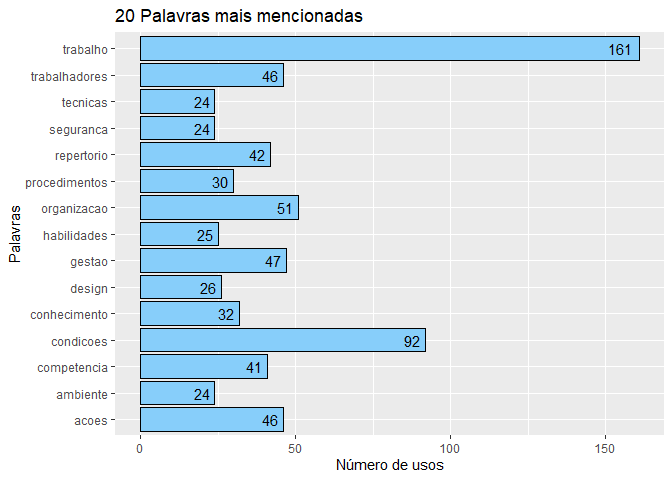

**R Packages**


```r
# Pacotes e Funções
library(tidyverse) # Manipulacao eficiente de dados
library(tidytext) # Manipulacao eficiente de texto
library(textreadr) # Leitura de pdf para texto
library(tm) # Pacote de mineracao de texto com stopwords 
library(wordcloud) # Grafico nuvem de palavras
library(igraph)
library(ggraph)
library(ggplot2)
library(dplyr)
library(pdftools)
library(RRPP)
```


```r
setwd("~/Text Mining")
```


**Text Normalization Function**


```r
# Função para normalizar texto
NormalizaParaTextMining <- function(texto){
 
  # Normaliza texto
  texto %>% 
    chartr(
      old = "áéíóúÁÉÍÓÚýÝàèìòùÀÈÌÒÙâêîôûÂÊÎÔÛãõÃÕñÑäëïöüÄËÏÖÜÿçÇ´`^~¨:.!?&$@#0123456789",
      new = "aeiouAEIOUyYaeiouAEIOUaeiouAEIOUaoAOnNaeiouAEIOUycC                       ",
      x = .) %>% # Elimina acentos e caracteres desnecessarios
    str_squish() %>% # Elimina espacos excedentes 
    tolower() %>% # Converte para minusculo
    return() # Retorno da funcao
}
```

**Text Cleaning Function**


```r
# Função para Palavras que podem se retiradas

# Lista de palavras para remover
palavrasRemover <- c(stopwords(kind = "pt"), letters) %>%
  as.tibble() %>% 
  rename(Palavra = value) %>% 
  mutate(Palavra = NormalizaParaTextMining(Palavra))
```

```
## Warning: `as.tibble()` is deprecated, use `as_tibble()` (but mind the new semantics).
## This warning is displayed once per session.
```

**Read pdf**


```r
# Arquivo pdf
arquivoPdf <- "~/Text Mining/Frameworkhf.pdf"
```

**Tidynd text**


```r
TidyT <- arquivoPdf %>% 
  read_pdf() %>% 
  as.tibble() %>% 
  select(text) 
```
  
# Unigrams analysis

**Cleaning useless words for single word analysis**


```r
  CleanW <- TidyT  %>% 
  unnest_tokens(Palavra, text) %>% 
  mutate(Palavra = NormalizaParaTextMining(Palavra)) %>% 
  anti_join(palavrasRemover)
```

```
## Joining, by = "Palavra"
```
  
**Counting single words**


```r
  frequenciaPalavras <-  CleanW  %>% 
  count(Palavra, sort = TRUE) %>% 
  filter(Palavra != "") %>%
  arrange(desc(n)) 


# Visualiza frequencia de palavras
DT::datatable(frequenciaPalavras)
```

<!--html_preserve--><div id="htmlwidget-1794a6f9dedf02253bc3" style="width:100%;height:auto;" class="datatables html-widget"></div>
<script type="application/json" data-for="htmlwidget-1794a6f9dedf02253bc3">{"x":{"filter":"none","data":[["1","2","3","4","5","6","7","8","9","10","11","12","13","14","15","16","17","18","19","20","21","22","23","24","25","26","27","28","29","30","31","32","33","34","35","36","37","38","39","40","41","42","43","44","45","46","47","48","49","50","51","52","53","54","55","56","57","58","59","60","61","62","63","64","65","66","67","68","69","70","71","72","73","74","75","76","77","78","79","80","81","82","83","84","85","86","87","88","89","90","91","92","93","94","95","96","97","98","99","100","101","102","103","104","105","106","107","108","109","110","111","112","113","114","115","116","117","118","119","120","121","122","123","124","125","126","127","128","129","130","131","132","133","134","135","136","137","138","139","140","141","142","143","144","145","146","147","148","149","150","151","152","153","154","155","156","157","158","159","160","161","162","163","164","165","166","167","168","169","170","171","172","173","174","175","176","177","178","179","180","181","182","183","184","185","186","187","188","189","190","191","192","193","194","195","196","197","198","199","200","201","202","203","204","205","206","207","208","209","210","211","212","213","214","215","216","217","218","219","220","221","222","223","224","225","226","227","228","229","230","231","232","233","234","235","236","237","238","239","240","241","242","243","244","245","246","247","248","249","250","251","252","253","254","255","256","257","258","259","260","261","262","263","264","265","266","267","268","269","270","271","272","273","274","275","276","277","278","279","280","281","282","283","284","285","286","287","288","289","290","291","292","293","294","295","296","297","298","299","300","301","302","303","304","305","306","307","308","309","310","311","312","313","314","315","316","317","318","319","320","321","322","323","324","325","326","327","328","329","330","331","332","333","334","335","336","337","338","339","340","341","342","343","344","345","346","347","348","349","350","351","352","353","354","355","356","357","358","359","360","361","362","363","364","365","366","367","368","369","370","371","372","373","374","375","376","377","378","379","380","381","382","383","384","385","386","387","388","389","390","391","392","393","394","395","396","397","398","399","400","401","402","403","404","405","406","407","408","409","410","411","412","413","414","415","416","417","418","419","420","421","422","423","424","425","426","427","428","429","430","431","432","433","434","435","436","437","438","439","440","441","442","443","444","445","446","447","448","449","450","451","452","453","454","455","456","457","458","459","460","461","462","463","464","465","466","467","468","469","470","471","472","473","474","475","476","477","478","479","480","481","482","483","484","485","486","487","488","489","490","491","492","493","494","495","496","497","498","499","500","501","502","503","504","505","506","507","508","509","510","511","512","513","514","515","516","517","518","519","520","521","522","523","524","525","526","527","528","529","530","531","532","533","534","535","536","537","538","539","540","541","542","543","544","545","546","547","548","549","550","551","552","553","554","555","556","557","558","559","560","561","562","563","564","565","566","567","568","569","570","571","572","573","574","575","576","577","578","579","580","581","582","583","584","585","586","587","588","589","590","591","592","593","594","595","596","597","598","599","600","601","602","603","604","605","606","607","608","609","610","611","612","613","614","615","616","617","618","619","620","621","622","623","624","625","626","627","628","629","630","631","632","633","634","635","636","637","638","639","640","641","642","643","644","645","646","647","648","649","650","651","652","653","654","655","656","657","658","659","660","661","662","663","664","665","666","667","668","669","670","671","672","673","674","675","676","677","678","679","680","681","682","683","684","685","686","687","688","689","690","691","692","693","694","695","696","697","698","699","700","701","702","703","704","705","706","707","708","709","710","711","712","713","714","715","716","717","718","719","720","721","722","723","724","725","726","727","728","729","730","731","732","733","734","735","736","737","738","739","740","741","742","743","744","745","746","747","748","749","750","751","752","753","754","755","756","757","758","759","760","761","762","763","764","765","766","767","768","769","770","771","772","773","774","775","776","777","778","779","780","781","782","783","784","785","786","787","788","789","790","791","792","793","794","795","796","797","798","799","800","801","802","803","804","805","806","807","808","809","810","811","812","813","814","815","816","817","818","819","820","821","822","823","824","825","826","827","828","829","830","831","832","833","834","835","836","837","838","839","840","841","842","843","844","845","846","847","848","849","850","851","852","853","854","855","856","857","858","859","860","861","862","863","864","865","866","867","868","869","870","871","872","873","874","875","876","877","878","879","880","881","882","883","884","885","886","887","888","889","890","891","892","893","894","895","896","897","898","899","900","901","902","903","904"],["trabalho","condicoes","organizacao","gestao","acoes","trabalhadores","repertorio","competencia","conhecimento","procedimentos","design","habilidades","ambiente","seguranca","tecnicas","equipe","riscos","sobre","comunicacao","informacoes","informacao","decisao","regras","saude","internas","plano","recursos","tomada","interfaces","tarefas","pessoas","situacoes","consciencia","possui","colegas","treinamentos","lideranca","outros","politicas","tempo","atividade","capacidade","colaboradores","contratadas","empresas","equipamentos","existe","ferramentas","operacao","programa","realizacao","relacoes","atitudes","atividades","competencias","desempenho","externos","membros","possuem","processos","risco","situacional","suporte","alem","aprendizagem","avaliacao","confianca","cultura","decisoes","disponibilidade","emergencia","estoque","eventos","evitar","exercicios","existem","instrucoes","operacoes","qualidade","relevancia","relevantes","requisitos","sociais","terceirizados","verificam","acidentes","adequada","ambientais","bem","conteudos","desenvolvimento","erros","estrutura","experiencia","identificados","incidentes","necessarios","responsabilidades","acreditam","adequado","adequados","alocacao","analise","antes","areas","associados","atencao","avaliacoes","buscam","cada","caso","clara","conforto","conhecimentos","conta","contratualizacao","durante","eletricos","eletromagneticos","envolvendo","estresse","externas","fadiga","feedback","fisiologicas","formal","frequencia","funcoes","juridico","mapeamento","mudancas","necessidades","periodicas","praticas","psicologicas","quanto","reconhecimento","regularmente","simulacoes","termicos","todos","turno","acompanhamento","adaptacao","ainda","ajustes","algo","alta","aplicabilidade","apoio","aprendidas","claramente","classificacao","compartilhamento","conflitos","conhecem","consideram","conteudo","definicao","definidas","diferente","documentados","emocional","entendimento","equipamento","estabelecidos","estado","estrategia","execucao","experiencias","exposicao","falhas","fluxo","folga","forma","gerenciamento","importantes","iniciar","licoes","manutencao","mental","motivacao","natureza","necessarias","nivel","novos","objetivos","planos","plataformas","podem","preocupacao","principais","reconhece","remuneracao","revisao","ruido","saberes","satisfeitos","sinais","sistema","situacao","sob","stakeholders","tarefa","tecnicos","trabalhador","valores","verificacao","visao","abrangencia","abrangentes","acesso","acontecer","alarmes","alternativas","ambiental","antecipam","anteriores","aprender","aprendizado","apropriado","apropriados","aprovacao","assume","atendimento","atraves","atribuicao","atuais","autonomia","backups","bens","bom","cansados","carreira","certo","claras","clareza","claros","colaborador","compartilham","completas","comportamento","compreensao","compreensivo","comum","conscientes","conseguem","consequencias","consideracao","considerando","contatos","continuas","corresponsabilizacao","costumam","credito","crencas","criacao","criticos","dar","demais","demonstram","descreva","detalhes","determinar","deve","disponibilizada","disponiveis","efeito","embarcado","enxergar","escrita","espaco","espacos","especificos","estabelece","excessivamente","exemplo","experientes","externa","facilitar","falada","familiar","flexibilidade","focados","funcionarios","futuros","gas","habito","iluminacao","impactos","implementacao","importancia","individuos","inesperados","informais","inspecao","insumos","lazer","leitura","levando","linguagem","mantem","mar","medidas","mercadorias","mudaram","necessidade","negativas","ocorridos","oleo","onde","opcoes","parar","participacao","perigosas","permitem","pessoal","possiveis","posteriormente","potencial","precisa","pressao","preve","prevencao","prioridade","prioridades","privacidade","problema","problemas","procurados","projetadas","promove","questionam","realizadas","recebidos","reconhecem","recrutamento","rede","regulares","relacional","resolver","respeito","resultados","satisfacao","satisfatoria","sentem","serem","servicos","setor","sistemas","social","solicita","sucesso","supervisao","tecnico","temperatura","ter","termos","teste","tipo","todas","todo","tornarem","trabalhar","treinamento","turnos","verificacoes","vez","vibracoes","visual","vivencia","aberto","abordam","acompanha","acordo","adaptadas","adequacao","adequadamente","adesao","adota","adotam","adotar","adversos","afetam","agem","agressoes","ajudando","ajudar","ajustar","alerta","alteracao","alteracoes","alternativos","ambiguos","ameacas","ampliar","analiticas","anormais","anormalidades","antigos","apoia","apoiar","apropriada","apropriadas","aquisicao","arquitetura","assegurar","associado","assumem","atender","atentos","atitude","ativo","atribuicoes","atuados","atual","atualizacoes","atuante","atuantes","auditorias","aumentando","autoconhecimento","autoridade","auxiliar","avalia","avaliar","avancar","avisos","barulho","base","biologico","boas","briefing","busca","buscando","buscar","calma","calmo","camarote","camarotes","canais","cansaco","capacitacao","capacitacoes","carga","causa","causar","certa","cheiros","chuva","cientes","clima","climaticas","colaboracao","comando","comandos","compartilha","compartilhar","complexas","complexidade","compreender","comunidacao","concentram","concessoes","conclusao","condicao","conduz","confiam","confiavel","confirmacao","confirmar","conflito","conforme","conjunta","conservadora","consistencia","consistentes","construcao","construir","construtivo","consulta","consultados","contam","contato","contem","continua","continuamente","contras","contribuem","contribuicao","controle","cooperam","coordenacao","coragem","corporal","correto","cotidiano","crise","critica","criticas","cronograma","culpa","culpados","culturais","culturas","curto","dados","dedicam","definido","degradadas","deixa","demandas","demonstra","demonstrando","demostram","desafios","desagradaveis","desconforto","descrever","descricao","descritas","desenvolvido","destino","desviarem","desvios","devido","dialogo","diarias","diferentes","disponibiliza","disponivel","dispostos","disseminacao","distracao","distribuir","diversidade","diversos","documentadas","duvidas","educacao","efeitos","efetividade","eficacia","eletrica","emergencias","energia","enfase","enfatiza","enfocam","entorno","entrada","entram","envolver","envolvido","equilibrio","equipes","ergonomico","errado","escuta","especial","esperado","espirito","estabelecido","estilo","estruturacao","etapas","etc","evitando","executa","executadas","executar","exigir","existente","expectativas","expertise","expressar","externo","faceis","facilita","falta","familiarizadas","familiarizados","fatos","faz","feedbacks","feita","ferias","final","fontes","formato","fornece","fornecendo","fornecer","fornecida","funcionamento","funcionando","garante","genero","geral","geram","gerar","gerenciar","gostam","gravidade","habilidade","hierarquica","higiene","horarios","identifica","identificadas","identificam","identificando","identificar","imagem","impacto","implementam","implementar","impopular","importando","improvisacao","incentiva","incentivado","incluindo","incompatibilidades","indicacoes","indicadores","individuais","individuo","inesperado","informados","iniciativa","iniciativas","inspecoes","instalacoes","instrumentos","integrante","interesse","interferir","interna","internos","interpretar","interrompem","interrupcoes","intervem","introducao","investigacao","investigacoes","janelas","jornadas","julgamento","lampadas","leva","lidar","lidera","liderancas","ligacoes","limitacoes","limpeza","limpo","locais","local","longas","los","mapa","margem","materiais","mecanismos","medicos","medio","meios","melhoria","membro","mesmos","mestra","metas","minimizar","momento","monitoramento","monotonas","necessaria","necessario","niveis","noite","normas","novas","numero","objetividade","observacao","observancia","observando","obtencao","ocorrencias","odores","opcao","operacionais","opiniao","opinioes","oportunidade","oportuno","organizacionais","organizacional","orientadas","orientado","orientados","origem","outra","ouvir","padrao","paises","palavras","papel","paradas","participam","partir","passadas","passar","passos","pausas","pedem","pedindo","pensamento","pequenas","pequenos","percebem","percebidas","percebidos","percepcao","perfil","pericia","perigos","periodo","permanece","permitindo","permitir","pertence","pertencimento","perturba","perturbam","planejada","planejado","planejam","planejamento","poderao","posicao","positiva","positivamente","possam","potenciais","pouco","prazo","prazos","pre","preocupacoes","preparacao","pressupostos","prestam","principios","priorizam","pro","proatividade","produtos","programacao","programadas","progresso","projecao","prolongados","promocao","prontamente","prontos","proporciona","propria","propriedade","proprio","pros","protecao","proveniencia","provenientes","providencias","publicos","qualquer","questionadora","questionamento","questoes","quimicos","raiz","rapida","razoaveis","reacoes","reajam","realidades","realiza","realizada","realizar","reatribuir","reavaliacao","reavaliam","recebidas","recentes","recepcao","recompensas","recuam","redefinir","redundantes","reexame","reexamina","refletindo","reformulacao","relacionados","relacionamento","relatam","relato","relevante","religiosas","repertorios","repetitivas","repetitividade","reportar","requeridas","residuos","resolucao","respeitada","responder","responsabilidade","resposta","resultado","retrospectivamente","reunem","reunioes","revisados","revistos","rigidas","rotacoes","sabem","sairem","satisfatorio","seco","seguir","sempre","senioridade","sequencia","ser","sido","significativamente","similares","sistematicas","sobrecarregado","socioeconomicas","sol","sonoras","status","stress","submetidos","substancias","suficientemente","sugestoes","sugira","supervisionados","suposicoes","sustancias","tabela","tampouco","tecnica","tendencias","tendo","testes","tintas","toda","tolerancia","tolerante","toma","tomam","torna","tornam","toxicas","trabalharem","transmitir","transparencia","transporte","treinado","trilha","turnover","umidade","umido","unidade","usabilidade","usam","uso","usos","usuarios","utilizacao","valorizacao","valorizam","varios","ventilacao","ventilados","vento","verbais","verificar","vezes","vida","vigor","visibilidade","vista","voluntariamente"],[161,92,51,47,46,46,42,41,32,30,26,25,24,24,24,23,23,23,20,19,18,17,17,17,16,14,14,14,13,13,12,12,11,11,10,10,9,9,9,9,8,8,8,8,8,8,8,8,8,8,8,8,7,7,7,7,7,7,7,7,7,7,7,6,6,6,6,6,6,6,6,6,6,6,6,6,6,6,6,6,6,6,6,6,6,5,5,5,5,5,5,5,5,5,5,5,5,5,4,4,4,4,4,4,4,4,4,4,4,4,4,4,4,4,4,4,4,4,4,4,4,4,4,4,4,4,4,4,4,4,4,4,4,4,4,4,4,4,4,4,4,4,3,3,3,3,3,3,3,3,3,3,3,3,3,3,3,3,3,3,3,3,3,3,3,3,3,3,3,3,3,3,3,3,3,3,3,3,3,3,3,3,3,3,3,3,3,3,3,3,3,3,3,3,3,3,3,3,3,3,3,3,3,3,3,3,3,3,3,2,2,2,2,2,2,2,2,2,2,2,2,2,2,2,2,2,2,2,2,2,2,2,2,2,2,2,2,2,2,2,2,2,2,2,2,2,2,2,2,2,2,2,2,2,2,2,2,2,2,2,2,2,2,2,2,2,2,2,2,2,2,2,2,2,2,2,2,2,2,2,2,2,2,2,2,2,2,2,2,2,2,2,2,2,2,2,2,2,2,2,2,2,2,2,2,2,2,2,2,2,2,2,2,2,2,2,2,2,2,2,2,2,2,2,2,2,2,2,2,2,2,2,2,2,2,2,2,2,2,2,2,2,2,2,2,2,2,2,2,2,2,2,2,2,2,2,2,2,2,2,2,2,2,2,2,2,2,2,2,2,2,1,1,1,1,1,1,1,1,1,1,1,1,1,1,1,1,1,1,1,1,1,1,1,1,1,1,1,1,1,1,1,1,1,1,1,1,1,1,1,1,1,1,1,1,1,1,1,1,1,1,1,1,1,1,1,1,1,1,1,1,1,1,1,1,1,1,1,1,1,1,1,1,1,1,1,1,1,1,1,1,1,1,1,1,1,1,1,1,1,1,1,1,1,1,1,1,1,1,1,1,1,1,1,1,1,1,1,1,1,1,1,1,1,1,1,1,1,1,1,1,1,1,1,1,1,1,1,1,1,1,1,1,1,1,1,1,1,1,1,1,1,1,1,1,1,1,1,1,1,1,1,1,1,1,1,1,1,1,1,1,1,1,1,1,1,1,1,1,1,1,1,1,1,1,1,1,1,1,1,1,1,1,1,1,1,1,1,1,1,1,1,1,1,1,1,1,1,1,1,1,1,1,1,1,1,1,1,1,1,1,1,1,1,1,1,1,1,1,1,1,1,1,1,1,1,1,1,1,1,1,1,1,1,1,1,1,1,1,1,1,1,1,1,1,1,1,1,1,1,1,1,1,1,1,1,1,1,1,1,1,1,1,1,1,1,1,1,1,1,1,1,1,1,1,1,1,1,1,1,1,1,1,1,1,1,1,1,1,1,1,1,1,1,1,1,1,1,1,1,1,1,1,1,1,1,1,1,1,1,1,1,1,1,1,1,1,1,1,1,1,1,1,1,1,1,1,1,1,1,1,1,1,1,1,1,1,1,1,1,1,1,1,1,1,1,1,1,1,1,1,1,1,1,1,1,1,1,1,1,1,1,1,1,1,1,1,1,1,1,1,1,1,1,1,1,1,1,1,1,1,1,1,1,1,1,1,1,1,1,1,1,1,1,1,1,1,1,1,1,1,1,1,1,1,1,1,1,1,1,1,1,1,1,1,1,1,1,1,1,1,1,1,1,1,1,1,1,1,1,1,1,1,1,1,1,1,1,1,1,1,1,1,1,1,1,1,1,1,1,1,1,1,1,1,1,1,1,1,1,1,1,1,1,1,1,1,1,1,1,1,1,1,1,1,1,1,1,1,1,1,1,1,1,1,1,1,1,1,1,1,1,1,1,1,1,1,1,1,1,1,1,1,1,1,1,1,1,1,1,1,1,1,1,1,1,1,1,1,1,1,1,1,1,1,1,1,1,1,1,1,1,1,1]],"container":"<table class=\"display\">\n  <thead>\n    <tr>\n      <th> <\/th>\n      <th>Palavra<\/th>\n      <th>n<\/th>\n    <\/tr>\n  <\/thead>\n<\/table>","options":{"columnDefs":[{"className":"dt-right","targets":2},{"orderable":false,"targets":0}],"order":[],"autoWidth":false,"orderClasses":false}},"evals":[],"jsHooks":[]}</script><!--/html_preserve-->


## Top 15 words


```r
Top_15 <- arrange(frequenciaPalavras[1:15,1:2], desc(n)) 


# plotando as top 15 palavras.
Top_15 %>%
  ggplot(aes(x = Palavra, y = n)) +
  geom_col() +
  xlab(NULL) +
  coord_flip() +
  labs(y = "Contagem",
       x = "Palavras únicas",
       title = "Contagem de palavras únicas encontradas no Relatório")
```

<!-- -->

```r
barplot(frequenciaPalavras[1:15,1:2]$n,
        names.arg=frequenciaPalavras[1:15,1:2]$Palavra,
        ylab="Quantidade",
        ylim = c(40, 100),
        las = 2,
        col=rainbow(8),
        main="Top 15")
```

<!-- -->

## Word clouds


```r
# Cria nuvem de palavras
wordcloud(
  words = frequenciaPalavras$Palavra, 
  freq = frequenciaPalavras$n,
  min.freq = 2,
  max.words = 300, 
  random.order = FALSE, 
  rot.per = 0.35, 
  colors = brewer.pal(8, "Dark2")
)
```

<!-- -->


# Bigrams analysis

Analysing pairwise of words

**Cleaning useless words and tidyng data for pairwise word analysis**


```r
# remove "www" "http"
my_stopwords <- tibble(Palavra = c(as.character(1:3), 
                                    "www","http", ",", "de","os","nao","da","sao","um","dos","em","para","possui","sobre","das","na","uma","se","não", "outro", "entao", "existem", "outros", "aos", "quando", "seus", "seu", "nas", "na","evitar", "possuem", "ou", "sua", "então", "podem", "esta", "bem", "ha", "há","forem", "documentadas", "documentados", "alta"))

par_Palavras <- TidyT %>%
  unnest_tokens(Palavra, text, token = "ngrams", n = 2) %>% 
  mutate(Palavra = na.omit(NormalizaParaTextMining(Palavra))) %>%
  anti_join(palavrasRemover) %>%
  anti_join(my_stopwords) %>%
  separate(Palavra, c("word1", "word2"), sep = " ") %>%
  filter(!word1 %in% stop_words$word) %>%
  filter(!word2 %in% stop_words$word) %>%
  filter(!word1 %in% my_stopwords$Palavra) %>%
  filter(!word2 %in% my_stopwords$Palavra) %>%
  count(word1, word2, sort = TRUE)
```

```
## Joining, by = "Palavra"Joining, by = "Palavra"
```

```r
# remove NA
par_Palavras <- na.omit(par_Palavras)


DT::datatable(par_Palavras)
```

<!--html_preserve--><div id="htmlwidget-4392463b602206356c81" style="width:100%;height:auto;" class="datatables html-widget"></div>
<script type="application/json" data-for="htmlwidget-4392463b602206356c81">{"x":{"filter":"none","data":[["1","2","3","4","5","6","7","8","9","10","11","12","13","14","15","16","17","18","19","20","21","22","23","24","25","26","27","28","29","30","31","32","33","34","35","36","37","38","39","40","41","42","43","44","45","46","47","48","49","50","51","52","53","54","55","56","57","58","59","60","61","62","63","64","65","66","67","68","69","70","71","72","73","74","75","76","77","78","79","80","81","82","83","84","85","86","87","88","89","90","91","92","93","94","95","96","97","98","99","100","101","102","103","104","105","106","107","108","109","110","111","112","113","114","115","116","117","118","119","120","121","122","123","124","125","126","127","128","129","130","131","132","133","134","135","136","137","138","139","140","141","142","143","144","145","146","147","148","149","150","151","152","153","154","155","156","157","158","159","160","161","162","163","164","165","166","167","168","169","170","171","172","173","174","175","176","177","178","179","180","181","182","183","184","185","186","187","188","189","190","191","192","193","194","195","196","197","198","199","200","201","202","203","204","205","206","207","208","209","210","211","212","213","214","215","216","217","218","219","220","221","222","223","224","225","226","227","228","229","230","231","232","233","234","235","236","237","238","239","240","241","242","243","244","245","246","247","248","249","250","251","252","253","254","255","256","257","258","259","260","261","262","263","264","265","266","267","268","269","270","271","272","273","274","275","276","277","278","279","280","281","282","283","284","285","286","287","288","289","290","291","292","293","294","295","296","297","298","299","300","301","302","303","304","305","306","307","308","309","310","311","312","313","314","315","316","317","318","319","320","321","322","323","324","325","326","327","328","329","330","331","332","333","334","335","336","337","338","339","340","341","342","343","344","345","346","347","348","349","350","351","352","353","354","355","356","357","358","359","360","361","362","363","364","365","366","367","368","369","370","371","372","373","374","375","376","377","378","379","380","381","382","383","384","385","386","387","388","389","390","391","392","393","394","395","396","397","398","399","400","401","402","403","404","405","406","407","408","409","410","411","412","413","414","415","416","417","418","419","420","421","422","423","424","425","426","427","428","429","430","431","432","433","434","435","436","437","438","439","440","441","442","443","444","445","446","447","448","449","450","451","452","453","454","455","456","457","458","459","460","461","462","463","464","465","466","467","468","469","470","471","472","473","474","475","476","477","478","479","480","481","482","483","484","485","486","487","488","489","490","491","492","493","494","495","496","497","498","499","500","501","502","503","504","505","506","507","508","509","510","511","512","513","514","515","516","517","518","519","520","521","522","523","524","525","526","527","528","529","530","531","532","533","534","535","536","537","538","539","540","541","542","543","544","545","546","547","548","549","550","551","552","553","554","555","556","557","558","559","560","561","562","563","564","565","566","567","568","569","570","571","572","573","574","575","576","577","578","579","580","581","582","583","584","585","586","587","588","589","590","591","592","593","594","595","596","597","598","599","600","601","602","603","604","605","606","607","608","609","610","611","612","613","614","615","616","617","618","619","620","621","622","623","624","625","626","627","628","629","630","631","632","633","634","635","636","637","638","639","640","641","642","643","644","645","646","647","648","649","650","651","652","653","654","655","656","657","658","659","660","661","662","663","664","665","666","667","668","669","670","671","672","673","674","675","676","677","678","679","680","681","682","683","684","685","686","687","688","689","690","691","692","693","694","695","696","697","698","699","700","701","702","703","704","705","706","707","708","709","710","711","712","713","714","715","716","717","718","719","720","721","722","723","724","725","726","727","728","729","730","731","732","733","734","735","736","737","738","739","740","741","742","743","744","745","746","747","748","749","750","751","752","753","754","755","756","757","758","759","760","761","762","763","764","765","766","767","768","769","770","771","772","773","774","775","776","777","778","779","780","781","782","783","784","785","786","787","788","789","790","791","792","793","794","795","796","797","798","799","800","801","802","803","804","805","806","807","808","809","810","811","812","813","814","815","816","817","818","819","820","821","822","823","824","825","826","827","828","829","830","831","832","833","834","835","836","837","838","839","840","841","842","843","844","845","846","847","848","849","850","851","852","853","854","855","856","857","858","859","860","861","862","863","864","865","866","867","868","869","870","871","872","873","874","875","876","877","878","879","880","881","882","883","884","885","886","887","888","889","890","891","892","893","894","895","896","897","898","899","900","901","902","903"],["competencia","acoes","trabalho","trabalho","trabalho","condicoes","trabalho","condicoes","empresas","acoes","consciencia","tecnicas","acoes","condicoes","conhecimento","trabalho","trabalho","trabalho","trabalho","interfaces","recursos","eletricos","estrutura","fisiologicas","formal","juridico","psicologicas","riscos","riscos","situacoes","situacoes","tecnicas","tecnicas","termicos","trabalho","acoes","atitudes","conhecimento","conteudo","contratualizacao","estao","habilidades","licoes","operacoes","politicas","procedimentos","riscos","saberes","saude","saude","saude","stakeholders","tecnicas","trabalhadores","trabalhadores","trabalhadores","trabalho","adequados","ao","apoio","associados","avaliacoes","cada","capacidade","claramente","colaboradores","comunicacao","comunicacao","condicoes","confianca","conhecimento","consequencias","contatos","costumam","credito","cultura","decisao","eletromagneticos","equipe","estao","excessivamente","experiencia","experiencias","falada","ferramentas","foram","incidentes","informacao","informacao","informacao","informacao","informacoes","internas","internas","mapeamento","mercadorias","nem","operacao","organizacao","organizacao","organizacao","periodicas","pessoas","pessoas","plataformas","posteriormente","procedimentos","programa","realizadas","recursos","recursos","requisitos","riscos","satisfatoria","sistema","sociais","suporte","tecnicas","tecnicos","terceirizados","trabalhadores","trabalhadores","trabalhadores","trabalhadores","trabalhadores","trabalho","trabalho","trabalho","trabalho","trabalho","treinamentos","verificacoes","verificam","visual","aberto","abordam","acidentes","acoes","acoes","acoes","acoes","acontecer","acordo","acreditam","adequada","adequada","adotam","adotar","alarmes","alerta","algo","algo","alteracoes","ambientais","ambientais","ambientais","ambientais","ambiental","ambiente","ambiente","ameacas","anormais","anormalidades","antigos","aplicabilidade","aplicabilidade","aplicabilidade","apoia","aprendidas","aprendizagem","aprendizagem","aprendizagem","aprendizagem","aprendizagem","aprendizagem","aquisicao","arquitetura","assumem","atencao","atitude","atitudes","atitudes","atitudes","atitudes","atividade","atividade","atividade","atividade","atividades","atividades","atividades","atividades","atividades","atividades","atribuicoes","atualizacoes","autoconhecimento","autoridade","avaliacao","avaliacoes","avisos","barulho","base","bom","bom","busca","buscam","buscam","buscam","buscar","cada","cada","calma","calmo","camarotes","cansados","cansados","capacidade","capacidade","capacitacoes","carreira","causa","causar","certa","chuva","clara","claramente","claras","claros","climaticas","colaboracao","colaborador","colaboradores","colaboradores","colaboradores","colaboradores","colegas","colegas","comandos","como","como","como","compartilham","compartilhamento","compartilhar","competencias","competencias","competencias","competencias","completas","complexidade","comportamento","compreender","compreensao","comum","comunicacao","comunicacao","comunicacao","comunicacao","comunicacao","comunicacao","comunicacao","comunicacao","comunicacao","comunicacao","comunicacao","comunidacao","conclusao","condicoes","condicoes","condicoes","condicoes","condicoes","conduz","confianca","confianca","confiavel","conflito","conflitos","conhecimento","conhecimento","conhecimento","conhecimentos","conhecimentos","conhecimentos","conseguem","conseguem","conservadora","consideracao","consideram","consideram","considerando","construcao","consultados","conta","continuamente","continuas","contratadas","contratualizacao","corporal","cotidiano","criacao","crise","critica","criticos","culpados","cultura","dar","dar","decisao","decisao","decisao","decisao","decisao","decisao","decisao","decisao","decisoes","decisoes","definicao","definidas","definido","degradadas","deixa","demais","demandas","demonstra","demonstram","demonstram","demonstrando","demostram","desafios","desagradaveis","descreva","descrever","descricao","desempenho","desempenho","desempenho","desenvolvido","design","design","detalhes","determinar","deve","dialogo","diarias","diferentes","disponibilidade","disponibiliza","disponiveis","diversidade","diversos","efeitos","eletromagneticos","embarcado","emergencia","emergencia","emergencia","emocional","emocional","energia","entendimento","entendimento","entendimento","entre","envolvendo","envolver","enxergar","equilibrio","equipamento","equipamentos","equipamentos","equipe","equipe","equipe","equipe","equipe","equipe","equipe","equipe","equipe","equipe","equipe","equipe","equipe","equipe","equipe","equipes","erros","erros","escrita","escrita","esperado","estabelece","estabelece","estado","estao","estao","estao","estao","estao","estao","estao","estao","estao","estao","estiverem","estresse","estresse","eventos","eventos","evitando","execucao","execucao","executadas","executar","exemplo","exemplo","exercicios","exigir","existe","experiencia","expertise","expressar","externa","externas","externas","externas","externas","externos","externos","externos","externos","fadiga","fadiga","fadiga","fatos","feedback","feedback","feedback","feita","ferramentas","ferramentas","ferramentas","flexibilidade","folga","folga","foram","foram","forma","forma","formato","fornece","fornecendo","fornecer","fornecida","frequencia","funcionarios","funcoes","funcoes","futuros","futuros","gas","geral","geram","gerar","gestao","habilidades","hierarquica","horarios","identifica","identificam","identificar","imagem","impactos","implementam","impopular","importantes","improvisacao","incluindo","incompatibilidades","indicadores","inesperado","informacao","informacao","informacao","informacao","informacao","informacoes","informacoes","informacoes","informacoes","informacoes","informacoes","informacoes","informacoes","iniciativa","inspecao","instalacoes","instrucoes","instrumentos","insumos","integrante","interfaces","interfaces","interfaces","interfaces","interfaces","interfaces","interna","internas","internas","internas","internas","internas","internas","internas","internas","internas","internas","internas","internas","intervem","janelas","jornadas","lidera","lideranca","lideranca","lideranca","lideranca","ligacoes","limpo","linguagem","linguagem","manutencao","mar","medicos","medidas","medio","meios","melhoria","mental","mental","mesmos","mestra","metas","monitoramento","motivacao","mudancas","mudancas","mudaram","muito","muito","necessarias","necessario","necessarios","necessidades","negativas","nivel","noite","nos","nos","nos","nos","novas","novos","novos","novos","objetividade","objetivos","observando","ocorrencias","odores","opcao","opcoes","opcoes","operacao","operacao","operacao","operacao","operacoes","operacoes","operacoes","oportuno","organizacao","organizacao","organizacao","organizacao","organizacao","organizacionais","organizacional","orientadas","outra","padrao","paises","palavras","paradas","passadas","pausas","pela","pelas","pelas","pelo","pelo","pelo","pelo","pequenas","pequenos","percebidos","perigos","perigosas","perigosas","permanece","permitem","permitem","permitindo","pertence","pessoal","pessoas","pessoas","pessoas","pessoas","pessoas","pessoas","pessoas","planejado","planejam","plano","plataformas","poderao","politicas","por","por","por","posicao","positivamente","possam","possiveis","possiveis","pouco","prazo","prazos","pre","pressao","pressao","prestam","preve","principais","principais","principais","priorizam","privacidade","pro","problemas","problemas","procedimentos","procedimentos","procedimentos","procedimentos","procedimentos","procedimentos","procedimentos","procedimentos","procedimentos","procedimentos","procedimentos","procedimentos","processos","processos","processos","produtos","programadas","projetadas","promove","prontos","proporciona","propria","proprio","proveniencia","publicos","qual","qualquer","quem","quem","quem","questoes","quimicos","razoaveis","realiza","realizada","realizar","reatribuir","recebidos","recebidos","recompensas","recursos","recursos","recursos","redefinir","reexamina","regulares","regularmente","relacional","relacional","relatam","relevante","relevantes","religiosas","requeridas","residuos","resolver","resolver","respeitada","respeito","respeito","responder","responsabilidade","responsabilidades","responsabilidades","resultado","resultados","retrospectivamente","reunem","revisados","risco","risco","riscos","riscos","rotacoes","ruido","sabem","sairem","satisfatorio","saude","saude","seco","seguranca","seguranca","seguranca","seguranca","seguranca","seguranca","seguranca","seguranca","seguranca","seguranca","seguranca","seguranca","seguranca","seja","sem","sempre","serem","serem","sido","similares","sinais","sistemas","situacao","situacao","situacional","situacional","situacional","situacional","situacional","situacional","situacional","situacoes","situacoes","sob","sob","sociais","sociais","sociais","sociais","socioeconomicas","sol","solicita","sonoras","stress","suas","substancias","sucesso","sucesso","suficientemente","sugestoes","supervisionados","suporte","suporte","sustancias","tabela","tampouco","tarefa","tarefas","tarefas","tarefas","tarefas","tarefas","tarefas","tecnica","tecnicas","tecnicas","tecnicas","tecnicas","tecnico","tecnicos","tem","tem","tempo","tempo","tempo","tendencias","tenha","ter","ter","terceirizados","terceirizados","tintas","todos","toma","tomada","tomam","torna","tornarem","toxicas","trabalhador","trabalhador","trabalhadores","trabalhadores","trabalhadores","trabalhadores","trabalhadores","trabalhadores","trabalhadores","trabalhadores","trabalhadores","trabalhadores","trabalhadores","trabalhadores","trabalhadores","trabalhadores","trabalhadores","trabalhadores","trabalhadores","trabalhadores","trabalhadores","trabalhadores","trabalhar","trabalho","trabalho","trabalho","trabalho","trabalho","trabalho","trabalho","trabalho","trabalho","trabalho","trabalho","trabalho","trabalho","trabalho","trabalho","trabalho","trabalho","trabalho","trabalho","trabalho","trabalho","trabalho","trabalho","trabalho","trabalho","trabalho","trabalho","trabalho","trabalho","trabalho","trabalho","trabalho","transmitir","treinamentos","treinamentos","treinamentos","treinamentos","turnos","turnos","turnover","uso","valores","valores","valores","varios","vento","vezes","vibracoes","vigor","visao","vista","vivencia","vivencia","voluntariamente"],["repertorio","habilidades","condicoes","design","ambiente","internas","regras","situacoes","contratadas","atitudes","situacional","consciencia","conhecimento","sociais","estoque","competencia","lideranca","organizacao","recursos","informacao","conteudos","termicos","juridico","condicoes","contratualizacao","formal","saude","associados","eletricos","fisiologicas","psicologicas","tomada","trabalho","eletromagneticos","politicas","saberes","confianca","conhecimento","relevancia","avaliacao","satisfeitos","tecnicas","aprendidas","gestao","ambientais","conteudo","conhecimento","tecnicos","emocional","fadiga","mental","externos","comunicacao","acreditam","conhecem","estao","gestao","condicoes","trabalho","social","ao","periodicas","operacao","relacional","identificados","gestao","capacidade","comunicacao","externas","confianca","experiencia","negativas","informais","enxergar","pelo","crencas","condicoes","condicoes","suporte","claramente","focados","vivencia","anteriores","visual","recursos","identificados","ocorridos","disponibilizada","existe","falada","relevancia","importantes","espaco","ruido","compreensivo","perigosas","muito","condicoes","conta","gestao","promove","realizadas","condicoes","plano","operacoes","gestao","gestao","ambiental","posteriormente","externos","necessarios","estabelecidos","ambientais","condicoes","tecnico","cultura","familiar","capacidade","repertorio","estrutura","compartilham","costumam","reconhecem","tem","verificam","alocacao","cultura","informacoes","preve","qualidade","recebidos","periodicas","regularmente","escrita","reconhece","procedimentos","estrutura","atuais","envolvendo","levando","necessarias","recuam","relacoes","ser","onde","tenha","turnos","desvios","avisos","los","fora","inesperado","importantes","competencia","programa","qualidade","quanto","gestao","externo","proporciona","externas","degradadas","reconhece","atraves","adequacao","clareza","relevancia","positivamente","condicoes","abrangencia","analise","compartilhamento","frequencia","licoes","qualidade","criacao","organizacional","responsabilidade","adequados","questionadora","autoconhecimento","autonomia","iniciativa","motivacao","conjunta","critica","planejada","realizada","competencia","condicoes","desviarem","estao","fora","repetitivas","pausas","regulares","competencia","tecnica","diferente","continuas","instrumentos","perturba","nos","desempenho","trabalho","por","ampliar","confirmar","informacoes","adaptacao","atividade","integrante","nos","sob","condicoes","condicoes","durante","adequada","deles","continuas","estabelecido","raiz","acidentes","mesmo","sol","condicoes","qual","condicoes","isto","condicao","relacoes","condicoes","compartilha","condicoes","estao","provenientes","experientes","verificam","antes","consideram","janelas","paradas","voluntariamente","estruturacao","informacoes","atuais","atuantes","definidas","gestao","abrangentes","condicoes","disponivel","todas","condicoes","acontecer","associado","competencia","deixa","envolvendo","estrutura","externa","externas","fluxo","interna","internas","reconhecimento","entre","sem","anormais","climaticas","criticas","recentes","socioeconomicas","regularmente","nos","relato","condicoes","concentram","competencia","cultura","existe","gestao","criticos","necessarios","relevantes","compreender","identificar","gestao","adequada","opinioes","tendencias","ainda","produtos","durante","sinais","gestao","orientadas","estrutura","supervisao","enfase","competencia","compartilhamento","gestao","planejam","competencia","condicoes","geral","feedback","suporte","analise","certa","competencia","consciencia","conservadora","considerando","implementacao","reconhecimento","demonstra","mesmo","clara","gestao","quem","competencia","todos","informados","analiticas","respeito","desconforto","preocupacao","coragem","preocupacao","competencia","condicoes","regras","situacoes","adequada","continuamente","regularmente","sob","pela","ergonomico","tolerante","necessarios","como","fornecer","aberto","condicoes","condicoes","apropriada","ferramentas","condicoes","realizar","publicos","adversos","existe","competencia","condicoes","envolvendo","gestao","condicoes","estao","eletrica","alem","comum","diferente","pros","todos","atividades","novos","entre","leva","necessarios","tem","antecipam","capacidade","competencia","estabelece","estilo","fornecendo","gestao","observancia","proatividade","relacoes","resolucao","tem","trabalharem","valorizacao","verificam","estao","competencia","por","comunicacao","gestao","priorizam","objetivos","relacionamento","atual","cientes","claras","consistentes","dispostos","familiarizadas","familiarizados","identificados","prontos","sempre","suficientemente","disponiveis","condicoes","emergencia","futuros","inesperados","tornarem","como","refletindo","treinamento","sob","relacoes","solicita","gestao","isso","treinamento","alem","existente","duvidas","estao","clima","condicoes","natureza","perigos","agressoes","comunicacao","consciencia","gestao","compartilhamento","jornadas","nivel","competencia","adota","apropriado","construtivo","demonstrando","ferramentas","habilidade","tempo","regras","competencia","condicoes","identificadas","projetadas","clara","rapida","adequado","feedback","suporte","informacoes","comunicacao","gestao","reajam","satisfacao","transparencia","competencia","consideram","competencia","habito","estresse","estresse","conduz","necessarias","competencia","turnos","opcoes","conflitos","claramente","clara","futuros","decisoes","considerando","estao","competencia","alarmes","entre","ambiguos","acontecer","alem","canais","consistencia","disponibilidade","incluindo","completas","gestao","mantem","plano","politicas","recebidas","relevantes","reportar","competencia","manutencao","treinamentos","regras","colegas","foram","facilita","design","disponibilidade","feedback","inspecao","qualidade","tolerancia","estao","conforto","iluminacao","instrucoes","limpeza","natureza","privacidade","substancias","temperatura","treinamentos","umidade","ventilacao","vibracoes","prontamente","onde","longas","pelo","enfatiza","estabelece","existe","politicas","entre","aumentando","apropriados","corporal","existe","vento","entre","apropriadas","prazo","alternativos","continua","condicoes","estao","reunem","competencia","riscos","auditorias","trabalho","existe","nos","significativamente","seco","umido","solicita","permitindo","condicoes","experiencia","condicoes","adequado","condicoes","colegas","conflitos","feedbacks","objetivos","realidades","desafios","equipamentos","usos","observando","claros","ainda","gestao","desagradaveis","entram","alternativas","competencia","demonstram","demostram","estao","foram","alem","condicoes","foram","competencia","disponibiliza","envolvendo","identificando","realiza","reexamina","condicoes","funcoes","pelas","atividade","buscam","diferentes","linguagem","programadas","buscando","rotacoes","equipe","competencias","questoes","bom","exemplo","risco","sucesso","falhas","sinais","relacoes","externos","risco","tintas","calmo","flexibilidade","ouvir","visibilidade","condicoes","atuante","acompanhamento","ajudando","capacitacao","definicao","estao","reexame","verificacao","competencia","concessoes","apoia","condicoes","lidar","claras","exemplo","informacoes","suas","hierarquica","acoes","ter","eventos","riscos","experientes","torna","estabelecidos","julgamento","assume","permanece","atencao","mecanismos","fontes","pressupostos","riscos","acoes","adequada","ativo","competencia","mesmo","atendimento","condicoes","contem","desempenho","flexibilidade","fluxo","gerenciamento","instalacoes","intervem","participacao","revisao","teste","especificos","organizacionais","permitem","quimicos","briefing","adequadamente","capacitacoes","antes","conforto","consciencia","trabalho","diferente","internos","pertence","outra","deve","faz","tem","culturais","sustancias","questionam","avaliacoes","durante","inspecoes","recursos","competencia","quanto","relacoes","antigos","backups","redundantes","prioridades","requisitos","assume","eventos","conhecimento","contatos","erros","competencia","competencia","diversidade","condicoes","medicos","problemas","situacoes","condicoes","pelas","pelo","competencia","por","individuais","quem","antes","gestao","sugira","conhecimentos","levando","biologico","quanto","atraves","mudaram","ferias","durante","quem","conforme","condicoes","condicoes","stress","nem","acompanha","assumem","competencia","condicoes","gestao","implementacao","orientado","pericia","prioridade","relacoes","sistematicas","suporte","tem","impopular","todos","disponiveis","atuados","executadas","feita","passadas","criticos","energia","competencia","exigir","atencao","busca","consciencia","projecao","questionamento","reconhecimento","visao","potenciais","similares","estresse","pressao","condicoes","pertencimento","rede","suporte","acesso","condicoes","atualizacoes","condicoes","condicoes","decisoes","mercadorias","competencia","final","ventilados","sonoras","como","motivacao","pro","toxicas","mestra","geram","trabalho","complexas","condicoes","contam","diarias","gestao","requeridas","relevante","gestao","importancia","satisfacao","treinamentos","condicoes","disponibilidade","origem","varios","adequado","competencia","correto","condicoes","sido","impacto","informacoes","comunicacao","existe","materiais","conscientes","medidas","decisao","providencias","clara","excessivamente","residuos","envolvido","reconhece","adotam","buscam","confiam","conseguem","consideram","contribuem","dedicam","enfocam","gostam","identificam","implementam","participam","percebem","prestam","questionam","relatam","sabem","sentem","tornam","valorizam","embarcado","abrangentes","alem","antes","arquitetura","carga","corresponsabilizacao","desenvolvido","devido","embarcado","espirito","estao","evitando","foram","fornece","gerenciamento","margem","numero","participacao","planejamento","praticas","programa","projetadas","quanto","reconhecimento","relacionados","relacoes","remuneracao","repetitividade","stakeholders","tendo","turnover","valores","informacoes","abordam","buscam","especificos","orientados","atribuicoes","prolongados","gestao","apropriado","atribuicao","percebidos","preparacao","contatos","chuva","usam","percebidas","condicoes","externa","indicacoes","tempo","utilizacao","informacoes"],[40,24,22,19,17,15,11,8,8,7,7,7,6,6,6,6,6,6,6,5,5,4,4,4,4,4,4,4,4,4,4,4,4,4,4,3,3,3,3,3,3,3,3,3,3,3,3,3,3,3,3,3,3,3,3,3,3,2,2,2,2,2,2,2,2,2,2,2,2,2,2,2,2,2,2,2,2,2,2,2,2,2,2,2,2,2,2,2,2,2,2,2,2,2,2,2,2,2,2,2,2,2,2,2,2,2,2,2,2,2,2,2,2,2,2,2,2,2,2,2,2,2,2,2,2,2,2,2,2,2,2,2,2,2,1,1,1,1,1,1,1,1,1,1,1,1,1,1,1,1,1,1,1,1,1,1,1,1,1,1,1,1,1,1,1,1,1,1,1,1,1,1,1,1,1,1,1,1,1,1,1,1,1,1,1,1,1,1,1,1,1,1,1,1,1,1,1,1,1,1,1,1,1,1,1,1,1,1,1,1,1,1,1,1,1,1,1,1,1,1,1,1,1,1,1,1,1,1,1,1,1,1,1,1,1,1,1,1,1,1,1,1,1,1,1,1,1,1,1,1,1,1,1,1,1,1,1,1,1,1,1,1,1,1,1,1,1,1,1,1,1,1,1,1,1,1,1,1,1,1,1,1,1,1,1,1,1,1,1,1,1,1,1,1,1,1,1,1,1,1,1,1,1,1,1,1,1,1,1,1,1,1,1,1,1,1,1,1,1,1,1,1,1,1,1,1,1,1,1,1,1,1,1,1,1,1,1,1,1,1,1,1,1,1,1,1,1,1,1,1,1,1,1,1,1,1,1,1,1,1,1,1,1,1,1,1,1,1,1,1,1,1,1,1,1,1,1,1,1,1,1,1,1,1,1,1,1,1,1,1,1,1,1,1,1,1,1,1,1,1,1,1,1,1,1,1,1,1,1,1,1,1,1,1,1,1,1,1,1,1,1,1,1,1,1,1,1,1,1,1,1,1,1,1,1,1,1,1,1,1,1,1,1,1,1,1,1,1,1,1,1,1,1,1,1,1,1,1,1,1,1,1,1,1,1,1,1,1,1,1,1,1,1,1,1,1,1,1,1,1,1,1,1,1,1,1,1,1,1,1,1,1,1,1,1,1,1,1,1,1,1,1,1,1,1,1,1,1,1,1,1,1,1,1,1,1,1,1,1,1,1,1,1,1,1,1,1,1,1,1,1,1,1,1,1,1,1,1,1,1,1,1,1,1,1,1,1,1,1,1,1,1,1,1,1,1,1,1,1,1,1,1,1,1,1,1,1,1,1,1,1,1,1,1,1,1,1,1,1,1,1,1,1,1,1,1,1,1,1,1,1,1,1,1,1,1,1,1,1,1,1,1,1,1,1,1,1,1,1,1,1,1,1,1,1,1,1,1,1,1,1,1,1,1,1,1,1,1,1,1,1,1,1,1,1,1,1,1,1,1,1,1,1,1,1,1,1,1,1,1,1,1,1,1,1,1,1,1,1,1,1,1,1,1,1,1,1,1,1,1,1,1,1,1,1,1,1,1,1,1,1,1,1,1,1,1,1,1,1,1,1,1,1,1,1,1,1,1,1,1,1,1,1,1,1,1,1,1,1,1,1,1,1,1,1,1,1,1,1,1,1,1,1,1,1,1,1,1,1,1,1,1,1,1,1,1,1,1,1,1,1,1,1,1,1,1,1,1,1,1,1,1,1,1,1,1,1,1,1,1,1,1,1,1,1,1,1,1,1,1,1,1,1,1,1,1,1,1,1,1,1,1,1,1,1,1,1,1,1,1,1,1,1,1,1,1,1,1,1,1,1,1,1,1,1,1,1,1,1,1,1,1,1,1,1,1,1,1,1,1,1,1,1,1,1,1,1,1,1,1,1,1,1,1,1,1,1,1,1,1,1,1,1,1,1,1,1,1,1,1,1,1,1,1,1,1,1,1,1,1,1,1,1,1,1,1,1,1,1,1,1,1,1,1,1,1,1,1,1,1,1,1,1,1,1,1,1,1,1,1,1,1,1,1,1,1,1,1,1,1,1,1,1]],"container":"<table class=\"display\">\n  <thead>\n    <tr>\n      <th> <\/th>\n      <th>word1<\/th>\n      <th>word2<\/th>\n      <th>n<\/th>\n    <\/tr>\n  <\/thead>\n<\/table>","options":{"columnDefs":[{"className":"dt-right","targets":3},{"orderable":false,"targets":0}],"order":[],"autoWidth":false,"orderClasses":false}},"evals":[],"jsHooks":[]}</script><!--/html_preserve-->


## Word graph network


```r
## Function to show word network
.Par_net = function(z) {
  par_Palavras %>%
  filter(n >= z) %>%
  graph_from_data_frame() %>%
  ggraph(layout = "fr") +
  geom_edge_link(aes(edge_alpha = n, edge_width = n)) +
  geom_node_point(color = "darkslategray4", size = 4) +
  geom_node_text(color = "red", aes(label = name), vjust = 1.8, size=3) +
  labs(title= "Word graph  - HF2 Framework",
       subtitle = paste("Pairwise analysis words >= ", z, " frequency",
       x = "", y = ""))
}

par(mfrow=c(2,2))


.Par_net(10)
```

<!-- -->

```r
.Par_net(5)
```

<!-- -->

```r
.Par_net(3)
```

<!-- -->


# Three-grams analysis


```r
trio_Palavras <- TidyT %>%
  unnest_tokens(Palavra, text, token = "ngrams", n = 3) %>%
  separate(Palavra, c("word1", "word2", "word3"), sep = " ") %>%
  filter(!word1 %in% stop_words$word,
         !word2 %in% stop_words$word,
         !word3 %in% stop_words$word,
         !word1 %in% my_stopwords$Palavra,
         !word2 %in% my_stopwords$Palavra,
         !word3 %in% my_stopwords$Palavra) %>%
  count(word1, word2, word3, sort = TRUE)

DT::datatable(trio_Palavras)
```

<!--html_preserve--><div id="htmlwidget-70e2577e8e2cbfdedab6" style="width:100%;height:auto;" class="datatables html-widget"></div>
<script type="application/json" data-for="htmlwidget-70e2577e8e2cbfdedab6">{"x":{"filter":"none","data":[["1","2","3","4","5","6","7","8","9","10","11","12","13","14","15","16","17","18","19","20","21","22","23","24","25","26","27","28","29","30","31","32","33","34","35","36","37","38","39","40","41","42","43","44","45","46","47","48","49","50","51","52","53","54","55","56","57","58","59","60","61","62","63","64","65","66","67","68","69","70","71","72","73","74","75","76","77","78","79","80","81","82","83","84","85","86","87","88","89","90","91","92","93","94","95","96","97","98","99","100","101","102","103","104","105","106","107","108","109","110","111","112","113","114","115","116","117","118","119","120","121","122","123","124","125","126","127","128","129","130","131","132","133","134","135","136","137","138","139","140","141","142","143","144","145","146","147","148","149","150","151","152","153","154","155","156","157","158","159","160","161","162","163","164","165","166","167","168","169","170","171","172","173","174","175","176","177","178","179","180","181","182","183","184","185","186","187","188","189","190","191","192","193","194","195","196","197","198","199","200","201","202","203","204","205","206","207","208","209","210","211","212","213","214","215","216","217","218","219","220","221","222","223","224","225","226","227","228","229","230","231","232","233","234","235","236","237","238","239","240","241","242","243","244","245","246","247","248","249","250","251","252","253","254","255","256","257","258","259","260","261","262","263","264","265","266","267","268","269","270","271","272","273","274","275","276","277","278","279","280","281","282","283","284","285","286","287","288","289","290","291","292","293","294","295","296","297","298","299","300","301","302","303","304","305","306","307","308","309","310","311","312","313","314","315","316","317","318","319","320","321","322","323","324","325","326","327","328","329","330","331","332","333","334","335","336","337","338","339","340","341","342","343","344","345","346","347","348","349","350","351","352","353","354","355","356","357","358","359","360","361","362","363","364","365","366","367","368","369","370","371","372","373","374","375","376","377","378","379","380","381","382","383","384","385","386","387","388","389","390","391","392","393","394","395","396","397","398","399","400","401","402","403","404","405","406","407","408","409","410","411","412","413","414","415","416","417","418","419","420","421","422","423","424","425","426","427","428","429","430","431","432","433","434","435","436","437","438","439","440","441","442","443","444","445","446","447","448","449","450","451","452","453","454","455","456","457","458","459","460","461","462","463","464","465","466","467","468","469","470","471","472","473","474","475","476","477","478","479","480","481","482","483","484","485","486","487","488","489","490","491","492","493","494","495","496","497","498","499","500","501","502","503","504","505","506","507","508","509","510","511","512","513","514","515","516","517","518","519","520","521","522","523","524","525","526","527","528","529","530","531","532","533","534","535","536","537","538","539","540","541","542","543","544","545","546","547","548","549","550","551","552","553","554","555","556","557","558","559","560","561","562","563","564","565","566","567","568","569","570","571","572","573","574","575","576","577","578","579","580","581","582","583","584","585","586","587","588","589","590","591","592","593"],["trabalho","técnicas","ações","trabalho","trabalho","condições","condições","elétricos","estrutura","jurídico","riscos","situações","situações","ações","ações","ações","formal","procedimentos","trabalhadores","associados","atitudes","condições","condições","condições","conhecimento","é","estão","estão","falada","informação","interfaces","periódicas","pessoas","plataformas","prioridade","psicológicas","psicológicas","realizadas","riscos","saberes","são","sociais","técnicas","técnicas","terceirizados","térmicos","trabalhadores","trabalho","trabalho","verificações","à","acidentes","acidentes","ações","ações","ações","ações","adaptadas","adequada","adotam","ainda","alarmes","algo","algo","alta","alta","ambientais","ambientais","ambiente","ambiente","ambiente","ambíguos","ameaças","anormais","ao","ao","apoia","aprendizagem","aquisição","arquitetura","às","às","associado","associados","assumem","atenção","atitudes","atitudes","atitudes","atitudes","atividade","atividade","atividade","atividades","atividades","atividades","atribuições","atuados","atuais","autoconhecimento","autoridade","avisos","base","bem","bem","bem","bom","busca","cada","cada","cada","calma","calmo","cansados","capacidade","capacidade","capacidade","capacitações","causar","cheiros","chuva","claramente","claros","colaborador","colaboradores","como","como","como","compartilham","compartilhar","competências","competências","complexas","comportamento","comunicação","comunicação","comunicação","comunicação","comunicação","comunicação","comunicação","comunicação","comunicação","conclusão","condições","condições","condições","condições","condições","condições","condições","condições","condições","condições","condições","condições","condições","condições","condições","condições","condições","condições","condições","condições","conduz","confiança","confiança","conflitos","conhecimento","consciência","consciência","consciência","consciência","consciência","consciência","consciência","conseguem","conseguem","consequências","consequências","consideração","consideram","construção","conta","contínuas","contratadas","corresponsabilização","costumam","cotidiano","crédito","crédito","criação","crítica","críticos","culpados","cultura","dá","dá","dados","dar","decisão","decisão","decisão","decisão","decisão","decisão","decisões","decisões","definido","degradadas","deixa","demonstra","demonstram","desafios","desconforto","desempenho","desempenho","desenvolvido","detalhes","deve","diálogo","diferentes","diversidade","diversos","dúvidas","é","é","é","é","é","é","é","é","eletromagnéticos","embarcado","emergência","emergências","emocional","emocional","empresas","envolver","enxergar","equilíbrio","equipamentos","equipe","equipe","equipe","equipe","equipe","equipe","equipes","erros","erros","escrita","esperado","está","estabelece","estão","estão","estão","estão","eventos","eventos","execução","experiência","experiência","expressar","externa","externa","externas","externo","externos","fadiga","fatos","feita","ferramentas","folga","foram","forem","forma","formal","fornece","fornecendo","fornecida","futuros","futuros","gás","geram","gestão","há","há","habilidades","habilidades","habilidades","hierárquica","horários","identifica","identificar","iluminação","impactos","importantes","improvisação","incluindo","indicadores","individuos","individuos","inesperado","informação","informação","informações","informações","informações","informações","informações","iniciativa","inspeção","insumos","interfaces","interfaces","interfaces","interfaces","interfaces","interna","internas","internas","internas","interrupções","isto","lazer","lições","lidera","liderança","linguagem","mar","médio","mental","mental","mercadorias","mercadorias","mesmos","mestra","motivação","mudanças","muito","necessária","necessárias","necessário","nem","nem","nos","nos","novos","novos","objetividade","objetivos","odores","opções","operação","operação","operação","operação","operação","operação","operações","oportuno","organização","organização","organização","organização","organização","orientadas","orientados","ou","ou","ou","ou","ou","ou","ou","ou","ou","ou","ou","ou","ou","ou","outra","países","palavras","paradas","pausas","pelas","pelas","pelo","pelo","pelo","perigos","perigosas","perigosas","permanece","permitem","pertence","pessoal","pessoas","planejado","plano","podem","podem","podem","políticas","políticas","por","por","posição","possam","possíveis","possíveis","prazo","pressão","prestam","principais","prioridades","priorizam","problemas","procedimentos","procedimentos","procedimentos","procedimentos","procedimentos","procedimentos","procedimentos","procedimentos","procedimentos","procedimentos","processos","processos","produtos","programa","programa","programação","promove","próprio","qual","qualquer","quem","quem","químicos","realiza","recebidas","recebidos","recursos","redefinir","reexamina","relacional","relevante","relevantes","religiosas","remuneração","resíduos","resolver","resolver","respeito","respeito","responder","responsabilidade","responsabilidades","reúnem","risco","risco","riscos","riscos","riscos","riscos","sabem","saberes","são","são","são","são","satisfatória","satisfatório","saúde","saúde","saúde","saúde","saúde","saúde","saúde","saúde","seco","segurança","segurança","segurança","segurança","seja","sempre","serem","serem","sido","similares","sinais","sistema","sistemas","situação","situação","situacional","situações","sob","sob","sociais","sociais","solicita","stakeholders","stakeholders","stress","sua","sua","sua","suas","substâncias","sucesso","sugestões","supervisionados","suporte","suporte","sustâncias","tabela","tampouco","tarefa","tarefas","tarefas","tarefas","técnica","técnicas","têm","tempo","tendências","tenha","ter","terceirizados","térmicos","tomada","tornarem","tóxicas","trabalhadores","trabalhadores","trabalhadores","trabalhadores","trabalhadores","trabalhadores","trabalhadores","trabalhadores","trabalhadores","trabalhadores","trabalhadores","trabalhadores","trabalhadores","trabalhadores","trabalhadores","trabalhar","trabalho","trabalho","trabalho","trabalho","trabalho","trabalho","trabalho","trabalho","trabalho","trabalho","trabalho","trabalho","trabalho","trabalho","trabalho","trabalho","trabalho","trabalho","treinamentos","treinamentos","treinamentos","treinamentos","treinamentos","treinamentos","trilha","turnos","valores","vários","vento","visão","visual","visual","voluntariamente"],["condições","consciência","conhecimento","competência","recursos","situações","situações","térmicos","jurídico","formal","elétricos","fisiológicas","psicológicas","atitudes","habilidades","saberes","contratualização","conteúdo","estão","ao","confiança","internas","internas","sociais","experiência","satisfatória","bem","claramente","visual","falada","informação","realizadas","condições","operações","à","saúde","saúde","posteriormente","associados","técnicos","adequados","cultura","capacidade","comunicação","estrutura","eletromagnéticos","costumam","condições","políticas","periódicas","segurança","bem","estrutura","atitudes","atitudes","atitudes","atitudes","às","tenha","turnos","são","avisos","dá","inesperado","complexidade","gestão","competência","programa","é","externo","proporciona","ou","externas","degradadas","trabalho","trabalho","positivamente","lições","criação","organizacional","condições","vezes","à","às","responsabilidade","às","autoconhecimento","confiança","iniciativa","motivação","crítica","ou","realizada","competência","é","estão","pausas","ou","há","competência","técnica","instrumentos","nos","como","como","definido","trabalho","por","integrante","operação","operação","nos","sob","condições","deles","relacional","relacional","contínuas","acidentes","ou","sol","qual","isto","é","estão","consideram","janelas","paradas","voluntariamente","informações","atuais","definidas","há","disponível","associado","competência","comunicação","comunicação","deixa","externa","externas","interna","internas","sem","anormais","climáticas","externas","externas","internas","internas","internas","internas","internas","internas","internas","internas","internas","internas","internas","sociais","sociais","sociais","sociais","socioeconômicas","regularmente","confiança","nos","competência","cultura","situacional","situacional","situacional","situacional","situacional","situacional","situacional","compreender","identificar","negativas","negativas","adequada","tendências","produtos","sinais","orientadas","estrutura","há","enxergar","competência","pelo","pelo","compartilhamento","planejam","competência","condições","geral","crédito","prioridade","ou","feedback","bem","certa","competência","conservadora","considerando","é","demonstra","podem","quem","competência","todos","respeito","desconforto","competência","ou","continuamente","sob","pela","necessários","fornecer","aberto","condições","realizar","públicos","ou","adequada","está","fornecida","limpo","necessária","nem","respeitada","satisfatório","existe","competência","envolvendo","ou","condições","estão","contratadas","atividades","novos","entre","ou","competência","está","estabelece","fornecendo","suporte","suporte","estão","competência","por","comunicação","priorizam","bem","objetivos","claras","prontos","sempre","suficientemente","futuros","ou","como","vivência","vivência","dúvidas","é","estão","perigos","são","comunicação","jornadas","competência","demonstrando","recursos","competência","projetadas","necessárias","clara","contratualização","feedback","suporte","comunicação","competência","consideram","competência","estresse","conduz","politicas","treinamentos","técnicas","técnicas","técnicas","competência","turnos","opções","claramente","é","futuros","estão","competência","alarmes","ambíguos","é","é","acontecer","é","incluindo","completas","importantes","ou","recebidas","relevantes","competência","manutenção","foram","design","informação","informação","informação","inspeção","estão","ruído","substâncias","treinamentos","ou","é","são","aprendidas","pelo","estabelece","corporal","vento","prazo","condições","estão","perigosas","perigosas","reúnem","competência","trabalho","nos","seco","ou","solicita","permitindo","muito","muito","conflitos","objetivos","desafios","equipamentos","observando","ou","desagradáveis","competência","condições","demonstram","demostram","estão","foram","ou","foram","competência","dá","disponibiliza","promove","realiza","reexamina","pelas","à","anormalidades","eventos","indicadores","informações","mudanças","odores","opção","processos","qualquer","reatribuir","resolver","sugestões","supervisionados","tabela","atividade","diferentes","linguagem","programadas","rotações","competências","questões","bom","exemplo","sucesso","externos","risco","tintas","calmo","flexibilidade","condições","há","estão","competência","apoia","causar","envolver","ter","ambientais","ambientais","exemplo","suas","hierárquica","ter","eventos","riscos","torna","permanece","atenção","riscos","ou","ações","competência","desempenho","instalações","intervem","são","são","são","são","são","são","são","organizacionais","permitem","químicos","ambiental","ambiental","é","capacitações","trabalho","pertence","outra","deve","está","sustâncias","avaliações","são","competência","antigos","prioridades","requisitos","contatos","competência","competência","diversidade","há","médicos","problemas","situações","pelas","pelo","competência","por","quem","conhecimentos","ou","ou","ambientais","ambientais","associados","mudaram","quem","técnicos","adaptadas","consultados","razoáveis","revisados","condições","condições","emocional","emocional","fadiga","fadiga","fadiga","mental","mental","stress","nem","assumem","competência","prioridade","tem","impopular","disponíveis","atuados","executadas","feita","passadas","críticos","técnico","energia","competência","exigir","busca","similares","estresse","pressão","condições","suporte","atualizações","externos","externos","condições","compreensão","execução","programação","decisões","mercadorias","competência","sonoras","como","à","pró","tóxicas","mestra","geram","trabalho","complexas","diárias","requeridas","relevante","comunicação","vários","competência","condições","sido","informações","comunicação","eletromagnéticos","decisão","excessivamente","resíduos","adotam","buscam","compartilham","conseguem","é","identificam","implementam","prestam","relatam","sabem","são","são","são","têm","verificam","embarcado","arquitetura","condições","condições","corresponsabilização","desenvolvido","estão","evitando","foram","fornece","há","informações","informações","liderança","prevê","recursos","stakeholders","turnover","valores","abordam","buscam","orientados","recebidos","recebidos","são","ou","atribuições","percebidos","contatos","chuva","externa","escrita","escrita","informações"],["internas","situacional","estoque","repertório","conteúdos","fisiológicas","psicológicas","eletromagnéticos","formal","contratualização","térmicos","condições","saúde","confiança","técnicas","técnicos","avaliação","relevância","satisfeitos","trabalho","confiança","espaço","ruído","cultura","vivência","condições","definidas","identificados","escrita","visual","relevância","posteriormente","situações","gestão","segurança","emocional","mental","gestão","ao","repertório","condições","crenças","relacional","capacidade","jurídico","condições","enxergar","externas","ambientais","realizadas","tem","como","jurídico","autoconhecimento","autonomia","iniciativa","motivação","condições","sido","prolongados","razoáveis","instrumentos","errado","acontecer","condições","conduz","repertório","ambiental","limpo","são","conforto","inesperados","condições","competência","competência","quanto","ações","aprendidas","compartilhamento","funções","climáticas","usam","segurança","alternativas","por","condições","competência","relato","competência","trabalho","planejam","opção","durante","repertório","satisfatória","sempre","rotações","supervisionados","processos","repertório","relevante","colegas","feedbacks","consideram","há","quem","fornece","informações","facilita","estão","foram","conflitos","pressão","situações","ou","conhecimento","contatos","orientadas","bem","odores","condições","é","é","incentivado","familiarizados","opiniões","onde","programadas","informações","gestão","há","gestão","treinamentos","dá","à","repertório","externa","interna","todos","estão","natureza","estão","natureza","todos","degradadas","condição","clima","perigos","conforto","iluminação","instruções","limpeza","privacidade","substâncias","temperatura","treinamentos","umidade","ventilação","vibrações","condições","pertencimento","rede","suporte","acesso","eventos","nos","colegas","repertório","geral","atenção","busca","consciência","projeção","questionamento","reconhecimento","visão","todas","claramente","condições","ou","tenha","condições","químicos","críticos","pelas","jurídico","politicas","novos","repertório","bom","sucesso","estruturação","concessões","repertório","sociais","hábito","pelo","à","informações","apropriado","como","mesmo","repertório","gestão","ainda","precisa","respeito","envolver","deve","repertório","conscientes","pelas","ou","repertório","preocupação","gestão","estresse","equipe","condições","informações","reconhece","sociais","inspeções","internos","falta","onde","bem","comunicação","aumentando","ou","muito","condições","condições","treinamento","repertório","todos","anormalidades","situações","claramente","estrutura","fora","usos","prós","mudanças","repertório","sobrecarregado","relacionamento","suporte","à","motivação","claras","repertório","exemplo","comunicação","ações","definido","claros","condições","antes","disponíveis","ventilados","consideram","indicadores","paradas","tempo","utilização","ou","necessária","bem","externos","adaptadas","fluxo","longas","repertório","coragem","externos","repertório","adequadamente","solicita","condições","supervisão","construtivo","pró","comunicação","repertório","tendências","repertório","condições","regularmente","claras","específicos","importância","satisfação","treinamentos","repertório","atribuições","alternativas","qual","adequada","competência","consistentes","repertório","avisos","ou","satisfatória","satisfatório","recuam","fornecida","alarmes","abrangentes","estão","sinais","são","competência","repertório","existe","identificados","ergonômico","canais","consistência","disponibilidade","manutenção","bem","durante","mercadorias","orientados","eventos","está","adequados","condições","exemplo","objetivos","ênfase","chuva","torna","situações","claramente","risco","tintas","conhecimentos","repertório","embarcado","objetivos","nem","lâmpadas","atualizações","visibilidade","seco","úmido","competência","ou","competência","ou","ainda","processos","condições","repertório","situações","desconforto","preocupação","identificados","identificadas","suposições","identificados","repertório","prioridade","ferramentas","capacitações","avaliações","requisitos","competências","exposição","reconhece","inesperados","ambíguos","importantes","nos","desagradáveis","entram","organizacionais","outra","recursos","situações","sonoras","como","mestra","realizada","condições","corporal","briefing","férias","definidas","culturais","trabalho","relações","competência","agressões","biológico","materiais","sob","regras","sociais","processos","familiarizadas","repertório","positivamente","acidentes","atividades","impacto","programa","qualidade","solicita","decisões","competência","informações","futuros","associados","clara","calmo","às","ou","reatribuir","levando","repertório","sob","treinamentos","prontamente","adequados","descritas","fáceis","relevantes","revisados","revistos","submetidos","condições","flexibilidade","sustâncias","gestão","há","respeitada","contínuas","competência","condições","atividade","fornecer","certo","tóxicas","contínuas","completas","repertório","através","ou","estabelecidos","informais","repertório","repertório","realizar","planos","entre","competência","potenciais","questões","risco","repertório","suas","faz","relevantes","mapa","tabela","competência","quanto","às","ou","tem","disponibilidade","às","durante","questionam","levando","sociais","sociais","condições","estão","compartilhamento","jornadas","nível","condições","estão","condições","muito","responsabilidade","repertório","à","origem","considerando","condições","ou","treinamento","demonstrando","buscando","competência","condições","elétrica","repertório","isso","por","passadas","emergência","assume","socioeconômicas","familiar","regulares","consciência","gestão","situações","condições","como","é","mesmo","perigosas","repertório","condições","janelas","equipe","ativo","resíduos","competência","estresse","prevê","há","condições","condições","competência","reconhecimento","contatos","repertório","recentes","feita","relevantes","estrutura","existe","bem","focados","médicos","turnos","informações","voluntariamente","compreender","adequado","conflitos","decisões","atenção","erros","quem","atentos","consultados","relevantes","vários","regularmente","competência","organizacional","situações","sociais","há","pela","suficientemente","tornarem","projetadas","feedback","verificação","plano","políticas","políticas","mecanismos","backups","externos","gestão","percebidos","procedimentos","ampliar","à","competência","quanto","adequados","qualquer","pausas","relações","informais","sol","é","comunicação","gestão","mantém"],[15,7,6,6,5,4,4,4,4,4,4,4,4,3,3,3,3,3,3,2,2,2,2,2,2,2,2,2,2,2,2,2,2,2,2,2,2,2,2,2,2,2,2,2,2,2,2,2,2,2,1,1,1,1,1,1,1,1,1,1,1,1,1,1,1,1,1,1,1,1,1,1,1,1,1,1,1,1,1,1,1,1,1,1,1,1,1,1,1,1,1,1,1,1,1,1,1,1,1,1,1,1,1,1,1,1,1,1,1,1,1,1,1,1,1,1,1,1,1,1,1,1,1,1,1,1,1,1,1,1,1,1,1,1,1,1,1,1,1,1,1,1,1,1,1,1,1,1,1,1,1,1,1,1,1,1,1,1,1,1,1,1,1,1,1,1,1,1,1,1,1,1,1,1,1,1,1,1,1,1,1,1,1,1,1,1,1,1,1,1,1,1,1,1,1,1,1,1,1,1,1,1,1,1,1,1,1,1,1,1,1,1,1,1,1,1,1,1,1,1,1,1,1,1,1,1,1,1,1,1,1,1,1,1,1,1,1,1,1,1,1,1,1,1,1,1,1,1,1,1,1,1,1,1,1,1,1,1,1,1,1,1,1,1,1,1,1,1,1,1,1,1,1,1,1,1,1,1,1,1,1,1,1,1,1,1,1,1,1,1,1,1,1,1,1,1,1,1,1,1,1,1,1,1,1,1,1,1,1,1,1,1,1,1,1,1,1,1,1,1,1,1,1,1,1,1,1,1,1,1,1,1,1,1,1,1,1,1,1,1,1,1,1,1,1,1,1,1,1,1,1,1,1,1,1,1,1,1,1,1,1,1,1,1,1,1,1,1,1,1,1,1,1,1,1,1,1,1,1,1,1,1,1,1,1,1,1,1,1,1,1,1,1,1,1,1,1,1,1,1,1,1,1,1,1,1,1,1,1,1,1,1,1,1,1,1,1,1,1,1,1,1,1,1,1,1,1,1,1,1,1,1,1,1,1,1,1,1,1,1,1,1,1,1,1,1,1,1,1,1,1,1,1,1,1,1,1,1,1,1,1,1,1,1,1,1,1,1,1,1,1,1,1,1,1,1,1,1,1,1,1,1,1,1,1,1,1,1,1,1,1,1,1,1,1,1,1,1,1,1,1,1,1,1,1,1,1,1,1,1,1,1,1,1,1,1,1,1,1,1,1,1,1,1,1,1,1,1,1,1,1,1,1,1,1,1,1,1,1,1,1,1,1,1,1,1,1,1,1,1,1,1,1,1,1,1,1,1,1,1,1,1,1,1,1,1,1,1,1,1,1,1,1,1,1,1,1,1,1,1,1,1,1,1,1,1,1,1,1,1,1,1,1]],"container":"<table class=\"display\">\n  <thead>\n    <tr>\n      <th> <\/th>\n      <th>word1<\/th>\n      <th>word2<\/th>\n      <th>word3<\/th>\n      <th>n<\/th>\n    <\/tr>\n  <\/thead>\n<\/table>","options":{"columnDefs":[{"className":"dt-right","targets":4},{"orderable":false,"targets":0}],"order":[],"autoWidth":false,"orderClasses":false}},"evals":[],"jsHooks":[]}</script><!--/html_preserve-->


# Correlation betweeen Pairwise words

We may instead want to examine correlation among words, which indicates how often they appear together relative to how often they appear separately.

In particular, here we’ll focus on the phi coefficient, a common measure for binary correlation. The focus of the phi coefficient is how much more likely it is that either both word X and Y appear, or neither do, than that one appears without the other.

The phi coefficient is equivalent to the Pearson correlation, which you may have heard of elsewhere, when it is applied to binary data).

The pairwise_cor() function in widyr lets us find the phi coefficient between words based on how often they appear in the same section. Its syntax is similar to pairwise_count().


```r
library(widyr)
# we need to filter for at least relatively common words first
word_cor <- par_Palavras %>%
  group_by(word1) %>%
  filter(n() >= 5) %>%
  widyr::pairwise_cor(word1,word2, sort = TRUE)
  

word_cor2 <- par_Palavras %>%
  group_by(word2) %>%
  filter(n() >= 5) %>%
  widyr::pairwise_cor(word1,word2, sort = TRUE)
```

## Correlation Barplot of top 


```r
Filter_word <- c("trabalho", "condicoes", "organização","gestao","acoes", "riscos", "repertório", "competência", "conhecimento", "procedimentos", "desing" , "habilidades", "ambiente", "segurança", "técnicas" )
  

.Dendogram <- function(x,y,z) {
  x %>%
  filter(item1 %in% y) %>%
  group_by(item1) %>%
  arrange(desc(item1))%>%
  top_n(z) %>%
  ungroup() %>%
  mutate(item2 = reorder(item2, correlation)) %>%
  ggplot(aes(item2, correlation, fill = item1)) +
  geom_col(show.legend = FALSE) +
  geom_bar(stat = "identity") +
  labs(x=NULL, y= NULL)+
  facet_wrap(~ item1, ncol = 2, scales = "free") +
  geom_col(show.legend = FALSE) +
  coord_flip() +
  scale_x_reordered()
  
}

.Dendogram(word_cor, Filter_word,10)
```

```
## Selecting by correlation
```

<!-- -->

```r
.Dendogram(word_cor2, Filter_word,6)
```

```
## Selecting by correlation
```

<!-- -->


# Dendogram bigrams


```r
palavras=word_cor
wordnetwork <- head(palavras, 100)
wordnetwork <- graph_from_data_frame(wordnetwork)
wordnetwork2 <- as.undirected(wordnetwork)
comm <- cluster_fast_greedy(wordnetwork2, weights = E(wordnetwork2)$n)
plot_dendrogram(comm, main="Pairwise word clusters dendogram", cex=.9, hang=-1)
```

```
## Warning in plot.window(...): "hang" não é um parâmetro gráfico
```

```
## Warning in plot.xy(xy, type, ...): "hang" não é um parâmetro gráfico
```

```
## Warning in title(...): "hang" não é um parâmetro gráfico
```

<!-- -->

```r
palavras=word_cor2
wordnetwork <- head(palavras, 40)
wordnetwork <- graph_from_data_frame(wordnetwork)
wordnetwork2 <- as.undirected(wordnetwork)
comm <- cluster_fast_greedy(wordnetwork2, weights = E(wordnetwork2)$n)
plot_dendrogram(comm, main="Pairwise word clusters dendogram", cex=.9, hang=-1)
```

```
## Warning in plot.window(...): "hang" não é um parâmetro gráfico
```

```
## Warning in plot.xy(xy, type, ...): "hang" não é um parâmetro gráfico
```

```
## Warning in title(...): "hang" não é um parâmetro gráfico
```

<!-- -->


## Correlation network


```r
word_cor1 <- par_Palavras %>%
  group_by(word1) %>%
  filter(n() >= 15) %>%
  pairwise_cor(word1,word2, sort = TRUE)

word_cor1 %>%
  graph_from_data_frame() %>%
  ggraph(layout = "fr") +
  geom_edge_link(aes(edge_alpha = correlation), show.legend = FALSE) +
  geom_node_point(color = "lightblue", size = 5) +
  geom_node_text(aes(label = name), repel = TRUE) +
  theme_void()
```

<!-- -->


# Referências

National Commission on the BP Deepwater Horizon Oil Spill and Offshore Drilling (NCDWHSOD). Deep Water: The Gulf Oil Disaster and the Future of Offshore Drilling. Report to the President. January 2011 Cover Photo: © Steadfast TV. ISBN: 978-0-16-087371-3. https://www.govinfo.gov/content/pkg/GPO-OILCOMMISSION/pdf/GPO-OILCOMMISSION.pdf

http://data7.blog/grafo-de-palavras-anitta-twitter/

Analise de palavras.  Disponivel em: https://www.ufrgs.br/wiki-r/index.php?title=Frequ%C3%AAncia_das_palavras_e_nuvem_de_palavras Esta página foi modificada pela última vez em 12 de dezembro de 2018, às 19h30min
Conteúdo disponível sob Creative Commons - Atribuição - Compartilha nos Mesmos Termos, salvo indicação em contrário.

https://p4husp.github.io/material/tutorial11/


Principal: https://www.tidytextmining.com/ngrams.html

Corpus and Machine Learning: https://rstudio-pubs-static.s3.amazonaws.com/265713_cbef910aee7642dc8b62996e38d2825d.html


Machine learning: https://kenbenoit.net/pdfs/text_analysis_in_R.pdf

Mineração de texto: 
https://www.rpubs.com/LaionBoaventura/mineracaodetexto
