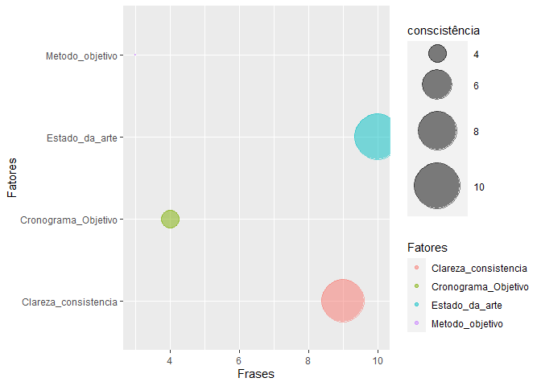

# Contexto do estudo

Este é um estudo exploratório de técnicas de Text Mining. O intuito é apresentar uma análise qualitativa automatizada para apoiar a tomada de decisão dos avaliadores de projetos, os quais são usuários da Nova Plataforma de Fomento.

## Objetivo do estudo

Automatizar parte das avaliações para apoiar a tomada de decisão e diminuir a carga de trabalho dos avaliadores

## Pergunta de pesquisa

Como utilizar machine learning e text mining para identificar a consistência de um projeto de pesquisa em termos de (i) Clareza e consistência dos objetivos; (ii) Adequação da metodologia aos objetivos (iii) Adequação do cronograma aos objetivos; e (iv) Contextualização do projeto no estado da arte?

## Métodos, técnicas e materiais

Métodos e técnicas de Processamento de linguagem natural e text mining, utilizando um projeto de pesquisa como experimento. A partir desse experimento será possível ampliar os dados de análise.


```r
# Pacotes e Funções
library(tidyverse) # Manipulacao eficiente de dados
library(tidytext) # Manipulacao eficiente de texto
library(textreadr) # Leitura de pdf para texto
library(tm) # Pacote de mineracao de texto com stopwords 
library(wordcloud) # Grafico nuvem de palavras
library(igraph)
library(ggraph)
library(ggplot2)
library(dplyr)
library(pdftools)
library(RRPP)
library(SnowballC)
```


# Análise dos documentos de projetos PDF

## Métrica Conscistência da proposta

A métrica consistência da proposta é formada pelos seguintes indicadores:

1. Clareza e consistência dos objetivos

2. Adequação da metodologia aos objetivos

3. Adequação do cronograma aos objetivos

4. Contextualização do projeto no estado da arte

Para cada um dos indicadores descritos foi formulado um padrão de busca para que o algoritmo possa identificar indícios de existência dos contextos que remetem a métrica de consistência da proposta.


```r
library(tidyverse) # Manipulacao eficiente de dados
library(tidytext) # Manipulacao eficiente de texto
library(textreadr) # Leitura de pdf para texto
library(tm) # Pacote de mineracao de texto com stopwords 
library(wordcloud) # Grafico nuvem de palavras
library(igraph)
library(ggraph)
library(ggplot2)
library(dplyr)
library(pdftools)
library(RRPP)
library(SnowballC)


setwd("~/Text Mining")

# Arquivo pdf
arquivoPdf <- "~/Text Mining/projeto.pdf"

              Texto <- arquivoPdf %>% 
              read_pdf() %>% 
              as.tibble() %>% 
              select(text) 
```

```
## Warning: `as.tibble()` is deprecated as of tibble 2.0.0.
## Please use `as_tibble()` instead.
## The signature and semantics have changed, see `?as_tibble`.
## This warning is displayed once every 8 hours.
## Call `lifecycle::last_warnings()` to see where this warning was generated.
```

### Indicador Clareza e consistência dos objetivos


```r
Clareza_consistencia <- grep(
      pattern =  "objetivo\\sde|intuito|busca-se|com\\svistas\\sa|objetivo", Texto$text, value = TRUE, ignore.case = TRUE)
print(Clareza_consistencia)
```

```
## [1] "4. Objetivos"                                                                          
## [2] "5. Objetivos"                                                                          
## [3] "A pesquisa tem como objetivo geral analisar as imbricações entre público e privado, a" 
## [4] "São objetivos específicos deste projeto de pesquisa:"                                  
## [5] "gestão ou planejamento estratégico de seus objetivos, permitindo o predomínio do lucro"
## [6] "objetivos que se espera alcançar com esta pesquisa."                                   
## [7] "considera o correto entendimento e definição do problema e dos objetivos da pesquisa"  
## [8] "desenvolvidas, seus objetivos e a percepção sobre os benefícios que trazem para os"    
## [9] "aos objetivos teóricos e práticos da investigação."
```


```r
library(qdap)
```

```
## Warning: package 'qdap' was built under R version 3.6.3
```

```
## Loading required package: qdapDictionaries
```

```
## Loading required package: qdapRegex
```

```
## Warning: package 'qdapRegex' was built under R version 3.6.3
```

```
## 
## Attaching package: 'qdapRegex'
```

```
## The following object is masked from 'package:dplyr':
## 
##     explain
```

```
## The following object is masked from 'package:ggplot2':
## 
##     %+%
```

```
## Loading required package: qdapTools
```

```
## Warning: package 'qdapTools' was built under R version 3.6.3
```

```
## 
## Attaching package: 'qdapTools'
```

```
## The following object is masked from 'package:textreadr':
## 
##     read_docx
```

```
## The following object is masked from 'package:dplyr':
## 
##     id
```

```
## 
## Attaching package: 'qdap'
```

```
## The following objects are masked from 'package:igraph':
## 
##     %>%, diversity
```

```
## The following objects are masked from 'package:tm':
## 
##     as.DocumentTermMatrix, as.TermDocumentMatrix
```

```
## The following object is masked from 'package:NLP':
## 
##     ngrams
```

```
## The following object is masked from 'package:forcats':
## 
##     %>%
```

```
## The following object is masked from 'package:stringr':
## 
##     %>%
```

```
## The following object is masked from 'package:dplyr':
## 
##     %>%
```

```
## The following object is masked from 'package:purrr':
## 
##     %>%
```

```
## The following object is masked from 'package:tidyr':
## 
##     %>%
```

```
## The following object is masked from 'package:tibble':
## 
##     %>%
```

```
## The following object is masked from 'package:base':
## 
##     Filter
```

```r
# Create frequency
frequency <- freq_terms(
Clareza_consistencia,
top = 10,
at.least = 1,
stopwords("pt"))

wordcloud(frequency$WORD,frequency$FREQ,
    max.words = 80,
    colors = c("grey80", "darkgoldenrod1","tomato"))
```

<!-- -->


### Indicador Adequação da metodologia aos objetivos


```r
Metodo_objetivo <-  grep(
      pattern = "metodos?|metodologia objetivos?", 
      Texto$text, value = TRUE,ignore.case = TRUE)
print(Metodo_objetivo)
```

```
## [1] "7. Metodologia..........................................................................................................13"
## [2] "7. Metodologia"                                                                                                            
## [3] "modelo metodológico. 8a. Ed. São Paulo, Loyola, 2005."
```

```r
frequency <- freq_terms(
Metodo_objetivo,
top = 10,
at.least = 1,
stopwords("pt"))

wordcloud(frequency$WORD,frequency$FREQ,
    max.words = 80,
    colors = c("grey80", "darkgoldenrod1","tomato"))
```

<!-- -->

### Indicador Adequação do cronograma aos objetivos


```r
Cronograma_Objetivo <- grep(pattern = "cronograma|tempo objetivos?", 
             Texto$text, value = TRUE,ignore.case = TRUE)
print(Cronograma_Objetivo)
```

```
## [1] "9. Cronograma...........................................................................................................20"
## [2] "9. Cronograma"                                                                                                             
## [3] "2012. Tal etapa ocorrerá nos primeiros seis meses do cronograma."                                                          
## [4] "Como o cronograma se refere a metade do tempo máximo permitido para o"
```

```r
frequency <- freq_terms(
Cronograma_Objetivo,
top = 10,
at.least = 1,
stopwords("pt"))

wordcloud(frequency$WORD,frequency$FREQ,
    max.words = 80,
    colors = c("grey80", "darkgoldenrod1","tomato"))
```

<!-- -->

### Indicador Contextualização do projeto no estado da arte


```r
Estado_da_arte <- grep(
      pattern = "conforme|segundo|autor objetivos?", 
      Texto$text, ignore.case = TRUE, value = TRUE)
print(Estado_da_arte)
```

```
##  [1] "públicas, na atualidade, segundo as revisões conceituais de Habermas (apud Marques,"  
##  [2] "desenvolvimento desta pesquisa, conforme expresso abaixo:"                            
##  [3] "coercitiva, segundo Tilly (1992, p. 20)), buscando, ao mesmo tempo, aceitação da"     
##  [4] "para, conforme propõe Boaventura de Souza Santos (2002), ampliar o cânone"            
##  [5] "segundo Habermas, que incorpore elementos da teoria liberal e republicana,"           
##  [6] "A sociedade civil, conforme Esteves (2003) se reconfigurou ao longo da história,"     
##  [7] "Conforme Scherer-Warren (1999) a ampliação dos direitos de cidadania relaciona-se, na"
##  [8] "sociedade, conforme é a proposta deste projeto de pesquisa."                          
##  [9] "Conforme indica Kunsch (2009, p.75) sobre a comunicação organizacional"               
## [10] "Conforme Lopes ( 2005) a análise descritiva é feita em dois passos:"
```

```r
frequency <- freq_terms(
Estado_da_arte,
top = 20,
at.least = 1,
stopwords("pt"))

wordcloud(frequency$WORD,frequency$FREQ,
    max.words = 80,
    colors = c("grey80", "darkgoldenrod1","tomato"))
```

<!-- -->


##  Grafico do documento


```r
Frases <- c(length(Clareza_consistencia),length(Metodo_objetivo),length(Cronograma_Objetivo),length(Estado_da_arte))
Fatores<-rbind("Clareza_consistencia", "Metodo_objetivo","Cronograma_Objetivo","Estado_da_arte")
tb_P20 <- data.frame(Fatores, Frases, stringsAsFactors = FALSE)


tb_P20 %>%  
  ggplot(aes(x= Frases , y=Fatores, size = Frases, color=Fatores)) +
    geom_point(alpha=0.5) +
    scale_size(range = c(.1, 20), name="conscistência")
```

<!-- -->


# Referências


Analise de palavras.  Disponivel em: https://www.ufrgs.br/wiki-r/index.php?title=Frequ%C3%AAncia_das_palavras_e_nuvem_de_palavras Esta página foi modificada pela última vez em 12 de dezembro de 2018, às 19h30min
Conteúdo disponível sob Creative Commons - Atribuição - Compartilha nos Mesmos Termos, salvo indicação em contrário.


Corpus and Machine Learning: https://rstudio-pubs-static.s3.amazonaws.com/265713_cbef910aee7642dc8b62996e38d2825d.html


Machine learning: https://kenbenoit.net/pdfs/text_analysis_in_R.pdf

Mineração de texto: 
https://www.rpubs.com/LaionBoaventura/mineracaodetexto

MANIPULAÇÃO DE STRINGS E TEXT MININGhttps://gomesfellipe.github.io/post/2017-12-17-string/string/


@article{JSSv025i05,
   author = {Ingo Feinerer and Kurt Hornik and David Meyer},
   title = {Text Mining Infrastructure in R},
   journal = {Journal of Statistical Software, Articles},
   volume = {25},
   number = {5},
   year = {2008},
   keywords = {},
   abstract = {During the last decade text mining has become a widely used   discipline utilizing statistical and machine learning methods. We  present the tm package which provides a framework for text mining  applications within R. We give a survey on text mining facilities in R and explain how typical application tasks can be carried out using our framework. We present techniques for count-based analysis methods, text clustering, text classification and string kernels.},
   issn = {1548-7660},
   pages = {1--54},
   doi = {10.18637/jss.v025.i05},
   url = {https://www.jstatsoft.org/v025/i05}
}

