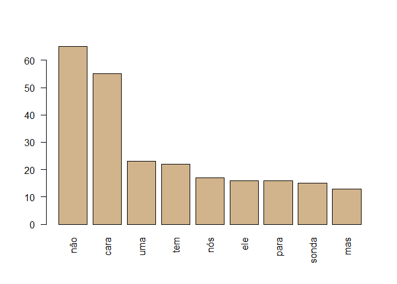

# Contexto do estudo 

Bases de dados que possuem dados de variáveis de resiliência em fatores humanos são notavelmente difíceis de encontrar na indústria de óleo e gás. A maioria das bases de dados disponíveis tratam da contagem dos acidentes e respectivos elementos subjacentes. 
Contudo, uma abordagem que investiga os condicionantes de performance que tornam um ambiente resiliênte é algo ainda novo na prevenção de acidentes nas plataformas de óleo e gás, e por esse motivo há escassez de dados estruturados com tal foco, contribuindo assim para que as análises orientadas à resiliência sejam um desafios aos pesquisadores.

## Objetivos desse estudo

Tendo em vista a problemática apontada no contexto acima, este estudo visa o seguinte objetivo geral.

### Objetivo geral

- Estabelecer um método para criar indicativos de capacidades resiliêntes a partir de dados textuais não estruturados.

Esses dados textuais são provenientes de narrações de colaboradores de plataformas offshore e onshore, da indústria de óleo e gás.

Os objetivos específicos para alcançar o objetivo geral é descrito a seguir

### Objetivos específicos

1. Estabelecer um modelo de dados que permita estruturar os elementos textuais analisados, nomeando as falas dos entrevistados de acordo com o papel assumido por eles dentro da estrutura hierárquica no trabalho (representação por persona);

2. Avaliar as falas das personas para estimar as estruturas de poder estabelecidas a partir do termo "Comunicação";

3. Descrever o perfil de cada persona, com base nos termos mais frequentes que eles relataram nos textos;

4. Verificar quais os termos mais frequentes utilizados por todas as personas, a fim de identificar os elementos símbólicos comum a todas as personas.


## Questão de pesquisa

Como criar insumos para indicadores de capacidades resiliêntes a partir de dados textuais não estruturados?


## Methods, Materials and Techniques

### Métodos

Os métodos utilizados são provenientes do metamodelo descrito em Schneider(2019), na dimensão de avaliação "Senso de Unidade" da coerência da governança em ambientes complexos. Para avaliar o senso de unidade, o seguinte passo a passo foi realizado.

- Todas as falas transcritas nos documentos foram separadas em duas categorias, (i) pedidos: falas dos entrevistarores (pesquisadores HF); (ii) resposta: falas dos entrevistados.

- As falas dos entrevistados foram também categorizadas por personas. Personas são representações de perfis dos colaboradores da indústria de óleo e gás.


### Materials

### Técnicas

Para identificar os indicadores, neste estudo utilizou-se o método de mineração de texto "Bag of Words". Segundo o glossário de Machine learning do Google*, essa técnica consistem em uma representação de palavras em uma frase ou passagem, independentemente da ordem. 

Por exemplo, saco de palavras representa as seguintes três frases de forma idêntica:

- o cachorro pula

- pula o cachorro

- cachorro pula o

Cada palavra é mapeada para um índice em um vetor esparso, onde o vetor tem um índice para cada palavra do vocabulário. Por exemplo, a frase "o cachorro pula"" é mapeada em um vetor de característica com valores diferentes de zero nos três índices correspondentes às palavras o, cachorro e pula. O valor diferente de zero pode ser qualquer um dos seguintes:

- Um 1 para indicar a presença de uma palavra.

- Uma contagem do número de vezes que uma palavra aparece na bolsa. 

- Algum outro valor, como o logaritmo da contagem do número de vezes que uma palavra aparece na bolsa.

*Disponível em: https://developers.google.com/machine-learning/glossary#b

# Bibliotecas R


## Lendo os arquivos


```
## Rows: 682
## Columns: 6
## $ ID_Fragmento        <dbl> 1, 2, 3, 4, 5, 6, 7, 8, 9, 10, 11, 12, 13, 14, ...
## $ Documento_Fragmento <dbl> 1, 1, 1, 1, 1, 1, 1, 1, 1, 1, 1, 1, 1, 1, 1, 1,...
## $ Persona             <dbl> 4, 1, 4, 1, 1, 2, 3, 4, 3, 1, 2, 4, 1, 4, 2, 4,...
## $ Tipo_Fragmento      <chr> "Pedido", "Resposta", "Pedido", "Resposta", "Re...
## $ Pessoa              <chr> "Fogaça", "Entrevistado 1", "Fogaça", "Entrevis...
## $ Texto               <chr> "Fogaça: então tá, tá gravando a partir de agor...
```


## Função de limpeza do texto - (palavras que foram retiradas)

Essas são as palavras que foram retiradas dos textos.


```r
my_stops <- c("entrevistado", "entrevistada","fogaça",  "francisco", "Francisco", "Marina", "marina")
```


# Avaliando os Pedidos dos entrevistadores

A avaliação dos perguntas dos entrevistadores em dinâmicas de storytelling é essencial, tendo em vista que o entrevistador provoca reações e repete as palavras dos entrevistados, com o intuito de confirmar o que foi relatado. 

Assim, avaliar o conjunto de palavras e termos mais frequentes falados pelos entrevistadores, pode fornecer uma apanhado de conteúdo que foi relatado e confirmado nessas dinâmicas.


```
## [1] 1119  252
```


## Palavras mais frequentes de Pedidos

Nesses resultados é possível verificar as palavras e agrupamentos mais frequentes nos pedidos dos entrevistadores

<!-- -->

```
##   que   não  para   tem  mais vocês   uma então  isso   ele 
##   192    89    64    63    46    46    44    42    42    40
```

<!-- -->


## Clustering Pedido

O Dendograma abaixo mostra os principais termos dos repetidos pelos entrevistadores aos lideres e liderados.

<!-- --><!-- --><!-- -->


# Avaliando as Respostas dos Líderes

Esse corpus agrega todas as falas dos entrevistados categorizados como líderes dos três documentos analisados.


Quantidade de falas e termos existentes ou não em cada fala: 


```
## [1] 448  78
```


## Palavras mais frequentes das respostas dos líderes

Nesses resultados é possível verificar as palavras e agrupamentos mais frequentes nos pedidos dos líderes

<!-- -->

```
##   que   não   tem gente  você  para  isso  mais   mas   ter 
##    74    35    30    22    20    18    15    15    15    14
```

<!-- -->

# Avaliando as respostas dos liderados

Abaixo o conjunto de palavras mais frequentes dos liderados.


Quantidade de falas e termos existentes ou não em cada fala: 


```
## [1] 508  77
```


## Palavras mais frequentes dos liderados

Essas são as palavras mais frequentes faladas pelos liderados.

<!-- -->

```
##   que   não  cara   uma   tem   nós   ele  para sonda   mas 
##    84    65    55    23    22    17    16    16    15    13
```

<!-- -->


# Palavras Comum Lideres e Liderados


```
## <<VCorpus>>
## Metadata:  corpus specific: 0, document level (indexed): 0
## Content:  documents: 2
```


## Palavras comuns entre as personas


<!--html_preserve--><div id="htmlwidget-7c9038d3bb7da77cd01a" style="width:100%;height:auto;" class="datatables html-widget"></div>
<script type="application/json" data-for="htmlwidget-7c9038d3bb7da77cd01a">{"x":{"filter":"none","data":[["que","tem","não","para","isso","mais","você","ele","cara","mas","coisa","com","então","por","uma","segurança","também","pode","ter","como","vai","alguma","anos","fazer","nós"],[214,90,123,66,47,43,48,49,23,44,29,32,25,32,43,20,20,19,23,20,25,18,21,17,5],[84,22,65,16,9,6,12,16,55,13,7,10,3,12,23,1,1,1,5,4,11,6,9,5,17],["que","tem","não","para","isso","mais","você","ele","cara","mas","coisa","com","então","por","uma","segurança","também","pode","ter","como","vai","alguma","anos","fazer","nós"]],"container":"<table class=\"display\">\n  <thead>\n    <tr>\n      <th> <\/th>\n      <th>Gerentes<\/th>\n      <th>Operadores<\/th>\n      <th>Palavras<\/th>\n    <\/tr>\n  <\/thead>\n<\/table>","options":{"columnDefs":[{"className":"dt-right","targets":[1,2]},{"orderable":false,"targets":0}],"order":[],"autoWidth":false,"orderClasses":false}},"evals":[],"jsHooks":[]}</script><!--/html_preserve-->

```
## <<VCorpus>>
## Metadata:  corpus specific: 0, document level (indexed): 0
## Content:  documents: 3
```

<!-- -->

## Núvem de palavras comuns entre Entrevistador, Gerentes e Operadores

Essa núvem agrega as palavras comuns entre entrevistador, gerentes e operadores.


<!-- -->


## Comunicação

Abaixo as palavras comuns entre gerentes e operadores que possuem maior correlação com o termos comunicação.


# Conclusões

Observar cada parte de um corpus como sendo a representação de personas permite compreender os elementos simbólicos que povoam os modelos mentais dos agentes humanos, em contextos sociotécnicos.
...

# Referencias

http://www.stat.columbia.edu/~tzheng/files/Rcolor.pdf

https://eight2late.wordpress.com/2015/05/27/a-gentle-introduction-to-text-mining-using-r/

https://cran.r-project.org/web/packages/corpus/vignettes/corpus.html

https://rpubs.com/malkoves/DS_project
