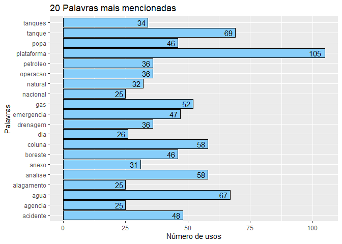
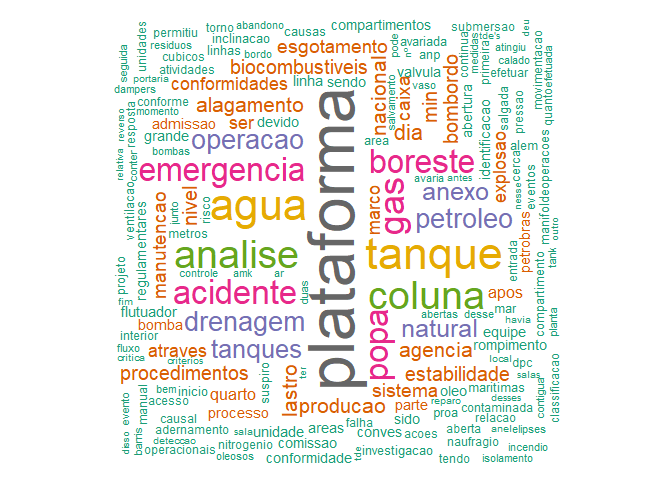
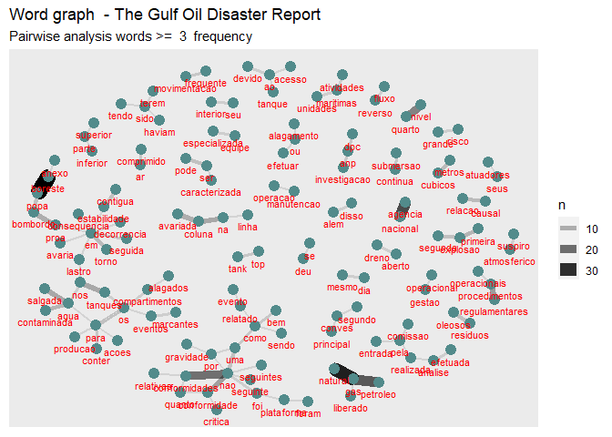

# Contexto do estudo

Este é um estudo exploratório de técnicas de Text Mining. O intuito é descobrir que técnicas que podem ser utilizadas para identificar fatores humanos em relatórios de acidentes fornecidos pela ANP.

## Objetivo do estudo

Formação de uma base de dados que possa ser utilizada para estimar a probabilidade de ocorrência de um acidente a partir de fatores humanos identificados. Para realizar este estudo foram feitas análises com algoritmos computacionais e análises feitas por humanos. Desta forma busca-se avaliar como um humano identifica determinadas palavras e frases em um texto, para então reproduzir o método em um algoritmo. Como resultado final, espera-se a criação de um método que possa identificar e estruturar em uma base de dados os fatores humanos descritos no modelo HF2.

## Pergunta de pesquisa

Como identificar fatores humanos relacionados ao modelo HF2 nos relatórios de investigação de acidentes da ANP?

## Métodos, técnicas e materiais

 **Descrever método ao finalizar as analises**


# Análise do documento P-36

## Análise do contexto feita por humano  

Quando lemos o contexto do relatório temos as seguintes informações:

### Local do acidente

Acidente ocorrido com a plataforma P-36, instalada no campo de Roncador, na Bacia de Campos. 

### Agente investigador

Agência Nacional do Petróleo (ANP) e a Diretoria de Portos e Costas (DPC) do Comando da Marinha do Brasil constituíram uma comissão conjunta de investigação

### Objetivo da investigação

O objetivo era examinar as causas do acidente e, em conseqüência, adquirir subsídios para implementar medidas corretivas e regulamentações visando à melhoria das práticas e procedimentos operacionais na execução de atividades marítimas de exploração e produção de petróleo e gás natural.

### Causas mais prováveis

A análise das causas mais prováveis do acidente permitiu identificar o evento crítico como sendo a operação de esgotamento de água do tanque de drenagem de emergência da coluna de popa bombordo, iniciada na noite do dia 14 de março de 2001. 

A água contaminada com resíduos oleosos presente no tanque seria bombeada para o manifolde (header) de produção da plataforma que recebe o fluxo de petróleo e gás natural proveniente dos poços produtores. Daí, juntamente com produção de hidrocarbonetos, escoaria para a planta de processo.

Entretanto, dificuldades operacionais para a partida da bomba de esgotamento desse tanque permitiram que houvesse fluxo reverso de óleo e gás pelas linhas de escoamento dos tanques e sua entrada no outro tanque (popa boreste) através de válvula presumivelmente danificada
ou parcialmente aberta. A partida da bomba após 54 minutos fez diminuir o fluxo reverso de hidrocarbonetos e a água bombeada passou a entrar no tanque de popa boreste. 

A pressurização contínua deste tanque levou a seu rompimento mecânico cerca de duas horas após o início da operação de esgotamento do outro tanque, caracterizando o evento relatado como sendo a primeira explosão, ocorrido às 0 h 22 min do dia 15 de março de 2001.

Os fluidos do tanque rompido e de linhas e demais equipamentos também danificados passaram a ocupar o compartimento do quarto nível da coluna. Houve escapamento de gás para os conveses superiores através de aberturas nesse compartimento e por linhas de suspiro e ventilação rompidas. Cerca de 20 minutos após o rompimento do tanque, houve a explosão do gás que atingira a área do convés do tank top e segundo convés junto à coluna. 

Estava, assim, caracterizado o evento relatado como a ocorrência da segunda explosão, quando foram vitimadas onze pessoas da brigada de incêndio da plataforma.

### Possíveis não coonformidades 

A análise realizada permitiu que fossem identificadas várias não conformidades relativas a procedimentos regulamentares de operação, manutenção e projeto, destacando-se aquelas referentes à movimentação freqüente de água nos tanques de drenagem de emergência, à operação de esgotamento do tanque de popa bombordo e à classificação da área de risco em torno desses tanques.

O colapso mecânico do tanque de drenagem de emergência de popa boreste, seguido imediatamente pelo rompimento da linha de recalque de água salgada que passava pelo quarto nível, iniciou o alagamento da coluna. A migração de água para a parte inferior da coluna se deu quando a água no compartimento do quarto nível atingiu os dampers do sistema de
ventilação que deveriam fechar automaticamente; porém, devido a falha no funcionamento de seus atuadores, permitiram a passagem de fluidos.

A quantidade de líquido no interior da coluna e em parte do flutuador provocou o adernamento da plataforma que foi intensificado com a progressão da água para o tanque de lastro da coluna de popa boreste e para a caixa de estabilidade contígua. Esses espaços foram inundados porque as elipses de acesso aos mesmos haviam sido deixadas abertas desde o dia anterior ao acidente para possibilitar a inspeção do reparo de trinca verificada na caixa de estabilidade.

Para compensar a inclinação da plataforma ocasionada pela entrada de água na coluna avariada, passou-se a admitir água no tanque de lastro situado no lado diametralmente oposto.

Essa medida acelerou o aumento indesejável do calado da plataforma.
A submersão contínua foi intensificada pelo alagamento da coluna avariada, da inundação do tanque de lastro de popa boreste, da caixa de estabilidade contígua e da admissão deliberada de água de lastro nos tanques de proa bombordo.

A evacuação de 138 pessoas consideradas não essenciais às operações de emergência foi iniciada à 1 h 44 min de 15 de março e durou cerca de 2 h 30 min, tendo sido utilizados guindaste e cesta de transferência para tal finalidade. Às 6 h 03 min do mesmo dia, após esgotadas as possibilidades de manter a plataforma nivelada, a equipe que permanecera a bordo para operações de emergência abandonou a unidade.
A análise dos eventos marcantes relativos ao alagamento da plataforma conduziu à identificação de várias não conformidades quanto a procedimentos regulamentares de operação e manutenção, destacando-se a não observância de estanqueidade e compartimentagem em áreas críticas para a preservação da estabilidade da unidade. 

Além disso, cabe destacar a ineficácia das ações para conter o alagamento ou efetuar o desalagamento antes da plataforma ser inteiramente abandonada.Após o abandono da plataforma, foram efetuadas diversas tentativas de salvamento da unidade, particularmente a injeção de nitrogênio e ar comprimido nos compartimentos alagados
para expulsão da água. 

Contudo, não houve êxito em manter a unidade estabilizada e sua
submersão lenta e progressiva teve continuidade até às 11 h e 40 min do dia 20 de março quando foi a pique.

### Possíveis causas a partir de fatores humanos

A análise efetuada pela Comissão de Investigação ANP/DPC permitiu constatar deficiências no sistema de gestão operacional das atividades marítimas de petróleo e gás natural da Petrobras, na condução das atividades específicas à plataforma P-36, caracterizadas por não
conformidades identificadas quanto a procedimentos regulamentares de operação e manutenção. 

Além disso, os planos de contingência para acidentes de grande proporção e os esquemas de resposta a emergência de grande risco necessitam ser imediatamente aprimorados, bem como a revisão de critérios de projetos de engenharia em unidades flutuantes de produção para assegurar maior proteção intrínseca.

O acidente foi causado por uma série de fatores que, isoladamente, não seriam suficientes para determiná-lo. O exame desses fatores levou à classificação de alguns deles como críticos e determinantes, sendo o critério para essa classificação o de que a ausência de qualquer um
deles interromperia a seqüência dos eventos que resultaram no desfecho verificado. 

### Vitmas fatais

Acidente com 11 vitimas fatais

### Eventos de falhas

O Encadeamento de eventos ocasionou o acidente, sendo que se um desses eventos tivesse sido barrado o acidente provavelmente não ocorreria com tanta gravidade.
Foram relatados os seguintes eventos: 


## Identificação de tipo de acidentes em relação com eventos causais e fatores humanos

Nesta identificação foram escolhidos os termos que aparecem no sumário executivo e que apareceram também na análise feita por máquina.

### Explosões

#### Evento 1 - Movimentação freqüente de água nos tanques de drenagem de emergência 

* **deficiência de projeto** foi constatada: • vulnerabilidade do esquema de ligação dos tanques de drenagem de emergência com o manifolde de produção por não apresentar nenhuma proteção adicional ou redundância no caso de falha simples de uma das válvulas de admissão dos tanques. (PLANEJAMENTO)

* não conformidade quanto a **procedimentos de projeto**: • inadequação da classificação da área em torno do tanque de drenagem de emergência. (PLANEJAMENTO)

*  não conformidade quanto a procedimentos regulamentares de **resposta a emergências**, particularmente no que tange a:• sistema de **comunicação** e **coordenação deficientes entre a equipe de resposta à emergência e o comando da plataforma**. (COMUNICAÇÃO) (RESPOSTA)

* A principal não conformidade identificada diz respeito ao armazenamento de grande quantidade de água contaminada nos tanques de drenagem de emergência durante parte considerável do período em que a plataforma esteve em produção, **contrariando o Manual de Operações da Planta de Processo da Plataforma** (Operating Manual – Process – ET 3010.38-1200-941-AMK-924 e DE-3010.38-5336-943-AMK-033) (PROCEDIMENTOS)

* não conformidades relativas a **procedimentos regulamentares de operação e manutenção**: • erros sistemáticos na sondagem volumétrica manual e inoperância dos indicadores de nível dos tanques de drenagem de emergência; • entupimento do vaso de dreno aberto, que recebe a água que escoa pelas bandejas dos equipamentos da plataforma.(PROCEDIMENTOS)

#### Manutenção no tanque de drenagem de emergência de popa boreste

* não conformidade relativa a **procedimentos regulamentares de operação** pode ser caracterizada: • Isolamento da linha de suspiro do tanque sem que sua linha de admissão fosse também isolada. (PROCEDIMENTOS)

#### Operação de esgotamento do tanque de drenagem de emergência de popa bombordo 

* não conformidades quanto a **procedimentos regulamentares de operação** e **manutenção**: • operação realizada **sem a supervisão do Coordenador da Plataforma ou do Supervisor de Produção** (não foi possível constatar se a válvula na linha do manifolde de produção, que, conforme depoimentos, exigia senha para sua abertura controlada, fora aberta com autorização do Coordenador da Plataforma); • falha mecânica ou fechamento incompleto da válvula de admissão do tanque de boreste. (PROCEDIMENTOS)


### Naufrágio 

#### Alagamento da coluna e flutuador

* não conformidades relativas a **procedimentos de manutenção e operação**, conforme relatado a seguir: • falha no funcionamento dos dampers do sistema de ventilação da coluna, decorrente de defeito em seus atuadores eletro-hidráulicos; 

• elipses de acesso ao tanque de lastro de popa boreste e à caixa de estabilidade contígua mantidas abertas por tempo além do necessário à realização de inspeção e reparo, alterando a compartimentagem da plataforma considerada nos estudos de estabilidade intacta e em avaria, **contrariando os procedimentos do Manual de Operação** – Item Casco e Estrutura – Estanqueidade à água; Embora não possa ser caracterizada como uma não conformidade, a utilização do sistema fail set para a válvula da caixa de mar impossibilitou qualquer atuação do operador no sentido de modificar seu estado após a falha, uma vez que o **sistema não dispunha de alternativas que permitissem contornar a restrição imposta.** (SISTEMA, MANUTENÇÃO E OPERAÇÃO, PROCEDIMENTOS)

#### Admissão de água de lastro em proa bombordo

* não conformidades No que tange ao controle de estabilidade de uma unidade flutuante em condições de avaria, as seguintes não conformidades puderam ser identificadas: • **ineficácia das ações para conter** o alagamento na coluna avariada, efetuar o seu desalagamento, ou promover a movimentação de água de lastro entre colunas não avariadas; (RESPOSTA), 

• **coordenação e treinamento deficientes de pessoal nas ações de controle de estabilidade em emergência**. A seguinte **não conformidade quanto a procedimentos de manutenção** também foi identificada:
• existência de duas bombas de recalque de água salgada fora de operação por **problemas de manutenção**. (MANUTENÇÃO, COORDENAÇÃO, TREINAMENTO)

#### Submersão contínua da plataforma 

* O fato do tanque de lastro e caixa de estabilidade mencionados terem sido mantidos abertos caracterizou uma **não conformidade crítica relativa a procedimentos regulamentares de operação em áreas que exigem estanqueidade e compartimentagem**, em desacordo com o Manual de Operação (MA-3010.38-1320-915-NBD-909-01) – Item de Estabilidade em Avaria, constituindo causa **determinante para o naufrágio**. (PROCEDIMENTOS DE OPERAÇÃO)


* **a ineficácia das ações para conter** o alagamento ou efetuar o desalagamento pode ser identificado como uma não conformidade relativa a **procedimentos operacionais** de controle de estabilidade em avaria. (RESPOSTA,PROCEDIMENTOS DA OPERAÇÃO)

### Recomendações a partir das lições aprendidas

* **Aprimoramento do sistema de gestão operacional**: Revisão e aplicação do sistema de gestão de modo a assegurar estrita observância de procedimentos regulamentares , inclusive efetuando a revisão da definição de responsabilidades relativas à manutenção, operação e segurança.(GESTÃO OPERACIONAL)

* **Revisão de critérios de projeto**: Efetuar a revisão de regras e procedimentos aplicáveis a projetos de forma a assegurar
proteção intrínseca de sistemas e componentes críticos de unidades marítimas. (REVISÃO, REGRAS)

* **Classificação de áreas de risco**: Estabelecer critérios adicionais para aplicação simultânea de normas relativas à classificação
de Zonas de Risco. (GESTÃO DE RISCO)

* **Ações simultâneas de comissionamento, manutenção e operação**: Estabelecer critérios para identificar limites para atividades de comissionamento concomitantes com a operação e manutenção de unidades marítimas. (MANUTENÇÃO)


* **Dimensionamento e capacitação de pessoal** Reavaliar o dimensionamento e a qualificação das equipes de operação e manutenção de unidades marítimas, bem como daquelas responsáveis pela resposta a emergências de grande risco.(CAPACITAÇÃO)

* **Gerenciamento de projetos de conversão de unidades**. Implementar regras e procedimentos para compatibilizar sistemas originais e as alterações de projeto de modo a garantir a segurança operacional e a proteção ambiental. (PROCEDIMENTOS, REGRAS)


* **Código Internacional de Gerenciamento de Segurança**: Avaliar a conveniência de antecipar a adoção do Código Internacional de Gerenciamento de Segurança, aprovado pela Resolução A 741(18) da Organização Marítima Internacional (IMO), para unidades marítimas.(REGRAS E NORMAS)

**Resposta a emergências de grande risco**: Elaboração de plano de emergência e implementação de esquema de resposta a situações
que envolvam grande risco à salvaguarda de vidas humanas, segurança da navegação, proteção ambiental e propriedade. (RESPOSTA)


### Conclusões gerais sobre análise feita por humano

É possível identificar a correlação das falhas com fatores humanos apontados nos relatórios. A partir deste relatório foi possível identificar correlações que poderão ser utilizadas na formação de vetores de busca para fatores humanos, além da formação de uma base de dados que possa correlacionar eventos tipos de acidentes, eventos causais, fatores humanos e ações de resiliência (a partir das recomendações dos relatórios)


## Analise do contexto feita por máquina

Esta análise feita por máquina busca identificar se é possível chegar a alguma conclusão a partir dos resultados trazidos pela máquina. Todas as análises e códigos fontes, e gráficos estão detalhados no apêndice A. Alguns códigos fonte foram omitidos no documento para facilitar a leitura.


  


  
### Conclusões sobre análise humana do contexto

#### Conclusões sobre análisa partir da rede de palavras

Há diversos clusteres de palavras, dos quais destaca-se:

1. Gás Natural, petróleo, liberado.
2. Tanque devido ao  acesso.
3. lastro avaria seguida consequencia contigua estabilidade em decorrencia torno proa. Bombordo popa boreste anexo.  Aguá, salgada, contaminada, nos tanques, os eventos marcantes compartimentos alagados.
4. Evento relatado sendo bem como por seguinte. Não conformidades quanto conformidade criticas. Foi plataforma foram.
5. regulamentares, procedimentos operacionais.
6. Alagamento ou efetuar
7. Efetuada análise realizada pela entrada comissão.
8. Gestão operacional.
9. Risco grande
10. mesmo dia
11. tank top
12. dreno aberto
13. Manutenção operação
14. Segundo convés principal
15. Linha na coluna avariada
16. continua submersão
17. ar comprimido
18. Dreno aberto
19: Linha na coluna avariada
20. grande risco

#### Conclusão sobre palavras mais frequentes

O acidente ocorrido em uma plataforma parece ser proveniente de uma emergência que ocorreu envolvendo equipamentos como boreste, popa, caixa de agúa, em uma coluna, talvez com a ocorrência de gas, água e tanque. Parece ter ocorrido uma alagamento e explosão, palavras que são bastante mensionadas. Quanto aos fatores humanos, parece haver ocorrido problemas de manutenção e não conformidade, problemas de procedimentos.


## Identificação de frases com fatores humanos feita por máquina

Nesta etapa buscou-se identificar as frases que contém os fatores humanos identificados, os quais mantém relação com o modelo HF2.

Para realizar esta análise buscou-se resgatar as frases que contém os seguintes termos identificados no passo exploratório:

### Identificação de frases com termos "conformidade" e "conformidades"

Frases identificadas:


```r
# Tidying text

Texto <- arquivoPdf %>% 
  read_pdf() 


Texto$text[str_detect(
  Texto$text,
  pattern = "conformidades|conformidade"
  )]
```

```
##  [1] "A análise realizada permitiu que fossem identificadas várias não conformidades relativas a"           
##  [2] "identificação de várias não conformidades quanto a procedimentos regulamentares de"                   
##  [3] "conformidades identificadas quanto a procedimentos regulamentares de operação e"                      
##  [4] "a identificação de não conformidades com regras e procedimentos regulamentares de"                    
##  [5] "a caracterização das não conformidades constatadas."                                                  
##  [6] "Identificação de não conformidades"                                                                   
##  [7] "A principal não conformidade identificada diz respeito ao armazenamento de grande"                    
##  [8] "Além disso, foram identificadas as seguintes não conformidades relativas a procedimentos"             
##  [9] "Identificação de não conformidades"                                                                   
## [10] "A seguinte não conformidade relativa a procedimentos regulamentares de operação pode ser"             
## [11] "Identificação de não conformidades"                                                                   
## [12] "A operação acima relatada caracterizou-se como uma não conformidade crítica relativa a"               
## [13] "Foram também identificadas as seguintes não conformidades quanto a procedimentos"                     
## [14] "Embora não possa ser caracterizada como uma não conformidade, a seguinte deficiência de"              
## [15] "Identificação de não conformidades"                                                                   
## [16] "A análise efetuada conduziu à identificação da seguinte não conformidade quanto a"                    
## [17] "Identificação de não conformidades"                                                                   
## [18] "A análise efetuada conduziu à identificação de não conformidade quanto a procedimentos"               
## [19] "como a caracterização das não conformidades constatadas.                                           11"
## [20] "Identificação de não conformidades"                                                                   
## [21] "Foram constatadas não conformidades relativas a procedimentos de manutenção e operação,"              
## [22] "Embora não possa ser caracterizada como uma não conformidade, a utilização do sistema fail"           
## [23] "Identificação de não conformidades"                                                                   
## [24] "seguintes não conformidades puderam ser identificadas:"                                               
## [25] "A seguinte não conformidade quanto a procedimentos de manutenção também foi identificada:"            
## [26] "Identificação de não conformidades"                                                                   
## [27] "caracterizou uma não conformidade crítica relativa a procedimentos regulamentares de"                 
## [28] "ser identificado como uma não conformidade relativa a procedimentos operacionais de controle"         
## [29] "não conformidades quanto a procedimentos regulamentares de operação, manutenção e"                    
## [30] "sistema de ventilação da coluna de popa boreste caracterizou-se como uma não conformidade"
```

```r
Texto$text[str_detect(
  Texto$text,
  pattern = "relativa a|relativas|regulamentares de|tange a:"
  )]
```

```
##  [1] "A análise realizada permitiu que fossem identificadas várias não conformidades relativas a"    
##  [2] "procedimentos regulamentares de operação, manutenção e projeto, destacando-se aquelas"         
##  [3] "identificação de várias não conformidades quanto a procedimentos regulamentares de"            
##  [4] "conformidades identificadas quanto a procedimentos regulamentares de operação e"               
##  [5] "a identificação de não conformidades com regras e procedimentos regulamentares de"             
##  [6] "Além disso, foram identificadas as seguintes não conformidades relativas a procedimentos"      
##  [7] "regulamentares de operação e manutenção:"                                                      
##  [8] "A seguinte não conformidade relativa a procedimentos regulamentares de operação pode ser"      
##  [9] "A operação acima relatada caracterizou-se como uma não conformidade crítica relativa a"        
## [10] "procedimentos regulamentares de operação e processo, constituindo-se em causa"                 
## [11] "regulamentares de operação e manutenção:"                                                      
## [12] "regulamentares de resposta a emergências, particularmente no que tange a:"                     
## [13] "Foram constatadas não conformidades relativas a procedimentos de manutenção e operação,"       
## [14] "caracterizou uma não conformidade crítica relativa a procedimentos regulamentares de"          
## [15] "ser identificado como uma não conformidade relativa a procedimentos operacionais de controle"  
## [16] "não conformidades quanto a procedimentos regulamentares de operação, manutenção e"             
## [17] "responsabilidades relativas à manutenção, operação e segurança."                               
## [18] "Estabelecer critérios adicionais para aplicação simultânea de normas relativas à classificação"
```


### Identificação de frases com termos "procedimentos", "procedimento" e "regras" 

Frases identificadas:


```r
# Tidying text

Texto <- arquivoPdf %>% 
  read_pdf() 


Texto$text[str_detect(
  Texto$text,
  pattern = "procedimentos|procedimento|regras"
  )]
```

```
##  [1] "procedimentos operacionais na execução de atividades marítimas de exploração e produção"      
##  [2] "procedimentos regulamentares de operação, manutenção e projeto, destacando-se aquelas"        
##  [3] "identificação de várias não conformidades quanto a procedimentos regulamentares de"           
##  [4] "conformidades identificadas quanto a procedimentos regulamentares de operação e"              
##  [5] "das práticas e procedimentos operacionais referentes a atividades marítimas de exploração e"  
##  [6] "a identificação de não conformidades com regras e procedimentos regulamentares de"            
##  [7] "Além disso, foram identificadas as seguintes não conformidades relativas a procedimentos"     
##  [8] "ser indevidamente pressurizado. Tal procedimento somente poderia ter sido efetuado após"      
##  [9] "que tal procedimento foi determinante para permitir a pressurização posterior do tanque e sua"
## [10] "A seguinte não conformidade relativa a procedimentos regulamentares de operação pode ser"     
## [11] "procedimentos regulamentares de operação e processo, constituindo-se em causa"                
## [12] "do manifolde de produção, o procedimento regulamentar de esgotamento de água prescrevia"      
## [13] "Foram também identificadas as seguintes não conformidades quanto a procedimentos"             
## [14] "procedimentos de projeto:"                                                                    
## [15] "A análise efetuada conduziu à identificação de não conformidade quanto a procedimentos"       
## [16] "Foram constatadas não conformidades relativas a procedimentos de manutenção e operação,"      
## [17] "estabilidade intacta e em avaria, contrariando os procedimentos do Manual de"                 
## [18] "A seguinte não conformidade quanto a procedimentos de manutenção também foi identificada:"    
## [19] "caracterizou uma não conformidade crítica relativa a procedimentos regulamentares de"         
## [20] "ser identificado como uma não conformidade relativa a procedimentos operacionais de controle" 
## [21] "não conformidades quanto a procedimentos regulamentares de operação, manutenção e"            
## [22] "No que diz respeito a procedimentos de manutenção, a falha no fechamento dos dampers do"      
## [23] "procedimentos regulamentares , inclusive efetuando a revisão da definição de"                 
## [24] "Efetuar a revisão de regras e procedimentos aplicáveis a projetos de forma a assegurar"       
## [25] "Implementar regras e procedimentos para compatibilizar sistemas originais e as alterações de"
```


### Identificação de frases com termos "gestão", "operacional" 


```r
Texto$text[str_detect(
  Texto$text,
  pattern = "Gestão|operacional"
  )]
```

```
## [1] "sistema de gestão operacional das atividades marítimas de petróleo e gás natural da               5"
## [2] "de mantê-la nivelada devido a perda total do sistema de controle operacional da unidade. A"         
## [3] "falhas no esquema operacional de controle de estabilidade de unidade flutuante, em condições"       
## [4] "O quadro delineado evidencia deficiências no sistema de gestão operacional das atividades"          
## [5] "a) Aprimoramento do sistema de gestão operacional"                                                  
## [6] "projeto de modo a garantir a segurança operacional e a proteção ambiental."
```

### Identificação de frases com termos "risco"


```r
Texto$text[str_detect(
  Texto$text,
  pattern = "risco"
  )]
```

```
## [1] "operação de esgotamento do tanque de popa bombordo e à classificação da área de risco em"
## [2] "esquemas de resposta a emergência de grande risco necessitam ser imediatamente"          
## [3] "Como as áreas do terceiro e quarto nível não foram classificadas como zona de risco,"    
## [4] "inadequação da classificação da área de risco em torno dos tanques de drenagem de"       
## [5] "c) Classificação de áreas de risco"                                                      
## [6] "risco."                                                                                  
## [7] "h) Resposta a emergências de grande risco"                                               
## [8] "que envolvam grande risco à salvaguarda de vidas humanas, segurança da navegação,"
```


# Conclusões gerais
 
 Quando realizada em somente um documento, a análise do contexto do relatório torna-se mais rápida, pois consistem somente em ler o sumário executivo do documento. Contudo, essa tarefa não pode ser replicada e automatizada. Já a análise por máquina demora mais em um primeiro documento, até o estabelecimento do algoritmo, contudo a análise poderá ser replicada para uma quantidade ilimitada de documentos.


# Referências

National Commission on the BP Deepwater Horizon Oil Spill and Offshore Drilling (NCDWHSOD). Deep Water: The Gulf Oil Disaster and the Future of Offshore Drilling. Report to the President. January 2011 Cover Photo: © Steadfast TV. ISBN: 978-0-16-087371-3. https://www.govinfo.gov/content/pkg/GPO-OILCOMMISSION/pdf/GPO-OILCOMMISSION.pdf

http://data7.blog/grafo-de-palavras-anitta-twitter/

Analise de palavras.  Disponivel em: https://www.ufrgs.br/wiki-r/index.php?title=Frequ%C3%AAncia_das_palavras_e_nuvem_de_palavras Esta página foi modificada pela última vez em 12 de dezembro de 2018, às 19h30min
Conteúdo disponível sob Creative Commons - Atribuição - Compartilha nos Mesmos Termos, salvo indicação em contrário.

https://p4husp.github.io/material/tutorial11/


Principal: https://www.tidytextmining.com/ngrams.html

Corpus and Machine Learning: https://rstudio-pubs-static.s3.amazonaws.com/265713_cbef910aee7642dc8b62996e38d2825d.html


Machine learning: https://kenbenoit.net/pdfs/text_analysis_in_R.pdf

Mineração de texto: 
https://www.rpubs.com/LaionBoaventura/mineracaodetexto

MANIPULAÇÃO DE STRINGS E TEXT MININGhttps://gomesfellipe.github.io/post/2017-12-17-string/string/


@article{JSSv025i05,
   author = {Ingo Feinerer and Kurt Hornik and David Meyer},
   title = {Text Mining Infrastructure in R},
   journal = {Journal of Statistical Software, Articles},
   volume = {25},
   number = {5},
   year = {2008},
   keywords = {},
   abstract = {During the last decade text mining has become a widely used   discipline utilizing statistical and machine learning methods. We  present the tm package which provides a framework for text mining  applications within R. We give a survey on text mining facilities in R and explain how typical application tasks can be carried out using our framework. We present techniques for count-based analysis methods, text clustering, text classification and string kernels.},
   issn = {1548-7660},
   pages = {1--54},
   doi = {10.18637/jss.v025.i05},
   url = {https://www.jstatsoft.org/v025/i05}
}

# Apêndice A - Análise exploratória do contexto por máquina

### Palavras mais frequentes

Aqui é possível identificar as palavras mais frequentes que aparecem, para então tentar trazer contextos do que ocorreu, antes de uma análise humana.


```r
# Counting single words**

  frequenciaPalavras <-  CleanW  %>% 
  count(Palavra, sort = TRUE) %>% 
  filter(Palavra != "") %>%
  arrange(desc(n)) 


# Visualiza frequencia de palavras
DT::datatable(frequenciaPalavras)
```

<!--html_preserve--><div id="htmlwidget-640f8b140abf8537262d" style="width:100%;height:auto;" class="datatables html-widget"></div>
<script type="application/json" data-for="htmlwidget-640f8b140abf8537262d">{"x":{"filter":"none","data":[["1","2","3","4","5","6","7","8","9","10","11","12","13","14","15","16","17","18","19","20","21","22","23","24","25","26","27","28","29","30","31","32","33","34","35","36","37","38","39","40","41","42","43","44","45","46","47","48","49","50","51","52","53","54","55","56","57","58","59","60","61","62","63","64","65","66","67","68","69","70","71","72","73","74","75","76","77","78","79","80","81","82","83","84","85","86","87","88","89","90","91","92","93","94","95","96","97","98","99","100","101","102","103","104","105","106","107","108","109","110","111","112","113","114","115","116","117","118","119","120","121","122","123","124","125","126","127","128","129","130","131","132","133","134","135","136","137","138","139","140","141","142","143","144","145","146","147","148","149","150","151","152","153","154","155","156","157","158","159","160","161","162","163","164","165","166","167","168","169","170","171","172","173","174","175","176","177","178","179","180","181","182","183","184","185","186","187","188","189","190","191","192","193","194","195","196","197","198","199","200","201","202","203","204","205","206","207","208","209","210","211","212","213","214","215","216","217","218","219","220","221","222","223","224","225","226","227","228","229","230","231","232","233","234","235","236","237","238","239","240","241","242","243","244","245","246","247","248","249","250","251","252","253","254","255","256","257","258","259","260","261","262","263","264","265","266","267","268","269","270","271","272","273","274","275","276","277","278","279","280","281","282","283","284","285","286","287","288","289","290","291","292","293","294","295","296","297","298","299","300","301","302","303","304","305","306","307","308","309","310","311","312","313","314","315","316","317","318","319","320","321","322","323","324","325","326","327","328","329","330","331","332","333","334","335","336","337","338","339","340","341","342","343","344","345","346","347","348","349","350","351","352","353","354","355","356","357","358","359","360","361","362","363","364","365","366","367","368","369","370","371","372","373","374","375","376","377","378","379","380","381","382","383","384","385","386","387","388","389","390","391","392","393","394","395","396","397","398","399","400","401","402","403","404","405","406","407","408","409","410","411","412","413","414","415","416","417","418","419","420","421","422","423","424","425","426","427","428","429","430","431","432","433","434","435","436","437","438","439","440","441","442","443","444","445","446","447","448","449","450","451","452","453","454","455","456","457","458","459","460","461","462","463","464","465","466","467","468","469","470","471","472","473","474","475","476","477","478","479","480","481","482","483","484","485","486","487","488","489","490","491","492","493","494","495","496","497","498","499","500","501","502","503","504","505","506","507","508","509","510","511","512","513","514","515","516","517","518","519","520","521","522","523","524","525","526","527","528","529","530","531","532","533","534","535","536","537","538","539","540","541","542","543","544","545","546","547","548","549","550","551","552","553","554","555","556","557","558","559","560","561","562","563","564","565","566","567","568","569","570","571","572","573","574","575","576","577","578","579","580","581","582","583","584","585","586","587","588","589","590","591","592","593","594","595","596","597","598","599","600","601","602","603","604","605","606","607","608","609","610","611","612","613","614","615","616","617","618","619","620","621","622","623","624","625","626","627","628","629","630","631","632","633","634","635","636","637","638","639","640","641","642","643","644","645","646","647","648","649","650","651","652","653","654","655","656","657","658","659","660","661","662","663","664","665","666","667","668","669","670","671","672","673","674","675","676","677","678","679","680","681","682","683","684","685","686","687","688","689","690","691","692","693","694","695","696","697","698","699","700","701","702","703","704","705","706","707","708","709","710","711","712","713","714","715","716","717","718","719","720","721","722","723","724","725","726","727","728","729","730","731","732","733","734","735","736","737","738","739","740","741","742","743","744","745","746","747","748","749","750","751","752","753","754","755","756","757","758","759","760","761","762","763","764","765","766","767","768","769","770","771","772","773","774","775","776","777","778","779","780","781","782","783","784","785","786","787","788","789","790","791","792","793","794","795","796","797","798","799","800","801","802","803","804","805","806","807","808","809","810","811","812","813","814","815","816","817","818","819","820","821","822","823","824","825","826","827","828","829","830","831","832","833","834","835","836","837","838","839","840","841","842","843","844","845","846","847","848","849","850","851","852","853","854","855","856","857","858","859","860","861","862","863","864","865","866","867","868","869","870","871","872","873","874","875","876","877","878","879","880","881","882","883","884","885","886","887","888","889","890","891","892","893","894","895","896","897","898","899","900","901","902","903","904","905","906","907","908","909","910","911","912","913","914","915","916","917","918","919","920","921","922","923","924","925","926","927","928","929","930","931","932","933","934","935","936","937","938","939","940","941","942","943","944","945","946","947","948","949","950","951","952","953","954","955","956","957","958","959","960","961","962","963","964","965","966","967","968","969","970","971","972","973","974","975","976","977","978","979","980","981","982","983","984","985","986","987","988","989","990","991","992","993","994","995","996","997","998","999","1000","1001","1002","1003","1004","1005","1006","1007","1008","1009","1010","1011","1012","1013","1014","1015","1016","1017","1018","1019","1020","1021","1022","1023","1024","1025","1026","1027","1028","1029","1030","1031","1032","1033","1034","1035","1036","1037","1038","1039","1040","1041","1042","1043","1044","1045","1046","1047","1048","1049","1050","1051","1052","1053","1054","1055","1056","1057","1058","1059","1060","1061","1062","1063","1064","1065","1066","1067","1068","1069","1070","1071","1072","1073","1074","1075","1076","1077","1078","1079","1080","1081","1082","1083","1084","1085","1086","1087","1088","1089","1090","1091","1092","1093","1094","1095","1096","1097","1098","1099","1100","1101","1102","1103","1104","1105","1106","1107","1108","1109","1110","1111","1112","1113","1114","1115","1116","1117","1118","1119","1120","1121","1122","1123","1124","1125","1126","1127","1128","1129","1130","1131","1132","1133","1134","1135","1136","1137","1138","1139","1140","1141","1142","1143","1144","1145","1146","1147","1148","1149","1150","1151","1152","1153","1154","1155","1156","1157","1158","1159","1160","1161","1162","1163","1164","1165","1166","1167","1168","1169","1170","1171","1172","1173","1174","1175","1176","1177","1178","1179","1180","1181","1182","1183","1184","1185","1186","1187","1188","1189","1190","1191","1192","1193","1194","1195","1196","1197","1198","1199","1200","1201","1202","1203","1204","1205","1206","1207","1208","1209","1210","1211","1212","1213","1214","1215","1216","1217","1218","1219","1220","1221","1222","1223","1224","1225","1226","1227","1228","1229"],["plataforma","tanque","agua","analise","coluna","gas","acidente","emergencia","boreste","popa","drenagem","operacao","petroleo","tanques","natural","anexo","dia","agencia","alagamento","nacional","lastro","producao","biocombustiveis","bombordo","nivel","estabilidade","min","procedimentos","sistema","caixa","esgotamento","manutencao","conformidades","explosao","marco","atraves","ser","apos","quarto","admissao","bomba","parte","petrobras","processo","flutuador","identificacao","linha","unidade","abertura","areas","comissao","conves","equipe","oleo","regulamentares","rompimento","sendo","sido","valvula","compartimentos","conformidade","devido","grande","area","compartimento","eventos","inicio","investigacao","manifolde","mar","metros","proa","salgada","suspiro","ventilacao","alem","anp","avariada","causas","cerca","inclinacao","linhas","maritimas","operacoes","projeto","risco","acoes","atividades","conforme","contaminada","entrada","falha","interior","nitrogenio","pressao","primeira","resposta","aberta","acesso","adernamento","causal","classificacao","continua","cubicos","dpc","efetuar","manual","movimentacao","naufragio","operacionais","permitiu","quanto","relacao","submersao","tendo","torno","unidades","abandono","abertas","ar","atingiu","automaticamente","avaria","bem","bombas","contigua","controle","dampers","desse","elipses","equipamentos","evento","explosoes","fluxo","frequente","funcionamento","incendio","injecao","isolamento","junto","ocorreu","oleosos","operacional","pessoas","planta","pode","realizada","residuos","salvamento","seguida","seguinte","seguintes","segunda","seguranca","tank","vaso","afundamento","alagados","amk","barris","bordo","calado","campo","comprimido","conter","conveses","coordenacao","desalagamento","dreno","duas","durante","efetuada","escoamento","evacuacao","fluidos","fluxograma","graus","hidrocarbonetos","identificadas","imediatamente","inferior","inspecao","liberado","medidas","momento","principal","protecao","recalque","relativas","revisao","suspiros","tentativas","top","transferencia","volume","aberto","amarras","ambiental","anel","atmosferico","aumento","bombeamento","cabe","campos","capacidade","condicoes","conduziu","consequencia","contudo","criterios","critica","cronologia","decidiu","depoimentos","desses","deteccao","disso","engenharia","equipamento","especializada","fechamento","fim","gestao","havia","identificar","ineficacia","instalada","junior","marcantes","mencionados","nivelada","partida","partir","permaneceu","pocos","porque","portaria","pressurizacao","recomendacoes","relatado","relativa","reparo","reverso","sala","salas","segundo","tempo","ter","terceiro","abaixo","acordo","antes","apoio","assegurar","assim","atingir","atuadores","avaliar","bombeada","caracterizada","caracterizou","codigo","colapso","comissionamento","compartimentagem","conclusoes","conjunta","constatadas","constatar","critico","criticos","d’agua","decorrencia","decorrente","dessa","deste","determinante","deu","efetuadas","embora","emergencias","encontrava","enquanto","entupimento","equipes","escotilha","esquema","estanqueidade","fatores","gerenciamento","grandes","gravidade","haviam","implementar","internacional","inundacao","julho","lado","levou","local","localizados","manter","mecanica","mecanico","mesma","modo","nessa","nesse","nº","ocasiao","onze","outro","paiol","parcialmente","particularmente","passava","pessoal","portos","presenca","problemas","procedimento","progressivo","projetos","proveniente","quantidade","rede","regras","responsaveis","rompidas","roncador","seguido","seguir","sequencia","sistemas","situacao","superior","tal","tde","tde's","terem","tomada","utilizacao","abertos","aberturas","acao","acelerou","acima","adernada","adicional","adjacentes","adotadas","adquirir","ainda","alarme","alguns","aloysio","alternativa","amanhecer","anexos","anterior","antunes","aplicacao","armazenamento","atingindo","bacia","baleeiras","bar","barco","bilhoes","branca","brasil","brigada","calor","caracteristicas","caracterizacao","carvalho","causa","celso","cenario","cesar","cesta","chama","chegou","colunas","comando","completamente","componentes","comunicacao","conducao","confirmada","consideradas","consideravel","constatada","constatou","constituindo","contrariando","contribuiu","coordenador","corretivas","costa","crisostomo","dai","danificada","dante","decisivamente","decorrido","defeito","deficiencias","deficientes","deliberada","demais","demonstraram","derramamento","desacordo","descarga","desde","despressurizacao","destacando","determinantes","diametralmente","dificuldades","dimensionamento","diretoria","dirigiu","disponivel","diz","documentos","eduardo","efetuado","elevado","encontram","entrou","escapamento","escoaria","esgotadas","espacos","especificas","essenciais","estabelecer","estabilizada","estado","estrutura","et","executivo","exploracao","extensao","facilitar","fail","feito","figura","final","finalidade","flutuante","geracao","guindaste","helio","horas","identificada","ignicao","ilustra","impacto","implementacao","importante","in","inadequacao","incidente","indesejavel","informacoes","iniciada","injetar","intensificada","interacao","interligados","interna","intrinseca","introducao","inundada","item","janeiro","km","la","lamina","liquido","logo","maio","mangueiras","mante","mantidas","manuais","marinha","medida","melhoria","membros","mesmos","metodologia","milhoes","minutos","modulo","navio","nenhuma","nevoa","noite","objetivando","objetivo","observancia","obtidos","ocorrencia","ocorrer","ocorrido","oswaldo","outra","outros","passagem","passou","pedrosa","perda","periodo","permitiram","porem","possa","possibilidades","possibilitar","possivel","praticas","pressurizado","presumivelmente","primeiras","progressao","progressiva","projetado","propulsores","prosseguiu","provocada","provocou","quadro","qualquer","recebe","referentes","registrar","registro","regulamentacoes","relatada","relativos","relatorio","reservas","respeito","ressaltar","resultados","resumo","retirada","rev","ricardo","rio","rios","rosa","ruptura","santos","sensores","set","silva","simulacao","submergiu","subsidios","suficiente","superiores","tange","tecnica","tecnicos","toda","total","transbordamento","transferido","trinca","tubulacao","utilizados","varias","vasos","vazios","verificada","versus","vez","via","visando","visto","volumes","abandonada","abandonar","abandonou","abril","aceleracao","acelerado","acentuado","acerca","acidentes","acionadas","acionamento","acompanhamento","acrobat","adequados","adernou","adicionais","administrativo","admitida","admitir","adocao","adquirindo","aflorado","afundado","afundou","agravamento","alcancam","alcancar","alimentacao","alimentaram","alinhamento","aliviador","alteracao","alteracoes","alterando","alternativas","alterou","altura","antecipar","anteriormente","aplicaveis","apontou","apresentada","apresentadas","apresentados","apresentar","apresentavam","aprimorados","aprimoramento","aprovado","aproximada","aproximadamente","aqui","arranjo","art","ascendente","associado","assumiu","atingido","atingira","atingisse","ativando","atmosferica","atuacao","ausencia","automatica","automatico","autorizacao","avariadas","baixar","banda","bandejas","baque","baseou","basicas","bilhao","bloqueado","bombeado","bruto","cabo","caisson","capacitacao","capitania","caracterizadas","caracterizado","caracterizando","carga","cargas","carregados","casco","caso","causada","causado","cego","cessou","cheios","classificadas","clique","cm","colapsado","colocacao","comandadas","combate","combatido","comecaram","compatibilizar","compensar","composto","comprimir","concluida","concluido","concluiu","conclusao","concomitantes","condicao","conectada","conexoes","configuracao","confirmou","consequencias","consequente","considerada","considerado","considerando","considerava","consistindo","constatacao","constituir","constituirem","construido","contencao","conteudo","contidas","contidos","contingencia","contingente","continuamente","continuava","continuidade","continuo","contornar","contrariou","contratada","contribuiram","controlada","controlado","controlador","conveniencia","conversao","coordenou","correspondencia","corrigir","corte","costas","criterio","criteriosamente","criticamente","criticas","cronologica","culminando","cumprimento","dando","danificadas","danificados","danos","daquelas","dar","data","dava","decisao","decorrentes","deficiencia","definicao","deformacao","deixadas","delineado","demonstra","demonstrado","demonstrados","demonstram","derivacao","descarte","descoberto","descricao","descrita","descrito","descritos","desenhos","desenvolvido","desfecho","desligado","desligamento","deslocadas","despressurizado","desta","destacados","destacar","detectado","determina","determinou","devendo","deveriam","diesel","dificuldade","dificultadas","diminuindo","diminuir","direcionada","diretamente","dispersao","disponiveis","dispositivos","dispunha","distancia","diversas","documentacao","down","durou","efetuando","efetuou","eficacia","elaboracao","elementos","eletrica","eletro","embarcacoes","embarcadas","embarcado","embarcou","emergencial","emitido","emprego","empresa","encarregada","encontra","encontrada","entao","entrar","entretanto","envolvam","epoca","equipadas","equivalente","erros","escoa","escoou","esquemas","esquematizada","estabelecido","estacionaria","estanques","estar","estariam","estende","estimadas","estocado","estocar","estrita","estudos","evacuadas","evidencia","evidencias","evitar","evolucao","exame","examinadas","examinar","execucao","executada","executar","exigem","exigia","exigisse","existencia","existente","exito","explosivos","expressos","expulsao","expulsar","extensas","externa","falhas","falta","fato","fator","fatos","fazer","fechado","fechar","fecharam","feita","fevereiro","fez","ficou","flange","flutuantes","foco","forma","frustadas","fumaca","funcionarios","furos","garantir","gasodutos","gerencial","habil","havendo","haver","header","helicopteros","hidraulica","hidraulico","hidraulicos","hidrostaticos","holandesa","hora","humanas","identificado","identificados","iluminacao","ilustracao","imediata","imo","impossibilitar","impossibilitou","imposta","inclusive","incompleto","indevidamente","indicacao","indicadores","indice","individualmente","inequivocamente","inferiores","ingresso","iniciado","iniciando","iniciaram","iniciou","injetado","inoperancia","inoperantes","inquerito","inspeccao","inspecoes","instante","instantes","intacta","intactas","inteiramente","intensidade","intensificado","intenso","intercomunicacao","intercomunicam","interligacao","interno","interpretacao","interrompendo","interromperia","interrompido","inundados","invadidos","invadiram","investigar","isolada","isoladamente","isolados","juntamente","laminas","lateral","lenta","lento","levada","levando","liberacao","liberando","ligacao","limitacoes","limite","limites","livro","lo","localizada","localizadas","localizar","longitudinal","longo","ma","macae","madrugada","maior","maneira","manha","mantendo","mantida","mantidos","maritima","matematica","materiais","medio","menor","mergulhadores","mergulho","migracao","migrou","modificada","modificar","modu","modulos","morte","naquele","natureza","navegacao","nbd","necessarias","necessario","necessitam","nesses","nesta","normal","normas","novamente","observada","obtendo","obtidas","ocasionada","ocasionou","oceano","ocorridas","ocupadas","ocupar","oil","onde","opcao","operador","operar","operating","oposta","oposto","ordem","organizacao","origem","originais","oriunda","oriundos","outras","ouvido","parada","parar","passaram","pdf","penetrando","pequena","permanecer","permanecera","permanencia","permitindo","permitir","permitisse","permitissem","petroleiro","pique","plano","planos","plug","podem","podendo","poderia","pois","polegadas","politic","poluente","ponto","portanto","porte","possibilitou","possuia","posterior","posteriormente","precisamente","preenchida","preenchido","preenchimento","prejudicada","prescrevia","prescritos","presente","preservacao","previo","prevista","primeiro","privacidade","proceder","process","processamento","processar","processos","procurou","produtores","produzindo","programada","progredisse","projetada","promover","proporcao","propria","propriedade","prosseguir","prova","provadas","provaveis","provavel","provenientes","provocando","provocar","proximas","proximos","puderam","qualificacao","quimica","razao","realizacao","realizar","reavaliar","recebendo","recolhimento","recomenda","reconexao","redundancia","reflutuar","registre","regulamentar","reiniciar","relacionadas","relacionado","relacionados","relatou","relevantes","remanescente","remoto","representadas","requisitos","resolucao","resolveram","responsabilidades","restabelecer","restante","restricao","resultaram","retirar","retornado","reverter","risers","rompeu","rompida","rompido","salientar","salvaguarda","selecao","senha","sensivelmente","sentido","serie","shut","simples","simulacoes","simultanea","simultaneas","sindicancia","sistematicos","situ","situacoes","situado","situados","smit","sobre","somente","sondagem","sondagens","submarinas","submersos","subsequente","subsequentes","substancia","succao","sucesso","suficientes","sujeito","supervisao","supervisor","supracitada","surdo","tais","tak","tamponar","tecnicas","temperatura","tentativa","terminando","terra","testes","todas","tomadas","totais","totalmente","transcorreu","transferir","transversal","tratado","trecho","treinamento","tres","trim","tripulantes","unica","utilizada","utilizadas","valvulas","variacao","varios","vazar","vedada","veiculo","veio","verificacao","verificado","vidas","vindo","vista","vistoria","visualizada","visualizados","vitimadas","vitimando","vitimas","volta","volumetrica","volumetricas","vulnerabilidade","waste","zona","zonas"],[105,69,67,58,58,52,48,47,46,46,36,36,36,34,32,31,26,25,25,25,24,24,23,23,23,22,22,22,21,20,20,20,19,19,19,18,18,17,16,14,14,14,14,14,13,13,13,13,12,12,12,12,12,12,12,12,12,12,12,11,11,11,11,10,10,10,10,10,10,10,10,10,10,10,10,9,9,9,9,9,9,9,9,9,9,9,8,8,8,8,8,8,8,8,8,8,8,7,7,7,7,7,7,7,7,7,7,7,7,7,7,7,7,7,7,7,7,6,6,6,6,6,6,6,6,6,6,6,6,6,6,6,6,6,6,6,6,6,6,6,6,6,6,6,6,6,6,6,6,6,6,6,6,6,6,6,5,5,5,5,5,5,5,5,5,5,5,5,5,5,5,5,5,5,5,5,5,5,5,5,5,5,5,5,5,5,5,5,5,5,5,5,5,5,5,4,4,4,4,4,4,4,4,4,4,4,4,4,4,4,4,4,4,4,4,4,4,4,4,4,4,4,4,4,4,4,4,4,4,4,4,4,4,4,4,4,4,4,4,4,4,4,4,4,4,4,4,4,4,3,3,3,3,3,3,3,3,3,3,3,3,3,3,3,3,3,3,3,3,3,3,3,3,3,3,3,3,3,3,3,3,3,3,3,3,3,3,3,3,3,3,3,3,3,3,3,3,3,3,3,3,3,3,3,3,3,3,3,3,3,3,3,3,3,3,3,3,3,3,3,3,3,3,3,3,3,3,3,3,3,3,3,3,3,3,3,3,3,3,3,3,3,2,2,2,2,2,2,2,2,2,2,2,2,2,2,2,2,2,2,2,2,2,2,2,2,2,2,2,2,2,2,2,2,2,2,2,2,2,2,2,2,2,2,2,2,2,2,2,2,2,2,2,2,2,2,2,2,2,2,2,2,2,2,2,2,2,2,2,2,2,2,2,2,2,2,2,2,2,2,2,2,2,2,2,2,2,2,2,2,2,2,2,2,2,2,2,2,2,2,2,2,2,2,2,2,2,2,2,2,2,2,2,2,2,2,2,2,2,2,2,2,2,2,2,2,2,2,2,2,2,2,2,2,2,2,2,2,2,2,2,2,2,2,2,2,2,2,2,2,2,2,2,2,2,2,2,2,2,2,2,2,2,2,2,2,2,2,2,2,2,2,2,2,2,2,2,2,2,2,2,2,2,2,2,2,2,2,2,2,2,2,2,2,2,2,2,2,2,2,2,2,2,2,2,2,2,2,2,2,2,2,2,2,2,2,2,2,2,2,2,2,2,2,2,2,2,2,2,2,2,2,2,2,2,2,2,2,2,2,2,2,2,2,2,1,1,1,1,1,1,1,1,1,1,1,1,1,1,1,1,1,1,1,1,1,1,1,1,1,1,1,1,1,1,1,1,1,1,1,1,1,1,1,1,1,1,1,1,1,1,1,1,1,1,1,1,1,1,1,1,1,1,1,1,1,1,1,1,1,1,1,1,1,1,1,1,1,1,1,1,1,1,1,1,1,1,1,1,1,1,1,1,1,1,1,1,1,1,1,1,1,1,1,1,1,1,1,1,1,1,1,1,1,1,1,1,1,1,1,1,1,1,1,1,1,1,1,1,1,1,1,1,1,1,1,1,1,1,1,1,1,1,1,1,1,1,1,1,1,1,1,1,1,1,1,1,1,1,1,1,1,1,1,1,1,1,1,1,1,1,1,1,1,1,1,1,1,1,1,1,1,1,1,1,1,1,1,1,1,1,1,1,1,1,1,1,1,1,1,1,1,1,1,1,1,1,1,1,1,1,1,1,1,1,1,1,1,1,1,1,1,1,1,1,1,1,1,1,1,1,1,1,1,1,1,1,1,1,1,1,1,1,1,1,1,1,1,1,1,1,1,1,1,1,1,1,1,1,1,1,1,1,1,1,1,1,1,1,1,1,1,1,1,1,1,1,1,1,1,1,1,1,1,1,1,1,1,1,1,1,1,1,1,1,1,1,1,1,1,1,1,1,1,1,1,1,1,1,1,1,1,1,1,1,1,1,1,1,1,1,1,1,1,1,1,1,1,1,1,1,1,1,1,1,1,1,1,1,1,1,1,1,1,1,1,1,1,1,1,1,1,1,1,1,1,1,1,1,1,1,1,1,1,1,1,1,1,1,1,1,1,1,1,1,1,1,1,1,1,1,1,1,1,1,1,1,1,1,1,1,1,1,1,1,1,1,1,1,1,1,1,1,1,1,1,1,1,1,1,1,1,1,1,1,1,1,1,1,1,1,1,1,1,1,1,1,1,1,1,1,1,1,1,1,1,1,1,1,1,1,1,1,1,1,1,1,1,1,1,1,1,1,1,1,1,1,1,1,1,1,1,1,1,1,1,1,1,1,1,1,1,1,1,1,1,1,1,1,1,1,1,1,1,1,1,1,1,1,1,1,1,1,1,1,1,1,1,1,1,1,1,1,1,1,1,1,1,1,1,1,1,1,1,1,1,1,1,1,1,1,1,1,1,1,1,1,1,1,1,1,1,1,1,1,1,1,1,1,1,1,1,1,1,1,1,1,1,1,1,1,1,1,1,1,1,1,1,1,1,1,1,1,1,1,1,1,1,1,1,1,1,1,1,1,1,1,1,1,1,1,1,1,1,1,1,1,1,1,1,1,1,1,1,1,1,1,1,1,1,1,1,1,1,1,1,1,1,1,1,1,1,1,1,1,1,1,1,1,1,1,1,1,1,1,1,1,1,1,1,1,1,1,1,1,1,1,1,1,1,1,1,1,1,1,1,1,1,1]],"container":"<table class=\"display\">\n  <thead>\n    <tr>\n      <th> <\/th>\n      <th>Palavra<\/th>\n      <th>n<\/th>\n    <\/tr>\n  <\/thead>\n<\/table>","options":{"columnDefs":[{"className":"dt-right","targets":2},{"orderable":false,"targets":0}],"order":[],"autoWidth":false,"orderClasses":false}},"evals":[],"jsHooks":[]}</script><!--/html_preserve-->


```r
head(frequenciaPalavras, n=20) %>%
  ggplot(aes(Palavra, n)) +
  geom_bar(stat = "identity", color = "black", fill = "#87CEFA") +
  geom_text(aes(hjust = 1.3, label = n)) + 
  coord_flip() + 
  labs(title = "20 Palavras mais mencionadas",  x = "Palavras", y = "Número de usos")
```

<!-- -->


```r
# Cria nuvem de palavras
wordcloud(
  words = frequenciaPalavras$Palavra, 
  freq = frequenciaPalavras$n,
  min.freq = 2,
  max.words = 300, 
  random.order = FALSE, 
  rot.per = 0.35, 
  colors = brewer.pal(8, "Dark2")
)
```

<!-- -->


### Rede de palavras

A rede de palavras também pode ser um mapa para compreender mais rápido o que um documento revela. A rede apresentada aqui foi feita a partir de bigrams, que são estruturas que verificam a frequencia de pares de palavras de um documento.


```r
par_Palavras <- TidyT %>%
  unnest_tokens(Palavra, text, token = "ngrams", n = 2) %>% 
  mutate(Palavra = na.omit(NormalizaParaTextMining(Palavra))) %>%
  anti_join(palavrasRemover) %>%
  anti_join(my_stopwords) %>%
  separate(Palavra, c("word1", "word2"), sep = " ") %>%
  filter(!word1 %in% stop_words$word) %>%
  filter(!word2 %in% stop_words$word) %>%
  filter(!word1 %in% my_stopwords$Palavra) %>%
  filter(!word2 %in% my_stopwords$Palavra) %>%
  count(word1, word2, sort = TRUE)
```

```
## Joining, by = "Palavra"
## Joining, by = "Palavra"
```

```r
# remove NA
par_Palavras <- na.omit(par_Palavras)


DT::datatable(par_Palavras)
```

<!--html_preserve--><div id="htmlwidget-d01a4383f89b027c5fae" style="width:100%;height:auto;" class="datatables html-widget"></div>
<script type="application/json" data-for="htmlwidget-d01a4383f89b027c5fae">{"x":{"filter":"none","data":[["1","2","3","4","5","6","7","8","9","10","11","12","13","14","15","16","17","18","19","20","21","22","23","24","25","26","27","28","29","30","31","32","33","34","35","36","37","38","39","40","41","42","43","44","45","46","47","48","49","50","51","52","53","54","55","56","57","58","59","60","61","62","63","64","65","66","67","68","69","70","71","72","73","74","75","76","77","78","79","80","81","82","83","84","85","86","87","88","89","90","91","92","93","94","95","96","97","98","99","100","101","102","103","104","105","106","107","108","109","110","111","112","113","114","115","116","117","118","119","120","121","122","123","124","125","126","127","128","129","130","131","132","133","134","135","136","137","138","139","140","141","142","143","144","145","146","147","148","149","150","151","152","153","154","155","156","157","158","159","160","161","162","163","164","165","166","167","168","169","170","171","172","173","174","175","176","177","178","179","180","181","182","183","184","185","186","187","188","189","190","191","192","193","194","195","196","197","198","199","200","201","202","203","204","205","206","207","208","209","210","211","212","213","214","215","216","217","218","219","220","221","222","223","224","225","226","227","228","229","230","231","232","233","234","235","236","237","238","239","240","241","242","243","244","245","246","247","248","249","250","251","252","253","254","255","256","257","258","259","260","261","262","263","264","265","266","267","268","269","270","271","272","273","274","275","276","277","278","279","280","281","282","283","284","285","286","287","288","289","290","291","292","293","294","295","296","297","298","299","300","301","302","303","304","305","306","307","308","309","310","311","312","313","314","315","316","317","318","319","320","321","322","323","324","325","326","327","328","329","330","331","332","333","334","335","336","337","338","339","340","341","342","343","344","345","346","347","348","349","350","351","352","353","354","355","356","357","358","359","360","361","362","363","364","365","366","367","368","369","370","371","372","373","374","375","376","377","378","379","380","381","382","383","384","385","386","387","388","389","390","391","392","393","394","395","396","397","398","399","400","401","402","403","404","405","406","407","408","409","410","411","412","413","414","415","416","417","418","419","420","421","422","423","424","425","426","427","428","429","430","431","432","433","434","435","436","437","438","439","440","441","442","443","444","445","446","447","448","449","450","451","452","453","454","455","456","457","458","459","460","461","462","463","464","465","466","467","468","469","470","471","472","473","474","475","476","477","478","479","480","481","482","483","484","485","486","487","488","489","490","491","492","493","494","495","496","497","498","499","500","501","502","503","504","505","506","507","508","509","510","511","512","513","514","515","516","517","518","519","520","521","522","523","524","525","526","527","528","529","530","531","532","533","534","535","536","537","538","539","540","541","542","543","544","545","546","547","548","549","550","551","552","553","554","555","556","557","558","559","560","561","562","563","564","565","566","567","568","569","570","571","572","573","574","575","576","577","578","579","580","581","582","583","584","585","586","587","588","589","590","591","592","593","594","595","596","597","598","599","600","601","602","603","604","605","606","607","608","609","610","611","612","613","614","615","616","617","618","619","620","621","622","623","624","625","626","627","628","629","630","631","632","633","634","635","636","637","638","639","640","641","642","643","644","645","646","647","648","649","650","651","652","653","654","655","656","657","658","659","660","661","662","663","664","665","666","667","668","669","670","671","672","673","674","675","676","677","678","679","680","681","682","683","684","685","686","687","688","689","690","691","692","693","694","695","696","697","698","699","700","701","702","703","704","705","706","707","708","709","710","711","712","713","714","715","716","717","718","719","720","721","722","723","724","725","726","727","728","729","730","731","732","733","734","735","736","737","738","739","740","741","742","743","744","745","746","747","748","749","750","751","752","753","754","755","756","757","758","759","760","761","762","763","764","765","766","767","768","769","770","771","772","773","774","775","776","777","778","779","780","781","782","783","784","785","786","787","788","789","790","791","792","793","794","795","796","797","798","799","800","801","802","803","804","805","806","807","808","809","810","811","812","813","814","815","816","817","818","819","820","821","822","823","824","825","826","827","828","829","830","831","832","833","834","835","836","837","838","839","840","841","842","843","844","845","846","847","848","849","850","851","852","853","854","855","856","857","858","859","860","861","862","863","864","865","866","867","868","869","870","871","872","873","874","875","876","877","878","879","880","881","882","883","884","885","886","887","888","889","890","891","892","893","894","895","896","897","898","899","900","901","902","903","904","905","906","907","908","909","910","911","912","913","914","915","916","917","918","919","920","921","922","923","924","925","926","927","928","929","930","931","932","933","934","935","936","937","938","939","940","941","942","943","944","945","946","947","948","949","950","951","952","953","954","955","956","957","958","959","960","961","962","963","964","965","966","967","968","969","970","971","972","973","974","975","976","977","978","979","980","981","982","983","984","985","986","987","988","989","990","991","992","993","994","995","996","997","998","999","1000","1001","1002","1003","1004","1005","1006","1007","1008","1009","1010","1011","1012","1013","1014","1015","1016","1017","1018","1019","1020","1021","1022","1023","1024","1025","1026","1027","1028","1029","1030","1031","1032","1033","1034","1035","1036","1037","1038","1039","1040","1041","1042","1043","1044","1045","1046","1047","1048","1049","1050","1051","1052","1053","1054","1055","1056","1057","1058","1059","1060","1061","1062","1063","1064","1065","1066","1067","1068","1069","1070","1071","1072","1073","1074","1075","1076","1077","1078","1079","1080","1081","1082","1083","1084","1085","1086","1087","1088","1089","1090","1091","1092","1093","1094","1095","1096","1097","1098","1099","1100","1101","1102","1103","1104","1105","1106","1107","1108","1109","1110","1111","1112","1113","1114","1115","1116","1117","1118","1119","1120","1121","1122","1123","1124","1125","1126","1127","1128","1129","1130","1131","1132","1133","1134","1135","1136","1137","1138","1139","1140","1141","1142","1143","1144","1145","1146","1147","1148","1149","1150","1151","1152","1153","1154","1155","1156","1157","1158","1159","1160","1161","1162","1163","1164","1165","1166","1167","1168","1169","1170","1171","1172","1173","1174","1175","1176","1177","1178","1179","1180","1181","1182","1183","1184","1185","1186","1187","1188","1189","1190","1191","1192","1193","1194","1195","1196","1197","1198","1199","1200","1201","1202","1203","1204","1205","1206","1207","1208","1209","1210","1211","1212","1213","1214","1215","1216","1217","1218","1219","1220","1221","1222","1223","1224","1225","1226","1227","1228","1229","1230","1231","1232","1233","1234","1235","1236","1237","1238","1239","1240","1241","1242","1243","1244","1245","1246","1247","1248","1249","1250","1251","1252","1253","1254","1255","1256","1257","1258","1259","1260","1261","1262","1263","1264","1265","1266","1267","1268","1269","1270","1271","1272","1273","1274","1275","1276","1277","1278","1279","1280","1281","1282","1283","1284","1285","1286","1287","1288","1289","1290","1291","1292","1293","1294","1295","1296","1297","1298","1299","1300","1301","1302","1303","1304","1305","1306","1307","1308","1309","1310","1311","1312","1313","1314","1315","1316","1317","1318","1319","1320","1321","1322","1323","1324","1325","1326","1327","1328","1329","1330","1331","1332","1333","1334","1335","1336","1337","1338","1339","1340","1341","1342","1343","1344","1345","1346","1347","1348","1349","1350","1351","1352","1353","1354","1355","1356","1357","1358","1359","1360","1361","1362","1363","1364","1365","1366","1367","1368","1369","1370","1371","1372","1373","1374","1375","1376","1377","1378","1379","1380","1381","1382","1383","1384","1385","1386","1387","1388","1389","1390","1391","1392","1393","1394","1395","1396","1397","1398","1399","1400","1401","1402","1403","1404","1405","1406","1407","1408","1409","1410","1411","1412","1413","1414","1415","1416","1417","1418","1419","1420","1421","1422","1423","1424","1425","1426","1427","1428","1429","1430","1431","1432","1433","1434","1435","1436","1437","1438","1439","1440","1441","1442","1443","1444","1445","1446","1447","1448","1449","1450","1451","1452","1453","1454","1455","1456","1457","1458","1459","1460","1461","1462","1463","1464","1465","1466","1467","1468","1469","1470","1471","1472","1473","1474","1475","1476","1477","1478","1479","1480","1481","1482","1483","1484","1485","1486","1487","1488","1489","1490","1491","1492","1493","1494","1495","1496","1497","1498","1499","1500","1501","1502","1503","1504","1505","1506","1507","1508","1509","1510","1511","1512","1513","1514","1515","1516","1517","1518","1519","1520","1521","1522","1523","1524","1525","1526","1527","1528","1529","1530","1531","1532","1533","1534","1535","1536","1537","1538","1539","1540","1541","1542","1543","1544","1545","1546","1547","1548","1549","1550","1551","1552","1553","1554","1555","1556","1557","1558","1559","1560","1561","1562","1563","1564","1565","1566","1567","1568","1569","1570","1571","1572","1573","1574","1575","1576","1577","1578","1579","1580","1581","1582","1583","1584","1585","1586","1587","1588","1589","1590","1591","1592","1593","1594","1595","1596","1597","1598","1599","1600","1601","1602","1603","1604","1605","1606","1607","1608","1609","1610","1611","1612","1613","1614","1615","1616","1617","1618","1619","1620","1621","1622","1623","1624","1625","1626","1627","1628","1629","1630","1631","1632","1633","1634","1635","1636","1637","1638","1639","1640","1641","1642","1643","1644","1645","1646","1647","1648","1649","1650","1651","1652","1653","1654","1655","1656","1657","1658","1659","1660","1661","1662","1663","1664","1665","1666","1667","1668","1669","1670","1671","1672","1673","1674","1675","1676","1677","1678","1679","1680","1681","1682","1683","1684","1685","1686","1687","1688","1689","1690","1691","1692","1693","1694","1695","1696","1697","1698","1699","1700","1701","1702","1703","1704","1705","1706","1707","1708","1709","1710","1711","1712","1713","1714","1715","1716","1717","1718","1719","1720","1721","1722","1723","1724","1725","1726","1727","1728","1729","1730","1731","1732","1733","1734","1735","1736","1737","1738","1739","1740","1741","1742","1743","1744","1745","1746","1747","1748","1749","1750","1751","1752","1753","1754","1755","1756","1757","1758","1759","1760","1761","1762","1763","1764","1765","1766","1767","1768","1769","1770","1771","1772","1773","1774","1775","1776","1777","1778","1779","1780","1781","1782","1783","1784","1785","1786","1787","1788","1789","1790","1791","1792","1793","1794","1795","1796","1797","1798","1799","1800","1801","1802","1803","1804","1805","1806","1807","1808","1809","1810","1811","1812","1813","1814","1815","1816","1817","1818","1819","1820","1821","1822","1823","1824","1825","1826","1827","1828","1829","1830","1831","1832","1833","1834","1835","1836","1837","1838","1839","1840","1841","1842","1843","1844","1845","1846","1847","1848","1849","1850","1851","1852","1853","1854","1855","1856","1857","1858","1859","1860","1861","1862","1863","1864","1865","1866","1867","1868","1869","1870","1871","1872","1873","1874","1875"],["popa","gas","agencia","petroleo","nao","quarto","procedimentos","nao","agua","na","nos","coluna","proa","agua","primeira","em","metros","relacao","estabilidade","para","pode","popa","residuos","segunda","uma","anp","ar","bem","como","em","investigacao","movimentacao","para","submersao","tank","agua","alem","analise","atividades","devido","dreno","equipe","eventos","fluxo","grande","mesmo","nao","os","os","seu","suspiro","unidades","acesso","acoes","agua","alagamento","analise","ao","boreste","como","compartimentos","conformidade","conformidade","conformidades","conformidades","conves","em","em","em","em","estabilidade","evento","gas","gestao","haviam","lastro","lastro","na","operacao","os","ou","parte","parte","pela","pela","plataforma","plataforma","por","por","por","procedimentos","producao","realizada","relatado","se","seguinte","seguintes","segundo","ser","seus","tendo","terem","abandono","acidente","acidente","admissao","adquirir","agua","agua","ainda","alagamento","anexos","anterior","antunes","ao","ao","assim","atividades","aumento","bombordo","bombordo","bordo","boreste","boreste","branca","cabe","campos","caracterizada","caracterizou","carvalho","causa","celso","codigo","colapso","coluna","comissao","compartimentagem","compartimentos","conforme","conformidade","conformidades","consequencia","consideradas","contribuiu","conveses","critica","dante","decisivamente","desse","desses","destacando","determinante","dia","dificuldades","diz","dpc","duas","eduardo","efetuada","elipses","em","em","em","em","em","em","embora","emergencia","encontram","encontrava","entre","equipe","era","esses","estabelecer","estabilidade","este","explosao","explosao","explosao","explosoes","fail","flutuante","foi","foi","foi","gas","grandes","gravidade","helio","imediatamente","impacto","importante","instalada","junior","junior","la","lamina","lastro","localizados","mante","mantidas","manutencao","mar","mar","medidas","medidas","min","na","na","na","na","na","nao","nao","nao","natural","naufragio","nesse","nevoa","nivel","nos","oleosos","onze","operacionais","os","os","os","oswaldo","ou","outro","para","para","para","para","para","parcialmente","parte","passava","pedrosa","pela","pelas","pelo","permitiu","pessoas","petrobras","petrobras","petrobras","petroleo","plataforma","plataforma","plataforma","pocos","por","por","por","por","portaria","possa","pressurizacao","producao","protecao","protecao","provocada","regulamentacoes","responsaveis","resumo","retirada","ricardo","risco","roncador","santos","se","se","seguido","seguir","ser","seu","seu","silva","sistema","sua","subsidios","suficiente","tal","tanque","tanques","tempo","ter","terceiro","teve","transferido","trinca","um","um","uma","uma","uma","unidade","valvula","varias","ventilacao","versus","abaixo","abandonada","aberta","aberta","aberta","aberta","aberta","abertas","abertas","abertas","abertas","aberto","aberto","abertos","abertos","abertura","abertura","abertura","aberturas","acao","acao","acesso","acesso","acidente","acidente","acidente","acidente","acidente","acidente","acidente","acima","acionadas","acoes","acoes","acoes","acompanhamento","acrobat","adernada","adernamento","adernamento","adernou","adicionais","adicional","adicional","admissao","admissao","admissao","admitida","admitir","adotadas","adquirindo","aflorado","afundado","afundamento","afundou","agua","agua","agua","agua","agua","agua","agua","agua","agua","agua","agua","agua","agua","agua","agua","agua","agua","alagados","alagados","alagados","alagados","alagamento","alagamento","alagamento","alagamento","alagamento","alagamento","alguns","alguns","alimentaram","aliviador","alteracao","alternativa","amarras","ambiental","analise","analise","analise","analise","analise","anp","anteriormente","ao","ao","ao","ao","ao","ao","ao","ao","ao","ao","ao","ao","ao","ao","ao","ao","aos","aplicacao","apoio","apoio","apos","apos","apos","apresentar","apresentavam","aprimorados","aprovado","aquelas","aqui","arranjo","assegurar","assegurar","assegurar","assim","associado","ate","atingir","atingiu","ativando","atmosferico","atmosferico","atuadores","atuadores","atuadores","aumento","automatica","automaticamente","automaticamente","automaticamente","automaticamente","automaticamente","automaticamente","automatico","avaria","avaria","avaria","avariada","avariada","avariada","baleeiras","banda","baque","bar","bar","barris","baseou","bem","bloqueado","bomba","bomba","bomba","bomba","bombas","bombas","bombeada","bombeada","bombeada","bombeado","bombeamento","bombordo","bombordo","bombordo","bombordo","bombordo","bombordo","bombordo","bordo","boreste","boreste","boreste","boreste","boreste","boreste","boreste","boreste","boreste","boreste","boreste","boreste","boreste","boreste","boreste","boreste","boreste","brasil","cabe","cabe","cabo","caixa","caixa","calado","calado","calado","campo","campo","campos","campos","capacidade","caracteristicas","caracterizada","caracterizadas","caracterizou","carga","causada","causado","causas","causas","cego","cenario","cessou","chama","chama","cheios","classificadas","clique","codigo","colapsado","coluna","coluna","coluna","coluna","coluna","coluna","coluna","coluna","coluna","coluna","coluna","coluna","coluna","coluna","colunas","colunas","comandadas","combatido","comissao","comissao","comissao","comissionamento","comissionamento","como","como","como","como","como","como","como","como","como","como","como","compartimento","compartimentos","compartimentos","compartimentos","compatibilizar","completamente","componentes","componentes","comprimido","comprimido","comprimido","comprimido","comprimido","concluida","conclusao","conclusoes","condicao","condicoes","condicoes","configuracao","confirmada","confirmada","confirmou","conforme","conforme","conforme","conforme","conforme","conforme","conformidade","conformidades","conformidades","conformidades","conjunta","consequencia","consequente","considerada","considerado","considerando","constatada","constatada","constatadas","constatar","constatar","constatou","constituindo","constituindo","constituir","constituirem","construido","contaminada","contaminada","contaminada","conteudo","contidos","contigua","contigua","contigua","contingencia","contingente","continua","continua","continuava","continuidade","contrariando","contrariou","contribuiram","controlada","controle","controle","contudo","contudo","contudo","conves","conves","conves","conveses","coordenacao","coordenacao","costa","costa","costas","criterio","criterios","criterios","criteriosamente","critica","criticamente","criticas","critico","critico","critico","criticos","cronologica","cubicos","dai","dai","dampers","dando","danificada","danificada","danificadas","danificados","danos","daquelas","dar","data","dava","decidiu","decidiu","decidiu","decidiu","defeito","deficientes","deformacao","deixadas","deles","deles","delineado","demais","demais","demonstrado","demonstrados","demonstraram","depoimentos","depoimentos","depois","derivacao","derramamento","desalagamento","desalagamento","desalagamento","desalagamento","descarga","descarga","descarte","descoberto","descricao","descrita","descrito","desenvolvido","desfecho","deslocadas","despressurizado","dessa","dessa","dessa","desse","desse","desse","desse","desses","desses","desta","destacados","deste","deste","deste","deteccao","determina","determinantes","determinantes","deu","deu","deu","devendo","deveriam","dia","dia","dia","dia","dia","diametralmente","diametralmente","dificuldade","dificultadas","diminuindo","direcionada","diretamente","dirigiu","dirigiu","dispersao","disponivel","disponivel","dispositivos","disso","disso","disso","distancia","diversas","dpc","dpc","dpc","dreno","duas","duas","duas","durante","durante","durante","durou","efetuada","efetuada","efetuada","efetuadas","efetuadas","efetuadas","efetuado","efetuou","elementos","eles","eletrica","eletro","elevado","elevado","em","em","em","em","em","em","em","em","em","em","em","em","em","em","em","em","em","em","em","em","em","em","em","embarcacoes","embarcado","embarcou","emergencia","emergencia","emergencia","emergencia","emergencia","emergencia","emergencia","emergencia","emergencia","emergencia","emergencia","emergencia","emergencia","emergencia","emergencia","emergencia","emergencias","emitido","emprego","empresa","encontra","encontrada","encontrava","engenharia","engenharia","entao","entretanto","entrou","entrou","envolvam","equipadas","equipamento","equipamento","equipamentos","equipes","equivalente","era","era","erros","escoa","escoamento","escoaria","escoaria","escoou","escotilha","esgotamento","esgotamento","espacos","espacos","especializada","especializada","especializada","especializada","esquema","esquematizada","essa","essa","essa","essa","essa","essa","essa","essa","essa","essas","esse","esse","esse","esse","esse","esse","esse","esse","esse","esse","essenciais","esses","esses","esta","esta","estabelecido","estabilidade","estabilidade","estabilidade","estabilidade","estabilizada","estado","estado","estanques","estao","estao","estar","estariam","estava","estava","estava","estava","estava","estava","estavam","estavam","este","este","estende","esteve","estimadas","estrita","estrutura","evacuacao","evento","evento","evento","evidencia","evidencias","exame","examinadas","executar","exigem","exigia","existente","exito","explosao","explosao","explosao","explosao","explosao","explosivos","explosoes","expressos","externa","falha","falha","falha","fator","fatores","fatos","fazer","fechamento","fechamento","fechar","fecharam","feita","feito","feito","fevereiro","fez","ficou","final","flange","fluidos","fluidos","flutuador","flutuador","flutuador","flutuador","flutuador","flutuador","fluxo","foi","foi","foi","foi","foi","foi","foi","foi","foi","foi","foi","foi","foi","foi","foi","foi","foi","foi","foi","foi","foi","foi","foi","fora","foram","foram","foram","foram","foram","foram","foram","foram","foram","foram","foram","foram","foram","foram","foram","foram","foram","foram","foram","foram","fosse","fosse","fosse","fossem","fossem","frequente","frustadas","fumaca","funcionamento","funcionamento","furos","gas","gas","gas","gas","gas","gas","gas","gas","geracao","grande","grande","grande","grande","grande","grande","grande","grandes","graus","graus","graus","graus","habil","havendo","haver","havia","havia","havia","havia","helicopteros","hidrocarbonetos","hidrocarbonetos","hidrocarbonetos","hidrocarbonetos","holandesa","hora","horas","houve","houve","houve","houve","houvesse","humanas","identificada","identificada","identificadas","identificadas","identificadas","identificado","identificar","identificar","identificar","iluminacao","ilustra","ilustracao","imediatamente","imediatamente","imediatamente","imo","implementar","implementar","implementar","impossibilitou","incendio","incendio","incendio","incendio","incendio","incidente","incidente","inclinacao","inclinacao","inclinacao","inclusive","indevidamente","inequivocamente","inferior","inferiores","informacoes","informacoes","iniciada","inicio","inicio","injetado","injetar","injetar","inoperantes","inquerito","inspecao","inspecao","inspecoes","instante","instantes","intactas","inteiramente","intensidade","intensificada","intensificada","intenso","intercomunicam","interior","interior","interior","interior","interligados","internacional","interrompido","inundada","inundada","inundados","invadidos","investigacao","investigacao","investigacao","investigacao","isoladamente","item","ja","ja","ja","janeiro","junto","km","lado","lado","laminas","lastro","lastro","lastro","lastro","lastro","lastro","lateral","liberado","liberando","limite","limites","linhas","localizada","localizadas","localizar","logo","logo","longitudinal","longo","maior","mais","mais","maneira","mangueiras","manifolde","mantidos","manual","manutencao","manutencao","manutencao","manutencao","mar","mar","mar","mar","marcantes","marco","marco","marco","maritima","maritimas","matematica","materiais","mecanica","mecanica","mecanico","medida","medida","medio","mencionados","mencionados","mencionados","menor","mergulhadores","mergulho","mesma","mesma","mesmo","mesmo","mesmos","mesmos","metros","metros","migrou","min","min","min","min","min","minutos","minutos","modificar","modo","modulo","modulo","modulos","momento","momento","na","na","na","na","na","na","na","na","na","na","na","nao","nao","nao","nao","nao","nao","nao","nao","nao","nao","nao","nao","nao","nao","nao","nao","nao","naquele","nas","nas","nas","natural","natural","natureza","naufragio","naufragio","naufragio","navegacao","navio","navio","necessarias","necessitam","nenhuma","nenhuma","nessa","nessa","nesse","nesses","nesta","nitrogenio","nitrogenio","nitrogenio","nitrogenio","nivel","nivel","nivel","nivel","nivel","nivel","nivel","nivelada","normas","nos","nos","nos","nos","novamente","objetivando","obtendo","obtidas","obtidos","ocasionada","ocorreu","ocorreu","ocorreu","ocorridas","ocupadas","oil","oleo","oleo","oleo","oleo","oleo","oleo","oleosos","oleosos","oleosos","onde","onze","operacao","operacao","operacao","operacao","operacao","operacao","operacao","operacao","operacao","operacao","operacao","operacao","operacao","operacao","operacionais","operacionais","operacionais","operacional","operacoes","operacoes","operating","oposta","oposto","ordem","organizacao","origem","os","os","os","os","os","os","os","os","os","os","os","ou","ou","ou","ou","ou","ou","ou","ou","outra","outra","outras","outro","outros","outros","ouvido","para","para","para","para","para","para","para","para","para","para","para","para","para","para","para","para","para","para","para","para","para","para","para","para","para","para","para","para","para","para","para","para","para","para","para","para","para","para","para","para","para","para","parada","parcialmente","parte","particularmente","partida","partir","partir","passava","passou","pdf","pela","pela","pela","pela","pela","pela","pela","pela","pela","pela","pela","pelas","pelas","pelo","pelo","pelo","pelo","pelo","pelo","pelo","pelos","pelos","pelos","penetrando","pequena","perda","periodo","periodo","permanecer","permaneceu","permaneceu","permaneceu","permitindo","permitissem","permitiu","pessoal","pessoal","pessoas","pessoas","petrobras","petrobras","petrobras","petrobras","petrobras","petroleo","plataforma","plataforma","plataforma","plataforma","plataforma","plataforma","plataforma","plataforma","plataforma","plataforma","plataforma","plataforma","plataforma","plataforma","plataforma","plataforma","plataforma","plataforma","plataforma","plataforma","plataforma","plataforma","plataforma","plataforma","plataforma","plataforma","plataforma","plataforma","plataforma","plataforma","plataforma","plataforma","pocos","pocos","podem","podendo","poderia","pois","ponto","popa","por","por","por","por","por","por","por","por","por","por","por","por","porem","porem","porque","porque","portanto","portaria","portaria","possivel","possuia","preenchido","prejudicada","pressao","pressao","pressurizacao","pressurizado","pressurizado","presumivelmente","presumivelmente","previo","prevista","primeiras","primeiro","principal","principal","principal","privacidade","proa","problemas","proceder","procedimento","procedimento","procedimento","procedimentos","procedimentos","processo","processo","processo","processo","processo","processo","processo","procurou","producao","producao","producao","producao","producao","producao","producao","producao","producao","produtores","produzindo","programada","progredisse","progressiva","progressiva","progressivo","progressivo","projetada","projetado","projeto","projeto","projeto","projeto","propria","propulsores","prosseguiu","prosseguiu","protecao","provadas","provavel","provocando","proximas","puderam","quadro","qualquer","qualquer","quando","quando","quando","quando","quando","razao","realizada","realizada","realizada","recebendo","recomendacoes","recomendacoes","registre","regulamentares","relatada","relatada","relativos","relatou","relevantes","remanescente","reparo","requisitos","reservas","reservas","resolveram","respeito","responsabilidades","responsaveis","restante","restricao","resultados","risco","risco","risco","risco","rompeu","rompidas","rompidas","rompimento","rompimento","roncador","rosa","ruptura","salas","salgada","salgada","salgada","salvamento","sao","sao","se","se","se","se","se","se","se","se","se","se","se","se","seguida","seguinte","seguinte","seguintes","seguintes","seguintes","seguir","segundo","seguranca","seguranca","seguranca","sejam","sem","sem","sendo","sendo","sendo","sendo","sendo","sendo","senha","sensores","ser","ser","ser","ser","ser","ser","ser","ser","ser","ser","ser","ser","ser","seria","seriam","seriam","set","set","seu","seu","seu","seu","seu","seu","seu","seu","sido","sido","sido","sido","sido","sido","sido","sido","sido","sido","sido","sido","simulacao","simulacoes","sistema","sistemas","sistematicos","situacao","situacao","situados","smit","somente","sondagem","sondagens","sua","sua","sua","sua","sua","sua","sua","sua","sua","sua","suas","suas","suas","submergiu","submergiu","submersao","subsequentes","substancia","succao","sucesso","suficientes","superiores","superiores","supracitada","suspiro","suspiro","suspiros","suspiros","suspiros","tais","tak","tal","tambem","tambem","tambem","tambem","tambem","tambem","tambem","tambem","tamponar","tange","tank","tanque","tanque","tanque","tanque","tanque","tanque","tanque","tanque","tanque","tanque","tanque","tanque","tanque","tanque","tanque","tanque","tanque","tanque","tanque","tanque","tanques","tanques","tanques","tanques","tecnicos","tem","temperatura","tempo","tempo","tendo","tendo","tendo","ter","terceiro","teria","terra","testes","teve","teve","teve","tinha","tinha","tinham","tinham","tomada","tomada","tomada","torno","totais","total","transferencia","transferencia","transferir","transversal","tratado","treinamento","tres","trim","tubulacao","um","um","uma","uma","uma","uma","uma","uma","uma","uma","uma","uma","unica","unidade","unidade","unidade","unidade","unidade","unidade","unidade","unidades","unidades","utilizada","utilizados","utilizados","valvula","valvula","varios","vaso","vazios","ventilacao","verificada","verificada","vidas","visualizados","vitimadas","vitimando","volume","volume","volume","volumetrica","waste"],["boreste","natural","nacional","gas","conformidades","nivel","regulamentares","conformidade","salgada","coluna","tanques","avariada","bombordo","contaminada","explosao","torno","cubicos","causal","contigua","os","ser","bombordo","oleosos","explosao","nao","dpc","comprimido","como","uma","seguida","anp","frequente","conter","continua","top","nos","disso","efetuada","maritimas","ao","aberto","especializada","marcantes","reverso","risco","dia","foi","compartimentos","tanques","interior","atmosferico","maritimas","ao","para","para","ou","realizada","tanque","anexo","sendo","alagados","critica","quanto","quanto","relativas","principal","avaria","consequencia","decorrencia","proa","em","relatado","liberado","operacional","sido","em","nos","linha","manutencao","eventos","efetuar","inferior","superior","comissao","entrada","foi","foram","gravidade","nao","uma","operacionais","para","pela","como","deu","nao","nao","conves","caracterizada","atuadores","sido","sido","final","analise","foram","deliberada","subsidios","bombeada","na","vazios","progressivo","anexo","ao","pedrosa","acidente","alagamento","como","especificas","indesejavel","analise","como","para","foi","seguido","sem","ressaltar","rosa","como","se","junior","determinante","cesar","internacional","mecanico","nao","conjunta","em","ainda","pode","relativa","constatadas","adquirir","nao","decisivamente","superiores","relativa","aloysio","para","tanque","tanques","se","para","anterior","operacionais","respeito","julho","bombas","celso","conduziu","abertas","condicoes","desacordo","lamina","outros","producao","seu","nao","na","se","se","colunas","tecnica","transferido","espacos","criterios","mencionados","equipamento","analise","na","provocada","analise","set","em","automaticamente","intensificada","tomada","para","volumes","para","crisostomo","pelo","ambiental","registrar","em","helio","ricardo","nivelada","d’agua","entre","abaixo","la","abertas","operacao","aberta","atingiu","corretivas","para","apos","bacia","conducao","ocasiao","parte","plataforma","essenciais","foram","possa","liberado","recomendacoes","compartimento","branca","foi","tde's","nos","pessoas","para","conveses","dampers","depoimentos","antunes","parcialmente","tanque","essa","esse","implementar","possibilitar","ser","aberta","consideravel","junto","junior","resposta","linhas","rompimento","identificar","consideradas","em","na","responsaveis","anp","analise","nivelada","submergiu","interligados","agua","equipe","ignicao","problemas","nº","ser","continua","em","ambiental","intrinseca","por","visando","pela","executivo","para","rios","em","na","dante","como","dirigiu","imediatamente","assim","visto","desalagamento","suspiro","eduardo","fail","linha","para","para","procedimento","versus","localizados","decorrido","sido","para","inicio","para","verificada","navio","volume","comissao","unidade","vez","flutuante","na","nao","rompidas","abertura","cronologia","apos","apos","na","objetivando","ou","para","contribuiu","desde","para","por","atraves","devido","caracterizou","uma","controlada","dessa","existente","nesse","durante","tomada","aos","terem","anexo","embora","foi","ocorrido","para","pelos","permitiu","relatada","automaticamente","dessa","simultaneas","verificacao","efetuado","pdf","em","acelerado","antes","adquirindo","para","ou","para","cabe","foi","fosse","nos","agua","medidas","banda","nas","mais","segundo","em","contudo","devido","em","embora","expressos","migrou","nesse","ocorreu","oleo","pelos","penetrando","petroleo","prescrevia","remanescente","se","tanque","utilizada","ao","em","os","para","atraves","contribuiu","em","lento","na","prosseguiu","componentes","deles","continuamente","enquanto","possivel","disponivel","tais","analise","anexo","ao","cronologia","desde","esquematizada","considerando","houve","adernamento","alarme","amanhecer","armazenamento","atingir","constatar","controle","desalagamento","entupimento","isolamento","limite","local","longo","mesmo","nao","nivel","mesmos","simultanea","constatou","por","esgotadas","previo","terem","nenhuma","problemas","bem","pela","referentes","para","hidraulico","estrita","maior","protecao","caracterizado","ao","atingir","uma","os","os","desse","devido","apresentavam","eletro","permitiram","acentuado","shut","como","desligado","em","interrompido","pela","porem","desses","constituindo","contrariando","externa","efetuar","para","passou","disponiveis","inclinacao","surdo","recebendo","relatada","dia","em","elevado","conforme","apos","diminuindo","essa","porque","ja","sala","para","passou","se","para","pois","conforme","efetuada","estavam","fossem","houve","iniciada","teve","efetuou","abertura","acionadas","alarme","alem","analise","apos","atraves","caracterizou","devido","embora","movimentacao","operacao","ou","permitiu","porque","rompimento","seguida","resolveram","destacar","salientar","transcorreu","essa","permaneceu","mantendo","medio","por","foi","seu","esse","levou","para","desse","isolamento","por","uma","foi","pela","por","determinantes","mais","para","pode","quando","na","sendo","nesse","como","aqui","modu","invadiram","anexo","atingindo","atraves","como","decorrente","diametralmente","estava","foi","haviam","houve","progredisse","se","tambem","tanque","intactas","nao","pela","atraves","identificacao","oswaldo","se","concomitantes","manutencao","avaliar","consequencia","critica","criticos","daquelas","foco","na","primeira","projetado","transferir","zona","atingiu","imediatamente","inferiores","na","sistemas","cheios","criticos","relacionados","em","foram","haviam","nos","ou","em","identificacao","apresentadas","desses","basicas","operacionais","hidraulica","instantes","podendo","se","demonstra","demonstrado","depoimentos","descrito","portaria","relatado","identificada","foram","identificadas","puderam","nº","como","ruptura","nos","na","uma","presenca","vulnerabilidade","nao","deficiencias","se","se","causa","se","uma","uma","para","nao","nos","para","fosse","nessa","alem","esses","mantidas","para","embarcado","deste","foi","sendo","ate","os","requisitos","para","fora","operacional","remoto","nao","permaneceu","tempo","essa","junto","submersao","mencionados","deficientes","gerencial","dpc","tendo","dpc","para","adicionais","para","identificados","por","relacionadas","para","como","diretamente","quando","relativos","encontra","dia","juntamente","para","seus","inicio","em","ou","pela","passaram","materiais","responsaveis","partida","hora","pela","injetar","parar","reiniciar","se","em","entre","mecanica","abertas","como","interromperia","evidencia","equipamentos","pocos","nos","por","falhas","exigia","obtidos","por","para","foi","antes","bem","ou","pode","conforme","deste","subsequente","em","em","abaixo","anteriormente","em","verificado","para","levando","escotilha","maneira","natureza","cenario","dia","evento","incidente","dampers","fatores","bomba","alguns","momento","tanque","vaso","imediata","lo","desse","sendo","atraves","pelas","quando","ser","fechar","apos","duas","nao","oriundos","seguinte","oposta","oposto","encontrada","porque","sensivelmente","para","relacionado","ao","para","quimica","permitiu","seria","adequados","cabe","foram","os","aproximada","tentativas","conforme","permitiu","recomenda","fechado","embarcacoes","horas","tomadas","esse","parte","toda","cerca","pela","por","procurou","diversas","em","por","apos","tentativas","criticos","tinham","principal","hidraulicos","cerca","volume","acrobat","causa","cumprimento","depoimentos","duas","efetuar","emergencia","funcionamento","laminas","maio","manter","operacao","ordem","parte","popa","salas","seus","situacao","sua","suas","tres","unidades","vista","equipadas","era","na","abandonou","analise","anexo","contidas","demonstraram","drenagem","durante","encontram","entrou","entupimento","esgotamento","foi","isolamento","nao","permitisse","se","particularmente","pelo","controlado","holandesa","se","pelos","quando","disponivel","em","ja","dificuldades","automaticamente","em","grande","para","foi","sistema","tambem","tecnicas","enquanto","composto","feito","sistematicos","pelas","os","para","por","por","permitiu","desse","emergencial","abertos","foram","concluiu","contratada","decidiu","embarcou","operacional","na","caixa","classificacao","coluna","conclusao","explosao","inspecao","linha","medida","transferencia","operacoes","alagamento","campo","cenario","equipamento","fim","manual","modulo","periodo","processo","tanque","para","fluidos","resultados","comissao","sendo","pelo","intacta","junto","localizada","tinham","ao","apos","em","permitindo","criticamente","demonstrados","parcialmente","total","assim","nos","preenchida","prevista","produzindo","programada","completamente","inoperantes","derramamento","tanque","por","em","em","observancia","estanqueidade","se","critico","tem","transbordamento","deficiencias","demonstraram","desses","por","atividades","estanqueidade","senha","devido","em","foi","identificacao","ocorrido","pela","quando","nao","ocorridas","nas","na","mecanica","simples","uma","critico","levou","estao","furos","automatico","incompleto","automaticamente","automaticamente","atraves","atraves","por","quando","diminuir","sujeito","foi","cego","comecaram","para","analise","inundacao","junto","para","provocou","sala","ascendente","aberta","causado","combatido","confirmada","considerado","constatada","construido","descoberto","despressurizado","determinante","feito","identificada","imediatamente","iniciada","intensificado","possivel","preenchido","pressurizado","projetada","projetado","retirada","suficiente","vedada","aberta","adotadas","agua","alagados","classificadas","comandadas","constatadas","contidos","criteriosamente","efetuadas","estimadas","evacuadas","identificadas","inundados","movimentacao","novamente","obtidos","ocupadas","os","tambem","vitimadas","bombeado","feita","tambem","carregados","identificadas","movimentacao","em","nevoa","identificacao","os","na","devido","em","era","foi","pela","pelas","por","proveniente","eletrica","explosao","extensao","intensidade","porte","proporcao","quantidade","volume","danos","conforme","em","iniciando","portanto","para","contudo","dispositivos","afundado","avaria","frequente","sido","tendo","escoaria","nao","para","porem","smit","evento","apos","dificuldades","escapamento","exito","tambem","fluxo","seguranca","diz","existencia","ineficacia","quanto","varias","como","como","limites","os","na","os","desse","aprimorados","detectado","invadidos","para","essa","medidas","regras","qualquer","abertura","alimentaram","deteccao","escoou","foi","foram","sao","em","longitudinal","transversal","efetuando","pressurizado","confirmada","ao","tendo","obtidas","sobre","na","ao","em","um","ar","nitrogenio","identificacao","administrativo","estava","prejudicada","submarinas","em","apos","para","abandonada","vitimando","em","pelo","vindo","os","alem","para","presumivelmente","proveniente","individualmente","imo","devido","esse","por","porque","foram","apontou","decorrentes","levada","realizada","nao","casco","inundada","submersos","teria","em","ao","em","acoes","diametralmente","d’agua","caixa","demonstram","na","sendo","situado","situados","inferior","apos","agua","estabelecido","para","rompidas","acima","em","vitimas","apos","em","pela","desse","protecao","provaveis","retornado","ficou","necessarias","header","abertos","process","alem","destacando","erros","tambem","atingir","atraves","conectada","impossibilitou","relativos","alem","constatou","quando","internacional","bem","realizada","em","antes","ou","cerca","acelerou","adicional","associado","logo","permitiu","terem","alteracao","em","tambem","esses","razao","dando","decorrente","devido","haviam","esse","suas","para","ate","depois","ocorreu","quando","tendo","apos","fez","seu","continuo","entrou","foi","sendo","todas","uma","bomba","caixa","execucao","figura","interpretacao","madrugada","noite","reconexao","rede","simulacao","sondagem","apresentar","avariadas","chegou","dispunha","fechamento","fecharam","havendo","haver","havia","houve","interrompendo","observancia","obtendo","sendo","seriam","tendo","teve","momento","acoes","condicoes","primeiras","em","proveniente","seriam","alem","sao","teve","protecao","aliviador","petroleiro","para","ser","medida","protecao","noite","ocasiao","momento","tanques","caixa","atraves","decidiu","nao","nessa","alem","atingiu","ativando","bombas","iniciou","nao","ocasionou","devido","relativas","compartimentos","desenhos","estudos","testes","frustadas","reverter","sucesso","junto","por","pela","durante","fluxo","uma","na","pelo","tank","aflorado","diesel","equivalente","era","provenientes","tratado","nesses","presente","waste","encontram","funcionarios","acima","conforme","durante","em","estabelecer","fosse","item","ma","normal","particularmente","pode","por","posteriormente","realizada","na","prescritos","referentes","revisao","efetuadas","subsequentes","manual","proa","essa","cronologica","maritima","inequivocamente","documentos","elementos","esquemas","fluidos","hidrocarbonetos","planos","procedimentos","resultados","seguintes","sensores","tde's","defeito","em","fechamento","nitrogenio","proceder","promover","redundancia","ter","para","parte","evidencias","lado","sensores","tanques","um","acidentes","alinhamento","aplicacao","assegurar","atividades","baixar","boreste","compatibilizar","compensar","corrigir","dar","determina","efetuar","esses","este","estocar","evitar","executar","expulsao","expulsar","facilitar","identificar","injecao","mante","manter","manutencao","ocorrer","operacoes","operar","permitir","preenchimento","provocar","realizar","reparo","seu","sua","tal","ter","terra","um","unidades","vistoria","automatica","alagados","lateral","relevantes","na","deste","sua","pelo","se","clique","anp","caixa","coluna","coordenacao","despressurizacao","deteccao","explosao","falta","mesma","popa","resolucao","bandejas","portaria","alagamento","barco","codigo","gas","interior","projeto","quarto","mergulhadores","suspiros","tecnicos","na","variacao","total","em","ocorreu","isolados","aberta","adernada","estabilizada","seu","contornar","constatar","nas","reavaliar","embarcadas","sendo","bem","como","coordenou","decidiu","tambem","bruto","acelerou","adernada","adernou","anexo","atingido","bem","causada","conduziu","confirmou","considerada","continuava","contudo","devido","encarregada","equipe","escoaria","esse","esteve","havia","identificacao","ja","ocasionada","ocorreu","operating","ou","permaneceu","pode","por","possibilitou","possuia","prosseguiu","ser","estava","produtores","ser","ser","ter","considerava","critico","contudo","alagamento","dia","esta","estar","helicopteros","impossibilitar","linhas","outro","simulacao","simulacoes","tempo","volta","devido","nao","duas","sua","inferior","anp","conjunta","constatar","naquele","por","pela","atmosferica","supracitada","posterior","durante","tal","danificada","por","esgotamento","para","inspecoes","modulo","atraves","nao","os","os","boreste","tecnicos","ao","foi","regulamentar","somente","aplicaveis","para","atraves","chegou","constituindo","entretanto","houve","ou","sendo","identificar","apos","cerca","contrariando","contrariou","maritimas","nao","por","precisamente","risers","dai","cerca","para","para","perda","teve","atingindo","pela","para","para","destacando","efetuar","foi","inadequacao","comissao","sala","atraves","em","adicional","alcancam","entrada","grandes","culminando","ser","delineado","atuacao","um","foi","foram","ocorreu","os","parte","os","acerca","permitiu","sem","aproximadamente","anexo","os","se","inclusive","caracterizou","por","ao","ter","foram","na","alterando","operacionais","provadas","totais","constituir","ao","relativas","pelo","encontrava","imposta","foram","conforme","elaboracao","estabelecer","necessitam","liberando","cabe","cerca","mecanico","nao","esta","indice","identificacao","adjacentes","fora","localizadas","popa","enquanto","apresentados","descritos","apresentada","aquelas","baseou","dava","destacados","em","encontrava","estende","injetar","instalada","representadas","rompeu","decidiu","deficiencia","sequencia","compartimentos","fatores","medidas","falha","comunicacao","aprovado","avaliar","operacional","adotadas","calor","presenca","admitida","desenvolvido","direcionada","inundada","sua","utilizadas","para","localizados","concluida","executada","identificadas","identificado","imediatamente","indevidamente","inteiramente","mantida","observada","oriunda","utilizados","visualizada","visualizados","bombeada","dificultadas","suficientes","identificacao","para","alagamento","calado","conteudo","elevado","estado","ponto","rompimento","sistema","abertas","concluido","constatada","danificada","deixadas","deslocadas","efetuado","esgotadas","injetado","mantidas","mantidos","utilizados","matematica","efetuadas","nao","originais","na","emitido","tendo","na","tak","poderia","volumetrica","volumetricas","abertura","bomba","consequente","descricao","entrada","origem","pressao","submersao","unidade","valvula","elipses","linhas","reservas","completamente","totalmente","lenta","objetivando","poluente","desta","na","para","atraves","pelo","em","alterou","bloqueado","entao","logo","proximos","fatos","assumiu","finalidade","contribuiram","danificados","foi","identificadas","isolada","nao","rompimento","se","suspiros","ao","atraves","atingisse","atingiu","caracterizando","colapsado","decorrente","estava","foi","houve","ja","levou","pela","permitiram","popa","provocou","rompido","se","seguido","sem","seria","tinha","em","estavam","mencionados","os","para","correspondencia","esses","alem","habil","cerca","em","mais","ouvido","nivel","iniciado","atraves","hidrostaticos","como","continuidade","sua","estocado","seu","intercomunicacao","um","apos","nenhuma","para","desses","foram","ou","para","terminando","agua","para","na","deficientes","modulos","inclinacao","rompida","baque","deles","abertura","derivacao","distancia","falha","grande","inclinacao","para","pressao","primeira","serie","alternativa","alem","atraves","determinou","estabilizada","estacionaria","os","particularmente","flutuantes","implementar","nos","guindaste","para","anexo","presumivelmente","sistemas","ou","atraves","uma","na","nesta","humanas","em","onze","onze","bem","interno","suficiente","manual","oil"],[37,32,25,23,19,16,12,11,10,10,10,9,9,8,8,7,7,7,6,6,6,6,6,6,6,5,5,5,5,5,5,5,5,5,5,4,4,4,4,4,4,4,4,4,4,4,4,4,4,4,4,4,3,3,3,3,3,3,3,3,3,3,3,3,3,3,3,3,3,3,3,3,3,3,3,3,3,3,3,3,3,3,3,3,3,3,3,3,3,3,3,3,3,3,3,3,3,3,3,3,3,3,2,2,2,2,2,2,2,2,2,2,2,2,2,2,2,2,2,2,2,2,2,2,2,2,2,2,2,2,2,2,2,2,2,2,2,2,2,2,2,2,2,2,2,2,2,2,2,2,2,2,2,2,2,2,2,2,2,2,2,2,2,2,2,2,2,2,2,2,2,2,2,2,2,2,2,2,2,2,2,2,2,2,2,2,2,2,2,2,2,2,2,2,2,2,2,2,2,2,2,2,2,2,2,2,2,2,2,2,2,2,2,2,2,2,2,2,2,2,2,2,2,2,2,2,2,2,2,2,2,2,2,2,2,2,2,2,2,2,2,2,2,2,2,2,2,2,2,2,2,2,2,2,2,2,2,2,2,2,2,2,2,2,2,2,2,2,2,2,2,2,2,2,2,2,2,2,2,2,2,2,2,2,2,2,2,2,2,2,2,2,2,2,2,2,2,2,2,2,2,2,2,1,1,1,1,1,1,1,1,1,1,1,1,1,1,1,1,1,1,1,1,1,1,1,1,1,1,1,1,1,1,1,1,1,1,1,1,1,1,1,1,1,1,1,1,1,1,1,1,1,1,1,1,1,1,1,1,1,1,1,1,1,1,1,1,1,1,1,1,1,1,1,1,1,1,1,1,1,1,1,1,1,1,1,1,1,1,1,1,1,1,1,1,1,1,1,1,1,1,1,1,1,1,1,1,1,1,1,1,1,1,1,1,1,1,1,1,1,1,1,1,1,1,1,1,1,1,1,1,1,1,1,1,1,1,1,1,1,1,1,1,1,1,1,1,1,1,1,1,1,1,1,1,1,1,1,1,1,1,1,1,1,1,1,1,1,1,1,1,1,1,1,1,1,1,1,1,1,1,1,1,1,1,1,1,1,1,1,1,1,1,1,1,1,1,1,1,1,1,1,1,1,1,1,1,1,1,1,1,1,1,1,1,1,1,1,1,1,1,1,1,1,1,1,1,1,1,1,1,1,1,1,1,1,1,1,1,1,1,1,1,1,1,1,1,1,1,1,1,1,1,1,1,1,1,1,1,1,1,1,1,1,1,1,1,1,1,1,1,1,1,1,1,1,1,1,1,1,1,1,1,1,1,1,1,1,1,1,1,1,1,1,1,1,1,1,1,1,1,1,1,1,1,1,1,1,1,1,1,1,1,1,1,1,1,1,1,1,1,1,1,1,1,1,1,1,1,1,1,1,1,1,1,1,1,1,1,1,1,1,1,1,1,1,1,1,1,1,1,1,1,1,1,1,1,1,1,1,1,1,1,1,1,1,1,1,1,1,1,1,1,1,1,1,1,1,1,1,1,1,1,1,1,1,1,1,1,1,1,1,1,1,1,1,1,1,1,1,1,1,1,1,1,1,1,1,1,1,1,1,1,1,1,1,1,1,1,1,1,1,1,1,1,1,1,1,1,1,1,1,1,1,1,1,1,1,1,1,1,1,1,1,1,1,1,1,1,1,1,1,1,1,1,1,1,1,1,1,1,1,1,1,1,1,1,1,1,1,1,1,1,1,1,1,1,1,1,1,1,1,1,1,1,1,1,1,1,1,1,1,1,1,1,1,1,1,1,1,1,1,1,1,1,1,1,1,1,1,1,1,1,1,1,1,1,1,1,1,1,1,1,1,1,1,1,1,1,1,1,1,1,1,1,1,1,1,1,1,1,1,1,1,1,1,1,1,1,1,1,1,1,1,1,1,1,1,1,1,1,1,1,1,1,1,1,1,1,1,1,1,1,1,1,1,1,1,1,1,1,1,1,1,1,1,1,1,1,1,1,1,1,1,1,1,1,1,1,1,1,1,1,1,1,1,1,1,1,1,1,1,1,1,1,1,1,1,1,1,1,1,1,1,1,1,1,1,1,1,1,1,1,1,1,1,1,1,1,1,1,1,1,1,1,1,1,1,1,1,1,1,1,1,1,1,1,1,1,1,1,1,1,1,1,1,1,1,1,1,1,1,1,1,1,1,1,1,1,1,1,1,1,1,1,1,1,1,1,1,1,1,1,1,1,1,1,1,1,1,1,1,1,1,1,1,1,1,1,1,1,1,1,1,1,1,1,1,1,1,1,1,1,1,1,1,1,1,1,1,1,1,1,1,1,1,1,1,1,1,1,1,1,1,1,1,1,1,1,1,1,1,1,1,1,1,1,1,1,1,1,1,1,1,1,1,1,1,1,1,1,1,1,1,1,1,1,1,1,1,1,1,1,1,1,1,1,1,1,1,1,1,1,1,1,1,1,1,1,1,1,1,1,1,1,1,1,1,1,1,1,1,1,1,1,1,1,1,1,1,1,1,1,1,1,1,1,1,1,1,1,1,1,1,1,1,1,1,1,1,1,1,1,1,1,1,1,1,1,1,1,1,1,1,1,1,1,1,1,1,1,1,1,1,1,1,1,1,1,1,1,1,1,1,1,1,1,1,1,1,1,1,1,1,1,1,1,1,1,1,1,1,1,1,1,1,1,1,1,1,1,1,1,1,1,1,1,1,1,1,1,1,1,1,1,1,1,1,1,1,1,1,1,1,1,1,1,1,1,1,1,1,1,1,1,1,1,1,1,1,1,1,1,1,1,1,1,1,1,1,1,1,1,1,1,1,1,1,1,1,1,1,1,1,1,1,1,1,1,1,1,1,1,1,1,1,1,1,1,1,1,1,1,1,1,1,1,1,1,1,1,1,1,1,1,1,1,1,1,1,1,1,1,1,1,1,1,1,1,1,1,1,1,1,1,1,1,1,1,1,1,1,1,1,1,1,1,1,1,1,1,1,1,1,1,1,1,1,1,1,1,1,1,1,1,1,1,1,1,1,1,1,1,1,1,1,1,1,1,1,1,1,1,1,1,1,1,1,1,1,1,1,1,1,1,1,1,1,1,1,1,1,1,1,1,1,1,1,1,1,1,1,1,1,1,1,1,1,1,1,1,1,1,1,1,1,1,1,1,1,1,1,1,1,1,1,1,1,1,1,1,1,1,1,1,1,1,1,1,1,1,1,1,1,1,1,1,1,1,1,1,1,1,1,1,1,1,1,1,1,1,1,1,1,1,1,1,1,1,1,1,1,1,1,1,1,1,1,1,1,1,1,1,1,1,1,1,1,1,1,1,1,1,1,1,1,1,1,1,1,1,1,1,1,1,1,1,1,1,1,1,1,1,1,1,1,1,1,1,1,1,1,1,1,1,1,1,1,1,1,1,1,1,1,1,1,1,1,1,1,1,1,1,1,1,1,1,1,1,1,1,1,1,1,1,1,1,1,1,1,1,1,1,1,1,1,1,1,1,1,1,1,1,1,1,1,1,1,1,1,1,1,1,1,1,1,1,1,1,1,1,1,1,1,1,1,1,1,1,1,1,1,1,1,1,1,1,1,1,1,1,1,1,1,1,1,1,1,1,1,1,1,1,1,1,1,1,1,1,1,1,1,1,1,1,1,1,1,1,1,1,1,1,1,1,1,1,1,1,1,1,1,1,1,1,1,1,1,1,1,1,1,1,1,1,1,1,1,1,1,1,1,1,1,1,1,1,1,1,1,1,1,1,1,1,1,1,1,1,1,1,1,1,1,1,1,1,1,1,1,1,1,1,1,1,1,1,1,1,1,1,1,1,1,1,1,1,1,1,1,1,1,1,1,1,1,1,1,1,1,1,1,1,1,1,1,1,1,1,1,1,1,1,1,1,1,1,1,1,1,1,1,1,1,1,1,1,1,1,1,1,1,1,1,1,1,1,1,1,1,1,1,1,1,1,1,1,1,1,1,1,1,1,1,1,1,1,1,1,1,1,1,1,1,1,1,1,1,1,1,1,1,1,1,1,1,1,1,1,1,1,1,1,1,1,1,1,1,1,1,1,1,1,1,1,1,1,1,1,1,1,1,1,1,1,1,1,1,1,1,1,1,1,1,1,1,1,1,1,1,1,1,1,1,1,1,1,1,1,1,1,1,1,1,1,1,1,1,1,1,1,1,1,1,1,1,1,1,1,1,1,1,1,1,1]],"container":"<table class=\"display\">\n  <thead>\n    <tr>\n      <th> <\/th>\n      <th>word1<\/th>\n      <th>word2<\/th>\n      <th>n<\/th>\n    <\/tr>\n  <\/thead>\n<\/table>","options":{"columnDefs":[{"className":"dt-right","targets":3},{"orderable":false,"targets":0}],"order":[],"autoWidth":false,"orderClasses":false}},"evals":[],"jsHooks":[]}</script><!--/html_preserve-->

Esses pares são agrupados e acabam formando uma rede, de acordo com a frequência em que existem no documento. As ligações dos nós representam essa frequência. Assim, quanto mais larga for a linha de conecta as palavras, maior é a frequência que ela aparece no texto.


```r
## Function to show word network
.Par_net = function(z) {
  par_Palavras %>%
  filter(n >= z) %>%
  graph_from_data_frame() %>%
  ggraph(layout = "fr") +
  geom_edge_link(aes(edge_alpha = n, edge_width = n)) +
  geom_node_point(color = "darkslategray4", size = 4) +
  geom_node_text(color = "red", aes(label = name), vjust = 1.8, size=3) +
  labs(title= "Word graph  - The Gulf Oil Disaster Report",
       subtitle = paste("Pairwise analysis words >= ", z, " frequency",
       x = "", y = ""))
}

.Par_net(3)
```

<!-- -->

