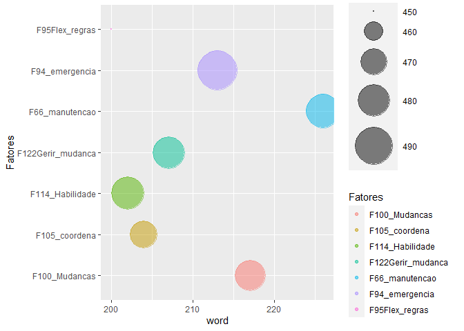
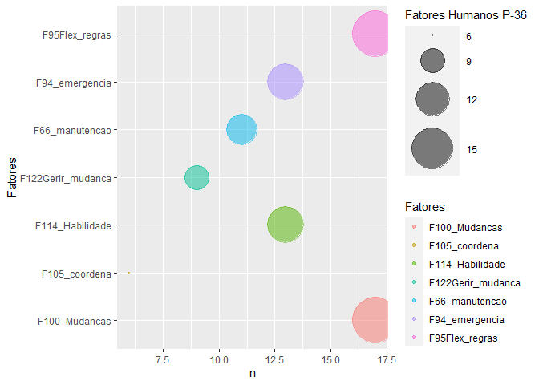

# Contexto do estudo

Este é um estudo exploratório de técnicas de Text Mining. O intuito é descobrir que técnicas que podem ser utilizadas para identificar fatores humanos em relatórios de acidentes fornecidos pela ANP.

## Objetivo do estudo

Formação de uma base de dados que possa ser utilizada para estimar a probabilidade de ocorrência de um acidente a partir de fatores humanos identificados. Para realizar este estudo foram feitas análises com algoritmos computacionais e análises feitas por humanos. Desta forma busca-se avaliar como um humano identifica determinadas palavras e frases em um texto, para então reproduzir o método em um algoritmo. Como resultado final, espera-se a criação de um método que possa identificar e estruturar em uma base de dados os fatores humanos descritos no modelo HF2.

## Pergunta de pesquisa

Como identificar fatores humanos relacionados ao modelo HF2 nos relatórios de investigação de acidentes da ANP?

## Métodos, técnicas e materiais

 **Descrever método ao finalizar as analises**


```r
# Tidying text

    .PdfFrases <- function(x) {
              Texto <- x %>% 
              read_pdf() %>% 
              as.tibble() %>% 
              select(text) 
### Fator linha 94 "Trabalho	Condições de Trabalho	Regras e procedimentos Desempenho sob estresse / emergência"
F94_emergencia <- Texto$text[str_detect(
  Texto$text,
  pattern = "Resposta|resposta|emergências|emergência|plano|ineficácia"
  )]
### Fator linha 95: Trabalho	Condições de Trabalho	Regras e procedimentos	Flexibilidade	
F95Flex_regras <- Texto$text[str_detect(
  Texto$text,
  pattern = "procedimentos|procedimento|regras|regra|conformidade|conformidades|alternativas"
  )]
### Fator linha 105: Trabalho	Relações de Trabalho	Liderança de Equipe	Capacidade de coordenação 
F105_coordena <-
Texto$text[str_detect(
  Texto$text,
  pattern = "comando|plataforma|ineficácia|ações|conter|coordenação| deficientes"
  )]
### Fator linha 66 Trabalho	Condições de Trabalho	Design de interfaces	Inspeção / manutenção 
F66_manutencao <- Texto$text[str_detect(
  Texto$text,
  pattern = "manutenção|problemas|problema"
  )]
### Fator linha 122 Organização	Gestão e organização do trabalho 	Gerenciamento de mudanças
F122Gerir_mudanca <- Texto$text[str_detect(
  Texto$text,
  pattern = "mudança|mudanças|gestão"
  )]
### Fator linha 100 Trabalho	Condições de Trabalho	Regras e procedimentos 	Gerenciamento de mudanças
F100_Mudancas <- Texto$text[str_detect(
  Texto$text,
  pattern = "mudança|mudanças|gestão|procedimentos|contrariando"
  )]
### Fator linha 114 Organização	Gestão e organização do trabalho 	Recursos	Conteúdos e Ferramentas	Habilidade**
F114_Habilidade <- Texto$text[str_detect(
  Texto$text,
  pattern = "^ineficácia|ações|conter"
  )]
## Juntar em uma tabela
Frases<-c(F66_manutencao,F100_Mudancas, F95Flex_regras,F94_emergencia,F105_coordena, F114_Habilidade,F122Gerir_mudanca)
Fatores<-rbind("F66_manutencao","F100_Mudancas", "F95Flex_regras","F94_emergencia","F105_coordena", "F114_Habilidade","F122Gerir_mudanca")
# Transforma em dataframe
tb <- data.frame(Fatores,Frases, stringsAsFactors = FALSE)
 return(tb)
}
```


## Documento P-36 

Nesta etapa buscou-se identificar as frases que contém os fatores humanos identificados, os quais mantém relação com o modelo HF2.

Para realizar esta análise buscou-se resgatar as frases que contém os seguintes termos identificados no passo exploratório:


## Identificação de frases com termos dos fatores do modelo HF2

Nesta etapa buscou-se identificar as frases que contém os fatores humanos identificados, os quais mantém relação com o modelo HF2.

Para realizar esta análise buscou-se resgatar as frases que contém os seguintes termos identificados no passo exploratório:


```r
library(tidytext)
library(wordcloud)
# Lista de stopwords em português
stopwords_pt <- data.frame(word = tm::stopwords("portuguese"))
# Quebrando as frases em palavras
unnested <- P36_Fatores %>% 
  unnest_tokens(output = Palavras, input = Frases) 
  # Removendo stopwords
```


```r
# Split the text_column into sentences
P36 <- P36_Fatores %>%
  unnest_tokens(output = "sentences", input = Frases, token = "sentences") %>%
  # Count sentences, per chapter
  count(Fatores)

# Split the text_column using regular expressions
P36 <-  P36_Fatores %>%
  unnest_tokens(output = "sentences", input = Frases,
                token = "regex", pattern = "\\.") %>%
  count(Fatores)
```


```r
# Tokenize animal farm's text_column column


tidy_P36 <- P36_Fatores %>%
  unnest_tokens(word, Frases) %>%
  anti_join(stopwords_pt, by = "word", "word")
```

```
## Warning: Column `word` joining character vector and factor, coercing into
## character vector
```

```r
# Print the word frequencies
tidy_P36 %>%
  count(word, sort = TRUE)
```

```
## # A tibble: 579 x 2
##    word              n
##    <chr>         <int>
##  1 plataforma      105
##  2 emergência       54
##  3 procedimentos    51
##  4 36               35
##  5 p                35
##  6 acidente         31
##  7 manutenção       31
##  8 análise          30
##  9 operação         29
## 10 conformidades    28
## # ... with 569 more rows
```


```r
# Perform stemming on tidy_animal_farm
stemmed_tidy_P36 <- tidy_P36 %>%
 mutate(word = wordStem(word))

# Print the old word frequencies 
tidy_P36%>%
  count(word, sort = TRUE)
```

```
## # A tibble: 634 x 2
##    word              n
##    <chr>         <int>
##  1 de              322
##  2 a               194
##  3 plataforma      105
##  4 e                98
##  5 da               96
##  6 do               77
##  7 o                69
##  8 não              55
##  9 emergência       54
## 10 procedimentos    51
## # ... with 624 more rows
```

```r
# Print the new word frequencies
stemmed_tidy_P36 %>%
  count(word, sort = TRUE)
```

```
## # A tibble: 596 x 2
##    word             n
##    <chr>        <int>
##  1 de             322
##  2 a              223
##  3 da             126
##  4 plataforma     105
##  5 e               98
##  6 do              95
##  7 o               79
##  8 emergência      57
##  9 não             55
## 10 procedimento    54
## # ... with 586 more rows
```


```r
By_fator_tidy_P36 <-
        tidy_P36 %>% 
        group_by(Fatores) %>%
        summarise(Quantidade = n(),
                  word = n_distinct(word))
                  
  By_fator_tidy_P36 %>%
 ggplot(aes(x=word , y=Fatores, size=Quantidade, color=Fatores)) +
    geom_point(alpha=0.5) +
    scale_size(range = c(.1, 20), name="Fatores Humanos P-36")
```

<!-- -->

```r
 P36 %>%
 ggplot(aes(x=n , y=Fatores, size=n, color=Fatores)) +
    geom_point(alpha=0.5) +
    scale_size(range = c(.1, 20), name="Fatores Humanos P-36")
```

<!-- -->


# Documento P-48

# Modelagem para classificação

Passos: 

1. Pegar os termos retirados das frases

2. Criar conjuntos de dados treinados e testados

3. Treinar um modelo no conjunto de dados treinados

4. Verificar a acurácia no conjunto de dados de teste


# Referências

National Commission on the BP Deepwater Horizon Oil Spill and Offshore Drilling (NCDWHSOD). Deep Water: The Gulf Oil Disaster and the Future of Offshore Drilling. Report to the President. January 2011 Cover Photo: © Steadfast TV. ISBN: 978-0-16-087371-3. https://www.govinfo.gov/content/pkg/GPO-OILCOMMISSION/pdf/GPO-OILCOMMISSION.pdf

http://data7.blog/grafo-de-palavras-anitta-twitter/

Analise de palavras.  Disponivel em: https://www.ufrgs.br/wiki-r/index.php?title=Frequ%C3%AAncia_das_palavras_e_nuvem_de_palavras Esta página foi modificada pela última vez em 12 de dezembro de 2018, às 19h30min
Conteúdo disponível sob Creative Commons - Atribuição - Compartilha nos Mesmos Termos, salvo indicação em contrário.

https://p4husp.github.io/material/tutorial11/


Principal: https://www.tidytextmining.com/ngrams.html

Corpus and Machine Learning: https://rstudio-pubs-static.s3.amazonaws.com/265713_cbef910aee7642dc8b62996e38d2825d.html


Machine learning: https://kenbenoit.net/pdfs/text_analysis_in_R.pdf

Mineração de texto: 
https://www.rpubs.com/LaionBoaventura/mineracaodetexto

MANIPULAÇÃO DE STRINGS E TEXT MININGhttps://gomesfellipe.github.io/post/2017-12-17-string/string/


@article{JSSv025i05,
   author = {Ingo Feinerer and Kurt Hornik and David Meyer},
   title = {Text Mining Infrastructure in R},
   journal = {Journal of Statistical Software, Articles},
   volume = {25},
   number = {5},
   year = {2008},
   keywords = {},
   abstract = {During the last decade text mining has become a widely used   discipline utilizing statistical and machine learning methods. We  present the tm package which provides a framework for text mining  applications within R. We give a survey on text mining facilities in R and explain how typical application tasks can be carried out using our framework. We present techniques for count-based analysis methods, text clustering, text classification and string kernels.},
   issn = {1548-7660},
   pages = {1--54},
   doi = {10.18637/jss.v025.i05},
   url = {https://www.jstatsoft.org/v025/i05}
}

