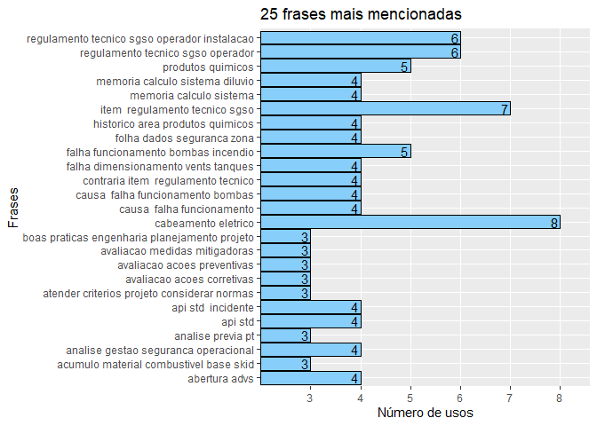
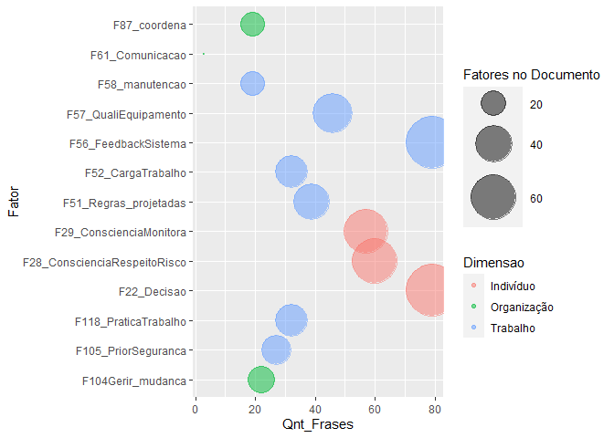
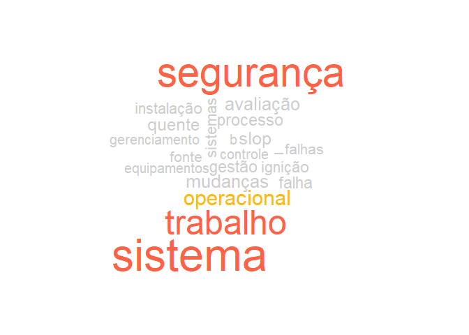

# Contexto do estudo

Este é um estudo exploratório de técnicas de Text Mining. O intuito é descobrir que técnicas que podem ser utilizadas para identificar fatores humanos em relatórios de acidentes fornecidos pela ANP.

## Objetivo do estudo

Formação de uma base de dados que possa ser utilizada para estimar a probabilidade de ocorrência de um acidente a partir de fatores humanos identificados. Para realizar este estudo foram feitas análises com algoritmos computacionais e análises feitas por humanos. Desta forma busca-se avaliar como um humano identifica determinadas palavras e frases em um texto, para então reproduzir o método em um algoritmo. Como resultado final, espera-se a criação de um método que possa identificar e estruturar em uma base de dados os fatores humanos descritos no modelo HF2.

## Pergunta de pesquisa

Como identificar fatores humanos relacionados ao modelo HF2 nos relatórios de investigação de acidentes da ANP?

## Métodos, técnicas e materiais


# Documento P-20


```r
library(tidyverse) # Manipulacao eficiente de dados
library(tidytext) # Manipulacao eficiente de texto
library(textreadr) # Leitura de pdf para texto
library(tm) # Pacote de mineracao de texto com stopwords 
library(wordcloud) # Grafico nuvem de palavras
library(igraph)
library(ggraph)
library(ggplot2)
library(dplyr)
library(pdftools)
library(RRPP)
library(SnowballC)
library(glue)
```

```
## Warning: package 'glue' was built under R version 3.6.3
```

```
## 
## Attaching package: 'glue'
```

```
## The following object is masked from 'package:dplyr':
## 
##     collapse
```

```r
library(ngram)
library(qdapTools)
library(qdap)
library(rlist)
```

```
## Warning: package 'rlist' was built under R version 3.6.3
```

```r
library(pipeR)
```

```
## Warning: package 'pipeR' was built under R version 3.6.3
```

```r
setwd("~/Text Mining")

## Função para ler, organizar, limpar palavras e normalizar o texto


# Arquivo pdf
arquivoPdf_P20 <- "~/Text Mining/Relatorio_P-20_final.pdf"
arquivoPdf_P36 <- "~/Text Mining/Relatorio_P-36.pdf"
arquivoPdf_P48 <- "~/Text Mining/P-48_Relatorio.pdf"


.LimpaOrganiza <- function(arquivoPdf) {
              Texto <- arquivoPdf %>% 
              read_pdf() %>% 
              as.tibble() %>% 
              select(text) 
}


P20 <- .LimpaOrganiza(arquivoPdf_P20)
```

```
## Warning: `as.tibble()` is deprecated as of tibble 2.0.0.
## Please use `as_tibble()` instead.
## The signature and semantics have changed, see `?as_tibble`.
## This warning is displayed once every 8 hours.
## Call `lifecycle::last_warnings()` to see where this warning was generated.
```

```r
P36 <- .LimpaOrganiza(arquivoPdf_P36)
P48 <- .LimpaOrganiza(arquivoPdf_P48)

library(readxl)
```


```r
## Functon return phases reletec with a factor and 3 exemplos of these phrases

.Frases <- function(text,vector) {
  # Match one or more word characters or punctuations
##"([\\w[:punct:]]+\\s){0,20}"
context <- "([\\.\\w\\.]){0,200}"
pattern_operator <- glue_collapse(vector, sep = "|")
pattern_with_context <- glue(
  "{context}({pattern_operator})\\s?{context}")
phrases <- grep(
text,
  pattern = pattern_with_context, value = TRUE,ignore.case = TRUE)
return(phrases)
  }
  

# Function to return a wordcloud and 3 main prases from a factor


.Wc_3f <- function(phrases){
frequency <- freq_terms(
  phrases,
  top = 15,
  at.least = 1,
  stopwords("pt"))
  wc <- wordcloud(frequency$WORD,frequency$FREQ,
    max.words = 80,
    colors = c("grey80", "darkgoldenrod1","tomato"))
  return(phrases[1:3])
  return(wc)
}
```


```r
F22 <- c('falhas?', 'avaliação', 'verificação', 'análises?','riscos?','tomada', 'decisão','decisões')
F28 <-  c("considerção", "aprovação", "consciência","aprovação", "planejamento","segurança","respeito","avaliação","permissão","segurança","risco")
F29 <-  c("considerção","consciência","aprovação","planejamento","segurança","respeito","avaliação","permissão","segurança","monitor")
F51 <- c('não\\scumpriu', 'não\\spossui', 'ausentes?', 'normas?','regras?','procedimentos?','regulamentos?')
F52 <-  c("alocação","jornada","cansaço","demasiado","trabalhos?")
F56 <-  c("feedback","sistema")       
F57 <- c('equipamentos?', 'configuração', 'dimensionamento', 'especificação','rupturas','instalação')
F58 <- c('manutenção', 'registro', 'notas')
F61 <-  c("comunicação", "canais?","rádios?","esclarecimentos?","orientação")
F87 <- c('direcionou', 'ineficácia', 'comando', 'coordenação','lideranças?','tomada', 'decisão','decisões', 'responsáveis')
F104 <- c('gestão\\sde\\smudanças?', 'gerenciamento\\sde\\smudanças?')
F105 <- c("segurança")
F118 <- c('trabalho', 'permissão')

vetores_fatores <- list(F22, F28, F29, F51, F52, F56, F57, F58, F61, F87, F104, F105, F118)
```


```r
# FUNÇÃO para fazer tabela dos fatores e frases correspondentes


.Analise_fatores_tb <- function(Texto, Tipo_Acidente){

### Fator linha 51 "Regras e instruções de trabalho projetadas"
F51_Regras_projetadas <- .Frases(Texto$text,F51)

### Fator linha 22: Análise dos riscos na tomada de decisão
F22_Decisao <- .Frases(Texto$text, F22)

## Fator linha 87: Trabalho	Relações de Trabalho	Liderança de Equipe	Capacidade de coordenação 
F87_coordena <- .Frases(Texto$text, F87)

## Fator linha 58 Trabalho	Condições de Trabalho	Design de interfaces	Inspeção / manutenção
F58_manutencao <- .Frases(Texto$text, F58)

## Fator linha 104 Organização	Gestão e organização do trabalho 	Gerenciamento de mudanças
F104Gerir_mudanca <- .Frases(Texto$text, F104)

## Fator linha 57 Design de interfaces,	Qualidade do equipamento
F57_QualiEquipamento <- .Frases(Texto$text, F57)

## Fator linha 118 Organização	Gestão e organização do trabalho 	Planejamento e Práticas de trabalho
F118_PraticaTrabalho <- .Frases(Texto$text, F118)

## Fator linha 28 Indivíduo	Competência / Repertório de Ações	Habilidades não técnicas	Consciência situacional	Consciência e respeito pelo risco	
F28_ConscienciaRespeitoRisco <- .Frases(Texto$text, F28)

## Fator linha 29 Indivíduo	Competência / Repertório de Ações	Habilidades não técnicas	Consciência situacional	Atenção aos detalhes	Consciência situacional; atenção aos detalhes; falha no monitoramento do trabalho
F29_ConscienciaMonitora <- .Frases(Texto$text, F29)

## Fator linha 52 Trabalho	Condições de Trabalho	Design do trabalho	Carga de trabalho	

F52_CargaTrabalho <-  .Frases(Texto$text, F52)

## Fator linha 56 Trabalho	Condições de Trabalho	Design de interfaces	Feedback do sistema técnico
F56_FeedbackSistema <-  .Frases(Texto$text, F56)

## Fator linha 61 Trabalho	Condições de Trabalho	Design de interfaces	Informação	Canais de comunicação	
F61_Comunicacao <-  .Frases(Texto$text, F61)

## Fator linha 105 Organização	Gestão e organização do trabalho 	Cultura de segurança 	Prioridade à segurança
F105_PriorSeguranca <-  .Frases(Texto$text, F105)


#mess data - two separeted data
#put the colunm status into which table


F22_Decisao <- data.frame(F22_Decisao) %>% mutate(Fator = "F22_Decisao", text = F22_Decisao, Dimensao = "Indivíduo") 

F51_Regras_projetadas <- data.frame(F51_Regras_projetadas) %>% mutate(Fator = "F51_Regras_projetadas", text = F51_Regras_projetadas, Dimensao = "Trabalho") 

F58_manutencao <- data.frame(F58_manutencao) %>% mutate(Fator = "F58_manutencao", text = F58_manutencao, Dimensao = "Trabalho")
  
F57_QualiEquipamento <- data.frame(F57_QualiEquipamento) %>% mutate(Fator = "F57_QualiEquipamento", text = F57_QualiEquipamento, Dimensao = "Trabalho" )

F87_coordena <- data.frame(F87_coordena) %>% mutate(Fator = "F87_coordena", text = F87_coordena, Dimensao = "Organização")

F104Gerir_mudanca <- data.frame(F104Gerir_mudanca) %>% mutate(Fator = "F104Gerir_mudanca", text = F104Gerir_mudanca, Dimensao = "Organização")

F118_PraticaTrabalho <- data.frame(F118_PraticaTrabalho) %>% mutate(Fator = "F118_PraticaTrabalho", text = F118_PraticaTrabalho, Dimensao = "Trabalho")

F28_ConscienciaRespeitoRisco <- data.frame(F28_ConscienciaRespeitoRisco) %>% mutate(Fator = "F28_ConscienciaRespeitoRisco", text = F28_ConscienciaRespeitoRisco, Dimensao = "Indivíduo")

F29_ConscienciaMonitora <- data.frame(F29_ConscienciaMonitora) %>% mutate(Fator = "F29_ConscienciaMonitora", text = F29_ConscienciaMonitora, Dimensao = "Indivíduo")

F52_CargaTrabalho <- data.frame(F52_CargaTrabalho) %>% mutate(Fator = "F52_CargaTrabalho", text = F52_CargaTrabalho, Dimensao = "Trabalho")

F56_FeedbackSistema <- data.frame(F56_FeedbackSistema) %>% mutate(Fator = "F56_FeedbackSistema", text = F56_FeedbackSistema,  Dimensao = "Trabalho")

F61_Comunicacao <- data.frame(F61_Comunicacao) %>% mutate(Fator = "F61_Comunicacao", text = F61_Comunicacao, Dimensao = "Organização")

F105_PriorSeguranca <- data.frame(F105_PriorSeguranca) %>% mutate(Fator = "F105_PriorSeguranca", text = F105_PriorSeguranca, Dimensao = "Trabalho")


#put together in a big data frame
Frases_por_fator <- bind_rows(F22_Decisao[,2:4], 
                              F51_Regras_projetadas[,2:4], 
                              F58_manutencao[,2:4],
                              F57_QualiEquipamento[,2:4],
                              F87_coordena[,2:4], 
                              F104Gerir_mudanca[,2:4],
                              F118_PraticaTrabalho[,2:4], 
                              F28_ConscienciaRespeitoRisco[,2:4], 
                              F29_ConscienciaMonitora[,2:4], 
                              F52_CargaTrabalho[,2:4],
                              F56_FeedbackSistema[,2:4],
                              F61_Comunicacao[,2:4],
                              F105_PriorSeguranca[,2:4])

Frases_por_fator <- Frases_por_fator %>% mutate(Tipo_Acidente = Tipo_Acidente) 

return(Frases_por_fator)

}
```


```r
## FUNÇÃO Índice do documento extraído das frases dos fatores

.Analise_Fatores_index <- function(texto){
frequency <- freq_terms(
as.character(texto),
top = 20,
at.least = 1,
stopwords("pt"))
print(DT::datatable(frequency))
}
```


<!-- -->


```r
## FUNCAO que agrega todas as funções

.Analise_Completa_Documento <- function(texto_bruto, Nome_Acidente) {
  
tb <- .Analise_fatores_tb(texto_bruto, Nome_Acidente)

.Analise_Fatores_grafico(tb)

.Nuvem_Fatores(tb$text)

.Analise_Fatores_index(tb$text)

.Analise_25Frases_texto(texto_bruto)

return()

}
```

# Documento P_20

<!-- --><!-- -->

```
## NULL
```

```
## NULL
```


# Documento P_36


```r
tb_P36 <- .Analise_Completa_Documento(P36, "Incendio")
```

```
## Warning in bind_rows_(x, .id): Unequal factor levels: coercing to character
```

```
## Warning in bind_rows_(x, .id): binding character and factor vector, coercing
## into character vector

## Warning in bind_rows_(x, .id): binding character and factor vector, coercing
## into character vector

## Warning in bind_rows_(x, .id): binding character and factor vector, coercing
## into character vector

## Warning in bind_rows_(x, .id): binding character and factor vector, coercing
## into character vector

## Warning in bind_rows_(x, .id): binding character and factor vector, coercing
## into character vector

## Warning in bind_rows_(x, .id): binding character and factor vector, coercing
## into character vector

## Warning in bind_rows_(x, .id): binding character and factor vector, coercing
## into character vector

## Warning in bind_rows_(x, .id): binding character and factor vector, coercing
## into character vector

## Warning in bind_rows_(x, .id): binding character and factor vector, coercing
## into character vector

## Warning in bind_rows_(x, .id): binding character and factor vector, coercing
## into character vector

## Warning in bind_rows_(x, .id): binding character and factor vector, coercing
## into character vector

## Warning in bind_rows_(x, .id): binding character and factor vector, coercing
## into character vector

## Warning in bind_rows_(x, .id): binding character and factor vector, coercing
## into character vector
```

<!-- -->

```
## NULL
```

```
## Joining, by = "Palavra"
## Joining, by = "Palavra"
```

<!-- -->


# Documento P_48

<!-- --><!-- -->

```
## NULL
```


# Comparativo por Fatores

## Correlação entre fatores no documento


# Comparativo por Acidente (documento)


# Referências

National Commission on the BP Deepwater Horizon Oil Spill and Offshore Drilling (NCDWHSOD). Deep Water: The Gulf Oil Disaster and the Future of Offshore Drilling. Report to the President. January 2011 Cover Photo: © Steadfast TV. ISBN: 978-0-16-087371-3. https://www.govinfo.gov/content/pkg/GPO-OILCOMMISSION/pdf/GPO-OILCOMMISSION.pdf

http://data7.blog/grafo-de-palavras-anitta-twitter/

Analise de palavras.  Disponivel em: https://www.ufrgs.br/wiki-r/index.php?title=Frequ%C3%AAncia_das_palavras_e_nuvem_de_palavras Esta página foi modificada pela última vez em 12 de dezembro de 2018, às 19h30min
Conteúdo disponível sob Creative Commons - Atribuição - Compartilha nos Mesmos Termos, salvo indicação em contrário.

https://p4husp.github.io/material/tutorial11/


Principal: https://www.tidytextmining.com/ngrams.html

Corpus and Machine Learning: https://rstudio-pubs-static.s3.amazonaws.com/265713_cbef910aee7642dc8b62996e38d2825d.html


Machine learning: https://kenbenoit.net/pdfs/text_analysis_in_R.pdf

Mineração de texto: 
https://www.rpubs.com/LaionBoaventura/mineracaodetexto

MANIPULAÇÃO DE STRINGS E TEXT MININGhttps://gomesfellipe.github.io/post/2017-12-17-string/string/


@article{JSSv025i05,
   author = {Ingo Feinerer and Kurt Hornik and David Meyer},
   title = {Text Mining Infrastructure in R},
   journal = {Journal of Statistical Software, Articles},
   volume = {25},
   number = {5},
   year = {2008},
   keywords = {},
   abstract = {During the last decade text mining has become a widely used   discipline utilizing statistical and machine learning methods. We  present the tm package which provides a framework for text mining  applications within R. We give a survey on text mining facilities in R and explain how typical application tasks can be carried out using our framework. We present techniques for count-based analysis methods, text clustering, text classification and string kernels.},
   issn = {1548-7660},
   pages = {1--54},
   doi = {10.18637/jss.v025.i05},
   url = {https://www.jstatsoft.org/v025/i05}
}

