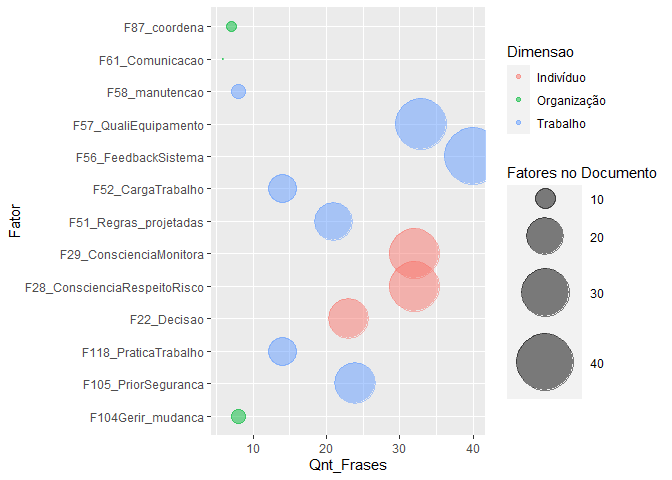
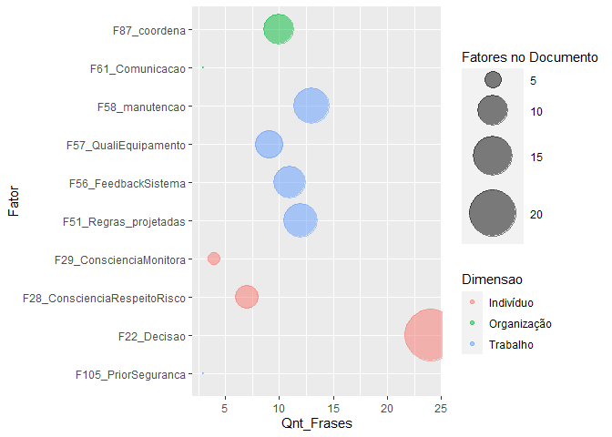
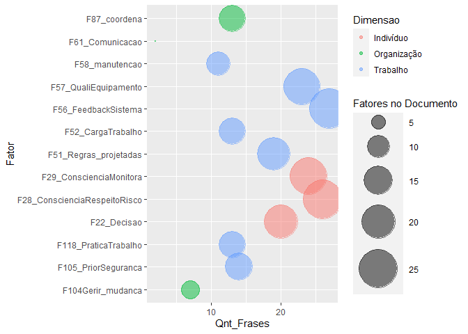

# Contexto do estudo

Este é um estudo exploratório de técnicas de Text Mining. O intuito é descobrir que técnicas que podem ser utilizadas para identificar fatores humanos em relatórios de acidentes fornecidos pela ANP.

## Objetivo do estudo

Formação de uma base de dados que possa ser utilizada para estimar a probabilidade de ocorrência de um acidente a partir de fatores humanos identificados. Para realizar este estudo foram feitas análises com algoritmos computacionais e análises feitas por humanos. Desta forma busca-se avaliar como um humano identifica determinadas palavras e frases em um texto, para então reproduzir o método em um algoritmo. Como resultado final, espera-se a criação de um método que possa identificar e estruturar em uma base de dados os fatores humanos descritos no modelo HF2.

## Pergunta de pesquisa

Como identificar fatores humanos relacionados ao modelo HF2 nos relatórios de investigação de acidentes da ANP?

## Métodos, técnicas e materiais


# Documento P-20


.Frases <- function(text,vector) {
  # Match one or more word characters or punctuations
##"([\\w[:punct:]]+\\s){0,20}"
context <- "([\\w[:punct:]]+\\s){0,30}"
pattern <- glue_collapse(vector, sep = "|")
pattern_with_context <- glue(
  "{context}({vector})\\s?{context}")
phrases <- grep(
text$text,
  pattern = pattern_with_context, value = TRUE,ignore.case = TRUE)
phrases <- as.data.frame.character(phrases)
return(phrases)

}


# Make a clean volatile corpus: text_corpus
text_corpus <- clean_corpus(VCorpus(docs))

# Examine the first doc content
content(text_corpus[[1]])

# Access the first doc metadata
meta(text_corpus[1])

phrases[1]


res<-data.frame(str_detect(pdf.text,F22))
colnames(res)<-"Result"
res<- subset(res,res$Result==TRUE)
row.names(res)


pdf.text <- pdftools::pdf_text(arquivoPdf_P20)
cat(pdf.text[[2]]) 
pdf.text<-unlist(pdf.text)
pdf.text<-tolower(pdf.text)
library(stringr)
res<-data.frame(str_detect(pdf.text,F22))
colnames(res)<-"Result"
res<- subset(res,res$Result==TRUE)
row.names(res)


for (i in 1:length(vetores_fatores)) {
## S3 method for class 'list' to transforma a df
 Fator[i] <- as.data.frame(vetores_fatores[i], row.names = NULL, optional = FALSE,
              cut.names = FALSE, col.names = names(vetores_fatores[i]), fix.empty.names = TRUE,
              stringsAsFactors = default.stringsAsFactors())
 x = colnames(Fator[1])
 write.csv(Fator[i], file = x)
}


```r
# FUNÇÃO para fazer tabela dos fatores e frases correspondentes


.Analise_fatores_tb <- function(Texto, Tipo_Acidente){


### Fator linha 51 "Regras e instruções de trabalho projetadas"
F51_Regras_projetadas <- .Frases(Texto$text,F51)

### Fator linha 22: Análise dos riscos na tomada de decisão
F22_Decisao <- .Frases(Texto$text, F22)

## Fator linha 87: Trabalho	Relações de Trabalho	Liderança de Equipe	Capacidade de coordenação 
F87_coordena <- .Frases(Texto$text, F87)

## Fator linha 58 Trabalho	Condições de Trabalho	Design de interfaces	Inspeção / manutenção
F58_manutencao <- .Frases(Texto$text, F58)

## Fator linha 104 Organização	Gestão e organização do trabalho 	Gerenciamento de mudanças
F104Gerir_mudanca <- .Frases(Texto$text, F104)

## Fator linha 57 Design de interfaces,	Qualidade do equipamento
F57_QualiEquipamento <- .Frases(Texto$text, F57)

## Fator linha 118 Organização	Gestão e organização do trabalho 	Planejamento e Práticas de trabalho
F118_PraticaTrabalho <- .Frases(Texto$text, F118)

## Fator linha 28 Indivíduo	Competência / Repertório de Ações	Habilidades não técnicas	Consciência situacional	Consciência e respeito pelo risco	
F28_ConscienciaRespeitoRisco <- .Frases(Texto$text, F28)

## Fator linha 29 Indivíduo	Competência / Repertório de Ações	Habilidades não técnicas	Consciência situacional	Atenção aos detalhes	Consciência situacional; atenção aos detalhes; falha no monitoramento do trabalho
F29_ConscienciaMonitora <- .Frases(Texto$text, F29)

## Fator linha 52 Trabalho	Condições de Trabalho	Design do trabalho	Carga de trabalho	

F52_CargaTrabalho <-  .Frases(Texto$text, F52)

## Fator linha 56 Trabalho	Condições de Trabalho	Design de interfaces	Feedback do sistema técnico
F56_FeedbackSistema <-  .Frases(Texto$text, F56)

## Fator linha 61 Trabalho	Condições de Trabalho	Design de interfaces	Informação	Canais de comunicação	
F61_Comunicacao <-  .Frases(Texto$text, F61)

## Fator linha 105 Organização	Gestão e organização do trabalho 	Cultura de segurança 	Prioridade à segurança


F105_PriorSeguranca <-  .Frases(Texto$text, F105)


F22_Decisao <- F22_Decisao %>%
 mutate(Fator = "F22_Decisao", text = F22_Decisao, Dimensao = "Indivíduo") 

F51_Regras_projetadas <- F51_Regras_projetadas  %>% mutate(Fator = "F51_Regras_projetadas", text = F51_Regras_projetadas, Dimensao = "Trabalho") 

F58_manutencao <- F58_manutencao %>% mutate(Fator = "F58_manutencao", text = F58_manutencao, Dimensao = "Trabalho")
  
F57_QualiEquipamento <- F57_QualiEquipamento %>% mutate(Fator = "F57_QualiEquipamento", text = F57_QualiEquipamento, Dimensao = "Trabalho" )

F87_coordena <- F87_coordena %>% mutate(Fator = "F87_coordena", text = F87_coordena, Dimensao = "Organização")

F104Gerir_mudanca <- F104Gerir_mudanca %>% mutate(Fator = "F104Gerir_mudanca", text = F104Gerir_mudanca, Dimensao = "Organização")

F118_PraticaTrabalho <- F118_PraticaTrabalho %>% mutate(Fator = "F118_PraticaTrabalho", text = F118_PraticaTrabalho, Dimensao = "Trabalho")

F28_ConscienciaRespeitoRisco <- F28_ConscienciaRespeitoRisco %>% mutate(Fator = "F28_ConscienciaRespeitoRisco", text = F28_ConscienciaRespeitoRisco, Dimensao = "Indivíduo")

F29_ConscienciaMonitora <- F29_ConscienciaMonitora %>% mutate(Fator = "F29_ConscienciaMonitora", text = F29_ConscienciaMonitora, Dimensao = "Indivíduo")

F52_CargaTrabalho <- F52_CargaTrabalho %>% mutate(Fator = "F52_CargaTrabalho", text = F52_CargaTrabalho, Dimensao = "Trabalho")

F56_FeedbackSistema <- F56_FeedbackSistema %>% mutate(Fator = "F56_FeedbackSistema", text = F56_FeedbackSistema,  Dimensao = "Trabalho")

F61_Comunicacao <- F61_Comunicacao %>% mutate(Fator = "F61_Comunicacao", text = F61_Comunicacao, Dimensao = "Organização")

F105_PriorSeguranca <- F105_PriorSeguranca %>% mutate(Fator = "F105_PriorSeguranca", text = F105_PriorSeguranca, Dimensao = "Trabalho")


#put together in a big data frame
Frases_por_fator <- bind_rows(F22_Decisao[,2:4], 
                              F51_Regras_projetadas[,2:4], 
                              F58_manutencao[,2:4],
                              F57_QualiEquipamento[,2:4],
                              F87_coordena[,2:4], 
                              F104Gerir_mudanca[,2:4],
                              F118_PraticaTrabalho[,2:4], 
                              F28_ConscienciaRespeitoRisco[,2:4], 
                              F29_ConscienciaMonitora[,2:4], 
                              F52_CargaTrabalho[,2:4],
                              F56_FeedbackSistema[,2:4],
                              F61_Comunicacao[,2:4],
                              F105_PriorSeguranca[,2:4])

Frases_por_fator <- Frases_por_fator %>% mutate(Tipo_Acidente = Tipo_Acidente) 

return(Frases_por_fator)

}
```


# Documento P_20

<!-- --><!-- -->

```
## NULL
```

```
## NULL
```


# Documento P_36

<!-- --><!-- -->

```
## NULL
```


# Documento P_48

<!-- --><!-- -->

```
## NULL
```


# Comparativo por Fatores

## Correlação entre fatores no documento


# Comparativo por Acidente (documento)


# Referências

National Commission on the BP Deepwater Horizon Oil Spill and Offshore Drilling (NCDWHSOD). Deep Water: The Gulf Oil Disaster and the Future of Offshore Drilling. Report to the President. January 2011 Cover Photo: © Steadfast TV. ISBN: 978-0-16-087371-3. https://www.govinfo.gov/content/pkg/GPO-OILCOMMISSION/pdf/GPO-OILCOMMISSION.pdf

http://data7.blog/grafo-de-palavras-anitta-twitter/

Analise de palavras.  Disponivel em: https://www.ufrgs.br/wiki-r/index.php?title=Frequ%C3%AAncia_das_palavras_e_nuvem_de_palavras Esta página foi modificada pela última vez em 12 de dezembro de 2018, às 19h30min
Conteúdo disponível sob Creative Commons - Atribuição - Compartilha nos Mesmos Termos, salvo indicação em contrário.

https://p4husp.github.io/material/tutorial11/


Principal: https://www.tidytextmining.com/ngrams.html

Corpus and Machine Learning: https://rstudio-pubs-static.s3.amazonaws.com/265713_cbef910aee7642dc8b62996e38d2825d.html


Machine learning: https://kenbenoit.net/pdfs/text_analysis_in_R.pdf

Mineração de texto: 
https://www.rpubs.com/LaionBoaventura/mineracaodetexto

MANIPULAÇÃO DE STRINGS E TEXT MININGhttps://gomesfellipe.github.io/post/2017-12-17-string/string/


@article{JSSv025i05,
   author = {Ingo Feinerer and Kurt Hornik and David Meyer},
   title = {Text Mining Infrastructure in R},
   journal = {Journal of Statistical Software, Articles},
   volume = {25},
   number = {5},
   year = {2008},
   keywords = {},
   abstract = {During the last decade text mining has become a widely used   discipline utilizing statistical and machine learning methods. We  present the tm package which provides a framework for text mining  applications within R. We give a survey on text mining facilities in R and explain how typical application tasks can be carried out using our framework. We present techniques for count-based analysis methods, text clustering, text classification and string kernels.},
   issn = {1548-7660},
   pages = {1--54},
   doi = {10.18637/jss.v025.i05},
   url = {https://www.jstatsoft.org/v025/i05}
}

