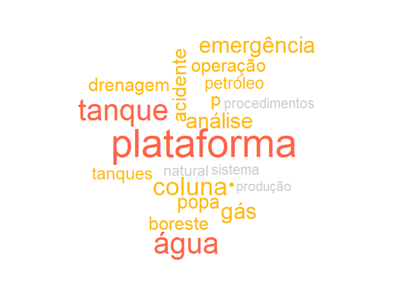
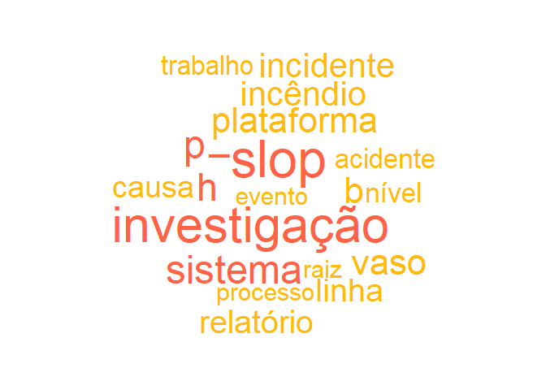

# Contexto do estudo

Este é um estudo exploratório de técnicas de Text Mining. O intuito é descobrir que técnicas que podem ser utilizadas para identificar fatores humanos em relatórios de acidentes fornecidos pela ANP.

## Objetivo do estudo

Formação de uma base de dados que possa ser utilizada para estimar a probabilidade de ocorrência de um acidente a partir de fatores humanos identificados. Para realizar este estudo foram feitas análises com algoritmos computacionais e análises feitas por humanos. Desta forma busca-se avaliar como um humano identifica determinadas palavras e frases em um texto, para então reproduzir o método em um algoritmo. Como resultado final, espera-se a criação de um método que possa identificar e estruturar em uma base de dados os fatores humanos descritos no modelo HF2.

## Pergunta de pesquisa

Como identificar fatores humanos relacionados ao modelo HF2 nos relatórios de investigação de acidentes da ANP?

## Métodos, técnicas e materiais


# Documento P-20


.Frases <- function(text,vector) {
  # Match one or more word characters or punctuations
##"([\\w[:punct:]]+\\s){0,20}"
context <- "([\\w[:punct:]]+\\s){0,30}"
pattern <- glue_collapse(vector, sep = "|")
pattern_with_context <- glue(
  "{context}({vector})\\s?{context}")
phrases <- grep(
text$text,
  pattern = pattern_with_context, value = TRUE,ignore.case = TRUE)
phrases <- as.data.frame.character(phrases)
return(phrases)

}


# Make a clean volatile corpus: text_corpus
text_corpus <- clean_corpus(VCorpus(docs))

# Examine the first doc content
content(text_corpus[[1]])

# Access the first doc metadata
meta(text_corpus[1])

phrases[1]


res<-data.frame(str_detect(pdf.text,F22))
colnames(res)<-"Result"
res<- subset(res,res$Result==TRUE)
row.names(res)


pdf.text <- pdftools::pdf_text(arquivoPdf_P20)
cat(pdf.text[[2]]) 
pdf.text<-unlist(pdf.text)
pdf.text<-tolower(pdf.text)
library(stringr)
res<-data.frame(str_detect(pdf.text,F22))
colnames(res)<-"Result"
res<- subset(res,res$Result==TRUE)
row.names(res)


for (i in 1:length(vetores_fatores)) {
## S3 method for class 'list' to transforma a df
 Fator[i] <- as.data.frame(vetores_fatores[i], row.names = NULL, optional = FALSE,
              cut.names = FALSE, col.names = names(vetores_fatores[i]), fix.empty.names = TRUE,
              stringsAsFactors = default.stringsAsFactors())
 x = colnames(Fator[1])
 write.csv(Fator[i], file = x)
}


# Documento P_20

<!-- --><!-- -->

```
## NULL
```

```
## NULL
```


# Documento P_36

<!-- --><!-- -->

```
## NULL
```

```
## NULL
```


# Documento P_48

<!-- --><!-- -->

```
## NULL
```

```
## NULL
```


# Comparativo por Fatores

## Correlação entre fatores no documento


# Comparativo por Acidente (documento)


# Referências

National Commission on the BP Deepwater Horizon Oil Spill and Offshore Drilling (NCDWHSOD). Deep Water: The Gulf Oil Disaster and the Future of Offshore Drilling. Report to the President. January 2011 Cover Photo: © Steadfast TV. ISBN: 978-0-16-087371-3. https://www.govinfo.gov/content/pkg/GPO-OILCOMMISSION/pdf/GPO-OILCOMMISSION.pdf

http://data7.blog/grafo-de-palavras-anitta-twitter/

Analise de palavras.  Disponivel em: https://www.ufrgs.br/wiki-r/index.php?title=Frequ%C3%AAncia_das_palavras_e_nuvem_de_palavras Esta página foi modificada pela última vez em 12 de dezembro de 2018, às 19h30min
Conteúdo disponível sob Creative Commons - Atribuição - Compartilha nos Mesmos Termos, salvo indicação em contrário.

https://p4husp.github.io/material/tutorial11/


Principal: https://www.tidytextmining.com/ngrams.html

Corpus and Machine Learning: https://rstudio-pubs-static.s3.amazonaws.com/265713_cbef910aee7642dc8b62996e38d2825d.html


Machine learning: https://kenbenoit.net/pdfs/text_analysis_in_R.pdf

Mineração de texto: 
https://www.rpubs.com/LaionBoaventura/mineracaodetexto

MANIPULAÇÃO DE STRINGS E TEXT MININGhttps://gomesfellipe.github.io/post/2017-12-17-string/string/


@article{JSSv025i05,
   author = {Ingo Feinerer and Kurt Hornik and David Meyer},
   title = {Text Mining Infrastructure in R},
   journal = {Journal of Statistical Software, Articles},
   volume = {25},
   number = {5},
   year = {2008},
   keywords = {},
   abstract = {During the last decade text mining has become a widely used   discipline utilizing statistical and machine learning methods. We  present the tm package which provides a framework for text mining  applications within R. We give a survey on text mining facilities in R and explain how typical application tasks can be carried out using our framework. We present techniques for count-based analysis methods, text clustering, text classification and string kernels.},
   issn = {1548-7660},
   pages = {1--54},
   doi = {10.18637/jss.v025.i05},
   url = {https://www.jstatsoft.org/v025/i05}
}

