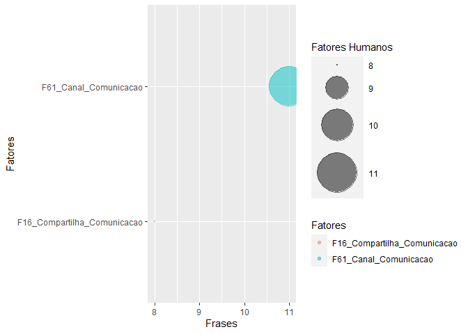
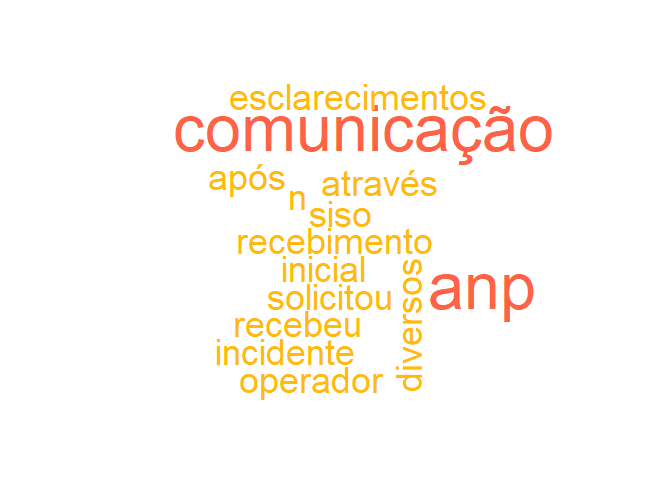

# Contexto do estudo

Este é um estudo exploratório de técnicas de Text Mining. O intuito é descobrir que técnicas que podem ser utilizadas para identificar fatores humanos em relatórios de acidentes fornecidos pela ANP.

## Objetivo do estudo

Formação de uma base de dados que possa ser utilizada para estimar a probabilidade de ocorrência de um acidente a partir de fatores humanos identificados. Para realizar este estudo foram feitas análises com algoritmos computacionais e análises feitas por humanos. Desta forma busca-se avaliar como um humano identifica determinadas palavras e frases em um texto, para então reproduzir o método em um algoritmo. Como resultado final, espera-se a criação de um método que possa identificar e estruturar em uma base de dados os fatores humanos descritos no modelo HF2.

## Pergunta de pesquisa

Como identificar fatores humanos relacionados ao modelo HF2 nos relatórios de investigação de acidentes da ANP?

## Documento P-20

### Fator linha 51 "Regras e instruções de trabalho projetadas"


```r
library(tidyverse) # Manipulacao eficiente de dados
```

```
## -- Attaching packages -------------------------------------------------------------- tidyverse 1.3.0 --
```

```
## v ggplot2 3.3.0     v purrr   0.3.4
## v tibble  3.0.1     v dplyr   0.8.5
## v tidyr   1.0.2     v stringr 1.4.0
## v readr   1.3.1     v forcats 0.5.0
```

```
## Warning: package 'ggplot2' was built under R version 3.6.3
```

```
## Warning: package 'tibble' was built under R version 3.6.3
```

```
## Warning: package 'tidyr' was built under R version 3.6.3
```

```
## Warning: package 'purrr' was built under R version 3.6.3
```

```
## Warning: package 'dplyr' was built under R version 3.6.3
```

```
## Warning: package 'forcats' was built under R version 3.6.3
```

```
## -- Conflicts ----------------------------------------------------------------- tidyverse_conflicts() --
## x dplyr::filter() masks stats::filter()
## x dplyr::lag()    masks stats::lag()
```

```r
library(tidytext) # Manipulacao eficiente de texto
```

```
## Warning: package 'tidytext' was built under R version 3.6.3
```

```r
library(textreadr) # Leitura de pdf para texto
```

```
## Warning: package 'textreadr' was built under R version 3.6.3
```

```r
library(tm) # Pacote de mineracao de texto com stopwords 
```

```
## Warning: package 'tm' was built under R version 3.6.3
```

```
## Loading required package: NLP
```

```
## 
## Attaching package: 'NLP'
```

```
## The following object is masked from 'package:ggplot2':
## 
##     annotate
```

```r
library(wordcloud) # Grafico nuvem de palavras
```

```
## Warning: package 'wordcloud' was built under R version 3.6.3
```

```
## Loading required package: RColorBrewer
```

```r
library(igraph)
```

```
## Warning: package 'igraph' was built under R version 3.6.3
```

```
## 
## Attaching package: 'igraph'
```

```
## The following objects are masked from 'package:dplyr':
## 
##     as_data_frame, groups, union
```

```
## The following objects are masked from 'package:purrr':
## 
##     compose, simplify
```

```
## The following object is masked from 'package:tidyr':
## 
##     crossing
```

```
## The following object is masked from 'package:tibble':
## 
##     as_data_frame
```

```
## The following objects are masked from 'package:stats':
## 
##     decompose, spectrum
```

```
## The following object is masked from 'package:base':
## 
##     union
```

```r
library(ggraph)
```

```
## Warning: package 'ggraph' was built under R version 3.6.3
```

```r
library(ggplot2)
library(dplyr)
library(pdftools)
```

```
## Warning: package 'pdftools' was built under R version 3.6.3
```

```r
library(RRPP)
```

```
## Warning: package 'RRPP' was built under R version 3.6.3
```

```r
library(SnowballC)
```

```
## Warning: package 'SnowballC' was built under R version 3.6.3
```

```r
library(glue)
```

```
## Warning: package 'glue' was built under R version 3.6.3
```

```
## 
## Attaching package: 'glue'
```

```
## The following object is masked from 'package:dplyr':
## 
##     collapse
```

```r
setwd("~/Text Mining")

# Arquivo pdf
arquivoPdf <- "~/Text Mining/Relatorio_P-20_final.pdf"

              Texto <- arquivoPdf %>% 
              read_pdf() %>% 
              as.tibble() %>% 
              select(text) 
```

```
## Warning: `as.tibble()` is deprecated as of tibble 2.0.0.
## Please use `as_tibble()` instead.
## The signature and semantics have changed, see `?as_tibble`.
## This warning is displayed once every 8 hours.
## Call `lifecycle::last_warnings()` to see where this warning was generated.
```

              

## Fator linha 61 Trabalho	Condições de Trabalho	Design de interfaces	Informação	Canais de comunicação	


```r
library(tidyverse) # Manipulacao eficiente de dados
library(tidytext) # Manipulacao eficiente de texto
library(textreadr) # Leitura de pdf para texto
library(tm) # Pacote de mineracao de texto com stopwords 
library(wordcloud) # Grafico nuvem de palavras
library(igraph)
library(ggraph)
library(ggplot2)
library(dplyr)
library(pdftools)
library(RRPP)
library(SnowballC)
library(glue)
library(qdap)
```

```
## Warning: package 'qdap' was built under R version 3.6.3
```

```
## Loading required package: qdapDictionaries
```

```
## Loading required package: qdapRegex
```

```
## Warning: package 'qdapRegex' was built under R version 3.6.3
```

```
## 
## Attaching package: 'qdapRegex'
```

```
## The following object is masked from 'package:dplyr':
## 
##     explain
```

```
## The following object is masked from 'package:ggplot2':
## 
##     %+%
```

```
## Loading required package: qdapTools
```

```
## Warning: package 'qdapTools' was built under R version 3.6.3
```

```
## 
## Attaching package: 'qdapTools'
```

```
## The following object is masked from 'package:textreadr':
## 
##     read_docx
```

```
## The following object is masked from 'package:dplyr':
## 
##     id
```

```
## 
## Attaching package: 'qdap'
```

```
## The following objects are masked from 'package:igraph':
## 
##     %>%, diversity
```

```
## The following objects are masked from 'package:tm':
## 
##     as.DocumentTermMatrix, as.TermDocumentMatrix
```

```
## The following object is masked from 'package:NLP':
## 
##     ngrams
```

```
## The following object is masked from 'package:forcats':
## 
##     %>%
```

```
## The following object is masked from 'package:stringr':
## 
##     %>%
```

```
## The following object is masked from 'package:dplyr':
## 
##     %>%
```

```
## The following object is masked from 'package:purrr':
## 
##     %>%
```

```
## The following object is masked from 'package:tidyr':
## 
##     %>%
```

```
## The following object is masked from 'package:tibble':
## 
##     %>%
```

```
## The following object is masked from 'package:base':
## 
##     Filter
```

```r
F61_Canal_Comunicacao <-  grep(pattern = "canais?|rádios?|esclarecimentos?|orientação|comunicação",
             Texto$text, value = TRUE, ignore.case = TRUE)
print(F61_Canal_Comunicacao)
```

```
##  [1] "5.3.   FALHA NOS RÁDIOS DE COMUNICAÇÃO ............................................................................ 49"
##  [2] "No dia 26 de dezembro de 2013 a ANP recebeu uma comunicação inicial de incidente"                                      
##  [3] "anteparas que possuíam aberturas para comunicação do líquido, possibilitando o"                                        
##  [4] "julgava ser adequado sem que tenham havido uma orientação prévia do Coordenador para"                                  
##  [5] "5.3. Falha nos rádios de comunicação"                                                                                  
##  [6] "A comunicação em uma resposta a emergência é realizada por meio de rádios"                                             
##  [7] "embarcações, ao entrar em contato com os rádios transmissores, inutilizou estes"                                       
##  [8] "equipamentos de comunicação."                                                                                          
##  [9] "Um dos técnicos de segurança que atuava na brigada chegou a utilizar cinco rádios"                                     
## [10] "transmissores diferentes. Após ter queimado o quinto rádio, a comunicação se deu através"                              
## [11] "Este fato impossibilitou a comunicação em tempo real entre os membros da EOR,"
```

```r
frequency <- freq_terms(
F61_Canal_Comunicacao,
top = 20,
at.least = 1,
stopwords("pt"))

wordcloud(frequency$WORD,frequency$FREQ,
    max.words = 60,
    colors = c("grey80", "darkgoldenrod1","tomato"))
```

<!-- -->


## Fator linha 16 Competência / Repertório de Ações	Habilidades não técnicas -	Comunicação	- Reconhecimento da importância da comunicação


```r
F16_Compartilha_Comunicacao <-  grep(pattern = "comunicação|compartilhamento",
             Texto$text, value = TRUE, ignore.case = TRUE)
print(F16_Compartilha_Comunicacao)
```

```
## [1] "5.3.   FALHA NOS RÁDIOS DE COMUNICAÇÃO ............................................................................ 49"
## [2] "No dia 26 de dezembro de 2013 a ANP recebeu uma comunicação inicial de incidente"                                      
## [3] "anteparas que possuíam aberturas para comunicação do líquido, possibilitando o"                                        
## [4] "5.3. Falha nos rádios de comunicação"                                                                                  
## [5] "A comunicação em uma resposta a emergência é realizada por meio de rádios"                                             
## [6] "equipamentos de comunicação."                                                                                          
## [7] "transmissores diferentes. Após ter queimado o quinto rádio, a comunicação se deu através"                              
## [8] "Este fato impossibilitou a comunicação em tempo real entre os membros da EOR,"
```

```r
frequency <- freq_terms(
F16_Compartilha_Comunicacao,
top = 20,
at.least = 1,
stopwords("pt"))

wordcloud(frequency$WORD,frequency$FREQ,
    max.words = 60,
    colors = c("grey80", "darkgoldenrod1","tomato"))
```

<!-- -->


##  Grafico do documento


```r
Frases <- c(length(F61_Canal_Comunicacao),length(F16_Compartilha_Comunicacao))
Fatores<-rbind("F61_Canal_Comunicacao","F16_Compartilha_Comunicacao")
tb_P20 <- data.frame(Fatores, Frases, stringsAsFactors = FALSE)


tb_P20 %>%  
  ggplot(aes(x= Frases , y=Fatores, size = Frases, color=Fatores)) +
    geom_point(alpha=0.5) +
    scale_size(range = c(.1, 20), name="Fatores Humanos")
```

<!-- -->

# Documento P-48


```r
setwd("~/Text Mining")

# Arquivo pdf
arquivoPdf <- "~/Text Mining/P-48_Relatorio.pdf"

              Texto <- arquivoPdf %>% 
              read_pdf() %>% 
              as.tibble() %>% 
              select(text) 
##Função para encontrar frases dos fatores
```


## Fator linha 61 Trabalho	Condições de Trabalho	Design de interfaces	Informação	Canais de comunicação	


```r
F61_Comunicacao <-  grep(pattern = ".*comunicação.*|.*canais?.*|.*rádios?.*|.*esclarecimentos?.*|.*orientação.*",
             Texto$text, value = TRUE, ignore.case = TRUE)
print(F61_Comunicacao)
```

```
## [1] "Em 17/03/2016 a ANP recebeu através do SISO1, a comunicação inicial de incidente nº"       
## [2] "Após o recebimento da comunicação, a ANP solicitou diversos esclarecimentos ao operador da"
## [3] "<U+F0B7> Número de rádios insuficientes para equipe de emergência;"
```


## Fator linha 16 Competência / Repertório de Ações	Habilidades não técnicas -	Comunicação	- Reconhecimento da importância da comunicação


```r
F16_Compartilha_Comunicacao <-  grep(pattern = "comunicação|compartilhamento",
             Texto$text, value = TRUE, ignore.case = TRUE)
print(F16_Compartilha_Comunicacao)
```

```
## [1] "Em 17/03/2016 a ANP recebeu através do SISO1, a comunicação inicial de incidente nº"       
## [2] "Após o recebimento da comunicação, a ANP solicitou diversos esclarecimentos ao operador da"
```

```r
frequency <- freq_terms(
F16_Compartilha_Comunicacao,
top = 20,
at.least = 1,
stopwords("pt"))

wordcloud(frequency$WORD,frequency$FREQ,
    max.words = 60,
    colors = c("grey80", "darkgoldenrod1","tomato"))
```

<!-- -->


##  Grafico do documento


```r
Frases <- c(length(F61_Canal_Comunicacao),length(F16_Compartilha_Comunicacao))
Fatores<-rbind("F61_Canal_Comunicacao","F16_Compartilha_Comunicacao")
tb_P48 <- data.frame(Fatores, Frases, stringsAsFactors = FALSE)


tb_P48 %>%  
  ggplot(aes(x= Frases , y=Fatores, size = Frases, color=Fatores)) +
    geom_point(alpha=0.5) +
    scale_size(range = c(.1, 20), name="Fatores Humanos")
```

<!-- -->

## Documento P-20

### Fator linha 51 "Regras e instruções de trabalho projetadas"


```r
library(tidyverse) # Manipulacao eficiente de dados
library(tidytext) # Manipulacao eficiente de texto
library(textreadr) # Leitura de pdf para texto
library(tm) # Pacote de mineracao de texto com stopwords 
library(wordcloud) # Grafico nuvem de palavras
library(igraph)
library(ggraph)
library(ggplot2)
library(dplyr)
library(pdftools)
library(RRPP)
library(SnowballC)
library(glue)

setwd("~/Text Mining")

# Arquivo pdf
arquivoPdf <- "~/Text Mining/Relatorio_P-36.pdf"

              Texto <- arquivoPdf %>% 
              read_pdf() %>% 
              as.tibble() %>% 
              select(text) 
```

              

## Fator linha 61 Trabalho	Condições de Trabalho	Design de interfaces	Informação	Canais de comunicação	


```r
F61_Canal_Comunicacao <-  grep(pattern = "canais?|rádios?|esclarecimentos?|orientação",
             Texto$text, value = TRUE, ignore.case = TRUE)
print(F61_Canal_Comunicacao)
```

```
## character(0)
```


## Fator linha 16 Competência / Repertório de Ações	Habilidades não técnicas -	Comunicação	- Reconhecimento da importância da comunicação


```r
F16_Compartilha_Comunicacao <-  grep(pattern = "comunicação|compartilhamento",
             Texto$text, value = TRUE, ignore.case = TRUE)
print(F16_Compartilha_Comunicacao)
```

```
## [1] "•    sistema de comunicação e coordenação deficientes entre a equipe de resposta à"    
## [2] "espaços abertos, uma vez que eles tinham intercomunicação com a sala de bombas já"     
## [3] "após o afundamento, segundo \"Comunicação de Derramamento de Substância Poluente\", de"
```

```r
frequency <- freq_terms(
F16_Compartilha_Comunicacao,
top = 20,
at.least = 1,
stopwords("pt"))

wordcloud(frequency$WORD,frequency$FREQ,
    max.words = 60,
    colors = c("grey80", "darkgoldenrod1","tomato"))
```

<!-- -->


##  Grafico do documento


```r
Frases <- c(length(F61_Canal_Comunicacao),length(F16_Compartilha_Comunicacao))
Fatores<-rbind("F61_Canal_Comunicacao","F16_Compartilha_Comunicacao")
tb_P36 <- data.frame(Fatores, Frases, stringsAsFactors = FALSE)


tb_P36 %>%  
  ggplot(aes(x= Frases , y=Fatores, size = Frases, color=Fatores)) +
    geom_point(alpha=0.5) +
    scale_size(range = c(.1, 20), name="Fatores Humanos")
```

<!-- -->

# Comparativo por Fatores


```r
tb_P36 <- mutate(tb_P36, Acidente = "P-36")
tb_P48 <- mutate(tb_P48, Acidente = "P-48")
tb_P20 <- mutate(tb_P20, Acidente = "P-20")  

todos1 <- merge(tb_P36, tb_P48, all = TRUE)

data <- merge(todos1, tb_P20, all = TRUE)

names(data) <- c("individual","value","group")


# library
library(tidyverse)
 

# Set a number of 'empty bar' to add at the end of each group
empty_bar <- 4
to_add <- data.frame( matrix(NA, empty_bar*nlevels(data$group), ncol(data)) )
colnames(to_add) <- colnames(data)
to_add$group <- rep(levels(data$group), each=empty_bar)
data <- rbind(data, to_add)
data <- data %>% arrange(group)
data$id <- seq(1, nrow(data))
 
# Get the name and the y position of each label
label_data <- data
number_of_bar <- nrow(label_data)
angle <- 90 - 360 * (label_data$id-0.5) /number_of_bar     # I substract 0.5 because the letter must have the angle of the center of the bars. Not extreme right(1) or extreme left (0)
label_data$hjust <- ifelse( angle < -90, 1, 0)
label_data$angle <- ifelse(angle < -90, angle+180, angle)
 
# Make the plot
p <- ggplot(data, aes(x=as.factor(id), y=value, fill=group)) +       # Note that id is a factor. If x is numeric, there is some space between the first bar
  geom_bar(stat="identity", alpha=0.5) +
  ylim(-100,120) +
  theme_minimal() +
  theme(
    legend.position = "right",
    axis.text = element_blank(),
    axis.title = element_blank(),
    panel.grid = element_blank(),
    plot.margin = unit(rep(-1,4), "cm") 
  ) +
  coord_polar() + 
  geom_text(data=label_data, aes(x=id, y=value+10, label=individual, hjust=hjust), color="black", fontface="bold",alpha=0.6, size=2.5, angle= label_data$angle, inherit.aes = FALSE ) 
 
p
```

<!-- -->

# Comparativo por Acidente (documento)


```r
todos1 <- merge(tb_P36, tb_P48, all = TRUE)

data <- merge(todos1, tb_P20, all = TRUE)

names(data) <- c("group","value","individual")
  
# library
library(tidyverse)
 

# Set a number of 'empty bar' to add at the end of each group
empty_bar <- 4
to_add <- data.frame( matrix(NA, empty_bar*nlevels(data$group), ncol(data)) )
colnames(to_add) <- colnames(data)
to_add$group <- rep(levels(data$group), each=empty_bar)
data <- rbind(data, to_add)
data <- data %>% arrange(group)
data$id <- seq(1, nrow(data))
 
# Get the name and the y position of each label
label_data <- data
number_of_bar <- nrow(label_data)
angle <- 90 - 360 * (label_data$id-0.5) /number_of_bar     # I substract 0.5 because the letter must have the angle of the center of the bars. Not extreme right(1) or extreme left (0)
label_data$hjust <- ifelse( angle < -90, 1, 0)
label_data$angle <- ifelse(angle < -90, angle+180, angle)
 
# Make the plot
p2 <- ggplot(data, aes(x=as.factor(id), y=value, fill=group)) +       # Note that id is a factor. If x is numeric, there is some space between the first bar
  geom_bar(stat="identity", alpha=0.5) +
  ylim(-100,120) +
  theme_minimal() +
  theme(
    legend.position = "right",
    axis.text = element_blank(),
    axis.title = element_blank(),
    panel.grid = element_blank(),
    plot.margin = unit(rep(-1,4), "cm") 
  ) +
  coord_polar() + 
  geom_text(data=label_data, aes(x=id, y=value+10, label=individual, hjust=hjust), color="black", fontface="bold",alpha=0.6, size=2.5, angle= label_data$angle, inherit.aes = FALSE ) 
 
p2
```

<!-- -->


```r
names(data) <- c("fator_humano","percentual","plataforma")

ggplot(data, aes(fill=fator_humano, y=plataforma, x=percentual)) + 
    geom_bar(position="fill", stat="identity") + ggtitle("Fatores humanos por relatório de acidente")
```

<!-- -->


```r
names(data) <- c("fator_humano","percentual","plataforma")

ggplot(data, aes(fill=plataforma, y=fator_humano, x=percentual)) + 
    geom_bar(position="fill", stat="identity") + ggtitle("Fatores humanos por relatório de acidente")
```

<!-- -->


# Referências

National Commission on the BP Deepwater Horizon Oil Spill and Offshore Drilling (NCDWHSOD). Deep Water: The Gulf Oil Disaster and the Future of Offshore Drilling. Report to the President. January 2011 Cover Photo: © Steadfast TV. ISBN: 978-0-16-087371-3. https://www.govinfo.gov/content/pkg/GPO-OILCOMMISSION/pdf/GPO-OILCOMMISSION.pdf

http://data7.blog/grafo-de-palavras-anitta-twitter/

Analise de palavras.  Disponivel em: https://www.ufrgs.br/wiki-r/index.php?title=Frequ%C3%AAncia_das_palavras_e_nuvem_de_palavras Esta página foi modificada pela última vez em 12 de dezembro de 2018, às 19h30min
Conteúdo disponível sob Creative Commons - Atribuição - Compartilha nos Mesmos Termos, salvo indicação em contrário.

https://p4husp.github.io/material/tutorial11/


Principal: https://www.tidytextmining.com/ngrams.html

Corpus and Machine Learning: https://rstudio-pubs-static.s3.amazonaws.com/265713_cbef910aee7642dc8b62996e38d2825d.html


Machine learning: https://kenbenoit.net/pdfs/text_analysis_in_R.pdf

Mineração de texto: 
https://www.rpubs.com/LaionBoaventura/mineracaodetexto

MANIPULAÇÃO DE STRINGS E TEXT MININGhttps://gomesfellipe.github.io/post/2017-12-17-string/string/


@article{JSSv025i05,
   author = {Ingo Feinerer and Kurt Hornik and David Meyer},
   title = {Text Mining Infrastructure in R},
   journal = {Journal of Statistical Software, Articles},
   volume = {25},
   number = {5},
   year = {2008},
   keywords = {},
   abstract = {During the last decade text mining has become a widely used   discipline utilizing statistical and machine learning methods. We  present the tm package which provides a framework for text mining  applications within R. We give a survey on text mining facilities in R and explain how typical application tasks can be carried out using our framework. We present techniques for count-based analysis methods, text clustering, text classification and string kernels.},
   issn = {1548-7660},
   pages = {1--54},
   doi = {10.18637/jss.v025.i05},
   url = {https://www.jstatsoft.org/v025/i05}
}

